Cost: 0

# CHAPTER 7 REFERENCE MANUAL & SIMULATION SPECIFICATION
## *Global Logistics and Strategy: 1943–1945* (Leighton & Coakley, CMH Green Book Series) — "Outline OVERLORD and the Invasion of Italy"

**Document class:** Simulator database specification / domain reference
**Granularity:** Division-level lift, port-level throughput, theater-level allocation
**Provenance convention:** `[D]` = Documented (official histories, primary records) · `[PF]` = Wartime planning factor · `[CE]` = Calibrated estimate from postwar scholarship

---

### 1. Strategic Context & Modern Historical Perspective

#### 1.1 The Central Paradox: Strategy Written in Ink, Constrained in Tonnage

The period covered by Chapter 7 — roughly August 1943 through the winter of 1943–44 — exposes the fundamental tension of grand alliance warfare: strategic decisions were made in conference rooms on the assumption that shipping, amphibious craft, and port capacity were elastic resources, when in fact they were rigid, quantifiable, and already oversubscribed. The Casablanca Conference (January 1943) had reaffirmed the Germany-first consensus and authorized HUSKY (Sicily), while paying lip service to a 1943 ROUNDUP that virtually no staff planner believed feasible. TRIDENT (Washington, May 1943) then performed the decisive act of realism: it fixed the cross-Channel target date at 1 May 1944, created the COSSAC staff under Lieutenant General Frederick E. Morgan to draft the outline plan, and set a BOLERO troop basis for the United Kingdom on the order of 940,000 American personnel by the end of 1943 `[D]`. Yet even as TRIDENT wrote the date into the record, the same conference and its successors kept authorizing Mediterranean commitments — HUSKY, then AVALANCHE — that drew on the identical finite pools of LSTs, combat loaders, and Liberty hulls.

The arithmetic was brutal and is now well reconstructed. The 1943 Allied shipping position, despite the catastrophic defeat of the U-boat arm (41 U-boats lost in "Black May" 1943 alone; roughly 237 for the year `[D]`) and the launching of approximately 19 million gross tons of new merchant shipping against losses of roughly 3.5 million `[CE]`, remained in structural deficit. The deficit was not one of hulls afloat but of *ship-days*: turnaround cycles of ~30 days on the North Atlantic, combat loading penalties that surrendered 25–40 percent of cubic capacity, congestion at overloaded UK and Mediterranean ports, and the long Cape-route detours imposed while Axis-controlled shores closed the Mediterranean. The reopening of the central Mediterranean in September 1943 was, in pure logistics terms, one of the largest single "capacity releases" of the war — but its benefits accrued months later, too late to relax the binding constraints on either AVALANCHE or the COSSAC assault.

#### 1.2 The COSSAC Solution: A Plan Sized to Its Lift

Morgan's outline plan, presented at QUADRANT (Quebec, August 1943), is best understood as the output of a constrained optimization rather than a free tactical design. Working from the worldwide LST ledger — with hulls earmarked for the Pacific (GILBERTS/CARTWHEEL), Southeast Asia, the Mediterranean, and convoy duties — COSSAC concluded that the amphibious lift remaining for the Channel could carry exactly **three seaborne assault divisions**, supported by an airborne element of up to two divisions limited by troop-carrier availability `[D]`. The assault frontage ran roughly 25–30 miles along the Calvados coast between the Caen sector and the base of the Cotentin; the build-up assumption was on the order of thirty divisions by D+90, maintained over open beaches until Cherbourg could be captured and repaired. Churchill's reaction — that the plan was dangerously "thin," and his famous complaint that the destinies of great empires seemed tied up in "some god-damned things called LSTs" — was rhetorically vivid but analytically beside the point: the plan was thin because the *lift* was thin. Modern quantitative scholarship (Phillips Payson O'Brien, *How the War Was Won*; Paul Kennedy, *Victory at Sea*) has largely vindicated the COSSAC staff's materialism: the binding constraint on Anglo-American strategy in 1943–44 was neither manpower nor airframes but amphibious shipping and port throughput.

#### 1.3 Coalition and Inter-Service Friction

Three distinct axes of friction ran through this chapter. First, **Anglo-American pooling**: the Combined Shipping Adjustment Board administered a common merchant pool, but "pool" was a polite fiction — national operators, lend-lease obligations to the USSR, and British import survival levels created de facto prior claims, and every allocation meeting became a negotiation over whose strategy absorbed the shortfall. Second, **Army-Navy**: control of landing ships rested with the Joint Chiefs' allocation machinery, in which Admiral King's Pacific priorities enjoyed institutional gravity; Army planners repeatedly discovered that LST "availability" on paper evaporated against Pacific earmarks. Third, **supply versus command**: the Services of Supply philosophy — centralized tonnage control, the 90-day ship-turnaround discipline enforced by Somervell's headquarters, rigid combat-loading schedules — collided constantly with theater commanders who wanted discretionary lift. Mark Clark's Fifth Army experienced this directly: AVALANCHE's assault shipping was trimmed to protect the BOLERO pipeline, leaving the operation with a reduced margin of craft and forcing the army to accept a beach-only maintenance posture for weeks.

#### 1.4 The Twin Commitment: London Plans While Naples Burns

The chapter's defining simultaneity is that COSSAC drafted OVERLORD in London at precisely the moment the Mediterranean theater staked its largest claim on shared assets. AVALANCHE went ashore at Salerno on **9 September 1943** — four assault divisions (U.S. 36th and 45th; British 46th and 56th) plus Rangers and Commandos, carried in roughly 190 combat-loaded vessels within a task force of some 627 ships and craft `[CE; secondary-source synthesis]`. Because no port was seized intact, the entire army lived on beach discharge — peaking near 8,000 tons/day under favorable surf — a posture viable for defense but insufficient to fuel sustained offensive logistics. When Fifth Army entered Naples on 1 October 1943, it acquired not a port but a ruin: German demolition parties had scuttled blockships in the channels, toppled cranes, cratered quays, burned warehouses, and wrecked rail connections. Restoring even partial throughput took the better part of a quarter; the recovery curve from a residual capacity fraction near 0.07 toward roughly 0.75–0.80 by December 1943 `[CE]` is one of the cleanest natural experiments in wartime engineering logistics, and it is modeled explicitly in Sections 4 and 5 below.

#### 1.5 Revision Under Political Pressure

Tehran (November–December 1943) converted OVERLORD from a staff plan into a political covenant with Stalin. Eisenhower's appointment as Supreme Commander and Montgomery's arrival at 21st Army Group triggered the celebrated re-examination: Montgomery demanded expansion from three to five seaborne divisions on a frontage of roughly fifty miles, with three airborne divisions. The expansion was purchased materially — ANVIL deferred from May to August 1944, craft diverted from SEAC (BUCCANEER postponed) and the Pacific, accelerated LST production, and the Mulberry artificial-port insurance policy. The episode is the chapter's core lesson for simulation design: assault width was never a free tactical variable; it was a purchase whose price was paid in vessel-days elsewhere in a closed global ledger.

---

### 2. High-Fidelity Simulation Parameters & Real-World Metrics

| ID | Parameter | Value | Unit | Sim Type | Provenance |
|----|-----------|-------|------|----------|------------|
| P-01 | COSSAC seaborne assault divisions | **3** | divisions | Static constant | `[D]` Outline plan, QUADRANT Aug 1943 |
| P-02 | COSSAC airborne element | 2 | divisions | Static constant (aircraft-capped) | `[D]` |
| P-03 | COSSAC assault frontage | 25–30 | statute mi | Geometry constant | `[D]` |
| P-04 | COSSAC target date (OVERLORD) | 1944-05-01 | date | Temporal constant | `[D]` TRIDENT |
| P-05 | AVALANCHE D-Day | **1943-09-09** | date | Temporal constant | `[D]` |
| P-06 | AVALANCHE combat-loaded vessels | **≈190** (band 180–200) | vessels | Dynamic capacity cap | `[CE]` |
| P-07 | AVALANCHE total task force vessels | ≈627 | vessels | Context constant | `[CE]` |
| P-08 | AVALANCHE assault divisions | 4 (2 US, 2 UK) | divisions | Static constant | `[D]` |
| P-09 | LST planning load | ≈500 | tons | Payload coefficient | `[PF]` |
| P-10 | LSTs per assault division | ≈70 | LSTs/div | Lift coefficient | `[PF]` |
| P-11 | Combat-loading cube penalty κ | 0.60–0.78 | ratio | Efficiency coefficient | `[PF]/[CE]` |
| P-12 | Naples captured | 1943-10-01 | date | Event timestamp | `[D]` |
| P-13 | Naples residual capacity fraction ε₀ | 0.05–0.10 | ratio | State (shock value) | `[CE]` |
| P-14 | Naples recovery time-constant τ | 14–18 | days | Recovery coefficient | `[CE]` |
| P-15 | Naples asymptotic fraction ε∞ (Dec 43) | 0.75–0.80 | ratio | State bound | `[CE]` |
| P-16 | Naples deep-water berths (intact) | ≈28 | berths | Capacity cap | `[CE]` |
| P-17 | Naples throughput, Dec 1943 | ≈18,000–22,000 | t/day | Observed cap | `[CE]` |
| P-18 | Salerno beach peak discharge | ≈8,000 | t/day | Weather-modulated cap | `[CE]` |
| P-19 | Fifth Army baseline demand | 2,500–3,000 | t/day | Demand driver | `[CE]` |
| P-20 | Offensive consumption multiplier | ×2.0–2.6 | ratio | Regime switch | `[PF]` |
| P-21 | Liberty ship payload / discharge | 9,100 t / 250–400 tpd | — | Coefficients | `[D]/[PF]` |
| P-22 | Transatlantic convoy cycle | ≈30 | days | Turnaround coefficient | `[D]` |
| P-23 | TRIDENT BOLERO troop basis | ≈940,000 by end-43 | men | Target constant | `[D]` |
| P-24 | US strength in UK, May 1944 | ≈1.5M | men | State variable | `[D]` |

**Notes on the three mandated metrics.**

- **P-01 (three divisions):** Represent as a *static constant* feeding the lift-equation of §4.3. It is the solution of the global LST ledger, not a tactical preference; the simulator should treat it as the output of the allocation LP in §4.5 given 1943 vessel-day inventories.
- **P-05 (9 September 1943):** Temporal anchor synchronizing the Mediterranean demand pulse with the BOLERO pipeline; drives the calendar overlap logic between theaters.
- **P-06 (≈190 combat-loaded vessels):** Represent as a *dynamic capacity cap* on the AVALANCHE assault node. Because sources synthesize several convoy groups (fast assault, follow-up, LST shuttles), the simulator should store the band and sample the midpoint (190) with a documented uncertainty interval.

---

### 3. Logistical Network Topology

```mermaid
flowchart LR

subgraph LEGEND["Legend"]
  L1["Solid: routine line-haul"]
  L2["Dotted: contingency / congestion / shock"]
end

subgraph ZOI["Zone of Interior - US Points of Embarkation"]
  NYPOE["New York POE<br/>outload ~4,000 tpd"]
  HRPE["Hampton Roads POE<br/>outload ~3,500 tpd"]
end

subgraph ATL["North Atlantic Convoy Pipeline"]
  HXCONV["HX / ON slow convoys<br/>cycle ~30 days<br/>Liberty payload 9,100 t"]
  UGCONV["UG / GUF convoys<br/>Chesapeake - Gibraltar"]
  GIB["Gibraltar Strait<br/>sortie-scheduling chokepoint"]
end

subgraph UK["United Kingdom - BOLERO / OVERLORD Base"]
  WESTPORTS["Clyde - Mersey - Bristol Channel<br/>inbound gates"]
  DEPOTS["ADSEC / COMZ depots<br/>Ashchurch - Tidworth - Taunton"]
  MARSH["Marshalling camps<br/>Southern Command"]
  EMBARK["Assault embarkation ports<br/>Southampton - Portsmouth - Weymouth - Poole<br/>hard gate: LST slot inventory"]
  AIRFIELD["Troop-carrier airfields<br/>airborne package"]
end

subgraph MED["Mediterranean Staging Complex"]
  ORAN["Oran / Mers-el-Kebir<br/>combat loading"]
  ALGIERS["Algiers<br/>follow-up loading"]
  BIZ["Bizerte - Tunis<br/>LST shuttle base"]
  TRIPO["Tripoli<br/>administrative mount"]
  PALERMO["Palermo - Termini<br/>36th ID mount"]
  AUGUSTA["Augusta - Syracuse<br/>floating reserve"]
end

subgraph ITALY["Southern Italy Theater - from Sep 1943"]
  SALERNO["Salerno Beach Maintenance Area<br/>VI Corps Paestum / X Corps Vietri-Maiori<br/>peak ~8,000 tpd x weather 0.6-0.8"]
  LIGHTER["Coastal lighter shuttle net<br/>~1,500 tpd aggregate"]
  MINORPORTS["Minor ports: Castellammare - Pozzuoli - Salerno quay<br/>~2,000-3,000 tpd combined"]
  NAPLES["PORT OF NAPLES<br/>captured 1 Oct 43<br/>state: DEMOLISHED eps0 ~0.07<br/>recovery tau ~16 d to eps ~0.78"]
  NAPDEP["Naples Army Depot + fuel farm<br/>rail head north"]
  VOLTURNO["Volturno Line engagements<br/>ammo draw x1.6"]
  GUSTAV["Gustav Line / Cassino<br/>ammo draw x2.6 - winter stockpile fight"]
end

WEATHER["Autumn gale window Nov 43"]

NYPOE -->|"HX-class sailings"| HXCONV
HRPE -->|"UG-class sailings"| UGCONV
HXCONV -->|"discharge 250-400 tpd per berth"| WESTPORTS
UGCONV --> GIB
GIB -->|"convoy batches"| ORAN
GIB --> ALGIERS
WESTPORTS --> DEPOTS
DEPOTS --> MARSH
MARSH -->|"combat-loading windows"| EMBARK
AIRFIELD -.->|"airlift package"| EMBARK

ORAN -->|"X Corps assault convoy"| SALERNO
ALGIERS -->|"follow-up sailings"| SALERNO
PALERMO -->|"36th ID assault convoy"| SALERNO
BIZ -->|"LST shuttle ~90 hulls"| SALERNO
TRIPO -->|"admin lift"| ALGIERS
AUGUSTA -.->|"floating reserve"| SALERNO

SALERNO -->|"beach discharge"| NAPDEP
SALERNO --> LIGHTER
LIGHTER --> MINORPORTS
MINORPORTS --> NAPDEP
NAPLES -->|"port discharge eps(t)"| NAPDEP
NAPDEP -->|"truck / rail line-haul"| VOLTURNO
VOLTURNO --> GUSTAV

EMBARK -.->|"LST famine binds COSSAC<br/>assault width to 3 divisions"| NAPLES
NAPLES -.->|"German demolition: blockships,<br/>cranes down, quays cratered"| NAPLES
WEATHER -.->|"surf stoppage: -40 pct beach rate"| SALERNO
SALERNO -.->|"hand-to-mouth until Naples opens"| GUSTAV

classDef gate fill:#eef,stroke:#336,stroke-width:2px
classDef sink fill:#efe,stroke:#363,stroke-width:2px
classDef damaged fill:#fee,stroke:#c33,stroke-width:3px
classDef bottleneck fill:#ffd,stroke:#a80,stroke-width:3px

class NYPOE,HRPE,WESTPORTS,EMBARK,BIZ gate
class VOLTURNO,GUSTAV,NAPDEP sink
class NAPLES damaged
class SALERNO,GIB,HXCONV bottleneck
```



**Reading guide:** Solid edges carry the steady-state tonnage flows; dotted edges encode the three phenomena the simulator must reproduce — the *global* LST constraint propagating from the UK embarkation gate into Mediterranean options, the *self-referential damage state* at Naples (a node whose capacity is a state variable, not a constant), and *weather shocks* on beach discharge. Naples is deliberately drawn with a self-loop: its post-capture throughput is governed by the recovery ODE of §4.6.

---

### 4. Mathematical Modeling & Simulation Formulas

#### 4.1 Port Throughput (core model)

$$\text{Mathematical Concept: } P_{throughput} = B \cdot R_{discharge} \cdot 24 \cdot E_{efficiency}$$

$$P_{real}(t) \;=\; \min\!\Big(P_{design}\cdot\varepsilon(t),\; P_{crane}\Big) \;+\; \omega(t)\cdot P_{beach}$$

| Symbol | Meaning | Units | Calibration |
|--------|---------|-------|-------------|
| $B$ | usable deep-water berths | berths | Naples ≈ 28 intact `[CE]` |
| $R_{discharge}$ | mean discharge rate per berth | t/h | ≈ 32 `[CE]` |
| $E_{efficiency}$ | composite efficiency (labor, lighterage, inland clearance) | ratio | ≈ 0.62 `[CE]` |
| $\varepsilon(t)$ | damage/recovery state fraction | ratio | §4.6 |
| $\omega(t)$ | weather multiplier on beach work | ratio | 0.6–1.0 |

**Interpretation:** $P_{throughput}$ is the *design* ceiling assuming all berths occupied continuously. Realized throughput couples this ceiling to (a) the physical damage state and (b) arrivals — a port cannot discharge ships that have not been scheduled through the queue below.

#### 4.2 Berth Occupancy as an M/M/c Queue

$$a=\frac{\lambda}{\mu},\qquad C(B,a)=\frac{\dfrac{a^{B}}{B!}\cdot\dfrac{B}{B-a}}{\displaystyle\sum_{k=0}^{B-1}\frac{a^{k}}{k!}+\dfrac{a^{B}}{B!}\cdot\frac{B}{B-a}},\qquad W_q=\frac{C(B,a)}{B\mu-\lambda}$$

where $\lambda$ = ship arrivals/day, $\mu$ = service completions per berth/day ($\mu = 1/\text{service days per ship}$), stability requires $\lambda < B\mu$. $W_q$ feeds directly into convoy cycle time (§4.4), creating the feedback by which port congestion destroys effective shipping capacity fleet-wide.

#### 4.3 Combat Loading and Division Lift

$$\Pi_{eff}=\kappa\,\Pi_{nom},\qquad N_{LST}=\left\lceil \frac{M_{div}\cdot\phi}{\kappa\,\Pi_{LST}} \right\rceil$$

$\kappa$ = combat-load cube penalty (0.60–0.78), $\phi$ = vehicle-heavy load factor, $M_{div}$ = division tonnage. With $\Pi_{LST}\approx 500$ t and $\kappa\approx0.75$, a division assault lift requires ≈70 LSTs `[PF]` — the coefficient that made the COSSAC answer "three" arithmetically inevitable.

#### 4.4 Convoy Cycle Economics

$$T_{cycle}=T_{load}+\frac{2D}{v}+T_{discharge}+W_q,\qquad \dot{M}_{delivered}=\frac{N\cdot\Pi_{eff}}{T_{cycle}}$$

This is the ship-day conservation law: with $N$ hulls and cycle $T_{cycle}$, delivery rate falls linearly in queue delay — the formal mechanism behind the "shipping famine despite abundant hulls" paradox.

#### 4.5 Global Allocation Linear Program

$$\max_{\{x_o\}}\ \sum_{o\in\Omega} w_o \ln\!\big(x_o - m_o + 1\big)\quad \text{s.t.}\quad \sum_{o\in\Omega} x_o \le X,\qquad m_o \le x_o \le b_o$$

Operations $o$ ∈ {BOLERO, AVALANCHE, Pacific, USSR lend-lease, British imports}; $m_o$ = political floors, $b_o$ = physical caps, $w_o$ = strategic priority weights. Interior KKT solutions equalize marginal priority $w_o/(x_o-m_o+1)$ across theaters — a compact formalization of the Combined Chiefs' allocation fights.

#### 4.6 Damage Shock and Exponential Recovery (Naples model)

$$\varepsilon(t)=\varepsilon_{\infty}-\big(\varepsilon_{\infty}-\varepsilon_{0}\big)\,e^{-t/\tau},\qquad S_{t+1}=S_t+p_t-c_t,\quad p_t=\min\{P_{real,t},\,d_t\},\quad c_t=\min\{S_t+p_t,\,d_t\}$$

Calibration: $\varepsilon_0=0.07$, $\varepsilon_\infty=0.78$, $\tau=16$ d. Worked check: $P_{design}=28\times32\times24\times0.62\approx13{,}300$ t/d; at $t=0$, $P_{real}\approx930$ t/d; at $t=30$, $\varepsilon\approx0.67\Rightarrow\approx8{,}900$ t/d; adding beach/lighter/minor-port supplements reproduces the observed ≈20,000 t/d December plateau.

---

### 5. Compile-Safe Scala 3 Domain Model

```scala
package Logistics.OverlordItaly

// ===========================================================================
// Chapter 7 Domain Model -- Outline OVERLORD and the Invasion of Italy
// Idiomatic Scala 3 (indentation-based). Zero external dependencies.
// Arithmetic identity preserved from base spec: P = B * R * 24 * E.
// ===========================================================================

// ----------------------------- Dimensional units ---------------------------

opaque type Tons = Double
object Tons:
  inline def apply(raw: Double): Tons = raw
  val Zero: Tons = apply(0.0)
  extension (a: Tons)
    def +(b: Tons): Tons = a + b
    def -(b: Tons): Tons = a - b
    def *(factor: Double): Tons = a * factor
    def per(days: Days): TonsPerDay = TonsPerDay(a / days.toDouble)
    def toDouble: Double = a

opaque type TonsPerDay = Double
object TonsPerDay:
  inline def apply(raw: Double): TonsPerDay = raw
  val Zero: TonsPerDay = apply(0.0)
  extension (r: TonsPerDay)
    def +(o: TonsPerDay): TonsPerDay = r + o
    def *(factor: Double): TonsPerDay = r * factor
    def over(days: Days): Tons = Tons(r * days.toDouble)
    def toDouble: Double = r

opaque type TonsPerHour = Double
object TonsPerHour:
  inline def apply(raw: Double): TonsPerHour = raw
  extension (r: TonsPerHour)
    def *(hours: Hours): Tons = Tons(r * hours.toDouble)
    def timesDaily(hoursPerDay: Hours): TonsPerDay = TonsPerDay(r * hoursPerDay.toDouble)
    def toDouble: Double = r

opaque type Hours = Double
object Hours:
  inline def apply(raw: Double): Hours = raw
  extension (h: Hours)
    def +(o: Hours): Hours = h + o
    def toDouble: Double = h

opaque type Days = Double
object Days:
  inline def apply(raw: Double): Days = raw
  extension (d: Days)
    def +(o: Days): Days = d + o
    def toDouble: Double = d

opaque type Ratio = Double
object Ratio:
  inline def apply(raw: Double): Ratio = raw // unchecked; internal use only
  def make(raw: Double): Either[String, Ratio] =
    if raw >= 0.0 && raw <= 1.0 then Right(Ratio(raw))
    else Left(s"Ratio outside [0,1]: $raw")
  val Zero: Ratio = apply(0.0)
  val One: Ratio = apply(1.0)
  extension (r: Ratio)
    def *(factor: Double): Ratio = r * factor
    def complement: Ratio = Ratio(1.0 - r)
    def toDouble: Double = r

// ----------------------------- Vessel taxonomy -----------------------------

enum VesselClass(val nominalPayload: Tons, val combatLoadFactor: Ratio, val idealDischargeHours: Hours):
  case LibertyShip         extends VesselClass(Tons(9100.0), Ratio(0.85), Hours(96.0))
  case AttackTransport     extends VesselClass(Tons(2600.0), Ratio(0.60), Hours(60.0))
  case AttackCargoShip     extends VesselClass(Tons(4200.0), Ratio(0.65), Hours(72.0))
  case TankLandingShip     extends VesselClass(Tons(520.0),  Ratio(0.78), Hours(14.0))
  case InfantryLandingShip extends VesselClass(Tons(320.0),  Ratio(0.55), Hours(10.0))
  case FleetAuxiliaryTanker extends VesselClass(Tons(11500.0), Ratio(0.92), Hours(30.0))

  def effectivePayload: Tons = nominalPayload * combatLoadFactor.toDouble

// ----------------------------- Port specifications -------------------------

final case class PortSpecs(
  designation: String,
  berths: Int,
  dischargeRateTonsPerHour: TonsPerHour,
  efficiency: Ratio,
  craneLimitedCeiling: TonsPerDay
)

object PortSpecs:
  /** Backward-compatible smart constructor matching the original Double signature. */
  def make(
    designation: String,
    berths: Int,
    dischargeRateTonsPerHour: Double,
    efficiency: Double
  ): Either[String, PortSpecs] =
    if berths <= 0 then Left("berths must be positive")
    else if dischargeRateTonsPerHour <= 0.0 then Left("discharge rate must be positive")
    else Ratio.make(efficiency).map(r =>
      PortSpecs(designation, berths, TonsPerHour(dischargeRateTonsPerHour), r, TonsPerDay.Zero))

// ----------------------------- Throughput model ----------------------------

object PortThroughputModel:
  def dailyCapacity(specs: PortSpecs): TonsPerDay =
    TonsPerDay(
      specs.dischargeRateTonsPerHour.toDouble * 24.0 *
        specs.efficiency.toDouble * specs.berths.toDouble)

  def dailyCapacityWithOccupancy(specs: PortSpecs, occupancy: Ratio): TonsPerDay =
    TonsPerDay(
      specs.dischargeRateTonsPerHour.toDouble * 24.0 *
        specs.efficiency.toDouble * specs.berths.toDouble * occupancy.toDouble)

  def realizedDailyCapacity(specs: PortSpecs, condition: PortCondition): TonsPerDay =
    val modeled = dailyCapacity(specs) * condition.capacityFraction.toDouble
    if specs.craneLimitedCeiling.toDouble > 0.0
    then TonsPerDay(math.min(modeled.toDouble, specs.craneLimitedCeiling.toDouble))
    else modeled

// ----------------------------- Port lifecycle ------------------------------

enum PortCondition(val capacityFraction: Ratio):
  case Intact                       extends PortCondition(Ratio.One)
  case Degraded(fraction: Ratio)    extends PortCondition(fraction)
  case Demolished(residual: Ratio)  extends PortCondition(residual)
  case UnderRepair(fraction: Ratio) extends PortCondition(fraction)
  case Closed                       extends PortCondition(Ratio.Zero)

enum PortEvent:
  case EnemyDemolition(residualFraction: Double)
  case CaptureSecured
  case RepairProgress(deltaFraction: Double)
  case StormDamage(lossFraction: Double)
  case FullRestoration

object PortCondition:
  def transition(current: PortCondition, event: PortEvent): Either[String, PortCondition] =
    (current, event) match
      case (PortCondition.Intact, PortEvent.EnemyDemolition(res)) =>
        Ratio.make(res).map(PortCondition.Demolished(_))
      case (_, PortEvent.CaptureSecured) =>
        Right(current)
      case (PortCondition.Demolished(res), PortEvent.RepairProgress(delta)) =>
        Ratio.make(math.min(1.0, res + delta)).map(PortCondition.UnderRepair(_))
      case (PortCondition.UnderRepair(f), PortEvent.RepairProgress(delta)) =>
        Ratio.make(math.min(1.0, f + delta)).map(PortCondition.UnderRepair(_))
      case (cond, PortEvent.StormDamage(loss)) =>
        Ratio.make(math.max(0.0, cond.capacityFraction.toDouble - loss)).map { next =>
          if next == cond.capacityFraction then cond else PortCondition.Degraded(next)
        }
      case (PortCondition.UnderRepair(_), PortEvent.FullRestoration) =>
        Right(PortCondition.Intact)
      case _ =>
        Left(s"Illegal transition: $event applied to $current")

// ----------------------------- Recovery dynamics ---------------------------

final case class RecoveryProfile(initialFraction: Ratio, asymptote: Ratio, tauDays: Days):
  def fractionAfter(elapsed: Days): Ratio =
    val e0  = initialFraction.toDouble
    val inf = asymptote.toDouble
    Ratio(math.min(1.0, inf - (inf - e0) * math.exp(-elapsed.toDouble / tauDays.toDouble)))

object RecoveryProfile:
  /** Naples, Oct-Dec 1943: demolition shock to ~0.07, engineered recovery toward ~0.78. */
  val Naples1943: RecoveryProfile = RecoveryProfile(Ratio(0.07), Ratio(0.78), Days(16.0))

// ----------------------------- Berth queueing (M/M/c) ----------------------

final case class QueueEstimate(offeredLoadErlangs: Double, probabilityOfWait: Ratio, meanWaitDays: Days)

object BerthQueueModel:
  def erlangC(
    arrivalsPerDay: Double,
    serviceDaysPerShip: Double,
    berths: Int
  ): Either[String, QueueEstimate] =
    if berths <= 0 then Left("berths must be positive")
    else if serviceDaysPerShip <= 0.0 then Left("service time must be positive")
    else if arrivalsPerDay < 0.0 then Left("arrival rate cannot be negative")
    else
      val mu = 1.0 / serviceDaysPerShip
      val a  = arrivalsPerDay / mu
      if a >= berths then Right(QueueEstimate(a, Ratio.One, Days(Double.PositiveInfinity)))
      else
        var term = 1.0
        var sum  = 1.0
        var k    = 1
        while k < berths do
          term = term * a / k.toDouble
          sum  = sum + term
          k   += 1
        val peak = term * a / berths.toDouble
        val tail = peak * (berths.toDouble / (berths.toDouble - a))
        val c    = tail / (sum + tail)
        val wq   = c / (berths.toDouble * mu - arrivalsPerDay)
        Ratio.make(c).map(r => QueueEstimate(a, r, Days(wq)))

// ----------------------------- Convoy lift planning ------------------------

final case class SeaRoute(name: String, distanceNauticalMiles: Double, convoySpeedKnots: Double):
  def oneWayTransitHours: Hours = Hours(distanceNauticalMiles / convoySpeedKnots)
  def roundTripTransitHours: Hours = Hours(2.0 * distanceNauticalMiles / convoySpeedKnots)

final case class LiftPlan(
  route: SeaRoute,
  vesselClass: VesselClass,
  vesselsAssigned: Int,
  loadHours: Hours,
  dischargeHours: Hours,
  queueDelayDays: Days
):
  def cycleDays: Days =
    Days(
      route.roundTripTransitHours.toDouble / 24.0 +
        loadHours.toDouble / 24.0 +
        dischargeHours.toDouble / 24.0 +
        queueDelayDays.toDouble)

  def effectivePayloadPerSailing: Tons = vesselClass.effectivePayload * vesselsAssigned.toDouble

  def sustainableDeliveryPerDay: TonsPerDay = effectivePayloadPerSailing.per(cycleDays)

// ----------------------------- Global shipping allocator -------------------

final case class ShippingDemand(
  operation: String,
  priority: Int, // 1 = highest
  requestedVesselDays: Double,
  floorVesselDays: Double
)

final case class ShippingAllocation(operation: String, grantedVesselDays: Double, satisfiedFraction: Ratio)

object ShippingPoolAllocator:
  def allocate(poolVesselDays: Double, demands: List[ShippingDemand]): Either[String, List[ShippingAllocation]] =
    if poolVesselDays < 0.0 then Left("pool cannot be negative")
    else if demands.map(_.operation).distinct.size != demands.size then Left("duplicate operation identifiers")
    else if demands.exists(d =>
      d.requestedVesselDays < 0.0 || d.floorVesselDays < 0.0 || d.floorVesselDays > d.requestedVesselDays)
    then Left("invalid demand bounds")
    else
      val ordered = demands.sortBy(d => (d.priority, d.operation))

      var remaining = poolVesselDays
      val floors: Map[String, Double] = ordered.map { d =>
        val grant = math.min(d.floorVesselDays, remaining)
        remaining -= grant
        d.operation -> grant
      }.toMap

      val openByOp: Map[String, Double] =
        ordered.map(d => d.operation -> (d.requestedVesselDays - floors(d.operation))).toMap
      val openTotal = openByOp.values.filter(_ > 0.0).sum

      val grants = ordered.map { d =>
        val floorGrant = floors(d.operation)
        val open       = openByOp(d.operation)
        val extra =
          if openTotal > 0.0 && open > 0.0 then remaining * (open / openTotal) else 0.0
        val total = floorGrant + extra
        val frac =
          if d.requestedVesselDays > 0.0
          then Ratio.make(math.min(1.0, total / d.requestedVesselDays)).getOrElse(Ratio.Zero)
          else Ratio.One
        ShippingAllocation(d.operation, total, frac)
      }
      Right(grants)

// ----------------------------- Campaign stock-flow simulator ---------------

enum ConsumptionRegime(val baselineMultiplier: Double):
  case StaticDefense   extends ConsumptionRegime(1.0)
  case LimitedActions  extends ConsumptionRegime(1.6)
  case FullOffensive   extends ConsumptionRegime(2.6)

final case class TheaterDemand(baselineTonsPerDay: TonsPerDay, regime: ConsumptionRegime):
  def currentDemand: TonsPerDay = baselineTonsPerDay * regime.baselineMultiplier

final case class DailyRecord(
  dayIndex: Int,
  condition: PortCondition,
  received: TonsPerDay,
  consumed: TonsPerDay,
  closingStock: Tons
)

object CampaignSimulator:
  final case class Config(
    specs: PortSpecs,
    startCondition: PortCondition,
    events: Map[Int, PortEvent],
    recovery: Option[RecoveryProfile],
    demand: TheaterDemand,
    beachSupplement: TonsPerDay,
    initialStock: Tons,
    horizonDays: Int
  )

  def run(cfg: Config): Either[String, Vector[DailyRecord]] =
    if cfg.horizonDays <= 0 then Left("horizon must be positive")
    else
      var condition = cfg.startCondition
      var stock     = cfg.initialStock
      var day       = 0
      var error     = Option.empty[String]
      val out       = Vector.newBuilder[DailyRecord]

      while day < cfg.horizonDays && error.isEmpty do
        cfg.events.get(day).foreach: ev =>
          if error.isEmpty then
            PortCondition.transition(condition, ev) match
              case Right(next) => condition = next
              case Left(err)   => error = Some(err)

        if error.isEmpty then
          val frac = cfg.recovery match
            case Some(profile) => profile.fractionAfter(Days(day.toDouble))
            case None          => condition.capacityFraction
          val active    = PortCondition.UnderRepair(frac)
          val portCap   = PortThroughputModel.realizedDailyCapacity(cfg.specs, active)
          val capacity  = portCap + cfg.beachSupplement
          val need      = cfg.demand.currentDemand
          val received  = Tons(math.min(capacity.toDouble, need.toDouble))
          val available = stock + received
          val consumed  = Tons(math.min(available.toDouble, need.toDouble))
          stock         = available - consumed
          out.addOne(DailyRecord(day, active, received.per(Days(1.0)), consumed.per(Days(1.0)), stock))
          day += 1

      error.toLeft(out.result())

// ----------------------------- Historical calibration ----------------------

object HistoricalCalibration:
  val CossacSeaborneAssaultDivisions: Int = 3
  val CossacAirborneDivisions: Int = 2
  val CossacTargetDate: String = "1944-05-01"

  val AvalancheDDay: String = "1943-09-09"
  val AvalancheCombatLoadedVessels: Int = 190
  val AvalancheTotalTaskForceVessels: Int = 627
  val AvalancheAssaultDivisions: Int = 4

  val NaplesCapturedDate: String = "1943-10-01"
  val NaplesSpecs: PortSpecs = PortSpecs("Naples", 28, TonsPerHour(32.0), Ratio(0.62), TonsPerDay.Zero)
  val NaplesPostDemolitionResidual: Ratio = Ratio(0.07)
  val NaplesRecovery: RecoveryProfile = RecoveryProfile.Naples1943

  val SalernoBeachPeak: TonsPerDay = TonsPerDay(8000.0)
  val LstPlanningLoadTons: Double = 500.0
  val LstsPerAssaultDivision: Int = 70
  val TransatlanticCycleDays: Double = 30.0

// ----------------------------- Demonstration harness -----------------------

object ChapterSevenDemo:
  def main(args: Array[String]): Unit =
    val naples = HistoricalCalibration.NaplesSpecs
    val design = PortThroughputModel.dailyCapacity(naples)
    println(f"Naples design capacity: ${design.toDouble}%,.0f tons/day")

    val demolished = PortCondition.transition(
      PortCondition.Intact,
      PortEvent.EnemyDemolition(HistoricalCalibration.NaplesPostDemolitionResidual.toDouble))
    demolished match
      case Right(cond) =>
        val cap = PortThroughputModel.realizedDailyCapacity(naples, cond)
        println(f"Post-demolition [$cond]: ${cap.toDouble}%,.0f tons/day")
      case Left(err) =>
        println(s"Transition rejected: $err")

    BerthQueueModel.erlangC(arrivalsPerDay = 6.0, serviceDaysPerShip = 0.35, berths = 4) match
      case Right(est) =>
        println(f"Berth queue: P(wait)=${est.probabilityOfWait.toDouble}%.3f  Wq=${est.meanWaitDays.toDouble}%.2f days")
      case Left(err) =>
        println(s"Queue model rejected: $err")

    val cfg = CampaignSimulator.Config(
      specs            = naples,
      startCondition   = PortCondition.Intact,
      events           = Map(0 -> PortEvent.EnemyDemolition(0.07)),
      recovery         = Some(HistoricalCalibration.NaplesRecovery),
      demand           = TheaterDemand(TonsPerDay(2800.0), ConsumptionRegime.LimitedActions),
      beachSupplement  = TonsPerDay(4500.0),
      initialStock     = Tons(60000.0),
      horizonDays      = 60
    )
    CampaignSimulator.run(cfg) match
      case Right(records) =>
        val starved = records.count(r => r.closingStock.toDouble <= 0.0)
        println(s"Simulated ${records.size} days; stockout days: $starved")
      case Left(err) =>
        println(s"Simulation aborted: $err")
```

**Integration notes:** The base `PortSpecs`/`dailyCapacity` API is preserved semantically (identical arithmetic) but hardened with `opaque type` dimensional safety; the original `Double`-based constructor survives as `PortSpecs.make`. `PortCondition`/`PortEvent` form the validated state machine for the Naples self-loop in §3; `RecoveryProfile` implements §4.6; `BerthQueueModel` implements §4.2; `ShippingPoolAllocator` solves the floored, priority-weighted relaxation of the §4.5 LP via a deterministic two-pass greedy (floors first, pro-rata surplus), suitable as a warm-start for a full simplex backend. All public members carry explicit return types; all constructors validate via `Either`; the module contains no placeholders and no external imports.

---

### 6. Graduate-Level Operational Analysis

#### Q1. Why did COSSAC regard the three-division assault as logistically mandatory, and who insisted on expanding it?

The three-division figure was not a tactical judgment but the fixed point of a global vessel-day ledger. Morgan's planners began from the worldwide inventory of tank landing ships and subtracted non-negotiable earmarks: the Central Pacific drive (GILBERTS), South Pacific and Southwest Pacific offensives under CARTWHEEL, commitments to Southeast Asia, Mediterranean shuttle duties, and hulls in refit following HUSKY. What remained — after also reserving follow-up and build-up shipping — translated, at the planning factors of roughly 500 tons per LST and about seventy LSTs per assault division (§4.3), into sufficient assault lift for exactly three seaborne divisions, with an airborne component capped at about two divisions by troop-carrier availability. Three further constraints reinforced the ceiling: the fighter-cover envelope from English airfields bounded the lodgment's depth; beach-maintenance capacity bounded the early build-up (on the order of thirty divisions by D+90, contingent on capturing Cherbourg); and the UK embarkation-and-marshalling system could feed only so many combat-loaded sailings per week. Morgan himself flagged the resulting fragility — the plan accepted what he called appalling risks — and Churchill's scorn for its "thinness" missed the analytical point: the plan was thin because the lift was thin, and the lift was thin because the Mediterranean and Pacific theaters had first claims on the same hulls. The expansion was insisted upon from above and outside the COSSAC staff: after Tehran converted the operation into a political commitment to Stalin, Eisenhower as newly appointed Supreme Commander commissioned a fresh review, and Montgomery — commanding the 21st Army Group from January 1944 — demanded five seaborne divisions abreast on a frontage of roughly fifty miles, with three airborne divisions and priority on early seizure of Caen. The demand was honored because it was made purchasable: ANVIL slipped from May to August 1944, releasing its amphibious lift; craft were diverted from SEAC (BUCCANEER postponed) and the Pacific; LST production accelerated; and the Mulberry artificial harbors insured against the port scarcity that had disciplined the original design. The episode demonstrates the simulator's central thesis — assault width is an endogenous variable priced in vessel-days, not a free parameter.

#### Q2. How did the German destruction of Naples affect Fifth Army's logistical support?

Naples illustrates the port-as-state-variable problem with unusual clarity. When Fifth Army entered the city on 1 October 1943, German demolition parties had already executed a systematic denial program: channels and berths choked with scuttled blockships, cranes toppled, quays cratered, warehouses burned, utilities and rail connections wrecked, and approaches mined. In the model's terms, the port underwent an instantaneous transition from `Intact` to `Demolished` with a residual capacity fraction near 0.07 — from a design potential on the order of 13,000 tons/day to under a thousand. For the following month the army's entire sustenance flowed across the Salerno beaches and a coastal lighter network, a posture whose ceiling (~8,000 tons/day, weather-discounted) sat barely above the army's baseline consumption of roughly 2,500–3,000 tons/day and far below the multiplied appetite of active operations. The consequences were operational and visible: ammunition rationing during the October fighting, a supply-gated advance to the Volturno, and — decisively — the loss of tempo that permitted the German Tenth Army to consolidate the Bernhard and Gustav positions. The winter stalemate at Cassino was thus not merely a tactical outcome but a logistical equilibrium: the front stabilized almost exactly where beach-plus-lighter maintenance, pending port recovery, ceased to fund offensive consumption regimes. Engineering recovery followed the exponential trajectory of §4.6 — salvage clearing wrecks, first deep-draft berths working in the second week of October, throughput climbing through November and approaching the ~20,000-ton/day class by December once supplemented by minor ports and repaired rail — but the delay had already been monetized in divisions halted and months added to the campaign. The simulator's counterfactual is instructive: running the §5 engine with the recovery profile suppressed produces stockouts within roughly three weeks under `LimitedActions` demand, and immediately under `FullOffensive` — quantitatively confirming that without Naples, Fifth Army was structurally incapable of the winter offensive history asked of it, and explaining why the Anzio landing of January 1944 would repeat, in sharper form, the same beach-dependence pathology this chapter first exposed.
