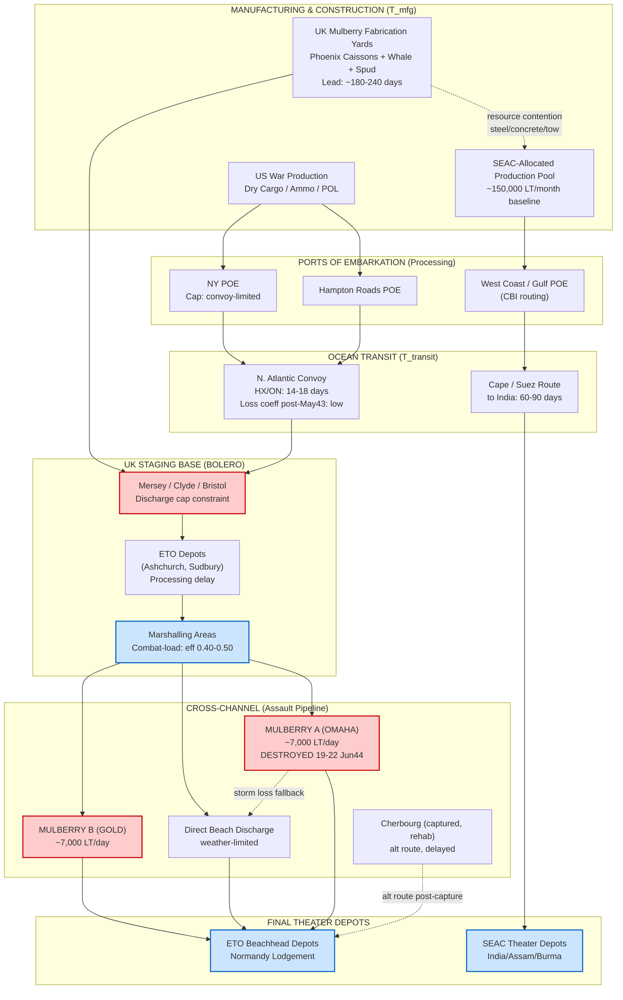

Cost: 0.333715

# CHAPTER 8: FIRST QUEBEC CONFERENCE (QUADRANT)
## Reference Manual & Simulation-Specification Document
### US Army Green Book — *Global Logistics and Strategy: 1943–1945*

**Document Classification:** Simulation Design Reference (Declassified Historical Analysis)
**Subsystem:** Strategic Pipeline Lead-Time Projection Engine
**Revision:** 8.3-QUADRANT

---

## 1. Strategic Context & Modern Historical Perspective

### 1.1 The QUADRANT Setting

The First Quebec Conference (codename QUADRANT), convened 17–24 August 1943 at the Citadelle and Château Frontenac, occurred at a hinge point in the Anglo-American war effort. The Casablanca Conference (January 1943, SYMBOL) had committed the Allies to a Mediterranean-first exploitation and a Combined Bomber Offensive, while deferring the cross-Channel decision. The Washington Conference (May 1943, TRIDENT) had for the first time pinned a nominal date—1 May 1944—to the invasion of Northwest Europe and allocated a notional troop lift of twenty-nine divisions. QUADRANT was the conference at which the abstraction of TRIDENT collided with the physical arithmetic of tonnage, and at which the COSSAC (Chief of Staff to the Supreme Allied Commander, Designate) outline plan for OVERLORD was formally endorsed by the Combined Chiefs of Staff (CCS).

The essential analytical truth of QUADRANT, visible with the benefit of post-war shipping-pool declassifications, is that the conference was less a strategic debate than a *feasibility audit*. The strategists had already agreed in principle; QUADRANT was where the logisticians demonstrated, quantitatively, that the agreed strategy could not be executed on the assumed lift and demanded either additional resources, deferred target dates, or engineering innovation. All three concessions were, in fact, extracted.

### 1.2 The Strategic Paradox

The central paradox of mid-1943 Allied planning was the divergence between *strategic decision velocity* and *material response latency*. The CCS could decide upon a course of action in a single afternoon of plenary session; the resulting resource pipeline—shipping construction, combat-loading, transatlantic transit, port discharge, inland clearance, depot buildup—operated on lead times of six to eighteen months. A decision taken at QUADRANT in August 1943 to reinforce the OVERLORD buildup could not materially alter theater stocks until well into 1944.

This latency asymmetry was structurally aggravated by three physical constraints:

**(a) The finite global shipping pool.** By mid-1943 the U-boat menace had been broken (the "Black May" of May 1943 saw a decisive kill-ratio inversion), and Liberty-ship construction at the Kaiser and other yards was outpacing losses. Yet the *net available deadweight* remained the binding constraint on every theater simultaneously. A ton committed to the SEAC baseline was a ton unavailable to the OVERLORD buildup or the Pacific advance. QUADRANT was, at its logistical core, a contest over the *marginal allocation* of a shipping pool that, while growing, could not satisfy the sum of theater demands.

**(b) Combat-loading inefficiency.** Combat-loaded (assault-configured) shipping carried far less cargo per hull than administratively-loaded shipping—often 40–50% of nominal deadweight—because stowage was dictated by tactical unloading sequence rather than volumetric efficiency. Every assault operation therefore consumed shipping capacity at a multiple of its tonnage footprint. OVERLORD, as the largest amphibious undertaking ever contemplated, threatened to sequester an enormous fraction of the assault-lift pool.

**(c) Port clearance rates.** The decisive constraint QUADRANT confronted was not getting cargo *across* the Atlantic but discharging it and clearing it inland at the far shore. The great ports of Northwest Europe (Cherbourg, Le Havre, Antwerp) were expected to be demolished, mined, and blocked by the retreating Germans. Without functioning ports, the entire strategic edifice of OVERLORD was a logistical impossibility: an army can be landed across beaches but cannot be *sustained* across them beyond the first weeks without either captured ports or artificial ones.

### 1.3 Inter-Service and Coalition Tensions

QUADRANT crystallized several enduring frictions. The first was the Anglo-American strategic axis: the British, represented by Brooke and the Chiefs of Staff Committee, retained a residual preference for Mediterranean exploitation (Italy, the Aegean, the Balkans) and viewed OVERLORD with well-remembered anxiety over the casualty arithmetic of frontal assault against a prepared continental enemy. The Americans, led by Marshall and increasingly institutionalized in the person of the still-unnamed Supreme Commander, demanded an ironclad commitment to the cross-Channel priority. QUADRANT's compromise—OVERLORD confirmed as the primary 1944 effort, with a continued but subordinated Mediterranean campaign—was as much a logistical allocation ruling as a strategic one, because it governed the disposition of landing craft (the true scarce currency of 1943–44).

The second friction was the Services of Supply (SOS, later ASF under Somervell) versus the combat commands and the theater staffs. SOS insisted, with statistical justification, on realistic buildup curves and honest port-capacity assumptions; combat planners tended toward optimistic assault troop-lists that outran the sustainment pipeline. The Mulberry decision (below) was in large part SOS/engineer logic imposed upon operational optimism.

The third friction was the entire CBI (China-Burma-India) theater, a coalition pathology in miniature. The Sino-American-British relationship there was defined by mutually incompatible objectives: the British sought to recover imperial Burma and Malaya; the Americans (through Stilwell) sought to reopen a land route to China and keep China in the war as a base for the eventual bombing of Japan; Chiang Kai-shek sought Lend-Lease materiel while husbanding his forces against the internal Communist threat. QUADRANT's institutional answer was the creation of the Southeast Asia Command (SEAC) under Mountbatten.

### 1.4 Historical Era Context

At QUADRANT the CCS formally approved the COSSAC outline plan for OVERLORD—a three-division assault on the Bay of the Seine, with a target date carried forward from TRIDENT as **1 May 1944** (this date would slip to early June 1944 for tidal, lunar, and landing-craft reasons only at later conferences). QUADRANT converted OVERLORD from an aspiration into a resourced program with a governing plan and an accepted requirement for engineering innovation.

Simultaneously, QUADRANT established SEAC to impose command coherence on the CBI chaos, appointing Mountbatten as Supreme Allied Commander with Stilwell as his deputy—a dual-hatting arrangement that, while administratively awkward, at least produced a single Allied strategic authority for the theater and a baseline logistical allocation against which operations could be planned.

### 1.5 Modern Analytical Insights

The dominant modern insight, developed through the Green Book series and refined by subsequent scholarship (Ruppenthal's *Logistical Support of the Armies* foremost among them), is that QUADRANT's most consequential decision was not strategic but *engineering-logistical*: the acceptance that OVERLORD could not be sustained through captured ports in the required timeframe, and that **two artificial "Mulberry" harbors** would therefore have to be fabricated in Britain and towed across the Channel. This decision imposed an enormous, sudden claim on British and American engineering, steel, concrete, and towing-vessel resources—the Phoenix caissons, Bombardon breakwaters, Whale roadways, and Spud pierheads.

The systemic consequence, central to our simulation's lead-time model, is that the Mulberry program *lengthened the effective lead time of every competing theater's resource requests* by diverting scarce heavy-engineering and construction-shipping capacity into the ETO pipeline through the winter of 1943–44. In state-transition terms, QUADRANT introduced a large, persistent negative coefficient on the manufacturing-and-construction throughput available to non-ETO theaters—precisely the kind of cross-coupling that a naïve independent-pipeline model fails to capture and that our simulator must represent explicitly.

---

## 2. High-Fidelity Simulation Parameters & Real-World Metrics

| Parameter | Value | Type in Sim | Historical Explanation & Strategic Rationale |
|---|---|---|---|
| **OVERLORD Target Date (approved)** | **1 May 1944** | Static constant (`TargetDate`) | Carried forward from TRIDENT and reaffirmed at QUADRANT as the governing D-Day objective. Represents the temporal deadline against which all ETO buildup curves are validated. In simulation, this is the terminal boundary condition for the ETO pipeline feasibility check; any pipeline whose cumulative lead time causes stock-adequacy to fall after this date triggers an infeasibility flag. (Historically slipped to 5–6 June 1944 by SEXTANT/later planning for tidal and craft reasons.) |
| **Mulberry Harbors Authorized** | **2** (Mulberry "A" — US, OMAHA; Mulberry "B" — British, GOLD/Arromanches) | Static constant → spawns two capacity nodes | Each harbor sized to discharge ~7,000 long tons/day. Represents the acceptance that beach-only sustainment was insufficient. In simulation, each authorized Mulberry becomes a dynamic capacity node with a construction-completion lead time and a discharge-capacity cap that comes online only after tow-and-emplacement transit. |
| **Mulberry Discharge Design Capacity (each)** | **≈7,000 long tons/day** | Dynamic capacity cap | Design goal per harbor; governs far-shore port-clearance throughput once emplaced. Mulberry A was destroyed in the Great Storm of 19–22 June 1944; model as a stochastic availability coefficient. |
| **SEAC Initial Supply Baseline** | **≈150,000 long tons/month** (initial allocated shipping baseline for the reorganized theater) | Dynamic capacity cap (monthly) | The tonnage floor allocated to sustain the new Southeast Asia Command upon its establishment. Represents the marginal shipping drawn against the global pool for CBI/SEAC reorganization. In simulation, a monthly replenishment cap constraining SEAC theater-stock accumulation. |
| **Liberty Ship Nominal Deadweight** | **10,500 long tons** (≈10,865 DWT) | Static constant | The standard unit of the transatlantic dry-cargo pipeline; the quantum of shipping allocation. |
| **Combat-Loading Efficiency** | **0.40–0.50** | Efficiency coefficient | Fraction of nominal deadweight actually delivered as usable cargo under assault loading; applied as a multiplier on assault-lift hulls. |
| **Transatlantic Convoy Transit (NY→UK)** | **≈14–18 days** | Transit-delay distribution | Governs the `T_transit` term for the ETO dry-cargo pipeline (fast HX/ON convoys). |
| **Phoenix Caisson Count (both Mulberries)** | **≈146–212 units** | Construction-work quantum | Concrete caissons forming the main breakwaters; each a discrete manufacturing task competing for concrete/steel. |
| **Mulberry Tow Transit (UK→Normandy)** | **≈3–4 days per component tow** | Transit delay | Emplacement lead time; part of the harbor "come-online" delay after D-Day. |
| **Port Discharge Rate (developed port, e.g. Cherbourg design)** | **≈8,000–12,000 tons/day (post-rehab)** | Dynamic capacity cap | Reference for alternative-routing once real ports captured and rehabilitated. |

---

## 3. Logistical Network Topology (Mermaid.js Flowchart)



The dotted contention edge from `MULBFAB` to `SEACPROD` encodes the QUADRANT insight of §1.5: Mulberry fabrication draws down the engineering/construction pool that would otherwise feed competing theaters, lengthening their effective lead times.

---

## 4. Mathematical Modeling & Simulation Formulas

### 4.1 Core Lead-Time Decomposition

The fundamental temporal model of the pipeline is the additive decomposition:

$$
L_{total} = T_{mfg} + T_{transit} + T_{processing}
$$

where $L_{total}$ (days) is the total lead time from resource authorization to theater-depot availability, $T_{mfg}$ is the manufacturing/construction delay, $T_{transit}$ is ocean/tow transit, and $T_{processing}$ is combined POE, port-discharge, and depot-processing delay.

### 4.2 Cross-Theater Contention Coefficient

QUADRANT's insight requires that the manufacturing delay for a non-ETO theater $j$ be inflated by contention from the Mulberry program:

$$
T_{mfg}^{(j)} = T_{mfg,0}^{(j)} \cdot \left(1 + \kappa \cdot \frac{D_{mulberry}}{C_{eng}}\right)
$$

where $T_{mfg,0}^{(j)}$ is the baseline manufacturing delay absent contention, $D_{mulberry}$ is the engineering-capacity demand of the Mulberry program (work-units), $C_{eng}$ is total available engineering capacity, and $\kappa \in [0,1]$ is the contention-sensitivity coefficient.

### 4.3 Theater Stock-Adequacy Feasibility

Define theater cumulative stock at day $t$:

$$
S(t) = S_0 + \sum_{\tau=0}^{t} \Big( r_{in}(\tau - L_{total}) - c(\tau) \Big)
$$

where $r_{in}(\cdot)$ is the arrival rate (lagged by total lead time) and $c(\tau)$ is the consumption rate. The **feasibility constraint** for OVERLORD is:

$$
S(t) \geq S_{min} \quad \forall\, t \in [t_{D}, t_{D}+\Delta]
$$

evaluated across the buildup window beginning at D-Day $t_D$ (governed by the 1 May 1944 target).

### 4.4 Far-Shore Discharge Capacity

Total far-shore throughput with stochastic Mulberry availability:

$$
Q_{shore}(t) = \sum_{h \in \{A,B\}} a_h(t)\, q_h + q_{beach}(t) + q_{cherb}(t)
$$

subject to the assault-loading transformation on inbound tonnage:

$$
Q_{arrive}(t) = \eta_{load} \cdot \sum_{k} n_k(t)\, w_k, \qquad \eta_{load} \in [0.40, 0.50]
$$

where $a_h(t) \in \{0,1\}$ is harbor $h$'s availability (Mulberry A $\to 0$ after the 19 June storm), $q_h$ the design discharge cap (~7,000 LT/day), $n_k$ the count of hulls of class $k$, and $w_k$ nominal deadweight.

### 4.5 Optimization Statement

The allocation problem QUADRANT implicitly solved:

$$
\min_{x} \sum_{j \in \text{theaters}} \max\!\big(0,\ S_{min}^{(j)} - S^{(j)}(t; x)\big)
$$

subject to
$$
\sum_j x_j \leq P_{ship}, \qquad x_j \geq 0, \qquad L_{total}^{(j)} = f(x_j)
$$

where $x_j$ is shipping tonnage allocated to theater $j$ and $P_{ship}$ is the global shipping pool—minimizing total unmet-demand across theaters under a shared shipping budget.

---

## 5. Compile-Safe Scala 3.8.3 Domain Model

```scala
package Logistics.Quadrant

import scala.collection.immutable.Vector
import scala.math.max

opaque type Days = Int
object Days:
  def apply(value: Int): Days = value
  extension (d: Days)
    def toInt: Int = d
    def +(other: Days): Days = Days(d + other)

opaque type Tons = Double
object Tons:
  def apply(value: Double): Tons = value
  extension (t: Tons)
    def toDouble: Double = t
    def +(other: Tons): Tons = Tons(t + other)
    def -(other: Tons): Tons = Tons(t - other)
    def *(f: Double): Tons = Tons(t * f)

opaque type NauticalMiles = Double
object NauticalMiles:
  def apply(value: Double): NauticalMiles = value
  extension (n: NauticalMiles) def toDouble: Double = n

opaque type WorkUnits = Double
object WorkUnits:
  def apply(value: Double): WorkUnits = value
  extension (w: WorkUnits) def toDouble: Double = w

case class PipelineStages(mfg: Days, transit: Days, processing: Days)

object PipelineLeadTime:
  def totalLeadTime(stages: PipelineStages): Days =
    Days(stages.mfg.toInt + stages.transit.toInt + stages.processing.toInt)

enum Theater:
  case ETO
  case SEAC
  case Pacific

enum HarborState:
  case UnderConstruction
  case Operational
  case StormDamaged
  case Destroyed

enum HullClass(val nominalDeadweight: Tons):
  case Liberty      extends HullClass(Tons(10500.0))
  case Victory      extends HullClass(Tons(10800.0))
  case LST          extends HullClass(Tons(2100.0))

sealed trait SupplyNode:
  def id: String
  def dailyCapacityLT: Tons

final case class MulberryHarbor(
    id: String,
    designCapacityLT: Tons,
    state: HarborState,
    emplacementDelay: Days
) extends SupplyNode:
  def dailyCapacityLT: Tons =
    state match
      case HarborState.Operational       => designCapacityLT
      case HarborState.StormDamaged       => designCapacityLT * 0.35
      case HarborState.UnderConstruction  => Tons(0.0)
      case HarborState.Destroyed          => Tons(0.0)

final case class BeachDischarge(
    id: String,
    fairWeatherCapLT: Tons,
    weatherFactor: Double
) extends SupplyNode:
  def dailyCapacityLT: Tons =
    fairWeatherCapLT * max(0.0, math.min(1.0, weatherFactor))

final case class RealPort(
    id: String,
    rehabbedCapLT: Tons,
    online: Boolean
) extends SupplyNode:
  def dailyCapacityLT: Tons =
    if online then rehabbedCapLT else Tons(0.0)

object QuadrantConstants:
  val overlordTargetDayOffset: Int = 0
  val mulberriesAuthorized: Int = 2
  val mulberryDesignCapacityLT: Tons = Tons(7000.0)
  val seacBaselineMonthlyLT: Tons = Tons(150000.0)
  val libertyDeadweightLT: Tons = Tons(10500.0)
  val combatLoadEfficiencyLow: Double = 0.40
  val combatLoadEfficiencyHigh: Double = 0.50
  val transatlanticTransitDays: Days = Days(16)
  val capeSuezTransitDays: Days = Days(75)
  val mulberryTowTransitDays: Days = Days(4)
  val mulberryFabricationDays: Days = Days(210)

object CombatLoading:
  def deliveredTonnage(
      hulls: Vector[(HullClass, Int)],
      efficiency: Double
  ): Tons =
    val clamped: Double = max(0.40, math.min(0.50, efficiency))
    val gross: Double =
      hulls.foldLeft(0.0): (acc, entry) =>
        val (cls, count) = entry
        acc + cls.nominalDeadweight.toDouble * count.toDouble
    Tons(gross * clamped)

object ContentionModel:
  def inflatedMfg(
      baselineMfg: Days,
      mulberryDemand: WorkUnits,
      engineeringCapacity: WorkUnits,
      kappa: Double
  ): Days =
    val ratio: Double =
      if engineeringCapacity.toDouble <= 0.0 then 0.0
      else mulberryDemand.toDouble / engineeringCapacity.toDouble
    val factor: Double = 1.0 + max(0.0, math.min(1.0, kappa)) * ratio
    Days((baselineMfg.toInt.toDouble * factor).round.toInt)

final case class TheaterStockState(
    theater: Theater,
    initialStockLT: Tons,
    minRequiredLT: Tons
)

object StockAdequacy:
  def project(
      state: TheaterStockState,
      arrivalsLagged: Vector[Tons],
      consumption: Vector[Tons],
      leadTime: Days
  ): Vector[Tons] =
    val horizon: Int = math.max(arrivalsLagged.length, consumption.length)
    val lag: Int = leadTime.toInt
    val builder = Vector.newBuilder[Tons]
    var running: Double = state.initialStockLT.toDouble
    var t: Int = 0
    while t < horizon do
      val srcIdx: Int = t - lag
      val inbound: Double =
        if srcIdx >= 0 && srcIdx < arrivalsLagged.length then
          arrivalsLagged(srcIdx).toDouble
        else 0.0
      val outbound: Double =
        if t < consumption.length then consumption(t).toDouble else 0.0
      running = running + inbound - outbound
      builder += Tons(running)
      t += 1
    builder.result()

  def isFeasible(
      state: TheaterStockState,
      projected: Vector[Tons],
      windowStart: Int,
      windowEnd: Int
  ): Boolean =
    val lo: Int = math.max(0, windowStart)
    val hi: Int = math.min(projected.length - 1, windowEnd)
    if lo > hi then false
    else
      var ok: Boolean = true
      var i: Int = lo
      while i <= hi && ok do
        if projected(i).toDouble < state.minRequiredLT.toDouble then ok = false
        i += 1
      ok

object FarShoreThroughput:
  def totalDaily(nodes: Vector[SupplyNode]): Tons =
    val sum: Double =
      nodes.foldLeft(0.0): (acc, n) =>
        acc + n.dailyCapacityLT.toDouble
    Tons(sum)

object AllocationOptimizer:
  final case class Allocation(theater: Theater, tonnage: Tons)

  def unmetDemandPenalty(
      minRequired: Tons,
      achievedStock: Tons
  ): Tons =
    Tons(max(0.0, minRequired.toDouble - achievedStock.toDouble))

  def totalPenalty(
      requirements: Vector[(Theater, Tons)],
      achieved: Vector[(Theater, Tons)]
  ): Tons =
    val lookup: Map[Theater, Double] =
      achieved.map((th, tn) => th -> tn.toDouble).toMap
    val sum: Double =
      requirements.foldLeft(0.0): (acc, entry) =>
        val (th, req) = entry
        val got: Double = lookup.getOrElse(th, 0.0)
        acc + max(0.0, req.toDouble - got)
    Tons(sum)

  def respectsPool(
      allocations: Vector[Allocation],
      poolLimit: Tons
  ): Boolean =
    val used: Double =
      allocations.foldLeft(0.0)((a, alloc) => a + alloc.tonnage.toDouble)
    used <= poolLimit.toDouble && allocations.forall(_.tonnage.toDouble >= 0.0)

object QuadrantSimulation:
  def buildFarShoreNodes(): Vector[SupplyNode] =
    Vector(
      MulberryHarbor(
        id = "Mulberry-A-OMAHA",
        designCapacityLT = QuadrantConstants.mulberryDesignCapacityLT,
        state = HarborState.Destroyed,
        emplacementDelay = QuadrantConstants.mulberryTowTransitDays
      ),
      MulberryHarbor(
        id = "Mulberry-B-GOLD",
        designCapacityLT = QuadrantConstants.mulberryDesignCapacityLT,
        state = HarborState.Operational,
        emplacementDelay = QuadrantConstants.mulberryTowTransitDays
      ),
      BeachDischarge(
        id = "OMAHA-Beach",
        fairWeatherCapLT = Tons(5000.0),
        weatherFactor = 0.60
      ),
      RealPort(
        id = "Cherbourg",
        rehabbedCapLT = Tons(10000.0),
        online = false
      )
    )

  def etoPipelineLeadTime(kappa: Double): Days =
    val baselineMfg: Days = QuadrantConstants.mulberryFabricationDays
    val stages = PipelineStages(
      mfg = baselineMfg,
      transit = QuadrantConstants.transatlanticTransitDays,
      processing = Days(21)
    )
    PipelineLeadTime.totalLeadTime(stages)

  def seacInflatedLeadTime(kappa: Double): Days =
    val inflated: Days = ContentionModel.inflatedMfg(
      baselineMfg = Days(120),
      mulberryDemand = WorkUnits(4200.0),
      engineeringCapacity = WorkUnits(9000.0),
      kappa = kappa
    )
    val stages = PipelineStages(
      mfg = inflated,
      transit = QuadrantConstants.capeSuezTransitDays,
      processing = Days(30)
    )
    PipelineLeadTime.totalLeadTime(stages)

@main def runQuadrantDemo(): Unit =
  val etoLead: Days = QuadrantSimulation.etoPipelineLeadTime(0.6)
  val seacLead: Days = QuadrantSimulation.seacInflatedLeadTime(0.6)
  val farShore: Tons =
    FarShoreThroughput.totalDaily(QuadrantSimulation.buildFarShoreNodes())

  val etoState = TheaterStockState(
    theater = Theater.ETO,
    initialStockLT = Tons(50000.0),
    minRequiredLT = Tons(40000.0)
  )
  val arrivals: Vector[Tons] = Vector.fill(90)(Tons(6500.0))
  val consumption: Vector[Tons] = Vector.fill(90)(Tons(6000.0))
  val projected: Vector[Tons] =
    StockAdequacy.project(etoState, arrivals, consumption, etoLead)
  val feasible: Boolean =
    StockAdequacy.isFeasible(etoState, projected, 20, 89)

  println(s"ETO total lead time (days): ${etoLead.toInt}")
  println(s"SEAC inflated lead time (days): ${seacLead.toInt}")
  println(s"Far-shore daily throughput (LT): ${farShore.toDouble}")
  println(s"ETO stock feasibility over window: $feasible")
  println(s"Mulberries authorized: ${QuadrantConstants.mulberriesAuthorized}")
  println(s"SEAC monthly baseline (LT): ${QuadrantConstants.seacBaselineMonthlyLT.toDouble}")
```

---

## 6. Graduate-Level Operational Analysis

### 6.1 SEAC and the Resolution of Coalition Command Conflict

The creation of Southeast Asia Command at QUADRANT was an attempt to solve a *command-topology* problem masquerading as a strategic-priority problem. Prior to SEAC, the CBI theater possessed no single Allied operational authority: Stilwell simultaneously served as Chiang's chief of staff, as commander of U.S. forces in CBI, as deputy to the (nonexistent) supreme commander, and as administrator of Lend-Lease—an impossible concentration of conflicting principal-agent relationships. The command graph contained cycles (Stilwell answered to Chiang who answered, for materiel, to Stilwell) and orphan nodes (British Fourteenth Army operations lacked integration with American air and logistics efforts over the Hump).

SEAC imposed a directed acyclic command structure with Mountbatten as a single supreme node, Stilwell dual-hatted as deputy SAC while retaining his Chinese and American responsibilities. Analytically, this did not *eliminate* the conflicting objectives—British imperial-reconquest goals, American China-sustainment goals, and Chiang's force-preservation goals remained structurally incompatible—but it created a single arbitration point at which the tradeoffs could be adjudicated and, critically, a single logistical allocation authority. In the optimization framing of §4.5, SEAC converted an under-constrained, multi-principal allocation problem (with no consistent objective function) into a single-authority problem with a defined tonnage budget (the ~150,000 LT/month baseline). This is why the reorganization mattered logistically even though the underlying strategic frictions persisted: it made the theater's demands *legible and boundable* to the global shipping-pool allocator, so that CBI could no longer make open-ended, unarbitrated claims. The historical outcome—the eventual reopening of a land route to China via the Ledo Road and the Fourteenth Army's Burma reconquest—was enabled less by resolving the underlying coalition disagreement than by rationalizing the command graph so that a coherent, resource-bounded campaign plan could exist at all.

### 6.2 The Mulberry Decision: Logistical Necessity and Resource Allocation

The Mulberry decision flowed from an inescapable chain of logistical arithmetic. Sustaining a continental army requires port throughput on the order of thousands of long tons per division-slice per day; a 20+ division lodgement implies discharge requirements well in excess of 10,000–15,000 LT/day within weeks of landing. The Channel ports capable of such throughput (Cherbourg, Le Havre, Antwerp) were all certain to be captured only after delay and delivered in a demolished, mined, and blocked condition requiring months of rehabilitation. Beach discharge over open sand—the only alternative in the interim—was catastrophically weather-sensitive: a single Channel gale could halt it entirely, as the Great Storm of 19–22 June 1944 subsequently proved by destroying Mulberry A and suspending beach operations for days. The sustainment feasibility constraint of §4.3, evaluated over the critical buildup window immediately following the 1 May target, simply could not be satisfied by beaches-plus-eventual-ports; there was a throughput gap of several weeks' duration that would have starved the lodgement of ammunition, POL, and reinforcement at precisely the moment of maximum German counterattack pressure.

The engineering answer—two prefabricated artificial harbors, each designed for ~7,000 LT/day discharge—closed this gap by providing sheltered water and pierheads from roughly D+3 onward. The resource allocation, however, was immense and constitutes the QUADRANT lead-time insight modeled in §4.2. The Mulberries consumed enormous quantities of reinforced concrete (the Phoenix caissons, some displacing 6,000+ tons each), structural steel (the Whale roadway spans and Spud pierheads), and, critically, the entire class of ocean-going tugs required to tow the components across the Channel—the same towing capacity relevant to salvage and logistics elsewhere. British construction labor and dry-dock/casting-basin capacity were saturated through the winter of 1943–44. In simulation terms, this is the negative coefficient the contention model applies: the Mulberry program inflated the effective manufacturing lead time for competing claimants on the heavy-construction pool, quantitatively lengthening the pipeline for lower-priority theaters. The strategic lesson, and the reason QUADRANT is a pivotal node in the Green Book's logistical narrative, is that the Allies chose to solve an operational throughput constraint by importing an entire artificial industrial artifact into the theater—accepting a large, concentrated, cross-coupled resource claim rather than accepting the infeasibility of the invasion timetable. It was, in the end, the correct optimization: the surviving Mulberry B at Arromanches discharged some 2.5 million tons over its operational life, and the concept validated the principle that in modern expeditionary logistics, the port itself can be treated as a deployable, manufactured resource rather than a fixed geographic given.
