Cost: 0.44468125

### 1. Strategic Context & Modern Historical Perspective

The First Quebec Conference, code-named **QUADRANT**, met from 17 to 24 August 1943 at a point when the Anglo-American coalition had accumulated decisive industrial superiority but had not yet converted that superiority into a settled, physically executable strategy for defeating Germany and Japan. Its significance lay less in the invention of new strategic concepts than in the transformation of previously conditional plans into resource-governed commitments. The Combined Chiefs of Staff approved the COSSAC outline plan for **OVERLORD**, assigned it a target date of **1 May 1944**, endorsed construction of artificial harbors, and reorganized the India-Burma command structure through establishment of the **Southeast Asia Command**, or SEAC. These decisions imposed long-lead-time claims on shipping, landing craft, construction steel, concrete, locomotives, port equipment, petroleum systems, and trained service troops.

QUADRANT must therefore be understood as a conference about opportunity costs. A decision to support one operation was also a decision to defer, reduce, or expose another. Allied strategy could produce more approved operations than the global logistics system could execute simultaneously.

#### The strategic paradox

By August 1943, Allied strategic planning was dominated by a paradox: the coalition possessed enormous aggregate resources, but those resources were not necessarily available in the correct form, location, or time window. American factories could produce millions of tons of matériel, but factory output did not itself constitute combat power. Equipment had to be completed, inspected, packed, moved by rail to a port of embarkation, stored, documented, loaded aboard an appropriate vessel, convoyed through submarine-threatened waters, discharged at a destination port, sorted, and transported forward. Specialized matériel—landing craft, amphibious trucks, engineer bridging, harbor components, tank landing ships, refrigerated cargo space, petroleum tankers, and combat-loaded assault shipping—was much scarcer than undifferentiated dry-cargo tonnage.

This distinction is indispensable in a logistics simulator. One million tons of nominal shipping capacity cannot be treated as one million fungible tons. A Liberty ship loaded administratively for economical port discharge was not a substitute for an LST required to place armor directly on a beach. A tanker could not carry packaged ammunition without conversion. A vessel committed to the Indian Ocean incurred a much longer round-trip cycle than one operating between Britain and the eastern United States. A ship might consequently produce several North Atlantic lift cycles in the time required for one voyage to India.

The strategic sequence from **Casablanca** through **TRIDENT**, **QUADRANT**, and **SEXTANT** reveals progressively tighter coupling between strategy and transport physics. Casablanca preserved competing Mediterranean and cross-Channel possibilities. TRIDENT reaffirmed the principle of a 1944 return to northwestern Europe. QUADRANT converted this intention into a dated operation and an increasingly concrete resource pipeline. SEXTANT later had to reconcile the resulting European commitments with Pacific and Southeast Asian ambitions.

The target date of 1 May 1944 was not merely a calendar entry. It generated backward scheduling requirements. Assault divisions had to be concentrated and trained in Britain. Landing craft had to arrive early enough for maintenance, modification, and rehearsals. Depot stocks had to be assembled before the final embarkation surge congested British ports and railways. Airfield construction, petroleum storage, hospital capacity, replacement pools, and railway equipment had to mature before the invasion. When final assault planning expanded from the COSSAC concept’s three-division initial landing to a broader five-division frontage, the landing-craft deficit became still more acute. The operational date eventually moved to June 1944, with the assault executed on 6 June, but QUADRANT established the resource commitment around which this later adjustment occurred.

The same physics constrained Southeast Asia. Shipping to India faced long routes around the Cape of Good Hope or through vulnerable and capacity-limited intermediate systems. Cargo arriving at Bombay, Karachi, or Calcutta still had to cross the Indian subcontinent. Bengal’s railway and river systems then fed Assam, where transshipment, meter-gauge and broad-gauge incompatibilities, locomotive scarcity, seasonal flooding, and terminal congestion constrained movement toward the Burma frontier. Air supply over the Hump was an expensive terminal link, not a substitute for an adequate surface base. Every ton delivered to China by air required substantially more than one ton of upstream fuel, spares, construction equipment, and operating support.

#### Port clearance rather than ocean lift alone

Modern logistics scholarship has emphasized that vessel availability was only one part of the constraint. A port is a coupled queuing system. Its effective capacity is the minimum of anchorage availability, berth capacity, crane and lighter productivity, labor supply, storage space, documentation rate, and inland clearance. Raising the arrival rate above that minimum does not raise throughput; it raises the number of ships waiting in harbor and the amount of cargo immobilized in transit.

This principle applied to Britain, India, North Africa, and prospective continental lodgments. Britain possessed mature ports and railways, but the BOLERO concentration placed extraordinary demands on them. Cargo had to be assigned to depots in a manner consistent with the invasion plan. Poorly sequenced arrivals could bury urgently required matériel beneath lower-priority cargo. Vehicles consumed extensive covered and open storage. Ammunition required dispersed depots and safety separation. Petroleum required specialized terminals and pipelines.

The invasion beaches presented a more severe problem. The Allies could capture or damage a Channel port, but they could not assume that a major port would be usable immediately. German demolition plans, blocked channels, destroyed cranes, mined approaches, and the predictable defense of Cherbourg and Le Havre made reliance on early port capture operationally dangerous. The COSSAC plan therefore required substantial over-the-beach sustainment and proposed prefabricated artificial harbors. QUADRANT’s approval of two artificial harbors recognized that the continental discharge system had to be partly manufactured before the invasion.

#### Mulberry as a strategic industrial project

The Mulberry decision is sometimes treated as an ingenious engineering footnote. In logistical terms, it was a strategic transfer of port capacity from geography into industrial production. Breakwaters, caissons, pierheads, floating roadways, tugs, moorings, and specialized installation craft had to be designed and manufactured in Britain under secrecy and severe competition for steel, cement, fabrication yards, towing capacity, and skilled labor.

The authorization covered **two artificial harbors**, later associated with the American Omaha sector and the British Gold sector. Their operational realization required large Phoenix concrete caissons, Bombardon floating breakwaters, Gooseberry blockship shelters, Lobnitz pierheads, and Whale floating roadways supported by Beetle pontoons. Later construction totals are not identical to the resources explicitly itemized at QUADRANT, because design and production evolved after the conference. Broadly, the program consumed hundreds of thousands of tons of concrete and steel, roughly 200 major concrete caissons, about ten miles of floating roadway, numerous pier and breakwater units, and the labor of tens of thousands of workers. A simulator should distinguish the August 1943 authorization from later bill-of-material and completion states.

The storms of 19–22 June 1944 destroyed the American Mulberry A as a functioning harbor and damaged the British Mulberry B at Arromanches. This did not invalidate the strategic reasoning. Open-beach discharge, Rhino ferries, DUKWs, LCTs, and the surviving British harbor together sustained the lodgment while Cherbourg was captured, repaired, and cleared. The episode does show that engineered capacity is probabilistic: weather, towing losses, assembly delays, and design differences can sharply reduce realized throughput below nominal capacity.

#### Inter-service and coalition tensions

QUADRANT also exposed institutional conflict over who controlled the logistics system. Within the United States Army, operational commands naturally sought priority delivery of complete combat formations and theater reserves. The Army Service Forces—formerly the Services of Supply—had to account for global shipping, procurement lead times, depot congestion, and the large service structure without which divisions could not fight. Combat commanders often interpreted delayed requisitions as bureaucratic obstruction; logisticians saw many theater demands as unphased, duplicative, or disconnected from port and shipping capacity.

Army-Navy tensions were especially pronounced in amphibious planning. The Navy controlled most amphibious shipping and many landing craft, while Army ground plans determined the scale of the assault lift required. Landing craft were simultaneously demanded for OVERLORD, Mediterranean operations, the Southwest Pacific, the Central Pacific, and proposed operations in Southeast Asia. Production totals could mislead because craft still required ocean delivery, conversion, crews, maintenance, and theater-specific preparation. A landing craft nominally completed in the United States was not an available assault unit in Britain.

Anglo-American shipping arrangements created a second layer of friction. Merchant shipping was pooled through combined machinery, but British and American planners did not always calculate availability on identical assumptions. Disputes could turn on turnaround time, repair allowance, import requirements, convoy restrictions, or whether a vessel was counted by deadweight capacity, cargo carried, or number of sailings. Britain also had to maintain essential civilian imports and imperial routes. American planners tended to emphasize concentration against Germany; British planners assigned greater value to Mediterranean opportunities and imperial communications.

These tensions did not mean that combined machinery failed. On the contrary, the Combined Shipping Adjustment machinery and the Combined Chiefs made coalition strategy possible. But allocation remained a bargaining process in which apparently technical assumptions had strategic consequences.

#### Creation of SEAC

The Southeast Asia Command addressed a different form of fragmentation. Before QUADRANT, operations in the China-Burma-India region crossed incompatible political and command systems. General Joseph Stilwell was simultaneously an American theater figure, Chiang Kai-shek’s chief of staff, commander of Chinese forces in India, and an advocate for reopening the land route to China. Chiang retained sovereign control over Chinese forces and could reject operational proposals. British authorities in India controlled most of the regional base, ground forces, ports, and railways, while the Royal Air Force, Royal Navy, India Command, and civil administrations possessed distinct responsibilities. American air transport and strategic support for China added further chains of command.

SEAC, under Admiral Lord Louis Mountbatten, was intended to supply a supreme theater-level coordinating authority for operations in Southeast Asia. It did not eliminate all political or jurisdictional divisions. China remained a sovereign ally rather than a subordinate theater component; Stilwell’s authority still depended on Chiang’s cooperation; and India Command retained important administrative responsibilities. Nevertheless, SEAC created a headquarters capable of producing an integrated operational plan, prioritizing resources among land, air, and naval components, and presenting consolidated requirements to the Combined Chiefs.

The simulator should therefore model SEAC not as an automatic multiplier to physical capacity but as a reduction in coordination loss: fewer incompatible requisitions, more coherent priorities, and improved synchronization among transport modes. Its effect should be gradual and conditional on political cooperation.

#### Modern assessment

Postwar records reinforce three conclusions. First, QUADRANT’s central achievement was commitment: OVERLORD became the governing European operation rather than one possibility among several. Second, its decisions revealed that time was itself a logistical resource. A late allocation of specialized equipment could not be corrected merely by assigning additional generic tonnage. Third, the coalition’s greatest logistical strength was not unlimited abundance but its ability to build new capacity—ships, depots, pipelines, artificial harbors, airfields, roads, and command systems—while continuously reallocating scarce transport among theaters.

For simulation purposes, the critical state variable is therefore not “resources allocated” but **resources physically available at the required node, in the required configuration, before the operational deadline**.

---

### 2. High-Fidelity Simulation Parameters & Real-World Metrics

> **Source-normalization warning:** QUADRANT records use several non-equivalent measures: long tons of cargo, measurement tons, ship deadweight, sailings, and monthly dispatch programs. The SEAC value below represents the initial American cargo-shipping floor to India associated with the new theater program; it is not the total import capacity of India or the entire British-American SEAC flow.

| Parameter ID | Historical value | Unit and scope | Historical explanation and strategic rationale | Recommended simulation representation |
|---|---:|---|---|---|
| `OVERLORD_TARGET_DATE_QUADRANT` | **1 May 1944** | Calendar date | The Combined Chiefs approved the COSSAC outline plan on the basis of a target date of 1 May 1944. This date drove backward scheduling for BOLERO concentration, landing-craft delivery, unit training, stock accumulation, airfield preparation, and assault loading. It was a planning target, not the final execution date. OVERLORD was executed on 6 June 1944. | Immutable conference-decision constant. Permit later state transitions to `Deferred` or `Rescheduled`; never overwrite the original decision record. |
| `MULBERRY_HARBORS_AUTHORIZED` | **2** | Complete artificial harbor systems | QUADRANT approved provision of two prefabricated harbors to reduce dependence on the immediate capture and restoration of a major French port. They became Mulberry A off Omaha and Mulberry B at Arromanches/Gold. | Integer project count with separate project entities. Each harbor should have design, fabrication, towing, installation, weather-damage, repair, and operating-capacity states. |
| `SEAC_US_CARGO_BASELINE` | **100,000 long tons per month** | Initial U.S.-origin monthly cargo floor to India; exclude interpretation as total Indian import capacity | The conference-era Southeast Asia program rested on an American commitment commonly expressed as a minimum monthly cargo movement to India. It provided a baseline for U.S. forces, air operations, Chinese forces in India, communications-zone development, and support to the China pipeline. British-controlled and locally sourced flows were additional and should not be collapsed into this figure. | Monthly dispatch floor subject to vessel availability, voyage cycle, port reception, and inland clearance. Store as a policy target and separately calculate achieved discharge and clearance. |
| `LONG_TON_KG` | **1,016.0469088** | kg per long ton | Required for reconciling British and American archival tonnage with metric internal calculations. | Immutable unit-conversion constant. |
| `OVERLORD_ACTUAL_D_DATE` | **6 June 1944** | Calendar date | The actual assault date followed expansion of the plan, landing-craft reconciliation, preparation, and final weather selection. | Historical event constant; use to validate scenario outputs, not as an optimization constraint in counterfactual runs. |
| `COSSAC_INITIAL_ASSAULT_FRONTAGE` | **3 divisions** | Initial assault divisions in the outline plan | The COSSAC plan initially envisioned three divisions landing in the first assault, with two follow-up divisions. The later expansion to five assault divisions significantly increased lift, beach, and command requirements. | Scenario parameter affecting assault lift, beach capacity demand, and follow-up flow. |
| `COSSAC_IMMEDIATE_FOLLOW_UP` | **2 divisions** | Follow-up formations | These formations required near-term lift but did not all use identical combat-loading arrangements. | Time-phased demand after the first assault wave. |
| `EXPANDED_OVERLORD_ASSAULT_FRONTAGE` | **5 divisions** | Assault divisions | Eisenhower and Montgomery’s later expansion generated additional landing-craft requirements and helped force rescheduling. | Dynamic plan revision; trigger recalculation of LST/LCT, beach exit, artillery, engineer, and naval-fire-support requirements. |
| `MULBERRY_MAJOR_PHOENIX_SCALE` | **approximately 200 major caissons** | Later production realization, not an exact QUADRANT allocation | The final program used roughly two hundred Phoenix caissons of several sizes. Counts vary by whether spare, incomplete, replacement, and later units are included. | Stochastic bill-of-material rather than conference constant. Use versioned design records. |
| `MULBERRY_FLOATING_ROADWAY_SCALE` | **approximately 10 miles** | Whale floating roadway system | The roadway network linked pierheads to shore while accommodating tide and wave movement. | Length-based construction resource with weather-dependent operating availability. |
| `NORTH_ATLANTIC_US_UK_TRANSIT` | **10–16 days at sea** | Typical convoy-dependent planning range | Actual passage varied with port pair, route, convoy assembly, speed, weather, and submarine avoidance. This excludes loading and discharge. | Probability distribution, not a fixed constant; recommended triangular distribution `(10, 13, 18)` days for ordinary planning scenarios. |
| `US_INDIA_TRANSIT` | **30–50 days at sea** | Typical route-dependent planning range | East Coast-to-India voyages were substantially longer than North Atlantic voyages and could involve convoy delays and intermediate calls. | Route-specific stochastic transit time; recommended triangular distribution `(30, 40, 55)` days before port waiting. |
| `PORT_UTILIZATION_CONGESTION_THRESHOLD` | **0.80** | Dimensionless modeling coefficient | This is a modern queuing-model calibration rather than a historical QUADRANT constant. Delays typically become nonlinear as berth or clearance utilization approaches unity. | Dynamic coefficient. Apply queue penalties above 80 percent utilization and severe instability above 95 percent. |
| `MULBERRY_WEATHER_DERATING` | **scenario-dependent** | Fraction of nominal capacity | June 1944 demonstrated that nominal engineered capacity could be sharply reduced by wave conditions and storm duration. | Random capacity multiplier linked to sea-state and cumulative damage. Mulberry A should be capable of transitioning to permanent loss. |
| `PORT_CLEARANCE_IDENTITY` | **min of discharge, storage, and inland evacuation capacity** | Long tons/day | Cargo is not operationally available merely because it has crossed the ship’s rail. Storage or inland clearance can become the controlling bottleneck. | Computed dynamic capacity cap at every port node. |

#### SEAC data qualification

The **100,000-long-ton monthly figure** should be encoded as a minimum U.S. dispatch program, not as a claim that SEAC as a whole received only that amount. Archival planning tables can show higher totals when they include British shipments, petroleum, civil imports, local procurement, cargo already afloat, or capacity objectives. A robust database should therefore include fields for:

- cargo origin;
- ownership or allocating authority;
- commodity class;
- dispatch month;
- arrival month;
- long tons versus measurement tons;
- petroleum inclusion;
- vessel deadweight;
- discharged tonnage;
- inland-cleared tonnage.

Without those dimensions, apparently conflicting historical totals cannot be reconciled.

---

### 3. Logistical Network Topology (Detailed Mermaid.js Flowchart)

```mermaid
flowchart LR
    subgraph CONUS["United States production and embarkation system"]
        RAW["Raw materials<br/>steel, cement, petroleum, explosives"]
        MFG["Factories and arsenals<br/>production lead time T_mfg"]
        MUL["Mulberry component production<br/>Phoenix, Whale, pierheads, moorings"]
        DEPOTUS["CONUS depots<br/>inspection, packing, allocation"]
        RAILUS{"Rail allocation and POE clearance<br/>capacity: tons/day"}
        NY["New York POE<br/>general cargo"]
        HR["Hampton Roads POE<br/>vehicles and general cargo"]
        GULF["Gulf and West Coast POEs<br/>India and Pacific alternatives"]
        RAW --> MFG
        RAW --> MUL
        MFG --> DEPOTUS
        MUL --> DEPOTUS
        DEPOTUS --> RAILUS
        RAILUS -->|Atlantic allocation| NY
        RAILUS -->|Atlantic allocation| HR
        RAILUS -->|SEAC or Pacific allocation| GULF
    end

    subgraph OCEAN["Combined shipping pool and convoy system"]
        ATLQ{"North Atlantic convoy queue<br/>escort and sailing limits"}
        INDQ{"Indian Ocean route queue<br/>long vessel-cycle time"}
        DIVERT{"Strategic allocation decision<br/>ETO vs MTO vs SEAC vs Pacific"}
        NY --> ATLQ
        HR --> ATLQ
        GULF --> INDQ
        DIVERT -. changes monthly vessel assignment .-> ATLQ
        DIVERT -. changes monthly vessel assignment .-> INDQ
    end

    subgraph UK["United Kingdom BOLERO concentration"]
        UKPORT{"UK reception ports<br/>berth and crane limits"}
        UKSTORE{"Port transit sheds and storage<br/>congestion queue"}
        UKRAIL{"British rail clearance<br/>locomotive and path limits"}
        ETODEP["ETO depots<br/>ammunition, vehicles, engineer stores"]
        POLUK["Bulk petroleum terminals<br/>tank storage and pipelines"]
        MARSHAL["Division marshalling areas<br/>unit-equipment reconciliation"]
        ASSAULTLOAD["Assault and combat loading ports<br/>LST, LCT, APA and coaster limits"]
        MULSTAGE["Mulberry assembly and south-coast staging<br/>tug and weather constraints"]

        ATLQ -->|10-18 days plus convoy waiting| UKPORT
        UKPORT -->|dry cargo| UKSTORE
        UKPORT -->|bulk POL| POLUK
        UKSTORE --> UKRAIL
        UKRAIL --> ETODEP
        ETODEP --> MARSHAL
        MARSHAL --> ASSAULTLOAD
        UKPORT -->|oversize harbor components| MULSTAGE
        ETODEP -->|engineer stores and spares| MULSTAGE
    end

    subgraph CHANNEL["Cross-Channel assault and sustainment"]
        CHANQ{"Channel lift scheduler<br/>landing craft, tide and weather"}
        BEACHO["Omaha beach node<br/>DUKW, Rhino ferry and beach exits"]
        BEACHG["Gold and Arromanches node<br/>beach and harbor discharge"]
        MULA["Mulberry A<br/>installed capacity; storm-loss risk"]
        MULB["Mulberry B<br/>installed capacity; repairable damage"]
        CHER["Cherbourg port<br/>capture, demolition and rehabilitation"]
        CONTDEP["Continental depots<br/>army and corps supply points"]
        DIVETO["ETO combat divisions<br/>daily class I, III and V demand"]

        ASSAULTLOAD --> CHANQ
        MULSTAGE --> CHANQ
        CHANQ -->|assault waves| BEACHO
        CHANQ -->|assault waves| BEACHG
        CHANQ -->|tow and install| MULA
        CHANQ -->|tow and install| MULB
        MULA --> BEACHO
        MULB --> BEACHG
        BEACHO --> CONTDEP
        BEACHG --> CONTDEP
        CHER -->|after repair and clearance| CONTDEP
        CONTDEP --> DIVETO
    end

    subgraph INDIA["SEAC reception and Indian base"]
        BOM["Bombay port<br/>berth, labor and storage limits"]
        KAR["Karachi port<br/>long inland route"]
        CAL["Calcutta port<br/>river, lighter and congestion limits"]
        INSTORE["Indian base depots<br/>sorting and theater allocation"]
        RAILIN{"Indian railway network<br/>gauge, locomotive and wagon limits"}
        ASSAM["Assam terminals<br/>Ledo and air-base depots"]
        LEDO["Ledo Road pipeline<br/>construction and seasonal limits"]
        HUMP["Hump air transport<br/>aircraft, fuel, weather and payload"]
        BURMA["Burma combat nodes<br/>Fourteenth Army and Chinese forces"]
        CHINA["China reception nodes<br/>Kunming and Chinese armies"]

        INDQ -->|30-55 days plus waiting| BOM
        INDQ -->|alternative discharge| KAR
        INDQ -->|Bay of Bengal route| CAL
        BOM --> INSTORE
        KAR --> INSTORE
        CAL --> INSTORE
        INSTORE --> RAILIN
        RAILIN -->|rail and river clearance| ASSAM
        ASSAM --> LEDO
        ASSAM --> HUMP
        LEDO -->|surface movement| BURMA
        LEDO -->|after route opening| CHINA
        HUMP -->|low-volume high-cost lift| CHINA
        BURMA -->|operational advance changes route access| CHINA
    end

    subgraph CONTROL["Strategic and command-control layer"]
        CCS["Combined Chiefs of Staff"]
        COSSAC["COSSAC and later SHAEF planning"]
        ASF["Army Service Forces<br/>procurement and shipping forecasts"]
        COMSHIP["Combined shipping adjustment machinery"]
        SEAC["Southeast Asia Command<br/>Mountbatten"]
        STIL["Stilwell and U.S. CBI organizations"]
        CHIANG["Chiang Kai-shek and Chinese command"]
        INDIAHQ["India Command and British services"]

        CCS --> COSSAC
        CCS --> SEAC
        ASF --> COMSHIP
        COMSHIP --> DIVERT
        COSSAC -. priorities and required delivery dates .-> MARSHAL
        COSSAC -. harbor requirement .-> MUL
        SEAC -. theater allocation priorities .-> INSTORE
        SEAC --> STIL
        SEAC --> INDIAHQ
        STIL <-. political and operational negotiation .-> CHIANG
    end

    UKPORT -. overflow diversion .-> BOM
    BOM -. strategic reallocation with large lead-time penalty .-> UKPORT
    CAL -. congestion diversion .-> BOM
    BEACHO -. beach failure or storm rerouting .-> BEACHG
    MULA -. June storm may force permanent closure .-> BEACHO
```



#### Network interpretation

For every path, total response time must include more than sea transit. A theater allocation decision at time \(t\) affects front-line availability only after:

1. procurement or withdrawal from stock;
2. packing and depot processing;
3. rail movement to a port;
4. port queuing;
5. loading and convoy assembly;
6. ocean transit;
7. destination-port waiting and discharge;
8. inland clearance;
9. depot sorting;
10. final issue to the combat formation.

Alternative routing should not be costless. Diverting a vessel already loaded for India to Britain may require documentation changes, fuel, convoy reassignment, and cargo redistribution. Conversely, sending ETO cargo to SEAC introduces a much longer vessel cycle and often a second inland bottleneck.

---

### 4. Mathematical Modeling & Simulation Formulas

#### 4.1 Basic lead-time identity

For a shipment or resource program \(k\):

$$
L_k^{\text{total}}
=
T_k^{\text{mfg}}
+
T_k^{\text{transit}}
+
T_k^{\text{processing}}
$$

where:

- \(T_k^{\text{mfg}}\) is procurement, fabrication, inspection, and packaging time;
- \(T_k^{\text{transit}}\) is rail, ocean, coastal, river, road, or air movement time;
- \(T_k^{\text{processing}}\) is queueing, loading, discharge, sorting, assembly, and issue time.

For a multistage path \(P_k\), the more complete form is:

$$
L_k^{\text{total}}
=
\sum_{i \in P_k}
\left(
T_{ik}^{\text{service}}
+
T_{ik}^{\text{queue}}
+
T_{ik}^{\text{movement}}
\right)
$$

If manufacturing consists of serial and parallel tasks, the manufacturing term is the critical-path completion time rather than the sum of every task:

$$
T_k^{\text{mfg}}
=
\max_{p \in \mathcal{P}_k^{\text{production}}}
\sum_{a \in p} d_a
$$

This is particularly appropriate for Mulberry construction, in which caisson fabrication, roadway fabrication, pierhead construction, towing preparations, and site surveys proceeded partly in parallel.

#### 4.2 Time-expanded multicommodity flow model

Let:

- \(N\) be the set of ports, depots, factories, beaches, and combat nodes;
- \(A\) be the set of directed transport arcs;
- \(K\) be the set of commodity classes;
- \(T\) be the set of daily or weekly time periods;
- \(x_{ijkt}\) be tons of commodity \(k\) entering arc \((i,j)\) in period \(t\);
- \(\tau_{ij}\) be the integer transit time on arc \((i,j)\);
- \(I_{ikt}\) be inventory of commodity \(k\) at node \(i\) at the end of \(t\);
- \(p_{ikt}\) be production completed at node \(i\);
- \(d_{ikt}\) be demand;
- \(u_{ijt}\) be arc capacity;
- \(h_{it}\) be node-handling capacity;
- \(s_{ikt}\) be unmet demand;
- \(\ell_{ijt}\) be the expected loss fraction on an arc.

Inventory balance is:

$$
I_{ik,t}
=
I_{ik,t-1}
+
p_{ikt}
+
\sum_{j:(j,i)\in A}
(1-\ell_{ji,t-\tau_{ji}})x_{jik,t-\tau_{ji}}
-
\sum_{j:(i,j)\in A} x_{ijkt}
-
d_{ikt}
+
s_{ikt}
$$

Arc capacity is:

$$
\sum_{k \in K} \alpha_{ijk}x_{ijkt}
\le
u_{ijt}
\qquad
\forall (i,j)\in A,\ t\in T
$$

Here \(\alpha_{ijk}\) is a capacity-conversion coefficient. It can represent cube limitations, hazardous-cargo separation, refrigeration needs, tanker incompatibility, or landing-craft deck-space use.

Node handling is constrained by:

$$
\sum_{k \in K}
\left(
\sum_{j:(j,i)\in A} x_{jik,t-\tau_{ji}}
+
\sum_{j:(i,j)\in A}x_{ijkt}
\right)
\le
h_{it}
$$

Storage is bounded by:

$$
0 \le \sum_{k \in K}\beta_{ik}I_{ikt} \le W_{it}
$$

where \(W_{it}\) is usable depot space and \(\beta_{ik}\) converts tons into storage-space consumption.

#### 4.3 Port throughput as a coupled bottleneck

The effective clearance capacity of port \(i\) is:

$$
C_{it}^{\text{effective}}
=
\min
\left\{
C_{it}^{\text{berth}},
C_{it}^{\text{lighter}},
C_{it}^{\text{labor}},
C_{it}^{\text{storage}},
C_{it}^{\text{rail}},
C_{it}^{\text{road}}
\right\}
$$

Discharged cargo becomes theater-available only at the clearance rate:

$$
q_{it}^{\text{cleared}}
\le
C_{it}^{\text{effective}}
$$

Port backlog evolves as:

$$
B_{i,t+1}
=
\max
\left[
0,\,
B_{it}
+
A_{it}
-
q_{it}^{\text{cleared}}
\right]
$$

where \(A_{it}\) is cargo arriving during the period.

A practical nonlinear congestion delay is:

$$
T_{it}^{\text{queue}}
=
T_i^0
\left(
1
+
\gamma_i
\left(
\frac{\rho_{it}}{1-\rho_{it}}
\right)^2
\right),
\qquad 0 \le \rho_{it}<1
$$

with:

$$
\rho_{it}
=
\frac{A_{it}}{C_{it}^{\text{effective}}}
$$

This function captures the rapid growth in delays as arrivals approach clearance capacity. At \(\rho_{it}\ge 1\), the model should accumulate backlog explicitly rather than pretend that a finite steady-state queue exists.

#### 4.4 Shipping-pool constraint

Let:

- \(v \in V\) index vessel classes;
- \(r \in R\) index routes;
- \(y_{vrt}\) be the number of vessels of class \(v\) assigned to route \(r\);
- \(D_v\) be usable deadweight;
- \(\eta_{vr}\) be load-factor efficiency;
- \(c_{vr}\) be the round-trip cycle length in periods;
- \(F_{vt}\) be the available fleet.

The number of vessels simultaneously committed cannot exceed the pool:

$$
\sum_{r \in R}
\sum_{\theta=\max(0,t-c_{vr}+1)}^{t}
y_{vr\theta}
\le
F_{vt}
\qquad
\forall v,t
$$

Delivered cargo capacity is:

$$
Q_{vrt}
\le
D_v \eta_{vr} y_{vrt}
$$

This formulation makes the opportunity cost of SEAC explicit. A long India route immobilizes the same vessel for more periods than a North Atlantic route.

#### 4.5 Specialized lift and nonfungibility

For assault operations, generic tons are insufficient. Let \(m\) index required lift characteristics such as tank deck space, vehicle lanes, troop berths, or bow-ramp capability. Then:

$$
\sum_{v \in V}
a_{vm} y_{vt}
\ge
R_{mt}^{\text{assault}}
\qquad
\forall m,t
$$

A cargo ship with high deadweight but \(a_{vm}=0\) for bow-ramp capability cannot replace an LST. This prevents the model from solving landing-craft shortages with irrelevant dry-cargo tonnage.

#### 4.6 Mulberry construction and operating capacity

Let:

- \(z_{ht}\in\{0,1\}\) indicate that harbor \(h\) is operational;
- \(g_{ht}\in[0,1]\) be construction completion;
- \(w_{ht}\in[0,1]\) be weather availability;
- \(d_{ht}\in[0,1]\) be undamaged fraction;
- \(\bar C_h\) be nominal discharge capacity.

Then:

$$
C_{ht}^{\text{Mulberry}}
=
\bar C_h z_{ht} w_{ht} d_{ht}
$$

Operational status requires completion:

$$
z_{ht} \le g_{ht}
$$

Construction progress is resource-constrained:

$$
g_{h,t+1}
\le
g_{ht}
+
\min_{r\in R_h}
\left(
\frac{a_{hrt}}{R_{hr}^{\text{total}}}
\right)
$$

where \(a_{hrt}\) is the cumulative available amount of required construction resource \(r\).

Storm damage may be modeled as:

$$
d_{h,t+1}
=
\max
\left[
0,\,
d_{ht}
-
\delta_h(S_t)
+
r_{ht}^{\text{repair}}
\right]
$$

where \(S_t\) is sea-state severity and \(\delta_h\) is a harbor-specific damage function.

#### 4.7 Coalition allocation objective

A suitable objective minimizes weighted shortages, delay, congestion, vessel commitment, and diversion cost:

$$
\min
\left[
\sum_{i,k,t}
\pi_{ikt}s_{ikt}
+
\sum_{i,t}
\lambda_i B_{it}
+
\sum_{r,v,t}
\mu_{vr}c_{vr}y_{vrt}
+
\sum_{k}
\omega_k L_k^{\text{total}}
+
\sum_{r,t}
\chi_{rt}D_{rt}^{\text{diversion}}
\right]
$$

The shortage penalty \(\pi_{ikt}\) should be highest for assault ammunition, fuel, engineer equipment, and supplies whose absence blocks an operation. Political priorities can be represented by changing \(\pi_{ikt}\), but physical capacities remain hard constraints.

---

### 5. Compile-Safe Scala 3.8.3 Domain Model

```scala
package Logistics.Quadrant

opaque type Days = Int

object Days:
  def apply(value: Int): Days =
    require(value >= 0, "Days must be non-negative")
    value

  val Zero: Days = Days(0)

  extension (d: Days)
    def toInt: Int = d
    def +(other: Days): Days = Days(d + other)
    def max(other: Days): Days = Days(if d >= other then d else other)

opaque type Tons = BigDecimal

object Tons:
  def apply(value: BigDecimal): Tons =
    require(value >= BigDecimal(0), "Tons must be non-negative")
    value

  def fromInt(value: Int): Tons = Tons(BigDecimal(value))

  val Zero: Tons = Tons(BigDecimal(0))

  extension (tons: Tons)
    def toBigDecimal: BigDecimal = tons
    def +(other: Tons): Tons = Tons(tons + other)
    def -(other: Tons): Tons =
      Tons(if tons >= other then tons - other else BigDecimal(0))
    def min(other: Tons): Tons = Tons(if tons <= other then tons else other)
    def *(factor: BigDecimal): Tons = Tons(tons * factor)

opaque type TonsPerDay = BigDecimal

object TonsPerDay:
  def apply(value: BigDecimal): TonsPerDay =
    require(value >= BigDecimal(0), "Capacity must be non-negative")
    value

  val Zero: TonsPerDay = TonsPerDay(BigDecimal(0))

  extension (capacity: TonsPerDay)
    def toBigDecimal: BigDecimal = capacity
    def min(other: TonsPerDay): TonsPerDay =
      TonsPerDay(if capacity <= other then capacity else other)
    def forDays(days: Days): Tons =
      Tons(capacity * BigDecimal(days.toInt))

opaque type NauticalMiles = BigDecimal

object NauticalMiles:
  def apply(value: BigDecimal): NauticalMiles =
    require(value >= BigDecimal(0), "Distance must be non-negative")
    value

  extension (distance: NauticalMiles)
    def toBigDecimal: BigDecimal = distance

opaque type Fraction = BigDecimal

object Fraction:
  def apply(value: BigDecimal): Fraction =
    require(
      value >= BigDecimal(0) && value <= BigDecimal(1),
      "Fraction must be between zero and one"
    )
    value

  val Zero: Fraction = Fraction(BigDecimal(0))
  val One: Fraction = Fraction(BigDecimal(1))

  extension (fraction: Fraction)
    def toBigDecimal: BigDecimal = fraction
    def complement: Fraction = Fraction(BigDecimal(1) - fraction)

opaque type NodeId = String

object NodeId:
  def apply(value: String): NodeId =
    require(value.trim.nonEmpty, "Node identifier must not be empty")
    value.trim

  extension (id: NodeId)
    def value: String = id

opaque type ShipmentId = String

object ShipmentId:
  def apply(value: String): ShipmentId =
    require(value.trim.nonEmpty, "Shipment identifier must not be empty")
    value.trim

  extension (id: ShipmentId)
    def value: String = id

case class PipelineStages(mfg: Days, transit: Days, processing: Days)

object PipelineLeadTime:
  def totalLeadTime(stages: PipelineStages): Days =
    Days(stages.mfg.toInt + stages.transit.toInt + stages.processing.toInt)

enum CargoClass derives CanEqual:
  case DryCargo
  case Ammunition
  case BulkPetroleum
  case Vehicles
  case EngineerStores
  case HarborComponents
  case RefrigeratedCargo

enum Theater derives CanEqual:
  case European
  case Mediterranean
  case SoutheastAsia
  case China
  case Pacific

enum TransportMode derives CanEqual:
  case Rail
  case Road
  case Ocean
  case Coastal
  case River
  case Air
  case BeachFerry
  case Pipeline

enum PipelineStatus derives CanEqual:
  case Planned
  case Manufacturing
  case AtOriginDepot
  case AwaitingLift
  case InTransit
  case AwaitingDischarge
  case AtTheaterDepot
  case Issued
  case Diverted
  case Lost
  case Cancelled

enum HarborStatus derives CanEqual:
  case Authorized
  case Designing
  case Fabricating
  case Staged
  case UnderTow
  case Installing
  case Operational
  case Damaged
  case Destroyed

enum NodeKind derives CanEqual:
  case Factory
  case Depot
  case PortOfEmbarkation
  case ReceptionPort
  case RailTerminal
  case Beach
  case ArtificialHarbor
  case AirTerminal
  case CombatNode

sealed trait NetworkNode derives CanEqual:
  def id: NodeId
  def kind: NodeKind
  def handlingCapacity: TonsPerDay
  def storageCapacity: Tons

case class LogisticsNode(
    id: NodeId,
    kind: NodeKind,
    handlingCapacity: TonsPerDay,
    storageCapacity: Tons
) extends NetworkNode

case class CapacityProfile(
    berth: TonsPerDay,
    lighter: TonsPerDay,
    labor: TonsPerDay,
    storageTransfer: TonsPerDay,
    inlandClearance: TonsPerDay
):
  def effective: TonsPerDay =
    berth
      .min(lighter)
      .min(labor)
      .min(storageTransfer)
      .min(inlandClearance)

case class Route(
    origin: NodeId,
    destination: NodeId,
    mode: TransportMode,
    distance: NauticalMiles,
    transitTime: Days,
    capacity: TonsPerDay,
    lossRate: Fraction
):
  require(origin != destination, "Route endpoints must be different")

  def expectedDelivery(shipped: Tons): Tons =
    shipped * lossRate.complement.toBigDecimal

case class Shipment(
    id: ShipmentId,
    cargoClass: CargoClass,
    theater: Theater,
    quantity: Tons,
    origin: NodeId,
    destination: NodeId,
    stages: PipelineStages,
    status: PipelineStatus
):
  require(origin != destination, "Shipment endpoints must be different")

  def totalLeadTime: Days =
    PipelineLeadTime.totalLeadTime(stages)

case class PortState(
    node: LogisticsNode,
    capacity: CapacityProfile,
    backlog: Tons,
    storedCargo: Tons
):
  require(
    node.kind == NodeKind.ReceptionPort ||
      node.kind == NodeKind.PortOfEmbarkation ||
      node.kind == NodeKind.ArtificialHarbor ||
      node.kind == NodeKind.Beach,
    "PortState requires a port, beach, or artificial-harbor node"
  )

  def effectiveCapacity: TonsPerDay = capacity.effective

  def clear(days: Days): PortState =
    val clearance: Tons = effectiveCapacity.forDays(days).min(backlog)
    val remaining: Tons = backlog - clearance
    val newStored: Tons =
      (storedCargo + clearance).min(node.storageCapacity)
    copy(backlog = remaining, storedCargo = newStored)

  def receive(cargo: Tons): PortState =
    copy(backlog = backlog + cargo)

case class HarborProject(
    name: String,
    status: HarborStatus,
    completion: Fraction,
    undamagedFraction: Fraction,
    weatherAvailability: Fraction,
    nominalCapacity: TonsPerDay
):
  require(name.trim.nonEmpty, "Harbor name must not be empty")

  def operatingCapacity: TonsPerDay =
    if status == HarborStatus.Operational ||
      status == HarborStatus.Damaged
    then
      val multiplier: BigDecimal =
        completion.toBigDecimal *
          undamagedFraction.toBigDecimal *
          weatherAvailability.toBigDecimal
      TonsPerDay(nominalCapacity.toBigDecimal * multiplier)
    else TonsPerDay.Zero

  def applyDamage(damage: Fraction): HarborProject =
    val remaining: BigDecimal =
      undamagedFraction.toBigDecimal - damage.toBigDecimal
    val bounded: BigDecimal =
      if remaining < BigDecimal(0) then BigDecimal(0) else remaining
    val nextStatus: HarborStatus =
      if bounded == BigDecimal(0) then HarborStatus.Destroyed
      else HarborStatus.Damaged
    copy(
      status = nextStatus,
      undamagedFraction = Fraction(bounded)
    )

enum TransitionError derives CanEqual:
  case IllegalStatusTransition(
      from: PipelineStatus,
      to: PipelineStatus
  )
  case RouteEndpointMismatch
  case RouteCapacityExceeded(requested: Tons, available: Tons)
  case ShipmentAlreadyTerminal(status: PipelineStatus)

object PipelineTransitions:
  private def isTerminal(status: PipelineStatus): Boolean =
    status == PipelineStatus.Issued ||
      status == PipelineStatus.Lost ||
      status == PipelineStatus.Cancelled

  private def isAllowed(
      from: PipelineStatus,
      to: PipelineStatus
  ): Boolean =
    (from, to) match
      case (PipelineStatus.Planned, PipelineStatus.Manufacturing) => true
      case (PipelineStatus.Planned, PipelineStatus.Cancelled) => true
      case (
            PipelineStatus.Manufacturing,
            PipelineStatus.AtOriginDepot
          ) => true
      case (
            PipelineStatus.Manufacturing,
            PipelineStatus.Cancelled
          ) => true
      case (
            PipelineStatus.AtOriginDepot,
            PipelineStatus.AwaitingLift
          ) => true
      case (
            PipelineStatus.AwaitingLift,
            PipelineStatus.InTransit
          ) => true
      case (
            PipelineStatus.AwaitingLift,
            PipelineStatus.Diverted
          ) => true
      case (
            PipelineStatus.InTransit,
            PipelineStatus.AwaitingDischarge
          ) => true
      case (PipelineStatus.InTransit, PipelineStatus.Diverted) => true
      case (PipelineStatus.InTransit, PipelineStatus.Lost) => true
      case (
            PipelineStatus.AwaitingDischarge,
            PipelineStatus.AtTheaterDepot
          ) => true
      case (
            PipelineStatus.AwaitingDischarge,
            PipelineStatus.Diverted
          ) => true
      case (
            PipelineStatus.AtTheaterDepot,
            PipelineStatus.Issued
          ) => true
      case (
            PipelineStatus.Diverted,
            PipelineStatus.AwaitingLift
          ) => true
      case _ => false

  def transition(
      shipment: Shipment,
      target: PipelineStatus
  ): Either[TransitionError, Shipment] =
    if isTerminal(shipment.status) then
      Left(TransitionError.ShipmentAlreadyTerminal(shipment.status))
    else if isAllowed(shipment.status, target) then
      Right(shipment.copy(status = target))
    else
      Left(
        TransitionError.IllegalStatusTransition(
          shipment.status,
          target
        )
      )

  def dispatch(
      shipment: Shipment,
      route: Route,
      availableDays: Days
  ): Either[TransitionError, Shipment] =
    val availableCapacity: Tons =
      route.capacity.forDays(availableDays)

    if shipment.origin != route.origin ||
      shipment.destination != route.destination
    then Left(TransitionError.RouteEndpointMismatch)
    else if shipment.quantity.toBigDecimal >
      availableCapacity.toBigDecimal
    then
      Left(
        TransitionError.RouteCapacityExceeded(
          shipment.quantity,
          availableCapacity
        )
      )
    else transition(shipment, PipelineStatus.InTransit)

case class TheaterDemand(
    theater: Theater,
    cargoClass: CargoClass,
    required: Tons,
    shortagePenalty: BigDecimal
):
  require(
    shortagePenalty >= BigDecimal(0),
    "Shortage penalty must be non-negative"
  )

case class Allocation(
    demand: TheaterDemand,
    allocated: Tons,
    shortage: Tons
):
  def weightedShortage: BigDecimal =
    shortage.toBigDecimal * demand.shortagePenalty

object AllocationEngine:
  def allocateByPriority(
      available: Tons,
      demands: Vector[TheaterDemand]
  ): Vector[Allocation] =
    val ordered: Vector[TheaterDemand] =
      demands.sortBy(demand => -demand.shortagePenalty)

    val initial: (Tons, Vector[Allocation]) =
      (available, Vector.empty[Allocation])

    val result: (Tons, Vector[Allocation]) =
      ordered.foldLeft(initial):
        case ((remaining, allocations), demand) =>
          val assigned: Tons = demand.required.min(remaining)
          val shortage: Tons = demand.required - assigned
          val allocation: Allocation =
            Allocation(demand, assigned, shortage)
          (remaining - assigned, allocations :+ allocation)

    result._2

  def totalWeightedShortage(
      allocations: Vector[Allocation]
  ): BigDecimal =
    allocations.foldLeft(BigDecimal(0)):
      (total, allocation) =>
        total + allocation.weightedShortage

case class SimulationClock(day: Days):
  def advance(increment: Days): SimulationClock =
    SimulationClock(day + increment)

case class SimulationState(
    clock: SimulationClock,
    shipments: Vector[Shipment],
    ports: Map[NodeId, PortState],
    harbors: Vector[HarborProject]
):
  def updateShipment(updated: Shipment): SimulationState =
    val revised: Vector[Shipment] =
      shipments.map:
        shipment =>
          if shipment.id == updated.id then updated else shipment
    copy(shipments = revised)

  def advancePorts(increment: Days): SimulationState =
    val revisedPorts: Map[NodeId, PortState] =
      ports.map:
        case (id, port) => id -> port.clear(increment)
    copy(
      clock = clock.advance(increment),
      ports = revisedPorts
    )

object QuadrantConstants:
  val OverlordTargetDateIso: String = "1944-05-01"
  val OverlordActualDateIso: String = "1944-06-06"
  val MulberryHarborsAuthorized: Int = 2
  val SeacMonthlyBaseline: Tons = Tons.fromInt(100000)
  val KilogramsPerLongTon: BigDecimal = BigDecimal("1016.0469088")
  val PortCongestionThreshold: Fraction =
    Fraction(BigDecimal("0.80"))

object CongestionModel:
  def utilization(
      arrivals: TonsPerDay,
      capacity: TonsPerDay
  ): BigDecimal =
    require(
      capacity.toBigDecimal > BigDecimal(0),
      "Capacity must be positive"
    )
    arrivals.toBigDecimal / capacity.toBigDecimal

  def delayMultiplier(
      arrivals: TonsPerDay,
      capacity: TonsPerDay,
      gamma: BigDecimal
  ): BigDecimal =
    require(gamma >= BigDecimal(0), "Gamma must be non-negative")
    val rho: BigDecimal = utilization(arrivals, capacity)
    if rho >= BigDecimal(1) then BigDecimal("1000000")
    else
      val ratio: BigDecimal = rho / (BigDecimal(1) - rho)
      BigDecimal(1) + gamma * ratio * ratio
```

The model enforces unit separation among time, tonnage, rate, distance, and fractions; treats terminal shipment states as irreversible; computes port capacity from the minimum of coupled subsystems; and retains the distinction between nominal and weather-damaged harbor capacity.

---

### 6. Graduate-Level Operational Analysis

#### How did the creation of SEAC aim to resolve the command conflicts between the British, the Americans under Stilwell, and the Chinese under Chiang Kai-shek?

SEAC sought to solve a coordination problem that was simultaneously military, logistical, constitutional, and political. It did not create a conventional unified command in which every regional force became unambiguously subordinate to one commander. Such an arrangement was impossible because Chiang Kai-shek was the sovereign leader of China, not an Allied subordinate; because India possessed its own command and administrative structure; and because American, British, Indian, and Chinese forces derived authority from different governments.

Before SEAC, no single headquarters could consistently relate theater priorities to physical capacity. Stilwell’s central objectives were to improve the Chinese Army, sustain China as a belligerent, train Chinese divisions in India, retake northern Burma, and reopen a land line from India to China. British priorities included defense of India, restoration of British authority in Burma, protection of Indian Ocean communications, and operations consistent with British force availability. Chiang frequently preferred to preserve his armies and husband Allied aid rather than risk politically indispensable formations in operations whose benefits he regarded as uncertain. Air commanders could argue that Hump tonnage should support strategic air operations, while ground commanders argued that the same tonnage was needed to equip Chinese forces.

These were not personality disputes alone. They reflected incompatible objective functions. In simplified form:

$$
U_{\text{US}}
=
a_1(\text{China sustained})
+
a_2(\text{Burma road opened})
+
a_3(\text{Japanese forces fixed})
$$

$$
U_{\text{British}}
=
b_1(\text{India secured})
+
b_2(\text{Burma recovered})
+
b_3(\text{imperial communications protected})
$$

$$
U_{\text{Chiang}}
=
c_1(\text{regime survival})
+
c_2(\text{forces preserved})
+
c_3(\text{aid received})
-
c_4(\text{Communist relative gain})
$$

No amount of additional tonnage automatically made these objective functions identical.

SEAC’s organizational purpose was to create an intermediate authority capable of producing a theater campaign plan, integrating land, air, and naval components, and submitting consolidated resource requirements to the Combined Chiefs. Mountbatten’s appointment also carried political value: he had access to British and American leaders and was expected to energize a theater regarded as administratively fragmented and strategically neglected.

In logistics terms, SEAC was intended to reduce three inefficiencies.

First, it could reduce **priority conflict**. Instead of separate components submitting unrelated demands, a theater headquarters could rank operations and phase their requirements. This mattered because a requisition without a required delivery date, port of discharge, inland route, and operational purpose was not an executable plan.

Second, SEAC could reduce **interface losses**. Cargo passed through British-controlled Indian ports and railways to American air and ground organizations and then, in some cases, to Chinese formations. Every transfer created risks of incompatible documentation, delayed acceptance, uncertain ownership, and competing transport calls. A unified headquarters could establish common movement priorities even when administration remained divided.

Third, SEAC could improve **campaign-to-logistics synchronization**. An offensive in Burma required more than assigning divisions. It required road construction, bridging, airfield development, monsoon planning, animal transport, medical evacuation, engineer stores, river craft, fuel, and replacement systems. SEAC could compare the desired operational tempo with the actual throughput of Bengal, Assam, the Hump, and forward roads.

The command did not eliminate friction. Stilwell continued to answer to several authorities and remained dependent on Chiang for Chinese forces. India Command retained major administrative functions. British and American leaders continued to disagree over amphibious operations and the relative priority of China. The cancellation of proposed operations such as BUCCANEER illustrated that a theater command could not compel the Combined Chiefs to provide landing craft already required elsewhere.

A high-fidelity simulation should therefore represent SEAC as a governance reform with bounded effects. It can improve requisition coherence, reduce coordination delays, and increase the percentage of arriving cargo assigned according to a common plan. It cannot create shipping, railway capacity, Chinese political consent, or landing craft. A suitable representation is:

$$
C_{\text{effective}}
=
C_{\text{physical}}
\left(
1-\phi_{\text{coordination}}
\right)
$$

where the establishment and maturation of SEAC reduces \(\phi_{\text{coordination}}\), but never increases effective capacity beyond the physical limit \(C_{\text{physical}}\).

#### What logistical challenges prompted the decision to build artificial Mulberry harbors, and what resources were allocated to their construction?

The Mulberry decision followed from the incompatibility between the rate at which an invasion force consumed supplies and the uncertain availability of captured ports. A modern division-level simulation should begin with the fact that a division’s daily consumption is not constant. Assault and pursuit phases generate sharp peaks in ammunition, engineer stores, fuel, vehicle replacement, and medical evacuation. Corps and army troops add requirements not visible in divisional tables. The buildup also requires the daily landing of additional formations, not merely sustainment cargo.

Suppose \(n_t\) divisions are ashore, each with average daily requirement \(r_t\), while nondivisional troops require \(a_t\). Required discharge is:

$$
D_t = n_t r_t + a_t + B_t
$$

where \(B_t\) is cargo needed to build reserve stocks and support the arrival of new formations. If available beach and port throughput \(C_t\) is less than \(D_t\), the lodgment accumulates a shortage:

$$
S_{t+1}
=
\max
\left[
0,\,
S_t + D_t - C_t
\right]
$$

A sustained positive shortage can halt an advance even while large stocks remain in Britain.

The Allies could not safely assume that Cherbourg or another major port would be intact and operational immediately. Port capture involved combat delay. Demolition could destroy cranes, locks, power supplies, rail connections, warehouses, and channel markers. Wrecks and mines could close approaches. Repair units then required equipment that itself had to cross the beaches. Cherbourg, captured on 26 June 1944, took time to restore and did not instantly solve the discharge problem.

Open beaches offered substantial capacity but were vulnerable to tide, surf, wind, vehicle bogging, and blocked exits. Landing craft had to beach, unload, retract, and return. DUKWs and ferries required maintenance and fuel. Cargo deposited above the waterline still had to be sorted and evacuated inland. Beach throughput was therefore a system:

$$
C_{\text{beach}}
=
\min
\left\{
C_{\text{craft}},
C_{\text{ferry}},
C_{\text{shore labor}},
C_{\text{beach exits}},
C_{\text{truck}},
C_{\text{depot}}
\right\}
$$

The artificial harbors were intended to add sheltered water, floating pier access, and a more regular ship-to-shore interface. QUADRANT authorized **two systems**, thereby providing redundancy and support to both major coalition sectors. The project transferred a portion of the continental port requirement into a manufacturing program in Britain.

Resources ultimately committed included:

- approximately two hundred large Phoenix reinforced-concrete caissons in several classes;
- floating Bombardon breakwaters;
- Gooseberry shelters formed partly from deliberately sunk blockships;
- Whale floating roadway spans;
- Beetle pontoon supports;
- Lobnitz pierheads capable of vertical movement with the tide;
- moorings, anchors, tugs, dredging and installation equipment;
- roughly ten miles of floating roadways;
- very large quantities of cement, reinforcing steel, structural steel, machinery, and electrical equipment;
- specialized design staffs, fabrication yards, civil-engineering sites, towing crews, naval personnel, and tens of thousands of industrial workers.

These totals describe the mature construction program, not a finished bill of material approved line-by-line at QUADRANT. The conference authorized the capability requirement; detailed engineering, production quantities, modifications, and spares evolved afterward. Database records should therefore separate:

1. `AuthorizationEvent`;
2. `DesignRevision`;
3. `MaterialAllocation`;
4. `ComponentCompletion`;
5. `StagingReadiness`;
6. `TowAvailability`;
7. `InstalledCapacity`;
8. `WeatherDamage`;
9. `RepairOrAbandonment`.

The June storm demonstrates why nominal capacity and expected capacity must differ. Mulberry A suffered catastrophic damage and was abandoned as an operating harbor; Mulberry B was repaired and continued in service. Yet American beach operations recovered and ultimately achieved high throughput. The correct analytical conclusion is not that Mulberry was unnecessary, but that the Allies constructed a **portfolio of discharge mechanisms**: open beaches, landing craft, DUKWs, ferries, artificial harbors, and repaired captured ports. Portfolio redundancy reduced the probability that failure of one mode would collapse the invasion pipeline.

For simulation, total continental discharge should therefore be:

$$
C_t^{\text{continental}}
=
C_t^{\text{beach}}
+
C_t^{\text{Mulberry A}}
+
C_t^{\text{Mulberry B}}
+
C_t^{\text{captured ports}}
-
C_t^{\text{shared constraints}}
$$

The final subtraction is essential. These modes shared tugs, lighterage, labor, trucks, fuel, road space, and depot capacity, so their nominal capacities cannot simply be added without accounting for common bottlenecks. QUADRANT’s logistical importance lies precisely in its recognition that the cross-Channel operation required not just ships and divisions, but an engineered, time-phased, failure-tolerant continental intake system.
