Cost: 0

# Reference Manual & Simulation Specification
## Chapter 8 — *Global Logistics and Strategy: 1943–1945*: The First Quebec Conference (QUADRANT), 14–24 August 1943

**Document class:** Principal OR Analyst / Military Logistics Historian / Systems Architect joint specification
**Purpose:** Canonical parameterization, network topology, and state-transition logic for a division-level WWII logistics simulator.

---

## 1. Strategic Context & Modern Historical Perspective

### 1.1 The Strategic Paradox: Plans Written in Tonnage-Denominated Currency

The First Quebec Conference (code-named **QUADRANT**, 14–24 August 1943) represents the moment at which the Anglo-American alliance stopped treating logistics as a downstream service function and began treating it as the *constitutive constraint* on strategy — even if the political leadership did not always admit it. The paradox that modern scholarship has foregrounded is this: every major strategic document ratified between Casablanca (January 1943), TRIDENT (May 1943), QUADRANT (August 1943), and SEXTANT–EUREKA (November–December 1943) was written as if the Allied shipping pool, the landing-craft inventory, and port clearance infrastructure were elastic quantities. They were not.

Three physical systems disciplined everything decided at Quebec:

1. **The global dry-cargo and troop shipping pool.** Mid-1943 was dominated by what the Green Book describes as a troop-shipping "drought": the U.S. Army had programmed more troop lift than the combined Anglo-American pool could execute, forcing deferment of scheduled movements in the summer of 1943. The relief came not from planners but from Dönitz's defeat in "Black May" (41 U-boats lost), after which Allied merchant vessel losses collapsed from roughly 350,000–500,000 GRT/month in the first quarter of 1943 to approximately 100,000 GRT/month by November, while U.S. yards delivered a peak-year ~19.2 million deadweight tons. Strategy was thus *re-parameterized by the Kriegsmarine's failure* — a sobering illustration that the binding constraint curve was exogenous to the conference room.

2. **Combat loading versus administrative loading.** Assault-loaded vessels sacrificed 30–45% of nominal deadweight (encodable as an efficiency coefficient η_assault ≈ 0.65 versus η_admin ≈ 0.85). Every OVERLORD craft requirement calculated at QUADRANT therefore carried a hidden 1.5× surcharge in hull-equivalents. Modern analysts (Huston's "ninety-division gamble" literature; Ruppenthal's *Logistical Support of the Armies*) show that the December 1943 landing-craft crisis — a shortfall on the order of 65 LST-equivalents once the fifth assault division and ANVIL were added — was arithmetically inevitable from the moment QUADRANT ratified the COSSAC framework without expanding the craft inventory.

3. **Port clearance as the terminal bottleneck.** COSSAC's planner, Lieutenant General Frederick E. Morgan, confronted a brutal fact: the plan's viability depended on capturing a major port early, and intelligence indicated every candidate port would be demolished. The QUADRANT-era answer — the **Mulberry artificial harbors** — was the single largest engineering-procurement decision embedded in the conference's logistics pipeline, redirecting a substantial fraction of UK construction capacity (on the order of two million tons of materials and a workforce exceeding 40,000) into a nine-month fabrication sprint against a 251-day planning horizon (conference close, 24 August 1943, to the approved target date, 1 May 1944).

### 1.2 Inter-Service and Coalition Friction

QUADRANT's decisions were negotiated inside four distinct friction domains, all of which the simulator must model as *allocation contention*, not merely as personality conflict:

- **Army vs. Navy (U.S. internal):** Admiral King's Pacific commitments (CARTWHEEL, the Central Pacific drive) competed directly with OVERLORD and the Mediterranean for LSTs, escort carriers, and assault shipping. The "Germany-first" grand strategy was continuously eroded by *craft-level* claims — a textbook example of how sub-unit resource granularity corrupts theater-level strategy declarations.
- **Services of Supply / Army Service Forces vs. Combat Commands:** General Somervell's ASF operated as the ZOI's industrial scheduler, while theater commanders treated the pipeline as a bottomless queue. The recurring QUADRANT-era pattern — theater demand signals exceeding ZOI manufacturing plus ocean transit capacity — is precisely the multi-stage lead-time phenomenon formalized in §4.
- **U.S. vs. British pooling arrangements:** The Combined Shipping Adjustment Board administered a nominally 50/50 pool that bent constantly under asymmetric national commitments. The British insisted on the Mediterranean's strategic momentum (AVALANCHE had just gone ashore at Salerno); the Americans feared the classic "Mediterranean appetite grows with eating" drift that would starve BOLERO. QUADRANT papered over this with parallel commitments — OVERLORD, continued Italian operations, ANVIL *in principle*, Pacific dual advances, and the Burma dry-season offensive — that collectively exceeded the pool. Modern game-theoretic readings treat the CSAB as a repeated bargaining game in which the shadow price of a long ton was the true exchange rate between national strategies.
- **The China-Burma-India tangle:** Perhaps QUADRANT's most consequential *organizational* act was cutting this knot via the creation of the **Southeast Asia Command (SEAC)** under Admiral Lord Louis Mountbatten, with Major General Joseph W. Stilwell — simultaneously Chiang Kai-shek's chief of staff and U.S. theater commander — as Deputy Supreme Allied Commander. Generalissimo Chiang Kai-shek himself attended the closing sessions (23–24 August), the only Allied head of government besides Roosevelt and Churchill to do so. Section 6.1 analyzes this in depth.

### 1.3 What QUADRANT Actually Fixed

The conference's logistics-relevant outputs, each of which appears as a parameter or state variable in §§2–5:

- Formal CCS approval of the **COSSAC OVERLORD plan**, retaining the **1 May 1944** target date (set at TRIDENT), with the Supreme Commander deliberately *not yet named* (Eisenhower was selected in December 1943 — a deliberate option-preserving delay).
- Creation of **SEAC**, operational 15 November 1943 (HQ Delhi, relocating to Kandy in April 1944), unifying Burma operations previously fragmented between Wavell's India Command and ad hoc arrangements.
- Reaffirmation of the **Combined Bomber Offensive (POINTBLANK)** as the air prerequisite for OVERLORD.
- Endorsement, resources permitting, of a southern France operation (**ANVIL**, later DRAGOON) simultaneous with OVERLORD.
- The **twelve-month pledge**: full Allied weight against Japan within twelve months of Germany's defeat — a declaration made, notably, without a consolidated tonnage audit behind it.
- Continuation of the dual Pacific advance (MacArthur/SWPA and Nimitz/Pacific Ocean Areas), including Rabaul's isolation rather than capture.
- The secret **Quebec Agreement on atomic energy** (signed 19 August 1943), establishing the Combined Policy Committee — for simulation purposes, a strategic modifier unlocking the atomic technology branch.

### 1.4 Modern Analytical Insights

Post-war declassification and seventy years of logistical scholarship permit three readings unavailable to participants:

**(a) The Mulberry decision as real-options pricing.** Contemporary American planners (and some modern critics, following the post-storm discovery that the open beaches out-loaded the artificial harbors) viewed Mulberry as an expensive insurance policy. Modern OR reframes it correctly: the harbors purchased *variance reduction* on the D+0 to D+20 discharge profile — the interval in which the lodgment's survival was decided. The 19–22 June 1944 storm that destroyed Mulberry A while Mulberry B limped along demonstrated both the fragility (hazard rate) and the hedging value (redundancy across two independent structures). Critically for this simulator, the fabrication program *consumed UK construction lead-time capacity*, pushing the effective delivery date of competing UK-based programs to the right — a canonical multi-project queueing displacement that must be modeled as a shared fabrication-resource pool.

**(b) The birth of mathematical programming.** The shipping-allocation fights of 1942–44 were the empirical substrate for the transportation problem and linear programming: Tjalling Koopmans performed wartime tanker-routing analysis for the Allied shipping authorities in Washington, and the formal theory (Koopmans 1947–49; Dantzig's simplex, 1947) generalized exactly the class of constrained allocation problems QUADRANT embodied. The LP in §4 is thus not an anachronism but a retrodictive formalization of what CSAB staff did with slide rules.

**(c) Lead-time tyranny.** Van Creveld's *Supplying War* thesis — that logistics determines the feasible action-space before the first shot — is nowhere clearer than in the 251-day arithmetic: a manufacturing change ordered at Quebec on 24 August 1943 propagated to Normandy beaches only in spring 1944, traversing the $L_{total} = T_{mfg} + T_{transit} + T_{processing}$ pipeline of §4. QUADRANT's decisions were, in MRP terms, a *frozen master schedule*; everything downstream was execution.

---

## 2. High-Fidelity Simulation Parameters & Real-World Metrics

**Provenance key:** `[P]` = Primary/archival (CCS minutes, Green Book narrative) · `[D]` = Derived arithmetically · `[R-M]` = Scholarly reconstruction, medium confidence · `[A]` = Approximate/order-of-magnitude from engineering histories.

| # | Parameter | Value | Unit | Simulator Encoding | Prov. | Notes |
|---|-----------|-------|------|--------------------|-------|-------|
| 1 | QUADRANT conference window | 1943-08-14 → 1943-08-24 | date range | Static constant (`epoch`) | [P] | Citadel/Château Frontenac, Quebec City |
| 2 | **OVERLORD target date approved** | **1944-05-01** | date | Static constant (`targetDate`) | [P] | Set at TRIDENT, formally carried by COSSAC approval at QUADRANT |
| 3 | Planning horizon (conf. close → target) | **251** | days | Derived constant | [D] | Leap-year February 1944 included |
| 4 | **Mulberry harbors authorized** | **2** | count | Static constant (inventory count) | [P] | One Anglo-Canadian-built harbor per Anglo-U.S. beach group |
| 5 | Rated discharge, per Mulberry | 7,000 | LT/day | Dynamic capacity cap | [P]/[A] | Includes vehicles; design intent, not guaranteed throughput |
| 6 | Combined Mulberry rated capacity | 14,000 | LT/day | Derived cap | [D] | Sum of #5 |
| 7 | Mulberry A storm-loss event | 1944-06-19 → 06-22 | event | Reliability hazard calibration | [P] | Drives `survivalProbability()` hazard fitting |
| 8 | Mulberry B cumulative discharge | ≈ 2.5M tons; ≈ 500k personnel; ≈ 50k vehicles | cumulative | Calibration target | [A] | ~100 days of operation, Arromanches |
| 9 | SEAC activation | 1943-11-15 | date | Static constant | [P] | Mountbatten SACSEA; Stilwell Deputy; HQ Delhi → Kandy (Apr 44) |
| 10 | **SEAC initial monthly import baseline** | **≈ 450,000** (range 350k–550k) | LT/month | Prior distribution (PERT), upgradeable | [R-M] | See §2.3 derivation note |
| 11 | Hump airlift target (Oct 1943) | 10,000 | LT/month | Capacity cap with ramp | [P] | TRIDENT pledge, reaffirmed in QUADRANT-era planning |
| 12 | Hump actual, Dec 1943 | ≈ 12,000 | LT/month | Calibration point | [A] | C-46/C-47/C-87 fleet over the Himalayan Hump |
| 13 | Hump peak (winter 1944–45) | ≈ 71,000 | LT/month | Upper-bound calibration | [A] | Demonstrates achievable ceiling after CNAC/ATC expansion |
| 14 | Bengal–Assam Railway capacity | ≈ 650 | LT/day | Hard capacity cap | [A] | Meter-gauge, transshipment at Parbatipur corridor; THE CBI bottleneck |
| 15 | Monsoon degradation factor | 0.55–0.65 | ratio | Seasonal efficiency coefficient (May–Oct) | [A] | Applies to air and road modes in SEAC/CBI |
| 16 | Liberty ship: DWT / typical lift | 10,800 / ≈ 8,000 | LT | Payload constant | [P]/[A] | Workhorse of the pool |
| 17 | Assault loading efficiency η | 0.65 | ratio | Multiplier on nominal DWT | [A] | Combat loading penalty |
| 18 | Administrative loading efficiency η | 0.85 | ratio | Multiplier on nominal DWT | [A] | Follow-up shipping |
| 19 | N. Atlantic convoy cycle time | 27 ± 4 | days | Cycle-time distribution | [A] | Load + outbound + discharge + ballast + maintenance |
| 20 | UK berth discharge rate | 400–600 | LT/berth-day | Per-server service rate | [A] | Feeds M/G/c port queue model |
| 21 | Normandy beach discharge ramp | 6,000 → 22,000 LT/day over ~60 days | LT/day | Ramp function r(t) | [A] | Combined UTAH–SWORD initial → D+60 |
| 22 | Cherbourg restored capacity | ≈ 9,000–10,000 by Aug 1944 | LT/day | Delayed-capacity unlock (D+20) | [A] | Demolition repair schedule |
| 23 | LST position, mid-1943 | ≈ 500 inventory; ≈ 230 OVERLORD requirement; ≈ 65 shortfall (Dec 43) | count | Contended inventory pool | [A] | Shortfall drove date slip to June 1944 |
| 24 | U.S. merchant construction, 1943 | ≈ 19.2M | DWT/yr | Pool replenishment inflow | [P]/[A] | Peak production year |
| 25 | Allied losses trend 1943 | ≈ 400k GRT/mo (Q1) → ≈ 100k (Nov) | GRT/mo | Hazard-rate decay curve | [A] | Post-"Black May" regime shift |
| 26 | BOLERO U.S. strength in UK, end-1943 | ≈ 1.4M | personnel | Theater stock initialization | [A] | Against 90-division troop basis |

### 2.1 OVERLORD Target Date — Encoding Guidance

Encode as an immutable `LocalDate` epoch driving a countdown clock. All backward-scheduled manufacturing orders (Mulberry components, craft refits, depot pre-builds) derive their deadlines as `targetDate − L_total(stage-specific)`. The 251-day horizon is the master scheduling envelope; any pipeline whose summed lead time exceeds 251 days is *structurally incapable* of influencing D-Day and must be flagged as such by the validator.

### 2.2 Mulberry Authorization — Encoding Guidance

Encode as a discrete inventory of two engineered-capacity assets, each with: rated discharge (7,000 LT/day, a *design* cap, not a guarantee), an offshore-assembly lead time, a component manifest (Phoenix caissons, Whale pier roadway, Beetle pontoons, Bombardon floating breakwaters, Gooseberry blockships), and a stochastic survival function calibrated to the June 1944 storm. The two harbors must be modeled as statistically independent failure domains (redundancy hedge).

### 2.3 SEAC Baseline Shipping Tonnage — Derivation Note (Intellectual Honesty Requirement)

No single published ledger states "the SEAC baseline." The figure above reconstructs the combined monthly import program serving the India/Burma theater complex at SEAC activation (November 1943) from three components reported across theater histories and shipping-allocation scholarship: UK military consignments to India Command (≈ 300–340k LT/mo), U.S. CBI allocations (≈ 110–140k LT/mo), and Commonwealth/civil-priority traffic (≈ 40–60k LT/mo). **Encode as a PERT prior — Beta-PERT(min 350k, mode 450k, max 550k) LT/month — with an explicit upgrade hook** for teams holding CSAB allocation ledgers or CCS 163rd-meeting annexes. Presenting a point estimate without this provenance band would violate simulation-integrity standards; the band is the parameter.

---

## 3. Logistical Network Topology (Mermaid.js)

**Simulation focus:** Multi-stage pipeline lead time — every edge carries (capacity LT/day, transit days, reliability); every ⚠ node is a modeled congestion/bottleneck server.

```mermaid
flowchart LR

subgraph SG_ZOI["ZONE OF INTERIOR — US Manufacturing & Staging"]
  z_ord["Ordnance & Vehicle Plants"]
  z_pol["Refineries — POL"]
  z_dep["ASF ZI Depot Grid<br/>(Lathrop · Seneca · Memphis)"]
  s_east["East Coast Staging<br/>(Kilmer · Shenango)"]
  s_west["West Coast Staging<br/>(Seattle · Fort Mason)"]
end

subgraph SG_POE["PORTS OF EMBARKATION"]
  poe_ny["NY POE · Hampton Roads"]
  poe_gulf["Gulf POEs<br/>(Mobile · New Orleans)"]
  poe_sf["SF POE · Seattle"]
end

subgraph SG_ATL["OCEAN CONVOY GRID"]
  cv_hx["HX/SC Slow Convoys<br/>13–15 d eastbound"]
  cv_at["AT Troop & Priority Sailings<br/>11–13 d"]
  cv_ugs["UGS Mediterranean Route<br/>via Gibraltar · 20–25 d"]
  cv_pk["PK Persian Route<br/>around Cape · 55–70 d"]
  cv_pw["PW Pacific–India Route<br/>30–45 d"]
end

subgraph SG_UK["UNITED KINGDOM — BOLERO BUILDUP"]
  uk_ports["Entry Ports<br/>Mersey · Clyde · Bristol · London"]
  uk_depots["BOLERO Depot Parks<br/>(Midlands)"]
  uk_marsh["Marshalling & Mounting Areas<br/>(Southern England) ⚠"]
  uk_fab["Mulberry Fabrication Yards<br/>(Southampton · Portland · Tees · Humber)"]
end

subgraph SG_CH["CHANNEL ASSAULT LANE — NORMANDY"]
  mb_a["MULBERRY A — Saint-Laurent<br/>rated 7,000 LT/d"]
  mb_b["MULBERRY B — Arromanches<br/>rated 7,000 LT/d"]
  nz_beaches["Assault Beaches<br/>UTAH · OMAHA · GOLD · JUNO · SWORD<br/>ramp 6,000 → 22,000 LT/d ⚠"]
  cherbourg["CHERBOURG<br/>captured D+20 · ≈10,000 LT/d by Aug-44"]
  fwd_depots["Forward Depots<br/>Isigny · Bayeux · Caen"]
  ag_combat["12th Army Group Fronts"]
end

subgraph SG_MED["MEDITERRANEAN SUPPORT LOOP"]
  med_oran["Oran · Algiers · Bizerte"]
  med_naples["Palermo · Naples · Brindisi"]
  med_front["Italian Front — 5th/8th Army"]
end

subgraph SG_PER["PERSIAN CORRIDOR — USSR LEASE-LEND"]
  ps_gulf["Khorramshahr · Basra"]
  ps_rr["Trans-Iranian Railroad"]
  ps_caspian["Caspian Ports<br/>(Bandar Shah)"]
  ussr_ll["USSR Reception Depots"]
end

subgraph SG_SEAC["SEAC / CBI PIPELINES"]
  ind_karachi["Karachi"]
  ind_bombay["Bombay"]
  ind_calcutta["Calcutta ⚠ port congestion"]
  ind_chittagong["Chittagong"]
  ba_rail["Bengal–Assam Railway<br/>≤ 650 LT/d ⚠"]
  assam["Assam Bases & Ledo"]
  ledo_rd["Ledo–Stilwell Road<br/>(under construction)"]
  hump["HUMP Air Bridge<br/>target 10,000 LT/mo ⚠"]
  kunming["Kunming — China receival"]
  burma_front["Burma Fronts<br/>Arakan · Imphal · Myitkyina"]
  colombo["Colombo · Trincomalee<br/>IO staging hub"]
  seac_hq["SEAC HQ — Delhi → Kandy<br/>Mountbatten SACSEA · Stilwell Deputy"]
end

z_ord -->|"US rail · 3–6 d"| z_dep
z_pol -->|"pipe/rail · 2–5 d"| z_dep
z_dep -->|"rail/truck · 1–3 d"| s_east
z_dep -->|"rail · 5–7 d"| s_west
s_east -->|"truck · 1 d"| poe_ny
s_west -->|"truck · 1 d"| poe_sf

poe_ny -->|"Liberty lift ≈8,000 LT/ship"| cv_hx
poe_ny -->|"GI troop lifts"| cv_at
cv_hx -->|"13–15 d"| uk_ports
cv_at -->|"11–13 d"| uk_ports
poe_gulf --> cv_ugs
cv_ugs -->|"20–25 d"| med_oran
med_oran -->|"coastal · 2–4 d"| med_naples
med_naples -->|"5th/8th Army sustainment"| med_front
med_front -.->|"contends for craft & pool tonnage"| uk_marsh

poe_gulf -->|"PK · 55–70 d"| ps_gulf
ps_gulf -->|"≈700 mi rail"| ps_rr
ps_rr --> ps_caspian
ps_caspian --> ussr_ll

poe_sf -->|"PW · 30–45 d"| ind_karachi
poe_sf -->|"PW · 30–45 d"| ind_bombay
ind_karachi -->|"Indian rail · 7–12 d"| ind_calcutta
ind_bombay -->|"Indian rail · 8–12 d"| ind_calcutta
ind_bombay -->|"coastal · 3–5 d"| colombo
ind_calcutta -->|"short-sea · 1–2 d"| ind_chittagong
ind_chittagong -->|"lighters · Arakan littoral"| burma_front
colombo -->|"IO sea lane · Arakan support"| burma_front
ind_calcutta -->|"gauge break · Parbatipur"| ba_rail
ba_rail -->|"hard cap 650 LT/d"| assam
assam -->|"C-46/C-47/C-87 legs"| hump
hump -->|"monsoon ×0.6 May–Oct"| kunming
assam -.->|"earthworks in progress"| ledo_rd
ledo_rd -.->|"opens 1945"| kunming
assam -->|"road/mule · 1–3 d"| burma_front
seac_hq -.->|"operational command — no tonnage"| burma_front

uk_ports -->|"UK rail · 1–3 d ⚠ congestion"| uk_depots
uk_depots -->|"rail/truck · 1–2 d"| uk_marsh
uk_fab -.->|"Phoenix & Whale tows · post-D-Day window"| mb_a
uk_fab -.->|"Phoenix & Whale tows"| mb_b
uk_marsh -->|"assault loading η=0.65"| nz_beaches
uk_marsh -->|"LST/LCT shuttle"| mb_a
uk_marsh -->|"LST/LCT shuttle"| mb_b
nz_beaches -->|"beach clearance · D+0 onward"| fwd_depots
mb_a -->|"pier discharge · 7,000 LT/d design"| fwd_depots
mb_b -->|"pier discharge · 7,000 LT/d design"| fwd_depots
cherbourg -.->|"capacity unlocks D+20"| fwd_depots
fwd_depots -->|"truck · 1–2 d"| ag_combat

classDef bottleneck fill:#ffd6d6,stroke:#b30000,stroke-width:2px;
classDef engineered fill:#dbe9ff,stroke:#1f4e79,stroke-width:2px;
classDef future fill:#efefef,stroke:#777777,stroke-dasharray:6 4;
class ba_rail,hump,uk_marsh,ind_calcutta,nz_beaches bottleneck;
class mb_a,mb_b engineered;
class ledo_rd,cherbourg future;
```



**Legend:** Solid edges = routine scheduled flow (capacity LT/day, transit days, reliability). Dotted edges = conditional, future, command, or contention relationships. ⚠ = nodes served by the queueing model of §4.3. Blue = engineered artificial-harbor assets (independent failure domains). Gray-dashed = capacity unlocks with delayed activation timestamps.

---

## 4. Mathematical Modeling & Simulation Formulas

### 4.1 Multi-Stage Pipeline Lead Time (core state-transition kernel)

$$\text{Pipeline Lead Time: } L_{total} = T_{mfg} + T_{transit} + T_{processing}$$

| Symbol | Meaning | Example (Phoenix caisson) |
|--------|---------|---------------------------|
| $T_{mfg}$ | ZOI/fabrication duration | 120 d (yard fabrication, UK) |
| $T_{transit}$ | Line-haul transit | 2 d (Channel tow) |
| $T_{processing}$ | Theater receipt processing | 7 d (offshore positioning/assembly) |
| $L_{total}$ | Order-to-availability latency | **129 d** |

A change ordered at QUADRANT's close (day 0 = 24 Aug 1943) reaches the theater at day $L_{total}$; feasibility against the 1 May 1944 target requires $L_{total} \le 251$ d. Congestion adds a queueing term (§4.3), giving the operative form $L^{eff}_{total} = L_{total} + W_q$.

### 4.2 Convoy-Cycle Fleet Capacity (the shipping pool as a closed queue)

$$C_{route} = \frac{N_{ships} \cdot \bar{P} \cdot \eta}{\tau_{cycle}}, \qquad \tau_{cycle} = t_{load} + t_{out} + t_{disch} + t_{ballast} + t_{maint}$$

**Worked example:** $N=100$ Libertys, $\bar{P}=8{,}000$ LT, $\eta = 0.85$, $\tau = 27$ d ⟹ $C = \frac{100 \times 8{,}000 \times 0.85}{27} \approx 25{,}185$ LT/day. This identity explains the 1943 troop-shipping drought: raising $\eta$-burdened assault commitments lengthens effective $\tau$ (assault offload is slower), collapsing $C$ nonlinearly.

### 4.3 Port Congestion (M/G/c approximation, Kingman heavy-traffic form)

$$W_q \approx \frac{\rho}{1-\rho} \cdot \frac{c_a^2 + c_s^2}{2} \cdot \frac{1}{\mu}, \qquad \rho = \frac{\lambda}{c\,\mu}$$

**Worked example (aggregate berth group):** $c=6$ berths, service $1/\mu = 1.2$ d/ship, arrivals $\lambda = 4.5$ ships/d ⟹ $\rho = 0.90$; with $c_a^2 = 1$ (convoy bunching), $c_s^2 = 0.5$: $W_q = 9 \times 0.75 \times 1.2 = 8.1$ days. Utilization above ~0.85 produces the explosive waits observed at Calcutta and the UK rail-interface yards — the simulator's congestion-delay engine.

### 4.4 The QUADRANT Allocation Program (LP; the Koopmans transportation problem avant la lettre)

$$\max_{y} \; \sum_{i \in \Theta} w_i \, y_i \quad \text{s.t.} \quad \sum_{i} y_i \le S, \qquad y_i \le \bar{k}_i \ (\text{port clearance}), \qquad y_i \ge \ell_i \ (\text{support floors}), \qquad y_i \ge 0$$

**Worked example:** $S = 60$k LT/d; ETO $(w{=}0.5,\ \bar{k}{=}40k)$, MED $(w{=}0.3,\ \bar{k}{=}15k)$, SEAC $(w{=}0.2,\ \bar{k}{=}10k)$ ⟹ proportional shares 30/18/12; MED binds at 15, SEAC binds at 10, residual cascades to ETO: **(35, 15, 10)**, pool exhausted. Complementary slackness assigns zero marginal strategic value to tonnage beyond a capped theater — the formal statement of why "more shipping" arguments at QUADRANT were theater-specific, not global.

### 4.5 Ramp, Hazard, and Expected Discharge (artificial harbors & beaches)

$$D(t) = \int_0^{t} r(\tau)\, R(\tau)\, d\tau, \qquad r(t) = r_\infty\left(1 - e^{-t/\lambda_r}\right), \qquad R(t) = e^{-h t}$$

$r(t)$ is the beach/harbor ramp ($r_\infty = 22{,}000$ LT/d combined beaches, $\lambda_r \approx 60$ d); $R(t)$ is survival probability under storm hazard $h$, calibrated so that the fitted hazard reproduces the 19–22 June 1944 loss of Mulberry A. Expected throughput discounts design capacity by asset reliability — the correct treatment of the 7,000 LT/d *design* figure.

### 4.6 Pipeline Visibility (Little's Law)

$$I_{transit} = \lambda \cdot L_{total}$$

At $\lambda = 40{,}000$ LT/d and $L_{total} = 45$ d, roughly **1.8 million long tons** sit invisibly in the pipe — inventory commanders cannot redirect. This is the quantitative core of the QUADRANT paradox: by August 1943, the shape of the Normandy build-up was already substantially locked inside $I_{transit}$.

---

## 5. Compile-Safe Scala 3 Domain Model

```scala
// ============================================================================
// Logistics.Quadrant — QUADRANT (First Quebec Conference, Aug 1943)
// Domain model for multi-stage pipeline lead time, shipping-pool allocation,
// port congestion, Mulberry reliability, and pipeline phase transitions.
//
// Target: Scala 3 (indentation syntax). No experimental flags required.
// Provenance tags in comments mirror §2 of the specification document.
// ============================================================================

package Logistics.Quadrant

import scala.annotation.tailrec
import scala.math.ceil
import scala.math.exp

import java.time.LocalDate
import java.time.temporal.ChronoUnit

// ----------------------------------------------------------------------------
// Units of measure (opaque, validated smart constructors)
// ----------------------------------------------------------------------------

opaque type Days = Int
object Days:
  def apply(value: Int): Days =
    require(value >= 0, s"Days must be non-negative, got $value")
    value
  extension (d: Days)
    def toInt: Int = d
    def plus(other: Days): Days = Days(d + other)

opaque type LongTons = Long
object LongTons:
  def apply(value: Long): LongTons =
    require(value >= 0L, s"LongTons must be non-negative, got $value")
    value
  extension (t: LongTons)
    def value: Long = t
    def toDouble: Double = t.toDouble
    def plus(other: LongTons): LongTons = LongTons(t + other)
    def scaledBy(factor: Double): LongTons = LongTons((t.toDouble * factor).toLong)

opaque type LongTonsPerDay = Long
object LongTonsPerDay:
  def apply(value: Long): LongTonsPerDay =
    require(value >= 0L, s"LongTonsPerDay must be non-negative, got $value")
    value
  extension (r: LongTonsPerDay)
    def value: Long = r
    def toInt: Int = r.toInt
    def toDouble: Double = r.toDouble
    def plus(other: LongTonsPerDay): LongTonsPerDay = LongTonsPerDay(r + other)
    def min(other: LongTonsPerDay): LongTonsPerDay = if r <= other then r else other
    def scaledBy(factor: Double): LongTonsPerDay = LongTonsPerDay((r.toDouble * factor).toLong)

opaque type Ratio = Double
object Ratio:
  def apply(value: Double): Ratio =
    require(value >= 0.0 && value <= 1.0, s"Ratio must lie in [0,1], got $value")
    value
  extension (r: Ratio)
    def value: Double = r
  def survival(hazardPerDay: Ratio, overDays: Days): Ratio =
    Ratio(exp(-hazardPerDay.value * overDays.toInt.toDouble))

opaque type Count = Int
object Count:
  def apply(value: Int): Count =
    require(value >= 0, s"Count must be non-negative, got $value")
    value
  extension (c: Count)
    def toInt: Int = c

// ----------------------------------------------------------------------------
// Domain enumerations
// ----------------------------------------------------------------------------

enum Theater:
  case European
  case Mediterranean
  case PacificOceania
  case ChinaBurmaIndia
  case SoutheastAsiaCommand

/** Cargo vocabulary with assault-loading efficiency (η) per class. */
enum CargoClass(val label: String, val assaultEta: Ratio):
  case DryGeneral     extends CargoClass("dry general", Ratio(0.70))
  case Ammunition     extends CargoClass("ammunition",  Ratio(0.62))
  case Vehicles       extends CargoClass("vehicles",    Ratio(0.55))
  case BulkPetroleum  extends CargoClass("bulk POL",    Ratio(0.90))
  case Refrigerated   extends CargoClass("refrigerated", Ratio(0.75))

enum TransportMode:
  case OceanConvoy
  case CoastalShipping
  case RailFreight
  case MotorConvoy
  case AirLift
  case InlandWaterway

// ----------------------------------------------------------------------------
// Pipeline phases and gated state transitions
// ----------------------------------------------------------------------------

enum PipelinePhase:
  case Planned
  case InManufacture
  case AwaitingShippingAllocation
  case InTransit
  case TheaterArrivalProcessing
  case AvailableToTheater

final case class TransitionGates(
  manufactureAuthorized: Boolean,
  manufactureComplete: Boolean,
  shippingAllocated: Boolean,
  arrivalConfirmed: Boolean,
  processingComplete: Boolean
)

// ----------------------------------------------------------------------------
// Error taxonomy
// ----------------------------------------------------------------------------

enum QuadrantError(val message: String):
  case NonPositiveQuantity(name: String, value: Double)
      extends QuadrantError(s"quantity '$name' must be positive, got $value")
  case DuplicateNodeId(id: String)
      extends QuadrantError(s"duplicate network node id '$id'")
  case UnknownNodeId(id: String)
      extends QuadrantError(s"unknown network node id '$id'")
  case EmptyDemandSet
      extends QuadrantError("theater demand set is empty")
  case NonPositivePool
      extends QuadrantError("shipping pool capacity must be positive")
  case NonPositiveWeight(theater: Theater)
      extends QuadrantError(s"priority weight for ${theater} must be positive")
  case UnstableQueue(utilization: Double)
      extends QuadrantError(s"queue utilization $utilization >= 1; system unstable")
  case GateNotMet(from: PipelinePhase, gate: String)
      extends QuadrantError(s"gate '$gate' not satisfied advancing from $from")
  case TerminalPhase(phase: PipelinePhase)
      extends QuadrantError(s"$phase is a terminal phase; no further transition")
  case HistoricalInvariantBroken(description: String)
      extends QuadrantError(s"historical invariant violated: $description")

// ----------------------------------------------------------------------------
// Physical network: nodes, edges, topology services
// ----------------------------------------------------------------------------

sealed trait NetworkNode:
  def id: String
  def name: String
  def throughputCapacity: Option[LongTonsPerDay]

final case class FactoryNode(id: String, name: String, dailyOutput: LongTonsPerDay) extends NetworkNode:
  def throughputCapacity: Option[LongTonsPerDay] = Some(dailyOutput)

final case class DepotNode(id: String, name: String, storageCapacity: LongTons) extends NetworkNode:
  def throughputCapacity: Option[LongTonsPerDay] = None

final case class PortNode(id: String, name: String, berths: Count, perBerthDischarge: LongTonsPerDay)
    extends NetworkNode:
  def throughputCapacity: Option[LongTonsPerDay] =
    Some(perBerthDischarge.scaledBy(berths.toInt.toDouble))

final case class RailNode(id: String, name: String, capacityPerDay: LongTonsPerDay) extends NetworkNode:
  def throughputCapacity: Option[LongTonsPerDay] = Some(capacityPerDay)

final case class AirBridgeNode(id: String, name: String, capacityPerDay: LongTonsPerDay, weatherFactor: Ratio)
    extends NetworkNode:
  def throughputCapacity: Option[LongTonsPerDay] = Some(capacityPerDay.scaledBy(weatherFactor.value))

final case class BeachNode(
  id: String,
  name: String,
  initialDischarge: LongTonsPerDay,
  rampedDischarge: LongTonsPerDay,
  rampDays: Days
) extends NetworkNode:
  def throughputCapacity: Option[LongTonsPerDay] = Some(rampedDischarge)

final case class HarborNode(id: String, name: String, ratedDischarge: LongTonsPerDay, reliability: Ratio)
    extends NetworkNode:
  def throughputCapacity: Option[LongTonsPerDay] = Some(ratedDischarge.scaledBy(reliability.value))

final case class CombatNode(id: String, name: String, demandPerDay: LongTonsPerDay) extends NetworkNode:
  def throughputCapacity: Option[LongTonsPerDay] = None

final case class Edge(
  fromId: String,
  toId: String,
  mode: TransportMode,
  capacityPerDay: LongTonsPerDay,
  transitTime: Days,
  reliability: Ratio
):
  def effectiveCapacityPerDay: LongTonsPerDay = capacityPerDay.scaledBy(reliability.value)

final case class LogisticNetwork(nodes: Map[String, NetworkNode], edges: Vector[Edge]):

  def addNode(node: NetworkNode): Either[QuadrantError, LogisticNetwork] =
    if nodes.contains(node.id) then Left(QuadrantError.DuplicateNodeId(node.id))
    else Right(copy(nodes = nodes.updated(node.id, node)))

  def addEdge(edge: Edge): Either[QuadrantError, LogisticNetwork] =
    (nodes.get(edge.fromId), nodes.get(edge.toId)) match
      case (Some(_), Some(_)) => Right(copy(edges = edges :+ edge))
      case (None, _)          => Left(QuadrantError.UnknownNodeId(edge.fromId))
      case (_, None)          => Left(QuadrantError.UnknownNodeId(edge.toId))

  def inflowCapacity(nodeId: String): LongTonsPerDay =
    edges
      .filter(_.toId == nodeId)
      .foldLeft(LongTonsPerDay(0L))((acc, e) => acc.plus(e.effectiveCapacityPerDay))

  /** Descending utilization ranking: inflow / node throughput capacity. */
  def bottleneckRanking(limit: Int): List[(String, Double)] =
    edges
      .map(_.toId)
      .distinct
      .flatMap { nid =>
        nodes.get(nid).flatMap(_.throughputCapacity).map { cap =>
          val denom = cap.toDouble
          if denom <= 0.0 then (nid, 0.0) else (nid, inflowCapacity(nid).toDouble / denom)
        }
      }
      .toList
      .sortBy { case (_, utilization) => -utilization }
      .take(limit)

  private def adjacency: Map[String, List[String]] = edges.groupMap(_.fromId)(_.toId)

  def pathExists(fromId: String, toId: String): Boolean =
    if !nodes.contains(fromId) || !nodes.contains(toId) then false
    else
      @tailrec
      def go(queue: List[String], visited: Set[String]): Boolean =
        queue match
          case Nil => false
          case head :: rest =>
            if head == toId then true
            else if visited.contains(head) then go(rest, visited)
            else
              val next = adjacency.getOrElse(head, Nil).filterNot(visited.contains)
              go(rest ::: next, visited + head)
      go(List(fromId), Set.empty)

object LogisticNetwork:
  val empty: LogisticNetwork = LogisticNetwork(Map.empty, Vector.empty)

// ----------------------------------------------------------------------------
// Pipeline lead time (extends the specified base model)
// ----------------------------------------------------------------------------

final case class PipelineStages(
  mfg: Days,
  transit: Days,
  processing: Days,
  staging: Days = Days(0),
  queueing: Days = Days(0)
)

object PipelineLeadTime:

  def totalLeadTime(stages: PipelineStages): Days =
    Days(
      stages.mfg.toInt + stages.transit.toInt +
        stages.processing.toInt + stages.staging.toInt + stages.queueing.toInt
    )

  /** M/G/1 Pollaczek–Khinchine mean wait, rounded up to whole days. */
  def expectedQueueDelayDays(
    arrivalsPerDay: Double,
    servicePerDay: Double,
    serviceCVSquared: Double
  ): Either[QuadrantError, Days] =
    if arrivalsPerDay <= 0.0 || servicePerDay <= 0.0 then
      Left(QuadrantError.NonPositiveQuantity("arrival/service rate", arrivalsPerDay))
    else
      val rho = arrivalsPerDay / servicePerDay
      if rho >= 1.0 then Left(QuadrantError.UnstableQueue(rho))
      else
        val eServiceSquared = (serviceCVSquared + 1.0) / (servicePerDay * servicePerDay)
        val wq = arrivalsPerDay * eServiceSquared / (2.0 * (1.0 - rho))
        Right(Days(ceil(wq).toInt))

// ----------------------------------------------------------------------------
// Shipping-pool allocation (capped proportional fairness; deterministic)
// ----------------------------------------------------------------------------

final case class TheaterDemand(
  theater: Theater,
  requestedPerDay: LongTonsPerDay,
  hardCapPerDay: LongTonsPerDay,
  priorityWeight: Double
):
  def effectiveCapPerDay: LongTonsPerDay = requestedPerDay.min(hardCapPerDay)

object ShippingAllocator:

  def allocate(
    pool: LongTonsPerDay,
    demands: List[TheaterDemand]
  ): Either[QuadrantError, Map[Theater, LongTonsPerDay]] =
    if pool.toInt <= 0 then Left(QuadrantError.NonPositivePool)
    else if demands.isEmpty then Left(QuadrantError.EmptyDemandSet)
    else if demands.exists(_.priorityWeight <= 0.0) then
      Left(QuadrantError.NonPositiveWeight(demands.find(_.priorityWeight <= 0.0).get.theater))
    else if demands.exists(_.requestedPerDay.toInt <= 0) then
      Left(QuadrantError.NonPositiveQuantity("requested", 0.0))
    else
      val sorted = demands.sortBy(_.theater.toString)
      val initial: Map[Theater, LongTonsPerDay] =
        sorted.map(d => d.theater -> LongTonsPerDay(0L)).toMap

      // Terminates: each iteration removes at least one active demand.
      @tailrec
      def distribute(
        remainingTons: Double,
        active: List[TheaterDemand],
        acc: Map[Theater, LongTonsPerDay]
      ): Map[Theater, LongTonsPerDay] =
        if active.isEmpty then acc
        else if remainingTons <= 0.0 then
          acc ++ active.map(d => d.theater -> LongTonsPerDay(0L))
        else
          val weightSum = active.map(_.priorityWeight).sum
          val shares: List[(TheaterDemand, Double)] =
            active.map(d => d -> (remainingTons * d.priorityWeight / weightSum))
          val binding: List[TheaterDemand] =
            shares.collect { case (d, s) if s >= d.effectiveCapPerDay.toDouble => d }
          if binding.isEmpty then
            shares.foldLeft(acc) { case (m, (d, s)) => m.updated(d.theater, LongTonsPerDay(s.toLong)) }
          else
            val boundIds: Set[Theater] = binding.map(_.theater).toSet
            val nextAcc = binding.foldLeft(acc)((m, d) => m.updated(d.theater, d.effectiveCapPerDay))
            val consumed = binding.map(_.effectiveCapPerDay.toDouble).sum
            distribute(remainingTons - consumed, active.filterNot(d => boundIds.contains(d.theater)), nextAcc)

      Right(distribute(pool.toDouble, sorted, initial))

// ----------------------------------------------------------------------------
// Mulberry artificial harbors
// ----------------------------------------------------------------------------

enum MulberryComponent(val label: String, val unitMassLongTons: LongTons, val fabricationDays: Days):
  case PhoenixCaisson    extends MulberryComponent("Phoenix caisson",     LongTons(4500L), Days(120))
  case WhalePierhead     extends MulberryComponent("Whale pierhead",      LongTons(700L),  Days(60))
  case BeetlePontoon     extends MulberryComponent("Beetle pontoon",      LongTons(110L),  Days(30))
  case BombardonSection  extends MulberryComponent("Bombardon section",   LongTons(300L),  Days(75))
  case GooseberryBlockship extends MulberryComponent("Gooseberry blockship", LongTons(4000L), Days(0)) // surplus hulls

final case class MulberryComponentAllocation(component: MulberryComponent, quantity: Count):
  def totalMass: LongTons = component.unitMassLongTons.scaledBy(quantity.toInt.toDouble)

final case class MulberryHarbor(
  id: String,
  designation: String,
  site: String,
  ratedDischargePerDay: LongTonsPerDay,
  offshoreAssemblyDays: Days,
  components: List[MulberryComponentAllocation]
):
  def totalComponentMass: LongTons =
    components.foldLeft(LongTons(0L))((acc, c) => acc.plus(c.totalMass))

  def survivalProbability(exposure: Days, dailyHazard: Ratio): Ratio =
    Ratio.survival(dailyHazard, exposure)

object MulberryHarbor:

  /** Representative planning manifests; masses/fabrication are engineering-history approximations. */
  val normandyPair: List[MulberryHarbor] =
    val manifest: List[MulberryComponentAllocation] = List(
      MulberryComponentAllocation(MulberryComponent.PhoenixCaisson, Count(36)),
      MulberryComponentAllocation(MulberryComponent.WhalePierhead, Count(10)),
      MulberryComponentAllocation(MulberryComponent.BeetlePontoon, Count(72)),
      MulberryComponentAllocation(MulberryComponent.BombardonSection, Count(12)),
      MulberryComponentAllocation(MulberryComponent.GooseberryBlockship, Count(5))
    )
    List(
      MulberryHarbor("mulberry-a", "MULBERRY A", "Saint-Laurent-sur-Mer (OMAHA)",
        LongTonsPerDay(7000L), Days(14), manifest),
      MulberryHarbor("mulberry-b", "MULBERRY B", "Arromanches (GOLD)",
        LongTonsPerDay(7000L), Days(14), manifest)
    )

// ----------------------------------------------------------------------------
// Historical constants (see §2 provenance table)
// ----------------------------------------------------------------------------

object QuadrantHistoricalConstants:

  val conferenceStart: LocalDate = LocalDate.of(1943, 8, 14)
  val conferenceEnd: LocalDate = LocalDate.of(1943, 8, 24)

  /** [P] CCS-approved OVERLORD target date carried by COSSAC approval. */
  val overlordTargetDate: LocalDate = LocalDate.of(1944, 5, 1)

  /** [D] 251 days, leap-year February 1944 included. */
  val planningHorizonDays: Days =
    Days(Math.toIntExact(ChronoUnit.DAYS.between(conferenceEnd, overlordTargetDate)))

  /** [P] Two artificial harbors authorized. */
  val mulberryHarborsAuthorized: Count = Count(2)

  /** [P]/[A] Design discharge per harbor, long tons per day. */
  val mulberryRatedDischargeEach: LongTonsPerDay = LongTonsPerDay(7000L)

  val mulberryCombinedRatedDischarge: LongTonsPerDay =
    mulberryRatedDischargeEach.scaledBy(mulberryHarborsAuthorized.toInt.toDouble)

  /**
   * [R-M] Reconstructed initial SEAC monthly import baseline (India Command +
   * US CBI + Commonwealth/civil priority). Encode as PERT(350k, 450k, 550k);
   * replace with CSAB ledger values when archival access permits.
   */
  val seacInitialMonthlyImportBaseline: LongTons = LongTons(450000L)

  /** [P] Hump monthly target pledged for autumn 1943. */
  val humpMonthlyTargetOct1943: LongTons = LongTons(10000L)

  /** [A] Calibration points for the Hump ramp curve. */
  val humpActualDec1943: LongTons = LongTons(12000L)
  val humpPeakWinter1944_45: LongTons = LongTons(71000L)

  /** [A] The CBI terrestrial bottleneck. */
  val bengalAssamRailCapacityPerDay: LongTonsPerDay = LongTonsPerDay(650L)

  /** [A] Assault vs administrative loading efficiency. */
  val assaultLoadingEfficiency: Ratio = Ratio(0.65)
  val administrativeLoadingEfficiency: Ratio = Ratio(0.85)

  /** [A] North Atlantic convoy cycle statistics. */
  val atlanticCycleMeanDays: Days = Days(27)

  /** [P] National policy constant: 90-division ground troop basis. */
  val troopBasisDivisions: Count = Count(90)

  /** [P] Quebec Agreement on atomic energy, signed at QUADRANT. */
  val quebecAgreementDate: LocalDate = LocalDate.of(1943, 8, 19)

  /** [P] SEAC operational activation. */
  val seacActivationDate: LocalDate = LocalDate.of(1943, 11, 15)

// ----------------------------------------------------------------------------
// SEAC seasonal modifiers
// ----------------------------------------------------------------------------

object SeacConstants:

  /** Monsoon efficiency multiplier: May–October degraded, otherwise nominal. */
  def monsoonFactor(month1to12: Int): Either[QuadrantError, Ratio] =
    if month1to12 < 1 || month1to12 > 12 then
      Left(QuadrantError.NonPositiveQuantity("month index", month1to12.toDouble))
    else if month1to12 >= 5 && month1to12 <= 10 then Right(Ratio(0.60))
    else Right(Ratio(1.00))

// ----------------------------------------------------------------------------
// Simulation configuration with historical-invariant validation
// ----------------------------------------------------------------------------

final case class SimulationConfig(
  poolCapacityPerDay: LongTonsPerDay,
  theaterDemands: List[TheaterDemand],
  mulberries: List[MulberryHarbor],
  planningHorizon: Days
):

  def validate: Either[QuadrantError, SimulationConfig] =
    if poolCapacityPerDay.toInt <= 0 then
      Left(QuadrantError.NonPositiveQuantity("poolCapacityPerDay", poolCapacityPerDay.toDouble))
    else if planningHorizon.toInt <= 0 then
      Left(QuadrantError.NonPositiveQuantity("planningHorizon", planningHorizon.toInt.toDouble))
    else if theaterDemands.isEmpty then
      Left(QuadrantError.EmptyDemandSet)
    else if mulberries.size != QuadrantHistoricalConstants.mulberryHarborsAuthorized.toInt then
      Left(QuadrantError.HistoricalInvariantBroken(
        s"expected ${QuadrantHistoricalConstants.mulberryHarborsAuthorized.toInt} Mulberry harbors, got ${mulberries.size}"
      ))
    else Right(this)

object SimulationConfig:

  /** Illustrative operating point consistent with §2 and §4.4. */
  def historical: SimulationConfig =
    SimulationConfig(
      poolCapacityPerDay = LongTonsPerDay(60000L),
      theaterDemands = List(
        TheaterDemand(Theater.European,             LongTonsPerDay(90000L), LongTonsPerDay(120000L), 0.5),
        TheaterDemand(Theater.Mediterranean,        LongTonsPerDay(45000L), LongTonsPerDay(60000L),  0.3),
        TheaterDemand(Theater.SoutheastAsiaCommand, LongTonsPerDay(15000L), LongTonsPerDay(15000L),  0.2)
      ),
      mulberries = MulberryHarbor.normandyPair,
      planningHorizon = QuadrantHistoricalConstants.planningHorizonDays
    )

// ----------------------------------------------------------------------------
// Gated phase-transition engine
// ----------------------------------------------------------------------------

object PipelinePhaseEngine:

  def advance(current: PipelinePhase, gates: TransitionGates): Either[QuadrantError, PipelinePhase] =
    current match
      case PipelinePhase.Planned =>
        if gates.manufactureAuthorized then Right(PipelinePhase.InManufacture)
        else Left(QuadrantError.GateNotMet(current, "manufactureAuthorized"))
      case PipelinePhase.InManufacture =>
        if gates.manufactureComplete then Right(PipelinePhase.AwaitingShippingAllocation)
        else Left(QuadrantError.GateNotMet(current, "manufactureComplete"))
      case PipelinePhase.AwaitingShippingAllocation =>
        if gates.shippingAllocated then Right(PipelinePhase.InTransit)
        else Left(QuadrantError.GateNotMet(current, "shippingAllocated"))
      case PipelinePhase.InTransit =>
        if gates.arrivalConfirmed then Right(PipelinePhase.TheaterArrivalProcessing)
        else Left(QuadrantError.GateNotMet(current, "arrivalConfirmed"))
      case PipelinePhase.TheaterArrivalProcessing =>
        if gates.processingComplete then Right(PipelinePhase.AvailableToTheater)
        else Left(QuadrantError.GateNotMet(current, "processingComplete"))
      case PipelinePhase.AvailableToTheater =>
        Left(QuadrantError.TerminalPhase(current))

// ----------------------------------------------------------------------------
// Reference network: abridged executable mirror of the §3 topology
// ----------------------------------------------------------------------------

object ReferenceNetwork:

  def build: Either[QuadrantError, LogisticNetwork] =
    val nodeSeq: List[NetworkNode] = List(
      FactoryNode("us-ord", "US Ordnance & Vehicle Plants", LongTonsPerDay(9000L)),
      FactoryNode("us-pol", "US Refineries (POL)", LongTonsPerDay(6000L)),
      DepotNode("zi-depot", "ASF Zone-of-Interior Depot Grid", LongTons(2500000L)),
      DepotNode("stage-east", "East Coast Staging", LongTons(180000L)),
      DepotNode("stage-west", "West Coast Staging", LongTons(120000L)),
      PortNode("poe-ny", "NY POE / Hampton Roads", Count(60), LongTonsPerDay(450L)),
      PortNode("poe-gulf", "Gulf & Chesapeake POEs", Count(35), LongTonsPerDay(400L)),
      PortNode("poe-sf", "San Francisco / Seattle POEs", Count(25), LongTonsPerDay(380L)),
      PortNode("uk-entry", "Mersey / Clyde / Bristol / London", Count(90), LongTonsPerDay(430L)),
      DepotNode("bolero-depots", "BOLERO Depot Parks", LongTons(1200000L)),
      DepotNode("marshalling", "Southern Marshalling Yards", LongTons(150000L)),
      DepotNode("mulberry-yards", "Mulberry Fabrication Yards", LongTons(400000L)),
      HarborNode("mulberry-a", "MULBERRY A (OMAHA)", LongTonsPerDay(7000L), Ratio(0.85)),
      HarborNode("mulberry-b", "MULBERRY B (GOLD)", LongTonsPerDay(7000L), Ratio(0.90)),
      BeachNode("nz-beaches", "Normandy Assault Beaches",
        LongTonsPerDay(6000L), LongTonsPerDay(22000L), Days(60)),
      DepotNode("fwd-depots", "Forward Depots (Bayeux-Caen)", LongTons(300000L)),
      CombatNode("agf-front", "12th Army Group Fronts", LongTonsPerDay(28000L)),
      PortNode("port-karachi", "Karachi", Count(18), LongTonsPerDay(300L)),
      PortNode("port-bombay", "Bombay", Count(22), LongTonsPerDay(350L)),
      PortNode("port-calcutta", "Calcutta", Count(16), LongTonsPerDay(260L)),
      RailNode("ba-rail", "Bengal-Assam Railway", LongTonsPerDay(650L)),
      DepotNode("assam-bases", "Assam Bases & Ledo", LongTons(90000L)),
      AirBridgeNode("hump", "HUMP Air Bridge", LongTonsPerDay(400L), Ratio(0.70)),
      DepotNode("kunming", "Kunming Receival", LongTons(45000L)),
      CombatNode("burma-front", "Burma Fronts", LongTonsPerDay(2200L))
    )

    val edgeSeq: List[Edge] = List(
      Edge("us-ord", "zi-depot", TransportMode.RailFreight, LongTonsPerDay(8000L), Days(4), Ratio(0.97)),
      Edge("us-pol", "zi-depot", TransportMode.RailFreight, LongTonsPerDay(5000L), Days(3), Ratio(0.97)),
      Edge("zi-depot", "stage-east", TransportMode.MotorConvoy, LongTonsPerDay(6000L), Days(2), Ratio(0.98)),
      Edge("zi-depot", "stage-west", TransportMode.MotorConvoy, LongTonsPerDay(3500L), Days(6), Ratio(0.98)),
      Edge("stage-east", "poe-ny", TransportMode.MotorConvoy, LongTonsPerDay(5500L), Days(1), Ratio(0.99)),
      Edge("stage-west", "poe-sf", TransportMode.MotorConvoy, LongTonsPerDay(3300L), Days(1), Ratio(0.99)),
      Edge("poe-ny", "uk-entry", TransportMode.OceanConvoy, LongTonsPerDay(24000L), Days(14), Ratio(0.92)),
      Edge("poe-gulf", "port-karachi", TransportMode.OceanConvoy, LongTonsPerDay(9000L), Days(60), Ratio(0.90)),
      Edge("poe-sf", "port-karachi", TransportMode.OceanConvoy, LongTonsPerDay(7000L), Days(38), Ratio(0.90)),
      Edge("poe-sf", "port-bombay", TransportMode.OceanConvoy, LongTonsPerDay(7000L), Days(35), Ratio(0.90)),
      Edge("uk-entry", "bolero-depots", TransportMode.RailFreight, LongTonsPerDay(20000L), Days(2), Ratio(0.93)),
      Edge("bolero-depots", "marshalling", TransportMode.RailFreight, LongTonsPerDay(15000L), Days(1), Ratio(0.95)),
      Edge("mulberry-yards", "mulberry-a", TransportMode.CoastalShipping, LongTonsPerDay(1500L), Days(1), Ratio(0.80)),
      Edge("mulberry-yards", "mulberry-b", TransportMode.CoastalShipping, LongTonsPerDay(1500L), Days(1), Ratio(0.80)),
      Edge("marshalling", "nz-beaches", TransportMode.OceanConvoy, LongTonsPerDay(20000L), Days(1), Ratio(0.85)),
      Edge("marshalling", "mulberry-a", TransportMode.CoastalShipping, LongTonsPerDay(9000L), Days(1), Ratio(0.88)),
      Edge("marshalling", "mulberry-b", TransportMode.CoastalShipping, LongTonsPerDay(9000L), Days(1), Ratio(0.88)),
      Edge("nz-beaches", "fwd-depots", TransportMode.MotorConvoy, LongTonsPerDay(18000L), Days(1), Ratio(0.90)),
      Edge("mulberry-a", "fwd-depots", TransportMode.MotorConvoy, LongTonsPerDay(6500L), Days(1), Ratio(0.92)),
      Edge("mulberry-b", "fwd-depots", TransportMode.MotorConvoy, LongTonsPerDay(6800L), Days(1), Ratio(0.92)),
      Edge("fwd-depots", "agf-front", TransportMode.MotorConvoy, LongTonsPerDay(26000L), Days(1), Ratio(0.94)),
      Edge("port-karachi", "port-calcutta", TransportMode.RailFreight, LongTonsPerDay(5200L), Days(9), Ratio(0.90)),
      Edge("port-bombay", "port-calcutta", TransportMode.RailFreight, LongTonsPerDay(4800L), Days(10), Ratio(0.90)),
      Edge("port-calcutta", "ba-rail", TransportMode.RailFreight, LongTonsPerDay(700L), Days(1), Ratio(0.92)),
      Edge("ba-rail", "assam-bases", TransportMode.RailFreight, LongTonsPerDay(650L), Days(2), Ratio(0.90)),
      Edge("assam-bases", "hump", TransportMode.AirLift, LongTonsPerDay(400L), Days(1), Ratio(0.78)),
      Edge("hump", "kunming", TransportMode.AirLift, LongTonsPerDay(360L), Days(1), Ratio(0.74)),
      Edge("assam-bases", "burma-front", TransportMode.MotorConvoy, LongTonsPerDay(900L), Days(3), Ratio(0.80)),
      Edge("port-calcutta", "burma-front", TransportMode.CoastalShipping, LongTonsPerDay(800L), Days(2), Ratio(0.85))
    )

    val withNodes = nodeSeq.foldLeft[Either[QuadrantError, LogisticNetwork]](
      Right(LogisticNetwork.empty)
    )((net, n) => net.flatMap(_.addNode(n)))

    edgeSeq.foldLeft(withNodes)((net, e) => net.flatMap(_.addEdge(e)))

// ----------------------------------------------------------------------------
// Composition: reference allocation over the validated historical config
// ----------------------------------------------------------------------------

object QuadrantSpec:

  def referenceAllocation: Either[QuadrantError, Map[Theater, LongTonsPerDay]] =
    SimulationConfig.historical.validate.flatMap(cfg =>
      ShippingAllocator.allocate(cfg.poolCapacityPerDay, cfg.theaterDemands)
    )
```

---

## 6. Graduate-Level Operational Analysis

### 6.1 SEAC and the Coalition Command Problem: Stilwell, Mountbatten, and Chiang Kai-shek

**The pre-SEAC pathology.** Before August 1943, the China-Burma-India theater exhibited the worst possible coalition topology: a fully connected graph of bilateral frictions with no arbitrating hub. Operational control of the Burma campaign resided nominally with General Archibald Wavell's India Command, which subordinated Burma to the defense of India; strategic direction of Chinese forces resided with Generalissimo Chiang Kai-shek, who distrusted both his British allies (with colonial-era grievances dating to the Burma rout of 1942) and his American chief of staff; and Major General Joseph Stilwell occupied an impossible triple mandate — commanding all U.S. forces in the CBI, serving as Chiang's chief of staff (an advisory role the Generalissimo interpreted narrowly), and advocating the ground-war recovery of Burma that Chennault's air-first lobby (backed by Roosevelt's political instincts and Chiang's own preferences) sought to preempt. Resource flows mirrored the command confusion: the Hump airlift's tonnage was contested between Chennault's Fourteenth Air Force and Stilwell's Y-Force equipping program, while the Bengal–Assam Railway's ~650-ton-per-day ceiling silently governed what any commander — however unified — could actually attempt east of Assam.

**The QUADRANT fix as institutional engineering.** The creation of SEAC was a deliberate act of *interface reduction*. By vesting supreme operational command of the Southeast Asia theater in a single Allied officer — Admiral Lord Louis Mountbatten, with Stilwell as Deputy Supreme Allied Commander — the CCS collapsed the Anglo-American command mesh into a hub-and-spoke structure with one interface to Washington and one to London. Crucially, the settlement *separated spheres*: SEAC received operational authority over Burma and the Bay of Bengal littoral, while the China theater remained under Chiang, with Stilwell retaining his Chinese chief-of-staff hat. This was a principled application of unity-of-command doctrine to a coalition: each national-political sensitivity (Chiang's sovereignty over Chinese troops, British sensitivities about an American commanding imperial lines of communication, American suspicions of British colonial motives) was mapped onto a distinct, non-overlapping authority box. Mountbatten's personal assets — royal standing, political fluency, and direct access to Churchill and Roosevelt — made him uniquely acceptable as the hub; his appointment was as much a diplomatic protocol solution as a military one.

**What it solved, what it could not.** SEAC demonstrably resolved the Anglo-American half of the problem: from November 1943, Burma operations (second Arakan offensive, THURSDAY/Myitkyina, the Imphal defense) proceeded under a single operational headquarters with an integrated joint staff and a coherent claim on global shipping and aircraft allocations — the "basic undertakings" of transport aircraft and craft pledged at Quebec. The Sino-American half resisted institutional cure. Chiang's veto over Chinese formations, his conviction that Stilwell served American rather Chinese interests, and the structural fact that SEAC commanded strategy it could barely feed (the railway and Hump ceilings preceded any headquarters chart) produced renewed crisis in 1944 — resolved only by Stilwell's recall in October 1944, an admission that no org-chart could substitute for trust. Meanwhile the B-29 campaign under XX Bomber Corps, answering directly to the JCS, re-fragmented the theater's air-logistics picture from above — a reminder that coalition command solutions are always local optima against globally contested resources.

**Formal reading for the simulator.** Model SEAC as a *priority-arbitration layer* inserted between the global pool allocator (§4.4) and the CBI demand nodes: it converts three competing bilateral claimants into one weighted claimant with internally resolved sub-priorities, reducing allocator dimensionality and eliminating the oscillatory allocations characteristic of unmediated multi-agent bidding. But preserve the physical caps — the BA-Rail and Hump servers — as hard constraints upstream of any command authority, because SEAC's historical lesson is precisely that command unity is necessary but not sufficient where throughput physics bind.

### 6.2 The Mulberry Decision: Logistical Necessity, Resource Commitment, and Engineered Insurance

**Why artificial harbors became mandatory.** The COSSAC staff's port analysis produced an unforgiving syllogism. First, thelodgment's survival and exploitation required sustaining a force building from three assault divisions toward roughly a dozen or more within weeks, at consumption rates on the order of tens of thousands of long tons per day. Second, no accessible French port could be *captured intact*: intelligence (confirmed at Cherbourg) indicated systematic demolition, and the nearest major port lay beyond immediate reach. Third, open-beach discharge — even with amphibious trucks (DUKWs) and ferry craft — was weather-bound and rate-limited, with the June swell regime making continuous discharge doubtful precisely when the build-up schedule was least tolerant of interruption. The conclusion was architectural: if nature would not provide a port on schedule, the Allies would manufacture one and tow it across the Channel. Each Mulberry was designed to discharge on the order of 7,000 long tons per day including vehicles — together, a synthetic port capacity of roughly 14,000 LT/day available from D+~10, bridging the gap between beach capability and Cherbourg restoration.

**Resources allocated.** The program, sanctioned in the QUADRANT window and executed at breakneck pace against the 251-day horizon, consumed on the order of two million tons of materials and a workforce that peaked above 40,000 drawn from hundreds of British construction and engineering firms — capacity diverted from an already strained UK construction economy (a measurable negative externality the simulator should price as a shared-fabrication-pool displacement cost). The hardware inventory, at order-of-magnitude fidelity suitable for parameterization: roughly 150–200 **Phoenix** concrete caissons (up to ~6,000 tons apiece, sunk to form breakwater walls); approximately ten miles of **Whale** floating roadway carried on **Beetle** pontoons; mile-long strings of **Bombardon** floating breakwaters; and some sixty obsolescent hulls scuttled as **Gooseberry** blockships off the five assault beaches (the Gooseberries themselves proving durable value independent of the harbors). Offshore assembly consumed a further two-week window per harbor — the $T_{processing}$ term of §4.1.

**Verdict through a modern OR lens.** The June 19–22, 1944 storm — the worst in forty years — destroyed Mulberry A and crippled the Bombardon concept, yet Mulberry B continued discharging (cumulatively ~2.5 million tons, ~500,000 personnel, ~50,000 vehicles), while the American beaches, improvising on Gooseberry shelter and improved beach organization, ultimately out-loaded design expectations. Three lessons generalize. (1) *Redundancy priced correctly:* two independent harbors constituted a hedge whose value lay in the variance reduction of the D+0–D+20 discharge distribution, not merely its mean — a real-options framing that justifies the expenditure even under the realized adverse scenario. (2) *Design capacity ≠ delivered capacity:* the 7,000 LT/day rating required reliability discounting (§4.5), which the simulator enforces via the hazard-adjusted throughput integral. (3) *Lead-time coupling:* the Mulberry program's absorption of UK fabrication capacity delayed competing programs — the canonical demonstration that a theater's engineering lead time is a conserved, contended quantity, and that QUADRANT's approval of the harbors was simultaneously an implicit re-prioritization of every other UK-based project queued behind them. In the simulator's terms: authorizing the Mulberries was an allocation decision executed not in the shipping pool, but in the manufacturing-and-construction pipeline — with a 251-day fuse attached.
