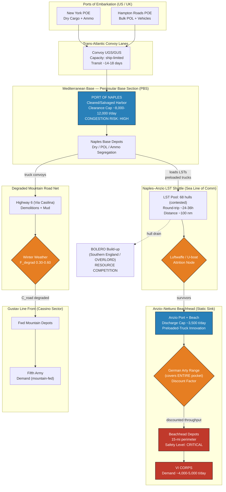

Cost: 0.316095

# Chapter 9: Bog-Down in the Mediterranean
## Reference Manual & Simulation-Specification Document
### US Army Green Book — *Global Logistics and Strategy: 1943–1945*

---

## 1. Strategic Context & Modern Historical Perspective

### 1.1 The Strategic Paradox: Grand Design Versus Physical Throughput

The Italian campaign of 1943–1944 stands as one of the most instructive case studies in the history of military logistics precisely because it exposed the yawning gulf between strategic intention and material feasibility. The strategic decisions that committed Allied forces to the Italian mainland were forged in the crucible of the great Anglo-American conferences—Casablanca (SYMBOL, January 1943), TRIDENT (Washington, May 1943), QUADRANT (Quebec, August 1943), and SEXTANT (Cairo, November–December 1943). At each of these meetings the Combined Chiefs of Staff wrestled with a fundamental contradiction: the British Mediterranean strategy, championed by Churchill and the Imperial General Staff, sought to exploit the "soft underbelly" of the Axis and keep forces continuously engaged, while the American strategy, embodied in Marshall and the War Department's OPD, insisted on the primacy of the cross-Channel invasion (OVERLORD) and the associated BOLERO build-up in the United Kingdom.

The paradox was not fundamentally about strategy—it was about the *finite global pool of specialized shipping*, and above all the chronic, campaign-defining shortage of Landing Ship, Tank (LST) hulls. The LST was the single most contested strategic resource in the European and Mediterranean theaters throughout 1943–1944. It was the only vessel capable of beaching, discharging vehicles and bulk stores directly onto an unimproved shore, and retracting—precisely the capability required both for amphibious assault and, critically, for *sustainment across a beach* where no functioning port existed. Every LST allocated to the Mediterranean was one subtracted from the OVERLORD lift. The physical limits of combat loading (which reduced effective cargo density to roughly 60–70% of administrative loading), port clearance rates at Naples (itself a demolished and mine-choked harbor painstakingly resurrected by Army engineers and Navy salvage teams), and the throughput ceilings of the coastal and mountain road nets, all conspired to ensure that strategic ambition consistently outran deliverable tonnage.

Modern scholarship, benefiting from the declassification of the Combined Chiefs' shipping allocation ledgers and the detailed after-action reports of the Peninsular Base Section (PBS), has quantified this mismatch with a precision unavailable to wartime planners. The consensus is stark: the Italian theater was chronically *under-resourced relative to its assigned objectives but over-resourced relative to what the Allies could afford given OVERLORD's timetable.* This is the central strategic tension of Chapter 9.

### 1.2 Inter-Service and Coalition Tensions

The command friction of the period operated along three principal fault lines. First, the tension between the Services of Supply (SOS)—reorganized as Army Service Forces under Somervell—and the combat commands under Fifth Army (Clark) and 15th Army Group (Alexander). The base sections, particularly the Peninsular Base Section at Naples, controlled the flow of tonnage across the beaches and through the ports, and their conservative "safety-level" stockage policies frequently clashed with combat commanders' demands for forward-weighted supply. Second, the Army–Navy interface: LSTs and the amphibious lift were Navy-manned and Navy-controlled assets (under the Eighth Fleet and the naval task forces), while the cargo they carried and the units they landed were Army responsibilities. Scheduling the turnaround of a scarce LST fleet required a degree of joint coordination that the ad hoc command structures of the Mediterranean did not always provide.

Third, and most consequentially, the Anglo-American coalition tension over shipping pooling. The British Ministry of War Transport and the American War Shipping Administration operated a nominally combined pool, but each partner guarded its national lift jealously. Churchill's personal intervention to retain 68 LSTs in the Mediterranean beyond their scheduled release date to OVERLORD—secured at SEXTANT and in the subsequent negotiations of December 1943 and January 1944—was the proximate enabling decision for Operation SHINGLE. This retention directly delayed the redeployment of amphibious lift to England and compressed the margin available to the OVERLORD planners, who were simultaneously expanding the assault from three to five divisions, a change that itself demanded still more LSTs.

### 1.3 Historical Era Context: The Winter Bog-Down and the Anzio Gambit

By November 1943 the Italian campaign had slowed to a crawl. The German Tenth Army under Vietinghoff, executing Kesselring's doctrine of stubborn defense-in-depth, fell back onto the Winter Line and then the Gustav Line, anchored on the Rapido–Garigliano rivers and the massif of Monte Cassino. The Apennine spine of Italy channelized all movement into a handful of valley roads, each dominated by observed high ground. The winter of 1943–44 was among the harshest on record; incessant rain turned unpaved routes to impassable mire, flooded rivers, and grounded the tactical air that Allied doctrine relied upon. Retreating German engineers, masters of the demolition, systematically destroyed bridges, culverts, and cratered roads, and seeded the debris with mines and booby-traps. The result was a catastrophic degradation of *road transport capacity*—the very phenomenon this chapter's simulation is designed to model. Truck convoy throughput over the mountain nets fell to a fraction of theoretical capacity, with round-trip times inflated by grade, surface condition, one-way traffic control, and weather-imposed halts.

Operation SHINGLE, the amphibious landing at Anzio–Nettuno on 22 January 1944, was conceived as the strategic solvent for this deadlock: an end-run 60 miles behind the Gustav Line, threatening the German rear and the road to Rome, intended to compel Kesselring either to weaken the Cassino front or to abandon it. In execution it became the definitive cautionary tale of amphibious logistics.

### 1.4 Modern Analytical Insights: The Logistical Straitjacket

Post-war analysis, and particularly the operations-research reconstructions of the beachhead's sustainment, identifies SHINGLE as a classic logistical "straitjacket." The lift allocated—sufficient to land two divisions (VI Corps under Lucas) with limited follow-up—was calibrated for a landing, not a sustained offensive campaign. There were simply not enough LSTs allocated to build the forward stockage necessary for a rapid breakout before the Germans, exploiting their interior lines and superior road net, could concentrate the Fourteenth Army (von Mackensen) to contain the beachhead.

The consequence was a phase-inversion of the entire operational concept. Instead of becoming a *maneuver hub* projecting force outward, Anzio became a *static logistical sink*—a fixed consumer of tonnage that had to be supplied, day after day, entirely across a beach and through the small port of Anzio, against Luftwaffe air attack and, critically, against German long-range artillery (including the 280mm railway guns "Anzio Annie") that ranged the entire beachhead and its unloading areas. The sustainment demand of the pinned force compelled the establishment of a continuous LST shuttle from Naples, and that shuttle drew its hulls from the same pool the Combined Chiefs had earmarked for BOLERO/OVERLORD. In direct and measurable terms, the Anzio straitjacket bled amphibious lift away from the Normandy build-up at the very moment that build-up was most acute. The beachhead was held—it was never eliminated—but it consumed resources vastly disproportionate to the operational return, and it did not break the Gustav Line. That line fell in May 1944 to the frontal assault of Operation DIADEM, not to the maneuver SHINGLE was meant to enable.

---

## 2. High-Fidelity Simulation Parameters & Real-World Metrics

| Parameter | Value | Historical Explanation & Strategic Rationale | Simulation Representation |
|---|---|---|---|
| **Operation SHINGLE launch date** | **22 January 1944** | The landing of VI Corps (US 3rd Infantry Division, British 1st Division, Rangers, Commandos) at Anzio–Nettuno. Achieved complete tactical surprise; near-zero opposition on D-Day. | Static constant / simulation epoch `t₀`. Anchors the sustainment clock and LST-shuttle scheduling. |
| **Anzio beachhead width (stalemate)** | **≈ 15 miles** (frontage of the pocket) | The consolidated perimeter during the February–May stalemate spanned roughly 15 miles of frontage, with a depth of only 7–10 miles. Every point lay within German observed artillery range. | Static geometric constant defining the defended perimeter; used to compute artillery-exposure coefficient over unloading areas. |
| **Required daily supply to sustain the isolated force** | **≈ 4,000 tons/day** (rising toward ~5,000+ as the corps grew to ~+100,000 men) | The maintenance tonnage required to sustain VI Corps (eventually ~7 divisions equivalent) in a static, high-ammunition-expenditure defensive posture, delivered entirely by sea across the beach and small port. | Dynamic **demand cap** `D(t)`; the simulation must deliver ≥ D(t) or accrue a stockage deficit that degrades combat effectiveness. |
| **LSTs retained in Mediterranean (Churchill's intervention)** | **68 LSTs** | Retained beyond scheduled OVERLORD release to enable SHINGLE; the proximate resource decision draining the BOLERO build-up. | Fixed asset-pool integer; source node capacity for the shuttle. |
| **LST nominal cargo lift** | **~1,600–2,100 tons** administratively; **~500–700 tons** combat/vehicle loaded per turnaround | LST effective payload varied enormously with load configuration (bulk vs. loaded vehicles). | Per-vessel capacity coefficient with load-type modifier. |
| **Naples→Anzio one-way distance** | **≈ 100 nautical miles** | Governs LST round-trip time (~24–36 h including load/discharge) and thus shuttle cycle capacity. | Edge distance driving convoy cycle-time computation. |
| **Anzio port + beach discharge capacity** | **~3,000–4,000+ tons/day** (achieved via preloaded DUKW-loaded trucks driven directly off LSTs) | The Army's key innovation: preloading trucks aboard LSTs so cargo drove ashore under its own power, bypassing the crane-limited port. | Dynamic throughput cap on the destination node; efficiency coefficient. |
| **Winter road degradation factor** | **0.30–0.60** of theoretical throughput | Mountain grades, mud, demolitions, one-way control, and weather halts reduced truck-net capacity to 30–60% of nominal. | Efficiency coefficient `F_degrad ∈ [0,1]` applied to road throughput. |
| **Truck operational day (mountain, blackout)** | **~10–12 h** effective | Blackout driving, traffic control, and weather compressed the productive convoy day. | Scalar in cycle-time model. |
| **Average truck payload (2½-ton, mountain-derated)** | **~1.5–2.0 tons** effective | The ubiquitous GMC "deuce-and-a-half"; payload derated on grades and poor surfaces. | Per-unit payload constant. |

---

## 3. Logistical Network Topology (Mermaid.js Flowchart)



---

## 4. Mathematical Modeling & Simulation Formulas

### 4.1 Road Throughput Under Degradation

The mountain road transport capacity is the governing constraint on the Cassino front. For a convoy of $N$ trucks operating over a route of length $L$ (miles) at effective speed $V$ (mph) for an operational day of $H$ hours:

$$
C_{road} = N \cdot P \cdot \underbrace{\frac{V \cdot H}{2L}}_{\text{trips/day}} \cdot F_{degrad}
$$

where $P$ is the effective per-truck payload (tons), the factor $2L$ accounts for the round trip, and $F_{degrad} \in [0,1]$ is the composite degradation coefficient. We decompose $F_{degrad}$ multiplicatively:

$$
F_{degrad} = f_{grade}\cdot f_{surface}\cdot f_{weather}\cdot f_{demolition}\cdot f_{traffic}
$$

each $f_i \in (0,1]$, capturing grade derating, surface condition, weather halts, demolition-imposed detours, and one-way traffic control respectively.

### 4.2 The Anzio Sustainment (LST Shuttle) Constraint

The beachhead is a static sink with demand $D(t)$. Delivered tonnage across the shuttle is bounded by the minimum of shuttle capacity and shore discharge capacity, discounted by attrition and artillery exposure:

$$
S(t) = \min\!\left( \underbrace{n_{LST}\cdot q_{LST}\cdot \frac{H_{sea}}{\tau_{rt}}}_{\text{shuttle lift}},\; \underbrace{C_{shore}}_{\text{discharge cap}} \right)\cdot(1-a_{air})\cdot\phi_{arty}
$$

where $n_{LST}$ is available hulls, $q_{LST}$ per-hull payload, $\tau_{rt}$ the round-trip cycle time (hours), $a_{air}$ the air/naval attrition rate, and $\phi_{arty}\in(0,1]$ the artillery-imposed discharge discount.

### 4.3 Stockage Deficit Dynamics

The beachhead reserve stock $R(t)$ evolves as:

$$
R(t+1) = \max\!\big(0,\; R(t) + S(t) - D(t)\big)
$$

Combat effectiveness $E(t)$ degrades when reserve falls below the safety level $R_{safe}$:

$$
E(t) = \min\!\left(1,\; \frac{R(t)}{R_{safe}}\right)
$$

### 4.4 The BOLERO Coupling (Resource Competition)

The shuttle's LST demand imposes an opportunity cost on the OVERLORD build-up. Let $n_{pool}$ be the total contested pool; the hulls unavailable to BOLERO are:

$$
n_{drain} = n_{LST} + n_{repair} \quad\Longrightarrow\quad n_{BOLERO} = n_{pool} - n_{drain}
$$

The **objective** is to minimize total unmet demand across both fronts while respecting the shared LST pool:

$$
\min_{\{n_{LST}\}} \; \sum_{t} \Big[ w_A\,\big(D_A(t)-S_A(t)\big)^{+} + w_G\,\big(D_G(t)-C_{road}(t)\big)^{+} \Big]
$$
$$
\text{s.t.} \quad n_{LST}\le n_{pool},\quad C_{shore}\ \text{fixed},\quad F_{degrad}\ \text{weather-driven}
$$

where $(x)^{+}=\max(0,x)$ and $w_A, w_G$ are strategic weights for Anzio and Gustav fronts.

---

## 5. Compile-Safe Scala 3.8.3 Domain Model

```scala
package Logistics.BogDown

import scala.math.{max, min}

opaque type Tons        = Double
opaque type Miles       = Double
opaque type NauticalMiles = Double
opaque type Mph         = Double
opaque type Hours       = Double
opaque type Days        = Double
opaque type Factor      = Double
opaque type HullCount   = Int

object Tons:
  def apply(v: Double): Tons = v
  extension (t: Tons)
    def value: Double = t
    def +(o: Tons): Tons = t + o
    def -(o: Tons): Tons = t - o

object Miles:
  def apply(v: Double): Miles = v
  extension (m: Miles) def value: Double = m

object NauticalMiles:
  def apply(v: Double): NauticalMiles = v
  extension (m: NauticalMiles) def value: Double = m

object Mph:
  def apply(v: Double): Mph = v
  extension (s: Mph) def value: Double = s

object Hours:
  def apply(v: Double): Hours = v
  extension (h: Hours) def value: Double = h

object Days:
  def apply(v: Double): Days = v
  extension (d: Days) def value: Double = d

object Factor:
  def apply(v: Double): Factor = max(0.0, min(1.0, v))
  extension (f: Factor)
    def value: Double = f
    def *(o: Factor): Factor = Factor(f * o.value)

object HullCount:
  def apply(v: Int): HullCount = max(0, v)
  extension (h: HullCount) def value: Int = h

enum BeachheadState:
  case Consolidating
  case Stalemate
  case DeficitCritical
  case Breakout

enum WeatherRegime(val surface: Factor, val weather: Factor):
  case Clear    extends WeatherRegime(Factor(0.95), Factor(1.00))
  case Rain     extends WeatherRegime(Factor(0.70), Factor(0.75))
  case Mud      extends WeatherRegime(Factor(0.50), Factor(0.55))
  case Frozen   extends WeatherRegime(Factor(0.80), Factor(0.70))

final case class DegradationProfile(
  grade: Factor,
  demolition: Factor,
  traffic: Factor,
  regime: WeatherRegime
):
  def composite: Factor =
    grade * demolition * traffic * regime.surface * regime.weather

final case class TruckConvoy(truckCount: Int, averagePayloadTons: Double, distanceMiles: Double):
  require(truckCount >= 0, "truckCount must be non-negative")
  require(averagePayloadTons >= 0.0, "payload must be non-negative")
  require(distanceMiles > 0.0, "distance must be positive")

final case class LstShuttle(
  hulls: HullCount,
  payloadPerHull: Tons,
  legDistance: NauticalMiles,
  cruiseKnots: Double,
  loadDischargeHours: Hours,
  seaOpHoursPerDay: Hours,
  airAttrition: Factor,
  artilleryDiscount: Factor
):
  require(cruiseKnots > 0.0, "cruise speed must be positive")

  def roundTripHours: Hours =
    val sailing: Double = (2.0 * legDistance.value) / cruiseKnots
    Hours(sailing + loadDischargeHours.value)

  def dailyLift: Tons =
    val cyclesPerDay: Double = seaOpHoursPerDay.value / roundTripHours.value
    val gross: Double = hulls.value.toDouble * payloadPerHull.value * cyclesPerDay
    val survived: Double = gross * (1.0 - airAttrition.value) * artilleryDiscount.value
    Tons(max(0.0, survived))

object RoadThroughputModel:
  def calculateDailyTonnage(
    convoy: TruckConvoy,
    speedMph: Double,
    degradationFactor: Double
  ): Double =
    val tripsPerDay = (speedMph * 12.0) / convoy.distanceMiles
    val potentialTons = convoy.truckCount * convoy.averagePayloadTons * tripsPerDay
    potentialTons * degradationFactor

  def dailyTonnageTyped(
    convoy: TruckConvoy,
    speed: Mph,
    operatingHours: Hours,
    profile: DegradationProfile
  ): Tons =
    val tripsPerDay: Double =
      (speed.value * operatingHours.value) / (2.0 * convoy.distanceMiles)
    val potential: Double =
      convoy.truckCount.toDouble * convoy.averagePayloadTons * tripsPerDay
    Tons(max(0.0, potential * profile.composite.value))

final case class BeachheadStock(reserve: Tons, safetyLevel: Tons):
  require(safetyLevel.value > 0.0, "safety level must be positive")

  def combatEffectiveness: Double =
    min(1.0, reserve.value / safetyLevel.value)

  def state: BeachheadState =
    if reserve.value <= 0.0 then BeachheadState.DeficitCritical
    else if reserve.value < safetyLevel.value then BeachheadState.Stalemate
    else BeachheadState.Consolidating

object SustainmentSimulator:
  def step(
    stock: BeachheadStock,
    delivered: Tons,
    demand: Tons
  ): BeachheadStock =
    val net: Double = stock.reserve.value + delivered.value - demand.value
    stock.copy(reserve = Tons(max(0.0, net)))

  def simulate(
    initial: BeachheadStock,
    shuttle: LstShuttle,
    dailyDemand: Tons,
    days: Int
  ): Vector[BeachheadStock] =
    require(days >= 0, "days must be non-negative")
    (0 until days).foldLeft(Vector(initial)): (acc, _) =>
      val current: BeachheadStock = acc.last
      val next: BeachheadStock = step(current, shuttle.dailyLift, dailyDemand)
      acc :+ next

object BoleroCoupling:
  def hullsAvailableToBolero(
    poolTotal: HullCount,
    shuttleHulls: HullCount,
    inRepair: HullCount
  ): HullCount =
    HullCount(poolTotal.value - shuttleHulls.value - inRepair.value)

  def unmetDemandPenalty(
    anzioDeficit: Tons,
    gustavDeficit: Tons,
    weightAnzio: Double,
    weightGustav: Double
  ): Double =
    val a: Double = max(0.0, anzioDeficit.value) * weightAnzio
    val g: Double = max(0.0, gustavDeficit.value) * weightGustav
    a + g

object Chapter9Scenario:
  val shingleLaunch: String = "1944-01-22"
  val beachheadWidthMiles: Miles = Miles(15.0)
  val requiredDailyTons: Tons = Tons(4000.0)
  val retainedLsts: HullCount = HullCount(68)

  def anzioShuttle: LstShuttle =
    LstShuttle(
      hulls = HullCount(24),
      payloadPerHull = Tons(600.0),
      legDistance = NauticalMiles(100.0),
      cruiseKnots = 9.0,
      loadDischargeHours = Hours(10.0),
      seaOpHoursPerDay = Hours(24.0),
      airAttrition = Factor(0.03),
      artilleryDiscount = Factor(0.90)
    )

  def cassinoConvoy: TruckConvoy =
    TruckConvoy(truckCount = 400, averagePayloadTons = 1.75, distanceMiles = 45.0)

  def winterProfile: DegradationProfile =
    DegradationProfile(
      grade = Factor(0.75),
      demolition = Factor(0.70),
      traffic = Factor(0.80),
      regime = WeatherRegime.Mud
    )

  def run(days: Int): Vector[BeachheadStock] =
    val initial: BeachheadStock =
      BeachheadStock(reserve = Tons(8000.0), safetyLevel = Tons(12000.0))
    SustainmentSimulator.simulate(initial, anzioShuttle, requiredDailyTons, days)

  def roadCapacity: Tons =
    RoadThroughputModel.dailyTonnageTyped(
      cassinoConvoy, Mph(18.0), Hours(11.0), winterProfile
    )

@main def demonstrateChapter9(): Unit =
  val trajectory: Vector[BeachheadStock] = Chapter9Scenario.run(30)
  val roadTons: Tons = Chapter9Scenario.roadCapacity
  val finalStock: BeachheadStock = trajectory.last
  println(s"SHINGLE launch: ${Chapter9Scenario.shingleLaunch}")
  println(s"Beachhead width: ${Chapter9Scenario.beachheadWidthMiles.value} miles")
  println(s"Required daily tonnage: ${Chapter9Scenario.requiredDailyTons.value}")
  println(s"Anzio shuttle daily lift: ${Chapter9Scenario.anzioShuttle.dailyLift.value}")
  println(s"Cassino road capacity (winter): ${roadTons.value} tons/day")
  println(s"Final reserve: ${finalStock.reserve.value} tons")
  println(s"Combat effectiveness: ${finalStock.combatEffectiveness}")
  println(s"Beachhead state: ${finalStock.state}")
```

---

## 6. Graduate-Level Operational Analysis

### 6.1 Why SHINGLE Failed Its Strategic Objectives and Drained OVERLORD

Operation SHINGLE failed not primarily because of tactical timidity—though the historiographical debate over General Lucas's decision to consolidate rather than dash for the Alban Hills is long-standing—but because of an *irreconcilable mismatch between the operation's strategic ambition and its allotted logistical envelope.* The strategic intent required a force capable of rapid inland maneuver, which in turn demanded that the beachhead accumulate a substantial forward stockage of ammunition, fuel, and rations before the German ring closed. But the lift allocated—governed by the finite, OVERLORD-mortgaged LST pool—was sufficient only to *land and maintain* two divisions, not to *stockpile for offensive breakout.* This is the essence of the straitjacket: the input flow rate $S(t)$ was calibrated to approximately equal the maintenance demand $D(t)$ of a static force, leaving no surplus $\big(S(t)-D(t)\big)^{+}$ with which to build the offensive reserve $R_{offensive}$.

The mathematics of the situation, as encoded in §4.3, is unforgiving. When $S(t) \approx D(t)$, the reserve $R(t)$ cannot grow. Kesselring, operating on interior lines with an undegraded road net radiating from Rome, could concentrate von Mackensen's Fourteenth Army faster than VI Corps could accumulate breakout stocks across a single contested beach and small port. By the time surprise had worn off (roughly 48–72 hours), the demand $D(t)$ itself *increased* as reinforcing divisions poured in to hold the perimeter, while the German artillery and Luftwaffe pressure drove $\phi_{arty}$ and $(1-a_{air})$ downward—compressing $S(t)$ precisely when it needed to expand. The beachhead thus mathematically converged toward a stalemate equilibrium rather than a breakout.

The drain on OVERLORD operated through the shared LST pool (§4.4). Churchill's retention of 68 LSTs was not a one-time loan; the shuttle's sustained demand meant those hulls, plus a rotating fraction in repair from battle and weather damage, remained committed for months—well into the spring window when they were needed in England to lift the expanded five-division Normandy assault. Every hull-day devoted to the Naples–Anzio run was a hull-day subtracted from $n_{BOLERO}$. Modern accounting attributes measurable slippage in the OVERLORD lift margin directly to this Mediterranean commitment, a slippage that contributed to the two-week postponement of D-Day from May to June 1944 and forced painful trade-offs in the assault loading tables. SHINGLE, intended as an economy-of-force stroke, became a strategic *diseconomy*: it consumed disproportionate scarce lift, failed to unhinge the Gustav Line (which fell later to frontal assault under DIADEM), and imperiled the priority operation of the entire war.

### 6.2 The Naples–Anzio LST Shuttle as Innovative Sustained-Support Amphibious Employment

The Naples–Anzio LST shuttle represents one of the most significant doctrinal innovations in amphibious logistics of the war, precisely because it inverted the intended employment of the LST from an *assault* asset to a *line-of-communication* asset operating in a sustained, industrialized cycle. Amphibious doctrine of 1943 conceived the LST as a one-shot assault vehicle: land the force, discharge, and revert to general shipping duties. Anzio, lacking both a functional deep-water port and a land line of communication (the beachhead being sealed off by the German ring), forced planners to treat the LST as the *permanent conveyor belt* of the entire beachhead economy.

The critical innovation was the **preloaded-truck (or "loaded-vehicle") technique.** Rather than laboriously craning break-bulk cargo onto the fire-swept, artillery-ranged quays of Anzio—a process that would have crippled discharge throughput and exposed working parties to catastrophic loss—the Army loaded 2½-ton trucks and DUKWs *fully laden with cargo* at Naples, drove them aboard the LSTs, and on arrival simply drove them off the LST's ramp and directly to the beachhead depots. The empty trucks (or a returning pool of them) then re-embarked for Naples. This converted the slow, crane-limited, personnel-intensive discharge process into a fast roll-on/roll-off cycle limited only by ramp time and traffic control. In the model of §4.2, this innovation is what kept $C_{shore}$—the shore discharge cap—high enough (≈3,500 tons/day) that it did not become the binding constraint, shifting the bottleneck instead to shuttle lift and enemy attrition.

Operationally, the shuttle functioned as a periodic system with cycle time $\tau_{rt}$ (§4.2). By committing a standing pool of LSTs to a fixed run, the theater created a quasi-continuous delivery pipeline delivering thousands of tons daily across a beach with no port—an achievement without real precedent at this scale and under this level of enemy interdiction. It presaged the "over-the-shore" logistics later institutionalized at Normandy (the Mulberry harbors and the beach maintenance areas) and, decades on, the doctrinal foundations of modern Joint Logistics Over-The-Shore (JLOTS). The shuttle is thus simultaneously the *cause* of the strategic drain analyzed in §6.1 and a genuine, enduring contribution to the art of amphibious sustainment: it proved that a sealed beachhead could be maintained indefinitely by sea alone, provided one was willing to pay the exorbitant price in scarce specialized shipping—a price that, at Anzio, the Allies could barely afford and nearly could not.
