Cost: 0.0103264

# Chapter 9: Bog-Down in the Mediterranean  
## A Reference Manual and Simulation-Specification Document for the U.S. Army Green Book Series

---

## 1. Strategic Context & Modern Historical Perspective

The Mediterranean theater in the winter of 1943–1944 is the purest case study in the entire European war of the gap between strategic intention and physical logistics. At the major Allied conferences—Casablanca, TRIDENT, QUADRANT, and SEXTANT—the Combined Chiefs and heads of government made decisions that assumed a degree of shipping flexibility that did not exist. The central paradox is that the Allies had achieved overwhelming material superiority in aggregate global production, yet at every *tactical point of contact* there was a shortage of the wrong kind of capacity: shallow-draft amphibious shipping, port berths, road-clearance equipment, and transport aircraft. This is the classic distribution paradox of World War II logistics: industrial output was less important than the ability to move precise tonnages to precise points at precise times.

Casablanca had established the Germany-first priority and sanctioned the Mediterranean as the active secondary front, but it did not fully account for the fact that the Italian campaign would become a very hungry, amphibious-heavy theater. TRIDENT reaffirmed a 1944 cross-Channel attack and called for a massive build-up of forces in the United Kingdom under the BOLERO plan. QUADRANT then fixed OVERLORD for 1 May 1944 and attempted to prevent Mediterranean operations from draining resources from it. Yet the campaign in Italy, by its very geography, required what the Allies least could spare: assault lift, LSTs, combat loaders, and forward road transport. By the time of SEXTANT, at Cairo and Tehran, the Mediterranean was still consuming resources that could not be recovered before the Normandy invasion. At Tehran, Stalin pushed for OVERLORD and a supporting Anvil landing in southern France, but the Italian theater and Churchill’s Mediterranean vision continued to tug at the same amphibious pool.

The strategic paradox was therefore not a failure to understand that shipping was finite. It was a failure to appreciate the degree to which *port clearance and internal distribution*, not shipping capacity, would dominate the theater. Naples, for example, was a magnificent deep-water port, but its hinterland was destroyed, mountainous, and narrow; rail lines were broken; roads had been cratered by German demolitions; and the winter weather converted the Liri Valley and the roads to Cassino into mud streams. In such terrain, a division consumed not only its daily dry cargo and petroleum but also large quantities of engineer construction materials, road metal, bridging, and ammunition—all of which had to be transported over roads with gradient and curve constraints far below their peacetime capacities. The apparent abundance of Liberty ships and truck production counted for little when the discharge plazas at Anzio were measured in hundreds of yards and the final truck haul to battalions was measured in miles of exposed, mud-slick roads.

Inter-service and coalition frictions aggravated this. The Services of Supply in the North African Theater of Operations (NATOUSA/MTOUSA) operated a large administrative depot system from Bari, Taranto, and Naples. Theater commanders, however, frequently overrode logistic estimates to execute tactical operations. The U.S. Fifth Army wanted maximum forward stocks; the Allied Force Headquarters wanted to balance maintenance stocks against amphibious lift; the U.S. Navy wanted its landing craft back for other operations; the British Chiefs of Staff wanted to use Mediterranean successes to weaken Germany from the south. Operation SHINGLE crystallized all these tensions. The British conceived of the Anzio landing as an "end run" to rupture the Gustav Line; U.S. planners, mindful of the shortage of LSTs, treated it as a limited penetration. Tactical caution during the assault phase under Major General John P. Lucas was partly a response to the fact that the follow-on force was not logistically sustainable for a rapid dash to the Alban Hills. Lucas did not have the amphibious reserve, the mechanized transport, or the freely assignable fuel and ammunition stocks to guarantee a deep exploitation. The Navy, for its part, knew that every day spent shuttling into Anzio was a day not preparing for future amphibious operations.

The historical context needs to be stated plainly: by November 1943, the Italian advance had bogged down in front of the Bernhardt and Gustav lines. The weather was the worst in decades. The mountains around Cassino and the Rapido River were an artilleryman’s nightmare and a logistician’s catastrophe. German demolitions had broken the coastal rail line and every tunnel and bridge on the inland routes. To bypass the Gustav Line, the Allies decided to make an amphibious landing at Anzio. The initial assault on 22 January 1944 was almost unopposed. Within 48 hours the Allies had secured a beachhead of several square miles. But the decision to linger was not merely tactical conservatism; it was a response to the reality that the beachhead could not support an immediate massed armored thrust. The Germans reacted with extraordinary speed, and by February the Anzio beachhead had been transformed from a possible maneuver springboard into a compressed, rim-held pocket constantly under artillery fire and supplied entirely by sea.

Modern analytical hindsight, available through postwar declassification and the collected documentation of the Joint Logistics Plans Committee, reveals SHINGLE as a classic logistical “straitjacket.” The planners underallocated LSTs because they assumed the landing would either break out immediately or be relieved within a few days. When neither happened, the Anzio force became a *permanent floating harbor user*. The LST shuttle from Naples was no longer an assault lift; it was a sustained sea line of communication. That shuttle consumed dozens of LSTs in a continuous schedule of loading, sailing, beaching, unloading, and returning. Each LST in the Mediterranean was an LST not in England preparing for OVERLORD. The BOLERO build-up required not only general cargo ships but also landing craft for rehearsals, serialization, and the actual assault. ANVIL, the planned invasion of southern France, was eventually postponed largely because Mediterranean amphibious assets were trapped in the Anzio shuttle. In this sense, SHINGLE did not break the strategic deadlock; it created a second, static sponge that absorbed resources that had been intended for the main effort.

Anzio is therefore a canonical case of the *engineering of logistics as operational constraint*. It demonstrates that an amphibious assault is not an operational end state; it is the beginning of a continuous supply problem. The “width” of the beachhead was not just a military perimeter; it was a pressure vessel. The tonnages required to sustain the force were not simply a matter of daily rations; they reflected engineer material, ammunition, POL, medical supplies, and maintenance parts. The LST shuttle was an innovation—one of the earliest true sustained sea-based logistics systems—but it was also a warning that the capability to put forces ashore is meaningless without the capability to keep them supplied while they are confined.

---

## 2. High-Fidelity Simulation Parameters & Real-World Metrics

The following parameters are the core database constants for a division-level logistics simulation of the Mediterranean theater in the winter of 1943–1944. Values are drawn from the historical record and from the operational-analysis syntheses made possible by post-war documentation.

| Metric | Historical Value | Simulation Representation | Historical Explanation & Strategic Rationale |
|---|---|---|---|
| Operation SHINGLE launch date | **22 January 1944** | `java.time.LocalDate` event trigger; initial assault echelon gate. | The landing was nearly unopposed. The date triggers the first requirement for beachhead supply, port construction, and LST shuttle availability. |
| Anzio beachhead pocket width during the stalemate | **~15 miles (24 km)** coastal perimeter chord; depth ranged from 5 to 10 miles (8–16 km) | `Miles(15.0)` constant; perimeter width used in defensive demand calculations and road network radius. | The line ran from the Moletta River on the west to the Mussolini Canal on the east. A 15-mile chord is the accepted modern planning figure for the contained pocket after the German counteroffensive. |
| Required daily supply delivery to sustain the isolated Anzio force | **~7,000 short tons per day** (6,300 metric tons); 5,000 tons as the maintenance floor; 8,500–10,000 tons during active defensive fighting or planned breakout | `Tons(7000.0)` baseline demand; `DemandProfile(surgeMultiplier)` for attack/defense. | The VI Corps force grew to roughly 110,000 troops and 25,000 vehicles. Supply categories included Class I rations, Class III POL, Class V ammunition, engineer materials, road surfacing, and medical stores. The 7,000-ton figure is the accepted planning estimate for a static but active defensive beachhead. |
| Naples–Anzio sea distance | **~82 nautical miles** (94 statute miles) along the coastal route | `NauticalMiles(82.0)` in LST shuttle model. | LST convoys left Naples and traveled up the Italian coast to Anzio. The route was exposed to air attack and rough winter seas, but was short enough for rapid turnaround under optimal conditions. |
| LST shuttle turnaround time | **36–72 hours**, depending on weather, congestion, enemy artillery, and port discharge | `Days` parameter in `LSTShuttle`; dynamic modifier from weather/attacks. | Unloading at Anzio was slow because the port was small and LSTs often had to beach on an artificial causeway. Congestion at Anzio delayed unloading; some LSTs became floating dumps. |
| Port of Anzio maximum discharge capacity | **~5,500 short tons per day**; practical sustained capability 4,000–5,000 tons/day | `PortThroughput(berths, tonsPerBerthPerDay, weatherEfficiency)`; `min(shuttle, port)` gate. | The port captured at Anzio was small; Navy Seabees and Army engineers created piers, pontoon causeways, and DUKW routes. Still, the port never matched Naples. LSTs therefore became the bridge between the assault phase and the operational sustainment phase. |
| Winter mountain road degradation factor | Dry = 1.0, Wet = 0.65, Mud = 0.35, Snow = 0.20, Impassable = 0.0 | `RoadState` state machine and `RoadWeatherModel.degradationFactor`. | The mountain roads south of Rome were narrow, with switchbacks and destroyed culverts. Rain and German artillery turned them to mud; snow closed high-altitude alternates. This factor directly reduces effective convoy speed and daily tonnage. |
| BOLERO / OVERLORD landing-craft pool opportunity cost | Every LST held in the Mediterranean was one less LST in UK waters for amphibious training and assault | Resource allocation unit in `AllocationWeightedShortfall`; constraint in mixed-integer LP. | The European landing craft pool was finite. SHINGLE consumed LST cycles not only during assault but for months, depriving OVERLORD of rehearsal craft and causing ANVIL to be postponed. |

The simulation should represent these metrics as follows: `shingleLaunchDate` is a fixed time trigger; `anzioBeachheadWidthMiles` is a dynamic operational state that shrinks under German counterattack and expands during breakout; `anzioRequiredDailySupplyTons` is a demand node with a state-dependent surge multiplier. Port capacities and road degradation factors are nonlinear throughput caps, not fixed constants; they must be recalculated at every state update based on weather, air attack, artillery interdiction, and engineering state.

---

## 3. Logistical Network Topology

The following Mermaid.js diagram models the principal logistic flows of the Mediterranean theater around the winter 1943–1944 stalemate. It includes the global resource pool, the Atlantic/Mediterranean convoy route, the Naples base, the Cassino sector, and the Anzio beachhead. The diagram explicitly represents capacity constraints, congestion, and alternative routing.

```mermaid
flowchart LR
    classDef poe fill:#1f77b4,color:#fff
    classDef route fill:#ff7f0e
    classDef port fill:#2ca02c
    classDef bottleneck fill:#d62728
    classDef demand fill:#9467bd

    subgraph CONUS_POOL["BOLERO / GLOBAL LIFT RESOURCE POOL"]
        NEWYORK["NEW YORK POE<br/>Dry cargo: 10,000 ST/D<br/>Breakbulk export capacity"]
        HAMPTON["HAMPTON ROADS POE<br/>POL: 4,500 ST/D<br/>Convoy UGS"]
        LSTPOOL["JOINT LANDING CRAFT POOL<br/>European theater LSTs<br/>Finite allocation"]
    end

    subgraph ATLANTIC_MED["ATLANTIC-MEDITERRANEAN CONVOY SYSTEM"]
        NY_TO_GIB["UGS/UGF Convoys<br/>New York → Gibraltar<br/>45-50 ships per convoy"]
        GIB_TO_NAP["Mediterranean feeder convoys<br/>Gibraltar → Oran → Bône → Naples"]
        WEATHER_ATTR["Weather and U-boat attrition<br/>daily loss coefficient k_loss = 0.002–0.008"]
    end

    subgraph NAPLES_BASE["NAPLES BASE SECTION (NATOUSA SOS)"]
        NAPLES["Port of Naples<br/>Deep-water discharge 11,000 ST/D<br/>9 ocean berths + LST pontoon quay"]
        DEPOT["Naples Depot Complex<br/>Class I-III-V stocks<br/>36 days of operating supplies"]
        RAIL_TRUCK["Railhead/roadhead<br/>Caserta-Capua truckhead<br/>Fifth Army railhead"]
    end

    subgraph CASSINO_SECTOR["CASSINO SECTOR / GUSTAV LINE"]
        CASSINO_ROAD["Route SS6 / Via Casilina<br/>Mountain pass, mud, ice<br/>single-track segments"]
        CASSINO_DEMAND["U.S. II Corps / British X Corps<br/>Cassino/Rapido front<br/>Demand: 4,500 ST/D"]
    end

    subgraph ANZIO_BEACHHEAD["ANZIO BEACHHEAD / SHINGLE"]
        ANZIO_PORT["Anzio-Nettuno Harbor<br/>LST causeways and DUKW routes<br/>Max discharge 5,500 ST/D"]
        DUMPS["Beachhead dumps<br/>Class I, III, V<br/>Nettuno road net"]
        ANZIO_ROAD["Truck shuttle: dumps to forward battalions<br/>Mud ratio 0.35<br/>Engineer road maintenance push"]
        PERIMETER["VI Corps perimeter<br/>Moletta R. to Mussolini Canal<br/>width ~15 miles, depth 5–10 miles"]
    end

    NEWYORK --> NY_TO_GIB
    HAMPTON --> NY_TO_GIB
    NY_TO_GIB --> GIB_TO_NAP
    GIB_TO_NAP --> WEATHER_ATTR --> NAPLES
    LSTPOOL -. "LST allocation: MTO vs ETOUSA" .-> NAPLES
    NAPLES --> DEPOT
    DEPOT --> RAIL_TRUCK
    RAIL_TRUCK --> CASSINO_ROAD
    CASSINO_ROAD --> CASSINO_DEMAND
    NAPLES --> LST_SHUTTLE["LST/LCI shuttle to Anzio<br/>82 nautical miles one way<br/>turnaround 36–72 h"]
    LST_SHUTTLE --> ANZIO_PORT
    ANZIO_PORT --> DUMPS
    DUMPS --> ANZIO_ROAD
    ANZIO_ROAD --> PERIMETER
    CASSINO_ROAD -. "No land line to Anzio<br/>until breakout" .-x ANZIO_BEACHHEAD
```



The diagram shows the key dynamic bottleneck: the Naples–Anzio shuttle is an irreducible sea line of communication. The beachhead road network is short, but its throughput is degraded by mud, shelling, and congestion. Until the breakout, there is no land connection between the Cassino sector and Anzio. Thus the only source of supply for the Anzio force is the LST shuttle; after the shuttle delivers cargo to Anzio port, the port-to-perimeter truck movement becomes the next bottleneck.

---

## 4. Mathematical Modeling & Simulation Formulas

The core logistics problem can be represented as a multi-commodity flow with capacity degradation and resource allocation. The simulation computes delivered tonnage per day through each link and then determines shortfalls at each demand node.

### 4.1 Road Transport Capacity

The fundamental road convoy formula used in the simulator is:

$$
\text{Mathematical Concept: } C_{road} = N \cdot \frac{V \cdot Payload}{Distance} \cdot F_{degrad}
$$

More precisely, with daily operating hours $H = 12$:

$$
C_{road} = N \cdot \left( \frac{V \cdot H}{D_{round}} \right) \cdot P \cdot F_{degrad}
$$

where:

- $N$ = number of trucks on the route;
- $V$ = average speed in miles per hour under current road and enemy-fire conditions;
- $H$ = average daily vehicle operating hours, conventionally 12 hours;
- $D_{round}$ = closed-loop truck circuit distance, i.e., depot to forward unit and return;
- $P$ = average payload per truck in short tons;
- $F_{degrad}$ = composite degradation factor.

The composite degradation factor is:

$$
F_{degrad} = f_{weather} \cdot f_{surface} \cdot f_{terrain} \cdot f_{enemy} \cdot f_{maintenance}
$$

where each factor is bounded in $[0,1]$. In the winter Italian campaign, a route categorized as `Mud` would have $f_{surface} = 0.35$; a route under observed artillery fire might have $f_{enemy} = 0.8$; a destroyed bridge bypass might add $f_{terrain} = 0.85$. The result is an extremely nonlinear throughput collapse during the winter months.

### 4.2 Port Discharge Capacity

Let $B_j$ be the number of effective discharging berths at port $j$, $r_j$ the average discharge rate in tons per berth per day, and $\eta_j$ the port efficiency factor due to weather, air raid, and labor. Then:

$$
C_{port,j} = B_j \cdot r_j \cdot \eta_j
$$

For the Anzio port, the simulation applies this as a hard cap on the LST shuttle delivery:

$$
y_{Anzio} \leq \min\left( C_{LST}, C_{port,Anzio} \right)
$$

where $C_{LST}$ is the daily tonnage delivered by the LST shuttle.

### 4.3 LST Shuttle Formula

The Naples–Anzio shuttle is modeled as continuous sea transport:

$$
C_{LST} = N_{LST} \cdot P_{LST} \cdot \frac{1}{T_{turn}} \cdot \eta_{avail}
$$

with:

$$
T_{turn} = \frac{2 D_{sea}}{V_{LST}} + T_{load} + T_{discharge}
$$

where:

- $N_{LST}$ = number of LSTs committed to the shuttle;
- $P_{LST}$ = average cargo carried per LST per round trip;
- $T_{turn}$ = total turnaround time in days;
- $D_{sea}$ = one-way sea distance in nautical miles;
- $V_{LST}$ = convoy speed in knots;
- $T_{load}$ and $T_{discharge}$ = loading and unloading times;
- $\eta_{avail}$ = weather and operational availability factor.

Historical turnaround averaged 36–72 hours. With 25–40 LSTs operating in rotation, the shuttle delivered roughly 4,000–5,500 tons per day, which was near the practical limit of the Anzio port.

### 4.4 Resource Allocation Problem

Amphibious lift was the central scarce resource. Define demand nodes $j \in \{ \text{Anzio}, \text{Cassino}, \text{OVERLORD} \}$, with required daily tonnage $D_j$ and delivered tonnage $y_j$. The shortfall is:

$$
s_j = \max(0, D_j - y_j)
$$

The weighted shortfall objective is:

$$
\min Z = \sum_{j} w_j s_j
$$

subject to:

$$
y_j + s_j = D_j \quad \forall j
$$

$$
y_{Anzio} \leq \min(C_{LST}, C_{port,Anzio})
$$

$$
y_{Cassino} \leq C_{road,Cassino}
$$

$$
y_{OVERLORD} \leq C_{port,UK} + C_{LST,BOLERO}
$$

$$
\sum_{j} N_{LST,j} + N_{reserve} \leq N_{LST,total}
$$

$$
y_j \ge 0, \quad s_j \ge 0
$$

This formulation captures the chapter’s core insight: the objective function is not the minimization of tonnage but the minimization of *weighted combat-power shortfall*, with weights representing strategic priorities. Anzio’s tactical urgency could force a high weight, but the resulting allocation then reduced OVERLORD readiness and delayed ANVIL.

---

## 5. Compile-Safe Scala 3.8.3 Domain Model

The following Scala 3 domain model implements the formulas and state transitions above. It is designed for direct integration into a simulation execution engine. All types are explicit and unit-safe through opaque type aliases; there are no wildcard imports, no placeholders, and no commented-out sections.

```scala
package Logistics.BogDown

import java.time.LocalDate
import Logistics.BogDown.Units.Days
import Logistics.BogDown.Units.Miles
import Logistics.BogDown.Units.NauticalMiles
import Logistics.BogDown.Units.SpeedMph
import Logistics.BogDown.Units.Tons
import Logistics.BogDown.Units.Trucks

object Units:
  opaque type Tons = Double
  object Tons:
    def apply(value: Double): Tons = value
    extension (tons: Tons)
      def value: Double = tons
      def +(other: Tons): Tons = tons + other.value
      def -(other: Tons): Tons = tons - other.value
      def min(other: Tons): Tons = Math.min(tons, other.value)

  opaque type Miles = Double
  object Miles:
    def apply(value: Double): Miles = value
    extension (miles: Miles)
      def value: Double = miles
      def +(other: Miles): Miles = miles + other.value

  opaque type NauticalMiles = Double
  object NauticalMiles:
    def apply(value: Double): NauticalMiles = value
    extension (miles: NauticalMiles)
      def value: Double = miles

  opaque type Days = Double
  object Days:
    def apply(value: Double): Days = value
    def fromHours(hours: Double): Days = hours / 24.0
    extension (days: Days)
      def value: Double = days
      def +(other: Days): Days = days + other.value

  opaque type Trucks = Int
  object Trucks:
    def apply(value: Int): Trucks = value
    extension (trucks: Trucks)
      def value: Int = trucks

  opaque type SpeedMph = Double
  object SpeedMph:
    def apply(value: Double): SpeedMph = value
    extension (speed: SpeedMph)
      def value: Double = speed

enum RoadState:
  case Dry, Wet, Mud, Snow, Impassable

enum WeatherCondition:
  case Fair, Rain, Freezing, Storm

enum AmphibiousOpsPhase:
  case Assault, BuildUp, Containment, Breakout

enum SupplyClass:
  case ClassI, ClassIII, ClassIV, ClassV

object RoadWeatherModel:
  def roadStateAfter(current: RoadState, weather: WeatherCondition): RoadState =
    (current, weather) match
      case (RoadState.Dry, WeatherCondition.Rain) => RoadState.Wet
      case (RoadState.Wet, WeatherCondition.Rain) => RoadState.Mud
      case (RoadState.Wet, WeatherCondition.Freezing) => RoadState.Snow
      case (RoadState.Mud, WeatherCondition.Freezing) => RoadState.Snow
      case (RoadState.Snow, WeatherCondition.Fair) => RoadState.Mud
      case (_, WeatherCondition.Storm) => RoadState.Impassable
      case (state, _) => state

  def degradationFactor(roadState: RoadState): Double =
    roadState match
      case RoadState.Dry => 1.0
      case RoadState.Wet => 0.65
      case RoadState.Mud => 0.35
      case RoadState.Snow => 0.20
      case RoadState.Impassable => 0.0

case class TruckConvoy(
  truckCount: Trucks,
  averagePayloadTons: Tons,
  distanceMiles: Miles
):
  require(truckCount.value > 0, "truckCount must be positive")
  require(averagePayloadTons.value > 0.0, "averagePayloadTons must be positive")
  require(distanceMiles.value > 0.0, "distanceMiles must be positive")

object RoadThroughputModel:
  final val dailyTruckOperatingHours: Double = 12.0

  def calculateDailyTonnage(
      convoy: TruckConvoy,
      speedMph: SpeedMph,
      degradationFactor: Double
  ): Tons =
    require(convoy.truckCount.value > 0, "truckCount must be positive")
    require(convoy.averagePayloadTons.value > 0.0, "averagePayloadTons must be positive")
    require(convoy.distanceMiles.value > 0.0, "distanceMiles must be positive")
    require(speedMph.value > 0.0 && speedMph.value < 60.0, "speedMph outside plausible range")
    require(degradationFactor >= 0.0 && degradationFactor <= 1.0, "degradationFactor out of range")

    val tripsPerDay: Double = (speedMph.value * dailyTruckOperatingHours) / convoy.distanceMiles.value
    val deliveredTonsPerDay: Double =
      convoy.truckCount.value.toDouble * convoy.averagePayloadTons.value * tripsPerDay * degradationFactor
    Tons(deliveredTonsPerDay)

final case class PortThroughput(
  berthCount: Int,
  tonsPerBerthPerDay: Tons,
  weatherEfficiency: Double
):
  require(berthCount > 0, "berthCount must be positive")
  require(tonsPerBerthPerDay.value > 0.0, "tonsPerBerthPerDay must be positive")
  require(weatherEfficiency >= 0.0 && weatherEfficiency <= 1.0, "weatherEfficiency out of range")

  def maxDailyDischarge: Tons =
    Tons(berthCount.toDouble * tonsPerBerthPerDay.value * weatherEfficiency)

final case class LSTShuttle(
  lstCount: Int,
  payloadTonsPerLst: Tons,
  oneWayDistanceNauticalMiles: NauticalMiles,
  speedKnots: Double,
  idleTimeAtAnchorDays: Days,
  weatherAvailability: Double
):
  require(lstCount > 0, "lstCount must be positive")
  require(payloadTonsPerLst.value > 0.0, "payloadTonsPerLst must be positive")
  require(oneWayDistanceNauticalMiles.value > 0.0, "oneWayDistanceNauticalMiles must be positive")
  require(speedKnots > 0.0, "speedKnots must be positive")
  require(idleTimeAtAnchorDays.value >= 0.0, "idleTimeAtAnchorDays must be non-negative")
  require(weatherAvailability >= 0.0 && weatherAvailability <= 1.0, "weatherAvailability out of range")

  def seaTimeDays: Days =
    Days.fromHours((2.0 * oneWayDistanceNauticalMiles.value) / speedKnots)

  def turnaroundDays: Days =
    seaTimeDays + idleTimeAtAnchorDays

  def dailyDeliveredTons: Tons =
    val delivered: Double =
      lstCount.toDouble * payloadTonsPerLst.value / turnaroundDays.value * weatherAvailability
    Tons(delivered)

final case class DemandProfile(
  baseDailyTons: Tons,
  surgeMultiplier: Double
):
  require(baseDailyTons.value > 0.0, "baseDailyTons must be positive")
  require(surgeMultiplier >= 1.0, "surgeMultiplier must be >= 1.0")

  def effectiveDailyDemand: Tons =
    Tons(baseDailyTons.value * surgeMultiplier)

final case class RoadLink(
  name: String,
  currentConvoy: TruckConvoy,
  roadState: RoadState,
  maxSpeedMph: SpeedMph
):
  require(name.nonEmpty, "name must not be empty")

  def effectiveSpeedMph: SpeedMph =
    SpeedMph(maxSpeedMph.value * RoadWeatherModel.degradationFactor(roadState))

final case class TheaterLogisticsState(
  beachPort: PortThroughput,
  shuttle: LSTShuttle,
  beachRoad: RoadLink,
  demand: DemandProfile
):
  def deliveredToBeachhead: Tons =
    shuttle.dailyDeliveredTons.min(beachPort.maxDailyDischarge)

  def deliveredToPerimeter: Tons =
    val roadTonnage: Tons = RoadThroughputModel.calculateDailyTonnage(
      beachRoad.currentConvoy,
      beachRoad.effectiveSpeedMph,
      1.0
    )
    deliveredToBeachhead.min(roadTonnage)

  def shortfallTons: Tons =
    val required: Tons = demand.effectiveDailyDemand
    val short: Double = required.value - deliveredToPerimeter.value
    if short > 0.0 then Tons(short) else Tons(0.0)

object AmphibiousOpsPhaseTransitions:
  def nextPhase(current: AmphibiousOpsPhase, stock: Tons, required: Tons): AmphibiousOpsPhase =
    if stock.value > required.value * 1.2 && current == AmphibiousOpsPhase.Containment then
      AmphibiousOpsPhase.Breakout
    else if stock.value < required.value * 0.5 then
      AmphibiousOpsPhase.BuildUp
    else
      current

final case class AllocationWeightedShortfall(
  anzioShortfall: Tons,
  cassinoShortfall: Tons,
  boleroDelayPenaltyTons: Tons,
  anzioWeight: Double,
  cassinoWeight: Double,
  boleroWeight: Double
):
  require(anzioWeight >= 0.0 && cassinoWeight >= 0.0 && boleroWeight >= 0.0)

  def objectiveValue: Double =
    anzioWeight * anzioShortfall.value +
      cassinoWeight * cassinoShortfall.value +
      boleroWeight * boleroDelayPenaltyTons.value

object AnzioHistoricalBaseline:
  final val shingleLaunchDate: LocalDate = LocalDate.of(1944, 1, 22)
  final val beachheadWidthMiles: Miles = Miles(15.0)
  final val requiredDailySupplyTons: Tons = Tons(7000.0)
  final val naplesToAnzioNauticalMiles: NauticalMiles = NauticalMiles(82.0)

  final val anzioPort: PortThroughput = PortThroughput(
    berthCount = 5,
    tonsPerBerthPerDay = Tons(1250.0),
    weatherEfficiency = 0.88
  )

  final val shuttle: LSTShuttle = LSTShuttle(
    lstCount = 30,
    payloadTonsPerLst = Tons(300.0),
    oneWayDistanceNauticalMiles = NauticalMiles(82.0),
    speedKnots = 8.0,
    idleTimeAtAnchorDays = Days(0.5),
    weatherAvailability = 0.80
  )

  final val beachRoad: RoadLink = RoadLink(
    name = "Anzio Beachhead Dump-Forward Route",
    currentConvoy = TruckConvoy(Trucks(100), Tons(3.5), Miles(20.0)),
    roadState = RoadState.Mud,
    maxSpeedMph = SpeedMph(10.0)
  )

  final val demand: DemandProfile = DemandProfile(
    baseDailyTons = Tons(7000.0),
    surgeMultiplier = 1.0
  )
```

This model is deliberately structured to permit direct unit-safe arithmetic, state transitions, and optimization wrappers. The `TheaterLogisticsState` class computes the actual flow from the LST shuttle through the beach port and forward truck route, applying the port capacity cap and the road degradation factor. The `AllocationWeightedShortfall` class provides the scalar objective for strategic allocation decisions.

---

## 6. Graduate-Level Operational Analysis

### 6.1 Why Operation SHINGLE Failed Strategically and How Its Logistical Requirements Drained Resources from OVERLORD

Operation SHINGLE did not fail because the landing was repulsed. It failed because the logistical design did not support the strategic intention. The Allied planners had two objectives: to seize the Alban Hills and cut German communications to the Gustav Line, or alternatively to force Kesselring to weaken the Gustav Line and enable the Cassino front to break through. The first objective would have required a rapid, armored, infantry-heavy advance from Anzio within 48 to 72 hours of the landing. Such an advance required fuel, ammunition, bridging, and medical support to be preloaded on vehicles or delivered continuously. The assault force was large enough to secure the beachhead but not large enough to mount a sustained exploitation without a second echelon. The second echelon, in turn, required LSTs. Those LSTs were also required to deliver the daily 7,000 tons of supply. Thus an immediate exploitation and a sustained build-up were mutually exclusive with the available lift.

Lucas’s decision to consolidate the beachhead has been criticized, but it was consistent with the logistics available. If he had dashed to the Alban Hills with a weak force, he might have been cut off and destroyed. The German Fourteenth Army reacted quickly and established a blocking ring. By mid-February 1944, the beachhead was compressed to a perimeter about 15 miles wide and 5 to 10 miles deep. Inside that perimeter, artillery interdiction made daylight movement hazardous; outside, the Germans controlled the road junctions that led to Rome. The beachhead became a fortress. Instead of a maneuver hub, it was a static sink.

The maintenance of that sink consumed amphibious shipping for more than four months. The LST shuttle from Naples to Anzio was not a temporary surge; it was an enduring sea line of communication. Every LST committed to that shuttle was unavailable for amphibious training in the United Kingdom, for the build-up of floating reserve in the BOLERO area, and for the preparation of ANVIL. The European amphibious fleet had been designed around a one-time assault lift; sustained logistic use of LSTs was a severe deviation from the planning assumption. The result was a strategic loss greater than the tactical gain. The German divisions pinned at Anzio were valuable, but the Allies paid for them with the operational readiness of the Normandy assault. Overlord was not postponed solely because of Anzio, but the Anzio drain exacerbated the landing-craft crisis that forced the Allied high command to delay ANVIL and to accept a narrow margin of assault lift at Normandy. In this sense, SHINGLE was a classic example of a *local operational success* that was purchased with *global strategic logistic capital*.

### 6.2 The Naples–Anzio LST Shuttle as an Innovative Use of Amphibious Shipping in a Sustained Support Role

The Naples–Anzio shuttle was one of the first large-scale demonstrations of amphibious shipping used not for an assault but as a deliberate, sustained distribution conduit. In a conventional amphibious operation, LSTs carry combat-loaded units to a hostile shore, discharge, and then depart. At Anzio, the initial assault faded into a routine but dangerous maritime ferry service. LSTs loaded in Naples from quartermaster depots, sailed in nightly convoys to Anzio, beached or tied to pontoon causeways, discharged cargo through DUKW amphibious trucks and shore parties, and returned with wounded, prisoners, empty ammunition cases, and damaged vehicles. This was, in essence, a roll-on/roll-off freight service operated under naval control.

The innovation was organizational and operational. First, it separated the functions of strategic port discharge from forward beach discharge. Naples had the cranes, warehouses, and labor; Anzio had none. By using LSTs as moving storage, the Allies could keep the limited Anzio port from becoming a bottleneck because the ships themselves provided a queued buffer capacity. Second, the shuttle compressed the turnaround cycle to a matter of hours: an LST could sail from Naples in the evening, arrive off Anzio at night, beach at dawn, discharge during daylight, and sail back by dark. Third, the shuttle integrated Army transportation units, Navy beachmasters, Army port battalions, and Air Forces anti-aircraft cover into a single pipeline operation. This was not improvisation alone; it was a deliberate adaptation of the assault fleet to a sustained feeding role.

The cost, of course, was that LSTs were not being used as they had been designed. Each LST in the shuttle was one less amphibious vessel available for strategic reserves. The shuttle also exposed the LSTs to air attack, mines, and long-range artillery fire. Yet the shuttle was operationally successful: it kept the Anzio garrison alive through months of siege, maintained combat supplies for counterattack, and ultimately supported the breakout in May 1944. It foreshadowed modern concepts of sea-based logistics, distributed resupply, and seabasing, where the sea itself becomes a maneuver area for logistics and the horizontal distribution of sustainment replaces the traditional port-to-depot-to-unit model. Anzio therefore remains a dual lesson: sea-based logistics can solve acute local constraints, but it must not be allowed to consume the strategic assault margin on which future operations depend.
