Cost: 0.45870125

## 1. Strategic Context & Modern Historical Perspective

### Strategic setting

The winter campaign in Italy in 1943–44 exposed the difference between possessing overwhelming aggregate resources and being able to apply those resources at a specific place, at a specific time, through a physically constrained transportation network. By the end of 1943 the Allies possessed strategic initiative in the Mediterranean, but their operational freedom was sharply limited by shipping schedules, landing-craft availability, port capacity, road and railway destruction, weather, terrain, and competing preparations for the cross-Channel invasion. The resulting “bog-down” was therefore not simply a tactical failure before the German Gustav Line. It was a systems-level mismatch among strategic commitments, transportation capacity, and operational expectations.

After the conquest of Sicily and the invasion of mainland Italy, Allied leaders expected Italy’s surrender to produce rapid military gains. Italy did capitulate in September 1943, but Germany rapidly disarmed Italian forces, occupied the peninsula, and established a succession of defensible positions. Field Marshal Albert Kesselring’s decision to defend south of Rome exploited terrain that favored the defender. The Apennines divided the peninsula longitudinally; rivers, ridges, ravines, and limited road corridors divided it laterally. Demolished bridges and culverts converted even a successful advance into an engineering and transportation problem.

The Allied armies could usually bring supplies into the Mediterranean theater. The harder problem was moving them from ports and coastal depots to formations fighting in mountainous terrain. Naples became the principal logistical base for the US Fifth Army, but the port had been extensively demolished and mined. Its restoration was an impressive engineering achievement, yet port discharge did not automatically equal useful delivery at the front. Cargo had to be identified, sorted, transferred from ships to storage areas, allocated, loaded on trains or trucks, moved over congested roads, and delivered through divisional supply points to consuming units. Each transfer introduced delay, handling loss, vehicle demand, and uncertainty.

During the winter rains, unimproved roads deteriorated into mud. Hard-surfaced roads were narrow, cratered, obstructed, and vulnerable to congestion. Mountain roads often allowed only single-lane movement, with passing restricted to designated points. Snow and freezing conditions affected the higher elevations. Flooding damaged bridges and fords. Vehicles consumed more fuel, experienced greater tire and mechanical wear, and completed fewer round trips per day. Thus the relevant logistical variable was not the nominal number of trucks but the number of serviceable truck-ton-miles that could be generated over the available road network.

### The strategic paradox

The Allied strategic conferences created a hierarchy of objectives that was coherent at the level of grand strategy but internally competitive at the level of logistics. At Casablanca in January 1943, Allied leaders approved continued Mediterranean operations after North Africa, leading first to Sicily and then to operations against Italy. At TRIDENT in May 1943, the United States secured agreement that a cross-Channel invasion—eventually OVERLORD—would become the principal Anglo-American operation in Europe. QUADRANT in August reaffirmed the cross-Channel commitment while authorizing continued pressure in Italy. SEXTANT and the associated deliberations at Cairo and Tehran in November–December 1943 fixed OVERLORD’s priority and forced Mediterranean plans to operate within a diminishing allocation of landing ships, landing craft, escorts, and assault-trained naval personnel.

The paradox was that Mediterranean operations were intended to assist OVERLORD by tying down German forces, knocking Italy out of the war, securing airfields, and threatening southern Europe. Yet every additional Mediterranean amphibious operation also consumed specialized resources needed for OVERLORD. The scarcest assets were not ordinary dry-cargo ships alone. They included Landing Ships, Tank; smaller landing craft; amphibious command vessels; beach-control organizations; naval maintenance units; assault shipping; and crews trained to operate complex ship-to-shore systems.

Strategic shipping pools could not be treated as a single fungible tonnage account. A Liberty ship, troop transport, tanker, LST, and LCI performed different functions. Cargo ships could deliver supplies to an established port but could not replace an LST in an assault over an open beach. Conversely, retaining an LST in the Mediterranean imposed more than the loss of its carrying capacity. It also delayed its movement, overhaul, crew training, and integration into the assault organization assembling in Britain.

Combat loading created a further penalty. Commercial loading maximized vessel utilization by stowing cargo densely and according to destination. Combat loading sacrificed part of that efficiency so that troops, vehicles, ammunition, engineer equipment, and supplies could be unloaded in the sequence demanded by the tactical plan. A vessel might therefore “cube out” before reaching its rated deadweight tonnage, or it might sail with unused physical capacity because operational accessibility mattered more than density. An amphibious force’s useful capacity was consequently lower than the sum of nominal ship capacities.

Port capacity was equally misleading if represented only by berth tonnage. The effective throughput of Naples, for example, was bounded by the minimum of anchorage, berth, lighterage, labor, storage, documentation, rail clearance, truck clearance, and downstream road capacity. Increasing discharge at the quay could worsen congestion if cargo could not be cleared. A high-fidelity model must therefore distinguish vessel discharge from port clearance and final delivery.

### Coalition and inter-service tensions

The Mediterranean logistical system was multinational and inter-service. British and American authorities pooled some shipping and theater resources, but pooling did not eliminate national accountability. The British approached Mediterranean operations partly through the strategic value of imperial communications and the possibility of exploiting Axis weakness in southern Europe. American planners increasingly judged Mediterranean operations according to whether they supported or endangered OVERLORD. These differences were not reducible to personal disagreement: they reflected different force structures, shipping responsibilities, political priorities, and assessments of the shortest route to Germany.

Landing craft became a particularly contentious pooled resource. British leaders, especially Prime Minister Winston Churchill, repeatedly sought to retain landing ships in the Mediterranean long enough to conduct an amphibious turning movement in Italy. American planners feared that successive “temporary” retentions would endanger the timetable for OVERLORD. The conflict involved not just the date on which ships departed the Mediterranean but their transit time, maintenance status, loading condition, repair requirements, and availability for rehearsals in Britain.

Within the US command structure, the Services of Supply had to preserve theater-wide balance while combat commanders demanded immediate priority. Fifth Army’s requests were driven by operational necessity, but theater logisticians also had to support air forces, base installations, hospitals, replacements, port reconstruction, and lines of communication. Combat commands naturally measured success by the supplies delivered to formations; logistical commands had to manage inventory depth, pipeline continuity, transportation utilization, and future operations.

Army–Navy relations produced another allocation problem. Ground commanders tended to view an LST as a transport whose employment should follow the land campaign. Naval authorities had to account for seaworthiness, escort, maintenance, beaching conditions, tides, mines, air attack, port-control cycles, and competing amphibious schedules. At Anzio, the LST ceased to be merely an assault vessel and became a recurring theater distribution asset. This sustained employment was innovative but consumed hull-days at a rate not fully visible in a simple count of ships assigned to SHINGLE.

### The Italian winter and the road bottleneck

The German Gustav Line, anchored on the Garigliano and Rapido river systems and the high ground around Cassino, forced Fifth Army into a narrow and predictable transportation geometry. The main road and rail routes north from Naples converged toward the Volturno and then divided into a limited number of mountain approaches. Demolitions increased the burden on engineers, while traffic concentration made road discipline and movement control essential.

Weather degradation was nonlinear. Moderate rain might reduce speed and increase trip time; prolonged rain could close an unimproved segment entirely. One blocked bridge or vehicle could interrupt an entire one-lane route. Night movement increased usable road hours but also increased accidents, navigation errors, and recovery requirements. Artillery ammunition, fuel, rations, engineer stores, winter clothing, bridging equipment, and replacement vehicles competed for the same transportation capacity.

Truck availability alone therefore did not determine delivery. Effective throughput depended on:

1. serviceable vehicle count;
2. payload actually loaded;
3. road-cycle distance;
4. average speed under convoy conditions;
5. loading and unloading time;
6. driver availability and mandated rest;
7. bridge and road classification;
8. weather;
9. traffic-control efficiency;
10. enemy interdiction;
11. backhaul opportunities; and
12. maintenance and recovery capacity.

The Italian campaign demonstrated that tactical consumption could rise while physical distribution capacity fell. Static fighting required large quantities of artillery ammunition, engineer stores, defensive material, and replacement equipment. At the same time, winter weather and infrastructure destruction reduced daily truck cycles. The resulting system could sustain combat but had little surge capacity for exploitation.

### SHINGLE and the logistical straitjacket

Operation SHINGLE landed at Anzio on 22 January 1944. Its operational logic was to place VI Corps behind the Gustav Line, threaten the Alban Hills and communications serving the German Tenth Army, and compel a German withdrawal from the Cassino sector. The landing achieved tactical surprise and initially met limited resistance. Nevertheless, the force did not immediately seize the decisive terrain controlling the approaches to Rome.

The failure was not solely attributable to logistics or to the caution of Major General John P. Lucas. The mission contained an unresolved contradiction. VI Corps was expected simultaneously to secure a vulnerable beachhead, protect its supply base, threaten German communications, and advance toward the Alban Hills before the enemy concentrated. Its initial combat strength and mobility were insufficient to guarantee all these tasks. A bold thrust risked leaving the port and beaches exposed; consolidation surrendered time to the Germans.

Once German forces contained the beachhead, Anzio changed from a maneuver base into a static consumption node. The beachhead was approximately fifteen miles wide and seven miles deep during the stalemate. Within that restricted area, headquarters, artillery positions, hospitals, dumps, maintenance units, vehicle parks, and troop concentrations competed for space and concealment. German artillery could reach much of the enclave. Dispersion was limited, and the loss or temporary closure of a road, dump, or unloading point could have disproportionate effects.

An isolated force of roughly corps size required on the order of 4,000 tons of supplies per day. The exact requirement varied with force strength, ammunition expenditure, construction activity, weather, and the buildup schedule. This was not merely subsistence tonnage. Artillery ammunition, fuel, vehicles, engineer material, replacement weapons, and beach-development equipment dominated the lift requirement.

The Naples–Anzio LST shuttle sustained this force. LSTs loaded vehicles, trailers, ammunition, and supplies in the Naples area, sailed to Anzio, discharged through the port or over beaches, and returned for another cycle. This reduced intermediate handling and allowed loaded vehicles or trailers to move close to their consumers. It also tied a substantial number of amphibious hulls to a repetitive distribution mission.

Modern analysis supports the description of Anzio as a logistical straitjacket, but with an important qualification. SHINGLE did not simply remove ordinary cargo tonnage from BOLERO, the accumulation of American forces and matériel in Britain. Its direct burden fell most heavily on specialized amphibious shipping and associated organizations. Its effect on OVERLORD was therefore a combination of direct craft retention and indirect schedule risk: delayed transfer, reduced maintenance time, fewer rehearsals, and tighter margins in the assault-shipping plan. The Mediterranean commitment also complicated the later allocation of landing craft to ANVIL/DRAGOON.

In operational terms, SHINGLE succeeded in establishing and sustaining a large force behind the German front. Strategically, however, it did not promptly break the Gustav Line or produce a rapid advance on Rome. The very success of the sustainment system made prolonged containment possible. Logistics prevented defeat, but it could not by itself create the combat power, decision tempo, or tactical geometry required for breakout.

---

## 2. High-Fidelity Simulation Parameters & Real-World Metrics

Historical quantities must be stored with definitions and source scope. “Daily requirement,” for example, should not be conflated with daily discharge, average consumption, or emergency minimum maintenance.

| Parameter | Historical value | Database representation | Historical and simulation rationale |
|---|---:|---|---|
| Operation SHINGLE launch date | **22 January 1944** | Immutable scenario timestamp: `1944-01-22T00:00` local operational date | The main Anzio landings began before dawn on 22 January. Use this as the transition from `Staging` to `AssaultLanding`. Naval loading and sailing events must occur earlier and should be modeled separately. |
| Stalemate beachhead width | **Approximately 15 miles** | Baseline spatial constant with uncertainty band, recommended `13–16 mi` | Official historical descriptions commonly characterize the contained beachhead as about fifteen miles wide and seven miles deep. Width should affect frontage, lateral road demand, dump dispersion, artillery exposure, and perimeter-defense requirements. |
| Stalemate beachhead depth | **Approximately 7 miles** | Baseline spatial constant with uncertainty band, recommended `6–8 mi` | Depth measures the restricted operating space between the coast and forward perimeter. It should constrain depot placement, reserve assembly areas, hospital dispersion, and protection from hostile artillery. |
| Isolated-force daily supply requirement | **Approximately 4,000 short tons per day** | Dynamic demand target initialized to `4,000 short tons/day` | This is an order-of-magnitude corps-level maintenance and buildup requirement, not an immutable consumption rate. Scale it according to personnel, artillery expenditure, vehicle activity, engineer work, and stock objectives. |
| Naples–Anzio sea distance | **Approximately 95 nautical miles**, route dependent | Route length, recommended scenario range `90–105 nmi` | Actual distance depended on loading point, approach route, mine avoidance, and convoy procedure. It determines sailing time, escort exposure, fuel use, and LST cycle length. |
| Typical stalemate pocket area | Roughly **105 square miles** if simplified as 15 × 7 miles | Derived spatial value, not a historical polygon | A rectangular approximation is useful for density calculations but should not replace a GIS coastline/perimeter model. Actual terrain and perimeter geometry were irregular. |
| Initial assault force ashore | Approximately **36,000 personnel** on D-day | Initial force-state variable | The first-day force included British and American formations and supporting elements. Personnel totals should rise through subsequent echelons rather than appear instantaneously. |
| Vehicles landed on D-day | Approximately **3,200 vehicles** | Initial mobility and congestion stock | Vehicles increased tactical mobility and local distribution capacity but also consumed beach and road space, fuel, maintenance effort, and unloading capacity. |
| D-day cargo landed | Approximately **3,000–3,200 tons**, depending on accounting boundary | Event throughput with source confidence tag | Sources vary according to whether they count supplies, vehicles, and ship discharge in the same way. Store both value and accounting definition. |
| Initial operational objective | Establish beachhead; threaten the Alban Hills and German communications | Scenario objective graph | Represent as multiple objectives with deadlines: secure unloading area, protect port, accumulate supply, seize exits, and interdict Routes 6 and 7. These objectives compete for combat power. |
| Primary base port | **Naples** | Theater port node | Naples was the principal loading and support base for Fifth Army and the Anzio shuttle. Its effective capacity must be computed from discharge, storage, loading, road/rail clearance, and craft-berth constraints. |
| Primary Anzio reception modes | Port discharge, LST ramps, beaches, lighterage | Parallel receiving arcs | These modes should have different weather sensitivity, cargo compatibility, handling rates, and closure probabilities. |
| LST nominal deadweight capability | About **1,600–1,900 long tons**, class and loading dependent | Vessel-class upper bound | Nominal deadweight must not be used as practical shuttle cargo. Vehicle deck geometry, draft, trim, combat loading, and unloading sequence reduce effective payload. |
| Practical LST utilization coefficient | Recommended `0.45–0.75` of nominal weight capacity | Dynamic efficiency coefficient | This is a simulation calibration parameter rather than a single historical constant. Vehicle-heavy loads often cube out or deck out before reaching deadweight capacity. |
| Naples–Anzio shuttle cycle | Commonly **about 2–3 days**, varying by loading and congestion | Stochastic cycle time | Include loading queues, convoy assembly, sailing, approach, discharge, weather, and return. A one-day sea passage does not imply a one-day full cycle. |
| Road operating window in base formula | **12 hours/day** in the supplied model | Scenario parameter | Twelve productive vehicle-hours is a useful baseline after subtracting maintenance, loading, unloading, curfew, congestion, and driver limits. It should be adjustable. |
| Dry-road degradation factor | Recommended `0.85–1.00` | Efficiency coefficient | Represents relatively favorable operation, though never perfect utilization. |
| Rain degradation factor | Recommended `0.55–0.80` | Dynamic weather coefficient | Reduces average speed, serviceability, and cycle reliability. Use segment-specific values. |
| Heavy rain/mud degradation factor | Recommended `0.25–0.55` | Dynamic weather coefficient | Suitable for secondary roads and damaged mountain routes. Main paved roads may retain higher throughput but suffer congestion. |
| Snow, washout, or bridge-loss factor | Recommended `0.00–0.35` | Closure or severe-degradation state | A critical segment may become effectively unavailable. Binary closure should be used where no bypass exists. |
| One-lane mountain-road congestion | Recommended saturation at `0.70–0.85` of nominal flow | Congestion threshold | Above the threshold, delays should rise nonlinearly because passing, recovery, and intersection conflicts dominate. |
| Truck mechanical availability | Recommended baseline `0.75–0.90` | Fleet-readiness state | Readiness should decline with mileage, mud, overload, tire wear, and maintenance backlog. |
| Enemy interdiction loss/delay factor | Scenario dependent, typically `0.85–1.00` for routine flow | Risk coefficient plus discrete disruption events | Air attack, artillery, mines, and shelling caused both losses and delays. At Anzio, artillery exposure should also affect depot operations. |
| Supply reserve target | Recommended **3–7 days** by commodity | Inventory policy parameter | Ammunition, fuel, rations, and medical supplies require separate reserve objectives. A single aggregate tonnage can conceal critical shortages. |
| Emergency sustainment threshold | Recommended `0.65–0.75` of daily demand | State-transition threshold | Below this level, the force enters rationing or expenditure-control states even if aggregate stocks remain positive. |
| Offensive release threshold | Recommended at least `3 days` of planned high-intensity consumption | Operational readiness constraint | A breakout should not be authorized solely because one day’s maintenance has arrived. Ammunition, fuel, engineer stores, evacuation capacity, and transport reserves must all meet minima. |

### Implementation note on units

The chapter and contemporary US records frequently use short tons, while British and naval documents may use long tons. The simulator should store mass internally in kilograms or metric tonnes and preserve the original reported unit:

- 1 short ton = 2,000 lb = 907.18474 kg.
- 1 long ton = 2,240 lb = 1,016.0469088 kg.
- 1 nautical mile = 1.150779 statute miles.

---

## 3. Logistical Network Topology (Detailed Mermaid.js Flowchart)

```mermaid
flowchart LR
    subgraph CONUS["United States Strategic Supply Base"]
        FCTY["Factories and Arsenals<br/>Vehicles, ammunition, engineer stores"]
        DEPOT["CONUS General Depots<br/>Assembly and documentation"]
        EPOE["Atlantic Ports of Embarkation<br/>New York, Hampton Roads"]
        FCTY -->|"Production lots"| DEPOT
        DEPOT -->|"Rail allocation and port call-forward"| EPOE
    end

    subgraph OCEAN["Strategic Ocean Shipping Pools"]
        DRY["Dry-Cargo Shipping Pool<br/>Cargo ships and transports"]
        TANKER["Tanker Pool<br/>Bulk petroleum"]
        AMPHIB["Amphibious Shipping Pool<br/>LST, LCI, LCT and support craft"]
        BOLERO["BOLERO Allocation<br/>Southern England build-up"]
        MEDALLOC["Mediterranean Allocation<br/>Italy and SHINGLE"]
        EPOE -->|"Combat or unit loading<br/>cube and deadweight limits"| DRY
        EPOE -->|"POL allocation"| TANKER
        DRY -->|"Strategic allocation decision"| BOLERO
        DRY -->|"Strategic allocation decision"| MEDALLOC
        AMPHIB -->|"Retain in Mediterranean<br/>reduces transfer and rehearsal margin"| MEDALLOC
        AMPHIB -->|"Release and refit schedule"| BOLERO
    end

    subgraph MEDPORTS["Mediterranean Ports and Base Areas"]
        ORAN["Oran and North African Bases<br/>Reserve and transshipment"]
        NAPLES["Naples Port Complex<br/>Berths, quays, warehouses"]
        POLNAP["Naples POL Storage<br/>Tank farms and packaged fuel"]
        MARSHAL["Naples Marshalling Areas<br/>Vehicle and trailer assembly"]
        MAINT["Naval and Army Maintenance<br/>LST, truck and equipment repair"]
        MEDALLOC -->|"Ocean discharge"| ORAN
        MEDALLOC -->|"Direct discharge"| NAPLES
        TANKER -->|"Bulk POL"| POLNAP
        ORAN -->|"Coastal shipping or convoy<br/>handling delay"| NAPLES
        NAPLES -->|"Cargo clearance cap<br/>labor + storage + documentation"| MARSHAL
        POLNAP -->|"Tank truck, drum or jerrican"| MARSHAL
        MAINT -->|"Serviceable craft"| LSTLOAD
    end

    subgraph FIFTH["Fifth Army Mainland Line of Communications"]
        CASERTA["Caserta and Army Depots<br/>General supply"]
        CAPUA["Capua / Volturno Transfer Area<br/>Road and rail interchange"]
        CASSINO["Cassino and Gustav-Line Depots<br/>Ammunition and forward supply"]
        MTROAD["Mountain Road Network<br/>narrow roads, bridges, switchbacks"]
        FORWARD["Mainland Corps and Division ASPs<br/>Final truck distribution"]
        NAPLES -->|"Rail clearance<br/>bridge and siding constraints"| CASERTA
        NAPLES -->|"Truck clearance<br/>urban congestion"| CASERTA
        CASERTA -->|"Rail or highway trunk flow"| CAPUA
        CAPUA -->|"Truck convoy flow"| MTROAD
        MTROAD -->|"Weather-degraded throughput<br/>Croad = N × V × payload / D × Fdegrad"| CASSINO
        CASSINO -->|"Division transport<br/>artillery and ration priority"| FORWARD
        FLOOD["Rain, snow, flooding<br/>Fdegrad 0.25–0.80"]
        DEMOL["Demolitions and bridge limits<br/>closure or detour"]
        JAM["Convoy congestion<br/>nonlinear delay above saturation"]
        FLOOD -.-> MTROAD
        DEMOL -.-> MTROAD
        JAM -.-> MTROAD
    end

    subgraph SHUTTLE["Naples–Anzio Amphibious Shuttle"]
        LSTLOAD["LST Loading Berths<br/>vehicle deck and ramp constraints"]
        QUEUE["Convoy Assembly Queue<br/>escort, sailing window, mine route"]
        SEA["Naples–Anzio Sea Route<br/>approximately 95 nmi"]
        WEATHER["Sea and Surf State<br/>delay or beach closure"]
        THREAT["Enemy Air, Mine and Artillery Risk<br/>loss and interruption"]
        LSTLOAD -->|"Combat-loaded vehicles, trailers,<br/>ammunition and engineer stores"| QUEUE
        QUEUE -->|"Convoy departure window"| SEA
        WEATHER -.-> SEA
        THREAT -.-> SEA
    end

    subgraph ANZIO["Anzio Beachhead Reception and Distribution"]
        PORT["Anzio Port<br/>berths and quay handling"]
        BEACH["Open Beaches<br/>LST beaching and lighterage"]
        PORTQ["Port Clearance Queue<br/>vehicles, cranes and labor"]
        DUMPS["Beachhead Dumps<br/>ammo, rations, engineer, POL"]
        PIPE["Packaged and Bulk POL Distribution"]
        LOCALROAD["Restricted Beachhead Road Grid<br/>approximately 15 mi × 7 mi pocket"]
        CORPS["VI Corps Reserve and Corps Troops"]
        DIV1["US 3d Infantry Division<br/>Division supply points"]
        DIV2["British 1st Infantry Division<br/>Division supply points"]
        FOLLOW["Follow-on Formations<br/>reinforcement state"]
        HOSP["Hospitals and Casualty Evacuation"]
        GUNS["Corps and Division Artillery<br/>high ammunition demand"]
        SEA -->|"Port-capable arrivals"| PORT
        SEA -->|"Beach-capable arrivals"| BEACH
        PORT -->|"Quay handling cap"| PORTQ
        BEACH -->|"Ramp and beach-exit cap"| PORTQ
        PORTQ -->|"Clearance limited by road space"| DUMPS
        PORTQ -->|"Fuel cargo"| PIPE
        DUMPS --> LOCALROAD
        PIPE --> LOCALROAD
        LOCALROAD --> CORPS
        LOCALROAD --> DIV1
        LOCALROAD --> DIV2
        LOCALROAD --> FOLLOW
        LOCALROAD --> HOSP
        DUMPS -->|"Artillery ammunition"| GUNS
        PORTQ -->|"Backload wounded, damaged vehicles,<br/>empty trailers and prisoners"| SEA
    end

    subgraph CONTROL["Simulation Control and Capacity Logic"]
        ALLOC["Strategic Allocation Controller<br/>OVERLORD versus Mediterranean"]
        PORTCAP["Port Effective Capacity<br/>min of discharge, handling, storage and clearance"]
        ROADCAP["Road Effective Capacity<br/>weather × serviceability × congestion"]
        STOCK["Commodity Inventory Controller<br/>days of supply by class"]
        STATE["Beachhead State Machine<br/>Assault → Expansion → Contained → Breakout"]
        ALLOC --> AMPHIB
        PORTCAP -.-> NAPLES
        PORTCAP -.-> PORT
        ROADCAP -.-> MTROAD
        ROADCAP -.-> LOCALROAD
        STOCK -.-> DUMPS
        STOCK --> STATE
    end

    classDef strategic fill:#dbeafe,stroke:#1d4ed8,color:#111827;
    classDef port fill:#fef3c7,stroke:#b45309,color:#111827;
    classDef danger fill:#fee2e2,stroke:#b91c1c,color:#111827;
    classDef combat fill:#dcfce7,stroke:#15803d,color:#111827;
    classDef control fill:#ede9fe,stroke:#6d28d9,color:#111827;

    class EPOE,DRY,TANKER,AMPHIB,BOLERO,MEDALLOC strategic;
    class NAPLES,ORAN,PORT,BEACH,LSTLOAD,PORTQ port;
    class FLOOD,DEMOL,JAM,WEATHER,THREAT danger;
    class CORPS,DIV1,DIV2,FOLLOW,GUNS combat;
    class ALLOC,PORTCAP,ROADCAP,STOCK,STATE control;
```



The topology deliberately separates:

- ocean lift from amphibious lift;
- port discharge from port clearance;
- mainland road movement from the sea shuttle;
- aggregate inventory from commodity-specific readiness;
- nominal capacity from effective capacity; and
- delivery into the beachhead from final delivery to divisions.

---

## 4. Mathematical Modeling & Simulation Formulas

### 4.1 Road throughput

The prompt’s core relation is:

$$
C_{\text{road}}
=
N
\cdot
\frac{V \cdot P}{D}
\cdot
F_{\text{degrad}}
$$

where:

- $C_{\text{road}}$ = effective road throughput in tons per unit time;
- $N$ = number of serviceable trucks assigned;
- $V$ = effective distance traveled per truck per unit time, usually speed multiplied by productive operating hours;
- $P$ = average useful payload per truck in tons;
- $D$ = full convoy-cycle distance, including return travel if speed is one-way speed;
- $F_{\text{degrad}} \in [0,1]$ = combined degradation factor.

For a daily model with $H$ productive operating hours:

$$
C_{\text{road,daily}}
=
N_s
\cdot P
\cdot
\frac{vH}{D_c}
\cdot F_{\text{degrad}}
$$

The number of serviceable trucks is:

$$
N_s = N_{\text{assigned}} A_m
$$

where $A_m$ is mechanical availability.

The cycle distance should be:

$$
D_c = D_{\text{outbound}} + D_{\text{return}}
$$

unless the model’s `distance` field is explicitly defined as a full-cycle distance. Loading and unloading time can instead be included directly:

$$
T_c
=
\frac{D_{\text{outbound}}}{v_o}
+
\frac{D_{\text{return}}}{v_r}
+
T_{\text{load}}
+
T_{\text{unload}}
+
T_{\text{queue}}
$$

Then:

$$
C_{\text{road,daily}}
=
N_s P \frac{24}{T_c} F_{\text{dispatch}}
$$

This cycle-time formulation is preferable for detailed simulation because congestion often appears as queue time rather than simply reduced road speed.

### 4.2 Degradation factor

A multiplicative first-order model is:

$$
F_{\text{degrad}}
=
F_w
F_s
F_e
F_c
F_b
F_i
$$

where:

- $F_w$ = weather factor;
- $F_s$ = vehicle serviceability factor;
- $F_e$ = engineering condition of the road;
- $F_c$ = congestion factor;
- $F_b$ = bridge or axle-load compatibility factor;
- $F_i$ = enemy-interdiction factor.

A naive product can over-penalize correlated variables. In a more advanced implementation, weather should affect road condition, speed, and mechanical failure through separate causal transitions rather than being counted repeatedly.

For congestion, let utilization be:

$$
\rho_a = \frac{x_a}{\bar C_a}
$$

where $x_a$ is assigned flow and $\bar C_a$ is nominal arc capacity. A Bureau of Public Roads-style delay function can approximate nonlinear congestion:

$$
T_a(x_a)
=
T_a^0
\left[
1+\alpha
\left(
\frac{x_a}{\bar C_a}
\right)^\beta
\right]
$$

For narrow military roads, illustrative calibration values might use $\alpha \ge 0.15$ and $\beta \ge 4$, with a much sharper penalty near one-lane bridges or defiles.

### 4.3 Port capacity

Port output is the minimum capacity of its serial subsystems:

$$
C_{\text{port},p,t}
=
\min
\left(
C_{\text{berth}},
C_{\text{discharge}},
C_{\text{handling}},
C_{\text{storage}},
C_{\text{clearance}}
\right)_{p,t}
$$

A port can therefore discharge cargo faster than it clears cargo only temporarily. The storage balance is:

$$
I_{p,t+1}
=
I_{p,t}
+
U_{p,t}
-
X_{p,t}
$$

subject to:

$$
0 \le I_{p,t} \le S_p
$$

where:

- $I_{p,t}$ = cargo accumulated in the port;
- $U_{p,t}$ = cargo unloaded from ships;
- $X_{p,t}$ = cargo cleared by road, rail, or coastal craft;
- $S_p$ = usable storage capacity.

If $I_{p,t}$ approaches $S_p$, berth productivity should fall because cargo obstructs working areas and transport equipment becomes trapped in queues.

### 4.4 LST shuttle capacity

For an LST shuttle route:

$$
C_{\text{LST}}
=
\sum_{k \in K}
A_k
\frac{Q_k U_k}{T_k}
$$

where:

- $K$ = set of assigned LSTs;
- $A_k$ = operational availability of vessel $k$;
- $Q_k$ = nominal vessel payload;
- $U_k$ = practical loading-utilization coefficient;
- $T_k$ = complete shuttle cycle in days.

The complete cycle is:

$$
T_k
=
T_{\text{load}}
+
T_{\text{queue}}
+
T_{\text{outbound}}
+
T_{\text{discharge}}
+
T_{\text{return}}
+
T_{\text{maintenance}}
$$

A ship with a high nominal payload may produce less daily throughput than a smaller but faster-turning vessel. Throughput must therefore be measured in delivered tons per hull-day, not merely tons per sailing.

### 4.5 Commodity inventory

Let $c$ identify a commodity class such as ammunition, POL, rations, engineer stores, or medical supplies.

$$
I_{n,c,t+1}
=
I_{n,c,t}
+
\sum_a x_{a,n,c,t}
-
d_{n,c,t}
-
\ell_{n,c,t}
$$

where:

- $I_{n,c,t}$ = inventory at node $n$;
- $x_{a,n,c,t}$ = deliveries over inbound arc $a$;
- $d_{n,c,t}$ = operational consumption;
- $\ell_{n,c,t}$ = losses, spoilage, destruction, and accounting shrinkage.

Days of supply are:

$$
DOS_{n,c,t}
=
\frac{I_{n,c,t}}
{\max(\epsilon,\hat d_{n,c,t})}
$$

where $\hat d$ is forecast daily demand.

An aggregate 4,000-ton delivery is not sufficient if its composition does not match demand. Commodity fulfillment is:

$$
R_{n,c,t}
=
\min
\left(
1,
\frac{I_{n,c,t}+D_{n,c,t}}
{d_{n,c,t}}
\right)
$$

The force’s effective logistical readiness can be represented by its most critical commodity:

$$
R^{\text{log}}_{n,t}
=
\min_{c \in C_{\text{critical}}}
R_{n,c,t}
$$

### 4.6 Network-flow allocation model

Let:

- $G=(V,A)$ be the logistics network;
- $x_{a,c,t}$ be tons of commodity $c$ moved over arc $a$ on day $t$;
- $y_{v,c,t}$ be unmet demand;
- $z_{k,t}$ be hull-days assigned to operation $k$;
- $C_{a,t}$ be effective arc capacity;
- $D_{v,c,t}$ be demand;
- $w_c$ be the penalty for shortage of commodity $c$;
- $q_a$ be the cost or risk of using arc $a$.

A suitable objective is:

$$
\min
\left[
\sum_{t}
\sum_{v}
\sum_{c}
w_c y_{v,c,t}
+
\sum_t
\sum_a
\sum_c
q_a x_{a,c,t}
+
\lambda
\sum_t z_{\text{Mediterranean},t}
\right]
$$

The final term represents the opportunity cost of retaining specialized amphibious capacity away from OVERLORD.

Flow conservation requires:

$$
I_{v,c,t+1}
=
I_{v,c,t}
+
\sum_{a \in \delta^-(v)} x_{a,c,t}
-
\sum_{a \in \delta^+(v)} x_{a,c,t}
-
D_{v,c,t}
+
y_{v,c,t}
$$

Arc capacity is:

$$
\sum_c x_{a,c,t}
\le
C_{a,t}
$$

Vehicle availability imposes:

$$
\sum_{a \in A_{\text{road}}}
n_{a,t}
\le
N_t^{\text{serviceable}}
$$

Amphibious hull allocation imposes:

$$
z_{\text{SHINGLE},t}
+
z_{\text{OVERLORD},t}
+
z_{\text{training},t}
+
z_{\text{maintenance},t}
\le
Z_t^{\text{total}}
$$

A breakout-readiness constraint can be defined as:

$$
B_t = 1
\quad \Rightarrow \quad
DOS_{c,t} \ge DOS_c^{\min}
\qquad
\forall c \in C_{\text{critical}}
$$

and:

$$
B_t = 1
\quad \Rightarrow \quad
C_{\text{forecast},t:t+h}
\ge
D_{\text{offensive},t:t+h}
$$

Thus a breakout can begin only if current inventory and forecast replenishment can support the intended operational tempo.

---

## 5. Compile-Safe Scala 3.8.3 Domain Model

```scala
package Logistics.BogDown

opaque type Tons = Double

object Tons:
  def from(value: Double): Either[String, Tons] =
    if value.isNaN || value.isInfinity then
      Left("Tons must be finite")
    else if value < 0.0 then
      Left("Tons must be non-negative")
    else
      Right(value)

  def unsafe(value: Double): Tons =
    from(value) match
      case Right(valid) => valid
      case Left(message) => throw new IllegalArgumentException(message)

  val Zero: Tons = 0.0

  extension (value: Tons)
    def toDouble: Double = value
    def +(other: Tons): Tons = value + other
    def -(other: Tons): Tons = value - other
    def *(factor: Double): Tons = value * factor
    def min(other: Tons): Tons = math.min(value, other)
    def max(other: Tons): Tons = math.max(value, other)

opaque type Miles = Double

object Miles:
  def from(value: Double): Either[String, Miles] =
    if value.isNaN || value.isInfinity then
      Left("Miles must be finite")
    else if value <= 0.0 then
      Left("Miles must be greater than zero")
    else
      Right(value)

  def unsafe(value: Double): Miles =
    from(value) match
      case Right(valid) => valid
      case Left(message) => throw new IllegalArgumentException(message)

  extension (value: Miles)
    def toDouble: Double = value

opaque type NauticalMiles = Double

object NauticalMiles:
  def from(value: Double): Either[String, NauticalMiles] =
    if value.isNaN || value.isInfinity then
      Left("Nautical miles must be finite")
    else if value <= 0.0 then
      Left("Nautical miles must be greater than zero")
    else
      Right(value)

  def unsafe(value: Double): NauticalMiles =
    from(value) match
      case Right(valid) => valid
      case Left(message) => throw new IllegalArgumentException(message)

  extension (value: NauticalMiles)
    def toDouble: Double = value
    def toStatuteMiles: Miles = Miles.unsafe(value * 1.150779448)

opaque type Days = Double

object Days:
  def from(value: Double): Either[String, Days] =
    if value.isNaN || value.isInfinity then
      Left("Days must be finite")
    else if value <= 0.0 then
      Left("Days must be greater than zero")
    else
      Right(value)

  def unsafe(value: Double): Days =
    from(value) match
      case Right(valid) => valid
      case Left(message) => throw new IllegalArgumentException(message)

  extension (value: Days)
    def toDouble: Double = value

opaque type Hours = Double

object Hours:
  def from(value: Double): Either[String, Hours] =
    if value.isNaN || value.isInfinity then
      Left("Hours must be finite")
    else if value <= 0.0 || value > 24.0 then
      Left("Hours must be greater than zero and no more than 24")
    else
      Right(value)

  def unsafe(value: Double): Hours =
    from(value) match
      case Right(valid) => valid
      case Left(message) => throw new IllegalArgumentException(message)

  extension (value: Hours)
    def toDouble: Double = value

opaque type MilesPerHour = Double

object MilesPerHour:
  def from(value: Double): Either[String, MilesPerHour] =
    if value.isNaN || value.isInfinity then
      Left("Speed must be finite")
    else if value <= 0.0 then
      Left("Speed must be greater than zero")
    else
      Right(value)

  def unsafe(value: Double): MilesPerHour =
    from(value) match
      case Right(valid) => valid
      case Left(message) => throw new IllegalArgumentException(message)

  extension (value: MilesPerHour)
    def toDouble: Double = value

opaque type Factor = Double

object Factor:
  def from(value: Double): Either[String, Factor] =
    if value.isNaN || value.isInfinity then
      Left("Factor must be finite")
    else if value < 0.0 || value > 1.0 then
      Left("Factor must be between zero and one")
    else
      Right(value)

  def unsafe(value: Double): Factor =
    from(value) match
      case Right(valid) => valid
      case Left(message) => throw new IllegalArgumentException(message)

  val Zero: Factor = 0.0
  val One: Factor = 1.0

  extension (value: Factor)
    def toDouble: Double = value

enum Commodity derives CanEqual:
  case Ammunition
  case Petroleum
  case Rations
  case EngineerStores
  case MedicalSupplies
  case Vehicles
  case GeneralCargo

enum WeatherState derives CanEqual:
  case Dry
  case Rain
  case HeavyRain
  case Snow
  case Flood
  case RoadWashout

  def roadFactor: Factor =
    this match
      case Dry => Factor.unsafe(0.95)
      case Rain => Factor.unsafe(0.72)
      case HeavyRain => Factor.unsafe(0.48)
      case Snow => Factor.unsafe(0.40)
      case Flood => Factor.unsafe(0.20)
      case RoadWashout => Factor.Zero

enum BeachheadPhase derives CanEqual:
  case Staging
  case AssaultLanding
  case Expansion
  case Contained
  case BreakoutReady
  case Breakout
  case LinkedUp
  case Evacuation

enum SupplyPosture derives CanEqual:
  case Critical
  case Rationed
  case Sustained
  case OffensiveReserve

sealed trait LogisticsNode derives CanEqual:
  def id: String
  def handlingCapacity: Tons

final case class PortNode(
  id: String,
  handlingCapacity: Tons,
  clearanceCapacity: Tons,
  storageCapacity: Tons
) extends LogisticsNode

final case class DepotNode(
  id: String,
  handlingCapacity: Tons,
  storageCapacity: Tons
) extends LogisticsNode

final case class CombatNode(
  id: String,
  handlingCapacity: Tons,
  dailyDemand: Tons
) extends LogisticsNode

sealed trait TransportArc derives CanEqual:
  def id: String
  def from: String
  def to: String
  def nominalDailyCapacity: Tons
  def availability: Factor

final case class RoadArc(
  id: String,
  from: String,
  to: String,
  nominalDailyCapacity: Tons,
  availability: Factor,
  cycleDistance: Miles,
  speed: MilesPerHour,
  productiveHours: Hours,
  truckCount: Int,
  payloadPerTruck: Tons,
  engineeringFactor: Factor,
  congestionFactor: Factor,
  interdictionFactor: Factor
) extends TransportArc:
  require(truckCount > 0, "Truck count must be greater than zero")

final case class SeaArc(
  id: String,
  from: String,
  to: String,
  nominalDailyCapacity: Tons,
  availability: Factor,
  distance: NauticalMiles,
  weatherFactor: Factor,
  interdictionFactor: Factor
) extends TransportArc

final case class TruckConvoy(
  truckCount: Int,
  averagePayloadTons: Double,
  distanceMiles: Double
):
  require(truckCount > 0, "Truck count must be greater than zero")
  require(
    averagePayloadTons.isFinite && averagePayloadTons > 0.0,
    "Average payload must be finite and greater than zero"
  )
  require(
    distanceMiles.isFinite && distanceMiles > 0.0,
    "Distance must be finite and greater than zero"
  )

object RoadThroughputModel:
  def calculateDailyTonnage(
    convoy: TruckConvoy,
    speedMph: Double,
    degradationFactor: Double
  ): Double =
    require(
      speedMph.isFinite && speedMph > 0.0,
      "Speed must be finite and greater than zero"
    )
    require(
      degradationFactor.isFinite &&
        degradationFactor >= 0.0 &&
        degradationFactor <= 1.0,
      "Degradation factor must be between zero and one"
    )
    val tripsPerDay: Double =
      (speedMph * 12.0) / convoy.distanceMiles
    val potentialTons: Double =
      convoy.truckCount *
        convoy.averagePayloadTons *
        tripsPerDay
    potentialTons * degradationFactor

  def calculateTypedDailyTonnage(
    arc: RoadArc,
    weather: WeatherState
  ): Tons =
    val tripsPerDay: Double =
      arc.speed.toDouble *
        arc.productiveHours.toDouble /
        arc.cycleDistance.toDouble
    val potential: Double =
      arc.truckCount *
        arc.payloadPerTruck.toDouble *
        tripsPerDay
    val combinedFactor: Double =
      arc.availability.toDouble *
        weather.roadFactor.toDouble *
        arc.engineeringFactor.toDouble *
        arc.congestionFactor.toDouble *
        arc.interdictionFactor.toDouble
    val convoyCapacity: Double = potential * combinedFactor
    Tons.unsafe(
      math.min(convoyCapacity, arc.nominalDailyCapacity.toDouble)
    )

final case class LstClass(
  name: String,
  nominalPayload: Tons,
  practicalUtilization: Factor,
  operationalAvailability: Factor
)

final case class LstShuttle(
  vesselClass: LstClass,
  assignedVessels: Int,
  cycleTime: Days,
  portFactor: Factor,
  seaWeatherFactor: Factor,
  interdictionFactor: Factor
):
  require(assignedVessels >= 0, "Assigned vessels cannot be negative")

  def dailyCapacity: Tons =
    val payloadPerSailing: Double =
      vesselClass.nominalPayload.toDouble *
        vesselClass.practicalUtilization.toDouble
    val productiveVessels: Double =
      assignedVessels.toDouble *
        vesselClass.operationalAvailability.toDouble
    val delivered: Double =
      productiveVessels *
        payloadPerSailing /
        cycleTime.toDouble *
        portFactor.toDouble *
        seaWeatherFactor.toDouble *
        interdictionFactor.toDouble
    Tons.unsafe(delivered)

final case class CommodityStock(
  commodity: Commodity,
  onHand: Tons,
  dailyDemand: Tons,
  minimumReserveDays: Days
):
  def daysOfSupply: Double =
    if dailyDemand.toDouble == 0.0 then
      Double.PositiveInfinity
    else
      onHand.toDouble / dailyDemand.toDouble

  def meetsReserve: Boolean =
    daysOfSupply >= minimumReserveDays.toDouble

  def consumeAndReceive(
    delivered: Tons
  ): CommodityStock =
    val nextOnHand: Double =
      math.max(
        0.0,
        onHand.toDouble +
          delivered.toDouble -
          dailyDemand.toDouble
      )
    copy(onHand = Tons.unsafe(nextOnHand))

final case class PortState(
  node: PortNode,
  inventory: Tons
):
  require(
    inventory.toDouble <= node.storageCapacity.toDouble,
    "Port inventory exceeds storage capacity"
  )

  def effectiveDailyCapacity: Tons =
    Tons.unsafe(
      math.min(
        node.handlingCapacity.toDouble,
        node.clearanceCapacity.toDouble
      )
    )

  def receiveAndClear(
    unloaded: Tons,
    requestedClearance: Tons
  ): PortState =
    val availableStorage: Double =
      node.storageCapacity.toDouble - inventory.toDouble
    val accepted: Double =
      math.min(unloaded.toDouble, availableStorage)
    val afterReceipt: Double =
      inventory.toDouble + accepted
    val cleared: Double =
      math.min(
        afterReceipt,
        math.min(
          requestedClearance.toDouble,
          effectiveDailyCapacity.toDouble
        )
      )
    copy(inventory = Tons.unsafe(afterReceipt - cleared))

final case class BeachheadState(
  day: Int,
  phase: BeachheadPhase,
  weather: WeatherState,
  stocks: Vector[CommodityStock],
  personnel: Int,
  widthMiles: Double,
  depthMiles: Double,
  dailyDelivered: Tons
):
  require(day >= 0, "Simulation day cannot be negative")
  require(personnel >= 0, "Personnel cannot be negative")
  require(
    widthMiles.isFinite && widthMiles > 0.0,
    "Beachhead width must be finite and positive"
  )
  require(
    depthMiles.isFinite && depthMiles > 0.0,
    "Beachhead depth must be finite and positive"
  )

  def minimumDaysOfSupply: Double =
    if stocks.isEmpty then 0.0
    else stocks.map(_.daysOfSupply).min

  def supplyPosture: SupplyPosture =
    val minimum: Double = minimumDaysOfSupply
    if minimum < 1.0 then SupplyPosture.Critical
    else if minimum < 3.0 then SupplyPosture.Rationed
    else if stocks.forall(_.meetsReserve) then
      SupplyPosture.OffensiveReserve
    else
      SupplyPosture.Sustained

final case class DailyAllocation(
  deliveries: Map[Commodity, Tons],
  shuttleCapacity: Tons,
  roadCapacity: Tons,
  portCapacity: Tons
):
  def systemCapacity: Tons =
    Tons.unsafe(
      math.min(
        shuttleCapacity.toDouble,
        math.min(
          roadCapacity.toDouble,
          portCapacity.toDouble
        )
      )
    )

  def totalRequestedDelivery: Tons =
    Tons.unsafe(
      deliveries.valuesIterator.map(_.toDouble).sum
    )

object BeachheadTransitionModel:
  def nextPhase(
    current: BeachheadState
  ): BeachheadPhase =
    current.phase match
      case BeachheadPhase.Staging =>
        BeachheadPhase.AssaultLanding
      case BeachheadPhase.AssaultLanding =>
        if current.minimumDaysOfSupply >= 1.0 then
          BeachheadPhase.Expansion
        else
          BeachheadPhase.AssaultLanding
      case BeachheadPhase.Expansion =>
        if current.supplyPosture == SupplyPosture.Critical then
          BeachheadPhase.Contained
        else if current.minimumDaysOfSupply >= 3.0 then
          BeachheadPhase.BreakoutReady
        else
          BeachheadPhase.Expansion
      case BeachheadPhase.Contained =>
        if current.minimumDaysOfSupply >= 3.0 then
          BeachheadPhase.BreakoutReady
        else
          BeachheadPhase.Contained
      case BeachheadPhase.BreakoutReady =>
        if current.supplyPosture == SupplyPosture.Critical then
          BeachheadPhase.Contained
        else
          BeachheadPhase.Breakout
      case BeachheadPhase.Breakout =>
        if current.supplyPosture == SupplyPosture.Critical then
          BeachheadPhase.Contained
        else
          BeachheadPhase.LinkedUp
      case BeachheadPhase.LinkedUp =>
        BeachheadPhase.LinkedUp
      case BeachheadPhase.Evacuation =>
        BeachheadPhase.Evacuation

object LogisticsSimulation:
  def executeDay(
    state: BeachheadState,
    allocation: DailyAllocation
  ): BeachheadState =
    val capacity: Double =
      allocation.systemCapacity.toDouble
    val requested: Double =
      allocation.totalRequestedDelivery.toDouble
    val deliveryRatio: Double =
      if requested == 0.0 then 0.0
      else math.min(1.0, capacity / requested)

    val nextStocks: Vector[CommodityStock] =
      state.stocks.map: stock =>
        val requestedCommodity: Tons =
          allocation.deliveries.getOrElse(
            stock.commodity,
            Tons.Zero
          )
        val deliveredCommodity: Tons =
          Tons.unsafe(
            requestedCommodity.toDouble * deliveryRatio
          )
        stock.consumeAndReceive(deliveredCommodity)

    val deliveredTotal: Tons =
      Tons.unsafe(math.min(capacity, requested))

    val provisional: BeachheadState =
      state.copy(
        day = state.day + 1,
        stocks = nextStocks,
        dailyDelivered = deliveredTotal
      )

    provisional.copy(
      phase = BeachheadTransitionModel.nextPhase(provisional)
    )

object HistoricalScenario:
  val ShingleLaunchDate: String = "1944-01-22"
  val BeachheadWidthMiles: Double = 15.0
  val BeachheadDepthMiles: Double = 7.0
  val DailyRequirement: Tons = Tons.unsafe(4000.0)
  val NaplesAnzioDistance: NauticalMiles =
    NauticalMiles.unsafe(95.0)
  val InitialPersonnel: Int = 36000
  val InitialVehicles: Int = 3200

  def initialState(
    stocks: Vector[CommodityStock]
  ): BeachheadState =
    BeachheadState(
      day = 0,
      phase = BeachheadPhase.Staging,
      weather = WeatherState.Rain,
      stocks = stocks,
      personnel = InitialPersonnel,
      widthMiles = BeachheadWidthMiles,
      depthMiles = BeachheadDepthMiles,
      dailyDelivered = Tons.Zero
    )
```

The compatibility `TruckConvoy` and `RoadThroughputModel.calculateDailyTonnage` preserve the supplied interface. The typed model adds unit-safe quantities, constrained factors, commodity inventories, road and sea arcs, port storage, LST cycle calculations, and beachhead state transitions.

---

## 6. Graduate-Level Operational Analysis

### Why did Operation SHINGLE fail to achieve its strategic objectives, and how did its logistical requirements drain resources from OVERLORD?

SHINGLE’s immediate strategic objective was not merely to place troops ashore at Anzio. It was to create an operational crisis behind the Gustav Line. To achieve that result, the landing force had to move from the coast into terrain from which it could threaten the German Tenth Army’s communications and compel withdrawal. Establishing a secure beachhead was necessary but not sufficient.

The operation failed to produce this result promptly because its mission, force allocation, timing, and logistical design were misaligned.

First, VI Corps faced incompatible tasks. It had to secure a beachhead large enough to receive supplies, defend a long perimeter, protect Anzio and Nettuno, prepare against armored counterattack, and advance toward the Alban Hills. The initial landing obtained surprise, but surprise is a depreciating resource. Each hour spent consolidating increased German ability to concentrate divisions, artillery, and engineers around the beachhead.

Second, the operation depended on interaction with the Cassino offensive. Ideally, Fifth Army’s attacks through the Gustav Line would prevent the Germans from disengaging and concentrating against Anzio. In practice, the attacks at the Garigliano, Rapido, and Cassino did not produce the necessary rupture. SHINGLE therefore became an isolated operation rather than one arm of a successful pincer.

Third, the logistical base was inherently narrow. The port and beaches could sustain a corps, but the reception system was vulnerable to weather, mines, air attack, artillery, congestion, and handling delays. A breakout would increase daily demand because vehicles would travel farther, fuel consumption would rise, artillery would displace, engineers would open routes, and supply points would have to move. The logistical system that could sustain a static enclave was not automatically able to support a rapid mobile advance.

This distinction can be expressed as:

$$
D_{\text{offensive}}
>
D_{\text{static}}
$$

while the achievable delivery rate might decline with distance from the beach:

$$
C_{\text{effective}}(d)
=
C_0 F_{\text{road}}(d) F_{\text{security}}(d)
$$

As the force advanced, local truck cycle distance would increase. The same number of trucks would complete fewer trips:

$$
\text{Trips per day}
\propto
\frac{1}{D_c}
$$

If cycle distance doubled without an increase in trucks, payload, or hours, theoretical delivery capacity would approximately halve before considering congestion or enemy action.

Fourth, the beachhead’s restricted dimensions created a density problem. Approximately fifteen miles of width and seven miles of depth did not provide generous space for a corps-sized force, depots, artillery, hospitals, maintenance facilities, and vehicle parks. High density increased vulnerability to German shelling and complicated traffic control. Supplies had to be dispersed for survivability, but dispersion increased local distribution effort.

Fifth, the command decision problem was genuine. Lucas’s caution is often contrasted with a hypothetical immediate dash to the Alban Hills. Yet an unsupported thrust could have been cut off from the beachhead and defeated in detail. The deeper failure was that the plan relied on audacity to compensate for inadequate operational mass. A mission requiring both immediate exploitation and secure defense needed either more combat power, a stronger simultaneous breakthrough from the south, or a more limited and precisely defined objective.

The drain on OVERLORD must be described accurately. SHINGLE did not principally compete with BOLERO for ordinary warehouse cargo or standard freighter capacity. It competed for specialized amphibious assets. LSTs were scarce because they combined ocean movement, shallow-draft access, vehicle carriage, and ramp discharge. Their utility was not replaceable by adding an equivalent weight of commercial shipping.

The opportunity cost of retaining an LST in the Mediterranean can be represented as:

$$
OC_k
=
T_{\text{retention}}
+
T_{\text{transit}}
+
T_{\text{repair}}
+
T_{\text{integration}}
+
T_{\text{training lost}}
$$

A craft released late did not become instantly available in Britain. It had to sail, undergo repair or modification, join a flotilla, train with assigned troops, and participate in rehearsals. Consequently, delay consumed schedule margin even if the vessel arrived before D-day.

When the Anzio landing became a prolonged enclave, the requirement changed from finite assault lift to repeated hull-day consumption:

$$
H_{\text{required}}
=
\sum_t Z_{\text{shuttle},t}
$$

An LST making multiple Naples–Anzio cycles could not simultaneously be transferred to Britain. Moreover, continuous operation increased wear and maintenance requirements. The burden therefore included both allocation and condition.

In this sense SHINGLE drained OVERLORD preparations by:

1. retaining scarce LSTs and related craft in the Mediterranean;
2. delaying their transfer to the United Kingdom;
3. increasing wear before transfer;
4. reducing time available for refit and modification;
5. reducing opportunities for integrated amphibious rehearsal;
6. retaining naval crews, beach parties, maintenance units, and control organizations; and
7. narrowing the strategic reserve available for contingencies.

Nevertheless, the effect should not be exaggerated into a claim that SHINGLE endangered every component of BOLERO equally. The principal impact was on amphibious assault capacity and schedule flexibility. OVERLORD’s wider troop and cargo buildup continued through conventional shipping and British ports. The more direct competition was over the craft required to place vehicles, artillery, and follow-on supplies across the Normandy beaches before sufficient ports could be captured or constructed.

### The Naples–Anzio LST shuttle as sustained amphibious logistics

The Naples–Anzio shuttle was an innovative conversion of assault shipping into a repetitive line-of-communications system. LSTs had been designed principally to deliver tanks, vehicles, and heavy equipment during amphibious operations. At Anzio, they were used as roll-on/roll-off coastal supply vessels operating on a recurring schedule.

The shuttle’s principal advantage was reduction of handling. A conventional pipeline might require:

1. warehouse to truck;
2. truck to quay;
3. quay to cargo ship;
4. ship to lighter;
5. lighter to beach;
6. beach to truck;
7. truck to depot; and
8. depot to tactical vehicle.

An LST could carry loaded trucks, trailers, or preassembled vehicle packets directly from the Naples staging area to Anzio. Where ramp or port conditions permitted, vehicles could drive off and proceed to dumps. The simplified chain was:

$$
\text{Naples staging}
\rightarrow
\text{LST}
\rightarrow
\text{Anzio road network}
\rightarrow
\text{depot or consumer}
$$

Every avoided transfer reduced labor demand, cargo damage, documentation friction, and delay. It also preserved load integrity: ammunition or engineer loads prepared for a particular unit could remain together.

The shuttle was especially effective for wheeled and tracked vehicles, trailers, artillery, packaged POL, ammunition, and engineer equipment. It was less efficient for dense bulk cargo if vessel deck geometry rather than weight became the limiting factor. LST payload utilization should therefore be commodity dependent:

$$
Q_{k,c}^{\text{effective}}
=
\min
\left(
Q_k^{\text{weight}},
Q_{k,c}^{\text{deck}},
Q_{k,c}^{\text{access}}
\right)
$$

A vehicle-heavy load could exhaust deck area while leaving unused deadweight capacity. Combat sequencing could further reduce utilization because cargo required first had to remain accessible.

The shuttle also supported reverse logistics. Returning vessels could evacuate casualties, move prisoners, return damaged vehicles, and carry empty trailers or reusable containers. Reverse loading improved resource use, although it could delay turnaround if evacuation and maintenance processes were poorly synchronized.

Its total throughput was governed by the slowest stage:

$$
C_{\text{shuttle}}
=
\min
\left(
C_{\text{Naples loading}},
C_{\text{sea route}},
C_{\text{Anzio discharge}},
C_{\text{beachhead clearance}}
\right)
$$

Adding more LSTs would not indefinitely increase delivery. If Naples loading berths were saturated, additional ships would queue. If Anzio could not clear vehicles from ramps, ships would remain exposed and turnaround times would rise. If beachhead dumps were full or roads congested, discharge itself could become counterproductive.

The shuttle was operationally successful because the Anzio force was never starved into defeat. Supplies, replacements, vehicles, and ammunition continued to arrive despite the beachhead’s isolation. But that success created a strategic irony. A system designed to enable maneuver became the mechanism that sustained stalemate. Because the Allies could maintain the enclave, they did not have to abandon it; because it could not rapidly expand, the shuttle continued consuming scarce amphibious hull-days.

For simulation purposes, the Naples–Anzio shuttle should therefore be modeled not as a fixed daily tonnage bonus but as a closed-cycle fleet system. Every vessel occupies one of several states:

$$
S_k \in
\{
\text{Loading},
\text{Queued},
\text{Outbound},
\text{Discharging},
\text{Returning},
\text{Maintenance},
\text{Unavailable}
\}
$$

Transitions should depend on berth availability, weather, enemy action, unloading efficiency, and maintenance condition. The strategic allocator must then decide whether to keep each craft in the shuttle, release it to Britain, place it in repair, or reserve it for another Mediterranean operation.

That stateful representation captures the central logistical lesson of the chapter: strategic resources are not abstract tonnage. They are specialized assets moving through time-dependent cycles, and the retention of even a modest number at one operational node can impose consequences across an entire global war plan.
