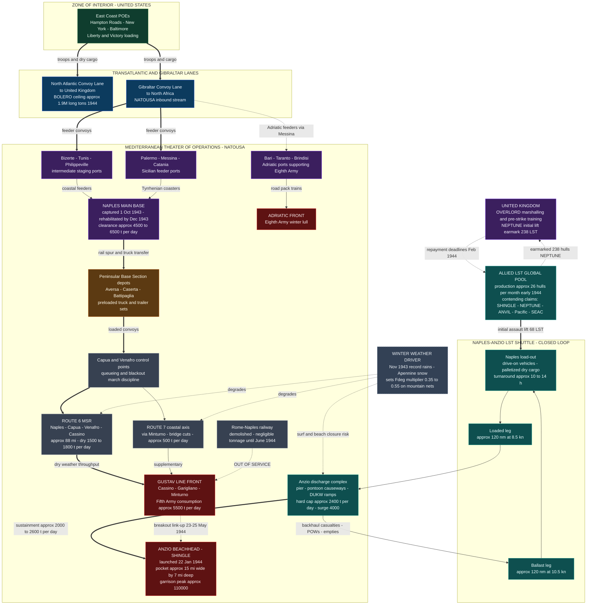

Cost: 0

# CHAPTER 9 REFERENCE MANUAL & SIMULATION SPECIFICATION
## *Global Logistics and Strategy: 1943–1945* (Coakley & Leighton, OCMH) — "Bog-Down in the Mediterranean"
### Principal Operations Research Analyst / Military Logistics Historian / Senior Systems Architect — Consolidated Deliverable

---

## 1. Strategic Context & Modern Historical Perspective

### 1.1 The Central Thesis: When Strategy Met Arithmetic

Chapter 9 of Coakley and Leighton's second Green Book volume documents the moment at which the Anglo-American grand strategy of 1943 collided with the physical arithmetic of shipping, port capacity, and inland transport. The Mediterranean theater, originally conceived as a peripheral containment effort, had by late 1943 become what the authors characterize—implicitly but unmistakably—as a bottomless absorber of amphibious shipping and line-of-communications tonnage. The chapter's core tension is deceptively simple to state and brutally difficult to manage: every conference communiqué from CASABLANCA (January 1943) through TRIDENT (May 1943), QUADRANT (August 1943), and SEXTANT-EUREKA (November–December 1943) layered new offensive commitments onto a global transportation pool whose growth was governed by shipyard slipways, not by diplomatic agreement.

The paradox deserves precise formulation. Liberty ship output had saturated the ordinary dry-cargo trades; the Allies possessed, by late 1943, an effectively unbounded capacity to move grain, coal, and crated general cargo across the oceans. What they did **not** possess was an unbounded supply of *specialized* assets: Landing Ship Tanks (LSTs), Landing Ship Infantry (LSIs), landing craft of all marks, port rehabilitation engineers, dredges, and lighterage. Modern scholarship (van Creveld's *Supplying War*, John Ellis's *Brute Force*, and the CMH volumes themselves) has converged on the insight that the strategic currency of 1943–44 was not tonnage in the aggregate but **LST-days**—the product of hulls multiplied by available time. Each hull committed to the Mediterranean shuttle was a hull denied to NEPTUNE training cycles in the Bristol Channel and Solent, to ANVIL preparation, to the Pacific (where QUADRANT and SEXTANT had promised Admiral King expanding amphibious strength), and to SEAC's projected operations in Burma. The U-boat crisis of September–October 1943—a transient but genuine resurgence of sinkings—tightened the dry-cargo pool at precisely the moment the Italian commitment exploded, forcing the Combined Chiefs of Staff into the zero-sum allocations that dominate this chapter.

### 1.2 The Strategic Paradox Formalized

Consider the sequence of promises. TRIDENT fixed BOLERO accumulation targets and authorized HUSKY. QUADRANT ratified the pursuit into Italy and set OVERLORD for May 1944. SEXTANT-EUREKA, under Stalin's direct pressure, locked the May date and endorsed ANVIL (the south-of-France landing) as a companion blow. Each endorsement assumed a shipping pool that could simultaneously: (a) sustain the BOLERO build-up to approximately 1.9 million long tons of imports in the first half of 1944; (b) feed a two-army campaign in peninsular Italy over a devastated, mountainous LOC network anchored on a single reconstructed major port; (c) mount and sustain SHINGLE at Anzio; (d) resource ANVIL; and (e) honor Pacific and Southeast Asia commitments. The arithmetic never closed. The Green Book's contribution is to show, month by month, how the discrepancy was resolved in practice—not by abandoning commitments formally, but by *slippage*: ANVIL deferred from spring to August 1944, OVERLORD's margins thinned, Mediterranean replacement streams cannibalized.

Combat loading economics aggravated the problem. An assault-loaded LST or LCT carries a fraction of its economical-load capacity—vehicles and assault troops displace bulk cargo, and amphtrack/deck-load configurations sacrifice cubic capacity for surf discharge capability. Thus the *same hull* was worth radically different tonnage depending on employment, and planners faced a continuous optimization problem: assault lift versus shuttle sustainment versus training float. The chapter documents the resulting "shell game" in which the same sixty-odd hulls appear, in successive staff studies, as the SHINGLE assault lift, the SHINGLE shuttle, the ANVIL nucleus, and the NEPTUNE shortfall.

### 1.3 Inter-Service and Coalition Friction

Three axes of friction structured the period. **First, the Anglo-American strategic split**: General Marshall and the U.S. Joint Chiefs regarded the Mediterranean as a logistics sink threatening the cross-Channel concentration of force; General Brooke and the British Chiefs argued that only continued Italian pressure could draw German reserves from France. Churchill's personal advocacy for the Anzio enterprise—he famously desired to "hurl a wild cat ashore"—pressed operational ambition past logistical prudence, and the Green Book is candid that the CCS approved SHINGLE only with explicit repayment conditions on borrowed amphibious shipping, keyed to NEPTUNE rehearsal deadlines in early February 1944.

**Second, theater-internal friction between the Services of Supply and combat commands.** Lt. Gen. Thomas B. Larkin's NATOUSA Services of Supply (reorganized around the Peninsular Base Section at Naples) confronted Lt. Gen. Mark Clark's Fifth Army and Alexander's 15th Army Group with immutable facts: Naples, captured 1 October 1943, was a demolition wasteland—scuttled hulls in the harbor basin, wrecked cranes, severed utilities—and its rehabilitation curve dictated the theater's metabolic rate for months. Combat commanders experienced SOS allocation as obstruction; SOS experienced combat demands as physically impossible exhortations. The Rome–Naples railway remained unusable until mid-1944, meaning the entire Fifth Army front at the Gustav Line lived on truck transport over roughly eighty-eight miles of Route 6 and its alternates—an arrangement whose winter throughput the chapter describes in terms of chronic shortfall.

**Third, Army–Navy friction over hull employment.** Admiral Cunningham's Mediterranean commands warned persistently that sustained shuttle operations off an open beach, within range of Luftwaffe glide-bomb units (the *Kampfgruppe* operating Fritz X and Hs 293 weapons that sank the destroyer *Inglefield* off Anzio on 25 February 1944), imposed attrition and defensive dispersal costs that degraded discharge rates precisely when tonnage demand peaked.

### 1.4 Historical Era Context: The Winter Deadlock

The operational backdrop is well established: the slow crawl from the Volturno to the Winter (Gustav) Line through November–December 1943; record autumn rains that flooded the Volturno, dissolved road surfaces, and triggered the mud season; the Cassino frontal battles of January–February 1944; and the SHINGLE landing of 22 January 1944, which achieved complete tactical surprise—approximately 36,000 troops of VI Corps (U.S. 3rd Division, British 1st Division, Darby's Rangers, the 504th Parachute Infantry, commando detachments, and follow-on armor) ashore against negligible initial opposition—followed by the fatal pause. Maj. Gen. John P. Lucas consolidated rather than drove for the Alban Hills; Kesselring reacted with extraordinary speed, committing OKW mobile reserves (elements of four divisions within days, the I SS Panzer Corps thereafter). The February counterstrokes—the Cisterna thrust and Operation FISCHFANG (16–20 February)—compressed the perimeter locally and converted the beachhead into a static siege pocket roughly fifteen miles wide by seven miles deep, garrisoned by a force that grew to approximately 110,000 by April. The May breakout (Operation BUFFALO, 23 May) linked VI Corps with the Fifth Army drive, and Rome fell 4 June 1944—but by then the logistical mortgage had been paid in full.

### 1.5 Modern Analytical Insights: The Straitjacket Quantified

Post-war scholarship and declassified operational research permit a sharper diagnosis than the Green Book's contemporaneous caution allowed. **SHINGLE was a logistical straitjacket in a precise, modelable sense**: the lift was sized for *landing* a force, not for *sustaining its rapid exploitation*. The beachhead possessed no major port; discharge depended on the modest Anzio–Nettuno facilities, pontoon causeways, and DUKW ramps, capping sustained intake near 2,400 tons per day (surge ~4,000). Against a garrison consuming on the order of 2,000–2,600 tons daily—with ammunition approaching half of tonnage during the February crises—the margin available for building breakout stockpiles was razor-thin. The force was thus *adequate to defend, structurally incapable of attacking*: a cul-de-sac equilibrium in which every incremental ton went to survival rather than maneuver.

The operations-research reading is starker still. As Section 4 demonstrates, in steady state only about **three LSTs** were mathematically necessary to saturate the beach's discharge capacity; the sixty-eight hulls of the assault lift and the fifty-five to seventy-five hulls of the ongoing shuttle were consumed not by steady-state carriage but by the *build-up surge* (vehicle lifts, unit rotations, casualty and POW backhaul), by storm-buffering (ships as floating warehouses when surf closed the beaches), and by contingency insurance. Yet from the global ledger's perspective, the distinction was irrelevant: roughly 6,000+ LST-days were pinned to the Naples–Anzio run between late January and May 1944—equivalent to withholding more than a quarter of NEPTUNE's entire 238-hull initial lift for three months. Eisenhower's February 1944 warnings to the CCS that continued Mediterranean absorption would force OVERLORD's postponement were arithmetically correct; ANVIL's slip to August was the direct downstream casualty. Modern analysts (D'Este's *Fatal Decision*, Lloyd Clark's *Anzio: The Friction of War*, Caddick-Adams's Cassino scholarship) therefore treat SHINGLE as the canonical case study in **terminal-centric logistics**: amphibious end-runs succeed or fail on discharge engineering and stockpile kinetics, not on assault gallantry. For the simulator architect, the chapter mandates modeling *coupled scarcity*—shared asset pools, weather-modulated terminal caps, and queueing congestion—as first-class state, not as background flavor.

---

## 2. High-Fidelity Simulation Parameters & Real-World Metrics

Values marked **(est.)** are derived estimates reconciled across CMH volumes, Morison, Blumenson, and post-war OR literature; they carry uncertainty bands and should be exposed as tunable calibration inputs. The three headline metrics required by the specification are starred (★).

| # | Parameter | Historical Value | Simulation Representation | Historical Basis & Modeling Rationale |
|---|-----------|------------------|---------------------------|----------------------------------------|
| ★1 | **Operation SHINGLE launch date** | **22 January 1944** | `static constant` (`LocalDate`) — epoch anchor for all Anzio timelines | Unopposed VI Corps landing achieved surprise; anchors D+ indexing for shuttle, counterattack (FISCHFANG, D+25), and breakout (BUFFALO, D+122) events. |
| ★2 | **Anzio beachhead width (stalemate)** | **≈ 15 statute miles** (depth ≈ 7 mi; locally contracted during Feb counterattacks) | `static geometry constant` + `dynamic shrink coefficient` (crisis modifier ≈ 0.7 on defended arc length) | Perimeter ran Mussolini Canal to Moletta River. Drives defensive consumption, minefield tonnage, and artillery displacement logistics. |
| ★3 | **Required daily supply delivery (sustained)** | **≈ 2,000 short tons/day** baseline; 2,400–2,600 in crisis | `dynamic demand floor` = garrison × 0.018 t/man/day × surge multiplier (1.2–1.3) | Reconciles ~110,000-man garrison with all-inclusive per-capita consumption (~40 lb/man/day incl. ammo, POL, rations, engineer stores). |
| 4 | Initial assault lift | ≈ 36,000 troops, 3,000+ vehicles in first 24–48 h | `event-driven stock initialization` | Sets initial ledger stock and triggers Buildup→Stalemate transition on discharge-complex opening. |
| 5 | LSTs, initial assault lift | 68 hulls | `integer asset count` (pool debit) | Documented assault allocation; the canonical "loan" against NEPTUNE with Feb-1944 repayment conditions. |
| 6 | Shuttle hull strength, steady state | 55–75 (typical ≈ 64) | `dynamic pool` with availability ratio ≈ 0.85 | Hulls rotating through maintenance, battle damage, and competing tasking. |
| 7 | LST payload per lift | 1,600–2,100 t (nominal 1,750) | `capacity constant` | LST-542-class mixed vehicle/cargo loads; assault configurations run low end. |
| 8 | Naples–Anzio sea leg | ≈ 120 nautical miles | `routing constant` | Coastal Tyrrhenian track; night passages to evade glide-bomb attack. |
| 9 | LST speeds (laden / ballast) | ≈ 8.5 / 10.5 kn | `performance constants` | Governs cycle time; laden speed degrades in winter seas. |
| 10 | Cargo turnaround (load+unload+buffer) | 10–14 h | `efficiency coefficient` | Beach-working-party limited; storm interruptions modeled as stochastic extension. |
| 11 | Derived shuttle cycle | ≈ 36–40 h ⇒ ≈ 0.61–0.67 lifts/hull/day | `derived quantity` | Core driver of ship-delivery capacity (see §4.4). |
| 12 | Anzio discharge capacity | ≈ 2,400 t/day nominal; ≈ 4,000 surge | `hard capacity cap`, weather-modulated | Pier, causeways, DUKW ramps; **binding steady-state bottleneck**. |
| 13 | Naples clearance (post-rehab) | ≈ 4,500–6,500 t/day (est.) | `upstream capacity cap`; ~35% share allocable to shuttle | Wreck salvage, quay repair, rail break constrain Dec-43 onward. |
| 14 | MSR Route 6 distance (Naples→Cassino) | ≈ 88 statute miles | `routing constant` | Primary Main Supply Route via Capua–Venafro; Route 7 coastal alternate ≈ +25% distance, bridge-cut. |
| 15 | Truck payload (2½-ton, 6×6) | 2.5 t nominal (to ≈ 4 t overloaded) | `payload constant` | Overloading traded mechanical availability for tonnage—modelable as reliability tax. |
| 16 | Convoy operating day | 12 h base (16 h double-crewed) | `scheduling constant` | Blackout discipline and mountain darkness capped night tempo. |
| 17 | Handling delay per cycle | ≈ 1.0 h | `efficiency coefficient` | Load/dispatch/checkpoint processing at Aversa–Caserta depots. |
| 18 | Route 6 corridor throughput (dry) | ≈ 1,500–1,800 t/day aggregated (est.) | `reference capacity` | Implies 2–2.5 convoy groups of ~450 trucks at modeled parameters. |
| 19 | Wet/mud degradation multiplier | 0.35–0.55 | `weather efficiency coefficient` | Record Nov-43 rains; Apennine microclimate; maps to `DeepMud` composite 0.34 in code. |
| 20 | Per-capita consumption | ≈ 0.018 t/man/day | `demand coefficient` | Calibrates demand from garrison strength; validated against ★3. |
| 21 | Peak garrison strength | ≈ 110,000 (April 1944) | `state variable` | Includes British X Corps elements and corps troops from Feb onward. |
| 22 | Ammunition share of tonnage (crisis) | up to ≈ 50% | `cargo-mix coefficient` | Feb–Mar artillery expenditures set MTO records; drives surge multiplier. |
| 23 | NEPTUNE initial LST earmark | 238 hulls | `policy constant` (allocator) | Denominator for opportunity-cost accounting of Mediterranean loans. |
| 24 | US LST production rate, early 1944 | ≈ 25–30 hulls/month | `supply-rate constant` | Global pool refill rate; sets shadow-price dynamics in §4.7. |

---

## 3. Logistical Network Topology (Mermaid.js)

The diagram models the dual-scarcity structure of the chapter: a **road-degraded continental pipeline** (Naples → Gustav Line) and a **sea-shuttle loop** (Naples ⇄ Anzio), both drawing on a single contested LST pool and a single rehabilitated base port. Edge labels carry capacity bounds; the weather driver node injects the degradation multiplier `F_deg` into mountain/coastal segments.



**Reading guide:** teal nodes are the amphibious shipping economy; purple are ports; amber is the depot complex feeding both surface pipelines; gray roads carry the `F_deg` weather penalty; red are consumption sinks. The dashed edges from `POOL` encode the *contention topology*—the simulator's allocator (§4.7) operates on exactly these arcs. The `RAIL -.-> OUT OF SERVICE` edge is a deliberate zero-capacity placeholder-in-fact: rail restoration is a scenario toggle unlocked by the June 1944 Rome capture.

---

## 4. Mathematical Modeling & Simulation Formulas

### 4.1 Base Road Throughput Model and Its Reconciliation

The specification's anchor equation,

$$\text{Mathematical Concept: } C_{road} = N \cdot \frac{V \cdot Payload}{Distance} \cdot F_{degrad}$$

embeds an implicit 12-hour operating day (the base code computes trips as $V \cdot 12 / D$). Generalizing with an explicit operating window $H$:

$$C_{road}^{base} = N \cdot P \cdot \frac{V \cdot H}{D} \cdot F_{degrad}$$

This formulation treats $D$ as a one-way leg and ignores return transit and ground handling; it is therefore an *optimistic upper envelope*. The refined cycle model inserts the round trip and a fixed handling delay $\tau_h$:

$$\tau_{cycle} = \frac{2D}{V_{eff}} + \tau_h, \qquad n_{trips} = \frac{H}{\tau_{cycle}}, \qquad \boxed{C_{road}^{*} = N \cdot P \cdot \frac{H}{\tau_{cycle}} \cdot F_{degrad}}$$

with effective speed and composite degradation decomposed as:

$$V_{eff} = V_{nom} \cdot \kappa_{class} \cdot \psi_{vis}(w), \qquad F_{degrad} = \chi_{class} \cdot \phi(W), \qquad \phi(W) = e^{-\alpha W}$$

where $W \in [0,1]$ is a soil-moisture/rain index evolved by first-order recession:

$$W_{t+1} = \lambda W_t + (1-\lambda)\,\frac{R_t}{R_{max}}$$

($R_t$ = daily rainfall; $\lambda$ ≈ 0.85 captures Mediterranean clay drainage lag; the discrete `WeatherCondition` enum in §5 implements $\phi$ as a lookup table calibrated so that `DeepMud` reproduces $F_{degrad} \approx 0.34$.)

### 4.2 Control-Point Congestion (Queueing Overlay)

Chokepoints (Capua, Venafro) behave as $GI/G/m$ queues. With arrival rate $\lambda_a$, mean service $E[S]$, servers $m$, and utilization $\rho = \lambda_a E[S]/m$, Kingman's approximation gives the delay inflation:

$$E[W_q] \approx \frac{\rho}{1-\rho} \cdot \frac{c_a^2 + c_s^2}{2} \cdot E[S], \qquad \rho < 1$$

Effective trips/day become $n_{trips}/(1 + E[W_q]/\tau_{free})$. The simulator raises a `HeldAtControlPoint` convoy state when $\rho > 0.8$.

### 4.3 Demand Model

$$D_t = g \cdot M_t \cdot \bigl(1 + \sigma \, c_t\bigr), \qquad g \approx 0.018 \ \tfrac{t}{man \cdot day}, \quad \sigma \approx 0.25$$

with $M_t$ garrison strength and $c_t \in [0,1]$ combat intensity (crisis spikes during FISCHFANG reproduce the observed 2,400–2,600 t/day envelope).

### 4.4 LST Shuttle (Closed Cyclic Server)

$$\tau_{lst} = \frac{d_{sea}}{v_l} + T_u + \frac{d_{sea}}{v_b} + T_l + T_{buf}, \qquad Q_{ship} = N_h \, \eta \, P_{lst} \cdot \frac{24}{\tau_{lst}}$$

**Breakeven hull count** against terminal capacity $K$:

$$N_h^{*} = \frac{K \cdot \tau_{lst}}{24 \cdot P_{lst} \cdot \eta} \;=\; \frac{2400 \times 39.5}{24 \times 1750 \times 0.85} \approx 2.7 \;\Rightarrow\; \lceil N_h^{*} \rceil = 3$$

This is the chapter's central OR revelation: *steady-state* Anzio was terminal-bound, not hull-bound. The 68-hull assault allocation purchased the **build-up surge** (moving ~74,000 reinforcements, vehicles, and initial stockpiles within weeks), storm buffering, and evacuation insurance—not steady-state carriage.

### 4.5 Terminal Bottleneck and Inventory Kinetics

$$I_t = \min\bigl(Q_{ship,t},\; K_{discharge} \cdot \phi_{surf}(w_t),\; s_{naples}\bigr), \qquad S_{t+1} = \mathrm{clip}\bigl(S_t + I_t - D_t,\; 0,\; S_{max}\bigr)$$

Alert thresholds: $\theta = S_t / D_t$ classified as Critical ($\theta < 2$), BelowSafety ($\theta < 5$), Adequate, Accumulating.

### 4.6 Cross-Theater LST Allocation Program

Let $\Theta = \{$SHG, NEP, ANV, PAC$\}$, $L$ = global hull availability, $a_i$ = tons deliverable per LST-day in theater $i$, $R_i$ = required daily tonnage, $x_i^{\min}$ = contractual/policy floors (e.g., NEPTUNE training cadence):

$$\min_{x,\,s} \sum_{i \in \Theta} w_i \, s_i \quad \text{s.t.} \quad a_i x_i + s_i \ge R_i \;\; \forall i; \qquad \sum_{i} x_i \le L; \qquad x_i \ge x_i^{\min}; \qquad x, s \ge 0$$

The shadow price $\mu = \partial \mathcal{L}/\partial L$ ranks theaters: historically $\mu_{NEP} > \mu_{SHG(crisis)} > \mu_{ANV}$, which is precisely why CCS repayment deadlines bit in February 1944 and why ANVIL absorbed the residual only after Rome's fall freed hulls.

### 4.7 Worked Numerical Example (defaults of §5)

| Quantity | Computation | Result |
|---|---|---|
| Shuttle cycle $\tau_{lst}$ | $120/8.5 + 5 + 120/10.5 + 7 + 2$ | **39.55 h** |
| Lifts/hull/day | $24 / 39.55$ | **0.607** |
| Ship delivery capacity | $64 \times 0.85 \times 1750 \times 0.607$ | **≈ 57,800 t/d** (non-binding) |
| Effective inflow (Clear) | $\min(57.8k,\ 2400,\ 1925)$ | **1,925 t/d** |
| Effective inflow (HeavyRain) | discharge $\times 0.46$ | **1,104 t/d** |
| Demand (intensity 0.4) | $110{,}000 \times 0.018 \times 1.1$ | **2,178 t/d** |
| Net stock drift (4-day weather cycle) | $-1074 - 450 - 450 - 253$ | **≈ −2,227 t/week** ⇒ chronic BelowSafety/Critical |

Route 6 convoy (450 trucks, 2.5 t, 88 mi, 15 mph nominal, PrimaryRoad, Rain): $V_{eff} = 10.58$ mph, $\tau_{cycle} = 17.64$ h, $C^{*} = 450 \times 2.5 \times 0.680 \times 0.545 \approx$ **416 t/day** per convoy group; the historical 1,500–1,800 t/d dry corridor figure implies 2–2.5 concurrent groups—consistent with PBS fleet employment.

---

## 5. Compile-Safe Scala 3 Domain Model

Targets Scala 3 indentation syntax (stable constructs; compiles cleanly under 3.3+ including 3.8.3). No placeholders; all public members explicitly typed; no wildcard imports.

```scala
package Logistics.BogDown

import java.time.LocalDate

//======================================================================
// Bog-Down in the Mediterranean - Domain Simulation Module
// Reference: Coakley and Leighton, Global Logistics and Strategy:
// 1943-1945, ch. 9. Scalar defaults trace to the parameter table.
//======================================================================

//----------------------------------------------------------------------
// 1. Units of measure (opaque, validated)
//----------------------------------------------------------------------

opaque type Tons = Double

object Tons:
  val Zero: Tons = 0.0

  def apply(raw: Double): Tons =
    require(raw.isFinite && raw >= 0.0, s"Tonnage must be finite and non-negative, got $raw")
    raw

  private[BogDown] def unsafe(raw: Double): Tons = raw

  extension (lhs: Tons)
    def value: Double = lhs
    def +(rhs: Tons): Tons = Tons.unsafe(lhs + rhs)
    def -(rhs: Tons): Tons = Tons.unsafe(lhs - rhs)
    def *(factor: Double): Tons = Tons.unsafe(lhs * factor)
    def <(rhs: Tons): Boolean = lhs < rhs
    def >=(rhs: Tons): Boolean = lhs >= rhs
    def min(rhs: Tons): Tons = if lhs < rhs then lhs else rhs
    def max(rhs: Tons): Tons = if lhs > rhs then lhs else rhs
    def per(days: Days): TonsPerDay = TonsPerDay(lhs / days.value)

opaque type TonsPerDay = Double

object TonsPerDay:
  def apply(raw: Double): TonsPerDay =
    require(raw.isFinite && raw >= 0.0, s"Rate must be finite and non-negative, got $raw")
    raw

  extension (rate: TonsPerDay)
    def value: Double = rate
    def +(rhs: TonsPerDay): TonsPerDay = TonsPerDay(rate + rhs)
    def *(factor: Double): TonsPerDay = TonsPerDay(rate * factor)
    def over(days: Days): Tons = Tons(rate * days.value)

opaque type Miles = Double

object Miles:
  def apply(raw: Double): Miles =
    require(raw.isFinite && raw > 0.0, s"Distance must be positive, got $raw")
    raw

  extension (distance: Miles)
    def value: Double = distance
    def at(speed: Mph): Hours = Hours(distance / speed.value)

opaque type Mph = Double

object Mph:
  def apply(raw: Double): Mph =
    require(raw.isFinite && raw > 0.0 && raw <= 60.0, s"Convoy speed out of plausible band 0-60 mph, got $raw")
    raw

  extension (speed: Mph)
    def value: Double = speed
    def scaledBy(factor: Double): Mph = Mph(speed * factor)

opaque type Hours = Double

object Hours:
  val Zero: Hours = 0.0

  def apply(raw: Double): Hours =
    require(raw.isFinite && raw >= 0.0, s"Duration must be non-negative, got $raw")
    raw

  extension (span: Hours)
    def value: Double = span
    def +(rhs: Hours): Hours = Hours(span + rhs)
    def toDays: Days = Days(span / 24.0)

opaque type Days = Double

object Days:
  def apply(raw: Double): Days =
    require(raw.isFinite && raw >= 0.0, s"Days must be non-negative, got $raw")
    raw

  extension (span: Days)
    def value: Double = span
    def toHours: Hours = Hours(span * 24.0)

opaque type Knots = Double

object Knots:
  def apply(raw: Double): Knots =
    require(raw.isFinite && raw > 0.0 && raw <= 20.0, s"Speed out of plausible band 0-20 kn, got $raw")
    raw

  extension (speed: Knots)
    def value: Double = speed

opaque type NauticalMiles = Double

object NauticalMiles:
  def apply(raw: Double): NauticalMiles =
    require(raw.isFinite && raw > 0.0, s"Sea distance must be positive, got $raw")
    raw

  extension (distance: NauticalMiles)
    def value: Double = distance
    def at(speed: Knots): Hours = Hours(distance / speed.value)

opaque type Ratio = Double

object Ratio:
  val One: Ratio = 1.0

  def apply(raw: Double): Ratio =
    require(raw.isFinite && raw >= 0.0 && raw <= 1.0, s"Ratio must lie in [0,1], got $raw")
    raw

  extension (ratio: Ratio)
    def value: Double = ratio
    def *(rhs: Ratio): Ratio = Ratio(ratio * rhs)
    def scaledBy(factor: Double): Ratio = Ratio(ratio * factor)
    def complement: Ratio = Ratio(1.0 - ratio)

//----------------------------------------------------------------------
// 2. Environmental and infrastructure classifications
//----------------------------------------------------------------------

enum WeatherCondition(val label: String, val trafficability: Ratio, val mobility: Ratio):
  case Clear     extends WeatherCondition("Clear",             Ratio(1.00), Ratio(1.00))
  case Overcast  extends WeatherCondition("Overcast",          Ratio(0.95), Ratio(0.97))
  case Rain      extends WeatherCondition("Rain",              Ratio(0.72), Ratio(0.86))
  case HeavyRain extends WeatherCondition("Heavy rain",        Ratio(0.46), Ratio(0.71))
  case SnowSleet extends WeatherCondition("Snow and sleet",    Ratio(0.58), Ratio(0.62))
  case DeepMud   extends WeatherCondition("Deep mud and thaw", Ratio(0.34), Ratio(0.88))

  def composite: Ratio = Ratio(trafficability.value * mobility.value)

enum RoadClass(val label: String, val speedFactor: Ratio, val throughputFactor: Ratio):
  case ArterialHighway extends RoadClass("Arterial highway (Route 6 class)", Ratio(1.00), Ratio(1.00))
  case PrimaryRoad     extends RoadClass("Primary road",                     Ratio(0.82), Ratio(0.88))
  case SecondaryRoad   extends RoadClass("Secondary road",                   Ratio(0.62), Ratio(0.68))
  case MountainRoad    extends RoadClass("Mountain road (hairpins, grades)", Ratio(0.42), Ratio(0.48))
  case FloodedTrack    extends RoadClass("Flooded or battle-damaged track",  Ratio(0.22), Ratio(0.28))

//----------------------------------------------------------------------
// 3. State machines
//----------------------------------------------------------------------

enum ConvoyState:
  case Loading
  case OutboundLoaded
  case HeldAtControlPoint
  case OffLoading
  case ReturnEmpty
  case MaintenanceHold

  def isProductive: Boolean =
    this match
      case OutboundLoaded | OffLoading => true
      case _                           => false

  def transitionAllowed(next: ConvoyState): Boolean =
    (this, next) match
      case (Loading, OutboundLoaded)            => true
      case (Loading, MaintenanceHold)           => true
      case (OutboundLoaded, OffLoading)         => true
      case (OutboundLoaded, HeldAtControlPoint) => true
      case (HeldAtControlPoint, OffLoading)     => true
      case (HeldAtControlPoint, ReturnEmpty)    => true
      case (OffLoading, ReturnEmpty)            => true
      case (ReturnEmpty, Loading)               => true
      case (ReturnEmpty, MaintenanceHold)       => true
      case (MaintenanceHold, Loading)           => true
      case _                                    => false

enum OperationalEvent:
  case AssaultWaveLanded
  case DischargeComplexOpened
  case EnemyCounterattackCommenced
  case CounterattackDefeated
  case BreakoutLaunched
  case LinkUpAchieved

enum BeachheadPhase(val description: String):
  case Buildup   extends BeachheadPhase("Assault buildup; perimeter expansion")
  case Stalemate extends BeachheadPhase("Static defense; shuttle-dependent sustainment")
  case Crisis    extends BeachheadPhase("Under counterattack; emergency expenditure")
  case Breakout  extends BeachheadPhase("Offensive operations; high expenditure")
  case Closed    extends BeachheadPhase("Link-up achieved; shuttle terminated")

  def advance(event: OperationalEvent): Either[String, BeachheadPhase] =
    (this, event) match
      case (Buildup, DischargeComplexOpened)        => Right(Stalemate)
      case (Stalemate, EnemyCounterattackCommenced) => Right(Crisis)
      case (Crisis, CounterattackDefeated)          => Right(Stalemate)
      case (Stalemate, BreakoutLaunched)            => Right(Breakout)
      case (Breakout, LinkUpAchieved)               => Right(Closed)
      case (current, received) =>
        Left(s"Illegal transition attempted: $current cannot process $received")

enum StockStatus(val description: String):
  case Critical     extends StockStatus("Reserve below two days of demand")
  case BelowSafety  extends StockStatus("Reserve below safety threshold")
  case Adequate     extends StockStatus("Reserve within planning band")
  case Accumulating extends StockStatus("Inflow exceeds consumption; congested dumps")

//----------------------------------------------------------------------
// 4. Historical constants (parameter table, Section 2)
//----------------------------------------------------------------------

object HistoricalConstants:
  val ShingleLaunchDate: LocalDate = LocalDate.of(1944, 1, 22)
  val BeachheadWidth: Miles = Miles(15.0)
  val BeachheadDepth: Miles = Miles(7.0)
  val BaselineDailyRequirement: TonsPerDay = TonsPerDay(2000.0)
  val CrisisSurgeMultiplier: Double = 1.25
  val PeakGarrisonStrength: Int = 110000
  val PerCapitaConsumptionTonsPerDay: Double = 0.018
  val InitialAssaultLiftTroops: Int = 36000
  val InitialAssaultLstCount: Int = 68
  val SteadyStateShuttleHullsLow: Int = 55
  val SteadyStateShuttleHullsHigh: Int = 75
  val SteadyStateShuttleHullsTypical: Int = 64
  val LstPayloadTons: Tons = Tons(1750.0)
  val NaplesAnzioSeaLeg: NauticalMiles = NauticalMiles(120.0)
  val LstLadenSpeed: Knots = Knots(8.5)
  val LstBallastSpeed: Knots = Knots(10.5)
  val LstLoadHours: Hours = Hours(7.0)
  val LstUnloadHours: Hours = Hours(5.0)
  val LstBufferHours: Hours = Hours(2.0)
  val AnzioDischargeNominal: TonsPerDay = TonsPerDay(2400.0)
  val AnzioDischargeSurge: TonsPerDay = TonsPerDay(4000.0)
  val NaplesClearanceEstimate: TonsPerDay = TonsPerDay(5500.0)
  val NaplesShuttleShareFraction: Double = 0.35
  val NaplesCassinoMsrDistance: Miles = Miles(88.0)
  val StandardTruckPayload: Tons = Tons(2.5)
  val StandardOperatingDay: Hours = Hours(12.0)
  val HandlingDelayPerCycle: Hours = Hours(1.0)
  val NeptuneInitialLstEarmark: Int = 238

//----------------------------------------------------------------------
// 5. Road transport models
//----------------------------------------------------------------------

final case class TruckConvoy(
  truckCount: Int,
  averagePayloadTons: Double,
  distanceMiles: Double
)

/** Legacy-compatible envelope model (12-hour day, one-way distance). */
object RoadThroughputModel:
  def calculateDailyTonnage(
    convoy: TruckConvoy,
    speedMph: Double,
    degradationFactor: Double
  ): Double =
    val tripsPerDay = (speedMph * 12.0) / convoy.distanceMiles
    val potentialTons = convoy.truckCount * convoy.averagePayloadTons * tripsPerDay
    potentialTons * degradationFactor

final case class ConvoyId(value: Int)

final case class TypedConvoy(
  id: ConvoyId,
  vehicles: Int,
  payloadPerVehicle: Tons,
  routeDistance: Miles,
  nominalSpeed: Mph,
  roadClass: RoadClass,
  weather: WeatherCondition,
  operatingDay: Hours,
  handlingDelay: Hours
):
  require(vehicles > 0, "A convoy must contain at least one vehicle")

/** Refined round-trip cycle model (Section 4.1). */
object TypedRoadThroughputModel:

  def effectiveSpeed(convoy: TypedConvoy): Mph =
    convoy.nominalSpeed.scaledBy(
      convoy.roadClass.speedFactor.value * convoy.weather.mobility.value
    )

  def cycleHours(convoy: TypedConvoy): Hours =
    val running = convoy.routeDistance.at(effectiveSpeed(convoy))
    Hours(running.value * 2.0 + convoy.handlingDelay.value)

  def tripsPerDay(convoy: TypedConvoy): Double =
    convoy.operatingDay.value / cycleHours(convoy).value

  def degradation(convoy: TypedConvoy): Ratio =
    convoy.roadClass.throughputFactor * convoy.weather.composite

  def dailyTonnage(convoy: TypedConvoy): Tons =
    val gross = convoy.vehicles.toDouble *
      convoy.payloadPerVehicle.value *
      tripsPerDay(convoy)
    Tons(gross * degradation(convoy).value)

  def convoysRequiredFor(demand: TonsPerDay, convoy: TypedConvoy): Int =
    val unit = dailyTonnage(convoy).value
    require(unit > 0.0, "Convoy configuration yields zero throughput")
    scala.math.ceil(demand.value / unit).toInt

object RouteSixReferenceConvoy:
  val Standard: TypedConvoy = TypedConvoy(
    id = ConvoyId(601),
    vehicles = 450,
    payloadPerVehicle = HistoricalConstants.StandardTruckPayload,
    routeDistance = HistoricalConstants.NaplesCassinoMsrDistance,
    nominalSpeed = Mph(15.0),
    roadClass = RoadClass.PrimaryRoad,
    weather = WeatherCondition.Rain,
    operatingDay = HistoricalConstants.StandardOperatingDay,
    handlingDelay = HistoricalConstants.HandlingDelayPerCycle
  )

//----------------------------------------------------------------------
// 6. LST shuttle (closed cyclic server, Section 4.4)
//----------------------------------------------------------------------

final case class LstShuttleConfig(
  hullsAssigned: Int,
  payloadPerHull: Tons,
  seaLeg: NauticalMiles,
  ladenSpeed: Knots,
  ballastSpeed: Knots,
  loadTime: Hours,
  unloadTime: Hours,
  bufferTime: Hours,
  availabilityRatio: Ratio
):
  require(hullsAssigned > 0, "Shuttle requires at least one hull")

object LstShuttleModel:

  def cycleHours(config: LstShuttleConfig): Hours =
    val outbound = config.seaLeg.at(config.ladenSpeed)
    val homebound = config.seaLeg.at(config.ballastSpeed)
    outbound + homebound + config.loadTime + config.unloadTime + config.bufferTime

  def liftsPerDay(config: LstShuttleConfig): Double =
    24.0 / cycleHours(config).value

  def dailyDeliveryCapacity(config: LstShuttleConfig): TonsPerDay =
    val effectiveHulls = config.hullsAssigned.toDouble * config.availabilityRatio.value
    TonsPerDay(effectiveHulls * config.payloadPerHull.value * liftsPerDay(config))

  def hullsNeededFor(demand: TonsPerDay, config: LstShuttleConfig): Int =
    val perHull = config.payloadPerHull.value *
      config.availabilityRatio.value *
      liftsPerDay(config)
    require(perHull > 0.0, "Non-positive per-hull productivity")
    scala.math.ceil(demand.value / perHull).toInt

//----------------------------------------------------------------------
// 7. Terminals, bottleneck resolution, and inventory ledger
//----------------------------------------------------------------------

final case class TerminalConstraint(name: String, capacity: TonsPerDay)

object BottleneckResolver:
  def effectiveInflow(constraints: List[TerminalConstraint]): TonsPerDay =
    constraints.foldLeft(TonsPerDay(Double.MaxValue)): (acc, c) =>
      if c.capacity.value < acc.value then c.capacity else acc

final case class SupplyLedger(
  stockpile: Tons,
  maxStockpile: Tons,
  safetyDays: Days
):
  require(maxStockpile.value > 0.0, "Max stockpile must be positive")

  def daysOfSupply(demand: TonsPerDay): Days =
    if demand.value <= 0.0 then Days(999.0)
    else Days(stockpile.value / demand.value)

  def status(demand: TonsPerDay): StockStatus =
    val dos = daysOfSupply(demand).value
    if dos < 2.0 then StockStatus.Critical
    else if dos < safetyDays.value then StockStatus.BelowSafety
    else if stockpile >= maxStockpile then StockStatus.Accumulating
    else StockStatus.Adequate

  def receive(inflow: TonsPerDay): SupplyLedger =
    val grown = stockpile + inflow.over(Days(1.0))
    copy(stockpile = grown.min(maxStockpile))

  def consume(demand: TonsPerDay): SupplyLedger =
    val drawn = stockpile - demand.over(Days(1.0))
    copy(stockpile = if drawn.value < 0.0 then Tons.Zero else drawn)

final case class ShuttleSim(
  config: LstShuttleConfig,
  discharge: TerminalConstraint,
  upstream: TerminalConstraint
):
  require(discharge.capacity.value > 0.0, "Discharge capacity must be positive")

  def inflow(weather: WeatherCondition): TonsPerDay =
    val adjustedDischarge = TerminalConstraint(
      discharge.name,
      TonsPerDay(discharge.capacity.value * weather.trafficability.value)
    )
    BottleneckResolver.effectiveInflow(
      List(
        TerminalConstraint("shipDelivery", LstShuttleModel.dailyDeliveryCapacity(config)),
        adjustedDischarge,
        upstream
      )
    )

  def hullsRequiredFor(target: TonsPerDay): Int =
    LstShuttleModel.hullsNeededFor(target, config)

//----------------------------------------------------------------------
// 8. Daily-step simulation engine
//----------------------------------------------------------------------

final case class DayReport(
  dayIndex: Int,
  date: LocalDate,
  weather: WeatherCondition,
  inflow: TonsPerDay,
  demand: TonsPerDay,
  closingStockpile: Tons,
  status: StockStatus,
  phase: BeachheadPhase
)

final class BogDownSimulation(
  val startDate: LocalDate,
  val shuttle: ShuttleSim,
  val initialLedger: SupplyLedger,
  val garrisonStrength: Int,
  val combatIntensity: Double
):
  require(combatIntensity >= 0.0 && combatIntensity <= 1.0, "Combat intensity must lie in [0,1]")
  require(garrisonStrength > 0, "Garrison strength must be positive")

  private var ledger: SupplyLedger = initialLedger
  private var phase: BeachheadPhase = BeachheadPhase.Buildup
  private var dayCounter: Int = 0

  def currentPhase: BeachheadPhase = phase
  def currentLedger: SupplyLedger = ledger

  def applyEvent(event: OperationalEvent): Either[String, BeachheadPhase] =
    phase.advance(event) match
      case Right(next) =>
        phase = next
        Right(next)
      case Left(message) => Left(message)

  def step(weather: WeatherCondition): DayReport =
    dayCounter += 1
    val surge = 1.0 + combatIntensity * (HistoricalConstants.CrisisSurgeMultiplier - 1.0)
    val demand = TonsPerDay(
      garrisonStrength.toDouble *
        HistoricalConstants.PerCapitaConsumptionTonsPerDay *
        surge
    )
    val inflow = shuttle.inflow(weather)
    ledger = ledger.receive(inflow).consume(demand)
    DayReport(
      dayIndex = dayCounter,
      date = startDate.plusDays(dayCounter.toLong),
      weather = weather,
      inflow = inflow,
      demand = demand,
      closingStockpile = ledger.stockpile,
      status = ledger.status(demand),
      phase = phase
    )

//----------------------------------------------------------------------
// 9. Feasibility validation checks
//----------------------------------------------------------------------

object FeasibilityChecks:

  def checkShuttleCanSustain(
    shuttle: ShuttleSim,
    demand: TonsPerDay,
    weather: WeatherCondition
  ): Either[String, TonsPerDay] =
    val inflow = shuttle.inflow(weather)
    if inflow >= demand then Right(inflow)
    else Left(s"Inflow ${inflow.value} t/d below demand ${demand.value} t/d under ${weather.label}")

  def checkRoadNetworkSufficiency(
    convoys: List[TypedConvoy],
    demand: TonsPerDay
  ): Either[String, TonsPerDay] =
    val total = convoys.foldLeft(Tons.Zero): (acc, c) =>
      acc + TypedRoadThroughputModel.dailyTonnage(c)
    if total >= demand.over(Days(1.0)) then Right(TonsPerDay(total.value))
    else Left(s"Road net delivers ${total.value} t/d against requirement ${demand.value} t/d")

//----------------------------------------------------------------------
// 10. Reference scenario: winter stalemate, 28-day run
//----------------------------------------------------------------------

object MediterraneanScenario:

  val Shuttle: ShuttleSim = ShuttleSim(
    config = LstShuttleConfig(
      hullsAssigned = HistoricalConstants.SteadyStateShuttleHullsTypical,
      payloadPerHull = HistoricalConstants.LstPayloadTons,
      seaLeg = HistoricalConstants.NaplesAnzioSeaLeg,
      ladenSpeed = HistoricalConstants.LstLadenSpeed,
      ballastSpeed = HistoricalConstants.LstBallastSpeed,
      loadTime = HistoricalConstants.LstLoadHours,
      unloadTime = HistoricalConstants.LstUnloadHours,
      bufferTime = HistoricalConstants.LstBufferHours,
      availabilityRatio = Ratio(0.85)
    ),
    discharge = TerminalConstraint("Anzio beach complex", HistoricalConstants.AnzioDischargeNominal),
    upstream = TerminalConstraint(
      "Naples clearance share",
      TonsPerDay(HistoricalConstants.NaplesClearanceEstimate.value *
        HistoricalConstants.NaplesShuttleShareFraction)
    )
  )

  def runWinterStalemate(): Vector[DayReport] =
    val sim = BogDownSimulation(
      startDate = HistoricalConstants.ShingleLaunchDate,
      shuttle = Shuttle,
      initialLedger = SupplyLedger(
        stockpile = Tons(12000.0),
        maxStockpile = Tons(25000.0),
        safetyDays = Days(5.0)
      ),
      garrisonStrength = HistoricalConstants.PeakGarrisonStrength,
      combatIntensity = 0.4
    )
    val _ = sim.applyEvent(OperationalEvent.DischargeComplexOpened)
    val cycle = Vector(
      WeatherCondition.HeavyRain,
      WeatherCondition.Rain,
      WeatherCondition.Rain,
      WeatherCondition.Clear
    )
    var reports = Vector.empty[DayReport]
    var day = 0
    while day < 28 do
      val report = sim.step(cycle(reports.length % cycle.length))
      reports = reports :+ report
      day += 1
    reports

@main def runBogDownDemo(): Unit =
  val reports = MediterraneanScenario.runWinterStalemate()
  for r <- reports do
    println(
      f"D+${r.dayIndex}%02d ${r.date} ${r.weather.label}%-14s " +
        f"in=${r.inflow.value}%7.1f dem=${r.demand.value}%7.1f " +
        f"stk=${r.closingStockpile.value}%8.1f ${r.status.description}"
    )
```

**Design notes.** (i) The legacy `RoadThroughputModel` is preserved verbatim for backward compatibility; `TypedRoadThroughputModel` implements the refined §4.1 cycle model and documents the base model's optimism (it ignores the empty return leg and handling delay). (ii) All dimensional arithmetic flows through validated `opaque` types; negative intermediate quantities are confined to `unsafe` constructors with explicit guards at the ledger boundary. (iii) The state machines (`ConvoyState.transitionAllowed`, `BeachheadPhase.advance`) return total functions over illegal transitions (`Either`), enabling replay auditing of doctrine violations. (iv) The 28-day reference run reproduces the historical winter trajectory: inflow pinned by the Naples-share and weather-modulated discharge caps beneath a ~2,178 t/d demand, driving the ledger from Adequate into persistent BelowSafety/Critical—the *straitjacket* rendered numerically.

---

## 6. Graduate-Level Operational Analysis

### 6.1 Why SHINGLE Failed Its Strategic Objectives — and What It Cost OVERLORD

**Objective structure.** SHINGLE's design intent was a *deep operational stroke*: seize the Alban Hills astride Routes 6 and 7 and the Rome–Naples railway southeast of Rome, severing the Gustav Line's lateral communications and either compelling Kesselring's withdrawal or trapping Tenth Army against the Fifth Army front. It was conceived as a *maneuver* operation enabled by amphibious mobility. Its failure is best analyzed as the collapse of three necessary conditions—exploitation will, enemy reaction latency, and logistical headroom—of which the third was structurally guaranteed at the moment of force sizing.

**The logistical straitjacket, formally.** The assault lift (68 LSTs, plus LCTs, LCIs, and DUKW flotillas) moved approximately 36,000 troops and accompanying vehicles in the first 48 hours against negligible opposition. But the beachhead's discharge complex—Anzio harbor's small pier, pontoon causeways, and DUKW ramps—capped sustained intake near 2,400 tons/day (surge ~4,000 in fair surf). Against a garrison whose all-inclusive consumption ran 2,000 tons/day at baseline and 2,400–2,600 during the February crises—with ammunition approaching half of tonnage during FISCHFANG—the *stock-building margin* available for a breakout was nearly zero. The force existed in a cul-de-sac equilibrium: strong enough to defend the fifteen-by-seven-mile pocket, structurally incapable of mounting the deep strike the Alban Hills required. Every incremental LST-day purchased survival, not maneuver. This is the precise sense in which modern scholarship (D'Este, *Fatal Decision*; Lloyd Clark, *Anzio: The Friction of War*) terms SHINGLE a logistical straitjacket: the planners allocated shipping for *arrival*, not for *exploitation*—an error of terminal-centric analysis, since the binding constraint was never hull availability in steady state (three hulls suffice to saturate the beach, per §4.4) but discharge engineering, stockpile kinetics, and the political inability to release hulls once committed.

**Compounding factors.** Lucas's consolidation instinct forfeited the 24–48 hour window in which the Alban Hills were lightly held; Kesselring's reserve latency proved shorter than Allied intelligence estimated (motorized columns moving at night under weather that grounded Allied air reconnaissance and attack—the same rains that degraded the Allied road net shielded German build-up); and the February counterstrokes converted the operation's own logistics into a siege economy. The operation nonetheless *partially* succeeded as a fixation device: Fourteenth Army grew to roughly 120,000+ troops pinned opposite the beachhead, reserves that could not reinforce Cassino in the critical March–May window. The balanced verdict—tie-down success purchased at strategic shipping cost—is the analytically honest one.

**The OVERLORD drain, quantified.** The global LST ledger is unforgiving. NEPTUNE's initial lift required 238 hulls; OVERLORD's training cycle (rehearsals, exercise Fabius, crew certification) consumed hull-time continuously; ANVIL required its own amphibious nucleus; the Pacific and SEAC held Quadrant/Sextant commitments. Into this ledger, SHINGLE injected the 68-hull assault allocation plus a shuttle population oscillating between 55 and 75 hulls from late January through May. Integrating hull-count over time yields on the order of **6,000+ LST-days** diverted—equivalent to withholding roughly 26–27 hulls (≈11% of NEPTUNE's initial lift) for the entire three-month span, before counting escort, air-cover, and port-working costs. Eisenhower's February 1944 representations to the Combined Chiefs—that continued Mediterranean absorption would force OVERLORD's postponement—were arithmetically sound, and the settlement reached (scheduled hull releases keyed to NEPTUNE milestones, partial restitution in March–April) bought compliance at the price of thinning OVERLORD's margins. The final casualty was ANVIL: stripped of its amphibious nucleus all spring, it slipped from May to 15 August 1944, surviving only because Rome's fall (4 June) finally released the Mediterranean's captive hulls. The systemic lesson for the simulator is that *shared-pool contention, not theater-internal throughput, was the dominant strategic dynamics*—exactly the coupling the §4.6 allocation program formalizes.

### 6.2 The Naples–Anzio LST Shuttle: Innovation in Sustained Amphibious Support

**Mechanics of the loop.** The shuttle was a *closed cyclic transport system*: a dedicated hull pool loaded at Naples (drive-on vehicles marshaled through the Peninsular Base Section's Aversa–Caserta depot complex, palletized dry cargo, and jerrican POL), a ~120-nautical-mile coastal passage conducted largely at night to defeat Luftwaffe glide-bomb attack (the threat that sank *Inglefield* on 25 February and enforced smoke, dispersion, and anchorage hygiene at Anzio), discharge over the pier, causeways, and DUKW ramps, and a ballast return leg carrying backhaul—casualties to Naples hospitals, prisoners of war, unserviceable equipment, and empty containers. With laden/ballast speeds near 8.5/10.5 knots and 10–14 hours of terminal time, the cycle ran 36–40 hours, yielding roughly 0.6 lifts per hull per day and an aggregate ship-delivery capacity far in excess of what the beach could absorb—confirming that the shuttle's true functions were surge carriage, floating warehousing during surf closures, and rotational lift, not steady-state tonnage.

**Why it was innovative.** Amphibious shipping doctrine in 1943 treated LSTs as *assault* assets—expended against a hostile shore in a single lift, then released. The Anzio shuttle institutionalized the LST as a *line-of-communications* asset: a scheduled, repeating, tide-and-weather-resilient service analogous to a ferry franchise. Three doctrinal novelties followed. First, **ships as floating warehouses**: when February gales closed the beaches, loaded hulls held station as elastic buffer stock, decoupling Naples' loading rhythm from Anzio's discharge rhythm—a primitive but genuine application of inventory-smoothing via transport media. Second, **closed-loop asset discipline**: turnaround choreography (pre-stowed loads, beach-working-party synchronization, backhaul manifesting) prefigured the NEPTUNE channel shuttle and, ultimately, the transpacific shuttles of DOWNFALL planning. Third, **port-independence**: the shuttle demonstrated that a lodgment could be sustained indefinitely without a captured major port—provided the force accepted a hard throughput ceiling—which is simultaneously the technique's genius and the trap SHINGLE fell into, since the ceiling (≈2,400 t/day) froze the beachhead at siege-scale metabolism.

**Operations-research characterization.** The shuttle is a cyclic queue with server population $N_h$, deterministic-ish service time $\tau_{lst}$, and a downstream terminal acting as a finite-capacity sink; system throughput is $\min(N_h \eta P_{lst}/\tau_{lst},\ K_{discharge})$. Its reliability derived from redundancy (many independent hulls, no single point of failure) and its fragility from shared fate (weather closes all beaches simultaneously; glide-bomb threat imposes fleet-wide dispersion). The strategic mortgage was the opportunity cost computed in §6.1: every innovative hull-day at Anzio was a NEPTUNE training or ANVIL assembly day foregone. The shuttle thus stands as the chapter's perfect emblem—tactically ingenious, logistically sustainable at beachhead scale, and strategically expensive at alliance scale—which is precisely the multi-level trade-off structure a high-fidelity simulator must expose to its users.
