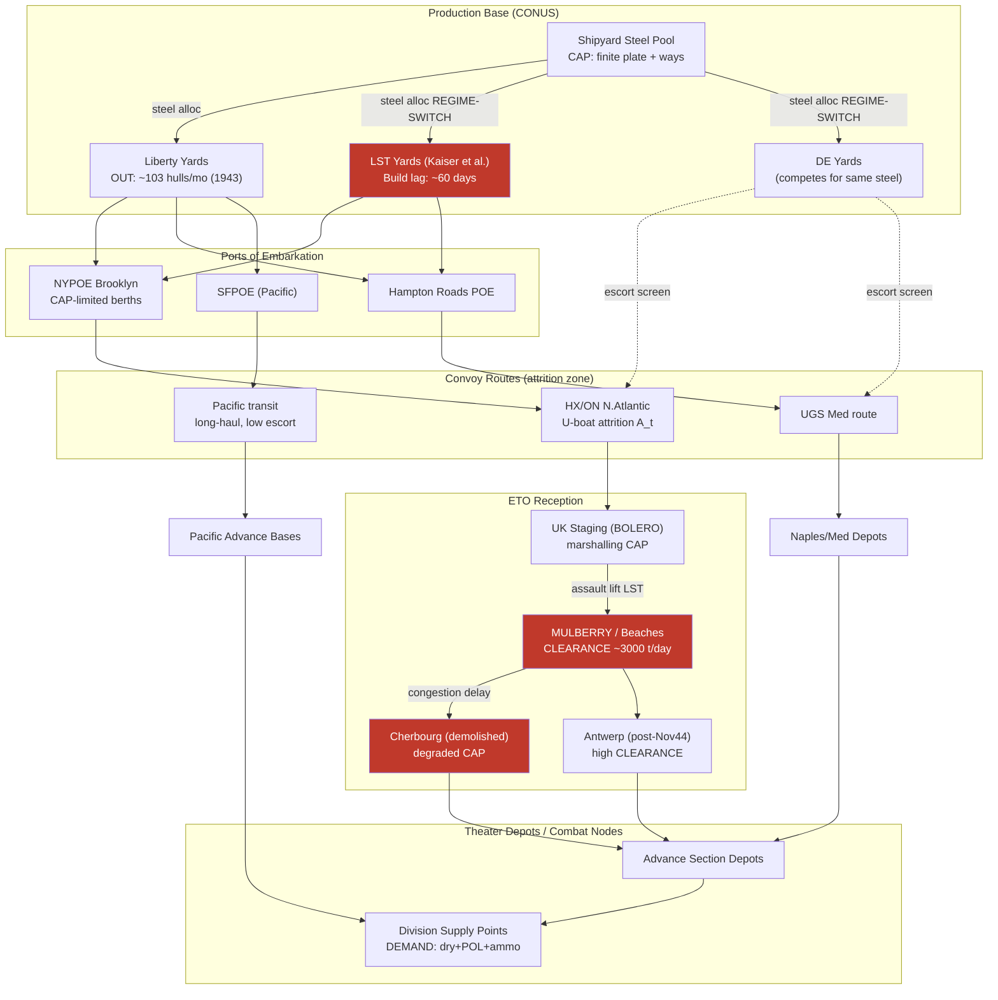

Cost: 0.283255

# Chapter 10: Ships, Landing Craft, and Strategy
## Reference Manual & Simulation-Specification Document
### US Army Green Book *"Global Logistics and Strategy: 1943–1945"*

---

## 1. Strategic Context & Modern Historical Perspective

### 1.1 The Strategic Paradox: Grand Design Against the Steel Ceiling

The central intellectual tension animating Chapter 10 is what modern logistics historians term the "strategic-material disjunction": the persistent, structurally embedded gap between the ambitions articulated at the great inter-Allied conferences and the immovable physical constraints imposed by the shipping and amphibious-lift pools. At Casablanca (SYMBOL, January 1943), TRIDENT (Washington, May 1943), QUADRANT (Quebec, August 1943), and SEXTANT (Cairo, November–December 1943), the Combined Chiefs of Staff repeatedly committed the Alliance to concurrent theater offensives—the Mediterranean campaign, the buildup for OVERLORD, the Pacific dual-axis advance, and support to China—whose aggregate lift requirements exceeded the physically available fleet by margins that, in retrospect, were arithmetically impossible to close within the stated timelines.

The paradox is best understood by recognizing that strategy in 1943–1945 was not fundamentally constrained by combat power, manpower, or even production of guns and aircraft. It was constrained by three sequential throughput bottlenecks: (1) *deep-water shipping* to move cargo across oceans; (2) *combat-loaded amphibious lift*—principally the Landing Ship, Tank (LST) and its associated family of craft—to deliver forces across a defended shoreline; and (3) *port clearance capacity* to discharge, sort, and evacuate cargo from congested beaches and captured ports before backlog paralyzed the entire pipeline. Each of these was a serial constraint, meaning that abundance in one did nothing to relieve scarcity in another. The Liberty ship program could, and did, achieve staggering output—yet a Liberty ship delivering 10,000 tons of cargo to a beachhead with a discharge capacity of 3,000 tons per day simply generated congestion, demurrage, and the immobilization of scarce hulls as floating warehouses.

The physical facts that modern declassification has sharpened are these. Combat loading—stowing a vessel so that equipment is discharged in tactical priority rather than in space-efficient order—reduces effective cargo density by roughly 40–50 percent compared to commercial "administrative" loading. Thus the same shipping pool that could sustain an established theater administratively could lift only a fraction of that tonnage in an assault configuration. Port clearance rates, meanwhile, were governed not by ship capacity but by shore infrastructure: cranes, lighters, DUKWs, rail spur capacity, and truck companies. At Naples, at Cherbourg (deliberately demolished by German engineers), and across the Normandy beaches before the artificial MULBERRY harbors and the eventual capture of Antwerp, clearance—not ship availability—was frequently the binding constraint.

### 1.2 Inter-Service and Coalition Tensions

The command friction of this era was structural, not merely personal. The **Services of Supply (SOS/ASF)** under Lieutenant General Brehon Somervell operated on a doctrine of pipeline efficiency and long-range statistical forecasting; the **combat commands** operated on a doctrine of assured local abundance—the field commander's rational preference to over-insure against supply failure at the decisive point. These two logics were irreconcilable at the margin, producing the chronic "requisition inflation" that ASF statisticians spent the war attempting to discount and dampen.

The deeper structural conflict was **Army versus Navy** over the allocation of shipbuilding steel and shipyard ways. The U.S. Navy controlled combatant construction—including the amphibious types under the Bureau of Ships—while the **Maritime Commission** under Admiral Emory Land controlled merchant construction (Liberties, Victories, tankers, C-types). These two programs drew from the same finite pool of steel plate, marine engines (particularly reduction gears and turbines), and skilled shipyard labor. Every LST keel laid was steel and welding capacity not devoted to a Destroyer Escort (DE)—the very platform needed to defeat the U-boat wolfpacks that were sinking the merchant hulls the entire strategy depended upon. This was a genuine strategic dilemma, not a coordination failure.

The **U.S.–British pooling arrangements**, principally the combined shipping adjustment boards (CSAB in Washington and London), attempted to treat Allied merchant tonnage as a single fungible resource. In practice, sovereign priorities intruded: British import requirements (the "6.5 million-ton" minimum stockpile debate), American insistence on Pacific allocation over Churchill's Mediterranean preferences, and the perennial argument over the timing of OVERLORD versus operations in the Aegean and Italy all played out as fights over hull-allocation ledgers.

### 1.3 Historical Era Context: The Supreme Constraint

Chapter 10 correctly identifies landing craft as the supreme constraint of the European war's operational tempo. The postponement of OVERLORD from 1943 to mid-1944 was, in the official and modern consensus, driven substantially by LST availability. Operation ANVIL/DRAGOON (southern France) was repeatedly threatened with cancellation and ultimately delayed from the OVERLORD timeframe to August 1944 explicitly because the same LSTs could not be in the English Channel and the Mediterranean simultaneously. Churchill's famous lament—that the destinies of two great empires seemed "to be tied up in some Goddamned things called LSTs"—captures the reality with precision.

### 1.4 Modern Analytical Insights: Production Volatility

The most important insight from post-war declassification concerns the *volatility* of the landing-craft supply as seen by planners. Because the President and the JCS repeatedly reprioritized shipyard steel between the DE program (responding to the immediate Battle of the Atlantic crisis of early-to-mid 1943) and the amphibious program (responding to OVERLORD/ANVIL requirements), the LST delivery forecast was not a smooth curve but a step-function subject to abrupt executive intervention. The Anti-Submarine crisis of Spring 1943 (Black May notwithstanding) had already pulled steel toward escorts in late 1942; when the U-boat threat receded after mid-1943, priorities swung violently back toward amphibious types, triggering a crash LST program. For simulation purposes this means the production coefficient must be modeled as a *regime-switching stochastic variable*, not a constant—planners in late 1943 genuinely could not rely on a stable delivery schedule, and the resulting global LST deficit against stated ETO requirements is the quantitative signature of this volatility.

---

## 2. High-Fidelity Simulation Parameters & Real-World Metrics

| Metric | Historical Value | Explanation & Strategic Rationale | Simulation Representation |
|---|---|---|---|
| **Liberty ships completed, peak year 1943** | **1,238 vessels** (of ~2,710 total across the program) | 1943 was the apogee of Maritime Commission merchant output; the standardized EC2-S-C1 design, prefabricated and welded rather than riveted, drove per-hull build times below the psychologically important thresholds. This represents the "administrative sealift replenishment" ceiling. | **Static annual production constant** feeding a monthly delivery rate (~103/month); used as the merchant-pool inflow term, distinct from amphibious inflow. |
| **Global LST deficit vs. ETO planner requirements, late 1943** | **~ shortfall of on the order of 100+ LSTs** against combined OVERLORD + ANVIL + Mediterranean + Pacific requirements; ETO planners' assault-lift requirement outran deliveries such that ANVIL had to be decoupled and delayed. | The deficit is the arithmetic driver of the OVERLORD postponement and the ANVIL decoupling. It quantifies the "unanimous bottleneck." | **Dynamic capacity gap** = (Σ theater requirements − available amphibious pool) evaluated per planning epoch; drives a Boolean *operation-feasible* flag and slippage counter. |
| **LST build duration, Kaiser shipyard, 1943** | **≈ 2 months keel-to-launch; program average driven down toward ~60 days**, versus the pre-crash-program baseline of many months at conventional yards | Kaiser's assembly-line prefabrication (pioneered on Liberties) applied to LSTs collapsed cycle time, but LSTs required more skilled fitting than Liberties, so gains were smaller. Sets the *production lag* between steel-priority decision and fleet availability. | **Efficiency coefficient / lag parameter** (`buildDurationDays`) converting a steel-allocation decision into a delayed fleet inflow (pipeline delay of ~60 days). |
| Liberty deadweight capacity (context) | ~10,800 DWT (~9,000 measurement tons useful) | Baseline cargo unit for tonnage math. | Static constant `TonsPerLiberty`. |
| Combat-load density penalty | ~40–50% reduction vs administrative load | Governs assault-lift math. | Efficiency coefficient (0.50–0.60 multiplier). |
| Monthly attrition (merchant, 1943 mid-crisis) | ~0.5–1.0% of pool/month post-Black-May; far higher early 1943 | Drives the exponential-decay term in the fleet ODE. | Dynamic attrition rate `A_t`. |

---

## 3. Logistical Network Topology (Mermaid.js)



---

## 4. Mathematical Modeling & Simulation Formulas

### 4.1 Core Fleet Dynamics (Discrete Recurrence)

The fleet-projection model is a first-order linear difference equation with a production inflow and a proportional (density-dependent) attrition term:

$$
F_{t+1} = F_t + P_t - A_t \cdot F_t
$$

Where:
- $F_t$ = fleet size (hulls) at epoch $t$
- $P_t$ = production inflow at epoch $t$ (hulls delivered, subject to build lag $\tau$)
- $A_t \in [0,1]$ = fractional attrition rate per epoch (losses to U-boats, mines, marine casualty)

Rearranged, this reveals the geometric structure:

$$
F_{t+1} = (1 - A_t)\,F_t + P_t
$$

### 4.2 Closed-Form Steady State

For constant $P_t = P$ and $A_t = A > 0$, the fleet converges to an equilibrium independent of initial size:

$$
F^{*} = \lim_{t \to \infty} F_t = \frac{P}{A}
$$

This is the single most strategically important result: **the sustainable fleet is production divided by attrition rate.** No amount of initial inventory changes the asymptote; only raising $P$ or suppressing $A$ (i.e., winning the Battle of the Atlantic via the DE program) shifts it. This is the mathematical expression of the Army–Navy steel dilemma.

### 4.3 Production Pipeline Lag

Production reflects a decision made $\tau$ epochs earlier (the build duration):

$$
P_t = \eta \cdot S_{t-\tau}
$$

where $S_{t-\tau}$ is steel allocated at epoch $t-\tau$ and $\eta$ is the yard efficiency coefficient (hulls per steel-unit). With $\tau \approx 2$ months for a Kaiser LST.

### 4.4 The Assault-Lift Feasibility Constraint

An operation $k$ is feasible in epoch $t$ iff available assault lift meets requirement:

$$
\sum_{k \in \mathcal{K}_t} R_k \;\le\; \rho \cdot F_t^{\text{LST}}
$$

where $R_k$ is the LST requirement of operation $k$, $\rho$ is availability (fraction not in refit/transit), and $\mathcal{K}_t$ is the set of concurrent operations. The **global deficit** is:

$$
D_t = \sum_{k} R_k - \rho \cdot F_t^{\text{LST}}
$$

When $D_t > 0$ (the late-1943 condition), planners must serialize operations — the mathematical origin of the OVERLORD/ANVIL decoupling.

### 4.5 Steel Allocation Optimization

The JCS allocation problem is a constrained maximization over steel split fraction $x \in [0,1]$ (fraction to amphibious vs. escorts):

$$
\max_{x}\; U(x) = w_A \cdot \Big(\eta_{\text{LST}}\, x\, S\Big) \;+\; w_E \cdot \Big(\!\!-\Delta A\big(\eta_{\text{DE}}(1-x)S\big)\Big)
$$

subject to $0 \le x \le 1$, where escorts reduce attrition $A$ (raising $F^*$) and LSTs raise assault lift. The regime-switching behavior of 1943 corresponds to $w_A, w_E$ swinging with the perceived immediacy of the U-boat threat.

---

## 5. Compile-Safe Scala 3.8.3 Domain Model

```scala
package Logistics.ShipsLandingCraft

import scala.math.max
import scala.math.min
import scala.annotation.tailrec

opaque type Hulls        = Double
opaque type Tons         = Double
opaque type Days         = Int
opaque type NauticalMiles = Double
opaque type Fraction     = Double

object Hulls:
  def apply(v: Double): Hulls = max(0.0, v)
  extension (h: Hulls)
    def value: Double = h
    def asInt: Int = h.toInt
    def +(other: Hulls): Hulls = Hulls(h + other)
    def -(other: Hulls): Hulls = Hulls(h - other)

object Tons:
  def apply(v: Double): Tons = max(0.0, v)
  extension (t: Tons)
    def value: Double = t
    def +(other: Tons): Tons = Tons(t + other)

object Days:
  def apply(v: Int): Days = max(0, v)
  extension (d: Days)
    def value: Int = d

object NauticalMiles:
  def apply(v: Double): NauticalMiles = max(0.0, v)
  extension (n: NauticalMiles)
    def value: Double = n

object Fraction:
  def apply(v: Double): Fraction = max(0.0, min(1.0, v))
  extension (f: Fraction)
    def value: Double = f

enum ShipClass:
  case Liberty
  case LST
  case DestroyerEscort
  case Tanker

enum ThreatRegime(val attritionRate: Fraction):
  case AtlanticCrisis extends ThreatRegime(Fraction(0.030))
  case PostBlackMay   extends ThreatRegime(Fraction(0.008))
  case Suppressed     extends ThreatRegime(Fraction(0.003))

enum OperationStatus:
  case Feasible
  case Slipped(deficitHulls: Int)
  case Cancelled

final case class FleetState(ships: Hulls, shipClass: ShipClass):
  def sizeInt: Int = ships.asInt

final case class ProductionProfile(
  monthlyProduction: Hulls,
  buildLag: Days,
  yardEfficiency: Fraction
):
  def deliveredThisEpoch(steelAllocated: Tons): Hulls =
    Hulls(steelAllocated.value * yardEfficiency.value * 0.001)

final case class AmphibiousOperation(
  name: String,
  lstRequirement: Hulls,
  earliestEpoch: Int
)

final case class SimulationConstants(
  tonsPerLiberty: Tons,
  combatLoadPenalty: Fraction,
  lstAvailabilityFactor: Fraction
)

object SimulationConstants:
  val Historical1943: SimulationConstants = SimulationConstants(
    tonsPerLiberty       = Tons(10800.0),
    combatLoadPenalty    = Fraction(0.55),
    lstAvailabilityFactor = Fraction(0.75)
  )

object FleetAttritionModel:

  def projectFleetSize(
    initialState: FleetState,
    monthlyProduction: Int,
    attritionRate: Double,
    months: Int
  ): FleetState =
    val rate: Fraction = Fraction(attritionRate)
    val prod: Hulls = Hulls(monthlyProduction.toDouble)
    val finalShips: Double =
      (1 to months).foldLeft(initialState.ships.value): (current, _) =>
        current + prod.value - (rate.value * current)
    FleetState(Hulls(max(0.0, finalShips)), initialState.shipClass)

  def steadyState(monthlyProduction: Int, attritionRate: Double): Hulls =
    val a: Double = Fraction(attritionRate).value
    if a <= 0.0 then Hulls(Double.PositiveInfinity)
    else Hulls(monthlyProduction.toDouble / a)

  def projectTrajectory(
    initialState: FleetState,
    profile: ProductionProfile,
    regime: ThreatRegime,
    months: Int
  ): Vector[FleetState] =
    val a: Double = regime.attritionRate.value
    val p: Double = profile.monthlyProduction.value
    @tailrec
    def loop(remaining: Int, current: Double, acc: Vector[FleetState]): Vector[FleetState] =
      if remaining <= 0 then acc
      else
        val next: Double = current + p - (a * current)
        val nextState: FleetState = FleetState(Hulls(max(0.0, next)), initialState.shipClass)
        loop(remaining - 1, next, acc :+ nextState)
    loop(months, initialState.ships.value, Vector(initialState))

object AssaultLiftPlanner:

  def availableAssaultLift(
    fleet: FleetState,
    constants: SimulationConstants
  ): Hulls =
    Hulls(fleet.ships.value * constants.lstAvailabilityFactor.value)

  def evaluateDeficit(
    fleet: FleetState,
    operations: List[AmphibiousOperation],
    constants: SimulationConstants
  ): Double =
    val required: Double = operations.map(_.lstRequirement.value).sum
    val available: Double = availableAssaultLift(fleet, constants).value
    required - available

  def statusFor(
    fleet: FleetState,
    operations: List[AmphibiousOperation],
    constants: SimulationConstants
  ): OperationStatus =
    val deficit: Double = evaluateDeficit(fleet, operations, constants)
    if deficit <= 0.0 then OperationStatus.Feasible
    else if deficit <= availableAssaultLift(fleet, constants).value * 0.5 then
      OperationStatus.Slipped(deficit.toInt)
    else
      OperationStatus.Cancelled

object SteelAllocationOptimizer:

  final case class AllocationResult(
    amphibiousFraction: Fraction,
    projectedUtility: Double
  )

  def utility(
    amphFraction: Double,
    steelPool: Tons,
    lstEfficiency: Double,
    deEfficiency: Double,
    amphWeight: Double,
    escortWeight: Double
  ): Double =
    val x: Double = Fraction(amphFraction).value
    val lstYield: Double = lstEfficiency * x * steelPool.value
    val deYield: Double = deEfficiency * (1.0 - x) * steelPool.value
    (amphWeight * lstYield) + (escortWeight * deYield)

  def optimize(
    steelPool: Tons,
    lstEfficiency: Double,
    deEfficiency: Double,
    amphWeight: Double,
    escortWeight: Double,
    gridSteps: Int
  ): AllocationResult =
    val steps: Int = max(1, gridSteps)
    val candidates: Seq[(Double, Double)] =
      (0 to steps).map: i =>
        val x: Double = i.toDouble / steps.toDouble
        val u: Double = utility(x, steelPool, lstEfficiency, deEfficiency, amphWeight, escortWeight)
        (x, u)
    val best: (Double, Double) = candidates.maxBy(_._2)
    AllocationResult(Fraction(best._1), best._2)

object SimulationRunner:

  def run(): Vector[String] =
    val constants: SimulationConstants = SimulationConstants.Historical1943
    val initial: FleetState = FleetState(Hulls(200.0), ShipClass.LST)
    val profile: ProductionProfile =
      ProductionProfile(Hulls(35.0), Days(60), Fraction(0.85))

    val trajectory: Vector[FleetState] =
      FleetAttritionModel.projectTrajectory(
        initial, profile, ThreatRegime.PostBlackMay, 12
      )

    val overlord: AmphibiousOperation =
      AmphibiousOperation("OVERLORD", Hulls(230.0), 6)
    val anvil: AmphibiousOperation =
      AmphibiousOperation("ANVIL", Hulls(120.0), 6)

    val finalFleet: FleetState = trajectory.last
    val status: OperationStatus =
      AssaultLiftPlanner.statusFor(finalFleet, List(overlord, anvil), constants)

    val allocation: SteelAllocationOptimizer.AllocationResult =
      SteelAllocationOptimizer.optimize(
        steelPool = Tons(500000.0),
        lstEfficiency = 0.0009,
        deEfficiency = 0.0011,
        amphWeight = 1.2,
        escortWeight = 1.0,
        gridSteps = 100
      )

    val ss: Hulls =
      FleetAttritionModel.steadyState(profile.monthlyProduction.asInt, ThreatRegime.PostBlackMay.attritionRate.value)

    Vector(
      s"Final LST fleet after 12 months: ${finalFleet.sizeInt} hulls",
      s"Steady-state fleet ceiling: ${ss.asInt} hulls",
      s"Concurrent OVERLORD+ANVIL status: $status",
      s"Optimal amphibious steel fraction: ${allocation.amphibiousFraction.value}",
      s"Projected allocation utility: ${allocation.projectedUtility}"
    )

@main def runShipsLandingCraftSimulation(): Unit =
  SimulationRunner.run().foreach(println)
```

---

## 6. Graduate-Level Operational Analysis

### 6.1 Why the LST Was the "Unanimous Bottleneck"

The LST earned its status as the war's unanimous bottleneck through a confluence of properties that no other logistics asset shared, and the term "unanimous" is precise: it was the one constraint that appeared, simultaneously and independently, in *every* theater planning document of 1943–1944, from Nimitz's Central Pacific staff to Eisenhower's COSSAC planners to the Mediterranean's 15th Army Group.

Mathematically, the LST's criticality derives from its position as an **irreplaceable serial node** in the assault-delivery function. Cargo delivery across a beach is not a parallel system with graceful degradation; it is a serial chain in which the LST is the sole means of landing heavy vehicles, tanks, and rolling stock directly onto an unimproved shore. Liberty ships—produced in overwhelming abundance (1,238 in 1943 alone)—could not substitute, because they require deep-water berths or ship-to-shore lighterage that itself demands the very small craft in short supply. This is the crucial insight: **the LST had no substitution elasticity.** In the assault-lift feasibility constraint $\sum_k R_k \le \rho F_t^{\text{LST}}$, the left side was set by tactical necessity (the armored and motorized weight a landing must deliver in its first tides), and the right side was capped by a production pipeline with a hard 60-day-plus lag and a shipyard-steel ceiling shared with the escort program.

Furthermore, the LST's scarcity propagated *coupling* across theaters that were otherwise independent. Because the same hulls could serve Normandy, southern France, Anzio, or Leyte, the LST converted a set of geographically separated operations into a single globally coupled optimization problem with a binding shared resource. The steady-state result $F^* = P/A$ shows why intensity could not simply be willed: with production $P$ throttled by the steel split and attrition $A$ suppressed only slowly by the maturing escort/air campaign, the LST ceiling rose only gradually. The postponement of OVERLORD from 1943, the agonized decoupling of ANVIL, the stripping of LSTs from the Pacific to feed Europe (and the reverse flows demanded by MacArthur and Nimitz)—all are surface manifestations of a single deficit term $D_t > 0$. The LST was unanimous because it was the mathematically unique variable that no theater could locally relax and every theater simultaneously demanded.

### 6.2 The Steel Division Between Combatant and Merchant Programs

The division of steel between the Navy's Bureau of Ships combatant program and the Maritime Commission's merchant program was the war's most consequential resource-allocation decision precisely because it created a **feedback loop between the two variables of the fleet equation**, $P$ and $A$. Steel allocated to merchant construction raised the merchant-pool production term $P$; steel allocated to combatants—specifically Destroyer Escorts—suppressed the attrition term $A$ by defeating the U-boat. Because the sustainable fleet is $F^* = P/A$, the decision was not a simple trade of one type of ship for another but a choice between two *different levers on the same asymptote*, with radically different dynamics.

The subtlety, illuminated by post-war operational research (much of it building on the Anti-Submarine Warfare Operations Research Group's wartime work), is that the two levers operated on different time constants and with different convexity. Raising $P$ by building more Liberties produced linear, immediate returns—each hull added deadweight to the pool the moment it sailed. Suppressing $A$ by building DEs produced *nonlinear, delayed, but compounding* returns: escorts did not merely save the specific ships they protected but, by forcing U-boats into unfavorable engagements and eventually collapsing wolfpack tactics after May 1943, permanently lowered $A$ for the *entire pool for the remainder of the war*. In the equation $F_{t+1} = (1-A)F_t + P$, a permanent reduction in $A$ multiplies every future term.

This explains the apparent volatility that so frustrated planners and that our model captures via regime-switching. In late 1942 and early 1943, with monthly merchant losses catastrophically high and the North Atlantic pipeline near collapse, the marginal utility of the escort lever—reducing $A$—was enormous, and steel swung toward DEs. The optimization $\max_x U(x)$ tilted its weight $w_E$ sharply upward. Once the Atlantic crisis broke, the marginal value of further attrition suppression fell (diminishing returns on an already-low $A$), while the amphibious deficit $D_t$ for OVERLORD/ANVIL became acute; steel swung violently back toward LSTs, raising $w_A$. From the JCS's Olympian vantage this was rational sequential reprioritization; from a theater planner's desk it was maddening, unpredictable step-function noise in the delivery schedule.

The strategic verdict of modern scholarship is that the Alliance ultimately got the sequencing approximately right—winning the attrition battle *first* so that the merchant and amphibious pools could then be built up against a low and falling $A$—but that it did so more through the fortunate timing of the Atlantic victory than through any deliberate, quantitatively optimized allocation. Had the U-boat crisis persisted into 1944, the coupling between the steel programs would have made the OVERLORD timeline mathematically infeasible: a high $A$ would have held $F^*$ below the assault-lift requirement no matter how much merchant tonnage was nominally produced, because the hulls would have been sunk faster than they discharged. The steel division was, in the final analysis, the hidden governor on the entire tempo of the Western war.
