Cost: 0.49702625

### 1. Strategic Context & Modern Historical Perspective

Chapter 10 of *Global Logistics and Strategy: 1943–1945* addresses the physical foundation beneath Allied grand strategy: the finite stock of merchant shipping, assault shipping, landing ships, landing craft, escorts, ports, shipbuilding capacity, and trained maritime personnel. Strategic plans approved at Casablanca, TRIDENT, QUADRANT, SEXTANT, and subsequent conferences were not self-executing decisions. Each plan implied a time-phased demand for hulls, cargo capacity, troop accommodations, escort groups, port berths, landing craft, repair facilities, and fuel. These demands frequently exceeded the resources available within the required time windows.

The resulting strategic system was not merely “shipping constrained” in the ordinary sense. It was constrained by several partially interchangeable but fundamentally distinct maritime resources. A conventional cargo ship could deliver stores through a functioning port but could not substitute for an LST capable of beaching vehicles on an undeveloped shore. An LST could carry cargo between ports, but prolonged employment as a freighter consumed a scarce assault vessel and imposed greater operating costs than the use of an ordinary merchant hull. A troop transport could move soldiers but not necessarily their vehicles in combat-loaded sequence. A vessel theoretically available in the global pool might be undergoing repair, positioned in the wrong ocean, committed to a convoy cycle, or loaded in a manner that made it unusable for an imminent assault.

#### The strategic paradox

The central paradox was that Allied strategic choice expanded faster than the logistical means required to execute it. The strategic conferences of 1943 established or continued commitments in the Mediterranean, the United Kingdom, the Pacific, China-Burma-India, the Middle East, Alaska, and the Soviet supply routes. At the same time, the Western Allies were preparing for OVERLORD, considering or conducting operations against Sicily and Italy, sustaining bomber offensives, and examining an amphibious operation in southern France. Every additional operation generated not only a one-time shipping requirement but also a continuing maintenance pipeline.

Casablanca confirmed the principle of defeating Germany first but did not eliminate large peripheral commitments. TRIDENT refined the buildup for a cross-Channel attack while preserving Mediterranean operations and accelerating the war against Japan. QUADRANT approved OVERLORD for 1944 but left major questions regarding the scale and duration of Mediterranean commitments. SEXTANT and the Tehran discussions endorsed simultaneous pressure from the west, east, and Mediterranean, including the concept that became ANVIL and later DRAGOON. Politically and operationally, simultaneous offensives promised strategic convergence. Logistically, they required many of the same LSTs, LCIs, LCTs, cargo ships, escorts, and trained crews during overlapping preparation periods.

The deficit cannot be understood solely through aggregate deadweight tonnage. Merchant shipping statistics generally measured weight or cubic carrying capacity over a voyage cycle. Amphibious capacity was instead determined by the number and characteristics of assault hulls, their deck strength, ramp dimensions, draft, endurance, loading configuration, and turnaround time. A theater might possess sufficient nominal tonnage to sustain an army after capturing a port yet remain unable to land the first assault echelons needed to seize that port.

Combat loading further reduced nominal capacity. Administratively loaded ships maximized utilization by stowing cargo compactly according to destination or commodity. Combat-loaded vessels had to place men, vehicles, ammunition, engineering equipment, radios, medical material, and supporting weapons in the sequence in which they would be required ashore. This increased broken stowage, reduced payload utilization, and demanded additional time, cranes, marshalling areas, and trained loading personnel. The effective capacity of an assault flotilla was therefore substantially below the simple sum of published vessel payloads.

Port clearance was an equally important constraint. A ship’s arrival did not constitute delivery to the army. Cargo had to be berthed or lightered, discharged, sorted, documented, moved across quays, and cleared by road, rail, pipeline, or inland waterway. When discharge exceeded clearance, cargo accumulated in transit sheds and open dumps. Berths then became storage areas, turnaround time increased, and the effective carrying capacity of the entire shipping pool declined. This was a queueing and network-flow problem: the lowest sustainable capacity among sea transport, berth discharge, port clearance, inland movement, and depot reception determined throughput.

#### Shipping as a circulating rather than static resource

A ship was part of a cycle:

1. release from its previous mission;
2. movement to a loading port;
3. waiting for berth, cargo, convoy, or escort;
4. loading and documentation;
5. convoy assembly;
6. ocean transit;
7. waiting for discharge;
8. unloading;
9. repair, refit, or repositioning; and
10. return to another loading area.

The militarily useful capacity of the pool was therefore approximately payload multiplied by the number of completed cycles per unit of time. A reduction in voyage-cycle duration could be strategically equivalent to constructing additional ships. Conversely, port congestion or diversion could neutralize newly delivered tonnage. Modern logistical analysis consequently treats shipping as an inventory of mobile servers moving through a closed queueing network rather than as a static pile of cargo space.

This distinction explains why theater commanders and Washington agencies could produce apparently contradictory calculations. A theater might count every hull allocated to it as an available asset. The War Shipping Administration or Combined Shipping Adjustment Board might count only vessels expected to complete loading by a specified date. Naval staffs might remove ships for overhaul, conversion, escort duties, or assault training. Differences in assumptions concerning turnaround time, loading factors, and release dates could create deficits or surpluses without any physical change in the fleet.

#### Inter-service and coalition tensions

The Army Services of Supply sought predictable shipping allocations, efficient port operations, and regular maintenance schedules. Combat commanders demanded operational flexibility and often wanted reserve cargo, floating stocks, and assault lift held close to the theater. From a narrow transportation perspective, immobilizing cargo aboard ships was inefficient. From the combat commander’s perspective, floating reserves offered protection against uncertain port capture, rapidly changing tactical requirements, and inland transport failure.

Army–Navy friction arose because amphibious craft were naval vessels but carried Army formations and equipment. The Navy controlled construction characteristics, crews, maintenance, deployment, and operational employment. The Army generated much of the tactical demand. A theater commander could therefore identify an Army requirement that could not be satisfied unless the Navy produced, crewed, and transferred the relevant craft. Naval authorities also had to protect the shipping system against submarines, mines, aircraft, and surface attack. A landing-ship program could not be considered independently of escorts, minesweepers, repair ships, tugs, and naval base capacity.

The Services of Supply and combat headquarters also differed over what constituted a valid requirement. Logistical staffs preferred stabilized troop bases, phased movement tables, and controlled requisitioning. Operational staffs repeatedly changed force packages, assault dates, and tactical priorities. Such changes propagated backward through the network. A revised assault plan could alter vehicle densities, waterproofing schedules, landing tables, loading diagrams, marshalling camps, rail movements, and the allocation of entire flotillas.

Anglo-American pooling introduced another layer of tension. Britain entered the later war with worldwide imperial routes, an experienced merchant marine, heavy import dependence, and accumulated shipping losses. The United States possessed enormous shipbuilding potential but also rapidly growing global military commitments. “Pooling” did not mean that all ships became universally interchangeable. National ownership, crew nationality, charter arrangements, naval control, route suitability, repair access, and political commitments continued to matter.

British planners tended to emphasize the need to preserve imports and protect established worldwide lines of communication. American planners increasingly emphasized concentration for decisive offensives and expected US production to overcome shortages. Yet new construction did not immediately produce operational capacity. Ships needed crews, armament, communications equipment, trials, modifications, and routing into service. Landing ships additionally required flotilla organization, beaching exercises, naval maintenance, and integration with Army assault units.

#### Steel, shipyards, and the LST–DE competition

Modern scholarship confirms that the landing-craft shortage was partly a production-allocation problem. The same industrial system had to produce merchant ships, aircraft carriers, destroyers, destroyer escorts, submarines, tankers, tugs, auxiliaries, landing ships, and smaller craft. Competition occurred not only for steel but also for slipways, prefabrication shops, turbines or diesel engines, reduction gears, electrical equipment, welding labor, naval inspectors, and design capacity.

The competition between LSTs and destroyer escorts was especially consequential in 1943. Early in the year, the U-boat threat appeared capable of disrupting the transatlantic buildup. Destroyer escorts promised to protect the merchant fleet and reduce losses. LSTs promised to make amphibious operations possible. The choice was therefore not between a useful and a useless vessel but between preserving oceanic circulation and creating terminal assault capacity.

President Franklin D. Roosevelt, the Joint Chiefs of Staff, the Navy, and the Maritime Commission repeatedly adjusted priorities as the perceived threat changed. As the Battle of the Atlantic turned decisively in the Allies’ favor during the spring of 1943, pressure grew to reduce or defer portions of the escort program and increase landing-ship construction. Yet production did not respond instantaneously. A priority decision had lead times, conversion costs, worker-learning effects, and disruption penalties. Planners consequently faced a volatile forecast: craft expected for an operation might be delayed, redirected, retained in another theater, or unavailable because crews and modifications lagged behind hull completion.

It is an oversimplification to treat this as a pure ton-for-ton exchange of steel. LSTs and destroyer escorts differed in machinery, armament, outfitting, yard requirements, and labor content. Nevertheless, at the program level, they competed for enough common resources that changing one program affected the feasible output of the other. A sound simulation should model this through shared industrial-resource constraints rather than by assuming a universal one-to-one conversion ratio.

#### The LST and the strategic calendar

The Landing Ship, Tank was unusually important because it connected ocean transportation to the beach. It could carry tanks, trucks, artillery, ammunition, engineering equipment, and personnel; cross considerable sea distances; ground itself on a suitable beach; discharge through bow doors and a ramp; and retract with the tide. The LST thereby reduced dependence on captured port infrastructure during the most vulnerable phase of an amphibious operation.

Its strategic value also made it prone to diversion. LSTs were used as assault transports, follow-up carriers, ferries, vehicle ships, supply vessels, casualty evacuation platforms, and improvised maintenance or aviation-support ships. Every theater could formulate a convincing claim. Retaining LSTs in the Mediterranean helped sustain operations in Italy and potential Aegean or southern French operations, but reduced the pool available for OVERLORD. Transferring craft to Britain imposed voyage time, weather risk, refit, and training requirements. Sending them to the Pacific could remove them from European calculations for many months.

The landing-craft shortage therefore altered operations rather than merely delaying cargo. It limited assault frontage, follow-up rates, reserve deployment, and the number of simultaneous operations. It contributed to the reduction and eventual postponement of ANVIL, influenced OVERLORD’s lift calculations, and forced hard decisions about the continuation of amphibious commitments in the Mediterranean.

#### Modern systems interpretation

From a modern operations-research perspective, the chapter describes a multi-commodity, time-expanded network with mobile capacity, stochastic attrition, shared industrial resources, and political side constraints. Merchant ships, LSTs, escorts, ports, and inland transport are complementary resources. The system exhibits bottleneck migration: increasing merchant production shifts the limiting factor to escorts, ports, landing craft, crews, or inland clearance.

It also exhibits nonlinear effects. Losing one ordinary cargo ship reduces carrying capacity. Losing or delaying a small number of specialized LSTs may make an entire assault plan infeasible because the remaining fleet cannot carry the required vehicle mix within the tidal and tactical window. Specialized hulls therefore possess high shadow prices at critical dates.

The historical lesson is not simply that the Allies needed more ships. They needed the correct mix of ships, operational at the correct locations, with trained crews, compatible loading facilities, escorts, repair support, and synchronized cargo. Strategy was bounded by this system. The Allied conferences established priorities, but shipyards, ports, convoy cycles, and beaches determined when those priorities could become military action.

---

### 2. High-Fidelity Simulation Parameters & Real-World Metrics

Historical ship-production figures require careful definition. In particular, the often-cited figure of **1,896 vessels in 1943** refers to the broader United States Maritime Commission ocean-going merchant-ship delivery program, not exclusively to Liberty ships. The Liberty-ship series accounted for approximately **1,442 deliveries** in 1943. Simulations should not label 1,896 as Liberty output.

Similarly, there was no single invariant “Kaiser LST construction time.” Keel-to-launch, keel-to-commissioning, and program-authorized-to-delivery intervals were different measures. The recommended 120-day value below is a planning-standard construction cycle, not a claim that every Kaiser hull took exactly 120 days.

| Metric ID | Historical value | Unit and definition | Historical explanation | Recommended simulation representation |
|---|---:|---|---|---|
| `LIBERTY_DELIVERIES_US_1943` | **1,442** | Liberty-type ships delivered during calendar year 1943 | This is the appropriate Liberty-only peak-year figure. It should be distinguished from the 1,896 ocean-going merchant vessels of multiple types delivered under the broader Maritime Commission program in 1943. Depending on source taxonomy, minor differences can arise from whether British-design variants or delivery dates are included. | Historical event-series input. Allocate monthly deliveries according to actual completion records where available; otherwise use 120.17 ships per month before seasonal and yard-ramp adjustments. |
| `USMC_OCEANGOING_DELIVERIES_1943` | **1,896** | Ocean-going merchant vessels of all major Maritime Commission types delivered in 1943 | Frequently misreported as Liberty-ship output. The total included Liberty ships and other cargo, tanker, and specialized merchant designs. | Separate annual production aggregate used for calibration. Never add it to the Liberty figure, because Liberty deliveries are a subset. |
| `ETO_LST_LATE_1943_REQUIREMENT` | **308** | LSTs associated with the late-1943 ETO/OVERLORD planning requirement used in the commonly cited deficit calculation | Requirements changed as the assault plan expanded and as Mediterranean retentions and transfer schedules changed. The value represents a planning snapshot rather than a permanent establishment. | Time-indexed demand at a planning milestone. Attach a date and scenario identifier rather than treating it as a universal constant. |
| `ETO_LST_LATE_1943_PROJECTED_AVAILABLE` | **236** | LSTs projected available against the corresponding 308-vessel requirement | Availability depended on new construction, transatlantic transfer, theater release, repair status, and training. Paper allocation and operational availability were not equivalent. | Derived state variable: allocated hulls minus transit, repair, refit, attrition, and non-ready fractions. |
| `ETO_LST_LATE_1943_DEFICIT` | **72** | LSTs; 308 required minus 236 projected available | This deficit is a defensible late-1943 planning snapshot. Other conference papers show different deficits because requirements, dates, and assumptions changed. The simulator should preserve the source date and planning basis. | Dynamic shortfall: $\max(0,R_{k,t}-A_{k,t})$. Use as a feasibility constraint and strategic-delay trigger. |
| `LST_PLANNING_BUILD_CYCLE_1943` | **120** | Calendar days, authorization/yard-start-to-operational-delivery planning allowance | About four months is the appropriate standard planning duration for a series-built LST in the 1943 industrial environment. Individual Kaiser hulls could have shorter keel-to-launch intervals, but fitting-out, trials, acceptance, and commissioning extended the operational-delivery cycle. | Deterministic baseline lead time with a probability distribution, preferably triangular $(90,120,180)$ days or lognormal with median near 120 days. |
| `KAISER_LST_KEEL_TO_LAUNCH_TYPICAL` | **30–45** | Calendar days for mature-series hull erection to launching, not operational completion | Kaiser’s prefabrication methods permitted very short building-way occupancy. This figure must not be used as the complete time from program decision to combat availability. | Yard-way occupancy parameter; separate from outfitting, trials, crew formation, and deployment lead time. |
| `LST_NOMINAL_TANK_DECK_PAYLOAD` | **1,600–1,900** | Long tons, design/load-condition dependent | Published LST capacities vary with range, fuel, sea state, deck loading, and vehicle mix. A commonly used planning figure is approximately 1,600 long tons for an ocean passage. | Vessel-class payload cap, modified by mission profile and sea-state factors. |
| `LST_TYPICAL_TANK_LOAD` | **20** | Medium tanks, approximate | The common shorthand of twenty Sherman-class tanks is useful but does not describe mixed vehicle loads. Dimensions and axle weights often constrained loading before aggregate weight did. | Multi-dimensional packing constraint using weight, lane length, deck area, axle load, and ramp clearance. |
| `LIBERTY_DEADWEIGHT` | **10,800** | Long tons deadweight, approximate standard EC2-S-C1 rating | Deadweight includes cargo and consumables. It is not identical to military cargo delivered. Bunkers, water, stores, broken stowage, and operational restrictions reduce usable payload. | Static vessel characteristic multiplied by cargo-utilization and voyage-profile coefficients. |
| `LIBERTY_SPEED` | **11** | Knots, approximate service speed | Convoy routing and slow-convoy organization could reduce effective speed. Weather, zigzagging, assembly, and waiting increased total cycle time. | Edge transit speed plus convoy and weather-delay distributions. |
| `COMBAT_LOAD_UTILIZATION` | **0.65–0.85** | Fraction of nominal payload or cube | Combat loading sacrifices utilization to secure tactical accessibility and discharge sequence. The exact loss depends on cargo mix and vessel conversion. | Dynamic efficiency coefficient attached to mission type. |
| `ADMIN_LOAD_UTILIZATION` | **0.85–0.95** | Fraction of nominal payload or cube | Administrative loading permits denser stowage but delays tactical access and sorting. | Dynamic efficiency coefficient; apply a larger destination-handling delay than for combat-loaded cargo. |
| `PORT_EFFECTIVE_THROUGHPUT` | $\min(B,D,C,I)$ | Tons/day | Sustainable throughput is bounded by berth capacity $B$, discharge capacity $D$, quay clearance $C$, and inland movement $I$. | Computed bottleneck rather than fixed port rating. |
| `CONGESTION_DELAY` | State dependent | Days | Delay rises sharply as berth or storage utilization approaches capacity. | Queueing function such as $W=W_0/[1-\rho]$, capped to prevent numerical divergence. |
| `ATLANTIC_CONVOY_CYCLE` | **30–60** | Days, route and port dependent | Includes loading, assembly, sailing, discharge, and return/repositioning. The ocean crossing alone understates hull commitment. | Time-expanded route occupancy with stochastic loading and port delays. |
| `READY_RATE_LST` | **0.80–0.90** | Fraction of assigned hulls operationally ready in a mature force | Repair, refit, weather damage, crew readiness, and loading status prevent all assigned hulls from being simultaneously usable. | Dynamic readiness coefficient derived from explicit vessel states where computationally practical. |
| `ASSAULT_RESERVE_FACTOR` | **1.05–1.15** | Requirement multiplier | Assault planners required reserves against casualties, breakdowns, tidal failures, and loading errors. | Scenario parameter applied to the minimum calculated lift requirement. |
| `SHIP_ATTRITION_RATE` | Scenario dependent | Fraction per month | Attrition includes enemy action, mines, weather, accidents, and constructive total losses. It is neither constant across time nor homogeneous by class or route. | Time-, class-, and route-dependent hazard rate. |
| `PRODUCTION_RAMP_FACTOR` | **0–1** | Fraction of mature yard output | Yard conversion creates a learning period before full series production. | Dynamic production coefficient driven by cumulative hull completions and disruption from program changes. |

**Recommended source hierarchy:** Army historical series and wartime conference papers for requirements and allocations; Maritime Commission delivery tables for merchant construction; Navy Bureau of Ships and vessel-level Dictionary of American Naval Fighting Ships records for individual LST dates; and postwar scholarship for reconciliation of inconsistent definitions.

---

### 3. Logistical Network Topology (Detailed Mermaid.js Flowchart)

```mermaid
flowchart LR
  subgraph INDUSTRY["United States Industrial and Shipbuilding Base"]
    STEEL["Steel Mills<br/>plate, shapes, armor<br/>monthly tonnage cap"]
    ENGINES["Engine and Machinery Plants<br/>diesels, turbines, reduction gear<br/>component cap"]
    LABOR["Skilled Labor Pool<br/>welders, electricians, fitters<br/>labor-hour cap"]
    KAISER["Kaiser and Other LST Yards<br/>building ways + outfitting berths<br/>production lead time"]
    DEYARDS["Destroyer-Escort Yards<br/>shared steel, machinery, labor"]
    MARCOM["Maritime Commission Yards<br/>Liberty, Victory, tanker production"]
    DEPOTSUS["Army General and Technical Depots<br/>dry cargo, ammunition, vehicles"]
    REFINERY["Refineries and Tank Farms<br/>bulk petroleum"]
    TROOPS["Division Camps and Training Centers<br/>personnel and organizational equipment"]

    STEEL -->|"allocated steel"| KAISER
    STEEL -->|"allocated steel"| DEYARDS
    STEEL -->|"allocated steel"| MARCOM
    ENGINES -->|"machinery sets"| KAISER
    ENGINES -->|"machinery sets"| DEYARDS
    ENGINES -->|"machinery sets"| MARCOM
    LABOR -->|"labor hours"| KAISER
    LABOR -->|"labor hours"| DEYARDS
    LABOR -->|"labor hours"| MARCOM
  end

  subgraph FLEETS["Fleet Pools and State Transitions"]
    NEWLST["New LST Deliveries"]
    NEWMERCHANT["New Merchant Deliveries"]
    READY["Ready Fleet Pool"]
    TRAINING["Crew Formation and Amphibious Training"]
    TRANSIT["Repositioning or Ocean Transit"]
    LOADING["Loading or Marshalling"]
    COMMITTED["Operationally Committed"]
    DAMAGED["Damaged or Non-Ready"]
    REPAIR["Repair and Refit Queue<br/>dock capacity cap"]
    LOST["Sunk or Constructive Total Loss"]
    RESERVE["Strategic Reserve"]

    KAISER -->|"completed hulls"| NEWLST
    MARCOM -->|"completed hulls"| NEWMERCHANT
    NEWLST --> TRAINING
    TRAINING --> READY
    NEWMERCHANT --> READY
    READY --> RESERVE
    RESERVE --> READY
    READY --> TRANSIT
    TRANSIT --> LOADING
    LOADING --> COMMITTED
    COMMITTED -->|"mission completion"| READY
    COMMITTED -->|"combat, mine, weather hazard"| DAMAGED
    COMMITTED -->|"total-loss hazard"| LOST
    DAMAGED --> REPAIR
    REPAIR -->|"successful restoration"| READY
    REPAIR -->|"write-off"| LOST
  end

  subgraph USPOE["United States Ports of Embarkation"]
    NYPOE["New York POE<br/>berths, cranes, rail sidings"]
    HAMPTON["Hampton Roads POE<br/>convoy assembly"]
    BOSTON["Boston POE<br/>northern routing"]
    GULF["Gulf Ports<br/>alternative route"]
    MARSHAL["Troop and Vehicle Marshalling Areas<br/>combat-loading sequence"]
    AMMOPOE["Explosives Anchorages<br/>ammunition handling limits"]
    POLPOE["Petroleum Terminals<br/>tanker loading rates"]

    DEPOTSUS -->|"rail: dry cargo tons/day"| NYPOE
    DEPOTSUS -->|"rail: vehicles and ammunition"| HAMPTON
    DEPOTSUS -->|"rail diversion"| BOSTON
    DEPOTSUS -->|"rail diversion"| GULF
    TROOPS --> MARSHAL
    MARSHAL --> NYPOE
    MARSHAL --> HAMPTON
    DEPOTSUS --> AMMOPOE
    REFINERY --> POLPOE
  end

  subgraph ATLANTIC["Atlantic Convoy Network"]
    HX["Fast and Standard Convoy Routes<br/>escort-group constrained"]
    SC["Slow Convoy Routes<br/>longer exposure time"]
    SOUTH["Southern Route via Azores or North Africa<br/>longer distance, weather alternative"]
    UBOAT["Submarine, Mine, Air, and Weather Hazard"]
    DIVERT["Diversion Node<br/>weather, port closure, operational reprioritization"]

    NYPOE -->|"dry cargo and troops"| HX
    HAMPTON -->|"combat-loaded shipping"| HX
    BOSTON -->|"northern route"| SC
    GULF -->|"long route"| SOUTH
    AMMOPOE -->|"segregated ammunition ships"| HX
    POLPOE -->|"tankers and packaged POL"| HX
    HX --> DIVERT
    SC --> DIVERT
    SOUTH --> DIVERT
    UBOAT -.->|"attrition and delay"| HX
    UBOAT -.->|"higher exposure"| SC
    UBOAT -.->|"route-dependent hazard"| SOUTH
  end

  subgraph UKBASE["United Kingdom Base and BOLERO System"]
    LIVERPOOL["Liverpool and Mersey<br/>high-capacity discharge"]
    BRISTOL["Bristol Channel Ports<br/>alternative discharge"]
    CLYDE["Clyde Ports<br/>long inland haul"]
    SOUTHPORTS["Southern English Ports<br/>assault loading, severe berth pressure"]
    UKDEPOT["United Kingdom General Depots<br/>inventory and sorting"]
    ASSEMBLY["Division Assembly Areas<br/>unit equipment integration"]
    MARSHUK["Assault Marshalling Camps<br/>timed movement tables"]
    PETUK["Tank Farms and Pipelines<br/>bulk POL storage"]
    RAILUK["British Rail and Road Clearance Network<br/>daily clearance cap"]

    DIVERT -->|"primary discharge"| LIVERPOOL
    DIVERT -->|"congestion diversion"| BRISTOL
    DIVERT -->|"northern diversion"| CLYDE
    DIVERT -->|"assault shipping"| SOUTHPORTS
    LIVERPOOL --> RAILUK
    BRISTOL --> RAILUK
    CLYDE --> RAILUK
    RAILUK --> UKDEPOT
    RAILUK --> PETUK
    UKDEPOT --> ASSEMBLY
    ASSEMBLY --> MARSHUK
    SOUTHPORTS --> MARSHUK
  end

  subgraph MED["Mediterranean Competing Network"]
    NAFRICA["North African Ports<br/>Oran, Algiers, Bizerte"]
    ITALY["Italian Ports and Beaches<br/>Naples, Anzio support"]
    MEDPOOL["Mediterranean LST and LCI Pool"]
    ANVIL["ANVIL/DRAGOON Staging<br/>southern France requirement"]

    SOUTH --> NAFRICA
    NAFRICA --> MEDPOOL
    MEDPOOL --> ITALY
    MEDPOOL --> ANVIL
    MEDPOOL -.->|"release and transfer delay"| READY
    READY -.->|"strategic allocation"| MEDPOOL
  end

  subgraph ASSAULT["Cross-Channel Assault System"]
    LSTLOAD["LST Loading Hards<br/>ramp, tide, and hardstand limits"]
    LCTLOAD["LCT and LCI Loading Sites<br/>weather-sensitive"]
    CONVOYASSAULT["Assault Convoy Lanes<br/>minesweeper and escort constraints"]
    BEACHES["Normandy Beaches<br/>tide, surf, enemy action"]
    MULBERRY["Artificial Harbors and Sheltered Discharge"]
    UTAH["Utah Beach Combat Node"]
    OMAHA["Omaha Beach Combat Node"]
    BRITBEACH["Gold, Juno, Sword Combat Nodes"]

    MARSHUK --> LSTLOAD
    MARSHUK --> LCTLOAD
    LSTLOAD --> CONVOYASSAULT
    LCTLOAD --> CONVOYASSAULT
    CONVOYASSAULT --> BEACHES
    CONVOYASSAULT --> MULBERRY
    BEACHES --> UTAH
    BEACHES --> OMAHA
    BEACHES --> BRITBEACH
  end

  subgraph CONTINENT["Continental Distribution Network"]
    BEACHDUMP["Beach Maintenance Areas<br/>sorting and temporary storage"]
    CHERBOURG["Cherbourg Port<br/>capture, repair, discharge ramp"]
    MINORPORTS["Minor Norman Ports<br/>limited capacity"]
    POLPIPE["Pipeline and Tanker-Truck Network"]
    ADVDEPOT["Advance Section Depots"]
    ARMYDEPOT["Army-Level Depots"]
    CORPS["Corps Distribution Points"]
    DIVISION["Division Supply Points<br/>Class I, III, V"]
    COMBAT["Front-Line Combat Units"]

    UTAH --> BEACHDUMP
    OMAHA --> BEACHDUMP
    BRITBEACH --> BEACHDUMP
    MULBERRY --> BEACHDUMP
    BEACHDUMP -->|"road clearance limit"| ADVDEPOT
    CHERBOURG -->|"rail and road clearance"| ARMYDEPOT
    MINORPORTS --> ADVDEPOT
    PETUK -.->|"cross-Channel tanker and packaged POL"| POLPIPE
    POLPIPE --> ARMYDEPOT
    ADVDEPOT --> ARMYDEPOT
    ARMYDEPOT --> CORPS
    CORPS --> DIVISION
    DIVISION --> COMBAT
  end

  READY -.->|"allocated LSTs and merchant hulls"| NYPOE
  READY -.->|"allocated assault craft"| SOUTHPORTS
  COMMITTED -.->|"beach missions"| CONVOYASSAULT

  CONGESTION["Congestion Controller<br/>if arrivals exceed discharge or clearance:<br/>increase queue, turnaround, demurrage"]
  LIVERPOOL -.-> CONGESTION
  SOUTHPORTS -.-> CONGESTION
  BEACHDUMP -.-> CONGESTION
  CHERBOURG -.-> CONGESTION
  CONGESTION -.->|"route diversion"| BRISTOL
  CONGESTION -.->|"sailing delay"| DIVERT
```



The model should treat each solid edge as a physical flow and each dotted edge as a control, allocation, hazard, or state-transition relationship. A vessel remains unavailable to the free pool while occupying any loading, sailing, waiting, unloading, repair, or training state.

---

### 4. Mathematical Modeling & Simulation Formulas

#### 4.1 Fleet inventory equation

The fundamental fleet projection is:

$$
F_{t+1}=F_t+P_t-A_tF_t
$$

where:

- $F_t$ is the operational fleet at the beginning of period $t$;
- $P_t$ is production entering operational service during period $t$;
- $A_t$ is the fractional attrition rate during period $t$;
- $A_tF_t$ is expected attrition; and
- $F_{t+1}$ is the projected operational fleet after production and losses.

For a constant production rate $P$ and constant attrition rate $A$, with $0<A<1$, the closed-form solution is:

$$
F_t=(1-A)^tF_0+
P\sum_{\tau=0}^{t-1}(1-A)^\tau
$$

and therefore:

$$
F_t=(1-A)^tF_0+
\frac{P}{A}\left[1-(1-A)^t\right]
$$

The long-run equilibrium is:

$$
F^\ast=\frac{P}{A}
$$

This equilibrium is an expected-value result. It does not imply that actual losses are fractional. A stochastic implementation should draw discrete losses:

$$
L_t \sim \operatorname{Binomial}(F_t,A_t)
$$

so that:

$$
F_{t+1}=F_t+P_t-L_t
$$

For rare losses with heterogeneous exposure, a Poisson approximation can be used:

$$
L_t\sim\operatorname{Poisson}(\lambda_tE_t)
$$

where $E_t$ is vessel-exposure time and $\lambda_t$ is a class-, route-, and threat-specific hazard rate.

#### 4.2 Operational availability

Nominal inventory should be separated from ready inventory:

$$
F_{k,t}^{\text{ready}}
=
F_{k,t}^{\text{total}}
-
F_{k,t}^{\text{repair}}
-
F_{k,t}^{\text{training}}
-
F_{k,t}^{\text{transit}}
-
F_{k,t}^{\text{loading}}
-
F_{k,t}^{\text{reserved}}
$$

For vessel class $k$, the planning shortfall is:

$$
D_{k,t}
=
\max\left(0,R_{k,t}-F_{k,t}^{\text{ready}}\right)
$$

where $R_{k,t}$ is the operational requirement at the relevant deadline.

An operation is lift-feasible only if every critical vessel class satisfies:

$$
F_{k,t}^{\text{ready}}\ge R_{k,t}
\qquad \forall k\in K_{\text{critical}}
$$

This prevents a surplus of merchant tonnage from incorrectly compensating for a deficit of LSTs.

#### 4.3 Shipyard resource allocation

Let:

- $x_{k,y,t}$ be hulls of class $k$ started at yard $y$ in period $t$;
- $s_k$ be steel required per hull;
- $h_k$ be skilled labor-hours per hull;
- $m_{k,r}$ be units of machinery type $r$ required per hull;
- $S_t$ be steel available;
- $H_{y,t}$ be labor capacity at yard $y$;
- $M_{r,t}$ be available machinery of type $r$;
- $W_{y,t}$ be building-way capacity.

The shared steel constraint is:

$$
\sum_{y}\sum_{k}s_kx_{k,y,t}\le S_t
$$

The yard labor constraint is:

$$
\sum_k h_kx_{k,y,t}\le H_{y,t}
\qquad \forall y,t
$$

The machinery constraint is:

$$
\sum_y\sum_k m_{k,r}x_{k,y,t}\le M_{r,t}
\qquad \forall r,t
$$

The building-way occupancy constraint is time-coupled. If $\ell_k$ is the number of periods for which a hull occupies a building way:

$$
\sum_k\sum_{\tau=t-\ell_k+1}^{t}x_{k,y,\tau}
\le W_{y,t}
\qquad \forall y,t
$$

Operational deliveries lag starts:

$$
P_{k,t}
=
\sum_y x_{k,y,t-L_{k,y}}
$$

where $L_{k,y}$ includes building, fitting-out, trials, acceptance, crew formation, and any required deployment delay.

#### 4.4 Multi-commodity transportation network

Let:

- $N$ be the set of nodes;
- $E$ be the set of transport edges;
- $C$ be the set of commodities;
- $x_{e,c,t}$ be commodity $c$ shipped on edge $e$ during period $t$;
- $u_{e,t}$ be nominal edge capacity;
- $\eta_{e,c,t}$ be the utilization coefficient;
- $I_{n,c,t}$ be inventory;
- $d_{n,c,t}$ be demand;
- $\tau_e$ be transit time.

Flow conservation is:

$$
I_{n,c,t+1}
=
I_{n,c,t}
+
\sum_{e\in\delta^-(n)}x_{e,c,t-\tau_e}
-
\sum_{e\in\delta^+(n)}x_{e,c,t}
-
d_{n,c,t}
$$

Capacity is:

$$
\sum_c \frac{x_{e,c,t}}{\eta_{e,c,t}}
\le u_{e,t}
$$

For an ocean route supported by vessel class $k$:

$$
u_{e,t}
=
\sum_k
q_k
v_{k,e,t}
\eta_{k,e,t}
$$

where $q_k$ is nominal payload and $v_{k,e,t}$ is the number of vessels assigned to the route.

A more accurate cycle-based monthly capacity is:

$$
u_{e,t}
=
\sum_k
F_{k,e,t}^{\text{assigned}}
q_k
\eta_{k,e,t}
\frac{\Delta t}{T_{k,e,t}^{\text{cycle}}}
$$

where:

$$
T_{k,e,t}^{\text{cycle}}
=
T^{\text{load}}
+
T^{\text{outbound}}
+
T^{\text{wait}}
+
T^{\text{discharge}}
+
T^{\text{return}}
+
T^{\text{maintenance}}
$$

#### 4.5 Port bottleneck and congestion

Effective port capacity is:

$$
Q_{p,t}
=
\min
\left(
B_{p,t},
D_{p,t},
C_{p,t},
I_{p,t}
\right)
$$

where:

- $B_{p,t}$ is berth-service capacity;
- $D_{p,t}$ is physical discharge capacity;
- $C_{p,t}$ is quay and storage clearance;
- $I_{p,t}$ is inland transport capacity.

Port utilization is:

$$
\rho_{p,t}
=
\frac{\lambda_{p,t}}{\mu_{p,t}}
$$

where $\lambda$ is arrival demand and $\mu$ is service capacity. A simplified congestion-delay function is:

$$
W_{p,t}
=
\min
\left(
W_{\max},
\frac{W_{0,p}}{1-\rho_{p,t}}
\right),
\qquad 0\le\rho_{p,t}<1
$$

If $\rho_{p,t}\ge1$, backlog increases:

$$
B^{\text{queue}}_{p,t+1}
=
B^{\text{queue}}_{p,t}
+
\lambda_{p,t}
-
\mu_{p,t}
$$

The resulting delay feeds back into the ship cycle and reduces future transport capacity.

#### 4.6 Combat-loading and dimensional constraints

A ship load is bounded by more than weight:

$$
\sum_j w_jz_{j,s}\le W_s
$$

$$
\sum_j v_jz_{j,s}\le V_s
$$

$$
\sum_j l_jz_{j,s}\le L_s
$$

$$
a_j\le a_s^{\max}
\qquad \text{for every loaded item }j
$$

where $w_j$, $v_j$, $l_j$, and $a_j$ are item weight, volume, lane-length consumption, and axle load. Tactical precedence can be represented by:

$$
\pi_i < \pi_j
\Rightarrow
\operatorname{access}(i,s)\ge\operatorname{access}(j,s)
$$

for equipment item $i$ required before item $j$.

#### 4.7 Strategic objective

A suitable mixed-integer objective minimizes unmet operational demand, delay, loss, congestion, and industrial switching:

$$
\min Z
=
\sum_{n,c,t}\alpha_{n,c,t}U_{n,c,t}
+
\sum_{k,t}\beta_{k,t}D_{k,t}
+
\sum_{p,t}\gamma_{p,t}W_{p,t}
+
\sum_{k,t}\delta_{k,t}L_{k,t}
+
\sum_{y,t}\sigma_{y,t}R_{y,t}^{\text{switch}}
$$

subject to all fleet, production, transport, port, and assault-feasibility constraints.

The coefficients should be strongly time dependent. An LST shortfall shortly before an assault should carry a much larger penalty than an equivalent shortfall during a noncritical training period.

---

### 5. Compile-Safe Scala 3.8.3 Domain Model

```scala
package Logistics.ShipsLandingCraft

import scala.annotation.tailrec
import scala.math.BigDecimal.RoundingMode

object Units:
  opaque type Ships = Long
  opaque type Tons = BigDecimal
  opaque type Days = Int
  opaque type NauticalMiles = BigDecimal
  opaque type Fraction = BigDecimal
  opaque type TonsPerDay = BigDecimal

  object Ships:
    def from(value: Long): Either[String, Ships] =
      if value >= 0L then Right(value)
      else Left("Ships must be non-negative")

    def unsafe(value: Long): Ships =
      from(value).fold(message => throw new IllegalArgumentException(message), identity)

    val zero: Ships = unsafe(0L)

    extension (value: Ships)
      def toLong: Long = value
      def +(other: Ships): Ships = unsafe(value + other)
      def -(other: Ships): Ships = unsafe(value - other)
      def min(other: Ships): Ships = unsafe(value.min(other))
      def max(other: Ships): Ships = unsafe(value.max(other))

  object Tons:
    def from(value: BigDecimal): Either[String, Tons] =
      if value >= 0 then Right(value)
      else Left("Tons must be non-negative")

    def unsafe(value: BigDecimal): Tons =
      from(value).fold(message => throw new IllegalArgumentException(message), identity)

    val zero: Tons = unsafe(BigDecimal(0))

    extension (value: Tons)
      def toBigDecimal: BigDecimal = value
      def +(other: Tons): Tons = unsafe(value + other)
      def -(other: Tons): Tons = unsafe(value - other)
      def *(factor: Fraction): Tons = unsafe(value * factor.toBigDecimal)
      def min(other: Tons): Tons = unsafe(value.min(other))

  object Days:
    def from(value: Int): Either[String, Days] =
      if value >= 0 then Right(value)
      else Left("Days must be non-negative")

    def unsafe(value: Int): Days =
      from(value).fold(message => throw new IllegalArgumentException(message), identity)

    val zero: Days = unsafe(0)

    extension (value: Days)
      def toInt: Int = value
      def +(other: Days): Days = unsafe(value + other)

  object NauticalMiles:
    def from(value: BigDecimal): Either[String, NauticalMiles] =
      if value >= 0 then Right(value)
      else Left("Nautical miles must be non-negative")

    def unsafe(value: BigDecimal): NauticalMiles =
      from(value).fold(message => throw new IllegalArgumentException(message), identity)

    extension (value: NauticalMiles)
      def toBigDecimal: BigDecimal = value

  object Fraction:
    def from(value: BigDecimal): Either[String, Fraction] =
      if value >= 0 && value <= 1 then Right(value)
      else Left("Fraction must be between zero and one inclusive")

    def unsafe(value: BigDecimal): Fraction =
      from(value).fold(message => throw new IllegalArgumentException(message), identity)

    val zero: Fraction = unsafe(BigDecimal(0))
    val one: Fraction = unsafe(BigDecimal(1))

    extension (value: Fraction)
      def toBigDecimal: BigDecimal = value
      def complement: Fraction = unsafe(BigDecimal(1) - value)

  object TonsPerDay:
    def from(value: BigDecimal): Either[String, TonsPerDay] =
      if value >= 0 then Right(value)
      else Left("Tons per day must be non-negative")

    def unsafe(value: BigDecimal): TonsPerDay =
      from(value).fold(message => throw new IllegalArgumentException(message), identity)

    val zero: TonsPerDay = unsafe(BigDecimal(0))

    extension (value: TonsPerDay)
      def toBigDecimal: BigDecimal = value
      def min(other: TonsPerDay): TonsPerDay = unsafe(value.min(other))

import Units.Days
import Units.Fraction
import Units.NauticalMiles
import Units.Ships
import Units.Tons
import Units.TonsPerDay

enum VesselClass:
  case LibertyShip
  case LandingShipTank
  case DestroyerEscort
  case LandingCraftInfantry
  case LandingCraftTank
  case TroopTransport
  case Tanker

enum FleetStatus:
  case UnderConstruction
  case FittingOut
  case Training
  case Ready
  case Loading
  case InTransit
  case Committed
  case Damaged
  case UnderRepair
  case StrategicReserve
  case Lost

enum CargoClass:
  case DryCargo
  case Ammunition
  case BulkPetroleum
  case PackagedPetroleum
  case Vehicles
  case Personnel

enum LoadMode:
  case Administrative
  case CombatLoaded

enum RoundingPolicy:
  case Floor
  case Nearest
  case Ceiling

enum TransitionCause:
  case ProductionCompleted
  case TrainingCompleted
  case MissionAssigned
  case SailingStarted
  case MissionCompleted
  case CombatDamage
  case WeatherDamage
  case RepairStarted
  case RepairCompleted
  case TotalLoss
  case ReserveAssignment
  case ReserveRelease

final case class FleetState(
  ships: Ships,
  status: FleetStatus,
  vesselClass: VesselClass
)

final case class ProductionPlan(
  vesselClass: VesselClass,
  monthlyProduction: Ships,
  leadTime: Days
)

final case class AttritionProfile(
  vesselClass: VesselClass,
  monthlyRate: Fraction
)

final case class VesselCharacteristics(
  vesselClass: VesselClass,
  nominalPayload: Tons,
  serviceSpeedKnots: BigDecimal,
  constructionLeadTime: Days
):
  require(serviceSpeedKnots > 0, "Service speed must be positive")

final case class PortCapacity(
  berthCapacity: TonsPerDay,
  dischargeCapacity: TonsPerDay,
  clearanceCapacity: TonsPerDay,
  inlandCapacity: TonsPerDay
):
  def effectiveCapacity: TonsPerDay =
    berthCapacity
      .min(dischargeCapacity)
      .min(clearanceCapacity)
      .min(inlandCapacity)

final case class Route(
  origin: String,
  destination: String,
  distance: NauticalMiles,
  baseTransitTime: Days,
  attritionRate: Fraction
):
  require(origin.nonEmpty, "Route origin must not be empty")
  require(destination.nonEmpty, "Route destination must not be empty")
  require(origin != destination, "Route endpoints must be different")

final case class CargoDemand(
  cargoClass: CargoClass,
  requiredTons: Tons,
  deadlineDay: Days
)

final case class FleetRequirement(
  vesselClass: VesselClass,
  requiredShips: Ships,
  deadlineDay: Days
)

final case class FleetTransition(
  from: FleetStatus,
  to: FleetStatus,
  cause: TransitionCause
)

final case class ProjectionPeriod(
  month: Int,
  openingFleet: Ships,
  production: Ships,
  losses: Ships,
  closingFleet: Ships
):
  require(month >= 1, "Projection month must be positive")

final case class FleetProjection(
  vesselClass: VesselClass,
  periods: Vector[ProjectionPeriod]
):
  def finalFleet: Ships =
    periods.lastOption.map(_.closingFleet).getOrElse(Ships.zero)

object FleetTransitionRules:
  private val allowed: Set[FleetTransition] = Set(
    FleetTransition(
      FleetStatus.UnderConstruction,
      FleetStatus.FittingOut,
      TransitionCause.ProductionCompleted
    ),
    FleetTransition(
      FleetStatus.FittingOut,
      FleetStatus.Training,
      TransitionCause.ProductionCompleted
    ),
    FleetTransition(
      FleetStatus.Training,
      FleetStatus.Ready,
      TransitionCause.TrainingCompleted
    ),
    FleetTransition(
      FleetStatus.Ready,
      FleetStatus.Loading,
      TransitionCause.MissionAssigned
    ),
    FleetTransition(
      FleetStatus.Loading,
      FleetStatus.InTransit,
      TransitionCause.SailingStarted
    ),
    FleetTransition(
      FleetStatus.InTransit,
      FleetStatus.Committed,
      TransitionCause.MissionAssigned
    ),
    FleetTransition(
      FleetStatus.Committed,
      FleetStatus.Ready,
      TransitionCause.MissionCompleted
    ),
    FleetTransition(
      FleetStatus.Committed,
      FleetStatus.Damaged,
      TransitionCause.CombatDamage
    ),
    FleetTransition(
      FleetStatus.InTransit,
      FleetStatus.Damaged,
      TransitionCause.WeatherDamage
    ),
    FleetTransition(
      FleetStatus.Damaged,
      FleetStatus.UnderRepair,
      TransitionCause.RepairStarted
    ),
    FleetTransition(
      FleetStatus.UnderRepair,
      FleetStatus.Ready,
      TransitionCause.RepairCompleted
    ),
    FleetTransition(
      FleetStatus.Ready,
      FleetStatus.StrategicReserve,
      TransitionCause.ReserveAssignment
    ),
    FleetTransition(
      FleetStatus.StrategicReserve,
      FleetStatus.Ready,
      TransitionCause.ReserveRelease
    )
  )

  def isAllowed(transition: FleetTransition): Boolean =
    transition.to == FleetStatus.Lost &&
      transition.cause == TransitionCause.TotalLoss ||
      allowed.contains(transition)

  def applyTransition(
    state: FleetState,
    transition: FleetTransition
  ): Either[String, FleetState] =
    if state.status != transition.from then
      Left("Transition origin does not match fleet state")
    else if !isAllowed(transition) then
      Left("Fleet transition is not permitted")
    else
      Right(state.copy(status = transition.to))

object FleetAttritionModel:
  private def roundedShips(
    value: BigDecimal,
    policy: RoundingPolicy
  ): Ships =
    val roundingMode: RoundingMode.Value = policy match
      case RoundingPolicy.Floor   => RoundingMode.FLOOR
      case RoundingPolicy.Nearest => RoundingMode.HALF_UP
      case RoundingPolicy.Ceiling => RoundingMode.CEILING

    Ships.unsafe(value.setScale(0, roundingMode).toLong)

  def expectedLosses(
    fleet: Ships,
    attritionRate: Fraction,
    roundingPolicy: RoundingPolicy
  ): Ships =
    val expected: BigDecimal =
      BigDecimal(fleet.toLong) * attritionRate.toBigDecimal

    roundedShips(expected, roundingPolicy).min(fleet)

  def projectFleetSize(
    initialState: FleetState,
    monthlyProduction: Ships,
    attritionRate: Fraction,
    months: Int,
    roundingPolicy: RoundingPolicy = RoundingPolicy.Floor
  ): FleetState =
    require(months >= 0, "Months must be non-negative")

    val finalShips: Ships =
      (1 to months).foldLeft(initialState.ships) { (current, _) =>
        val losses: Ships =
          expectedLosses(current, attritionRate, roundingPolicy)
        current - losses + monthlyProduction
      }

    initialState.copy(ships = finalShips)

  def project(
    initialState: FleetState,
    monthlyProduction: Ships,
    attritionRate: Fraction,
    months: Int,
    roundingPolicy: RoundingPolicy = RoundingPolicy.Floor
  ): FleetProjection =
    require(months >= 0, "Months must be non-negative")

    val periods: Vector[ProjectionPeriod] =
      (1 to months).foldLeft(Vector.empty[ProjectionPeriod]) {
        (accumulator, month) =>
          val opening: Ships =
            accumulator.lastOption
              .map(_.closingFleet)
              .getOrElse(initialState.ships)

          val losses: Ships =
            expectedLosses(opening, attritionRate, roundingPolicy)

          val closing: Ships =
            opening - losses + monthlyProduction

          accumulator :+ ProjectionPeriod(
            month = month,
            openingFleet = opening,
            production = monthlyProduction,
            losses = losses,
            closingFleet = closing
          )
      }

    FleetProjection(initialState.vesselClass, periods)

object CapacityModel:
  def usablePayload(
    characteristics: VesselCharacteristics,
    utilization: Fraction
  ): Tons =
    characteristics.nominalPayload * utilization

  def voyageCargoCapacity(
    fleet: Ships,
    characteristics: VesselCharacteristics,
    utilization: Fraction
  ): Tons =
    Tons.unsafe(
      BigDecimal(fleet.toLong) *
        characteristics.nominalPayload.toBigDecimal *
        utilization.toBigDecimal
    )

  def dailyPortThroughput(
    port: PortCapacity,
    requested: TonsPerDay
  ): TonsPerDay =
    requested.min(port.effectiveCapacity)

  def requiredShips(
    cargo: Tons,
    characteristics: VesselCharacteristics,
    utilization: Fraction
  ): Ships =
    val usable: BigDecimal =
      characteristics.nominalPayload.toBigDecimal *
        utilization.toBigDecimal

    require(usable > 0, "Usable payload must be positive")

    Ships.unsafe(
      (cargo.toBigDecimal / usable)
        .setScale(0, RoundingMode.CEILING)
        .toLong
    )

object RequirementModel:
  def shortfall(
    available: Ships,
    requirement: FleetRequirement
  ): Ships =
    val difference: Long =
      requirement.requiredShips.toLong - available.toLong

    Ships.unsafe(difference.max(0L))

  def isFeasible(
    available: Map[VesselClass, Ships],
    requirements: Vector[FleetRequirement]
  ): Boolean =
    requirements.forall { requirement =>
      val ready: Ships =
        available.getOrElse(requirement.vesselClass, Ships.zero)

      ready.toLong >= requirement.requiredShips.toLong
    }

object HistoricalConstants:
  val libertyDeliveries1943: Ships = Ships.unsafe(1442L)
  val maritimeCommissionOceanGoingDeliveries1943: Ships =
    Ships.unsafe(1896L)
  val late1943EtoLstRequirement: Ships = Ships.unsafe(308L)
  val late1943EtoLstProjectedAvailability: Ships = Ships.unsafe(236L)
  val late1943EtoLstDeficit: Ships = Ships.unsafe(72L)
  val lstPlanningBuildCycle1943: Days = Days.unsafe(120)
  val libertyNominalDeadweight: Tons = Tons.unsafe(BigDecimal(10800))
  val libertyServiceSpeedKnots: BigDecimal = BigDecimal(11)

  val lstCharacteristics: VesselCharacteristics =
    VesselCharacteristics(
      vesselClass = VesselClass.LandingShipTank,
      nominalPayload = Tons.unsafe(BigDecimal(1600)),
      serviceSpeedKnots = BigDecimal(10),
      constructionLeadTime = lstPlanningBuildCycle1943
    )

object DomainValidation:
  def validateDeficitIdentity(
    requirement: Ships,
    available: Ships,
    statedDeficit: Ships
  ): Either[String, Unit] =
    val calculated: Long =
      (requirement.toLong - available.toLong).max(0L)

    if calculated == statedDeficit.toLong then Right(())
    else Left("Stated deficit does not equal requirement minus availability")

  def validateFleetState(state: FleetState): Either[String, Unit] =
    if state.status == FleetStatus.Lost && state.ships.toLong > 0L then
      Left("A lost fleet state cannot contain operational ships")
    else
      Right(())

object SimulationExample:
  val initialFleet: FleetState =
    FleetState(
      ships = Ships.unsafe(236L),
      status = FleetStatus.Ready,
      vesselClass = VesselClass.LandingShipTank
    )

  val monthlyProduction: Ships = Ships.unsafe(24L)
  val monthlyAttrition: Fraction = Fraction.unsafe(BigDecimal("0.015"))

  val sixMonthProjection: FleetProjection =
    FleetAttritionModel.project(
      initialState = initialFleet,
      monthlyProduction = monthlyProduction,
      attritionRate = monthlyAttrition,
      months = 6,
      roundingPolicy = RoundingPolicy.Nearest
    )

  val historicalDeficitValidation: Either[String, Unit] =
    DomainValidation.validateDeficitIdentity(
      requirement = HistoricalConstants.late1943EtoLstRequirement,
      available = HistoricalConstants.late1943EtoLstProjectedAvailability,
      statedDeficit = HistoricalConstants.late1943EtoLstDeficit
    )
```

---

### 6. Graduate-Level Operational Analysis

#### Why was the LST the “unanimous bottleneck” of World War II logistics?

The LST became the unanimous bottleneck because it occupied a uniquely non-substitutable position between strategic sea transport and tactical land operations. Merchant shipping could move armies between developed ports. Small landing craft could move troops and vehicles over short distances from transports to beaches. Only a vessel in the LST category combined substantial vehicle capacity, ocean-going endurance, beaching capability, direct ramp discharge, and repeated shuttle utility.

This gave the LST a high marginal value. If an operation lacked ordinary cargo tonnage, planners might allocate additional Liberties, reduce reserves, change loading factors, or extend the buildup. If it lacked LSTs, the assault might have to reduce the number of vehicles in the first waves, narrow its frontage, postpone follow-up formations, or wait until craft could be transferred from another theater. Merchant ships and LSTs were therefore not interchangeable members of a homogeneous tonnage pool.

The bottleneck was intensified by simultaneous demand. HUSKY, the Italian campaign, Anzio, OVERLORD, ANVIL/DRAGOON, Pacific advances, and prospective operations in Southeast Asia all required amphibious lift. Landing ships retained after an assault remained useful for coastal supply and tactical reinforcement, giving theater commanders strong incentives not to release them. A strategic allocation recorded in Washington could consequently take months to become a ready flotilla in another theater.

The LST also embodied multiple subordinate constraints:

- a completed hull;
- a trained naval crew;
- maintenance and spare-parts support;
- ramps and bow-door machinery in working condition;
- suitable loading hards;
- a compatible vehicle load;
- escort and minesweeping support;
- favorable beach gradients and tides;
- hydrographic intelligence;
- local traffic-control arrangements; and
- sufficient turnaround time.

The operational capacity of an LST pool was thus:

$$
C_t
=
\sum_{i=1}^{F_t}
q_i
r_i
\eta_i
\frac{\Delta t}{T_i^{\text{cycle}}}
$$

where $q_i$ is payload, $r_i$ is readiness, $\eta_i$ is loading efficiency, and $T_i^{\text{cycle}}$ is mission-cycle duration. An assigned but damaged or distant LST contributed no immediate assault capacity.

The LST shortage had an especially strong effect because amphibious operations contained hard deadlines. Tides, moonlight, weather seasons, air plans, deception measures, and coordination with the Soviet offensive all narrowed the acceptable window for OVERLORD. Landing craft delivered shortly after the critical loading date had nearly zero value for the initial assault, even though they remained valuable later. This is a classic time-dependent shadow price: the marginal value of a hull rose sharply as the deadline approached and collapsed once it could no longer be integrated into loading and training plans.

The label “unanimous bottleneck” should therefore be understood operationally. It does not mean that LSTs were always numerically scarcer than every other resource. It means that senior planners across theaters repeatedly identified them as the common specialized resource whose shortage prevented otherwise desirable operations from being executed simultaneously.

The historical outcomes demonstrate this effect. OVERLORD received overriding priority, but preserving adequate assault lift required transfers, accelerated production, rehabilitation of craft, and restrictions on competing operations. ANVIL could not be mounted on its originally desired scale at the same time as OVERLORD and sustained Italian operations. It was reduced, postponed, and eventually executed as DRAGOON in August 1944, after additional shipping and landing craft became available and the operational calendar changed.

The correct simulation treatment is consequently a class-specific feasibility constraint rather than a generic shipping penalty. If an operation requires $R_{\text{LST}}$ operational LSTs, then:

$$
F_{\text{LST},t}^{\text{ready}}
\ge
R_{\text{LST},t}
$$

must be satisfied independently of aggregate cargo tonnage. A deficit should trigger one or more explicit responses:

1. postpone the operation;
2. reduce the assault echelon;
3. reduce vehicle density;
4. release craft from another theater;
5. accelerate production at industrial cost;
6. accept a smaller reserve margin; or
7. accept a higher operational risk.

#### How did the division of steel between the Navy’s combatant ship program and the Maritime Commission’s merchant program affect overall strategy?

The allocation of steel represented a choice among different forms of military power. Merchant construction enlarged the gross transportation system. Escort and combatant construction protected that system and established command of maritime routes. Landing-ship construction converted maritime superiority into an ability to place mechanized armies over hostile beaches. Each program addressed a different layer of the same strategic network.

The relationship can be represented as complementary capacity:

$$
C_{\text{effective}}
=
\min
\left(
C_{\text{merchant}},
C_{\text{escort-protected}},
C_{\text{port}},
C_{\text{assault}},
C_{\text{inland}}
\right)
$$

Building additional merchant ships did not increase effective capacity if submarines could sink them faster than they entered service or if ports could not unload them. Building escorts beyond the number needed to protect available convoys did not compensate for a shortage of cargo hulls. Building LSTs did not sustain global theaters if the merchant fleet could not transport bulk supplies to forward bases. The optimum program was therefore a balanced portfolio, not the maximization of any one ship type.

In early 1943, the U-boat threat justified a high priority for destroyer escorts and other antisubmarine assets. The relevant calculation was not simply the cargo carried by one additional merchant ship but the fleetwide loss reduction created by one additional escort group. If an escort reduced the hazard rate over many convoy cycles, its indirect transportation value could exceed the payload of several merchant vessels.

The expected merchant inventory was:

$$
M_{t+1}
=
M_t
+
P_t^{M}
-
A_t(E_t)M_t
$$

where $A_t(E_t)$ declines as effective escort capacity $E_t$ rises. Thus, escort construction could increase future shipping availability by reducing attrition rather than by adding cargo capacity directly.

Once Allied antisubmarine warfare became more effective in spring 1943—through escort carriers, support groups, improved radar, high-frequency direction finding, intelligence, air coverage, doctrine, and sufficient escorts—the marginal value of another destroyer escort declined relative to the marginal value of another LST. The industrial allocation problem changed because the strategic bottleneck migrated from ocean survival toward assault lift and terminal capacity.

The practical reallocation was not frictionless. Steel plate could be reassigned, but a shipyard configured for destroyer escorts could not instantly produce LSTs at mature rates. Different machinery, production drawings, jigs, ramps, labor routines, inspection procedures, and suppliers were involved. Program changes imposed switching costs:

$$
P_{y,t}^{\text{effective}}
=
P_{y,t}^{\text{nominal}}
\left(1-\phi_{y,t}^{\text{switch}}\right)
$$

where $\phi_{y,t}^{\text{switch}}$ represents temporary output loss caused by conversion or reprioritization.

The Navy–Maritime Commission division also affected institutional incentives. The Navy prioritized combat effectiveness, fleet balance, survivability, and operational control. The Maritime Commission emphasized rapid standardized construction and expansion of merchant carrying capacity. The Army, as the principal customer for troop and cargo movement, focused on theater delivery and operational deadlines but did not directly control most ship construction or naval deployment. National strategy therefore emerged from negotiation among organizations optimizing different objective functions.

A stylized allocation problem is:

$$
\max
\left[
\alpha C_{\text{merchant}}
+
\beta S_{\text{convoy}}
+
\gamma C_{\text{amphibious}}
+
\delta C_{\text{combat}}
\right]
$$

subject to:

$$
S_M + S_E + S_L + S_C \le S_{\text{available}}
$$

where the weights $\alpha$, $\beta$, $\gamma$, and $\delta$ change with the strategic situation. During the height of the U-boat threat, $\beta$ was exceptionally high. As OVERLORD approached, $\gamma$ increased sharply. Political direction from Roosevelt and decisions by the Joint Chiefs altered these weights, sometimes faster than the industrial system could respond.

The broader strategic effect was to make time itself a resource. Steel allocated to an escort in early 1943 could preserve shipping needed for the transatlantic buildup. Steel allocated to an LST could permit an amphibious operation in 1944. Steel allocated to merchant ships could sustain larger forces overseas in 1944–45. The relevant question was not merely which vessel was most useful, but which vessel would remove the binding constraint at the date when strategy required it.

The eventual Allied solution was made possible by extraordinary industrial scale, but scale did not abolish scarcity. It permitted the United States to construct merchant ships, escorts, combatants, and landing vessels simultaneously at levels no Axis power could match. Yet the sequencing and mix of that output continued to determine whether operations could be undertaken concurrently. The decisive strategic advantage was therefore not unlimited material abundance; it was the ability to identify migrating bottlenecks, redirect an immense industrial system, absorb temporary inefficiencies, and produce a sufficiently balanced maritime force before the critical operational windows closed.
