Cost: 0

# Reference Manual & Simulation Specification
## Chapter 10 — *Global Logistics and Strategy: 1943–1945*: Ships, Landing Craft, and Strategy

---

## 1. Strategic Context & Modern Historical Perspective

### 1.1 The Controlling Constraint: Conference Arithmetic versus Hull Arithmetic

Chapter 10 of Leighton and Coakley's *Global Logistics and Strategy: 1943–1945* documents the central paradox of the Anglo-American war effort in its decisive phase: the divergence between the *algebra of strategy* conducted in conference rooms and the *arithmetic of steel* executed in shipyards. Between Casablanca (January 1943) and SEXTANT-EUREKA (Cairo–Teheran, November–December 1943), the Combined Chiefs of Staff successively committed the Alliance to HUSKY (Sicily), the continuation of the Mediterranean offensive, the BOLERO concentration in the United Kingdom, a resumption of the Pacific dual advance, and finally a fixed-date cross-Channel assault (OVERLORD, May 1944). Each commitment was made in the currency of divisions, air groups, and objective dates. Yet every one of them could only be honored in the currency of hulls: deadweight tons of dry cargo shipping, tanker tonnage for petroleum, and — most critically — specialized amphibious shipping that could not be substituted, borrowed, or improvised at short notice.

The quantitative shape of the paradox is stark. Allied merchant shipping losses in 1942 totaled approximately 1,664 ships and 7.79 million gross tons — a monthly attrition hazard on the order of 1.5–2.0 percent against the roughly 30-million-GRT Allied fleet, meaning the Allies were, in the first half of 1942, losing tonnage faster than all shipyards combined could replace it. American industrial mobilization broke the curve: by calendar year 1943 the Maritime Commission program delivered approximately 19.2 million deadweight tons, including on the order of 1,590–1,600 standard EC2 "Liberty" hulls in that year alone (against a cumulative wartime Liberty program of roughly 2,710–2,751 hulls depending on counting rules — a figure popular literature frequently and incorrectly attributes to a single year). Yet the *composition* of this torrent mattered as much as its volume. Dry cargo shipping was pooled, fungible, and governed by the Combined Shipping Adjustment Board; assault shipping was neither. An LST committed to the Southwest Pacific could not be recalled to the Solent in less than two months of steaming at 10.5 knots; an LST loaded for a Normandy assault was combat-loaded, with 25–40 percent of its cubic capacity sacrificed to accessibility, and was therefore useless for economy runs. The result was a global system that was simultaneously drowning in generic tonnage and starving for specific hulls — the defining pathology this chapter codifies.

### 1.2 The Strategic Paradox Formalized: Casablanca through SEXTANT

The Casablanca Conference illustrates the mechanism with particular clarity. The decision to mount HUSKY in July 1943 was taken partly *because* the shipping to sustain it could be diverted from BOLERO pipelines — a diversion the Services of Supply estimated in the hundreds of thousands of deadweight tons, delaying the UK buildup and forcing Somervell's staff to recompute the entire 1943 troop-lift schedule. TRIDENT (May 1943) then reaffirmed a 1944 cross-Channel operation and a BOLERO target on the order of 1.4 million men in the UK by spring 1944, while simultaneously endorsing Pacific offensives (CARTWHEEL, GALVANIC) that drew on the same amphibious production base. QUADRANT (August 1943) tightened the OVERLORD framework; SEXTANT-EUREKA fixed the May 1944 date and — tellingly — subordinated ANVIL, the southern French auxiliary landing, to the availability of landing craft. The postponement of ANVIL from May to August 1944 is the single clearest archival fingerprint of the landing-craft famine: the Combined Chiefs did not defer the operation because of enemy action or strategic disagreement alone (though Churchill's resistance was chronic), but because the hull census simply could not support two major amphibious theaters at maximum intensity simultaneously. Modern operational-research readings (Behrens 1955; Ohl 1994; Waddell 2003) treat the ANVIL deferral as a textbook case of a binding capacity constraint propagating upward into grand strategy — the shadow price of an LST-month in the spring of 1944 was, effectively, a campaign.

### 1.3 Inter-Service and Coalition Friction

Three axes of institutional conflict structured the allocation problem. First, *within* the US Army: the Services of Supply (ASF, under Somervell) fought a running bureaucratic battle against combat commanders and Army Ground Forces planners who demanded divisions without wishing to hear about tonnage ceilings, turnaround times, or port clearance rates. The ASF's planning factors — a triangular infantry division's initial equipment consuming roughly 25,000–30,000 weight tons of shipping, before the "tail" of 60–90 days of follow-on supply — were persistently treated by operational planners as pessimism rather than physics. Second, *between* US services: Admiral King's Navy claimed protected quotas of amphibious construction for the Pacific offensives and prioritized the anti-submarine program (destroyer escorts and escort carriers) over Army-preferred landing craft whenever the U-boat threat flared; General Marshall's staff reciprocally accused the Navy of hoarding ways and manpower. Third, *within* the coalition: the British, holding a large but aging merchant fleet and bearing the brunt of Atlantic escort duties, insisted through the Combined Shipping Adjustment Board on pooling arrangements and on Mediterranean strategies that consumed amphibious lift the Americans counted for France. Churchill's famous "landing-craft famine" memoranda were simultaneously genuine expressions of scarcity and negotiating instruments; Brooke's diaries make clear that craft censuses were audited and contested at every conference like order-of-battle intelligence.

### 1.4 The Industrial Substrate: Steel, Ways, and the DE–LST Tug-of-War

Beneath the allocation dispute lay a physical competition for inputs. Total US steel output in 1943 approached 81 million ingot tons, of which shipbuilding absorbed roughly 6–7 percent — but that slice was contested line-by-line. A Liberty required on the order of 4,000 tons of steel; an LST roughly 1,700; a destroyer escort roughly 1,450; a Casablanca-class escort carrier nearly 8,000. Propulsion was an even sharper chokepoint: geared turbine reduction gears were effectively rationed by the Navy, which is why the 15-knot Victory ship program was throttled until 1943–44 while DE production accelerated. Modern scholarship (Lane 1951 remains definitive on the Maritime Commission; Herman 2012 popularizes the Kaiser story; Friedman 2002 documents the amphibious designs) emphasizes how John Niedermair's LST(2) design — deep-draft aft for screws, shallow-draft forward, ballastable to refloat after beaching — created a hull uniquely suited to beach discharge but producible only on dedicated ways with dedicated workforce skills. Kaiser's Vancouver yard drove LST construction from roughly eight months (1942 pilot builds) to a mean near 105–120 days during 1943 and toward 70–85 days by mid-1944, with spectacular launch-stage records under 30 days; the same industrial organism built 50 Casablanca-class CVEs in about twelve months and set the Liberty record (the *Robert E. Peary*, keel-to-delivery in 4 days 15.5 hours, November 1942). The JCS and President Roosevelt repeatedly flipped steel-and-ways priority between the DE/CVE anti-submarine program and the LST program as the tactical U-boat picture shifted — a volatility that forced theater planners to carry contingency margins and that any faithful simulator must represent as a *policy-driven reallocation process with retooling lag*, not as a smooth production function.

### 1.5 Modern Analytical Insights

Post-war declassification and six decades of quantitative scholarship permit three corrections to the contemporary picture. First, Phillips Payson O'Brien (*How the War Was Won*, 2015) reframes the DE-versus-LST contest not as a tragic dilemma but as a rational sequence: the escort-carrier/destroyer-escort investment of early 1943 collapsed the German submarine offensive (41 U-boats lost in "Black May" 1943 alone), driving the monthly merchant attrition hazard from ~0.018 down to ~0.003 — an attrition-channel return that dwarfed the lift-channel opportunity cost of the steel involved. Second, Mark Harrison's economic analyses and Behrens' British official history demonstrate that by 1944 the Allies had overshot into *merchant* surplus — reserve fleets of idle hulls by 1945–46 — while amphibious scarcity persisted to the end, a textbook signature of bang-bang allocation with retooling lags (three to six months to convert ways between programs). Third, revisionist work on OVERLORD logistics (Waddell; Ruppenthal's *Logistical Support of the Armies*) documents the downstream mirror of the shipping problem: Cherbourg's promised 25,000 tons/day clearance materialized only partially and slowly, Mulberry B sustained roughly 6,850 tons/day, and dozens of ships were deliberately held off Normandy as "floating warehouses" — meaning the true binding constraint migrated, month by month, from hull supply to port throughput to inland transport. Exercise Tiger (28 April 1944, two LSTs torpedoed, 749 killed) additionally reminds the modeler that training and rehearsal generated real attrition against the same scarce fleet. The simulation specification below encodes all of these structures: production with learning curves and activation dates, class-specific attrition hazards with historical breakpoints, maintenance cycling, policy-driven inter-pool transfers, and priority-weighted lift allocation against port-clearance caps.

---

## 2. High-Fidelity Simulation Parameters & Real-World Metrics

**Data provenance protocol.** Constants are graded: **[A]** = firm archival/engineering figure; **[B]** = derived from official histories (Maritime Commission records, Leighton & Coakley, Ruppenthal, Behrens, Lane); **[C]** = calibrated estimate for simulation use, exposed as a tunable prior. Where popular sources conflict (notably Liberty annual totals), the canonical simulator value is stated with the variance band.

| ID | Metric | Canonical Value | Tier | Historical Basis & Strategic Rationale | Simulator Representation |
|----|--------|----------------|------|----------------------------------------|--------------------------|
| P-01 | Liberty hulls completed, CY1943 (peak year) | **1,592** (band 1,550–1,650) | B | Maritime Commission annual series (1941: 19; 1942: 681; 1943: 1,592; 1944: 457; 1945: 2; cumulative 2,751; alternate counting rules give 2,710). Peak-year output proves the mobilization ceiling of standardized welded construction. | Static anchor; integral of production schedule over months 12–23 must reproduce ±3% |
| P-02 | Total US merchant deliveries, CY1943 | **≈1,920 vessels / 19.2M DWT** | B | Peak tonnage year of the war; includes Liberties, Victories, T2 tankers, auxiliaries. | Capacity-ceiling constant for aggregate industrial node |
| P-03 | Peak monthly Liberty output | **≈130 hulls/month** (sim: 132) | C | Late-1943 steady-state across ~60 effective ways. | Saturation asymptote of ramp function |
| P-04 | Mean keel-to-delivery, Liberty, 1943 | **42–60 days** (best yards); ~90–120 incl. outfitting | B | Welding + prefabrication learning curve; record: *Robert E. Peary*, 4d 15.5h (Richmond No. 2, 12 Nov 1942) [A]. | Learning-curve coefficient β ≈ 0.45, floor 40 days |
| P-05 | Total US-built LSTs, entire war | **1,051** (+ ~80 Commonwealth) | A | Bureau of Ships program total; the denominator of every craft-census memo 1943–45. | Static program constant |
| P-06 | LST mean build duration, Kaiser yards, 1943 | **≈105–120 days** (sim: 112); mid-1944 ≈ 70–85; launch-stage records < 30 days | C/B | Kaiser Vancouver learning curve from ~8-month 1942 pilots; drives the 1944 delivery wave. | Dynamic learning parameter: b(t)=b₀(t+1)^(−β), β≈0.38, floor 60 days |
| P-07 | Global LST deficit vs. ETO 1944 requirement, late 1943 | **≈400 hulls** (requirement ≈1,000 vs. ≈600 projected available worldwide) | C | Derived from CCS/JCS craft censuses: NEPTUNE initial lift (~230) + Channel shuttle pool + ANVIL (~90–100) + MTO/Pacific/SEAC standing commitments. Validated by the ANVIL deferral event [A]. | Dynamic constraint; triggers policy event when deficit ≥ threshold |
| P-08 | LSTs in NEPTUNE initial assault lift | **≈230–240** | B | Force composition tables, Operation Neptune. | Scenario event constant |
| P-09 | LST payload | **2,100 tons** vehicles/stores; ~140–160 vehicles; ~140 troops design (400+ overloaded) | A | Design specification, LST(2). | Capacity constant per hull |
| P-10 | LST speed | **11.6 kn design / ~10.5 kn operational** | A | Trial data; governs inter-theater transfer latency. | Transit coefficient |
| P-11 | LST Channel shuttle cycle | **36–72 h**, weather-modulated | B | Round-trip ROTTERDAM-cycle data, June–October 1944. | Turnaround parameter τ_cycle |
| P-12 | LST losses, all causes, WWII | **≈39 of 1,051 (≈3.7%)** | B | Includes Exercise Tiger (2 LSTs, 749 dead, 28 Apr 1944) [A]. | Attrition calibration: λ_LST ≈ 0.004/month |
| P-13 | Liberty losses, all causes, WWII | **≈200 (≈7.4% of program)** | B | U-boat, aircraft, marine casualty decomposition. | Attrition calibration |
| P-14 | Allied merchant losses | **1942: 1,664 ships / 7.79M GRT; 1943: ≈2.4M GRT** | B | The tonnage war's scoreboard; defines hazard schedule. | Hazard breakpoints |
| P-15 | Monthly attrition hazard, Liberty | **0.018 (Jan 42–Apr 43) → 0.007 (May–Dec 43) → 0.003 (1944+)** | C | Calibrated from P-13/P-14; breakpoint = Black May 1943 (41 U-boats lost) [A]. | Piecewise hazard function λ(t) |
| P-16 | US oceangoing merchant fleet growth | **~1,300 ships / 11M GRT (Dec 1941) → ~4,800 ships / 39M GRT (1945)** | B | Initial conditions and validation envelope for fleet recursion. | Initial state + integration check |
| P-17 | Steel per hull | **Liberty ≈4,000 t; LST ≈1,700 t; DE ≈1,450 t; CVE ≈7,800 t** | C | Displacement-derived; couples shipbuilding to steel pool. | Resource-coupling coefficients |
| P-18 | US steel output 1943 / shipbuilding share | **≈80.6M ingot tons / ≈6–7%** | B | Defines the contested allocation pool. | Capacity ceiling on aggregate production |
| P-19 | Shipyard employment peak | **≈1.65M workers** | B | Labor ceiling; wage drift constrained night shifts. | Labor-constraint multiplier |
| P-20 | DE completions / Kaiser CVE output | **≈505 DEs (563 authorized); 50 Casablanca CVEs in ~12 months** | B/A− | The competing program that absorbed ways, gears, and steel in 1942–43. | Competing-demand constants in allocation node |
| P-21 | Combat-loading penalty | **cube −25% to −40%; weight −~15%** | B | Assault stowage vs. economy stowage. | Efficiency coefficient κ on effective lift |
| P-22 | Port/beach clearance | **Cherbourg: plan 25,000 t/d, achieved 6,000→18,000 t/d ramp; Mulberry B ≈6,850 t/d sustained; Omaha+Utah beach groups plan 12,000–14,000 t/d** | B | Ruppenthal; the downstream mirror of hull supply. | Per-node capacity caps with degradation multipliers |
| P-23 | Infantry division initial-equipment lift | **≈25,000–30,000 weight tons** | B | ASF planning factor; converts hull counts into division equivalents. | Planning-factor constant |
| P-24 | North Atlantic round voyage / convoy speed | **30–45 days / 8 kn** | B | Sets dry-cargo fleet utilization: U = 365/cycle. | Cycle-time constant |
| P-25 | Fleet repair share (availability) | **0.85–0.90; repair dwell 14–28 days** | B | Docking/refit cycle. | Maintenance policy (entry rate 0.06/mo, 21-day dwell) |
| P-26 | T2 tanker / POL modal split | **16,613 DWT, 14.5 kn; bulk share of POL 10% (1942) → 80% (1944)** | B | Drummed fuel wasted return cargo space; bulk shift was a silent force multiplier. | Modal-split coefficient |
| P-27 | Victory ship effect | **15 kn; cuts Atlantic cycle ~25%** | B | VC2 introduction late 1943–44. | Technology-shift parameter |
| P-28 | Exercise Tiger | **2 LSTs sunk, 749 killed, 28 Apr 1944** | A | Training-attrition spike; forced signal/tide doctrine changes. | Discrete attrition event |
| P-29 | Unit costs | **Liberty ≈$1.55–2.0M; LST ≈$1.1M; DE ≈$3.4M** | B/C | Budget-coefficient layer (optional module). | Cost coefficients |
| P-30 | ANVIL deferral | **May → August 1944** | A | Policy event caused by P-07; the simulator's validation target for the allocation engine. | Event trigger bound to deficit state |

---

## 3. Logistical Network Topology (Mermaid.js)

**Simulation focus:** Fleet Dynamics with Production and Operational Attrition — pool projections under constant production schedules, learning-curve throughput, class-specific hazards, maintenance cycling, and JCS-level reallocation feedback.

```mermaid
flowchart LR

%% ======================= STYLING =======================
classDef industry fill:#eef4fb,stroke:#2c5aa0,stroke-width:1px
classDef yard fill:#fdf3e3,stroke:#b07d2b,stroke-width:1px
classDef pool fill:#eafaf0,stroke:#1e7a46,stroke-width:1px
classDef ops fill:#fbeaea,stroke:#a03030,stroke-width:1px
classDef sink fill:#f0eafb,stroke:#5b3a99,stroke-width:1px
classDef ctrl fill:#ffffff,stroke:#555555,stroke-width:2px,stroke-dasharray:4 3

%% =================== INDUSTRIAL BASE ===================
subgraph IND["Industrial Base - CONUS"]
  direction TB
  STEEL[("Integrated steel pool<br/>80.6M ingot tons CY1943")]
  LABOR[("Yard labor ceiling<br/>approx 1.65M workers")]
  GEARS[("Propulsion sets<br/>turbine reduction gears - Navy rationed")]
  NAVYPRG["Navy programs<br/>DE approx 505 hulls / 50 Kaiser CVEs"]
  MARPRG["Maritime Commission<br/>Liberty 1592 in CY1943 / Victory / T2 tanker"]
  AMPPRG["BuShips amphib program<br/>LST 1051 / LCT / LCI-L"]
end

%% ===================== YARDS ===========================
subgraph YRD["Construction Complexes"]
  direction TB
  KAISER["Kaiser group<br/>Richmond 1-2 / Vancouver / Oregon Ship / Swan Island<br/>record: Peary 4d15h"]
  ATLG["Atlantic-Gulf group<br/>Bethlehem-Fairfield / Calship / Delta / Todd"]
  OUTF["Outfitting and commissioning berths<br/>2-6 week lag"]
end

%% ================= POOLS / GATES =======================
subgraph GATE["Induction and Theater Pools"]
  direction TB
  RESV[("US strategic reserve and shakedown")]
  ETOP[("ETO pool - UK anchorages<br/>NEPTUNE requirement approx 230 LST")]
  MTOP[("MTO pool - Oran / Naples / Bizerte")]
  SWPP[("SWPA pool - Brisbane / Hollandia")]
  CNPP[("CENPAC pool - Pearl Harbor / San Pedro")]
end

%% ============== THEATER CONSUMPTION NODES ==============
subgraph THEA["Theater Consumption Nodes"]
  direction TB
  NRMD["OMAHA-UTAH beaches + MULBERRY B<br/>sustained approx 6850 t/day<br/>Cherbourg ramp 6-18k t/day"]
  DRGN["DRAGOON beaches - Riviera<br/>approx 7000 t/day"]
  ATLL["Atoll and beach offloads - Pacific<br/>surf and lighter limited"]
  BRMA["Arakan littoral - SEAC<br/>small-craft detachments"]
end

%% ==================== ATTRITION ========================
subgraph LOSS["Attrition Channels"]
  direction TB
  UB["U-boat interdiction<br/>monthly hazard 0.018 falling to 0.003"]
  AIR["Air and surface raiders"]
  WXC["Weather / grounding / marine casualty"]
  RPR[("Repair queue<br/>10-15 pct of fleet / 14-28 day dwell")]
  SUNK[("Permanent losses<br/>Liberty approx 200 / LST approx 39")]
end

%% ==================== CONTROL ==========================
CTRL["CCS-JCS Shipping Allocation Board<br/>plus direct FDR directives"]

%% ====================== FLOWS ==========================
STEEL -->|"plate and sections approx 6-7 pct"| MARPRG
STEEL -->|"armor, guns, machinery"| NAVYPRG
STEEL -->|"special steels"| AMPPRG
GEARS -->|"gear rationing throttled Victory until 1943"| MARPRG
GEARS -->|"priority to DE propulsion"| NAVYPRG
LABOR -->|"shift ceilings"| KAISER
LABOR -->|"shift ceilings"| ATLG
MARPRG -->|"standardized welded sections"| KAISER
MARPRG --> ATLG
NAVYPRG -->|"CVE ways - Vancouver"| KAISER
NAVYPRG -->|"DE slips"| ATLG
AMPPRG -->|"LST ways - Vancouver"| KAISER
AMPPRG --> ATLG
KAISER --> OUTF
ATLG --> OUTF
OUTF -->|"delivery gate"| RESV

RESV -->|"dry cargo via HX-ON-UGS convoys<br/>8 kn / 30-45 day round trip"| ETOP
RESV -->|"T2 tankers - bulk POL share 10 to 80 pct"| ETOP
RESV -->|"MTO reinforcement convoys"| MTOP
RESV -->|"Panama routing - 21-45 day voyages"| SWPP
RESV -->|"Pacific ferry routes"| CNPP

ETOP -->|"LST shuttle cycle 36-72 h"| NRMD
MTOP -->|"7-10 day amphib cycle"| DRGN
SWPP -->|"10.5 kn / 21-45 day legs"| ATLL
CNPP -->|"atoll anchorage queue"| ATLL
MTOP -.->|"small-craft detachment"| BRMA

ETOP --> UB
MTOP --> UB
MTOP --> AIR
SWPP -->|"submarine and air"| UB
ETOP --> WXC
SWPP --> WXC
NRMD -->|"battle damage"| RPR
DRGN -->|"battle damage"| RPR
ATLL -->|"coral and surf damage"| RPR
RPR -->|"return at 85-90 pct availability"| ETOP
RPR -->|"return"| MTOP
RPR -->|"return"| SWPP
UB --> SUNK
AIR --> SUNK
WXC --> SUNK

NRMD -.->|"clearance shortfall signal"| CTRL
CTRL -.->|"ANVIL deferred May to Aug 1944"| MTOP
CTRL -.->|"steel priority flip DE vs LST"| STEEL
CTRL -.->|"protected Pacific quotas"| CNPP
CTRL -.->|"retooling lag 3-6 months"| KAISER

%% ==================== CLASS MAP ========================
class STEEL,LABOR,GEARS,MARPRG,NAVYPRG,AMPPRG industry
class KAISER,ATLG,OUTF yard
class RESV,ETOP,MTOP,SWPP,CNPP pool
class NRMD,DRGN,ATLL,BRMA ops
class UB,AIR,WXC,RPR,SUNK sink
class CTRL ctrl
```



---

## 4. Mathematical Modeling & Simulation Formulas

### 4.1 Core Fleet Recursion (discrete-time, monthly step)

$$F_{t+1} = F_t + P_t - \Lambda_t F_t - X^{\text{out}}_t F_t + X^{\text{in}}_t F_t + R_t$$

| Symbol | Meaning | Type |
|---|---|---|
| $F_t \in \mathbb{Z}_{\ge 0}^{K}$ | Fleet vector by class $k$ and pool $p$ at month $t$ | State |
| $P_t$ | Production intake: $P_t(k)=\left\lfloor \bar p_k\,(1-e^{-(a_k/\tau_k)})\right\rfloor$ for $a_k=t-s_k+1\ge 1$, else $0$, where $s_k$ = program activation month | Control |
| $\Lambda_t=\mathrm{diag}(\lambda_k(t))$ | Class-specific monthly attrition hazard, piecewise in $t$ (P-15) | Parameter |
| $X^{\text{out/in}}_t$ | Inter-pool transfer matrices (policy-driven, e.g., ANVIL-related MTO→ETO moves) | Control |
| $R_t$ | Returns from repair queue (deterministic dwell $d_r$) | Flow |

The user-supplied canonical form $F_{t+1}=F_t+P_t-A_tF_t$ is the single-pool specialization ($X=R=0$). It is the explicit Euler discretization of $\dot F = P-\lambda F$, stable iff $\lambda<1$ per step, converging to the steady state

$$F^{*}=\frac{\bar P}{\bar\Lambda},\qquad \frac{\partial F^{*}}{\partial \bar P}=\frac{1}{\bar\Lambda}.$$

**Interpretation:** in high-hazard regimes ($\bar\lambda=0.018$/mo, 1942), the marginal-hull multiplier is ~55 but convergence is slow and losses absorb most production; after Black May 1943 ($\bar\lambda=0.003$), the same production compounds almost undamped — the mathematical expression of why defeating the U-boat, not building more Liberties, was the decisive lever.

### 4.2 Learning-Curve Throughput

$$b_k(t)=\max\!\big(b_k^{\min},\; b_k^{0}\,(a_k)^{-\beta_k}\big),\qquad u_k(t)=\frac{365}{b_k(t)}$$

with Wright-curve exponent $\beta_k\approx0.35\text{–}0.45$ (P-04, P-06). Mean build days feed cohort completion queues; throughput saturates at $\bar p_k$.

### 4.3 Effective Lift and the Allocation Linear Program

Per-hull monthly effective lift for class $k$ serving operation $o$:

$$\ell_{ko}=\kappa\cdot C_k\cdot\frac{30}{\tau^{\text{cycle}}_{o}}\qquad(\kappa=\text{combat-loading efficiency, P-21})$$

$$\begin{aligned}
\max_{x,z}\;&\sum_{o\in\Omega} w_o\,z_o\\
\text{s.t.}\quad&\sum_{o:\,p(o)=p} x_{oc}\;\le\; F_{pc} && \forall\,p,c \quad\text{(fleet availability)}\\
&z_o\;\le\;\sum_{c\in E_o}\ell_{co}\,x_{oc} && \forall\,o \quad\text{(lift delivered)}\\
&z_o\;\le\;30\,\rho_o && \forall\,o \quad\text{(port/beach clearance cap, P-22)}\\
&x_{oc}\in\mathbb{Z}_{\ge0},\quad z_o\ge0
\end{aligned}$$

where $w_o$ = strategic priority weight (SEXTANT-level political ranking), $\rho_o$ = daily clearance tonnage, $E_o$ = eligible hull classes. The deficit $\Delta_t=\max(0,\sum_o r_{ot}-\sum_o z_{ot})$ is the state variable that historically triggered the ANVIL deferral (P-30); the simulator validates its allocation engine by reproducing $\Delta_t>0$ for the ETO in Q2–Q2 1944 under the historical parameter set.

### 4.4 Queueing Sanity Check (Little's Law)

For a pool sustaining arrival rate $\alpha$ (hulls/month committed) with cycle time $W$: committed inventory $L=\alpha W$. With $W_{\text{Pacific}}\approx 45$ days versus $W_{\text{Channel}}\approx 2$ days, identical hull inventories sustain ~22× the monthly sortie rate in the Channel — the formal reason the "global" LST count was strategically meaningless and regional pools had to be modeled separately.

---

## 5. Compile-Safe Scala 3.8.3 Domain Model

```scala
package Logistics.ShipsLandingCraft

// ===========================================================================
// Chapter 10 Domain Module - Ships, Landing Craft, and Strategy
// Fleet dynamics under production, learning-curve throughput, attrition,
// maintenance cycling, policy transfers, and priority-weighted lift
// allocation against port-clearance caps.
//
// Target: Scala 3.8.3 (compiles on any Scala 3.3+ LTS toolchain).
// Conventions: indentation syntax, opaque units, explicit result types,
// no wildcard imports, no placeholders.
// ===========================================================================

// ---------------------------------------------------------------------------
// Units of measure
// ---------------------------------------------------------------------------

opaque type Days = Double

object Days:
  def apply(raw: Double): Days =
    require(raw.isFinite && raw >= 0.0, s"Days must be finite and non-negative, got $raw")
    raw

  def zero: Days = 0.0

  extension (d: Days)
    def value: Double = d
    def +(other: Days): Days = d + other
    def -(other: Days): Days = d - other
    def *(factor: Double): Days = d * factor
    def /(divisor: Double): Days = d / divisor

opaque type Tons = Double

object Tons:
  def apply(raw: Double): Tons =
    require(raw.isFinite && raw >= 0.0, s"Tons must be finite and non-negative, got $raw")
    raw

  def zero: Tons = 0.0

  extension (t: Tons)
    def value: Double = t
    def +(other: Tons): Tons = t + other
    def -(other: Tons): Tons = t - other
    def *(factor: Double): Tons = t * factor

opaque type HullCount = Int

object HullCount:
  def apply(raw: Int): HullCount =
    require(raw >= 0, s"HullCount must be non-negative, got $raw")
    raw

  def zero: HullCount = 0

  extension (n: HullCount)
    def value: Int = n
    def +(other: HullCount): HullCount = n + other
    def -(other: HullCount): HullCount = math.max(0, n - other)
    def scaledBy(factor: Double): Double = n.toDouble * factor

// ---------------------------------------------------------------------------
// Domain enumerations
// ---------------------------------------------------------------------------

enum VesselClass(
  val displayName: String,
  val payloadTons: Tons,
  val designSpeedKnots: Double,
  val referenceBuildDays: Days,
  val steelTonsPerHull: Tons
):
  case Liberty
    extends VesselClass("EC2-S-C1 Liberty", Tons(10800.0), 11.0, Days(230.0), Tons(4000.0))
  case Victory
    extends VesselClass("VC2-S-AP2 Victory", Tons(10850.0), 15.0, Days(180.0), Tons(3800.0))
  case TankerT2
    extends VesselClass("T2-SE-A1 tanker", Tons(16613.0), 14.5, Days(150.0), Tons(3400.0))
  case LST
    extends VesselClass("LST(2) tank landing ship", Tons(2100.0), 11.0, Days(280.0), Tons(1700.0))
  case LCT
    extends VesselClass("LCT(6) tank landing craft", Tons(150.0), 8.0, Days(45.0), Tons(320.0))
  case LCIL
    extends VesselClass("LCI(L) infantry landing craft", Tons(120.0), 15.5, Days(60.0), Tons(400.0))
  case DestroyerEscort
    extends VesselClass("Destroyer escort (Buckley/Rudderow)", Tons(400.0), 21.0, Days(120.0), Tons(1450.0))
  case EscortCarrier
    extends VesselClass("Casablanca-class CVE", Tons(0.0), 19.0, Days(90.0), Tons(7800.0))

  def isLiftCapable: Boolean = payloadTons.value > 0.0

enum TheaterPool(val displayName: String):
  case StrategicReserve extends TheaterPool("US strategic reserve and induction")
  case ETO              extends TheaterPool("European theater of operations")
  case MTO              extends TheaterPool("Mediterranean theater of operations")
  case SWPA             extends TheaterPool("Southwest Pacific area")
  case CENPAC           extends TheaterPool("Central Pacific area")
  case SEAC             extends TheaterPool("Southeast Asia command")

enum AttritionCause(val isCombatRelated: Boolean):
  case EnemyAction    extends AttritionCause(true)
  case SurfaceRaider  extends AttritionCause(true)
  case AirAttack      extends AttritionCause(true)
  case MarineCasualty extends AttritionCause(false)
  case WeatherLoss    extends AttritionCause(false)

enum VesselStatus:
  case Building(daysRemaining: Days)
  case Active(pool: TheaterPool)
  case Repairing(daysRemaining: Days, lastHomePool: TheaterPool)
  case Lost(cause: AttritionCause)

// ---------------------------------------------------------------------------
// State
// ---------------------------------------------------------------------------

final case class FleetState(
  monthIndex: Int,
  active: Map[TheaterPool, Map[VesselClass, HullCount]],
  building: Map[VesselClass, HullCount],
  buildingDaysRemaining: Map[VesselClass, Days],
  repairing: Map[VesselClass, HullCount],
  repairDaysRemaining: Map[VesselClass, Days]
):

  def activeIn(pool: TheaterPool, cls: VesselClass): HullCount =
    active.getOrElse(pool, Map.empty).getOrElse(cls, HullCount.zero)

  def activeOfClass(cls: VesselClass): HullCount =
    active.values.foldLeft(HullCount.zero)((acc, poolMap) => acc + poolMap.getOrElse(cls, HullCount.zero))

  def totalOfClass(cls: VesselClass): HullCount =
    activeOfClass(cls) + building.getOrElse(cls, HullCount.zero) + repairing.getOrElse(cls, HullCount.zero)

  def totalActive: HullCount =
    active.values.foldLeft(HullCount.zero)((acc, poolMap) => acc + poolMap.values.foldLeft(HullCount.zero)(_ + _))

  def lifecycleBreakdown: Map[VesselClass, Map[VesselStatus, HullCount]] =
    VesselClass.values.toList.map { cls =>
      val buildingN = building.getOrElse(cls, HullCount.zero)
      val repairingN = repairing.getOrElse(cls, HullCount.zero)
      val perPool: List[(VesselStatus, HullCount)] =
        active.toList.flatMap { (pool, poolMap) =>
          poolMap.get(cls) match
            case Some(n) if n.value > 0 => List(VesselStatus.Active(pool) -> n)
            case _                      => List.empty
        }
      val base: List[(VesselStatus, HullCount)] = List(
        VesselStatus.Building(buildingDaysRemaining.getOrElse(cls, Days.zero)) -> buildingN,
        VesselStatus.Repairing(repairDaysRemaining.getOrElse(cls, Days.zero), TheaterPool.StrategicReserve) -> repairingN
      )
      cls -> (base ++ perPool).filter(_._2.value > 0).toMap
    }.toMap

object FleetState:

  def empty(startMonthIndex: Int): FleetState =
    FleetState(
      monthIndex = startMonthIndex,
      active = TheaterPool.values.map(pool => pool -> Map.empty[VesselClass, HullCount]).toMap,
      building = Map.empty,
      buildingDaysRemaining = Map.empty,
      repairing = Map.empty,
      repairDaysRemaining = Map.empty
    )

  def addToPool(state: FleetState, pool: TheaterPool, cls: VesselClass, delta: Int): FleetState =
    val inner = state.active.getOrElse(pool, Map.empty[VesselClass, HullCount])
    val nextValue = inner.getOrElse(cls, HullCount.zero).value + delta
    val nextInner = if nextValue <= 0 then inner - cls else inner.updated(cls, HullCount(nextValue))
    state.copy(active = state.active.updated(pool, nextInner))

// ---------------------------------------------------------------------------
// Configuration types
// ---------------------------------------------------------------------------

final case class YardLine(
  vesselClass: VesselClass,
  startMonthIndex: Int,
  peakMonthlyHulls: Int,
  rampTimeConstantMonths: Double,
  learningExponent: Double,
  minimumBuildDays: Days
)

final case class HazardSchedule(perClassMonthlyHazard: Map[VesselClass, Int => Double]):
  def hazardFor(cls: VesselClass, monthIndex: Int): Double =
    perClassMonthlyHazard.get(cls) match
      case Some(fn) => fn(monthIndex)
      case None     => 0.0

final case class MaintenancePolicy(
  monthlyRepairEntryRate: Double,
  repairDurationDays: Days
)

final case class TransferOrder(
  fromPool: TheaterPool,
  toPool: TheaterPool,
  vesselClass: VesselClass,
  hulls: HullCount,
  executeMonthIndex: Int
)

final case class OperationDemand(
  operationId: String,
  pool: TheaterPool,
  monthIndex: Int,
  requiredTons: Tons,
  priorityWeight: Double,
  portClearanceTonsPerDay: Tons,
  eligibleClasses: List[VesselClass],
  cycleDays: Days
)

final case class SimulationConfig(
  epochLabel: String,
  startMonthIndex: Int,
  yardLines: List[YardLine],
  hazards: HazardSchedule,
  maintenance: MaintenancePolicy,
  transfers: List[TransferOrder],
  inductionPool: TheaterPool
)

// ---------------------------------------------------------------------------
// Validation
// ---------------------------------------------------------------------------

enum ConfigError(val message: String):
  case NonPositivePeak(yard: VesselClass)
    extends ConfigError(s"Yard line for ${yard.displayName} must declare a positive peak monthly output.")
  case NonPositiveRamp(yard: VesselClass)
    extends ConfigError(s"Yard line for ${yard.displayName} must declare a positive ramp time constant.")
  case LearningExponentOutOfRange(yard: VesselClass, exponent: Double)
    extends ConfigError(s"Learning exponent ${exponent} for ${yard.displayName} lies outside [0.0, 1.0].")
  case MinimumBuildDaysTooShort(yard: VesselClass, declared: Days)
    extends ConfigError(s"Minimum build days for ${yard.displayName} must be at least 1 day, got ${declared.value}.")
  case NegativeStartMonth(yard: VesselClass, declared: Int)
    extends ConfigError(s"Program start month for ${yard.displayName} must be non-negative, got ${declared}.")
  case HazardOutOfRange(cls: VesselClass, monthIndex: Int, value: Double)
    extends ConfigError(s"Monthly hazard ${value} for ${cls.displayName} at month ${monthIndex} lies outside [0.0, 0.05].")
  case MaintenanceRateOutOfRange(rate: Double)
    extends ConfigError(s"Maintenance entry rate ${rate} lies outside [0.0, 0.20].")
  case RepairDurationTooShort(declared: Days)
    extends ConfigError(s"Repair duration must be at least 1 day, got ${declared.value}.")
  case InvalidDemand(operation: String, reason: String)
    extends ConfigError(s"Demand '${operation}' rejected: ${reason}.")

object Validation:

  private val HazardProbeMonths: Range = 0 to 59
  private val MaxPlausibleMonthlyHazard: Double = 0.05

  def validateConfig(config: SimulationConfig): Either[ConfigError, SimulationConfig] =
    val yardError: Option[ConfigError] = config.yardLines.collectFirst {
      case line if line.peakMonthlyHulls <= 0 =>
        ConfigError.NonPositivePeak(line.vesselClass)
      case line if line.rampTimeConstantMonths <= 0.0 =>
        ConfigError.NonPositiveRamp(line.vesselClass)
      case line if line.learningExponent < 0.0 || line.learningExponent > 1.0 =>
        ConfigError.LearningExponentOutOfRange(line.vesselClass, line.learningExponent)
      case line if line.minimumBuildDays.value < 1.0 =>
        ConfigError.MinimumBuildDaysTooShort(line.vesselClass, line.minimumBuildDays)
      case line if line.startMonthIndex < 0 =>
        ConfigError.NegativeStartMonth(line.vesselClass, line.startMonthIndex)
    }
    yardError match
      case Some(err) => Left(err)
      case None =>
        val classes: List[VesselClass] = config.yardLines.map(_.vesselClass).distinct
        val hazardError: Option[ConfigError] = classes.collectFirst {
          case cls if HazardProbeMonths.exists(m => !hazardInRange(config.hazards.hazardFor(cls, m))) =>
            val badMonth = HazardProbeMonths.find(m => !hazardInRange(config.hazards.hazardFor(cls, m))).getOrElse(0)
            ConfigError.HazardOutOfRange(cls, badMonth, config.hazards.hazardFor(cls, badMonth))
        }
        hazardError match
          case Some(err) => Left(err)
          case None if config.maintenance.monthlyRepairEntryRate < 0.0 ||
                       config.maintenance.monthlyRepairEntryRate > 0.20 =>
            Left(ConfigError.MaintenanceRateOutOfRange(config.maintenance.monthlyRepairEntryRate))
          case None if config.maintenance.repairDurationDays.value < 1.0 =>
            Left(ConfigError.RepairDurationTooShort(config.maintenance.repairDurationDays))
          case None => Right(config)

  private def hazardInRange(h: Double): Boolean = h >= 0.0 && h <= MaxPlausibleMonthlyHazard

  def validateDemands(demands: List[OperationDemand]): Either[ConfigError, List[OperationDemand]] =
    val firstBad: Option[ConfigError] = demands.collectFirst {
      case d if d.requiredTons.value <= 0.0 =>
        ConfigError.InvalidDemand(d.operationId, "required tonnage must be positive")
      case d if d.priorityWeight <= 0.0 =>
        ConfigError.InvalidDemand(d.operationId, "priority weight must be positive")
      case d if d.portClearanceTonsPerDay.value <= 0.0 =>
        ConfigError.InvalidDemand(d.operationId, "port clearance cap must be positive")
      case d if d.cycleDays.value < 1.0 =>
        ConfigError.InvalidDemand(d.operationId, "cycle time must be at least one day")
      case d if d.eligibleClasses.isEmpty =>
        ConfigError.InvalidDemand(d.operationId, "eligible class list is empty")
      case d if d.eligibleClasses.exists(!_.isLiftCapable) =>
        ConfigError.InvalidDemand(d.operationId, "eligible list contains a zero-payload class")
    }
    firstBad match
      case Some(err) => Left(err)
      case None      => Right(demands)

// ---------------------------------------------------------------------------
// Simulation engine
// ---------------------------------------------------------------------------

private final case class BuildCohort(hulls: HullCount, daysRemaining: Days)

private final case class RepairCohort(hulls: HullCount, daysRemaining: Days, homePool: TheaterPool)

private final case class EngineState(
  fleet: FleetState,
  buildQueues: Map[VesselClass, List[BuildCohort]],
  repairQueues: Map[VesselClass, List[RepairCohort]],
  attritionCarry: Map[(TheaterPool, VesselClass), Double],
  repairEntryCarry: Map[(TheaterPool, VesselClass), Double],
  cumulativeProduction: Map[VesselClass, HullCount],
  cumulativeLosses: Map[VesselClass, HullCount]
)

final case class MonthlyRecord(
  monthIndex: Int,
  opening: FleetState,
  closing: FleetState,
  productionByClass: Map[VesselClass, HullCount],
  attritionByClass: Map[VesselClass, HullCount],
  meanBuildDaysByClass: Map[VesselClass, Days]
)

final case class SimulationReport(
  records: Vector[MonthlyRecord],
  finalState: FleetState,
  cumulativeProduction: Map[VesselClass, HullCount],
  cumulativeLosses: Map[VesselClass, HullCount]
)

object TheaterSimulation:

  private val DaysPerMonth: Double = 30.0

  def run(initial: FleetState, config: SimulationConfig, months: Int): SimulationReport =
    require(months >= 0, s"months must be non-negative, got $months")
    if months == 0 then
      SimulationReport(Vector.empty, initial, Map.empty, Map.empty)
    else
      val seeded = seedQueues(initial)
      val (finalEngine, records) =
        (1 to months).foldLeft((seeded, Vector.empty[MonthlyRecord])) { case ((eng, recs), _) =>
          val (nextEng, record) = step(eng, config, eng.fleet.monthIndex)
          (nextEng, recs :+ record)
        }
      SimulationReport(records, finalEngine.fleet, finalEngine.cumulativeProduction, finalEngine.cumulativeLosses)

  private def seedQueues(initial: FleetState): EngineState =
    val buildQueues: Map[VesselClass, List[BuildCohort]] =
      initial.building.toList.collect {
        case (cls, n) if n.value > 0 =>
          cls -> List(BuildCohort(n, initial.buildingDaysRemaining.getOrElse(cls, Days(30.0))))
      }.toMap
    val repairQueues: Map[VesselClass, List[RepairCohort]] =
      initial.repairing.toList.collect {
        case (cls, n) if n.value > 0 =>
          cls -> List(RepairCohort(n, initial.repairDaysRemaining.getOrElse(cls, Days(21.0)), TheaterPool.StrategicReserve))
      }.toMap
    EngineState(initial, buildQueues, repairQueues, Map.empty, Map.empty, Map.empty, Map.empty)

  private def step(prev: EngineState, config: SimulationConfig, monthIndex: Int): (EngineState, MonthlyRecord) =
    val opening = prev.fleet

    // -- 1. Production intake -------------------------------------------------
    val produced: Map[VesselClass, HullCount] =
      config.yardLines
        .map(line => line.vesselClass -> HullCount(monthlyOutput(line, monthIndex)))
        .groupBy(_._1)
        .map { case (cls, pairs) => cls -> pairs.foldLeft(HullCount.zero)((acc, p) => acc + p._2) }

    val meanBuildDays: Map[VesselClass, Days] =
      config.yardLines.map(line => line.vesselClass -> meanBuildDaysFor(line, monthIndex)).toMap

    val queuesAfterProduction: Map[VesselClass, List[BuildCohort]] =
      produced.toList.foldLeft(prev.buildQueues) { case (queues, (cls, n)) =>
        if n.value == 0 then queues
        else
          val cohort = BuildCohort(n, meanBuildDays.getOrElse(cls, Days(60.0)))
          queues.updated(cls, cohort :: queues.getOrElse(cls, List.empty))
      }

    val cumProdAfter: Map[VesselClass, HullCount] =
      produced.toList.foldLeft(prev.cumulativeProduction) { case (acc, (cls, n)) =>
        acc.updated(cls, acc.getOrElse(cls, HullCount.zero) + n)
      }

    // -- 2. Advance build cohorts; promote completed hulls --------------------
    val (buildQueuesAdvanced, promoted): (Map[VesselClass, List[BuildCohort]], Map[VesselClass, HullCount]) =
      queuesAfterProduction.toList.foldLeft(
        (Map.empty[VesselClass, List[BuildCohort]], Map.empty[VesselClass, HullCount])
      ) {
        case ((qAcc, pAcc), (cls, cohorts)) =>
          val advanced = cohorts.map(c => BuildCohort(c.hulls, c.daysRemaining - Days(DaysPerMonth)))
          val (ripe, pending) = advanced.partition(_.daysRemaining.value <= 0.0)
          val ripeTotal = ripe.foldLeft(HullCount.zero)((acc, c) => acc + c.hulls)
          val qNext = if pending.isEmpty then qAcc else qAcc.updated(cls, pending)
          val pNext = if ripeTotal.value == 0 then pAcc else pAcc.updated(cls, ripeTotal)
          (qNext, pNext)
      }

    val activeAfterPromotion: Map[TheaterPool, Map[VesselClass, HullCount]] =
      promoted.toList.foldLeft(opening.active) { case (act, (cls, n)) =>
        bumpPool(act, config.inductionPool, cls, n)
      }

    // -- 3. Attrition with fractional carry -----------------------------------
    val (activeAfterAttrition, lossesByPool, carryAfterAttrition):
        (Map[TheaterPool, Map[VesselClass, HullCount]],
         Map[(TheaterPool, VesselClass), HullCount],
         Map[(TheaterPool, VesselClass), Double]) =
      activeAfterPromotion.toList.foldLeft(
        (Map.empty[TheaterPool, Map[VesselClass, HullCount]],
         Map.empty[(TheaterPool, VesselClass), HullCount],
         prev.attritionCarry)
      ) { case ((actAcc, lossAcc, carryAcc), (pool, poolMap)) =>
        poolMap.toList.foldLeft((actAcc, lossAcc, carryAcc)) {
          case ((aAcc, lAcc, cAcc), (cls, n)) =>
            val hazard = config.hazards.hazardFor(cls, monthIndex)
            val expected = n.scaledBy(hazard) + cAcc.getOrElse((pool, cls), 0.0)
            val lostWhole = math.floor(expected).toInt
            val newCarry = expected - lostWhole.toDouble
            val remaining = n - HullCount(lostWhole)
            val prunedInner =
              if remaining.value == 0 then Map.empty[VesselClass, HullCount] else Map(cls -> remaining)
            val aNext = aAcc.updated(pool, aAcc.getOrElse(pool, Map.empty[VesselClass, HullCount]) ++ prunedInner)
            val lNext = if lostWhole == 0 then lAcc else lAcc.updated((pool, cls), HullCount(lostWhole))
            val cNext = if newCarry > 0.0 then cAcc.updated((pool, cls), newCarry) else cAcc.removed((pool, cls))
            (aNext, lNext, cNext)
        }
      }

    val lossesByClass: Map[VesselClass, HullCount] =
      lossesByPool.toList.foldLeft(Map.empty[VesselClass, HullCount]) { case (acc, ((_, cls), n)) =>
        acc.updated(cls, acc.getOrElse(cls, HullCount.zero) + n)
      }

    val cumLossAfter: Map[VesselClass, HullCount] =
      lossesByClass.toList.foldLeft(prev.cumulativeLosses) { case (acc, (cls, n)) =>
        acc.updated(cls, acc.getOrElse(cls, HullCount.zero) + n)
      }

    // -- 4. Maintenance entries with fractional carry --------------------------
    val (activeAfterRepairEntry, enteredRepair, carryAfterRepairEntry):
        (Map[TheaterPool, Map[VesselClass, HullCount]],
         Map[(TheaterPool, VesselClass), HullCount],
         Map[(TheaterPool, VesselClass), Double]) =
      activeAfterAttrition.toList.foldLeft(
        (Map.empty[TheaterPool, Map[VesselClass, HullCount]],
         Map.empty[(TheaterPool, VesselClass), HullCount],
         prev.repairEntryCarry)
      ) { case ((actAcc, entAcc, carryAcc), (pool, poolMap)) =>
        poolMap.toList.foldLeft((actAcc, entAcc, carryAcc)) {
          case ((aAcc, eAcc, cAcc), (cls, n)) =>
            val mu = config.maintenance.monthlyRepairEntryRate
            val expected = n.scaledBy(mu) + cAcc.getOrElse((pool, cls), 0.0)
            val entering = math.floor(expected).toInt
            val newCarry = expected - entering.toDouble
            val remaining = n - HullCount(entering)
            val prunedInner =
              if remaining.value == 0 then Map.empty[VesselClass, HullCount] else Map(cls -> remaining)
            val aNext = aAcc.updated(pool, aAcc.getOrElse(pool, Map.empty[VesselClass, HullCount]) ++ prunedInner)
            val eNext = if entering == 0 then eAcc else eAcc.updated((pool, cls), HullCount(entering))
            val cNext = if newCarry > 0.0 then cAcc.updated((pool, cls), newCarry) else cAcc.removed((pool, cls))
            (aNext, eNext, cNext)
        }
      }

    val repairQueuesAfterEntry: Map[VesselClass, List[RepairCohort]] =
      enteredRepair.toList.foldLeft(prev.repairQueues) { case (rq, ((pool, cls), n)) =>
        val cohort = RepairCohort(n, config.maintenance.repairDurationDays, pool)
        rq.updated(cls, cohort :: rq.getOrElse(cls, List.empty))
      }

    // -- 5. Advance repair cohorts; return hulls home ---------------------------
    val (repairQueuesAdvanced, returnedRaw):
        (Map[VesselClass, List[RepairCohort]], List[(TheaterPool, VesselClass, HullCount)]) =
      repairQueuesAfterEntry.toList.foldLeft(
        (Map.empty[VesselClass, List[RepairCohort]], List.empty[(TheaterPool, VesselClass, HullCount)])
      ) {
        case ((qAcc, rAcc), (cls, cohorts)) =>
          val advanced = cohorts.map(c => RepairCohort(c.hulls, c.daysRemaining - Days(DaysPerMonth), c.homePool))
          val (ripe, pending) = advanced.partition(_.daysRemaining.value <= 0.0)
          val qNext = if pending.isEmpty then qAcc else qAcc.updated(cls, pending)
          val rNext = ripe.foldLeft(rAcc)((acc, c) => acc :+ ((c.homePool, cls, c.hulls)))
          (qNext, rNext)
      }

    val returned: Map[(TheaterPool, VesselClass), HullCount] =
      returnedRaw.foldLeft(Map.empty[(TheaterPool, VesselClass), HullCount]) { case (acc, (pool, cls, n)) =>
        acc.updated((pool, cls), acc.getOrElse((pool, cls), HullCount.zero) + n)
      }

    val activeAfterReturns: Map[TheaterPool, Map[VesselClass, HullCount]] =
      returned.toList.foldLeft(activeAfterRepairEntry) { case (act, ((pool, cls), n)) =>
        bumpPool(act, pool, cls, n)
      }

    // -- 6. Policy transfers scheduled for this month ----------------------------
    val activeFinal: Map[TheaterPool, Map[VesselClass, HullCount]] =
      config.transfers.filter(_.executeMonthIndex == monthIndex).foldLeft(activeAfterReturns) { (act, t) =>
        val available = act.getOrElse(t.fromPool, Map.empty).getOrElse(t.vesselClass, HullCount.zero)
        val moved = HullCount(math.min(available.value, t.hulls.value))
        if moved.value == 0 then act
        else
          val fromMap = act.getOrElse(t.fromPool, Map.empty[VesselClass, HullCount])
          val fromNextValue = fromMap.getOrElse(t.vesselClass, HullCount.zero) - moved
          val fromNext = if fromNextValue.value == 0 then fromMap - t.vesselClass else fromMap.updated(t.vesselClass, fromNextValue)
          val toMap = act.getOrElse(t.toPool, Map.empty[VesselClass, HullCount])
          val toNext = toMap.updated(t.vesselClass, toMap.getOrElse(t.vesselClass, HullCount.zero) + moved)
          act.updated(t.fromPool, fromNext).updated(t.toPool, toNext)
      }

    // -- 7. Aggregate queues into closing state ----------------------------------
    val buildingAgg: Map[VesselClass, HullCount] =
      buildQueuesAdvanced.toList
        .map { case (cls, cs) => cls -> cs.foldLeft(HullCount.zero)((a, c) => a + c.hulls) }
        .toMap

    val buildingDaysAgg: Map[VesselClass, Days] =
      buildQueuesAdvanced.toList.flatMap { case (cls, cs) =>
        val total = cs.foldLeft(HullCount.zero)((a, c) => a + c.hulls)
        if total.value == 0 then None
        else
          val weighted =
            cs.foldLeft(0.0)((a, c) => a + c.daysRemaining.value * c.hulls.value.toDouble) / total.value.toDouble
          Some(cls -> Days(weighted))
      }.toMap

    val repairingAgg: Map[VesselClass, HullCount] =
      repairQueuesAdvanced.toList
        .map { case (cls, cs) => cls -> cs.foldLeft(HullCount.zero)((a, c) => a + c.hulls) }
        .toMap

    val repairingDaysAgg: Map[VesselClass, Days] =
      repairQueuesAdvanced.toList.flatMap { case (cls, cs) =>
        val total = cs.foldLeft(HullCount.zero)((a, c) => a + c.hulls)
        if total.value == 0 then None
        else
          val weighted =
            cs.foldLeft(0.0)((a, c) => a + c.daysRemaining.value * c.hulls.value.toDouble) / total.value.toDouble
          Some(cls -> Days(weighted))
      }.toMap

    val closing = FleetState(
      monthIndex = monthIndex + 1,
      active = activeFinal,
      building = buildingAgg,
      buildingDaysRemaining = buildingDaysAgg,
      repairing = repairingAgg,
      repairDaysRemaining = repairingDaysAgg
    )

    val record = MonthlyRecord(
      monthIndex = monthIndex,
      opening = opening,
      closing = closing,
      productionByClass = produced,
      attritionByClass = lossesByClass,
      meanBuildDaysByClass = meanBuildDays
    )

    val nextEngine = prev.copy(
      fleet = closing,
      buildQueues = buildQueuesAdvanced,
      repairQueues = repairQueuesAdvanced,
      attritionCarry = carryAfterAttrition,
      repairEntryCarry = carryAfterRepairEntry,
      cumulativeProduction = cumProdAfter,
      cumulativeLosses = cumLossAfter
    )

    (nextEngine, record)

  private def monthlyOutput(line: YardLine, monthIndex: Int): Int =
    if monthIndex < line.startMonthIndex then 0
    else
      val age = (monthIndex - line.startMonthIndex + 1).toDouble
      val rampFraction = 1.0 - math.exp(-(age / line.rampTimeConstantMonths))
      math.floor(line.peakMonthlyHulls.toDouble * rampFraction).toInt.max(0)

  private def meanBuildDaysFor(line: YardLine, monthIndex: Int): Days =
    if monthIndex < line.startMonthIndex then line.minimumBuildDays
    else
      val age = (monthIndex - line.startMonthIndex + 1).toDouble
      val learned = line.vesselClass.referenceBuildDays.value * math.pow(age, -line.learningExponent)
      Days(math.max(line.minimumBuildDays.value, learned))

  private def bumpPool(
    active: Map[TheaterPool, Map[VesselClass, HullCount]],
    pool: TheaterPool,
    cls: VesselClass,
    delta: HullCount
  ): Map[TheaterPool, Map[VesselClass, HullCount]] =
    val inner = active.getOrElse(pool, Map.empty[VesselClass, HullCount])
    val nextValue = inner.getOrElse(cls, HullCount.zero) + delta
    val nextInner = if nextValue.value == 0 then inner - cls else inner.updated(cls, nextValue)
    active.updated(pool, nextInner)

// ---------------------------------------------------------------------------
// Lift allocation (greedy priority scheduler approximating the Section 4 LP)
// ---------------------------------------------------------------------------

final case class LiftAssignment(
  operationId: String,
  committedHulls: Map[VesselClass, HullCount],
  deliveredTons: Tons,
  satisfactionRatio: Double
)

final case class AllocationPlan(
  assignments: List[LiftAssignment],
  totalRequiredTons: Tons,
  totalDeliveredTons: Tons,
  unmetTons: Tons,
  residualAvailability: Map[TheaterPool, Map[VesselClass, HullCount]]
)

object LiftAllocator:

  private val DaysPerMonth: Double = 30.0

  def allocate(fleet: FleetState, demands: List[OperationDemand]): Either[ConfigError, AllocationPlan] =
    Validation.validateDemands(demands).map { valid =>
      val availability: scala.collection.mutable.Map[(TheaterPool, VesselClass), Int] =
        scala.collection.mutable.Map.from(
          for
            (pool, poolMap) <- fleet.active.toList
            (cls, n) <- poolMap.toList
            if n.value > 0
          yield (pool, cls) -> n.value
        )
      val ordered = valid.sortBy(d => (-d.priorityWeight, d.monthIndex, d.operationId))
      val assignments = ordered.map(d => serve(d, availability))
      val totalRequired = Tons(valid.foldLeft(0.0)((acc, d) => acc + d.requiredTons.value))
      val totalDelivered = Tons(assignments.foldLeft(0.0)((acc, a) => acc + a.deliveredTons.value))
      val residual: Map[TheaterPool, Map[VesselClass, HullCount]] =
        availability.toList
          .groupBy { case ((pool, _), _) => pool }
          .map { case (pool, entries) =>
            pool -> entries.map { case ((_, cls), n) => cls -> HullCount(n) }.toMap
          }
      AllocationPlan(
        assignments = assignments,
        totalRequiredTons = totalRequired,
        totalDeliveredTons = totalDelivered,
        unmetTons = Tons(math.max(0.0, totalRequired.value - totalDelivered.value)),
        residualAvailability = residual
      )
    }

  private def serve(
    demand: OperationDemand,
    availability: scala.collection.mutable.Map[(TheaterPool, VesselClass), Int]
  ): LiftAssignment =
    val monthlyPortCap = demand.portClearanceTonsPerDay.value * DaysPerMonth
    var remainingNeed = math.min(demand.requiredTons.value, monthlyPortCap)
    val committed = scala.collection.mutable.LinkedHashMap.empty[VesselClass, Int]
    demand.eligibleClasses.foreach { cls =>
      if remainingNeed > 0.0 then
        val perHullMonthly = cls.payloadTons.value * (DaysPerMonth / demand.cycleDays.value)
        if perHullMonthly > 0.0 then
          val available = availability.getOrElse((demand.pool, cls), 0)
          val hullsNeeded = math.ceil(remainingNeed / perHullMonthly).toInt
          val commit = math.min(available, hullsNeeded)
          if commit > 0 then
            availability((demand.pool, cls)) = available - commit
            committed(cls) = commit
            remainingNeed -= commit.toDouble * perHullMonthly
            if remainingNeed < 0.0 then remainingNeed = 0.0
    }
    val delivered = demand.requiredTons.value - math.max(0.0, remainingNeed)
    LiftAssignment(
      operationId = demand.operationId,
      committedHulls = committed.map { case (cls, n) => cls -> HullCount(n) }.toMap,
      deliveredTons = Tons(delivered),
      satisfactionRatio = delivered / demand.requiredTons.value
    )

// ---------------------------------------------------------------------------
// Backward-compatible aggregate projection (evolves the provided base stub)
// ---------------------------------------------------------------------------

object FleetAttritionModel:

  def projectFleetSize(
    initialState: FleetState,
    monthlyProduction: Int,
    attritionRate: Double,
    months: Int,
    focalClass: VesselClass = VesselClass.Liberty
  ): FleetState =
    require(months >= 0, s"months must be non-negative, got $months")
    require(monthlyProduction >= 0, s"monthlyProduction must be non-negative, got $monthlyProduction")
    require(attritionRate >= 0.0 && attritionRate < 1.0, s"attritionRate must lie in [0, 1), got $attritionRate")
    (1 to months).foldLeft(initialState) { (state, _) =>
      val current = state.activeOfClass(focalClass).value
      val losses = math.min(current, math.round(current.toDouble * attritionRate).toInt)
      val afterLoss = removeAcrossPools(state, focalClass, losses)
      FleetState.addToPool(afterLoss, TheaterPool.StrategicReserve, focalClass, monthlyProduction)
    }

  private def removeAcrossPools(state: FleetState, cls: VesselClass, amount: Int): FleetState =
    if amount <= 0 then state
    else
      TheaterPool.values.foldLeft((state, amount)) { case ((st, remaining), pool) =>
        if remaining <= 0 then (st, remaining)
        else
          val have = st.activeIn(pool, cls).value
          val take = math.min(have, remaining)
          if take == 0 then (st, remaining)
          else (FleetState.addToPool(st, pool, cls, -take), remaining - take)
      }._1

// ---------------------------------------------------------------------------
// Historical parameterization (Section 2 constants) and reference scenario
// ---------------------------------------------------------------------------

object HistoricalDefaults:

  val EpochLabel: String = "Month 0 = January 1942"

  def hazardProfile(cls: VesselClass): Int => Double =
    cls match
      case VesselClass.Liberty =>
        month => if month < 16 then 0.018 else if month < 28 then 0.007 else 0.003
      case VesselClass.Victory =>
        month => if month < 28 then 0.006 else 0.003
      case VesselClass.TankerT2 =>
        month => if month < 16 then 0.020 else if month < 28 then 0.008 else 0.004
      case VesselClass.LST  => _ => 0.004
      case VesselClass.LCT  => _ => 0.006
      case VesselClass.LCIL => _ => 0.005
      case VesselClass.DestroyerEscort => _ => 0.002
      case VesselClass.EscortCarrier   => _ => 0.001

  def configuration(): SimulationConfig =
    SimulationConfig(
      epochLabel = EpochLabel,
      startMonthIndex = 0,
      yardLines = List(
        YardLine(VesselClass.Liberty, 0, 132, 5.0, 0.45, Days(40.0)),
        YardLine(VesselClass.Victory, 18, 40, 8.0, 0.30, Days(90.0)),
        YardLine(VesselClass.TankerT2, 0, 22, 6.0, 0.35, Days(70.0)),
        YardLine(VesselClass.LST, 6, 38, 9.0, 0.38, Days(60.0)),
        YardLine(VesselClass.LCT, 6, 60, 6.0, 0.40, Days(25.0)),
        YardLine(VesselClass.LCIL, 6, 30, 7.0, 0.35, Days(35.0)),
        YardLine(VesselClass.DestroyerEscort, 12, 24, 7.0, 0.40, Days(60.0)),
        YardLine(VesselClass.EscortCarrier, 12, 5, 5.0, 0.45, Days(45.0))
      ),
      hazards = HazardSchedule(VesselClass.values.toList.map(cls => cls -> hazardProfile(cls)).toMap),
      maintenance = MaintenancePolicy(monthlyRepairEntryRate = 0.06, repairDurationDays = Days(21.0)),
      transfers = List(
        TransferOrder(TheaterPool.StrategicReserve, TheaterPool.ETO, VesselClass.LST, HullCount(24), 27),
        TransferOrder(TheaterPool.MTO, TheaterPool.ETO, VesselClass.LST, HullCount(30), 31),
        TransferOrder(TheaterPool.StrategicReserve, TheaterPool.SWPA, VesselClass.LST, HullCount(12), 30)
      ),
      inductionPool = TheaterPool.StrategicReserve
    )

  def initialFleetDecember1941(): FleetState =
    val base = FleetState.empty(0)
    val seeded = FleetState.addToPool(base, TheaterPool.StrategicReserve, VesselClass.Liberty, 19)
    val withTankers = FleetState.addToPool(seeded, TheaterPool.StrategicReserve, VesselClass.TankerT2, 60)
    FleetState.addToPool(withTankers, TheaterPool.ETO, VesselClass.Liberty, 40)

object ChapterTenScenario:

  def etoDemands(): List[OperationDemand] =
    List(
      OperationDemand(
        operationId = "NEPTUNE-initial-lift",
        pool = TheaterPool.ETO,
        monthIndex = 29,
        requiredTons = Tons(483000.0),
        priorityWeight = 10.0,
        portClearanceTonsPerDay = Tons(14000.0),
        eligibleClasses = List(VesselClass.LST, VesselClass.LCT, VesselClass.LCIL),
        cycleDays = Days(2.0)
      ),
      OperationDemand(
        operationId = "BOLERO-buildup-dry-cargo",
        pool = TheaterPool.ETO,
        monthIndex = 29,
        requiredTons = Tons(900000.0),
        priorityWeight = 6.0,
        portClearanceTonsPerDay = Tons(38000.0),
        eligibleClasses = List(VesselClass.Liberty, VesselClass.Victory),
        cycleDays = Days(35.0)
      ),
      OperationDemand(
        operationId = "DRAGOON-assault",
        pool = TheaterPool.MTO,
        monthIndex = 31,
        requiredTons = Tons(185000.0),
        priorityWeight = 8.0,
        portClearanceTonsPerDay = Tons(7000.0),
        eligibleClasses = List(VesselClass.LST, VesselClass.LCIL),
        cycleDays = Days(8.0)
      ),
      OperationDemand(
        operationId = "FORAGER-lift",
        pool = TheaterPool.CENPAC,
        monthIndex = 29,
        requiredTons = Tons(126000.0),
        priorityWeight = 7.0,
        portClearanceTonsPerDay = Tons(3000.0),
        eligibleClasses = List(VesselClass.LST, VesselClass.LCIL),
        cycleDays = Days(45.0)
      )
    )

  def runBaseline(): SimulationReport =
    val cfg = HistoricalDefaults.configuration()
    val initial = HistoricalDefaults.initialFleetDecember1941()
    TheaterSimulation.run(initial, cfg, months = 36)

  def runAllocationSnapshot(): Either[ConfigError, AllocationPlan] =
    val cfg = HistoricalDefaults.configuration()
    val initial = HistoricalDefaults.initialFleetDecember1941()
    val report = TheaterSimulation.run(initial, cfg, months = 30)
    LiftAllocator.allocate(report.finalState, etoDemands())
```

**Traceability notes.** `HistoricalDefaults.configuration()` encodes P-03/P-05/P-06 (yard peaks, activation months, learning floors), P-15 (hazard breakpoints at months 16 and 28, i.e., Black May 1943 and January 1944), and P-25 (maintenance policy); `ChapterTenScenario.etoDemands()` encodes P-08 (NEPTUNE ≈ 230 LST × 2,100 t = 483,000 t), P-22 (clearance caps), and P-23-scale theater demands. The fractional-carry mechanism guarantees unbiased integer attrition under low hazards; cohort queues reproduce the P-06 learning curve as observable `meanBuildDaysByClass` telemetry.

---

## 6. Graduate-Level Operational Analysis

### 6.1 Why the LST Was the "Unanimous Bottleneck" of World War II Logistics

The LST earned its reputation not because it was the largest or most glamorous hull in the Allied inventory, but because it occupied a corner of the capability space that no other asset could reach, and because every theater's war plan terminated in that corner. Formally, the LST(2) was the only mass-produced hull combining three properties: (i) ocean seaworthiness sufficient for transoceanic passage at ~10.5 knots; (ii) the ability to discharge 2,100 tons of vehicles and stores directly onto an unimproved beach through bow doors and ramp, requiring zero port infrastructure; and (iii) ballastable shallow-water operation permitting repeat beachings and self-refloating. Niedermair's asymmetric-draft solution to the beach-gradient problem created a capability monopoly, and monopolies in logistics systems acquire infinite shadow prices at the margin. Every 1943–44 offensive plan — HUSKY, AVALANCHE, OVERLORD/NEPTUNE, ANVIL, GALVANIC, FORAGER, the New Guinea leapfrog, the Arakan coastal operations — reduced, at its opening move, to a claim on the same 1,051-hull American program. Planners consequently adopted the "LST-equivalent" as a de facto unit of account at Combined Chiefs level, the logistical analogue of a hard currency.

The bottleneck's severity followed from four structural properties that modern operations research makes precise. First, **supply rigidity**: lead times of eight months in 1942, compressing to ~105–120 days only in 1943, meant that demand signals received at Casablanca could not be answered in steel before 1944; capacity was lumpy, arriving in cohorts of a few dozen hulls per month, so shortfalls could not be smoothed by inventory drawdown — there was no inventory, only committed hulls. Second, **turnaround asymmetry**: by Little's Law, a hull cycling across the Channel in 36–72 hours generates an order of magnitude more monthly lift than the same hull on a 21–45 day Pacific leg; the "global" LST count was therefore strategically meaningless, and regional famines coexisted with global adequacy — the precise pathology that made every allocation meeting a zero-sum political fight. Third, **irreversibility of commitment**: combat-loaded hulls were theater-locked; an LST discharged in the Marshalls was two months of steaming from Normandy, so the transfer matrix $X_t$ in Section 4 was sparse, slow, and politically expensive. Fourth, **universal substitutability failure**: ferries, Maracaibo-type conversions, and LCT flotillas towed across the Atlantic patched the edges of the problem but could not replicate the core capability, keeping the elasticity of substitution near zero and the bottleneck binding.

The historical record validates the model. The late-1943 craft census showed ETO requirements for 1944 (NEPTUNE's ~230-hull initial lift, the Channel shuttle pool, ANVIL's ~90–100, plus follow-up) exceeding worldwide availability by roughly 400 hulls; the Combined Chiefs responded not with more steel — the production system was already saturated — but with *sequencing*: ANVIL slipped from May to August 1944, releasing the Mediterranean pool to reinforce the Channel shuttle after the breakout. Even rehearsal consumed the bottleneck: Exercise Tiger's loss of two LSTs and 749 men on 28 April 1944 was a 1-percent fleet loss inflicted by a training accident, prompting signal-discipline and tide-table reforms. In simulation terms, the LST is the canonical **single-source bottleneck with high shadow price, lumpy capacity additions, near-zero substitutability, and committee-determined allocation** — and the chapter's deepest lesson is that grand strategic timing in 1943–45 was, to first order, the output of an LST queueing calculation dressed in diplomatic language.

### 6.2 Steel Division Between the Navy's Combatant Program and the Maritime Commission: Systemic Effects on Strategy

The partition of American shipbuilding capacity between two procurement empires — the Navy's Bureau of Ships/Bureau of Ordnance complex and the Maritime Commission under Vice Admiral Emory S. Land — was not merely an administrative arrangement; it was a dual-control system whose interaction dynamics shaped the strategic timetable. The two bureaucracies optimized different objective functions. The Maritime Commission pursued radical standardization: welded fabrication, sectional prefabrication, simplified propulsion (including triple-expansion steam plants for Liberties precisely because geared-turbine reduction gears were Navy-rationed), driving unit cost toward $1.5–2.0 million and build time toward the 40-day floor. The Navy pursued combatant quality: armor, gunfire, subdivision, and redundancy, accepting higher unit costs and slower ways turnover for DEs, CVEs, and fleet units. Both bid against the same ~80-million-ingot-ton steel pool (shipbuilding's 6–7 percent slice), the same reduction-gear foundries, and the same 1.65-million-worker labor ceiling — and both lobbied the President, who personally promulgated escalating national tonnage goals and thereby injected further volatility into quarterly priorities.

The strategic consequences ran through two channels. The **attrition channel** dominated 1942: with monthly merchant losses near 1.5–2.0 percent of fleet strength and escort production inadequate to expand convoy slots, every DE and CVE was worth more as a loss-rate reducer than its steel was worth as cargo hulls — the Royal Navy's experience had already shown that convoy size, not hull count, was the binding constraint on sailings. The early-1943 ASW emergency therefore legitimately pulled ways toward the ~505-hull DE program and Kaiser's 50 Casablanca-class CVEs, and the investment paid spectacularly: Black May 1943 (41 U-boats destroyed) broke the offensive, collapsing the Liberty hazard schedule from ~0.018 to ~0.003 per month. In the Section 4 recursion, this is the difference between a production stream that barely outruns losses and one that compounds almost undamped — the escort program, costing steel equivalent to perhaps 60–80 LSTs, preserved hundreds of hull-equivalents per year and is the cleanest historical demonstration of O'Brien's thesis that the war was decided by interdiction economies rather than lift economies. The **lift channel** then dominated from mid-1943: with the Atlantic secured, marginal steel re-optimized toward amphibs, and the LST delivery wave of 1943–44 (program total 1,051) became the physical enabler of the 1944 offensive cascade.

Yet the dual-control system also generated a characteristic pathology: **bang-bang allocation with retooling lag**. Converting ways between DE, CVE, merchant, and LST configurations consumed three to six months, so each priority flip overshot — producing, by 1944–45, idle reserve fleets of surplus merchant tonnage alongside persistent amphibious scarcity, a misallocation signal visible in any post-war tonnage audit. Coalition governance amplified the oscillation: the Combined Shipping Adjustment Board pooled fungible dry cargo efficiently, but assault shipping remained nationally owned and bilaterally bargained, so the highest-shadow-price asset class was allocated by the least market-like mechanism. For the simulator, the lesson is architectural: steel, gears, labor, and ways must be coupled through a shared resource pool with explicit changeover delays, and the Navy/Maritime Commission split must be represented as two controllers with different objective functions drawing from that pool — because it was precisely the interaction of those controllers, not either alone, that produced the observed strategic timeline: Mediterranean offensives in 1943, a single decisive amphibious concentration in June 1944, and a Pacific advance paced by hull delivery schedules to the war's end.

---

*Sources integrated: Leighton & Coakley, Global Logistics and Strategy 1943–1945 (1959); Lane, Ships for Victory (1951); Behrens, Merchant Shipping and the Demands of War (1955); Ruppenthal, Logistical Support of the Armies (1953); Ohl, Supplying the Troops (1994); Friedman, U.S. Amphibious Ships and Craft (2002); Harrison (ed.), The Economics of World War II (1998); O'Brien, How the War Was Won (2015); Waddell, United States Army Logistics (2003); D'Este, Decision in Normandy (1983).*
