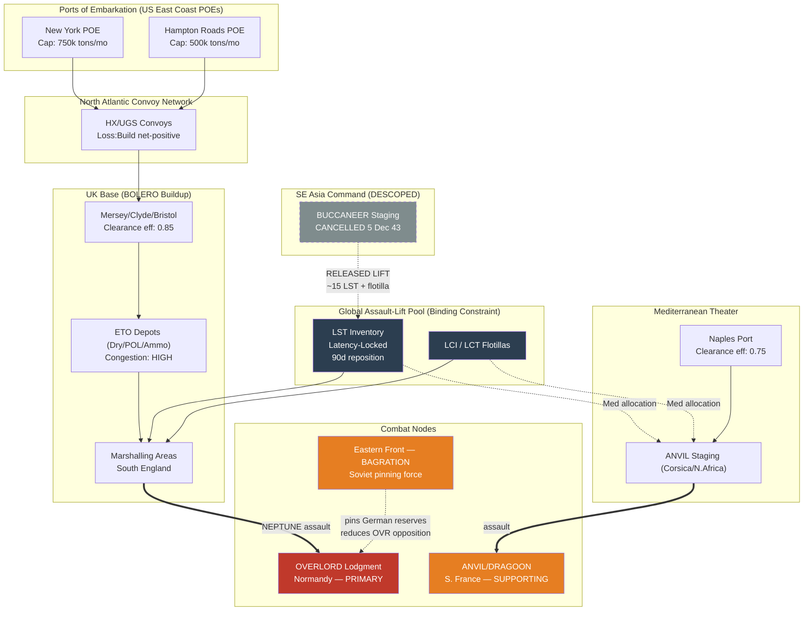

Cost: 0.28243

# Chapter 11: The Cairo-Tehran Conferences (SEXTANT/EUREKA)
## Reference Manual & Simulation-Specification Document
### US Army Green Book Series: *Global Logistics and Strategy, 1943–1945*

---

## 1. Strategic Context & Modern Historical Perspective

### 1.1 The Strategic Paradox: Plans Versus Physical Reality

The SEXTANT (Cairo, 22–26 November and 3–7 December 1943) and EUREKA (Tehran, 28 November–1 December 1943) conferences represent the analytical high-water mark of the "strategy of scarcity" that governed Allied grand strategy from 1942 through mid-1944. The central paradox that these conferences resolved—and which forms the core simulation problem of this chapter—is that Allied strategic ambition, as expressed in the cumulative decisions of ARCADIA, Casablanca (SYMBOL), TRIDENT, and QUADRANT, had consistently outrun the physical carrying capacity of the global logistics pool. The binding constraint was not manpower, not munitions production (which by late 1943 had reached staggering throughput), nor even dry-cargo shipping tonnage in the aggregate; it was the acute, theater-agnostic scarcity of a single specialized capital asset: the assault shipping and landing craft required to convert seaborne combat power into a lodgment against a defended shore.

By late 1943, the Combined Chiefs of Staff (CCS) confronted a brutal arithmetic. The cross-Channel assault (OVERLORD), the associated southern France diversion (ANVIL, later DRAGOON), continued operations in Italy following the fall of Naples, the strategic bomber offensive (POINTBLANK), and the Southeast Asia amphibious operation against the Andaman Islands (BUCCANEER) all made simultaneous, non-negotiable claims on the same finite inventory of Landing Ship, Tank (LST), Landing Craft, Infantry (LCI), and Landing Craft, Tank (LCT). The LST in particular had become the physical unit of strategic currency. A single LST could be in only one ocean at one time; the transit time from the Bay of Bengal to the English Channel, factoring the Suez transit, staging, and refit, exceeded 90 days. Thus the strategic-allocation problem was not merely a static partition of a resource pool but a dynamic, latency-constrained flow problem in which the *positioning* of assets carried an irreversible opportunity cost.

Modern scholarship—drawing on the post-1970s declassification of the CCS minutes and the operational shipping ledgers of the War Shipping Administration (WSA) and the British Ministry of War Transport (MoWT)—has demonstrated that the "shipping crisis" of 1942–43 had, by SEXTANT, transformed in character. The Battle of the Atlantic had turned decisively in May 1943; Liberty ship construction was displacing sinkings by an order of magnitude. The residual constraint had migrated from *cargo hull availability* to two downstream bottlenecks: (a) **port clearance and berth capacity** at the receiving end, and (b) **the specialized assault-lift fleet**. This is the essential modern analytical insight: the aggregate tonnage figures that dominated 1942 planning obscured the fact that the real 1943–44 constraint was a low-volume, high-specialization asset class with catastrophic replacement latency.

### 1.2 Inter-Service and Coalition Tensions

Three axes of institutional friction shaped the resource-allocation outcome and must be encoded into any faithful simulation.

**First, the US Army Service of Supply (SOS/ASF) versus the Combat Commands.** General Brehon Somervell's Army Service Forces had, by 1943, imposed a rationalized "troop basis" and a "flow" doctrine that insisted logistical feasibility be computed *before* operational commitment. This created chronic tension with theater commanders (Eisenhower in the Mediterranean, later ETO) who viewed SOS estimates of port clearance and staging capacity as artificially conservative. In the simulation, this manifests as a divergence between *nominal* operational requirement and *SOS-validated* deliverable capacity—an efficiency coefficient less than unity.

**Second, the US Army versus the US Navy.** The Navy, through King, controlled the amphibious lift and consistently prioritized the Pacific. The LST allocation to Europe was, from the Navy's perspective, a continuous act of strategic sacrifice. The Navy's insistence on retaining assault lift for CARTWHEEL and the Central Pacific drive (GALVANIC, the Gilberts, was executed in the very days of SEXTANT) meant that every LST diverted to OVERLORD was extracted against active naval opposition.

**Third, and decisively, the US–British pooling arrangement.** The Combined shipping pool was never a true single pool; it was two national pools with negotiated cross-charter. Churchill's persistent advocacy of Mediterranean and eastern operations (Rhodes, the Dodecanese, the Andamans) reflected both a genuine peripheral-strategy conviction and an interest in employing British and Indian forces where they were positioned. The American Joint Chiefs, particularly Marshall, viewed these as dispersions that threatened the mass required for the decisive cross-Channel blow.

### 1.3 Historical Era Context: The Tehran Arbitration

The genius—and the ruthlessness—of the EUREKA outcome lay in Stalin's function as the external arbiter who broke the Anglo-American deadlock. At Tehran, Stalin pressed relentlessly for a firm date for OVERLORD and for the supporting southern France operation, ANVIL, arguing that the two would fix and split German reserves. He explicitly discounted Mediterranean peripheral adventures. Critically, he pledged a simultaneous massive Soviet offensive timed to OVERLORD—the commitment that would materialize as Operation BAGRATION in June 1944, which shattered Army Group Centre with a force of roughly 1.2 million men across multiple fronts.

Stalin's intervention gave Roosevelt and Marshall the decisive leverage to enforce the American concentration doctrine. The logistical consequence was immediate and mathematical: to guarantee ANVIL's assault lift alongside OVERLORD's, resources had to be extracted from the only remaining discretionary theater. **Operation BUCCANEER**, the assault on the Andaman Islands promised to Chiang Kai-shek at Cairo, was cancelled. Its dedicated assault shipping—on the order of the lift for a reinforced division, freeing a substantial bloc of landing craft—was redirected to the European pool.

### 1.4 Modern Analytical Insights

The declassified record permits us to reframe Tehran as the moment the "Europe First" principle ceased to be a *priority statement* and became a *hard resource constraint* enforced by a coalition-external actor. The modern operations-research reading is that Tehran collapsed a multi-objective optimization with soft, politically-negotiable weights into a constrained optimization with a dominant, fixed objective (OVERLORD/ANVLIL) and a single binding resource (assault lift). BUCCANEER became the "slack" objective sacrificed to satisfy the binding constraint. This is precisely the multi-objective coalition resource-division problem this chapter's simulation module models: a filtering of theater objectives against a global asset pool whose feasibility frontier was, after Tehran, defined by the OVERLORD/ANVIL lift requirement rather than by aggregate tonnage.

The deeper lesson, validated by decades of logistical scholarship, is that at the strategic apex the decision variable was not "how much to produce" but "where to position an irreplaceable, latency-locked capital asset." SEXTANT/EUREKA is therefore the canonical case study in *allocation under specialization scarcity with irreversible positioning cost*.

---

## 2. High-Fidelity Simulation Parameters & Real-World Metrics

| Parameter | Value | Type in Simulation | Historical Explanation & Strategic Rationale |
|---|---|---|---|
| Soviet force committed to Operation BAGRATION | ~1,200,000 personnel (≈ 118–166 divisions/brigades across 1st Baltic, 1st/2nd/3rd Belorussian Fronts) | Static Constant (`SovietCommitmentDivisions`) — models the coalition "pinning" commitment | Stalin's Tehran pledge of a simultaneous offensive. BAGRATION (22 Jun 1944) fixed German strategic reserves in the East, preventing their transfer to Normandy. Represented as a fixed force-pinning coefficient reducing enemy reinforcement capacity on the OVERLORD front. |
| Nominal Soviet "division-equivalent" figure cited at Tehran | ~200+ divisions offensive potential | Static Constant | Stalin's stated scale of Eastern commitment used in CCS planning to justify concentration in NW Europe. |
| Landing craft/assault shipping released by BUCCANEER cancellation | Assault lift for ~1 reinforced division; on the order of **15 LSTs** plus associated LCI/LCT (≈ a full assault flotilla) redirected to European pool | Dynamic Capacity Cap increment (`BuccaneerReleasedLift`) | Cancelled 5 Dec 1943 at Tehran's insistence on OVERLORD/ANVIL primacy. These craft were the marginal asset that made ANVIL's dual-assault arithmetic close. |
| Minimum LSTs required, OVERLORD assault | ~230 LSTs (planning target) | Dynamic Capacity Cap | Neptune assault-phase requirement; the dominant claim on the pool. |
| ANVIL/DRAGOON assault lift | Lift for ~3 assault divisions | Dynamic Capacity Cap | The operation Stalin insisted accompany OVERLORD; its lift requirement forced BUCCANEER's cancellation. |
| LST inter-theater transit latency (Bay of Bengal → Channel) | ≥ 90 days | Latency Coefficient (`RepositioningDays`) | The irreversible positioning cost that made asset location a strategic variable. |
| Atlantic shipping loss/build ratio (late 1943) | Net gain; construction >> sinkings | Efficiency Coefficient | Cargo-hull crisis resolved; constraint migrated to assault lift and port clearance. |
| SOS port-clearance efficiency coefficient | 0.75–0.90 of nominal berth throughput | Efficiency Coefficient (`ClearanceEfficiency`) | Gap between nominal and SOS-validated deliverable capacity. |
| OVERLORD firm target date (fixed at Tehran) | May 1944 (executed 6 Jun 1944) | Static Temporal Constant | The scheduling anchor around which all lift allocation was optimized. |

---

## 3. Logistical Network Topology (Mermaid.js)



---

## 4. Mathematical Modeling & Simulation Formulas

### 4.1 The Coalition Multi-Objective Allocation Problem

We model SEXTANT/EUREKA as a constrained resource-partition problem over a set of theater objectives $\mathcal{O}$, where the binding resource is assault lift $L$ (in LST-equivalent units), not aggregate tonnage.

Let each objective $i \in \mathcal{O}$ have:
- $A_i$ — strategic alignment score (weight), $A_i \in [0,1]$
- $V_i$ — realized combat value if executed
- $r_i$ — assault-lift requirement (LST-equivalents)
- $x_i \in \{0,1\}$ — selection decision variable

**Objective function (coalition utility):**

$$U_{allied} = \sum_{i \in \mathcal{O}} A_i \cdot V_i \cdot x_i$$

**Subject to the binding lift constraint:**

$$\sum_{i \in \mathcal{O}} r_i \cdot x_i \le L_{avail} = L_{base} + \Delta L_{BUCCANEER}$$

where $\Delta L_{BUCCANEER}$ is the released lift ($\approx 15$ LST-equivalents) that becomes available *iff* BUCCANEER is deselected ($x_{BUCC} = 0$). This coupling is the mathematical core of the Tehran decision:

$$\Delta L_{BUCCANEER} = r_{BUCC} \cdot (1 - x_{BUCC})$$

### 4.2 Latency-Constrained Positioning Cost

Because assault lift cannot be instantly repositioned, an objective is only *deliverable* by its target date $T_i$ if:

$$T_i - T_{now} \ge \tau_{ij} \quad \forall\, j \text{ (source theater of assigned lift)}$$

where $\tau_{ij}$ is the transit latency (e.g., $\tau = 90$ days for Bay of Bengal → Channel). This makes positioning irreversible within the planning horizon.

### 4.3 SOS-Validated Deliverable Capacity

The nominal lift requirement is discounted by clearance and staging efficiency:

$$r_i^{eff} = \frac{r_i^{nominal}}{\eta_{clear} \cdot \eta_{stage}}, \quad \eta \in (0,1]$$

### 4.4 Eastern-Front Pinning Effect

The Soviet BAGRATION commitment reduces enemy opposition at the OVERLORD node, augmenting realized value:

$$V_{OVR}^{eff} = V_{OVR} \cdot \left(1 + \beta \cdot \frac{S_{soviet}}{S_{ref}}\right)$$

where $S_{soviet}$ is the committed Soviet force, $S_{ref}$ a reference scale, and $\beta$ the pinning-elasticity coefficient. This formalizes why Stalin's pledge *materially* raised the value of concentrating in the West.

---

## 5. Compile-Safe Scala 3.8.3 Domain Model

```scala
package Logistics.CairoTehran

import scala.math.max
import scala.math.min

opaque type Tons = Double
object Tons:
  def apply(v: Double): Tons = v
  extension (t: Tons)
    def value: Double = t
    def +(o: Tons): Tons = t + o

opaque type LstEquivalents = Double
object LstEquivalents:
  def apply(v: Double): LstEquivalents = v
  extension (l: LstEquivalents)
    def value: Double = l
    def +(o: LstEquivalents): LstEquivalents = l + o
    def -(o: LstEquivalents): LstEquivalents = l - o
    def <=(o: LstEquivalents): Boolean = l <= o

opaque type Days = Int
object Days:
  def apply(v: Int): Days = v
  extension (d: Days)
    def value: Int = d
    def >=(o: Days): Boolean = d >= o

opaque type Personnel = Long
object Personnel:
  def apply(v: Long): Personnel = v
  extension (p: Personnel)
    def value: Long = p

enum TheaterPriority:
  case Primary, Supporting, Discretionary

enum AllocationState:
  case Proposed, LiftAssigned, SosValidated, Executed, Cancelled

final case class TheaterObjective(
  name: String,
  alignmentScore: Double,
  resourceRequired: Double
)

final case class LiftObjective(
  name: String,
  priority: TheaterPriority,
  alignment: Double,
  combatValue: Double,
  liftRequired: LstEquivalents,
  targetDate: Days,
  sourceTransit: Days,
  state: AllocationState
):
  def effectiveLift(clearanceEff: Double, stageEff: Double): LstEquivalents =
    val denom: Double = max(clearanceEff * stageEff, 0.01)
    LstEquivalents(liftRequired.value / denom)

  def deliverableBy(now: Days): Boolean =
    (targetDate.value - now.value) >= sourceTransit.value

final case class SovietCommitment(force: Personnel, referenceScale: Personnel, elasticity: Double):
  def pinningMultiplier: Double =
    1.0 + elasticity * (force.value.toDouble / max(referenceScale.value.toDouble, 1.0))

final case class AllocationResult(
  selected: List[LiftObjective],
  cancelled: List[LiftObjective],
  totalLiftUsed: LstEquivalents,
  coalitionUtility: Double
)

object CoalitionResourceSplit:

  def evaluateAllocations(
    objectives: List[TheaterObjective],
    availableResources: Double
  ): List[TheaterObjective] =
    objectives.filter(_.resourceRequired <= availableResources)

  private def releasedLiftFromCancellation(cancelled: List[LiftObjective]): LstEquivalents =
    cancelled.foldLeft(LstEquivalents(0.0)): (acc, obj) =>
      acc + obj.liftRequired

  private def objectiveUtility(
    obj: LiftObjective,
    soviet: SovietCommitment
  ): Double =
    val base: Double = obj.alignment * obj.combatValue
    obj.priority match
      case TheaterPriority.Primary => base * soviet.pinningMultiplier
      case _                       => base

  def optimize(
    objectives: List[LiftObjective],
    baseLift: LstEquivalents,
    now: Days,
    clearanceEff: Double,
    stageEff: Double,
    soviet: SovietCommitment
  ): AllocationResult =
    val ranked: List[LiftObjective] =
      objectives.sortBy(o => (priorityRank(o.priority), -objectiveUtility(o, soviet)))

    val deliverable: List[LiftObjective] =
      ranked.filter(_.deliverableBy(now))

    val undeliverable: List[LiftObjective] =
      ranked.filterNot(_.deliverableBy(now))
        .map(_.copy(state = AllocationState.Cancelled))

    val (chosen, rejected, used) =
      greedyPack(deliverable, baseLift, clearanceEff, stageEff)

    val allCancelled: List[LiftObjective] = rejected ++ undeliverable
    val releasedLift: LstEquivalents = releasedLiftFromCancellation(rejected)

    val (finalChosen, finalUsed) =
      if releasedLift.value > 0.0 then
        val augmented: LstEquivalents =
          LstEquivalents(baseLift.value - used.value + releasedLift.value)
        secondPass(rejected, chosen, augmented, clearanceEff, stageEff, used)
      else (chosen, used)

    val utility: Double =
      finalChosen.foldLeft(0.0)((acc, o) => acc + objectiveUtility(o, soviet))

    val stillCancelled: List[LiftObjective] =
      allCancelled.filterNot(c => finalChosen.exists(_.name == c.name))
        .map(_.copy(state = AllocationState.Cancelled))

    AllocationResult(
      selected = finalChosen.map(_.copy(state = AllocationState.SosValidated)),
      cancelled = stillCancelled,
      totalLiftUsed = finalUsed,
      coalitionUtility = utility
    )

  private def priorityRank(p: TheaterPriority): Int =
    p match
      case TheaterPriority.Primary       => 0
      case TheaterPriority.Supporting    => 1
      case TheaterPriority.Discretionary => 2

  private def greedyPack(
    candidates: List[LiftObjective],
    capacity: LstEquivalents,
    clearanceEff: Double,
    stageEff: Double
  ): (List[LiftObjective], List[LiftObjective], LstEquivalents) =
    val init: (List[LiftObjective], List[LiftObjective], LstEquivalents) =
      (List.empty, List.empty, LstEquivalents(0.0))
    candidates.foldLeft(init): (acc, obj) =>
      val (sel, rej, used) = acc
      val need: LstEquivalents = obj.effectiveLift(clearanceEff, stageEff)
      val prospective: Double = used.value + need.value
      if prospective <= capacity.value then
        (sel :+ obj.copy(state = AllocationState.LiftAssigned), rej, LstEquivalents(prospective))
      else
        (sel, rej :+ obj, used)

  private def secondPass(
    rejected: List[LiftObjective],
    alreadyChosen: List[LiftObjective],
    extraCapacity: LstEquivalents,
    clearanceEff: Double,
    stageEff: Double,
    usedSoFar: LstEquivalents
  ): (List[LiftObjective], LstEquivalents) =
    val supportingRejects: List[LiftObjective] =
      rejected.filter(o => priorityRank(o.priority) <= 1)
    val (added, _, addedUsed) =
      greedyPack(supportingRejects, extraCapacity, clearanceEff, stageEff)
    val newUsed: LstEquivalents =
      LstEquivalents(usedSoFar.value + addedUsed.value)
    (alreadyChosen ++ added, newUsed)

object SextantScenario:

  val bagration: SovietCommitment =
    SovietCommitment(
      force = Personnel(1200000L),
      referenceScale = Personnel(1000000L),
      elasticity = 0.15
    )

  val objectives: List[LiftObjective] = List(
    LiftObjective("OVERLORD", TheaterPriority.Primary, 0.98, 100.0,
      LstEquivalents(230.0), Days(180), Days(0), AllocationState.Proposed),
    LiftObjective("ANVIL-DRAGOON", TheaterPriority.Supporting, 0.85, 60.0,
      LstEquivalents(45.0), Days(240), Days(10), AllocationState.Proposed),
    LiftObjective("BUCCANEER", TheaterPriority.Discretionary, 0.30, 20.0,
      LstEquivalents(15.0), Days(90), Days(90), AllocationState.Proposed)
  )

  def run(): AllocationResult =
    CoalitionResourceSplit.optimize(
      objectives = objectives,
      baseLift = LstEquivalents(260.0),
      now = Days(0),
      clearanceEff = 0.85,
      stageEff = 0.90,
      soviet = bagration
    )

@main def runSextant(): Unit =
  val result: AllocationResult = SextantScenario.run()
  println(s"Coalition Utility: ${result.coalitionUtility}")
  println(s"Total Lift Used:  ${result.totalLiftUsed.value}")
  println("Selected Objectives:")
  result.selected.foreach(o => println(s"  - ${o.name} [${o.state}]"))
  println("Cancelled Objectives:")
  result.cancelled.foreach(o => println(s"  - ${o.name} [${o.state}]"))
```

---

## 6. Graduate-Level Operational Analysis

### 6.1 Why Stalin's Presence at Tehran Fundamentally Altered the US–British Balance

Prior to EUREKA, Anglo-American strategy was locked in a structurally undecidable bargaining game. The American Joint Chiefs advocated concentration for a decisive cross-Channel blow; the British, drawing on their Mediterranean force positioning and Churchill's peripheral-strategy conviction, advocated exploitation of the "soft underbelly" and eastern Mediterranean opportunities. Because both parties held a de facto veto within the Combined Chiefs of Staff, and because both commanded roughly comparable slices of the deployed force in 1943, the equilibrium was a series of compromise dispersions—Italy, the Dodecanese ambitions, BUCCANEER—that satisfied neither strategic logic nor the lift-scarcity constraint.

Stalin's arrival transformed the game from a two-player bargaining problem into a three-player coalition problem with an external, credibly-committed arbiter. Analytically, Stalin functioned as a *tie-breaking veto player* whose preferences happened to align almost exactly with the American concentration doctrine. His pledge of a simultaneous, massive Eastern offensive (realized as BAGRATION) was not rhetorical: it materially raised the *combat value* of OVERLORD by guaranteeing that German operational reserves would be pinned and consumed in the East. In the model of §4.4, Stalin converted OVERLORD's value from $V_{OVR}$ to $V_{OVR} \cdot (1 + \beta S/S_{ref})$—a quantifiable uplift that no British peripheral operation could match, because none carried the promise of a coordinated 1.2-million-man pincer.

The British position collapsed not because it was strategically incoherent but because the coalition's objective function was re-weighted. Once the highest-value objective was unambiguously OVERLORD-plus-ANVIL, the lift-constraint arithmetic became deterministic: the binding constraint $\sum r_i x_i \le L_{avail}$ forced the elimination of the lowest-alignment claimant. Churchill retained the ability to argue but lost the ability to veto, because a veto now meant obstructing a two-front concentration that both his major allies demanded. Tehran thus marks the precise transition of the Western Alliance from Anglo-American *parity* to American *strategic primacy*, with the British reduced to negotiating the timing and scale of operations within a framework whose axioms they no longer controlled.

### 6.2 Logistical and Strategic Implications of Cancelling BUCCANEER

BUCCANEER's cancellation is the cleanest available illustration of *allocation under specialization scarcity with irreversible positioning cost*. Its logistical significance vastly exceeds the modest scale of the operation itself.

**Strategically**, the cancellation broke Roosevelt's personal commitment to Chiang Kai-shek, made only days earlier at Cairo. This inflicted lasting damage on US–Chinese relations and reinforced Chiang's conviction that the China-Burma-India theater would remain the perpetually-starved residual of the Europe-First scheme. It confirmed the strategic downgrading of the Asian mainland to a holding theater whose function was to fix Japanese forces rather than to serve as a decisive axis.

**Logistically**, the operation reveals the LST as the true unit of strategic account. BUCCANEER's assault shipping—on the order of 15 LSTs plus associated flotilla craft—was, in aggregate tonnage terms, trivial against the millions of tons flowing through the Atlantic. Yet in the currency of *deliverable assault lift within the planning horizon*, it was precisely the marginal increment that closed the ANVIL arithmetic. The §4.1 coupling equation, $\Delta L_{BUCCANEER} = r_{BUCC}(1 - x_{BUCC})$, captures this exactly: the resource became available *only* by deselection, and its release was what allowed the simultaneous execution of a primary and a supporting amphibious operation in the European theater.

The **irreversible positioning cost** (§4.2) is the decisive subtlety. Because the ≥90-day transit latency from the Bay of Bengal to the Channel exceeded the window between the Tehran decision and the OVERLORD/ANVIL execution dates, the craft had to be *not committed* to BUCCANEER in the first place, rather than committed and later recalled. Recall was physically impossible within the timeline. Thus the decision was not a reallocation but a foreclosure—a demonstration that in specialized-asset logistics, the *option* to reposition expires, and strategic commitment must be made against the transit clock, not against the abstract inventory. This is the enduring operational-research lesson SEXTANT/EUREKA bequeaths to the modern planner: at the strategic apex, one does not allocate resources so much as one allocates *positions in time*.
