Cost: 0.4774225

## 1. Strategic Context & Modern Historical Perspective

The Cairo and Tehran conferences of November–December 1943—code-named **SEXTANT** and **EUREKA**—constituted a decisive transition from coalition strategy as a collection of partially compatible national programs to coalition strategy as an enforceable allocation of scarce military resources. Their importance cannot be understood solely by listing the operations approved or canceled. The essential issue was whether the Allies could convert broad strategic preferences into executable campaigns while remaining within hard constraints on shipping, landing craft, port throughput, trained formations, air cover, and theater infrastructure.

By late 1943, the Allies possessed overwhelming aggregate productive power, but aggregate abundance did not eliminate local scarcity. A Liberty ship in the Atlantic was not interchangeable, at short notice and without cost, with a Landing Ship, Tank in the Indian Ocean. A division deployed in Italy could not be transferred to Britain merely by changing its command assignment. Amphibious shipping had to be unloaded, refitted, crewed, routed through constrained seas, and integrated into a new assault plan. Ports, railways, depots, beaches, and command staffs formed complementary systems. A campaign was feasible only if these complementary components became available at the same place and time.

### The strategic paradox

The central paradox of Allied strategy was that conferences could create operations faster than the logistics system could create the required operational capability. Casablanca in January 1943, TRIDENT in May, QUADRANT in August, and SEXTANT and EUREKA at the end of the year generated or preserved commitments in the Mediterranean, Northwest Europe, the Pacific, China-Burma-India, and the Soviet supply programs. Each commitment appeared defensible when examined individually. Taken together, they competed for the same marginal ships, landing craft, escorts, engineer units, transport aircraft, and port capacity.

The scarce resource was frequently not total cargo tonnage but **appropriately configured lift**. Dry-cargo freighters could sustain an established theater through a functioning port, but they could not substitute directly for assault transports, combat-loaded cargo ships, LSTs, LCIs, or LCTs during an opposed landing. Combat loading also sacrificed volumetric efficiency. A commercially loaded vessel was packed to maximize total cargo carried; an assault-loaded vessel had to place weapons, vehicles, ammunition, boats, and engineer stores in the order in which they would be needed ashore. The resulting reduction in stowage efficiency was not waste in the ordinary sense—it purchased tactical accessibility—but it reduced strategic carrying capacity.

Port clearance imposed another non-obvious limitation. Nominal discharge capacity was not useful unless cargo could move beyond the quay. Berth availability, cranes, lighterage, labor gangs, railway rolling stock, road space, depot capacity, and documentation all entered the effective throughput equation. If inland clearance fell below ship discharge, cargo accumulated in port. The port then became a storage yard, ship turnaround lengthened, and nominal ocean lift was consumed by ships waiting offshore or at berth.

Thus, the argument over OVERLORD was inseparable from a network-timing problem. Britain had to receive and stage American formations, vehicles, ammunition, fuel, landing craft, and engineer equipment before the cross-Channel assault. Southern England required camps, depots, marshalling areas, repair establishments, pipelines, railway capacity, and embarkation sites. Landing craft scattered among the Mediterranean, American training establishments, and the Indian Ocean were not immediately available to this system. They had to be released soon enough to arrive, refit, rehearse, and join assault flotillas.

### American and British strategic concepts

The United States generally favored concentration on a direct cross-Channel attack, regarding Mediterranean and Southeast Asian ventures as potential diversions from the shortest route to Germany’s principal military and industrial centers. American planners did not reject every peripheral operation; they supported North Africa, Sicily, Italy, and limited operations in Burma under particular conditions. Their persistent concern was that each “limited” commitment would acquire institutional momentum, absorb shipping, and generate follow-on requirements.

British strategy placed greater emphasis on exploiting the Mediterranean, sustaining pressure in Italy, engaging Turkey if possible, protecting imperial communications, and seeking opportunities in the Balkans or eastern Mediterranean. British leaders feared that a premature cross-Channel attack could repeat the losses of 1915 or 1916 on a vastly larger scale. They also considered Mediterranean operations a means of dispersing German forces, improving access to the Middle East, and shaping the political settlement of postwar Europe.

This disagreement was not a simple contrast between American strategic clarity and British evasion. The British had legitimate operational reasons to question whether a cross-Channel lodgment could be supplied over beaches and damaged ports against concentrated German resistance. Conversely, American concern about strategic dissipation was validated repeatedly by the tendency of active theaters to demand more troops, aircraft, shipping, and landing craft than initially estimated. Once formations entered combat in Italy, they could not be removed without operational and political consequences.

### Inter-service and coalition tensions

The allocation process also produced friction within national systems. Army theater commanders sought enough resources to ensure success in their assigned missions. Services of Supply organizations emphasized shipping schedules, depot stocks, port clearance, maintenance, and replacement flows. To combat commanders, logistical restrictions could appear bureaucratic or excessively conservative; to logisticians, operational plans could appear to assume nonexistent throughput.

Army–Navy tensions centered especially on amphibious shipping. The Navy controlled or strongly influenced the construction, assignment, movement, and employment of many landing ships and craft. Army planners defined troop and cargo requirements, but naval authorities had to evaluate convoy protection, sea endurance, maintenance, tides, beach characteristics, and the availability of trained crews. An LST allocation could not be represented accurately as an abstract tonnage grant: the vessel was a specialized asset with draft, speed, range, repair, and beaching constraints.

Coalition pooling created further complications. “Pooled” shipping did not mean frictionless common ownership. British and American merchant fleets remained subject to national allocation machinery, while combined boards attempted to reconcile demands. Ships differed in speed, cargo-handling gear, fuel consumption, troop accommodation, and suitability for particular ports. National authorities retained political responsibilities for food imports, imperial routes, and civilian economies. Consequently, a nominally combined pool contained multiple classes of assets with different restrictions.

The conflict between Washington and Admiral Lord Louis Mountbatten’s Southeast Asia Command illustrates the same problem at theater level. Southeast Asia Command had been established with ambitious expectations, but its operational program depended on resources that were more urgently required elsewhere. Mountbatten could plan an amphibious attack against the Andaman Islands—Operation BUCCANEER—but he could not manufacture the assault shipping needed to execute it. Once the European decision became controlling, Southeast Asia’s allocation was vulnerable.

### Cairo, Tehran, and the primacy of coalition commitment

At SEXTANT in Cairo, planners examined OVERLORD, Mediterranean alternatives, support to China, operations in Burma, and BUCCANEER. The discussions exposed continued Anglo-American disagreement. Roosevelt also pursued political and military cooperation with Chiang Kai-shek, while British leaders were reluctant to accept commitments in the Bay of Bengal that could undermine operations nearer Europe.

EUREKA changed the structure of the argument because Joseph Stalin participated directly. Stalin was not merely another theater commander requesting resources. The Soviet Union was carrying the largest share of ground combat against Germany and could claim an enormous material and human contribution to coalition victory. Soviet leverage arose from battlefield reality: the Red Army was destroying or fixing the majority of German ground formations, while the Western Allies had not yet opened the promised front in northern France.

Stalin demanded a definite cross-Channel operation in 1944 and pressed for a supporting operation in southern France. His intervention narrowed the bargaining space available to Churchill. An Anglo-American dispute could previously be prolonged through staff studies, conditional approvals, or competing interpretations of earlier conference decisions. At Tehran, opposition to OVERLORD risked appearing not merely cautious but inconsistent with the fundamental coalition bargain.

The conference consequently confirmed OVERLORD for May 1944—later postponed to 6 June—and identified an operation in southern France as a supporting requirement. That operation, initially called ANVIL and later executed as DRAGOON, intensified the competition for landing craft. The decision effectively subordinated BUCCANEER and other peripheral amphibious proposals to the European concentration.

It is important not to project later events mechanically backward. Tehran did not specify Operation BAGRATION by name; the detailed Soviet plan emerged in 1944. Stalin promised that the Red Army would launch a major offensive timed to prevent Germany from transferring forces against the Western landing. Operation BAGRATION, begun on 22 June 1944, fulfilled that strategic commitment on a scale exceeding most Western expectations. It destroyed Army Group Centre as an effective formation, inflicted catastrophic German losses, and denied Germany the freedom to construct a coherent theater reserve against both east and west.

### Cancellation of BUCCANEER

BUCCANEER was intended as an amphibious seizure in the Andaman Islands, commonly associated with an assault against the Port Blair area. Its strategic purposes included improving Allied control of the Bay of Bengal, threatening Japanese communications, supporting operations toward Burma, and demonstrating action in support of China.

Its cancellation was a resource-transfer decision rather than a conclusion that Southeast Asia lacked all strategic value. The allocated amphibious package included approximately **20 LSTs and 30 LCI(L)s**, or **50 landing ships and craft** in the principal categories normally cited in the conference logistics record. The package also included specialized assault shipping, commonly recorded as six assault transports and six assault cargo ships. Releasing these assets did not instantaneously add 50 craft to the Normandy assault. They had to be reassigned, moved, maintained, and incorporated into revised plans. Nevertheless, cancellation removed a major competing claim on the specialized amphibious pool.

The strategic cost was real. Southeast Asia Command lost a potentially useful amphibious option, and the Allies became more dependent on overland campaigning in terrain characterized by monsoon disruption, primitive roads, limited railways, disease, and severe air-supply requirements. The cancellation also damaged confidence among Asian and Chinese partners, for whom repeated Allied postponements could appear to confirm that “Germany First” meant indefinite subordination of their war.

### Modern analytical interpretation

Modern scholarship reinforces the proposition that Tehran was the ultimate arbiter of theater resource allocation, but it also qualifies a simplistic “Stalin ordered, the West complied” interpretation. OVERLORD already enjoyed strong support in the American Joint Chiefs and had been repeatedly affirmed. What Tehran supplied was political finality. Stalin’s presence altered the cost of reopening the decision and connected the Western operation to a synchronized continental strategy.

In systems terms, Tehran imposed a lexicographic priority rule:

1. Defeat Germany as the coalition’s primary strategic objective.
2. Ensure OVERLORD possessed the minimum assault and sustainment resources necessary for an acceptable probability of success.
3. Provide a complementary Mediterranean operation if it could be supported without endangering OVERLORD.
4. Fund Southeast Asian and other operations from the residual resource pool.

This was not a globally optimal solution under every conceivable political weighting. It was the coalition-feasible solution produced by military urgency, Soviet bargaining power, American preference for concentration, and the physical indivisibility of amphibious assets.

The most important lesson for simulation is that conference decisions must not directly create operational capability. They should instead modify priorities, release or reserve asset classes, trigger transit and conversion delays, and alter political penalties. A canceled operation frees only the resources actually assigned to it; those resources become usable elsewhere only after repositioning, repair, crew preparation, and integration. Similarly, approval of OVERLORD should not guarantee success. It should establish a protected claim on lift, formations, air power, and sustainment capacity while leaving the operation subject to weather, enemy action, beach throughput, port capture, and inland clearance.

---

## 2. High-Fidelity Simulation Parameters & Real-World Metrics

Historical quantities vary according to whether a source counts only assault formations, includes reserves and supporting troops, or distinguishes landing ships from smaller landing craft. The database should therefore preserve both the value and its counting rule.

| Parameter ID | Historical value | Date or interval | Scope and explanation | Recommended simulation representation |
|---|---:|---|---|---|
| `BAGRATION_DIVISIONS` | **166 divisions** | 22 June 1944 opening strength | Widely cited Soviet order-of-battle count for Operation BAGRATION. It is commonly accompanied by 9 brigades. Tehran did not identify BAGRATION by name; the operation was the later fulfillment of Stalin’s promise for a major offensive supporting the Western landing. | Integer scenario constant. Attach an order-of-battle scope flag distinguishing divisions from brigades and independent supporting formations. |
| `BAGRATION_COMBAT_PERSONNEL` | **1,670,300 personnel** | Opening phase | Commonly cited combat-strength figure for the four participating Soviet fronts and attached forces. Broader totals that include rear services and later reinforcements can exceed two million. | Initial combat manpower state, not a division-size constant. Permit reinforcement events and source-specific counting scopes. |
| `BAGRATION_MEAN_PERSONNEL_PER_COUNTED_DIVISION` | **10,062 personnel** | Derived | $1{,}670{,}300/166 \approx 10{,}062$. This is an analytical mean, not a claim that every Soviet division had identical strength. Soviet rifle, guards rifle, cavalry, artillery, and mechanized organizations differed substantially. | Derived diagnostic only. Never instantiate all divisions at this uniform strength unless using an intentionally abstract model. |
| `BAGRATION_BRIGADES` | **9 brigades** | 22 June 1944 | Independent brigades cited in the standard 166-division order of battle. | Separate integer formation count. Do not convert automatically into divisions without a scenario-defined equivalence coefficient. |
| `BUCCANEER_LST_RELEASED` | **20 LSTs** | Cancellation decision, December 1943 | Landing Ship, Tank assets no longer required for the Andaman assault. LSTs were particularly valuable because they could move vehicles, artillery, stores, and troops directly to beaches. | Discrete indivisible asset stock. Apply transit, overhaul, crew, and theater-integration delays before adding to another theater’s usable capacity. |
| `BUCCANEER_LCIL_RELEASED` | **30 LCI(L)s** | Cancellation decision, December 1943 | Landing Craft, Infantry (Large), intended primarily to carry infantry to an assault shore. They were not capacity-equivalent to LSTs. | Discrete asset stock in its own class. Do not aggregate with LSTs except for high-level political reporting. |
| `BUCCANEER_PRINCIPAL_LANDING_ASSETS_RELEASED` | **50 craft** | December 1943 | Arithmetic total of 20 LSTs and 30 LCI(L)s. This is the requested count of the principal landing-craft categories released by cancellation. Some accounts use “landing ships and craft” rather than “landing craft” for this aggregate. | Reporting constant only. Operational calculations must preserve the two component classes. |
| `BUCCANEER_ASSAULT_TRANSPORTS` | **6 assault transports** | Planned allocation | Troop-carrying assault vessels associated with the BUCCANEER lift package. U.S. nomenclature often maps this function to APA-type vessels, although conference documents can use more generic descriptions. | Discrete troop-lift asset class with combat-loading and boat-capacity attributes. |
| `BUCCANEER_ASSAULT_CARGO_SHIPS` | **6 assault cargo ships** | Planned allocation | Combat-loaded cargo vessels associated with the assault package, often functionally comparable to AKA-type shipping. | Discrete cargo-lift class. Track weight, measurement tonnage, hatch accessibility, and unloading rate. |
| `OVERLORD_CONFIRMED_TARGET_MONTH` | **May 1944** | Tehran decision | The conference confirmed the cross-Channel assault for May, subject to final operational planning. Weather, craft concentration, training, and operational preparation later moved execution to June. | Planned milestone subject to schedule-risk transitions. |
| `OVERLORD_EXECUTION_DATE` | **6 June 1944** | Actual | Actual D-Day after a weather delay from 5 June. | Historical event constant or scenario target date. Weather logic should allow divergence. |
| `BAGRATION_START_DATE` | **22 June 1944** | Actual | Soviet offensive began 16 days after D-Day and fixed or destroyed major German forces in the east. | Event trigger affecting German reserve transfer rates and strategic pressure. |
| `TEHRAN_DATE_RANGE` | **28 November–1 December 1943** | EUREKA | Period in which Roosevelt, Churchill, and Stalin agreed the core European strategic program. | Political-decision event window. |
| `CAIRO_FIRST_CONFERENCE_RANGE` | **22–26 November 1943** | SEXTANT | Initial Cairo discussions with Roosevelt, Churchill, and Chiang Kai-shek before Tehran. | Political negotiation state with unresolved resource allocations. |
| `CAIRO_SECOND_CONFERENCE_RANGE` | **2–7 December 1943** | Post-Tehran Cairo | Final staff reconciliation and implementation after EUREKA. | Allocation-finalization and cancellation state. |
| `BOLERO_FLOW` | Scenario-dependent | 1942–44 | Movement of U.S. personnel and matériel to the United Kingdom. Its effective capacity depended on troopships, cargo shipping, British ports, rail transport, depot construction, and accommodation. | Time-varying network flow, not a fixed scalar. |
| `COMBAT_LOADING_EFFICIENCY` | Typically **0.65–0.85** of commercial stowage efficiency for abstract modeling | Planning coefficient | No single universal historical ratio applies. Accessibility, boat assignment, vehicle dimensions, ammunition segregation, and assault sequence reduced usable payload. | Calibrated coefficient by ship and mission. Default ranges should remain scenario-configurable. |
| `PORT_EFFECTIVE_THROUGHPUT` | $\min$ of berth, discharge, clearance, storage, and labor capacities | Universal | A port’s useful throughput is governed by its tightest linked subsystem, not nominal berth capacity alone. | Dynamic bottleneck function rather than a static “port size.” |
| `LANDING_CRAFT_AVAILABILITY` | Assigned minus repair, training, transit, and reserve commitments | Universal | Conference allocations overstated immediately usable craft if vessels were distant, under repair, or lacked trained crews. | Dynamic stock-flow state with readiness classes. |
| `THEATER_TRANSFER_DELAY` | Route- and class-dependent | 1943–44 | Indian Ocean-to-European reassignment required orders, voyage time, refueling, maintenance, and operational integration. | Explicit lag distribution; never use instantaneous transfer. |
| `EUROPE_FIRST_PRIORITY` | Lexicographic priority | From ARCADIA, reinforced at Tehran | Germany remained the primary coalition enemy. Tehran made the European amphibious concentration politically difficult to reverse. | Priority constraint or very large penalty for underfunding OVERLORD, rather than merely a small utility bonus. |
| `ANVIL_DEPENDENCY` | Conditional on OVERLORD security | Late 1943–44 | Southern France was intended to complement OVERLORD, but its date and scale remained sensitive to landing-craft availability and the Italian campaign. | Conditional objective whose activation requires OVERLORD’s minimum feasibility threshold. |

### Required database interpretation

The requested “Soviet combat division size” should be stored as two linked values:

- **Formation count:** 166 divisions.
- **Combat personnel:** approximately 1,670,300.
- **Derived mean:** approximately 10,062 personnel per counted division.

The simulator should not interpret 10,062 as the table-of-organization strength of every Soviet division. Formation strengths varied, and major Soviet operations included corps, brigades, artillery formations, aviation armies, engineers, rear services, replacements, and reserves not adequately represented by a single average.

The requested BUCCANEER release should be stored as:

- 20 LSTs;
- 30 LCI(L)s;
- **50 principal landing ships/craft in aggregate**.

The six assault transports and six assault cargo ships should remain separate ship classes, not be added to the 50-craft reporting figure unless the interface explicitly requests “all specialized assault vessels.”

---

## 3. Logistical Network Topology (Detailed Mermaid.js Flowchart)

```mermaid
flowchart LR
    subgraph CONUS["United States Production and Ports of Embarkation"]
        IND["Industrial base<br/>vehicles, ammunition, rations, POL"]
        DEPOT_E["Eastern holding depots<br/>inventory and documentation"]
        NYPOE["New York POE<br/>dry cargo and personnel"]
        HRPOE["Hampton Roads POE<br/>vehicles, ammunition, assault stores"]
        GULF["Gulf POEs<br/>alternate dry cargo and petroleum"]
        WEST["West Coast POEs<br/>Pacific and Indian Ocean routes"]

        IND -->|"rail capacity; production lead time"| DEPOT_E
        DEPOT_E -->|"rail congestion and car availability"| NYPOE
        DEPOT_E -->|"rail congestion and security limits"| HRPOE
        IND -->|"petroleum and general cargo"| GULF
        IND -->|"transcontinental rail constraint"| WEST
    end

    subgraph ATL["Atlantic Shipping Pool"]
        DRY_ATL["Dry-cargo freighters<br/>commercial loading"]
        TROOP_ATL["Troopships and assault transports<br/>berth-limited"]
        LST_POOL["LST pool<br/>discrete hulls; slow speed"]
        LCI_POOL["LCI(L) pool<br/>infantry assault lift"]
        ESCORT_ATL["Escort allocation<br/>convoy frequency constraint"]
        ATL_ROUTE["North Atlantic convoy route<br/>weather and U-boat risk"]

        NYPOE --> DRY_ATL
        NYPOE --> TROOP_ATL
        HRPOE --> DRY_ATL
        HRPOE --> LST_POOL
        HRPOE --> LCI_POOL
        DRY_ATL --> ATL_ROUTE
        TROOP_ATL --> ATL_ROUTE
        LST_POOL --> ATL_ROUTE
        LCI_POOL --> ATL_ROUTE
        ESCORT_ATL -->|"limits sailing rate"| ATL_ROUTE
    end

    subgraph UK["United Kingdom Staging System: BOLERO"]
        LIVERPOOL["Liverpool and Mersey ports<br/>berth/discharge limits"]
        BRISTOL["Bristol Channel ports<br/>alternate routing"]
        CLYDE["Clyde ports<br/>troop reception"]
        UK_RAIL["British rail network<br/>wagon and route congestion"]
        UK_DEPOTS["General and ammunition depots<br/>storage-capacity cap"]
        POL_UK["Bulk POL terminals and pipelines<br/>tankage cap"]
        CAMPS["Division camps and maintenance areas<br/>accommodation cap"]
        MARSHAL["Southern England marshalling areas<br/>road-space cap"]
        EMBARK["Channel embarkation ports<br/>tidal and berth windows"]

        ATL_ROUTE -->|"convoy arrivals"| LIVERPOOL
        ATL_ROUTE -->|"diversion if Mersey congested"| BRISTOL
        ATL_ROUTE -->|"troop route"| CLYDE
        LIVERPOOL -->|"port clearance bottleneck"| UK_RAIL
        BRISTOL -->|"alternate port clearance"| UK_RAIL
        CLYDE -->|"personnel trains"| CAMPS
        UK_RAIL --> UK_DEPOTS
        UK_RAIL --> POL_UK
        UK_RAIL --> CAMPS
        UK_DEPOTS -->|"combat loading reduces payload efficiency"| MARSHAL
        POL_UK -->|"fuel issue schedules"| MARSHAL
        CAMPS -->|"unit readiness and training"| MARSHAL
        MARSHAL -->|"road movement tables"| EMBARK
    end

    subgraph NORMANDY["OVERLORD Assault and Sustainment Network"]
        CHANNEL["English Channel crossing<br/>weather, mines, enemy action"]
        BEACH_US["U.S. beaches<br/>OMAHA and UTAH"]
        BEACH_BR["British/Canadian beaches<br/>GOLD, JUNO, SWORD"]
        MULBERRY["Artificial harbor and lighterage<br/>weather-sensitive"]
        BEACH_DUMPS["Beach maintenance areas<br/>sorting and storage cap"]
        CHERBOURG["Cherbourg port<br/>capture and repair delay"]
        REDBALL["Road and rail clearance network<br/>vehicle and fuel limits"]
        ARMY_DEPOTS["Army depots in France<br/>dry cargo, ammo, POL"]
        COMBAT_WEST["Western Front combat formations<br/>daily consumption and losses"]

        EMBARK --> CHANNEL
        CHANNEL -->|"assault waves; landing-craft turnaround"| BEACH_US
        CHANNEL -->|"assault waves; landing-craft turnaround"| BEACH_BR
        CHANNEL -->|"follow-up discharge"| MULBERRY
        BEACH_US -->|"beach exit congestion"| BEACH_DUMPS
        BEACH_BR -->|"beach exit congestion"| BEACH_DUMPS
        MULBERRY -->|"storm-risk throughput"| BEACH_DUMPS
        BEACH_DUMPS --> REDBALL
        CHERBOURG -->|"capacity increases after repair"| REDBALL
        REDBALL --> ARMY_DEPOTS
        ARMY_DEPOTS -->|"tons per division-day"| COMBAT_WEST
    end

    subgraph MED["Mediterranean and ANVIL Resource System"]
        US_MED["U.S. and North African depots"]
        ITALY["Italian campaign demand<br/>active combat consumption"]
        NAPLES["Naples and Mediterranean ports<br/>berth and clearance limits"]
        ANVIL_STAGE["ANVIL staging areas<br/>assault-loading requirement"]
        SFRANCE["Southern France beaches and ports"]
        MED_DEPOTS["Southern France depots"]
        COMBAT_SOUTH["Southern France combat formations"]

        GULF -->|"Atlantic-Mediterranean route"| NAPLES
        DRY_ATL -->|"allocated shipping"| NAPLES
        US_MED --> ITALY
        NAPLES --> ITALY
        NAPLES --> ANVIL_STAGE
        ANVIL_STAGE -->|"requires LST, LCI, APA, AKA"| SFRANCE
        SFRANCE --> MED_DEPOTS
        MED_DEPOTS --> COMBAT_SOUTH
    end

    subgraph CBI["Indian Ocean and Southeast Asia System"]
        CAPE["Cape route<br/>long voyage and hull-time cost"]
        SUEZ["Suez and Red Sea route<br/>canal and convoy limits"]
        BOMBAY["Bombay/Karachi ports<br/>port-clearance constraints"]
        CEYLON["Ceylon staging and naval bases"]
        CALCUTTA["Calcutta port and depots<br/>river and rail congestion"]
        BUCC_STAGE["BUCCANEER assault package<br/>Port Blair objective"]
        BURMA["Burma front<br/>road, monsoon, disease constraints"]
        AIR_INDIA["India airfields<br/>airlift fuel and maintenance"]
        HUMP["Hump air route<br/>weather and payload penalties"]
        CHINA["Chinese combat and depot nodes"]

        WEST --> CAPE
        GULF --> SUEZ
        CAPE --> BOMBAY
        SUEZ --> BOMBAY
        BOMBAY --> CEYLON
        BOMBAY --> CALCUTTA
        CEYLON --> BUCC_STAGE
        CALCUTTA --> BURMA
        CALCUTTA --> AIR_INDIA
        AIR_INDIA --> HUMP
        HUMP --> CHINA
    end

    subgraph SOV["Soviet Sustainment and Eastern Front"]
        PERSIAN["Persian Corridor ports<br/>Khorramshahr and Bandar Shahpur"]
        IRAN_RAIL["Trans-Iranian Railway and road network<br/>clearance cap"]
        USSR_RECEIPT["Soviet receiving depots"]
        SOV_IND["Soviet production and replacement system"]
        BAGRATION_DEPOTS["BAGRATION front depots<br/>ammo, fuel, bridging stores"]
        BAGRATION["Four-front offensive<br/>166 divisions plus 9 brigades"]
        GERMAN_RESERVE["German strategic reserve decision"]

        SUEZ --> PERSIAN
        PERSIAN --> IRAN_RAIL
        IRAN_RAIL --> USSR_RECEIPT
        USSR_RECEIPT --> BAGRATION_DEPOTS
        SOV_IND --> BAGRATION_DEPOTS
        BAGRATION_DEPOTS --> BAGRATION
        BAGRATION -->|"fixes and destroys eastern forces"| GERMAN_RESERVE
        GERMAN_RESERVE -->|"reduced transfer capacity"| COMBAT_WEST
    end

    subgraph DECISION["SEXTANT/EUREKA Coalition Allocation Layer"]
        GLOBAL["Global resource ledger<br/>merchant hulls, LST, LCI, APA, AKA,<br/>divisions, escorts, aircraft"]
        OVERLORD_GATE{"OVERLORD minimum<br/>feasibility satisfied?"}
        ANVIL_GATE{"Residual amphibious lift<br/>supports ANVIL?"}
        BUCC_GATE{"Residual Indian Ocean lift<br/>supports BUCCANEER?"}
        CANCEL["Cancel BUCCANEER<br/>release 20 LST and 30 LCI(L)"]
        TRANSFER["Reposition, refit, train, integrate<br/>nonzero transfer delay"]
        POLITICAL["Coalition utility and political penalties<br/>Stalin, U.S., British, Chinese preferences"]

        GLOBAL --> OVERLORD_GATE
        POLITICAL --> OVERLORD_GATE
        OVERLORD_GATE -->|"yes: protect allocation"| EMBARK
        OVERLORD_GATE -->|"no: reallocate from lower priorities"| CANCEL
        OVERLORD_GATE --> ANVIL_GATE
        ANVIL_GATE -->|"yes"| ANVIL_STAGE
        ANVIL_GATE -->|"no"| CANCEL
        BUCC_GATE -->|"yes"| BUCC_STAGE
        BUCC_GATE -->|"no"| CANCEL
        CANCEL --> TRANSFER
        BUCC_STAGE -.->|"operation canceled historically"| CANCEL
        TRANSFER -->|"20 LST after readiness delay"| LST_POOL
        TRANSFER -->|"30 LCI(L) after readiness delay"| LCI_POOL
    end

    LST_POOL -->|"protected European allocation"| EMBARK
    LCI_POOL -->|"protected European allocation"| EMBARK
    LST_POOL -->|"conditional allocation"| ANVIL_STAGE
    LCI_POOL -->|"conditional allocation"| ANVIL_STAGE
    GLOBAL --> BUCC_GATE
```



The diagram separates three processes that should not be conflated:

1. **Political assignment**, in which a conference reserves assets for an objective.
2. **Physical availability**, in which ships and formations are in the correct theater and ready.
3. **Delivered combat support**, which occurs only after discharge, clearance, depot handling, and final distribution.

Congestion should be propagated upstream. If French beach clearance falls below discharge capacity, craft turnaround lengthens; if craft turnaround lengthens, fewer follow-up sorties are possible; if fewer sorties are possible, British staging depots accumulate cargo and embarkation schedules slip.

---

## 4. Mathematical Modeling & Simulation Formulas

### 4.1 Sets, indices, and decision variables

Let:

- $i \in I$ denote candidate strategic objectives:
  - OVERLORD,
  - ANVIL,
  - continued operations in Italy,
  - BUCCANEER,
  - Burma operations,
  - Pacific operations,
  - Soviet aid.
- $r \in R$ denote resource classes:
  - merchant dry-cargo tonnage,
  - troop berths,
  - LSTs,
  - LCI(L)s,
  - assault transports,
  - assault cargo ships,
  - escorts,
  - combat divisions,
  - tactical air groups,
  - engineer units.
- $n \in N$ denote network nodes.
- $(m,n) \in E$ denote directed transport arcs.
- $t \in T$ denote simulation periods.

Define:

- $A_i \in \{0,1\}$: 1 if objective $i$ is activated.
- $V_i$: coalition strategic value of objective $i$.
- $x_{irt} \ge 0$: quantity of resource $r$ assigned to objective $i$ in period $t$.
- $f_{mnrt} \ge 0$: flow of resource $r$ over arc $(m,n)$ in period $t$.
- $q_{irt} \ge 0$: resource $r$ delivered and operationally usable by objective $i$.
- $s_{irt} \ge 0$: shortfall against objective requirement.
- $y_{ktt'} \in \mathbb{Z}_{\ge 0}$: number of assets of class $k$ beginning transfer at $t$ and becoming available at $t'$.
- $z_{it} \in [0,1]$: readiness fraction of objective $i$.
- $p_i \ge 0$: political penalty if objective $i$ is not selected.
- $R_{irt}$: minimum requirement of resource $r$ for objective $i$.

### 4.2 Basic coalition utility

The requested core concept is:

$$
\text{Mathematical Concept: } U_{\text{allied}} = \sum_i A_i \cdot V_i
$$

This represents an additive strategic-value model. If $A_i=1$, objective $i$ contributes its coalition value $V_i$; if $A_i=0$, it contributes nothing.

For Cairo–Tehran, this is insufficient by itself because political penalties, resource shortfalls, and synchronization mattered. A more useful objective is:

$$
\max U =
\sum_{i \in I} A_i V_i
-\sum_{i \in I} (1-A_i)p_i
-\sum_{i \in I}\sum_{r \in R}\sum_{t \in T}\lambda_{ir}s_{irt}
-\sum_{i \in I} \mu_i D_i
$$

where:

- $\lambda_{ir}$ is the penalty for shortage of resource $r$ on objective $i$;
- $D_i$ is schedule delay;
- $\mu_i$ is the strategic cost per unit of delay.

For OVERLORD, $p_i$ and $\lambda_{ir}$ should be extremely large after Tehran, approximating a lexicographic priority rather than an ordinary optional project.

### 4.3 Global resource constraints

For every resource class and period:

$$
\sum_{i \in I} x_{irt}
\le
C_{rt}
\qquad \forall r,t
$$

where $C_{rt}$ is the global usable capacity of resource class $r$ during period $t$.

Usable capacity is not total inventory. For landing craft:

$$
C_{kt}^{\text{usable}}
=
C_{kt}^{\text{inventory}}
-
C_{kt}^{\text{repair}}
-
C_{kt}^{\text{training}}
-
C_{kt}^{\text{transit}}
-
C_{kt}^{\text{reserve}}
$$

This prevents a ship under repair or en route from being double-counted.

### 4.4 Objective activation and minimum force packages

An operation should receive no more than an upper bound if it is inactive and must receive its minimum package if active:

$$
R_{ir}^{\min} A_i
\le
\sum_t x_{irt}
\le
R_{ir}^{\max} A_i
\qquad \forall i,r
$$

If OVERLORD requires at least $L_O$ LSTs:

$$
x_{\text{OVERLORD},\text{LST},t_O}
\ge
L_O A_{\text{OVERLORD}}
$$

The corresponding BUCCANEER constraint before cancellation is:

$$
x_{\text{BUCCANEER},\text{LST},t_B}
\ge
20A_{\text{BUCCANEER}}
$$

$$
x_{\text{BUCCANEER},\text{LCI},t_B}
\ge
30A_{\text{BUCCANEER}}
$$

Once BUCCANEER is canceled, $A_{\text{BUCCANEER}}=0$, but the released craft do not become immediately available in Europe.

### 4.5 Transfer delay

Let $\tau_k^{B \rightarrow E}$ be the transfer and integration delay from the BUCCANEER allocation to the European pool. Then:

$$
C_{k,t+\tau_k^{B \rightarrow E}}^{E}
=
C_{k,t+\tau_k^{B \rightarrow E}}^{E,\text{base}}
+
\eta_k Q_k^{B}
$$

where:

- $Q_{\text{LST}}^{B}=20$;
- $Q_{\text{LCI}}^{B}=30$;
- $\eta_k \in [0,1]$ is the fraction surviving transfer and becoming ready on schedule.

A more detailed readiness model is:

$$
Q_{k,t}^{\text{ready}}
=
Q_{k,t}^{\text{assigned}}
\cdot a_{kt}
\cdot c_{kt}
\cdot m_{kt}
$$

where:

- $a_{kt}$ is mechanical availability;
- $c_{kt}$ is crew readiness;
- $m_{kt}$ is mission-integration readiness.

### 4.6 Network flow and port constraints

At every transshipment node:

$$
\sum_{m:(m,n)\in E} f_{mnrt}
+
g_{nrt}
=
\sum_{j:(n,j)\in E} f_{njrt}
+
d_{nrt}
+
\Delta I_{nrt}
$$

where:

- $g_{nrt}$ is local production or external receipt;
- $d_{nrt}$ is local consumption;
- $I_{nrt}$ is inventory.

Arc capacity is:

$$
f_{mnrt} \le C_{mnrt}
$$

For a port $p$, effective throughput is the minimum of linked capacities:

$$
Q_{pt}^{\text{effective}}
=
\min
\left(
B_{pt},
D_{pt},
L_{pt},
H_{pt},
S_{pt},
R_{pt}
\right)
$$

where:

- $B_{pt}$ = berth capacity;
- $D_{pt}$ = ship-discharge capacity;
- $L_{pt}$ = labor-handling capacity;
- $H_{pt}$ = lighterage or cargo-handling equipment capacity;
- $S_{pt}$ = storage intake capacity;
- $R_{pt}$ = inland road and rail clearance capacity.

This formulation captures why adding ships does not necessarily increase delivered supply. If inland clearance is the bottleneck, additional arrivals increase queues instead of throughput.

### 4.7 Congestion delay

Let $\lambda_{pt}$ be the arrival rate at port $p$, and $\mu_{pt}$ its service rate. For an approximate queueing representation:

$$
\rho_{pt} = \frac{\lambda_{pt}}{\mu_{pt}}
$$

For $\rho_{pt}<1$, an $M/M/1$ approximation gives:

$$
W_{pt} = \frac{1}{\mu_{pt}-\lambda_{pt}}
$$

The historical system was not memoryless and usually had multiple berths, heterogeneous cargoes, and convoy bunching. A simulation should therefore use this only as a warning indicator or replace it with a discrete-event multi-server queue. If $\rho_{pt}\ge1$, the queue is unstable unless arrivals are diverted or capacity increases.

### 4.8 Combat-loading coefficient

Let $T_v^{\text{commercial}}$ be a vessel’s commercial payload and $\gamma_v$ its combat-loading efficiency:

$$
T_v^{\text{assault}}
=
\gamma_v T_v^{\text{commercial}},
\qquad
0 < \gamma_v \le 1
$$

A lower $\gamma_v$ does not necessarily imply poor performance. It represents capacity exchanged for sequence accessibility and tactical responsiveness.

### 4.9 Division sustainment

For formation $d$:

$$
D_{dt}
=
P_{dt}c_{d}^{\text{personnel}}
+
V_{dt}c_{d}^{\text{vehicle}}
+
A_{dt}c_{d}^{\text{ammunition}}
+
F_{dt}c_{d}^{\text{fuel}}
$$

The delivered fraction is:

$$
\sigma_{dt}
=
\min
\left(
1,
\frac{Q_{dt}^{\text{delivered}}}{D_{dt}}
\right)
$$

Combat effectiveness can then be modeled as:

$$
E_{dt}
=
E_{dt}^{0}
\cdot \sigma_{dt}^{\alpha}
\cdot M_{dt}
\cdot W_{dt}
\cdot C_{dt}
$$

where $M$, $W$, and $C$ represent morale, weather, and command effects. The exponent $\alpha$ controls the nonlinear sensitivity of combat power to supply shortfalls.

### 4.10 Coalition weighting

National valuations can be represented explicitly:

$$
V_i
=
w_{\text{US}}V_{i,\text{US}}
+
w_{\text{UK}}V_{i,\text{UK}}
+
w_{\text{USSR}}V_{i,\text{USSR}}
+
w_{\text{China}}V_{i,\text{China}}
$$

At Tehran, Stalin’s participation increased both $w_{\text{USSR}}$ and the political penalty associated with failure to execute OVERLORD. In a bargaining model, the allocation can instead maximize a Nash product:

$$
\max
\prod_{c \in C}
\left(
U_c-U_c^{\text{disagreement}}
\right)^{w_c}
$$

This captures coalition feasibility: a plan with high aggregate utility may still fail if it leaves one indispensable coalition member below its minimum acceptable outcome.

---

## 5. Compile-Safe Scala 3.8.3 Domain Model

```scala
package Logistics.CairoTehran

opaque type Tons = Double

object Tons:
  def from(value: Double): Either[String, Tons] =
    if java.lang.Double.isFinite(value) && value >= 0.0 then Right(value)
    else Left("Tons must be finite and non-negative")

  extension (value: Tons)
    def amount: Double = value
    def +(other: Tons): Tons = value + other
    def -(other: Tons): Either[String, Tons] = Tons.from(value - other)
    def <=(other: Tons): Boolean = value <= other
    def *(factor: Double): Either[String, Tons] = Tons.from(value * factor)

opaque type NauticalMiles = Double

object NauticalMiles:
  def from(value: Double): Either[String, NauticalMiles] =
    if java.lang.Double.isFinite(value) && value >= 0.0 then Right(value)
    else Left("Nautical miles must be finite and non-negative")

  extension (value: NauticalMiles)
    def amount: Double = value

opaque type Days = Int

object Days:
  def from(value: Int): Either[String, Days] =
    if value >= 0 then Right(value)
    else Left("Days must be non-negative")

  extension (value: Days)
    def amount: Int = value
    def +(other: Days): Days = value + other

opaque type AssetCount = Int

object AssetCount:
  def from(value: Int): Either[String, AssetCount] =
    if value >= 0 then Right(value)
    else Left("Asset count must be non-negative")

  extension (value: AssetCount)
    def amount: Int = value
    def +(other: AssetCount): AssetCount = value + other
    def -(other: AssetCount): Either[String, AssetCount] =
      AssetCount.from(value - other)
    def <=(other: AssetCount): Boolean = value <= other

opaque type Probability = Double

object Probability:
  def from(value: Double): Either[String, Probability] =
    if java.lang.Double.isFinite(value) && value >= 0.0 && value <= 1.0 then
      Right(value)
    else
      Left("Probability must be finite and between zero and one")

  extension (value: Probability)
    def amount: Double = value

opaque type Utility = Double

object Utility:
  def from(value: Double): Either[String, Utility] =
    if java.lang.Double.isFinite(value) then Right(value)
    else Left("Utility must be finite")

  extension (value: Utility)
    def amount: Double = value
    def +(other: Utility): Utility = value + other

opaque type CapacityPerDay = Double

object CapacityPerDay:
  def from(value: Double): Either[String, CapacityPerDay] =
    if java.lang.Double.isFinite(value) && value >= 0.0 then Right(value)
    else Left("Daily capacity must be finite and non-negative")

  extension (value: CapacityPerDay)
    def amount: Double = value

case class TheaterObjective(
  name: String,
  alignmentScore: Double,
  resourceRequired: Double
)

enum Theater:
  case UnitedKingdom
  case NorthwestEurope
  case Mediterranean
  case SoutheastAsia
  case SovietUnion
  case China
  case Pacific

enum ResourceClass:
  case DryCargo
  case BulkPetroleum
  case Ammunition
  case TroopBerths
  case CombatDivisions
  case LandingShipTank
  case LandingCraftInfantryLarge
  case AssaultTransport
  case AssaultCargoShip
  case Escorts
  case TacticalAirGroups
  case EngineerUnits

enum ObjectiveKind:
  case Overlord
  case Anvil
  case Buccaneer
  case ItalianCampaign
  case BurmaCampaign
  case SovietAid
  case PacificCampaign

enum DecisionState:
  case Proposed
  case ConditionallyApproved
  case ProtectedAllocation
  case Canceled
  case ResourcesReleased
  case InTransit
  case Integrating
  case Operational
  case Completed

enum DecisionEvent:
  case ApproveConditionally
  case ProtectAtConference
  case Cancel
  case ReleaseResources
  case BeginTransfer
  case ArriveInTheater
  case CompleteIntegration
  case Execute
  case Complete

enum AssetReadiness:
  case Assigned
  case Training
  case InTransit
  case UnderRepair
  case Integrating
  case Ready
  case Lost

enum PriorityClass:
  case Mandatory
  case CoalitionCritical
  case Supporting
  case Residual

case class ResourceVector(
  dryCargo: Tons,
  bulkPetroleum: Tons,
  ammunition: Tons,
  troopBerths: AssetCount,
  combatDivisions: AssetCount,
  lst: AssetCount,
  lciLarge: AssetCount,
  assaultTransports: AssetCount,
  assaultCargoShips: AssetCount,
  escorts: AssetCount,
  tacticalAirGroups: AssetCount,
  engineerUnits: AssetCount
):
  def canCover(required: ResourceVector): Boolean =
    required.dryCargo <= dryCargo &&
      required.bulkPetroleum <= bulkPetroleum &&
      required.ammunition <= ammunition &&
      required.troopBerths <= troopBerths &&
      required.combatDivisions <= combatDivisions &&
      required.lst <= lst &&
      required.lciLarge <= lciLarge &&
      required.assaultTransports <= assaultTransports &&
      required.assaultCargoShips <= assaultCargoShips &&
      required.escorts <= escorts &&
      required.tacticalAirGroups <= tacticalAirGroups &&
      required.engineerUnits <= engineerUnits

  def subtract(required: ResourceVector): Either[String, ResourceVector] =
    if !canCover(required) then Left("Resource vector cannot cover requirement")
    else
      for
        newDryCargo <- dryCargo - required.dryCargo
        newBulkPetroleum <- bulkPetroleum - required.bulkPetroleum
        newAmmunition <- ammunition - required.ammunition
        newTroopBerths <- troopBerths - required.troopBerths
        newCombatDivisions <- combatDivisions - required.combatDivisions
        newLst <- lst - required.lst
        newLciLarge <- lciLarge - required.lciLarge
        newAssaultTransports <- assaultTransports - required.assaultTransports
        newAssaultCargoShips <- assaultCargoShips - required.assaultCargoShips
        newEscorts <- escorts - required.escorts
        newTacticalAirGroups <- tacticalAirGroups - required.tacticalAirGroups
        newEngineerUnits <- engineerUnits - required.engineerUnits
      yield ResourceVector(
        newDryCargo,
        newBulkPetroleum,
        newAmmunition,
        newTroopBerths,
        newCombatDivisions,
        newLst,
        newLciLarge,
        newAssaultTransports,
        newAssaultCargoShips,
        newEscorts,
        newTacticalAirGroups,
        newEngineerUnits
      )

  def add(other: ResourceVector): ResourceVector =
    ResourceVector(
      dryCargo + other.dryCargo,
      bulkPetroleum + other.bulkPetroleum,
      ammunition + other.ammunition,
      troopBerths + other.troopBerths,
      combatDivisions + other.combatDivisions,
      lst + other.lst,
      lciLarge + other.lciLarge,
      assaultTransports + other.assaultTransports,
      assaultCargoShips + other.assaultCargoShips,
      escorts + other.escorts,
      tacticalAirGroups + other.tacticalAirGroups,
      engineerUnits + other.engineerUnits
    )

case class StrategicObjective(
  name: String,
  kind: ObjectiveKind,
  theater: Theater,
  priority: PriorityClass,
  coalitionValue: Utility,
  politicalPenaltyIfRejected: Utility,
  minimumResources: ResourceVector,
  activationDeadline: Days
):
  def grossSelectionValue: Double =
    coalitionValue.amount + politicalPenaltyIfRejected.amount

case class PortCapacity(
  berthCapacity: CapacityPerDay,
  dischargeCapacity: CapacityPerDay,
  laborCapacity: CapacityPerDay,
  handlingEquipmentCapacity: CapacityPerDay,
  storageIntakeCapacity: CapacityPerDay,
  inlandClearanceCapacity: CapacityPerDay
):
  def effectiveCapacity: CapacityPerDay =
    val minimum: Double =
      List(
        berthCapacity.amount,
        dischargeCapacity.amount,
        laborCapacity.amount,
        handlingEquipmentCapacity.amount,
        storageIntakeCapacity.amount,
        inlandClearanceCapacity.amount
      ).min
    CapacityPerDay.from(minimum) match
      case Right(value) => value
      case Left(message) => throw new IllegalStateException(message)

  def utilization(arrivalRate: CapacityPerDay): Double =
    val serviceRate: Double = effectiveCapacity.amount
    if serviceRate == 0.0 then
      if arrivalRate.amount == 0.0 then 0.0
      else Double.PositiveInfinity
    else arrivalRate.amount / serviceRate

  def isCongested(arrivalRate: CapacityPerDay): Boolean =
    utilization(arrivalRate) >= 1.0

case class TransportArc(
  origin: String,
  destination: String,
  distance: NauticalMiles,
  transitTime: Days,
  capacity: CapacityPerDay,
  lossProbability: Probability
):
  def expectedDelivered(demand: Tons): Tons =
    val dailyLimit: Double = capacity.amount * transitTime.amount.toDouble
    val dispatched: Double = math.min(demand.amount, dailyLimit)
    val delivered: Double = dispatched * (1.0 - lossProbability.amount)
    Tons.from(delivered) match
      case Right(value) => value
      case Left(message) => throw new IllegalStateException(message)

case class AssetBatch(
  resourceClass: ResourceClass,
  count: AssetCount,
  origin: Theater,
  destination: Theater,
  readiness: AssetReadiness,
  transferDuration: Days,
  integrationDuration: Days
):
  def totalDelay: Days = transferDuration + integrationDuration

  def usableCount: AssetCount =
    if readiness == AssetReadiness.Ready then count
    else
      AssetCount.from(0) match
        case Right(value) => value
        case Left(message) => throw new IllegalStateException(message)

case class ObjectiveStatus(
  objective: StrategicObjective,
  state: DecisionState,
  assignedResources: ResourceVector,
  elapsedDays: Days
)

case class AllocationPlan(
  selected: List[StrategicObjective],
  rejected: List[StrategicObjective],
  remaining: ResourceVector,
  utility: Double
)

case class HistoricalConstants(
  bagrationDivisions: AssetCount,
  bagrationBrigades: AssetCount,
  bagrationCombatPersonnel: Int,
  buccaneerLstReleased: AssetCount,
  buccaneerLciLargeReleased: AssetCount,
  buccaneerAssaultTransports: AssetCount,
  buccaneerAssaultCargoShips: AssetCount
):
  def principalLandingAssetsReleased: AssetCount =
    buccaneerLstReleased + buccaneerLciLargeReleased

  def meanBagrationPersonnelPerDivision: Double =
    bagrationCombatPersonnel.toDouble / bagrationDivisions.amount.toDouble

object HistoricalConstants:
  def cairoTehran: HistoricalConstants =
    val divisions: AssetCount = requiredCount(166)
    val brigades: AssetCount = requiredCount(9)
    val lst: AssetCount = requiredCount(20)
    val lci: AssetCount = requiredCount(30)
    val assaultTransports: AssetCount = requiredCount(6)
    val assaultCargoShips: AssetCount = requiredCount(6)
    HistoricalConstants(
      divisions,
      brigades,
      1670300,
      lst,
      lci,
      assaultTransports,
      assaultCargoShips
    )

  private def requiredCount(value: Int): AssetCount =
    AssetCount.from(value) match
      case Right(count) => count
      case Left(message) => throw new IllegalArgumentException(message)

object CoalitionResourceSplit:
  def evaluateAllocations(
    objectives: List[TheaterObjective],
    availableResources: Double
  ): List[TheaterObjective] =
    objectives.filter(objective =>
      java.lang.Double.isFinite(objective.resourceRequired) &&
        objective.resourceRequired >= 0.0 &&
        objective.resourceRequired <= availableResources
    )

  def optimize(
    objectives: List[StrategicObjective],
    availableResources: ResourceVector
  ): AllocationPlan =
    val plans: List[AllocationPlan] =
      enumerate(objectives, availableResources, List.empty, List.empty, 0.0)

    plans.maxByOption(_.utility) match
      case Some(plan) => plan
      case None =>
        AllocationPlan(
          List.empty,
          objectives,
          availableResources,
          objectives.map(_.politicalPenaltyIfRejected.amount).sum * -1.0
        )

  private def enumerate(
    remainingObjectives: List[StrategicObjective],
    remainingResources: ResourceVector,
    selected: List[StrategicObjective],
    rejected: List[StrategicObjective],
    accumulatedUtility: Double
  ): List[AllocationPlan] =
    remainingObjectives match
      case Nil =>
        List(
          AllocationPlan(
            selected.reverse,
            rejected.reverse,
            remainingResources,
            accumulatedUtility
          )
        )
      case objective :: tail =>
        val rejectionUtility: Double =
          accumulatedUtility - objective.politicalPenaltyIfRejected.amount

        val rejectedPlans: List[AllocationPlan] =
          enumerate(
            tail,
            remainingResources,
            selected,
            objective :: rejected,
            rejectionUtility
          )

        remainingResources.subtract(objective.minimumResources) match
          case Left(_) => rejectedPlans
          case Right(afterSelection) =>
            val selectedUtility: Double =
              accumulatedUtility + objective.coalitionValue.amount

            val selectedPlans: List[AllocationPlan] =
              enumerate(
                tail,
                afterSelection,
                objective :: selected,
                rejected,
                selectedUtility
              )

            selectedPlans ++ rejectedPlans

object StateTransition:
  def applyEvent(
    status: ObjectiveStatus,
    event: DecisionEvent
  ): Either[String, ObjectiveStatus] =
    nextState(status.state, event).map(next =>
      status.copy(state = next)
    )

  def advanceTime(
    status: ObjectiveStatus,
    elapsed: Days
  ): ObjectiveStatus =
    status.copy(elapsedDays = status.elapsedDays + elapsed)

  private def nextState(
    state: DecisionState,
    event: DecisionEvent
  ): Either[String, DecisionState] =
    (state, event) match
      case (DecisionState.Proposed, DecisionEvent.ApproveConditionally) =>
        Right(DecisionState.ConditionallyApproved)
      case (
            DecisionState.ConditionallyApproved,
            DecisionEvent.ProtectAtConference
          ) =>
        Right(DecisionState.ProtectedAllocation)
      case (DecisionState.Proposed, DecisionEvent.Cancel) =>
        Right(DecisionState.Canceled)
      case (DecisionState.ConditionallyApproved, DecisionEvent.Cancel) =>
        Right(DecisionState.Canceled)
      case (DecisionState.Canceled, DecisionEvent.ReleaseResources) =>
        Right(DecisionState.ResourcesReleased)
      case (DecisionState.ResourcesReleased, DecisionEvent.BeginTransfer) =>
        Right(DecisionState.InTransit)
      case (DecisionState.InTransit, DecisionEvent.ArriveInTheater) =>
        Right(DecisionState.Integrating)
      case (DecisionState.Integrating, DecisionEvent.CompleteIntegration) =>
        Right(DecisionState.Operational)
      case (DecisionState.ProtectedAllocation, DecisionEvent.Execute) =>
        Right(DecisionState.Operational)
      case (DecisionState.Operational, DecisionEvent.Complete) =>
        Right(DecisionState.Completed)
      case _ =>
        Left(
          "Invalid transition from " +
            state.toString +
            " using event " +
            event.toString
        )

object Validation:
  def validateObjective(
    objective: StrategicObjective
  ): Either[List[String], StrategicObjective] =
    val errors: List[String] =
      List(
        Option.when(objective.name.trim.isEmpty)("Objective name is empty"),
        Option.when(
          objective.kind == ObjectiveKind.Overlord &&
            objective.priority != PriorityClass.Mandatory
        )("OVERLORD must be mandatory in the post-Tehran scenario"),
        Option.when(
          objective.kind == ObjectiveKind.Buccaneer &&
            objective.theater != Theater.SoutheastAsia
        )("BUCCANEER must belong to Southeast Asia")
      ).flatten

    if errors.isEmpty then Right(objective)
    else Left(errors)

  def validateHistoricalConstants(
    constants: HistoricalConstants
  ): Either[List[String], HistoricalConstants] =
    val errors: List[String] =
      List(
        Option.when(constants.bagrationDivisions.amount != 166)(
          "BAGRATION division count must be 166"
        ),
        Option.when(constants.bagrationBrigades.amount != 9)(
          "BAGRATION brigade count must be 9"
        ),
        Option.when(constants.bagrationCombatPersonnel != 1670300)(
          "BAGRATION combat personnel must be 1,670,300"
        ),
        Option.when(constants.buccaneerLstReleased.amount != 20)(
          "BUCCANEER LST release must be 20"
        ),
        Option.when(constants.buccaneerLciLargeReleased.amount != 30)(
          "BUCCANEER LCI(L) release must be 30"
        ),
        Option.when(constants.principalLandingAssetsReleased.amount != 50)(
          "Principal BUCCANEER landing assets released must total 50"
        )
      ).flatten

    if errors.isEmpty then Right(constants)
    else Left(errors)
```

The model preserves the distinction between scalar strategic screening and multidimensional operational allocation. It also prevents released BUCCANEER craft from becoming operational in Europe through a single state change: they must pass through `ResourcesReleased`, `InTransit`, `Integrating`, and `Operational`.

---

## 6. Graduate-Level Operational Analysis

### Why did Stalin’s presence at Tehran fundamentally alter the balance of power between the U.S. and British strategic concepts?

Before Tehran, the United States and Britain could treat their strategic disagreement largely as an internal Anglo-American negotiation. The Combined Chiefs of Staff could defer decisions, redefine operations, commission new studies, or preserve mutually inconsistent options pending additional information. The British could support OVERLORD formally while arguing that immediate developments in Italy, the Aegean, Turkey, or the eastern Mediterranean justified modifications. American planners could insist on concentration while continuing to fund active Mediterranean commitments that were politically and operationally difficult to terminate.

Stalin transformed this bilateral argument into a three-power coalition commitment. His influence rested on four foundations.

First, the Soviet Union was bearing the main burden of land combat against Germany. By Tehran, it had survived the disasters of 1941, won at Moscow and Stalingrad, defeated the German summer offensive at Kursk, and advanced toward the prewar Soviet frontier. Soviet battlefield performance meant that Stalin’s demand for a second front could not be dismissed as an attempt to avoid combat.

Second, Stalin’s preferred strategy aligned closely with the American concept. Both the Soviet and American positions favored concentration against Germany’s main military power through northern France. Their reasons were not identical: Soviet policy sought immediate relief and strategic leverage in Europe, while American planners emphasized concentration, directness, and efficient application of industrial superiority. Nevertheless, the alignment isolated Churchill’s more expansive Mediterranean concept.

Third, Stalin converted OVERLORD from an Anglo-American operational proposal into part of a reciprocal coalition bargain. The Western Allies would invade France, while the Soviet Union would launch a major offensive to prevent Germany from concentrating against the beachhead. This reciprocal structure increased the political cost of postponement. If the West failed to execute, Stalin could claim that the Soviet Union had been induced to continue enormous sacrifices while its allies avoided the decisive continental commitment.

Fourth, Tehran shifted the relevant optimization criterion. Before EUREKA, planners could compare operations by national preference or estimated military return. After EUREKA, they also had to account for coalition credibility. Let the Western utility of delaying OVERLORD for a Mediterranean opportunity be $\Delta U_M$. Let the expected political and military cost of damaging Soviet confidence be $P_S$. Once Stalin made a definite commitment central to coalition relations, the decision condition became:

$$
\Delta U_M > P_S + P_O
$$

where $P_O$ is the operational penalty of delaying the cross-Channel concentration. By late 1943, the combined penalty was too high for most Mediterranean alternatives to prevail.

The later Soviet offensive demonstrated the military substance behind the agreement. BAGRATION committed 166 divisions and 9 brigades in its standard opening order-of-battle count, with approximately 1.67 million combat personnel. It began on 22 June, only sixteen days after D-Day. Its destruction of Army Group Centre imposed a strategic emergency on Germany and sharply constrained any attempt to move major eastern formations to France.

It would nevertheless be inaccurate to conclude that Stalin alone created OVERLORD. American planners had advocated the cross-Channel concept before Tehran, and the British accepted that a major return to France was ultimately necessary. Stalin’s decisive contribution was to make the operation politically final, to connect it to Soviet action, and to reduce the acceptability of peripheral alternatives.

### Logistical and strategic implications of canceling Operation BUCCANEER

The immediate logistical consequence was the removal of a competing amphibious demand in the Indian Ocean. The principal released landing assets were:

$$
20\ \text{LSTs} + 30\ \text{LCI(L)s} = 50\ \text{landing ships/craft}
$$

The assault package also included six assault transports and six assault cargo ships. These vessels were strategically valuable because they embodied capabilities that ordinary merchant shipping could not reproduce.

An LST combined ocean passage with beach delivery of vehicles, artillery, and stores. Its military value therefore exceeded its cargo tonnage alone. If an LST were represented merely as $T$ tons of lift, the model would omit at least four attributes:

1. ability to discharge without an intact deep-water berth;
2. ability to carry vehicles in assault sequence;
3. landing-craft turnaround time;
4. availability of trained naval crews and repair support.

LCI(L)s had a different function. They delivered infantry but were not equivalent to LSTs in vehicle or heavy-cargo capacity. Consequently, aggregating all 50 craft into a single lift variable would produce false substitution. An objective requiring 20 LSTs should not become feasible because the pool contains 50 LCIs.

The release also had a temporal dimension. Cancellation at Cairo did not place the craft immediately in British ports or Mediterranean staging areas. Reassignment required an order, route selection, ocean transit, refueling, maintenance, possible modification, and integration into assault flotillas. Thus:

$$
t_{\text{usable}}
=
t_{\text{cancellation}}
+
t_{\text{administrative}}
+
t_{\text{voyage}}
+
t_{\text{repair}}
+
t_{\text{training}}
+
t_{\text{integration}}
$$

The opportunity cost of BUCCANEER was therefore best measured in **craft-months at the required theater**, not simply hull count.

Strategically, cancellation strengthened the concentration behind OVERLORD and the projected southern France operation. It also reduced the number of simultaneous opposed landings the coalition attempted to support. This lowered scheduling risk, reduced competition for assault-loaded shipping, and simplified crew, maintenance, and escort allocation.

The cancellation imposed corresponding costs in Southeast Asia. An Andaman operation might have threatened Japanese positions in the Bay of Bengal, supported future amphibious pressure against Burma, and improved Allied strategic posture relative to Malaya and the Indian Ocean. Without it, Southeast Asia Command remained heavily dependent on overland and air-supported operations.

That dependence was expensive. Ground movement in Burma faced monsoon rain, mountainous and jungle terrain, low-capacity roads, limited railways, bridge vulnerability, disease, and long evacuation chains. Air supply bypassed some surface bottlenecks but consumed aircraft, aviation fuel, maintenance labor, airfield capacity, and weather-dependent flying hours. The effective delivered payload of an aircraft declined with range and elevation, while backhaul requirements and aircraft losses further reduced net supply.

Cancellation also carried coalition-political costs. Chiang Kai-shek and Chinese planners already doubted the priority accorded to their theater. BUCCANEER’s removal reinforced the reality that China-Burma-India would receive residual resources after European requirements. A rational simulator should therefore impose a political penalty rather than treating cancellation as a cost-free transfer.

The resource decision can be stated as:

$$
\Delta U_{\text{cancel}}
=
V_{\text{Europe}}(20\ \text{LST},30\ \text{LCI})
-
V_{\text{BUCCANEER}}
-
P_{\text{China/SEAC}}
-
C_{\text{transfer}}
$$

Cancellation is preferred if $\Delta U_{\text{cancel}}>0$. At Tehran, the coalition implicitly judged that the marginal contribution of specialized assault lift to the European program exceeded its expected contribution in the Andaman operation, even after accounting for political and transfer costs.

The deeper implication is that BUCCANEER was canceled not because the Allies lacked total military power, but because they lacked enough **synchronized, specialized, geographically positioned power** to execute every desirable operation concurrently. Cairo and Tehran therefore demonstrate a general logistics principle: strategy is not the selection of desirable objectives in isolation; it is the selection of a mutually supportable portfolio under time-dependent, class-specific, and geographically constrained resources.
