Cost: 0

# Reference Manual Entry & Simulation Specification
## Chapter 11 — *The Cairo-Tehran Conferences (SEXTANT/EUREKA)*
### Source: Coakley & Leighton, *Global Logistics and Strategy: 1943–1945* (U.S. Army Green Books)
### Purpose: Database parameters, network topology, and state-transition logic for a division-level WWII logistics simulator

> **Provenance note:** Values tagged **[A]** are documentary (official histories: Coakley & Leighton; Gordon Harrison, *Cross-Channel Attack*; Ruppenthal, *Logistical Support of the Armies*, vol. I; Matloff, *Strategic Planning for Coalition Warfare 1943–1944*). Values tagged **[B]** reflect post-war secondary consensus (Glantz & House; O'Brien; Harrison et al.). Values tagged **[C]** are calibrated estimates derived from primary aggregates and should be treated as priors for sensitivity analysis, not settled constants.

---

## 1. Strategic Context & Modern Historical Perspective

### 1.1 The Scarcity Turn: Strategy as a Tonnage Ledger

By November 1943, the Allies had won the *production* war but had not yet escaped the *allocation* war. The Battle of the Atlantic's turning point (Black May 1943, the closure of the Mid-Atlantic air gap by Very Long Range Liberators and escort carriers) collapsed Axis sinkings from roughly 8 million gross tons in 1942 to approximately 3.5 million in 1943, while American yards delivered on the order of 19.2 million deadweight tons of merchant shipping in 1943 alone. Yet the binding constraint on Allied strategy had migrated, not dissolved. It now resided in a narrow class of functionally specialized assets — above all the Landing Ship, Tank (LST) — whose global inventory (1,051 US-built hulls over the entire war), maintenance cycles, and 12-knot transit speeds made *simultaneous* major amphibious operations arithmetically impossible. The Green Book's central theme in this chapter is precisely this migration: grand strategy at Cairo and Tehran was negotiated, in effect, over a shipping ledger maintained by the Combined Chiefs of Staff and the Combined Shipping Adjustment Board (CSAB), with Somervell's shipping controllers acting as the de facto arbiters of what was militarily imaginable.

### 1.2 The Strategic Paradox: Plans Versus Pipelines

The paradox confronting the conferees was structural. Casablanca (January 1943) had committed the Allies to Mediterranean exploitation (HUSKY) while reaffirming BOLERO; TRIDENT (May 1943) set quantitative BOLERO targets; QUADRANT (Quebec, August 1943) fixed a target date of 1 May 1944 for OVERLORD — but with escape hatches permitting further Mediterranean diversions. Every such diversion drew on the same amphibious pool that OVERLORD required. The COSSAC plan itself was explicitly lift-limited: the assault package (ultimately 5 seaborne and 3 airborne divisions, ~156,000 men on D-Day, within a NEPTUNE armada of 6,939 vessels including 4,126 landing ships and craft) could only be sustained by a build-up schedule governed by UK port discharge capacity (on the order of 1.0–1.2 million long tons/month by mid-1944, est.) and by Mulberry throughput (design intent ≈6,000–7,000 tons/day per harbor). Meanwhile the actual theaters were consuming the future: HUSKY, AVALANCHE, the aborted Dodecanese adventure (Leros fell 16 November 1943, a textbook demonstration of lift starvation), and the planned Anzio stroke (SHINGLE) all levied against the same LST account that OVERLORD would overdraw in May. Strategy, in short, had become a queueing problem, and the conferences were its scheduling meetings.

### 1.3 Inter-Service and Coalition Friction

Three axes of friction structured the bargaining. **First, US versus UK grand strategy:** General Marshall's cross-channel orthodoxy collided with Churchill's Mediterranean-peripheralism (the "soft underbelly," the Aegean, inducements to Turkey). The British retained agenda control inside the CCS through superior planning staff work; the Americans retained the tonnage. **Second, supply versus combat commands:** Services of Supply planners (Somervell, and in the UK, SOS ETO) continuously clashed with theater commanders (Eisenhower, Alexander, Mountbatten) who demanded lift that the global pool could not simultaneously furnish — the classic principal-agent tension between throughput optimizers and operational consumers. **Third, pooling arrangements:** the CSAB dry-cargo and tanker pools, and the informal Anglo-American amphibious pool, operated under priority lists that each theater contested; Admiral King ran a semi-detached Pacific account, extracting Central Pacific resources regardless of European crises. The Dodecanese fiasco and the Turkey negotiation (İnönü's refusal at the Second Cairo session, 4–6 December 1943, despite offers of modern equipment and air bases) demonstrated the hard edge of these frictions: lift promised to peripheral enterprises could not be honored without cannibalizing the decisive one.

### 1.4 Stalin as External Arbiter

Tehran (EUREKA, 28 November – 1 December 1943) transformed this two-player bargaining game with soft constraints into a three-player game with a hard one. Stalin demanded three things: a fixed date for OVERLORD, a named Supreme Commander (Eisenhower, announced within days), and no dispersal of effort. Crucially, he offered consideration: a synchronized Soviet offensive against the German center (fulfilled as Operation BAGRATION, 22–23 June 1944, sixteen days after D-Day) and — conveyed privately during the conference — a pledge that the USSR would enter the war against Japan after Germany's defeat. He also compelled acceptance of a simultaneous southern-France operation (ANVIL) as the condition for treating OVERLORD as primary. Stalin's ignorance of amphibious logistics was, paradoxically, analytically clarifying: he treated landing craft as fungible political currency and refused to price British peripheral options at all. At the Second Cairo session (3–7 December), the logical consequence was executed: Operation BUCCANEER — Mountbatten's Bay of Bengal assault on the Andaman Islands, scheduled for spring 1944 — was cancelled, its ~50 LSTs and attendant lift reclaimed for the European pool. Roosevelt, who had initially sustained BUCCANEER largely to keep Chiang Kai-shek invested in the war, capitulated; Chiang's fury poisoned Sino-American relations on the eve of Japan's ICHIGO offensive; SEAC was demoted to a holding and land-campaign posture. The "Europe First" resource split ceased to be a slogan and became a balance-sheet entry.

### 1.5 Modern Analytical Readings

Post-war scholarship sharpens several points. Phillips Payson O'Brien (*How the War Was Won*, 2015) frames the conflict as an air-sea-logistic attrition contest in which conference decisions are best read as capital-allocation events; Tehran is the paradigm case. Mark Harrison's economic accounting underscores that Soviet demands were cheap for the Western Allies to meet in *tonnage* terms but expensive in *functional* terms — the LST could not be substituted by Liberty ships at any price, a near-zero elasticity of substitution that OR models must encode as complementarity, not substitutability. David Reynolds, Warren Kimball, and Mark Stoler have shown how Roosevelt used Stalin's presence to break the CCS deadlock in favor of Marshall's concept, trading British flexibility for Soviet predictability. Official logistics historians (Harrison, Ruppenthal) document the downstream consequences: the winter 1943–44 "LST famine," Anzio's diversion of ~68 LSTs that delayed OVERLORD follow-up rotations, and the spring 1944 crisis in which ANVIL's lift mathematics nearly broke the Italian campaign (Churchill's August 1944 memorandum branding ANVIL a "naval, military and air impossibility" was the last gasp of the peripheral school). The simulator designer should read Tehran as a human-executed integer program: the coalition solved a global knapsack, and BUCCANEER was the item priced out of the optimal basis.

---

## 2. High-Fidelity Simulation Parameters & Real-World Metrics

### Table A — Soviet Commitment Coupled to OVERLORD (mandated metric #1)

| Parameter | Point Estimate | Range / Confidence | Simulation Representation |
|---|---|---|---|
| **BAGRATION division-level formations committed** | **166** | ≈160–170 [B] | Static constant; scripted event |
| Rifle divisions within that total | 121 | 118–124 [B] | Derived sub-constant |
| Fronts engaged | 4 (1st Baltic; 1st, 2nd, 3rd Belorussian) | — [A] | Enum |
| Initial personnel | 1,253,000 | ±5% [B] | Event-scale constant |
| Cumulative personnel (incl. reserves fed) | 2,331,700 | ±5% [B] | Accumulation curve |
| Authorized rifle-division strength (Dec 1942 shtat) | 10,859 | — [B] | TO&E constant |
| Field-average rifle-division strength, mid-1944 | 6,800 | 5,500–7,500 [B] | Efficiency coefficient (formation↔manpower converter) |
| Tanks & SP guns | 4,070 | ±3% [B] | Constant |
| Guns & mortars | 24,363 | ±3% [B] | Constant |
| Aircraft | 5,327 | ±3% [B] | Constant |
| Launch offset relative to D-Day | D+16 (22–23 June 1944) | D+10..D+21 [A/B] | Stochastic gate on OVERLORD commit date |

**Historical explanation & encoding rationale (division-size metric).** Stalin's Tehran promise was institutionalized as BAGRATION. The unit of commitment is best modeled at two scales simultaneously: a *formation count* (≈166 division-level formations, of which ≈121 rifle divisions) and a *strength coefficient* converting formations to effectives (field-average ≈6,800 against the 10,859 authorized establishment — a chronic 35–40% under-strength reflecting 1941–42 losses). In the simulator, encode `SOV_DIVISIONS_COMMITTED = 166` as a static constant attached to a scripted event whose trigger date is sampled as `D_DAY_DATE + Normal(μ=16, σ=4)` days, with personnel scaled by `DIVISION_FIELD_STRENGTH_COEFF = 6800/10859 ≈ 0.626`. Commitment should phase in over ~21 days (front-by-front), with a replacement-drain coefficient (~2–3% of strength per week of heavy combat) applied to the cumulative figure.

### Table B — Amphibious-Lift Economy & the BUCCANEER Reclaim (mandated metric #2)

| Parameter | Point Estimate | Range / Confidence | Simulation Representation |
|---|---|---|---|
| **LSTs released to European pool upon BUCCANEER cancellation** | **50** | 48–56 [B/C] | Step-increase event, 5 Dec 1943 |
| Attendant minor craft released (LCI/LCT-class auxiliaries) | ~dozens | [C] | Secondary step-increase |
| Carrier cover retasked (Illustrious; USS Saratoga) | 2 CV | — [A] | Naval asset reassignment event |
| BUCCANEER planned window | Mar–Apr 1944 | — [A] | Counterfactual branch flag |
| LST(2) payload | 2,100 short tons | — [A] | Capacity constant |
| LST(2) sustained speed | 11–12 kt | — [A] | Transit-time parameter |
| US LST wartime production (all classes) | 1,051 | — [A] | Fleet ceiling |
| Operational availability coefficient (maintenance/rotation) | 0.75 | 0.70–0.80 [C] | Efficiency coefficient on fleet |
| OVERLORD initial LST commitment | 255 | 230–260 [C] | Demand constant |
| SHINGLE (Anzio) LST draw | 68 | 60–70 [B/C] | Diversion event, 22 Jan 1944 |
| ANVIL/DRAGOON initial LST-equivalent demand | 88 | 80–95 [C] | Demand constant |

**Historical explanation & encoding rationale (release metric).** The cancellation of BUCCANEER at the Second Cairo session (decision of 5 December 1943) returned approximately fifty LSTs — the range across accounts is 48–56 — together with attendant minor landing craft, to the European account. Encode as a one-time step increase: `AMPH_POOL_ETO(t) := AMPH_POOL_ETO(t⁻) + 50` at `t = 1943-12-05`. The *functional* rationale matters more than the tonnage: 50 LSTs × 2,100 t = 105,000 tons of surge lift — trivial against monthly dry-cargo flows, but irreplaceable as *beaching-capable, bow-doored, 12-knit* lift. Model LSTs as a Leontief complement inside any amphibious package (elasticity of substitution ≈ 0 with ordinary cargo shipping in the short run), and apply the availability coefficient (0.75) to convert fleet totals into deployable hulls.

### Table C — NEPTUNE / OVERLORD Assault Constants

| Parameter | Value | Confidence | Representation |
|---|---|---|---|
| Total NEPTUNE vessels | 6,939 | [A] | Static constant |
| — naval combat ships | 1,213 | [A] | Static |
| — landing ships & craft | 4,126 | [A] | Static |
| — merchant vessels | 864 | [A] | Static |
| — ancillary craft | 736 | [A] | Static |
| Assault force | 5 seaborne + 3 airborne divisions | [A] | Static |
| Personnel landed D-Day | ≈156,000 | [A] | Initial condition |
| By D+5: personnel / vehicles / supplies | 326,547 / 54,186 / 104,428 t | [A] | Build-up calibration points |
| By 30 June: personnel / vehicles / supplies | 850,278 / 148,803 / 570,505 t | [A] | Build-up calibration points |
| Implied mean beach discharge, June | ≈19,000 t/day | [C, derived] | Validated throughput cap |
| MULBERRY design throughput | ≈6,000–7,000 t/day each | [C] | Capacity cap (Mulberry A destroyed 19–22 Jun storm) |

### Table D — Merchant Marine & Convoy Economy (1943–44)

| Parameter | Value | Confidence | Representation |
|---|---|---|---|
| US merchant deliveries, 1943 | ≈19.2 M dwt | [B] | Supply-side slope |
| Allied losses, 1942 / 1943 | ≈8.0 M / ≈3.5 M GRT | [B] | Declining hazard rate λ(t) |
| Liberty ship (EC2-S-C1) | 10,800 dwt @ 11 kt | [A] | Vessel class constant |
| North Atlantic convoy round-trip cycle | 18–24 days | [C] | Little's-law lead time τ |
| Queen Mary troop lift | ≈15,000/voyage (peak ≈15,700) | [B] | Troop-pool capacity |
| Mediterranean transit reopening (Oct–Nov 43) | saves ≈12–15 days UK–India | [C] | Route lead-time modifier |

### Table E — Corridors & Ports

| Parameter | Value | Confidence | Representation |
|---|---|---|---|
| Persian Corridor total to USSR | ≈4.16 M long tons (≈24% of US Lend-Lease) | [B] | Corridor capacity integral |
| Trans-Iranian rail throughput, 1944 | ≈5,000–6,000 t/day | [C] | Dynamic capacity cap |
| Route shares to USSR (Pacific/Persian/Arctic) | ≈49% / 24% / 23% | [B] | Routing probability weights |
| Hump airlift, late 1943 | ≈10,000–13,000 t/month | [C] | Aerial capacity cap |
| UK port discharge, mid-1944 | ≈1.0–1.2 M t/month | [C] | Theater intake cap |
| Arctic convoy resumption | JW 54A sailed 15 Nov 1943 | [A] | Event flag (Stalin-imposed) |

### Table F — Political-Temporal Constants

| Parameter | Value | Confidence | Representation |
|---|---|---|---|
| OVERLORD date locked at Tehran | May 1944 (executed 6 June) | [A] | Deadline constant |
| ANVIL simultaneity window | \|t_ANVIL − t_OVERLORD\| ≤ Δ (weeks) | [A] | Coupling constraint |
| Turkey declines entry (Second Cairo, 4–6 Dec 43) | — | [A] | Negative commitment; frees pledged squadrons |
| Stalin's Pacific-war pledge (conveyed at Tehran) | USSR enters after German defeat | [A] | Scenario horizon flag |
| Eisenhower named Supreme Commander | Announced early Dec 1943 | [A] | Command-node assignment |
| US Army ground-division activation ceiling | ≈90 divisions | [B] | Global force cap |

---

## 3. Logistical Network Topology (Mermaid.js)

**Simulation focus:** *Multi-Objective Coalition Resource Division* — the `TEHRAN ALLOCATOR` node consumes pool states and emits commit/divert/cancel decisions against theater objectives; thick arrows denote committed flows, dashed red denotes the BUCCANEER cancellation reclaiming lift.

```mermaid
flowchart TB

  %% ==================== SOURCES ====================
  subgraph SRC["Ports of Embarkation & Industrial Sources"]
    direction LR
    POE_EC["US East Coast POE<br/>Hampton Roads / New York<br/>dry outload ≈ 45 kt/wk (est)"]
    POE_GC["US Gulf POE<br/>New Orleans / Houston"]
    POE_WC["US West Coast POE<br/>Seattle / San Francisco"]
    IND_SRC["Indian POEs<br/>Karachi / Bombay / Calcutta"]
  end

  %% ==================== POOLS ====================
  subgraph POOL["Combined Shipping Pools (CSAB allocation)"]
    direction LR
    P_DRY["Dry-cargo pool<br/>Liberty EC2-S-C1<br/>10,800 dwt at 11 kt"]
    P_TROOP["Troop-lift pool<br/>Queen Mary ≈ 15,000 pax/voyage"]
    P_AMPH["Amphibious-lift pool<br/>LST(2): 2,100 t payload, 12 kt<br/>1,051 US-built hulls (war total)"]
    P_PETRO["Bulk petroleum pool"]
  end

  %% ==================== ARTERIES ====================
  subgraph LANE["Convoy Arteries & Corridors"]
    direction LR
    L_NA["North Atlantic HX/SC/ON<br/>cycle 18–24 d (est)"]
    L_MED["Gibraltar–Suez relay<br/>Med transit reopened Oct–Nov 43"]
    L_ARC["Arctic JW/RA<br/>resumed 15 Nov 43 (JW 54A)"]
    L_PAC["Trans-Pacific, neutral flag<br/>≈ 49 pct of Lend-Lease to USSR"]
    L_PCORR["Persian Corridor rail<br/>≈ 5,500 t/d (est, 1944)"]
    L_IO["Indian Ocean lane via Suez<br/>reopened Aug 43"]
  end

  %% ==================== ALLOCATOR ====================
  ALLOC{{"TEHRAN ALLOCATOR, Dec 43<br/>multi-objective coalition split:<br/>maximize SUM Ai*Vi subject to pool caps"}}

  %% ==================== THEATERS ====================
  subgraph ETO["ETO — BOLERO, United Kingdom"]
    T_UK["UK base ports<br/>Clyde / Mersey / Bristol Channel / Solent<br/>discharge ≈ 1.1 Mt/mo (est, mid-44)"]
    T_OVL["OVERLORD staging<br/>Solent – Portland – Falmouth<br/>NEPTUNE: 6,939 vessels"]
    T_LODGE["Normandy lodgment<br/>5 beaches + MULBERRY A/B<br/>design ≈ 7 kt/d per harbour (est)"]
  end

  subgraph MTO["Mediterranean Theater"]
    T_NAP["Naples / Bari / Bizerte"]
    T_SHG["SHINGLE, Anzio, 22 Jan 44<br/>draws ≈ 68 LST (est)"]
    T_ANV["ANVIL to DRAGOON, 15 Aug 44<br/>constraint: abs(t - t_OVERLORD) le Delta"]
  end

  subgraph EAST["USSR & Corridors"]
    T_MUR["Murmansk / Archangelsk"]
    T_PGULF["Persian Gulf ports<br/>Basra / Khorramshahr / Bandar Abbas"]
    T_TEHRAN["Tehran rail hub to Caspian"]
    T_SOVR["Soviet interior rail net<br/>feeds BAGRATION, Jun 44"]
  end

  subgraph ASIA["CBI / SEAC / Pacific"]
    T_HUMP["Hump airlift<br/>≈ 12 kt/mo (late 43, est)"]
    T_KUN["Kunming, China"]
    T_SEAC["SEAC bases<br/>Calcutta / Chittagong / Ledo"]
    T_BUC["BUCCANEER, Andamans<br/>CANCELLED 5 Dec 43<br/>releases ≈ 50 LST to Europe"]
    T_PAC["Central Pacific drive<br/>King priority"]
  end

  %% ==================== FLOWS ====================
  POE_EC --> P_DRY
  POE_EC --> P_TROOP
  POE_GC --> P_DRY
  POE_GC --> P_PETRO
  POE_WC --> P_PETRO
  IND_SRC --> P_DRY

  P_DRY --> L_NA
  P_TROOP --> L_NA
  L_NA --> T_UK
  P_DRY --> L_MED
  L_MED --> T_NAP
  P_DRY --> L_IO
  L_IO --> T_SEAC
  P_TROOP -.->|"alternative: Cape route, +12–15 d"| L_IO

  T_UK --> L_ARC
  L_ARC --> T_MUR
  T_MUR --> T_SOVR
  POE_GC --> L_PCORR
  L_PCORR --> T_PGULF
  T_PGULF --> T_TEHRAN
  T_TEHRAN --> T_SOVR
  POE_WC --> L_PAC
  L_PAC --> T_SOVR

  IND_SRC --> T_HUMP
  T_HUMP --> T_KUN

  %% ==================== ALLOCATOR DECISIONS ====================
  P_AMPH ==>|"surge lift"| ALLOC
  P_TROOP ==>|"troop sailings"| ALLOC

  ALLOC ==>|"COMMIT: 255 LST-eq (est)"| T_OVL
  ALLOC ==>|"COMMIT: ≈88 LST-eq (est)"| T_ANV
  ALLOC -->|"DIVERT: ≈68 LST (est)"| T_SHG
  ALLOC -.->|"CANCEL 5 Dec 43: reclaim ≈50 LST"| T_BUC
  ALLOC -.->|"date lock: MAY 44"| T_OVL

  T_UK --> T_OVL
  T_OVL --> T_LODGE
  T_NAP --> T_SHG
  T_NAP --> T_ANV
  T_SEAC --> T_BUC
  P_PETRO --> T_PAC
  POE_WC --> T_PAC

  %% ==================== STYLING ====================
  classDef cancelled fill:#ffe3e3,stroke:#a00000,color:#7a0000,stroke-width:2px;
  classDef committed fill:#e3f0ff,stroke:#004a99,stroke-width:2px;
  classDef pool fill:#fff4dd,stroke:#8a6d00;
  classDef infra fill:#eeeeee,stroke:#555555;

  class T_BUC cancelled;
  class T_OVL,T_ANV,T_LODGE committed;
  class P_DRY,P_TROOP,P_AMPH,P_PETRO pool;
  class L_NA,L_MED,L_ARC,L_PAC,L_PCORR,L_IO infra;
```



**Topology notes for implementation.** (1) Congestion is modeled at three pinch points: UK port intake (`T_UK`), Normandy discharge (`T_LODGE`, with MULBERRY as a degradable capacity node), and the Persian Corridor rail segment (`L_PCORR`). (2) Alternative routing exists on the UK–Asia axis (Cape vs. Suez) with a 12–15 day lead-time penalty; the Arctic lane carries a weather-driven seasonal availability flag. (3) The allocator reads only pool nodes; theater nodes receive decisions, never direct pool access — enforcing the historical reality that no theater commander could self-allocate LSTs.

---

## 4. Mathematical Modeling & Simulation Formulas

### 4.1 Baseline Coalition Utility

The chapter's allocation logic is captured by the separable coalition utility given in the specification:

$$\text{Coalition Utility: } U_{allied} = \sum_{i} A_i \cdot V_i$$

where $A_i \in [0,1]$ is the political-alignment weight of objective $i$ (degree of coalition consensus backing it) and $V_i > 0$ its strategic value. This form is *separable* — it presumes every objective is independently realizable. Tehran's essential lesson is that this presumption fails: feasibility coupling forces us to gate each term by a commitment indicator.

### 4.2 The Tehran Integer Program

Let $\mathcal{O}$ be the set of theater objectives (OVERLORD, ANVIL, SHINGLE, BUCCANEER, …), $\mathcal{R}_s$ the *surge* (indivisible) resource classes (amphibious lift, troop lift), and $\mathcal{R}_f$ the *flow* (divisible) classes (dry cargo, petroleum, ammunition, port-clearance capacity). Decide $y_i \in \{0,1\}$ (commitment) and $z_{ir}(t) \ge 0$ (flow allocation):

$$
\max_{y,\,z}\quad U_{allied}=\sum_{i\in\mathcal{O}} A_i\,V_i\,y_i
$$

subject to:

**(a) Surge budgets (indivisible packages):**
$$\sum_{i\in\mathcal{O}} a_{ir}\,y_i \;\le\; S_r(t)\qquad \forall r\in\mathcal{R}_s$$
with $a_{i,\text{LST}}$: OVERLORD ≈ 255, ANVIL ≈ 88, SHINGLE ≈ 68, BUCCANEER ≈ 50; and $S_{\text{LST}}(t)$ the deployable-hull pool (fleet × availability coefficient 0.75, plus the release event below).

**(b) Flow budgets:** $\displaystyle\sum_i z_{ir}(t)\le K_r(t)\;\;\forall r\in\mathcal{R}_f$

**(c) Viability (minimum effective package — an operation below threshold is worthless):**
$$m_{ir}\,y_i \;\le\; z_{ir}(t) \;\le\; \bar{m}_{ir}\,y_i$$

**(d) Pipeline dynamics (inventory accumulation at theater $i$):**
$$I_i(t+\Delta t)=I_i(t)+u_i(t)-d_i(t),\qquad 0\le u_i(t)\le \eta_i\,\kappa_i$$
where $\kappa_i$ is port-clearance capacity, $\eta_i$ an efficiency coefficient (weather, damage, congestion).

**(e) Convoy throughput (Little's Law applied to the shipping pipeline):**
$$u_r(t)\;\le\;\frac{N_r}{\tau_r},\qquad \tau_r=\tau^{\text{load}}_r+\tau^{\text{passage}}_r+\tau^{\text{turn}}_r$$
e.g., North Atlantic: $N$ hulls cycling in $\tau \approx 18\text{–}24$ days bounds daily delivery irrespective of total fleet size — the queueing insight that made *cycle time*, not tonnage, the strategic variable.

**(f) Congestion degradation at ports (utilization penalty):**
$$\tilde{\kappa}_p=\kappa_p\bigl(1-\rho_p^{\,\gamma}\bigr),\qquad \rho_p=\frac{\lambda_p}{c_p\mu_p}$$
an Erlang-type approximation; as arrival rate $\lambda_p$ approaches service capacity $c_p\mu_p$, effective discharge collapses.

**(g) Simultaneity coupling (Stalin's condition):**
$$y_{\text{ANVIL}}\le y_{\text{OVERLORD}},\qquad \lvert t_{\text{ANVIL}}-t_{\text{OVERLORD}}\rvert\le\Delta_{\text{sim}}$$

**(h) Eastern-front coupling (the Soviet quid pro quo):**
$$t_{\text{BAGR}}\in\left[t_{\text{OL}}+\delta_{lo},\;t_{\text{OL}}+\delta_{hi}\right],\qquad [\delta_{lo},\delta_{hi}]\approx[10,21]\ \text{days}$$

**(i) The BUCCANEER release event (structural break in supply):**
$$S^{\text{LST}}_{\text{EUR}}(t)=S^{\text{LST}}_{\text{EUR}}(t^-)+\Delta_{\text{BUC}}\cdot\mathbb{1}\!\left[t\ge t_{\text{cancel}}\right],\qquad \Delta_{\text{BUC}}\approx 50,\quad t_{\text{cancel}}=\text{5 Dec 1943}$$

### 4.3 Interpretation: Shadow Prices and the Human Solver

The dual of the LP relaxation assigns a shadow price $\lambda^{*}_{\text{LST}}$ to constraint (a). In the winter 1943–44 regime, $\lambda^{*}_{\text{LST}}$ was effectively unbounded relative to BUCCANEER's marginal utility $A_{\text{BUC}}V_{\text{BUC}}$: the Andaman diversion could not clear its opportunity cost in Europe. The historical decision of 5 December 1943 is therefore recoverable as the integral solution of this program under greedy-by-density ordering (optimal for a single binding knapsack; a guaranteed ½-approximation in general). The simulator implements exactly this: sort objectives by $A_iV_i/\sum_r \text{equiv}_{ir}$, commit greedily, cancel on shortfall — reproducing Tehran's outcome from first principles.

---

## 5. Compile-Safe Scala 3 Domain Model

```scala
// ============================================================================
// Logistics.CairoTehran — Tehran-era coalition resource-division domain model.
// Target: Scala 3 (3.8.x toolchain). Indentation-based syntax throughout.
// Encodes: unit-safe quantities, objective lifecycle state machine,
//          all-or-nothing amphibious viability, greedy Tehran allocator.
// ============================================================================

package Logistics.CairoTehran

import scala.annotation.tailrec

// ---------------------------------------------------------------------------
// Unit-safe opaque types
// ---------------------------------------------------------------------------

opaque type Tons = Double

object Tons:
  def apply(raw: Double): Tons =
    require(raw.isFinite && raw >= 0.0, s"Tons must be finite and non-negative (got $raw)")
    raw

  val Zero: Tons = apply(0.0)

  extension (a: Tons)
    def value: Double = a
    def +(b: Tons): Tons = a + b
    def -(b: Tons): Tons =
      val r = a - b
      require(r >= 0.0, s"Tons subtraction underflow ($a - $b)")
      r
    def *(scale: Double): Tons = Tons(a * scale)

opaque type Days = Double

object Days:
  def apply(raw: Double): Days =
    require(raw.isFinite && raw >= 0.0, s"Days must be finite and non-negative (got $raw)")
    raw

  extension (d: Days)
    def value: Double = d

opaque type Vessels = Int

object Vessels:
  def apply(raw: Int): Vessels =
    require(raw >= 0, s"Vessels must be non-negative (got $raw)")
    raw

  val Zero: Vessels = apply(0)

  extension (v: Vessels)
    def value: Int = v
    def +(o: Vessels): Vessels = v + o
    def -(o: Vessels): Vessels =
      val r = v - o
      require(r >= 0, s"Vessels subtraction underflow ($v - $o)")
      r
    def *(scale: Double): Vessels = Vessels((v.toDouble * scale).floor.toInt)

opaque type AlignmentScore = Double

object AlignmentScore:
  def apply(raw: Double): AlignmentScore =
    require(raw.isFinite && raw >= 0.0 && raw <= 1.0,
      s"AlignmentScore must lie in [0,1] (got $raw)")
    raw

  val Neutral: AlignmentScore = apply(0.5)

  extension (a: AlignmentScore)
    def value: Double = a
    def weighted(fraction: Double): AlignmentScore =
      AlignmentScore(math.max(0.0, math.min(1.0, a * fraction)))

opaque type Personnel = Int

object Personnel:
  def apply(raw: Int): Personnel =
    require(raw >= 0, s"Personnel must be non-negative (got $raw)")
    raw

  extension (p: Personnel)
    def value: Int = p

// ---------------------------------------------------------------------------
// Enumerations
// ---------------------------------------------------------------------------

enum ResourceClass:
  case DryCargo
  case BulkPetroleum
  case Ammunition
  case AmphibiousLift
  case TroopLift
  case PortClearance

enum ObjectiveStatus:
  case Proposed
  case Committed
  case Cancelled
  case Deferred
  case Completed

object ObjectiveStatus:
  val LegalTransitions: Set[(ObjectiveStatus, ObjectiveStatus)] = Set(
    ObjectiveStatus.Proposed  -> ObjectiveStatus.Committed,
    ObjectiveStatus.Proposed  -> ObjectiveStatus.Cancelled,
    ObjectiveStatus.Proposed  -> ObjectiveStatus.Deferred,
    ObjectiveStatus.Deferred  -> ObjectiveStatus.Committed,
    ObjectiveStatus.Deferred  -> ObjectiveStatus.Cancelled,
    ObjectiveStatus.Committed -> ObjectiveStatus.Completed,
    ObjectiveStatus.Committed -> ObjectiveStatus.Cancelled
  )

enum Theater:
  case ETO
  case MTO
  case CBI
  case SEAC
  case Pacific
  case SovietCorridor

// ---------------------------------------------------------------------------
// Demands and pool capacities
// ---------------------------------------------------------------------------

sealed trait Demand:
  def resource: ResourceClass

final case class TonnageDemand(resource: ResourceClass, amount: Tons) extends Demand
final case class LiftDemand(resource: ResourceClass, amount: Vessels) extends Demand

sealed trait PoolCapacity:
  def resource: ResourceClass

final case class TonnageCapacity(resource: ResourceClass, cap: Tons) extends PoolCapacity
final case class LiftCapacity(resource: ResourceClass, cap: Vessels) extends PoolCapacity

final case class Shortfall(deficits: List[(ResourceClass, String)]):
  override def toString: String =
    deficits.map((rc, msg) => s"$rc: $msg").mkString("; ")

// ---------------------------------------------------------------------------
// Resource pool with validated reserve / restore semantics
// ---------------------------------------------------------------------------

final case class ResourcePool(capacities: Map[ResourceClass, PoolCapacity]):

  def reserve(demands: List[Demand]): Either[Shortfall, ResourcePool] =
    val deficits = List.newBuilder[(ResourceClass, String)]
    var current: Map[ResourceClass, PoolCapacity] = capacities

    demands.foreach:
      case TonnageDemand(rc, amount) =>
        current.get(rc) match
          case Some(TonnageCapacity(_, cap)) if cap.value >= amount.value =>
            current = current.updated(rc, TonnageCapacity(rc, cap - amount))
          case Some(TonnageCapacity(_, cap)) =>
            deficits += ((rc, s"needs ${amount.value} t, only ${cap.value} t remain"))
          case Some(other) =>
            deficits += ((rc, s"tonnage demand incompatible with pooled asset ${other.getClass.getSimpleName}"))
          case None =>
            deficits += ((rc, "resource class not provisioned in pool"))

      case LiftDemand(rc, amount) =>
        current.get(rc) match
          case Some(LiftCapacity(_, cap)) if cap.value >= amount.value =>
            current = current.updated(rc, LiftCapacity(rc, cap - amount))
          case Some(LiftCapacity(_, cap)) =>
            deficits += ((rc, s"needs ${amount.value} hulls, only ${cap.value} remain"))
          case Some(other) =>
            deficits += ((rc, s"lift demand incompatible with pooled asset ${other.getClass.getSimpleName}"))
          case None =>
            deficits += ((rc, "resource class not provisioned in pool"))

    val failureList = deficits.result()
    if failureList.isEmpty then Right(ResourcePool(current))
    else Left(Shortfall(failureList))

  def restore(demands: List[Demand]): ResourcePool =
    demands.foldLeft(this): (acc, demand) =>
      acc.addBack(demand)

  private def addBack(demand: Demand): ResourcePool =
    demand match
      case TonnageDemand(rc, amount) =>
        val next = capacities.get(rc) match
          case Some(TonnageCapacity(_, cap)) => TonnageCapacity(rc, cap + amount)
          case _                             => TonnageCapacity(rc, amount)
        ResourcePool(capacities.updated(rc, next))
      case LiftDemand(rc, amount) =>
        val next = capacities.get(rc) match
          case Some(LiftCapacity(_, cap)) => LiftCapacity(rc, cap + amount)
          case _                          => LiftCapacity(rc, amount)
        ResourcePool(capacities.updated(rc, next))

// ---------------------------------------------------------------------------
// Theater objective and lifecycle state machine
// ---------------------------------------------------------------------------

final case class TheaterObjective(
  id: String,
  name: String,
  theater: Theater,
  alignmentScore: AlignmentScore,
  strategicValue: Double,
  demands: List[Demand],
  status: ObjectiveStatus = ObjectiveStatus.Proposed,
  historicalAnnotation: Option[String] = None
):

  def resourceRequired: Double =
    CoalitionResourceSplit.tonnageEquivalent(this)

  def priorityDensity: Double =
    CoalitionResourceSplit.priorityScore(this)

extension (o: TheaterObjective)
  def transitionTo(next: ObjectiveStatus): Either[String, TheaterObjective] =
    if ObjectiveStatus.LegalTransitions.contains((o.status, next)) then
      Right(o.copy(status = next))
    else
      Left(s"Illegal status transition ${o.status} -> $next for objective ${o.id}")

// ---------------------------------------------------------------------------
// Allocation reporting
// ---------------------------------------------------------------------------

final case class CancelledObjective(objective: TheaterObjective, reason: String)

final case class AllocationReport(
  committed: List[TheaterObjective],
  cancelled: List[CancelledObjective],
  remainingPool: ResourcePool,
  utilizationByClass: Map[ResourceClass, Double]
):

  def summary: String =
    val committedNames = committed.map(o => s"${o.id}(${o.theater})").mkString(", ")
    val cancelledNames = cancelled.map(c => s"${c.objective.id}[${c.reason}]").mkString(", ")
    s"COMMITTED: $committedNames | CANCELLED: $cancelledNames"

// ---------------------------------------------------------------------------
// Utilization measurement
// ---------------------------------------------------------------------------

object Utilization:
  def of(initial: ResourcePool, remaining: ResourcePool): Map[ResourceClass, Double] =
    initial.capacities.map: (rc, cap) =>
      val usedFraction = (cap, remaining.capacities.get(rc)) match
        case (TonnageCapacity(_, a), Some(TonnageCapacity(_, b))) =>
          1.0 - b.value / math.max(a.value, 1e-9)
        case (LiftCapacity(_, a), Some(LiftCapacity(_, b))) =>
          1.0 - b.value.toDouble / math.max(a.value.toDouble, 1e-9)
        case _ =>
          0.0
      rc -> math.max(0.0, math.min(1.0, usedFraction))

// ---------------------------------------------------------------------------
// Validation
// ---------------------------------------------------------------------------

object Validation:

  def checkObjective(o: TheaterObjective): Either[String, TheaterObjective] =
    if o.id.trim.isEmpty then Left("objective id is empty")
    else if o.name.trim.isEmpty then Left(s"objective ${o.id}: name is empty")
    else if o.demands.isEmpty then Left(s"objective ${o.id}: demand list is empty")
    else if !(o.strategicValue > 0.0) then Left(s"objective ${o.id}: strategicValue must be positive")
    else if o.demands.exists(d => !demandIsSane(d)) then Left(s"objective ${o.id}: malformed demand entry")
    else Right(o)

  private def demandIsSane(d: Demand): Boolean =
    d match
      case TonnageDemand(_, amount) => amount.value > 0.0
      case LiftDemand(_, amount)    => amount.value > 0

  def checkPool(p: ResourcePool): Either[String, ResourcePool] =
    if p.capacities.isEmpty then Left("pool has no provisioned resource classes")
    else if p.capacities.values.exists(c => !capacityIsSane(c)) then
      Left("pool contains a non-positive capacity")
    else Right(p)

  private def capacityIsSane(c: PoolCapacity): Boolean =
    c match
      case TonnageCapacity(_, cap) => cap.value > 0.0
      case LiftCapacity(_, cap)    => cap.value > 0

// ---------------------------------------------------------------------------
// Coalition resource split — the Tehran allocator
// ---------------------------------------------------------------------------

object CoalitionResourceSplit:

  /** One LST-equivalent is valued at its rated payload for cross-class comparison. */
  val LstEquivalentTons: Double = 2100.0

  def tonnageEquivalent(objective: TheaterObjective): Double =
    objective.demands.foldLeft(0.0): (acc, demand) =>
      demand match
        case TonnageDemand(_, amount) => acc + amount.value
        case LiftDemand(_, amount)    => acc + amount.value.toDouble * LstEquivalentTons

  def priorityScore(objective: TheaterObjective): Double =
    val denominator = math.max(tonnageEquivalent(objective), 1.0)
    objective.alignmentScore.value * objective.strategicValue / denominator

  /** Backward-compatible coarse screen (legacy API from the base specification). */
  def evaluateAllocations(
    objectives: List[TheaterObjective],
    availableResources: Double
  ): List[TheaterObjective] =
    objectives.filter(_.resourceRequired <= availableResources)

  /** Greedy all-or-nothing allocator: the computational analogue of Tehran. */
  def allocate(pool: ResourcePool, objectives: List[TheaterObjective]): AllocationReport =
    val (valid, invalid) = objectives.partition(o => Validation.checkObjective(o).isRight)
    val invalidCancellations = invalid.map: o =>
      CancelledObjective(o, Validation.checkObjective(o).swap.getOrElse("invalid specification"))

    val ordered = valid.sortBy(o => -o.priorityDensity)

    @tailrec
    def loop(
      pending: List[TheaterObjective],
      live: ResourcePool,
      committedAcc: List[TheaterObjective],
      cancelledAcc: List[CancelledObjective]
    ): (List[TheaterObjective], List[CancelledObjective], ResourcePool) =
      pending match
        case Nil =>
          (committedAcc.reverse, cancelledAcc.reverse, live)
        case head :: tail =>
          live.reserve(head.demands) match
            case Right(next) =>
              loop(tail, next,
                head.copy(status = ObjectiveStatus.Committed) :: committedAcc,
                cancelledAcc)
            case Left(shortfall) =>
              loop(tail, live, committedAcc,
                CancelledObjective(head.copy(status = ObjectiveStatus.Cancelled),
                  shortfall.toString) :: cancelledAcc)

    val (committed, cancelled, remaining) = loop(ordered, pool, Nil, Nil)
    AllocationReport(committed, invalidCancellations ++ cancelled, remaining,
      Utilization.of(pool, remaining))

// ---------------------------------------------------------------------------
// Pool operations for historical reclaim events (e.g., BUCCANEER, 5 Dec 1943)
// ---------------------------------------------------------------------------

object PoolOperations:
  def releaseToPool(cancelled: CancelledObjective, pool: ResourcePool): ResourcePool =
    pool.restore(cancelled.objective.demands)

// ---------------------------------------------------------------------------
// Historical constants (see Section 2 tables for confidence tags)
// ---------------------------------------------------------------------------

object HistoricalConstants:

  // NEPTUNE / OVERLORD assault package [A]
  val NeptuneTotalVessels: Vessels             = Vessels(6939)
  val NeptuneCombatWarships: Vessels           = Vessels(1213)
  val NeptuneLandingShipsAndCraft: Vessels     = Vessels(4126)
  val NeptuneMerchantVessels: Vessels          = Vessels(864)
  val NeptuneAncillaryCraft: Vessels           = Vessels(736)
  val OverlordSeaborneAssaultDivisions: Int    = 5
  val OverlordAirborneDivisions: Int           = 3
  val DDayPersonnelLanded: Personnel           = Personnel(156000)
  val PersonnelLandedByDPlus5: Personnel       = Personnel(326547)
  val VehiclesLandedByDPlus5: Int              = 54186
  val SupplyTonsLandedByDPlus5: Tons           = Tons(104428.0)
  val PersonnelLandedByJune30: Personnel       = Personnel(850278)
  val VehiclesLandedByJune30: Int              = 148803
  val SupplyTonsLandedByJune30: Tons           = Tons(570505.0)

  // Amphibious-lift economy
  val LstStandardPayloadTons: Tons             = Tons(2100.0)      // [A]
  val LstUsWartimeProduction: Vessels          = Vessels(1051)     // [A]
  val LstAvailabilityCoefficient: Double       = 0.75              // [C]
  val BuccaneerReleasedLstEstimate: Vessels    = Vessels(50)       // [B/C] range 48-56
  val AnzioLstDiversionEstimate: Vessels       = Vessels(68)       // [B/C]
  val AnvilInitialLstEstimate: Vessels         = Vessels(88)       // [C]
  val OverlordInitialLstCommitment: Vessels    = Vessels(255)      // [C] range 230-260

  // Soviet commitment coupled at Tehran [B]
  val BagrationInitialPersonnel: Personnel         = Personnel(1253000)
  val BagrationCumulativePersonnel: Personnel      = Personnel(2331700)
  val BagrationDivisionLevelFormations: Int        = 166
  val BagrationRifleDivisionsMidpoint: Int         = 121
  val SovietRifleDivisionAuthorizedStrength: Personnel = Personnel(10859)
  val SovietRifleDivisionFieldAverage: Personnel   = Personnel(6800)
  val BagrationTanksAndSpGuns: Int                 = 4070
  val BagrationArtilleryPieces: Int                = 24363
  val BagrationAircraft: Int                       = 5327
  val BagrationLaunchOffsetDaysAfterDDay: Int      = 16

  // Merchant marine and convoy economy, 1943 [A/B]
  val UsMerchantDeliveries1943Dwt: Tons        = Tons(19200000.0)
  val AlliedShippingLosses1942Grt: Tons        = Tons(8000000.0)
  val AlliedShippingLosses1943Grt: Tons        = Tons(3500000.0)
  val LibertyShipDeadweightTons: Tons          = Tons(10800.0)
  val LibertyShipServiceSpeedKnots: Double     = 11.0
  val NorthAtlanticCycleDaysLow: Days          = Days(18.0)
  val NorthAtlanticCycleDaysHigh: Days         = Days(24.0)
  val QueenMaryTroopCapacity: Personnel        = Personnel(15000)

  // Corridors and ports [B/C]
  val PersianCorridorTotalLongTons: Tons       = Tons(4160000.0)
  val PersianCorridorRailTonsPerDay1944: Tons  = Tons(5500.0)
  val UkPortDischargeTonsPerMonthMid1944: Tons = Tons(1100000.0)
  val MulberryDesignTonsPerDayEach: Tons       = Tons(7000.0)
  val HumpMonthlyTonnageLate1943: Tons         = Tons(12000.0)

// ---------------------------------------------------------------------------
// Tehran scenario — reproduces the historical integer solution
// ---------------------------------------------------------------------------

object TehranScenario:

  /** Discretionary global pool, calibrated so that OVERLORD + ANVIL + SHINGLE
    * fit but BUCCANEER does not — mirroring the December 1943 outcome. */
  def december1943DiscretionaryPool: ResourcePool =
    ResourcePool(
      Map(
        ResourceClass.AmphibiousLift -> LiftCapacity(ResourceClass.AmphibiousLift, Vessels(430)),
        ResourceClass.TroopLift      -> LiftCapacity(ResourceClass.TroopLift, Vessels(140)),
        ResourceClass.DryCargo       -> TonnageCapacity(ResourceClass.DryCargo, Tons(2400000.0)),
        ResourceClass.BulkPetroleum  -> TonnageCapacity(ResourceClass.BulkPetroleum, Tons(600000.0)),
        ResourceClass.PortClearance  -> TonnageCapacity(ResourceClass.PortClearance, Tons(1800000.0))
      )
    )

  def tehranObjectiveSet: List[TheaterObjective] =
    List(
      TheaterObjective(
        id = "OVL",
        name = "OVERLORD",
        theater = Theater.ETO,
        alignmentScore = AlignmentScore(0.98),
        strategicValue = 10.0,
        demands = List(
          LiftDemand(ResourceClass.AmphibiousLift, Vessels(255)),
          LiftDemand(ResourceClass.TroopLift, Vessels(85)),
          TonnageDemand(ResourceClass.DryCargo, Tons(1200000.0)),
          TonnageDemand(ResourceClass.PortClearance, Tons(900000.0))
        ),
        historicalAnnotation = Some("Committed at Tehran for May 1944; executed 6 Jun 1944.")
      ),
      TheaterObjective(
        id = "ANV",
        name = "ANVIL",
        theater = Theater.MTO,
        alignmentScore = AlignmentScore(0.86),
        strategicValue = 7.5,
        demands = List(
          LiftDemand(ResourceClass.AmphibiousLift, Vessels(88)),
          LiftDemand(ResourceClass.TroopLift, Vessels(25)),
          TonnageDemand(ResourceClass.DryCargo, Tons(500000.0)),
          TonnageDemand(ResourceClass.PortClearance, Tons(400000.0))
        ),
        historicalAnnotation = Some("Simultaneity with OVERLORD imposed by Stalin; executed 15 Aug 1944 as DRAGOON.")
      ),
      TheaterObjective(
        id = "SHG",
        name = "SHINGLE (Anzio)",
        theater = Theater.MTO,
        alignmentScore = AlignmentScore(0.61),
        strategicValue = 5.0,
        demands = List(
          LiftDemand(ResourceClass.AmphibiousLift, Vessels(68)),
          LiftDemand(ResourceClass.TroopLift, Vessels(15)),
          TonnageDemand(ResourceClass.DryCargo, Tons(150000.0))
        ),
        historicalAnnotation = Some("Executed 22 Jan 1944; drew down lift and aggravated the LST famine.")
      ),
      TheaterObjective(
        id = "BUC",
        name = "BUCCANEER (Andamans)",
        theater = Theater.SEAC,
        alignmentScore = AlignmentScore(0.42),
        strategicValue = 4.0,
        demands = List(
          LiftDemand(ResourceClass.AmphibiousLift, Vessels(50)),
          LiftDemand(ResourceClass.TroopLift, Vessels(20)),
          TonnageDemand(ResourceClass.DryCargo, Tons(120000.0))
        ),
        historicalAnnotation = Some("Cancelled 5 Dec 1943 at Second Cairo; lift reclaimed for the European pool.")
      )
    )

  def run: AllocationReport =
    CoalitionResourceSplit.allocate(december1943DiscretionaryPool, tehranObjectiveSet)
```

**Integration notes.** `TehranScenario.run` deterministically reproduces the historical solution: SHINGLE, ANVIL, and OVERLORD commit in priority-density order; BUCCANEER cancels with shortfall `"AmphibiousLift: needs 50 hulls, only 19 remain"` — the machine-readable form of the Second Cairo decision. `PoolOperations.releaseToPool` models the 5 December 1943 step-increase for downstream ETO simulations. All public methods carry explicit return types; all quantities are unit-safe via opaque types; the objective lifecycle is constrained by `ObjectiveStatus.LegalTransitions`.

---

## 6. Graduate-Level Operational Analysis

### 6.1 Why Stalin's Presence at Tehran Fundamentally Altered the US–British Strategic Balance

Before Tehran, the Anglo-American strategic relationship was a two-player repeated game in which the British held *agenda control* (superior CCS staff work, first-move advantage in drafting) and the Americans held *resource dominance* (the tonnage, the LST yards, the manpower). Equilibria in such games are sustained by ambiguity: Casablanca's deliberate vagueness about the cross-channel date, QUADRANT's escape hatches for Mediterranean exploitation. Both players preferred strategic flexibility; neither could force commitment without paying a domestic-coalition price. Churchill's peripheral strategy was, formally, a *mixed strategy* — keep the enemy (and the ally) guessing whether the main effort would come at Normandy, the Po Valley, the Aegean, or the Balkans.

Stalin's entry changed the game's structure in three analytically distinct ways. **First, he collapsed the mixed strategy to pure.** Stalin had no stake in Mediterranean geometry and no patience for British ambiguity; his demands — a fixed date, a named commander, no diversions — converted what had been private reservation prices into public, dated commitments. In signaling-theoretic terms, OVERLORD acquired *audience costs*: once announced to Stalin (and implicitly to Hitler), reneging or dilution became prohibitively expensive for Roosevelt, who needed the Soviet commitment more than Churchill did. **Second, he re-weighted the coalition utility function.** The Soviet offers — a synchronized offensive against the German center (realized as BAGRATION, ~166 division-level formations, ~1.25 million men initially, launched D+16) and eventual entry into the Pacific war — were contingent payments whose trigger conditions were precisely the commitments Stalin demanded. This created a *coupling constraint* across theaters: the Eastern Front's timing became a function of OVERLORD's date, which made ETO shipping the system's critical path and automatically depreciated SEAC's and the Mediterranean's claims. Formally, in the allocation program of Section 4, Stalin's presence introduced constraint (g)–(h), which raised the shadow price of every LST allocated outside the European pair (OVERLORD, ANVIL) to the point where BUCCANEER's $A_iV_i$ could not clear its opportunity cost. **Third, he arbitrated the Marshall–Brooke dispute from outside the CCS culture.** Marshall had argued since 1942 that the Mediterranean was a logistics sink; Brooke had countered that only Mediterranean engagement kept Germany's reserves distributed. Stalin's crude but decisive criterion — "when, and where, and who commands?" — resolved the dispute on Marshall's terms without Marshall needing to win the argument on British procedural turf. Roosevelt, facing a 1944 election and seeking the Soviet-Japan pledge that would shape Pacific planning, had every incentive to let this arbitration stand.

Two qualifications preserve analytical honesty. Admiral King's Pacific account remained substantially insulated — Stalin's arbitration disciplined the *European* allocation, not the Anglo-American-Pacific triangle. And Stalin's own position rested on a logistical naivety: he treated amphibious lift as perfectly elastic, a fiction whose bill came due in spring 1944 when ANVIL's lift mathematics nearly broke the Italian front and provoked Churchill's furious "impossibility" memorandum. The durable lesson for the simulator: third-party enforcement converts coalition bargaining from a soft-priority negotiation into a hard-constrained integer program — and the enforcer's ignorance of physical constraints does not invalidate the allocation; it merely guarantees that the binding constraints surface later, at higher cost.

### 6.2 The Logistical and Strategic Implications of Canceling Operation BUCCANEER

**What was cancelled.** BUCCANEER was SEAC's planned spring-1944 amphibious assault on the Andaman Islands (Port Blair), intended to threaten Japanese communications to Burma, pin Japanese garrison forces, and — critically — honor the letter of the Cairo commitments to Chiang Kai-shek, whose continued belligerence the Americans regarded as a strategic fixed point. Its lift requirement was approximately fifty LSTs (accounts cluster at 48–56) plus attendant minor craft, with carrier cover (HMS *Illustrious*, USS *Saratoga*) promised from the Eastern Fleet.

**The logistical arithmetic.** The cancellation is a textbook exercise in opportunity costing under functional specificity. Fifty LSTs represent a mere ~105,000 tons of payload — three to four days' discharge at the Normandy beaches by late June 1944. In *tonnage* terms the decision is almost trivial; in *functional* terms it was decisive, because beaching-capable, bow-doored, 12-knot hulls had a cross-elasticity of substitution near zero with ordinary cargo shipping. An amphibious operation is a Leontief package: infantry, assault shipping, naval gunfire, and air cover are complements, and a shortfall in any one renders the others worthless. The global LST account — 1,051 hulls ever built, perhaps 75% operationally available at any moment after maintenance and transit deductions — simply could not fund OVERLORD (~255), ANVIL (~88), SHINGLE (~68), and BUCCANEER (~50) simultaneously. Once Stalin's simultaneity constraint (g) elevated OVERLORD+ANVIL to inviolable status, the integer program had exactly one low-priority lift consumer left to sacrifice, and the Second Cairo session executed the branch-and-bound step on 5 December 1943. The simulator encodes this as the step-increase $S^{\text{LST}}_{\text{EUR}}(t) += 50$ — a small constant with outsized systemic meaning.

**Downstream consequences, traced through the network.** *European theater:* the reclaim marginally eased the winter LST famine and made ANVIL's paper arithmetic credible — though SHINGLE's subsequent draw of ~68 LSTs at Anzio (January 1944) demonstrated that the famine was structural, not merely numerical, delaying OVERLORD follow-up rotations and training cycles. *Naval:* the retasked carriers turned from Andaman cover to oil-denial strikes against Sabang and Sumatra (April 1944), a cheaper and arguably higher-yield employment of the same assets. *China theater:* the cost was diplomatic and strategic rather than material. Chiang read the cancellation as betrayal of a signed understanding; the chill contributed to his caution during the 1944 ICHIGO crisis and fed the Stilwell command controversy. Modern scholarship (Callahan, Marston, Jackson) converges on the verdict that BUCCANEER was militarily dispensable — a diversion against a dug-in garrison with low kill-probability — but diplomatically expensive: a rare case where the optimal *military* allocation was the suboptimal *coalition* move, a reminder that $A_i$ (alignment) belongs in the objective function precisely because ignoring it generates hidden liabilities. *Burma theater:* deprived of amphibious options, SEAC pivoted to internal-line land warfare — Slim's 14th Army fighting on rail-and-river logistics through Imphal-Kohima to Meiktila — a campaign that vindicated land-centric logistics but only after the 1945 infrastructure (Ledo Road, all-weather supply) matured.

**The general principle.** BUCCANEER's cancellation teaches the simulator's most important lesson: in coalition logistics, capacity is multidimensional and surge assets are functionally inelastic. The binding constraint is never aggregate tonnage; it is the availability of a specific capability at a specific time against competing claims whose political weights differ. Tehran resolved that competition by fiat; the model resolves it by shadow prices. Both arrive at the same answer — and the agreement between the historical record and the greedy integer solution is the strongest validation this specification can offer.
