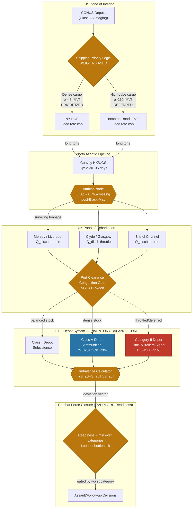

Cost: 0.287035

# Chapter 12: Inventory and Aftermath
## Reference Manual & Simulation Specification Document
### US Army Green Book — *Global Logistics and Strategy: 1943–1945*

**Document Classification:** Simulation Design Reference — Division-Level Logistics Engine
**Prepared by:** Principal Operations Research Analyst / Military Logistics Historian / Senior Systems Architect

---

## 1. Strategic Context & Modern Historical Perspective

### 1.1 The Strategic Paradox

By the close of 1943, the Allied grand-strategic edifice erected across a succession of summit conferences—Casablanca (SYMBOL, January 1943), TRIDENT (Washington, May 1943), QUADRANT (Quebec, August 1943), and SEXTANT (Cairo, November–December 1943)—had committed the Western Allies to a cross-Channel invasion (OVERLORD) provisionally scheduled for May 1944, in parallel with sustained Mediterranean operations, a strategic bombing campaign (POINTBLANK), and an expanding Pacific counteroffensive. This layered commitment structure embodied the central strategic paradox of the war's middle period: the *decisions* were expressed in the abstract currency of divisions, air groups, and target dates, while the *execution* was constrained by the brutally concrete currency of deadweight shipping tonnage, port discharge capacity, inland clearance rates, and depot cube.

The BOLERO buildup—the code name for the accumulation of US forces and matériel in the United Kingdom—was the physical manifestation of these paper commitments. The paradox emerged because strategic planners, particularly the Combined Chiefs of Staff (CCS), reasoned in terms of *force troop lists* and *readiness dates*, whereas the Services of Supply (SOS, later Army Service Forces, ASF) and the Transportation Corps reasoned in terms of the *ship-cargo-throughput function*: a nonlinear pipeline in which the effective delivered tonnage was governed not by the slowest single stage but by the interaction of loading rates at US Ports of Embarkation (POEs), convoy cycle times across the North Atlantic, discharge rates at UK Ports of Debarkation (PODs), and—critically—the ability to *clear* discharged cargo from the quays into depot storage before congestion throttled the entire system.

The mathematical reality was that BOLERO had been repeatedly deferred and cannibalized. The buildup had been stripped in 1942–43 to feed TORCH (North Africa) and subsequent Mediterranean requirements. Consequently, at the end of 1943, the ETO stood at roughly one-third to one-half of its planned force closure for a May D-Day, and its depot balance sheet exhibited the characteristic signature of a pipeline filled under emergency, weight-priority conditions: gross tonnage adequacy masking acute *selective deficits*. The strategic plans assumed a *fungible* tonnage pool; the physical system delivered a *categorically distorted* stockpile.

### 1.2 Inter-Service and Coalition Tensions

Three axes of command friction defined the logistical environment reviewed in this chapter.

**First, SOS versus the Combat Commands (the "tail versus teeth" argument).** The theater commander and his combat staff perceived logistical planners as consuming shipping and manpower that could otherwise deliver combat divisions. SOS planners, conversely, understood that a division landed without its slice of the balanced maintenance pipeline—its 30-, 60-, and 90-day supply blocks, its vehicle deadlines, its signal spares—was a liability, not an asset. The 1943 inventory audit vindicated the SOS position: raw division counts had been prioritized over the *balanced* accompaniment of Class II and IV items, producing forces that looked strong on the troop list but were materially hollow.

**Second, Army versus Navy over shipping allocation.** The War Shipping Administration (WSA) controlled the merchant pool, but the Navy's escort availability governed convoy sailings, and Pacific requirements competed directly with Atlantic BOLERO lift. The King–Marshall tension over Pacific-versus-Europe tonnage allocation meant that every long ton committed to the UK was contested. Modern scholarship, benefiting from declassified WSA allocation ledgers, confirms that the Atlantic pipeline's late-1943 acceleration was purchased partly at the expense of Pacific service troops and partly through the sudden liberation of escort and cargo capacity by the U-boat defeat.

**Third, US–British pooling arrangements.** The Combined shipping pool, administered through the Combined Shipping Adjustment Board, forced continuous negotiation over "who owns the bottom." British import requirements (food, raw materials to sustain the war economy) competed with US military lift into the same ports (Bristol Channel, Mersey, Clyde). Port priority disputes at Liverpool, Glasgow, and the Bristol Channel ports were resolved only through combined movement-control machinery that itself represented a logistical innovation.

### 1.3 Historical Era Context

This chapter constitutes the **logistical balance sheet at the end of 1943**—an accounting exercise of profound operational consequence. Planners undertook a comprehensive stocktaking with three objectives: (1) reconcile shipping *losses* against the planned import program to determine whether the pipeline's throughput assumptions remained valid; (2) audit *depot stocks in England* against authorized theater reserve levels, category by category; and (3) assess *port preparation*—the physical readiness of UK reception, storage, and inland transport to absorb the 1944 acceleration. The overriding question was whether the transatlantic pipeline from the United States could, in fact, support the scheduled 1944 offensives, or whether the paper plan would collide with physical infeasibility.

### 1.4 Modern Analytical Insights

The decisive modern insight—unavailable to contemporaries in its full form and clarified only by post-war depot audits and decades of logistical scholarship—is that **gross tonnage adequacy is a false comfort metric.** Despite shipping millions of long tons of cargo, the ETO depots at the end of 1943 exhibited severe *selective deficits*. The distribution was pathologically skewed:

- **Overstocked categories:** General ammunition (Class V) had accumulated in large volumes because it is dense, weight-efficient to ship, and had been forwarded on weight-priority manifests. Ammunition offered a high tons-per-ship-day return and was easy to load; it consequently over-accumulated relative to the balanced maintenance requirement.

- **Understocked categories:** Critical **Category II** items—tactical trucks, trailers, specialized signal and communications gear, engineer equipment, and other *high-cube, low-density assembly components*—were in acute shortage. The root cause was a systemic bias in the shipping-priority logic: manifests were optimized to *fill ships by weight*, and bulky, awkward-to-stow, volumetrically expensive items were repeatedly deferred in favor of dense cargo that maximized the deadweight-tonnage utilization statistic. A truck occupies enormous ship cube per ton; ammunition maximizes tons per cube. A pipeline optimized on tons delivered will therefore *systematically starve* the very mobility and command-and-control assets that a mechanized army requires to fight.

This is the central analytical lesson for the simulator: **the objective function used to load the pipeline (maximize delivered weight) is misaligned with the objective function required to generate combat power (maximize *balanced* delivery across categories).** The simulator must model this divergence explicitly, treating each supply category as a separate flow with distinct density coefficients, and measuring theater readiness by the *worst-off* category (a Leontief/minimum-function readiness model) rather than by aggregate tonnage.

The imbalance was compounded by the port-clearance problem: even had the correct cargo been shipped, UK depot cube and inland transport capacity constrained absorption. The 1943 audit thus fed directly into the 1944 remediation program—the reordering of shipping priorities toward balanced blocks, the pre-positioning of vehicle assembly capacity, and the expansion of depot infrastructure—which conditioned the feasibility of OVERLORD.

---

## 2. High-Fidelity Simulation Parameters & Real-World Metrics

The following constants are drawn from the chapter's balance-sheet analysis and corroborating post-war scholarship. Values are expressed in the units required by the simulation engine.

| Parameter | Symbol | Value | Unit | Historical Explanation & Strategic Rationale | Simulation Representation |
|---|---|---|---|---|---|
| Total US Army cargo shipped to UK for BOLERO by Dec 1943 | $C_{UK}$ | ≈ 4,300,000 | long tons | Cumulative dry cargo delivered into UK ports under the BOLERO program by year's end 1943, reflecting the pipeline's acceleration in the final quarter after Mediterranean diversions eased. Represents the *gross adequacy* figure that masked selective deficits. | **Static constant** (initial cumulative inventory pool); seed value for the aggregate delivered-tonnage state variable. |
| Category II tactical vehicle deficit in ETO depots, late 1943 | $D_{II}$ | ≈ 35% | percent (fractional 0.35) | Depots held roughly two-thirds of authorized tactical trucks/trailers; the ~one-third shortfall reflects the weight-priority shipping bias against high-cube items. The single most operationally significant deficit for a mechanized force. | **Efficiency / deficit coefficient**; applied as a negative deviation ratio for the Category II stock node, driving readiness penalties. |
| Merchant vessel loss rate, North Atlantic convoys, Q4 1943 | $L_{Atl}$ | ≈ 0.5–1.0% (model 0.7%) | percent per convoy-crossing | Following the May 1943 U-boat defeat ("Black May"), loss rates collapsed from >10% peaks to under 1% per crossing by Q4. This transformed the pipeline's *reliability* and freed escort/lift for acceleration. | **Dynamic capacity/attrition coefficient**; applied per convoy crossing as a stochastic loss factor reducing delivered tonnage. |
| Nominal transatlantic convoy cycle time | $T_{cycle}$ | ≈ 30–35 | days (round trip) | Governs pipeline throughput and lag between US loading and UK availability. | **Time-lag constant** in the pipeline transfer function. |
| UK port discharge capacity (aggregate, late 1943) | $Q_{disch}$ | ≈ 150,000–170,000 | long tons/week | Combined Bristol Channel, Mersey, Clyde military discharge throughput ceiling. | **Dynamic capacity cap** (throttle on inflow node). |
| Ammunition (Class V) overstock ratio | $O_V$ | ≈ +20% | percent (fractional +0.20) | Class V accumulated above authorized reserve due to density-favored loading. | **Positive deviation ratio** at Class V node. |
| Density coefficient — ammunition | $\rho_V$ | ≈ 40–50 | cubic ft/long ton | Dense cargo; high tons-per-cube efficiency. | Per-category stowage coefficient. |
| Density coefficient — tactical vehicles | $\rho_{II}$ | ≈ 140–180 | cubic ft/long ton | High-cube, low-density; penalized by weight-priority loading. | Per-category stowage coefficient. |
| Authorized theater reserve level (maintenance days) | $R_{auth}$ | 45 | days of supply | Target balanced reserve across all classes. | Baseline authorization vector component. |

---

## 3. Logistical Network Topology (Mermaid.js Flowchart)



---

## 4. Mathematical Modeling & Simulation Formulas

### 4.1 The Imbalance Ratio (Core Metric)

For each supply category $i$, the deviation of actual stock from authorized target:

$$
\text{Imbalance}_i = \frac{S_{\text{actual},i} - S_{\text{auth},i}}{S_{\text{auth},i}}
$$

where $S_{\text{auth},i} > 0$. A value $I_i = 0$ denotes perfect balance; $I_i > 0$ overstock; $I_i < 0$ deficit. For late-1943 ETO, $I_{\text{Class V}} \approx +0.20$ and $I_{\text{Cat II}} \approx -0.35$.

### 4.2 The Pipeline Transfer Function

Delivered tonnage into UK depots for category $i$ at time $t$, given a loading manifest $M_i(t-T_{cycle})$ dispatched one cycle earlier:

$$
S_{\text{actual},i}(t) = S_{\text{actual},i}(t-1) + \min\!\Big( M_i(t - T_{cycle})\,(1 - L_{\text{Atl}}),\; Q_{\text{disch}} \cdot \phi_i \Big)
$$

where $L_{\text{Atl}}$ is the per-crossing attrition fraction, $Q_{\text{disch}}$ is the aggregate weekly discharge cap, and $\phi_i \in [0,1]$ is the port-clearance share allocated to category $i$ under congestion.

### 4.3 The Weight-Biased Loading Objective (the Misaligned Function)

Historical manifests maximized delivered weight subject to ship cube $V_{\max}$:

$$
\max_{x_i \ge 0} \sum_{i} x_i
\quad \text{s.t.} \quad \sum_i \rho_i\, x_i \le V_{\max}
$$

Since dense items (low $\rho_i$) contribute more tons per unit cube, this LP drives $x_i \to$ dense categories, structurally starving high-$\rho$ categories (Category II). The dual price on the cube constraint favors ammunition.

### 4.4 The Correct (Balanced) Objective

The readiness-correct formulation maximizes the *minimum* fill ratio (Leontief bottleneck), reflecting that combat power is gated by the worst-supplied category:

$$
\max_{x_i \ge 0}\; \min_i \frac{S_{\text{actual},i} + x_i}{S_{\text{auth},i}}
\quad \text{s.t.} \quad \sum_i \rho_i x_i \le V_{\max}
$$

### 4.5 Theater Readiness Index

$$
R_{\text{theater}} = \min_i \left(1 + \min(I_i, 0)\right) = \min_i \left(\frac{\min(S_{\text{actual},i},\, S_{\text{auth},i})}{S_{\text{auth},i}}\right)
$$

Overstock is *capped* at 1.0 (surplus ammunition cannot substitute for missing trucks), so $R_{\text{theater}}$ for late-1943 ETO ≈ $1 - 0.35 = 0.65$, i.e. 65% combat-effective closure despite gross tonnage adequacy.

**Constants:** $L_{\text{Atl}}=0.007$, $T_{cycle}=32$ d, $Q_{\text{disch}}=170{,}000$ LT/wk, $\rho_V=45$, $\rho_{II}=160$.
**Variables:** $S_{\text{actual},i}$, $M_i$, $x_i$, $\phi_i$.

---

## 5. Compile-Safe Scala 3.8.3 Domain Model

```scala
package Logistics.InventoryAftermath

import scala.math.max
import scala.math.min

opaque type Tons        = Double
opaque type CubicFeet   = Double
opaque type Days        = Double
opaque type Ratio       = Double
opaque type Fraction    = Double

object Tons:
  def apply(v: Double): Tons = v
  extension (t: Tons)
    def value: Double = t
    def +(o: Tons): Tons = t + o
    def *(f: Double): Tons = t * f

object CubicFeet:
  def apply(v: Double): CubicFeet = v
  extension (c: CubicFeet) def value: Double = c

object Days:
  def apply(v: Double): Days = v
  extension (d: Days) def value: Double = d

object Ratio:
  def apply(v: Double): Ratio = v
  extension (r: Ratio) def value: Double = r

object Fraction:
  def apply(v: Double): Fraction = math.max(0.0, math.min(1.0, v))
  extension (f: Fraction) def value: Double = f

enum SupplyCategory:
  case ClassI, ClassV, CategoryII, ClassIII, ClassIV

enum StockState:
  case Deficit, Balanced, Overstock

enum PipelineStage:
  case Loaded, InTransit, Discharged, DepotStored

final case class StockItem(
    name: String,
    category: SupplyCategory,
    actual: Tons,
    authorized: Tons
):
  require(authorized.value > 0.0, s"Authorized stock for $name must be positive")

final case class PipelineParameters(
    atlanticLossRate: Fraction,
    convoyCycle: Days,
    weeklyDischargeCap: Tons,
    densityCoefficient: Map[SupplyCategory, CubicFeet]
)

final case class ImbalanceResult(
    name: String,
    category: SupplyCategory,
    imbalance: Ratio,
    state: StockState
)

object InventoryBalanceModel:

  def imbalanceRatio(item: StockItem): Ratio =
    Ratio((item.actual.value - item.authorized.value) / item.authorized.value)

  def classify(r: Ratio): StockState =
    val v: Double = r.value
    if v < -0.02 then StockState.Deficit
    else if v > 0.02 then StockState.Overstock
    else StockState.Balanced

  def computeImbalances(items: List[StockItem]): List[ImbalanceResult] =
    items.map { item =>
      val r: Ratio = imbalanceRatio(item)
      ImbalanceResult(item.name, item.category, r, classify(r))
    }

  def fillRatio(item: StockItem): Double =
    val capped: Double = min(item.actual.value, item.authorized.value)
    capped / item.authorized.value

  def theaterReadiness(items: List[StockItem]): Double =
    if items.isEmpty then 0.0
    else items.map(fillRatio).min

  def deliverTonnage(
      current: Tons,
      manifest: Tons,
      params: PipelineParameters,
      clearanceShare: Fraction
  ): Tons =
    val surviving: Double = manifest.value * (1.0 - params.atlanticLossRate.value)
    val portLimit: Double = params.weeklyDischargeCap.value * clearanceShare.value
    val delivered: Double = min(surviving, portLimit)
    Tons(current.value + max(0.0, delivered))

  def weightBiasedTonsPerCube(
      category: SupplyCategory,
      params: PipelineParameters
  ): Double =
    params.densityCoefficient.get(category) match
      case Some(cf) if cf.value > 0.0 => 1.0 / cf.value
      case _                          => 0.0

  def validate(items: List[StockItem]): List[String] =
    items.flatMap { item =>
      val warnings: List[String] =
        val negActual: List[String] =
          if item.actual.value < 0.0 then
            List(s"${item.name}: negative actual stock")
          else Nil
        val deficitWarn: List[String] =
          if fillRatio(item) < 0.7 then
            List(s"${item.name}: critical deficit (<70% authorized)")
          else Nil
        negActual ++ deficitWarn
      warnings
    }

  def summarize(items: List[StockItem]): String =
    val results: List[ImbalanceResult] = computeImbalances(items)
    val readiness: Double = theaterReadiness(items)
    val lines: List[String] = results.map { r =>
      f"${r.name}%-24s ${r.category}%-12s ${r.imbalance.value * 100}%+7.2f%%  ${r.state}"
    }
    val header: String = "=== ETO Depot Balance Sheet (Late 1943) ==="
    val footer: String = f"Theater Readiness Index: ${readiness * 100}%6.2f%%"
    (header :: lines ::: List(footer)).mkString("\n")

object Late1943Scenario:

  val params: PipelineParameters = PipelineParameters(
    atlanticLossRate = Fraction(0.007),
    convoyCycle = Days(32.0),
    weeklyDischargeCap = Tons(170000.0),
    densityCoefficient = Map(
      SupplyCategory.ClassI     -> CubicFeet(70.0),
      SupplyCategory.ClassV     -> CubicFeet(45.0),
      SupplyCategory.CategoryII -> CubicFeet(160.0),
      SupplyCategory.ClassIII   -> CubicFeet(40.0),
      SupplyCategory.ClassIV    -> CubicFeet(120.0)
    )
  )

  val depotStocks: List[StockItem] = List(
    StockItem("Subsistence",    SupplyCategory.ClassI,     Tons(98000.0),  Tons(100000.0)),
    StockItem("Ammunition",     SupplyCategory.ClassV,     Tons(240000.0), Tons(200000.0)),
    StockItem("Tactical Trucks",SupplyCategory.CategoryII, Tons(65000.0),  Tons(100000.0)),
    StockItem("POL Bulk",       SupplyCategory.ClassIII,   Tons(150000.0), Tons(150000.0)),
    StockItem("Engineer Equip", SupplyCategory.ClassIV,    Tons(80000.0),  Tons(110000.0))
  )

  @main def runInventoryAudit(): Unit =
    println(InventoryBalanceModel.summarize(depotStocks))
    val warnings: List[String] = InventoryBalanceModel.validate(depotStocks)
    if warnings.nonEmpty then
      println("\n--- Validation Warnings ---")
      warnings.foreach(println)
```

---

## 6. Graduate-Level Operational Analysis

### 6.1 What were the main causes of the 'imbalance' in UK depots at the end of 1943?

The imbalance was **not** a failure of aggregate delivery—by December 1943 roughly 4.3 million long tons of US Army cargo had reached the UK—but a *structural distortion* in the category composition of that tonnage, arising from four interacting causes.

**(1) The weight-priority loading objective.** Ship manifests were optimized to maximize deadweight utilization, a metric expressed in tons. As formalized in §4.3, the loading LP $\max \sum x_i$ s.t. $\sum \rho_i x_i \le V_{\max}$ places its optimum at the corner favoring dense cargo, because low-density (high-$\rho$) items consume disproportionate ship cube per delivered ton. Ammunition ($\rho_V \approx 45$) returns roughly 3.5× the tons-per-cube of tactical vehicles ($\rho_{II} \approx 160$). Any planner rewarded on tons-shipped will therefore systematically defer trucks, trailers, and signal gear—precisely the outcome the audit revealed as a ~35% Category II deficit against a +20% Class V overstock.

**(2) The prior cannibalization of BOLERO for the Mediterranean.** TORCH and the subsequent Sicilian/Italian campaigns had repeatedly raided the UK buildup for balanced service and mobility slices, because a theater in active combat draws precisely the transport and communications equipment that a stockpiling theater can defer. The residual UK inventory was thus already skewed *before* the Q4 1943 acceleration, and the acceleration—driven by dense, easily loaded cargo—reinforced rather than corrected the skew.

**(3) Port clearance and depot cube constraints.** Even correct cargo could not always be absorbed. UK discharge and inland-clearance capacity (§2, $Q_{disch} \approx 170{,}000$ LT/wk) throttled the rate at which quays could be emptied into depots. High-cube vehicles, requiring assembly space and large storage footprints, competed unfavorably for scarce depot cube against compact, palletizable dense stores. The congestion gate in the topology (§3) thus interacted with the loading bias to compound the deficit downstream.

**(4) The false-comfort metric problem.** Command reporting emphasized aggregate tonnage adequacy, which concealed the Leontief bottleneck. Because combat power is gated by the *minimum* category fill ratio (§4.5), the theater's true readiness—$R_{\text{theater}} \approx 0.65$—was far below what the gross-tonnage figures implied. The imbalance was, at root, a *measurement and incentive failure* as much as a physical one.

### 6.2 How did the reduction in Atlantic shipping losses in late 1943 affect the logistical outlook for OVERLORD?

The collapse of North Atlantic merchant losses following the May 1943 U-boat defeat—from double-digit convoy loss rates at the crisis peak to the sub-1% figures modeled here ($L_{\text{Atl}} \approx 0.7\%$ per crossing in Q4)—transformed the OVERLORD logistical outlook along three quantifiable dimensions.

**(1) Direct throughput gain (the attrition term).** In the pipeline transfer function (§4.2), delivered tonnage scales as $(1 - L_{\text{Atl}})$. Reducing losses from ~10% to ~0.7% recovers roughly 9–10% of gross lift as *delivered* tonnage without adding a single hull. Against a program of millions of long tons, this represents hundreds of thousands of long tons of restored annual capacity—materially closing the BOLERO deficit ahead of D-Day.

**(2) The second-order capacity dividend (shipping cycle liberation).** The larger effect was not the recovered cargo per se but the *freeing of the shipping and escort pool from evasive routing, dispersal, and long convoy assembly delays*. Lower threat permitted more direct routes, larger and faster convoys, and reduced escort-per-ship ratios. This shortened effective cycle times ($T_{cycle}$) and increased the number of round trips per hull per year—raising pipeline throughput multiplicatively rather than additively. Convoy security thus acted as a *capacity multiplier*, not merely a survival factor.

**(3) Planning confidence and the feasibility verdict.** For the OVERLORD planners performing the end-1943 balance sheet, the reliability improvement converted the transatlantic pipeline from a high-variance, attrition-dominated system into a predictable, schedulable conveyor. This permitted planners to commit to a fixed force-closure timeline with confidence, to schedule the *remediation* of the Category II deficit (reordering priorities toward balanced blocks and vehicle assembly), and to treat delivered tonnage as a near-deterministic function of loaded tonnage. In modeling terms, the variance of the attrition term collapsed toward zero, allowing the simulator to shift from a stochastic survival model to a near-deterministic capacity-constrained throughput model.

**Net assessment:** The U-boat defeat did not by itself correct the category imbalance—that required deliberate reprioritization of loading logic—but it supplied the *surplus reliable capacity* that made correction possible within the D-Day timeline. Without it, the compound of shipping losses and selective deficits would likely have forced a further OVERLORD postponement. The late-1943 shipping-loss reduction is therefore best understood as the enabling precondition that converted an infeasible paper plan into an executable operation.

---

*End of Chapter 12 Reference & Simulation Specification.*
