Cost: 0.4848925

### 1. Strategic Context & Modern Historical Perspective

Chapter 12, “Inventory and Aftermath,” is best understood as a strategic balance sheet rather than merely a catalog of matériel. By the end of 1943, Allied planners had achieved a decisive improvement in the material foundations of coalition warfare: Axis submarine pressure had been reduced, American industrial output was rising rapidly, British ports and depots were receiving unprecedented quantities of cargo, and the accumulation of forces for the cross-Channel invasion had resumed after the diversions of 1942–43. Yet these aggregate successes concealed a more difficult operational reality. An army could possess millions of tons of supplies and still be unready for offensive action if the supplies were in the wrong categories, packed in the wrong sequence, held at the wrong depot, or unsupported by sufficient transportation and port-clearance capacity.

#### The strategic paradox

The central paradox of Allied strategy was the widening gap between what the Combined Chiefs of Staff could schedule and what the physical distribution system could deliver in an operationally usable form. Conferences such as Casablanca in January 1943, TRIDENT in May, QUADRANT in August, and SEXTANT in November–December did not simply determine where armies would fight. Their decisions created competing demands on a common pool of merchant shipping, landing craft, escorts, tankers, port capacity, rail equipment, trucks, and specialized service units.

At Casablanca, the Allies endorsed a program that included continued operations in the Mediterranean, a strategic bombing offensive from the United Kingdom, expansion of the war against Japan, and preparation for a later cross-Channel invasion. Each commitment was individually plausible, but their combination imposed incompatible claims on scarce transportation assets. The Mediterranean campaigns required assault shipping, amphibious craft, combat-loaded vessels, and continuing maintenance tonnage. BOLERO—the accumulation of American forces and matériel in Britain—required regular, efficiently stowed cargo convoys and an expanding British reception system. The Pacific demanded long-haul shipping circuits whose voyages consumed far more ship-days per delivered ton than Atlantic routes.

TRIDENT gave the cross-Channel operation greater definition, but strategic priority did not automatically produce physical cargo. Shipping allocations remained subject to Mediterranean requirements, submarine losses, repair cycles, convoy scheduling, and the need to move food, fuel, and raw materials for the British civilian and war economies. QUADRANT established OVERLORD as the principal Anglo-American operation for 1944, but the logistical prerequisites remained formidable. SEXTANT, while confirming the main European strategy, also addressed continuing commitments in the Mediterranean and Asia. Strategic consensus therefore reduced some uncertainty without eliminating the resource competition embedded in coalition warfare.

The shipping problem was not governed solely by deadweight tonnage. Planners had to distinguish weight from cube, ship capacity from port capacity, and ordinary cargo carriage from combat loading. Merchant vessels optimized for bulk or break-bulk carriage could move large quantities across the Atlantic, but an assault-loaded ship had to be stowed so that matériel could be unloaded in tactical sequence. This reduced effective capacity. Vehicles were especially inefficient cargo because assembled trucks occupied large volumes relative to their weight. Crated or knocked-down vehicles used shipping cube more efficiently but transferred work to British ports, vehicle assembly parks, and technical troops. Specialized signal equipment, trailers, shop vans, engineer machinery, and spare parts created similar problems: their tonnage might be modest, but their absence could immobilize much heavier combat formations.

Thus a gross-tonnage target was not equivalent to a readiness target. If planners maximized tons shipped, they had an incentive to favor dense cargo such as ammunition, steel products, or compact rations. If they maximized measurement tons, they could still fail to account for assembly labor, depot handling, documentation, or final delivery. What mattered operationally was the synchronized arrival of complete organizational equipment sets, replacement stocks, trained service personnel, and transportation capacity.

#### Shipping pools, convoy protection, and ship-turnaround time

Merchant shipping was a pooled strategic resource, but not a perfectly fungible one. British and American authorities differed over the treatment of national shipping pools, import programs, military cargo priorities, and the degree to which vessels should be assigned to theaters or centrally controlled. The British approached shipping as a global, tightly managed pool because their national survival depended upon imported food, fuel, and raw materials as well as military movement. American commanders frequently viewed shipping allocated to a theater as an operational entitlement that should not be withdrawn once assigned.

The most useful simulation measure is therefore not merely the number of hulls but effective carrying capacity in long-ton-days or measurement-ton-days:

- ship deadweight and cubic capacity;
- voyage distance;
- convoy assembly delay;
- loading and discharge time;
- weather delay;
- repair and maintenance periods;
- empty repositioning;
- escort availability;
- and the probability of loss or damage.

A reduction in submarine sinkings increased capacity in two ways. It preserved ships and cargo, and it reduced uncertainty. Lower variance allowed planners to rely on more regular convoy arrivals, reduce emergency reserves, and schedule port labor and inland transportation with greater confidence. Nevertheless, improved Atlantic security did not remove the limits of British ports, railways, depots, and road networks. Once the oceanic bottleneck eased, congestion migrated inland.

#### Inter-service and command tensions

Within the United States Army, friction existed between operational commanders, the Services of Supply, theater headquarters, ports of embarkation, and technical services. Combat commanders naturally emphasized complete unit equipment and immediate tactical needs. Logistical agencies had to consider shipping efficiency, depot stock levels, maintenance pipelines, and the requirements of units not yet arrived. A combat formation might report itself ready because its principal weapons were present, while logisticians identified missing trucks, trailers, radio components, tires, workshop equipment, or reserve stocks that would prevent sustained operations.

The Army–Navy relationship introduced further complications. The Navy controlled much of the convoy and escort machinery and had powerful claims on tankers, amphibious vessels, landing craft, and specialized shipping. Army planners could calculate the cargo needed for OVERLORD, but the assault schedule depended upon naval landing craft and combat-loading capacity. The shortage of landing ships and craft became one of the most consequential constraints on 1944 strategy, affecting the size and timing of operations in both Europe and the Mediterranean.

Coalition arrangements created another level of friction. British authorities controlled the ports, much of the inland rail system, and substantial depot infrastructure in the United Kingdom. American forces operated within this host-nation network while seeking national control over their own supply system. British and American definitions of capacity were not always identical. A nominal berth capacity might not include restrictions imposed by tides, cranes, labor, lighterage, rail wagons, or storage space. American forecasts often assumed a high utilization rate; British administrators, drawing on operating experience, tended to incorporate greater allowances for disruption.

These disagreements were not simply bureaucratic. They reflected different optimization objectives. Theater commanders sought maximum combat power by a fixed date. Shipping authorities sought high vessel utilization and rapid turnaround. Port operators sought stable flows that did not exceed clearance capacity. Depot commanders sought balanced inventories and enough space to sort cargo. No single objective could be maximized without affecting the others.

#### The end-of-1943 balance sheet

By December 1943, the strategic situation was far more favorable than it had been six months earlier. The U-boat offensive had suffered a major reversal beginning in the spring of 1943. Improved escort groups, support carriers, very-long-range aircraft, centimetric radar, HF/DF, codebreaking, and more effective anti-submarine doctrine sharply reduced the effectiveness of German attacks. The net Allied merchant fleet was also expanding as American construction exceeded losses.

This transformation made the BOLERO buildup materially credible. Millions of long tons of American cargo had been dispatched to or accumulated in the United Kingdom. Ports were being expanded, depots constructed, railway movements coordinated, and vehicle assembly installations enlarged. The logistical outlook for OVERLORD had shifted from doubtful feasibility toward conditional feasibility.

The condition was inventory balance. Aggregate stocks did not map cleanly onto authorized equipment tables or operational consumption requirements. Ammunition and other dense commodities could accumulate above planned levels while transportation, maintenance, communications, and specialized engineering equipment remained deficient. Depot totals were also distorted by cargo identification failures, duplicate requisitions, supplies in transit, unprocessed shipments, and items physically present but unavailable to the unit that required them.

The period’s terminology must be handled carefully. The historical records do not support one universal “Category II tactical vehicle deficit” applicable to the entire European Theater. Army supply nomenclature ordinarily referred to classes of supply, technical-service categories, organizational equipment, and item-specific shortage reports. Trucks, trailers, signal items, and special-purpose vehicles had different authorized quantities and on-hand percentages. A single theater-wide percentage may be useful as a synthetic simulation calibration, but it should not be presented as a uniquely reported archival constant unless its date, item universe, and denominator are specified.

#### Modern analytical insights

Modern logistics scholarship emphasizes that the late-1943 problem was a multi-commodity network-flow problem with severe complementarity effects. A division was not operationally ready when it possessed a high percentage of total equipment by weight. It was ready when all mission-essential capability chains exceeded minimum thresholds. One missing radio component might reduce command-and-control capability; insufficient trucks could prevent an artillery unit from moving ammunition; missing trailers could reduce transport capacity even when prime movers were present.

This can be represented as a Leontief-style readiness relationship:

$$
R_d = \min_{i \in M_d}\left(\frac{S_{d,i}}{A_{d,i}}\right),
$$

where $R_d$ is the readiness of division $d$, $M_d$ is its set of mission-essential items, $S_{d,i}$ is serviceable stock, and $A_{d,i}$ is the authorized requirement. The minimum, rather than the average, captures the effect of critical shortages. A weighted average may report 95 percent equipment availability while a 40 percent availability of tactical trucks leaves the formation operationally constrained.

The inventory aftermath of 1943 also demonstrates the danger of treating pipeline stock as interchangeable with depot stock. Cargo aboard a vessel, awaiting discharge, moving by rail, undergoing assembly, or held in an unlocated depot was not immediately usable. Modern simulations should therefore maintain state-specific inventory:

1. at the U.S. producer or depot;
2. awaiting port movement;
3. at the port of embarkation;
4. loaded aboard ship;
5. in Atlantic transit;
6. awaiting discharge;
7. in port clearance;
8. at a general depot;
9. under assembly, inspection, or repair;
10. at a unit depot or staging area;
11. issued and serviceable;
12. issued but non-serviceable.

The historical lesson is that Allied victory in the shipping battle did not eliminate logistics constraints. It changed their location. By late 1943 the dominant risk was no longer simply whether enough cargo could cross the Atlantic. It was whether the theater could receive, identify, clear, assemble, allocate, and deliver the correct mix in time for OVERLORD.

---

### 2. High-Fidelity Simulation Parameters & Real-World Metrics

Historical reporting conventions vary between cargo **shipped**, **received**, and **discharged**, and between long tons and measurement tons. The database should preserve the original unit, date basis, geographic boundary, and denominator rather than silently harmonizing unlike figures.

| Parameter | Recommended historical value | Unit and scope | Evidentiary qualification | Historical significance | Simulation representation |
|---|---:|---|---|---|---|
| Cumulative U.S. Army cargo associated with BOLERO by 31 December 1943 | **Approximately 5,300,000** | Long tons, cumulative cargo shipped to or received in the United Kingdom, depending on the underlying theater series | The official histories generally present this as a rounded cumulative magnitude. It should not be stored with spurious single-ton precision. Some tables use port receipts or discharge rather than sailing date, and some use measurement tons. | Demonstrates that the buildup had become massive before the final 1944 acceleration. It does not imply that all cargo was identified, serviceable, or available for issue. | Store `5_300_000 LT` as a dated benchmark with a confidence/rounding flag. Do not use it as immediately available depot inventory. Partition it among transit, port, depot, assembly, repair, and issued states. |
| Claimed theater-wide deficit of “Category II tactical vehicles” | **No single archival aggregate is defensible** | Item-dependent percentage | The chapter and standard official histories do not establish one exact ETO-wide percentage covering all trucks, trailers, and communications equipment. Shortage reports used different dates, item groups, authorizations, and denominators. A figure such as 25, 30, or 35 percent is a scenario assumption unless tied to a specific report. | The absence of a single number is itself analytically important. Aggregate tonnage concealed selective deficits in general-purpose trucks, special-purpose vehicles, trailers, signal equipment, spares, and assembly capacity. | Store deficits by item and date. If a synthetic baseline is required, use a configurable **0.30 deficit scenario**, never a hard-coded historical fact. Include uncertainty bounds, for example 0.20–0.40, and require a provenance tag. |
| Merchant-vessel loss rate in North Atlantic convoy operations, fourth quarter 1943 | **Approximately 0.4% of sailings** | Merchant vessels lost per convoyed sailing, October–December 1943 | The result depends on whether the denominator includes all North Atlantic convoy sailings, independently routed vessels, stragglers, or losses from all causes. The approximately 0.4 percent figure is suitable as a rounded operational benchmark, not a universal ocean-wide loss rate. | Represents the collapse of the earlier U-boat threat as a binding constraint. Lower losses increased surviving lift and, more importantly, reduced schedule variance. | Use as a baseline stochastic loss coefficient for late-1943 North Atlantic convoy legs: `pLoss = 0.004`. Modify dynamically for route, escort strength, intelligence, weather, straggling, and month. |
| Cargo availability after ocean loss | $C(1-p)$ | Long tons | Expected-value measure; actual losses should normally be stochastic at ship or shipment level. | Converts nominal loading into expected delivered cargo. | Dynamic efficiency coefficient. |
| Port discharge utilization | 0.70–0.90 of nominal berth capacity | Scenario range | Nominal capacity rarely equaled sustained throughput because of weather, labor, crane, lighterage, and rail constraints. | Prevents unrealistic continuous operation at engineering maximum. | Dynamic cap: nominal capacity multiplied by utilization, congestion, and damage factors. |
| Vehicle shipping cube penalty | 1.5–3.0 relative to dense break-bulk cargo | Scenario coefficient | Exact value depends on vehicle type and whether assembled, boxed, or knocked down. | Vehicles could be light by weight but expensive in cubic space. | Apply both weight and cube constraints; the binding constraint is the smaller residual capacity. |
| Port dwell time | 1–7 days under normal conditions; longer under congestion | Scenario distribution | Varies by port, documentation quality, cargo type, and clearance mode. | Cargo discharged but not cleared occupies quay and transit-shed capacity. | Queue delay distribution responsive to utilization. |
| Vehicle assembly delay | 2–14 days by type and workload | Scenario distribution | Knocked-down shipment saves cube but creates a downstream labor and facility requirement. | Converts ocean efficiency into theater processing demand. | State transition from `AwaitingAssembly` to `ServiceableDepotStock`. |
| Depot imbalance threshold | $\pm 0.10$ | Ratio | Analytical policy value rather than a universal historical rule. | Separates normal variation from significant shortage or excess. | Classify below −10% as deficient, above +10% as surplus. |
| Critical shortage threshold | $-0.25$ | Ratio | Simulation policy parameter. | Identifies deficits likely to impair unit readiness. | Triggers expediting, substitution, reallocation, or priority shipping. |
| Severe shortage threshold | $-0.50$ | Ratio | Simulation policy parameter. | Represents a capability-threatening shortage. | Blocks deployment or sharply reduces readiness. |

#### Data-governance rule

Every historical metric should carry:

- `effectiveDate`;
- `originBoundary` and `destinationBoundary`;
- `cargoState`, such as shipped, discharged, or depot on hand;
- `unitBasis`, especially long tons versus measurement tons;
- `denominatorDefinition`;
- `sourceSeries`;
- `confidence`;
- `isRounded`;
- and `scenarioOverride`.

The tactical-vehicle deficit should not be represented as an immutable `0.30` historical constant. The correct historical architecture is a set of item-level observations:

$$
D_{i,t,n} = 1-\frac{S_{i,t,n}}{A_{i,t,n}},
$$

where $i$ is the item, $t$ the reporting date, and $n$ the depot, command, or theater boundary.

---

### 3. Logistical Network Topology (Detailed Mermaid.js Flowchart)

```mermaid
flowchart LR
    subgraph CONUS["Continental United States: Production and Concentration"]
        PROD["Factories and arsenals<br/>Production by item, weight, cube, and priority"]
        ASF["Army Service Forces depots<br/>Inspection, packing, documentation"]
        HOLD["Holding and reconsignment points<br/>Queue limited by rail and storage"]
        RAIL["CONUS rail network<br/>Capacity: cars per day<br/>Delay: congestion and priority"]
        NYPOE["New York Port of Embarkation<br/>Berth, crane, labor, weight, and cube limits"]
        BOSPOE["Boston Port of Embarkation<br/>Alternative North Atlantic routing"]
        HAMPOE["Hampton Roads POE<br/>Alternative routing and specialized cargo"]
        PROD -->|finished equipment| ASF
        ASF -->|balanced shipment requests| HOLD
        HOLD -->|rail allocation| RAIL
        RAIL -->|primary route| NYPOE
        RAIL -->|overflow route| BOSPOE
        RAIL -->|overflow and special cargo| HAMPOE
    end

    subgraph OCEAN["Atlantic Shipping and Convoy System"]
        LOAD["Loading queue<br/>Constraint: deadweight and cubic capacity"]
        CONVOY["North Atlantic convoy<br/>Escort and sailing-cycle constraint"]
        LOSS{"Loss, damage, or straggling event<br/>Late-1943 baseline p ≈ 0.004"}
        DIVERT["Weather or threat diversion<br/>Adds ship-days and arrival variance"]
        LOAD --> CONVOY
        CONVOY --> LOSS
        LOSS -->|survives on schedule| UKAPP
        LOSS -->|survives but delayed| DIVERT
        LOSS -->|ship and cargo lost| WRITE["Inventory write-off<br/>Replacement requisition"]
        DIVERT --> UKAPP
    end

    NYPOE -->|dry cargo, vehicles, ammunition| LOAD
    BOSPOE -->|dry cargo and vehicles| LOAD
    HAMPOE -->|special cargo and vehicles| LOAD

    subgraph UKPORTS["United Kingdom Port Reception System"]
        UKAPP["Approach and anchorage queue<br/>Weather, pilot, tide, and berth delay"]
        LIVER["Liverpool and Mersey ports<br/>High capacity, inland rail dependence"]
        BRISTOL["Bristol Channel ports<br/>Alternative western reception"]
        CLYDE["Clyde ports<br/>Longer inland clearance routes"]
        SOUTH["Southern ports<br/>Closer to staging areas but invasion congestion"]
        DISCH["Discharge process<br/>Crane, lighter, labor, and hatch constraints"]
        TRANSIT["Transit sheds and sorting<br/>Documentation and identification delay"]
        CLEAR{"Port-clearance gate<br/>Rail wagons, trucks, and depot space available?"}

        UKAPP -->|assigned berth| LIVER
        UKAPP -->|alternate berth| BRISTOL
        UKAPP -->|northern diversion| CLYDE
        UKAPP -->|priority or coastal destination| SOUTH

        LIVER --> DISCH
        BRISTOL --> DISCH
        CLYDE --> DISCH
        SOUTH --> DISCH
        DISCH --> TRANSIT
        TRANSIT --> CLEAR
        CLEAR -->|capacity available| INLAND
        CLEAR -->|capacity unavailable| PORTQ["Port accumulation queue<br/>Reduces berth productivity"]
        PORTQ -->|released after delay| CLEAR
    end

    subgraph INLAND["British Inland Transportation"]
        INLAND["Routing and movement control"]
        UKRAIL["British rail network<br/>Capacity: wagon-days and route slots"]
        ROAD["Motor transport routes<br/>Capacity: truck tons per day"]
        COASTAL["Coastal shipping or lighterage<br/>Alternative for selected commodities"]
        INLAND --> UKRAIL
        INLAND --> ROAD
        INLAND --> COASTAL
    end

    subgraph DEPOTS["ETO Depot and Processing Network"]
        GENDEP["General depots<br/>Mixed dry cargo and reserve stocks"]
        AMMODEP["Ammunition depots<br/>Explosive limits and safety separation"]
        PETDEP["Petroleum storage<br/>Tankage and transfer-rate limits"]
        VEHREC["Vehicle reception and assembly parks<br/>Assembly labor and parts constraints"]
        SIGDEP["Signal depots<br/>Specialized inspection and component matching"]
        ENGDEP["Engineer depots<br/>Heavy plant and bridging equipment"]
        REPAIR["Maintenance and repair depots<br/>Serviceability conversion queue"]
        CENSUS["Inventory census<br/>Actual, authorized, in-transit, and serviceable"]
        BALANCE{"Deviation ratio by item<br/>(actual - authorized) / authorized"}
        REALLOC["Reallocation and substitution optimizer"]
        REQ["Requisition or expedited shipment"]
        SURPLUS["Surplus holding or shipment deferral"]

        UKRAIL --> GENDEP
        UKRAIL --> AMMODEP
        UKRAIL --> PETDEP
        UKRAIL --> VEHREC
        ROAD --> GENDEP
        ROAD --> VEHREC
        COASTAL --> PETDEP

        VEHREC -->|assembled and inspected| REPAIR
        SIGDEP --> REPAIR
        ENGDEP --> REPAIR
        REPAIR -->|serviceable| GENDEP

        GENDEP --> CENSUS
        AMMODEP --> CENSUS
        PETDEP --> CENSUS
        VEHREC --> CENSUS
        SIGDEP --> CENSUS
        ENGDEP --> CENSUS
        CENSUS --> BALANCE
        BALANCE -->|critical deficit| REALLOC
        BALANCE -->|unfillable deficit| REQ
        BALANCE -->|excess stock| SURPLUS
        REALLOC -->|lateral transfer| GENDEP
        REQ -->|demand signal to CONUS| ASF
        SURPLUS -->|reduce later shipment priority| ASF
    end

    subgraph STAGING["Assembly, Staging, and Combat Nodes"]
        MARSHAL["Marshalling areas<br/>Unit-equipment matching"]
        DIVDEP["Division and corps supply points<br/>Daily issue and reserve"]
        ASSAULT["Assault forces and embarkation areas<br/>Combat-loading sequence"]
        FOLLOW["Follow-up formations<br/>Administratively loaded lift"]
        COMBAT["Projected Normandy combat nodes<br/>Consumption and attrition"]
        RETURN["Salvage, repair, and empty-container return flow"]

        GENDEP -->|rations, parts, general stores| MARSHAL
        AMMODEP -->|ammunition| MARSHAL
        PETDEP -->|packaged and bulk fuel| MARSHAL
        MARSHAL --> DIVDEP
        DIVDEP --> ASSAULT
        DIVDEP --> FOLLOW
        ASSAULT --> COMBAT
        FOLLOW --> COMBAT
        COMBAT --> RETURN
        RETURN --> REPAIR
    end
```



The network should be implemented as a multi-commodity, time-expanded graph. Every edge requires separate weight, cube, vehicle, fuel, and handling constraints. Port discharge is not complete delivery: cargo remains unavailable until it passes sorting, clearance, processing, and depot-receipt transitions.

---

### 4. Mathematical Modeling & Simulation Formulas

#### Sets and indices

Let:

- $N$ be the set of logistics nodes;
- $A$ be the set of directed transportation arcs;
- $I$ be the set of supply items or categories;
- $T$ be the set of discrete time periods;
- $D$ be the set of divisions or consuming formations;
- $V$ be the set of merchant vessels;
- $P$ be the set of ports.

#### Inventory imbalance

For item $i$, the basic inventory imbalance is:

$$
\text{Imbalance}_i =
\frac{S^{actual}_i-S^{auth}_i}{S^{auth}_i}.
$$

Interpretation:

- $\text{Imbalance}_i=0$: stock exactly equals authorization;
- $\text{Imbalance}_i=-0.30$: stock is 30 percent below authorization;
- $\text{Imbalance}_i=0.20$: stock is 20 percent above authorization.

The formula is undefined when $S^{auth}_i=0$. The simulator must therefore reject a zero or negative authorization for an item subject to imbalance calculation.

Because unusable equipment should not count at full value, define effective stock as:

$$
S^{eff}_{i,n,t}
=
S^{serviceable}_{i,n,t}
+\alpha_i S^{repairable}_{i,n,t}
+\beta_i S^{inTransit}_{i,n,t},
$$

where:

- $\alpha_i \in [0,1]$ is the expected near-term recovery fraction for repairable stock;
- $\beta_i \in [0,1]$ discounts in-transit stock according to delay and disruption risk.

The effective imbalance becomes:

$$
I_{i,n,t}
=
\frac{S^{eff}_{i,n,t}-A_{i,n,t}}{A_{i,n,t}}.
$$

For historical reporting, $\beta_i$ should normally be zero: cargo in transit is not on hand. For forecasting, $\beta_i$ may be positive.

#### Inventory conservation

For every item $i$, node $n$, and period $t$:

$$
S_{i,n,t+1}
=
S_{i,n,t}
+
\sum_{a \in \delta^-(n)} x_{i,a,t-\tau_a}(1-\ell_{a,t})
-
\sum_{a \in \delta^+(n)} x_{i,a,t}
-
C_{i,n,t}
-
W_{i,n,t}
+
R_{i,n,t},
$$

where:

- $x_{i,a,t}$ is the amount of item $i$ dispatched on arc $a$ in period $t$;
- $\tau_a$ is transit time;
- $\ell_{a,t}$ is the loss or wastage rate;
- $C_{i,n,t}$ is consumption;
- $W_{i,n,t}$ is write-off, damage, or administrative loss;
- $R_{i,n,t}$ is recovered or repaired stock;
- $\delta^-(n)$ and $\delta^+(n)$ are incoming and outgoing arcs.

#### Weight and cube constraints

Shipping and port operations must observe both weight and volume:

$$
\sum_i w_i x_{i,a,t} \leq K^{weight}_{a,t},
$$

$$
\sum_i q_i x_{i,a,t} \leq K^{cube}_{a,t},
$$

where $w_i$ is unit weight and $q_i$ is unit cube. For bulky vehicles, the cube constraint may bind before deadweight capacity.

Effective capacity is:

$$
K^{eff}_{a,t}
=
K^{nominal}_{a,t}
u_{a,t}
(1-g_{a,t})
(1-d_{a,t}),
$$

where:

- $u_{a,t}$ is normal utilization;
- $g_{a,t}$ is congestion loss;
- $d_{a,t}$ is damage, weather, or disruption loss.

#### Port queue and congestion

Let arrivals at port $p$ during period $t$ be $A_{p,t}$ and sustainable discharge and clearance capacity be $K_{p,t}$. The queue evolves as:

$$
Q_{p,t+1}
=
\max\left(0,\ Q_{p,t}+A_{p,t}-K_{p,t}\right).
$$

A simple nonlinear dwell-time function is:

$$
D_{p,t}
=
D^{base}_p
\left(
1+\gamma_p
\frac{Q_{p,t}}{K_{p,t}}
\right),
$$

where $\gamma_p$ is the port’s congestion sensitivity. As utilization approaches or exceeds capacity, delay should increase sharply; a queueing formulation such as an $M/G/c$ approximation may be substituted for the linear expression.

#### Convoy loss process

For a shipment carried by vessel $v$:

$$
L_{v,t} \sim \operatorname{Bernoulli}(p_{v,t}),
$$

with:

$$
p_{v,t}
=
p^{base}_t
m^{route}_v
m^{escort}_v
m^{weather}_v
m^{straggler}_v.
$$

For the fourth quarter of 1943, a baseline convoyed-merchant loss probability may be initialized as:

$$
p^{base}_{Q4\,1943}=0.004.
$$

Expected cargo delivered is:

$$
E[Y_{v,t}]
=
X_{v,t}(1-p_{v,t}),
$$

but the simulator should normally draw losses at vessel or shipment-lot level. Applying a deterministic 0.4 percent haircut to every shipment suppresses the historically important variance created by occasional total ship losses.

#### Division readiness

A weighted inventory average is inadequate for critical equipment. Define category readiness:

$$
r_{d,i,t}
=
\min\left(1,\frac{S^{serviceable}_{d,i,t}}{A_{d,i,t}}\right).
$$

Mission readiness may then be represented as:

$$
R_{d,t}
=
\left[
\prod_{i \in I_d}
r_{d,i,t}^{\omega_{d,i}}
\right]
\cdot
\min_{j \in M_d} r_{d,j,t},
$$

where:

- $\omega_{d,i}$ are normalized importance weights;
- $M_d$ is the subset of mission-critical items.

This formulation combines broad equipment balance with a bottleneck penalty. A division with ample ammunition but only half its required tactical transport cannot receive a high readiness score merely because ammunition dominates total tonnage.

#### Allocation objective

A suitable multi-period optimization objective is:

$$
\min
\sum_{t \in T}
\left[
\sum_{i,n}
\lambda_i^- z^-_{i,n,t}
+
\sum_{i,n}
\lambda_i^+ z^+_{i,n,t}
+
\sum_{a,i}
c_{i,a}x_{i,a,t}
+
\sum_p h_p Q_{p,t}
+
\sum_d \rho_d(1-R_{d,t})
\right],
$$

where:

- $z^-_{i,n,t}$ is shortage below authorization;
- $z^+_{i,n,t}$ is excess above authorization;
- $\lambda_i^-$ is the shortage penalty;
- $\lambda_i^+$ is the excess-stock penalty;
- $c_{i,a}$ is transportation cost;
- $h_p$ is port-congestion cost;
- $\rho_d$ is the penalty for divisional unreadiness.

The deviations satisfy:

$$
S^{eff}_{i,n,t}-A_{i,n,t}
=
z^+_{i,n,t}-z^-_{i,n,t},
$$

$$
z^+_{i,n,t}\geq0,\qquad z^-_{i,n,t}\geq0.
$$

Priority cargo can be enforced with:

$$
\sum_a x_{i,a,t}
\geq
P_{i,t}
\qquad
\forall i \in I^{critical},
$$

provided sufficient stock exists. If supply is insufficient, the problem requires slack variables with very high penalties rather than infeasible hard constraints.

#### Vehicle assembly constraint

For knocked-down vehicles:

$$
V^{assembled}_{i,p,t}
\leq
K^{assembly}_{i,p,t},
$$

$$
S^{serviceable}_{i,p,t+1}
=
S^{serviceable}_{i,p,t}
+
V^{assembled}_{i,p,t}
-
X^{issued}_{i,p,t}.
$$

This prevents the model from treating a crated truck discharged at Liverpool as an immediately usable tactical vehicle.

---

### 5. Compile-Safe Scala 3.8.3 Domain Model

```scala
package Logistics.InventoryAftermath

import java.time.LocalDate
import scala.util.Random

sealed trait DomainError derives CanEqual:
  def message: String

object DomainError:
  final case class InvalidValue(field: String, value: Double) extends DomainError:
    val message: String = s"$field has invalid value $value"

  final case class InvalidText(field: String) extends DomainError:
    val message: String = s"$field must not be blank"

  final case class MissingNode(nodeId: String) extends DomainError:
    val message: String = s"Node $nodeId does not exist"

  final case class InsufficientStock(
      nodeId: String,
      category: SupplyCategory,
      requested: Double,
      available: Double
  ) extends DomainError:
    val message: String =
      s"Node $nodeId has $available available for $category but $requested was requested"

  final case class InvalidTransition(
      shipmentId: String,
      from: TransitStatus,
      to: TransitStatus
  ) extends DomainError:
    val message: String =
      s"Shipment $shipmentId cannot transition from $from to $to"

object Units:
  opaque type Tons = Double
  opaque type Days = Double
  opaque type NauticalMiles = Double
  opaque type CubicFeet = Double
  opaque type Probability = Double
  opaque type Ratio = Double

  object Tons:
    def from(value: Double): Either[DomainError, Tons] =
      if value.isFinite && value >= 0.0 then Right(value)
      else Left(DomainError.InvalidValue("tons", value))

    def zero: Tons = 0.0

    def unsafe(value: Double): Tons =
      require(value.isFinite && value >= 0.0, s"Invalid tons: $value")
      value

  extension (value: Tons)
    def toDouble: Double = value
    def +(other: Tons): Tons = value + other
    def -(other: Tons): Tons = value - other
    def *(factor: Double): Tons = Tons.unsafe(value * factor)
    def min(other: Tons): Tons = Tons.unsafe(math.min(value, other))
    def isZero: Boolean = value == 0.0

  object Days:
    def from(value: Double): Either[DomainError, Days] =
      if value.isFinite && value >= 0.0 then Right(value)
      else Left(DomainError.InvalidValue("days", value))

    def zero: Days = 0.0

    def unsafe(value: Double): Days =
      require(value.isFinite && value >= 0.0, s"Invalid days: $value")
      value

  extension (value: Days)
    def toDouble: Double = value
    def +(other: Days): Days = Days.unsafe(value + other)
    def >=(other: Days): Boolean = value >= other

  object NauticalMiles:
    def from(value: Double): Either[DomainError, NauticalMiles] =
      if value.isFinite && value >= 0.0 then Right(value)
      else Left(DomainError.InvalidValue("nauticalMiles", value))

    def unsafe(value: Double): NauticalMiles =
      require(value.isFinite && value >= 0.0, s"Invalid nautical miles: $value")
      value

  extension (value: NauticalMiles)
    def toDouble: Double = value

  object CubicFeet:
    def from(value: Double): Either[DomainError, CubicFeet] =
      if value.isFinite && value >= 0.0 then Right(value)
      else Left(DomainError.InvalidValue("cubicFeet", value))

    def unsafe(value: Double): CubicFeet =
      require(value.isFinite && value >= 0.0, s"Invalid cubic feet: $value")
      value

  extension (value: CubicFeet)
    def toDouble: Double = value

  object Probability:
    def from(value: Double): Either[DomainError, Probability] =
      if value.isFinite && value >= 0.0 && value <= 1.0 then Right(value)
      else Left(DomainError.InvalidValue("probability", value))

    def zero: Probability = 0.0
    def one: Probability = 1.0

    def unsafe(value: Double): Probability =
      require(
        value.isFinite && value >= 0.0 && value <= 1.0,
        s"Invalid probability: $value"
      )
      value

  extension (value: Probability)
    def toDouble: Double = value
    def complement: Probability = Probability.unsafe(1.0 - value)

  object Ratio:
    def from(value: Double): Either[DomainError, Ratio] =
      if value.isFinite then Right(value)
      else Left(DomainError.InvalidValue("ratio", value))

    def unsafe(value: Double): Ratio =
      require(value.isFinite, s"Invalid ratio: $value")
      value

  extension (value: Ratio)
    def toDouble: Double = value

import Logistics.InventoryAftermath.Units.CubicFeet
import Logistics.InventoryAftermath.Units.Days
import Logistics.InventoryAftermath.Units.NauticalMiles
import Logistics.InventoryAftermath.Units.Probability
import Logistics.InventoryAftermath.Units.Ratio
import Logistics.InventoryAftermath.Units.Tons

enum SupplyCategory derives CanEqual:
  case Ammunition
  case BulkPetroleum
  case PackagedPetroleum
  case Rations
  case TacticalTrucks
  case Trailers
  case SignalEquipment
  case EngineerEquipment
  case SpareParts
  case MedicalSupplies
  case GeneralStores

enum NodeKind derives CanEqual:
  case Factory
  case Depot
  case PortOfEmbarkation
  case ConvoyAssembly
  case PortOfDebarkation
  case TransitShed
  case VehicleAssemblyPark
  case RepairDepot
  case StagingArea
  case DivisionSupplyPoint
  case CombatNode

enum TransitStatus derives CanEqual:
  case Planned
  case Loading
  case InTransit
  case Delayed
  case AwaitingDischarge
  case AwaitingAssembly
  case Delivered
  case Lost

enum InventoryCondition derives CanEqual:
  case SevereDeficit
  case Deficit
  case Balanced
  case Surplus

enum Priority derives CanEqual:
  case Routine
  case Important
  case Critical
  case OperationalEmergency

final case class StockItem(
    name: String,
    actual: Double,
    authorized: Double
)

object InventoryBalanceModel:
  def computeImbalances(items: List[StockItem]): List[(String, Double)] =
    items.map { item =>
      require(item.name.trim.nonEmpty, "Stock item name must not be blank")
      require(
        item.actual.isFinite && item.actual >= 0.0,
        s"Invalid actual stock for ${item.name}"
      )
      require(
        item.authorized.isFinite && item.authorized > 0.0,
        s"Authorized stock must be positive for ${item.name}"
      )
      val ratio: Double =
        (item.actual - item.authorized) / item.authorized
      item.name -> ratio
    }

  def classify(ratio: Double): InventoryCondition =
    require(ratio.isFinite, s"Invalid imbalance ratio: $ratio")
    if ratio <= -0.50 then InventoryCondition.SevereDeficit
    else if ratio < -0.10 then InventoryCondition.Deficit
    else if ratio <= 0.10 then InventoryCondition.Balanced
    else InventoryCondition.Surplus

final case class LogisticsNode(
    id: String,
    name: String,
    kind: NodeKind,
    weightCapacityPerDay: Tons,
    cubeCapacityPerDay: CubicFeet,
    baseDwellTime: Days
):
  def validate: Either[DomainError, LogisticsNode] =
    if id.trim.isEmpty then Left(DomainError.InvalidText("node.id"))
    else if name.trim.isEmpty then Left(DomainError.InvalidText("node.name"))
    else Right(this)

final case class Route(
    id: String,
    originId: String,
    destinationId: String,
    distance: NauticalMiles,
    transitTime: Days,
    weightCapacityPerPeriod: Tons,
    cubeCapacityPerPeriod: CubicFeet,
    baselineLossProbability: Probability,
    utilization: Probability,
    congestionFactor: Probability
):
  def effectiveWeightCapacity: Tons =
    val utilizationFactor: Double = utilization.toDouble
    val congestionMultiplier: Double = 1.0 - congestionFactor.toDouble
    weightCapacityPerPeriod * utilizationFactor * congestionMultiplier

  def effectiveCubeCapacity: CubicFeet =
    val factor: Double =
      utilization.toDouble * (1.0 - congestionFactor.toDouble)
    CubicFeet.unsafe(effectiveCubeValue(factor))

  private def effectiveCubeValue(factor: Double): Double =
    cubeCapacityPerPeriod.toDouble * factor

  def validate: Either[DomainError, Route] =
    if id.trim.isEmpty then Left(DomainError.InvalidText("route.id"))
    else if originId.trim.isEmpty then
      Left(DomainError.InvalidText("route.originId"))
    else if destinationId.trim.isEmpty then
      Left(DomainError.InvalidText("route.destinationId"))
    else Right(this)

final case class InventoryKey(
    nodeId: String,
    category: SupplyCategory
)

final case class InventoryRecord(
    category: SupplyCategory,
    actual: Tons,
    authorized: Tons,
    serviceableFraction: Probability,
    repairable: Tons,
    inTransit: Tons
):
  def effectiveStock(
      repairRecoveryFraction: Probability,
      transitDiscount: Probability
  ): Tons =
    val serviceable: Tons = actual * serviceableFraction.toDouble
    val recoverable: Tons = repairable * repairRecoveryFraction.toDouble
    val discountedTransit: Tons = inTransit * transitDiscount.toDouble
    serviceable + recoverable + discountedTransit

  def imbalance(
      repairRecoveryFraction: Probability,
      transitDiscount: Probability
  ): Either[DomainError, Ratio] =
    if authorized.toDouble <= 0.0 then
      Left(DomainError.InvalidValue("authorized", authorized.toDouble))
    else
      val effective: Double =
        effectiveStock(repairRecoveryFraction, transitDiscount).toDouble
      val value: Double =
        (effective - authorized.toDouble) / authorized.toDouble
      Right(Ratio.unsafe(value))

  def condition(
      repairRecoveryFraction: Probability,
      transitDiscount: Probability
  ): Either[DomainError, InventoryCondition] =
    imbalance(repairRecoveryFraction, transitDiscount).map { ratio =>
      InventoryBalanceModel.classify(ratio.toDouble)
    }

final case class CargoSpecification(
    category: SupplyCategory,
    tonsPerUnit: Tons,
    cubePerUnit: CubicFeet,
    requiresAssembly: Boolean,
    assemblyDays: Days,
    priority: Priority
):
  def tonsFor(units: Double): Tons =
    require(units.isFinite && units >= 0.0, s"Invalid units: $units")
    tonsPerUnit * units

  def cubeFor(units: Double): CubicFeet =
    require(units.isFinite && units >= 0.0, s"Invalid units: $units")
    CubicFeet.unsafe(cubePerUnit.toDouble * units)

final case class Shipment(
    id: String,
    category: SupplyCategory,
    quantity: Tons,
    cube: CubicFeet,
    originId: String,
    destinationId: String,
    routeId: String,
    status: TransitStatus,
    elapsed: Days,
    requiredTransitTime: Days,
    lossProbability: Probability,
    requiresAssembly: Boolean,
    assemblyTime: Days
):
  def transitionTo(next: TransitStatus): Either[DomainError, Shipment] =
    if Shipment.allowedTransitions(status).contains(next) then
      Right(copy(status = next))
    else
      Left(DomainError.InvalidTransition(id, status, next))

  def advance(days: Days): Shipment =
    copy(elapsed = elapsed + days)

  def transitComplete: Boolean =
    elapsed >= requiredTransitTime

object Shipment:
  def allowedTransitions(
      current: TransitStatus
  ): Set[TransitStatus] =
    current match
      case TransitStatus.Planned =>
        Set(TransitStatus.Loading)
      case TransitStatus.Loading =>
        Set(TransitStatus.InTransit, TransitStatus.Delayed)
      case TransitStatus.InTransit =>
        Set(
          TransitStatus.Delayed,
          TransitStatus.AwaitingDischarge,
          TransitStatus.Lost
        )
      case TransitStatus.Delayed =>
        Set(
          TransitStatus.InTransit,
          TransitStatus.AwaitingDischarge,
          TransitStatus.Lost
        )
      case TransitStatus.AwaitingDischarge =>
        Set(
          TransitStatus.AwaitingAssembly,
          TransitStatus.Delivered
        )
      case TransitStatus.AwaitingAssembly =>
        Set(TransitStatus.Delivered)
      case TransitStatus.Delivered =>
        Set.empty[TransitStatus]
      case TransitStatus.Lost =>
        Set.empty[TransitStatus]

final case class PortQueue(
    portId: String,
    queuedCargo: Tons,
    sustainableCapacityPerPeriod: Tons,
    baseDwellTime: Days,
    congestionSensitivity: Double
):
  def next(arrivals: Tons): PortQueue =
    val totalDemand: Double =
      queuedCargo.toDouble + arrivals.toDouble
    val remaining: Double =
      math.max(0.0, totalDemand - sustainableCapacityPerPeriod.toDouble)
    copy(queuedCargo = Tons.unsafe(remaining))

  def estimatedDwellTime: Days =
    val capacity: Double = sustainableCapacityPerPeriod.toDouble
    if capacity == 0.0 then
      Days.unsafe(Double.MaxValue)
    else
      val queueRatio: Double = queuedCargo.toDouble / capacity
      Days.unsafe(
        baseDwellTime.toDouble *
          (1.0 + congestionSensitivity * queueRatio)
      )

final case class NetworkState(
    date: LocalDate,
    nodes: Map[String, LogisticsNode],
    routes: Map[String, Route],
    inventory: Map[InventoryKey, Tons],
    shipments: Map[String, Shipment],
    portQueues: Map[String, PortQueue]
):
  def stockAt(
      nodeId: String,
      category: SupplyCategory
  ): Tons =
    inventory.getOrElse(
      InventoryKey(nodeId, category),
      Tons.zero
    )

  def withStock(
      nodeId: String,
      category: SupplyCategory,
      quantity: Tons
  ): NetworkState =
    copy(
      inventory =
        inventory.updated(
          InventoryKey(nodeId, category),
          quantity
        )
    )

  def addStock(
      nodeId: String,
      category: SupplyCategory,
      quantity: Tons
  ): NetworkState =
    val updated: Tons = stockAt(nodeId, category) + quantity
    withStock(nodeId, category, updated)

  def removeStock(
      nodeId: String,
      category: SupplyCategory,
      quantity: Tons
  ): Either[DomainError, NetworkState] =
    val available: Tons = stockAt(nodeId, category)
    if quantity.toDouble > available.toDouble then
      Left(
        DomainError.InsufficientStock(
          nodeId,
          category,
          quantity.toDouble,
          available.toDouble
        )
      )
    else
      Right(
        withStock(
          nodeId,
          category,
          available - quantity
        )
      )

final case class DispatchRequest(
    shipmentId: String,
    routeId: String,
    category: SupplyCategory,
    requestedTons: Tons,
    requestedCube: CubicFeet,
    requiresAssembly: Boolean,
    assemblyTime: Days
)

final class InventorySimulationEngine(
    random: Random
):
  def dispatch(
      state: NetworkState,
      request: DispatchRequest
  ): Either[DomainError, NetworkState] =
    state.routes.get(request.routeId) match
      case None =>
        Left(DomainError.InvalidText(s"route ${request.routeId}"))
      case Some(route) =>
        if !state.nodes.contains(route.originId) then
          Left(DomainError.MissingNode(route.originId))
        else if !state.nodes.contains(route.destinationId) then
          Left(DomainError.MissingNode(route.destinationId))
        else
          val weightAccepted: Tons =
            request.requestedTons.min(route.effectiveWeightCapacity)
          val cubeRatio: Double =
            if request.requestedCube.toDouble == 0.0 then 1.0
            else
              math.min(
                1.0,
                route.effectiveCubeCapacity.toDouble /
                  request.requestedCube.toDouble
              )
          val accepted: Tons = weightAccepted * cubeRatio
          state
            .removeStock(route.originId, request.category, accepted)
            .map { reduced =>
              val acceptedCube: CubicFeet =
                CubicFeet.unsafe(
                  request.requestedCube.toDouble * cubeRatio
                )
              val shipment: Shipment =
                Shipment(
                  id = request.shipmentId,
                  category = request.category,
                  quantity = accepted,
                  cube = acceptedCube,
                  originId = route.originId,
                  destinationId = route.destinationId,
                  routeId = route.id,
                  status = TransitStatus.InTransit,
                  elapsed = Days.zero,
                  requiredTransitTime = route.transitTime,
                  lossProbability = route.baselineLossProbability,
                  requiresAssembly = request.requiresAssembly,
                  assemblyTime = request.assemblyTime
                )
              reduced.copy(
                shipments =
                  reduced.shipments.updated(shipment.id, shipment)
              )
            }

  def advanceShipment(
      state: NetworkState,
      shipmentId: String,
      elapsedDays: Days
  ): Either[DomainError, NetworkState] =
    state.shipments.get(shipmentId) match
      case None =>
        Left(DomainError.InvalidText(s"shipment $shipmentId"))
      case Some(shipment) =>
        shipment.status match
          case TransitStatus.InTransit | TransitStatus.Delayed =>
            val advanced: Shipment = shipment.advance(elapsedDays)
            if random.nextDouble() < advanced.lossProbability.toDouble then
              val lost: Shipment =
                advanced.copy(status = TransitStatus.Lost)
              Right(
                state.copy(
                  shipments = state.shipments.updated(shipmentId, lost)
                )
              )
            else if advanced.transitComplete then
              val arrived: Shipment =
                advanced.copy(status = TransitStatus.AwaitingDischarge)
              Right(
                state.copy(
                  shipments = state.shipments.updated(shipmentId, arrived)
                )
              )
            else
              Right(
                state.copy(
                  shipments = state.shipments.updated(shipmentId, advanced)
                )
              )
          case other =>
            Left(
              DomainError.InvalidTransition(
                shipmentId,
                other,
                TransitStatus.InTransit
              )
            )

  def discharge(
      state: NetworkState,
      shipmentId: String
  ): Either[DomainError, NetworkState] =
    state.shipments.get(shipmentId) match
      case None =>
        Left(DomainError.InvalidText(s"shipment $shipmentId"))
      case Some(shipment) =>
        if shipment.status != TransitStatus.AwaitingDischarge then
          Left(
            DomainError.InvalidTransition(
              shipment.id,
              shipment.status,
              TransitStatus.Delivered
            )
          )
        else if shipment.requiresAssembly then
          val awaiting: Shipment =
            shipment.copy(
              status = TransitStatus.AwaitingAssembly,
              elapsed = Days.zero,
              requiredTransitTime = shipment.assemblyTime
            )
          Right(
            state.copy(
              shipments = state.shipments.updated(shipment.id, awaiting)
            )
          )
        else
          deliver(state, shipment)

  def completeAssembly(
      state: NetworkState,
      shipmentId: String,
      elapsedDays: Days
  ): Either[DomainError, NetworkState] =
    state.shipments.get(shipmentId) match
      case None =>
        Left(DomainError.InvalidText(s"shipment $shipmentId"))
      case Some(shipment) =>
        if shipment.status != TransitStatus.AwaitingAssembly then
          Left(
            DomainError.InvalidTransition(
              shipment.id,
              shipment.status,
              TransitStatus.Delivered
            )
          )
        else
          val advanced: Shipment = shipment.advance(elapsedDays)
          if advanced.transitComplete then deliver(state, advanced)
          else
            Right(
              state.copy(
                shipments = state.shipments.updated(shipment.id, advanced)
              )
            )

  private def deliver(
      state: NetworkState,
      shipment: Shipment
  ): Either[DomainError, NetworkState] =
    if !state.nodes.contains(shipment.destinationId) then
      Left(DomainError.MissingNode(shipment.destinationId))
    else
      val delivered: Shipment =
        shipment.copy(status = TransitStatus.Delivered)
      val stocked: NetworkState =
        state.addStock(
          shipment.destinationId,
          shipment.category,
          shipment.quantity
        )
      Right(
        stocked.copy(
          shipments =
            stocked.shipments.updated(shipment.id, delivered)
        )
      )

object HistoricalCalibration:
  val boleroCargoByEndOf1943: Tons =
    Tons.unsafe(5_300_000.0)

  val late1943NorthAtlanticConvoyLossRate: Probability =
    Probability.unsafe(0.004)

  val syntheticCategoryTwoVehicleDeficit: Ratio =
    Ratio.unsafe(-0.30)

  val syntheticVehicleDeficitLowerBound: Ratio =
    Ratio.unsafe(-0.20)

  val syntheticVehicleDeficitUpperBound: Ratio =
    Ratio.unsafe(-0.40)

  val balancedLowerThreshold: Ratio =
    Ratio.unsafe(-0.10)

  val balancedUpperThreshold: Ratio =
    Ratio.unsafe(0.10)
```

The `syntheticCategoryTwoVehicleDeficit` is deliberately named as a synthetic calibration rather than an archival constant. Historical runs should replace it with dated, item-level observations.

---

### 6. Graduate-Level Operational Analysis

#### What were the main causes of the “imbalance” in UK depots at the end of 1943?

The imbalance resulted from interacting forecasting, transportation, accounting, and organizational failures rather than from one simple shortage of shipping.

First, strategic plans changed faster than procurement and distribution programs. TORCH, the continuing Mediterranean campaigns, the expansion of the bomber offensive, and successive revisions to OVERLORD altered troop schedules and equipment requirements. Cargo already procured or moving through the pipeline reflected earlier plans. Because the transatlantic pipeline had a lead time measured in weeks or months, a change in strategy produced a temporary mismatch even if every organization performed competently.

Second, allocation systems often used aggregate tonnage as a principal performance measure. Tonnage is easy to count but poorly correlated with capability. Ammunition is dense and comparatively efficient to stow. Trucks, trailers, shop bodies, and signal equipment consume large amounts of cube. A shipping program can therefore meet its tonnage target while missing the equipment mix needed to make formations mobile and self-sustaining.

Third, complementary equipment did not always arrive together. A prime mover without its trailer, a radio without its power equipment, or a repair shop without specialized tools had limited value. The resulting shortage was qualitative as much as quantitative. An item might be physically present in theater but unusable because a small component was missing.

Fourth, preshipment and unit-equipment policies complicated accountability. Shipping organizational equipment before the associated unit could improve vessel utilization and reduce troop-arrival delays, but only if cargo marking, documentation, depot storage, and subsequent matching were reliable. Misidentified or dispersed equipment created “administrative unavailability”: supplies existed physically but could not be located or issued in time.

Fifth, theater processing capacity lagged behind ocean delivery. Knocked-down vehicles saved ship cube but required assembly parks, mechanics, inspection personnel, spare parts, and movement capacity. Cargo accumulating at a port or assembly facility was not equivalent to serviceable depot stock. An ocean-shipping optimization could therefore impose a downstream workload that became the new bottleneck.

Sixth, requisitioning was distorted by imperfect information. Units and technical services could not always see stocks already in transit. This encouraged duplicate requisitions and apparent surpluses when delayed shipments eventually arrived. Conversely, optimistic assumptions about cargo in transit could suppress requisitions for items that were lost, damaged, misrouted, or delayed.

Seventh, authorizations themselves changed. A reported deficit can increase without any physical loss if the authorized basis rises because more units are scheduled to arrive or tables of equipment are revised. A historically meaningful imbalance calculation must therefore preserve both the numerator and denominator as time-dependent variables:

$$
I_{i,t}
=
\frac{S_{i,t}-A_{i,t}}{A_{i,t}}.
$$

The change in imbalance is approximately:

$$
\Delta I_i
\approx
\frac{\Delta S_i}{A_i}
-
\frac{S_i}{A_i^2}\Delta A_i.
$$

Thus depot conditions could appear to deteriorate because the requirement expanded more rapidly than receipts, even while actual stocks increased.

Finally, command incentives reinforced local optimization. Shipping authorities favored efficient stowage and rapid turnaround; port authorities sought manageable discharge flows; depots wanted stable inventories; combat commands wanted complete equipment sets immediately. None of these objectives was irrational, but their uncoordinated pursuit produced system-level imbalance.

For simulation purposes, the correct causal model should include:

- plan revision and demand volatility;
- procurement lead time;
- weight and cube constraints;
- incomplete equipment-set penalties;
- cargo visibility and documentation error;
- assembly and repair queues;
- changing authorizations;
- duplicate requisition probability;
- and command-priority overrides.

A single “vehicle deficit” scalar cannot reproduce these mechanisms.

#### How did the reduction in Atlantic shipping losses in late 1943 affect the logistical outlook for OVERLORD?

The decline in Atlantic losses materially improved the feasibility of OVERLORD, but the improvement was larger than the simple percentage of ships saved.

The direct effect was preservation of hulls and cargo. If $X$ tons were dispatched with loss probability $p$, expected delivery was:

$$
E[Y]=X(1-p).
$$

Reducing $p$ increased the expected quantity delivered. It also preserved trained merchant crews and prevented the loss of scarce specialized cargo. A sunken ship carrying common ammunition could eventually be replaced; a ship carrying unique signal equipment, locomotives, or specialized vehicles might create a disproportionately serious operational delay.

The second effect was preservation of future carrying capacity. A merchant vessel was not a one-use asset. A surviving ship could complete repeated voyages. The value of avoiding one sinking therefore included all future cargo that ship would have carried. If a vessel’s carrying capacity was $K$ tons per cycle and it had $m$ useful cycles remaining, its approximate future lift was:

$$
L^{future}=mK.
$$

The strategic value of defeating the U-boat offensive accordingly exceeded the cargo saved on the voyage during which a loss was avoided.

Third, lower losses reduced variance and made schedules credible. OVERLORD required synchronized arrivals of units, vehicles, ammunition, engineer stores, landing equipment, and maintenance stocks. Even if average losses had been financially tolerable, high uncertainty would have forced planners to increase safety stocks and dispatch cargo earlier. Lower variance reduced the reserve needed to achieve a given service level.

For demand $D$ with delivery variance $\sigma^2$, a simplified safety-stock requirement is:

$$
SS=z_\alpha \sigma,
$$

where $z_\alpha$ corresponds to the desired probability of meeting the operation date. As convoy reliability improved, $\sigma$ declined, freeing shipping and depot capacity that would otherwise have been committed to precautionary inventory.

Fourth, the improved Atlantic situation allowed a more rapid BOLERO acceleration in early 1944. More reliable shipping supported the movement not only of cargo but also of the large body of American troops required for OVERLORD. Ports could plan labor and railway allocations around more predictable convoy arrivals, although convoy bunching still produced peaks.

Fifth, the victory in the Atlantic changed the identity of the dominant constraint. Earlier, the destruction of ships threatened the physical viability of the buildup. By late 1943, inland reception, port clearance, depot organization, vehicle assembly, landing craft, and cross-Channel discharge capacity became relatively more important. In operations-research terms, the shadow price of ocean survival capacity fell while the shadow prices of port, assembly, and amphibious capacity rose.

This did not mean that shipping ceased to be scarce. Global commitments still competed for the merchant pool, tankers, escorts, and assault vessels. Nor did the roughly 0.4 percent late-1943 convoy-loss benchmark guarantee the same rate in 1944. German tactical and technological adaptation remained possible. Planners still required escorts, air cover, route discipline, intelligence, and anti-submarine forces; withdrawing them prematurely would have invalidated the improved assumptions.

The ultimate effect was therefore conditional confidence. The Atlantic pipeline could support OVERLORD if the Allies continued convoy protection, accelerated the British buildup, corrected selective inventory deficits, expanded port and depot processing, and controlled competing theater demands. The reduction in sinkings transformed OVERLORD from a plan endangered by maritime attrition into a plan constrained primarily by synchronization, inland throughput, and the final amphibious transfer of combat power to the Continent.
