Cost: 0

# CHAPTER 12 — INVENTORY AND AFTERMATH
## Reference Manual Entry & Simulation-Specification Document
### US Army Green Book Series: *Global Logistics and Strategy: 1943–1945* (Coakley & Leighton, OCMH)

---

## 1. Strategic Context & Modern Historical Perspective

### 1.1 The Balance-Sheet Moment

Chapter 12's subject — the logistical balance sheet as it stood at the close of 1943 — captures the Allied war machine at the precise instant when its center of gravity shifted from *production* to *distribution*. Between the Casablanca Conference (January 1943) and the Cairo–Teheran meetings (SEXTANT and EUREKA, November–December 1943), the Combined Chiefs of Staff had issued a cascade of strategic commitments: HUSKY (Sicily), the consolidation of the Mediterranean position, the POINTBLANK combined bomber offensive, the fixation of OVERLORD for May 1944, and the adjunct assault in southern France (later ANVIL/DRAGOON). Each of these decisions was written in the currency of divisions, dates, and air groups. Each had to be executed in the only currencies that physically mattered: long tons of deadweight, cubic feet of ship bale capacity, berth availability, port labor-hours, and wagon-days on the British rail network. The chapter's core tension — the *strategic paradox* — is that the conference calendar operated on a quarterly political rhythm while the supply pipeline operated on a 60-to-90-day physical latency, meaning that every allocation decision taken at a conference was, by the time it rippled through the pipeline, responding to a theater state that no longer existed.

### 1.2 The Shipping Arithmetic of 1943

The material foundation of everything in this chapter is the tonnage war. In the first quarter of 1943 the North Atlantic pipeline was hemorrhaging: March 1943 was the crisis month in which Allied losses threatened to exceed construction, and convoy loss fractions on the transatlantic routes ran at several percent of ships sailing. The turnaround — "Black May" 1943, in which the U-boat arm lost roughly forty-one boats, on the order of a quarter of the operational force — resulted from the convergence of a technology stack whose elements finally matured simultaneously: very-long-range Liberators closing the Greenland air gap, escort-carrier hunter-killer groups (Bogue, Card), centimetric ASV radar, Leigh Lights, shipborne HF/DF, and the exploitation of decrypted naval Enigma for convoy rerouting. By the fourth quarter of 1943 the regime had inverted: U-boat losses in October alone approached two dozen boats in a matter of weeks (following the convoy battles around ONS 18/ON 202 and SC 143), Dönitz was forced to curtail North Atlantic operations, and sinkings in the HX/ON/SC convoy lanes in November–December 1943 collapsed to a handful of ships. Meanwhile Allied yards — above all the US emergency yards — delivered on the order of nineteen million gross tons of new merchant tonnage during 1943 against losses of roughly two and a half million. For the first time in the war, the pool was growing faster than the war could drain it.

This regime shift is the single most important exogenous variable in the chapter. It converted the Atlantic from a tax on every ton planned into (nearly) a frictionless conveyor, and it is what made the spring-1944 BOLERO surge — arrivals in the UK approaching on the order of a million long tons per month — physically conceivable.

### 1.3 Coalition and Inter-Service Friction

The shipping pool was a shared Anglo-American asset, and its governance was chronically contentious. The Combined Shipping Adjustment Board (CSAB), established in March 1943 under Emory S. Land (War Shipping Administration) and the British Ministry of War Transport under Lord Leathers, existed precisely because neither government would accept unilateral allocation of pooled bottoms. Beneath the pooling arrangement lay deeper frictions: Admiral King's dual role as CNO and Commander-in-Chief, US Fleet gave the Pacific theater a persistent claimant inside the US joint system, and every division lifted to the Central Pacific was a division's worth of shipping denied to BOLERO. Lend-Lease to the Soviet Union — including the Persian Corridor pipeline — enjoyed politically untouchable priority. Within the European theater, the Services of Supply under Lt. Gen. John C. H. Lee (redesignated the Communications Zone, COMZ, in early 1944) stood between the combat commands and the ports, and the structural tension between Lee's depot-and-base-section empire and the field armies' demands for forward mobility — a friction that would explode publicly in the autumn of 1944 — was already baked into the 1943 stock-positioning decisions. On the British side, port labor scarcity, dockworker disputes, and the sovereignty of the British rail system imposed clearance ceilings that no American directive could override; reverse Lend-Lease negotiations constantly reminded US planners that the UK's capacity to *receive* was as strategically scarce as America's capacity to *load*.

### 1.4 The Selective-Deficit Problem: A Modern Analytical Reading

The deepest insight offered by eight decades of postwar scholarship — Ruppenthal's *Logistical Support of the Armies*, van Creveld's *Supplying War*, Ellis's *Brute Force*, Edgerton's *Britain's War Machine*, Harrison's macroeconomic accounting, and O'Brien's air-sea "superpower" framework — is that **aggregate tonnage is a catastrophically insufficient descriptor of theater readiness**. The ETO's depots at the end of 1943 exhibited precisely this pathology. Measured in gross long tons, the stockpile looked robust; measured against authorized *compositional* targets, it was badly skewed. Ammunition — dense, palletizable, easily stowed, and politically prioritized by a command collective that remembered 1917–18 — accumulated toward and beyond target. Meanwhile the items that conferred *operational mobility* — tactical trucks (above all the 2½-ton 6×6), trailers, and signal equipment — lagged persistently behind authorization.

The mechanism is a textbook multivariate optimization failure. A Liberty ship offers two binding capacities simultaneously: deadweight (~10,800 LT, of which a typical Army dry-cargo fit consumed 7,000–8,500) and bale cube (~470,000 cubic feet). Every commodity has a stowage factor (cubic feet per long ton). Ammunition sits near 40–60 ft³/LT; knocked-down vehicles in crated form can exceed 150–200 ft³/LT. When ship space is contested and the governing KPI is *tons embarked*, the optimizer rationally fills holds with high-density cargo and defers high-cube cargo — which is exactly how a depot system can be simultaneously fat in Class V and starving in wheeled vehicles. Layer onto this the ASF priority-rating system (the AA-series), whose churn responded to political pressure rather than depot telemetry, and the 60–90-day pipeline that froze obsolete demand signals into steel, and the selective deficit becomes structurally inevitable rather than accidental. Modern operations research would describe this as Goodhart's law operating on a scalar proxy: optimize tons landed, and tons landed ceases to measure fighting power. The autumn-1944 consequences — the Red Ball Express improvised with roughly six thousand trucks, the several-thousand-truck shortfall that helped immobilize the pursuit, the fuel famine of late August 1944 — were downstream payments on compositional debts contracted in 1943.

### 1.5 Why This Chapter Matters to the Simulator

For a division-level simulation, Chapter 12 defines the *initial conditions* of the entire 1944 campaign: the depot stock vector, the port-capacity envelope, the attrition coefficients on the sea lanes, and the pipeline latencies. Modeling gross tonnage alone will reproduce the tonnage totals and miss the campaign's actual binding constraints. The specification below therefore models inventory as a *vector* against authorized targets, models the Atlantic as a time-varying attrition process, and models ports and rail as capacitated servers with congestion delay — because that triad, not tonnage, is what the historical record shows determined what Eisenhower could and could not do in 1944.

---

## 2. High-Fidelity Simulation Parameters & Real-World Metrics

### 2.1 Provenance & Confidence Protocol

Because this document feeds a simulation database, every value carries a provenance class. **Class A** values are definitional constants (certain). **Class B** values are order-of-magnitude syntheses from the standard histories (Coakley & Leighton; Ruppenthal; the NEPTUNE/OVERLORD planning literature) and carry medium confidence; they should be refined against the Green Book's statistical appendices and Ruppenthal's discharge tables during archival validation. **Class C** values are *calibration priors*: defensible starting points derived from documented phenomena, explicitly flagged for posterior validation against ETOUSA status reporting. This protocol is deliberate professional practice: a simulator that launders uncertain numbers into false precision propagates error silently.

### 2.2 Master Parameter Table

| ID | Parameter | Value | Unit | Provenance & Confidence | Simulator Representation |
|----|-----------|-------|------|--------------------------|--------------------------|
| P-01 | US Army cargo landed in UK for BOLERO, cumulative through 31 Dec 1943 | ≈5.5 (band 5.0–6.0) | million long tons | Class B — synthesis of BOLERO movement tables (Coakley & Leighton; Ruppenthal I) | Static initial condition $S_0$ of depot ledger; anchor for monthly arrival series |
| P-02 | Category II tactical-vehicle imbalance, ETO depots, late 1943 | −18 (band −10 to −25) | % vs. authorization | Class C — calibration prior anchored to documented autumn-1944 truck/trailer shortfalls and weight-vs-cube stowage bias | Initial deficit-vector element; issuance-efficiency coefficient |
| P-03 | North Atlantic convoy loss fraction, Q4 1943 | ≈0.3 (band 0.2–0.5) | % of ships per crossing | Class B — anti-submarine literature (Blair, Gannon, Milner); Nov–Dec HX/ON/SC losses were a handful of ships | Time-varying attrition coefficient $\lambda(q)$ in exponential survival |
| P-04 | Long ton | 2,240 | lb | Class A | Unit constant |
| P-05 | Measurement ton | 40 | ft³ | Class A | Weight↔cube bridge |
| P-06 | Liberty-class deadweight | ≈10,800 | LT | Class B (HIGH) | Vessel capacity cap $W_j$ |
| P-07 | Typical Army dry-cargo lift per Liberty | 7,000–8,500 (model: 7,500) | LT | Class B | Stochastic capacity draw |
| P-08 | Liberty bale cube | ≈470,000 | ft³ | Class B (MED) | Cube cap $C_j$ |
| P-09 | Convoy speed / NY–Clyde passage | 8–9.5 kn; 13–15 d (model: 13.5) | — | Class B (HIGH) | Sea-leg delay $\tau_{sea}$ |
| P-10 | Fast-liner troop lift (Queen Mary / Queen Elizabeth class) | ≈15,000 | troops/voyage | Class B (HIGH) | Separate passenger-lift channel |
| P-11 | UK discharge capacity, spring-1944 BOLERO port program | ≈1.1 (target) | million LT/month | Class B (MED) | Port server capacity $P$ |
| P-12 | Door-to-depot pipeline latency | 60–90 (model: 68) | days | Class B (MED) | Delay $\Theta$; WIP lockup term |
| P-13 | US personnel in UK, 31 Dec 1943 | ≈0.75–0.78 | million | Class B (MED) | Demand driver |
| P-14 | US personnel in UK, mid-June 1944 | ≈1.5–1.7 | million | Class B (MED) | Demand driver |
| P-15 | Allied merchant construction vs. losses, 1943 | ≈19 vs. ≈2.5 | million GT | Class B (MED-HIGH) | Pool growth equation |
| P-16 | U-boats lost, May 1943 | 41 | boats | Class B (HIGH) | Regime-switch trigger for $\lambda(t)$ |
| P-17 | U-boats lost, Oct–Dec 1943 | ≈48 (≈26 in late Oct alone) | boats | Class B (MED) | Suppression persistence term |
| P-18 | Cherbourg clearance plan | ≈6,000 by ~D+15 | LT/day | Class B (MED) | Post-assault port server |
| P-19 | Beach maintenance target | ≈12,000 by ~D+5 | LT/day | Class B (MED) | Assault-phase server |
| P-20 | Theater sustainment norm | 25–30 | lb/man/day | Class B (MED) | Demand coefficient $d_{i,t}$ |
| P-21 | Infantry division equipment set | tens of thousands (see §5 BoM) | LT/division | Class B (LOW-MED) | Bill-of-materials vector $r_i$ |
| P-22 | Autumn-1944 2½-ton truck shortfall (validation anchor) | several thousand (≈4,000+) | trucks | Class B (MED) | Posterior check on P-02 |

### 2.3 Detailed Treatment of the Three Mandated Metrics

**P-01 — BOLERO cumulative tonnage (≈5.5 million LT through December 1943).** This figure aggregates dry cargo, ammunition, and vehicle tonnage discharged in UK ports from the resumption of serious BOLERO movement in 1942 through the end of 1943, and it is the single most consequential initial condition in the model. Its strategic rationale is that OVERLORD's feasibility calculus — divisions staged, ammunition depth, airfield construction stocks — was computed against this accumulated base, not against concurrent arrival rates. In simulation terms it must be represented as a **static initial-condition constant** seeding the depot-state vector, with the monthly arrival series (rising through 1943 as the Atlantic regime improved) layered on top as a dynamic inflow. Analysts should treat the ±0.5-million-ton band seriously: the difference between 5.0 and 6.0 million tons materially shifts the modeled D-Day readiness margin.

**P-02 — Category II tactical-vehicle deficit (−18%, prior band −10% to −25%).** This is the chapter's emblematic compositional pathology. The historical explanation is three-layered: (1) *stowage physics* — knocked-down vehicles and crated signal equipment carry stowage factors three to four times that of ammunition, so weight-optimized loading systematically deferred them; (2) *priority-system distortion* — the AA-rating churn favored ammunition, rations, and POL whenever space was contested; (3) *demand-signal latency* — vehicle programs ordered in mid-1943 against pre-OVERLORD assumptions arrived into a theater whose vehicle appetite had grown with the pursuit-phase forecast. The −18% point estimate is a **calibration prior**, deliberately anchored to the firmly documented autumn-1944 shortfall (several thousand 2½-ton trucks, acute trailer famine) and back-propagated through the pipeline. In the simulator it enters as an **efficiency coefficient on vehicle issuance** and as the initial element of the deficit vector; it should be re-estimated against ETOUSA monthly stock-status reports when available.

**P-03 — North Atlantic convoy loss fraction, Q4 1943 (≈0.3% per crossing).** After the destruction inflicted in May and again in late October 1943, Dönitz's boats largely withdrew from the full-mettle convoy attack; November–December sinkings on the transatlantic routes amounted to a handful of ships. The strategic rationale for tracking this coefficient is that it governs the *effective* shipping pool: every percentage point of per-crossing loss consumes hulls that must be replaced from construction before they generate net lift. In the simulator this is a **time-varying attrition coefficient** $\lambda(q)$ inside an exponential survival model, with a regime switch at May 1943 and a secondary suppression term in Q4 — never a static constant, because the entire strategic narrative of the chapter is the collapse of this parameter.

---

## 3. Logistical Network Topology

**Simulation focus:** Depot Inventory Balance and Deficit Modeling — deviation of actual stocks against authorized targets, per category, at each depot node; congestion and overflow routing on the UK inland network; attrition-weighted inflows from the Atlantic lanes.

```mermaid
flowchart LR

subgraph ZI["ZONE OF INTERIOR - UNITED STATES"]
  WARPLANT["War plants and ASF supply-control system"]
  STAGING["Staging camps and marshalling yards"]
  POE_HR["Hampton Roads POE"]
  POE_NY["New York POE"]
  POE_SOUTH["Boston, Charleston and Gulf POEs"]
  WARPLANT --> STAGING
  STAGING --> POE_HR
  STAGING --> POE_NY
  STAGING --> POE_SOUTH
end

subgraph ATL["NORTH ATLANTIC PIPELINE - TRANSIT ATTRITION DOMAIN"]
  LANE_CARGO["Slow dry-cargo convoy lane (HX-SC type, 8-9 knots)"]
  LANE_TROOP["Fast troop-lift lane (UT type, 20+ knots)"]
  LANE_TANKER["Independent bulk-petroleum tanker lane"]
end

subgraph UKR["UNITED KINGDOM RECEPTION AND CLEARANCE"]
  UK_WEST["Western complex: Liverpool, Clyde, Belfast - cap approx 17,000 LT per day"]
  UK_BRISTOL["Bristol Channel: Avonmouth, Cardiff, Barry - cap approx 5,000 LT per day"]
  UK_EAST["London and east-coast ports - cap approx 8,000 LT per day"]
  UK_RAIL["Inland rail network - cap approx 20,000 LT per day; congestion adds 2-5 days above 85 percent utilization"]
  UK_ROAD["MT road haulage and canal barge relief"]
end

subgraph DEP["THEATER DEPOT NETWORK - INVENTORY BALANCE LEDGER"]
  DEP_VEH["Vehicle depot (Ashchurch type): authorized 50,000 LT, actual 41,000 LT, delta minus 18 percent"]
  DEP_SIG["Signal depot: authorized 5,000 LT, actual 3,900 LT, delta minus 22 percent"]
  DEP_TRAIL["Trailer parks: authorized 12,500 LT, actual 9,500 LT, delta minus 24 percent"]
  DEP_AMMO["Central ammunition depots: authorized 200,000 LT, actual 216,000 LT, delta plus 8 percent"]
  DEP_RATION["Class I ration depots: delta plus 2 percent"]
  DEP_POL["Bulk POL farms: authorized 200,000 LT, actual 190,000 LT, delta minus 5 percent"]
end

subgraph CZ["PROJECTED FORWARD COMBAT ZONE - POST-NEPTUNE"]
  BEACH["Beach maintenance groups: target approx 12,000 LT per day by D+5"]
  CHERBOURG["Cherbourg restoration: plan approx 6,000 LT per day by D+15"]
  ARMY_DEP["Forward army depot complex"]
  FIFTH_ARMY["First US Army (assault echelon, combat-loaded for about 7 days)"]
  THIRD_ARMY["Third US Army (follow-on)"]
  AIR_FORCE["Eighth and Ninth Air Forces (avgas and bomb draw)"]
end

POE_HR -->|"up to 8,500 LT dry cargo per Liberty, 12-15 day passage"| LANE_CARGO
POE_NY -->|"up to 15,000 troops per fast liner"| LANE_TROOP
POE_SOUTH -->|"drummed and bulk POL"| LANE_TANKER

LANE_CARGO -->|"survival p = exp(-lambda x tau); lambda falls from about 0.0003 per day in Q1-1943 to about 0.00004 per day in Q4-1943"| UK_WEST
LANE_TROOP -->|"Gourock, Greenock, Liverpool"| UK_WEST
LANE_TANKER -->|"Mersey, Clyde and Bristol terminals"| DEP_POL

UK_WEST --> UK_RAIL
UK_BRISTOL --> UK_RAIL
UK_EAST --> UK_RAIL
UK_WEST -.->|"overflow diversion when west coast saturates, +3 days"| UK_EAST
UK_RAIL -->|"discharge priority: Class V and Class I first, Class II vehicles last"| DEP
UK_ROAD -.->|"relief valve when rail congested"| DEP

DEP -->|"pre-stocked assault shipping, combat loading cuts effective lift 25-35 percent"| FIFTH_ARMY
DEP -->|"follow-on buildup via beaches and Cherbourg"| ARMY_DEP
BEACH --> ARMY_DEP
CHERBOURG --> ARMY_DEP
ARMY_DEP --> FIFTH_ARMY
ARMY_DEP --> THIRD_ARMY
DEP_POL --> AIR_FORCE
DEP_AMMO -->|"shell and bomb allocation"| AIR_FORCE

CZ -.->|"consumption reports and requisitions: 60-90 day order-to-delivery pipeline"| ZI
DEP -.->|"stock-status cables to ASF Washington"| ZI

classDef bottleneck fill:#ffcccc,stroke:#b03a2e,stroke-width:2px,color:#000;
classDef deficitnode fill:#ffe0b3,stroke:#b9770e,stroke-width:2px,color:#000;
classDef assetnode fill:#d6eaf8,stroke:#2471a3,color:#000;
class UK_RAIL,CHERBOURG,BEACH bottleneck;
class DEP_VEH,DEP_SIG,DEP_TRAIL,DEP_POL deficitnode;
class LANE_CARGO,DEP_AMMO assetnode;
```



**Reading notes.** Amber nodes are the deficit-carrying depot ledgers that the simulator must reconcile against authorization each tick; red nodes are the capacitated servers (rail, Cherbourg, beaches) whose queues generate the congestion delays; the blue Atlantic lane carries the time-varying attrition coefficient. The dashed feedback arcs encode the 60–90-day order-to-delivery latency that makes the pipeline structurally unable to track a quarterly decision cadence.

---

## 4. Mathematical Modeling & Simulation Formulas

### 4.1 Core Inventory Imbalance (Deviation Ratio)

$$\text{Mathematical Concept: } \Delta_i = \frac{S_i^{\text{actual}} - S_i^{\text{authorized}}}{S_i^{\text{authorized}}}, \qquad i \in \mathcal{I}$$

where $\mathcal{I}$ is the set of supply categories, $S_i^{\text{actual}}$ is depot holding, and $S_i^{\text{authorized}}$ is the authorized level (e.g., a 30-day norm). Negative $\Delta_i$ denotes deficit; large positive $\Delta_i$ denotes costly overstock. Severity bands: $\Delta_i > 0.10$ overstocked; $[-0.05, 0.10]$ adequate; $[-0.15,-0.05)$ near-target; $[-0.35,-0.15)$ shortfall; $<-0.35$ deep deficit.

### 4.2 Weighted Readiness Index

$$\rho = 1 - \frac{\sum_{i \in \mathcal{I}} w_i \, [-\Delta_i]^{+}}{\sum_{i \in \mathcal{I}} w_i}, \qquad [x]^{+} = \max(x, 0)$$

with $w_i$ the operational criticality weight (mobility items weighted highest). $\rho \to 1$ means the stockpile composition matches authorization; $\rho$ is the simulator's headline readiness KPI.

### 4.3 Stowage Feasibility and Effective Vessel Lift

$$\sum_{i} x_{ij} \le W_j, \qquad \sum_{i} \sigma_i x_{ij} \le C_j, \qquad \Lambda_j = \min\!\left(W_j,\; \frac{C_j}{\bar{\sigma}}\right)$$

$x_{ij}$ = tons of category $i$ loaded in vessel $j$; $W_j$ = deadweight; $C_j$ = bale cube; $\sigma_i$ = stowage factor (ft³/LT). The binding constraint determines whether a lift is *weight-limited* or *cube-limited* — the mathematical locus of the Category II deficit.

### 4.4 Transit Attrition

$$\Pr(\text{survive passage } \tau) = e^{-\lambda(q)\tau}, \qquad \mathbb{E}[x^{\text{delivered}}_{ij}] = x_{ij}\, e^{-\lambda(q)\tau_j}$$

$\lambda(q)$ is the quarterly hazard rate, calibrated from the quarterly loss fraction $f_q$ via $\lambda(q) = -\ln(1-f_q)/\tau$. The Q4-1943 collapse of $\lambda$ is the chapter's dominant exogenous shock.

### 4.5 Pipeline Stock Recursion (Delay-Difference Form)

$$S_{i,t+1} = S_{i,t} + \underbrace{\sum_{\theta} a_{i,t-\theta}}_{\text{arrivals arriving this tick}} - \; d_{i,t}, \qquad \text{WIP}_i = \phi_i \, \Theta$$

$a_{i,t-\theta}$ = shipments dispatched $\theta$ days ago ($\Theta \approx 68$ days door-to-depot); $d_{i,t}$ = consumption; $\phi_i$ = mean dispatch rate. The WIP term (Little's law) quantifies capital locked in the pipeline — the reason demand signals arrive stale.

### 4.6 The Allocation Program (Shipment Mix Optimization)

$$\min_{x,\,b} \; \sum_{i} w_i b_i$$

subject to

$$S_i^{\text{actual}} + \sum_{j} e^{-\lambda \tau_j} x_{ij} - b_i \;\ge\; S_i^{\text{authorized}} \quad \forall i$$
$$\sum_{i} x_{ij} \le \Lambda_j \quad \forall j, \qquad \sum_{j} x_{ij} \le P \quad (\text{port clearance}), \qquad x_{ij} \ge 0,\; b_i \ge 0$$

$b_i$ = shortfall absorbed. The dual variable $\mu_j \ge 0$ on vessel capacity is the *shadow price of shipping* — the formal object over which the CSAB, King's Navy, and the Mediterranean commanders were actually fighting. Note the historical failure mode: if the objective is replaced by $\max \sum_{i,j} x_{ij}$ (tons moved), the solution degenerates to loading minimum-$\sigma$ cargo regardless of $w_i$, reproducing the 1943 selective deficit exactly.

### 4.7 Division Sustainability Floor

$$N_{\text{div}} = \min_{i \in \mathcal{I}} \left\lfloor \frac{S_i^{\text{actual}}}{r_i} \right\rfloor$$

$r_i$ = per-division requirement (bill of materials). The minimum operator is why a depot system rich in tons can still equip few divisions: $N_{\text{div}}$ is set by the *most deficient* category — historically, tactical vehicles.

---

## 5. Compile-Safe Scala 3 Domain Model

```scala
package Logistics.InventoryAftermath

import scala.math.exp
import scala.math.floor
import scala.math.log
import scala.math.max

// =====================================================================================
// Chapter 12 - Inventory and Aftermath: depot-balance simulation domain model.
// Units are enforced via opaque types; every public member declares an explicit type.
// =====================================================================================

/** Long (shipping) ton = 2,240 lb. */
opaque type LongTons = Double

object LongTons:
  val Zero: LongTons = 0.0

  def apply(raw: Double): LongTons =
    require(raw >= 0.0 && !raw.isNaN, "LongTons must be finite and non-negative")
    raw

  extension (lt: LongTons)
    def value: Double = lt
    def +(other: LongTons): LongTons = LongTons(lt.value + other.value)
    def -(other: LongTons): LongTons =
      require(lt.value >= other.value, "LongTons subtraction would underflow")
      LongTons(lt.value - other.value)
    def *(scale: Double): LongTons =
      require(scale >= 0.0, "scale must be non-negative")
      LongTons(lt.value * scale)
    def /(divisor: LongTons): Ratio = Ratio.of(lt.value / divisor.value)
    def min(other: LongTons): LongTons = if lt.value < other.value then lt else other

/** Dimensionless ratio; signed for inventory imbalance, clamped for probabilities. */
opaque type Ratio = Double

object Ratio:
  val Zero: Ratio = 0.0

  def of(raw: Double): Ratio =
    require(!raw.isNaN, "Ratio must be finite")
    raw

  def clamp01(raw: Double): Ratio =
    require(!raw.isNaN, "Ratio must be finite")
    if raw < 0.0 then 0.0 else if raw > 1.0 then 1.0 else raw

  extension (r: Ratio)
    def value: Double = r
    def +(other: Ratio): Ratio = Ratio.of(r.value + other.value)
    def *(scale: Double): Ratio = Ratio.of(r.value * scale)

/** Elapsed time in days. */
opaque type Days = Double

object Days:
  val Zero: Days = 0.0

  def apply(raw: Double): Days =
    require(raw >= 0.0 && !raw.isNaN, "Days must be finite and non-negative")
    raw

  extension (d: Days)
    def value: Double = d
    def +(other: Days): Days = Days(d.value + other.value)

/** Instantaneous loss hazard per day (probability rate). */
opaque type DailyRate = Double

object DailyRate:
  def perDay(raw: Double): DailyRate =
    require(raw >= 0.0 && raw <= 1.0, "daily rate must lie in [0,1]")
    raw

  /** Converts a periodic loss fraction into an equivalent constant daily hazard. */
  def fromLossFraction(fraction: Double, horizon: Days): DailyRate =
    require(fraction > 0.0 && fraction < 1.0, "loss fraction must lie strictly in (0,1)")
    DailyRate.perDay(-log(1.0 - fraction) / horizon.value)

  extension (r: DailyRate)
    def value: Double = r

// =====================================================================================
// Domain enumerations
// =====================================================================================

enum SupplyClass(val code: String):
  case I   extends SupplyClass("I")
  case II  extends SupplyClass("II")
  case III extends SupplyClass("III")
  case IV  extends SupplyClass("IV")
  case V   extends SupplyClass("V")

enum ItemCategory(val displayName: String, val supplyClass: SupplyClass):
  case Subsistence          extends ItemCategory("Subsistence (rations)", SupplyClass.I)
  case TacticalTrucks       extends ItemCategory("Tactical trucks (2.5-ton 6x6 and lighter)", SupplyClass.II)
  case Trailers             extends ItemCategory("Cargo and gun trailers", SupplyClass.II)
  case CommunicationsGear   extends ItemCategory("Signal and communications equipment", SupplyClass.II)
  case SpareParts           extends ItemCategory("Vehicle and signal spare parts", SupplyClass.II)
  case MedicalSupplies      extends ItemCategory("Medical supplies", SupplyClass.II)
  case FuelPol              extends ItemCategory("Fuels and lubricants (POL)", SupplyClass.III)
  case EngineerConstruction extends ItemCategory("Engineer and construction materiel", SupplyClass.IV)
  case Ammunition           extends ItemCategory("Ammunition, all calibers", SupplyClass.V)

enum StockSeverity(val label: String):
  case DeepDeficit extends StockSeverity("CRITICAL DEFICIT (more than 35 percent below authorization)")
  case Shortfall   extends StockSeverity("SHORTFALL (15-35 percent below authorization)")
  case NearTarget  extends StockSeverity("NEAR TARGET (5-15 percent below authorization)")
  case Adequate    extends StockSeverity("ADEQUATE (within five percent of authorization)")
  case Overstocked extends StockSeverity("OVERSTOCKED (more than 10 percent above authorization)")

enum YearQuarter(val label: String):
  case Q1_1943 extends YearQuarter("1943-Q1")
  case Q2_1943 extends YearQuarter("1943-Q2")
  case Q3_1943 extends YearQuarter("1943-Q3")
  case Q4_1943 extends YearQuarter("1943-Q4")

enum PipelineStage(val dwellDays: Days):
  case FactoryMarshalling  extends PipelineStage(Days(10.0))
  case OceanTransit        extends PipelineStage(Days(13.5))
  case PortDischargeQueue  extends PipelineStage(Days(6.0))
  case InlandRailMovement  extends PipelineStage(Days(5.0))
  case TheaterDepotStorage extends PipelineStage(Days(0.0))

  def successor: PipelineStage = this match
    case PipelineStage.FactoryMarshalling  => PipelineStage.OceanTransit
    case PipelineStage.OceanTransit        => PipelineStage.PortDischargeQueue
    case PipelineStage.PortDischargeQueue  => PipelineStage.InlandRailMovement
    case PipelineStage.InlandRailMovement  => PipelineStage.TheaterDepotStorage
    case PipelineStage.TheaterDepotStorage => PipelineStage.TheaterDepotStorage

// =====================================================================================
// Validation failures
// =====================================================================================

sealed trait ValidationError extends Product with Serializable

object ValidationError:
  final case class NegativeActual(itemName: String)           extends ValidationError
  final case class NonPositiveAuthorized(itemName: String)    extends ValidationError
  final case class InvalidCriticalityWeight(itemName: String) extends ValidationError
  final case class EmptyManifest(detail: String)              extends ValidationError
  final case class MissingQuarter(quarterLabel: String)       extends ValidationError
  final case class InvalidLossFraction(quarterLabel: String)  extends ValidationError
  case object NonPositivePortCapacity                         extends ValidationError
  case object NegativeQuantityInPipeline                      extends ValidationError

// =====================================================================================
// Core inventory domain
// =====================================================================================

final case class StockItem(
    name: String,
    actual: LongTons,
    authorized: LongTons,
    category: ItemCategory,
    criticalityWeight: Double
)

object StockItem:
  def make(
      name: String,
      actual: LongTons,
      authorized: LongTons,
      category: ItemCategory,
      criticalityWeight: Double
  ): Either[ValidationError, StockItem] =
    if actual.value < 0.0 then Left(ValidationError.NegativeActual(name))
    else if authorized.value <= 0.0 then Left(ValidationError.NonPositiveAuthorized(name))
    else if criticalityWeight < 0.0 then Left(ValidationError.InvalidCriticalityWeight(name))
    else Right(StockItem(name, actual, authorized, category, criticalityWeight))

final case class DepotStock(lines: List[StockItem]):

  def imbalanceByName: List[(String, Ratio)] =
    lines.map(line => line.name -> InventoryBalanceModel.imbalanceOf(line))

  def worstLines(count: Int): List[(String, Ratio)] =
    imbalanceByName.sortBy(pair => pair._2.value).take(count)

  def categoryTotals: Map[ItemCategory, LongTons] =
    lines.groupMapReduce(_.category)(_.actual)((a, b) => a + b)

  def totalActual: LongTons =
    lines.foldLeft(LongTons.Zero)((acc, line) => acc + line.actual)

  def totalAuthorized: LongTons =
    lines.foldLeft(LongTons.Zero)((acc, line) => acc + line.authorized)

  def aggregateImbalance: Ratio =
    if totalAuthorized.value <= 0.0 then Ratio.Zero
    else Ratio.of((totalActual.value - totalAuthorized.value) / totalAuthorized.value)

object InventoryBalanceModel:

  def imbalanceOf(item: StockItem): Ratio =
    Ratio.of((item.actual.value - item.authorized.value) / item.authorized.value)

  /** Base-API compatibility: named imbalance ratios as plain doubles. */
  def computeImbalances(items: List[StockItem]): List[(String, Double)] =
    items.map(item => item.name -> imbalanceOf(item).value)

  def deficitOf(item: StockItem): LongTons =
    if item.actual.value >= item.authorized.value then LongTons.Zero
    else LongTons(item.authorized.value - item.actual.value)

  def classify(imbalance: Ratio): StockSeverity =
    val r = imbalance.value
    if r > 0.10 then StockSeverity.Overstocked
    else if r >= -0.05 then StockSeverity.Adequate
    else if r >= -0.15 then StockSeverity.NearTarget
    else if r >= -0.35 then StockSeverity.Shortfall
    else StockSeverity.DeepDeficit

  def weightedReadinessIndex(items: List[StockItem]): Ratio =
    val totalWeight = items.foldLeft(0.0)((acc, item) => acc + item.criticalityWeight)
    if totalWeight <= 0.0 then Ratio.Zero
    else
      val penalty =
        items.foldLeft(0.0)((acc, item) =>
          acc + item.criticalityWeight * Ratio.clamp01(-imbalanceOf(item).value).value
        )
      Ratio.of(1.0 - penalty / totalWeight)

  def classTwoDeficitShare(items: List[StockItem]): Ratio =
    val totalDeficit = items.foldLeft(0.0)((acc, item) => acc + deficitOf(item).value)
    if totalDeficit <= 0.0 then Ratio.Zero
    else
      val classTwoDeficit =
        items
          .filter(_.category.supplyClass == SupplyClass.II)
          .foldLeft(0.0)((acc, item) => acc + deficitOf(item).value)
      Ratio.clamp01(classTwoDeficit / totalDeficit)

// =====================================================================================
// Stowage physics: the weight-versus-cube mechanism behind the Category II deficit
// =====================================================================================

final case class VesselSpec(name: String, deadweightTons: LongTons, baleCubeCubicFeet: Double)

final case class ManifestEntry(item: StockItem, stowageFactorCubicFeetPerTon: Double)

object StowagePlanner:

  enum BindingConstraint(val label: String):
    case Deadweight extends BindingConstraint("deadweight-limited")
    case Cube       extends BindingConstraint("cube-limited")
    case Balanced   extends BindingConstraint("balanced")

  final case class Feasibility(
      weightUsed: LongTons,
      cubeUsed: Double,
      bindingConstraint: BindingConstraint,
      utilization: Ratio
  )

  def evaluate(
      spec: VesselSpec,
      manifest: List[ManifestEntry]
  ): Either[ValidationError, Feasibility] =
    if manifest.isEmpty then Left(ValidationError.EmptyManifest(spec.name))
    else
      val weightUsed =
        manifest.foldLeft(LongTons.Zero)((acc, entry) => acc + entry.item.actual)
      val cubeUsed =
        manifest.foldLeft(0.0)((acc, entry) =>
          acc + entry.item.actual.value * entry.stowageFactorCubicFeetPerTon
        )
      val weightUtilization = weightUsed.value / spec.deadweightTons.value
      val cubeUtilization   = cubeUsed / spec.baleCubeCubicFeet
      val binding =
        if weightUtilization > cubeUtilization * 1.05 then BindingConstraint.Deadweight
        else if cubeUtilization > weightUtilization * 1.05 then BindingConstraint.Cube
        else BindingConstraint.Balanced
      Right(
        Feasibility(
          weightUsed,
          cubeUsed,
          binding,
          Ratio.clamp01(max(weightUtilization, cubeUtilization))
        )
      )

// =====================================================================================
// Transit attrition: time-varying North Atlantic loss regime
// =====================================================================================

final case class ConvoyProfile(
    label: String,
    transitTime: Days,
    quarterlyLossFraction: Map[YearQuarter, Double]
)

object ConvoyModel:

  def dailyHazard(
      profile: ConvoyProfile,
      quarter: YearQuarter
  ): Either[ValidationError, DailyRate] =
    profile.quarterlyLossFraction.get(quarter) match
      case None => Left(ValidationError.MissingQuarter(quarter.label))
      case Some(fraction) =>
        if fraction <= 0.0 || fraction >= 1.0 then
          Left(ValidationError.InvalidLossFraction(quarter.label))
        else
          Right(DailyRate.fromLossFraction(fraction, profile.transitTime))

  def expectedDeliveredFraction(
      profile: ConvoyProfile,
      quarter: YearQuarter
  ): Either[ValidationError, Ratio] =
    dailyHazard(profile, quarter) match
      case Left(error)  => Left(error)
      case Right(hazard) =>
        Right(Ratio.clamp01(exp(-hazard.value * profile.transitTime.value)))

// =====================================================================================
// Division sustainability: bill-of-materials floor
// =====================================================================================

final case class DivisionEquipmentSet(requirements: Map[ItemCategory, LongTons])

object DivisionEquipmentSet:

  def sustainableDivisionCount(stock: DepotStock, set: DivisionEquipmentSet): Int =
    val counts: List[Int] = set.requirements.toList.collect {
      case (category, requirement) if requirement.value > 0.0 =>
        val available = stock.categoryTotals.getOrElse(category, LongTons.Zero)
        floor(available.value / requirement.value).toInt
    }
    if counts.isEmpty then 0 else counts.min

// =====================================================================================
// Pipeline state machine with capacitated port-discharge gate
// =====================================================================================

final case class SupplyLot(
    lotId: String,
    category: ItemCategory,
    quantity: LongTons,
    stage: PipelineStage,
    daysInStage: Days
)

final case class SupplyPipeline(lots: List[SupplyLot], portDischargeCapacityPerDay: LongTons):

  def advanceOneDay: SupplyPipeline =
    val aged = lots.map(lot => lot.copy(daysInStage = Days(lot.daysInStage.value + 1.0)))
    val (ready, waiting) =
      aged.partition(lot => lot.daysInStage.value >= lot.stage.dwellDays.value)
    val (dischargeReady, otherReady) =
      ready.partition(_.stage == PipelineStage.PortDischargeQueue)
    val (promoted, _) =
      dischargeReady
        .sortBy(lot => -lot.daysInStage.value)
        .foldLeft((List.empty[SupplyLot], portDischargeCapacityPerDay.value)) {
          case ((accumulator, remainingCapacity), lot) =>
            if lot.quantity.value <= remainingCapacity then
              (
                lot.copy(stage = PipelineStage.InlandRailMovement, daysInStage = Days.Zero) :: accumulator,
                remainingCapacity - lot.quantity.value
              )
            else (lot :: accumulator, remainingCapacity)
        }
    val othersPromoted =
      otherReady.map(lot => lot.copy(stage = lot.stage.successor, daysInStage = Days.Zero))
    SupplyPipeline(promoted ++ othersPromoted ++ waiting, portDischargeCapacityPerDay)

  def advance(days: Int): SupplyPipeline =
    (1 to days).foldLeft(this)((pipeline, _) => pipeline.advanceOneDay)

  def depotHeldLots: List[SupplyLot] =
    lots.filter(_.stage == PipelineStage.TheaterDepotStorage)

  def depotHeldTonnage: LongTons =
    depotHeldLots.foldLeft(LongTons.Zero)((acc, lot) => acc + lot.quantity)

  def dischargeQueueDepth: Int =
    lots.count(_.stage == PipelineStage.PortDischargeQueue)

object SupplyPipeline:
  def create(
      lots: List[SupplyLot],
      portDischargeCapacityPerDay: LongTons
  ): Either[ValidationError, SupplyPipeline] =
    if portDischargeCapacityPerDay.value <= 0.0 then Left(ValidationError.NonPositivePortCapacity)
    else if lots.exists(_.quantity.value < 0.0) then Left(ValidationError.NegativeQuantityInPipeline)
    else Right(SupplyPipeline(lots, portDischargeCapacityPerDay))

// =====================================================================================
// Authorization policy and historical constants (provenance classes per manual §2)
// =====================================================================================

final case class ConsumptionProfile(category: ItemCategory, tonsPerDay: LongTons)

object AuthorizationPolicy:
  def nDayAuthorization(consumption: ConsumptionProfile, daysOfSupply: Double): LongTons =
    require(daysOfSupply > 0.0, "days of supply must be positive")
    consumption.tonsPerDay * daysOfSupply

  def thirtyDayAuthorization(consumption: ConsumptionProfile): LongTons =
    nDayAuthorization(consumption, 30.0)

object HistoricalConstants:
  // Provenance class A - definitional constants
  val PoundsPerLongTon: Double             = 2240.0
  val CubicFeetPerMeasurementTon: Double   = 40.0

  // Provenance class B - order-of-magnitude estimates from standard histories
  val BoleroCumulativeArmyTonsUK_End1943: LongTons            = LongTons(5_500_000.0)
  val LibertyTypicalArmyDryCargoLift: LongTons                = LongTons(7_500.0)
  val LibertyBaleCubeCubicFeet: Double                        = 470_000.0
  val AtlanticCrossingConvoyDays: Days                        = Days(13.5)
  val PipelineLeadTimeDoorToDepotDays: Days                   = Days(68.0)
  val UkPortDischargeCapacitySpring1944_TonsPerMonth: LongTons = LongTons(1_100_000.0)

  // Provenance class C - calibration priors pending archival validation
  val CategoryIITacticalVehicleImbalance_Late1943: Ratio = Ratio.of(-0.18)
  val NorthAtlanticQuarterlyLossFraction_Q4_1943: Double = 0.003
  val NorthAtlanticQuarterlyLossFraction_Q1_1943: Double = 0.028

  val QuarterlyLossFractions1943: Map[YearQuarter, Double] = Map(
    YearQuarter.Q1_1943 -> 0.028,
    YearQuarter.Q2_1943 -> 0.011,
    YearQuarter.Q3_1943 -> 0.006,
    YearQuarter.Q4_1943 -> 0.003
  )

// =====================================================================================
// Demonstration harness
// =====================================================================================

@main def runInventoryAftermathDemo(): Unit =

  val loadedItems: List[Either[ValidationError, StockItem]] = List(
    StockItem.make("105mm howitzer ammunition (all lots)", LongTons(216_000.0), LongTons(200_000.0), ItemCategory.Ammunition, 2.0),
    StockItem.make("2.5-ton 6x6 cargo trucks (knocked down)", LongTons(41_000.0), LongTons(50_000.0), ItemCategory.TacticalTrucks, 3.0),
    StockItem.make("1-ton cargo trailers", LongTons(9_500.0), LongTons(12_500.0), ItemCategory.Trailers, 2.5),
    StockItem.make("SCR-series radio sets (all types)", LongTons(3_900.0), LongTons(5_000.0), ItemCategory.CommunicationsGear, 3.0),
    StockItem.make("Class I rations (30-day level)", LongTons(102_000.0), LongTons(100_000.0), ItemCategory.Subsistence, 1.5),
    StockItem.make("Motor gasoline and diesel (bulk)", LongTons(190_000.0), LongTons(200_000.0), ItemCategory.FuelPol, 2.5),
    StockItem.make("Engineer bridging and construction stores", LongTons(88_000.0), LongTons(90_000.0), ItemCategory.EngineerConstruction, 2.0),
    StockItem.make("Vehicle and signal spare parts", LongTons(14_200.0), LongTons(18_000.0), ItemCategory.SpareParts, 2.5)
  )

  val items: List[StockItem] = loadedItems.collect { case Right(item) => item }
  val depot = DepotStock(items)

  println("== Chapter 12: Inventory and Aftermath - depot balance report ==")
  depot.imbalanceByName.foreach { case (name, ratio) =>
    println(f"  [$name%-46s] delta = ${ratio.value * 100.0}%+6.2f%%  (${InventoryBalanceModel.classify(ratio).label})")
  }
  println(f"  Aggregate imbalance: ${depot.aggregateImbalance.value * 100.0}%+.2f%%")
  println(f"  Weighted readiness index rho: ${InventoryBalanceModel.weightedReadinessIndex(items).value * 100.0}%.2f%%")
  println(f"  Class II share of total deficit: ${InventoryBalanceModel.classTwoDeficitShare(items).value * 100.0}%.1f%%")

  val northAtlantic = ConvoyProfile(
    "HX/ON-type slow convoy, New York to Clyde",
    HistoricalConstants.AtlanticCrossingConvoyDays,
    HistoricalConstants.QuarterlyLossFractions1943
  )
  ConvoyModel.expectedDeliveredFraction(northAtlantic, YearQuarter.Q4_1943) match
    case Right(probability) =>
      println(f"  Q4-1943 expected delivered fraction per crossing: ${probability.value * 100.0}%.3f%%")
    case Left(error) =>
      println(s"  Convoy model rejected input: $error")

  val divisionSet = DivisionEquipmentSet(Map(
    ItemCategory.TacticalTrucks       -> LongTons(1_350.0),
    ItemCategory.Trailers             -> LongTons(310.0),
    ItemCategory.CommunicationsGear   -> LongTons(120.0),
    ItemCategory.Ammunition           -> LongTons(2_400.0),
    ItemCategory.Subsistence          -> LongTons(1_100.0),
    ItemCategory.FuelPol              -> LongTons(900.0),
    ItemCategory.SpareParts           -> LongTons(260.0),
    ItemCategory.EngineerConstruction -> LongTons(420.0)
  ))
  println(s"  Sustainable division equivalents in UK depot stock: ${DivisionEquipmentSet.sustainableDivisionCount(depot, divisionSet)}")

  val stowageCheck = StowagePlanner.evaluate(
    VesselSpec(
      "Liberty-type dry cargo vessel",
      HistoricalConstants.LibertyTypicalArmyDryCargoLift,
      HistoricalConstants.LibertyBaleCubeCubicFeet
    ),
    List(
      ManifestEntry(items(1), 160.0),
      ManifestEntry(items(0), 55.0)
    )
  )
  stowageCheck match
    case Right(feasibility) =>
      println(f"  Stowage check: weight ${feasibility.weightUsed.value}%,.0f LT, cube ${feasibility.cubeUsed}%,.0f cu ft, binding = ${feasibility.bindingConstraint.label}")
    case Left(error) =>
      println(s"  Stowage check rejected input: $error")

  val seedLots: List[SupplyLot] = List(
    SupplyLot("LOT-T-1043", ItemCategory.TacticalTrucks, LongTons(7_200.0), PipelineStage.FactoryMarshalling, Days.Zero),
    SupplyLot("LOT-A-0771", ItemCategory.Ammunition, LongTons(8_400.0), PipelineStage.FactoryMarshalling, Days.Zero),
    SupplyLot("LOT-R-2210", ItemCategory.Subsistence, LongTons(6_100.0), PipelineStage.OceanTransit, Days(4.0))
  )
  SupplyPipeline.create(seedLots, LongTons(12_000.0)) match
    case Right(pipeline) =>
      val advanced = pipeline.advance(30)
      println(f"  After 30 simulated days: depot-held tonnage = ${advanced.depotHeldTonnage.value}%,.0f LT; discharge queue depth = ${advanced.dischargeQueueDepth}")
    case Left(error) =>
      println(s"  Pipeline rejected initialization: $error")
```

**Integration notes.** The module preserves the base `StockItem`/`computeImbalances` contract verbatim while extending it with typed severity classification, the weighted readiness index $\rho$, the Class II deficit-share diagnostic, stowage-feasibility evaluation (the weight-vs-cube mechanism), the quarterly Atlantic attrition model, the bill-of-materials division floor, and a capacitated pipeline state machine. All constructors that admit invalid states return `Either[ValidationError, _]`; opaque types prevent unit-mixing (long tons can never be silently added to days); and the `HistoricalConstants` object separates provenance classes A/B/C exactly as specified in §2, so archival validation consists of replacing Class C priors without touching model logic.

---

## 6. Graduate-Level Operational Analysis

### 6.1 What were the main causes of the "imbalance" in UK depots at the end of 1943?

The imbalance — mountains of ammunition beside thinning vehicle parks — was not an accident of waste but the equilibrium outcome of a rational system optimizing the wrong objective. Five causal layers can be distinguished, each with a formal signature in the model of §4.

**(i) Objective-function misspecification.** The governing metric at every level — ASF supply control, the CSAB, theater movement committees — was gross long tons embarked and landed. Formally, planners solved $\max \sum x_{ij}$ subject to the stowage constraints of §4.3 rather than $\min \sum w_i b_i$ subject to authorization coverage. Under a tons-maximized objective, the solver preferentially loads minimum-stowage-factor cargo: boxed ammunition at 40–60 ft³/LT displaces knocked-down vehicles at 150–200+ ft³/LT. The result is analytically identical to the historical record: high $\Delta_i$ (surplus) in Class V, deep negative $\Delta_i$ in tactical vehicles, trailers, and signal equipment. This is Goodhart's law in logistics form — once tons became the target, they ceased to measure fighting power.

**(ii) Allocation shocks and pipeline rigidity.** The pipeline's 60–90-day latency (§4.5) meant that the composition flowing into UK depots in late 1943 reflected decisions taken under the TORCH and HUSKY regimes, when BOLERO had been repeatedly cannibalized for Mediterranean assault shipping and when Admiral King's Pacific commitments and the politically inviolable Soviet Lend-Lease lanes absorbed hulls. Because in-transit inventory ($\text{WIP} = \phi\Theta$) is frozen, the system could not re-compose itself faster than $\Theta$ allowed; the conferences met quarterly, the pipeline turned over roughly every ten weeks, and the phases never locked.

**(iii) Priority-system distortion.** The AA-rating machinery responded to political and doctrinal pressure — the memory of 1917–18 ammunition famines chief among it — rather than to depot telemetry. Priority churn thus injected a systematic bias toward Class V and Class I even as the operational forecast (a mobile pursuit across France) implied elastic demand for wheeled mobility. The demand signal that mattered — the bill-of-materials floor of §4.7 — was never the quantity the allocation system minimized against.

**(iv) Port-server selectivity.** UK discharge was a capacitated, congested server (§3). Under congestion, stevedoring sequences favor dense, palletized, easily-grabbed cargo; awkward crated vehicles and fragile signal sets are the marginal tonnage that waits. Congestion delay therefore acted as a compositional filter, amplifying the bias introduced at loading.

**(v) Measurement and accounting lag.** Theater and zone-of-interior records double-counted in-transit stocks and reconciled on different clocks, so the imbalance was invisible in the aggregate dashboards until item-level audits exposed it. The historiographical consensus (Ruppenthal on the port-clearance record; van Creveld on the structural character of Allied logistics; Ellis on attrition economics) converges on the conclusion that the 1943 imbalance was the predictable output of a system measuring mass when it should have measured *composition-weighted readiness* $\rho$ — which is precisely why the simulator's headline KPI must be $\rho$, not tonnage.

### 6.2 How did the reduction in Atlantic shipping losses in late 1943 affect the logistical outlook for OVERLORD?

The collapse of the loss fraction from roughly 2–3% per crossing in the first-quarter crisis to a few tenths of a percent in the fourth quarter operates on the outlook through four distinct channels, all expressible in the §4 formalism.

**Channel 1 — Direct survival arithmetic.** Expected delivered tonnage per sailing is $\Lambda_j e^{-\lambda\tau}$. With $\Lambda_j \approx 7{,}500$ LT and $\tau \approx 13.5$ days, the Q1 regime ($f \approx 0.028$) surrendered roughly 2.8% of every lift to the U-boat war; the Q4 regime ($f \approx 0.003$) surrendered under half a percent. On an annual program of hundreds of sailings, this is the difference between losing and not losing the equivalent of dozens of full shiploads — tonnage that no construction program instantly replaces, because replacement competes with new lift for the same yards.

**Channel 2 — Pool growth and the shadow price of shipping.** The pool evolves as construction minus losses; 1943's roughly nineteen million gross tons of new construction against roughly two and a half million lost produced the first genuinely expanding pool of the war. Critically, the dual variable $\mu_j$ — the shadow price on vessel capacity in §4.6 — fell as attrition risk fell, because expected delivered cargo per hull-hour rose. Falling $\mu_j$ is the formal signature of the CSAB's problems easing: when shipping ceases to be the binding constraint at the margin, coalition fights migrate to the next scarcest resource.

**Channel 3 — Variance, buffers, and effective capacity.** Lower loss rates did not merely raise mean delivery; they slashed variance. Queueing logic dictates that a server fed by a low-variance stream requires smaller safety buffers, so hulls formerly held as floating insurance could be re-tasked to payload. This is why the practical effect of the late-1943 improvement exceeded the naive survival arithmetic: it permitted the tight, high-tempo sailing schedules — including the fast UT troop lanes lifting upward of fifteen thousand men per liner passage — on which the spring-1944 surge toward a million long tons per month and the staging of the assault armies depended.

**Channel 4 — Strategic reallocation and the coalition bargain.** Freed Atlantic capacity strengthened King's ability to resource the Central Pacific without gutting BOLERO, converting a zero-sum intra-US fight into a tractable one, and it underwrote the Teheran fixation of OVERLORD's date with credible tonnage backing.

The essential analytical caveat — and the deepest lesson of the chapter — is that **constraint relief migrates**. By spring 1944 the Atlantic was no longer the binding server; berth clearance, beach capacity, Cherbourg's restoration curve, and the UK rail network were (§3's red nodes). The loss-rate collapse converted the ocean from a tax into a conveyor, but it thereby transferred the entire strategic burden to the shore — which is exactly where, in September 1944, with the ports inadequate and Antwerp still closed, the campaign's logistics would next bind. A simulator that models only the sea lane will predict OVERLORD succeeding more smoothly than it did; a simulator that models the full topology, with the 1943 depot vector as its initial condition, will reproduce both the triumph of the buildup and the crisis of the pursuit.
