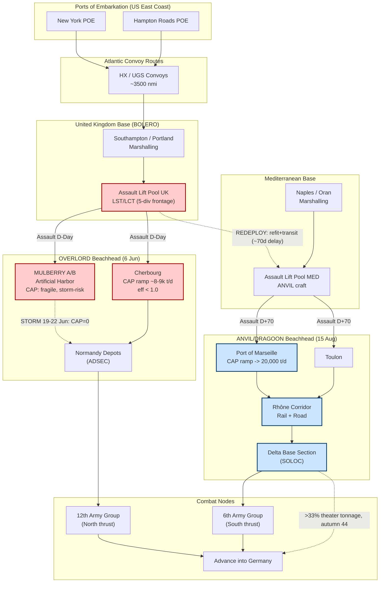

Cost: 0.2939

# Chapter 13: OVERLORD and ANVIL
## Reference Manual & Simulation-Specification Document
### US Army Green Book: *Global Logistics and Strategy, 1943–1945*

---

## 1. Strategic Context & Modern Historical Perspective

### 1.1 The Strategic Paradox: Grand Design Versus Physical Capacity

The OVERLORD-ANVIL controversy represents perhaps the clearest single case study in the entire Second World War of the collision between grand strategy formulated in the conference room and the immutable physical constraints of amphibious logistics. At the Casablanca Conference (SYMBOL, January 1943), the Combined Chiefs of Staff (CCS) committed in principle to a cross-Channel assault. By TRIDENT (Washington, May 1943), a target date of 1 May 1944 was fixed, and by QUADRANT (Quebec, August 1943), OVERLORD received formal primacy over Mediterranean operations. The Tehran Conference (EUREKA, November–December 1943) added Soviet pressure: Stalin extracted an explicit commitment to both OVERLORD and a supporting invasion of Southern France (ANVIL), reasoning correctly that a two-pronged Western assault would fix the maximum number of German divisions.

The paradox emerged from a single, brutally finite commodity: the specialized amphibious lift, above all the LST (Landing Ship, Tank) and the LCT/LCI family. The strategic plans presupposed a landing-craft pool that simply did not exist in the requisite quantities at the requisite date. Global shipping in early 1944 was constrained not merely by hull tonnage—though the merchant marine remained stretched across the Pacific, the Indian Ocean lend-lease routes to Murmansk and Persia, and the Atlantic bridge—but specifically by *combat-loaded* assault lift, which could not be substituted by ordinary Liberty ships. A Liberty ship could carry tanks; it could not disgorge them onto an open, defended beach. This distinction between administrative lift and assault lift is the fulcrum of the entire chapter and must be modeled as two orthogonal resource pools in any faithful simulation.

The second dimension of the paradox concerned **port clearance**. Allied planners understood from the outset that landing armies on beaches was tractable; *sustaining* them ashore through open beaches and artificial harbors (MULBERRY) was not. The great fear—vindicated by the Channel gale of 19–22 June 1944 that wrecked the American MULBERRY at OMAHA—was that the whole force would strangle for want of deepwater discharge capacity. Cherbourg, the nearest major port, was expected to be thoroughly demolished (it was, and did not reach meaningful capacity until August). Antwerp lay far to the east and would not be opened until late November 1944 after the Scheldt fighting. This left a gaping hole in the projected supply pipeline precisely during the period of maximum consumption—the breakout and pursuit. Marseille, the second-largest port in France and connected to the interior by the Rhône corridor and a robust rail net, was the logistical answer that ANVIL/DRAGOON existed to provide.

### 1.2 Inter-Service and Coalition Tensions

The friction manifested along three axes simultaneously. **First, US Army versus US Navy:** the Services of Supply (SOS, later ETOUSA/COMZ under Lt. Gen. J.C.H. Lee) computed maintenance tonnage requirements that consistently exceeded the discharge capacity the Navy and the Transportation Corps could guarantee. Lee's organization was structured to push tonnage forward; the combat commands under Bradley demanded ammunition and POL (petroleum, oil, lubricants) on a schedule that outran port throughput. The resulting COMZ-versus-field-army tension over truck allocation would culminate in the Red Ball Express improvisation of August–September 1944.

**Second, Army versus Navy over landing craft custody:** the amphibious lift was substantially Navy-manned and Navy-scheduled, and its movement between the Mediterranean and the United Kingdom, and its retention in either theater, was a Navy operational decision with Army strategic consequences. Every LST held in the Mediterranean for ANVIL was an LST unavailable to widen the OVERLORD assault frontage.

**Third, and most consequentially, the Anglo-American coalition split.** The British Chiefs, and Churchill personally, regarded the Mediterranean as the theater of opportunity and viewed ANVIL as a wasteful subtraction from the Italian campaign—an operation that would, in Churchill's phrase, drag divisions "away from the Ljubljana Gap and the road to Vienna." The Americans, led by Marshall and supported doctrinally by the entire US planning apparatus, regarded ANVIL as the indispensable logistical enabler of a concentrated thrust into Germany. Eisenhower, as Supreme Commander, was caught between his American logistical logic and his British subordinate Montgomery's operational demands.

### 1.3 The Historical Era Context: The Scheduling Collision

The crisis crystallized in January 1944. Upon assuming command, Eisenhower and Montgomery immediately concluded that the COSSAC-planned three-division assault frontage was too narrow—it invited defeat in detail and offered insufficient beach capacity for follow-on build-up. Montgomery demanded the assault be broadened from **three to five divisions** (with two additional airborne divisions), extending the frontage westward to include the UTAH sector at the base of the Cotentin, thereby accelerating the capture of Cherbourg. This expansion required roughly a **one-third increase** in assault lift.

There was only one place to find that lift on the required timescale: the ANVIL pool in the Mediterranean. The arithmetic was inexorable. Widening OVERLORD meant either cancelling ANVIL or postponing it until the Channel assault lift could be turned around, refitted, and re-deployed south. The decision, formalized through the spring of 1944, was to postpone ANVIL. D-Day itself slipped from the notional 1 May to 5 June (executed 6 June) partly to gain an additional month's LST production. ANVIL, renamed DRAGOON, was ultimately executed on **15 August 1944—approximately ten weeks (about 70 days) after D-Day.**

### 1.4 Modern Analytical Insights

Post-war declassification and decades of scholarship (Ruppenthal's two-volume *Logistical Support of the Armies* being foundational) have vindicated Eisenhower's insistence on ANVIL. The Southern France operation delivered Marseille and Toulon largely intact relative to Cherbourg, and the Rhône Valley rail-and-road corridor proved a superb communications axis. By the autumn of 1944, the Southern Line of Communications (SOLOC / Delta Base Section) was delivering a substantial and rising fraction of *all* supplies reaching the Allied armies on the Continent—by some computations over a third of total theater tonnage during the critical autumn shortage. This third pipeline, entering at Marseille and flowing north to feed Devers' 6th Army Group and, indirectly, relieving pressure on the northern ports, is precisely what averted a total logistical seizure during the winter of 1944–45.

Montgomery's counter-argument—that concentration at the Channel was strategically superior—looks weaker in retrospect precisely because the northern ports failed to materialize on schedule. Antwerp's late opening validated the wisdom of a geographically diversified port structure. The modern operational-research view treats the OVERLORD-ANVIL decision as a **constrained resource-allocation problem across a scheduling network**, in which the objective function was not "maximize assault frontage" nor "maximize Italian exploitation" but "maximize sustained theater discharge capacity over the campaign horizon." Under that objective, ANVIL was optimal, and the postponement rather than cancellation was the correct compromise: it satisfied the near-term assault-lift constraint at Normandy while preserving the long-term discharge-capacity constraint via Marseille. This is the central lesson the simulation is designed to reproduce.

---

## 2. High-Fidelity Simulation Parameters & Real-World Metrics

| Parameter | Historical Value | Strategic Rationale | Simulation Representation |
|---|---|---|---|
| OVERLORD assault frontage increase (Montgomery/Eisenhower, Jan 1944) | From **3 → 5** seaborne assault divisions (+2 airborne) | Narrow COSSAC front risked defeat in detail and throttled build-up; wider front captured UTAH and accelerated Cherbourg | Static integer constant `assaultDivisions: Int`; drives assault-lift demand coefficient |
| Increase in assault lift required | ≈ **+33% to +50%** LST/LCT demand | Additional two divisions plus preloaded MT and follow-up required proportionally more specialized lift | Dynamic multiplier `liftDemandFactor: Double` applied to base craft pool |
| ANVIL/DRAGOON postponement relative to D-Day | ≈ **70 days** (D-Day 6 Jun → DRAGOON 15 Aug 1944); planned May → executed Aug ≈ 10–11 weeks | Assault lift had to complete Normandy, turn around, refit, sail Med, and re-mount | Static offset `anvilOffsetDays: Days = 70` applied to CPM start vector |
| D-Day slip (planning) | 1 May → 6 Jun 1944 (≈ **36 days**) | Gained one additional month of LST production and moon/tide window | Static constant; schedule shift on OVERLORD start node |
| Port of Marseille cleared capacity | ≈ **20,000 tons/day** sustained (rising from near-zero at capture through autumn 1944) | Deepwater berths + Rhône rail corridor; engineer clearance of demolitions and mines | Dynamic capacity cap with ramp function `marseilleCapacity(t): Tons` |
| Cherbourg projected/achieved capacity | Planned ~8,000–9,000 t/day; badly delayed by demolition | Nearest major port; heavily sabotaged, slow to reach capacity | Dynamic capped node with efficiency coefficient < 1.0 |
| OMAHA MULBERRY (Mulberry A) | Destroyed by gale 19–22 Jun 1944; abandoned | Demonstrated fragility of artificial-harbor dependence | Stochastic failure event; capacity → 0 after storm trigger |
| Southern LOC (SOLOC) share of theater tonnage, autumn 1944 | Rising to **>33%** of total | Validated three-pipeline strategy | Aggregation coefficient over pipeline sum |
| LST turnaround (Med redeployment) | Several weeks per hull cycle | Refit + transit dominated the postponement duration | Resource-release delay in CPM `refitDurationDays` |

---

## 3. Logistical Network Topology (Mermaid.js)



---

## 4. Mathematical Modeling & Simulation Formulas

### 4.1 Critical Path Method (CPM) Forward Pass

For a project network of tasks (activities) $j \in J$ with duration $d_j$ and predecessor set $Pred(j)$:

$$ES_j = \max_{i \in Pred(j)} \{ EF_i \}, \qquad ES_j = 0 \text{ if } Pred(j)=\varnothing$$

$$EF_j = ES_j + d_j$$

The project makespan (theater-ready horizon) is:

$$T_{\max} = \max_{j \in J} \{ EF_j \}$$

The backward pass yields latest times, defining slack and the critical path $\mathcal{C}$:

$$LF_j = \min_{k \in Succ(j)} \{ LS_k \}, \qquad LS_j = LF_j - d_j$$

$$\text{Slack}_j = LS_j - ES_j = LF_j - EF_j, \qquad \mathcal{C} = \{ j : \text{Slack}_j = 0 \}$$

### 4.2 Coupled Resource Constraint: The ANVIL Postponement

Let $L$ be the total assault-lift pool (LST-equivalents). OVERLORD demands $R_O$ and ANVIL demands $R_A$. The Montgomery expansion sets:

$$R_O = R_O^{(3)} \cdot \frac{5}{3} \cdot \phi$$

where $R_O^{(3)}$ is the three-division baseline requirement and $\phi \ge 1$ the loading-inefficiency factor. If $R_O + R_A > L$, simultaneous execution is infeasible, forcing a temporal offset. The ANVIL start is coupled to OVERLORD lift release:

$$ES_{\text{ANVIL}} = EF_{\text{OVERLORD-assault}} + \tau_{\text{refit}} + \tau_{\text{transit}} \approx D\text{-Day} + 70 \text{ days}$$

### 4.3 Port Discharge Ramp (Marseille Capacity)

The cleared capacity follows a bounded logistic ramp from capture time $t_0$:

$$C_{MRS}(t) = \frac{C_{\max}}{1 + e^{-k(t - t_0 - t_m)}}, \qquad C_{\max} = 20{,}000 \text{ t/day}$$

where $k$ is the engineering clearance rate and $t_m$ the midpoint (half-capacity) delay.

### 4.4 Sustained Theater Supply Objective

Maximize cumulative sustained tonnage subject to per-pipeline caps and demand $\Delta(t)$:

$$\max \int_{0}^{T} \sum_{p \in P} \min\!\big(C_p(t),\, x_p(t)\big)\, dt$$

$$\text{s.t.} \quad \sum_{p} x_p(t) \ge \Delta(t) \ \ \forall t, \qquad 0 \le x_p(t) \le C_p(t)$$

where $P = \{\text{MULBERRY, Cherbourg, Marseille}\}$. The strategic insight—diversified ports—is that when $C_{\text{MULBERRY}}(t)\to 0$ after the storm and $C_{\text{Cherbourg}}$ ramps slowly, feasibility of the demand constraint depends on $C_{MRS}$.

---

## 5. Compile-Safe Scala 3.8.3 Domain Model

```scala
package Logistics.OverlordAnvil

import scala.math.exp
import scala.math.max
import scala.math.min

opaque type Days = Int
object Days:
  def apply(n: Int): Days = n
  extension (d: Days)
    def value: Int = d
    def +(other: Days): Days = d + other
    def >=(other: Days): Boolean = d >= other

opaque type Tons = Double
object Tons:
  def apply(t: Double): Tons = t
  extension (t: Tons)
    def value: Double = t
    def +(other: Tons): Tons = t + other

opaque type LstUnits = Int
object LstUnits:
  def apply(n: Int): LstUnits = n
  extension (l: LstUnits)
    def value: Int = l
    def -(other: LstUnits): LstUnits = l - other

enum OperationState:
  case Planned
  case AssaultLoaded
  case Landed
  case Sustaining
  case CapacityDegraded

enum Pipeline:
  case MulberryA
  case Cherbourg
  case Marseille

final case class Task(name: String, durationDays: Int, predecessors: List[String])

final case class PortRamp(cMax: Tons, k: Double, midpointDays: Days, captureDay: Days):
  def capacityAt(t: Days): Tons =
    val x: Double = k * (t.value - captureDay.value - midpointDays.value)
    Tons(cMax.value / (1.0 + exp(-x)))

final case class LiftBudget(totalPool: LstUnits, baselineThreeDiv: LstUnits):
  def overlordFiveDivDemand(loadingInefficiency: Double): LstUnits =
    LstUnits(math.ceil(baselineThreeDiv.value * (5.0 / 3.0) * loadingInefficiency).toInt)

  def feasibleSimultaneous(overlord: LstUnits, anvil: LstUnits): Boolean =
    (overlord.value + anvil.value) <= totalPool.value

object ProjectScheduler:

  def calculateSimpleSchedule(tasks: List[Task]): Map[String, Int] =
    val durById: Map[String, Int] = tasks.map(t => t.name -> t.durationDays).toMap
    val ordered: List[Task] = topoSort(tasks)
    ordered.foldLeft(Map.empty[String, Int]) { (acc, task) =>
      val es: Int =
        task.predecessors
          .flatMap(p => acc.get(p).map(_ + durById.getOrElse(p, 0)))
          .maxOption
          .getOrElse(0)
      acc + (task.name -> es)
    }

  def earlyFinish(tasks: List[Task], starts: Map[String, Int]): Map[String, Int] =
    tasks.map(t => t.name -> (starts.getOrElse(t.name, 0) + t.durationDays)).toMap

  def makespan(tasks: List[Task]): Int =
    val es: Map[String, Int] = calculateSimpleSchedule(tasks)
    earlyFinish(tasks, es).values.maxOption.getOrElse(0)

  def criticalPath(tasks: List[Task]): List[String] =
    val es: Map[String, Int] = calculateSimpleSchedule(tasks)
    val ef: Map[String, Int] = earlyFinish(tasks, es)
    val total: Int = ef.values.maxOption.getOrElse(0)
    val succ: Map[String, List[String]] =
      tasks.flatMap(t => t.predecessors.map(p => p -> t.name))
        .groupMap(_._1)(_._2)
    val durById: Map[String, Int] = tasks.map(t => t.name -> t.durationDays).toMap

    def latestFinish(name: String): Int =
      succ.get(name) match
        case None => total
        case Some(children) =>
          children.map(c => latestFinish(c) - durById.getOrElse(c, 0)).min

    tasks.collect {
      case t if latestFinish(t.name) == ef.getOrElse(t.name, 0) => t.name
    }

  private def topoSort(tasks: List[Task]): List[Task] =
    val byName: Map[String, Task] = tasks.map(t => t.name -> t).toMap
    val visited = scala.collection.mutable.LinkedHashSet.empty[String]
    val result = scala.collection.mutable.ListBuffer.empty[Task]

    def visit(name: String): Unit =
      if !visited.contains(name) then
        visited += name
        byName.get(name).foreach { t =>
          t.predecessors.foreach(visit)
          result += t
        }

    tasks.foreach(t => visit(t.name))
    result.toList

object AnvilCoupling:
  val refitDays: Days = Days(30)
  val transitDays: Days = Days(40)
  val postponementOffset: Days = refitDays + transitDays

  def anvilStart(overlordAssaultFinish: Days): Days =
    overlordAssaultFinish + postponementOffset

  def validateOffset(computed: Days, historicalTarget: Days, toleranceDays: Int): Boolean =
    math.abs(computed.value - historicalTarget.value) <= toleranceDays

object TheatreSupply:
  def sustainedTonnage(
      caps: Map[Pipeline, Tons],
      allocation: Map[Pipeline, Tons]
  ): Tons =
    val total: Double = Pipeline.values.toList.map { p =>
      val cap: Double = caps.getOrElse(p, Tons(0.0)).value
      val alloc: Double = allocation.getOrElse(p, Tons(0.0)).value
      min(cap, alloc)
    }.sum
    Tons(total)

  def demandMet(sustained: Tons, demand: Tons): Boolean =
    sustained.value >= demand.value

  def southernShare(caps: Map[Pipeline, Tons]): Double =
    val marseille: Double = caps.getOrElse(Pipeline.Marseille, Tons(0.0)).value
    val totalAll: Double = caps.values.map(_.value).sum
    if totalAll <= 0.0 then 0.0 else marseille / totalAll

object OverlordAnvilSimulation:

  val overlordAnvilTasks: List[Task] = List(
    Task("Bolero_Buildup", 90, Nil),
    Task("Assault_Lift_Marshal_UK", 30, List("Bolero_Buildup")),
    Task("Overlord_Assault", 1, List("Assault_Lift_Marshal_UK")),
    Task("Cherbourg_Clearance", 55, List("Overlord_Assault")),
    Task("LST_Refit", 30, List("Overlord_Assault")),
    Task("LST_Med_Transit", 40, List("LST_Refit")),
    Task("Anvil_Assault", 1, List("LST_Med_Transit")),
    Task("Marseille_Clearance", 45, List("Anvil_Assault"))
  )

  def run(): Unit =
    val budget: LiftBudget = LiftBudget(LstUnits(180), LstUnits(120))
    val overlordDemand: LstUnits = budget.overlordFiveDivDemand(1.15)
    val anvilDemand: LstUnits = LstUnits(70)
    val simultaneous: Boolean = budget.feasibleSimultaneous(overlordDemand, anvilDemand)

    val schedule: Map[String, Int] = ProjectScheduler.calculateSimpleSchedule(overlordAnvilTasks)
    val span: Int = ProjectScheduler.makespan(overlordAnvilTasks)
    val cpath: List[String] = ProjectScheduler.criticalPath(overlordAnvilTasks)

    val overlordFinishDay: Days = Days(schedule.getOrElse("Overlord_Assault", 0) + 1)
    val anvilComputed: Days = AnvilCoupling.anvilStart(overlordFinishDay)
    val offsetValid: Boolean =
      AnvilCoupling.validateOffset(AnvilCoupling.postponementOffset, Days(70), 10)

    val marseille: PortRamp =
      PortRamp(Tons(20000.0), 0.08, Days(22), Days(schedule.getOrElse("Anvil_Assault", 0)))
    val marseilleDay120: Tons = marseille.capacityAt(Days(120))

    val caps: Map[Pipeline, Tons] = Map(
      Pipeline.MulberryA -> Tons(0.0),
      Pipeline.Cherbourg -> Tons(8500.0),
      Pipeline.Marseille -> marseilleDay120
    )
    val alloc: Map[Pipeline, Tons] = Map(
      Pipeline.MulberryA -> Tons(0.0),
      Pipeline.Cherbourg -> Tons(8000.0),
      Pipeline.Marseille -> Tons(18000.0)
    )
    val sustained: Tons = TheatreSupply.sustainedTonnage(caps, alloc)
    val share: Double = TheatreSupply.southernShare(caps)

    println(s"Overlord 5-div lift demand (LST-equiv): ${overlordDemand.value}")
    println(s"Anvil lift demand (LST-equiv): ${anvilDemand.value}")
    println(s"Simultaneous execution feasible: $simultaneous")
    println(s"Project makespan (days): $span")
    println(s"Critical path: ${cpath.mkString(" -> ")}")
    println(s"Computed ANVIL offset (days): ${AnvilCoupling.postponementOffset.value}")
    println(s"Offset within historical tolerance of 70d: $offsetValid")
    println(s"Marseille capacity at day 120 (t/day): ${marseilleDay120.value}")
    println(s"Sustained theatre tonnage (t/day): ${sustained.value}")
    println(f"Southern LOC share of capacity: ${share * 100}%.1f%%")

  def main(args: Array[String]): Unit =
    run()
```

---

## 6. Graduate-Level Operational Analysis

### 6.1 Why Eisenhower viewed ANVIL as logistically essential

Eisenhower's insistence on ANVIL rested on a rigorous appreciation of a distinction that eluded operationally-minded commanders: the difference between *seizing* ground and *sustaining* forces upon it. The tonnage-throughput calculus of a theater is bounded not by the strength of the assault, but by the aggregate discharge capacity of its ports over the campaign horizon. A modern operational-research framing makes this explicit: the feasibility of the theater demand constraint $\sum_p x_p(t) \ge \Delta(t)$ depends entirely on the sum of port capacities $\sum_p C_p(t)$, not on the size of any single beachhead.

The northern pipeline was structurally fragile. Cherbourg's demolition (the Germans wrecked the port so thoroughly that the naval commander declared it the worst destruction ever seen) meant its ramp function $C_{\text{Cherbourg}}(t)$ climbed far more slowly than planned. The MULBERRY at OMAHA was destroyed outright by the June gale—a stochastic catastrophic failure event driving $C_{\text{MULBERRY}} \to 0$. Antwerp, though captured with its docks intact in early September, remained unusable until the Scheldt estuary was cleared in late November. Thus, for the entire critical period of breakout and pursuit—July through November 1944—the northern pipeline was chronically under its planned capacity precisely when consumption spiked (a pursuing army consumes enormous POL). 

Marseille was the mathematically necessary term. A large, modern deepwater port with capacity ramping toward 20,000 tons/day, connected to the front by the excellent Rhône rail-and-road corridor, it constituted an independent, geographically decorrelated pipeline. Its failure modes were uncorrelated with those of the Channel ports. Eisenhower grasped that logistical robustness derives from diversification of independent capacity, not concentration—the same principle that governs redundant systems engineering. Post-war accounting vindicated him: the Southern Line of Communications carried over a third of theater tonnage in the autumn of 1944 and, critically, delivered fresh divisions arriving directly from the United States into Marseille, sparing the congested northern ports. Without ANVIL, the winter logistical crisis that already forced the Red Ball Express and rationing of ammunition would have been catastrophic rather than merely severe.

### 6.2 The Anglo-American strategic debate

The British-American dispute was, at root, a clash of two coherent but incompatible strategic theories, and it is intellectually unfair to caricature either. The British position—advanced by Churchill, Brooke, and Alexander—held that the Mediterranean offered exploitation at low cost against a crumbling southern front: press the Italian campaign, force the Alps or drive through the Ljubljana Gap toward Vienna, and pre-empt Soviet occupation of Central Europe. This view was partly political (a post-war balance-of-power calculation regarding Soviet expansion, remarkably prescient in hindsight) and partly a genuine belief in peripheral, opportunistic strategy—the traditional British maritime approach of striking where the enemy is weakest.

The American position—Marshall, Eisenhower, and the entire US planning staff—rested on the doctrine of concentration of force against the decisive point (the German heartland via France) and, decisively, on the logistical arithmetic examined above. To the Americans, the Balkans and the Ljubljana Gap were a strategic cul-de-sac: mountainous terrain hostile to the mechanized, logistics-heavy American way of war, offering no deepwater port to feed a decisive advance and drawing scarce lift away from the theater that could actually reach Germany. The Italian campaign had already demonstrated how terrain could nullify material superiority and stall an advance indefinitely at ruinous cost.

The decisive factor was logistical, and the Americans were correct on the merits within the framework of *their* war. Winning required delivering millions of tons through French ports to sustain a broad, mechanized advance; the Balkans offered no such gateway. The eventual compromise—postpone rather than cancel ANVIL, accept the ~70-day offset—was an elegant resolution of the coupled resource constraint: it honored the near-term assault-lift ceiling at Normandy ($R_O + R_A > L$ forcing temporal separation) while preserving the long-term discharge-capacity objective by still securing Marseille. That DRAGOON proved nearly bloodless and delivered its port largely intact retrospectively strengthened the American case, though the British political concern about Soviet penetration of Central Europe was, tragically, also vindicated by post-war history—a reminder that a decision optimal against one objective function (military logistics) may be suboptimal against another (post-war geopolitics).
