Cost: 0.49266125

## 1. Strategic Context & Modern Historical Perspective

### The strategic problem

The dispute over OVERLORD and ANVIL was not merely a contest between rival operational ideas. It was a conflict over how to synchronize several globally constrained logistical systems: ocean shipping, assault shipping, landing craft, naval gunfire support, trained amphibious formations, port-rehabilitation units, engineer equipment, air cover, and the inland transportation networks required to convert a successful landing into a sustained continental campaign. In early 1944 the Allies possessed enormous aggregate resources, but many critical resources were specialized, geographically dispersed, and impossible to substitute on short notice. The decisive constraint was therefore not total Allied production. It was the availability of the correct resources, in the correct theater, combat-loaded in the correct sequence, at the required date.

The Combined Chiefs of Staff had repeatedly tried to reconcile these constraints at Casablanca, TRIDENT, QUADRANT, SEXTANT, and related staff conferences. Each conference produced strategic commitments that were individually plausible but collectively difficult to execute. The Allies were simultaneously sustaining the Soviet Union, the Mediterranean, the United Kingdom, the strategic bombing offensive, antisubmarine operations, the Pacific advance, China-Burma-India, and the accumulation of forces for a cross-Channel invasion. Plans formulated at conference tables tended to treat shipping and landing craft as allocable totals. Operational staffs had to deal with the more restrictive reality that ships differed in speed, draft, loading characteristics, conversion status, maintenance condition, location, and suitability for assault employment.

A Liberty ship carrying ordinary depot cargo could not substitute for an LST required to land tanks over an unimproved beach. An LCI could not perform the work of an AKA combat-loaded with ammunition, vehicles, landing boats, and beach-party equipment. A landing craft physically present in the Mediterranean could not be added instantaneously to the Normandy assault. It had to complete its existing mission, be repaired, crewed, routed through potentially hazardous waters, and integrated into a new loading and rehearsal program. Thus, aggregate tonnage concealed the temporal and categorical character of the resource problem.

### From a three-division to a five-division assault

The original COSSAC conception for OVERLORD contemplated three seaborne assault divisions, supported by airborne operations and follow-up forces. After General Dwight D. Eisenhower became Supreme Commander and General Bernard Montgomery assumed command of the initial land battle, Montgomery argued that the assault frontage and initial combat power were inadequate. The Cotentin Peninsula, the approaches to Cherbourg, the Bayeux-Caen sector, and the need to prevent German concentration demanded a broader lodgment. Montgomery proposed expanding the seaborne assault from three divisions to five.

Eisenhower endorsed the enlargement. Operationally, it produced the five principal assault beaches of 6 June 1944: UTAH and OMAHA in the American sector and GOLD, JUNO, and SWORD in the British-Canadian sector. The expansion was not a simple addition of two division labels. It required more landing ships and craft, more naval escorts, additional beach groups, more engineer equipment, greater combat-loading capacity, more embarkation areas, and a substantially more complex movement schedule in southern England.

It also enlarged the follow-up problem. Assault divisions had to be accompanied by artillery, tanks, antiaircraft units, engineer formations, medical units, signal organizations, and service troops. Every additional assault formation generated a larger tail of vehicles and supplies. The landing tables had to preserve tactical sequence: breaching teams before follow-on vehicles, artillery ammunition near its guns, beach-exit equipment early enough to avoid congestion, and communications units in time to control the expanding lodgment. The five-division requirement therefore absorbed amphibious resources that had been counted upon for ANVIL.

### ANVIL as a port-acquisition operation

ANVIL, renamed DRAGOON shortly before execution, was intended to land Allied forces on the Mediterranean coast of France and secure Toulon and Marseille. Its enduring logistical justification was Marseille. Cherbourg was valuable but vulnerable to demolition and geographically inconvenient once the main Allied armies drove beyond the Seine. The Brittany ports were distant from the most direct axis into Germany, and their capture depended on operations that could consume both time and combat power. The Normandy beaches and artificial harbors could support the initial lodgment but were exposed to weather and were not an efficient permanent foundation for multiple field armies advancing hundreds of miles inland.

Marseille offered deepwater berths, extensive commercial facilities, and access to the Rhône-Saône transportation corridor. Once the port, railway system, bridges, depots, and petroleum facilities were restored, supplies could move north toward Lyon, Dijon, and the eastern French rail network. The southern line would support the U.S. Seventh Army and French First Army, collectively organized under the 6th Army Group, while also reducing pressure on northern ports and, when transportation circumstances permitted, contributing to the broader Allied supply system.

Eisenhower consequently regarded ANVIL as more than a diversion designed to draw German formations away from Normandy. In his conception it was a logistical envelopment: the Allies would seize not only territory but also a second geographically independent port-and-line-of-communications system. Contemporary references sometimes describe Marseille as a “third” major supply pipeline, alongside the cross-Channel system and the Mediterranean/Italian base structure. More precisely, it became the principal continental entry point for the southern line of communications and an increasingly important complement to the northern European port system.

Postwar analysis generally supports Eisenhower’s logistical reasoning. Marseille and adjacent facilities eventually handled cargo at approximately 19,000 tons per day in sustained high-output periods and could be developed toward a planning capacity of roughly 20,000 tons per day. The southern route delivered millions of tons before the end of the European war. Its contribution was especially important because the northern armies outran their rail reconstruction and motor transport after the Normandy breakout. Marseille did not eliminate the autumn 1944 supply crisis: the Rhône route was itself long, rail-dependent, and constrained by destroyed bridges, rolling-stock shortages, and inland clearance. It did, however, add strategic depth and a substantial independent intake capacity.

### The postponement and the amphibious-resource collision

At the Tehran/SEXTANT stage, ANVIL was envisaged as an operation closely coordinated with OVERLORD, initially on approximately the same broad May 1944 timetable. The enlargement of OVERLORD made simultaneous execution impracticable. Landing ships and craft intended for southern France were retained or transferred to support the expanded Normandy assault. ANVIL was first weakened, then postponed, and for a time placed in doubt.

The operation finally occurred on 15 August 1944, seventy days after the 6 June Normandy landings. Describing this as a “two-month postponement” is administratively convenient but imprecise. In a simulator, the interval should be represented as exactly seventy calendar days when measured from D-Day to the DRAGOON assault. If measured against earlier May planning dates, the slippage is longer and depends on which provisional ANVIL date is selected. The baseline must therefore identify the reference schedule rather than storing an unqualified number of “months.”

The postponement had both costs and benefits. It deprived OVERLORD of a simultaneous threat against southern France and permitted the Germans to focus more attention on Normandy during June and July. It also delayed the opening of Marseille. Conversely, the later assault faced weakened German forces, benefited from Allied control of the air and sea, and could employ formations and shipping that became available after the Normandy assault phase and the breakthrough from Rome. The landing itself succeeded rapidly, and Toulon and Marseille were captured earlier than conservative planning estimates had anticipated.

### Coalition and inter-service friction

The Anglo-American disagreement reflected different strategic geographies. American planners generally emphasized concentration against Germany through France, a direct approach to the Ruhr, and the acquisition of ports capable of sustaining mass armies. They feared that continued Mediterranean operations would create incremental commitments in Italy, the Adriatic, the Aegean, or the Balkans without producing a decisive military result.

British leaders, especially Prime Minister Winston Churchill, assigned greater value to the Mediterranean. Their arguments included continuing pressure in Italy, exploiting opportunities in the Adriatic or Balkans, influencing the political shape of liberated southeastern Europe, protecting British imperial communications, and avoiding an operation that might merely place additional forces at the end of another long French supply line. British military objections also rested on genuine resource arithmetic: every craft assigned to southern France was unavailable to OVERLORD, the Italian theater, or other amphibious contingencies.

It is important not to reduce the British position to an irrational “soft underbelly” fixation. Italy tied down German formations, provided air bases, threatened German positions south of the Alps, and had already absorbed substantial Allied investment. Removing experienced French and American formations from Italy for ANVIL weakened the Allied offensive there. Nor was every British planner committed to a literal invasion through the Balkans. British proposals varied, and many were exploratory rather than executable campaign plans. Nevertheless, American leaders reasonably suspected that postponing ANVIL indefinitely would allow Mediterranean opportunism to displace the agreed concentration in France.

Inter-service conflict operated below the strategic level. The Army required landing craft as transportation and tactical enablers; the Navy controlled many of the vessels, crews, routing decisions, and assault procedures. Service-force logisticians emphasized port clearance, beach organization, depot construction, and shipping turnaround. Combat commanders understandably demanded larger initial assault echelons and greater reserves. These requirements competed within finite loading plans. Loading one more tank battalion could displace trucks, engineer stores, bridging equipment, or ammunition that would be essential after the first tactical success.

British-American pooling arrangements created further difficulties. “Pooled” did not mean frictionless. Craft had national crews, maintenance chains, communications equipment, doctrinal procedures, and planned future assignments. Reallocating them required Combined Chiefs decisions and often generated secondary disruptions in the Mediterranean or Pacific. The limiting factor was frequently not authorization but time: transit time, refit time, loading time, rehearsal time, and the tidal or lunar windows suitable for assault.

### Modern systems interpretation

In modern operational-research terms, OVERLORD and ANVIL formed a multi-project scheduling problem with renewable and nonrenewable resources. Landing craft and naval escorts were renewable after release, transit, and refit. Combat-loaded shipping space was partly nonrenewable within a given assault cycle because loading decisions fixed the sequence of cargo. Port capacity was a state-dependent network edge: Marseille had effectively negligible Allied throughput before capture, limited throughput during clearance and repair, and increasing capacity as berths, cranes, rail connections, pipelines, and harbor approaches were restored.

The dominant planning error to avoid is treating tactical lift and long-term sustainment as the same problem. Expanding OVERLORD from three to five seaborne divisions increased the probability that the initial lodgment would survive and expand. Executing ANVIL increased the probability that the enlarged continental army could be sustained months later. Both decisions were logistically rational at different time horizons. The scheduling conflict existed because the same scarce amphibious resources were required to create both advantages.

The eventual solution was temporal deconfliction. OVERLORD received priority for the decisive June assault; landing resources were subsequently released, redeployed, and used for DRAGOON on 15 August. This sequence did not maximize every local objective. It delayed Marseille and weakened the Italian campaign, but it reconciled the immediate need for a secure Normandy lodgment with the long-term requirement for another high-capacity continental supply route.

---

## 2. High-Fidelity Simulation Parameters & Real-World Metrics

Values should be stored with a source-definition field because “capacity,” “throughput,” and “assault strength” are not interchangeable.

| Parameter | Historical value | Recommended database representation | Historical and simulation interpretation |
|---|---:|---|---|
| Original OVERLORD seaborne assault | 3 divisions | Static baseline integer: `3` | The COSSAC plan contemplated three divisions in the initial seaborne assault. Airborne and immediate follow-up formations should be stored separately. |
| Revised OVERLORD seaborne assault | 5 divisions | Static approved-plan integer: `5` | Montgomery demanded, and Eisenhower supported, a five-division assault on a wider front. These became the UTAH, OMAHA, GOLD, JUNO, and SWORD assault sectors. |
| Absolute assault increase | 2 divisions | Derived integer: `5 - 3 = 2` | The direct increment was two seaborne assault divisions. It should trigger additional lift, escort, beach-group, combat-loading, and follow-up requirements. |
| Relative assault increase | 66.67% | Derived coefficient: `5 / 3 = 1.6667` | Useful only as a coarse scaling coefficient. Specialized landing-craft demand should be calculated by unit equipment and loading tables, not by simple proportional multiplication. |
| OVERLORD D-Day | 6 June 1944 | Immutable campaign date | The operation was initially associated with 5 June but delayed twenty-four hours because of weather. The executed date is the correct event baseline. |
| DRAGOON/ANVIL assault date | 15 August 1944 | Immutable campaign date | ANVIL was renamed DRAGOON before execution. The operation began on the southern French coast on 15 August. |
| D-Day-to-DRAGOON interval | 70 calendar days | Derived duration: `70 days` | Exact interval from 6 June through 15 August date difference. Often summarized as approximately ten weeks or two months and nine days. |
| Approximate postponement in planning language | About 2 months | Display-only historical descriptor | Do not use this rounded phrase for scheduling arithmetic. Earlier comparisons against provisional May ANVIL dates can produce a longer delay. |
| Marseille rehabilitated planning capacity | Approximately 20,000 long tons/day | Dynamic upper capacity cap | A suitable mature-capacity value after harbor clearance, berth repair, cargo-handling restoration, and inland clearance development. It must not become available instantaneously upon capture. |
| Marseille high early realized throughput | Approximately 19,000 tons/day by mid-to-late October 1944 | Time-series observed-capacity value | Frequently cited as the throughput reached after rapid engineer and port-unit rehabilitation. Use as a realized operating level below the nominal 20,000-ton cap. |
| Marseille prewar/initial planning order of magnitude | Approximately 15,000 tons/day | Scenario-estimate field | Some planning documents and histories use values near 15,000 tons per day depending on whether Marseille alone, adjacent facilities, berth condition, or inland clearance is counted. Store separately rather than overwriting the mature cap. |
| Toulon supplementary capacity | Scenario-dependent; materially below Marseille | Dynamic node, not merged into Marseille | Toulon was strategically useful but less important as a mass cargo port. Separate harbor damage, naval wreck clearance, berth restoration, and rail clearance should be modeled. |
| D-Day Allied personnel landed | Approximately 156,000 by sea and air | Historical validation total | Includes American, British, Canadian, and other Allied personnel. It should not be interpreted as five identical divisional slices. |
| Assault beach count | 5 principal beaches | Static topology parameter | Each beach should be a separate node because weather, enemy action, exits, landing tables, and discharge rates differed materially. |
| Artificial harbor system | 2 Mulberry sites planned | Infrastructure count with failure states | Mulberry A off OMAHA was wrecked in the June storm; Mulberry B at Arromanches continued operating. Model weather damage and partial salvage. |
| Great Storm period | 19–22 June 1944 | Weather-disruption event | The storm severely restricted beach discharge and destroyed the American artificial harbor. It demonstrates why beach capacity must be stochastic and weather-sensitive. |
| Marseille first major reopening interval | Mid-September 1944 | Milestone window | The first deep-draft cargo arrivals followed mine clearance, wreck removal, and emergency restoration. Throughput ramped rather than jumping to full capacity. |
| Southern line inland axis | Marseille–Avignon–Lyon–Dijon | Ordered network path | The port’s theoretical capacity was useful only to the extent that Rhône valley railways, roads, bridges, rolling stock, depots, and pipelines could clear cargo. |
| ANVIL/DRAGOON initial seaborne assault | 3 U.S. divisions | Static assault integer: `3` | The VI Corps assault centered on the 3rd, 36th, and 45th Infantry Divisions, supported by airborne and French follow-up formations. |
| Landing-craft release lag | Scenario-specific; not zero | Dynamic transfer delay | Craft used for OVERLORD required release, repair, repositioning, loading, and rehearsal before DRAGOON. This must be represented as a task chain rather than instantaneous reassignment. |

### Recommended Marseille capacity function

The port should be modeled as a phased state-dependent node:

| Port state | Illustrative capacity |
|---|---:|
| Enemy controlled | 0 Allied tons/day |
| Captured but uncleared | 0–1,000 tons/day through improvised means |
| Channels partially swept and emergency berths open | 2,000–7,000 tons/day |
| Major berths and rail clearance restored | 7,000–15,000 tons/day |
| High-output October operating state | Approximately 19,000 tons/day |
| Mature planning cap | Approximately 20,000 tons/day |

The intermediate values are scenario coefficients rather than immutable historical observations. The historically defensible anchor values are the approximately 19,000-ton realized output and approximately 20,000-ton mature planning capacity. Effective delivery must be:

$$
C_{\text{effective},t}
=
\min
\left(
C_{\text{harbor},t},
C_{\text{berth},t},
C_{\text{labor},t},
C_{\text{rail-clearance},t},
C_{\text{road-clearance},t},
C_{\text{depot-receipt},t}
\right)
$$

Thus, a repaired port cannot discharge 20,000 tons per day if its rail and road network can clear only 12,000.

---

## 3. Logistical Network Topology (Detailed Mermaid.js Flowchart)

```mermaid
flowchart LR
    subgraph NA["North American Zone of Interior"]
        PROD["Factories and arsenals<br/>vehicles, ammunition, engineer stores"]
        DEPOT["General and branch depots<br/>assembly and unit packing"]
        EPOE["U.S. East Coast POEs<br/>New York, Hampton Roads, Boston"]
        GULF["Gulf and Mediterranean POEs<br/>supplementary routing"]
        PROD -->|"rail allocation constrained by production lots"| DEPOT
        DEPOT -->|"scheduled rail movements"| EPOE
        DEPOT -->|"alternative Mediterranean routing"| GULF
    end

    subgraph OCEAN["Ocean Shipping and Assault-Lift Pools"]
        DRY["Dry-cargo shipping pool<br/>Liberty, Victory and allied freighters"]
        TROOP["Troop transport pool<br/>convoy-cycle constrained"]
        ASSAULT["Amphibious pool<br/>LST, LCT, LCI, APA and AKA"]
        ESCORT["Naval escort and fire-support pool"]
        EPOE -->|"Atlantic convoy loading"| DRY
        EPOE -->|"troop embarkation"| TROOP
        GULF -->|"Mediterranean convoy loading"| DRY
    end

    subgraph UK["United Kingdom Base and OVERLORD Marshalling System"]
        UKPORT["UK western and southern ports<br/>Liverpool, Bristol Channel, Clyde"]
        UKDEPOT["UK depots and dumps<br/>ammunition, POL and general cargo"]
        MARSHAL["Southern England marshalling areas<br/>unit sequencing and waterproofing"]
        HARD["Hards and embarkation ports<br/>combat loading by landing table"]
        DRY -->|"Atlantic convoy; ship turnaround delay"| UKPORT
        TROOP -->|"troopship cycle"| UKPORT
        UKPORT -->|"port-clearance capacity"| UKDEPOT
        UKDEPOT -->|"road and rail congestion limits"| MARSHAL
        MARSHAL -->|"loading sequence is precedence constrained"| HARD
        ASSAULT -.->|"scarce renewable resource allocation"| HARD
        ESCORT -.->|"escort and bombardment availability"| HARD
    end

    subgraph NORMANDY["OVERLORD Assault and Northern Continental Network"]
        UTAH["UTAH Beach<br/>variable tidal and exit capacity"]
        OMAHA["OMAHA Beach<br/>enemy-action and exit congestion"]
        GOLD["GOLD Beach<br/>British beach groups"]
        JUNO["JUNO Beach<br/>Canadian beach groups"]
        SWORD["SWORD Beach<br/>Caen-axis congestion"]
        MULB["Mulberry B at Arromanches<br/>weather-sensitive discharge"]
        MULA["Mulberry A at OMAHA<br/>failed after June storm"]
        CHER["Cherbourg<br/>captured port with demolition damage"]
        NDEPOT["Normandy base depots<br/>army and communications-zone stocks"]
        ADVDEPOT["Forward depots<br/>Seine and later eastern France"]
        ARMIES["12th and 21st Army Group combat nodes"]

        HARD -->|"cross-Channel assault convoy"| UTAH
        HARD -->|"cross-Channel assault convoy"| OMAHA
        HARD -->|"cross-Channel assault convoy"| GOLD
        HARD -->|"cross-Channel assault convoy"| JUNO
        HARD -->|"cross-Channel assault convoy"| SWORD

        UTAH -->|"beach exits and truck columns"| NDEPOT
        OMAHA -->|"beach exits; initial severe congestion"| NDEPOT
        GOLD -->|"beach discharge"| NDEPOT
        JUNO -->|"beach discharge"| NDEPOT
        SWORD -->|"beach discharge"| NDEPOT
        MULB -->|"protected lighterage and pier discharge"| NDEPOT
        MULA -.->|"storm failure state"| NDEPOT
        CHER -->|"capacity ramp after clearance and repair"| NDEPOT
        NDEPOT -->|"rail reconstruction and motor transport"| ADVDEPOT
        ADVDEPOT -->|"daily army tonnage allocation"| ARMIES
    end

    subgraph MED["Mediterranean Staging and Joint Resource Transfer"]
        NAF["North African ports and depots<br/>Oran, Algiers and Bizerte"]
        ITALY["Italian ports and depots<br/>Naples and adjacent bases"]
        CORSICA["Corsican airfields and staging support"]
        DRAGOONMAR["DRAGOON marshalling areas<br/>combat loading and rehearsals"]
        CRAFTREFIT["Landing-craft release, transit and refit<br/>joint-resource critical path"]

        DRY -->|"Mediterranean convoy"| NAF
        DRY -->|"Mediterranean convoy"| ITALY
        TROOP -->|"formation transfer"| ITALY
        NAF -->|"stores and service units"| DRAGOONMAR
        ITALY -->|"VI Corps and French follow-up"| DRAGOONMAR
        CORSICA -->|"air cover radius and sortie support"| DRAGOONMAR
        ASSAULT -.->|"post-OVERLORD release"| CRAFTREFIT
        CRAFTREFIT -->|"repair, transit, crew readiness"| DRAGOONMAR
        ESCORT -.->|"Mediterranean naval allocation"| DRAGOONMAR
    end

    subgraph SOUTHFRANCE["ANVIL-DRAGOON and Southern Line of Communications"]
        BEACHES["Cavalaire, Saint-Tropez and Saint-Raphaël sectors<br/>initial beach discharge"]
        TOULON["Toulon<br/>capture, mine clearance and repair"]
        MARSEILLE["Marseille<br/>dynamic cap: 0 to about 20,000 tons/day"]
        PORTDEB["Port-de-Bouc and adjacent facilities<br/>supplementary discharge and POL"]
        RHONEDEPOT["Rhône Delta and Avignon depots"]
        LYON["Lyon transfer and classification area"]
        DIJON["Dijon and eastern France depots"]
        SIXTH["6th Army Group combat nodes<br/>Seventh Army and French First Army"]
        LINK["Junction with northern communications zone"]

        DRAGOONMAR -->|"assault convoy; joint lift constraint"| BEACHES
        BEACHES -->|"tactical advance and truck supply"| SIXTH
        BEACHES -->|"capture operation"| TOULON
        BEACHES -->|"capture operation"| MARSEILLE

        TOULON -->|"limited repaired port capacity"| RHONEDEPOT
        MARSEILLE -->|"berths, cranes and harbor clearance"| RHONEDEPOT
        PORTDEB -->|"bulk cargo and petroleum"| RHONEDEPOT

        RHONEDEPOT -->|"road, rail and pipeline clearance cap"| LYON
        LYON -->|"Rhône-Saône rail corridor"| DIJON
        DIJON -->|"army issue and forward haul"| SIXTH
        DIJON -->|"inter-theater transfer when capacity permits"| LINK
        LINK -->|"supplementary delivery"| ARMIES
    end

    WEATHER["Weather state<br/>Channel storms, sea state and visibility"]
    DAMAGE["Enemy demolition and port-damage state"]
    RAIL["Rolling stock, bridges and rail-repair state"]
    POL["Bulk POL system<br/>tankers, pipelines and truck companies"]

    WEATHER -.->|"reduces sailing and beach coefficients"| HARD
    WEATHER -.->|"reduces discharge capacity"| MULB
    WEATHER -.->|"can close open beaches"| OMAHA
    DAMAGE -.->|"controls restoration duration"| CHER
    DAMAGE -.->|"controls restoration duration"| MARSEILLE
    DAMAGE -.->|"controls restoration duration"| TOULON
    RAIL -.->|"inland clearance bottleneck"| ADVDEPOT
    RAIL -.->|"inland clearance bottleneck"| LYON
    POL -->|"fuel availability constrains truck ton-miles"| NDEPOT
    POL -->|"fuel availability constrains Rhône clearance"| RHONEDEPOT
```



### Critical-path interpretation

The principal joint-resource chain for DRAGOON is:

1. Finish the assault-intensive phase of OVERLORD.
2. Release specified landing ships and craft.
3. Repair and refit craft.
4. Transit craft to the Mediterranean.
5. Complete combat loading.
6. Conduct final rehearsals.
7. satisfy naval, air, weather, and intelligence conditions.
8. Execute the assault.
9. Capture Marseille.
10. clear mines and wrecks.
11. restore berths and cargo-handling equipment.
12. restore inland rail, road, depot, and petroleum clearance.
13. reach useful sustained throughput.

A delay in any task on this chain moves the earliest feasible date for high-volume southern delivery. Port capture alone is therefore not the completion milestone. The operationally meaningful milestone is the date on which cargo discharged at Marseille can be cleared inland at a sustained rate.

---

## 4. Mathematical Modeling & Simulation Formulas

### 4.1 Sets and indices

Let:

- $J$ be the set of project activities.
- $N$ be the set of logistical nodes.
- $A$ be the set of directed transportation arcs.
- $K$ be the set of cargo classes.
- $R$ be the set of scarce joint resources.
- $T = \{0,1,\ldots,H\}$ be the simulation horizon in days.
- $Pred(j)$ be the immediate predecessors of activity $j$.
- $O(n)$ and $I(n)$ be arcs leaving and entering node $n$.

Typical cargo classes are dry cargo, ammunition, bulk petroleum, vehicles, engineer equipment, and personnel. Joint resources include LSTs, LCIs, LCTs, assault transports, escorts, beach groups, port engineers, rail-repair units, and specialized cargo-handling personnel.

### 4.2 Critical Path Method

For activity $j$:

- $d_j$ is duration in days.
- $ES_j$ is earliest start.
- $EF_j$ is earliest finish.
- $LS_j$ is latest start without delaying project completion.
- $LF_j$ is latest finish.
- $TF_j$ is total float.

The forward pass is:

$$
ES_j =
\begin{cases}
0, & Pred(j)=\varnothing,\\
\max\limits_{i\in Pred(j)} EF_i, & \text{otherwise},
\end{cases}
$$

and:

$$
EF_j = ES_j + d_j
$$

This is the requested concept:

$$
\text{Mathematical Concept: } ES_j = \max_{i \in Pred(j)} \{ EF_i \}
$$

The maximum is necessary because an activity cannot start until every mandatory predecessor has finished. For example, DRAGOON combat loading may depend on craft arrival, craft repair, troop concentration, ammunition availability, and completion of loading plans. If those predecessors finish on days 42, 46, 44, 39, and 41, combat loading cannot begin before day 46.

Let project completion be:

$$
D = \max_{j\in J} EF_j
$$

The backward pass is:

$$
LF_j =
\begin{cases}
D, & Succ(j)=\varnothing,\\
\min\limits_{h\in Succ(j)} LS_h, & \text{otherwise},
\end{cases}
$$

$$
LS_j = LF_j - d_j
$$

$$
TF_j = LS_j - ES_j = LF_j - EF_j
$$

An activity is critical when $TF_j=0$. In a deterministic CPM model, any delay to a critical activity delays project completion. In a stochastic simulation, criticality should be measured as a probability because variation in repair, weather, sailing, and port-rehabilitation durations can cause the critical path to change between runs.

### 4.3 Joint-resource-constrained project scheduling

Let:

- $x_{jt}=1$ if activity $j$ starts on day $t$, otherwise $0$.
- $q_{jr}$ be the number of units of resource $r$ required by activity $j$ while active.
- $Q_{rt}$ be available units of resource $r$ on day $t$.
- $S_j$ be the resulting start day.
- $C_{\max}$ be the completion day of the full project.

Each activity starts once:

$$
\sum_{t=0}^{H-d_j} x_{jt}=1
\qquad \forall j\in J
$$

Its start time is:

$$
S_j=\sum_{t=0}^{H-d_j}t\,x_{jt}
$$

Precedence requires:

$$
S_j \ge S_i+d_i
\qquad
\forall j\in J,\; i\in Pred(j)
$$

Renewable-resource capacity requires:

$$
\sum_{j\in J}
q_{jr}
\sum_{\tau=\max(0,t-d_j+1)}^{t}
x_{j\tau}
\le Q_{rt}
\qquad
\forall r\in R,\;t\in T
$$

This expression counts every activity that started earlier but remains active on day $t$. It prevents, for example, the simultaneous commitment of more LSTs than are operationally available.

The basic makespan objective is:

$$
\min C_{\max}
$$

subject to:

$$
C_{\max}\ge S_j+d_j
\qquad \forall j\in J
$$

For OVERLORD and ANVIL, a weighted strategic objective is more appropriate:

$$
\min Z =
w_O C_O
+
w_A C_A
+
\sum_{t\in T} w_U U_t
+
\sum_{t\in T} w_L L_t
$$

where:

- $C_O$ is the OVERLORD assault date or completion milestone.
- $C_A$ is the ANVIL/DRAGOON assault date or Marseille-opening milestone.
- $U_t$ is unmet army supply demand.
- $L_t$ is shipping, cargo, or handling loss.
- $w_O,w_A,w_U,w_L$ are strategic penalties.

A lexicographic policy can represent the historical priority more accurately:

1. Maintain OVERLORD no later than its authorized weather window.
2. Ensure sufficient assault lift for five seaborne divisions.
3. Minimize the earliest feasible DRAGOON date.
4. Maximize cumulative southern-port delivery after capture.

### 4.4 Amphibious-resource allocation

Let:

- $y_{opr}$ be units of resource $r$ assigned to operation $o$ during phase $p$.
- $A_{rpt}$ be available resource units.
- $\tau_{oo'r}$ be transfer and refit time between operations.

The aggregate resource limit is:

$$
\sum_o y_{opr}\le A_{rp}
$$

A resource released from OVERLORD at time $t$ cannot support DRAGOON before:

$$
t_{\text{available,DRAGOON},r}
=
t_{\text{release,OVERLORD},r}
+
\tau_{\text{repair},r}
+
\tau_{\text{transit},r}
+
\tau_{\text{integration},r}
$$

The earliest feasible DRAGOON assault date is therefore:

$$
T_D
=
\max
\left(
T_{\text{troops}},
T_{\text{craft}},
T_{\text{naval}},
T_{\text{air}},
T_{\text{loading}},
T_{\text{rehearsal}},
T_{\text{weather}}
\right)
$$

This maximum structure explains why merely transferring nominal ownership of landing craft did not make them immediately usable.

### 4.5 Multicommodity logistical flow

Let:

- $f_{a k t}$ be cargo class $k$ moved over arc $a$ on day $t$.
- $u_{at}$ be arc capacity.
- $\alpha_{akt}$ be cargo-specific space or handling consumption.
- $s_{nkt}$ be stock of cargo $k$ at node $n$ at the end of day $t$.
- $p_{nkt}$ be external cargo entering the network.
- $d_{nkt}$ be demand or issue at node $n$.
- $\lambda_{akt}$ be the loss fraction.

Arc capacity is:

$$
\sum_{k\in K}\alpha_{akt}f_{akt}\le u_{at}
\qquad \forall a,t
$$

Inventory balance is:

$$
s_{nkt}
=
s_{nk,t-1}
+
p_{nkt}
+
\sum_{a\in I(n)}(1-\lambda_{akt})f_{akt}
-
\sum_{a\in O(n)}f_{akt}
-
d_{nkt}
$$

with:

$$
s_{nkt}\ge 0
$$

If unmet demand is permitted, introduce $z_{nkt}\ge0$:

$$
s_{nkt}
=
s_{nk,t-1}
+
p_{nkt}
+
\sum_{a\in I(n)}(1-\lambda_{akt})f_{akt}
-
\sum_{a\in O(n)}f_{akt}
-
d_{nkt}
+
z_{nkt}
$$

and penalize $z_{nkt}$ heavily in the objective.

### 4.6 Dynamic port capacity

For Marseille, let:

- $C^{M}_{\max}=20{,}000$ tons/day be the mature planning cap.
- $\rho_t\in[0,1]$ be the rehabilitation coefficient.
- $\eta_t\in[0,1]$ be the operating-efficiency coefficient.
- $R_t$ be inland clearance capacity.
- $B_t$ be berth-side capacity.

Then:

$$
C^{M}_t
=
\min
\left(
C^{M}_{\max}\rho_t\eta_t,
B_t,
R_t
\right)
$$

A simple rehabilitation curve is:

$$
\rho_t=
\begin{cases}
0, & t<t_c,\\
\rho_0+\gamma(t-t_c), & t_c\le t<t_m,\\
1, & t\ge t_m,
\end{cases}
$$

clipped to $[0,1]$, where $t_c$ is capture, $\rho_0$ is immediately recoverable capacity, $\gamma$ is the daily restoration rate, and $t_m$ is the mature-capacity date.

A more realistic stochastic formulation is:

$$
\rho_{t+1}
=
\min
\left[
1,
\rho_t
+
\gamma E_t
-
\delta_t
\right]
$$

where $E_t$ represents effective engineer effort and $\delta_t$ represents disruption from mines, wrecks, equipment failures, enemy action, or labor shortages.

### 4.7 Ton-mile constraint

A port can discharge more than the inland system can move. Let:

- $V_t$ be available truck payload tons.
- $m_t$ be average daily truck miles.
- $\beta_t$ be availability and utilization.
- $D_t$ be average one-way haul distance.

Approximate truck-delivery capacity is:

$$
C^{truck}_t
=
\frac{V_t m_t \beta_t}{2D_t}
$$

The factor $2D_t$ represents the outbound and return cycle. For a long Rhône-to-forward-area haul, increasing distance reduces delivered tons even when truck inventory remains unchanged. Rail and pipeline modes should be modeled with equivalent capacity equations and combined where transfer facilities permit.

---

## 5. Compile-Safe Scala 3.8.3 Domain Model

```scala
package Logistics.OverlordAnvil

import scala.collection.immutable.List
import scala.collection.immutable.Map
import scala.collection.immutable.Set
import scala.collection.immutable.Vector

object Measures:
  opaque type Days = Int
  opaque type Tons = Double
  opaque type TonsPerDay = Double
  opaque type NauticalMiles = Double
  opaque type ResourceUnits = Int
  opaque type Efficiency = Double

  object Days:
    def from(value: Int): Either[String, Days] =
      if value >= 0 then Right(value)
      else Left(s"Days must be non-negative: $value")

    def unsafe(value: Int): Days =
      from(value).fold(message => throw new IllegalArgumentException(message), identity)

  object Tons:
    def from(value: Double): Either[String, Tons] =
      if value.isFinite && value >= 0.0 then Right(value)
      else Left(s"Tons must be finite and non-negative: $value")

    def unsafe(value: Double): Tons =
      from(value).fold(message => throw new IllegalArgumentException(message), identity)

  object TonsPerDay:
    def from(value: Double): Either[String, TonsPerDay] =
      if value.isFinite && value >= 0.0 then Right(value)
      else Left(s"Tons per day must be finite and non-negative: $value")

    def unsafe(value: Double): TonsPerDay =
      from(value).fold(message => throw new IllegalArgumentException(message), identity)

  object NauticalMiles:
    def from(value: Double): Either[String, NauticalMiles] =
      if value.isFinite && value >= 0.0 then Right(value)
      else Left(s"Nautical miles must be finite and non-negative: $value")

    def unsafe(value: Double): NauticalMiles =
      from(value).fold(message => throw new IllegalArgumentException(message), identity)

  object ResourceUnits:
    def from(value: Int): Either[String, ResourceUnits] =
      if value >= 0 then Right(value)
      else Left(s"Resource units must be non-negative: $value")

    def unsafe(value: Int): ResourceUnits =
      from(value).fold(message => throw new IllegalArgumentException(message), identity)

  object Efficiency:
    def from(value: Double): Either[String, Efficiency] =
      if value.isFinite && value >= 0.0 && value <= 1.0 then Right(value)
      else Left(s"Efficiency must be between zero and one: $value")

    def unsafe(value: Double): Efficiency =
      from(value).fold(message => throw new IllegalArgumentException(message), identity)

  extension (value: Days)
    def toInt: Int = value
    def +(other: Days): Days = value + other

  extension (value: Tons)
    def toDouble: Double = value

  extension (value: TonsPerDay)
    def toDouble: Double = value

  extension (value: NauticalMiles)
    def toDouble: Double = value

  extension (value: ResourceUnits)
    def toInt: Int = value

  extension (value: Efficiency)
    def toDouble: Double = value

import Logistics.OverlordAnvil.Measures.Days
import Logistics.OverlordAnvil.Measures.Efficiency
import Logistics.OverlordAnvil.Measures.NauticalMiles
import Logistics.OverlordAnvil.Measures.ResourceUnits
import Logistics.OverlordAnvil.Measures.Tons
import Logistics.OverlordAnvil.Measures.TonsPerDay

enum CargoClass:
  case DryCargo
  case Ammunition
  case BulkPetroleum
  case Vehicles
  case EngineerStores
  case Personnel

enum ResourceType:
  case LST
  case LCT
  case LCI
  case AssaultTransport
  case CargoTransport
  case Escort
  case NavalFireSupportGroup
  case BeachGroup
  case PortEngineerUnit
  case RailRepairUnit
  case TruckCompany

enum CampaignOperation:
  case Overlord
  case AnvilDragoon

enum NodeKind:
  case Factory
  case Depot
  case PortOfEmbarkation
  case MarshallingArea
  case AssaultBeach
  case DeepwaterPort
  case Railhead
  case ForwardDepot
  case CombatFormation

enum TransportMode:
  case Rail
  case Road
  case OceanConvoy
  case AssaultShipping
  case CoastalShipping
  case Pipeline

enum PortState:
  case EnemyControlled
  case CapturedUncleared
  case EmergencyDischarge
  case PartiallyOperational
  case HighOutput
  case MatureCapacity

enum CampaignState:
  case StrategicPlanning
  case OverlordLiftCommitted
  case OverlordAssaultReady
  case OverlordExecuted
  case CraftReleased
  case CraftInTransfer
  case DragoonAssaultReady
  case DragoonExecuted
  case MarseilleCaptured
  case MarseillePartiallyOperational
  case SouthernPipelineOperational

enum CampaignEvent:
  case ApproveFiveDivisionOverlord
  case CompleteOverlordLoading
  case ExecuteOverlord
  case ReleaseLandingCraft
  case BeginMediterraneanTransfer
  case CompleteDragoonLoading
  case ExecuteDragoon
  case CaptureMarseille
  case OpenEmergencyBerths
  case ReachMatureSouthernThroughput

final case class Task(
    name: String,
    durationDays: Int,
    predecessors: List[String]
)

final case class Activity(
    task: Task,
    resourceDemand: Map[ResourceType, Int]
)

final case class LogisticsNode(
    id: String,
    name: String,
    kind: NodeKind,
    storageCapacity: Tons
)

final case class LogisticsRoute(
    id: String,
    fromNode: String,
    toNode: String,
    mode: TransportMode,
    distance: NauticalMiles,
    capacity: TonsPerDay,
    transitDays: Days,
    efficiency: Efficiency
)

final case class LogisticsNetwork(
    nodes: Vector[LogisticsNode],
    routes: Vector[LogisticsRoute]
):
  def validate: Either[List[String], LogisticsNetwork] =
    val nodeIds: List[String] = nodes.map(_.id).toList
    val nodeIdSet: Set[String] = nodeIds.toSet
    val duplicateNodeIds: List[String] =
      nodeIds.groupBy(identity).collect {
        case (id, occurrences) if occurrences.size > 1 => id
      }.toList.sorted

    val routeIds: List[String] = routes.map(_.id).toList
    val duplicateRouteIds: List[String] =
      routeIds.groupBy(identity).collect {
        case (id, occurrences) if occurrences.size > 1 => id
      }.toList.sorted

    val routeErrors: List[String] =
      routes.toList.flatMap { route =>
        val sourceError: List[String] =
          if nodeIdSet.contains(route.fromNode) then List.empty
          else List(s"Route ${route.id} has unknown source ${route.fromNode}")

        val destinationError: List[String] =
          if nodeIdSet.contains(route.toNode) then List.empty
          else List(s"Route ${route.id} has unknown destination ${route.toNode}")

        sourceError ++ destinationError
      }

    val errors: List[String] =
      duplicateNodeIds.map(id => s"Duplicate node id: $id") ++
        duplicateRouteIds.map(id => s"Duplicate route id: $id") ++
        routeErrors

    if errors.isEmpty then Right(this) else Left(errors)

final case class PortCapacityState(
    portId: String,
    state: PortState,
    harborCapacity: TonsPerDay,
    berthCapacity: TonsPerDay,
    inlandClearanceCapacity: TonsPerDay,
    operatingEfficiency: Efficiency
):
  def effectiveCapacity: TonsPerDay =
    val physicalLimit: Double =
      List(
        harborCapacity.toDouble,
        berthCapacity.toDouble,
        inlandClearanceCapacity.toDouble
      ).min

    TonsPerDay.unsafe(physicalLimit * operatingEfficiency.toDouble)

final case class ResourcePool(
    capacities: Map[ResourceType, Int]
):
  def validate: Either[List[String], ResourcePool] =
    val errors: List[String] =
      capacities.toList.collect {
        case (resource, value) if value < 0 =>
          s"Negative capacity for $resource: $value"
      }

    if errors.isEmpty then Right(this) else Left(errors)

  def capacityOf(resource: ResourceType): Int =
    capacities.getOrElse(resource, 0)

final case class ScheduleEntry(
    taskName: String,
    earliestStart: Int,
    earliestFinish: Int,
    latestStart: Int,
    latestFinish: Int,
    totalFloat: Int
):
  def isCritical: Boolean = totalFloat == 0

final case class CpmSchedule(
    entries: Map[String, ScheduleEntry],
    projectDurationDays: Int
):
  def earliestStarts: Map[String, Int] =
    entries.view.mapValues(_.earliestStart).toMap

  def criticalTasks: List[String] =
    entries.valuesIterator
      .filter(_.isCritical)
      .map(_.taskName)
      .toList
      .sorted

final case class ResourceScheduledTask(
    taskName: String,
    startDay: Int,
    finishDay: Int,
    resourceDemand: Map[ResourceType, Int]
)

final case class ResourceSchedule(
    tasks: List[ResourceScheduledTask],
    projectDurationDays: Int,
    dailyUsage: Map[(Int, ResourceType), Int]
)

object ProjectScheduler:
  def calculateSimpleSchedule(tasks: List[Task]): Map[String, Int] =
    calculateCpmSchedule(tasks).fold(
      message => throw new IllegalArgumentException(message),
      _.earliestStarts
    )

  def calculateCpmSchedule(tasks: List[Task]): Either[String, CpmSchedule] =
    for
      ordered <- topologicalOrder(tasks)
      forward <- forwardPass(ordered)
      schedule <- backwardPass(ordered, forward)
    yield schedule

  def calculateResourceSchedule(
      activities: List[Activity],
      resources: ResourcePool,
      horizonDays: Int
  ): Either[String, ResourceSchedule] =
    if horizonDays < 0 then
      Left(s"Scheduling horizon must be non-negative: $horizonDays")
    else
      resources.validate match
        case Left(errors) => Left(errors.mkString("; "))
        case Right(_) =>
          validateActivities(activities, resources).flatMap { _ =>
            val tasks: List[Task] = activities.map(_.task)
            val byName: Map[String, Activity] =
              activities.map(activity => activity.task.name -> activity).toMap

            topologicalOrder(tasks).flatMap { orderedTasks =>
              scheduleActivities(
                orderedTasks,
                byName,
                resources,
                horizonDays,
                List.empty,
                Map.empty
              )
            }
          }

  private def validateTasks(tasks: List[Task]): Either[String, Unit] =
    val names: List[String] = tasks.map(_.name)
    val nameSet: Set[String] = names.toSet
    val duplicateNames: List[String] =
      names.groupBy(identity).collect {
        case (name, occurrences) if occurrences.size > 1 => name
      }.toList.sorted

    val blankNames: List[String] =
      tasks.collect {
        case task if task.name.trim.isEmpty => "Task name must not be blank"
      }

    val durationErrors: List[String] =
      tasks.collect {
        case task if task.durationDays < 0 =>
          s"Task ${task.name} has negative duration ${task.durationDays}"
      }

    val missingPredecessors: List[String] =
      tasks.flatMap { task =>
        task.predecessors.collect {
          case predecessor if !nameSet.contains(predecessor) =>
            s"Task ${task.name} has unknown predecessor $predecessor"
        }
      }

    val selfDependencies: List[String] =
      tasks.collect {
        case task if task.predecessors.contains(task.name) =>
          s"Task ${task.name} depends on itself"
      }

    val errors: List[String] =
      duplicateNames.map(name => s"Duplicate task name: $name") ++
        blankNames ++
        durationErrors ++
        missingPredecessors ++
        selfDependencies

    if errors.isEmpty then Right(()) else Left(errors.mkString("; "))

  private def topologicalOrder(tasks: List[Task]): Either[String, List[Task]] =
    validateTasks(tasks).flatMap { _ =>
      val byName: Map[String, Task] =
        tasks.map(task => task.name -> task).toMap

      def loop(
          remaining: Set[String],
          orderedNames: List[String]
      ): Either[String, List[String]] =
        if remaining.isEmpty then Right(orderedNames)
        else
          val ready: List[String] =
            remaining.toList
              .filter { name =>
                byName(name).predecessors.forall { predecessor =>
                  !remaining.contains(predecessor)
                }
              }
              .sorted

          if ready.isEmpty then
            Left(
              s"Dependency cycle detected among: ${remaining.toList.sorted.mkString(", ")}"
            )
          else
            loop(remaining -- ready, orderedNames ++ ready)

      loop(names = byName.keySet, orderedNames = List.empty)
        .map(_.map(byName))
    }

  private def names: Set[String] = Set.empty

  private def forwardPass(
      ordered: List[Task]
  ): Either[String, Map[String, (Int, Int)]] =
    val result: Map[String, (Int, Int)] =
      ordered.foldLeft(Map.empty[String, (Int, Int)]) { (accumulator, task) =>
        val earliestStart: Int =
          task.predecessors
            .flatMap(predecessor => accumulator.get(predecessor).map(_._2))
            .maxOption
            .getOrElse(0)

        val earliestFinish: Int = earliestStart + task.durationDays
        accumulator.updated(task.name, (earliestStart, earliestFinish))
      }

    Right(result)

  private def backwardPass(
      ordered: List[Task],
      forward: Map[String, (Int, Int)]
  ): Either[String, CpmSchedule] =
    val projectDuration: Int =
      forward.valuesIterator.map(_._2).maxOption.getOrElse(0)

    val successors: Map[String, List[String]] =
      ordered.foldLeft(
        ordered.map(task => task.name -> List.empty[String]).toMap
      ) { (accumulator, task) =>
        task.predecessors.foldLeft(accumulator) { (inner, predecessor) =>
          inner.updated(
            predecessor,
            inner.getOrElse(predecessor, List.empty) :+ task.name
          )
        }
      }

    val byName: Map[String, Task] =
      ordered.map(task => task.name -> task).toMap

    val backward: Map[String, (Int, Int)] =
      ordered.reverse.foldLeft(Map.empty[String, (Int, Int)]) {
        (accumulator, task) =>
          val taskSuccessors: List[String] =
            successors.getOrElse(task.name, List.empty)

          val latestFinish: Int =
            if taskSuccessors.isEmpty then projectDuration
            else
              taskSuccessors
                .flatMap(successor => accumulator.get(successor).map(_._1))
                .minOption
                .getOrElse(projectDuration)

          val latestStart: Int = latestFinish - task.durationDays
          accumulator.updated(task.name, (latestStart, latestFinish))
      }

    val entries: Map[String, ScheduleEntry] =
      byName.keySet.map { name =>
        val (earliestStart, earliestFinish) = forward(name)
        val (latestStart, latestFinish) = backward(name)
        val entry: ScheduleEntry =
          ScheduleEntry(
            taskName = name,
            earliestStart = earliestStart,
            earliestFinish = earliestFinish,
            latestStart = latestStart,
            latestFinish = latestFinish,
            totalFloat = latestStart - earliestStart
          )
        name -> entry
      }.toMap

    Right(CpmSchedule(entries, projectDuration))

  private def validateActivities(
      activities: List[Activity],
      resources: ResourcePool
  ): Either[String, Unit] =
    val demandErrors: List[String] =
      activities.flatMap { activity =>
        activity.resourceDemand.toList.flatMap {
          case (resource, demand) if demand < 0 =>
            List(
              s"Task ${activity.task.name} has negative demand for $resource: $demand"
            )
          case (resource, demand) if demand > resources.capacityOf(resource) =>
            List(
              s"Task ${activity.task.name} demands $demand units of $resource, " +
                s"but only ${resources.capacityOf(resource)} are available"
            )
          case _ => List.empty
        }
      }

    if demandErrors.isEmpty then Right(())
    else Left(demandErrors.mkString("; "))

  private def scheduleActivities(
      remaining: List[Task],
      byName: Map[String, Activity],
      resources: ResourcePool,
      horizonDays: Int,
      scheduled: List[ResourceScheduledTask],
      usage: Map[(Int, ResourceType), Int]
  ): Either[String, ResourceSchedule] =
    remaining match
      case Nil =>
        val duration: Int =
          scheduled.map(_.finishDay).maxOption.getOrElse(0)

        Right(
          ResourceSchedule(
            tasks = scheduled.sortBy(_.startDay),
            projectDurationDays = duration,
            dailyUsage = usage
          )
        )

      case task :: tail =>
        val activity: Activity = byName(task.name)
        val finishByName: Map[String, Int] =
          scheduled.map(item => item.taskName -> item.finishDay).toMap

        val precedenceStart: Int =
          task.predecessors
            .flatMap(finishByName.get)
            .maxOption
            .getOrElse(0)

        val latestCandidate: Int =
          horizonDays - task.durationDays

        val feasibleStart: Option[Int] =
          if latestCandidate < precedenceStart then None
          else
            (precedenceStart to latestCandidate).find { candidate =>
              isResourceFeasible(
                candidate,
                task.durationDays,
                activity.resourceDemand,
                resources,
                usage
              )
            }

        feasibleStart match
          case None =>
            Left(
              s"No feasible start for ${task.name} within horizon $horizonDays"
            )

          case Some(startDay) =>
            val finishDay: Int = startDay + task.durationDays
            val updatedUsage: Map[(Int, ResourceType), Int] =
              allocateResources(
                startDay,
                task.durationDays,
                activity.resourceDemand,
                usage
              )

            val scheduledTask: ResourceScheduledTask =
              ResourceScheduledTask(
                taskName = task.name,
                startDay = startDay,
                finishDay = finishDay,
                resourceDemand = activity.resourceDemand
              )

            scheduleActivities(
              tail,
              byName,
              resources,
              horizonDays,
              scheduledTask :: scheduled,
              updatedUsage
            )

  private def isResourceFeasible(
      startDay: Int,
      durationDays: Int,
      demand: Map[ResourceType, Int],
      resources: ResourcePool,
      usage: Map[(Int, ResourceType), Int]
  ): Boolean =
    val activeDays: Range = startDay until (startDay + durationDays)

    activeDays.forall { day =>
      demand.forall { case (resource, required) =>
        val alreadyUsed: Int = usage.getOrElse((day, resource), 0)
        alreadyUsed + required <= resources.capacityOf(resource)
      }
    }

  private def allocateResources(
      startDay: Int,
      durationDays: Int,
      demand: Map[ResourceType, Int],
      usage: Map[(Int, ResourceType), Int]
  ): Map[(Int, ResourceType), Int] =
    val activeDays: Range = startDay until (startDay + durationDays)

    activeDays.foldLeft(usage) { (dailyAccumulator, day) =>
      demand.foldLeft(dailyAccumulator) {
        case (resourceAccumulator, (resource, required)) =>
          val key: (Int, ResourceType) = (day, resource)
          val updatedValue: Int =
            resourceAccumulator.getOrElse(key, 0) + required
          resourceAccumulator.updated(key, updatedValue)
      }
    }

object CampaignTransition:
  def apply(
      state: CampaignState,
      event: CampaignEvent
  ): Either[String, CampaignState] =
    (state, event) match
      case (
            CampaignState.StrategicPlanning,
            CampaignEvent.ApproveFiveDivisionOverlord
          ) =>
        Right(CampaignState.OverlordLiftCommitted)

      case (
            CampaignState.OverlordLiftCommitted,
            CampaignEvent.CompleteOverlordLoading
          ) =>
        Right(CampaignState.OverlordAssaultReady)

      case (
            CampaignState.OverlordAssaultReady,
            CampaignEvent.ExecuteOverlord
          ) =>
        Right(CampaignState.OverlordExecuted)

      case (
            CampaignState.OverlordExecuted,
            CampaignEvent.ReleaseLandingCraft
          ) =>
        Right(CampaignState.CraftReleased)

      case (
            CampaignState.CraftReleased,
            CampaignEvent.BeginMediterraneanTransfer
          ) =>
        Right(CampaignState.CraftInTransfer)

      case (
            CampaignState.CraftInTransfer,
            CampaignEvent.CompleteDragoonLoading
          ) =>
        Right(CampaignState.DragoonAssaultReady)

      case (
            CampaignState.DragoonAssaultReady,
            CampaignEvent.ExecuteDragoon
          ) =>
        Right(CampaignState.DragoonExecuted)

      case (
            CampaignState.DragoonExecuted,
            CampaignEvent.CaptureMarseille
          ) =>
        Right(CampaignState.MarseilleCaptured)

      case (
            CampaignState.MarseilleCaptured,
            CampaignEvent.OpenEmergencyBerths
          ) =>
        Right(CampaignState.MarseillePartiallyOperational)

      case (
            CampaignState.MarseillePartiallyOperational,
            CampaignEvent.ReachMatureSouthernThroughput
          ) =>
        Right(CampaignState.SouthernPipelineOperational)

      case _ =>
        Left(s"Invalid transition from $state using event $event")

object HistoricalParameters:
  val OriginalOverlordSeaborneDivisions: Int = 3
  val RevisedOverlordSeaborneDivisions: Int = 5
  val AddedOverlordSeaborneDivisions: Int = 2
  val OverlordExpansionFactor: Double = 5.0 / 3.0
  val DaysFromOverlordToDragoon: Days = Days.unsafe(70)
  val MarseilleObservedHighThroughput: TonsPerDay =
    TonsPerDay.unsafe(19000.0)
  val MarseilleMatureCapacity: TonsPerDay =
    TonsPerDay.unsafe(20000.0)
  val PrincipalOverlordBeaches: Int = 5
  val InitialDragoonSeaborneDivisions: Int = 3
```

The scheduler performs dependency validation, cycle detection, CPM forward and backward passes, float calculation, renewable-resource validation, and a serial resource-feasible schedule. The resource scheduler is deterministic and priority-based: activities are considered in topological order, with lexical ordering breaking simultaneous precedence eligibility. A production simulation can vary the activity list’s priority ordering between scenarios or Monte Carlo replications.

---

## 6. Graduate-Level Operational Analysis

### Why Eisenhower regarded ANVIL as logistically essential

Eisenhower’s position followed from the relationship between army size, distance, and port capacity. The invasion of France was not complete when troops crossed the beach. It succeeded strategically only if the Allies could place and sustain enough divisions on the continent to destroy the German armies and enter Germany. Every additional division increased recurring consumption of food, ammunition, petroleum, replacement equipment, engineer stores, and maintenance parts. Offensive operations generated especially high expenditure because artillery ammunition, fuel, bridging equipment, and vehicle losses rose with movement and combat intensity.

Let total daily theater demand be:

$$
D_t=\sum_{u\in U}d_{ut}
$$

where $d_{ut}$ is the demand of formation $u$. Sustainable operations require:

$$
\sum_{p\in P}C^{effective}_{pt}
\ge
D_t + S_t
$$

where $S_t$ represents depot accumulation, pipeline fill, losses, and operational reserve requirements. Nominal port capacity was insufficient if cargo could not be cleared. Therefore:

$$
C^{effective}_{pt}
=
\min
\left(
C^{discharge}_{pt},
C^{clearance}_{pt},
C^{forward}_{pt}
\right)
$$

Eisenhower understood that northern France presented several risks. Beach discharge was weather-dependent. Cherbourg could be demolished. Brittany ports were distant from the central and eastern axes of advance. Antwerp was potentially decisive but required both capture of the port and clearance of the Scheldt approaches; until that happened, its theoretical capacity was irrelevant. A campaign dependent on one geographical port cluster would therefore possess a major single-point vulnerability.

Marseille reduced that vulnerability. It added:

1. **Deepwater discharge capacity.** Ocean-going vessels could deliver directly once channels and berths were restored.
2. **Geographical diversification.** Channel weather or northern port congestion would not simultaneously close the Mediterranean line.
3. **A separate base for 6th Army Group.** Seventh Army and French First Army did not have to draw their entire support through Normandy.
4. **Access to the Rhône corridor.** Rail, road, depot, and petroleum systems could be reconstructed northward.
5. **Potential cross-support.** Cargo entering through Marseille could eventually reinforce the wider continental system where inland transportation permitted.

The southern line was not cost-free. The distance from Marseille to northeastern France created a ton-mile burden. If $Q$ tons must travel distance $d$, the transportation work is:

$$
W=Qd
$$

As $d$ increases, the same fleet of trucks or rolling stock delivers fewer tons per day because more capacity is occupied in transit. The Rhône route therefore required rail repair, bridge restoration, locomotives, cars, classification yards, and transshipment facilities. Nevertheless, these were developmental constraints on a fundamentally high-capacity route. Without Marseille, there would be no southern flow to develop at all.

The operational results broadly vindicated Eisenhower. DRAGOON established a large lodgment at comparatively moderate cost, enabled rapid capture of Toulon and Marseille, and brought French forces into the liberation of metropolitan France on a major scale. The southern armies advanced rapidly up the Rhône valley and joined the northern forces. Marseille then became one of the principal Allied cargo-entry points in Europe.

It would be overstated to claim that DRAGOON alone solved the 1944 logistical crisis. The southern port opened too late to prevent all shortages during the pursuit from Normandy, and the route to the forward armies remained long. Yet the correct counterfactual is not a perfect northern system. It is an Allied continental army attempting to sustain itself with damaged northern ports, weather-sensitive beaches, overextended motor transport, and delayed access to Antwerp. Under that comparison, the value of Marseille becomes compelling.

### British Mediterranean preferences versus American insistence on ANVIL

The British-American debate reflected different objective functions. A simplified American objective was:

$$
\max
\left(
\text{combat power concentrated in France}
+
\text{continental port capacity}
-
\text{time to Germany}
\right)
$$

A simplified British objective gave greater weight to:

$$
\max
\left(
\text{pressure in Italy}
+
\text{Mediterranean leverage}
+
\text{strategic flexibility}
+
\text{postwar political position}
\right)
$$

Neither objective was inherently irrational. The disagreement concerned the marginal value of the next amphibious lift, division, aircraft group, or shipping allocation.

#### The British case

The British could argue that the Mediterranean already contained developed bases, experienced commands, airfields, and an active campaign. Continued pressure in Italy might force Germany to defend the Gothic Line, northern Italy, Alpine approaches, and communications into southeastern Europe. Operations toward Trieste or the Adriatic might influence events in the Balkans and Central Europe. From London’s perspective, the political distribution of liberated territory could not be separated completely from military strategy.

There was also an opportunity-cost argument. ANVIL required withdrawing or redirecting formations, shipping, aircraft, and support units from Italy. Those resources might otherwise have enabled a stronger advance north of Rome. A landing in southern France created another theater-level line of communications that had to be staffed and repaired. Until Marseille opened, the assault force itself would rely heavily on beaches and limited local facilities.

British skepticism was reinforced by the immediate resource crisis. Expanding OVERLORD from three to five seaborne divisions consumed amphibious lift. If craft were unavailable, a nominal commitment to simultaneous ANVIL was not a plan but an aspiration. British planners were therefore correct that the two assaults competed directly within the same resource calendar.

#### The American case

American planners believed that Mediterranean alternatives suffered from strategic diffusion. Italy’s terrain favored the defender: narrow fronts, mountain barriers, demolished roads and bridges, and successive defensive lines reduced the advantage of Allied material superiority. Advancing into or through the Balkans would encounter additional terrain, inadequate communications, political complications, and uncertain operational objectives. Even if such operations tied down German formations, they might not create a direct path to the principal German industrial regions.

ANVIL, by contrast, reinforced the accepted campaign in France. It opened another front in the same country, threatened German forces from the south, brought French formations into action, and pursued the concrete logistical objective of Marseille. The Americans therefore viewed it not as Mediterranean dispersion but as a means of terminating Mediterranean dispersion by transferring combat power into the main western European campaign.

American insistence also reflected concern about strategic substitution. Once ANVIL was postponed, proposals to use its resources elsewhere could become self-reinforcing. Resources diverted to Italy would create demands to sustain success in Italy; local success might then justify further commitments. Holding ANVIL on the program preserved the principle that the Mediterranean was subordinate to the decisive campaign in France.

#### The compromise in time

The eventual sequence represented a resource-feasible compromise:

- OVERLORD received first claim on scarce assault shipping.
- The Normandy assault expanded to five seaborne divisions.
- ANVIL was postponed rather than permanently cancelled.
- Craft were released and transferred after the critical OVERLORD phase.
- DRAGOON was executed on 15 August.
- Marseille was repaired into a high-capacity supply port.

In project-scheduling terms, the Allies did not solve the conflict by increasing every resource pool. They introduced a finish-to-start dependency:

$$
\text{OVERLORD assault employment}
\rightarrow
\text{craft release}
\rightarrow
\text{refit and transfer}
\rightarrow
\text{DRAGOON loading}
\rightarrow
\text{DRAGOON execution}
$$

This delayed ANVIL but preserved both strategic effects: adequate initial power in Normandy and eventual acquisition of Marseille.

The larger lesson is that coalition strategy must be evaluated across multiple time horizons. Montgomery’s demand addressed the immediate probability of establishing a viable lodgment. Eisenhower’s defense of ANVIL addressed the later probability of sustaining mass armies deep in France and Germany. British Mediterranean proposals addressed theater economy, political leverage, and the use of forces already committed in Italy. The final decision was not the triumph of logistics over strategy; it was a strategy built around the temporal sequencing of constrained logistical resources.
