Cost: 0

# SPECIFICATION DOCUMENT OA13-REF-001
## Chapter 13 Reference Manual & Simulation Specification: **OVERLORD and ANVIL**
**Source basis:** Leighton & Coakley, *Global Logistics and Strategy: 1943–1945*, ch. 13; cross-validated against Harrison, *Cross-Channel Attack*; Ruppenthal, *Logistical Support of the Armies* (Vol. I–II); Blumenson, *Breakout and Pursuit*; postwar engineering assessments of the Marseille complex.
**Simulator target:** Division-level WWII logistics engine — CPM scheduling kernel, resource-constrained project scheduler, capacitated port-flow network.

---

## 1. Strategic Context & Modern Historical Perspective

### 1.1 The Conference Lineage and the Genesis of a Two-Amphibious Commitment

Chapter 13 of *Global Logistics and Strategy: 1943–1945* captures the Allied coalition at the precise moment its strategic ambitions collided with the physical arithmetic of hulls, harbors, and calendar days. The lineage of commitments is essential to understanding the chapter's central tension. At TRIDENT (Washington, May 1943), the Combined Chiefs of Staff resurrected the cross-Channel undertaking (BOLERO/ROUNDUP) and fixed a target of spring 1944. At QUADRANT (Quebec, August 1943), Lieutenant General Frederick E. Morgan was designated COSSAC — Chief of Staff to the (yet unnamed) Supreme Commander — and instructed to produce an operational plan against a target date of 1 May 1944. Critically, the QUADRANT-approved concept rested on a **three-division assault** with approximately two airborne divisions, a force sized not by operational preference but by the honest audit of what the Anglo-American landing-craft inventory could lift across the Channel while simultaneously sustaining the Mediterranean. At SEXTANT-EUREKA (Cairo–Teheran, November–December 1943), Stalin's insistence on a fixed date fused political credibility to the schedule; Eisenhower was named Supreme Commander; and the southern France landing — ANVIL — was endorsed as a companion undertaking to be mounted "at the earliest possible date" consistent with OVERLORD. By the opening of 1944, the coalition had thus promised itself **two major amphibious operations in European waters within the same seasonal window**, each competing for the same finite pool of landing ships, the same Liberty-ship turnaround cycles, and the same overstretched port-engineering establishment.

### 1.2 The Strategic Paradox: Plans Multiplied Faster Than Hulls

The paradox that structures this chapter is that Allied strategy was written in divisions and dates, while Allied capability was denominated in **LST-days, Liberty-ship turnaround times, and tons-per-day of port clearance**. Three physical frictions dominated:

1. **The landing-craft bottleneck.** The Landing Ship, Tank (LST) was the strategic currency of 1944. Every division afloat in an assault posture consumed dozens of LSTs for weeks — in loading, marshaling, the passage, and the follow-up shuttle. The same hulls were demanded by the Italian campaign, the Pacific (where Admiral King defended them fiercely), and the India-Burma conduit. There was no elastic supply; there was only reallocation.

2. **Combat-loading penalties.** An amphibious ship configured for assault — vehicle decks, broaching ramps, troop spaces — sacrifices a substantial fraction of its theoretical cargo deadweight relative to commercial stowage. The simulator must therefore treat "lift capacity" as a function of *loading doctrine*, not merely of displacement: the same LST that carries ~2,100 tons of follow-up cargo carries dramatically less when combat-loaded for the assault waves.

3. **Port clearance as the terminal bottleneck.** The Allies could, with heroic improvisation (MULBERRY artificial harbors, GOOSEBERRY blockships), put supplies *ashore*; getting them *through* to the armies depended on captured ports whose demolition schedules the Germans had written in advance. The June 19–22, 1944 storm — the worst English Channel gale in four decades — destroyed MULBERRY A off Omaha Beach outright and validated, at catastrophic cost, the argument for redundant deepwater capacity.

### 1.3 The Montgomery Revision and the Craft Arithmetic

In the first days of January 1944, General Sir Bernard Montgomery, reviewing the COSSAC plan upon assuming ground-forces command, delivered his celebrated critique: a three-division assault on a ~25-mile front was too narrow to land the follow-up force fast enough and too shallow to survive German armored counterattack in the critical fortnight. He demanded — and Eisenhower, now armed with supreme command authority, endorsed — an expansion to a **five-division assault on a front of roughly fifty miles** (Utah, Omaha, Gold, Juno, Sword), with three airborne divisions on the flanks.

Modern scholarship (Harrison, *Cross-Channel Attack*; the Green Book itself) reconstructs the resulting arithmetic with unusual precision: the expansion from three to five assault divisions generated a deficit of approximately **110 additional LSTs**. The coalition closed this gap through three mutually dependent moves:

- **Postponing ANVIL by thirty days**, releasing approximately **68 LSTs** from Mediterranean concentration;
- **Transferring approximately 42 LSTs from the Pacific**, a decision extracted from Admiral King over his standing objection that the Pacific was the decisive theater;
- **Accepting a slower post-assault build-up curve**, pushing tonnage risk onto the beachhead's discharge systems.

Each move rippled globally: Wilson (SACMED) protested that stripping craft crippled Mediterranean flexibility; the Italian front's offensive scheduling (Diadem) had to be harmonized; and the Pacific timetable absorbed a visible, if tolerable, abrasion. This is the canonical case study in **inter-theater resource coupling** that our simulator's shared-resource scheduler is designed to reproduce.

### 1.4 Coalition Friction: The ANVIL Debate as Coalition Politics

The struggle over ANVIL was never merely technical. Churchill and the British Chiefs repeatedly sought to cancel or deflect the southern France operation — toward reinforcement of the Italian campaign, toward an Adriatic/Istria thrust, toward the perennial gravitational pull of the Balkans. The Americans, led by Marshall and backed by the Joint Chiefs' doctrine of concentration, regarded ANVIL as non-negotiable for reasons that were fundamentally **logistical**: (a) it would convert the Mediterranean from an open-ended shipping "sponge" into a bounded liability; (b) it would seize **Marseille**, the only great deepwater port of the western Mediterranean littoral, capable of opening a **third major supply pipeline** into the Continent; and (c) it would fix German Army Group G in place, denying von Rundstedt reinforcements at the decisive moment. The quarrel persisted past D-Day itself — Churchill's resistance was broken only by Roosevelt's personal arbitration in August 1944 — and the operation, redesignated DRAGOON, came ashore on **15 August 1944**, seventy days after Normandy.

### 1.5 SOS versus Combat Commands, and the Autumn Reckoning

Beneath the coalition level ran a second friction: the Services of Supply (ETOUSA/COMZ under Lt. Gen. John C. H. Lee) versus the combat commands. Tonnage-based "automatic supply" doctrine optimized for port throughput and depot balance; army commanders experienced it as rigidity when the pursuit across France outran the rail net. The autumn 1944 crisis — Cherbourg's demolition-depressed discharge (~8,000–10,000 tons/day realized against a 15,000-ton plan), the devastation of the French railway system, the RED BALL EXPRESS truck emergency (~413,000 tons hauled between 25 August and 16 November 1944), and the Scheldt's closure of Antwerp until 28 November — was, in retrospect, the invoice for every earlier decision to defer port diversification. Eisenhower's insistence on ANVIL was, at bottom, a **portfolio argument**: three partially correlated supply pipelines dominate one, and Marseille's sustained ~20,000 tons/day by November 1944 — roughly a third of total Allied intake into France that winter — is the empirical vindication.

---

## 2. High-Fidelity Simulation Parameters & Real-World Metrics

**Legend:** Sim Class — `STATIC` (immutable constant), `DYNAMIC-CAP` (time-varying capacity ceiling), `COEFF` (efficiency/derating coefficient), `EVENT` (state-transition trigger), `STOCH` (randomized hazard). Confidence: **H** = firmly documented in the Green Book canon; **M** = synthesized from secondary scholarship/engineering assessment.

### Table A — Force Structure & Assault Geometry

| ID | Metric | Value | Unit | Sim Class | Conf. | Interpretation & Simulator Encoding |
|----|--------|-------|------|-----------|-------|-------------------------------------|
| A-1 | COSSAC baseline assault | 3 inf + 2 AB | divisions | STATIC | H | QUADRANT-approved plan of record until Jan 1944. Encode as `ScenarioVariant.BASELINE`. |
| **A-2** | **Revised assault (Montgomery/Eisenhower, Jan 1944)** ★ | **5 inf + 3 AB** | divisions | STATIC | H | Mandated metric. Montgomery's critique; SHAEF adoption Feb 1944. Encoded as plan-revision override that regenerates the LST demand vector. |
| A-3 | Assault frontage expansion | ~25 → ~50 | statute miles | STATIC | H | Geometric scalar driving beach-node fan-out in the topology graph. |
| A-4 | NEPTUNE D-Day lift (realized) | ~156,000 | personnel | STATIC | H | Initial-condition population for assault nodes. |
| A-5 | ANVIL assault force | 3 US inf divs (3rd, 36th, 45th) + French commandos; ~94,000 first-day | — | STATIC | H | Initial condition for DRAGOON nodes. |
| A-6 | UK stockpile at D-Day | ~5.5M | long tons | STATIC | M | BOLERO inventory seed for the UK depot buffer stock. |
| A-7 | US personnel in UK by D-Day | ~1.6M | personnel | STATIC | H | Manpower scalar for demand generation. |

### Table B — Amphibious Lift & the Craft Arithmetic

| ID | Metric | Value | Unit | Sim Class | Conf. | Interpretation & Simulator Encoding |
|----|--------|-------|------|-----------|-------|-------------------------------------|
| B-1 | LST(2) payload | ~2,100 t or ~160 vehicles | — | STATIC | H | Class specification; hard capacity constant. |
| B-2 | LST service speed | 10–11.5 (loaded ~9–10) | kn | STATIC | H | Transit-time input for lift-cycle duration. |
| **B-3** | **LST deficit created by 3→5 division expansion** | **~110** | LSTs | DERIVED | H | The pivotal coefficient linking A-2 to pool state. |
| B-4 | LSTs released by ANVIL 30-day slip | ~68 | LSTs | EVENT | H | Pool increment triggered by postponement decision node. |
| B-5 | LSTs transferred from Pacific (King's assent, Mar 1944) | ~42 | LSTs | EVENT | H/M | Modeled as completion-triggered pool augmentation (`GL-PACIFIC-LST-TRANSFER`). |
| B-6 | NEPTUNE assault LST hold (calibrated) | 320 | LSTs | DYNAMIC-CAP | M | Renewable resource hold, duration ≈ 30 days. |
| B-7 | ANVIL assault LST hold (calibrated) | 180 | LSTs | DYNAMIC-CAP | M | Renewable hold; **mutually exclusive** with B-6 under pool B-8. |
| B-8 | Shared European LST pool | 288 base + 42 = 330 | LSTs | DYNAMIC-CAP | M | Global renewable pool; enforces the historical sequencing constraint. |

### Table C — Ports, Beaches & Discharge Capacity

| ID | Metric | Value | Unit | Sim Class | Conf. | Interpretation & Simulator Encoding |
|----|--------|-------|------|-----------|-------|-------------------------------------|
| C-1 | Beach discharge, initial (all five) | ~12,000 | t/day | DYNAMIC-CAP | H | Gate capacity at t = D-Day. |
| C-2 | Beach discharge, D+30 surge | ~20,000 | t/day | DYNAMIC-CAP | H | Ramp target; encode as piecewise-linear gate growth. |
| C-3 | MULBERRY design capacity | 7,000 each (A: Omaha; B: Arromanches) | t/day | STATIC + STOCH | H | Gate with storm-hazard termination for node A. |
| C-4 | Great Channel storm | 19–22 Jun 1944; MULBERRY A destroyed; ~800 vessels driven ashore | event | STOCH | H | Hazard seed; worst June gale in 40 years. |
| C-5 | Cherbourg planned capacity | 15,000 by D+45 | t/day | DYNAMIC-CAP | H | Planner's assumption; optimistic bound. |
| C-6 | Cherbourg realized (summer 1944) | ~8,000–10,000 avg | t/day | COEFF (η ≈ 0.6) | H | Demolition derating coefficient applied to C-5. |
| **C-7** | **Port of Marseille — sustained achieved capacity** ★ | **~20,000 (≈600,000 t/month) by Nov 1944** | t/day | DYNAMIC-CAP | H | Mandated metric. Asymptote of the rehabilitation curve; the third-pipeline dividend. |
| C-8 | Marseille theoretical post-rehab ceiling | ~40,000 | t/day | STATIC bound | M | Engineering upper bound; saturating cap on the rehab curve. |
| C-9 | Toulon supplementary | ~5,000–8,000 | t/day | DYNAMIC-CAP | M | Secondary gate on the same corridor. |
| C-10 | Marseille capture | 28 Aug 1944 (= D+83) | date | EVENT | H | Activation day for the rehab curve `t_c`. |
| C-11 | Antwerp activation | Scheldt cleared; first convoy 28 Nov 1944 | event | EVENT | H | Delayed-enable gate; potential 40,000+ t/day thereafter. |
| C-12 | Brest | 0 (systematically demolished) | t/day | STATIC zero | H | Cautionary null node; validates derating logic. |
| C-13 | Marseille share of Allied intake, winter 1944–45 | ~30 | percent | COEFF | M | Allocation weight in the distribution LP. |

### Table D — Shipping Pool & Convoy Physics

| ID | Metric | Value | Unit | Sim Class | Conf. | Interpretation & Simulator Encoding |
|----|--------|-------|------|-----------|-------|-------------------------------------|
| D-1 | Liberty ship dwt / practical lift | 10,865 / ~9,000 | tons | STATIC | H | Per-vessel cargo constant `c`. |
| D-2 | Liberty laden speed | 11 | kn | STATIC | H | Velocity term in round-trip time. |
| D-3 | NY–UK great-circle route | ~3,000 | nm | STATIC | H | Route length `D_r`. |
| D-4 | Round-trip cycle (incl. turns/weather) | ~29–40 | days | DERIVED | H | `τ_r`; drives sustainable delivery rate. |
| D-5 | Sustainable delivery per assigned Liberty | ~240–310 | t/day | COEFF | H | `λ/N = c/τ_r`; the fundamental convoy productivity coefficient. |

### Table E — Demand & Distribution

| ID | Metric | Value | Unit | Sim Class | Conf. | Interpretation & Simulator Encoding |
|----|--------|-------|------|-----------|-------|-------------------------------------|
| E-1 | Theater consumption, autumn 1944 | ~26,000 | t/day | DYNAMIC load | H | Sink demand at the army-group front nodes. |
| E-2 | RED BALL EXPRESS | 25 Aug–16 Nov 1944; ~6,000 trucks; ~413,000 t total; ~5,000 t/day avg | — | Relief-valve arc | H | Congestion-bypass edge with wear/degradation decay. |
| E-3 | Planning norm | ~1 short ton / man-month | coeff | STATIC | M | Demand generator scaling A-4/A-7 populations. |

### Table F — Schedule Constants & Decision Events

| ID | Metric | Value | Unit | Sim Class | Conf. | Interpretation & Simulator Encoding |
|----|--------|-------|------|-----------|-------|-------------------------------------|
| F-1 | OVERLORD target evolution | 1 May 1944 → 5/6 Jun 1944 (24-h weather postponement) | date | STATIC/EVENT | H | Anchor epoch `t=0` of the master calendar. |
| F-2 | ANVIL original target | early May 1944 (concurrent with OVERLORD) | date | STATIC | H | Baseline concurrency assumption. |
| F-3 | ANVIL postponement sequence | Jan 1944 → mid-June; Mar 1944 → mid-July; final → 15 Aug 1944 | vector | EVENT | H | Three formal slips; each releases/locks craft pools. |
| **F-4** | **ANVIL offset relative to D-Day** ★ | **+70 days (15 Aug = D+70); ≈ +105 days vs. original early-May target** | days | DERIVED | H | Mandated metric. Master scheduling offset `Δ_A`. |
| F-5 | H-hours by beach | 06:30 (Utah) … 07:25 (Sword) | clock | STATIC | H | Micro-scheduling layer beneath the day-grain engine. |

---

## 3. Logistical Network Topology (Mermaid.js)

**Reading guide:** Solid arrows = primary dry-cargo flow; dotted arrows = auxiliary/alternative routing or resource allocation; thick arrows (`==>`) = modeled critical path. Edge labels encode `flow-rate | duration | mode`. Bottleneck nodes are dark red; the shared LST pool (blue) enforces the mutual-exclusion constraint that historically forced ANVIL's postponement.

```mermaid
flowchart LR

subgraph SG_POE["CONUS PORTS OF EMBARKATION"]
  POE_E["East Coast POEs - Hampton Roads - Newport News - Baltimore<br/>aggregate load ~ 12,000 t/day"]
  POE_G["Gulf POEs - New Orleans - Houston<br/>petroleum and deck cargo"]
end

subgraph SG_ATL["TRANSATLANTIC CONVOY SYSTEM"]
  CV{"North Atlantic convoy cycle<br/>~ 3,000 nm at 11 kn laden<br/>round trip 29-40 days<br/>~ 9,000 t per Liberty"}
end

subgraph SG_UK["UNITED KINGDOM MARSHALING COMPLEX"]
  UK_DEP["Theater depots - Glastonbury - Taunton - Ashchurch<br/>stockpile ~ 5.5M tons by D-Day"]
  UK_MAR["Marshaling camps - Wales - Bristol Channel - Solent<br/>1.6M US personnel"]
  UK_HARD["Embarkation hards - Southampton - Stokes Bay - Portsmouth"]
  UK_ANCH["LST anchor pools - Weymouth - Spithead - Solent"]
end

subgraph SG_NEPT["NEPTUNE ASSAULT SECTOR - D-DAY 6 JUN 1944"]
  UT["UTAH - US 4th Inf Div - H+0630"]
  OM["OMAHA - US 1st and 29th Inf Div"]
  GO["GOLD - British 50th Div"]
  JU["JUNO - Canadian 3rd Div"]
  SW["SWORD - British 3rd Div"]
  MBA["MULBERRY A - Saint-Laurent<br/>design 7,000 t/day - DESTROYED in 19-22 Jun storm"]
  MBB["MULBERRY B - Arromanches<br/>design 7,000 t/day - survived"]
  GB["GOOSEBERRY 1 - Utah blockship shelter"]
end

subgraph SG_CAP["CAPTURED PORT SYSTEM - NORTH"]
  CHER["CHERBOURG - taken 27 Jun D+21<br/>plan 15,000 t/day - realized 8,000-10,000"]
  BREST["BREST - taken 19 Sep - demolished - capacity 0"]
  SCH["SCHELDT ESTUARY - Walcheren - minefields<br/>closed Sep-Nov 1944"]
  ANT["ANTWERP - taken intact 4 Sep<br/>first convoy 28 Nov - potential 40,000+ t/day"]
end

subgraph SG_INLN["NORTHERN INLAND DISTRIBUTION"]
  DUMP["Beach dumps - Isigny - Grandcamp - Saint-Laurent<br/>12,000 rising to 20,000 t/day"]
  RB["RED BALL EXPRESS<br/>~ 6,000 trucks - avg ~ 5,000 t/day - 413,000 t total"]
  RAILN["Normandy rail reconstruction - Chartres - Dreux - La Loupe"]
  FG12["12TH ARMY GROUP FRONT<br/>demand ~ 26,000 t/day"]
end

subgraph SG_MTO["MEDITERRANEAN STAGING BASIN"]
  ORN["Oran - Algiers"]
  BIZ["Bizerte - Tunis"]
  NAP["Naples - Palermo"]
  COR["Corsica assembly - Ajaccio - Propriano"]
  MEDLST["MTO craft concentration pool"]
end

subgraph SG_DRAG["DRAGOON / ANVIL - D+70 = 15 AUG 1944"]
  AB["Assault beaches - Cavalaire - Saint-Tropez - Frejus<br/>VI Corps 3rd - 36th - 45th Inf Div - ~ 94,000 first day"]
  TOUL["TOULON - taken 27 Aug - 5,000-8,000 t/day"]
  MAR["MARSEILLE - taken 28 Aug D+83<br/>sustained ~ 20,000 t/day by Nov 1944<br/>theoretical ceiling ~ 40,000 t/day"]
end

subgraph SG_INLS["SOUTHERN INLAND DISTRIBUTION"]
  RHONE["Rhone corridor rail - Lyon - Chalon - Dijon<br/>~ 15,000 t/day target"]
  FG6["6TH ARMY GROUP FRONT<br/>Seventh US Army - French First Army"]
  LINK["Dijon - Troyes junction - couples south net to 12th AG"]
end

LST["SHARED LST RESOURCE POOL<br/>288 base + 68 ANVIL-slip + 42 Pacific = 330<br/>mutual exclusion: NEPTUNE 320 vs ANVIL 180"]
PLUTO["PLUTO pipeline - Isle of Wight - Cherbourg<br/>minor ~ 1,000 t/day petrol"]

POE_E -->|"Liberty sailings - ~ 240-310 t/day per ship assigned"| CV
POE_G -.->|"petroleum shuttles"| CV
CV -->|"Severn - Mersey - London discharge"| UK_DEP
UK_DEP --> UK_MAR
UK_MAR -->|"12-14 day marshaling cycle"| UK_HARD
UK_HARD --> UK_ANCH
LST -.->|"allocates 320"| UK_ANCH
UK_ANCH ==>|"NEPTUNE assault lift - dur 30d"| UT
UK_ANCH ==> OM
UK_ANCH ==> GO
UK_ANCH ==> JU
UK_ANCH ==> SW
OM --- MBA
SW --- MBB
UT --- GB
UT --> DUMP
OM --> DUMP
GO --> DUMP
JU --> DUMP
SW --> DUMP
MBA -.->|"capacity lost"| DUMP
MBB -->|"~ 5,000 t/day realized"| DUMP
GB -->|"coaster and LCT shuttle"| DUMP
DUMP ==>|"critical path"| RB
RB ==> FG12
RAILN --> FG12
DUMP --> RAILN
CHER -->|"rail and truck - derated"| FG12
CHER -.-> PLUTO
PLUTO -.-> FG12
BREST -->|"null arc - cautionary"| FG12
SCH -->|"cleared Nov 1944"| ANT
ANT -->|"post-Nov surge"| FG12

ORN --> COR
BIZ --> COR
NAP --> COR
COR --> MEDLST
LST -.->|"allocates 180 only after NEPTUNE release"| MEDLST
MEDLST ==>|"ANVIL lift - dur 25d - D+70"| AB
AB --> TOUL
AB --> MAR
TOUL --> RHONE
MAR ==>|"~ 20,000 t/day"| RHONE
RHONE ==> FG6
FG6 --- LINK
LINK -.-> FG12

classDef prime fill:#14532d,stroke:#bbf7d0,color:#ecfdf5;
classDef bottleneck fill:#7f1d1d,stroke:#fecaca,color:#fef2f2;
classDef dead fill:#3f3f46,stroke:#a1a1aa,color:#fafafa;
classDef gated fill:#78350f,stroke:#fcd34d,color:#fffbeb;
classDef pool fill:#1e3a8a,stroke:#93c5fd,color:#eff6ff;

class MAR prime;
class CHER,RB,SCH bottleneck;
class BREST,MBA dead;
class ANT gated;
class LST pool;
```



---

## 4. Mathematical Modeling & Simulation Formulas

### 4.1 Critical Path Method (CPM) — the mandated recurrence

The engine's temporal backbone is the classical CPM pair of recursions over the task DAG $G=(J,E)$, with task durations $d_j \in \mathbb{Z}_{>0}$:

$$
ES_s = 0, \qquad ES_j = \max_{i \in Pred(j)} \{ EF_i \}, \qquad EF_j = ES_j + d_j
$$

$$
LF_j =
\begin{cases}
\bar{T} & \text{if } Succ(j) = \emptyset \\
\min_{k \in Succ(j)} LS_k & \text{otherwise}
\end{cases}
\qquad LS_j = LF_j - d_j
$$

$$
TF_j = LS_j - ES_j, \qquad j \in \mathcal{C} \iff TF_j = 0
$$

**Detailed explanation of** $ES_j = \max_{i \in Pred(j)} \{ EF_i \}$: a task's earliest start is governed by its *latest-finishing* predecessor, because all incoming dependencies must be satisfied before work can begin. Here $Pred(j)$ is the set of immediate predecessors of task $j$, $EF_i = ES_i + d_i$ is predecessor $i$'s earliest finish, and the maximization propagates the binding (longest) dependency chain forward. The makespan is $\bar{T} = \max_j EF_j$. The backward pass mirrors this with a minimization over successors, yielding total float $TF_j$; the critical set $\mathcal{C}$ comprises zero-float tasks whose aggregate delay shifts D-Day one-for-one. *Worked micro-example:* tasks $A(d{=}3)$, $B(d{=}5)$ both precede $C$: $ES_C = \max(EF_A, EF_B) = \max(3,5) = 5$ — the five-day task, not the three-day task, governs.

### 4.2 Resource-Constrained Project Scheduling (RCPSP) — the LST contention model

Let $K$ index renewable resources (LST pool, beach gates, port-rehab works), with global capacities $R_k$, and let $r_{jk}$ denote task $j$'s hold/draw of resource $k$. With binary start indicators $s_{jt} \in \{0,1\}$ ($s_{jt}=1$ iff task $j$ starts on day $t$), horizon $H$:

$$
\sum_{t=0}^{H} s_{jt} = 1 \quad \forall j \in J
$$

$$
\sum_{t=0}^{H} t \cdot s_{jt} \;\ge\; \sum_{t=0}^{H} (t + d_i)\, s_{it} \quad \forall (i,j) \in E
$$

$$
\sum_{j \in J} r_{jk} \sum_{\tau = t - d_j + 1}^{t} s_{j\tau} \;\le\; R_k \quad \forall k \in K,\; t = 0,\dots,H
$$

$$
C \;\ge\; \sum_{t=0}^{H} (t + d_j)\, s_{jt} \quad \forall j, \qquad \min \; w_O C_O + w_A C_A
$$

The triple summation in the resource constraint activates task $j$'s demand on every day of its execution window; it is precisely this constraint that renders NEPTUNE's 320-LST hold and ANVIL's 180-LST hold **mutually exclusive** under $R_{LST} = 330$, reproducing the historical postponement endogenously. Consumable resources (vessel-days, fuel stock) obey $\sum_j r_{jk} d_j \le B_k$.

### 4.3 Port Rehabilitation and Capacitated Flow

Captured-port capacity follows a negative-exponential recovery curve anchored at capture day $t_c$:

$$
u_{port}(t) = U_\infty - \left(U_\infty - U_0\right) e^{-\kappa (t - t_c)}, \qquad u_{port}(t) = 0 \;\; \text{for } t < t_c
$$

with $U_0$ the immediate salvage rate, $U_\infty$ the rehabilitated ceiling (Marseille: $U_0 \approx 6{,}000$, $U_\infty \approx 20{,}000$ t/day sustained, hard bound 40,000), and $\kappa$ the engineer-effort coefficient. Distribution is a time-indexed max-flow: maximize delivered tonnage $z$ subject to flow conservation $Ax = b$ and $0 \le x_a(t) \le u_a(t)$; by max-flow/min-cut duality, the binding cut identifies the operative bottleneck (beach gates in June, Cherbourg's derated basins in July–August, the rail/truck interface in September, the Scheldt until late November).

### 4.4 Convoy Sustainability and Reliability Portfolio

For route $r$ with $N_r$ vessels assigned, cargo $c$ per vessel, and round-trip time $\tau_r = \frac{D_r}{v_l} + \frac{D_r}{v_b} + t_p + \epsilon_w$:

$$
\lambda_r(N_r) = \frac{N_r \, c}{\tau_r} \quad [\text{t/day}]
$$

Pipeline reliability under independent interruption hazards $1 - r_i$ obeys $P_{series} = \prod_i r_i$ versus $P_{parallel} = 1 - \prod_i (1 - r_i)$ — the formal statement of Eisenhower's three-pipeline argument. Berth congestion follows Little's Law $L = \lambda W$, with queue length diverging as utilization $\rho \to 1$, justifying deliberate over-capacity in port targets.

---

## 5. Compile-Safe Scala 3 Domain Model

```scala
// ============================================================================
// SPEC OA13-REF-001 — Chapter 13: OVERLORD and ANVIL
// Domain model for the division-level WWII logistics simulator.
//
// Lineage: extends the seed `ProjectScheduler.calculateSimpleSchedule`
// into a full CPM + resource-constrained scheduling engine with unit-safe
// opaque types, validated DAG construction, and the historical OVERLORD /
// ANVIL scenario encoded as first-class data.
//
// Target: Scala 3.8.3. No placeholders. Fully implemented.
// ============================================================================

package Logistics.OverlordAnvil

import scala.annotation.tailrec
import scala.collection.immutable.{List, Map, Set}
import scala.math.{ceil, exp}
import java.time.LocalDate

// ---------------------------------------------------------------------------
// Unit-safe opaque types
// ---------------------------------------------------------------------------

opaque type Days = Int

object Days:
  def apply(raw: Int): Days = raw

  extension (lhs: Days)
    def value: Int = lhs
    def +(rhs: Days): Days = lhs + rhs
    def -(rhs: Days): Days = lhs - rhs
    def <(rhs: Days): Boolean = lhs < rhs
    def <=(rhs: Days): Boolean = lhs <= rhs
    def >(rhs: Days): Boolean = lhs > rhs
    def >=(rhs: Days): Boolean = lhs >= rhs
    def max(rhs: Days): Days = if lhs >= rhs then lhs else rhs
    def min(rhs: Days): Days = if lhs <= rhs then lhs else rhs

opaque type Tons = Double

object Tons:
  def apply(raw: Double): Tons = raw

  extension (lhs: Tons)
    def value: Double = lhs
    def +(rhs: Tons): Tons = lhs + rhs
    def -(rhs: Tons): Tons = lhs - rhs
    def *(factor: Double): Tons = lhs * factor
    def /(divisor: Double): Tons = lhs / divisor
    def <(rhs: Tons): Boolean = lhs < rhs
    def <=(rhs: Tons): Boolean = lhs <= rhs
    def >(rhs: Tons): Boolean = lhs > rhs
    def >=(rhs: Tons): Boolean = lhs >= rhs

opaque type TonsPerDay = Double

object TonsPerDay:
  def apply(raw: Double): TonsPerDay = raw

  extension (lhs: TonsPerDay)
    def value: Double = lhs
    def +(rhs: TonsPerDay): TonsPerDay = lhs + rhs
    def -(rhs: TonsPerDay): TonsPerDay = lhs - rhs
    def >=(rhs: TonsPerDay): Boolean = lhs >= rhs
    def <=(rhs: TonsPerDay): Boolean = lhs <= rhs

opaque type Vessels = Int

object Vessels:
  def apply(raw: Int): Vessels = raw

  extension (lhs: Vessels)
    def value: Int = lhs
    def +(rhs: Vessels): Vessels = lhs + rhs
    def -(rhs: Vessels): Vessels = lhs - rhs
    def <(rhs: Vessels): Boolean = lhs < rhs
    def <=(rhs: Vessels): Boolean = lhs <= rhs
    def >=(rhs: Vessels): Boolean = lhs >= rhs
    def max(rhs: Vessels): Vessels = if lhs >= rhs then lhs else rhs

opaque type NauticalMiles = Double

object NauticalMiles:
  def apply(raw: Double): NauticalMiles = raw

  extension (nm: NauticalMiles)
    def value: Double = nm

opaque type Knots = Double

object Knots:
  def apply(raw: Double): Knots = raw

  extension (kn: Knots)
    def value: Double = kn

// ---------------------------------------------------------------------------
// Domain enumerations and identifiers
// ---------------------------------------------------------------------------

enum Operation(val codeName: String, val dDayOffsetAnchor: Option[Days]):
  case Overlord       extends Operation("OVERLORD / NEPTUNE", Some(Days(0)))
  case Anvil          extends Operation("ANVIL / DRAGOON", Some(Days(70)))
  case TheaterSupport extends Operation("GLOBAL SUPPORT", None)

enum TaskState:
  case Pending
  case Ready
  case Running
  case Blocked
  case Complete

enum TaskCategory(val amphibiousCraftBound: Boolean):
  case StrategicMarshaling  extends TaskCategory(false)
  case AssaultLift          extends TaskCategory(true)
  case AirborneInsertion    extends TaskCategory(true)
  case BeachBuildup         extends TaskCategory(false)
  case PortRehabilitation   extends TaskCategory(false)
  case ConvoySailing        extends TaskCategory(false)
  case InlandDistribution   extends TaskCategory(false)

final case class ResourceId(id: String) extends AnyVal

// ---------------------------------------------------------------------------
// Resources, tasks, validation
// ---------------------------------------------------------------------------

sealed trait ResourceSpec:
  def id: ResourceId
  def label: String

final case class VesselPool(id: ResourceId, label: String, capacity: Vessels) extends ResourceSpec

final case class ThroughputGate(id: ResourceId, label: String, ratedCapacity: TonsPerDay) extends ResourceSpec

final case class Task(
  name: String,
  operation: Operation,
  category: TaskCategory,
  durationDays: Days,
  predecessors: List[String],
  vesselHold: Map[ResourceId, Vessels],
  throughputDraw: Map[ResourceId, TonsPerDay]
)

object Task:
  def simple(
    name: String,
    operation: Operation,
    category: TaskCategory,
    durationDays: Days,
    predecessors: List[String]
  ): Task =
    Task(name, operation, category, durationDays, predecessors, Map.empty, Map.empty)

enum ValidationError:
  case DuplicateTaskName(name: String)
  case UnknownPredecessor(task: String, predecessor: String)
  case NonPositiveDuration(task: String, declaredDays: Int)
  case DependencyCycle(involvedTasks: List[String])
  case ResourceDeadlock(atDay: Int, blockedTasks: List[String])
  case HorizonExceeded(horizonDay: Int)

object Validation:

  def validate(tasks: List[Task]): List[ValidationError] =
    val byName: Map[String, Task] = tasks.map(t => t.name -> t).toMap
    val duplicates: List[ValidationError] =
      tasks.groupMapReduce(_.name)(_ => 1)(_ + _).collect {
        case (name, count) if count > 1 => ValidationError.DuplicateTaskName(name)
      }.toList
    val unknown: List[ValidationError] =
      tasks.flatMap(t => t.predecessors.filterNot(byName.contains).map(p => ValidationError.UnknownPredecessor(t.name, p)))
    val badDurations: List[ValidationError] =
      tasks.collect {
        case t if t.durationDays <= Days(0) => ValidationError.NonPositiveDuration(t.name, t.durationDays.value)
      }
    val cycleErrors: List[ValidationError] = topologicalOrder(tasks) match
      case Left(errs) => errs
      case Right(_)   => List.empty[ValidationError]
    duplicates ++ unknown ++ badDurations ++ cycleErrors

  def topologicalOrder(tasks: List[Task]): Either[List[ValidationError], List[String]] =
    val byName: Map[String, Task] = tasks.map(t => t.name -> t).toMap
    val inDegree: Map[String, Int] =
      tasks.map(t => t.name -> t.predecessors.count(p => byName.contains(p))).toMap
    val dependents: Map[String, List[String]] = dependencyIndex(tasks, byName)

    @tailrec
    def loop(queue: List[String], degree: Map[String, Int], emitted: List[String]): List[String] =
      queue match
        case Nil => emitted.reverse
        case head :: rest =>
          val children = dependents.getOrElse(head, List.empty[String])
          val (nextQueue, nextDegree) = children.foldLeft((rest, degree)) {
            case ((q, deg), child) =>
              val reduced = deg(child) - 1
              if reduced == 0 then (child :: q, deg.updated(child, reduced))
              else (q, deg.updated(child, reduced))
          }
          loop(nextQueue, nextDegree, head :: emitted)

    val initial: List[String] =
      inDegree.toList.collect { case (name, degree) if degree == 0 => name }.sortBy(identity)
    val ordered: List[String] = loop(initial, inDegree, List.empty[String])
    if ordered.lengthCompare(tasks.size) == 0 then Right(ordered)
    else
      val stranded = tasks.map(_.name).filterNot(ordered.contains).sorted
      Left(List(ValidationError.DependencyCycle(stranded)))

  private def dependencyIndex(tasks: List[Task], byName: Map[String, Task]): Map[String, List[String]] =
    tasks.foldLeft(Map.empty[String, List[String]]) { (acc, t) =>
      t.predecessors.foldLeft(acc) { (inner, p) =>
        if byName.contains(p) then inner.updated(p, t.name :: inner.getOrElse(p, List.empty[String]))
        else inner
      }
    }

// ---------------------------------------------------------------------------
// Seed scheduler (extended from the project-provided base)
// ---------------------------------------------------------------------------

object ProjectScheduler:

  /** Earliest-start map under the base contract: callers supply tasks in
    * dependency order. Retained for backward compatibility with the seed API;
    * production paths should use `CriticalPathMethod.fullPlan`.
    */
  def calculateSimpleSchedule(tasks: List[Task]): Map[String, Int] =
    val durations: Map[String, Int] = tasks.map(t => t.name -> t.durationDays.value).toMap
    tasks.foldLeft(Map.empty[String, Int]) { (acc, task) =>
      val es = task.predecessors
        .flatMap(p => acc.get(p).map(_ + durations.getOrElse(p, 0)))
        .maxOption
        .getOrElse(0)
      acc.updated(task.name, es)
    }

// ---------------------------------------------------------------------------
// Full CPM engine
// ---------------------------------------------------------------------------

final case class TaskTiming(
  earliestStart: Days,
  earliestFinish: Days,
  latestStart: Days,
  latestFinish: Days,
  totalFloat: Days
):
  def isCritical: Boolean = totalFloat == Days(0)

final case class CriticalPathPlan(
  topologicalOrder: List[String],
  timings: Map[String, TaskTiming],
  makespan: Days,
  criticalChain: List[String]
)

object CriticalPathMethod:

  def fullPlan(tasks: List[Task]): Either[List[ValidationError], CriticalPathPlan] =
    Validation.validate(tasks) match
      case errs if errs.nonEmpty => Left(errs)
      case _ =>
        Validation.topologicalOrder(tasks) match
          case Left(errs) => Left(errs)
          case Right(order) =>
            val byName: Map[String, Task] = tasks.map(t => t.name -> t).toMap
            val esMap: Map[String, Days] = earliestStarts(byName, order)
            val efMap: Map[String, Days] =
              esMap.map { case (name, es) => name -> (es + byName(name).durationDays) }
            val makespan: Days = efMap.values.foldLeft(Days(0))((acc, ef) => acc max ef)
            val successors: Map[String, List[String]] = successorIndex(tasks, byName)

            @tailrec
            def backward(pending: List[String], lf: Map[String, Days]): Map[String, Days] =
              pending match
                case Nil => lf
                case name :: rest =>
                  val bound = successors.getOrElse(name, List.empty[String]).foldLeft(makespan) { (best, s) =>
                    val candidate = lf(s) - byName(s).durationDays
                    if candidate < best then candidate else best
                  }
                  backward(rest, lf.updated(name, bound))

            val lfMap: Map[String, Days] = backward(order.reverse, Map.empty[String, Days])
            val timings: Map[String, TaskTiming] = order.map { name =>
              val es = esMap(name)
              val dur = byName(name).durationDays
              val ls = lfMap(name) - dur
              name -> TaskTiming(es, es + dur, ls, lfMap(name), ls - es)
            }.toMap
            val critical: List[String] = order.filter(n => timings(n).isCritical)
            Right(CriticalPathPlan(order, timings, makespan, critical))

  private def earliestStarts(byName: Map[String, Task], order: List[String]): Map[String, Days] =
    order.foldLeft(Map.empty[String, Days]) { (acc, name) =>
      val task = byName(name)
      val es = task.predecessors.foldLeft(Days(0)) { (best, p) =>
        val candidate = acc(p) + byName(p).durationDays
        if candidate > best then candidate else best
      }
      acc.updated(name, es)
    }

  private def successorIndex(tasks: List[Task], byName: Map[String, Task]): Map[String, List[String]] =
    tasks.foldLeft(Map.empty[String, List[String]]) { (acc, t) =>
      t.predecessors.foldLeft(acc) { (inner, p) =>
        if byName.contains(p) then inner.updated(p, t.name :: inner.getOrElse(p, List.empty[String]))
        else inner
      }
    }

// ---------------------------------------------------------------------------
// Resource-constrained scheduler (shared LST pool, throughput gates)
// ---------------------------------------------------------------------------

final case class ActivityRecord(
  task: String,
  startDay: Days,
  finishDay: Days,
  stateAtCompletion: TaskState
)

final case class ConstrainedSchedule(
  records: Map[String, ActivityRecord],
  makespan: Days,
  resourcePeakUsage: Map[ResourceId, Vessels]
):
  def stateOn(day: Days, tasks: List[Task]): Map[String, TaskState] =
    tasks.map { t =>
      records.get(t.name) match
        case Some(rec) =>
          if rec.finishDay <= day then t.name -> TaskState.Complete
          else if rec.startDay <= day then t.name -> TaskState.Running
          else t.name -> TaskState.Ready
        case None =>
          val predsDone = t.predecessors.forall(p => records.get(p).exists(_.finishDay <= day))
          if predsDone then t.name -> TaskState.Ready else t.name -> TaskState.Blocked
    }.toMap

object ResourceConstrainedScheduler:

  final case class Environment(
    pools: Map[ResourceId, Vessels],
    gates: Map[ResourceId, TonsPerDay],
    augmentations: Map[String, Map[ResourceId, Vessels]],
    horizonDays: Days
  )

  def schedule(tasks: List[Task], env: Environment): Either[List[ValidationError], ConstrainedSchedule] =
    Validation.validate(tasks) match
      case errs if errs.nonEmpty => Left(errs)
      case _ =>
        CriticalPathMethod.fullPlan(tasks) match
          case Left(errs) => Left(errs)
          case Right(plan) =>
            val byName: Map[String, Task] = tasks.map(t => t.name -> t).toMap
            val priority: Map[String, Int] =
              plan.timings.map { case (name, timing) => name -> timing.earliestFinish.value }
            run(byName, priority, env)

  private def operationRank(op: Operation): Int = op match
    case Operation.Overlord       => 0
    case Operation.Anvil          => 1
    case Operation.TheaterSupport => 2

  private def run(
    byName: Map[String, Task],
    priority: Map[String, Int],
    env: Environment
  ): Either[List[ValidationError], ConstrainedSchedule] =
    val allNames: Set[String] = byName.keySet

    @tailrec
    def loop(
      day: Days,
      completed: Set[String],
      running: Map[String, (Days, Days)],
      freeVessels: Map[ResourceId, Vessels],
      freeGates: Map[ResourceId, TonsPerDay],
      records: Map[String, ActivityRecord],
      poolSize: Map[ResourceId, Vessels],
      peak: Map[ResourceId, Vessels]
    ): Either[List[ValidationError], ConstrainedSchedule] =
      if completed.size == allNames.size then
        Right(ConstrainedSchedule(records, day, peak))
      else if day > env.horizonDays then
        Left(List(ValidationError.HorizonExceeded(env.horizonDays.value)))
      else
        val finishedToday: List[String] =
          running.toList.collect { case (name, (_, finish)) if finish <= day => name }

        val (runningAfterCompletion, vesselsAfterCompletion, gatesAfterCompletion,
             completedAfterCompletion, recordsAfterCompletion, poolSizeAfter) =
          finishedToday.foldLeft((running, freeVessels, freeGates, completed, records, poolSize)) {
            case ((rn, fv, fg, comp, rec, ps), name) =>
              val (start, finish) = rn(name)
              val task = byName(name)
              val fv1 = task.vesselHold.foldLeft(fv) { case (m, (rid, amt)) => releaseVessels(m, rid, amt) }
              val fg1 = task.throughputDraw.foldLeft(fg) { case (m, (rid, amt)) => releaseRate(m, rid, amt) }
              val augmentation = env.augmentations.getOrElse(name, Map.empty[ResourceId, Vessels])
              val fv2 = augmentation.foldLeft(fv1) { case (m, (rid, amt)) => releaseVessels(m, rid, amt) }
              val ps2 = augmentation.foldLeft(ps) { case (m, (rid, amt)) =>
                m.updated(rid, m.getOrElse(rid, Vessels(0)) + amt)
              }
              val rec2 = rec.updated(name, ActivityRecord(name, start, finish, TaskState.Complete))
              (rn - name, fv2, fg1, comp + name, rec2, ps2)
          }

        val eligible: List[Task] =
          byName.values.toList
            .filterNot(t => completedAfterCompletion.contains(t.name))
            .filterNot(t => runningAfterCompletion.contains(t.name))
            .filter(t => t.predecessors.forall(completedAfterCompletion.contains))
            .sortWith { (a, b) =>
              val ra = operationRank(a.operation)
              val rb = operationRank(b.operation)
              if ra != rb then ra < rb
              else
                val pa = priority.getOrElse(a.name, Int.MaxValue)
                val pb = priority.getOrElse(b.name, Int.MaxValue)
                if pa != pb then pa < pb
                else if a.durationDays.value != b.durationDays.value then a.durationDays > b.durationDays
                else a.name < b.name
            }

        val (runningAfterAllocation, vesselsAfterAllocation, gatesAfterAllocation) =
          eligible.foldLeft((runningAfterCompletion, vesselsAfterCompletion, gatesAfterCompletion)) {
            case ((rn, fv, fg), task) =>
              val vesselsFit = task.vesselHold.forall { case (rid, amt) =>
                fv.getOrElse(rid, Vessels(0)) >= amt
              }
              val gatesFit = task.throughputDraw.forall { case (rid, amt) =>
                fg.getOrElse(rid, TonsPerDay(0.0)) >= amt
              }
              if vesselsFit && gatesFit then
                val fv2 = task.vesselHold.foldLeft(fv) { case (m, (rid, amt)) => acquireVessels(m, rid, amt) }
                val fg2 = task.throughputDraw.foldLeft(fg) { case (m, (rid, amt)) => acquireRate(m, rid, amt) }
                (rn + (task.name -> ((day, day + task.durationDays))), fv2, fg2)
              else (rn, fv, fg)
          }

        val peakAfterAllocation: Map[ResourceId, Vessels] =
          poolSizeAfter.foldLeft(peak) { case (acc, (rid, size)) =>
            val used = size - vesselsAfterAllocation.getOrElse(rid, Vessels(0))
            acc.updated(rid, used max acc.getOrElse(rid, Vessels(0)))
          }

        if completedAfterCompletion.size == allNames.size then
          Right(ConstrainedSchedule(recordsAfterCompletion, day, peakAfterAllocation))
        else if runningAfterAllocation.isEmpty then
          val stranded =
            if eligible.nonEmpty then eligible.map(_.name)
            else (allNames -- completedAfterCompletion).toList.sorted
          Left(List(ValidationError.ResourceDeadlock(day.value, stranded)))
        else
          loop(
            day + Days(1),
            completedAfterCompletion,
            runningAfterAllocation,
            vesselsAfterAllocation,
            gatesAfterAllocation,
            recordsAfterCompletion,
            poolSizeAfter,
            peakAfterAllocation
          )

    loop(
      Days(0),
      Set.empty[String],
      Map.empty[String, (Days, Days)],
      env.pools,
      env.gates,
      Map.empty[String, ActivityRecord],
      env.pools,
      Map.empty[ResourceId, Vessels]
    )

  private def releaseVessels(m: Map[ResourceId, Vessels], rid: ResourceId, amt: Vessels): Map[ResourceId, Vessels] =
    m.updated(rid, m.getOrElse(rid, Vessels(0)) + amt)

  private def acquireVessels(m: Map[ResourceId, Vessels], rid: ResourceId, amt: Vessels): Map[ResourceId, Vessels] =
    m.updated(rid, m.getOrElse(rid, Vessels(0)) - amt)

  private def releaseRate(m: Map[ResourceId, TonsPerDay], rid: ResourceId, amt: TonsPerDay): Map[ResourceId, TonsPerDay] =
    m.updated(rid, m.getOrElse(rid, TonsPerDay(0.0)) + amt)

  private def acquireRate(m: Map[ResourceId, TonsPerDay], rid: ResourceId, amt: TonsPerDay): Map[ResourceId, TonsPerDay] =
    m.updated(rid, m.getOrElse(rid, TonsPerDay(0.0)) - amt)

// ---------------------------------------------------------------------------
// Physical sub-models: convoy routes and port rehabilitation curves
// ---------------------------------------------------------------------------

final case class ConvoyRoute(
  name: String,
  outboundDistanceNm: NauticalMiles,
  ladenSpeedKnots: Knots,
  ballastSpeedKnots: Knots,
  cargoPerVessel: Tons,
  portTurnaroundDays: Days,
  weatherAllowanceDays: Days
):
  def roundTripDays: Days =
    val seaHours: Double =
      outboundDistanceNm.value / ladenSpeedKnots.value +
        outboundDistanceNm.value / ballastSpeedKnots.value
    val totalDays: Double =
      seaHours / 24.0 + portTurnaroundDays.value.toDouble + weatherAllowanceDays.value.toDouble
    Days(ceil(totalDays).toInt)

  def sustainableDailyDelivery(assignedVessels: Vessels): TonsPerDay =
    TonsPerDay(assignedVessels.value.toDouble * cargoPerVessel.value / roundTripDays.value.toDouble)

object ConvoyRoute:
  val NewYorkToBristol: ConvoyRoute = ConvoyRoute(
    name = "NY-Bristol",
    outboundDistanceNm = NauticalMiles(3000.0),
    ladenSpeedKnots = Knots(11.0),
    ballastSpeedKnots = Knots(13.0),
    cargoPerVessel = Tons(9000.0),
    portTurnaroundDays = Days(6),
    weatherAllowanceDays = Days(2)
  )

final case class PortRehabilitationProfile(
  portName: String,
  captureOffsetDays: Days,
  initialRate: TonsPerDay,
  asymptoticRate: TonsPerDay,
  recoveryCoefficient: Double
):
  def capacityOn(offset: Days): TonsPerDay =
    if offset < captureOffsetDays then TonsPerDay(0.0)
    else
      val elapsed: Double = (offset - captureOffsetDays).value.toDouble
      val gap: Double = (asymptoticRate - initialRate).value
      TonsPerDay(asymptoticRate.value - gap * exp(-recoveryCoefficient * elapsed))

object PortRehabilitationProfile:
  val Marseille: PortRehabilitationProfile = PortRehabilitationProfile(
    portName = "Marseille",
    captureOffsetDays = Days(83),
    initialRate = TonsPerDay(6000.0),
    asymptoticRate = TonsPerDay(20000.0),
    recoveryCoefficient = 0.045
  )
  val Cherbourg: PortRehabilitationProfile = PortRehabilitationProfile(
    portName = "Cherbourg",
    captureOffsetDays = Days(21),
    initialRate = TonsPerDay(3000.0),
    asymptoticRate = TonsPerDay(10000.0),
    recoveryCoefficient = 0.030
  )

// ---------------------------------------------------------------------------
// Historical constants (mirrors Section 2 parameter tables)
// ---------------------------------------------------------------------------

object ReferenceConstants:
  val AssaultDivisionsBaseline: Int = 3
  val AssaultDivisionsRevised: Int = 5
  val AdditionalLstsRequiredByExpansion: Vessels = Vessels(110)
  val LstsReleasedByAnvilSlip: Vessels = Vessels(68)
  val LstsTransferredFromPacific: Vessels = Vessels(42)
  val AnvilDelayRelativeToDDay: Days = Days(70)
  val AnvilOriginalTargetOffset: Days = Days(-36)
  val MarseilleSustainedCapacity: TonsPerDay = TonsPerDay(20000.0)
  val MarseilleTheoreticalCeiling: TonsPerDay = TonsPerDay(40000.0)
  val TheaterDailyConsumptionAutumn1944: TonsPerDay = TonsPerDay(26000.0)
  val RedBallCumulativeTonnage: Tons = Tons(413000.0)

object HistoricalCalendar:
  val DDay: LocalDate = LocalDate.of(1944, 6, 6)

  def dateOfDayOffset(offset: Days): LocalDate =
    DDay.plusDays(offset.value.toLong)

  def anchor(operation: Operation): Option[LocalDate] =
    operation.dDayOffsetAnchor.map(off => DDay.plusDays(off.value.toLong))

// ---------------------------------------------------------------------------
// Historical scenario: OVERLORD and ANVIL under a shared LST pool
// ---------------------------------------------------------------------------

object HistoricalDataset:

  val LstPool: ResourceId = ResourceId("LST-EUROPEAN-POOL")
  val AtlanticConvoyGate: ResourceId = ResourceId("GATE-ATLANTIC-CONVOY")
  val BeachComplexGate: ResourceId = ResourceId("GATE-NORMANDY-BEACHES")
  val MulberryGate: ResourceId = ResourceId("GATE-MULBERRY")
  val CherbourgGate: ResourceId = ResourceId("GATE-CHERBOURG-WORKS")
  val MarseilleGate: ResourceId = ResourceId("GATE-MARSEILLE-WORKS")
  val RhoneGate: ResourceId = ResourceId("GATE-RHONE-CORRIDOR")
  val RedBallGate: ResourceId = ResourceId("GATE-RED-BALL")
  val MtoStagingGate: ResourceId = ResourceId("GATE-MTO-STAGING")

  /** Scenario day 0 = 1 Jan 1944 (calibration origin). Durations are
    * teaching-calibrated to reproduce the documented contention: NEPTUNE's
    * 320-LST hold excludes ANVIL's 180-LST hold until the assault lift
    * releases craft, endogenously generating the historical postponement.
    */
  val tasks: List[Task] = List(
    Task(
      name = "GL-ATLANTIC-BUILDUP",
      operation = Operation.TheaterSupport,
      category = TaskCategory.ConvoySailing,
      durationDays = Days(150),
      predecessors = List.empty[String],
      vesselHold = Map.empty[ResourceId, Vessels],
      throughputDraw = Map(AtlanticConvoyGate -> TonsPerDay(24000.0))
    ),
    Task(
      name = "GL-PACIFIC-LST-TRANSFER",
      operation = Operation.TheaterSupport,
      category = TaskCategory.StrategicMarshaling,
      durationDays = Days(30),
      predecessors = List.empty[String],
      vesselHold = Map.empty[ResourceId, Vessels],
      throughputDraw = Map.empty[ResourceId, TonsPerDay]
    ),
    Task.simple(
      name = "OL-STRATEGIC-MARSHALING",
      operation = Operation.Overlord,
      category = TaskCategory.StrategicMarshaling,
      durationDays = Days(150),
      predecessors = List.empty[String]
    ),
    Task.simple(
      name = "OL-AIRBORNE-INSERTION",
      operation = Operation.Overlord,
      category = TaskCategory.AirborneInsertion,
      durationDays = Days(3),
      predecessors = List("OL-STRATEGIC-MARSHALING")
    ),
    Task(
      name = "OL-CRAFT-ASSEMBLY",
      operation = Operation.Overlord,
      category = TaskCategory.StrategicMarshaling,
      durationDays = Days(21),
      predecessors = List("OL-STRATEGIC-MARSHALING"),
      vesselHold = Map(LstPool -> Vessels(40)),
      throughputDraw = Map.empty[ResourceId, TonsPerDay]
    ),
    Task(
      name = "OL-NEPTUNE-ASSAULT-LIFT",
      operation = Operation.Overlord,
      category = TaskCategory.AssaultLift,
      durationDays = Days(30),
      predecessors = List("OL-STRATEGIC-MARSHALING", "OL-CRAFT-ASSEMBLY"),
      vesselHold = Map(LstPool -> Vessels(320)),
      throughputDraw = Map(BeachComplexGate -> TonsPerDay(12000.0))
    ),
    Task(
      name = "OL-BEACH-BUILDUP",
      operation = Operation.Overlord,
      category = TaskCategory.BeachBuildup,
      durationDays = Days(60),
      predecessors = List("OL-NEPTUNE-ASSAULT-LIFT"),
      vesselHold = Map.empty[ResourceId, Vessels],
      throughputDraw = Map(BeachComplexGate -> TonsPerDay(20000.0))
    ),
    Task(
      name = "OL-MULBERRY-INSTALLATION",
      operation = Operation.Overlord,
      category = TaskCategory.PortRehabilitation,
      durationDays = Days(25),
      predecessors = List("OL-NEPTUNE-ASSAULT-LIFT"),
      vesselHold = Map.empty[ResourceId, Vessels],
      throughputDraw = Map(MulberryGate -> TonsPerDay(7000.0))
    ),
    Task(
      name = "OL-CHERBOURG-REHABILITATION",
      operation = Operation.Overlord,
      category = TaskCategory.PortRehabilitation,
      durationDays = Days(45),
      predecessors = List("OL-NEPTUNE-ASSAULT-LIFT"),
      vesselHold = Map.empty[ResourceId, Vessels],
      throughputDraw = Map(CherbourgGate -> TonsPerDay(15000.0))
    ),
    Task(
      name = "OL-RED-BALL-DISTRIBUTION",
      operation = Operation.Overlord,
      category = TaskCategory.InlandDistribution,
      durationDays = Days(84),
      predecessors = List("OL-BEACH-BUILDUP"),
      vesselHold = Map.empty[ResourceId, Vessels],
      throughputDraw = Map(RedBallGate -> TonsPerDay(5000.0))
    ),
    Task(
      name = "AN-MTO-MARSHALING",
      operation = Operation.Anvil,
      category = TaskCategory.StrategicMarshaling,
      durationDays = Days(150),
      predecessors = List.empty[String],
      vesselHold = Map.empty[ResourceId, Vessels],
      throughputDraw = Map(MtoStagingGate -> TonsPerDay(8000.0))
    ),
    Task(
      name = "AN-CRAFT-CONCENTRATION",
      operation = Operation.Anvil,
      category = TaskCategory.StrategicMarshaling,
      durationDays = Days(21),
      predecessors = List("AN-MTO-MARSHALING"),
      vesselHold = Map(LstPool -> Vessels(30)),
      throughputDraw = Map.empty[ResourceId, TonsPerDay]
    ),
    Task(
      name = "AN-ASSAULT-LIFT",
      operation = Operation.Anvil,
      category = TaskCategory.AssaultLift,
      durationDays = Days(25),
      predecessors = List("AN-MTO-MARSHALING", "AN-CRAFT-CONCENTRATION"),
      vesselHold = Map(LstPool -> Vessels(180)),
      throughputDraw = Map(MtoStagingGate -> TonsPerDay(6000.0))
    ),
    Task(
      name = "AN-PORT-SEIZURE",
      operation = Operation.Anvil,
      category = TaskCategory.AssaultLift,
      durationDays = Days(10),
      predecessors = List("AN-ASSAULT-LIFT"),
      vesselHold = Map(LstPool -> Vessels(60)),
      throughputDraw = Map.empty[ResourceId, TonsPerDay]
    ),
    Task(
      name = "AN-MARSEILLE-REHABILITATION",
      operation = Operation.Anvil,
      category = TaskCategory.PortRehabilitation,
      durationDays = Days(60),
      predecessors = List("AN-PORT-SEIZURE"),
      vesselHold = Map.empty[ResourceId, Vessels],
      throughputDraw = Map(MarseilleGate -> TonsPerDay(20000.0))
    ),
    Task(
      name = "AN-RHONE-RAIL-CORRIDOR",
      operation = Operation.Anvil,
      category = TaskCategory.InlandDistribution,
      durationDays = Days(70),
      predecessors = List("AN-PORT-SEIZURE"),
      vesselHold = Map.empty[ResourceId, Vessels],
      throughputDraw = Map(RhoneGate -> TonsPerDay(15000.0))
    )
  )

  val environment: ResourceConstrainedScheduler.Environment =
    ResourceConstrainedScheduler.Environment(
      pools = Map(LstPool -> Vessels(288)),
      gates = Map(
        AtlanticConvoyGate -> TonsPerDay(24000.0),
        BeachComplexGate -> TonsPerDay(20000.0),
        MulberryGate -> TonsPerDay(7000.0),
        CherbourgGate -> TonsPerDay(15000.0),
        MarseilleGate -> TonsPerDay(20000.0),
        RhoneGate -> TonsPerDay(15000.0),
        RedBallGate -> TonsPerDay(5000.0),
        MtoStagingGate -> TonsPerDay(8000.0)
      ),
      augmentations = Map(
        "GL-PACIFIC-LST-TRANSFER" -> Map(LstPool -> Vessels(42))
      ),
      horizonDays = Days(3650)
    )

// ---------------------------------------------------------------------------
// Public facade
// ---------------------------------------------------------------------------

object OverlordAnvilSimulation:

  def validateScenario(tasks: List[Task]): List[ValidationError] =
    Validation.validate(tasks)

  def unconstrainedPlan(tasks: List[Task]): Either[List[ValidationError], CriticalPathPlan] =
    CriticalPathMethod.fullPlan(tasks)

  def constrainedPlan(
    tasks: List[Task],
    env: ResourceConstrainedScheduler.Environment
  ): Either[List[ValidationError], ConstrainedSchedule] =
    ResourceConstrainedScheduler.schedule(tasks, env)

  def runHistoricalScenario(): Either[List[ValidationError], ConstrainedSchedule] =
    ResourceConstrainedScheduler.schedule(HistoricalDataset.tasks, HistoricalDataset.environment)
```

---

## 6. Graduate-Level Operational Analysis

### 6.1 Why Eisenhower Judged ANVIL Logistically Essential

Eisenhower's advocacy for the southern France landing is best understood not as an operational preference but as a **stochastic capacity-planning decision** made under severe uncertainty. Formalize the theater supply system as a set of parallel pipelines $i \in \{1, \dots, n\}$, each with random available capacity $\tilde{X}_i$ (tons/day) subject to degradation hazards: storm destruction (realized catastrophically against MULBERRY A on 19–22 June 1944), enemy demolition (Cherbourg's realized ~8,000–10,000 t/day against a planned 15,000; Brest rendered literally worthless), and inland transport interdiction. Aggregate delivery is $S_n = \sum_i \tilde{X}_i$; by standard concentration inequalities, for a fixed mean the variance of $S_n$ declines as pipelines are added and decorrelated, and the probability that total supply falls below the armies' ~26,000 t/day requirement shrinks superlinearly. In June 1944 the Allies possessed, in effect, **one and a half pipelines**: the beaches (weather-exposed, surge-limited) and a Cherbourg whose German demolitions imposed a derating coefficient $\eta \approx 0.6$ that no planner had priced in. Antwerp — the theoretical panacea — was hostage to the Scheldt and did not discharge its first convoy until 28 November 1944. Into this gap, Marseille arrived: captured on 28 August with its basin infrastructure substantially intact, it climbed to a sustained ~20,000 t/day by November — roughly **three-quarters of the entire theater's daily requirement flowing through a single additional gate**, and about a third of total Allied intake into France that winter.

The second pillar is **geographic decoupling of the discharge point from the consumption point**. The Normandy system faced a brutal ton-mile problem: with the French rail net systematically devastated by pre-invasion bombing, every ton for the eastern front had to move by truck along increasingly elongated lines, culminating in the RED BALL EXPRESS's heroic but inefficient ~413,000-ton bridge (trucks consume fuel, spare parts, and road capacity to move freight — a self-consuming pipeline). The Rhône–Saône corridor from Marseille toward Dijon and Troyes connected directly into the 12th Army Group's rail net from the *south*, shortening hauls for the armies driving toward the Vosges and effectively adding a second, independent truck-and-rail domain. In network terms, ANVIL did not merely add a source node; it added a **disjoint spanning tree** to the distribution graph, raising the min-cut of the entire delivery network.

Third, the **craft-cycle economics**: every LST and Liberty committed indefinitely to the Italian stalemate represented capital earning zero strategic return — the "Mediterranean sponge." ANVIL converted a static liability into a productive discharge asset and simultaneously capped the MTO's open-ended shipping claim on the global pool, releasing hulls for the Pacific and the Indian conduit. Finally, the **indirect tonnage effect**: DRAGOON fixed German Army Group G in place and drove it up the Rhône, preventing reinforcement of Normandy and shortening the war's western ground campaign — the cheapest ton of supply is the one the enemy never forces you to spend. Eisenhower's judgment, in short, was a textbook exercise in maximizing $P(S_n \geq D)$ while minimizing expected campaign duration — and the autumn 1944 crisis, which struck precisely the single-axis system he feared, is the natural experiment that confirms the model.

### 6.2 The Anglo-American Debate: Mediterranean Momentum versus Concentration and Tonnage

The British position, articulated by Churchill with increasing desperation through the summer of 1944 and sustained by Brooke's skepticism and Wilson's Mediterranean craft claims, rested on three arguments. First, **momentum and economy of force**: Alexander's armies were fighting well in Italy; diverting craft to a second amphibious assault, the British argued, would stall the Italian front short of the Po Valley and forfeit the chance to draw German divisions into a secondary theater cheaply. Second, **strategic opportunism**: the Adriatic-Istria option and the perennial Ljubljana Gap vision promised political leverage in Central Europe and the Balkans at allegedly modest cost. Third, **opportunity-cost accounting of craft**: every LST at Provence was an LST unavailable for Italy or the Aegean, and the British suspected — not wholly without cause — that the Americans valued ANVIL partly as a device to terminate the Mediterranean commitment altogether.

The American rejoinder was, characteristically, an **audit**. The concentration doctrine of Marshall and the Joint Chiefs held that decisive force belonged at the decisive point, and that "elastic" commitments without fixed dates were how coalitions dissipated strength. More fundamentally, the American staff answered the Italians-option with port arithmetic: northern Italian ports could not absorb a decisive build-up (Naples and Leghorn operated under hard throughput ceilings), and a Balkan projection had no logistical foundation whatsoever — no adequate ports, no rail net, terrain that multiplied rather than divided tonnage requirements. Van Creveld's later dictum that strategy unsupported by tonnage is hallucination applies verbatim: the Ljubljana Gap was a plan written in divisions, not in ship-days. Against this, ANVIL offered a *bounded* cost (a fixed craft allocation for a fixed window) purchasing a *compounding* return (Marseille's 20,000 t/day, the fixing of Army Group G, the closure of the Mediterranean shipping account). The institutional resolution followed the same logic: Eisenhower's unified command could not execute a coherent Normandy campaign while his own subordinate theater competed with him for hulls; the CCS compromise language of "earliest possible date" collapsed under the craft arithmetic of January–March 1944; and when Churchill made his final appeal to redirect the operation eastward, Roosevelt's arbitration upheld the combined-chiefs decision, and DRAGOON came ashore on 15 August 1944 — D+70.

Hindsight has not fully silenced the debate — British revisionists still note that the operation consumed effort that Italy might have used, and that the invasion met weak opposition — but the logistical verdict is robust. Between the loss of MULBERRY A, Cherbourg's demolition-depressed performance, the rail collapse, and the Scheldt's closure, the northern pipeline alone would almost certainly have failed to sustain the autumn pursuit; the historical record shows Marseille and Toulon carrying roughly a third of Allied supply into France during the critical winter. The debate, examined quantitatively, was never really about geography or grand strategy: it was about whether the alliance would finance its ambitions with **three partially independent pipelines or gamble on one and a half** — and on that question, the tonnage ledger speaks with unusual clarity.
