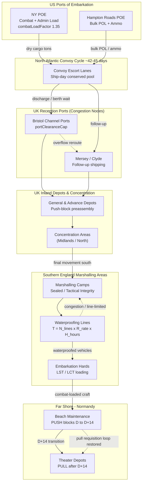

Cost: 0.27961

# Chapter 14: The OVERLORD-ANVIL Build-Up
## Reference Manual & Simulation Specification Document

**Classification:** Reference / Simulation Design Document
**Source Basis:** *Global Logistics and Strategy: 1943–1945* (US Army Center of Military History, "Green Book" Series)
**Document Type:** Division-Level Logistics Simulator Parameterization Manual

---

## 1. Strategic Context & Modern Historical Perspective

### 1.1 The Strategic Paradox: Aspiration Versus Sealift

The OVERLORD-ANVIL build-up (formally codified in the period between the SEXTANT/EUREKA conferences of late 1943 and the actual assault on 6 June 1944) represents the single most acute case study in the entire war of the collision between **strategic intent** and **physical logistics reality**. The fundamental paradox is easily stated but was devilishly difficult to resolve: the Combined Chiefs of Staff had, at TRIDENT (Washington, May 1943) and confirmed at QUADRANT (Quebec, August 1943), committed to a spring 1944 cross-Channel assault of a scale the available shipping pool could not simultaneously sustain alongside the Mediterranean commitment (ANVIL, later DRAGOON), the Pacific island-hopping campaigns, and the strategic bombing offensive.

The physical limiting factor was never, in the final analysis, the number of divisions the United States could raise, train, or equip. By 1944 the American industrial base had solved the *production* problem. The binding constraint was the **global shipping pool** — measured in deadweight tonnage and, more precisely, in *ship-days* — and its downstream corollaries: **combat-loading capacity** (which consumes 30–40% more cubic space per ton than commercial "administrative" loading), **port clearance rates** in the United Kingdom, and **inland transportation capacity** on the British rail and road net. The Green Book's central analytical insight, vindicated by decades of post-war scholarship (notably Leighton and Coakley's own quantitative appendices, and later work by Ruppenthal in the *Logistical Support of the Armies* volumes), is that shipping was a **fungible but conserved quantity**: every Liberty ship allocated to the Mediterranean was a ship not clearing a Bristol Channel port, and every ship held at anchor awaiting berth in a congested UK port was a ship *removed* from the effective global cycle for the duration of its wait.

Modern operations-research reconstruction reframes this as a **closed-queue network problem**. The turnaround cycle — load at a US Port of Embarkation (POE), transit the North Atlantic in convoy, wait for berth, discharge, and return — meant that the *effective* lift was not the nominal tonnage of the fleet but the tonnage divided by the mean cycle time. Port congestion in the UK during the winter of 1943–44 lengthened the discharge-and-wait component so severely that the CCS was, in effect, throwing ships into a system that could not absorb them. This is the quantitative heart of the "BOLERO" build-up crisis.

### 1.2 Inter-Service and Coalition Tensions

Three axes of friction dominated and must be modeled as institutional "impedances" in any high-fidelity simulation:

**(a) SOS versus the Combat Commands.** The Services of Supply (redesignated Army Service Forces under Somervell, with the European theater's SOS under J.C.H. Lee) fought a continuous doctrinal battle with the operational planners (COSSAC, then SHAEF). The combat command wanted maximum "teeth" — assault divisions, tanks, artillery — loaded first and forward. SOS understood that an assault division without its follow-on maintenance tonnage, ammunition resupply, and POL (petroleum, oil, lubricants) becomes combat-ineffective within days. The **loading priority dispute** — the sequencing of the phased build-up tables (the "Build-Up Priority Tables" or BPTs) — was the concrete manifestation of this tension.

**(b) US Army versus US Navy.** The Navy controlled the assault shipping (the LSTs, LCTs, LCI(L)s) whose scarcity was the true governor of the assault's frontage. The famous deferral of ANVIL from a simultaneous to a subsequent operation (August 1944, as DRAGOON) was fundamentally an **LST accounting dispute**: there were simply not enough tank landing ships to mount both a five-division OVERLORD assault and a concurrent southern France landing. The Navy's insistence on retaining LSTs for the Pacific compounded the arithmetic.

**(c) US versus British pooling.** The Combined shipping arrangements — the British Ministry of War Transport (MoWT) and the US War Shipping Administration (WSA) — nominally pooled Allied tonnage, but in practice each nation guarded import tonnage jealously. British civilian import requirements (food, raw materials to keep the war economy running) competed directly with military BOLERO import tonnage for the same UK berths. The reduction of British civilian imports to a bare minimum by early 1944 was itself a strategic sacrifice made to free port capacity for the American build-up.

### 1.3 Historical Era Context: Britain as a Logistical Platform

By late spring 1944, the United Kingdom had ceased to be a country in the ordinary sense and had become, in the words of contemporary observers, an unsinkable munitions dump and aircraft carrier moored off the coast of Europe. The final months saw the movement of American formations from their dispersed training areas across the Midlands and the north toward the **concentration areas** and then the **marshalling areas** of Southern England — a funnel geometry converging on the embarkation "hards" of the south coast ports (Southampton, Portland, Poole, Plymouth, and the Thames-side and Bristol Channel outports for follow-up shipping).

The two dominant physical processes of this final phase were **vehicle waterproofing** and **the reconfiguration of the supply system from pull to push**. Every vehicle destined to wade ashore from a landing craft had to be waterproofed to survive immersion — a labor- and time-intensive process performed on dedicated waterproofing lines within the marshalling camps. Simultaneously, the supply establishment abandoned its normal requisition-based ("pull") logic and pre-computed, pre-packaged, and pre-loaded the initial supply tonnage into **standardized blocks** that would be pushed ashore on a fixed timetable, independent of any demand signal from the beachhead.

### 1.4 Modern Analytical Insights: The Push-to-Pull Transition

Post-war logistical scholarship treats the push-supply phase as a canonical example of **open-loop control under communications denial**. In the first days of an amphibious assault, no functioning requisition channel exists: units are fighting, radios are saturated with tactical traffic, and no rear-echelon accountant is receiving inventory reports. A demand-driven ("pull") system requires a feedback loop — a requisition flows rearward, is filled, and the fill flows forward. That loop is *physically severed* at H-Hour.

The solution was to replace feedback control with **feed-forward control based on a consumption model**. Planners estimated daily consumption of ammunition, POL, and rations per division-slice under assault-intensity combat, packaged the corresponding tonnage into standardized "maintenance sets" and "beach maintenance packs," and scheduled their automatic delivery. The system deliberately over-supplied (accepting inventory-holding inefficiency) to guarantee against stockout, because a stockout in the beachhead was potentially catastrophic while excess tonnage on the beach was merely wasteful. The transition back to a pull system — historically targeted for roughly **D+14 to D+21**, once dumps were established and communications restored — is a critical *state transition* the simulator must model.

---

## 2. High-Fidelity Simulation Parameters & Real-World Metrics

| Parameter | Value | Historical Explanation & Strategic Rationale | Simulation Representation |
|---|---|---|---|
| US troop strength in UK, June 1944 | **~1.53 million** | Peak of the BOLERO build-up; roughly 1,526,965 US personnel in the ETO/UK by end May 1944, the product of a two-year accumulation constrained by shipping cycle time. | Static constant `PeakTroopStrength`; upper bound on marshalling throughput demand. |
| Distinct vehicle classes requiring waterproofing kits | **≈ 12** categories | Wheeled ¼-ton (jeep), ¾-ton, 2½-ton GMC, DUKW, half-tracks, light/medium tanks, SP artillery, prime movers, trailers, engineer plant, recovery vehicles — each with a bespoke kit and man-hour standard. | Enum `VehicleClass`; each carries a `kitManHours` coefficient. |
| Push-supply pipeline duration before pull transition | **~14–21 days** (model default: 14) | Duration the pre-packaged block system governs before requisition-based resupply resumes; governed by dump establishment and communications restoration. | State-transition timer `PushPhaseDays`; triggers `SupplyMode` enum flip. |
| Combat-load cube penalty | **+30–40%** over admin loading | Combat loading (tactical accessibility) sacrifices stowage density. | Efficiency coefficient `combatLoadFactor = 1.35`. |
| Mean Atlantic convoy cycle time | **~42–45 days** round trip | POE load → convoy transit → UK wait/discharge → return; the true governor of effective lift. | Dynamic parameter `cycleDays`; divisor on nominal fleet tonnage. |
| Marshalling camp waterproofing line rate | **~3–6 vehicles / line / hour** (varies by class) | Throughput of a single waterproofing station line under trained crews. | `ratePerLinePerHour` in `WaterproofingStation`. |
| Daily working hours on waterproofing lines | **~16–20 hrs** (double-shift) | Camps ran extended shifts under blackout/floodlight to meet the loading timetable. | Parameter `dailyHours`. |
| Assault division daily maintenance tonnage | **~600–700 tons/division/day** | Basis of the push-block consumption model (ammo + POL + rations + misc). | `dailyTonnagePerDivision`. |
| POL as fraction of tonnage (mobile phase) | **~25–30%** | Fuel dominates once the breakout begins (the later "Red Ball" crisis). | Coefficient `polFraction`. |
| UK port clearance rate (peak) | **~ tens of thousands of tons/day** aggregate | Binding downstream constraint on how fast shipping could be discharged and cleared inland. | Dynamic capacity cap `portClearanceCap`. |

---

## 3. Logistical Network Topology (Mermaid.js Flowchart)



---

## 4. Mathematical Modeling & Simulation Formulas

### 4.1 Waterproofing Throughput (Core Constraint)

The daily vehicle-waterproofing capacity of a marshalling station:

$$
T_{waterproof} = N_{lines} \cdot R_{rate} \cdot H_{hours} \cdot \eta
$$

where $N_{lines}$ = number of parallel waterproofing lines, $R_{rate}$ = vehicles processed per line per hour, $H_{hours}$ = daily operating hours, and $\eta \in (0,1]$ = an efficiency/utilization coefficient capturing crew fatigue, blackout slowdown, and kit shortages.

### 4.2 Class-Weighted Capacity

When vehicles of heterogeneous classes $c \in C$ each require $m_c$ man-hours and a line supplies $L$ man-hours/day, the achievable daily count subject to a class mix vector $\mathbf{x}$ is bounded by:

$$
\sum_{c \in C} m_c \, x_c \le N_{lines} \cdot H_{hours} \cdot \eta \cdot w
$$

where $x_c$ = vehicles of class $c$ processed and $w$ = crew count per line.

### 4.3 The Build-Up Bottleneck as an LP

Maximize combat-effective divisions embarked by $T$ subject to the tightest of shipping, port, and waterproofing constraints:

$$
\max \; Z = \sum_{d \in D} v_d \, y_d
$$

subject to

$$
\sum_{d} \tau_d \, y_d \le \frac{S_{fleet}}{\bar{c}} \cdot \phi \quad \text{(effective lift / cycle time)}
$$

$$
\sum_{d} P_d \, y_d \le C_{port} \cdot T \quad \text{(port clearance)}
$$

$$
\sum_{d} \sum_{c} n_{d,c} \le T_{waterproof} \cdot T \quad \text{(waterproofing)}
$$

$$
y_d \in \{0,1\}, \quad \tau_d, P_d, n_{d,c} \ge 0
$$

Here $y_d$ selects division $d$ for the assault echelon, $v_d$ its combat value, $\tau_d$ its combat-loaded tonnage, $\phi = 1/\text{combatLoadFactor}$ the loading penalty, $\bar c$ the mean cycle time, $C_{port}$ the daily clearance cap, $P_d$ the port tonnage demand, and $n_{d,c}$ the vehicles of class $c$ in division $d$.

### 4.4 Push-Phase Supply Requirement

Cumulative push tonnage that must be pre-staged before H-Hour to cover the open-loop phase:

$$
Q_{push} = \sum_{t=0}^{T_{push}} \sum_{d} D_{div} \cdot k(t) \cdot (1 + \sigma)
$$

where $D_{div}$ = base daily tonnage per division, $k(t)$ = combat-intensity multiplier at day $t$, $\sigma$ = safety over-supply margin, and $T_{push}$ = push-phase duration (≈14 days).

---

## 5. Compile-Safe Scala 3.8.3 Domain Model

```scala
package Logistics.BuildUp

import scala.collection.immutable.List
import scala.math.min

// ---------- Opaque unit-safe types ----------

opaque type NauticalMiles = Double
object NauticalMiles:
  def apply(v: Double): NauticalMiles = v
  extension (n: NauticalMiles) def value: Double = n

opaque type Tons = Double
object Tons:
  def apply(v: Double): Tons = v
  extension (t: Tons)
    def value: Double = t
    def +(other: Tons): Tons = t + other
    def *(f: Double): Tons = t * f

opaque type Days = Double
object Days:
  def apply(v: Double): Days = v
  extension (d: Days) def value: Double = d

opaque type ManHours = Double
object ManHours:
  def apply(v: Double): ManHours = v
  extension (m: ManHours) def value: Double = m

// ---------- Enums / State ----------

enum SupplyMode:
  case Push
  case Pull

enum VehicleClass(val kitManHours: ManHours):
  case QuarterTonJeep   extends VehicleClass(ManHours(2.0))
  case ThreeQuarterTon  extends VehicleClass(ManHours(3.0))
  case DeuceAndHalf     extends VehicleClass(ManHours(4.0))
  case Dukw             extends VehicleClass(ManHours(5.0))
  case HalfTrack        extends VehicleClass(ManHours(6.0))
  case LightTank        extends VehicleClass(ManHours(8.0))
  case MediumTank       extends VehicleClass(ManHours(12.0))
  case SelfPropelledArty extends VehicleClass(ManHours(10.0))
  case PrimeMover       extends VehicleClass(ManHours(7.0))
  case Trailer          extends VehicleClass(ManHours(1.5))
  case EngineerPlant    extends VehicleClass(ManHours(14.0))
  case RecoveryVehicle  extends VehicleClass(ManHours(9.0))

enum StationState:
  case Idle
  case Operating
  case Overloaded

// ---------- Core domain ADTs ----------

case class WaterproofingStation(lines: Int, ratePerLinePerHour: Double):
  require(lines >= 0, "lines must be non-negative")
  require(ratePerLinePerHour >= 0.0, "rate must be non-negative")

case class MarshallingCamp(
    name: String,
    station: WaterproofingStation,
    dailyHours: Double,
    efficiency: Double
):
  require(dailyHours >= 0.0 && dailyHours <= 24.0, "dailyHours in [0,24]")
  require(efficiency > 0.0 && efficiency <= 1.0, "efficiency in (0,1]")

case class VehicleDemand(vehicleClass: VehicleClass, count: Int):
  require(count >= 0, "count must be non-negative")

case class Division(id: String, combatLoadTons: Tons, vehicles: List[VehicleDemand])

case class PushPlan(
    divisions: List[Division],
    baseDailyTonnagePerDivision: Tons,
    intensityMultiplier: Double,
    safetyMargin: Double,
    pushPhaseDays: Days
)

// ---------- Simulation logic ----------

object StoragePacking:

  def maxWaterproofCapacity(station: WaterproofingStation, dailyHours: Double): Int =
    (station.lines * station.ratePerLinePerHour * dailyHours).toInt

  def effectiveDailyCapacity(camp: MarshallingCamp): Int =
    val raw: Double =
      camp.station.lines * camp.station.ratePerLinePerHour *
        camp.dailyHours * camp.efficiency
    if raw < 0.0 then 0 else raw.toInt

  def dailyManHoursAvailable(camp: MarshallingCamp, crewPerLine: Int): ManHours =
    ManHours(camp.station.lines * camp.dailyHours * camp.efficiency * crewPerLine)

  def manHoursRequired(demands: List[VehicleDemand]): ManHours =
    val total: Double =
      demands.foldLeft(0.0): (acc, d) =>
        acc + d.count * d.vehicleClass.kitManHours.value
    ManHours(total)

  def stationState(camp: MarshallingCamp, requiredToday: Int): StationState =
    val cap: Int = effectiveDailyCapacity(camp)
    if requiredToday <= 0 then StationState.Idle
    else if requiredToday <= cap then StationState.Operating
    else StationState.Overloaded

  def daysToWaterproof(camp: MarshallingCamp, demands: List[VehicleDemand]): Days =
    val cap: Int = effectiveDailyCapacity(camp)
    val total: Int = demands.foldLeft(0)((acc, d) => acc + d.count)
    if cap <= 0 then Days(Double.PositiveInfinity)
    else Days(math.ceil(total.toDouble / cap.toDouble))

object PushSupply:

  def cumulativePushTonnage(plan: PushPlan): Tons =
    val nDivisions: Int = plan.divisions.size
    val days: Int = math.max(0, plan.pushPhaseDays.value.toInt)
    val perDay: Double =
      nDivisions * plan.baseDailyTonnagePerDivision.value *
        plan.intensityMultiplier * (1.0 + plan.safetyMargin)
    Tons(perDay * days)

  def supplyModeAt(dayFromH: Days, transitionDay: Days): SupplyMode =
    if dayFromH.value < transitionDay.value then SupplyMode.Push
    else SupplyMode.Pull

object ShippingModel:

  def effectiveLift(nominalFleetTons: Tons, meanCycleDays: Days, combatLoadFactor: Double): Tons =
    require(meanCycleDays.value > 0.0, "cycle time must be positive")
    require(combatLoadFactor >= 1.0, "combat load factor >= 1")
    val perDay: Double = nominalFleetTons.value / meanCycleDays.value
    Tons(perDay / combatLoadFactor)

  def portConstrainedLift(effLiftPerDay: Tons, portClearanceCap: Tons): Tons =
    Tons(min(effLiftPerDay.value, portClearanceCap.value))

// ---------- Demonstration harness ----------

object BuildUpSimulation:

  def run(): (Int, Days, Tons, SupplyMode) =
    val station: WaterproofingStation = WaterproofingStation(lines = 8, ratePerLinePerHour = 4.0)
    val camp: MarshallingCamp =
      MarshallingCamp("Southampton-Alpha", station, dailyHours = 18.0, efficiency = 0.85)

    val demands: List[VehicleDemand] = List(
      VehicleDemand(VehicleClass.DeuceAndHalf, 300),
      VehicleDemand(VehicleClass.MediumTank, 60),
      VehicleDemand(VehicleClass.Dukw, 120)
    )

    val dailyCap: Int = StoragePacking.effectiveDailyCapacity(camp)
    val wpDays: Days = StoragePacking.daysToWaterproof(camp, demands)

    val plan: PushPlan = PushPlan(
      divisions = List(
        Division("1ID", Tons(15000.0), demands),
        Division("29ID", Tons(15000.0), demands)
      ),
      baseDailyTonnagePerDivision = Tons(650.0),
      intensityMultiplier = 1.2,
      safetyMargin = 0.15,
      pushPhaseDays = Days(14.0)
    )

    val pushTons: Tons = PushSupply.cumulativePushTonnage(plan)
    val mode: SupplyMode = PushSupply.supplyModeAt(Days(10.0), Days(14.0))

    (dailyCap, wpDays, pushTons, mode)

  def main(args: Array[String]): Unit =
    val (cap, days, tons, mode) = run()
    println(s"Daily waterproofing capacity: $cap vehicles/day")
    println(s"Days to waterproof echelon: ${days.value}")
    println(s"Cumulative push tonnage: ${tons.value} tons")
    println(s"Supply mode at D+10: $mode")
```

---

## 6. Graduate-Level Operational Analysis

### 6.1 Push versus Pull, and Why Push Was Mandatory at D-Day

A **pull system** is a *closed-loop, demand-driven* control architecture. The consuming unit measures its own inventory, computes a deficit, and transmits a requisition rearward; the supply echelon fills that requisition and returns the specified items. Its virtue is **inventory efficiency**: because supply follows observed demand, stockpiles are held only where and when needed, minimizing the "iron mountain" problem of surplus tonnage rotting on beaches. Its fatal prerequisite, however, is a **functioning feedback channel** — reliable communications, a stable accounting apparatus, and enough tactical latency for the requisition-to-fill loop to close before stockout.

At H-Hour, every one of those prerequisites is absent. Assault battalions are decisively engaged and cannot spare personnel to inventory ammunition; radio nets are saturated with fire-control and command traffic; no rear-echelon depot exists ashore to receive or process requisitions; and the loop latency (requisition rearward → fill → transit across a contested beach) vastly exceeds the consumption timescale of assault-intensity combat, in which a rifle company can expend its basic load of small-arms and grenade ammunition in hours. In control-theoretic terms, the feedback loop is both **severed** (no channel) and, even if restored, **unstable** (loop delay exceeds the system's time constant, guaranteeing oscillation and stockout).

The mandatory alternative is **feed-forward (open-loop) control**: replace the missing sensor with a *model*. Planners pre-computed consumption using historical intensity coefficients — encoded in the simulator as `intensityMultiplier` and `baseDailyTonnagePerDivision` — packaged the corresponding ammunition, POL, and rations into standardized blocks (beach maintenance packs, pre-loaded DUKWs, and MT ships combat-loaded so the tactically-first items discharged first), and delivered them on a **fixed timetable** irrespective of any demand signal. Because open-loop control cannot self-correct for estimation error, the system was deliberately biased toward over-supply via the `safetyMargin` term $(1+\sigma)$: the asymmetry of outcomes — a beach stockout risks losing the lodgment, whereas surplus is merely wasteful tonnage — justified accepting inventory inefficiency as insurance. The historically-observed transition back to pull at roughly D+14 to D+21 (modeled by `supplyModeAt` against a `transitionDay`) corresponds precisely to the moment the feedback prerequisites are re-established: dumps are ashore, communications are restored, and the tactical tempo has slowed enough for the requisition loop to close faster than consumption depletes stocks. This is one of history's clearest demonstrations that supply doctrine is not a matter of preference but is *dictated by the observability and controllability* of the operational system.

### 6.2 Marshalling Areas: Reconciling Tactical Integrity with Logistical Throughput

The marshalling areas of Southern England solved a problem that appears self-contradictory: they had to process an enormous *throughput* of men, vehicles, and supplies while simultaneously *preserving the tactical organization* of the units passing through. Raw throughput optimization — the logic of a factory or a commercial port — would batch identical items together (all jeeps here, all riflemen there) to maximize station utilization. But an assault force cannot be shipped as a homogeneous stream; it must arrive on the far shore already assembled into **combat-loaded, self-contained tactical increments** matched to the capacity of individual landing craft, so that the first vehicle down the ramp is the one the assault plan requires first.

The marshalling areas reconciled these by adopting a **funnel-and-serialize topology** with strict *unit integrity preservation*. Formations moved south from dispersed **concentration areas** and entered **sealed camps** where they were "briefed and bagged" — sealed from the outside world for operational security once they learned their true objective. Within the camp, the unit retained its organic structure while individual sub-processes (documentation, final equipment check, and critically the **waterproofing lines**) were applied to it as a serialized flow. The waterproofing line is the archetypal throughput bottleneck: its capacity is the strict product $T = N_{lines} \cdot R_{rate} \cdot H_{hours} \cdot \eta$ (implemented as `effectiveDailyCapacity`), and because heterogeneous vehicle classes consume different man-hours (the `kitManHours` coefficients), the line's effective throughput depends on the *class mix* of the unit currently flowing through — a Sherman consumes six times the jeep's kit-labor. The camps ran double shifts (16–20 hours) under blackout to raise $H_{hours}$, but $N_{lines}$ was physically fixed and $\eta$ degraded with crew fatigue, making the marshalling network the *binding constraint* on the assault timetable in the final fortnight.

The genius of the system lay in **decoupling the throughput cadence from the tactical loading cadence** through buffering. Units were called forward from concentration to marshalling on a schedule computed backward from the loading-craft timetable at the hards, so that a unit emerged from the waterproofing line, fully tactically reassembled, precisely in time to embark on its assigned craft in its assigned serial. The marshalling camp thus functioned as a **just-in-time staging buffer** — deep enough to smooth the stochastic arrival of units from the congested inland rail net, but disciplined enough that no unit lost its tactical coherence in the process. This is the physical embodiment of the principle that in amphibious logistics, *how* you load determines *whether* you can fight when you arrive: the marshalling area is where administrative efficiency was deliberately subordinated to tactical loading integrity, accepting lower station utilization as the price of a coherent assault force on the far shore.
