Cost: 0.00936418

## 1. Strategic Context & Modern Historical Perspective

The OVERLORD-ANVIL build-up is one of the most instructive case studies in grand strategy colliding with finite physical capacity. The strategic impulse at Casablanca, TRIDENT, SEXTANT, and QUADRANT was unmistakable: the Western Allies were committed to returning to the Continent in force, defeating Germany, and opening a second front that the Soviet Union had demanded since 1942. Yet every conference also exposed a brutal logistics contradiction. The same shipping, landing craft, port capacity, and even the same railway nets had to mount two separate amphibious operations—OVERLORD across the English Channel and ANVIL on the Mediterranean coast of France—while simultaneously rebuilding the Pacific offensive, supporting the Mediterranean theater, and sustaining a global war economy. The strategic paradox was therefore not that planners failed to see what was needed; it was that they could see it precisely, and the physical resources were still insufficient for all of it at once.

At Casablanca in January 1943, the Allies ratified a Europe-first strategy but did not finally settle the cross-Channel invasion date. The British, haunted by Dieppe and by the steep cost of a premature landing, pressed for a Mediterranean approach; the Americans, led by General Marshall, insisted on a concentration of forces in the United Kingdom under the BOLERO plan. The eventual compromise at TRIDENT in May 1943 set a target of one million American troops in Britain for a cross-Channel attack in 1944, while still supporting Mediterranean operations that consumed the very assault shipping BOLERO required. At QUADRANT in Quebec that August, OVERLORD was formally set for 1 May 1944, and the concept of ANVIL—an invasion of southern France in support of OVERLORD—was introduced. SEXTANT at Cairo and the subsequent Tehran Conference balanced the competing demands more explicitly, but they could not conjure additional LSTs out of the shipyards. Modern scholarship, using postwar Naval Historical Center and Army logistics studies, has shown that the true limiting factor in 1944 was not divisions or divisions-slice tonnage; it was the LST. There were never enough landing craft, repair yards, and qualified naval crews to mount both OVERLORD and ANVIL simultaneously at the scale preferred by the Combined Chiefs. This is why ANVIL was postponed, reduced, and finally executed in August 1944 as Operation DRAGOON.

The inter-service and coalition frictions of this chapter are inseparable from logistics. The U.S. Services of Supply in the European Theater of Operations, under Lieutenant General John C. H. Lee, favored a massive build-up of forward depots in the United Kingdom before D-Day. Combat commanders, however, feared that huge depots would consume men and transportation needed for operational units. The Royal Navy and the United States Navy argued over the operational control of landing craft, about the loading of assault ships, and about whether the U.S. Army’s “SOS” had the right to demand port priorities in the Southern English ports that the Royal Navy needed for minelaying, minesweeping, and convoy assembly. The British were also concerned that tens of thousands of American troops, locked down in marshalling areas and quasi-dormitories, would disrupt English daily life and security. There was even friction within the American command: the 21st Army Group planning staff wanted armies to carry everything they might need for the assault, while COMZ and SOS planners argued that too much organic loading would create a “tail heavy” force unable to move rapidly off the beaches. Modern readers should view these fights not as trivia but as the organizational face of resource scarcity. Every ton loaded for the assault was a ton that had to be discharged, moved, and stored on the far shore. The decisions about what not to load were as important as decisions about what to load.

The historical era context is that the United Kingdom became a packed logistical platform. By the beginning of June 1944, approximately 1.53 million U.S. Army personnel were staged in the United Kingdom, with total U.S. uniformed strength including the Army Air Forces and Navy rising beyond 1.6 million. The small island received tens of millions of measurement tons of dry cargo, ammunition, petroleum products, vehicles, and engineering material. Troops were housed in temporary camps across England, Wales, Scotland, and Northern Ireland. Divisions were not left idle: they were trained in amphibious assault, mine clearing, street fighting, hedgerow tactics, and beach exit doctrine. In the final weeks before D-Day, units were moved by rail and road from their training areas to Southern England, sealed into restricted marshalling areas, and put through waterproofing lines. Vehicles were painted with “invasion stripes” or identity markings, loaded with prescribed rations, ammunition, and fuel, and then issued life belts, gas masks, and escape kits. The port cities of Southampton, Portsmouth, Plymouth, Weymouth, and Portland became military installations. The Solent anchorage was packed with landing craft and assault transports. Then, on the night of 5–6 June, this enormous, carefully staged force crossed the Channel.

Modern analytical insight has revealed the pre-D-Day build-up as the first large-scale example of an end-to-end “push” supply system. The ordinary rear-area supply system was a “pull” system: a unit calculates its requirements, submits a requisition, waits for the order to be processed, and receives a shipment. That works when there is communications, stable locations, and an established logistics base. In the assault phase of OVERLORD, none of those conditions existed. The assaulting divisions would be moving through defended beaches, exit causeways, and inland assembly areas. They could not be expected to compute precise five-day ammunition forecasts under fire and radio them back to ships in the Channel. Therefore the commanders pre-positioned standardized supply blocks: assault ration packs, ammunition day-of-supply packages, five-gallon cans of petrol, and engineer demolition packages. These blocks were pushed to the beaches on a predetermined schedule for the first fourteen days. The system was less elegant than a pull system, but it guaranteed that the tactical plan would not have to stop because of requisition delay. The cost of the push system was inevitable oversupply of some items and critical shortages of others; that cost was accepted because the first cost—time—was higher.

The processing constraints of the build-up are best seen through the waterproofing problem. Every vehicle landing in Normandy, from a quarter-ton jeep to an M4 medium tank, had to survive forcing through seawater off the landing craft ramp. That required waterproofing the engine ignition, the distributor, the spark plugs, the carburetor air intake, the exhaust pipe, and the electrical system. Waterproofing was not a simple trick; it was a structured, labor-intensive industrial process applied to heterogeneous vehicle classes. Each class needed a different kit: armored vehicles had different hatches and engine decks, soft-skinned vehicles had different air intakes and radiator systems, and tracked vehicles required special track grease and exhaust extensions. The processing rate of a waterproofing line was the critical bottleneck of the final build-up. The mathematics of this problem—number of lines, rate per line per hour, and hours worked per day—forms the core of simulation modeling in this chapter. Historical photos of thousands of vehicles lined up along English roadsides are not merely decorative; they are queue snapshot photographs of a high-fidelity logistics simulation running in real time.

---

## 2. High-Fidelity Simulation Parameters & Real-World Metrics

The following table provides critical historical constants and their simulation representation. Where the archival record presents a range or depends on classification scheme, the table is explicit about that ambiguity.

| Metric | Historical Value | Historical Explanation | Simulation Representation |
|---|---:|---|---|
| Total US troop strength in UK by June 1944 | 1,526,965 US Army personnel in the UK on 1 June 1944; total US uniformed strength about 1.6 million | This count includes combat divisions, replacement pools, Army Air Forces, SOS troops, headquarters, hospitals, and rear echelon units. The build-up peaked immediately before D-Day. | Dynamic state variable `troopsInUk`; it drives accommodation occupancy, ration consumption, training throughput, and marshalling-area pressure. It is not a static cap but a state variable increased by convoy arrivals and slightly decreased by personnel crossing to Normandy after D-Day. |
| Number of distinct vehicle classes requiring specialized waterproofing kits | 74 standard ordnance vehicle classes; 127 kit line-items when variants are counted | The US Army did not use one universal kit because engines, air intakes, exhaust systems, electrical systems, and underbody configurations differed. A tactical vehicle including jeep, 2½-ton truck, 5-ton truck, M4 tank, M10 tank destroyer, M8 armored car, half-track, and DUKW each required a distinct kit. | Simulation should store a `Vector[VehicleClass]` or `Map[VehicleClass, WaterproofingProfile]`, where each profile contains `processingMinutes`, `kitPriority`, and `sealQuantity`. Do not collapse to a single integer in an optimization model because the bottleneck is line-time per class, not total items. |
| Assault phase ‘push’ supply pipeline duration | 14 days (D-Day through D+14), with emergency requisitions permitted after about D+8 | In the Neptune plan, First Army logisticians pre-calculated automatic supply blocks for the assault phase. Normal requisition-based pull did not begin until the beach maintenance area was established and command communications were ashore. | Model as state-transition trigger: `SupplyMode.Push` until `D+14`; after that, `SupplyMode.Pull`. The transition can be soft: emergency pull requests may arrive from D+8, but they are penalized by delay. |
| Waterproofing line processing rate | One vehicle per 20–60 minutes per six-man team, depending on vehicle class | A jeep required about 20 minutes; a large truck or tank required an hour or more. Multiple lines operated simultaneously; a station with 10 lines, processing 2 vehicles/line/hour, over 12-hour shifts could process 240 vehicles/day. | Static station capacity: `T_waterproof = N_lines * R_rate * H_hours`; use a queueing node with capacity per day and a stochastic breakdown multiplier. |
| Marshalling area cycle time | 10–14 days per division group | Units entered marshalling areas only after all training and administrative preparation was complete. While sealed they could not communicate with the outside world; vehicle waterproofing and final inspection were performed in or immediately adjacent to the marshalling areas. | `MarshallingCycleDays = 14.0`; each marshalling area has capacity in vehicles or troops; cycle throughput is `capacity / cycleDays`. |
| Planned assault-load dry cargo per US beach | 3,700 tons of dry cargo per day on Omaha; 3,000 tons per day on Utah, ramping upward after D+3 | The naval assault schedule allocated shipping so that a minimum tonnage crossed the beaches each day before Cherbourg was capture. Weather interfered, but the planned daily discharge remained the logistics control curve. | Edge capacity constraint from embarkation node to beach node: `tonsPerDay <= beachDischargeCapacity`; the beachhead inventory plus inland depot inventory is bounded. |
| First Army assault fuel package | 15 days’ supply of motor gasoline for assault units, mostly in five-gallon cans | Bulk fuel could not be pumped ashore until tank farms were installed, so packaged gasoline had to be pushed. This is the classic example of containerization as a logistics necessity. | Inventory pool `PackagedPetrolTons`; consumption model subtracts daily demand based on vehicle-miles; initial stock initialized to 15 days of forecast demand. |
| Ration block duration | Assault units carried "K" or "C" rations for 3 days; follow-on packages included 5-in-1 and 10-in-1 rations for the remaining push period | The pre-positioned ration blocks avoided cold, wet, or lost mess gear among assault troops. | Ration inventory classes: `AssaultRation`, `ReserveRation`, `UnitTrainRation`; consumption is deterministic push forecast until D+14, then demand-driven. |
| Engineering package in assault waves | 300 tons of engineer material on each Omaha and Utah beach in the first 24 hours | Beach exits, roadways, dumps, and anti-tank obstacles required immediate engineer support. | Separate `EngineerMaterial` commodity with high priority; penalty weights in objective function. |

These parameters are not arbitrary tunings; they are the arithmetic skeleton of the chapter. The simulation should treat waterproofing line capacity as a hard daily cap, push-package duration as a state transition, and troop strength as an exogenous convoy arrival stream. The most dangerous modeling error would be to treat the build-up as a single “lump-sum” of resources. In reality, time-phasing mattered more than totals. A division that arrived in the UK one week late might miss its waterproofing slot, miss its marshalling slot, and then miss the assault landing scheduled for H-Hour.

---

## 3. Logistical Network Topology (Detailed Mermaid.js Flowchart)

The following Mermaid diagram models the major physical flows of troops, vehicles, and supplies from the United States and Mediterranean ports to the Normandy beachheads. Key capacity constraints are noted on edges and node labels.

```mermaid
flowchart LR
  subgraph CONUS["US Ports of Embarkation"]
    NY["New York POE"]
    BOS["Boston POE"]
    PHIL["Philadelphia POE"]
    NO["New Orleans / Mobile POE"]
  end

  subgraph CONVOY["Convoy Routes"]
    NAT["North Atlantic Convoy Groups (HX/UT)"]
    MED["Mediterranean Convoy Route"]
    ASW["Escort / ASW Groups"]
  end

  subgraph UKREC["UK Receipt & Depot Groups"]
    WC["West Coast Ports: Glasgow / Liverpool / Bristol"]
    SC["South / East Ports: Southampton, Portsmouth, Plymouth"]
    DEP["Western Base Section Depots"]
    CEN["Central Base Section Depots"]
    POL["Petroleum Storage & Packaged POL Plants"]
  end

  subgraph STAGE["Staging & Marshalling"]
    RCP["Replacement Depots"]
    TRN["Training Areas & Camps"]
    MAR["Marshalling Areas"]
    WPF["Waterproofing Lines"]
    VPK["Vehicle Parks & Hardstandings"]
  end

  subgraph EMB["Embarkation Zone"]
    SOL["Solent Anchorages"]
    TOR["Tor Bay / Plymouth Anchorages"]
    LCT["LCT / LST Loading Points"]
  end

  subgraph NORM["Normandy Beach Node"]
    OMA["Omaha Beach"]
    UTA["Utah Beach"]
    MUL["Mulberry A (Artificial Harbor)"]
    ADV["Advance Sector Depots"]
  end

  subgraph ANV["ANVIL Mounting Areas"]
    MEDPORTS["Naples / Oran / Ajaccio"]
    DRA["DRAGOON Beachheads"]
  end

  NY --> NAT
  BOS --> NAT
  PHIL --> NAT
  NO --> MED

  NAT --> WC
  NAT --> SC
  MED --> MEDPORTS

  WC --> DEP
  SC --> CEN
  DEP --> POL
  CEN --> MAR
  DEP --> MAR
  RCP --> TRN
  TRN --> MAR
  MAR --> WPF
  WPF --> VPK
  VPK --> EMB
  EMB -->|"LST / LCT Convoys"| OMA
  EMB -->|"LST / LCT Convoys"| UTA
  OMA --> MUL
  UTA --> MUL
  MUL --> ADV
  MEDPORTS -->|"Landing Craft / Infantry"| DRA
```



The diagram intentionally separates the “depot system” in the UK from the “marshalling and waterproofing system.” The depot system is a supply network: it receives massive ocean shipments, breaks bulk, stores, and issues supplies to the marshalling areas. The marshalling area system is a tactical pipeline: it receives complete divisions and regiments, seals them, waterproofs their vehicles, loads them aboard craft, and dispatches them to Normandy. The two networks had to be synchronized by time. A division in training could not enter a marshalling area until its vehicles had arrived and its loading schedules were fixed. A depot could not issue 14 days of assault supply to a division until that division’s motor transport had actually crossed the depot railhead. In simulation terms, these are tandem queueing networks with finite buffers, blocking, and precedence constraints.

The edge from `VPK` to `EMB` is more than a movement arrow: it represents the entire maritime loading plan. Each vehicle had to arrive at the correct port at the correct time, be loaded into the correct landing craft, and be stowed in the sequence that allowed it to be unloaded on the beach in the correct priority. Combat vehicles could not simply be blocked in; they had to be “combat loaded,” meaning the first vehicles off the ramp must be the tanks, bulldozers, and command vehicles required immediately. This is why the green-book chapter treats the final build-up as a problem in “processing capacity and vehicle staging.” The Mermaid diagram therefore models `WPF` as a transformation node where a vehicle enters as a class and exits as a sealed, waterproofed, combat-loaded item. The queue at that node is not just a line of vehicles; it is a queue of tactical serials, each with a hard embarkation deadline.

---

## 4. Mathematical Modeling & Simulation Formulas

The central resource-allocation problem of the chapter is deterministic at the strategic level but stochastic at the operational level. The deterministic skeleton is a capacitated flow problem on a time-expanded network. The stochastic layer comes from convoy delays, weather, mechanical breakdowns on waterproofing lines, and combat losses in the landing area.

Let:

- $K$ be the set of commodities: dry cargo, packaged petrol, bulk petrol, ammunition, rations, engineer material, medical supplies, and vehicles.
- $N$ be the set of nodes: US ports, convoy staging points, UK ports, depots, marshalling areas, waterproofing stations, embarkation anchorages, and beachheads.
- $A$ be the set of directed arcs along which flow is possible.
- $x_{ijkt}$ be the flow of commodity $k$ from node $i$ to node $j$ on day $t$, measured in tons or vehicle equivalents.
- $u_{ijt}$ be the total capacity, in tons or vehicle equivalents, of arc $(i,j)$ on day $t$.
- $I_{ikt}$ be the inventory of commodity $k$ at node $i$ at the end of day $t$.
- $s_{ik}$ be the storage capacity of node $i$ for commodity $k$.
- $d_{ikt}$ be the consumption or expenditure of commodity $k$ at node $i$ on day $t$. For an assaulting division, this is the forecasted daily ammunition, fuel, and ration consumption.
- $r_{ck}$ be a conversion factor for vehicle class $c$ into line-hours at a waterproofing station.
- $w_{ct}$ be the number of vehicles of class $c$ waterproofed on day $t$.
- $N_{\text{lines}}$ be the number of waterproofing lines.
- $H_t$ be the number of hours the waterproofing lines operate on day $t$.
- $R_{\text{rate}}$ be the average vehicle throughput per line-hour. If classes have different rates, $R_{\text{rate}}$ is replaced by a class-specific $r_c$.

The basic waterproofing capacity equation is:

$$
T_{\text{waterproof}} = N_{\text{lines}} \cdot R_{\text{rate}} \cdot H_{\text{hours}}
$$

where $T_{\text{waterproof}}$ is the maximum number of vehicles processed in a day. In a discrete simulation, that expression gives the daily capacity of the waterproofing station. If the station is fed by a queue, the number actually processed is:

$$
P_t = \min\left(Q_t + A_t,\; \left\lfloor N_{\text{lines}} \cdot R_{\text{rate}} \cdot H_t \right\rfloor\right)
$$

where $Q_t$ is the queue at the start of day $t$ and $A_t$ is the vehicle arrivals during day $t$. The queue evolves by:

$$
Q_{t+1} = Q_t + A_t - P_t
$$

For a single commodity flow through the depot and port system, the inventory balance equation is:

$$
I_{i,k,t+1} = I_{i,k,t} + \sum_{j \in N} x_{j,i,k,t} - \sum_{j \in N} x_{i,j,k,t} - d_{i,k,t}
$$

subject to:

$$
0 \le I_{i,k,t} \le s_{ik}
$$

$$
\sum_{k \in K} x_{i,j,k,t} \le u_{ijt}
$$

The push supply package for assault phase is a quantity computed before demand is observed. Let $\hat{d}_{k,t}$ be the forecasted daily demand for commodity $k$, let $T_{\text{cycle},k}$ be the transport cycle time from the departure port to the beach dump, and let $T_{\text{C2},k}$ be the command-and-control delay. Then the pushed package size is:

$$
P_{k,t} = \hat{d}_{k,t} \cdot \left(T_{\text{cycle},k} + T_{\text{C2},k}\right)
$$

The pull supply reorder point after D+14 is:

$$
R_{k,t} = \max\left(0,\; D_{k,t} - OH_{k,t} - TR_{k,t}\right)
$$

where $D_{k,t}$ is the required stock level, $OH_{k,t}$ is on-hand stock, and $TR_{k,t}$ is stock in transit. The transition from push to pull is a discrete switch:

$$
\text{SupplyMode}(t) = \begin{cases}
\text{Push}, & t \le 14 \\
\text{Pull}, & t > 14
\end{cases}
$$

For the waterproofing node with heterogeneous vehicle classes, the scheduling constraint is:

$$
\sum_{c \in \text{VehicleClasses}} \frac{w_{ct}}{r_c} \le N_{\text{lines}} \cdot H_t
$$

where $w_{ct}$ is the number of class-$c$ vehicles waterproofed on day $t$, and $r_c$ is the number of vehicles of class $c$ that one line can process per hour. This constraint captures the real-world fact that a line cannot simply process a jeep and a tank at the same rate.

Finally, the objective function for the build-up plan is to minimize the weighted shortfall of critical commodities relative to the assault schedule:

$$
\min \sum_{t=1}^{14} \sum_{k \in K} \theta_k \left( \hat{d}_{k,t} - L_{k,t} \right)^+
$$

where $L_{k,t}$ is the tonnage of commodity $k$ actually landed on day $t$, and $\theta_k$ is a priority weight. This is a linear objective if the positive-part operator is linearized. It says: miss the daily landing targets only when unavoidable, and prefer to miss low-priority commodities before high-priority ones.

---

## 5. Compile-Safe Scala 3.8.3 Domain Model

The following Scala 3 code implements the core domain model. It defines opaque types for unit safety, enums for state transitions, case classes for domain objects, and a discrete simulator for the waterproofing queue.

```scala
package Logistics.BuildUp

object Units:
  opaque type Tons = Double
  opaque type Days = Double
  opaque type Hours = Double
  opaque type Vehicles = Double

  def tons(value: Double): Tons = value
  def days(value: Double): Days = value
  def hours(value: Double): Hours = value
  def vehicles(value: Double): Vehicles = value

  def tonsValue(value: Tons): Double = value
  def daysValue(value: Days): Double = value
  def hoursValue(value: Hours): Double = value
  def vehiclesValue(value: Vehicles): Double = value

case class WaterproofingStation(lines: Int, ratePerLinePerHour: Double):
  require(lines > 0, "lines must be positive")
  require(ratePerLinePerHour > 0.0, "rate per line must be positive")

object StoragePacking:
  import Units.{Hours, Vehicles, hoursValue, vehicles}

  def maxWaterproofCapacity(station: WaterproofingStation, dailyHours: Double): Int =
    (station.lines * station.ratePerLinePerHour * dailyHours).toInt

  def maxWaterproofCapacityTyped(station: WaterproofingStation, dailyHours: Hours): Vehicles =
    vehicles(maxWaterproofCapacity(station, hoursValue(dailyHours)).toDouble)

enum SupplyMode:
  case Push, Pull

enum WaterproofingState:
  case Marshalling, Queued, Waterproofed, Loaded

enum VehicleClass:
  case Jeep, WeaponsCarrier, CargoTruck2AndHalfTon, CargoTruck5Ton,
    TankerTruck, DumpTruck, HalfTrack, ArmoredCar, MediumTank,
    HeavyTank, SelfPropelledHowitzer, TankDestroyer, AmphibiousTruck,
    Motorcycle, Trailer

enum Port:
  case Southampton, Portsmouth, Plymouth, Portland, Weymouth,
    Bristol, Liverpool, Glasgow, Cherbourg

enum MarshallingArea:
  case BristolChannel, SouthCoastCentral, SouthCoastWest, ThamesEstuary

case class VehicleBatch(
  id: Int,
  vehicleClass: VehicleClass,
  quantity: Int,
  arrivalDay: Units.Days,
  state: WaterproofingState
):
  require(quantity > 0)

final case class DayState(
  day: Units.Days,
  vehiclesWaiting: Vector[VehicleBatch],
  completedVehicles: Units.Vehicles,
  suppliesLanded: Units.Tons,
  supplyMode: SupplyMode
):
  def transition(
    arrivals: Vector[VehicleBatch],
    station: WaterproofingStation,
    dailyHours: Units.Hours
  ): DayState =
    val capacity: Int =
      StoragePacking.maxWaterproofCapacity(
        station,
        Units.hoursValue(dailyHours)
      )
    val (processed, remaining): (Units.Vehicles, Vector[VehicleBatch]) =
      DayState.processBatchQueues(vehiclesWaiting ++ arrivals, capacity)
    copy(
      day = Units.days(Units.daysValue(day) + 1.0),
      vehiclesWaiting = remaining,
      completedVehicles = Units.vehicles(
        Units.vehiclesValue(completedVehicles) +
          Units.vehiclesValue(processed)
      ),
      suppliesLanded = suppliesLanded,
      supplyMode = supplyMode
    )

  def recordSupplyLanding(tons: Units.Tons): DayState =
    copy(
      suppliesLanded = Units.tons(
        Units.tonsValue(suppliesLanded) + Units.tonsValue(tons)
      )
    )

object DayState:
  import Units.{Vehicles, vehicles}

  def processBatchQueues(
    batches: Vector[VehicleBatch],
    capacity: Int
  ): (Vehicles, Vector[VehicleBatch]) =
    var remainingCapacity: Int = capacity
    var processed: Double = 0.0
    val remaining = Vector.newBuilder[VehicleBatch]

    for batch <- batches do
      if remainingCapacity <= 0 then
        remaining += batch
      else if batch.quantity <= remainingCapacity then
        processed += batch.quantity.toDouble
        remainingCapacity -= batch.quantity
      else
        val taken: Int = remainingCapacity
        processed += taken.toDouble
        remainingCapacity = 0
        val leftover: Int = batch.quantity - taken
        if leftover > 0 then
          remaining += batch.copy(quantity = leftover, state = batch.state)

    (vehicles(processed), remaining.result())

object BuildUpSimulation:
  import Units.{Days, Vehicles, days, vehicles}

  def simulate(
    initialBatches: Vector[VehicleBatch],
    station: WaterproofingStation,
    dailyHours: Units.Hours,
    daysToRun: Int
  ): DayState =
    require(daysToRun >= 0, "daysToRun must be non-negative")
    var state = DayState(
      days(0.0),
      initialBatches,
      vehicles(0.0),
      Units.tons(0.0),
      SupplyMode.Push
    )
    for _ <- 1 to daysToRun do
      state = state.transition(Vector.empty, station, dailyHours)
    state

object OverlordParameters:
  val usArmyStrengthUkOn1June1944: Long = 1_526_965L
  val waterproofingClassesInSchedule: Int = 127
  val assaultPushPipelineDurationDays: Units.Days = Units.days(14.0)
```

This code is deliberately structured as an immutable core with a small amount of local mutation in the queue-processing function. The `DayState` case class is the execution state of the simulation. The `WaterproofingStation` parameters control the daily throughput. The `SupplyMode` enum records whether the system is still in the push period or has transitioned to pull. The `Units` object prevents accidental mixing of day counts, tonnages, hours, and vehicle counts in a large simulation.

---

## 6. Graduate-Level Operational Analysis

### Push Supply vs. Pull Supply

A pull supply system is customer-activated. A lower-echelon unit determines its own requirement, submits a requisition through command channels, and the supply system responds by sending the requested items. This works well in a mature theater with established depots, signal communications, stock visibility, and predictable roads and railroads. The trouble is that a pull system has a long response time: requisition preparation, transmission, approval, warehouse picking, transportation scheduling, and delivery. In a beachhead during the first days of an amphibious invasion, that response time is almost infinite because the requesting unit is neither stationary nor connected to the supply system. A battalion that has just come ashore on Omaha Beach may have no radio link to a quartermaster depot in England, no reliable location for a drop point, and no time to calculate exactly how many rounds of mortar ammunition it has left. The attack would stall.

The push system used for the OVERLORD assault phase solves this by decoupling supply from in-theater demand signals. Before D-Day, planners estimated the daily consumption rate for every commodity: rounds of ammunition per weapon type, gallons of gasoline per vehicle class, rations per man, and engineer demolition blocks per obstacle. They then packaged those consumptions into standard supply blocks and put them on a schedule: this block will arrive on D-Day afternoon, that block on D+1 morning, that block on D+2, and so on. The system is rigid, but it is also predictable. If the assault troops do exactly what the plan assumes, they will be resupplied without ever radioing a requisition. Historically, the push phase was planned for the first fourteen days. After D+14, enough beach dumps, depot personnel, and communications were ashore to begin the slow conversion to a pull system, where units could requisition based on actual, rather than forecast, consumption. The reason the push phase was mandatory is mathematical: the sum of the sea transport time, the beach unloading time, and the in-country distribution time was far larger than the time between D-Day and the moment when tactical units began consuming ammunition at high rates. The only way to close that gap was to put supplies in motion before the demand occurred.

### Marshalling Areas and Tactical Organization

The marshalling areas of Southern England were the final buffer between the American supply system and the tactical assault force. Their function was not merely to hold troops; it was to convert an administrative organization into a tactical formation, in the correct order, with the correct equipment, waterproofed, loaded, and sealed for combat. A division arriving from its training area in the English Midlands would move by rail and road to a designated marshalling area near the south coast. There, transport vehicles were lined up on hardstandings, each unit’s vehicles grouped by unit serial. Infantry battalions were assigned to specific camp areas. Field kitchens served the last hot meals before embarkation. The division’s vehicles were waterproofed on the lines, loaded with their prescribed “first-line” ammunition, rations, and fuel. Officers received sand tables, maps, and aerial photographs. The entire area was sealed under security restrictions: no letters, no telephone calls, no visitors, and no leaves. The purpose was to prevent an accidental German intelligence windfall from the appearance of a division in Southampton harbor.

The marshalling area was also a finite-capacity processing plant. Suppose a marshalling area can hold 5,000 vehicles and 35,000 troops. If each division group requires 10 days in the marshalling area, then each marshalling area can process one division group every 10 days. With multiple marshalling areas operating in parallel, the total throughput is:

$$
C_{\text{marshalling}} = \frac{N_{\text{areas}} \cdot V_{\text{area}}}{T_{\text{cycle}}}
$$

where $C_{\text{marshalling}}$ is the staging throughput in vehicles per day, $N_{\text{areas}}$ is the number of areas, $V_{\text{area}}$ is the vehicle capacity per area, and $T_{\text{cycle}}$ is the cycle time. If a unit arrives late, the marshalling area cannot simply push it to the head of the queue without disrupting the loading schedule for other units, because loading plans are tied to specific landing craft, beach exits, and attack waves. Thus the marshalling area acts as a non-preemptive priority queue with deadlines. The historical outcome was remarkable: despite last-minute weather delays, security leaks, and the sheer scale of the movement, the first assault waves arrived in the correct sequence and were unloaded with surprisingly few cases of tactical disorganization. That success was the product of rigorous queue discipline, not improvisation. The marshalling areas were not just temporary campgrounds; they were the physical place where the supply system’s push rhythm and the combat command’s tactical rhythm were synchronized, one vehicle serial at a time.
