Cost: 0.4261975

# Chapter 14: The OVERLORD–ANVIL Build-Up

## 1. Strategic Context & Modern Historical Perspective

The OVERLORD–ANVIL build-up was not merely a concentration of troops before two amphibious operations. It was the culmination of a global allocation problem in which the United States and its allies attempted to reconcile strategic commitments on several continents with finite shipping, landing craft, port, depot, rail, motor-transport, and labor capacity. The essential operational achievement was the conversion of the United Kingdom into an enormous forward logistical platform from which a continental campaign could be launched and sustained. Its central danger was that this platform could become saturated before its accumulated resources could be projected across the English Channel.

By the spring of 1944, approximately 1.5 million United States personnel were present in the United Kingdom. They occupied a logistical system that contained camps, hospitals, depots, air bases, ammunition installations, vehicle parks, petroleum facilities, railway sidings, marshalling areas, and embarkation installations. The build-up had to support not only the assault on Normandy but also the strategic air offensive, continuing British requirements, transatlantic reception operations, and preparations for ANVIL, the projected invasion of southern France. The United Kingdom was therefore simultaneously a receiving theater, a static base, a staging platform, and the point of departure for a mobile continental army.

### The strategic paradox

The major Allied conferences—Casablanca in January 1943, TRIDENT in May 1943, QUADRANT in August 1943, SEXTANT in November–December 1943, and the subsequent operational deliberations—produced decisions about campaigns, target dates, force levels, and priorities. Those decisions were commonly expressed in divisions, landing dates, and strategic objectives. Logistics operated in less flexible units: ship-days, deadweight tons, cubic measurement tons, landing-craft hulls, berth-days, train paths, depot square footage, truck-ton-miles, and engineer labor-hours.

The resulting paradox was that strategic plans could be enlarged or accelerated on paper more rapidly than the physical delivery system could be expanded. A conference could assign additional divisions to OVERLORD or revive ANVIL, but it could not instantaneously produce the shipping, landing craft, trained crews, port clearance, or vehicle-processing capacity needed to employ those divisions.

Ocean shipping represented only the first constraint. A ship allocated to the North Atlantic was unavailable for the Mediterranean, Pacific, Indian Ocean, or Soviet-aid routes. Its effective capacity also depended on voyage duration, convoy schedules, port turnaround, maintenance, and the balance between weight and cubic volume. A vessel might “cube out” on vehicles or packaged stores before reaching its nominal deadweight limit. Conversely, dense ammunition or machinery could reach weight limits while leaving unusable volume. Globally pooled shipping therefore could not be treated as a homogeneous stock of interchangeable tons.

Combat loading imposed a further penalty. Commercially efficient loading sought maximum cargo utilization and normally assumed that unloading could be organized ashore. An assault-loaded ship or landing vessel had to carry units, vehicles, weapons, ammunition, engineer stores, rations, and communications equipment in the sequence in which they would be required. Accessibility, tactical dispersion, landing priority, and compatibility with landing craft mattered more than maximum stowage. Combat loading consequently reduced effective carrying capacity and increased planning complexity.

Landing craft were the most acute amphibious bottleneck. Large ocean-going ships could carry divisions to the theater, but the assault depended on specialized craft capable of transferring men, tanks, artillery, vehicles, and stores onto beaches. Landing ships and craft were not simply transport tonnage. Their military utility depended on ramp geometry, beach gradient, tide, sea state, unloading cycle, maintenance status, and crew availability. The recurrent controversy over landing-craft allocations between OVERLORD, ANVIL, Mediterranean operations, and the Pacific was therefore a dispute over a scarce and only partially substitutable means of converting strategic mass into combat power.

Port capacity created another discontinuity. Before D-Day, British ports had to receive the build-up while maintaining civilian imports and other military traffic. After D-Day, the Allies initially could not rely upon intact French ports. Cargo had to cross beaches, artificial harbors, and eventually captured ports whose nominal capacities were reduced by demolition, mines, wreckage, labor shortages, damaged railways, and inland-clearance limitations. The relevant measure was not simply tons discharged over a quay. It was sustainable throughput from ship to beach or berth, through transit storage, and onward by road, rail, or pipeline. If inland clearance failed, the port or beach became congested and discharge rates declined.

Modern systems analysis therefore treats OVERLORD’s logistics as a serial-capacity network. Effective throughput was approximately the minimum capacity of its most restrictive stage:

$$
Q_{\text{effective}}
\leq
\min
\left(
Q_{\text{ocean}},
Q_{\text{POE}},
Q_{\text{landing}},
Q_{\text{beach}},
Q_{\text{clearance}},
Q_{\text{depot}},
Q_{\text{unit}}
\right)
$$

Increasing transatlantic arrivals did not necessarily increase combat delivery if British depots, marshalling areas, landing craft, beach exits, or continental transport were already saturated.

### Inter-service and coalition tensions

The build-up exposed a persistent difference between operational ambition and logistical control. Combat commanders naturally sought maximum assurance: more assault troops, more reserve formations, larger ammunition reserves, additional vehicles, and earlier delivery. Services of Supply officers had to evaluate whether those requirements could be received, stored, processed, loaded, and sustained. From the combat perspective, logistical qualifications could appear excessively cautious. From the logistical perspective, late changes to force composition or landing sequence threatened the integrity of an interdependent plan.

The division of authority was especially difficult because control of the logistical chain crossed organizational boundaries. The Army controlled many troops, depots, vehicles, and supplies. The Navy and associated amphibious commands controlled much of the ship-to-shore movement. British authorities controlled or coordinated ports, railways, roads, civilian labor, territorial facilities, and substantial elements of the pooled transportation system. Air forces competed for construction resources, petroleum, bombs, vehicles, and shipping. Tactical formations controlled their own loading tables and priorities, but changes to those priorities propagated backward through marshalling, depot issue, train scheduling, and vessel stowage.

Army–Navy friction was not reducible to institutional rivalry. The services used different planning assumptions. Ground planners thought in divisions and daily maintenance tonnages. Naval planners had to think in hulls, craft cycles, tidal windows, loading compatibility, weather, and losses. A ground-force request for an additional reserve regiment might require changes to several vessel-load plans, landing tables, beach-group assignments, and craft schedules.

Anglo-American pooling arrangements introduced another level of complexity. Pooling could increase aggregate efficiency by allowing resources to be allocated where they were most useful, but it also obscured national ownership and complicated accounting. British rail, port, and storage networks had been under wartime strain for years. American requirements arrived within an existing British economy of scarcity. Differences in packaging, vehicle specifications, petroleum handling, documentation, railway loading gauges, and supply nomenclature imposed conversion costs that are easily hidden in aggregate tonnage statistics.

The ANVIL question brought these tensions into sharp relief. Strategically, an invasion of southern France promised another line of advance, access to Marseille and the Rhône valley, and pressure on German forces from the south. Operationally, it competed for landing craft, shipping, trained amphibious staffs, and supporting naval forces needed elsewhere. When ANVIL was postponed and later revived as DRAGOON, the decision reflected changing assessments of force availability, Mediterranean opportunities, Italian operations, and the inability of Normandy beaches and Channel ports alone to guarantee the desired long-term support of Allied armies. The later performance of Marseille and the southern line of communications validated the logistical value of the operation, even though the earlier timing dispute cannot be resolved simply by reference to its eventual success.

### Britain as a packed logistical platform

In the months before D-Day, southern England became an immense sequencing mechanism. Supplies and vehicles could not simply be accumulated near embarkation ports without regard to order. They had to be aligned with force packages, sailing schedules, vessel assignments, beach sectors, tactical priorities, and anticipated consumption.

Marshalling areas were the final controlled buffers between camps and ports. Units moved from concentration areas into secured marshalling camps according to movement tables. There they underwent personnel checks, equipment inspections, briefing, final issue, vehicle waterproofing verification, and assembly into craft or ship loads. Access was restricted both for security and to prevent uncontrolled movement from disrupting schedules.

Vehicle waterproofing was a major industrial preprocessing operation. Vehicles expected to wade through surf required protection for ignition systems, electrical components, air intakes, exhaust systems, breathers, and other vulnerable openings. The work varied by vehicle class and engine configuration, requiring specialized kits and instructions. Waterproofing also had a limited useful life and could interfere with normal ventilation or operation. It therefore had to be performed or completed close enough to embarkation to remain effective, while still allowing inspection and correction.

The result was a scheduling problem in which vehicle arrival, kit availability, trained labor, line capacity, inspection, movement to embarkation, and vessel loading had to remain synchronized. A vehicle processed too early could deteriorate or require rework. A vehicle processed too late could miss its assigned craft, while substitution might violate tactical loading plans.

### From pull to push

Normal supply doctrine relied substantially on requisitions generated by units according to actual or forecast demand. During the initial assault, this was impractical. Units were dispersed, communications uncertain, command posts moving, and consumption highly variable. Beach exits might be blocked, vessels delayed, and unit locations unknown. A requisition could not reliably move backward through the system, be interpreted, assembled, transported, and delivered within tactically useful time.

The assault therefore required automatic or “push” supply. Predetermined blocks of ammunition, rations, water, petroleum products, engineer stores, medical supplies, and replacement equipment were loaded and dispatched according to schedules rather than individual unit requisitions. Planning factors translated expected troop strength and combat intensity into daily tonnage. Commodity-balanced packages were intended to prevent the early lodgment from failing while the information and transportation systems necessary for demand-responsive supply were established.

The American planning convention modeled the automatic assault pipeline through approximately the first fifteen days—D through D+14—with transition toward requisition-driven operation from D+15. This was a planning boundary, not an instantaneous theater-wide switch. Some commodities remained centrally pushed after that point, while some units began submitting requirements earlier or later depending on communications, tactical stability, and depot establishment.

Modern analysis shows that push systems exchange demand responsiveness for survivability under information failure. Their principal risks are forecast error and misallocation. If the model overestimates one commodity, scarce lift is consumed by unwanted stock. If it underestimates ammunition, fuel, bridging material, or medical requirements, the shortage can halt operations. Push supply therefore requires intensive preprocessing: standardized packages, unit loading tables, destination coding, commodity identification, and disciplined sequencing.

The build-up succeeded because the Allies created not only a mass of resources but a controlled sequence for transforming those resources into combat power. Its limitations also foreshadowed the continental campaign. Once armies outran depots, railheads, pipelines, and ports, the constraint shifted from cross-Channel assault capacity to inland distribution. OVERLORD’s logistical achievement was consequently both a triumph of preparation and a warning: stock abundance at the theater base did not eliminate the need for balanced throughput across every link of the operational network.

---

## 2. High-Fidelity Simulation Parameters & Real-World Metrics

### 2.1 Core historical constants

| Parameter | Recommended database value | Unit or type | Historical interpretation | Simulation representation |
|---|---:|---|---|---|
| U.S. troop strength in the United Kingdom immediately before D-Day | **1,526,965** | Personnel | End-of-May 1944 theater-strength return. Rounded historical descriptions usually state approximately **1.5 million** Americans in Britain by June 1944. Figures vary slightly according to date and inclusion of attached, transient, air, and naval personnel. | Snapshot state variable, keyed to 31 May 1944. Do not treat as the number available for ground assault; partition by service, assignment, readiness, and location. |
| Rounded D-Day-era U.S. strength | **1.53** | Millions of personnel | Convenient planning-scale representation of the preceding personnel return. | Display value only; calculations should retain the integer strength. |
| Vehicle classes or types covered by specialized waterproofing arrangements | **85** | Vehicle/equipment classes | The planning system had to provide class-specific instructions and kit configurations for approximately eighty-five vehicle types. “Type” is a technical processing category, not necessarily a unique Army nomenclature model. | Static catalog cardinality for the historical scenario. Each class should have its own labor time, kit bill of materials, inspection failure probability, and waterproofing-life parameter. |
| Assault automatic-supply period | **15** | Days | Automatic supply was planned for **D through D+14**, followed by transition toward requisition-based supply beginning on **D+15**. The transition was operationally gradual. | State-machine threshold. Use `Push` for assault days 0–14 and `Hybrid` from day 15 until communications and depot-readiness thresholds permit `Pull`. |
| D-Day | **6 June 1944** | Date | Start date for OVERLORD’s assault phase. | Scenario epoch; day 0. |
| Original OVERLORD target date | **1 May 1944** | Date | Earlier target used before the operation was enlarged and postponed. | Planning baseline, useful for schedule-slippage and additional-preparation counterfactuals. |
| Assault front | **Five principal beaches** | Count | Utah, Omaha, Gold, Juno, and Sword; Utah and Omaha were the principal U.S. beaches. | Destination and beach-capacity nodes, not a single aggregate beach. |
| U.S. airborne divisions in the initial assault | **2** | Divisions | 82d and 101st Airborne Divisions. | Separate aerial supply network with distinct weather, aircraft, drop-zone, and recovery constraints. |
| Initial U.S. seaborne assault divisions | **2** | Divisions | 1st and 4th Infantry Divisions, with attached and supporting units. | Assault-wave entities; do not count follow-up divisions as part of the first-wave capacity. |
| Push-to-pull transition day | **D+15** | Day index | Earliest planned point for normal requisition processes to assume a larger role. | Guard condition, not unconditional mode change. |
| Standard assault reserve policy | Commodity-dependent | Days of supply | Stocks were scheduled in commodity packages rather than by a single universal days-of-supply constant. Ammunition, rations, fuel, water, engineer stores, and medical supplies followed different factors. | Per-commodity target and safety-stock vectors. |
| Landing-craft availability | Finite pooled fleet | Craft by type | LSTs, LCIs, LCTs, LCAs, LCVPs, and specialized craft were not interchangeable. | Dynamic capacity by craft class, availability, turnaround time, losses, and maintenance. |
| Port throughput | Node-specific | Long tons/day | Discharge depended on berth availability, handling equipment, labor, tides, damage, and inland clearance. | Dynamic capacity cap reduced by congestion and damage coefficients. |
| Rail clearance | Route-specific | Tons/day or train paths/day | British railways moved troops and cargo from western and northern reception ports toward depots and southern assembly areas. | Directed-arc capacity with train-path, wagon, and terminal constraints. |
| Motor clearance | Route-specific | Truck-tons/day | Required for movements not handled by rail and for final distribution. | Capacity derived from vehicles, payload, distance, cycle time, maintenance, and road congestion. |
| Waterproofing validity | Class- and method-specific | Hours or days | Waterproofing could deteriorate and sometimes restricted normal vehicle operation. | Per-vehicle expiration clock with reinspection or rework after the validity interval. |
| Waterproofing inspection | Mandatory for assault vehicles | Boolean/state | Processing did not equal acceptance. Defects had to be found before embarkation. | Separate `Processed` and `Certified` states with stochastic or empirical first-pass yield. |
| Combat-load utilization | Less than commercial utilization | Coefficient, 0–1 | Tactical accessibility and unloading sequence reduced usable vessel capacity. | Multiplicative derating coefficient applied after weight and volume constraints. |

### 2.2 Interpretation of the three required values

#### U.S. strength: 1,526,965 personnel

The most defensible exact snapshot is the theater strength reported at the end of May 1944: **1,526,965 U.S. personnel in the United Kingdom**. Histories commonly round this to 1.5 million or approximately 1.53 million by D-Day. A simulator should preserve the exact snapshot date because troop strength was not static; arrivals continued, units embarked for France, casualties occurred, and air, ground, and service-force populations followed different movement patterns.

The value should be decomposed as:

$$
P_{\text{UK}}
=
P_{\text{ground}}
+
P_{\text{air}}
+
P_{\text{SOS}}
+
P_{\text{replacement}}
+
P_{\text{hospital}}
+
P_{\text{other}}
$$

Only a fraction was available for embarkation as division-level combat strength.

#### Waterproofing catalog: 85 vehicle classes

The historical planning problem covered approximately **85 vehicle types or processing classes** requiring differentiated waterproofing provisions. This does not mean that only 85 commercial models existed. The number represents the operational taxonomy used to prepare instructions, kits, labor standards, and inspections.

The simulator should not model “waterproofing” as one uniform service time. A motorcycle, jeep, 2½-ton truck, artillery tractor, half-track, tank, recovery vehicle, and self-propelled weapon imposed different material and labor requirements. Each vehicle class should therefore carry:

- Standard labor-hours;
- Kit-component requirements;
- Line or bay compatibility;
- First-pass inspection yield;
- Rework labor;
- Maximum certified wading depth;
- Waterproofing validity;
- Movement restrictions while sealed.

#### Push duration: 15 days

The assault supply system was planned around **fifteen days of automatic supply, D through D+14**, with requisition-based operation beginning to supersede it from **D+15**. This is best represented as a minimum duration plus readiness conditions rather than as a hard switch:

$$
\text{Mode}_{t+1}
=
\begin{cases}
\text{Push}, & t < 15 \\
\text{Hybrid}, & t \geq 15
\land
(C_t < C_{\min} \lor D_t < D_{\min}) \\
\text{Pull}, & t \geq 15
\land
C_t \geq C_{\min}
\land
D_t \geq D_{\min}
\end{cases}
$$

Here $C_t$ is communications reliability and $D_t$ is continental depot and distribution readiness.

### 2.3 Recommended scenario coefficients

The following are simulation parameters rather than universal historical constants. They should be calibrated by vehicle class, installation, day, weather, and source record.

| Coefficient | Recommended representation | Function |
|---|---|---|
| Combat-loading efficiency | 0–1 dynamic coefficient | Converts nominal ship capacity into tactically usable capacity. |
| Port congestion factor | 0–1 | Reduces discharge when transit storage or inland-clearance queues exceed thresholds. |
| Weather availability | 0–1 | Derates landing, lighterage, aircraft, and exposed-beach operations. |
| Waterproofing first-pass yield | 0–1 by class/station | Determines vehicles certified without rework. |
| Labor availability | Worker-hours/day | Constrains depot, port, marshalling, and waterproofing operations. |
| Kit availability | Kits by class/day | Prevents aggregate kit stocks from being used for incompatible classes. |
| Vehicle no-show rate | Probability by movement serial | Captures breakdowns, route delays, and documentation errors. |
| Marshalling dwell time | Hours | Includes reception, inspection, briefing, issue, processing, and release. |
| Beach-clearance ratio | Cleared tons/discharged tons | Detects accumulation and congestion behind the beaches. |
| Information reliability | 0–1 | Governs whether pull requisitions accurately express and reach unit demand. |
| Forecast-error multiplier | Random variable | Alters actual consumption relative to preplanned push blocks. |
| Loss and damage rate | Probability by route and commodity | Represents enemy action, weather, handling damage, and abandonment. |

---

## 3. Logistical Network Topology

```mermaid
flowchart LR
  subgraph CONUS["Continental United States"]
    FACT["Factories and arsenals<br/>Vehicles, ammunition, equipment"]
    ASFDEP["Army Service Forces depots<br/>Packing, marking, unit assembly"]
    REPL["Replacement and training centers"]
    EASTRAIL["Eastern rail network<br/>Train-path and wagon constraints"]
    NYPOE["New York POE<br/>Berth, labor, and storage caps"]
    HRPOE["Hampton Roads POE<br/>Berth, labor, and storage caps"]
    OTHERPOE["Other Atlantic POEs<br/>Overflow and specialist cargo"]

    FACT --> ASFDEP
    REPL --> EASTRAIL
    ASFDEP --> EASTRAIL
    EASTRAIL --> NYPOE
    EASTRAIL --> HRPOE
    EASTRAIL --> OTHERPOE
  end

  subgraph ATL["North Atlantic Transportation System"]
    CONVOY["Convoy assembly<br/>Sailing interval and escort cap"]
    OCEAN["Atlantic convoy route<br/>Ship-days, weather, U-boat risk"]
    DIVERT["Diversion routing<br/>Port balancing and emergency discharge"]

    NYPOE -->|dry cargo, troops, vehicles| CONVOY
    HRPOE -->|ammunition, vehicles, POL packages| CONVOY
    OTHERPOE -->|special cargo| CONVOY
    CONVOY --> OCEAN
    OCEAN --> DIVERT
  end

  subgraph UKREC["United Kingdom Reception and Base System"]
    MERSEY["Mersey and Liverpool complex<br/>Discharge and rail-clearance caps"]
    BRISTOL["Bristol Channel ports<br/>Discharge and storage caps"]
    CLYDE["Clyde ports<br/>Longer inland movement"]
    SOUTHPORT["Southern ports<br/>High embarkation demand"]
    TRANSIT["Port transit sheds<br/>Queue and dwell-time control"]
    UKRAIL["British rail network<br/>Train paths, wagons, junction congestion"]
    BASEDEP["General and branch depots<br/>Inventory and labor constraints"]
    AMMODEP["Ammunition depots<br/>Explosive safety and train limits"]
    POLDEP["Packaged and bulk POL system<br/>Tankage and transfer limits"]
    VEHDEP["Vehicle depots and parks<br/>Assembly, repair, modification"]

    DIVERT --> MERSEY
    DIVERT --> BRISTOL
    DIVERT --> CLYDE
    DIVERT --> SOUTHPORT

    MERSEY --> TRANSIT
    BRISTOL --> TRANSIT
    CLYDE --> TRANSIT
    SOUTHPORT --> TRANSIT
    TRANSIT --> UKRAIL

    UKRAIL --> BASEDEP
    UKRAIL --> AMMODEP
    UKRAIL --> POLDEP
    UKRAIL --> VEHDEP
  end

  subgraph PROC["Concentration, Processing, and Marshalling"]
    CONC["Unit concentration areas<br/>Training and equipment completion"]
    KIT["Waterproofing-kit stocks<br/>85 class-specific configurations"]
    WPLINE["Waterproofing lines<br/>Capacity = lines x rate x hours"]
    INSPECT["Inspection and certification<br/>First-pass yield and rework queue"]
    REWORK["Correction and reprocessing<br/>Labor and kit-component consumption"]
    MARSHAL["Southern England marshalling areas<br/>Security, serial integrity, final issue"]
    HOLD["Embarkation holding areas<br/>Time-window and parking caps"]
    MOVECTRL["Movement control<br/>Road slots, rail slots, priority rules"]

    BASEDEP --> CONC
    VEHDEP --> CONC
    AMMODEP --> MARSHAL
    POLDEP --> MARSHAL

    VEHDEP --> KIT
    KIT --> WPLINE
    CONC --> WPLINE
    WPLINE --> INSPECT
    INSPECT -->|failed| REWORK
    REWORK --> WPLINE
    INSPECT -->|certified| MARSHAL

    CONC --> MARSHAL
    MARSHAL --> HOLD
    MOVECTRL --> CONC
    MOVECTRL --> MARSHAL
    MOVECTRL --> HOLD
  end

  subgraph EMB["Embarkation and Cross-Channel Lift"]
    WEYMOUTH["Weymouth and Portland sector<br/>Embarkation throughput cap"]
    POOLE["Poole sector<br/>Craft and berth cap"]
    SOUTHAMPTON["Southampton sector<br/>Port and road congestion"]
    PLYMOUTH["Plymouth sector<br/>Western assault routing"]
    CRAFTPOOL["Landing-craft pools<br/>LST, LCT, LCI, LCVP by type"]
    COMBATLOAD["Combat-load scheduler<br/>Weight, cube, sequence, compatibility"]
    CHANNEL["English Channel routes<br/>Weather, mines, enemy action"]

    HOLD --> WEYMOUTH
    HOLD --> POOLE
    HOLD --> SOUTHAMPTON
    HOLD --> PLYMOUTH

    CRAFTPOOL --> COMBATLOAD
    WEYMOUTH --> COMBATLOAD
    POOLE --> COMBATLOAD
    SOUTHAMPTON --> COMBATLOAD
    PLYMOUTH --> COMBATLOAD
    COMBATLOAD --> CHANNEL
  end

  subgraph LODGEMENT["Normandy Lodgment"]
    UTAH["Utah Beach<br/>Discharge and exit capacity"]
    OMAHA["Omaha Beach<br/>Discharge and exit capacity"]
    MULBERRY["Artificial-harbor and lighterage system<br/>Weather-sensitive capacity"]
    BEACHDUMP["Beach maintenance areas<br/>Commodity segregation and stock caps"]
    CLEARANCE["Beach-clearance routes<br/>Truck, road, and traffic-control caps"]
    ARMYDUMP["Army and corps dumps<br/>Ammunition, rations, fuel, engineer stores"]
    PIPE["Cross-Channel and inland POL system<br/>Tankage and pipeline constraints"]
    COMBAT["Divisions, corps, and army combat nodes<br/>Demand and consumption"]
    REQ["Requisition and demand-information network<br/>Initially unreliable"]

    CHANNEL --> UTAH
    CHANNEL --> OMAHA
    CHANNEL --> MULBERRY

    UTAH --> BEACHDUMP
    OMAHA --> BEACHDUMP
    MULBERRY --> BEACHDUMP
    BEACHDUMP --> CLEARANCE
    CLEARANCE --> ARMYDUMP
    CLEARANCE --> PIPE
    ARMYDUMP -->|push blocks D through D+14| COMBAT
    PIPE --> COMBAT
    COMBAT -->|status reports and requisitions| REQ
    REQ -->|hybrid or pull from D+15 when ready| ARMYDUMP
  end

  subgraph ALT["Alternative and Recovery Routes"]
    UKOVER["UK overflow storage<br/>Used when south-coast nodes saturate"]
    BEACHALT["Beach-sector diversion<br/>Subject to craft and command approval"]
    REPAIR["Port, craft, and vehicle repair<br/>Returns capacity after delay"]

    TRANSIT -->|queue threshold exceeded| UKOVER
    UKOVER --> UKRAIL
    CHANNEL -->|weather or obstruction diversion| BEACHALT
    BEACHALT --> UTAH
    BEACHALT --> OMAHA
    CRAFTPOOL --> REPAIR
    REPAIR --> CRAFTPOOL
  end
```



### Network behavior

For each node $i$, queue growth should be calculated as:

$$
Q_{i,t+1}
=
\max
\left[
0,\,
Q_{i,t}
+
A_{i,t}
-
S_{i,t}
\right]
$$

where $A_{i,t}$ is arrival volume and $S_{i,t}$ is serviced or cleared volume. Capacity should decline once queue occupancy exceeds safe working storage:

$$
S_{i,t}
\leq
C_{i,t}
\left[
1-\gamma_i
\max
\left(
0,\frac{Q_{i,t}-Q_i^{*}}{Q_i^{\max}-Q_i^{*}}
\right)
\right]
$$

This captures the historical fact that excessive accumulation could reduce rather than increase port or beach throughput.

---

## 4. Mathematical Modeling & Simulation Formulas

### 4.1 Sets and indices

Let:

- $i,j \in \mathcal N$: logistics nodes;
- $(i,j)\in\mathcal A$: directed transportation arcs;
- $v\in\mathcal V$: vehicle classes;
- $k\in\mathcal K$: commodities;
- $s\in\mathcal S$: waterproofing stations;
- $c\in\mathcal C$: landing-craft or vessel classes;
- $u\in\mathcal U$: combat units;
- $t\in\mathcal T$: discrete daily periods.

### 4.2 Waterproofing capacity

The prompt’s basic relation is:

$$
T_{\text{waterproof}}
=
N_{\text{lines}}
\cdot
R_{\text{rate}}
\cdot
H_{\text{hours}}
$$

where:

- $N_{\text{lines}}$ is the number of parallel processing lines;
- $R_{\text{rate}}$ is vehicles processed per line-hour;
- $H_{\text{hours}}$ is effective operating hours per day;
- $T_{\text{waterproof}}$ is theoretical vehicles processed per day.

A high-fidelity formulation must also account for class mix, labor, kit availability, downtime, and inspection yield. Let $x_{vst}$ be vehicles of class $v$ started at station $s$ on day $t$. Let $h_v$ be standard processing hours per vehicle.

$$
\sum_{v\in\mathcal V} h_v x_{vst}
\leq
L_s H_{st} A_{st}
\qquad
\forall s,t
$$

where:

- $L_s$ is station lines;
- $H_{st}$ is scheduled hours per line;
- $A_{st}\in[0,1]$ is mechanical and labor availability.

Kit constraints are:

$$
x_{vst}
\leq
K_{vst}
\qquad
\forall v,s,t
$$

where $K_{vst}$ is the available class-compatible kit stock.

Certified output is:

$$
z_{vst}
=
y_{vs}x_{vst}
+
\rho_{vs}r_{vst}
$$

where:

- $y_{vs}$ is first-pass inspection yield;
- $r_{vst}$ is reworked volume;
- $\rho_{vs}$ is rework recovery yield.

The rework queue evolves as:

$$
R_{vs,t+1}
=
R_{vst}
+
(1-y_{vs})x_{vst}
-
r_{vst}
$$

### 4.3 Network-flow model

Let $f_{ijkt}$ denote commodity $k$ moved from node $i$ to node $j$ during period $t$. Arc capacity is:

$$
\sum_{k\in\mathcal K} f_{ijkt}
\leq
C_{ijt}
\eta_{ijt}
\qquad
\forall (i,j),t
$$

where:

- $C_{ijt}$ is nominal arc capacity;
- $\eta_{ijt}\in[0,1]$ combines weather, damage, congestion, labor, and combat-loading effects.

Inventory conservation is:

$$
I_{ikt}
+
\sum_{j:(j,i)\in\mathcal A}
f_{jikt-\tau_{ji}}
+
P_{ikt}
=
I_{ik,t+1}
+
\sum_{j:(i,j)\in\mathcal A}
f_{ijkt}
+
D_{ikt}
+
L_{ikt}
$$

where:

- $I_{ikt}$ is opening inventory;
- $P_{ikt}$ is exogenous production or arrival;
- $D_{ikt}$ is issue or consumption;
- $L_{ikt}$ is loss, damage, or spoilage;
- $\tau_{ji}$ is transportation delay.

### 4.4 Weight and cubic-volume constraints

A vessel may be constrained by both deadweight and volume:

$$
\sum_k w_k q_{kct}
\leq
W_c
$$

$$
\sum_k v_k q_{kct}
\leq
V_c
$$

where $w_k$ and $v_k$ are weight and cubic volume per unit. Combat loading adds a tactical utilization coefficient $\alpha_{ct}$:

$$
\sum_k w_k q_{kct}
\leq
\alpha_{ct}W_c,
\qquad
0 < \alpha_{ct}\leq 1
$$

Cargo-sequence compatibility can be represented with binary variables $b_{kcp}$ indicating whether commodity $k$ occupies priority position $p$ in craft class $c$.

### 4.5 Port and inland-clearance coupling

Let $d_{pt}$ be cargo discharged at port or beach $p$, and $g_{pt}$ cargo cleared inland.

$$
d_{pt}
\leq
C^{\text{discharge}}_{pt}
$$

$$
g_{pt}
\leq
C^{\text{clearance}}_{pt}
$$

$$
B_{p,t+1}
=
B_{pt}
+
d_{pt}
-
g_{pt}
$$

where $B_{pt}$ is cargo accumulated in the transit or beach area. Congestion derates discharge:

$$
C^{\text{effective}}_{pt}
=
C^{\text{discharge}}_{pt}
\max
\left[
0,\,
1-\gamma_p
\frac{B_{pt}}{B_p^{\max}}
\right]
$$

This prevents the model from assuming that cargo can continue to be discharged indefinitely when clearance has failed.

### 4.6 Push, hybrid, and pull supply

Let $\widehat d_{ukt}$ be forecast demand and $d_{ukt}$ actual demand. During the push phase:

$$
q^{\text{push}}_{ukt}
=
\widehat d_{ukt}
+
s_{uk}
$$

where $s_{uk}$ is planned safety stock.

During the pull phase:

$$
q^{\text{pull}}_{ukt}
=
\max
\left[
0,\,
R_{ukt}
-
I_{ukt}
-
O_{ukt}
\right]
$$

where $R_{ukt}$ is the requisition and $O_{ukt}$ is stock already in transit.

A hybrid rule is:

$$
q_{ukt}
=
\lambda_t q^{\text{push}}_{ukt}
+
(1-\lambda_t)q^{\text{pull}}_{ukt}
$$

with:

$$
\lambda_t
=
\begin{cases}
1, & 0\leq t\leq14 \\
\max(0,1-\beta C_tD_t), & t\geq15
\end{cases}
$$

Here $C_t$ and $D_t$ are communications and depot-readiness coefficients. This reflects gradual transition rather than an artificial instantaneous switch.

### 4.7 Objective function

A suitable multi-objective formulation is:

$$
\max
\left[
\sum_{u,k,t}
\omega_{uk}S_{ukt}
-
\lambda_1
\sum_{i,k,t}U_{ikt}
-
\lambda_2
\sum_{i,t}Q_{it}
-
\lambda_3
\sum_{v,s,t}R_{vst}
-
\lambda_4
\sum_{c,t}M_{ct}
\right]
$$

where:

- $S_{ukt}$ is demand satisfied;
- $\omega_{uk}$ is combat-importance weight;
- $U_{ikt}$ is unmet demand;
- $Q_{it}$ is congestion;
- $R_{vst}$ is waterproofing rework backlog;
- $M_{ct}$ is missed vessel or craft capacity;
- $\lambda_1,\ldots,\lambda_4$ are penalty weights.

The model should favor combat effectiveness rather than raw tonnage. Delivering one ton of critically needed artillery ammunition or bridging equipment may have greater operational value than delivering several tons of low-priority stores.

---

## 5. Compile-Safe Scala 3.8.3 Domain Model

```scala
package Logistics.BuildUp

opaque type Tons = Double

object Tons:
  def apply(value: Double): Tons =
    require(value >= 0.0, "Tons must be non-negative")
    value

  extension (value: Tons)
    def toDouble: Double = value
    def +(other: Tons): Tons = Tons(value + other)
    def -(other: Tons): Tons = Tons(math.max(0.0, value - other))
    def *(factor: Double): Tons =
      require(factor >= 0.0, "Factor must be non-negative")
      Tons(value * factor)

opaque type Hours = Double

object Hours:
  def apply(value: Double): Hours =
    require(value >= 0.0, "Hours must be non-negative")
    value

  extension (value: Hours)
    def toDouble: Double = value

opaque type Days = Int

object Days:
  def apply(value: Int): Days =
    require(value >= 0, "Days must be non-negative")
    value

  extension (value: Days)
    def toInt: Int = value
    def +(increment: Int): Days = Days(value + increment)

opaque type Vehicles = Int

object Vehicles:
  def apply(value: Int): Vehicles =
    require(value >= 0, "Vehicles must be non-negative")
    value

  extension (value: Vehicles)
    def toInt: Int = value
    def +(other: Vehicles): Vehicles = Vehicles(value + other)
    def -(other: Vehicles): Vehicles =
      Vehicles(math.max(0, value - other))

opaque type Probability = Double

object Probability:
  def apply(value: Double): Probability =
    require(
      value >= 0.0 && value <= 1.0,
      "Probability must be between zero and one"
    )
    value

  extension (value: Probability)
    def toDouble: Double = value

opaque type CapacityCoefficient = Double

object CapacityCoefficient:
  def apply(value: Double): CapacityCoefficient =
    require(
      value >= 0.0 && value <= 1.0,
      "Capacity coefficient must be between zero and one"
    )
    value

  extension (value: CapacityCoefficient)
    def toDouble: Double = value

enum SupplyMode:
  case Push
  case Hybrid
  case Pull

enum Commodity:
  case Ammunition
  case Rations
  case PackagedFuel
  case BulkFuel
  case Water
  case Medical
  case EngineerStores
  case GeneralCargo
  case Vehicles

enum NodeKind:
  case Factory
  case PortOfEmbarkation
  case OceanRoute
  case ReceptionPort
  case Depot
  case VehiclePark
  case WaterproofingStation
  case MarshallingArea
  case EmbarkationPort
  case Beach
  case ContinentalDepot
  case CombatUnit

enum VehicleClass:
  case Motorcycle
  case Jeep
  case LightTruck
  case MediumTruck
  case HeavyTruck
  case PrimeMover
  case HalfTrack
  case Tank
  case SelfPropelledWeapon
  case ArmoredRecoveryVehicle
  case EngineerVehicle
  case Trailer
  case OtherHistoricalClass

enum VehicleProcessingState:
  case AwaitingKit
  case AwaitingProcessing
  case Waterproofed
  case AwaitingInspection
  case Certified
  case ReworkRequired
  case Marshalled
  case Embarked
  case Landed

final case class WaterproofingStation(
    lines: Int,
    ratePerLinePerHour: Double
):
  require(lines > 0, "Waterproofing station must have at least one line")
  require(
    ratePerLinePerHour > 0.0,
    "Waterproofing rate must be positive"
  )

object StoragePacking:
  def maxWaterproofCapacity(
      station: WaterproofingStation,
      dailyHours: Double
  ): Int =
    require(dailyHours >= 0.0, "Daily hours must be non-negative")
    (station.lines * station.ratePerLinePerHour * dailyHours).toInt

  def effectiveWaterproofCapacity(
      station: WaterproofingStation,
      dailyHours: Hours,
      availability: CapacityCoefficient,
      firstPassYield: Probability,
      compatibleKits: Vehicles,
      waitingVehicles: Vehicles
  ): Vehicles =
    val theoretical: Int =
      maxWaterproofCapacity(station, dailyHours.toDouble)
    val availableCapacity: Int =
      math.floor(theoretical * availability.toDouble).toInt
    val processable: Int =
      math.min(
        availableCapacity,
        math.min(compatibleKits.toInt, waitingVehicles.toInt)
      )
    Vehicles(
      math.floor(processable * firstPassYield.toDouble).toInt
    )

final case class LogisticsNode(
    id: String,
    name: String,
    kind: NodeKind,
    storageCapacity: Tons,
    handlingCapacityPerDay: Tons
):
  require(id.nonEmpty, "Node id must not be empty")
  require(name.nonEmpty, "Node name must not be empty")

final case class LogisticsArc(
    id: String,
    fromNodeId: String,
    toNodeId: String,
    nominalCapacityPerDay: Tons,
    transitTime: Days,
    availability: CapacityCoefficient
):
  require(id.nonEmpty, "Arc id must not be empty")
  require(fromNodeId.nonEmpty, "Origin node id must not be empty")
  require(toNodeId.nonEmpty, "Destination node id must not be empty")
  require(fromNodeId != toNodeId, "An arc must connect distinct nodes")

  def effectiveCapacityPerDay: Tons =
    nominalCapacityPerDay * availability.toDouble

final case class CommodityStock(
    commodity: Commodity,
    quantity: Tons
)

final case class VehicleBatch(
    id: String,
    vehicleClass: VehicleClass,
    quantity: Vehicles,
    compatibleKits: Vehicles,
    state: VehicleProcessingState,
    processingHoursPerVehicle: Hours,
    firstPassYield: Probability
):
  require(id.nonEmpty, "Vehicle batch id must not be empty")

  def withState(nextState: VehicleProcessingState): VehicleBatch =
    copy(state = nextState)

final case class NodeInventory(
    nodeId: String,
    stocks: Vector[CommodityStock]
):
  require(nodeId.nonEmpty, "Node id must not be empty")

  def quantityOf(commodity: Commodity): Tons =
    stocks
      .find(stock => stock.commodity == commodity)
      .map(_.quantity)
      .getOrElse(Tons(0.0))

  def totalQuantity: Tons =
    stocks.foldLeft(Tons(0.0))((total, stock) => total + stock.quantity)

final case class SupplyReadiness(
    communicationsReliability: Probability,
    depotReadiness: Probability,
    transportReadiness: Probability
):
  def minimumReadiness: Double =
    math.min(
      communicationsReliability.toDouble,
      math.min(
        depotReadiness.toDouble,
        transportReadiness.toDouble
      )
    )

final case class BuildUpParameters(
    usPersonnelInUnitedKingdom: Int,
    waterproofingVehicleClassCount: Int,
    automaticPushDuration: Days,
    hybridReadinessThreshold: Probability,
    congestionThreshold: Probability
):
  require(
    usPersonnelInUnitedKingdom > 0,
    "Personnel strength must be positive"
  )
  require(
    waterproofingVehicleClassCount > 0,
    "Vehicle class count must be positive"
  )

object BuildUpParameters:
  val historical: BuildUpParameters =
    BuildUpParameters(
      usPersonnelInUnitedKingdom = 1526965,
      waterproofingVehicleClassCount = 85,
      automaticPushDuration = Days(15),
      hybridReadinessThreshold = Probability(0.80),
      congestionThreshold = Probability(0.85)
    )

final case class DailyDemand(
    unitId: String,
    commodity: Commodity,
    forecast: Tons,
    actual: Tons,
    safetyStock: Tons
):
  require(unitId.nonEmpty, "Unit id must not be empty")

  def pushQuantity: Tons =
    forecast + safetyStock

final case class Shipment(
    id: String,
    arcId: String,
    commodity: Commodity,
    quantity: Tons,
    departureDay: Days,
    arrivalDay: Days
):
  require(id.nonEmpty, "Shipment id must not be empty")
  require(arcId.nonEmpty, "Arc id must not be empty")
  require(
    arrivalDay.toInt >= departureDay.toInt,
    "Arrival must not precede departure"
  )

final case class NodeQueue(
    nodeId: String,
    queued: Tons,
    safeThreshold: Tons,
    maximumStorage: Tons
):
  require(nodeId.nonEmpty, "Node id must not be empty")
  require(
    safeThreshold.toDouble <= maximumStorage.toDouble,
    "Safe threshold must not exceed maximum storage"
  )

  def congestionRatio: Double =
    if maximumStorage.toDouble == 0.0 then 0.0
    else math.min(1.0, queued.toDouble / maximumStorage.toDouble)

  def next(arrivals: Tons, cleared: Tons): NodeQueue =
    val nextQuantity: Double =
      math.max(
        0.0,
        queued.toDouble + arrivals.toDouble - cleared.toDouble
      )
    copy(queued = Tons(nextQuantity))

  def effectiveHandlingCapacity(
      nominalCapacity: Tons,
      congestionPenalty: Double
  ): Tons =
    require(
      congestionPenalty >= 0.0 && congestionPenalty <= 1.0,
      "Congestion penalty must be between zero and one"
    )
    val denominator: Double =
      maximumStorage.toDouble - safeThreshold.toDouble
    val excessRatio: Double =
      if queued.toDouble <= safeThreshold.toDouble || denominator <= 0.0 then
        0.0
      else
        math.min(
          1.0,
          (queued.toDouble - safeThreshold.toDouble) / denominator
        )
    nominalCapacity * math.max(0.0, 1.0 - congestionPenalty * excessRatio)

final case class SimulationState(
    day: Days,
    supplyMode: SupplyMode,
    inventories: Vector[NodeInventory],
    queues: Vector[NodeQueue],
    vehicleBatches: Vector[VehicleBatch],
    shipmentsInTransit: Vector[Shipment]
)

object SupplyPolicy:
  def modeFor(
      day: Days,
      currentMode: SupplyMode,
      readiness: SupplyReadiness,
      parameters: BuildUpParameters
  ): SupplyMode =
    if day.toInt < parameters.automaticPushDuration.toInt then
      SupplyMode.Push
    else if
      readiness.minimumReadiness >=
        parameters.hybridReadinessThreshold.toDouble
    then
      SupplyMode.Pull
    else
      currentMode match
        case SupplyMode.Push   => SupplyMode.Hybrid
        case SupplyMode.Hybrid => SupplyMode.Hybrid
        case SupplyMode.Pull   => SupplyMode.Pull

  def requestedQuantity(
      mode: SupplyMode,
      demand: DailyDemand,
      inventoryAtUnit: Tons,
      inTransit: Tons
  ): Tons =
    mode match
      case SupplyMode.Push =>
        demand.pushQuantity
      case SupplyMode.Hybrid =>
        val pullRequirement: Double =
          math.max(
            0.0,
            demand.actual.toDouble -
              inventoryAtUnit.toDouble -
              inTransit.toDouble
          )
        Tons(
          0.5 * demand.pushQuantity.toDouble +
            0.5 * pullRequirement
        )
      case SupplyMode.Pull =>
        Tons(
          math.max(
            0.0,
            demand.actual.toDouble -
              inventoryAtUnit.toDouble -
              inTransit.toDouble
          )
        )

object FlowControl:
  def admissibleFlow(
      requested: Tons,
      arc: LogisticsArc,
      originAvailable: Tons,
      destinationFreeStorage: Tons
  ): Tons =
    Tons(
      Vector(
        requested.toDouble,
        arc.effectiveCapacityPerDay.toDouble,
        originAvailable.toDouble,
        destinationFreeStorage.toDouble
      ).min
    )

  def validateNetwork(
      nodes: Vector[LogisticsNode],
      arcs: Vector[LogisticsArc]
  ): Either[Vector[String], Unit] =
    val nodeIds: Set[String] = nodes.map(_.id).toSet
    val duplicateNodeIds: Vector[String] =
      nodes
        .groupBy(_.id)
        .collect:
          case (id, matchingNodes) if matchingNodes.size > 1 =>
            s"Duplicate node id: $id"
        .toVector

    val invalidArcs: Vector[String] =
      arcs.flatMap: arc =>
        val originError: Vector[String] =
          if nodeIds.contains(arc.fromNodeId) then Vector.empty
          else Vector(s"Unknown origin node: ${arc.fromNodeId}")
        val destinationError: Vector[String] =
          if nodeIds.contains(arc.toNodeId) then Vector.empty
          else Vector(s"Unknown destination node: ${arc.toNodeId}")
        originError ++ destinationError

    val errors: Vector[String] = duplicateNodeIds ++ invalidArcs
    if errors.isEmpty then Right(()) else Left(errors)

object SimulationEngine:
  def advanceDay(
      state: SimulationState,
      readiness: SupplyReadiness,
      parameters: BuildUpParameters
  ): SimulationState =
    val nextDay: Days = state.day + 1
    val nextMode: SupplyMode =
      SupplyPolicy.modeFor(
        nextDay,
        state.supplyMode,
        readiness,
        parameters
      )
    state.copy(day = nextDay, supplyMode = nextMode)

  def processVehicleBatch(
      batch: VehicleBatch,
      station: WaterproofingStation,
      dailyHours: Hours,
      availability: CapacityCoefficient
  ): VehicleBatch =
    val certified: Vehicles =
      StoragePacking.effectiveWaterproofCapacity(
        station = station,
        dailyHours = dailyHours,
        availability = availability,
        firstPassYield = batch.firstPassYield,
        compatibleKits = batch.compatibleKits,
        waitingVehicles = batch.quantity
      )

    if certified.toInt >= batch.quantity.toInt then
      batch.copy(
        compatibleKits =
          batch.compatibleKits - batch.quantity,
        state = VehicleProcessingState.Certified
      )
    else if certified.toInt > 0 then
      batch.copy(
        quantity = batch.quantity - certified,
        compatibleKits =
          batch.compatibleKits - certified,
        state = VehicleProcessingState.ReworkRequired
      )
    else
      batch.copy(state = VehicleProcessingState.AwaitingProcessing)
```

---

## 6. Graduate-Level Operational Analysis

### 6.1 Push versus pull supply, and why push was mandatory on D-Day

A pull system begins with information about demand. A unit identifies a requirement, submits a requisition, and causes the supply system to select, assemble, ship, and deliver the requested material. Its principal advantage is responsiveness to actual consumption. If functioning correctly, it reduces unwanted inventory and directs scarce transport toward genuine requirements.

Its effectiveness depends on several assumptions:

1. The consuming unit can determine its inventory and forecast requirement.
2. Communications connect the unit to the supporting echelon.
3. The supporting depot knows the unit’s location and priority.
4. The requisition is encoded consistently and processed rapidly.
5. Stocks are accessible and transportation is available.
6. Delivery can reach the requesting unit within tactically useful time.

Almost none of these assumptions could be guaranteed during the opening phase of OVERLORD. Assault units were moving through surf and beach obstacles; radios could be lost or damaged; command posts were not stable; units could be intermingled; exits could be blocked; beach dumps were immature; and the sea line of communications operated according to sailing tables and tidal windows rather than ad hoc unit requests. Even a perfectly accurate requisition would have been of little value if the next suitable craft had already been loaded.

Push supply reverses the information flow. Higher headquarters forecast consumption and release supplies automatically. The basic decision is not “What has this unit requested?” but “What must arrive to prevent the force from becoming unsustainable under the expected operational state?”

For commodity $k$, push planning may be represented as:

$$
Q_{kt}^{\text{push}}
=
F_{kt}
P_t
I_t
+
S_{kt}
$$

where:

- $F_{kt}$ is the planning factor per person, weapon, or vehicle;
- $P_t$ is supported force;
- $I_t$ is an intensity multiplier;
- $S_{kt}$ is safety stock.

The method was mandatory because transport lead time exceeded reliable information lead time. Supplies loaded in Britain had to be selected before commanders in Normandy could know their exact consumption. The assault pipeline therefore had to be committed under uncertainty.

Push supply did not eliminate allocation decisions. It moved them earlier. Planners had to estimate:

- Artillery and small-arms ammunition expenditure;
- Fuel usage under congestion and disrupted movement;
- Ration and water requirements;
- Engineer demands for mines, explosives, bridging, and road repair;
- Medical consumption and evacuation capacity;
- Equipment losses and replacement needs.

Its main danger was a mismatch between forecast and reality. Normandy illustrated this problem. Tactical delay could reduce fuel consumption while increasing artillery expenditure and engineer demand. A package balanced for rapid exploitation could be inappropriate for fighting through fortified terrain and bocage. Excess stocks then occupied scarce beach space and transport capacity, while urgently needed commodities waited offshore or in Britain.

The correct simulation model is therefore not a deterministic fifteen-day issue schedule. Actual demand should vary stochastically by combat intensity, weather, movement, terrain, and loss. Push blocks should remain based on forecast values, creating surpluses and shortages that the later hybrid system must correct.

The transition to pull should depend on system maturity. Four conditions are especially important:

$$
\text{PullReady}_t
=
(C_t \geq C^*)
\land
(V_t \geq V^*)
\land
(D_t \geq D^*)
\land
(L_t \geq L^*)
$$

where:

- $C_t$ is communications reliability;
- $V_t$ is inventory visibility;
- $D_t$ is depot readiness;
- $L_t$ is delivery-route reliability.

Until those conditions are met, pure pull supply can fail even if the calendar has reached D+15. Conversely, retaining pure push too long fills forward areas with misallocated stock. The historically realistic answer is a hybrid system: selected commodities remain automatically supplied, while stabilized units and mature depots increasingly use requisitions.

### 6.2 The function of marshalling areas in southern England

Marshalling areas were controlled buffers positioned between unit concentration areas and embarkation points. Their purpose was not primarily long-term billeting. They synchronized tactical formations with a transportation system whose movement windows were narrow and whose loading plans were highly interdependent.

A division could not move directly and casually from dispersed camps to the docks. Such movement would have overloaded roads, exposed the operation to observation, broken unit serials, and produced queues at ports where parking and loading space were limited. Instead, movement control released units according to detailed tables. Personnel, vehicles, and equipment entered assigned marshalling camps, were verified, and moved onward in craft-load or ship-load order.

Their queuing function can be expressed as:

$$
Q_{m,t+1}
=
Q_{m,t}
+
A_{m,t}
-
E_{m,t}
$$

where:

- $Q_{m,t}$ is the population or vehicle queue;
- $A_{m,t}$ is arrivals from concentration areas;
- $E_{m,t}$ is release to embarkation.

The release rate was bounded by the minimum of several capacities:

$$
E_{m,t}
\leq
\min
\left(
C_m^{\text{inspection}},
C_m^{\text{road}},
C_m^{\text{port}},
C_m^{\text{craft}},
C_m^{\text{security}}
\right)
$$

This made marshalling areas shock absorbers. If a convoy or embarkation window was delayed, they could temporarily retain units without allowing them to obstruct the port. If units arrived too early, the marshalling system prevented them from flooding limited embarkation space. If equipment defects were discovered, affected vehicles could be segregated or reworked before they disrupted vessel loading.

They also maintained tactical organization. Amphibious assault loading was based on tactical serials, not merely administrative unit identity. An infantry battalion’s vehicles, communications detachments, medical elements, engineers, artillery observers, and ammunition had to arrive in an order consistent with the landing plan. A random sequence would have produced locally useless cargo—for example, guns without prime movers, communications vehicles without operators, or engineering equipment separated from the teams assigned to clear exits.

The marshalling system therefore performed several linked functions:

- **Identity control:** confirming personnel, vehicle, and unit serials;
- **Load reconciliation:** matching actual equipment to loading tables;
- **Final issue:** distributing rations, ammunition, maps, fuel, and specialist items;
- **Waterproofing control:** completing or checking vehicle treatment;
- **Inspection:** identifying mechanical, documentation, or packing defects;
- **Briefing:** disseminating final tactical and movement instructions;
- **Security:** restricting unauthorized communication and movement;
- **Sequencing:** releasing craft and vessel loads in required order;
- **Traffic regulation:** preventing road and port congestion.

Its operational value can be understood through variability reduction. Let $\sigma_a^2$ be variance in uncontrolled unit arrival times and $\sigma_e^2$ the variance after marshalling control. Effective port utilization improves when:

$$
\sigma_e^2 \ll \sigma_a^2
$$

A port may possess a high average loading capacity yet perform poorly if arrivals are irregular. Marshalling reduced this variability and converted a geographically dispersed army into timed embarkation serials.

The system nevertheless had finite capacity. If too many formations entered early, camps became congested, sanitation and feeding burdens increased, and road release became difficult. If they entered late, assigned craft could sail underloaded or wait and disrupt subsequent waves. A high-fidelity simulator should therefore impose:

- Maximum camp personnel and vehicle occupancy;
- Minimum processing time;
- Maximum safe dwell time;
- Road-release slots;
- Inspection capacity;
- Waterproofing and rework capacity;
- Craft-specific loading deadlines;
- Penalties for broken tactical serials.

The best simulation objective is not to maximize the number of vehicles in marshalling camps. It is to minimize missed sailings and tactical fragmentation while maintaining enough buffered inventory to absorb uncertainty:

$$
\min
\left[
\alpha M
+
\beta F
+
\gamma W
+
\delta O
\right]
$$

where:

- $M$ is missed embarkation capacity;
- $F$ is tactical fragmentation;
- $W$ is waiting time;
- $O$ is occupancy above safe capacity.

Southern England’s marshalling system was thus a form of military just-in-time control, but with deliberate protective buffers. It preserved the internal organization of combat formations while feeding a highly constrained amphibious transport system. The success of the D-Day movement depended not simply on how much material Britain contained, but on whether the correct men, vehicles, and supplies could be delivered to the correct embarkation point, in the correct sequence, within the correct time window.
