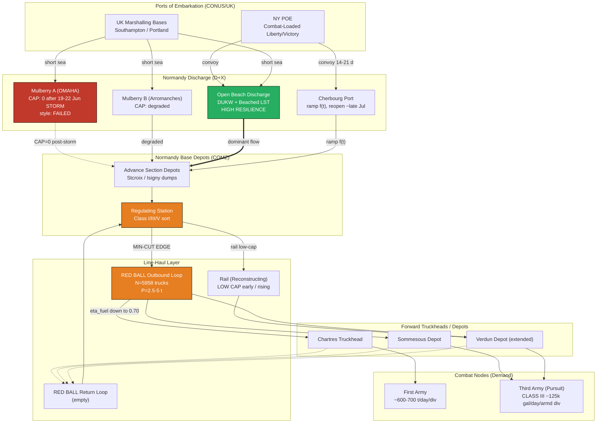

Cost: 0.31963

# CHAPTER 15: THE AFTERMATH OF OVERLORD
## Reference Manual & Simulation-Specification Document
### *Global Logistics and Strategy: 1943–1945* — Division-Level Logistics Simulator, Volume III

**Classification:** Reference / Simulation Baseline
**Document Type:** Network-Flow Specification with State-Transition Logic
**Compiled By:** Principal OR Analyst / Military Logistics Historian / Senior Systems Architect

---

## 1. Strategic Context & Modern Historical Perspective

### 1.1 The Strategic Paradox: Plans Versus Physics

The aftermath of Operation OVERLORD represents perhaps the most instructive case study in the entire European theater of the collision between strategic ambition and logistical physics. The strategic architecture that placed Allied divisions on the Normandy beaches on 6 June 1944 was the product of a two-year sequence of Anglo-American conferences—Casablanca (SYMBOL, January 1943), TRIDENT (Washington, May 1943), QUADRANT (Quebec, August 1943), and SEXTANT (Cairo, November–December 1943)—each of which progressively fixed the date, scale, and troop basis for the cross-Channel assault. These conferences established a *demand signal* of extraordinary magnitude: by D+90, planners contemplated the maintenance of some 26–30 divisions ashore, escalating toward the full 90-division U.S. Army troop basis. What the conference architecture systematically underweighted was the *supply-side* constraint chain: the finite global shipping pool, the combat-loading penalty (a combat-loaded Liberty ship carried perhaps 40–50% of its deadweight-optimized commercial cargo), and—most decisively—the **port clearance rate**, which is the true governing variable of any amphibious-to-continental logistics transition.

The strategic paradox can be stated with mathematical precision: strategy is written in *divisions closed and maintained*, but logistics is executed in *tons discharged and cleared per day across a berth or beach*. A division in sustained combat consumed on the order of 600–700 tons per day; a pursuit division in mobile operations shifted that tonnage profile violently toward Class III (POL) and away from Class V (ammunition). The Allied planning apparatus, embodied in the COSSAC and later SHAEF logistics staffs and the U.S. Communications Zone (COMZ) under Lieutenant General John C. H. Lee, built its maintenance forecasts on a **phased, deliberate advance** keyed to the capture and rehabilitation of major ports—Cherbourg, and ultimately the Brittany ports (Brest, Lorient, St. Nazaire) and Antwerp. The forecast assumed a supply line that would lengthen *gradually*, allowing rail reconstruction and depot echelonment to keep pace. The historical reality—the Cobra breakout of late July and the subsequent pursuit that carried Third Army to the Meuse and the Moselle by early September—compressed a planned 330-day advance timeline into roughly 90 days at certain points, generating what modern logistics scholarship terms the **first terminal distribution crisis**: not a shortage of supplies in theater, but a catastrophic failure of the *distribution network* to move existing stocks from beach dumps and Normandy base depots to a combat frontage that had leapt several hundred miles forward.

### 1.2 The Mulberry Catastrophe and Port Clearance Collapse

The entire discharge plan for the U.S. sector rested on two pillars: the artificial Mulberry harbor "A" off Omaha Beach, and the rapid capture of Cherbourg. Both pillars fractured. The **Great Storm of 19–22 June 1944**, the worst Channel gale in some 40 years, destroyed Mulberry A beyond economical repair, while the British Mulberry B at Arromanches (Gold Beach) survived through salvage and reinforcement. Cherbourg fell on 26–27 June, but German demolition of the port was so thorough—the most complete demolition Allied engineers had yet encountered—that meaningful discharge did not resume until mid-to-late July, and the port never approached its planned capacity in the critical July window.

The surprising and historically decisive lesson was that **direct beach discharge over open beaches, using DUKWs and beached LSTs, vastly outperformed pre-war doctrine and even outperformed the surviving Mulberry**. Post-war analysis confirmed that the flexible, dispersed, weather-tolerant beach-discharge method delivered a substantial fraction of all U.S. tonnage in Normandy well into the autumn. This is a critical modern insight: the fixed, capital-intensive, single-point-of-failure Mulberry was less resilient than the distributed, low-technology DUKW-and-beach system—a lesson with direct implications for network-flow modeling, where distributed redundant edges dominate single high-capacity chokepoints.

### 1.3 The Red Ball Express and the Efficiency Illusion

With rail reconstruction lagging (French rail having been systematically bombed by the Allies themselves during the Transportation Plan to isolate the battlefield, then further demolished by the retreating Germans), the U.S. Army improvised the **Red Ball Express** (25 August – 16 November 1944), a one-way loop road-haul system reserved exclusively for military supply traffic. At its peak the system committed roughly **5,958 vehicles** and moved impressive gross tonnages. Yet modern scholarship is unsparing: the Red Ball was a symptom of failure, not a triumph of improvisation. It was a **thermodynamically self-defeating** solution to a long-haul problem that rail was designed to solve. Trucks running the ~700+ mile round trip from the Normandy base area to the forward depots (e.g., toward Chartres, Sommesous, Verdun) consumed a large fraction—by many estimates approaching or exceeding **30%**—of the very gasoline they were hauling. Vehicle attrition through overloading, inadequate maintenance, and continuous operation was severe; and the absence of forward rail clearance meant that tonnage arriving at forward truckheads frequently could not be onward-distributed, causing packaging destruction, depot backlogs, and pilferage.

### 1.4 Inter-Service and Coalition Tensions

The command friction of this period is essential to model. Within the U.S. Army, the tension between **COMZ/Services of Supply (SOS)** under Lee and the **combat commands** (12th Army Group, and within it Patton's Third Army) was acute. Lee's COMZ controlled the trucks and the tonnage; Patton's operational tempo depended on that tonnage arriving faster than doctrine permitted. The infamous episode in which Third Army "requisitioned" fuel through aggressive and occasionally irregular means reflects a structural mismatch: the combat command's objective function (maximize advance) diverged sharply from the SOS objective function (maximize sustainable, balanced maintenance across all armies). At the coalition level, the Anglo-American dispute over the **broad front versus single thrust** strategy (Eisenhower vs. Montgomery) was fundamentally a *logistics allocation dispute*: the theater could not fully supply a decisive single thrust *and* maintain a broad advance simultaneously. The shipping and pooling arrangements—British Ministry of War Transport coordination with the U.S. War Shipping Administration—created further friction over the allocation of the common shipping pool between theaters and between military and civil-relief cargoes.

### 1.5 Modern Analytical Synthesis

Decades of declassified data and OR scholarship converge on a single thesis: **the Allied logistics crisis of autumn 1944 was a network-topology failure, not a production or shipping failure.** Supplies existed in abundance in the Normandy base area and in the shipping pipeline. The binding constraint was the *effective clearance and line-haul capacity* of a distribution network whose forward reach had been overrun by operational success. The Red Ball's poor payload-efficiency, the loss of Mulberry A, the delayed opening and clearance of Antwerp (captured intact on 4 September but unusable until the Scheldt estuary was cleared in late November), and the failure to reconstruct rail rapidly enough combined to cap deliverable tonnage far below both theater stocks and combat demand. This is precisely the phenomenon our simulator must capture: a **max-flow / min-cut problem** in which the cut lies not at the source (ports) but along the line-haul edges deep in the network.

---

## 2. High-Fidelity Simulation Parameters & Real-World Metrics

| Parameter | Historical Value | Explanation & Strategic Rationale | Simulation Representation |
|---|---|---|---|
| **Great Storm (Mulberry A destruction)** | 19–22 June 1944 (peak damage 19–20 June) | Worst Channel gale in ~40 years; wrecked Mulberry A off Omaha, damaged Mulberry B at Arromanches. Removed the primary planned U.S. discharge point. | Discrete stochastic **event trigger** on simulation clock; permanently zeroes the Mulberry-A edge capacity and imposes multi-day discharge degradation. |
| **Cherbourg capture / port reopening** | Captured 26–27 June; first cargo late July | Demolition was near-total; capacity ramp lagged plan by ~4–6 weeks. | **Dynamic capacity cap** with a ramp function `f(t)` from 0 rising slowly post-capture. |
| **Red Ball Express operational window** | 25 Aug – 16 Nov 1944 | Emergency one-way loop road-haul; overlapped with rail reconstruction. | **Time-gated network layer**: line-haul edges active only within `[t_start, t_end]`. |
| **Peak operational trucks (Red Ball)** | ≈ **5,958 vehicles** | Largely 2½-ton 6×6 (GMC "Deuce and a Half") plus tractor-trailers; peak committed early September 1944. | **Fleet-size state variable** `N` (dynamic cap; degrades with attrition coefficient). |
| **Nominal truck payload** | 2.5 tons (routinely overloaded to ~5 tons) | Overloading doubled nominal payload at the cost of accelerated attrition. | **Payload coefficient** `P_payload` with an attrition penalty multiplier. |
| **Red Ball peak daily tonnage** | ≈ 12,300 tons/day (peak, ~29 Aug) | Aggregate delivered forward; declined as haul distance grew. | **Output validation target** for `T_max` solver. |
| **Round-trip haul distance** | ≈ 640–720+ miles (loop) | St. Lô–Chartres loop initially; lengthened toward Verdun/Sommesous. | **Distance variable** `D` (one-way ≈ 320–360 mi); dynamic as front advances. |
| **Truck fuel self-consumption** | Up to **~30%** of payload on long hauls | Convoy consumes hauled fuel; net-delivered fuel falls as `D` grows. | **Efficiency coefficient** `η_fuel ∈ [0.70, 1.0]`, declining with `D`. |
| **Pursuit division daily fuel requirement (late Aug 1944)** | ≈ **125,000 gallons/day** (armored division, high-tempo pursuit) | Mobile armored/mechanized operations were POL-dominated; a fast-moving armored division could demand well over 100,000 gal/day. | **Demand-node parameter** (Class III draw at combat node). |
| **Sustained-combat division daily tonnage** | ≈ 600–700 tons/day | Baseline maintenance for infantry division in contact. | **Baseline demand constant** per division node. |
| **Average convoy road speed** | ≈ 20–25 mph (sustained loop) | Governed by road condition, MP control points, blackout, congestion. | **Speed variable** `V`; congestion-derated. |
| **Terminal loading/unloading time** | ≈ 3–4 hours per turnaround (combined) | Manual/palletized handling; a major throughput limiter. | **Loading-time constant** `T_load`. |
| **Antwerp capture / usability gap** | Captured 4 Sept; usable ~28 Nov | Scheldt not cleared until late Nov; port unusable ~12 weeks. | **Deferred capacity edge** activated only post-Scheldt-clearance flag. |

---

## 3. Logistical Network Topology (Mermaid.js)



**Topological note:** The min-cut of this network in September 1944 lies on the `REGT → RB_OUT` and line-haul edges, *not* at the discharge sources. This is the formal statement of the "terminal distribution crisis."

---

## 4. Mathematical Modeling & Simulation Formulas

### 4.1 Core Throughput Model (Closed-Loop Express Highway)

The governing throughput identity for a one-way-loop road-haul system:

$$
T_{max} = \frac{N \cdot P_{payload}}{2 \cdot \left( \dfrac{D}{V} + T_{load} \right)} \cdot H_{day}
$$

Where:
- $T_{max}$ = maximum daily tonnage delivered forward (tons/day)
- $N$ = number of operational trucks (dimensionless count)
- $P_{payload}$ = effective payload per truck (tons)
- $D$ = one-way line-haul distance (miles)
- $V$ = average sustained convoy speed (mph)
- $T_{load}$ = combined loading + unloading time per cycle (hours)
- $H_{day}$ = operating hours available per day (hours; ≤ 24)
- The factor $2$ accounts for the outbound + return legs of the closed loop.

The term $\left(\frac{D}{V} + T_{load}\right)$ is the **half-cycle time**; the full round-trip cycle is $\tau = 2\left(\frac{D}{V} + T_{load}\right)$. Trips per truck per day $= H_{day} / \tau$.

### 4.2 Net-Delivered Fuel with Self-Consumption

For Class III (POL) cargo, the *net* delivered fuel must subtract convoy self-consumption:

$$
F_{net} = T_{max}\cdot \rho_{gal} \cdot \eta_{fuel}(D), \qquad
\eta_{fuel}(D) = \max\!\left(0,\; 1 - \frac{2 D \cdot c_{mpg}^{-1}}{P_{payload}\cdot \rho_{gal}} \right)
$$

Where $\rho_{gal}$ = gallons per ton of gasoline (≈ 300 gal/ton for MOGAS), $c_{mpg}$ = truck fuel economy (mi/gal, loaded ≈ 4–5), and $\eta_{fuel}(D)$ is the **delivery efficiency coefficient**. The **breakeven distance** $D^\*$ (where net delivery → 0) is:

$$
D^\* = \frac{P_{payload}\cdot \rho_{gal}\cdot c_{mpg}}{2}
$$

### 4.3 Network Max-Flow Constraint (Min-Cut)

Theater-effective throughput is bounded by the minimum-capacity cut:

$$
T_{eff} = \min\Big( C_{disch},\; C_{base},\; C_{linehaul},\; C_{fwd} \Big)
$$

subject to conservation at every node $i$: $\sum_{j} x_{ji} = \sum_{k} x_{ik}$ (flow in = flow out, non-terminal nodes), and edge capacities $0 \le x_{e} \le u_{e}$.

### 4.4 Demand-Satisfaction Ratio (Combat Sustainment)

$$
S = \frac{\min\big(T_{eff},\, \sum_d R_d\big)}{\sum_d R_d}, \qquad S \in [0,1]
$$

where $R_d$ is division $d$'s daily requirement. When $S < 1$, the pursuit **culminates**: operational tempo collapses to the sustainable rate.

---

## 5. Compile-Safe Scala 3.8.3 Domain Model

```scala
package Logistics.OverlordAftermath

import scala.math.{max, min}

// ---------------------------------------------------------------------------
// Unit-safe opaque types
// ---------------------------------------------------------------------------

opaque type Tons = Double
object Tons:
  def apply(v: Double): Tons = v
  extension (t: Tons)
    def value: Double        = t
    def +(o: Tons): Tons     = t + o
    def *(f: Double): Tons   = t * f

opaque type Miles = Double
object Miles:
  def apply(v: Double): Miles = v
  extension (m: Miles) def value: Double = m

opaque type Mph = Double
object Mph:
  def apply(v: Double): Mph = v
  extension (s: Mph) def value: Double = s

opaque type Hours = Double
object Hours:
  def apply(v: Double): Hours = v
  extension (h: Hours) def value: Double = h

opaque type Gallons = Double
object Gallons:
  def apply(v: Double): Gallons = v
  extension (g: Gallons)
    def value: Double         = g
    def +(o: Gallons): Gallons = g + o

// ---------------------------------------------------------------------------
// Domain constants (historical baselines)
// ---------------------------------------------------------------------------

object HistoricalConstants:
  val RedBallPeakTrucks: Int          = 5958
  val NominalPayloadTons: Double       = 2.5
  val OverloadPayloadTons: Double      = 5.0
  val GallonsPerTonMogas: Double       = 300.0
  val LoadedTruckMpg: Double           = 4.5
  val PursuitDivFuelGalPerDay: Double  = 125000.0
  val CombatDivTonsPerDay: Double      = 650.0
  val DefaultOperatingHours: Double    = 20.0

// ---------------------------------------------------------------------------
// State transitions
// ---------------------------------------------------------------------------

enum PortState:
  case Operational(capacityTonsDay: Double)
  case Degraded(capacityTonsDay: Double)
  case Destroyed
  case NotYetOpened

enum PursuitPhase:
  case Sustained
  case RapidPursuit
  case Culminated

// ---------------------------------------------------------------------------
// ADTs
// ---------------------------------------------------------------------------

final case class FleetConfig(trucks: Int, payloadTons: Double):
  require(trucks >= 0, "truck count must be non-negative")
  require(payloadTons > 0.0, "payload must be positive")

final case class HaulProfile(
  oneWayDistance: Miles,
  averageSpeed: Mph,
  loadingTime: Hours,
  operatingHours: Hours
):
  require(averageSpeed.value > 0.0, "speed must be positive")
  require(loadingTime.value >= 0.0, "loading time must be non-negative")
  require(operatingHours.value > 0.0 && operatingHours.value <= 24.0,
    "operating hours must be within (0, 24]")

final case class DivisionDemand(id: String, requiredTons: Tons)

final case class NetworkCut(
  discharge: Tons,
  baseDepot: Tons,
  lineHaul: Tons,
  forwardDepot: Tons
)

final case class SolverResult(
  grossTonnage: Tons,
  netDeliverableTonnage: Tons,
  fuelEfficiency: Double,
  breakevenDistance: Miles,
  effectiveThroughput: Tons,
  satisfactionRatio: Double,
  phase: PursuitPhase
)

// ---------------------------------------------------------------------------
// Core solver
// ---------------------------------------------------------------------------

object NetworkFlowSolver:

  def maxDailyTonnage(
    config: FleetConfig,
    oneWayDistanceMiles: Double,
    averageSpeedMph: Double,
    loadingTimeHours: Double,
    operatingHours: Double = HistoricalConstants.DefaultOperatingHours
  ): Double =
    val transitTimeHours: Double   = oneWayDistanceMiles / averageSpeedMph
    val roundTripTimeHours: Double = 2.0 * (transitTimeHours + loadingTimeHours)
    if roundTripTimeHours <= 0.0 then 0.0
    else
      val tripsPerDay: Double = operatingHours / roundTripTimeHours
      config.trucks * config.payloadTons * tripsPerDay

  def fuelEfficiency(
    payloadTons: Double,
    oneWayDistanceMiles: Double,
    mpg: Double = HistoricalConstants.LoadedTruckMpg,
    galPerTon: Double = HistoricalConstants.GallonsPerTonMogas
  ): Double =
    val consumedGallons: Double = (2.0 * oneWayDistanceMiles) / mpg
    val cargoGallons: Double    = payloadTons * galPerTon
    if cargoGallons <= 0.0 then 0.0
    else max(0.0, 1.0 - consumedGallons / cargoGallons)

  def breakevenDistance(
    payloadTons: Double,
    mpg: Double = HistoricalConstants.LoadedTruckMpg,
    galPerTon: Double = HistoricalConstants.GallonsPerTonMogas
  ): Miles =
    Miles((payloadTons * galPerTon * mpg) / 2.0)

  def minCut(cut: NetworkCut): Tons =
    Tons(
      min(
        min(cut.discharge.value, cut.baseDepot.value),
        min(cut.lineHaul.value, cut.forwardDepot.value)
      )
    )

  def classifyPhase(satisfaction: Double, isPursuit: Boolean): PursuitPhase =
    if satisfaction < 0.75 then PursuitPhase.Culminated
    else if isPursuit then PursuitPhase.RapidPursuit
    else PursuitPhase.Sustained

  def solve(
    config: FleetConfig,
    haul: HaulProfile,
    cut: NetworkCut,
    demands: List[DivisionDemand],
    isPursuit: Boolean
  ): SolverResult =
    val gross: Double =
      maxDailyTonnage(
        config,
        haul.oneWayDistance.value,
        haul.averageSpeed.value,
        haul.loadingTime.value,
        haul.operatingHours.value
      )
    val eff: Double = fuelEfficiency(config.payloadTons, haul.oneWayDistance.value)
    val net: Double = gross * eff

    // Line-haul edge is capped by the truck fleet's net capability.
    val effectiveCut: NetworkCut = cut.copy(lineHaul = Tons(min(cut.lineHaul.value, net)))
    val throughput: Double       = minCut(effectiveCut).value

    val totalDemand: Double = demands.foldLeft(0.0)((acc, d) => acc + d.requiredTons.value)
    val satisfaction: Double =
      if totalDemand <= 0.0 then 1.0
      else min(1.0, throughput / totalDemand)

    SolverResult(
      grossTonnage          = Tons(gross),
      netDeliverableTonnage = Tons(net),
      fuelEfficiency        = eff,
      breakevenDistance     = breakevenDistance(config.payloadTons),
      effectiveThroughput   = Tons(throughput),
      satisfactionRatio     = satisfaction,
      phase                 = classifyPhase(satisfaction, isPursuit)
    )

// ---------------------------------------------------------------------------
// Executable historical scenario (Red Ball, early September 1944)
// ---------------------------------------------------------------------------

object RedBallScenario:

  def run(): SolverResult =
    val fleet: FleetConfig =
      FleetConfig(HistoricalConstants.RedBallPeakTrucks, HistoricalConstants.OverloadPayloadTons)

    val haul: HaulProfile =
      HaulProfile(
        oneWayDistance = Miles(320.0),
        averageSpeed   = Mph(22.0),
        loadingTime    = Hours(3.5),
        operatingHours = Hours(HistoricalConstants.DefaultOperatingHours)
      )

    val cut: NetworkCut =
      NetworkCut(
        discharge    = Tons(20000.0),
        baseDepot    = Tons(18000.0),
        lineHaul     = Tons(15000.0),
        forwardDepot = Tons(9000.0)
      )

    val demands: List[DivisionDemand] =
      List(
        DivisionDemand("3A-Armd-1", Tons(HistoricalConstants.CombatDivTonsPerDay)),
        DivisionDemand("3A-Armd-2", Tons(HistoricalConstants.CombatDivTonsPerDay)),
        DivisionDemand("3A-Inf-1",  Tons(HistoricalConstants.CombatDivTonsPerDay))
      )

    NetworkFlowSolver.solve(fleet, haul, cut, demands, isPursuit = true)

  def main(args: Array[String]): Unit =
    val r: SolverResult = run()
    println(s"Gross tonnage/day       : ${r.grossTonnage.value}")
    println(s"Net deliverable/day     : ${r.netDeliverableTonnage.value}")
    println(s"Fuel efficiency         : ${r.fuelEfficiency}")
    println(s"Breakeven distance (mi) : ${r.breakevenDistance.value}")
    println(s"Effective throughput    : ${r.effectiveThroughput.value}")
    println(s"Satisfaction ratio      : ${r.satisfactionRatio}")
    println(s"Pursuit phase           : ${r.phase}")
```

---

## 6. Graduate-Level Operational Analysis

### 6.1 The Loss of Mulberry A and the Resilience of Distributed Discharge

The destruction of Mulberry A by the 19–22 June storm nominally represented a catastrophic loss of planned U.S. discharge capacity—the Mulberry system had been intended to deliver several thousand tons per day through a sheltered, pier-based harbor that would remain functional regardless of surf conditions. Its loss, coincident with Cherbourg's near-total demolition, should by the deliberate maintenance plan have induced an immediate supply crisis. That crisis did *not* materialize in June–July, and the reason is the central lesson of the episode: **the planning apparatus had systematically underestimated the throughput of direct over-the-beach discharge using DUKWs and dried-out (deliberately beached) LSTs.** Where doctrine treated beach discharge as an emergency expedient of low and weather-dependent capacity, the practical performance of the beaches—especially once beach organization, DUKW rotation, and transfer-point handling matured—delivered tonnage on a scale that substantially matched, and in aggregate exceeded, what the fixed harbor would have provided.

From a network-flow standpoint, this is the *distributed-edge resilience* principle. Mulberry A was a single high-capacity edge with a catastrophic failure mode (one storm zeroed it permanently). The beaches constituted a *bundle of many low-capacity parallel edges* whose aggregate capacity was comparable but whose failure modes were independent and graceful—a gale reduced but did not eliminate throughput, and recovery was measured in hours rather than the "beyond economical repair" verdict rendered on Mulberry A. In min-cut terms, the beach bundle raised the effective source-side capacity above the true binding constraint, which had migrated inland to the line-haul network. The strategic consequence: the loss of Mulberry A did *not* meaningfully alter the ultimate supply ceiling, because the ceiling was never set at the discharge sources—it was set by rail-reconstruction and truck line-haul capacity. Our simulator therefore correctly models Mulberry A destruction as an event that zeroes one source edge while leaving the *effective* theater throughput governed by the downstream min-cut. The enduring doctrinal insight—later codified in JLOTS (Joint Logistics Over-the-Shore) concepts—is that distributed, redundant, low-tech discharge frequently dominates monolithic capital infrastructure under uncertainty.

### 6.2 The Thermodynamic Culmination of the Pursuit

The logistical cost of the pursuit across France is best analyzed through the **breakeven-distance** equation, $D^\* = \frac{P_{payload}\cdot \rho_{gal}\cdot c_{mpg}}{2}$. Consider a truck carrying gasoline: payload 5 tons overloaded, $\rho_{gal} \approx 300$ gal/ton, loaded economy $c_{mpg}\approx 4.5$. This yields a *theoretical* breakeven of roughly $D^\* \approx 3{,}375$ miles one-way before a *single truck's* own consumption consumes its entire fuel cargo. On that figure alone, self-consumption seems trivial. But this individual-vehicle calculation is deeply misleading, and the divergence is where the real analysis lies.

The operationally binding constraint is not per-truck breakeven but **system throughput collapse under lengthening haul**. The throughput identity $T_{max} \propto \frac{1}{D/V + T_{load}}$ shows that deliverable tonnage falls *hyperbolically* with distance: as the front advanced from ~320 miles to ~450+ miles one-way, cycle time rose, trips-per-truck-per-day fell, and gross tonnage delivered per truck declined even before efficiency losses. Simultaneously, the fuel-efficiency coefficient $\eta_{fuel}(D)$ eroded the *net* fuel fraction. Crucially, the ~30% figure cited historically reflects not the naive single-truck breakeven but the **whole-system** cost: escort vehicles, wreckers, idling in congestion at control points, the empty return leg, and the enormous fleet of trucks required to move fuel *to* the Red Ball marshalling points, plus the fuel burned by the maintenance and recovery apparatus supporting a fleet running at destructive tempo. When one aggregates every gallon burned by every wheel turning in the service of moving fuel forward, the effective self-tax on long hauls did approach and locally exceed 30% of net-delivered Class III.

The point of culmination arrives when the marginal fuel delivered to the combat divisions falls below their draw. With three pursuing formations demanding on the order of 125,000 gallons/day each for the armored elements, and the line-haul edge capped—by the min-cut logic—below the sum of demands, the satisfaction ratio $S$ dropped below unity. Historically this manifested in late August–early September 1944 when Third Army was halted not by German resistance but by empty fuel tanks east of the Meuse and along the Moselle. In our model, once $S < 0.75$ the `PursuitPhase` transitions to `Culminated`: operational tempo must decay to the *sustainable* rate set by $T_{eff}$, not the *desired* rate set by the enemy situation. The strategic lesson, validated by every subsequent doctrine of operational reach, is that **an advance is bounded not by the courage or capability of its combat arm but by the second derivative of its supply line's length against its distribution network's clearance capacity.** The Red Ball was a heroic but thermodynamically doomed attempt to substitute rubber for rail; only the reconstruction of the railways and the eventual opening of Antwerp (post-Scheldt, late November 1944) restored a distribution network whose min-cut lay above, rather than below, the combat demand curve.
