Cost: 0.4424175

## 1. Strategic Context & Modern Historical Perspective

The aftermath of OVERLORD exposed a central paradox of industrial warfare: strategic success could create a logistical crisis faster than logistical success could resolve it. The Allied armies landed in Normandy on 6 June 1944 with a supply system designed around forecast phase lines, scheduled port acquisitions, carefully sequenced depot construction, and a relatively predictable rate of advance. That system performed remarkably well during the assault and lodgment phases. It became progressively less suitable after the German position in Normandy collapsed and Allied formations began moving rapidly eastward across France.

The resulting crisis was not principally a shortage of matériel in the United States or Britain. Nor was it simply a shortage of ships. By August 1944, substantial quantities of supplies existed in theater or were approaching European waters. The problem was the conversion of strategic inventory into usable combat power at the front. Every stage—ocean transport, discharge, beach clearance, port rehabilitation, depot handling, rail movement, truck movement, unit distribution, and empty-container return—had its own capacity, latency, and failure modes. The effective throughput of the whole system was governed by its most restrictive active bottleneck.

### The strategic paradox

The major Allied conferences—Casablanca, TRIDENT, QUADRANT, and SEXTANT—treated shipping, landing craft, port capacity, and theater construction resources as strategic variables. They were not secondary administrative concerns. Decisions concerning OVERLORD, Mediterranean operations, the Pacific offensives, aid to the Soviet Union, and support for China all competed for finite cargo shipping, tankers, escorts, landing craft, service troops, and specialized engineering equipment.

Casablanca in January 1943 confirmed the priority of defeating Germany but did not eliminate competing demands. TRIDENT in May 1943 established the conceptual basis for a cross-Channel attack in 1944, while QUADRANT in August refined the buildup and target date. SEXTANT, held at Cairo late in 1943, again confronted global allocations. At each stage, strategic plans tended to express requirements as divisions deployed, assault lift available, or tonnages accumulated. The physical system, however, operated through lower-level constraints: hatch availability, crane cycles, lighterage, tidal windows, beach gradients, truck turnaround time, rail reconstruction, and port clearance.

An ocean-going vessel arriving in the United Kingdom or off Normandy did not itself constitute delivered supply. Cargo had to be stowed in a way compatible with its intended discharge sequence. Combat loading improved immediate tactical access but used ship cube and deadweight less efficiently than commercial loading. Selective unloading could immobilize scarce shipping while crews searched multiple holds for high-priority items. Even when cargo was unloaded rapidly, it could accumulate in port transit sheds or beach dumps if clearance capacity lagged discharge capacity.

The assault plan attempted to reduce dependence on captured ports through artificial harbors, open-beach discharge, coasters, DUKWs, landing ships, Rhino ferries, and offshore breakwaters. This was not an expectation that beaches would permanently replace ports. It was a risk-control measure intended to sustain the lodgment until Cherbourg and later ports became productive. The plan nevertheless rested on a schedule: beaches and Mulberries would carry the early burden; Cherbourg would become available after capture and repair; Brittany ports would provide large-volume capacity; and continental railways would move supplies from ports toward increasingly distant armies.

Operational events invalidated much of this sequence. Cherbourg was not captured until 26 June and had been comprehensively demolished by the Germans. Brittany ports were bypassed, destroyed, or rendered strategically inconvenient by the eastward direction of the campaign. Antwerp was captured with its port installations largely intact on 4 September, but it could not be used until the Scheldt approaches were cleared and opened to shipping in late November. Thus the Allies possessed ample strategic resources while lacking an adequately positioned, high-capacity continental intake and clearance system.

### The storm and the artificial harbors

The Channel storm beginning on 19 June 1944 and continuing through approximately 22 June was the first major disruption. It wrecked the American Mulberry A off Omaha Beach. The harbor had already suffered from incomplete assembly, difficult exposure, and differences in siting and shelter compared with the British Mulberry B at Arromanches. After the storm, the Americans chose not to reconstruct Mulberry A. Salvageable components were used elsewhere, including reinforcement of the British harbor.

The loss was serious because it removed planned sheltered discharge capacity during the early buildup. Its effects should not, however, be modeled as the total closure of Omaha. Open-beach operations proved substantially more productive and resilient than many planners had expected. DUKWs carried cargo directly from ships or lighters to inland dumps. LSTs and other landing craft dried out on suitable beaches. Rhino ferries and barges moved vehicles and stores ashore. Naval beach battalions, engineer special brigades, quartermaster units, and transportation personnel developed increasingly effective routines for controlling anchorages, assigning craft, marking beach exits, and clearing cargo inland.

This distinction is important in simulation. The storm destroyed a specific engineered transshipment facility; it did not destroy the entire beach logistics system. Weather simultaneously reduced lighterage productivity, increased cargo loss and damage, disrupted unloading cycles, and forced ships to remain offshore, but beach throughput recovered. The historical outcome demonstrates the value of redundant modes that are individually inefficient but collectively resilient.

### Cherbourg and the port-clearance problem

Cherbourg’s delayed capture and rehabilitation compounded the loss of Mulberry A. The Germans demolished cranes, blocked entrances, mined waters, damaged quays, and sank vessels in the harbor. Allied engineers and naval salvage units restored the port incrementally, but its useful output lagged planning assumptions.

Moreover, gross port discharge did not equal effective theater delivery. Cargo could cross a ship’s rail and still fail to contribute to operations if it remained on a quay, in a transit shed, or in a depot lacking sorting and onward transport. Port clearance therefore had to be represented as a separate capacity from port discharge. Rail lines needed repair, rolling stock had to be found, locomotives required coal and maintenance, bridges had to be reconstructed, and movement-control organizations had to coordinate priorities. Where rail clearance was weak, trucks were diverted to short-haul port work, reducing the fleet available for long-distance movement.

Modern systems analysis characterizes this as coupled-queue behavior. Increasing discharge into a congested port can reduce overall performance by saturating storage, blocking handling space, and creating unproductive rehandling. The correct objective is not maximum unloading at one node, but maximum sustained delivery to demand nodes without destabilizing intermediate inventories.

### Breakout and the terminal-distribution crisis

The Allied logistics system had been built for a measured expansion of the lodgment. The German collapse following COBRA instead produced rapid movement across France. Third Army became the most visible example, but the difficulty affected the entire northern advance. Depots that had been geographically appropriate in July were hundreds of miles behind leading formations by late August. Truck turnaround times increased nonlinearly because the same vehicles had to travel farther, spend longer at loading and unloading points, negotiate damaged roads, and return empty for another load.

This was a terminal-distribution crisis: substantial supply existed within the theater, yet the “last” operational segment—from continental depots to army and division distribution points—could not reliably convert rear inventory into forward availability. The term “terminal” should not be interpreted literally as only the final few miles. It encompassed the entire rapidly lengthening road pipeline beyond the practical reach of railheads and intermediate depots.

Fuel was especially sensitive because mobility consumed the resource needed to sustain mobility. Armored vehicles, artillery tractors, engineer equipment, reconnaissance units, and supply trucks all competed for gasoline. A division in active pursuit could require on the order of 100,000 gallons per day, though actual demand varied sharply with division type, terrain, tactical mileage, idling, detours, and combat intensity. Supply trucks themselves consumed a significant share of the fuel moving through the system. Contemporary and later estimates commonly place road-distribution self-consumption on long routes as high as roughly 30 percent of the fuel payload under adverse operating conditions. That percentage should be treated as a route-dependent coefficient, not a universal Red Ball constant.

The famous Red Ball Express, opened on 25 August 1944, was an emergency response to this geometric extension of the supply line. It used a regulated, one-way loop: loaded vehicles moved east on an outbound route, and empty vehicles returned on a separate route. Civilian traffic was restricted, intersections were controlled, maintenance points were established, and trucks were expected to move around the clock. At peak commitment, approximately 5,958 vehicles were assigned or operating within the system.

Red Ball was operationally indispensable but economically inefficient. Trucks were diverted from army and division allocations; drivers were overworked; preventive maintenance declined; overloading damaged vehicles and roads; backhaul capacity was poorly utilized; and many vehicles waited at depots or terminals. Nominal fleet strength therefore overstated productive fleet availability. In a simulator, trucks undergoing repair, waiting for cargo, queueing for unloading, lost, misrouted, or lacking drivers must be removed from effective fleet strength.

Between 25 August and 16 November, Red Ball moved approximately 412,000 tons, averaging roughly 5,000 tons per day across its life. Peak daily movement was much higher—about 12,342 tons on 29 August—but peak output was not a sustainable average. These figures illustrate the danger of using a single maximum as a continuous capacity.

### Coalition and inter-service tensions

The campaign’s logistical friction also had institutional origins. In the United States Army, the Services of Supply—renamed the Communications Zone in the European theater—sought orderly depot systems, inventory accountability, maintenance discipline, and balanced theater development. Army group and field army commanders emphasized immediate tactical delivery. From the combat commander’s perspective, supplies in a rear depot were irrelevant if they could not reach advancing units. From the logistician’s perspective, emergency diversions and priority changes disrupted the pipeline, generated unbalanced stocks, and sacrificed future throughput for immediate gain.

This conflict was structural, not merely personal. Combat commands optimized local operational momentum; the Communications Zone had to optimize a multi-army network over time. Priority to fuel could leave ammunition, bridging equipment, rations, replacement vehicles, winter clothing, and spare parts behind. Priority to one army necessarily constrained another when trucks, rail capacity, and forward depots were shared.

Army-Navy relationships also mattered. Naval authorities controlled ship movements, anchorages, landing craft, harbor clearance, and aspects of discharge. Army organizations controlled much of the inland movement and depot system. A discharge plan that was efficient for ships could overload beaches or ports; a shore plan that minimized inland congestion might require vessels to remain idle offshore. Effective throughput demanded joint scheduling.

Anglo-American pooling arrangements created a further layer of tension. Britain supplied ports, railways, coastal shipping, labor, and much of the staging infrastructure for the cross-Channel attack. The Combined Chiefs allocated shipping and landing craft globally. Although pooling improved aggregate utilization, national accounting, differing equipment standards, vehicle types, maintenance systems, and strategic priorities prevented frictionless interchangeability. “Combined” resources still had national constraints.

### Modern assessment

Later scholarship has moderated both triumphalist and overly critical interpretations. The supply crisis was not proof that Allied logistics had failed. The armies had advanced beyond the timetable for which the network had been designed, while the ports expected to support that advance were unavailable or badly positioned. Nor was Red Ball a self-contained miracle. It was an emergency bridge between beach and port resources in Normandy and a front moving toward Belgium and Germany.

The decisive modern insight is that logistics capacity is a network property. The Allies possessed abundant aggregate resources, but throughput was constrained by node location, turnaround time, clearance capacity, vehicle serviceability, commodity compatibility, and information delay. The correct simulation model is therefore a dynamic, multi-commodity network with queues, losses, inventory states, mode substitution, and event-driven capacity changes—not a single theater tonnage pool.

---

## 2. High-Fidelity Simulation Parameters & Real-World Metrics

Historical figures vary according to whether sources count vehicles assigned, vehicles dispatched, cargo accepted, cargo discharged, or cargo delivered. The following values should therefore include provenance and confidence fields in the database.

| Parameter | Historical value | Date or period | Simulation representation | Historical and operational interpretation |
|---|---:|---|---|---|
| OVERLORD landings | 6 June 1944 | D-Day | Scenario start event | Establishes the initial continental network, beach nodes, assault inventories, and restricted discharge conditions. |
| Severe Channel storm begins | **19 June 1944** | 19–22 June 1944 | Event-driven capacity shock | The storm began on 19 June and persisted for roughly three days. Weather should reduce offshore discharge, lighterage availability, vessel station-keeping, and road/beach efficiency. |
| Omaha artificial harbor loss | Mulberry A effectively destroyed | 19–22 June 1944 | Permanent node-state transition | Transition `Operational → StormClosed → Abandoned`. Do not set Omaha beach throughput to zero; only remove the Mulberry-specific sheltered transshipment capacity. |
| British artificial harbor | Mulberry B survives and remains useful | June–November 1944 | Degraded but recoverable node | Arromanches benefits from better shelter and repair. Salvaged American components may increase its post-storm capacity. |
| Capture of Cherbourg | 26 June 1944 | D+20 | Port-capture event | Capture does not immediately create capacity. Trigger demolition-clearance, mine-clearance, salvage, dredging, and reconstruction queues. |
| Red Ball Express opens | 25 August 1944 | 25 August–16 November | Corridor activation event | Activates a controlled one-way outbound and separate return route with restricted civilian access and assigned maintenance points. |
| Peak Red Ball vehicle commitment | **5,958 trucks/vehicles** | Late August 1944, commonly associated with 29 August | Dynamic fleet ceiling | Use as peak assigned strength, not automatically as serviceable or moving strength. Effective fleet is `assigned × serviceability × driver availability × dispatch factor`. |
| Peak Red Ball daily tonnage | Approximately **12,342 short tons** | 29 August 1944 | Observed peak calibration target | A burst-performance validation value. It should not be treated as the sustainable daily average. |
| Total Red Ball tonnage | Approximately **412,193 short tons** | 25 August–16 November 1944 | Campaign validation total | Useful for validating cumulative output after breakdowns, queueing, route extension, and variable demand are modeled. |
| Red Ball life-cycle average | Approximately **5,088 short tons/day** | 81-day operating period | Long-run calibration statistic | Derived from total tonnage divided by operating days. Differences between peak and average quantify availability and congestion losses. |
| Pursuit-division daily fuel requirement | **Approximately 100,000 US gallons/day per division** | Late August 1944 | Stochastic demand baseline | Use as a high-tempo pursuit demand reference, not a universal fixed allowance. Apply division-type, movement, terrain, combat, and idling multipliers. |
| Long-haul truck fuel self-consumption | Up to approximately **30% of gross fuel payload** | Extended late-August routes | Route efficiency coefficient | Model dynamically from distance, truck fuel economy, load, detours, idling, and return movement. Thirty percent is an adverse long-haul calibration case, not a constant for all cargo. |
| Nominal 2½-ton truck payload | 2.5 short tons | Standard rating | Rated payload constant | Actual loads often exceeded rating. Overloading should increase immediate payload but accelerate breakdowns, tire wear, braking failures, and road damage. |
| Typical effective payload assumption | 2.0–2.5 short tons | Route dependent | Dynamic payload | Reduce for bulky cargo, poor loading discipline, packaging, mixed consignments, or volume-limited loads. |
| Red Ball nominal speed regulation | Approximately 25 mph maximum convoy speed | 1944 corridor operations | Speed cap | Effective average speed should be lower after stops, darkness, congestion, maintenance, intersections, and route-control delays. |
| Practical average road speed | Approximately 15–20 mph | Long-haul operations | Dynamic arc speed | Apply road condition, weather, traffic, blackout, fatigue, and vehicle-condition multipliers. |
| Truck serviceability | Scenario-dependent, often 0.65–0.85 effective availability | Sustained operations | Availability coefficient | Separates vehicles assigned from vehicles capable of completing a dispatch cycle. Emergency operations tend to reduce this coefficient over time. |
| Depot loading time | 1–4 hours per dispatch cycle | Facility dependent | Queue/service-time distribution | Includes marshalling, documentation, cargo assembly, loading, and departure control. Use a distribution rather than a single deterministic delay. |
| Forward unloading time | 1–6 hours or more under congestion | Facility dependent | Terminal queue variable | Inadequate labor, forklifts, lighting, hardstand, and sorting increase vehicle detention and reduce corridor throughput. |
| Open-beach operational mode | DUKWs, lighters, Rhino ferries, LST drying | June–autumn 1944 | Parallel modal arcs | Model each mode independently so weather or craft loss does not impose an unrealistic total shutdown. |
| Antwerp captured | 4 September 1944 | September 1944 | Captured-but-blocked port state | Port infrastructure remained largely intact, but the Scheldt approaches prevented immediate use. |
| Antwerp available to shipping | 28 November 1944, first convoy arrival | Late November 1944 | Strategic capacity release | A delayed high-capacity port activation event after clearance of the Scheldt and mine-sweeping. |
| Packaging and handling loss | Suggested baseline 0.5–2%; higher under congestion | Variable | Loss/damage coefficient | Covers torn packaging, weather exposure, pilferage, misrouting, and repeated handling. Commodity-specific coefficients are preferable. |
| Empty-return utilization | Usually low on emergency express routes | Route dependent | Backhaul coefficient | Allow salvage, casualties, prisoners, repairable equipment, and reusable containers as backhaul, but do not assume full utilization. |

### Recommended database treatment of the three required constants

1. **Storm date:** Store `1944-06-19` as the event start and `1944-06-22` as the nominal end of the severe-weather interval. The Mulberry A destruction should be a permanent infrastructure transition following event resolution.
2. **Peak Red Ball trucks:** Store `5,958` as `peak_assigned_vehicles`. Derive moving vehicles from availability rather than using 5,958 directly in the throughput equation.
3. **Pursuit division fuel requirement:** Store `100,000 US gal/day` as a doctrine-independent calibration baseline with a confidence range, preferably `75,000–125,000`, and calculate realized demand from unit activity.

---

## 3. Logistical Network Topology

```mermaid
flowchart LR
  subgraph CONUS["North American Production and Ports of Embarkation"]
    PROD["Factories and depots<br/>Vehicles, ammunition, rations, POL"]
    NYPOE["New York POE<br/>Cargo assembly and documentation"]
    HAMP["Hampton Roads POE"]
    GULF["Gulf and tanker terminals"]
    PROD -->|"Rail and inland waterway capacity"| NYPOE
    PROD -->|"Rail capacity"| HAMP
    PROD -->|"Bulk POL"| GULF
  end

  subgraph ATL["Atlantic Strategic Lift"]
    DRY["Dry-cargo convoy pool<br/>Constraint: ships, escorts, berths"]
    TANK["Tanker pool<br/>Constraint: tanker allocation"]
    COAST["Coasters and landing ships<br/>Constraint: craft availability"]
    NYPOE -->|"Combat-loaded and commodity-loaded cargo"| DRY
    HAMP -->|"Dry cargo and vehicles"| DRY
    GULF -->|"Bulk petroleum"| TANK
  end

  subgraph UK["United Kingdom Base and Cross-Channel Staging"]
    UKPORT["British deep-water ports<br/>Discharge and port clearance queues"]
    UKDEPOT["UK depots and marshalling areas"]
    UKPOL["UK petroleum storage"]
    MARSHAL["Embarkation and sailing-control areas"]
    DRY --> UKPORT
    TANK --> UKPOL
    UKPORT -->|"Rail and road clearance"| UKDEPOT
    UKDEPOT --> MARSHAL
    UKPOL --> MARSHAL
    MARSHAL -->|"Coasters, LSTs, Liberty ships, landing craft"| COAST
  end

  subgraph NORM["Normandy Intake System"]
    OMAHAOFF["Omaha offshore anchorage<br/>Weather-sensitive queue"]
    MUL_A["Mulberry A<br/>Destroyed after 19 June storm"]
    OMAHAB["Omaha open beach<br/>DUKW, Rhino ferry, LST drying"]
    UTAHB["Utah open beach"]
    ARRO["Mulberry B at Arromanches<br/>Repairable sheltered capacity"]
    CHER["Cherbourg<br/>Capture 26 June<br/>Demolition and salvage delay"]
    COAST --> OMAHAOFF
    OMAHAOFF -->|"Planned sheltered route<br/>capacity becomes zero"| MUL_A
    OMAHAOFF -->|"Alternative lighterage route<br/>weather-dependent"| OMAHAB
    COAST --> UTAHB
    COAST --> ARRO
    DRY -->|"Deep-draft arrivals after rehabilitation"| CHER
    TANK -->|"POL discharge after rehabilitation"| CHER
  end

  STORM{{"19-22 June storm<br/>reduces lighterage and beach rates"}}
  STORM -.->|"Permanent destruction"| MUL_A
  STORM -.->|"Temporary degradation"| OMAHAB
  STORM -.->|"Temporary degradation"| UTAHB
  STORM -.->|"Damage followed by repair"| ARRO

  subgraph BASE["Continental Base and Depot Layer"]
    BDEPOT["Normandy base depots<br/>Inventory, sorting, packaging loss"]
    POLDEPOT["POL depots and jerrican filling points"]
    AMMODEPOT["Ammunition depots<br/>Safety and segregation constraints"]
    RAILHEAD["Reconstructed railheads<br/>Locomotive and bridge constraints"]
    MAINT["Truck maintenance and replacement pool"]
    OMAHAB -->|"Beach-clearance trucks"| BDEPOT
    UTAHB -->|"Beach-clearance trucks"| BDEPOT
    ARRO -->|"Road clearance"| BDEPOT
    CHER -->|"Port clearance queue"| BDEPOT
    CHER -->|"Rail clearance when restored"| RAILHEAD
    BDEPOT --> POLDEPOT
    BDEPOT --> AMMODEPOT
    BDEPOT --> RAILHEAD
    MAINT -->|"Serviceable vehicles"| BDEPOT
  end

  subgraph REDBALL["Closed-Loop Red Ball Express"]
    LOAD["Outbound loading terminal<br/>Queue: cargo assembly and truck loading"]
    OUT1["Controlled outbound highway<br/>Road-capacity and speed constraint"]
    RELAY["Relay, rest, refuel, and maintenance points"]
    FWD["Forward regulating depot<br/>Unloading and sorting queue"]
    RET1["Controlled empty-return highway<br/>Separate one-way route"]
    REPAIR["Recovery and field repair<br/>Breakdown attrition"]
    BDEPOT --> LOAD
    POLDEPOT --> LOAD
    AMMODEPOT --> LOAD
    LOAD -->|"Loaded trucks<br/>dry cargo, POL, ammunition"| OUT1
    OUT1 --> RELAY
    RELAY --> FWD
    FWD -->|"Empty trucks and limited backhaul"| RET1
    RET1 --> LOAD
    OUT1 -.->|"Breakdowns"| REPAIR
    RET1 -.->|"Breakdowns"| REPAIR
    REPAIR -->|"Restored vehicles after delay"| MAINT
  end

  subgraph FRONT["Army and Division Distribution"]
    FIRST["First Army depots and army roadheads"]
    THIRD["Third Army depots and army roadheads"]
    NINTH["Ninth Army buildup nodes"]
    DIVI["Infantry divisions<br/>Rations, ammunition, replacement vehicles"]
    DIVA["Armored divisions<br/>High POL and maintenance demand"]
    CORPS["Corps artillery and engineer groups"]
    FWD -->|"Priority allocation"| FIRST
    FWD -->|"Priority allocation"| THIRD
    FWD -->|"Priority allocation"| NINTH
    RAILHEAD -->|"Lower-cost mass movement when available"| FIRST
    RAILHEAD -->|"Railhead extension"| THIRD
    FIRST --> DIVI
    FIRST --> CORPS
    THIRD --> DIVA
    THIRD --> CORPS
    NINTH --> DIVI
  end

  subgraph ALT["Later Alternative Ports and Routes"]
    BRITT["Brittany ports<br/>Bypassed, damaged, or geographically remote"]
    ANT["Antwerp<br/>Captured 4 September"]
    SCHELDT["Scheldt clearance and mine-sweeping"]
    ANTREADY["Antwerp operational<br/>First convoy 28 November"]
    DRY --> BRITT
    ANT --> SCHELDT
    SCHELDT --> ANTREADY
    ANTREADY -->|"Shorter port-to-front distance"| RAILHEAD
  end

  CONGEST{{"Congestion controller<br/>If arrival rate exceeds service rate:<br/>queue grows, damage rises, trucks are detained"}}
  LOAD -.-> CONGEST
  FWD -.-> CONGEST
  CHER -.-> CONGEST
  BDEPOT -.-> CONGEST
```



### Closed-loop interpretation

The express system is a circulating fleet, not a sequence of independent one-way shipments. A truck unavailable on the return leg cannot begin another loaded trip. Maximum throughput is therefore determined by the full cycle:

1. queue and load at the base depot;
2. travel outbound;
3. rest, refuel, repair, and route-control delays;
4. queue and unload at the forward terminal;
5. return travel;
6. inspection and re-entry into the dispatch pool.

Any model that counts only outbound distance will overstate throughput.

---

## 4. Mathematical Modeling & Simulation Formulas

### 4.1 Basic closed-loop fleet equation

The requested relation is:

$$
T_{\max} =
\frac{N \cdot P_{\text{payload}}}
{2\left(D/V + T_{\text{load}}\right)}
$$

where:

- $N$ = number of operational trucks;
- $P_{\text{payload}}$ = effective payload per truck, in tons;
- $D$ = one-way route distance;
- $V$ = effective average speed;
- $T_{\text{load}}$ = terminal time attributed to one side of the cycle;
- $T_{\max}$ = tonnage rate.

If $D$ is in miles, $V$ in miles per hour, and $T_{\text{load}}$ in hours, the expression produces **tons per hour**, not tons per day. Daily capacity is:

$$
T_{\max}^{\text{day}} =
\frac{24N P_{\text{payload}}}
{2\left(D/V + T_{\text{load}}\right)}
$$

The formula assumes symmetric travel and terminal times. A more realistic cycle is:

$$
\tau =
T_L +
\frac{D_o}{V_o} +
T_R +
T_U +
\frac{D_r}{V_r} +
T_M
$$

where:

- $T_L$ = origin queue and loading time;
- $D_o/V_o$ = loaded outbound travel time;
- $T_R$ = relay, rest, refueling, and route-control time;
- $T_U$ = forward queue and unloading time;
- $D_r/V_r$ = empty-return travel time;
- $T_M$ = inspection and maintenance time.

Thus:

$$
Q_{\text{fleet}} =
\frac{24N_aP_e}{\tau}
$$

with:

$$
N_a = N\alpha_s\alpha_d
$$

and:

- $\alpha_s$ = vehicle serviceability fraction;
- $\alpha_d$ = driver and dispatch availability;
- $P_e$ = effective rather than rated payload.

### 4.2 Payload and damage adjustment

Let $\alpha_l$ be the load-factor coefficient, $\lambda_c$ the cargo-loss fraction, and $\lambda_h$ the handling-damage fraction:

$$
P_e = P_r \alpha_l (1-\lambda_c)(1-\lambda_h)
$$

Rated payload $P_r$ should not be increased without consequence. If overload ratio is:

$$
\rho = \frac{P_{\text{loaded}}}{P_r}
$$

then a simple breakdown hazard model is:

$$
h_b(\rho) =
h_0
\begin{cases}
1, & \rho \leq 1 \\
e^{\beta(\rho-1)}, & \rho > 1
\end{cases}
$$

where $h_0$ is the baseline breakdown hazard and $\beta$ controls overload sensitivity.

### 4.3 Capacity of the complete corridor

Fleet arithmetic alone cannot exceed road or terminal capacities. Sustainable throughput is:

$$
Q =
\min
\left(
Q_{\text{fleet}},
C_{\text{road}},
C_{\text{load}},
C_{\text{unload}},
C_{\text{inventory}}
\right)
$$

where:

- $C_{\text{road}}$ = road-flow tonnage capacity;
- $C_{\text{load}}$ = origin loading capacity;
- $C_{\text{unload}}$ = destination unloading capacity;
- $C_{\text{inventory}}$ = cargo available for dispatch.

If trucks arrive at the forward depot at rate $\lambda$ and the depot unloads them at rate $\mu$, then queue stability requires:

$$
\lambda < \mu
$$

When $\lambda \geq \mu$, the queue has no finite steady-state expectation. Trucks detained in the queue reduce $N_a$, causing feedback into fleet throughput.

For an approximate $M/M/1$ terminal with $\lambda < \mu$:

$$
W = \frac{1}{\mu-\lambda}
$$

where $W$ is expected time in the terminal system. Although real military terminals are not memoryless single-server queues, this relation captures the rapid growth in delay as utilization approaches one.

### 4.4 Multi-commodity network-flow model

Let:

- $G=(\mathcal{V},\mathcal{A})$ be the logistics network;
- $k\in\mathcal{K}$ index commodities such as fuel, ammunition, rations, and general cargo;
- $t\in\mathcal{T}$ index days;
- $x_{a,k,t}$ be tons of commodity $k$ dispatched over arc $a$ on day $t$;
- $I_{i,k,t}$ be inventory at node $i$;
- $C_{a,t}$ be arc capacity;
- $d_{i,k,t}$ be demand;
- $u_{i,k,t}$ be unmet demand;
- $\ell_{a,k}$ be the loss fraction;
- $\tau_a$ be arc transit delay in days.

A suitable objective is:

$$
\min
\sum_{t\in\mathcal{T}}
\sum_{i\in\mathcal{V}}
\sum_{k\in\mathcal{K}}
w_{i,k}u_{i,k,t}
+
\sum_{t,a,k} c_{a,k}x_{a,k,t}
+
\sum_{t,i,k} h_{i,k}I_{i,k,t}
$$

Here $w_{i,k}$ penalizes combat shortages, $c_{a,k}$ represents transport cost or vehicle consumption, and $h_{i,k}$ penalizes excessive inventory and congestion.

Arc-capacity constraints are:

$$
\sum_{k\in\mathcal{K}}
s_k x_{a,k,t}
\leq C_{a,t}
\qquad
\forall a,t
$$

where $s_k$ is a commodity-specific handling or cube factor.

Inventory balance is:

$$
I_{i,k,t+1}
=
I_{i,k,t}
+
\sum_{a\in\delta^-(i)}
(1-\ell_{a,k})x_{a,k,t-\tau_a}
-
\sum_{a\in\delta^+(i)}
x_{a,k,t}
-
d_{i,k,t}
+
u_{i,k,t}
$$

Fleet conservation for closed-loop truck routes is:

$$
N_t =
N_t^{\text{loading}}+
N_t^{\text{outbound}}+
N_t^{\text{unloading}}+
N_t^{\text{return}}+
N_t^{\text{maintenance}}
$$

and:

$$
N_{t+1}^{\text{serviceable}}
=
N_t^{\text{serviceable}}
-
B_t
+
R_t
+
A_t
$$

where $B_t$ is breakdowns, $R_t$ repaired vehicles, and $A_t$ replacements or newly assigned trucks.

### 4.5 Fuel self-consumption

Let:

- $g$ = fuel payload per fuel truck in gallons;
- $m_o$ = loaded fuel economy in miles per gallon;
- $m_r$ = empty-return fuel economy;
- $D_o,D_r$ = outbound and return distances;
- $b$ = stationary fuel use from idling and terminal operation.

Fuel consumed per truck-cycle is:

$$
F_c =
\frac{D_o}{m_o}
+
\frac{D_r}{m_r}
+
b
$$

Net delivered fuel is:

$$
F_{\text{net}} = g-F_c
$$

and transport efficiency is:

$$
\eta_f =
\frac{F_{\text{net}}}{g}
=
1-\frac{F_c}{g}
$$

Truck consumption exceeds net delivery when:

$$
F_c > F_{\text{net}}
$$

therefore:

$$
F_c > \frac{g}{2}
$$

A 30 percent self-consumption ratio does **not** mean trucks consumed more fuel than they delivered. It means:

$$
F_c = 0.30g,\qquad F_{\text{net}}=0.70g
$$

The crossover occurs only when more than 50 percent of gross loaded fuel is consumed by the distribution cycle. Local routes, detours, idling, repeated shuttling, and fuel used by non-fuel cargo vehicles can nevertheless make the aggregate transport burden much larger than the direct tanker-truck calculation suggests.

---

## 5. Compile-Safe Scala 3.8.3 Domain Model

```scala
package Logistics.OverlordAftermath

opaque type Tons = Double

object Tons:
  def from(value: Double): Either[ValidationError, Tons] =
    if value.isFinite && value >= 0.0 then Right(value)
    else Left(ValidationError.InvalidNumber("tons", value))

  def zero: Tons = 0.0

  extension (quantity: Tons)
    def value: Double = quantity

opaque type TonsPerDay = Double

object TonsPerDay:
  def from(value: Double): Either[ValidationError, TonsPerDay] =
    if value.isFinite && value >= 0.0 then Right(value)
    else Left(ValidationError.InvalidNumber("tonsPerDay", value))

  def zero: TonsPerDay = 0.0

  extension (rate: TonsPerDay)
    def value: Double = rate

opaque type Miles = Double

object Miles:
  def from(value: Double): Either[ValidationError, Miles] =
    if value.isFinite && value >= 0.0 then Right(value)
    else Left(ValidationError.InvalidNumber("miles", value))

  extension (distance: Miles)
    def value: Double = distance

opaque type MilesPerHour = Double

object MilesPerHour:
  def from(value: Double): Either[ValidationError, MilesPerHour] =
    if value.isFinite && value > 0.0 then Right(value)
    else Left(ValidationError.InvalidNumber("milesPerHour", value))

  extension (speed: MilesPerHour)
    def value: Double = speed

opaque type Hours = Double

object Hours:
  def from(value: Double): Either[ValidationError, Hours] =
    if value.isFinite && value >= 0.0 then Right(value)
    else Left(ValidationError.InvalidNumber("hours", value))

  def zero: Hours = 0.0

  extension (duration: Hours)
    def value: Double = duration

opaque type Gallons = Double

object Gallons:
  def from(value: Double): Either[ValidationError, Gallons] =
    if value.isFinite && value >= 0.0 then Right(value)
    else Left(ValidationError.InvalidNumber("gallons", value))

  def zero: Gallons = 0.0

  extension (quantity: Gallons)
    def value: Double = quantity

opaque type Fraction = Double

object Fraction:
  def from(value: Double): Either[ValidationError, Fraction] =
    if value.isFinite && value >= 0.0 && value <= 1.0 then Right(value)
    else Left(ValidationError.InvalidFraction("fraction", value))

  def zero: Fraction = 0.0
  def one: Fraction = 1.0

  extension (fraction: Fraction)
    def value: Double = fraction

opaque type NodeId = String

object NodeId:
  def from(value: String): Either[ValidationError, NodeId] =
    val normalized: String = value.trim
    if normalized.nonEmpty then Right(normalized)
    else Left(ValidationError.EmptyText("nodeId"))

  extension (nodeId: NodeId)
    def value: String = nodeId

enum ValidationError:
  case InvalidNumber(field: String, value: Double)
  case InvalidInteger(field: String, value: Int)
  case InvalidFraction(field: String, value: Double)
  case EmptyText(field: String)
  case InvalidTransition(reason: String)

  def message: String =
    this match
      case InvalidNumber(field, value) =>
        s"$field contains an invalid numeric value: $value"
      case InvalidInteger(field, value) =>
        s"$field contains an invalid integer value: $value"
      case InvalidFraction(field, value) =>
        s"$field must be between zero and one: $value"
      case EmptyText(field) =>
        s"$field must not be empty"
      case InvalidTransition(reason) =>
        reason

enum Commodity:
  case DryCargo
  case Ammunition
  case Rations
  case PackagedFuel
  case BulkFuel
  case Vehicles
  case EngineerStores
  case MedicalStores

enum NodeKind:
  case PortOfEmbarkation
  case Anchorage
  case ArtificialHarbor
  case OpenBeach
  case ContinentalPort
  case BaseDepot
  case Railhead
  case RegulatingStation
  case ForwardDepot
  case ArmyRoadhead
  case Division

enum TransportMode:
  case OceanShipping
  case CoastalShipping
  case LandingCraft
  case DUKW
  case Rail
  case Highway
  case Pipeline

enum FacilityStatus:
  case Planned
  case Operational
  case WeatherDegraded
  case StormClosed
  case Demolished
  case UnderRepair
  case BlockedApproaches
  case Abandoned

enum OperationalPhase:
  case Assault
  case Lodgment
  case Breakout
  case Pursuit
  case PortReorientation
  case Stabilized

final case class FleetConfig(trucks: Int, payloadTons: Double):
  def validate: Either[ValidationError, ValidatedFleetConfig] =
    for
      fleet <- ValidatedFleetConfig.from(trucks, payloadTons)
    yield fleet

final case class ValidatedFleetConfig private (
  trucks: Int,
  payload: Tons
)

object ValidatedFleetConfig:
  def from(
    trucks: Int,
    payloadTons: Double
  ): Either[ValidationError, ValidatedFleetConfig] =
    if trucks <= 0 then
      Left(ValidationError.InvalidInteger("trucks", trucks))
    else
      Tons.from(payloadTons).flatMap: payload =>
        if payload.value > 0.0 then
          Right(ValidatedFleetConfig(trucks, payload))
        else
          Left(ValidationError.InvalidNumber("payloadTons", payloadTons))

final case class LogisticsNode(
  id: NodeId,
  kind: NodeKind,
  status: FacilityStatus,
  handlingCapacity: TonsPerDay,
  inventory: Tons
)

final case class NetworkArc(
  origin: NodeId,
  destination: NodeId,
  mode: TransportMode,
  oneWayDistance: Miles,
  capacity: TonsPerDay,
  lossFraction: Fraction
)

final case class CorridorConfig private (
  fleet: ValidatedFleetConfig,
  oneWayDistance: Miles,
  loadedSpeed: MilesPerHour,
  returnSpeed: MilesPerHour,
  loadingTime: Hours,
  unloadingTime: Hours,
  relayTime: Hours,
  maintenanceTime: Hours,
  serviceability: Fraction,
  driverAvailability: Fraction,
  loadFactor: Fraction,
  cargoSurvival: Fraction,
  roadCapacity: TonsPerDay,
  loadingCapacity: TonsPerDay,
  unloadingCapacity: TonsPerDay
)

object CorridorConfig:
  def from(
    fleet: ValidatedFleetConfig,
    oneWayDistance: Miles,
    loadedSpeed: MilesPerHour,
    returnSpeed: MilesPerHour,
    loadingTime: Hours,
    unloadingTime: Hours,
    relayTime: Hours,
    maintenanceTime: Hours,
    serviceability: Fraction,
    driverAvailability: Fraction,
    loadFactor: Fraction,
    cargoSurvival: Fraction,
    roadCapacity: TonsPerDay,
    loadingCapacity: TonsPerDay,
    unloadingCapacity: TonsPerDay
  ): Either[ValidationError, CorridorConfig] =
    if fleet.trucks <= 0 then
      Left(ValidationError.InvalidInteger("fleet.trucks", fleet.trucks))
    else
      Right(
        CorridorConfig(
          fleet,
          oneWayDistance,
          loadedSpeed,
          returnSpeed,
          loadingTime,
          unloadingTime,
          relayTime,
          maintenanceTime,
          serviceability,
          driverAvailability,
          loadFactor,
          cargoSurvival,
          roadCapacity,
          loadingCapacity,
          unloadingCapacity
        )
      )

final case class ThroughputResult(
  cycleTime: Hours,
  effectiveTrucks: Double,
  fleetLimitedTonsPerDay: TonsPerDay,
  roadLimitedTonsPerDay: TonsPerDay,
  loadingLimitedTonsPerDay: TonsPerDay,
  unloadingLimitedTonsPerDay: TonsPerDay,
  deliveredTonsPerDay: TonsPerDay,
  activeBottleneck: Bottleneck
)

enum Bottleneck:
  case FleetCycle
  case Road
  case OriginLoading
  case DestinationUnloading

object NetworkFlowSolver:
  def maxDailyTonnage(
    config: FleetConfig,
    oneWayDistanceMiles: Double,
    averageSpeedMph: Double,
    loadingTimeHours: Double
  ): Double =
    val validInputs: Boolean =
      config.trucks > 0 &&
      config.payloadTons.isFinite &&
      config.payloadTons > 0.0 &&
      oneWayDistanceMiles.isFinite &&
      oneWayDistanceMiles >= 0.0 &&
      averageSpeedMph.isFinite &&
      averageSpeedMph > 0.0 &&
      loadingTimeHours.isFinite &&
      loadingTimeHours >= 0.0

    if !validInputs then 0.0
    else
      val transitTimeHours: Double =
        oneWayDistanceMiles / averageSpeedMph
      val roundTripTimeHours: Double =
        2.0 * (transitTimeHours + loadingTimeHours)

      if roundTripTimeHours <= 0.0 then 0.0
      else
        val tripsPerDay: Double = 24.0 / roundTripTimeHours
        config.trucks * config.payloadTons * tripsPerDay

  def solve(config: CorridorConfig): ThroughputResult =
    val outboundHours: Double =
      config.oneWayDistance.value / config.loadedSpeed.value
    val returnHours: Double =
      config.oneWayDistance.value / config.returnSpeed.value

    val cycleHoursValue: Double =
      config.loadingTime.value +
      outboundHours +
      config.relayTime.value +
      config.unloadingTime.value +
      returnHours +
      config.maintenanceTime.value

    val effectiveTrucks: Double =
      config.fleet.trucks.toDouble *
      config.serviceability.value *
      config.driverAvailability.value

    val effectivePayload: Double =
      config.fleet.payload.value *
      config.loadFactor.value *
      config.cargoSurvival.value

    val fleetCapacityValue: Double =
      if cycleHoursValue <= 0.0 then 0.0
      else effectiveTrucks * effectivePayload * 24.0 / cycleHoursValue

    val deliveredValue: Double =
      math.min(
        fleetCapacityValue,
        math.min(
          config.roadCapacity.value,
          math.min(
            config.loadingCapacity.value,
            config.unloadingCapacity.value
          )
        )
      )

    val bottleneck: Bottleneck =
      if deliveredValue == fleetCapacityValue then Bottleneck.FleetCycle
      else if deliveredValue == config.roadCapacity.value then Bottleneck.Road
      else if deliveredValue == config.loadingCapacity.value then
        Bottleneck.OriginLoading
      else Bottleneck.DestinationUnloading

    ThroughputResult(
      Hours.from(cycleHoursValue).fold(_ => Hours.zero, identity),
      effectiveTrucks,
      TonsPerDay.from(fleetCapacityValue).fold(
        _ => TonsPerDay.zero,
        identity
      ),
      config.roadCapacity,
      config.loadingCapacity,
      config.unloadingCapacity,
      TonsPerDay.from(deliveredValue).fold(
        _ => TonsPerDay.zero,
        identity
      ),
      bottleneck
    )

final case class FuelCycleResult(
  grossPayload: Gallons,
  cycleConsumption: Gallons,
  netDelivered: Gallons,
  deliveryEfficiency: Fraction,
  transportConsumesMoreThanDelivered: Boolean
)

object FuelCycleSolver:
  def solve(
    grossPayload: Gallons,
    outboundDistance: Miles,
    returnDistance: Miles,
    loadedMilesPerGallon: Double,
    returnMilesPerGallon: Double,
    idleConsumption: Gallons
  ): Either[ValidationError, FuelCycleResult] =
    val validEconomy: Boolean =
      loadedMilesPerGallon.isFinite &&
      loadedMilesPerGallon > 0.0 &&
      returnMilesPerGallon.isFinite &&
      returnMilesPerGallon > 0.0

    if !validEconomy then
      Left(
        ValidationError.InvalidNumber(
          "fuelEconomy",
          math.min(loadedMilesPerGallon, returnMilesPerGallon)
        )
      )
    else
      val consumedValue: Double =
        outboundDistance.value / loadedMilesPerGallon +
        returnDistance.value / returnMilesPerGallon +
        idleConsumption.value

      val boundedConsumption: Double =
        math.min(consumedValue, grossPayload.value)

      val netValue: Double =
        math.max(0.0, grossPayload.value - boundedConsumption)

      val efficiencyValue: Double =
        if grossPayload.value <= 0.0 then 0.0
        else netValue / grossPayload.value

      for
        consumed <- Gallons.from(boundedConsumption)
        delivered <- Gallons.from(netValue)
        efficiency <- Fraction.from(efficiencyValue)
      yield FuelCycleResult(
        grossPayload,
        consumed,
        delivered,
        efficiency,
        boundedConsumption > netValue
      )

sealed trait NetworkEvent

object NetworkEvent:
  final case class AdvanceDay(days: Int) extends NetworkEvent

  final case class WeatherShock(
    capacityMultiplier: Fraction
  ) extends NetworkEvent

  final case class RestoreCapacity(
    restoredCapacity: TonsPerDay
  ) extends NetworkEvent

  final case class ChangePhase(
    phase: OperationalPhase
  ) extends NetworkEvent

  final case class FleetLoss(
    trucksLost: Int
  ) extends NetworkEvent

  final case class FleetReinforcement(
    trucksAdded: Int
  ) extends NetworkEvent

  final case class DeliverCargo(
    quantity: Tons
  ) extends NetworkEvent

  final case class ConsumeInventory(
    quantity: Tons
  ) extends NetworkEvent

final case class NetworkState(
  day: Int,
  phase: OperationalPhase,
  facilityStatus: FacilityStatus,
  assignedTrucks: Int,
  effectiveRoadCapacity: TonsPerDay,
  forwardInventory: Tons
)

object NetworkState:
  def transition(
    state: NetworkState,
    event: NetworkEvent
  ): Either[ValidationError, NetworkState] =
    event match
      case NetworkEvent.AdvanceDay(days) =>
        if days <= 0 then
          Left(ValidationError.InvalidInteger("days", days))
        else
          Right(state.copy(day = state.day + days))

      case NetworkEvent.WeatherShock(multiplier) =>
        val reducedValue: Double =
          state.effectiveRoadCapacity.value * multiplier.value

        TonsPerDay.from(reducedValue).map: reduced =>
          state.copy(
            facilityStatus = FacilityStatus.WeatherDegraded,
            effectiveRoadCapacity = reduced
          )

      case NetworkEvent.RestoreCapacity(restoredCapacity) =>
        Right(
          state.copy(
            facilityStatus = FacilityStatus.Operational,
            effectiveRoadCapacity = restoredCapacity
          )
        )

      case NetworkEvent.ChangePhase(phase) =>
        Right(state.copy(phase = phase))

      case NetworkEvent.FleetLoss(trucksLost) =>
        if trucksLost < 0 then
          Left(
            ValidationError.InvalidInteger("trucksLost", trucksLost)
          )
        else
          Right(
            state.copy(
              assignedTrucks =
                math.max(0, state.assignedTrucks - trucksLost)
            )
          )

      case NetworkEvent.FleetReinforcement(trucksAdded) =>
        if trucksAdded < 0 then
          Left(
            ValidationError.InvalidInteger("trucksAdded", trucksAdded)
          )
        else
          Right(
            state.copy(
              assignedTrucks = state.assignedTrucks + trucksAdded
            )
          )

      case NetworkEvent.DeliverCargo(quantity) =>
        Tons.from(
          state.forwardInventory.value + quantity.value
        ).map: newInventory =>
          state.copy(forwardInventory = newInventory)

      case NetworkEvent.ConsumeInventory(quantity) =>
        if quantity.value > state.forwardInventory.value then
          Left(
            ValidationError.InvalidTransition(
              "Consumption exceeds available forward inventory"
            )
          )
        else
          Tons.from(
            state.forwardInventory.value - quantity.value
          ).map: newInventory =>
            state.copy(forwardInventory = newInventory)

object HistoricalCalibration:
  val stormStartDayOfJune1944: Int = 19
  val redBallPeakAssignedTrucks: Int = 5958

  val pursuitDivisionFuelGallonsPerDay: Gallons =
    Gallons.from(100000.0).fold(_ => Gallons.zero, identity)

  val redBallPeakTonsPerDay: TonsPerDay =
    TonsPerDay.from(12342.0).fold(_ => TonsPerDay.zero, identity)

  val redBallCampaignTons: Tons =
    Tons.from(412193.0).fold(_ => Tons.zero, identity)
```

---

## 6. Graduate-Level Operational Analysis

### How did the loss of the Omaha Mulberry alter the planned Allied supply schedule?

The loss of Mulberry A removed a planned layer of sheltered, engineered transshipment capacity at a time when the Allied lodgment was still dependent on cross-Channel movement. Its immediate effects included:

1. cancellation of the American artificial harbor as a continuing discharge node;
2. temporary weather closure and severe disruption of offshore unloading;
3. loss or damage to landing craft, barges, floating roadways, and harbor components;
4. accumulation of ships and cargo awaiting discharge;
5. increased dependence on open-beach and British-sector capacity;
6. pressure to accelerate Cherbourg’s capture and rehabilitation.

The planned schedule assumed that artificial harbors would reduce the vulnerability of beach logistics before captured ports became productive. With Mulberry A gone and Cherbourg delayed, the period of dependence on exposed beaches became longer and more operationally important.

The unexpectedly successful alternatives were not large conventional ports but distributed, relatively simple systems:

- DUKWs moving directly between ships, beaches, and inland dumps;
- Rhino ferries and other powered barges;
- LSTs and landing craft drying out on suitable beaches;
- improved offshore traffic control;
- engineer-built beach exits and road connections;
- decentralized dumps positioned beyond the immediate beach congestion zone;
- continued use of Mulberry B at Arromanches;
- incremental rather than all-or-nothing restoration of Cherbourg.

Their success came from parallelism. A crane failure in a conventional port might disable a large fraction of a berth’s output. A distributed beach system could lose individual craft or lanes while the remaining elements continued to work. It exchanged unit efficiency for resilience.

In network terms, the planned system contained a small number of high-capacity nodes. The emergency system contained many lower-capacity arcs operating in parallel. If each beach mode has capacity $c_j$, then surviving throughput is:

$$
C_{\text{beach}} = \sum_{j=1}^{n} a_j c_j
$$

where $a_j$ is the weather- and serviceability-adjusted availability of mode $j$. Redundancy made the aggregate less vulnerable to a single infrastructure loss.

The operational lesson is not that artificial harbors were unnecessary. Mulberry B remained valuable, and sheltered discharge reduced weather exposure. The lesson is that the American beach organization adapted faster than the formal port schedule recovered. A simulator should reward modal diversity, engineer preparation, traffic control, and clearance capacity—not merely nominal berth tonnage.

### The logistical cost of rapid pursuit across France

The pursuit transformed distance into a multiplier of logistical demand. For a fixed fleet, doubling route length approximately halved the number of trips that could be completed per day unless additional trucks, relay drivers, or forward depots were introduced.

From the basic relation:

$$
Q(D) =
\frac{24NP}
{T_L + T_U + T_M + D/V_o + D/V_r}
$$

the sensitivity to distance is:

$$
\frac{dQ}{dD}
=
-
\frac{
24NP(1/V_o+1/V_r)
}{
\left(
T_L+T_U+T_M+D/V_o+D/V_r
\right)^2
}
$$

Throughput declines with every additional mile, although the exact marginal penalty depends on how much fixed terminal time is already present. Longer routes also increase breakdown probability, tire consumption, driver fatigue, navigational error, and fuel use.

The cost was greater than the direct reduction in trip frequency. Emergency truck allocations deprived army and divisional systems of vehicles needed for local distribution. Overworked vehicles accumulated deferred maintenance. Trucks often returned empty because the immediate objective was forward delivery, while salvage and reusable packaging accumulated elsewhere. Priority changes disrupted cargo assembly, causing some trucks to wait for loads while others departed with poorly balanced or underutilized payloads.

Fuel introduced a recursive burden. If a fuel truck carries $g$ gallons and consumes $F_c(D)$ gallons on its cycle, net delivery is:

$$
F_{\text{net}}(D)=g-F_c(D)
$$

For symmetric distance and fuel economy $m$:

$$
F_c(D)=\frac{2D}{m}+b
$$

The distance at which truck consumption equals net delivery is obtained from:

$$
F_c(D^*)=g-F_c(D^*)
$$

so:

$$
2F_c(D^*)=g
$$

and:

$$
D^*=
\frac{m}{2}
\left(
\frac{g}{2}-b
\right)
$$

under the simplified symmetric model.

This threshold must be interpreted carefully. The historically cited figure that convoys might consume approximately 30 percent of their own fuel payload implies 70 percent net delivery. It does not imply that transport consumed more than it delivered. The latter condition requires a self-consumption fraction exceeding 50 percent.

There is no well-established single date or geographical point at which the entire Red Ball system consumed more gasoline than it delivered to all combat units. Such a claim would collapse several different accounting boundaries:

- fuel burned by trucks carrying gasoline;
- fuel burned by trucks carrying ammunition and rations;
- fuel used by maintenance and recovery vehicles;
- fuel lost through leakage, handling, or misrouting;
- fuel consumed by combat formations before reaching a formal division dump;
- fuel held in forward inventories rather than immediately issued.

A localized marginal route could become energetically irrational before the whole system did. If all transport-support fuel is charged against the fuel reaching a particular combat formation, and trucks are detained, diverted, or repeatedly shuttled, the effective burden can approach or exceed the net issue. That is a boundary-dependent result rather than a universal Red Ball statistic.

The more common late-August failure mode was not absolute energetic inversion but insufficient net flow. A pursuit division might demand approximately 100,000 gallons per day. If the route delivered only 70,000 usable gallons after transport consumption, handling loss, and delay, the division experienced a 30,000-gallon daily deficit even though the convoy still delivered more fuel than it consumed. Inventory then evolved as:

$$
I_{t+1}=I_t+F_{\text{net},t}-R_t
$$

where $R_t$ is operational requirement. If:

$$
F_{\text{net},t}<R_t
$$

stocks declined until movement had to be curtailed. This is the more historically defensible representation of Third Army’s late-August and early-September fuel difficulty.

Operationally, the crisis reflected allocation as much as absolute shortage. Fuel existed behind the front, but transportation capacity was shared among armies and commodities. Giving Third Army enough gasoline to maintain unrestricted pursuit could have reduced support to First Army, delayed ammunition and rations, or weakened preparation for other operations. The theater commander therefore confronted a constrained optimization problem rather than a simple question of whether gasoline existed.

The eventual solution was not indefinite expansion of the emergency truck fleet. It required shortening the road haul by moving depots forward, restoring railways, establishing pipelines and forward POL facilities, improving maintenance, and opening ports nearer the front—above all Antwerp. Red Ball was an emergency bypass around an immature continental network. It could preserve momentum temporarily, but it could not economically substitute for a functioning port–rail–depot system at continental distances.
