Cost: 0

# Reference Manual & Simulation Specification
## Chapter 15: *The Aftermath of OVERLORD* — *Global Logistics and Strategy: 1943–1945* (Leighton & Coakley, Office of the Chief of Military History)

---

## 1. Strategic Context & Modern Historical Perspective

### 1.1 The Chapter's Position in the Logistic Narrative

Chapter 15 of the Green Book chronicles the eight-week interval during which the Allied force lodged in Normandy transformed itself from a besieged beachhead into a mechanized army racing across France — and, in doing so, collided with the physical limits of its own logistical architecture. The chapter's implicit thesis, sharpened by seven decades of subsequent scholarship, is that the campaign's operational triumphs (COBRA, the Avranches rupture, the dash to the Seine and beyond) were purchased with a deferred liability: a **terminal distribution crisis** that peaked in early September 1944 and was never fully resolved until Antwerp opened in late November. For simulation purposes, this chapter defines the canonical case study of a *supply system transitioning from a stable, port-anchored steady state to a dynamically failing pursuit regime*.

### 1.2 The Strategic Paradox: Conference-Room Elasticity versus Physical Inelasticity

The grand allied conferences of 1943 — CASABLANCA (January), TRIDENT (May), QUADRANT (August), and SEXTANT/CAIRO/TEHRAN (November–December) — produced a strategy premised on the assumption that logistics could be stretched to meet political synchronicity. TRIDENT fixed the invasion date and authorized the BOLERO build-up; TEHRAN added ANVIL as a simultaneous commitment. Yet every one of these decisions rested on a shared, finite asset base: the combined Anglo-American shipping pool, the LST inventory, and a port-clearance forecast for Normandy that assumed Cherbourg would be captured quickly and restored to 25,000 tons per day within weeks.

The paradox was structural. Amphibious lift was the binding constraint on *strategy* — the British withdrawal of landing craft from the Mediterranean in late 1943 nearly aborted ANVIL and was arbitrated personally by Roosevelt at Tehran — while port throughput was the binding constraint on *operations*. Combat loading imposed a brutal efficiency tax: assault-loaded vessels sacrificed 30–40% of their cubic and weight capacity to accessibility requirements, meaning the same hull that could economically move 2,000 tons of follow-up cargo could deliver perhaps 1,200 tons of assault cargo. Every LST committed to NEPTUNE was an LST denied to Italy, the Pacific, or the build-up pipeline. Meanwhile, the "90-division gamble" — Secretary of War Stimson's decision to cap the Army at 90 divisions and resource the ETO from a thin CONUS industrial base — meant there was no strategic reserve of shipping or manpower to absorb planning errors. When the Channel storm of 19–22 June 1944 destroyed Mulberry A and beached over 800 vessels, it did not merely damage hardware; it invalidated the discharge schedule upon which the entire D+90 divisional build-up curve rested. Modern quantitative reappraisals (building on Ruppenthal's *Logistical Support of the Armies*) demonstrate that the Allies absorbed this shock not through slack in the system — there was almost none — but through aggressive substitution: direct LST beaching, DUKW shuttles, salvage cannibalization of Mulberry A to repair Mulberry B, and the acceleration of Cherbourg rehabilitation despite German demolitions that were among the most thorough of the war.

### 1.3 Inter-Service and Coalition Friction

The aftermath period exposed fault lines along three axes:

**Coalition (US–UK).** The combined shipping pool, governed through the Combined Chiefs of Staff and the Combined Shipping Adjustment Board, was a perpetual negotiation. British insistence on maintaining Mediterranean commitments collided with American demands for concentration on OVERLORD; conversely, 21st Army Group drew maintenance from the same Norman beach infrastructure as 12th Army Group until Antwerp could relieve the pressure. In early September 1944, Eisenhower granted Montgomery temporary priority on fuel and transport (approximately 1–4 September) to support the airborne thrust toward the Rhine — a decision that left Third Army immobilized near the Moselle and provoked lasting bitterness in Bradley's and Patton's headquarters. Modern game-theoretic treatments of this episode treat it as a nonzero-sum allocation problem solved poorly under time pressure: the "broad front versus single thrust" debate was, at bottom, an argument about whether scarce transport should be concentrated on one axis's terminal capacity or dispersed to match the distributed port portfolio the Allies actually possessed.

**Inter-Service (Army–Navy).** Naval control of the anchorages governed discharge sequencing; Admiral Kirk's Task Force 122 priorities did not always align with First Army's demand signals. LST husbanding policy — King's determination to preserve the type against attrition — constrained how aggressively beaching could be exploited after the storm. The Mulberry program itself embodied inter-service and inter-allied engineering: British-designed and British-contracted, but with the American segment (Mulberry A) lost and the British segment (Mulberry B) surviving to serve both armies.

**Intra-Theater (SOS/COMZ versus Combat Commands).** The Services of Supply, reorganized as the Communications Zone under Lt. Gen. John C. H. Lee, bore the operational burden of the aftermath. The Advance Section (ADSEC) under Brig. Gen. Ewart G. Plank emerged as the critical innovation — a mobile slice of COMZ that leapfrogged forward to shorten the terminal distance. Yet friction was chronic: tactical commanders perceived COMZ as bloated and sluggish, a perception amplified by the visible comfort of Paris-based rear-echelon formations while line divisions ran dry. A further dimension, foregrounded by modern social-military scholarship: approximately 75% of Red Ball drivers were African-American soldiers serving in segregated quartermaster truck companies, who bore a disproportionate share of the campaign's most punishing labor under conditions of systemic discrimination — a fact absent from contemporary operational reporting but central to any honest modern accounting.

### 1.4 The Era Context: Storm, Port, and Express

Three events define the chapter's simulation envelope. First, the **Great Channel Storm of 19–22 June 1944** — the worst Channel gale in four decades — halted discharge for roughly three days, inflicted damage on more than 800 craft, and wrote off Mulberry A entirely. Second, the **slow resurrection of Cherbourg**: captured 27 June, systematically demolished by its German garrison, the port received its first deep-draft vessel on 16 July and averaged only around 9,000–10,000 tons per day through August against a 25,000-ton design figure. Third, the **stand-up of the Red Ball Express on 25 August 1944**: a one-way, closed-loop truck highway of roughly 400 statute miles linking Normandy base depots (Isigny, St.-Lô, Valognes) to intermediate depots (Dreux, Chartres, Le Mans) and onward transfer points. At peak it committed 5,958 trucks and roughly 23,000 drivers, averaged approximately 5,000 tons lifted per day (about 413,000 tons over its 83-day life), and burned on the order of 300,000 gallons of fuel daily feeding itself.

### 1.5 Modern Analytical Insights

Contemporary logistics scholarship reframes the chapter around three findings. First, **the crisis was distributive, not absolute**: as Ruppenthal demonstrated and van Creveld generalized, supplies existed in theater abundance while combat units starved — the failure lay in the terminal distribution layer (port → base depot → forward depot → unit), not in production or transatlantic movement. Second, **the Red Ball Express was a deliberately inefficient bridge, not a solution**: convoy self-consumption approached 30% of POL payload at route lengths near 400 miles; empty backhauls, terminal dwell (which dominated cycle time per Little's Law), unsystematic packaging, double-handling damage, and the absence of mature palletization practices depressed effective throughput to roughly half of naive regulatory-speed calculations. Third, **system resilience derived from modal redundancy**: the portfolio of beaches, artificial harbors, captured ports, pipeline (PLUTO/Bambi extensions), rehabilitated rail, and emergency air lift constituted a real-options structure whose correlated failure under the storm was survivable precisely because the modes failed independently thereafter. The simulator specified below encodes each of these findings as first-class model structures rather than narrative color.

---

## 2. High-Fidelity Simulation Parameters & Real-World Metrics

Values marked **(rep.)** are reported figures with minor source variance; all others are well-corroborated. Provenance: Ruppenthal, *Logistical Support of the Armies*; Leighton & Coakley, *Global Logistics and Strategy: 1943–1945*, ch. 15; post-war transportation corps studies; modern quantitative reassessments.

| ID | Metric | Value | Historical Basis & Strategic Rationale | Simulator Representation |
|---|---|---|---|---|
| **REQ-01** | **Great Channel Storm window** | **19–22 June 1944** (peak night 19/20) | Worst Channel storm in ~40 years; force 10–11 winds; wrecked Mulberry A; beached/damaged 800+ craft; halted discharge ~3 days. | Scripted exogenous event; triggers capacity-multiplier function σ_p(t) on all Norman terminals |
| **REQ-02** | **Red Ball Express peak trucks** | **5,958** (rep.; "nearly 6,000") | Peak concurrent commitment, Sept 1944; initial stand-up was 67 QM truck companies (~3,300 vehicles) ramping over ~2 weeks. | Hard cap `N_max` on express-arc fleet allocation; ramp curve to peak |
| **REQ-03** | **Pursuit division daily fuel requirement, late Aug 1944** | **≈25,000 gal/day** (infantry division in pursuit); armored division ≈50,000–60,000 gal/day | Motor-march consumption regime replaced attrition-fire regime after COBRA; basis of Third Army's ~400,000 gal/day aggregate demand. | Demand-coefficient switch keyed to unit posture state (ATTRITION ↔ PURSUIT) |
| ST-02 | Storm sea state | Force 10–11; ~50–60 kt; seas 5–6 m | Governs discharge-probability gating during weather events | Hazard scalar; Bernoulli gate on terminal uptime |
| ST-03 | Vessels damaged/beached | >800 (all sizes) | Salvage and repair backlog consumed COMZ engineer capacity for weeks | Maintenance-queue surge impulse |
| ST-04 | Zero-discharge interval | ~72–96 h | Direct schedule slip against D+xx build-up curve | Forced outage window on all beach arcs |
| ML-01 | Mulberry A outcome | Total loss / written off | Removed roughly half of Omaha's designed discharge capability permanently | Permanent deletion of terminal node capacity component |
| ML-02 | Omaha post-storm method | Direct LST beaching | Retention factor ≈0.5–0.6 of design; weather-gated | Degraded capacity coefficient + weather gate |
| ML-03 | Mulberry B status | Damaged; repaired with A salvage | Partial recovery; served 21st AG primarily | Capacity recovery ramp, +boost term |
| CH-01 | Cherbourg captured | 27 June 1944 | Port demolition most thorough in ETO | Event timestamp; capacity = 0 until repair ramp |
| CH-02 | First deep-draft ship | 16 July 1944 | ~19-day repair lag | Ramp-initiation delay constant |
| CH-03 | Cherbourg design capacity | 25,000 t/day | Planning assumption from NEPTUNE; never attained | Aspirational cap (never-binding upper bound) |
| CH-04 | Cherbourg realized throughput, Aug 1944 | ≈9,000–10,000 t/day | Learning-curve rehabilitation under ongoing damage | Realized dynamic cap; logistic ramp function |
| RB-01 | Red Ball operational window | 25 Aug – 16 Nov 1944 (83 days) | Stood down as rail, pipeline, and Antwerp matured | Scenario phase boundaries |
| RB-02 | Initial truck companies | 67 companies (~3,300 trucks) | Ramp-in allocation from COMZ QM truck regiments | Fleet ramp curve |
| RB-03 | Driver strength | ≈23,000 (≈75% African-American units) | Manpower ceiling; fatigue-driven accident parameter | Manpower constraint; fatigue accumulator |
| RB-04 | One-way route length | ≈400 statute mi (St.-Lô/Isigny → Dreux–Chartres belt) | Defined cycle-time floor | Constant `D` in flow equations |
| RB-05 | Regulation speed | 25 mph | Traffic-control regime on one-way loops | `V_max`; upper bound on speed parameter |
| RB-06 | Effective average speed | ≈10–12 mph | Congestion, checkpoints, refuel stops; calibrates model to observed ~5,000 t/day | Derated `V̄` — first-order congestion coefficient |
| RB-07 | CCKW 2½-ton payload | 2.5 t nominal; up to 5 t "double-binned" | Chronic deliberate overloading masked capacity shortfalls | Payload distribution (triangular, mode 2.5, max 5.0) |
| RB-08 | Loaded fuel economy | ≈3.5 mpg | GMC CCKW 6×6, loaded, French road conditions | Efficiency constant `e` |
| RB-09 | **POL self-consumption ratio @ 400 mi** | **≈28–30%** | Round-trip burn ÷ payload for pure gasoline load: (800 mi ÷ 3.5 mpg) ÷ 800 gal ≈ 0.286 | Derived efficiency coefficient η(D) — do not hardcode; compute from D, e, G_p |
| RB-10 | Break-even one-way distance (pure POL) | ≈1,400 mi | D* = e·G_p/2; beyond this a truck burns its own load | Feasibility-bound assertion in validator |
| RB-11 | Red Ball average daily lift | ≈5,000 t/day; ≈413,000 t total | Primary validation target for network solver | Calibration target with tolerance band |
| RB-12 | Red Ball peak-day lift | ≈12,300 t (rep., early Sept) | Burst capability under maximal commitment | Transient burst cap |
| RB-13 | Red Ball internal fuel burn | ≈300,000 gal/day | Fleet-wide self-demand; the hidden consumer | Internal demand sink node on express arcs |
| RB-14 | Terminal handling time | ≈2 h per turn (range 1.5–4) | Loading/off-load/refuel/inspection at both ends | `T_load` in cycle-time equation |
| RB-15 | Mechanical availability | 0.80–0.85 | Deadlined vehicles from wear, accidents, parts famine | Availability fraction α |
| RB-16 | Route utilization | 0.85–0.95 | Weather, blackout restrictions, driver rest | Utilization fraction κ |
| RB-17 | Tire expenditure (campaign) | ≈40,000 tires | Extreme wear on degraded French pavements | Consumable attrition stock |
| FS-01 | Third Army peak gasoline demand | ≈400,000 gal/day (late Aug) | Aggregate of pursuit-regime divisions | Aggregate demand function of posture mix |
| FS-02 | Third Army receipts, 31 Aug 1944 | ≈190,000–250,000 gal/day (rep.) | Scarcity ratio ≈0.5 triggered Moselle halt | Scarcity-ratio trigger for advance-rate penalty |
| DM-01 | Ammunition regime shift | ≈700 → ≈200 t/div/day; fuel ×3–5 | COBRA-to-pursuit demand inversion caused depot-content mismatch | Markov posture transition; demand-mix vector rotation |
| RR-01 | Rail contribution | <5% of tonnage through Sept; dominant by Nov | Transportation Plan damage + demolition slowed rehab | Modal-share sigmoid on rail arcs |
| AP-01 | Antwerp timeline | Captured 4 Sep; first convoy 28 Nov 1944 | Scheldt clearance delay; 40,000 t/day potential unlock | Future capacity-unlock event |
| MS-01 | Marseille opening | Port working mid-Sept 1944 | DRAGOON follow-up; southern route injection | Alternate POE activation |
| IN-01 | Days-of-supply policy | 5–10 days forward | COMZ stockage policy band | Inventory-band constraint |

---

## 3. Logistical Network Topology

**Simulation focus:** Closed-loop express-highway network flow — maximum daily tonnage delivered as a function of fleet size, payload, round-trip transit time, and terminal delays, with storm-degraded terminals, modal alternatives, and congestion derates.

```mermaid
flowchart LR

    subgraph CONUS["CONUS Ports of Embarkation"]
        NY["New York / Hampton Roads POE"]
    end

    subgraph UK["United Kingdom Marshalling"]
        MARSH["Combat-loading marshalling yards"]
        XS["Channel convoy cycle - 2 to 3 days"]
    end

    subgraph BEACHES["Normandy Terminals Jun-Aug 1944"]
        UTAH["UTAH Beach - design ~5,000 t/d"]
        OMAHA["OMAHA Beach - design ~8,000 t/d"]
        MA["Mulberry A - DESTROYED 19-22 Jun"]
        MB["Mulberry B Arromanches - damaged then repaired"]
        CHER["Cherbourg - design 25,000 t/d - realized ~10,000 t/d"]
    end

    subgraph BASE["COMZ Base Depot Complex"]
        ISIG["Isigny Class III dump"]
        STLO["St-Lo general depot"]
        VALO["Valognes POL depot"]
    end

    subgraph RB["RED BALL EXPRESS 25 Aug - 16 Nov 1944"]
        OUT["Outbound one-way loop ~400 mi - avg ~5,000 t/d"]
        BACK["Empty return leg"]
    end

    subgraph MID["Intermediate Depots"]
        DREUX["Dreux"]
        CHARTRES["Chartres"]
        LEMANS["Le Mans"]
    end

    subgraph FWD["ADSEC Forward Depots"]
        SOISSONS["Soissons"]
        REIMS["Reims"]
        VERDUN["Verdun"]
    end

    subgraph TACT["Tactical Consumption"]
        FA["First Army"]
        TA["Third Army - demand ~400,000 gal/d late Aug"]
    end

    STORM(["Great Channel Storm 19-22 Jun 1944"])

    NY -->|"North Atlantic lift - global shipping pool constrained"| MARSH
    MARSH --> XS
    XS -->|"assault and follow-up sailings"| UTAH
    XS --> OMAHA
    OMAHA === MA
    UTAH === MB
    STORM -.->|"force 10-11 - 800+ craft damaged - 3 day halt"| MA
    STORM -.->|"LST beaching only thereafter"| OMAHA
    STORM -.-> XS

    UTAH -->|"~4,000 t/d"| ISIG
    OMAHA -->|"post-storm beaching ~5,000 t/d"| STLO
    CHER -->|"ramp from 16 Jul"| VALO

    ISIG --> OUT
    STLO --> OUT
    VALO --> OUT
    OUT -->|"25 mph regulated - ~12 mph effective"| DREUX
    OUT --> CHARTRES
    OUT --> LEMANS
    DREUX --> BACK
    CHARTRES --> BACK
    LEMANS --> BACK
    BACK -.->|"closed loop - 5,958 trucks at peak"| ISIG

    DREUX -->|"secondary trucking"| SOISSONS
    CHARTRES -->|"secondary trucking"| REIMS
    LEMANS -->|"Loire axis trucking"| VERDUN
    SOISSONS --> FA
    REIMS --> FA
    VERDUN --> TA

    CHER -.->|"pipeline partial - Bambi extension"| CHARTRES
    STLO -.->|"rail rehab - minor tonnage before Oct"| CHARTRES
```



**Topology notes for implementation:** (1) The Red Ball subgraph is a *directed cycle*: outbound arcs carry full loads, return arcs carry zero payload but full fuel burn — the closed loop is the physical embodiment of the self-consumption problem. (2) Thick links (`===`) denote co-located infrastructure dependencies (harbor component ↔ beach). (3) Dotted arcs are modal alternatives with independent activation schedules (pipeline partial from September; rail sigmoid from October). (4) Congestion is modeled as the gap between the 25 mph regulated speed and the ~12 mph effective speed on `OUT` arcs.

---

## 4. Mathematical Modeling & Simulation Formulas

### 4.1 Base Fleet-Flow Equation

$$\text{Maximum Daily Gross Lift: } T_{max} = \frac{N \cdot P_{payload}}{2 \cdot (D / V + T_{load})}$$

| Symbol | Meaning | Units | Historical Value (Red Ball baseline) |
|---|---|---|---|
| $N$ | Trucks committed | vehicles | 5,958 (peak) |
| $P_{payload}$ | Payload per truck | short tons | 2.5 (nominal; up to 5.0 double-binned) |
| $D$ | One-way route distance | statute miles | ≈400 |
| $V$ | Average effective speed | mph | 25 regulated; ≈12 effective |
| $T_{load}$ | Terminal handling per turn | hours | ≈2.0 |

**Derivation.** A truck completes one round trip in $2(D/V + T_{load})$ hours; the number of trips per 24-hour day is $24 / [\,2(D/V + T_{load})\,]$; multiplying by payload and fleet size yields daily tonnage. **Assumptions:** continuous operation, homogeneous fleet, no breakdowns, unlimited terminal throughput, no congestion interaction between vehicles. **Limitations:** these assumptions are precisely what failed in August–September 1944, motivating the derated form below.

### 4.2 Derated (Calibrated) Fleet-Flow

$$T_{real} = \frac{\alpha \cdot \kappa \cdot N \cdot P_{payload}}{2\,(D/\bar{V} + T_{load})}$$

where $\alpha$ = mechanical availability (0.80–0.85) and $\kappa$ = route utilization (0.85–0.95). **Calibration proof:** at regulation speed $V = 25$, the model predicts $\frac{5958 \times 2.5}{2(400/25 + 2)} = \frac{14{,}895}{36} \approx 9{,}930$ t/day — roughly **double** the observed ≈5,000 t/day. Setting $\bar{V} = 12$ mph yields $\frac{14{,}895}{2(33.33+2)} \approx 5{,}059$ t/day, matching history within 1.2%. Conclusion for the simulator: **congestion must be modeled as a first-order speed derate, not a second-order correction.**

### 4.3 Petroleum Self-Consumption and Break-Even Distance

For a pure POL load, with $G_p = P_{payload} \cdot g$ payload gallons ($g \approx 320$ gal/short ton) and economy $e$ (mi/gal):

$$G_{burn} = \frac{2D}{e}, \qquad \eta(D) = \frac{G_p - G_{burn}}{G_p} = 1 - \frac{2D}{e\,G_p}, \qquad D^{*} = \frac{e\,G_p}{2}$$

Numerically: $G_p = 2.5 \times 320 = 800$ gal; $G_{burn}(400) = 800/3.5 \approx 228.6$ gal; $\eta(400) \approx 0.714$ (i.e., **≈28.6% self-consumption**, matching the historical 28–30% band); $D^{*} = 3.5 \times 800 / 2 = 1{,}400$ miles one-way. An overhead multiplier $\lambda \geq 1$ (maintenance shuttles, escorts, depot moves) reduces the *effective* break-even to $D^{*}/\lambda$.

### 4.4 Theater-Level Multi-Commodity Network Program

Let $\mathcal{G} = (\mathcal{N}, \mathcal{A})$ be the network of Section 3, $\mathcal{K}$ commodities (dry cargo, POL, ammunition), $u_a$ arc capacity, $\tau_a$ transit lag, $d_i^k(t)$ demand, $K_i$ storage, $\Pi_p$ port injection capacity, and $\sigma_p(t)$ the storm-degradation multiplier (piecewise: $\sigma = 1$ before 19 Jun; $\sigma \approx 0$ for 19–22 Jun; recovery ramp thereafter, with a permanent reduction at Omaha).

$$\min \; Z = \sum_{t} \sum_{i \in \mathcal{N}} \sum_{k \in \mathcal{K}} w_i^k \, s_i^k(t)$$

subject to, for all $i, k, t$:

$$I_i^k(t+1) = I_i^k(t) + \sum_{a \in \delta^{-}(i)} x_a^k(t - \tau_a) \;-\; \sum_{a \in \delta^{+}(i)} x_a^k(t) \;+\; s_i^k(t) \;-\; d_i^k(t)$$

$$0 \le x_a^k(t) \le u_a \, \sigma_{\mathrm{orig}(a)}(t), \qquad 0 \le I_i^k(t) \le K_i, \qquad s_i^k(t) \ge 0$$

$$\sum_{k} \sum_{a \in \delta^{+}(p)} x_a^k(t) \le \Pi_p \, \sigma_p(t) \quad \forall p \in \text{terminals}, \qquad \sum_{a \in \mathcal{A}_{RB}} \frac{x_a(t)}{\phi_a} \le \alpha \kappa N \quad (\text{fleet-budget, in truck-days})$$

where $\phi_a = P / [\,2(D_a/\bar{V}_a + T_{load})\,]$ is per-truck daily lift on express arc $a$. The objective minimizes weighted shortfall at combat nodes; the transit lags $\tau_a$ reproduce the physical reality that fuel loaded at Isigny on day $t$ arrives at Verdun on day $t + \tau$. Solution approach: network simplex on the time-expanded graph, or Lagrangian decomposition relaxing the fleet-budget coupling; stochastic extensions sample $\bar{V}$, $\alpha$, and $\sigma_p(t)$ via sample-average approximation.

---

## 5. Compile-Safe Scala 3 Domain Model

```scala
package Logistics.OverlordAftermath

import scala.math.min
import Units.{Gallons, GallonsPerDay, Hours, Miles, MilesPerGallon, MilesPerHour, ShortTons, ShortTonsPerDay}

// ============================================================================
// Section A: Unit-safe primitives (opaque types for dimensional integrity)
// ============================================================================

object Units:

  opaque type Miles = Double
  object Miles:
    def apply(raw: Double): Miles = raw
    extension (m: Miles)
      def value: Double = m
      def plus(other: Miles): Miles = Miles(m + other)
      def scaledBy(factor: Double): Miles = Miles(m * factor)

  opaque type Hours = Double
  object Hours:
    def apply(raw: Double): Hours = raw
    extension (h: Hours)
      def value: Double = h
      def plus(other: Hours): Hours = Hours(h + other)
      def scaledBy(factor: Double): Hours = Hours(h * factor)

  opaque type ShortTons = Double
  object ShortTons:
    def apply(raw: Double): ShortTons = raw
    extension (t: ShortTons)
      def value: Double = t
      def plus(other: ShortTons): ShortTons = ShortTons(t + other)
      def minus(other: ShortTons): ShortTons = ShortTons(t - other)
      def scaledBy(factor: Double): ShortTons = ShortTons(t * factor)

  opaque type Gallons = Double
  object Gallons:
    def apply(raw: Double): Gallons = raw
    extension (g: Gallons)
      def value: Double = g
      def plus(other: Gallons): Gallons = Gallons(g + other)
      def minus(other: Gallons): Gallons = Gallons(g - other)
      def scaledBy(factor: Double): Gallons = Gallons(g * factor)

  opaque type MilesPerHour = Double
  object MilesPerHour:
    def apply(raw: Double): MilesPerHour = raw
    extension (v: MilesPerHour) def value: Double = v

  opaque type MilesPerGallon = Double
  object MilesPerGallon:
    def apply(raw: Double): MilesPerGallon = raw
    extension (e: MilesPerGallon) def value: Double = e

  opaque type ShortTonsPerDay = Double
  object ShortTonsPerDay:
    def apply(raw: Double): ShortTonsPerDay = raw
    extension (r: ShortTonsPerDay) def value: Double = r

  opaque type GallonsPerDay = Double
  object GallonsPerDay:
    def apply(raw: Double): GallonsPerDay = raw
    extension (r: GallonsPerDay) def value: Double = r

// ============================================================================
// Section B: Domain enumerations and error taxonomy
// ============================================================================

/** Commodity classes with liquid-density conversion factors (gallons per short ton). */
enum SupplyCommodity(val gallonsPerShortTon: Double, val label: String):
  case DryCargo      extends SupplyCommodity(0.0,   "Dry cargo: rations, clothing, engineer stores")
  case MotorGasoline extends SupplyCommodity(320.0, "Motor gasoline, approx 6.25 lb per gallon")
  case DieselFuel    extends SupplyCommodity(282.0, "Diesel fuel, approx 7.1 lb per gallon")
  case AviationGas   extends SupplyCommodity(317.0, "Aviation gasoline")

  def isBulkLiquid: Boolean = gallonsPerShortTon > 0.0

/** Operational phases of the Red Ball Express, 25 August to 16 November 1944. */
enum ConvoyPhase(val windowLabel: String, val narrative: String):
  case StandUp     extends ConvoyPhase("25 Aug - 5 Sep 1944",
    "Initial 67 truck companies ramp toward peak commitment.")
  case PeakSurge   extends ConvoyPhase("5 Sep - 20 Sep 1944",
    "5,958 trucks committed; pursuit demand at maximum; self-consumption acute.")
  case Sustainment extends ConvoyPhase("20 Sep - 31 Oct 1944",
    "Front stabilized; rail and pipeline begin absorbing tonnage.")
  case DrawDown    extends ConvoyPhase("1 Nov - 16 Nov 1944",
    "Modal substitution complete; express wound down ahead of winter posture.")

/** Transport modes available in-theater after the breakout. */
enum TransportMode(val label: String):
  case ExpressTruck     extends TransportMode("Red Ball one-way loop highway")
  case RailRehabilitated extends TransportMode("Rehabilitated French rail")
  case Pipeline         extends TransportMode("Fixed pipeline, PLUTO and Bambi extensions")
  case CoastalShipping  extends TransportMode("Coastal and short-sea shipping")
  case AirResupply      extends TransportMode("Emergency air transport")

/** Validation failures surfaced as values, never thrown, for engine integration. */
sealed trait ValidationError extends Product with Serializable:
  def message: String

object ValidationError:
  final case class NonPositive(field: String, observed: Double) extends ValidationError:
    def message: String = s"Field '$field' must be strictly positive; observed $observed."
  final case class OutOfRange(field: String, observed: Double, lower: Double, upper: Double)
    extends ValidationError:
    def message: String =
      s"Field '$field' must lie in [$lower, $upper]; observed $observed."
  final case class ExceedsLegalPayload(observedTons: Double, legalMaxTons: Double)
    extends ValidationError:
    def message: String =
      s"Payload $observedTons short tons exceeds wartime legal maximum $legalMaxTons."

// ============================================================================
// Section C: Fleet configuration and the network flow solver
// ============================================================================

/** Base fleet descriptor retained from the reference specification. */
final case class FleetConfig(trucks: Int, payloadTons: Double)

object FleetConfig:
  /** Deliberate overloading ("double-binning") ceiling observed in the field. */
  final val LegalMaxSingleVehiclePayloadTons: Double = 5.0

  def validated(trucks: Int, payloadTons: Double): Either[ValidationError, FleetConfig] =
    if trucks <= 0 then Left(ValidationError.NonPositive("trucks", trucks.toDouble))
    else if payloadTons <= 0.0 then
      Left(ValidationError.NonPositive("payloadTons", payloadTons))
    else if payloadTons > LegalMaxSingleVehiclePayloadTons then
      Left(ValidationError.ExceedsLegalPayload(payloadTons, LegalMaxSingleVehiclePayloadTons))
    else Right(FleetConfig(trucks, payloadTons))

/** Fleet enriched with the two empirical derating coefficients of Section 4.2. */
final case class ExpressFleet(
  nominalTrucks: Int,
  payloadShortTons: Double,
  mechanicalAvailability: Double,
  routeUtilization: Double
):
  def effectiveTrucks: Double =
    nominalTrucks.toDouble * mechanicalAvailability * routeUtilization

object ExpressFleet:
  def validated(
    nominalTrucks: Int,
    payloadShortTons: Double,
    mechanicalAvailability: Double,
    routeUtilization: Double
  ): Either[ValidationError, ExpressFleet] =
    if nominalTrucks <= 0 then
      Left(ValidationError.NonPositive("nominalTrucks", nominalTrucks.toDouble))
    else if payloadShortTons <= 0.0 then
      Left(ValidationError.NonPositive("payloadShortTons", payloadShortTons))
    else if mechanicalAvailability <= 0.0 || mechanicalAvailability > 1.0 then
      Left(ValidationError.OutOfRange("mechanicalAvailability", mechanicalAvailability, 0.0, 1.0))
    else if routeUtilization <= 0.0 || routeUtilization > 1.0 then
      Left(ValidationError.OutOfRange("routeUtilization", routeUtilization, 0.0, 1.0))
    else
      Right(ExpressFleet(nominalTrucks, payloadShortTons, mechanicalAvailability, routeUtilization))

object NetworkFlowSolver:

  final val HoursPerDay: Double = 24.0

  /** Reference implementation from the specification, hardened with input guards. */
  def maxDailyTonnage(
    config: FleetConfig,
    oneWayDistanceMiles: Double,
    averageSpeedMph: Double,
    loadingTimeHours: Double
  ): Double =
    if oneWayDistanceMiles <= 0.0 || averageSpeedMph <= 0.0 || loadingTimeHours < 0.0 then 0.0
    else
      val transitTimeHours = oneWayDistanceMiles / averageSpeedMph
      val roundTripTimeHours = 2.0 * (transitTimeHours + loadingTimeHours)
      if roundTripTimeHours <= 0.0 then 0.0
      else
        val tripsPerDay = HoursPerDay / roundTripTimeHours
        config.trucks * config.payloadTons * tripsPerDay

  final case class FlowBreakdown(
    roundTripHours: Double,
    tripsPerTruckPerDay: Double,
    effectiveTrucks: Double,
    grossShortTonsPerDay: Double
  )

  /** Derated solver implementing T_real = alpha * kappa * N * P / (2*(D/Vbar + T_load)). */
  def maxDailyTonnageDetailed(
    fleet: ExpressFleet,
    oneWayDistance: Miles,
    averageSpeed: MilesPerHour,
    terminalHandlingTime: Hours
  ): Either[ValidationError, FlowBreakdown] =
    val speedValue = averageSpeed.value
    if speedValue <= 0.0 then Left(ValidationError.NonPositive("averageSpeed", speedValue))
    else if oneWayDistance.value <= 0.0 then
      Left(ValidationError.NonPositive("oneWayDistance", oneWayDistance.value))
    else if terminalHandlingTime.value < 0.0 then
      Left(ValidationError.NonPositive("terminalHandlingTime", terminalHandlingTime.value))
    else
      val transitHours = oneWayDistance.value / speedValue
      val roundTrip = 2.0 * (transitHours + terminalHandlingTime.value)
      val tripsPerDay = HoursPerDay / roundTrip
      val effective = fleet.effectiveTrucks
      Right(FlowBreakdown(
        roundTripHours = roundTrip,
        tripsPerTruckPerDay = tripsPerDay,
        effectiveTrucks = effective,
        grossShortTonsPerDay = effective * fleet.payloadShortTons * tripsPerDay
      ))

// ============================================================================
// Section D: Petroleum self-consumption physics (Section 4.3)
// ============================================================================

object FuelLogisticsSolver:

  final val GasolineGallonsPerShortTon: Double = 320.0

  def roundTripConsumption(
    oneWayDistance: Miles,
    economy: MilesPerGallon
  ): Either[ValidationError, Gallons] =
    if economy.value <= 0.0 then Left(ValidationError.NonPositive("fuelEconomy", economy.value))
    else if oneWayDistance.value <= 0.0 then
      Left(ValidationError.NonPositive("oneWayDistance", oneWayDistance.value))
    else Right(Gallons((2.0 * oneWayDistance.value) / economy.value))

  def netDeliveredGallons(
    payloadGallons: Gallons,
    oneWayDistance: Miles,
    economy: MilesPerGallon
  ): Either[ValidationError, Gallons] =
    if payloadGallons.value <= 0.0 then
      Left(ValidationError.NonPositive("payloadGallons", payloadGallons.value))
    else
      roundTripConsumption(oneWayDistance, economy).map { burn =>
        val net = payloadGallons.value - burn.value
        Gallons(if net < 0.0 then 0.0 else net)
      }

  /** Fraction of the payload consumed by the truck itself on the round trip. */
  def selfConsumptionRatio(
    payloadGallons: Gallons,
    oneWayDistance: Miles,
    economy: MilesPerGallon
  ): Either[ValidationError, Double] =
    if payloadGallons.value <= 0.0 then
      Left(ValidationError.NonPositive("payloadGallons", payloadGallons.value))
    else
      roundTripConsumption(oneWayDistance, economy).map { burn =>
        min(1.0, burn.value / payloadGallons.value)
      }

  /** One-way distance at which a pure POL load is entirely self-consumed: D* = e*Gp/2. */
  def breakEvenOneWayDistance(
    payloadGallons: Gallons,
    economy: MilesPerGallon
  ): Either[ValidationError, Miles] =
    if economy.value <= 0.0 then Left(ValidationError.NonPositive("fuelEconomy", economy.value))
    else if payloadGallons.value <= 0.0 then
      Left(ValidationError.NonPositive("payloadGallons", payloadGallons.value))
    else Right(Miles((payloadGallons.value * economy.value) / 2.0))

// ============================================================================
// Section E: Depot inventory dynamics with capacity and shortfall accounting
// ============================================================================

final case class DepotState(stockShortTons: Double, capacityShortTons: Double):
  require(capacityShortTons >= 0.0, "Depot capacity must be non-negative.")
  require(stockShortTons >= 0.0, "Depot stock must be non-negative.")

  def receive(inflowShortTons: Double): DepotState =
    val next = min(stockShortTons + inflowShortTons, capacityShortTons)
    DepotState(next, capacityShortTons)

  def overflowFrom(inflowShortTons: Double): Double =
    val raw = stockShortTons + inflowShortTons
    if raw > capacityShortTons then raw - capacityShortTons else 0.0

  /** Returns the updated depot and the unmet portion of the request (shortfall). */
  def draw(requestedShortTons: Double): (DepotState, Double) =
    val issued = min(requestedShortTons, stockShortTons)
    (DepotState(stockShortTons - issued, capacityShortTons), requestedShortTons - issued)

// ============================================================================
// Section F: Network topology algebraic data types
// ============================================================================

sealed trait NetworkNode extends Product with Serializable:
  def nodeId: String
  def displayName: String

final case class BeachTerminal(
  nodeId: String,
  displayName: String,
  designDischarge: ShortTonsPerDay,
  postStormRetentionFactor: Double
) extends NetworkNode:
  def postStormCapacity: ShortTonsPerDay =
    ShortTonsPerDay(designDischarge.value * postStormRetentionFactor)

final case class DeepWaterPort(
  nodeId: String,
  displayName: String,
  designCapacity: ShortTonsPerDay,
  realizedCapacity: ShortTonsPerDay,
  operationalFromDate: String
) extends NetworkNode

final case class TheaterDepot(
  nodeId: String,
  displayName: String,
  storageCapacity: ShortTons,
  initialStock: ShortTons
) extends NetworkNode

final case class CorpsSupplyPoint(
  nodeId: String,
  displayName: String,
  dailyDemand: ShortTonsPerDay
) extends NetworkNode

final case class TransportLink(
  fromNodeId: String,
  toNodeId: String,
  mode: TransportMode,
  distance: Miles,
  dailyCapacity: ShortTonsPerDay,
  typicalTransit: Hours
)

// ============================================================================
// Section G: Historical constants and the assembled Red Ball scenario
// ============================================================================

object HistoricalConstants:

  // Calendar anchors
  final val DDay: String = "1944-06-06"
  final val GreatStormWindow: String = "1944-06-19/22"
  final val CherbourgCaptured: String = "1944-06-27"
  final val CherbourgFirstDeepDraftShip: String = "1944-07-16"
  final val RedBallFirstDay: String = "1944-08-25"
  final val RedBallLastDay: String = "1944-11-16"
  final val AntwerpCaptured: String = "1944-09-04"
  final val AntwerpFirstConvoy: String = "1944-11-28"

  // Fleet and equipment
  final val RedBallPeakTrucksAssigned: Int = 5958
  final val RedBallInitialTruckCompanies: Int = 67
  final val RedBallDriverStrength: Int = 23000
  final val CckwNominalPayloadShortTons: Double = 2.5
  final val CckwLoadedFuelEconomyMpg: Double = 3.5

  // Route and traffic regime
  final val RedBallOneWayStatuteMiles: Double = 400.0
  final val RedBallRegulatedSpeedMph: Double = 25.0
  final val RedBallAverageEffectiveSpeedMph: Double = 12.0
  final val RedBallTerminalHandlingHours: Double = 2.0

  // Throughput validation targets
  final val RedBallAverageDailyTons: Double = 5000.0
  final val RedBallTotalTons: Double = 413000.0
  final val RedBallPeakDayTons: Double = 12342.0
  final val RedBallInternalFuelGallonsPerDay: Double = 300000.0

  // Demand regime, late August 1944 pursuit
  final val PursuitInfantryDivisionGallonsPerDay: Double = 25000.0
  final val PursuitArmoredDivisionGallonsPerDay: Double = 60000.0
  final val ThirdArmyPeakGasolineDemandGallonsPerDay: Double = 400000.0

  // Terminals
  final val CherbourgDesignTonsPerDay: Double = 25000.0
  final val CherbourgRealizedAugustTonsPerDay: Double = 10000.0
  final val OmahaPostStormRetentionFactor: Double = 0.55

/** Assembled Red Ball corridor exposing both naive and derated lift estimates. */
final case class RedBallNetwork(
  oneWayLeg: Miles,
  effectiveCruiseSpeed: MilesPerHour,
  terminalTurnaround: Hours,
  assignedVehicles: Int,
  nominalPayloadTons: Double,
  mechanicalAvailability: Double,
  routeUtilization: Double
):

  def grossLiftUpperBound: Double =
    NetworkFlowSolver.maxDailyTonnage(
      FleetConfig(assignedVehicles, nominalPayloadTons),
      oneWayLeg.value,
      effectiveCruiseSpeed.value,
      terminalTurnaround.value
    )

  def deratedLiftEstimate: Either[ValidationError, NetworkFlowSolver.FlowBreakdown] =
    ExpressFleet
      .validated(assignedVehicles, nominalPayloadTons, mechanicalAvailability, routeUtilization)
      .flatMap(fleet =>
        NetworkFlowSolver.maxDailyTonnageDetailed(
          fleet, oneWayLeg, effectiveCruiseSpeed, terminalTurnaround))

/** Division-level fuel demand generator for the pursuit regime. */
final case class DivisionFuelProfile(divisionsEngaged: Int, gallonsPerDivisionDay: Double):
  require(divisionsEngaged >= 0, "Division count must be non-negative.")
  require(gallonsPerDivisionDay >= 0.0, "Per-division demand must be non-negative.")

  def dailyRequirement: GallonsPerDay =
    GallonsPerDay(divisionsEngaged.toDouble * gallonsPerDivisionDay)

object DivisionFuelProfile:
  def pursuitInfantry(count: Int): DivisionFuelProfile =
    DivisionFuelProfile(count, HistoricalConstants.PursuitInfantryDivisionGallonsPerDay)
  def pursuitArmored(count: Int): DivisionFuelProfile =
    DivisionFuelProfile(count, HistoricalConstants.PursuitArmoredDivisionGallonsPerDay)

// ============================================================================
// Section H: Executable sanity checks against historical benchmarks
// ============================================================================

object SimulationSanityChecks:

  def run(): Vector[String] =
    val payloadGallons = Gallons(
      HistoricalConstants.CckwNominalPayloadShortTons *
        FuelLogisticsSolver.GasolineGallonsPerShortTon)
    val economy = MilesPerGallon(HistoricalConstants.CckwLoadedFuelEconomyMpg)
    val routeMiles = Miles(HistoricalConstants.RedBallOneWayStatuteMiles)

    val network = RedBallNetwork(
      oneWayLeg = routeMiles,
      effectiveCruiseSpeed = MilesPerHour(HistoricalConstants.RedBallAverageEffectiveSpeedMph),
      terminalTurnaround = Hours(HistoricalConstants.RedBallTerminalHandlingHours),
      assignedVehicles = HistoricalConstants.RedBallPeakTrucksAssigned,
      nominalPayloadTons = HistoricalConstants.CckwNominalPayloadShortTons,
      mechanicalAvailability = 0.85,
      routeUtilization = 0.90
    )

    val messages = Vector.newBuilder[String]

    FuelLogisticsSolver.selfConsumptionRatio(payloadGallons, routeMiles, economy) match
      case Right(ratio) =>
        messages += f"POL self-consumption at ${routeMiles.value}%.0f mi one-way: " +
          f"${ratio * 100.0}%.1f percent (historical band 28-30)."
      case Left(err) =>
        messages += s"FAILED self-consumption computation: ${err.message}"

    FuelLogisticsSolver.breakEvenOneWayDistance(payloadGallons, economy) match
      case Right(breakEven) =>
        messages += f"BREAK-EVEN one-way distance for pure POL loads: ${breakEven.value}%.0f mi."
      case Left(err) =>
        messages += s"FAILED break-even computation: ${err.message}"

    val deviationPercent =
      (network.grossLiftUpperBound - HistoricalConstants.RedBallAverageDailyTons) /
        HistoricalConstants.RedBallAverageDailyTons * 100.0
    messages += f"Gross lift at effective speed: ${network.grossLiftUpperBound}%.0f t/day; " +
      f"deviation from historical mean: $deviationPercent%.1f percent."

    network.deratedLiftEstimate match
      case Right(flow) =>
        messages += f"Derated estimate: effective trucks ${flow.effectiveTrucks}%.0f, " +
          f"trips per truck per day ${flow.tripsPerTruckPerDay}%.3f, " +
          f"lift ${flow.grossShortTonsPerDay}%.0f t/day."
      case Left(err) =>
        messages += s"FAILED derated estimate: ${err.message}"

    messages.result()
```

---

## 6. Graduate-Level Operational Analysis

### 6.1 The Loss of Mulberry A and the Surprising Resilience of Alternatives

**The planned schedule.** The NEPTUNE discharge plan rested on a layered assumption stack: the artificial harbors and beaching operations would sustain roughly 12,000 tons per day in the immediate post-assault period, rising steadily; Cherbourg, assumed captured within two to three weeks, would add 25,000 tons per day by approximately D+45; and the cumulative curve would support the 35–39 division force projected for D+90. The storm of 19–22 June struck every layer simultaneously. Discharge ceased for roughly three days; more than 800 craft were driven ashore or damaged, creating a salvage and repair backlog that consumed engineer capacity for weeks; and Mulberry A — representing roughly half of Omaha's designed discharge capability — was written off entirely. In strict schedule terms, the Allies lost approximately 20,000–30,000 tons of planned discharge in the storm week and, more importantly, lost the *weather-independent* component of Omaha's capacity, converting a hardened engineering asset into a fair-weather beaching operation gated by surf conditions.

**What altered.** Three second-order effects followed. First, the July ammunition situation in the hedgerow fighting was tighter than planned, because the storm-week deficit fell disproportionately on the build-up stocks that would have buffered First Army's expenditure. Second, Cherbourg's rehabilitation — already compromised by the most systematic port demolition of the war — became the sole path to deep-water capacity, and its 16 July first-ship date and ~10,000 ton-per-day August reality left a persistent gap against the 25,000-ton design figure. Third, the D+90 divisional build-up slipped by roughly two weeks, a delay that rippled into the timing of COBRA and, indirectly, into the August race across France.

**What succeeded surprisingly.** The substitutes outperformed expectations. Direct LST beaching at Omaha and Utah proved capable of several hundred tons per vessel per tide cycle, and LSTs — husbanded jealously by the Navy — became the de facto workhorse of the build-up, a role their designers never intended. Salvage teams stripped Mulberry A's floating piers and caissons to reinforce Mulberry B, raising its throughput materially. DUKW shuttles, each hauling 2.5 tons per cycle, ran in numbers that made the humble duck a genuine tonnage contributor rather than an assault novelty. And Cherbourg, though never approaching design capacity, delivered enough by late August to anchor the Third Army's western flank of supply. In modern reliability terms, the system survived because it was a *parallel* architecture with partially independent failure modes: the storm was a common-mode shock, but the recovery paths were diverse. The deeper lesson — and the one the simulator must encode — is that the storm did not create the campaign's supply problem; it *relocated* the binding constraint from the shoreline to the interior transportation network, setting the stage for the terminal distribution crisis of September.

### 6.2 The Logistical Cost of the Pursuit: Where the Trucks Began to Eat Themselves

**The demand inversion.** Before COBRA, a Normandy division's daily tonnage demand was ammunition-heavy — on the order of 700 tons per day in intense attrition — with modest fuel requirements. After the breakout, the profile inverted violently: ammunition demand fell toward 200 tons per day while fuel demand tripled to quintupled, with an infantry division in pursuit requiring approximately 25,000 gallons daily and an armored division 50,000–60,000. This inversion caught the depot system misaligned: warehouses at Isigny and St.-Lô were stacked with the shells the campaign no longer urgently needed while the gasoline it desperately needed trickled forward at 400 miles' remove.

**The mathematics of self-consumption.** The pursuit's defining logistical fact is captured by the efficiency function $\eta(D) = 1 - 2D/(eG_p)$. At the Red Ball's 400-mile one-way length, a fully loaded gasoline truck arriving with 800 gallons had already burned approximately 229 gallons on its round trip — a 28.6% tax, matching the historical record. But the front kept moving away from fixed depots advancing at twenty to forty kilometers per day. As effective haul distances stretched toward 550–700 miles in September, $\eta$ fell to roughly 60% and then 50% — and that is before applying the overhead multiplier $\lambda \geq 1.25$ for maintenance shuttles, escort vehicles, and depot-internal movements, which drags the *effective* break-even distance from 1,400 miles down toward 900–1,000. The Red Ball fleet as a whole burned on the order of 300,000 gallons per day simply to operate — a hidden consumer whose appetite was proportional to the fleet's own size.

**The crossover point.** The analytically precise answer to "when did truck consumption exceed delivery to combat units" has two layers. In the narrow per-vehicle sense, net delivery remained positive throughout — no truck ever burned more than it carried below $D^{*}$. But at the *marginal, opportunity-cost* level, the crossover arrived in early September: each additional truck-day committed to hauling fuel was increasingly a truck-day spent hauling fuel *for the haul itself* and for rebuilding forward depot buffers, rather than delivering consumables to firing units. By mid-September, a substantial fraction — plausibly 40–50% — of express capacity was serving the supply system's own metabolism. The symptom was Third Army's fuel ledger in late August: aggregate demand near 400,000 gallons per day against receipts that on critical days fell below 250,000, forcing Patton's halt along the Moselle on 31 August with full tanks a mathematical impossibility at any achievable allocation.

**Why more trucks could not fix it.** The fleet-flow equation exposes the trap: gross lift scales linearly in $N$, but so does internal fuel demand, and every additional truck deepened the congestion that depressed effective speed $\bar{V}$ — the very parameter whose collapse from 25 to 12 mph had already halved predicted throughput. The system was past the knee of its efficiency curve; the rational response was not amplification but *modal substitution*. Rehabilitated rail (dominant by November), the Cherbourg–Paris pipeline, the opening of Marseille, and above all the capture of Antwerp — which collapsed haul distances from ~500 miles to under 150 once the Scheldt was cleared on 8 November and the first convoy berthed on 28 November — did what no conceivable truck fleet could. The Red Ball stood down on 16 November, having moved roughly 413,000 tons: a magnificent bridge, and a definitive demonstration that in pursuit warfare the decisive logistical variable is not lift capacity but *terminal distance*, and that a supply system must be designed for the knee of its own efficiency curve before the race begins.
