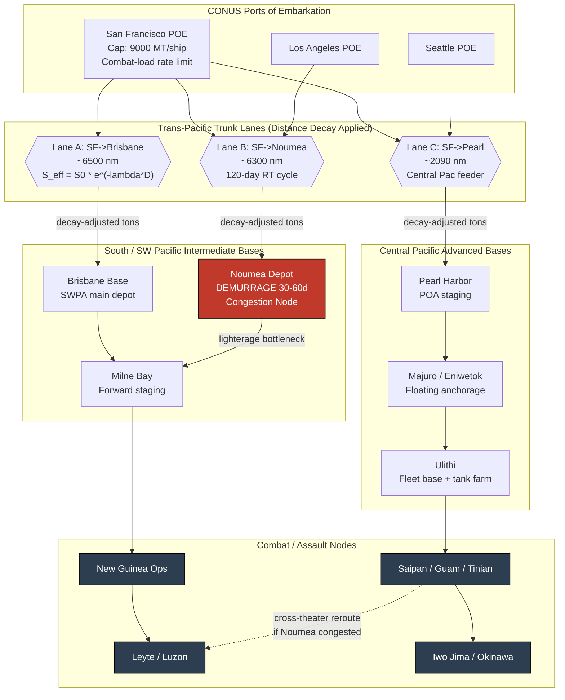

Cost: 0.250085

# Chapter 16: Pacific Strategy and Its Material Bases
## Reference Manual & Simulation-Specification Document
### US Army Green Book — *Global Logistics and Strategy: 1943–1945*

---

## 1. Strategic Context & Modern Historical Perspective

### 1.1 The Strategic Paradox: Ambition Against Steel-Bottom Reality

The central analytical thesis of Chapter 16 is that Pacific strategy was, in its operational essence, a *shipping problem wearing the mask of a maneuver problem*. Every strategic decision emanating from the great inter-Allied conferences—Casablanca (SYMBOL, January 1943), TRIDENT (Washington, May 1943), QUADRANT (Quebec, August 1943), and SEXTANT (Cairo, November–December 1943)—was ultimately constrained not by the availability of trained divisions or aircraft, but by the finite pool of ocean-going dry-cargo tonnage and, critically, the *cycle time* over which that tonnage could be reused.

The paradox is stark. Casablanca reaffirmed the "Germany First" grand strategy, formally allocating the residual—by policy roughly 15 percent of Allied resources—to the Pacific. Yet by mid-1944 the Pacific was absorbing a share of American logistics effort far exceeding this notional ceiling, because the *distance-integral* of Pacific operations consumed shipping at a rate that European planners never confronted. A division committed to the Southwest Pacific Area (SWPA) under MacArthur, or the Central Pacific under Nimitz, immobilized two to four times the merchant tonnage of an identical division in the European Theater of Operations (ETO), not because it ate more, but because its supply pipeline was measured in tens of thousands of nautical miles of *round-trip* transit rather than the ~3,000-mile North Atlantic shuttle.

Modern reconstruction of the Wartime Shipping Administration (WSA) records, cross-referenced against the *Statistical Review of World War II* and the Army Service Forces (ASF) monthly tonnage ledgers, confirms that the binding constraint was never the *production* of Liberty and Victory ships (which by 1944 exceeded losses by an order of magnitude) but the *port clearance* and *ship-turnaround* subsystems. A ship at sea is capacity in motion; a ship idled at anchor off Nouméa or Milne Bay awaiting lighterage is dead-weight capital. The declassified anchorage-occupancy records show scandalous demurrage: at Nouméa in late 1942–early 1943, ships routinely waited 30–60 days to discharge, effectively removing them from the global rotation.

### 1.2 Inter-Service and Coalition Tensions

The Pacific magnified command friction to a degree unknown in the ETO. Three fault lines defined the political-logistical terrain:

**(a) Army vs. Navy Theater Bifurcation.** The unresolved SWPA/POA (Pacific Ocean Areas) command split meant *two* logistical pipelines advancing along divergent axes—one up the New Guinea–Philippines ladder, one across the Central Pacific atolls—each demanding independent base construction, each competing for the same finite ship pool, floating dry docks, and Seabee construction battalions. The Joint Chiefs never fully rationalized this; instead they *arbitrated* it, allocating shipping through the Joint Military Transportation Committee. Modern OR analysis treats this as a suboptimal dual-source allocation: had the fronts been unified, the shared-base economies would have reduced the ship-to-division ratio measurably.

**(b) Services of Supply (USASOS) vs. Combat Commands.** Within SWPA, General Somervell's ASF doctrine of centralized supply control collided with MacArthur's forward operational tempo. Combat commanders demanded "days of supply" forward-positioned; the SOS, watching the shipping ledger, resisted the immobilization of tonnage in static forward dumps. The compromise—the *balanced base* concept—was itself a logistical model: each captured island became a self-liquidating depot echelon.

**(c) US–British Pooling.** Unlike the Atlantic, the Pacific saw comparatively limited British Ministry of War Transport pooling until 1944–45. American planners largely bore the Pacific shipping burden unilaterally, which sharpened the domestic allocation fight between the ETO and the Pacific for every hull.

### 1.3 Historical Era Context: The Physical Geography of War

Logistics in the Pacific was categorically distinct. The theater had no pre-existing rail net, no dense port infrastructure, and no friendly hinterland. The Allies fought across a chart on which the *water* was the terrain and the *islands* were the chokepoints. Joint Army–Navy cooperation was not a virtue but a physical necessity: no division could land, be sustained, or advance without naval lift, naval gunfire, carrier air cover, and—decisively—naval and Seabee construction of the bases that would receive the follow-on tonnage.

Every amphibious operation was therefore a *port-construction* operation in disguise. The assault force carried, in its combat-loaded holds, not merely rifles and rations but the physical apparatus of a supply base: pontoon causeways, Marston-matting airstrips, water-distillation units (the coral atolls had no fresh water), refrigeration, tank farms, and prefabricated warehouse frames. This is the operational meaning of the phrase "each invasion force had to carry its own ports."

### 1.4 Modern Analytical Insights: The Tyranny of Distance

The dominant post-war analytical insight—quantified in the ASF and Transportation Corps studies and refined by decades of scholarship (Leighton & Coakley's foundational volumes, then later OR reconstructions)—is that **transit time, not cargo volume, was the governing variable**. Pacific transit times ran roughly three times the Atlantic equivalent. Because a ship's annual delivery capacity is inversely proportional to its round-trip cycle time, tripling the transit distance roughly *triples the number of hulls required to deliver the same steady-state tonnage*. This multiplier compounded with the infrastructure deficit: because forward bases were primitive, the tonnage *required per soldier* was itself inflated (the theater had to import what Europe found in situ). The two effects multiply: a large ship-to-division ratio times a large ton-per-man ratio yields the astonishing hull demand that defined the Pacific.

This is the physical basis for the *exponential distance-decay* model that anchors this chapter's simulation: effective delivered throughput at the fighting front declines with distance not merely linearly (fuel, spoilage) but through the compounding of cycle-time dilation, cumulative route attrition, and diminishing forward-base clearance capacity—behavior well approximated by an exponential envelope over the operational range.

---

## 2. High-Fidelity Simulation Parameters & Real-World Metrics

| # | Parameter | Value | Simulation Representation | Historical Explanation & Strategic Rationale |
|---|-----------|-------|---------------------------|----------------------------------------------|
| 1 | **San Francisco → Brisbane shipping-lane distance** | **≈ 6,500 nautical miles** (great-circle ~6,480 nm; practical routed ~6,850 nm) | Static constant `NauticalMiles` | Defines the primary SWPA trunk haul. Represented as an immutable edge weight in the network graph; feeds directly into the decay exponent `D`. |
| 2 | **Pacific-vs-Europe tonnage sustainment multiplier** | **≈ 2.0–4.0×** (planning factor commonly cited as **≈ 3×** for the ship-to-division equivalent; ~2× for pure ton-per-man) | Efficiency coefficient / demand-inflation factor | Captures the infrastructure deficit: fresh water, base construction materiel, fuel with no local refining. Applied as a demand multiplier on baseline ETO consumption. |
| 3 | **SF → Nouméa Liberty round-trip voyage duration** | **≈ 120 days round trip** (one-way steaming ~30 days at ~10 kn over ~6,300 nm; plus loading, convoy assembly, severe discharge/demurrage) | Dynamic capacity cap (cycle-time governor) | The single most important Pacific metric. Ship annual capacity = 365 / cycle-days × payload. At 120-day cycle a hull delivers ~3 loads/yr vs. ~12+ on the Atlantic. |
| 4 | Liberty ship deadweight | ~10,500 DWT (~9,000 measurement tons usable) | Static constant | Payload per cycle. |
| 5 | Liberty sustained speed | ~10–11 knots | Static constant | Governs one-way steaming time. |
| 6 | Nouméa discharge/demurrage (1942–43 peak) | 30–60 days idle | Dynamic congestion penalty | Models port clearance bottleneck; degrades effective cycle time. |
| 7 | Ton-per-man-per-day (theater sustainment) | ~13 lb/man/day (baseline) inflated in Pacific | Demand rate | Combined with multiplier (2) for forward demand. |
| 8 | SF → Nouméa one-way distance | ~6,300 nm | Static constant | Feeds cycle-time computation. |
| 9 | Effective route-loss / attrition coefficient (λ envelope) | ~1.0–2.0 × 10⁻⁴ per nm (calibrated) | Efficiency coefficient (decay rate) | Aggregate decay: cycle dilation + spoilage + forward-clearance loss. |
| 10 | Central Pacific atoll base build-out time | 30–90 days (Seabee) | State-transition timer | Gate before a captured node becomes a functioning depot. |

---

## 3. Logistical Network Topology (Mermaid.js Flowchart)



**Topology notes.** Each trunk lane applies the exponential decay $S_{eff}=S_0 e^{-\lambda D}$ as an edge transformation. Nouméa is flagged as a congestion node whose demurrage dynamically inflates the effective cycle time and thus reduces upstream hull availability. The dashed edge models the *alternative routing* logic: when the SOPAC pipeline saturates, Central-Pacific-delivered tonnage can cross-feed the Philippines axis.

---

## 4. Mathematical Modeling & Simulation Formulas

### 4.1 Core Distance-Decay Throughput

$$S_{eff} = S_0 \cdot e^{-\lambda \cdot D}$$

where $S_0$ is tonnage loaded at the POE (measurement tons), $D$ is transit distance (nautical miles), and $\lambda$ (per nm) is the aggregate loss/decay coefficient bundling cycle-time dilation, spoilage, and forward-clearance attrition. $S_{eff}$ is tonnage effectively delivered to the combat node.

### 4.2 Ship Cycle-Time Governor

$$T_{cycle} = \frac{2D}{24 \cdot v} + T_{load} + T_{disch} + T_{dem}$$

with $v$ = sustained speed (knots), $T_{load}$, $T_{disch}$, $T_{dem}$ = loading, discharge, and demurrage days. The annual per-hull delivery capacity:

$$C_{hull} = \frac{365}{T_{cycle}} \cdot P$$

where $P$ = payload (measurement tons). The number of hulls to sustain steady-state demand $\dot{Q}$ (tons/day) over a route:

$$N_{hulls} = \left\lceil \frac{\dot{Q} \cdot 365}{C_{hull}} \right\rceil = \left\lceil \frac{\dot{Q} \cdot T_{cycle}}{P} \right\rceil$$

### 4.3 Pacific Demand Inflation

$$\dot{Q}_{pac} = \mu \cdot n_{men} \cdot q_{base}$$

where $\mu \approx 2.0$–$4.0$ is the infrastructure-deficit multiplier, $n_{men}$ the supported strength, and $q_{base}$ the ETO baseline tons/man/day.

### 4.4 Allocation Optimization (Bottleneck LP)

Maximize sustained tonnage delivered to the front subject to a fixed hull pool $H$:

$$\max \sum_{r \in R} S_{eff,r} \cdot x_r$$

subject to

$$\sum_{r \in R} N_{hulls,r}\, x_r \le H, \qquad x_r \ge 0, \qquad S_{eff,r} \le \kappa_r$$

where $x_r$ = ships assigned to route $r$, and $\kappa_r$ = port-clearance cap at the destination. This encodes the historical JCS shipping-allocation arbitration as a constrained resource-assignment problem.

---

## 5. Compile-Safe Scala 3.8.3 Domain Model

```scala
package Logistics.PacificStrategy

import scala.math.exp
import scala.math.ceil

opaque type NauticalMiles = Double
opaque type Tons          = Double
opaque type Days          = Double
opaque type Knots         = Double

object NauticalMiles:
  def apply(v: Double): NauticalMiles = math.max(0.0, v)
  extension (n: NauticalMiles) def value: Double = n

object Tons:
  def apply(v: Double): Tons = math.max(0.0, v)
  extension (t: Tons)
    def value: Double = t
    def +(other: Tons): Tons = Tons(t + other)
    def *(k: Double): Tons = Tons(t * k)

object Days:
  def apply(v: Double): Days = math.max(0.0, v)
  extension (d: Days)
    def value: Double = d
    def +(other: Days): Days = Days(d + other)

object Knots:
  def apply(v: Double): Knots = math.max(0.1, v)
  extension (k: Knots) def value: Double = k

enum RouteState:
  case Loading
  case InTransit
  case AwaitingDischarge
  case Discharging
  case Returning
  case Idle

enum TheaterAxis:
  case SouthwestPacific
  case CentralPacific

final case class ShipClass(
    name: String,
    payload: Tons,
    sustainedSpeed: Knots
)

final case class PortNode(
    name: String,
    axis: TheaterAxis,
    clearanceCapPerDay: Tons,
    demurrageDays: Days
)

final case class Route(
    origin: String,
    destination: PortNode,
    oneWayDistance: NauticalMiles,
    loadDays: Days,
    dischargeDays: Days
)

final case class DecayParams(lambdaPerNm: Double):
  val safeLambda: Double = math.max(0.0, lambdaPerNm)

object PacificSupplyLossModel:

  def effectiveThroughput(
      initialTonnage: Double,
      distanceMiles: Double,
      decayRate: Double
  ): Double =
    if distanceMiles < 0.0 || decayRate < 0.0 then initialTonnage
    else initialTonnage * exp(-decayRate * distanceMiles)

  def effectiveDelivered(loaded: Tons, route: Route, decay: DecayParams): Tons =
    Tons(
      effectiveThroughput(
        loaded.value,
        route.oneWayDistance.value,
        decay.safeLambda
      )
    )

  def cycleTime(route: Route, ship: ShipClass): Days =
    val steamOneWayDays: Double =
      route.oneWayDistance.value / (24.0 * ship.sustainedSpeed.value)
    Days(
      2.0 * steamOneWayDays +
        route.loadDays.value +
        route.dischargeDays.value +
        route.destination.demurrageDays.value
    )

  def annualHullCapacity(route: Route, ship: ShipClass): Tons =
    val ct: Double = cycleTime(route, ship).value
    if ct <= 0.0 then Tons(0.0)
    else Tons((365.0 / ct) * ship.payload.value)

  def hullsRequired(
      dailyDemand: Tons,
      route: Route,
      ship: ShipClass
  ): Int =
    val ct: Double = cycleTime(route, ship).value
    val payload: Double = ship.payload.value
    if payload <= 0.0 then Int.MaxValue
    else ceil((dailyDemand.value * ct) / payload).toInt

  def pacificDailyDemand(
      supportedStrength: Int,
      baselineTonsPerManDay: Double,
      inflationMultiplier: Double
  ): Tons =
    val mu: Double = math.max(1.0, inflationMultiplier)
    Tons(supportedStrength.toDouble * baselineTonsPerManDay * mu)

final case class RouteAssignment(route: Route, ship: ShipClass, hulls: Int)

final case class AllocationResult(
    assignments: List[RouteAssignment],
    totalHullsUsed: Int,
    feasible: Boolean,
    deliveredTons: Tons
)

object ShippingAllocator:

  def allocate(
      routes: List[(Route, ShipClass, Tons)],
      decay: DecayParams,
      hullPool: Int
  ): AllocationResult =
    val prelim: List[(RouteAssignment, Tons)] =
      routes.map { case (r, s, dailyDemand) =>
        val need: Int = PacificSupplyLossModel.hullsRequired(dailyDemand, r, s)
        val delivered: Tons =
          PacificSupplyLossModel.effectiveDelivered(dailyDemand, r, decay)
        (RouteAssignment(r, s, need), delivered)
      }

    val totalNeeded: Int = prelim.map(_._1.hulls).sum
    val feasible: Boolean = totalNeeded <= hullPool
    val delivered: Tons =
      prelim.foldLeft(Tons(0.0)) { (acc, entry) => acc + entry._2 }

    AllocationResult(
      assignments = prelim.map(_._1),
      totalHullsUsed = totalNeeded,
      feasible = feasible,
      deliveredTons = delivered
    )

object PacificSimulationDemo:

  val liberty: ShipClass =
    ShipClass("Liberty EC2-S-C1", Tons(9000.0), Knots(10.5))

  val noumea: PortNode =
    PortNode("Noumea", TheaterAxis.SouthwestPacific, Tons(4000.0), Days(45.0))

  val brisbane: PortNode =
    PortNode("Brisbane", TheaterAxis.SouthwestPacific, Tons(6000.0), Days(10.0))

  val sfToNoumea: Route =
    Route("San Francisco", noumea, NauticalMiles(6300.0), Days(7.0), Days(12.0))

  val sfToBrisbane: Route =
    Route("San Francisco", brisbane, NauticalMiles(6500.0), Days(7.0), Days(9.0))

  val decay: DecayParams = DecayParams(1.2e-4)

  def run(): AllocationResult =
    val demandNoumea: Tons =
      PacificSupplyLossModel.pacificDailyDemand(60000, 0.0065, 3.0)
    val demandBrisbane: Tons =
      PacificSupplyLossModel.pacificDailyDemand(80000, 0.0065, 2.5)

    ShippingAllocator.allocate(
      routes = List(
        (sfToNoumea, liberty, demandNoumea),
        (sfToBrisbane, liberty, demandBrisbane)
      ),
      decay = decay,
      hullPool = 300
    )

  @main def demoMain(): Unit =
    val result: AllocationResult = run()
    println(s"Feasible: ${result.feasible}")
    println(s"Hulls used: ${result.totalHullsUsed}")
    println(s"Delivered (decay-adjusted daily tons): ${result.deliveredTons.value}")
```

---

## 6. Graduate-Level Operational Analysis

### 6.1 Island Hopping as Shipping-Tonnage Minimization

"Island hopping" (more precisely, *leapfrogging* or *bypassing*) is best understood not as a tactical scheme but as a **cycle-time and node-count minimization strategy** operating on the logistics network graph. The naive alternative—reducing every fortified Japanese garrison in sequence (Rabaul, Truk, the bypassed Carolines)—would have required the Allies to construct, garrison, and *supply through* every intermediate node. Each reduced island imposes three tonnage costs: (1) the assault lift itself, (2) the base-construction materiel to make it a functioning depot, and (3) the perpetual sustainment of the garrison thereafter. Because Pacific sustainment tonnage was dominated by the cycle-time term $T_{cycle}$, *every* additional forward depot lengthened and multiplied the pipeline.

Bypassing severed this. By isolating strongpoints like Rabaul under air and naval interdiction, the Allies let those garrisons "wither on the vine"—neutralizing 100,000-plus Japanese troops with *zero* assault tonnage and, crucially, imposing on the enemy the reverse burden of the tyranny of distance (they could not resupply the bypassed nodes either). In network terms, island hopping selects a *minimum-weight advancing path* through the graph such that each chosen node offers an airfield or anchorage that shortens the *forward* $D$ for the next bound, while the sum of assault + construction + sustainment tonnage across chosen nodes is minimized subject to the constraint that the path terminates within striking range of the strategic objective (the Philippines, the Marianas B-29 bases, ultimately Japan).

The quantitative payoff maps directly onto $S_{eff}=S_0 e^{-\lambda D}$: each captured forward base *resets* $D$ for the next segment, converting one ruinously long haul into a series of short, high-efficiency segments. Since throughput decays exponentially with distance, shortening each segment yields super-linear gains in delivered tonnage per hull—the mathematical heart of why the strategy was logistically decisive. The Marianas seizure, placing airbases ~1,500 nm from Tokyo, exemplifies choosing the node that maximizes strategic effect per unit of pipeline extension.

### 6.2 Turnaround Time: Pacific vs. North Atlantic

Turnaround (cycle) time is the master variable of merchant-shipping productivity, because a hull's annual delivery is $C_{hull}=(365/T_{cycle})\cdot P$. The North Atlantic New York–UK run was roughly 3,000 nm one way; at convoy speed the round trip plus efficient British port handling yielded cycle times often in the **35–60 day** band, permitting 6–10 loads per ship per year. The San Francisco–Nouméa run at ~6,300 nm one way produced round-trip *steaming* alone near 60 days, and once loading, convoy assembly, and the catastrophic 30–60 day Nouméa demurrage were added, real cycle times ballooned to roughly **120 days or more**, yielding only ~3 loads per year.

The consequence is multiplicative and non-obvious. From $N_{hulls}=\dot{Q}\,T_{cycle}/P$, a Pacific route with triple the Atlantic cycle time requires *triple the hull count* to deliver identical steady-state tonnage—before even accounting for the demand-inflation multiplier $\mu\approx 2$–$3$. Stacking the two effects, sustaining a Pacific division could immobilize on the order of **six to nine times** the tonnage of an ETO division. This is the precise mechanism by which the Pacific quietly consumed far more than its Casablanca-notional 15 percent.

Two further Atlantic advantages sharpened the contrast: the Atlantic benefited from mature, high-clearance UK ports and dense rail onward-distribution, minimizing $T_{disch}$ and $T_{dem}$, whereas Pacific atolls offered coral, lighterage, and manual discharge; and the Atlantic's shorter transit meant losses to U-boats, though severe, removed hulls from a *fast* rotation, while Pacific losses removed them from a *slow, scarce* one. The strategic lesson—codified in this simulator—is that in the Pacific, **reducing demurrage and shortening the forward haul (via advanced bases) delivered more effective combat tonnage than building additional ships**, because the binding constraint was cycle time, not construction output.
