Cost: 0.4952175

### 1. Strategic Context & Modern Historical Perspective

#### Strategic setting

The Pacific war imposed a logistics problem qualitatively different from that faced by the Anglo-American coalition in Europe. European operations benefited from mature ports, dense railways, established industrial regions, short intra-theater distances, and, after the opening of the Mediterranean and the liberation of France, several alternative lines of communication. The Pacific offered almost the opposite configuration. Its principal operating areas were separated from the American industrial base by thousands of nautical miles; suitable ports were scarce; many objectives were coral atolls or underdeveloped islands; and the few existing harbors, roads, airfields, water systems, and storage facilities were frequently inadequate for mechanized warfare.

Accordingly, Pacific strategy could not be separated from construction, shipping, and base development. The seizure of an island was useful only if the island could support airfields, anchorages, radar sites, fuel farms, hospitals, ammunition dumps, repair facilities, and the transshipment of forces toward the next objective. A newly captured island was not merely territory. It was a prospective node in a continental-scale transportation network.

This fact shaped the strategic choices examined in “Pacific Strategy and Its Material Bases.” American planners pursued two broad axes: the Southwest Pacific advance under General Douglas MacArthur, operating through New Guinea toward the Philippines, and the Central Pacific advance under Admiral Chester W. Nimitz, moving through the Gilberts, Marshalls, Marianas, and ultimately toward the western Pacific. These axes competed for amphibious shipping, escorts, cargo vessels, landing craft, engineers, construction units, aviation support, and port-development resources. Yet they were also complementary. Japanese forces bypassed on one axis could be isolated by air and sea power generated from bases seized on the other.

#### The strategic paradox

The central paradox was that high-level Allied strategy could allocate objectives more rapidly than the logistics system could generate usable operational capacity. At Casablanca in January 1943, the Combined Chiefs of Staff reaffirmed the defeat of Germany as the coalition’s primary objective while authorizing continuing pressure against Japan. At TRIDENT in May, QUADRANT in August, and SEXTANT in November–December, plans became progressively more ambitious: operations in Europe were expanded while offensives in the Central Pacific, Southwest Pacific, Southeast Asia, and China-Burma-India were simultaneously considered or approved.

On conference maps, these commitments appeared as arrows and target dates. In the transportation system, they appeared as mutually competing claims on finite pools of cargo shipping, tankers, troop transports, assault transports, landing ships, landing craft, escorts, port battalions, engineer units, and construction materials. A decision to accelerate an amphibious operation did not merely require additional combat divisions. It required combat-loaded shipping, naval gunfire support, assault landing craft, replacement craft, floating repair resources, medical evacuation capacity, and sufficient follow-up shipping to transform an assault lodgment into a functioning base.

The distinction between commercial loading and combat loading was critical. A merchant ship loaded for maximum cubic utilization might carry cargo for several destinations, with heavy items stowed deeply and port-clearance efficiency prioritized. An assault-loaded ship had to carry men, vehicles, ammunition, rations, engineering equipment, and communications matériel in the order needed on the beach. This reduced nominal cargo utilization and increased loading time. The relevant capacity was therefore not simply deadweight tonnage. It was effective, mission-ready lift, constrained by stowage sequence, hatch accessibility, boat availability, beach organization, and tactical risk.

Global shipping pools created another contradiction. A ship assigned to the Pacific was unavailable not just during its outward passage but for the entire cycle of loading, sailing, convoy assembly, unloading, intertheater or intratheater movement, repair, and return. Since Pacific voyages were commonly two or three times as long as North Atlantic voyages, an identical monthly delivery requirement tied up substantially more ship capacity. The correct strategic measure was therefore ship-days or ship-months, not merely tons dispatched.

Port capacity introduced an additional constraint. A theater could receive only what its anchorages, piers, lighters, beaches, cranes, trucks, roads, and depots could clear. Sending additional ships to a saturated port did not proportionately increase deliveries. It could instead create queues, immobilize hulls, expose cargo to weather and attack, and reduce the global shipping pool. The prolonged congestion at Nouméa in 1942 was a particularly important institutional lesson. Cargo had been loaded without adequate destination control, manifests were imperfect, port labor and lighterage were insufficient, and ships waited while urgently needed matériel remained buried beneath lower-priority cargo. The port bottleneck propagated backward to the continental United States by lengthening vessel turnaround time.

#### Material geography and the tyranny of distance

The Pacific’s geography multiplied almost every support requirement. From San Francisco to Brisbane, the planning distance was approximately 6,485 nautical miles. From the American west coast to the South Pacific and Southwest Pacific bases, a ship faced weeks at sea in each direction. Once cargo reached a major theater base, it often had to be unloaded, sorted, stored, reloaded into smaller vessels, and carried forward through a succession of intermediate bases. Every handling created delay, breakage, loss, misrouting, and labor demand.

The theater also lacked the extensive civilian infrastructure available in Europe. An advancing force could not assume the existence of reliable fresh water, electric power, warehouses, fuel pipelines, refrigeration, paved roads, machine shops, or deep-draft piers. Much of this infrastructure had to be shipped from the United States or Australia. Thus an invasion force carried not only consumable supplies but also the capital equipment needed to create its own logistics system: bulldozers, graders, crushers, dredges, cranes, landing mats, pontoon barges, water-purification equipment, tankage, pumps, generators, sawmills, hospital equipment, and communications systems.

This created a recursive burden. Construction matériel consumed shipping in order to build bases that would later increase shipping efficiency. If base development was under-resourced, later operations suffered from low port throughput and long turnaround. If it was over-resourced, combat operations could be delayed by excessive investment in rear areas. The optimal policy depended on the expected duration and future centrality of each base. A base likely to be bypassed within months warranted only austere development; a hub such as Espiritu Santo, Nouméa, Brisbane, Manus, or later Guam and Saipan justified substantial fixed investment.

#### Inter-service tensions

Army–Navy friction reflected genuine differences in operational logic. The Army Services of Supply generally sought stable schedules, standardized requirements, high cargo utilization, and orderly depot systems. Combat commanders emphasized tactical urgency and wanted supplies immediately available near the front. The Navy controlled much of the ocean transport, convoying, amphibious lift, and port-entry environment, while Army organizations often controlled the cargo, depot operations, and ground distribution. Neither service could optimize the system independently.

Combat commands commonly submitted requirements that exceeded theater shipping allocations or port capacity. Services of Supply staffs attempted to impose priorities, consolidate cargo, and maintain balanced stocks. Combat commanders sometimes interpreted this as bureaucratic obstruction, while logisticians regarded last-minute operational changes as destructive to loading plans and shipping schedules. Both views could be correct: tactical opportunity demanded flexibility, but repeated changes imposed measurable penalties in rehandling, idle ship-days, and unbalanced stocks.

There was also tension between Army and Navy conceptions of base development. Naval planners prioritized anchorages, fleet logistics, aviation gasoline, ship repair, and amphibious staging. Army planners required warehouses, vehicle parks, hospitals, replacement depots, ordnance maintenance, and ground transport. Air forces required long runways, dispersal areas, bomb storage, aviation fuel, maintenance shops, and weather facilities. On small islands these requirements competed for the same terrain and engineer capacity.

#### Coalition and global-pooling tensions

Anglo-American shipping was managed through combined machinery, but “pooling” did not eliminate national interests. British shipping sustained the United Kingdom, the Mediterranean, India, the Middle East, and imperial lines of communication. American shipping carried the expanding U.S. Army and Navy while also supporting Lend-Lease. British planners frequently favored operations in the Mediterranean or Southeast Asia that served both anti-German and imperial objectives. American planners increasingly favored direct pressure across the Central Pacific and a return to the Philippines.

Conference decisions therefore had to reconcile strategy with the actual composition and location of shipping. A nominal surplus of dry-cargo vessels could not substitute for a shortage of assault transports, tankers, refrigerated ships, or landing ships. Nor could British-controlled tonnage always be transferred instantly to American Pacific routes. Ships differed in speed, draft, cargo gear, troop accommodations, defensive armament, and suitability for combat loading. The global shipping pool was heterogeneous rather than fungible.

#### Modern historical and systems interpretation

Postwar scholarship has reinforced the conclusion that the decisive variable was not aggregate national production alone but the rate at which production could be converted into effective combat power at a distant node. The United States possessed overwhelming industrial potential, yet that potential had to pass through a chain of constrained processes:

1. production and inland movement to a port of embarkation;
2. port staging and loading;
3. ocean transit;
4. theater unloading and clearance;
5. depot processing;
6. intratheater redistribution;
7. forward beach or port discharge;
8. tactical delivery to consuming formations.

The throughput of the whole chain could not exceed that of its most restrictive stage. Additional production upstream of a bottleneck increased inventories and queues rather than combat supply.

A useful modern distinction is between **cargo demand** and **transport-capital demand**. The tons consumed by a division might not be three times greater in the Pacific than in Europe, but sustaining those tons over a route two or three times as long could require two or three times as many ship-days. Local infrastructure deficiencies added a separate demand for base-development tonnage. Therefore “Pacific multiplier” must not be represented as a single universal scalar. A high-fidelity simulator should distinguish:

- recurring consumption tonnage;
- initial equipment and organizational lift;
- construction and base-development tonnage;
- reserve and pipeline stocks;
- distance-driven ship-cycle requirements;
- combat-loading penalties;
- cargo losses and deterioration;
- port and beach throughput;
- transshipment delay.

Island hopping was the strategic response to this network structure. Rather than reducing every Japanese position, the Allies selected islands that generated air, naval, or logistics leverage and bypassed others. A bypassed garrison could be isolated and rendered operationally irrelevant at a lower cost than direct assault. The selected objective shortened the next transport leg, extended fighter and reconnaissance coverage, supported submarines and surface forces, and created an additional depot or staging node. Pacific strategy was thus a problem of network design: seize the minimum set of nodes needed to move the effective front toward Japan while preserving sufficient shipping and construction capacity to exploit each seizure.

---

### 2. High-Fidelity Simulation Parameters & Real-World Metrics

The figures below distinguish historical planning values from modeling coefficients. Wartime values varied with convoy routing, weather, ship speed, port congestion, and the exact definition of a voyage cycle. The three requested baseline values—6,485 nautical miles, a 2.0 infrastructure-tonnage factor, and an 80-day San Francisco–Nouméa cycle—should be treated as standardized scenario constants, not as invariant physical laws.

| Parameter | Baseline value | Unit | Historical and strategic interpretation | Recommended simulation representation |
|---|---:|---|---|---|
| San Francisco–Brisbane shipping-lane distance | **6,485** | nautical miles, one way | Wartime planning distance for the principal west-coast-to-Australia line of communication. It is a route distance rather than a pure great-circle measurement and represents the scale of the trans-Pacific commitment. | Static route baseline, modified dynamically by convoy diversion, weather, enemy threat, or routing through intermediate bases. |
| Pacific infrastructure-deficit tonnage multiplier | **2.0** | dimensionless | A useful theater-planning approximation: approximately twice the lift burden of a developed European destination when imported construction, utilities, storage, water, road, and port equipment are included. It must not be interpreted as every Pacific soldier consuming exactly twice the recurring supplies of a soldier in Europe. | Scenario coefficient applied to base-development and establishment demand, not indiscriminately to all daily consumption. Permit values of 1.5–3.0 by island development level. |
| Liberty-ship San Francisco–Nouméa round-trip planning cycle | **80** | days | Includes loading, outward passage, convoy and routing delay, unloading, port waiting, return passage, and normal turnaround. A purely steaming-time calculation would be materially shorter. Congestion could push actual cycles beyond this value. | Dynamic cycle-time baseline. Add origin queue, destination queue, weather delay, repair time, and convoy waiting. |
| San Francisco–Honolulu distance | 2,091 | nautical miles, one way | Principal first-stage route to the Hawaiian base system. Honolulu served as a major redistribution, training, repair, and command node. | Static edge length with high developed-port capacity. |
| San Francisco–Nouméa representative route distance | 5,400–5,700 | nautical miles, one way | Exact distance depended on route and navigational avoidance. Nouméa was an important South Pacific receiving and redistribution base but suffered severe congestion during its rapid expansion. | Route-specific input; use 5,550 nautical miles as a neutral scenario default if no archival sailing order is available. |
| Liberty-ship service speed | 11 | knots | Liberty ships could steam somewhat faster under favorable conditions, but approximately 11 knots is a defensible sustained planning speed. Convoy and routing conditions reduced effective speed. | Nominal vessel parameter. Effective speed equals nominal speed multiplied by weather, convoy, maintenance, and threat factors. |
| Theoretical 6,485-nm passage at 11 knots | 24.56 | days, one way | $6{,}485/(11 \times 24)$. This excludes routing, convoy waiting, evasive movement, and port time. | Computed lower bound, never the complete voyage cycle. |
| Nominal Liberty-ship deadweight capacity | 10,000–10,800 | long tons | Actual load depended on cargo density, bunkers, draft restrictions, deck cargo, dangerous-cargo separation, and stowage. Measurement tons could bind before deadweight tons. | Vessel capacity with separate weight and cube constraints. |
| Combat-loading utilization factor | 0.65–0.80 | fraction of commercial cargo efficiency | Assault loading sacrificed cargo density so that mission-critical matériel could be discharged in tactical sequence. | Dynamic efficiency coefficient based on mission type. Use 0.72 as a central baseline. |
| Commercial port-loading utilization | 0.85–0.95 | fraction of nominal capacity | Administrative loading generally achieved better utilization than combat loading, subject to cargo mix and manifest quality. | Loading-state coefficient. |
| Developed major-port clearance | 8,000–20,000+ | long tons/day | Large, organized ports could sustain high clearance when berths, cranes, labor, trucks, roads, and depots were balanced. Actual performance varied widely. | Node capacity cap; use independently constrained berth, discharge, and inland-clearance subcapacities. |
| Early austere island/beach discharge | 500–2,500 | long tons/day | Surf conditions, landing craft, reefs, beach exits, and labor imposed sharp limits. Bad weather could reduce throughput nearly to zero. | Weather-sensitive node capacity. |
| Improved island base discharge | 3,000–8,000 | long tons/day | Pontoon piers, dredging, cranes, roads, and organized port battalions could materially improve capacity. | Endogenous capacity generated by engineer investment. |
| Port congestion threshold | 0.85 | utilization ratio | Queues typically become nonlinear as arrival demand approaches practical service capacity. | Trigger for convex or queue-based delay. |
| Port congestion delay coefficient | scenario-calibrated | days | Delay should rise rapidly as utilization approaches unity. | Apply $W=W_0/[1-\rho]$ only as an approximation; impose finite anchorage capacity and diversion behavior. |
| Dry-cargo handling loss | 0.2–1.0% | per handling | Breakage, pilferage, exposure, misrouting, and documentation error accumulated at each transshipment. | Multiplicative handling-retention factor. |
| Petroleum handling loss | 0.3–1.5% | per transfer | Leakage, evaporation, contaminated fuel, damaged drums, and hose or tank losses. Drummed fuel imposed larger handling burdens than bulk systems. | Cargo-specific loss coefficient. |
| Ammunition handling loss or quarantine | 0.1–0.5% | per handling | Physical loss was often lower than for fragile stores, but damaged or wet ammunition could become unusable and required segregation. | Cargo-specific serviceability coefficient. |
| Routine dry-cargo distance-decay coefficient | $1.0\times10^{-5}$ | per nautical mile | Produces approximately 93.7% distance retention over 6,485 nautical miles before port and handling losses. This is a simulation abstraction, not a claim that ordinary cargo literally decayed continuously at sea. | Calibrated route-risk coefficient. |
| Contested-route decay coefficient | $3.0\times10^{-5}$ to $8.0\times10^{-5}$ | per nautical mile | Represents aggregate effects of enemy action, weather, diversion, breakdown, and schedule unreliability. | Dynamic coefficient based on threat state and escort coverage. |
| Base construction maturation | 30–180 | days | Time from seizure to progressively useful airfield, port, storage, and maintenance capacity. Atoll conditions and engineer allocation determined the rate. | State transition with staged capacity increments. |
| Initial theater pipeline target | 60–120 | days of supply | Long distances and uncertain schedules required substantial stocks afloat and ashore. Excess stocks, however, could congest ports and obscure priorities. | Inventory policy parameter by command and campaign phase. |
| Forward tactical reserve | 15–30 | days of supply | Amphibious and isolated forces needed protection against weather, interrupted unloading, and enemy interdiction. | Minimum inventory constraint at combat nodes. |
| Ship availability factor | 0.80–0.90 | fraction | Accounts for maintenance, repair, loading, administrative delay, and unscheduled unavailability. | Fleet-level availability coefficient. |
| Convoy schedule delay | 1–7 | days per departure | Ships might wait for escorts, assembly, routing orders, or a safe sailing window. | Stochastic departure delay. |
| Weather speed reduction | 0–25% | percentage | Tropical storms, heavy seas, and seasonal weather reduced speed and disrupted lighterage. | Time-varying route and port modifier. |

#### Interpretation of the three headline values

**6,485 nautical miles:** This is best stored as the baseline length of the San Francisco–Brisbane route. A simulation should preserve the distinction between route distance and great-circle distance. If a convoy must pass through Honolulu, avoid a threat zone, or divert to an alternate base, the realized distance should be recalculated from the selected edges.

**2.0 Pacific multiplier:** No universal archival constant can capture all Pacific support conditions. The factor is defensible only as a planning baseline for the combined establishment burden associated with undeveloped destinations. It should be decomposed as:

$$
T_{\text{Pacific}} =
T_{\text{recurring}}
+ 2.0T_{\text{base-development baseline}}
+ T_{\text{pipeline}}
+ T_{\text{combat-loading penalty}}.
$$

Applying 2.0 to food, ammunition, fuel, replacements, and all other consumption would overstate demand and obscure the actual source of the Pacific penalty.

**80-day Liberty-ship cycle:** This value should represent a standard voyage cycle, not steaming time. Given an approximately 11-knot service speed, the sea passage itself consumes only part of the cycle. Port queues and cargo handling can be more important than small differences in vessel speed.

---

### 3. Logistical Network Topology (Detailed Mermaid.js Flowchart)

```mermaid
flowchart LR
    subgraph CONUS["Continental United States: Production and Ports of Embarkation"]
        PROD["Industrial production nodes<br/>dry cargo, ammunition, vehicles"]
        POLUS["Petroleum production and refining<br/>bulk POL and packaged fuel"]
        SF["San Francisco POE<br/>staging, documentation, loading"]
        LA["Los Angeles / San Pedro POE<br/>alternate west-coast capacity"]
        SEA["Seattle POE<br/>northern alternate capacity"]
        RES["West-coast reserve depots<br/>pipeline stock and replacements"]

        PROD -->|"rail capacity and release schedules"| RES
        POLUS -->|"tank cars and pipelines"| SF
        RES -->|"cargo allocation"| SF
        RES -->|"overflow or route balancing"| LA
        RES -->|"overflow or northern routing"| SEA
    end

    subgraph OCEAN1["Eastern and Central Pacific Ocean Transport"]
        HNL["Honolulu / Oahu hub<br/>developed port, depots, repair, staging"]
        PHX["Central Pacific intermediate bases<br/>Canton, Palmyra, Christmas Island"]
        SLOC1["Direct west-coast route<br/>long cycle, no intermediate handling"]
        QUEUE1["Convoy assembly queue<br/>escort and sailing-window delay"]
    end

    SF -->|"2,091 nm; capacity limited by hulls"| QUEUE1
    LA -->|"alternate convoy flow"| QUEUE1
    SEA -->|"longer northern feeder"| QUEUE1
    QUEUE1 --> SLOC1
    SLOC1 -->|"direct cargo; exponential route retention"| HNL
    HNL -->|"redistribution and transshipment loss"| PHX

    subgraph SOPAC["South Pacific Base Network"]
        NOU["Noumea, New Caledonia<br/>major depot; historical congestion risk"]
        ESP["Espiritu Santo<br/>air, naval, fuel, repair and staging base"]
        GUA["Guadalcanal / Tulagi<br/>forward airfield and tactical depot"]
        SOL["Northern Solomons<br/>Munda, Bougainville, bypass network"]
        FIJI["Fiji / Samoa<br/>defensive and alternate staging nodes"]
        SOPACQ["South Pacific anchorage queue<br/>delay rises nonlinearly above 85% utilization"]
    end

    HNL -->|"central-south route"| SOPACQ
    PHX -->|"alternate staging route"| FIJI
    SLOC1 -->|"direct San Francisco-Noumea route"| SOPACQ
    SOPACQ -->|"berth, lighterage and clearance caps"| NOU
    FIJI -->|"alternate route during Noumea saturation"| ESP
    NOU -->|"intratheater cargo and bulk POL"| ESP
    ESP -->|"forward shipping, LSTs and coasters"| GUA
    GUA -->|"air-covered advance"| SOL
    NOU -.->|"diversion when queue exceeds anchorage cap"| FIJI

    subgraph SWPA["Southwest Pacific Area"]
        BRIS["Brisbane<br/>6,485 nm from San Francisco baseline"]
        SYD["Sydney / Melbourne<br/>deep ports and Australian industrial support"]
        TOW["Townsville / Cairns<br/>northern staging and air support"]
        PM["Port Moresby / Milne Bay<br/>forward New Guinea bases"]
        LAE["Lae / Finschhafen / Hollandia<br/>successive advanced bases"]
        MAN["Manus / Admiralties<br/>fleet anchorage and logistics hub"]
        PHIL["Leyte / Luzon<br/>Philippines combat and depot nodes"]
        SWPAQ["Australian port and coastal-shipping queue"]
    end

    SF -->|"6,485 nm baseline; direct or via Honolulu"| SWPAQ
    HNL -->|"alternate long-haul route"| SWPAQ
    SWPAQ -->|"deep-port discharge"| BRIS
    SWPAQ -->|"alternate developed-port capacity"| SYD
    SYD -->|"rail and coastal shipping"| BRIS
    BRIS -->|"coastal vessel and rail limits"| TOW
    TOW -->|"air and sea feeder route"| PM
    PM -->|"amphibious leapfrog"| LAE
    LAE -->|"bypass Rabaul; shorten forward leg"| MAN
    MAN -->|"fleet-supported operational route"| PHIL
    BRIS -.->|"diversion during congestion"| SYD

    subgraph CENPAC["Central Pacific Offensive Network"]
        GIL["Gilberts<br/>Tarawa and Makin"]
        MARSH["Marshalls<br/>Kwajalein, Eniwetok, Majuro"]
        MARI["Marianas<br/>Saipan, Tinian, Guam"]
        PALA["Palaus / Ulithi<br/>fleet anchorage and staging"]
        IWO["Iwo Jima<br/>fighter and emergency-air node"]
        OKI["Okinawa<br/>advanced fleet and ground logistics node"]
        JPN["Japanese home-island objective system"]
    end

    HNL -->|"assault shipping and follow-up echelons"| GIL
    GIL -->|"shortened line under land-based air cover"| MARSH
    MARSH -->|"amphibious lift; selected objectives bypassed"| MARI
    MARI -->|"B-29 base development and western redistribution"| PALA
    PALA -->|"alternate route toward Philippines"| PHIL
    MARI -->|"advance air and rescue coverage"| IWO
    IWO -->|"forward support route"| OKI
    OKI -->|"projected final approach"| JPN

    subgraph LOSSES["Capacity, Delay, and Loss Functions"]
        DIST["Distance retention<br/>Rdist = exp(-lambda times D)"]
        PORT["Port service cap<br/>Qport = min(berth, discharge, clearance)"]
        CARGO["Cargo compatibility<br/>weight, cube, refrigeration, hazards"]
        SHIP["Ship-cycle capacity<br/>available tons times days / cycle days"]
        HANDLE["Handling retention<br/>Rh raised to number of transfers"]
        THREAT["Threat and weather modifier<br/>submarines, aircraft, storms, diversion"]
    end

    SLOC1 -.-> DIST
    DIST -.-> THREAT
    THREAT -.-> SHIP
    SOPACQ -.-> PORT
    SWPAQ -.-> PORT
    HNL -.-> HANDLE
    NOU -.-> HANDLE
    BRIS -.-> HANDLE
    PORT -.-> CARGO

    subgraph COMBAT["Final Consumers"]
        DIVSW["Army divisions in SWPA<br/>rations, ammunition, POL, replacements"]
        DIVCP["Army and Marine divisions in Central Pacific"]
        AAF["Army Air Forces<br/>aviation gasoline, bombs, spares"]
        FLEET["Fleet and amphibious forces<br/>bunker fuel, ammunition, repair parts"]
    end

    PHIL -->|"truck, lighter and tactical depot throughput"| DIVSW
    OKI -->|"beach and port clearance"| DIVCP
    MARI -->|"air-base supply"| AAF
    MAN -->|"fleet logistics"| FLEET
    PALA -->|"fleet logistics"| FLEET
```



For a route composed of multiple edges, the delivered quantity is not based solely on total distance. It should include every edge’s retention, every transshipment’s handling loss, and every node’s capacity:

$$
S_{\text{delivered}}
=
\min_{e \in P}(C_e)
\left(\prod_{e \in P}e^{-\lambda_eD_e}\right)
\left(\prod_{n \in P}h_n\right),
$$

subject to the quantity dispatched and the available ship-cycle capacity.

---

### 4. Mathematical Modeling & Simulation Formulas

#### 4.1 Basic exponential distance-decay model

The required foundational relation is:

$$
\text{Mathematical Concept: } S_{\text{eff}} = S_0 \cdot e^{-\lambda \cdot D}
$$

where:

- $S_0$ is the tons dispatched at the route origin;
- $S_{\text{eff}}$ is the effective tons available at the destination before port-capacity truncation;
- $D$ is route distance in nautical miles;
- $\lambda$ is the aggregate decay coefficient per nautical mile;
- $e$ is the natural exponential base.

The retention ratio is:

$$
R(D)=\frac{S_{\text{eff}}}{S_0}=e^{-\lambda D}.
$$

If historical evidence indicates that fraction $r$ of dispatched cargo remains effectively available after distance $D$, the coefficient is calibrated as:

$$
\lambda=-\frac{\ln r}{D}.
$$

For example, if effective retention over 6,485 nautical miles is assumed to be 94 percent:

$$
\lambda
=
-\frac{\ln(0.94)}{6485}
\approx 9.55\times10^{-6}\ \text{nm}^{-1}.
$$

Exponential decay is a compact proxy for cumulative route risk and inefficiency. It should not be understood as literal continuous physical destruction. The coefficient can aggregate weather exposure, machinery failure, enemy action, diversion, schedule unreliability, and deterioration. Port congestion and transshipment should remain separate because they respond to different policies.

#### 4.2 Multicommodity network model

Let the logistics network be a directed graph:

$$
G=(N,E),
$$

where $N$ is the set of ports, depots, staging areas, and combat destinations, and $E$ is the set of shipping or inland-transport routes.

Let:

- $K$ be the set of cargo classes;
- $T$ be the set of planning periods;
- $x_{e,k,t}$ be tons of cargo class $k$ dispatched on edge $e$ in period $t$;
- $D_e$ be the edge distance;
- $\lambda_{e,k,t}$ be the route- and cargo-specific decay coefficient;
- $r_{e,k,t}=e^{-\lambda_{e,k,t}D_e}$ be edge retention;
- $h_{n,k,t}$ be handling retention at node $n$;
- $C_{e,t}$ be route transport capacity;
- $P_{n,t}$ be port discharge capacity;
- $L_{n,t}$ be inland port-clearance capacity;
- $I_{n,k,t}$ be ending inventory;
- $d_{n,k,t}$ be demand;
- $u_{n,k,t}$ be unmet demand;
- $a_{n,k,t}$ be exogenous production or arrival;
- $c_{e,k,t}$ be the generalized cost per ton dispatched;
- $w_{n,k}$ be the military penalty for unmet demand.

Effective flow arriving across edge $e=(i,j)$ is:

$$
y_{e,k,t}=r_{e,k,t}x_{e,k,t}.
$$

If cargo is transshipped at node $j$, the amount available for inventory or onward movement is:

$$
\hat y_{e,k,t}=h_{j,k,t}y_{e,k,t}.
$$

The inventory balance is:

$$
I_{n,k,t}
=
I_{n,k,t-1}
+a_{n,k,t}
+\sum_{e\in\delta^-(n)}h_{n,k,t}r_{e,k,t}x_{e,k,t}
-\sum_{e\in\delta^+(n)}x_{e,k,t}
-d_{n,k,t}
+u_{n,k,t}.
$$

Here, $\delta^-(n)$ is the set of incoming edges and $\delta^+(n)$ the set of outgoing edges.

#### 4.3 Objective function

A minimum-cost formulation is:

$$
\min
\sum_{t\in T}
\left[
\sum_{e\in E}\sum_{k\in K}c_{e,k,t}x_{e,k,t}
+
\sum_{n\in N}\sum_{k\in K}w_{n,k}u_{n,k,t}
+
\sum_{n\in N}q_{n,t}
+
\sum_{s\in S}m_{s,t}
\right],
$$

where:

- $q_{n,t}$ is the cost of port congestion;
- $m_{s,t}$ is the cost of ship-days consumed by vessel class $s$.

For combat simulation, unmet-demand penalties must reflect operational consequences. Ammunition, potable water, aviation gasoline, and medical supply shortages should generally receive larger penalties than shortages of routine construction matériel during an active battle.

An alternative objective maximizes combat utility:

$$
\max
\sum_{n\in N_{\text{combat}}}
\sum_{k\in K}
\alpha_{n,k}
\min\left(I_{n,k,t},d_{n,k,t}\right)
-\beta\sum_{n,k}u_{n,k,t}
-\gamma\sum_{n}Q_{n,t},
$$

where $\alpha_{n,k}$ is the marginal combat value of delivered cargo and $Q_{n,t}$ is queued tonnage.

#### 4.4 Route-capacity constraint

For each route and period:

$$
\sum_{k\in K}\frac{x_{e,k,t}}{\eta_{e,k,t}}
\le C_{e,t},
$$

where $\eta_{e,k,t}$ is cargo and loading efficiency. Combat loading has a lower $\eta$ than administrative loading.

If both weight and cube constrain loading:

$$
\sum_k x_{e,k,t}\le W_{e,t},
$$

$$
\sum_k v_kx_{e,k,t}\le V_{e,t},
$$

where $W_{e,t}$ is weight capacity, $V_{e,t}$ is cubic capacity, and $v_k$ is cubic volume per ton of cargo class $k$.

#### 4.5 Port bottleneck

Usable node throughput is:

$$
B_{n,t}
=
\min
\left(
B^{\text{berth}}_{n,t},
B^{\text{discharge}}_{n,t},
B^{\text{clearance}}_{n,t},
B^{\text{storage}}_{n,t}
\right).
$$

Thus:

$$
\sum_{e\in\delta^-(n)}
\sum_k y_{e,k,t}
\le B_{n,t}.
$$

This formulation prevents a simulator from treating anchorage arrival as equivalent to cargo availability. If discharge exceeds inland clearance, cargo accumulates in the port area and reduces future capacity.

#### 4.6 Congestion and queue delay

Define utilization:

$$
\rho_{n,t}
=
\frac{A_{n,t}}{B_{n,t}},
$$

where $A_{n,t}$ is offered arrival tonnage.

A simple nonlinear delay function is:

$$
W_{n,t}
=
W_{0,n}
+
\frac{\kappa_n\rho_{n,t}}{1-\rho_{n,t}},
\qquad 0\le\rho_{n,t}<1.
$$

If $\rho_{n,t}\ge1$, the excess becomes queued inventory:

$$
Q_{n,t}
=
Q_{n,t-1}
+
A_{n,t}
-
B_{n,t}.
$$

The actual delay should then be estimated from queue size:

$$
W_{n,t}^{Q}
=
\frac{Q_{n,t}}{B_{n,t}}.
$$

This nonlinear behavior captures the operational reality that an additional ship sent to an already saturated port can reduce systemwide efficiency by tying up the hull.

#### 4.7 Ship-cycle requirement

For route $e$, vessel class $s$, and period $t$, let:

- $q_s$ be usable tons per vessel;
- $\tau_{e,s,t}$ be complete cycle time in days;
- $H_t$ be days in the planning period;
- $N_{e,s,t}$ be assigned ships;
- $a_s$ be availability;
- $\eta_{e,s,t}$ be loading utilization.

Then periodic lift capacity is:

$$
C_{e,s,t}
=
N_{e,s,t}q_s\eta_{e,s,t}a_s
\frac{H_t}{\tau_{e,s,t}}.
$$

Cycle time is:

$$
\tau_{e,s,t}
=
\frac{2D_e}{24v_s\phi_{e,t}}
+
W^{\text{origin}}_{e,t}
+
W^{\text{destination}}_{e,t}
+
L^{\text{origin}}_{e,t}
+
U^{\text{destination}}_{e,t}
+
R_{s,t},
$$

where:

- $v_s$ is nominal speed in knots;
- $\phi_{e,t}$ is the speed-efficiency factor;
- $W$ terms are queue delays;
- $L$ is loading time;
- $U$ is unloading time;
- $R$ is repair and administrative delay.

The number of vessels required to sustain a flow $F_e$ tons per day is:

$$
N_e
\ge
\frac{F_e\tau_e}{q_e\eta_ea_e}.
$$

This is the mathematical expression of the tyranny of distance: required hull count rises approximately linearly with cycle time even when delivered tonnage is unchanged.

#### 4.8 Base-development transition

Let $z_{n,t}$ be cumulative engineer effort at a captured base and $K_n(z)$ its resulting capacity. A saturating development function is:

$$
K_n(z)
=
K_n^{0}
+
\left(K_n^{\max}-K_n^{0}\right)
\left(1-e^{-\mu_nz}\right).
$$

The base may transition through discrete states:

$$
\text{Unsecured}
\rightarrow
\text{Contested}
\rightarrow
\text{Beachhead}
\rightarrow
\text{AustereBase}
\rightarrow
\text{DevelopedBase}
\rightarrow
\text{MajorHub}.
$$

Each transition requires security, engineer effort, construction cargo, elapsed time, and minimum inventory. Enemy attack can reduce capacity or force regression to a damaged state.

#### 4.9 Bypass decision

For enemy base $j$, let:

- $C_j^{A}$ be expected cost of assault;
- $C_j^{B}$ be cost of bypass and containment;
- $V_j$ be the future logistics value of capturing the base;
- $R_j$ be enemy interdiction risk if bypassed.

Capture is preferred when:

$$
V_j-C_j^{A}
>
-C_j^{B}-R_j.
$$

Bypass is preferred when:

$$
C_j^{B}+R_j
<
C_j^{A}-V_j.
$$

This formalizes island hopping as a selective network-expansion problem rather than a simple sequence of geographically nearest targets.

---

### 5. Compile-Safe Scala 3.8.3 Domain Model

```scala
package Logistics.PacificStrategy

import scala.collection.immutable.Map
import scala.collection.immutable.Vector
import scala.math.exp
import scala.math.max
import scala.math.min

opaque type NauticalMiles = Double

object NauticalMiles:
  def from(value: Double): Either[String, NauticalMiles] =
    if value.isNaN || value.isInfinity || value < 0.0 then
      Left("Nautical miles must be finite and nonnegative")
    else Right(value)

  def unsafe(value: Double): NauticalMiles =
    from(value) match
      case Right(valid) => valid
      case Left(message) => throw new IllegalArgumentException(message)

  extension (value: NauticalMiles)
    def toDouble: Double = value

opaque type Tons = Double

object Tons:
  def from(value: Double): Either[String, Tons] =
    if value.isNaN || value.isInfinity || value < 0.0 then
      Left("Tons must be finite and nonnegative")
    else Right(value)

  def unsafe(value: Double): Tons =
    from(value) match
      case Right(valid) => valid
      case Left(message) => throw new IllegalArgumentException(message)

  val zero: Tons = 0.0

  extension (value: Tons)
    def toDouble: Double = value

opaque type Days = Double

object Days:
  def from(value: Double): Either[String, Days] =
    if value.isNaN || value.isInfinity || value < 0.0 then
      Left("Days must be finite and nonnegative")
    else Right(value)

  def unsafe(value: Double): Days =
    from(value) match
      case Right(valid) => valid
      case Left(message) => throw new IllegalArgumentException(message)

  val zero: Days = 0.0

  extension (value: Days)
    def toDouble: Double = value

opaque type Knots = Double

object Knots:
  def from(value: Double): Either[String, Knots] =
    if value.isNaN || value.isInfinity || value <= 0.0 then
      Left("Knots must be finite and greater than zero")
    else Right(value)

  def unsafe(value: Double): Knots =
    from(value) match
      case Right(valid) => valid
      case Left(message) => throw new IllegalArgumentException(message)

  extension (value: Knots)
    def toDouble: Double = value

opaque type DecayRate = Double

object DecayRate:
  def from(value: Double): Either[String, DecayRate] =
    if value.isNaN || value.isInfinity || value < 0.0 then
      Left("Decay rate must be finite and nonnegative")
    else Right(value)

  def unsafe(value: Double): DecayRate =
    from(value) match
      case Right(valid) => valid
      case Left(message) => throw new IllegalArgumentException(message)

  extension (value: DecayRate)
    def toDouble: Double = value

opaque type Ratio = Double

object Ratio:
  def from(value: Double): Either[String, Ratio] =
    if value.isNaN || value.isInfinity || value < 0.0 || value > 1.0 then
      Left("Ratio must be finite and between zero and one")
    else Right(value)

  def unsafe(value: Double): Ratio =
    from(value) match
      case Right(valid) => valid
      case Left(message) => throw new IllegalArgumentException(message)

  val zero: Ratio = 0.0
  val one: Ratio = 1.0

  extension (value: Ratio)
    def toDouble: Double = value

opaque type TonsPerDay = Double

object TonsPerDay:
  def from(value: Double): Either[String, TonsPerDay] =
    if value.isNaN || value.isInfinity || value < 0.0 then
      Left("Tons per day must be finite and nonnegative")
    else Right(value)

  def unsafe(value: Double): TonsPerDay =
    from(value) match
      case Right(valid) => valid
      case Left(message) => throw new IllegalArgumentException(message)

  val zero: TonsPerDay = 0.0

  extension (value: TonsPerDay)
    def toDouble: Double = value

final case class NodeId(value: String):
  require(value.trim.nonEmpty, "Node identifier must not be empty")

final case class RouteId(value: String):
  require(value.trim.nonEmpty, "Route identifier must not be empty")

final case class VesselClassId(value: String):
  require(value.trim.nonEmpty, "Vessel-class identifier must not be empty")

enum CargoClass:
  case DryCargo
  case Ammunition
  case BulkPetroleum
  case PackagedPetroleum
  case Vehicles
  case ConstructionMaterial
  case RefrigeratedSupply
  case MedicalSupply
  case Personnel

enum LoadingMode:
  case Administrative
  case CombatLoaded
  case BulkPetroleum
  case AmphibiousFollowUp

enum ThreatLevel:
  case Negligible
  case Low
  case Moderate
  case High
  case Severe

enum WeatherState:
  case Clear
  case Adverse
  case Storm
  case TropicalCyclone

enum BaseStatus:
  case Unsecured
  case Contested
  case Beachhead
  case AustereBase
  case DevelopedBase
  case MajorHub
  case Damaged
  case Isolated

enum RouteState:
  case Open
  case Restricted
  case Congested
  case Interdicted
  case Closed

sealed trait LogisticsNode:
  def id: NodeId
  def name: String
  def dischargeCapacity: TonsPerDay
  def clearanceCapacity: TonsPerDay
  def storageCapacity: Tons
  def status: BaseStatus

final case class PortNode(
  id: NodeId,
  name: String,
  dischargeCapacity: TonsPerDay,
  clearanceCapacity: TonsPerDay,
  storageCapacity: Tons,
  status: BaseStatus,
  berthCount: Int,
  anchorageCapacity: Int
) extends LogisticsNode:
  require(name.trim.nonEmpty, "Port name must not be empty")
  require(berthCount >= 0, "Berth count must be nonnegative")
  require(anchorageCapacity >= 0, "Anchorage capacity must be nonnegative")

final case class DepotNode(
  id: NodeId,
  name: String,
  dischargeCapacity: TonsPerDay,
  clearanceCapacity: TonsPerDay,
  storageCapacity: Tons,
  status: BaseStatus
) extends LogisticsNode:
  require(name.trim.nonEmpty, "Depot name must not be empty")

final case class CombatNode(
  id: NodeId,
  name: String,
  dischargeCapacity: TonsPerDay,
  clearanceCapacity: TonsPerDay,
  storageCapacity: Tons,
  status: BaseStatus,
  divisionEquivalentCount: Double
) extends LogisticsNode:
  require(name.trim.nonEmpty, "Combat-node name must not be empty")
  require(
    divisionEquivalentCount.isFinite && divisionEquivalentCount >= 0.0,
    "Division-equivalent count must be finite and nonnegative"
  )

final case class VesselClass(
  id: VesselClassId,
  name: String,
  usableCapacity: Tons,
  serviceSpeed: Knots,
  availability: Ratio
):
  require(name.trim.nonEmpty, "Vessel-class name must not be empty")

final case class RouteConditions(
  threatLevel: ThreatLevel,
  weatherState: WeatherState,
  convoyDelay: Days,
  originQueueDelay: Days,
  destinationQueueDelay: Days,
  repairDelay: Days,
  speedEfficiency: Ratio,
  decayRate: DecayRate
)

final case class SeaRoute(
  id: RouteId,
  origin: NodeId,
  destination: NodeId,
  distance: NauticalMiles,
  dailyCapacity: TonsPerDay,
  state: RouteState,
  conditions: RouteConditions
):
  require(origin != destination, "Route origin and destination must differ")

final case class CargoProfile(
  cargoClass: CargoClass,
  handlingRetention: Ratio,
  loadingEfficiency: Ratio,
  infrastructureMultiplier: Double
):
  require(
    infrastructureMultiplier.isFinite && infrastructureMultiplier >= 1.0,
    "Infrastructure multiplier must be finite and at least one"
  )

final case class Inventory(
  quantities: Map[CargoClass, Tons]
):
  def quantityOf(cargoClass: CargoClass): Tons =
    quantities.getOrElse(cargoClass, Tons.zero)

  def total: Tons =
    Tons.unsafe(quantities.valuesIterator.map(_.toDouble).sum)

  def add(cargoClass: CargoClass, amount: Tons): Inventory =
    val updated: Double = quantityOf(cargoClass).toDouble + amount.toDouble
    copy(quantities = quantities.updated(cargoClass, Tons.unsafe(updated)))

  def remove(cargoClass: CargoClass, amount: Tons): Either[String, Inventory] =
    val current: Double = quantityOf(cargoClass).toDouble
    if amount.toDouble > current then Left("Insufficient inventory")
    else
      val remaining: Tons = Tons.unsafe(current - amount.toDouble)
      Right(copy(quantities = quantities.updated(cargoClass, remaining)))

object Inventory:
  val empty: Inventory = Inventory(Map.empty[CargoClass, Tons])

final case class PortOperationalState(
  node: PortNode,
  inventory: Inventory,
  queuedCargo: Tons,
  queuedShips: Int,
  accumulatedDamage: Ratio
):
  require(queuedShips >= 0, "Queued ships must be nonnegative")

final case class ShipmentOrder(
  routeId: RouteId,
  vesselClassId: VesselClassId,
  cargoClass: CargoClass,
  dispatchedTonnage: Tons,
  loadingMode: LoadingMode,
  handlingCount: Int
):
  require(handlingCount >= 0, "Handling count must be nonnegative")

final case class ShipmentResult(
  order: ShipmentOrder,
  distanceRetention: Ratio,
  handlingRetention: Ratio,
  deliveredBeforePortCap: Tons,
  deliveredAfterPortCap: Tons,
  voyageCycle: Days,
  queuedAtDestination: Tons
)

final case class BaseDevelopment(
  nodeId: NodeId,
  status: BaseStatus,
  engineerEffort: Double,
  constructionCargoDelivered: Tons,
  elapsedTime: Days
):
  require(
    engineerEffort.isFinite && engineerEffort >= 0.0,
    "Engineer effort must be finite and nonnegative"
  )

final case class PacificNetwork(
  nodes: Map[NodeId, LogisticsNode],
  routes: Map[RouteId, SeaRoute],
  vessels: Map[VesselClassId, VesselClass],
  cargoProfiles: Map[CargoClass, CargoProfile]
):
  def validate: Either[Vector[String], PacificNetwork] =
    val routeErrors: Vector[String] =
      routes.valuesIterator.flatMap { route =>
        val originError: Vector[String] =
          if nodes.contains(route.origin) then Vector.empty
          else Vector(s"Missing origin node ${route.origin.value}")

        val destinationError: Vector[String] =
          if nodes.contains(route.destination) then Vector.empty
          else Vector(s"Missing destination node ${route.destination.value}")

        originError ++ destinationError
      }.toVector

    val profileErrors: Vector[String] =
      CargoClass.values.toVector.flatMap { cargoClass =>
        if cargoProfiles.contains(cargoClass) then Vector.empty
        else Vector(s"Missing cargo profile for $cargoClass")
      }

    val errors: Vector[String] = routeErrors ++ profileErrors
    if errors.isEmpty then Right(this) else Left(errors)

object PacificSupplyLossModel:
  def effectiveThroughput(
    initialTonnage: Double,
    distanceMiles: Double,
    decayRate: Double
  ): Double =
    if distanceMiles < 0.0 || decayRate < 0.0 then initialTonnage
    else initialTonnage * exp(-decayRate * distanceMiles)

  def retention(
    distance: NauticalMiles,
    decayRate: DecayRate
  ): Ratio =
    Ratio.unsafe(exp(-decayRate.toDouble * distance.toDouble))

  def effectiveThroughput(
    initialTonnage: Tons,
    distance: NauticalMiles,
    decayRate: DecayRate
  ): Tons =
    val delivered: Double =
      effectiveThroughput(
        initialTonnage.toDouble,
        distance.toDouble,
        decayRate.toDouble
      )
    Tons.unsafe(delivered)

  def calibrateDecayRate(
    retainedFraction: Ratio,
    distance: NauticalMiles
  ): Either[String, DecayRate] =
    if distance.toDouble == 0.0 then
      Left("Distance must be greater than zero for calibration")
    else if retainedFraction.toDouble == 0.0 then
      Left("Retained fraction must be greater than zero for calibration")
    else
      DecayRate.from(
        -scala.math.log(retainedFraction.toDouble) / distance.toDouble
      )

object VoyageModel:
  def sailingDays(
    distance: NauticalMiles,
    speed: Knots,
    speedEfficiency: Ratio
  ): Either[String, Days] =
    if speedEfficiency.toDouble <= 0.0 then
      Left("Speed efficiency must be greater than zero")
    else
      val effectiveKnots: Double =
        speed.toDouble * speedEfficiency.toDouble
      Days.from(distance.toDouble / (24.0 * effectiveKnots))

  def roundTripCycle(
    route: SeaRoute,
    vessel: VesselClass,
    loadingDays: Days,
    unloadingDays: Days
  ): Either[String, Days] =
    sailingDays(
      route.distance,
      vessel.serviceSpeed,
      route.conditions.speedEfficiency
    ).flatMap { oneWay =>
      val delay: Double =
        route.conditions.convoyDelay.toDouble +
          route.conditions.originQueueDelay.toDouble +
          route.conditions.destinationQueueDelay.toDouble +
          route.conditions.repairDelay.toDouble

      Days.from(
        2.0 * oneWay.toDouble +
          loadingDays.toDouble +
          unloadingDays.toDouble +
          delay
      )
    }

  def periodicLiftCapacity(
    vesselCount: Int,
    vessel: VesselClass,
    loadingEfficiency: Ratio,
    planningPeriod: Days,
    cycle: Days
  ): Either[String, Tons] =
    if vesselCount < 0 then Left("Vessel count must be nonnegative")
    else if cycle.toDouble <= 0.0 then Left("Cycle time must be greater than zero")
    else
      Tons.from(
        vesselCount.toDouble *
          vessel.usableCapacity.toDouble *
          loadingEfficiency.toDouble *
          vessel.availability.toDouble *
          planningPeriod.toDouble /
          cycle.toDouble
      )

object CongestionModel:
  def effectivePortCapacity(node: LogisticsNode): TonsPerDay =
    TonsPerDay.unsafe(
      min(
        node.dischargeCapacity.toDouble,
        node.clearanceCapacity.toDouble
      )
    )

  def utilization(
    offeredArrival: TonsPerDay,
    effectiveCapacity: TonsPerDay
  ): Double =
    if effectiveCapacity.toDouble == 0.0 then
      if offeredArrival.toDouble == 0.0 then 0.0
      else Double.PositiveInfinity
    else offeredArrival.toDouble / effectiveCapacity.toDouble

  def estimatedDelay(
    baseDelay: Days,
    offeredArrival: TonsPerDay,
    effectiveCapacity: TonsPerDay,
    congestionCoefficient: Double
  ): Either[String, Days] =
    if !congestionCoefficient.isFinite || congestionCoefficient < 0.0 then
      Left("Congestion coefficient must be finite and nonnegative")
    else
      val rho: Double = utilization(offeredArrival, effectiveCapacity)
      if rho.isInfinity || rho >= 1.0 then
        Left("Offered arrival equals or exceeds effective port capacity")
      else
        Days.from(
          baseDelay.toDouble +
            congestionCoefficient * rho / (1.0 - rho)
        )

  def queuedCargo(
    previousQueue: Tons,
    arrivals: Tons,
    serviceCapacity: Tons
  ): Tons =
    Tons.unsafe(
      max(
        0.0,
        previousQueue.toDouble +
          arrivals.toDouble -
          serviceCapacity.toDouble
      )
    )

object ShipmentEngine:
  def execute(
    order: ShipmentOrder,
    route: SeaRoute,
    vessel: VesselClass,
    cargoProfile: CargoProfile,
    portDailyCapacity: TonsPerDay,
    unloadingWindow: Days,
    loadingDays: Days,
    unloadingDays: Days
  ): Either[String, ShipmentResult] =
    if route.id != order.routeId then Left("Order route does not match route")
    else if vessel.id != order.vesselClassId then
      Left("Order vessel class does not match vessel")
    else if cargoProfile.cargoClass != order.cargoClass then
      Left("Cargo profile does not match shipment cargo")
    else if route.state == RouteState.Closed then
      Left("Shipment cannot execute on a closed route")
    else
      VoyageModel.roundTripCycle(
        route,
        vessel,
        loadingDays,
        unloadingDays
      ).map { cycle =>
        val distanceRetention: Ratio =
          PacificSupplyLossModel.retention(
            route.distance,
            route.conditions.decayRate
          )

        val repeatedHandlingRetention: Ratio =
          Ratio.unsafe(
            scala.math.pow(
              cargoProfile.handlingRetention.toDouble,
              order.handlingCount.toDouble
            )
          )

        val vesselLimit: Double =
          vessel.usableCapacity.toDouble *
            cargoProfile.loadingEfficiency.toDouble

        val routeLimit: Double =
          route.dailyCapacity.toDouble * unloadingWindow.toDouble

        val dispatchedWithinCapacity: Double =
          min(
            order.dispatchedTonnage.toDouble,
            min(vesselLimit, routeLimit)
          )

        val beforePortCap: Double =
          dispatchedWithinCapacity *
            distanceRetention.toDouble *
            repeatedHandlingRetention.toDouble

        val portLimit: Double =
          portDailyCapacity.toDouble * unloadingWindow.toDouble

        val delivered: Double = min(beforePortCap, portLimit)
        val queued: Double = max(0.0, beforePortCap - delivered)

        ShipmentResult(
          order = order,
          distanceRetention = distanceRetention,
          handlingRetention = repeatedHandlingRetention,
          deliveredBeforePortCap = Tons.unsafe(beforePortCap),
          deliveredAfterPortCap = Tons.unsafe(delivered),
          voyageCycle = cycle,
          queuedAtDestination = Tons.unsafe(queued)
        )
      }

object BaseTransitionModel:
  def advance(
    development: BaseDevelopment,
    securityEstablished: Boolean,
    addedEngineerEffort: Double,
    addedConstructionCargo: Tons,
    elapsed: Days
  ): Either[String, BaseDevelopment] =
    if !addedEngineerEffort.isFinite || addedEngineerEffort < 0.0 then
      Left("Added engineer effort must be finite and nonnegative")
    else
      val totalEffort: Double =
        development.engineerEffort + addedEngineerEffort
      val totalCargo: Double =
        development.constructionCargoDelivered.toDouble +
          addedConstructionCargo.toDouble
      val totalDays: Double =
        development.elapsedTime.toDouble + elapsed.toDouble

      val nextStatus: BaseStatus =
        development.status match
          case BaseStatus.Unsecured =>
            if securityEstablished then BaseStatus.Contested
            else BaseStatus.Unsecured
          case BaseStatus.Contested =>
            if securityEstablished && totalEffort >= 10.0 then
              BaseStatus.Beachhead
            else BaseStatus.Contested
          case BaseStatus.Beachhead =>
            if totalEffort >= 50.0 && totalCargo >= 5000.0 && totalDays >= 14.0 then
              BaseStatus.AustereBase
            else BaseStatus.Beachhead
          case BaseStatus.AustereBase =>
            if totalEffort >= 150.0 && totalCargo >= 25000.0 && totalDays >= 45.0 then
              BaseStatus.DevelopedBase
            else BaseStatus.AustereBase
          case BaseStatus.DevelopedBase =>
            if totalEffort >= 400.0 && totalCargo >= 100000.0 && totalDays >= 120.0 then
              BaseStatus.MajorHub
            else BaseStatus.DevelopedBase
          case BaseStatus.Damaged =>
            if securityEstablished && totalEffort >= 75.0 then
              BaseStatus.AustereBase
            else BaseStatus.Damaged
          case BaseStatus.Isolated =>
            if securityEstablished then BaseStatus.Contested
            else BaseStatus.Isolated
          case BaseStatus.MajorHub =>
            BaseStatus.MajorHub

      Right(
        development.copy(
          status = nextStatus,
          engineerEffort = totalEffort,
          constructionCargoDelivered = Tons.unsafe(totalCargo),
          elapsedTime = Days.unsafe(totalDays)
        )
      )

  def applyDamage(
    development: BaseDevelopment,
    severe: Boolean
  ): BaseDevelopment =
    val damagedStatus: BaseStatus =
      if severe then BaseStatus.Isolated else BaseStatus.Damaged
    development.copy(status = damagedStatus)

object HistoricalBaselines:
  val SanFranciscoToBrisbane: NauticalMiles =
    NauticalMiles.unsafe(6485.0)

  val SanFranciscoToHonolulu: NauticalMiles =
    NauticalMiles.unsafe(2091.0)

  val SanFranciscoToNoumeaCycle: Days =
    Days.unsafe(80.0)

  val LibertyShipServiceSpeed: Knots =
    Knots.unsafe(11.0)

  val PacificInfrastructureMultiplier: Double =
    2.0

  val CombatLoadingEfficiency: Ratio =
    Ratio.unsafe(0.72)

  val PortCongestionThreshold: Ratio =
    Ratio.unsafe(0.85)

  val RoutineDistanceDecayRate: DecayRate =
    DecayRate.unsafe(0.00001)
```

---

### 6. Graduate-Level Operational Analysis

#### Island hopping as minimization of required shipping tonnage

Island hopping was a strategy of selectively capturing positions that yielded disproportionate operational leverage while bypassing enemy bases whose neutralization did not require occupation. Its logistics significance was at least as important as its tactical significance.

A direct advance that attacked every Japanese-held island would have required a repeated sequence of assault concentration, combat loading, naval bombardment, landing, reinforcement, casualty evacuation, base construction, and garrison supply. Each assault imposed both an immediate lift requirement and a persistent support obligation. If an occupied island required a garrison of $g_i$ troops with daily maintenance demand $m_i$, its recurring theater burden was:

$$
F_i=g_im_i.
$$

Given voyage cycle $\tau_i$, vessel capacity $q$, availability $a$, and utilization $\eta$, the shipping required to maintain that island was approximately:

$$
N_i
=
\frac{F_i\tau_i}{q\eta a}.
$$

Capturing every available objective would therefore create a growing “logistics tail” of rear garrisons, air-defense units, hospitals, construction forces, port personnel, and maintenance organizations. The cumulative ship requirement after capturing $n$ islands would be:

$$
N_{\text{total}}
=
\sum_{i=1}^{n}
\frac{F_i\tau_i}{q\eta a}
+
N_{\text{assault}}
+
N_{\text{fleet support}}.
$$

Island hopping reduced this sum in several ways.

First, it avoided the assault lift and expenditure associated with low-value enemy positions. Strong Japanese bases such as Rabaul could be isolated by air and naval power rather than captured immediately. Once nearby airfields and sea lanes were controlled, the bypassed garrison consumed Japanese supplies without making a proportionate contribution to Japanese defense. The Allies substituted containment cost for assault cost.

Second, selective seizures shortened subsequent routes. If a newly captured island reduced the effective forward transport leg from $D_1$ to $D_2$, where $D_2<D_1$, route retention improved from:

$$
R_1=e^{-\lambda D_1}
$$

to:

$$
R_2=e^{-\lambda D_2}.
$$

The proportional improvement was:

$$
\frac{R_2}{R_1}
=
e^{\lambda(D_1-D_2)}.
$$

More importantly, the shorter leg could be served by landing ships, coasters, barges, and smaller transports rather than only ocean-going cargo vessels. This released scarce long-range shipping for movement from the United States to major theater hubs.

Third, selected islands extended land-based air cover. Air superiority reduced shipping losses, improved convoy freedom, protected unloading areas, and allowed a lower route-risk coefficient $\lambda$. A base with limited direct cargo capacity could therefore generate substantial indirect logistics value by reducing losses and delays on adjacent routes.

Fourth, island hopping economized engineer effort. Developing every captured island into a major base would have wasted construction shipping and specialized units. The Allies could classify bases functionally:

- temporary assault and refueling point;
- fighter strip;
- bomber base;
- fleet anchorage;
- transshipment depot;
- repair base;
- major theater hub.

The level of construction was then matched to anticipated use. This was effectively a capital-allocation policy under uncertainty.

Fifth, bypassing reduced the number of transshipment nodes. Every unnecessary intermediate base added unloading, sorting, storage, and reloading. With handling retention $h<1$ and $n$ handlings, surviving useful cargo is:

$$
S_n=S_0h^n.
$$

Even with $h=0.995$, six handling events retain only:

$$
0.995^6\approx0.9704,
$$

before distance, port, or combat losses. More consequential than physical loss was delay: every handling required labor, documentation, cargo gear, storage, and onward shipping.

The strategy did not eliminate logistics cost. Each selected island still required an assault echelon, follow-up shipping, engineer matériel, air-defense supply, water production, fuel storage, and medical support. Nor was the geographically nearest island necessarily the optimal objective. Target selection depended on harbor quality, airfield potential, terrain, enemy strength, relation to future routes, and the ability to isolate neighboring bases.

Thus island hopping should be modeled as a constrained network-design problem:

$$
\min
\left[
\text{assault lift}
+
\text{base-development lift}
+
\text{recurring garrison lift}
+
\text{route loss}
+
\text{future transit cost}
\right],
$$

subject to maintaining air cover, fleet support, and a connected path toward the strategic objective. The optimal sequence minimizes the total logistics cost of moving the effective front, not simply the number of nautical miles traversed.

#### Pacific geography and merchant-shipping turnaround

Merchant-shipping turnaround time is the complete interval between a vessel’s availability for loading at the origin and its next availability for another equivalent voyage. It is therefore:

$$
\tau
=
t_{\text{load}}
+t_{\text{outbound}}
+t_{\text{queue}}
+t_{\text{unload}}
+t_{\text{return}}
+t_{\text{repair}}
+t_{\text{administrative}}.
$$

In the North Atlantic, New York to Liverpool was roughly 3,000 nautical miles. San Francisco to Brisbane was approximately 6,485 nautical miles, while cargo forwarded from Australia or Nouméa to New Guinea or the Solomons traveled still farther through intratheater networks. Ocean distance alone could therefore double the sea-time component. When staging and transshipment were included, the effective supply journey could approach three times the duration of a comparatively direct Atlantic movement.

At 11 knots, a theoretical one-way 3,000-nautical-mile Atlantic passage requires:

$$
t_A
=
\frac{3000}{11\times24}
\approx11.36\text{ days}.
$$

A 6,485-nautical-mile passage requires:

$$
t_P
=
\frac{6485}{11\times24}
\approx24.56\text{ days}.
$$

The corresponding theoretical round-trip sailing times are approximately 22.7 and 49.1 days. Once loading, unloading, convoy waiting, diversion, and repair are added, the difference becomes strategically decisive.

Suppose a Liberty ship carries 9,000 effective tons after loading penalties. With an Atlantic cycle of 45 days, one ship generates approximately:

$$
\frac{9000\times365}{45}
=
73{,}000\text{ tons per year}.
$$

With an 80-day Pacific cycle, it generates:

$$
\frac{9000\times365}{80}
=
41{,}063\text{ tons per year}.
$$

The Pacific vessel provides only about:

$$
\frac{41{,}063}{73{,}000}
\approx56.3\%
$$

of the annual lift produced by the same hull on the shorter cycle. Sustaining the same annual flow would require approximately:

$$
\frac{80}{45}\approx1.78
$$

times as many ships, even before accounting for additional Pacific transshipment or construction cargo.

Port conditions widened the disparity. Liverpool and other major Atlantic ports had extensive docks, cranes, rail connections, warehouses, repair facilities, and trained labor. Many Pacific destinations depended on lighters, landing craft, pontoon piers, improvised dumps, and narrow roads. A ship could complete its sea passage and then spend days or weeks awaiting discharge. Consequently, the marginal value of improving port clearance could exceed the value of adding another ship.

For example, reducing a cycle from 80 to 70 days increases annual lift per vessel by:

$$
\frac{80}{70}-1
\approx14.3\%.
$$

For a fleet of 100 equivalent vessels, such an improvement creates the practical lift equivalent of approximately fourteen additional ships without constructing a single new hull. This explains the strategic importance of port battalions, accurate manifests, cargo-priority controls, lighterage, depot organization, and balanced inland clearance.

The Pacific also required larger pipeline inventories. If average demand is $F$ tons per day and total replenishment lead time is $\tau$, the minimum material in the pipeline is approximately:

$$
I_{\text{pipeline}}=F\tau.
$$

At 1,000 tons per day, a 45-day cycle implies 45,000 tons in the pipeline; an 80-day cycle implies 80,000 tons. Additional safety stocks were needed for storms, enemy attack, missed convoys, and uncertain port performance. The larger pipeline tied up cargo as well as ships and complicated visibility: matériel could be physically present in theater but unavailable to the consuming force because it was afloat, queued, misrouted, or buried in a congested depot.

The decisive Pacific disadvantage was therefore not distance in isolation. It was the multiplication of distance by slow merchant speeds, heterogeneous ships, convoy delays, underdeveloped ports, repeated transshipment, weather, combat loading, and the need to carry infrastructure as cargo. Pacific strategy succeeded when commanders converted selected islands into a progressively denser network that reduced those penalties faster than the advancing front created new ones.
