Cost: 0

# Reference Manual & Simulation Specification
## Chapter 16 — *Global Logistics and Strategy: 1943–1945* (Coakley & Leighton, U.S. Army Center of Military History)
### "Pacific Strategy and Its Material Bases"

**Document class:** Principal OR Analyst / Military Logistics Historian / Systems Architect — Simulator Database Definition, v1.0

---

## 1. Strategic Context & Modern Historical Perspective

### 1.1 The Central Thesis: Strategy as a Function of Deadweight Tons

Chapter 16 of the 1943–1945 volume of *Global Logistics and Strategy* addresses the point at which Allied grand strategy collided with the physics of the planet. The political architecture of the alliance — the ARCADIA "Germany First" formula of December 1941, reaffirmed at CASABLANCA (January 1943) — presumed that the Pacific could be held as a static defensive commitment while the weight of Anglo-American power crushed Germany. What the chapter demonstrates, with the relentless bookkeeping characteristic of the Leighton-Coakley method, is that **strategy in the Pacific was not allocated; it accrued**. Every convoy cycle, every division staged through Noumea or Pearl Harbor, every airfield carved from coral created *fait accompli* material facts that no conference communiqué could reverse. The "material bases" of the chapter title are therefore not merely descriptive: they are the causal substrate from which the dual-axis offensives of 1943–1945 emerged.

### 1.2 The Strategic Paradox: Conference Arithmetic versus Hull Arithmetic

The great conferences of the period — CASABLANCA, TRIDENT (May 1943), QUADRANT (August 1943), SEXTANT-EUREKA (November–December 1943), and OCTAGON (September 1944) — operated on a fundamentally different arithmetic than the one governing merchant shipping. Conference planners thought in *divisions, air groups, and intentions*; the shipping controllers thought in *deadweight tons, turnaround days, and berth availability*. The mismatch was structural:

- **The turnaround asymmetry.** A Liberty ship on the North Atlantic run (New York–Liverpool, ~3,100–3,200 nm routed) could complete nine to eleven round voyages per year. The same hull on the San Francisco–Brisbane run (~6,500 nm routed) completed four to five. Every ton of monthly sustainment demanded by the Pacific therefore consumed approximately **twice the national fleet** that the identical tonnage would have consumed in the European Theater. This is the single most important quantitative fact in the chapter, and modern scholarship (Ballantine's *U.S. Naval Logistics in the Second World War*; the postwar Operations Evaluation Group analyses; contemporary digitized convoy databases such as the Arnold Hague series) has only sharpened it.
- **The March 1943 hinge.** The German U-boat offensive of early 1943 — over 100 Allied merchant ships and roughly 600,000 gross tons lost in March alone — momentarily threatened the *entire global program*, including the Pacific buildups then gathering for CARTWHEEL. The institutional response, the Combined Shipping Adjustment Board (CSAB, established January 1943 under Emory S. Land and Lord Leathers), formalized the principle that shipping was a single fungible global pool with theater-level shadow prices. When Atlantic losses spiked, Pacific sailings were deferred; when the Atlantic crisis broke in mid-1943 and new construction flooded the pool in 1944, Pacific timetables compressed. Strategy followed the pool, not the reverse.
- **Opportunistic compression: the Leyte decision.** The clearest illustration of material bases driving strategy is the advancement of the Leyte landing from December 1944 to 20 October 1944. Halsey's carrier strikes of September 1944 revealed the central Philippines to be far weaker than intelligence estimated; Nimitz and MacArthur jointly proposed immediate exploitation; the Joint Chiefs approved within days at OCTAGON. No comparable schedule change occurred in Europe, where port destruction (Cherbourg's delayed opening, Antwerp unusable until the Scheldt was cleared in November 1944) repeatedly *stretched* timetables. The Pacific's logistics were elastic enough to absorb acceleration; the ETO's were not.

### 1.3 Inter-Service and Coalition Friction

The chapter's command politics operate on three levels, all of which the simulator must represent as constraint conflicts rather than personality conflicts:

1. **King versus Marshall.** Admiral Ernest J. King, holding the dual hat of CNO and COMINCH (and thus simultaneously advocating Pacific operations and controlling merchant shipping), pressed relentlessly for the Central Pacific drive through the Gilberts, Marshalls, and Marianas. General George C. Marshall, guarding the Germany First commitment and the 90-division force structure, viewed each Pacific expansion as a drain on the decisive theater. The compromise — the dual-axis advance of MacArthur's Southwest Pacific Area (SWPA) along the New Guinea coast and Nimitz's Central Pacific Area (POA) through the island chains — was logistically extravagant but politically inevitable, since each axis generated its own momentum of committed shipping, construction, and troop pipelines.
2. **MacArthur versus the Navy.** The 1944 Formosa-versus-Luzon debate (King and initially Nimitz favoring Formosa and a China coast presence; Marshall and MacArthur insisting on the Philippine archipelago) was resolved at the Honolulu meeting of July 1944 largely on logistical grounds: Formosa lacked adequate assault objectives within range of available amphibious lift, while Leyte offered a shallow protective sequence (Mindanao → Leyte → Luzon) reusing the same shipping cadence.
3. **ASF versus the theaters.** General Brehon Somervell's Army Service Forces ran the domestic pipeline — troop basis, port embarkation, allocation — against constant theater pressure for "combat loading" (unit integrity, assault sequencing) at the expense of cube utilization. In the Pacific this friction was compounded by jointness: every assault convoy was a Navy-administered aggregation of Army-loaded vessels, and every forward port was a race between the Transportation Corps' discharge statistics and the tactical situation ashore.
4. **Coalition asymmetry.** The CSAB pooled Anglo-American shipping for the Atlantic-Mediterranean-Indian Ocean system, but the Pacific remained an almost exclusively American shipping sphere until the late-war British Pacific Fleet arrangements. Lend-Lease to the USSR, British import programs, and the China-Burma-India sinkhole (the B-29 MATTERHORN deployment being the most egregious tonnage-for-result ratio of the war) all competed against Pacific requirements inside a pool whose growth was finite and whose turnaround distribution was heavy-tailed.

### 1.4 Era Context: The Tyranny of Distance Quantified

Pacific logistics differed categorically from European logistics. Distances were two to three times greater; intermediate basing had to be *manufactured* rather than borrowed; and the joint problem was inseparable — the Army could not reach an atoll without the Navy, and the Navy could not hold one without Army garrisons and Air Transport Command schedules. The planner's unit of account was not the ton but the **ton-mile-day**: a ton delivered 6,000 nm cost roughly three times its Atlantic equivalent in national shipping capacity. Every assault force therefore carried its own infrastructure: Seabee and aviation-engineer battalions, pontoon causeways, sectional floating dry docks, distillation plants (a tropical division required on the order of 75,000 gallons of water daily), and pierced steel planking by the thousand tons. Port clearance, not production, was the binding constraint from 1943 onward — a lesson the Green Books render in the recurring vocabulary of "berth congestion," "lighterage deficits," and "backlog afloat."

### 1.5 Modern Analytical Insights

With eight decades of hindsight and declassified operational research, three insights reframe the chapter:

- **Mobile logistics as elasticity injection.** Service Squadron 10 (mobile fleet base) and the perfection of underway replenishment converted fixed-base bottlenecks into sea-based flexibility. Ulithi's 700-ship anchorage and the at-sea oiler groups effectively *shortened the line* without capturing an inch of ground — analytically, they reduced the effective λ (decay) and the effective turnaround of the fleet train, buying Task Force 58 weeks of continuous operations that fixed-base logic forbade.
- **Bypass economics formalized.** The leapfrog decisions — Rabaul and Kavieng neutralized rather than reduced (August 1943 CARTWHEEL modification), Truk masked after February 1944 — are textbook integer-programming outcomes: the assault-lift cost of reducing a fortified garrison exceeded the interdiction cost of sealing it plus the incremental route-length penalty of leaving it astride the line. Modern counterfactual modeling confirms that full reduction of Rabaul's ~100,000-man garrison would have consumed months of national amphibious shipping for negligible strategic yield.
- **Data archaeology.** Digitized convoy records reveal turnaround distributions that are heavily right-skewed (weather, queueing, mechanical failure), vindicating queueing-theoretic simulation (Erlang-C port models) over the deterministic averages used by wartime planners — who systematically underestimated congestion delay precisely because they planned on means, not tails.

**Simulator implication:** model shipping as a globally fungible pool with theater-level shadow prices; model ports as multi-server queues with priority disciplines; model route attrition as a composed exponential decay; and encode schedule-compression events (Leyte) as stochastic accelerators that incur logistic debt repaid over subsequent cycles.

---

## 2. High-Fidelity Simulation Parameters & Real-World Metrics

> **Provenance key:** `[GC]` = computed great-circle (spherical law of cosines, R = 3,437.75 nm); `[DER]` = derived from turnaround arithmetic; `[PN]` = wartime planning norm; `[AE]` = archival estimate (band reported); `[CONST]` = simulator static constant; `[CAP]` = dynamic capacity cap; `[COEF]` = efficiency coefficient.

### 2.1 Requested Core Metrics

| # | Parameter | Value | Unit | Class | Historical Explanation & Simulation Representation |
|---|-----------|-------|------|-------|---------------------------------------------------|
| 2.1.1 | **San Francisco → Brisbane, great circle** | **≈ 6,150** (6,148 computed) | nmi | `[GC][CONST]` | Spherical solution for 37.775°N 122.419°W → 27.470°S 153.025°E yields 102.48° of arc = 6,148 nm. Store as immutable route constant `greatCircleDistance`. All downstream cycle math keys off the *routed* value below. |
| 2.1.2 | **SF → Brisbane, wartime routed track** | **6,400 – 6,600** (nominal **6,500**) | nmi | `[AE][CONST]` | Adds zigzag (~5%), approach lanes, and optional Suva/Fiji call (SF–Suva ≈ 4,730 nm; Suva–Brisbane ≈ 1,510 nm). Represent as `routedDistance` per scenario; zigzag toggle adds +5%. |
| 2.1.3 | **Tonnage multiplier, Pacific vs. Europe** | **≈ 2.0** (band 1.7 – 2.2) | dimensionless | `[DER][COEF]` | Ratio of fleet required to deliver identical annual tonnage. Derivation: Atlantic cycle ≈ 36.3 d (3,150 nm @ 10 kn + 10 d ports) → 10.1 voyages/yr; SF–Noumea cycle ≈ 61.7 d → 5.9 voyages/yr (ratio 1.70); SF–Brisbane ≈ 68.2 d → ratio 1.88; composed with decay differential e^(λ·ΔD) ≈ 1.03–1.05 → **1.76–1.97**, headline planning constant **2.0**. Implement as `theaterMultiplier()` efficiency coefficient applied to fleet-sizing; per-man *consumption* (4–5 short tons/yr) is theater-invariant — the multiplier lives entirely in shipping, not demand. |
| 2.1.4 | **Liberty round trip, SF ↔ Noumea** | **≈ 62 days** (band 55 – 75) | days | `[DER][CONST]` | Arithmetic: 5,600 nm routed ÷ 10 kn = 23.3 d each way (46.7 d steaming) + 5 d load (West Coast congestion) + 7 d discharge (Noumea lighterage-limited) + 3 d bunker/admin = **61.7 d**; +queue tail → 75. Yields 5.3–5.9 voyages/yr vs. 9–11 on the Atlantic. Encode as computed output of `VoyageModel.estimate`, not hard-coded. |

### 2.2 Extended Parameter Set

#### A. Vessel & Convoy Constants

| # | Parameter | Value | Unit | Class | Notes |
|---|-----------|-------|------|-------|-------|
| 2.2.1 | Liberty deadweight / usable cargo | 10,800 / 9,000–9,500 | LT | `[CONST]` | Usable fraction 0.83–0.88 (stowage/cube limits); simulator default 0.85 |
| 2.2.2 | Liberty service speed / convoy average | 11.0 / 9.5–10.5 | kn | `[CONST]/[CAP]` | Slowest-ship rule governs convoy speed; store convoy speed as lane attribute |
| 2.2.3 | Victory ship speed | 15.0–15.5 | kn | `[CONST]` | 534 built; preferentially assigned long Pacific legs late-war |
| 2.2.4 | T2 tanker cargo | ≈ 15,600 | LT (liquid) | `[CONST]` | Separate bulk-POL pipeline; do not mix with dry-cargo pool |
| 2.2.5 | APA troop berths / AKA cargo | ≈ 1,500 / ≈ 4,500 | men / LT | `[PN]` | Representative attack-transport and attack-cargo planning values |
| 2.2.6 | LST cargo / beach discharge | 2,100 / 150–250 | LT / LT-day | `[PN]` | Beach-rate cap governs assault-phase throughput more than hull count |
| 2.2.7 | Assault lift, reinforced division | 60–90 | amphibious hulls | `[PN]` | Excludes gunfire/support screen; scenario template constant |
| 2.2.8 | Fast troop transport one-way, West Coast–Australia | 15–18 d | days | `[AE]` | Independent 15–18 kn steaming; cycle ≈ 40–45 d |

#### B. Route & Cycle Constants

| # | Parameter | Value | Unit | Class | Notes |
|---|-----------|-------|------|-------|-------|
| 2.2.9 | SF → Noumea GC / routed | 5,385 / 5,600 | nmi | `[GC][CONST]` | Computed 89.76° arc |
| 2.2.10 | NY → Liverpool GC / routed | ≈ 2,900 / 3,150 | nmi | `[GC][CONST]` | Atlantic comparator for multiplier |
| 2.2.11 | Pearl → Noumea / Pearl → Brisbane | ≈ 3,350 / ≈ 4,080 | nmi | `[GC]` | Shuttle-segment options |
| 2.2.12 | Atlantic cycle (NY–UK) | 32–40 (nominal 36) | days | `[DER]` | Comparator anchor |
| 2.2.13 | SF–Brisbane cycle | 75–90 (nominal 82) | days | `[DER]` | 68.2 d ideal + queue tail |
| 2.2.14 | Annual voyages per hull: Pacific / Atlantic | 4.5–5.9 / 9–11 | voyages | `[DER]` | Output of cycle model |
| 2.2.15 | Convoy assembly delay at POE | 3–5 | days | `[PN]` | Add to load time when convoy mode enabled |
| 2.2.16 | Panama Canal transit / daily lock capacity | 1–2 / ≈ 30 | days / transits | `[CONST]` | East–West pool interchange valve |

#### C. Port, Beach & Queue Parameters

| # | Parameter | Value | Unit | Class | Notes |
|---|-----------|-------|------|-------|-------|
| 2.2.17 | Developed berth discharge | 1,000–1,500 | LT/berth-day | `[PN]` | 3-shift working; efficiency coefficient 0.7–0.95 |
| 2.2.18 | Austere/lighterage port | 300–600 | LT/berth-day | `[PN]` | Noumea pre-development regime |
| 2.2.19 | Over-the-shore beach cell | 150–300 | LT/day | `[PN]` | Per beach-exit group; governs atoll landings |
| 2.2.20 | Noumea deep-draft berths (1943 dev.) | 6–8 → clearance ≈ 5,000–8,000 | berths / LT-day | `[AE][CAP]` | Model as Erlang-C server count |
| 2.2.21 | Ulithi anchorage capacity | 700+ | vessels | `[AE][CAP]` | Floating fleet-anchor node; near-zero discharge, high throughput |
| 2.2.22 | Congestion instability threshold ρ* | ≈ 0.85 | utilization | `[COEF]` | Beyond ρ*, Erlang-C wait diverges; trigger reroute logic |

#### D. Consumption & Sustainment Coefficients

| # | Parameter | Value | Unit | Class | Notes |
|---|-----------|-------|------|-------|-------|
| 2.2.23 | Rations, shipped weight | 6.5 | lb/man-day | `[PN]` | Incl. packaging & wastage; 15,000-man division ≈ 43.5 LT/day |
| 2.2.24 | Water, tropical minimum | 5.0 | gal/man-day | `[PN]` | ≈ 280 LT/day per 15,000-man division; atolls require distillation or shipment |
| 2.2.25 | Drummed POL tare penalty | 15–20 % | of net lift | `[COEF]` | 55-gal drum tare vs. product; motivates bulk systems |
| 2.2.26 | Division sustainment, baseline / combat surge | 350–450 / 800–1,200 | LT/day | `[PN]` | Posture-multiplied; see Scala `OperationalPosture` |
| 2.2.27 | Ammunition floats | 15–30 DOS assault / 5–10 DOS forward | days | `[PN]` | Policy constants driving assault-lift composition |
| 2.2.28 | B-29 group monthly sustainment | 1,500–2,500 | LT/month | `[AE]` | Excludes bulk avgas; Marianas basing halved the resupply leg vs. CBI |

#### E. Attrition, Decay & Environment

| # | Parameter | Value | Unit | Class | Notes |
|---|-----------|-------|------|-------|-------|
| 2.2.29 | Composite voyage decay λ | **1.2–1.6 × 10⁻⁵** (default 1.4 × 10⁻⁵) | per nmi | `[COEF]` | Calibrated to 7–9 % loss on 6,000 nm; decompose: weather 5e-6, handling 5e-6, interdiction 2e-6, congestion 2e-6 |
| 2.2.30 | US merchant-submarine loss rate, Pacific 1943–45 | < 0.5 % | of sailings | `[AE]` | Contrast Atlantic Q1-1943; drives near-zero interdiction λ |
| 2.2.31 | Handling damage/pilferage | 1–3 % | per chain | `[COEF]` | Folds into handling λ |
| 2.2.32 | Typhoon-season modifier (Jul–Dec, W. Pacific) | +3–7 | days delay | `[SEASONAL]` | Post-Cobra (Dec 1944) dispersal doctrine |
| 2.2.33 | UNREP fuel transfer rate | 300–500 | LT/hr/rig | `[AE]` | Fleet-oiler alongside; elasticity term for TF 58-class operations |
| 2.2.34 | PSP requirement, heavy bomber field | 2,000–4,000 | LT | `[AE]` | Incl. taxiways/aprons; construction-materials cargo class |
| 2.2.35 | Strip construction, fighter / bomber (coral) | 10–20 / 30–60 | days | `[PN]` | Seabee/aviation-engineer timers; gate for air-follow-on |
| 2.2.36 | Naval Construction Force strength, 1945 | ≈ 325,000 | men | `[AE]` | Manpower ceiling on parallel base construction |

---

## 3. Logistical Network Topology (Mermaid.js)

**Simulation focus: Exponential Distance Decay of Supply Throughput.** Trunk edges carry routed distance, convoy speed, and segment decay λ; port nodes carry berth counts and clearance caps; dashed edges denote alternative/interchange routings. Effective flow on any path obeys $S_{eff} = S_0 \cdot e^{-\lambda D}$ summed over segments.

```mermaid
flowchart LR

subgraph CONUS["CONUS Ports of Embarkation"]
  SF["San Francisco POE<br/>12 berths, 12,000 LT/day"]
  SEA["Seattle POE<br/>6 berths, 6,000 LT/day"]
  LA["Los Angeles POE<br/>8 berths, 8,000 LT/day"]
  EAST["East Coast POEs<br/>NY, Hampton Roads"]
  PAN["Panama Canal<br/>1-2 d transit, 30/day"]
end

subgraph INTC["Intermediate Bases"]
  PEARL["Pearl Harbor<br/>15 berths, 18,000 LT/day"]
  SUVA["Suva, Fiji<br/>3 berths, 1,800 LT/day"]
  NOUMEA["Noumea NC<br/>7 berths, 6,300 LT/day<br/>rho watch 0.85"]
  BRIS["Brisbane<br/>9 berths, 9,900 LT/day"]
  AUSOC["Sydney-Melbourne<br/>14 berths, 15,000 LT/day"]
end

subgraph SWPAF["Southwest Pacific Forward Area"]
  MILNE["Milne Bay<br/>4 berths, 2,400 LT/day"]
  FINSCH["Finschhafen-Lae<br/>5 berths, 3,000 LT/day"]
  HOLLA["Hollandia<br/>6 berths, 4,200 LT/day"]
  BIAK["Biak<br/>4 berths, 2,800 LT/day"]
  MOROTAI["Morotai<br/>3 berths, 2,100 LT/day"]
  LEYTE["Leyte Gulf OTS<br/>20,000 LT/day"]
  MANILA["Manila-Lingayen<br/>8 berths, 8,000 LT/day"]
end

subgraph CPFA["Central Pacific Forward Area"]
  TARAWA["Tarawa OTS<br/>1,500 LT/day"]
  KWAJ["Kwajalein-Roi OTS<br/>3,000 LT/day"]
  ENI["Eniwetok OTS<br/>3,500 LT/day"]
  MARIANAS["Saipan-Tinian-Guam<br/>12 berths, 12,000 LT/day"]
  ULITHI["Ulithi Anchorage<br/>700-ship capacity"]
  PELELIU["Peleliu<br/>OTS 1,200 LT/day"]
  OKINAWA["Okinawa Hagushi-Kerama<br/>OTS 25,000 LT/day"]
end

NOTE["DECAY MODEL<br/>S_eff = S0 * exp(-lambda * D)<br/>lambda_total = weather + handling + interdiction + congestion"]

SF -- "5,600 nm, 10 kn, lambda 1.4e-5" --> NOUMEA
SF -- "6,500 nm, 10 kn, lambda 1.4e-5" --> BRIS
SF -- "2,090 nm shuttle, lambda 0.6e-5" --> PEARL
SEA -- "2,240 nm shuttle, lambda 0.6e-5" --> PEARL
LA -- "coastal feed" --> SF
LA -- "southbound" --> PAN
PAN -- "canal transit" --> EAST
EAST -. "Atlantic pool interchange, CSAB controlled" .-> EAST

PEARL -- "3,350 nm, lambda 1.1e-5" --> NOUMEA
PEARL -- "4,080 nm, lambda 1.2e-5" --> BRIS
SF -. "alt via Suva, 4,730 + 1,510 nm" .-> SUVA
SUVA -- "1,510 nm" --> BRIS

NOUMEA -- "1,170 nm, lambda 0.9e-5" --> MILNE
BRIS -- "1,030 nm" --> MILNE
MILNE -- "270 nm" --> FINSCH
FINSCH -- "500 nm" --> HOLLA
HOLLA -- "780 nm" --> MOROTAI
BIAK -- "500 nm" --> MOROTAI
HOLLA -- "air-stage link" --> BIAK
MOROTAI -- "560 nm, lambda 0.8e-5" --> LEYTE
LEYTE -- "350 nm" --> MANILA

PEARL -- "2,090 nm, lambda 0.9e-5" --> TARAWA
TARAWA -- "280 nm" --> KWAJ
KWAJ -- "330 nm" --> ENI
ENI -- "1,000 nm, lambda 1.0e-5" --> MARIANAS
MARIANAS -- "480 nm" --> ULITHI
ULITHI -- "370 nm" --> PELELIU
ULITHI -- "1,590 nm, lambda 1.1e-5" --> OKINAWA
PELELIU -- "1,220 nm" --> OKINAWA
MARIANAS -- "1,200 nm, B-29 logistics leg" --> OKINAWA

classDef poe fill:#dff0d8,stroke:#2e7d32,stroke-width:2px
classDef hub fill:#dbe9ff,stroke:#1f4e9c,stroke-width:2px
classDef fwd fill:#fff3cd,stroke:#b8860b,stroke-width:1px
classDef cap fill:#f8d7da,stroke:#a94442,stroke-width:2px
classDef model fill:#eee,stroke:#555,stroke-dasharray: 4 2

class SF,SEA,LA,EAST,PAN poe
class PEARL,NOUMEA,BRIS,AUSOC,SUVA hub
class MILNE,FINSCH,HOLLA,BIAK,MOROTAI,TARAWA,KWAJ,ENI fwd
class LEYTE,MANILA,MARIANAS,ULITHI,PELELIU,OKINAWA cap
class NOTE model
```



**Topology reading guide:** Throughput between any POE and forward node is the *minimum* of (a) convoy sailings × hull cargo × decay survival along the path, (b) destination berth clearance (Erlang-C capped), and (c) upstream pool allocation. The `rho watch 0.85` flag on Noumea marks the historical congestion pivot: when utilization exceeded ~0.85 in 1943–44, queue delay dominated all other cycle components, triggering the simulator's reroute-to-alternate-lane behavior (dashed edges).

---

## 4. Mathematical Modeling & Simulation Formulas

### 4.1 Voyage Cycle Time

$$
T_c(D) \;=\; \underbrace{\frac{2D}{24\,v}}_{\text{round-trip steaming}} \;+\; t_{load} \;+\; t_{discharge} \;+\; t_{bunker} \;+\; W_q(\rho)
$$

| Symbol | Meaning | Units | Source |
|--------|---------|-------|--------|
| $D$ | Routed lane distance | nmi | Table 2.1.1–2.2.11 |
| $v$ | Convoy average speed | kn | Table 2.2.2 |
| $t_{load}, t_{discharge}, t_{bunker}$ | Port times at POE / objective / bunker-stop | days | Tables 2.2.15–2.2.20 |
| $W_q(\rho)$ | Queue delay at constrained port (Eq. 4.5) | days | dynamic |

*Worked example (SF–Noumea, Liberty):* $T_c = \frac{2(5600)}{240} + 5 + 7 + 3 + 0 = 46.7 + 15 = 61.7$ days.

### 4.2 Exponential Distance Decay of Delivered Tonnage

$$
S_{eff} = S_0 \cdot e^{-\lambda D}, \qquad \lambda = \lambda_{wx} + \lambda_{hdl} + \lambda_{int} + \lambda_{cng}
$$

$\lambda$ composes additively because the underlying loss mechanisms act multiplicatively on surviving tonnage. Calibration: $\lambda = 1.4\times10^{-5}\,\text{nmi}^{-1}$ ⇒ survival $e^{-1.4\times10^{-5}\times 5600} = 0.925$ on the Noumea run — consistent with archival loss bands (weather + handling + negligible submarine interdiction). Required launch tonnage for a delivery quota $Q$: $S_0 = Q\,e^{+\lambda D}$.

### 4.3 Fleet Sizing (Little's Law Applied to the Pipeline)

$$
N \;=\; \left\lceil \frac{A \cdot T_c(D)}{365 \cdot \bar{C}(D)} \right\rceil, \qquad \bar{C}(D) = u \cdot C_{nominal} \cdot e^{-\lambda D}
$$

where $A$ = annual theater demand (LT/yr), $u$ = cargo utilization (0.85), $C_{nominal}$ = nominal cargo (9,200 LT Liberty). *Example:* $A = 500{,}000$ LT/yr on SF–Noumea ⇒ $N = \lceil 500{,}000 \times 61.7 / (365 \times 7{,}230)\rceil = 12$ hulls. Note the **double penalty of distance**: $T_c$ grows linearly in $D$ (numerator) while $\bar C$ decays exponentially (denominator) — fleet requirement is convex-increasing in route length, the formal engine of the "tyranny of distance."

### 4.4 Inter-Theater Tonnage Multiplier

$$
M \;=\; \frac{T_c^{Pac}}{T_c^{Atl}} \cdot \exp\!\big[\lambda\,(D_{Pac} - D_{Atl})\big]
$$

*Evaluation:* Noumea leg: $(61.7/36.3)\,e^{1.4\times10^{-5}\times 2450} = 1.70 \times 1.035 = \mathbf{1.76}$; Brisbane leg: $(68.2/36.3)\,e^{1.4\times10^{-5}\times 3350} = 1.88 \times 1.048 = \mathbf{1.97}$. **Headline planning constant: $M = 2.0$**, band [1.7, 2.2]. Interpretation: one Pacific division afloat-and-sustained displaces approximately two European divisions' worth of national hull capacity — the quantitative content of the Europe-First/Pacific-reality paradox.

### 4.5 Port Congestion (Erlang-C Multi-Server Queue)

$$
B(0)=1,\quad B(j)=\frac{a\,B(j-1)}{j + a\,B(j-1)},\quad
P_W=\frac{c\,B(c)}{c - a\,(1-B(c))},\quad
W_q=\frac{P_W}{c\mu - \lambda_a}
$$

$a = \lambda_a/\mu$ = offered load (ships), $c$ = berths, $\mu$ = service rate per berth, $\rho = a/c$. Instability at $\rho \ge 1$; behavioral knee at $\rho^* \approx 0.85$. The simulator evaluates $W_q$ daily per port and triggers alternate-routing when $W_q > \theta$ (default 4 days).

### 4.6 Theater Allocation Linear Program (Shadow Prices as Strategy)

$$
\max_{x} \;\sum_{j \in \text{sectors}} x_j
\quad \text{s.t.}\quad
\sum_j m_j x_j \le N_{pool}, \qquad
\sum_j p_j x_j \le P_{berths}, \qquad
\sum_j g_j x_j \le G_{construction}, \qquad
x_j \ge 0
$$

$x_j$ = divisions sustained in sector $j$; $m_j$ = ships per division (Eq. 4.3 inverted); $p_j, g_j$ = berth and construction coefficients. The dual $\pi_N$ (ships per marginal division) is the **inter-theater exchange rate**: the CSAB's monthly allocation meetings were, in effect, manual solutions of this LP, and the March 1943 U-boat crisis was a downward shock to $N_{pool}$ that repriced every Pacific operation overnight.

### 4.7 Bypass (Leapfrog) Decision Rule

Neutralize island $i$ rather than assault it iff:

$$
\underbrace{L_i^{assault} + \tau\!\!\sum_{k>i}\!\Delta D_{ik}}_{\text{reduce-and-advance cost}}
\;>\;
\underbrace{L_i^{neutralize} + \tau\!\!\sum_{k>i}\!\Delta D'_{ik} + R_i}_{\text{seal-and-go-around cost}}
$$

$L$ = assault-lift ship-days, $\tau$ = ton-mile cost coefficient on downstream route increment $\Delta D$, $R_i$ = residual-interdiction risk premium (function of enemy air/submarine sorties from $i$). Rabaul ($R_i$ small after air neutralization) and Truk satisfy the inequality decisively; the simulator exposes $R_i$ as a decaying coefficient driven by scheduled neutralization campaigns.

---

## 5. Compile-Safe Scala 3 Domain Model

Written for the Scala 3 compiler line (target: 3.8.3); uses only stable language features — opaque types, enums, extension methods, indentation layout. No placeholders; fully implemented.

```scala
package Logistics.PacificStrategy

import scala.math.ceil
import scala.math.exp
import scala.math.max
import scala.math.min

// ============================================================================
// Units of Measure — opaque types for dimensional safety
// ============================================================================

opaque type NauticalMiles = Double

object NauticalMiles:
  def apply(raw: Double): NauticalMiles =
    require(raw >= 0.0, "distance in nautical miles cannot be negative")
    raw

  extension (a: NauticalMiles)
    def value: Double = a
    def +(b: NauticalMiles): NauticalMiles = a + b
    def -(b: NauticalMiles): NauticalMiles = max(a - b, 0.0)
    def scaled(factor: Double): NauticalMiles =
      require(factor >= 0.0, "scale factor cannot be negative")
      a * factor


opaque type Days = Double

object Days:
  def apply(raw: Double): Days =
    require(raw >= 0.0, "duration in days cannot be negative")
    raw

  extension (a: Days)
    def value: Double = a
    def +(b: Days): Days = a + b
    def /(divisor: Double): Days =
      require(divisor > 0.0, "divisor must be positive")
      a / divisor


opaque type Knots = Double

object Knots:
  def apply(raw: Double): Knots =
    require(raw > 0.0, "speed in knots must be positive")
    raw

  extension (k: Knots)
    def value: Double = k
    def over(duration: Days): NauticalMiles =
      NauticalMiles(k.value * duration.value * 24.0)


opaque type LongTons = Double

object LongTons:
  def apply(raw: Double): LongTons =
    require(raw >= 0.0, "tonnage cannot be negative")
    raw

  extension (t: LongTons)
    def value: Double = t
    def +(o: LongTons): LongTons = t + o
    def scaled(factor: Double): LongTons =
      require(factor >= 0.0, "scale factor cannot be negative")
      t * factor


// ============================================================================
// Domain Enumerations
// ============================================================================

enum CargoCategory(
  val stowageFactorCuFtPerLongTon: Double,
  val requiresRefrigeration: Boolean,
  val hazardous: Boolean
):
  case DryGeneral              extends CargoCategory(50.0, false, false)
  case Ammunition              extends CargoCategory(42.0, false, true)
  case DrummedPetroleum        extends CargoCategory(58.0, false, true)
  case BulkPetroleum           extends CargoCategory(0.0, false, true)
  case RefrigeratedSubsistence extends CargoCategory(70.0, true, false)
  case VehiclesHeavyEquipment  extends CargoCategory(85.0, false, false)
  case ConstructionMaterials   extends CargoCategory(46.0, false, false)


enum VesselClass(
  val deadweightLongTons: Double,
  val serviceSpeedKnots: Double,
  val nominalCargoLongTons: Double,
  val troopBerths: Int
):
  case Liberty          extends VesselClass(10800.0, 11.0, 9200.0, 0)
  case Victory          extends VesselClass(10800.0, 15.0, 9500.0, 0)
  case T2Tanker         extends VesselClass(16600.0, 14.5, 15600.0, 0)
  case AttackTransport  extends VesselClass(8200.0, 17.0, 1200.0, 1500)
  case AttackCargo      extends VesselClass(12700.0, 16.5, 4500.0, 150)
  case TankLandingShip  extends VesselClass(4100.0, 12.0, 2100.0, 140)
  case DockLandingShip  extends VesselClass(8800.0, 15.0, 3200.0, 300)


enum QueueDiscipline:
  case FirstInFirstOut
  case AssaultPriority
  case CommodityPriority


enum OperationalPosture(val sustainmentFactor: Double):
  case Reserve           extends OperationalPosture(0.6)
  case Garrison          extends OperationalPosture(0.8)
  case Training          extends OperationalPosture(1.0)
  case ActiveCombat      extends OperationalPosture(2.2)
  case AmphibiousAssault extends OperationalPosture(3.0)


enum ValidationIssue(val description: String):
  case NegativeDistance       extends ValidationIssue("distance must be non-negative")
  case RoutedBelowGreatCircle extends ValidationIssue("routed distance cannot fall below great-circle distance")
  case NonPositiveSpeed       extends ValidationIssue("convoy speed must be strictly positive")
  case DecayOutOfRange        extends ValidationIssue("decay rate must lie in [0, 0.001] per nautical mile")
  case NonPositiveCapacity    extends ValidationIssue("monthly sailings cap must be strictly positive")


// ============================================================================
// Vessel Lifecycle State Machine
// ============================================================================

enum VesselPhase:
  case AwaitingCargo
  case Loading
  case OutboundTransit
  case AwaitingBerth
  case Discharging
  case ReturnTransit
  case Refit


enum PhaseEvent:
  case CargoAssigned
  case LoadCompleted
  case ArrivedObjectiveArea
  case BerthAssigned
  case DischargeCompleted
  case ArrivedHomePort
  case RefitCompleted


final case class IllegalTransition(phase: VesselPhase, event: PhaseEvent):
  def message: String =
    s"Illegal transition: event ${event} is not valid in phase ${phase}"


object VesselStateMachine:

  def next(phase: VesselPhase, event: PhaseEvent): Either[IllegalTransition, VesselPhase] =
    (phase, event) match
      case (VesselPhase.AwaitingCargo, PhaseEvent.CargoAssigned)       => Right(VesselPhase.Loading)
      case (VesselPhase.Loading, PhaseEvent.LoadCompleted)             => Right(VesselPhase.OutboundTransit)
      case (VesselPhase.OutboundTransit, PhaseEvent.ArrivedObjectiveArea) => Right(VesselPhase.AwaitingBerth)
      case (VesselPhase.AwaitingBerth, PhaseEvent.BerthAssigned)       => Right(VesselPhase.Discharging)
      case (VesselPhase.Discharging, PhaseEvent.DischargeCompleted)    => Right(VesselPhase.ReturnTransit)
      case (VesselPhase.ReturnTransit, PhaseEvent.ArrivedHomePort)     => Right(VesselPhase.Refit)
      case (VesselPhase.Refit, PhaseEvent.RefitCompleted)              => Right(VesselPhase.AwaitingCargo)
      case _                                                           => Left(IllegalTransition(phase, event))


// ============================================================================
// Network Entities
// ============================================================================

final case class PortNode(
  id: String,
  name: String,
  deepDraftBerths: Int,
  longTonsPerBerthDay: Double,
  lighterageSupport: Boolean,
  discipline: QueueDiscipline
):
  require(deepDraftBerths >= 0, "berth count cannot be negative")
  require(longTonsPerBerthDay > 0.0, "per-berth discharge rate must be positive")

  def effectiveDailyClearance(efficiency: Double): Double =
    require(efficiency > 0.0 && efficiency <= 1.0, "efficiency must lie in (0, 1]")
    deepDraftBerths.toDouble * longTonsPerBerthDay * efficiency


final case class SeaLane(
  id: String,
  from: PortNode,
  to: PortNode,
  greatCircleNauticalMiles: NauticalMiles,
  routedNauticalMiles: NauticalMiles,
  convoySpeedKnots: Knots,
  decayPerNauticalMile: Double,
  monthlySailingsCap: Int
)

object SeaLane:

  def make(
    id: String,
    from: PortNode,
    to: PortNode,
    greatCircle: NauticalMiles,
    routed: NauticalMiles,
    convoySpeed: Knots,
    decay: Double,
    monthlySailingsCap: Int
  ): Either[List[String], SeaLane] =
    val issues = List.newBuilder[String]
    if greatCircle.value < 0.0 then issues += ValidationIssue.NegativeDistance.description
    if routed.value < greatCircle.value then issues += ValidationIssue.RoutedBelowGreatCircle.description
    if convoySpeed.value <= 0.0 then issues += ValidationIssue.NonPositiveSpeed.description
    if decay < 0.0 || decay > 0.001 then issues += ValidationIssue.DecayOutOfRange.description
    if monthlySailingsCap <= 0 then issues += ValidationIssue.NonPositiveCapacity.description
    val collected = issues.result()
    if collected.isEmpty then
      Right(SeaLane(id, from, to, greatCircle, routed, convoySpeed, decay, monthlySailingsCap))
    else
      Left(collected)


// ============================================================================
// Voyage Estimation
// ============================================================================

final case class VoyageEstimate(
  laneId: String,
  vessel: VesselClass,
  outboundTransitDays: Days,
  inboundTransitDays: Days,
  loadDays: Days,
  dischargeDays: Days,
  bunkerAdminDays: Days,
  queueDelayDays: Days,
  totalCycleDays: Days,
  grossLoadedLongTons: LongTons,
  deliveredLongTons: LongTons,
  roundTripsPerYear: Double
)


object VoyageModel:

  def transitDays(distance: NauticalMiles, speed: Knots): Days =
    Days(distance.value / (speed.value * 24.0))

  def estimate(
    lane: SeaLane,
    vessel: VesselClass,
    loadDays: Days,
    dischargeDays: Days,
    bunkerAdminDays: Days,
    queueDelayDays: Days,
    cargoUtilization: Double
  ): VoyageEstimate =
    require(cargoUtilization > 0.0 && cargoUtilization <= 1.0, "cargo utilization must lie in (0, 1]")
    val outbound = transitDays(lane.routedNauticalMiles, lane.convoySpeedKnots)
    val inbound = outbound
    val cycle = outbound + inbound + loadDays + dischargeDays + bunkerAdminDays + queueDelayDays
    val gross = LongTons(vessel.nominalCargoLongTons * cargoUtilization)
    val delivered = LongTons(
      PacificSupplyLossModel.effectiveThroughput(
        gross.value,
        lane.routedNauticalMiles.value,
        lane.decayPerNauticalMile
      )
    )
    VoyageEstimate(
      lane.id,
      vessel,
      outbound,
      inbound,
      loadDays,
      dischargeDays,
      bunkerAdminDays,
      queueDelayDays,
      cycle,
      gross,
      delivered,
      365.0 / cycle.value
    )


// ============================================================================
// Queueing Theory — Erlang-C port congestion model
// ============================================================================

object QueueingTheory:

  final case class QueueResult(
    utilization: Double,
    meanWaitDays: Double,
    stable: Boolean
  )

  private def erlangBDelayed(offeredLoad: Double, servers: Int): Double =
    var inverseB = 1.0
    var j = 1
    while j <= servers do
      inverseB = 1.0 + inverseB * j.toDouble / offeredLoad
      j += 1
    1.0 / inverseB

  def erlangCProbability(offeredLoad: Double, servers: Int): Double =
    require(offeredLoad > 0.0, "offered load must be positive")
    require(servers >= 1, "server count must be at least one")
    val b = erlangBDelayed(offeredLoad, servers)
    val denominator = servers.toDouble - offeredLoad * (1.0 - b)
    if denominator <= 0.0 then 1.0
    else
      val probability = servers.toDouble * b / denominator
      min(max(probability, 0.0), 1.0)

  def assess(arrivalsPerDay: Double, serviceDaysPerBerth: Double, berths: Int): QueueResult =
    require(arrivalsPerDay > 0.0, "arrival rate must be positive")
    require(serviceDaysPerBerth > 0.0, "service time must be positive")
    require(berths >= 1, "berth count must be at least one")
    val serviceRate = 1.0 / serviceDaysPerBerth
    val offeredLoad = arrivalsPerDay / serviceRate
    val utilization = offeredLoad / berths.toDouble
    if utilization >= 1.0 then QueueResult(utilization, Double.PositiveInfinity, false)
    else
      val delayProbability = erlangCProbability(offeredLoad, berths)
      val meanWait = delayProbability / (berths.toDouble * serviceRate - arrivalsPerDay)
      QueueResult(utilization, meanWait, true)


// ============================================================================
// Exponential Supply-Loss Model (extends the provided base specification)
// ============================================================================

object PacificSupplyLossModel:

  val WeatherDecayPerNm: Double = 5.0e-6
  val HandlingDecayPerNm: Double = 5.0e-6
  val InterdictionDecayPerNm: Double = 2.0e-6
  val CongestionDecayPerNm: Double = 2.0e-6

  def compositeDecayRate(
    weather: Double = WeatherDecayPerNm,
    handling: Double = HandlingDecayPerNm,
    interdiction: Double = InterdictionDecayPerNm,
    congestion: Double = CongestionDecayPerNm
  ): Double =
    max(weather, 0.0) + max(handling, 0.0) + max(interdiction, 0.0) + max(congestion, 0.0)

  def effectiveThroughput(
    initialTonnage: Double,
    distanceMiles: Double,
    decayRate: Double
  ): Double =
    if distanceMiles < 0.0 || decayRate < 0.0 then initialTonnage
    else initialTonnage * exp(-decayRate * distanceMiles)

  def survivalFraction(distanceMiles: Double, decayRate: Double): Double =
    effectiveThroughput(1.0, distanceMiles, decayRate)

  def launchTonnageForDelivery(
    deliveredTons: Double,
    distanceMiles: Double,
    decayRate: Double
  ): Double =
    require(deliveredTons >= 0.0, "delivery quota cannot be negative")
    if distanceMiles <= 0.0 then deliveredTons
    else
      val survival = survivalFraction(distanceMiles, decayRate)
      if survival <= 0.0 then Double.PositiveInfinity
      else deliveredTons / survival


// ============================================================================
// Fleet Sizing — Little's Law pipeline arithmetic
// ============================================================================

object FleetSizing:

  def shipsRequired(
    annualDemandLongTons: Double,
    cycleDays: Double,
    cargoPerRoundTripLongTons: Double
  ): Int =
    require(annualDemandLongTons >= 0.0, "annual demand cannot be negative")
    require(cycleDays > 0.0, "cycle time must be positive")
    require(cargoPerRoundTripLongTons > 0.0, "per-voyage cargo must be positive")
    val floatingRequirement =
      annualDemandLongTons * cycleDays / 365.0 / cargoPerRoundTripLongTons
    ceil(floatingRequirement).toInt

  def theaterMultiplier(
    pacificCycleDays: Double,
    atlanticCycleDays: Double,
    pacificDistanceNm: Double,
    atlanticDistanceNm: Double,
    decayRate: Double
  ): Double =
    require(pacificCycleDays > 0.0, "pacific cycle must be positive")
    require(atlanticCycleDays > 0.0, "atlantic cycle must be positive")
    val timeRatio = pacificCycleDays / atlanticCycleDays
    val decayPenalty = exp(decayRate * max(pacificDistanceNm - atlanticDistanceNm, 0.0))
    timeRatio * decayPenalty


// ============================================================================
// Consumption Standards & Division Sustainment
// ============================================================================

object ConsumptionStandards:
  val RationsPoundsPerManDay: Double = 6.5
  val WaterGallonsPerManDayTropical: Double = 5.0
  val DrummedPetroleumTareFraction: Double = 0.18
  val PoundsPerLongTon: Double = 2240.0
  val PoundsPerGallonWater: Double = 8.34

  def dailyRationLongTons(strength: Int): Double =
    require(strength >= 0, "strength cannot be negative")
    strength.toDouble * RationsPoundsPerManDay / PoundsPerLongTon

  def dailyWaterGallons(strength: Int): Double =
    require(strength >= 0, "strength cannot be negative")
    strength.toDouble * WaterGallonsPerManDayTropical

  def dailyWaterLongTons(strength: Int): Double =
    dailyWaterGallons(strength) * PoundsPerGallonWater / PoundsPerLongTon


final case class DivisionProfile(
  designation: String,
  authorizedStrength: Int,
  baselineLongTonsPerDay: Double
):
  require(authorizedStrength > 0, "authorized strength must be positive")
  require(baselineLongTonsPerDay > 0.0, "baseline sustainment must be positive")

  def dailySustainmentLongTons(posture: OperationalPosture): Double =
    baselineLongTonsPerDay * posture.sustainmentFactor


// ============================================================================
// Network-Level Validation
// ============================================================================

object NetworkValidation:

  def validateLanes(lanes: List[SeaLane]): Either[List[String], Unit] =
    val issues = List.newBuilder[String]
    val identifiers = lanes.map(_.id)
    if identifiers.distinct.length != identifiers.length then
      issues += "duplicate lane identifiers detected"
    val compositeCeiling = PacificSupplyLossModel.compositeDecayRate() * 3.0
    lanes.foreach { lane =>
      if lane.decayPerNauticalMile > compositeCeiling then
        issues += s"lane ${lane.id}: decay rate implausibly exceeds composite ceiling"
      if lane.convoySpeedKnots.value > 16.0 then
        issues += s"lane ${lane.id}: convoy speed exceeds plausible WWII convoy pace"
      if lane.monthlySailingsCap > 60 then
        issues += s"lane ${lane.id}: sailings cap exceeds historical convoy tempo"
    }
    val collected = issues.result()
    if collected.isEmpty then Right(())
    else Left(collected)


// ============================================================================
// Reference Scenario — San Francisco to Noumea, Liberty ship, 1943 conditions
// ============================================================================

object PacificTheaterScenario:

  val SanFrancisco: PortNode =
    PortNode("POE-SF", "San Francisco Port of Embarkation", 12, 1000.0, true, QueueDiscipline.FirstInFirstOut)

  val Noumea: PortNode =
    PortNode("FB-NOU", "Noumea, New Caledonia", 7, 900.0, true, QueueDiscipline.AssaultPriority)

  val Brisbane: PortNode =
    PortNode("AB-BNE", "Brisbane, Queensland", 9, 1100.0, true, QueueDiscipline.FirstInFirstOut)

  val PearlHarbor: PortNode =
    PortNode("IB-PHL", "Pearl Harbor, Oahu", 15, 1200.0, true, QueueDiscipline.FirstInFirstOut)

  def sanFranciscoNoumeaLane: Either[List[String], SeaLane] =
    SeaLane.make(
      id = "LANE-SF-NOU",
      from = SanFrancisco,
      to = Noumea,
      greatCircle = NauticalMiles(5385.0),
      routed = NauticalMiles(5600.0),
      convoySpeed = Knots(10.0),
      decay = 1.4e-5,
      monthlySailingsCap = 12
    )

  def sanFranciscoBrisbaneLane: Either[List[String], SeaLane] =
    SeaLane.make(
      id = "LANE-SF-BNE",
      from = SanFrancisco,
      to = Brisbane,
      greatCircle = NauticalMiles(6148.0),
      routed = NauticalMiles(6500.0),
      convoySpeed = Knots(10.0),
      decay = 1.4e-5,
      monthlySailingsCap = 10
    )

  def libertyCycleNoumea: Either[List[String], VoyageEstimate] =
    sanFranciscoNoumeaLane.map { lane =>
      VoyageModel.estimate(
        lane = lane,
        vessel = VesselClass.Liberty,
        loadDays = Days(5.0),
        dischargeDays = Days(7.0),
        bunkerAdminDays = Days(3.0),
        queueDelayDays = Days(0.0),
        cargoUtilization = 0.85
      )
    }

  def noumeaCongestion(arrivalsPerDay: Double): QueueingTheory.QueueResult =
    QueueingTheory.assess(arrivalsPerDay, serviceDaysPerBerth = 1.2, berths = 7)

  private def fmt(x: Double): String = f"$x%.1f"

  def printSummary(): Unit =
    println("=== Pacific Strategy Material-Bases Model: Reference Run ===")
    println(f"composite decay lambda = ${PacificSupplyLossModel.compositeDecayRate()}%.2e per nmi")
    libertyCycleNoumea match
      case Right(estimate) =>
        println(
          s"[${estimate.laneId}] ${estimate.vessel} cycle=${fmt(estimate.totalCycleDays.value)} d, " +
            s"delivered=${fmt(estimate.deliveredLongTons.value)} LT, " +
            s"roundTripsPerYear=${fmt(estimate.roundTripsPerYear)}"
        )
      case Left(errors) =>
        errors.foreach(e => println(s"VALIDATION: $e"))
    val multiplier = FleetSizing.theaterMultiplier(61.7, 36.3, 5600.0, 3150.0, 1.4e-5)
    println(f"pacific-atlantic tonnage multiplier = $multiplier%.2f")
    val hulls = FleetSizing.shipsRequired(500000.0, 61.7, 7820.0)
    println(s"hulls required for 500,000 LT/yr on SF-Noumea = $hulls")
    val congestion = noumeaCongestion(5.0)
    if congestion.stable then
      println(f"Noumea queue at 5 arrivals/day: rho=${congestion.utilization}%.2f, wait=${fmt(congestion.meanWaitDays)} d")
    else
      println("Noumea queue UNSTABLE at 5 arrivals/day: reroute logic triggered")


@main def runPacificScenario(): Unit =
  PacificTheaterScenario.printSummary()
```

---

## 6. Graduate-Level Operational Analysis

### 6.1 Island Hopping as Shipping-Tonnage Minimization

"Island hopping" — more precisely, *selective bypass under neutralization* — was not a tactical preference but the optimal solution to the fleet-equilibrium equation derived in §4.3. Recall that required hulls scale as $N \propto T_c(D)/e^{-\lambda D}$: convex-increasing in route length and cycle time. Every candidate objective therefore carries two cost ledgers: the **assault ledger** (amphibious lift, 60–90 hulls per reinforced division for weeks, plus the garrison-and-buildout tail) and the **route ledger** (the effect of the resulting base position on all downstream $D$ and $T_c$).

The pre-1943 CARTWHEEL concept envisioned the systematic reduction of the Japanese bastion at Rabaul — a garrison ultimately approaching 100,000 men, dug into terrain offering none of the flat coral suitable for rapid airfield construction. The August 1943 modification, substituting neutralization for reduction, is the canonical application of the bypass inequality (§4.7): the assault ledger for Rabaul (multiple division landings, months of shipping pinned in the assault pipeline, casualty evacuation loads returning on the same scarce hulls) vastly exceeded the seal-and-go-around cost — primarily carrier and land-based air effort plus a modest route-length penalty for keeping Rabaul's residual strike radius abeam the line. The same logic truncated Kavieng, then Truk: after Halsey's February 1944 carrier raid demonstrated Truk's offensive impotence, its 40,000-man garrison was left to "wither on the vine," and the Central Pacific drive jumped 1,000 nm to the Marianas — arriving roughly six months ahead of the pre-war timetable projections.

The mathematical essence is that **each captured base is a capital asset that amortizes over all subsequent voyages**. Capturing the Marianas did not merely add two B-29 fields; it collapsed the bomber resupply leg from the 4,000+ nm CBI pipeline (whose tonnage-for-sortie ratio was the war's worst) to ~1,300 nm from Saipan — a reduction in $D$ that, fed through Eq. 4.3, released hulls equivalent to several divisions of sustainment capacity. Conversely, every *bypassed* fortress imposed a continuing tax: $R_i$, the interdiction-risk premium, payable in air sorties rather than ship-days. Because air sorties were cheaper than ship-days in 1944's resource economy — shipping being the binding constraint identified by the dual price $\pi_N$ of Eq. 4.6 — the exchange was uniformly favorable. Modern counterfactual OR models confirm the magnitude: full reduction of the bypassed garrisons would have consumed on the order of a year's worth of national amphibious-shipping availability, delaying the Marianas past any plausible 1945 endgame. Island hopping, stated formally, was the greedy-with-lookahead minimization of cumulative ton-mile-days subject to a neutralization-risk constraint — and it worked because the Allies correctly identified that their shadow-priced resource was hulls, not divisions.

### 6.2 Geographic Vastness and Merchant Turnaround: Pacific versus North Atlantic

Turnaround time is the master variable of maritime logistics because the fleet obeys Little's Law: the number of ships tied up in the pipeline equals the delivery rate multiplied by the cycle time. The North Atlantic run — New York to Liverpool, ~3,150 nm routed at a convoy average of 10 knots — consumed 13 days each way in passage; adding 8–10 days of loading, discharge, and bunkering yielded a **32–40 day cycle**, hence 9–11 revenue voyages per hull per year. The Pacific destroyed this arithmetic in two directions simultaneously. First, raw distance: San Francisco–Noumea (5,600 nm routed) and San Francisco–Brisbane (6,500 nm) doubled or tripled passage time to 23–27 days each way. Second, terminal deficiency: Noumea's lighterage-limited berths and the West Coast's own congestion stretched port time beyond Atlantic norms. The result was the **~62-day Noumea cycle and ~82-day Brisbane cycle** derived in §2 — 4.5 to 5.9 voyages per year, barely half of Atlantic productivity.

The consequences cascaded through the entire strategic system. To sustain an identical annual tonnage, the Pacific demanded roughly **twice the fleet** (§4.4, $M \approx 2.0$) — hulls, escorts, crews, and yard maintenance slots all doubling per delivered ton. Crew and machinery fatigue shortened refit intervals, further depressing effective voyages per year. Replacement pipelines stretched correspondingly: a reinforcement drafted in Iowa might spend six weeks afloat before reaching an SWPA replacement depot, forcing planners to forecast theater manpower six months forward with convoy-level precision. Most strategically, the long-cycle environment made **intermediate basing economically compulsory**: Pearl Harbor, Suva, Noumea, and later Ulithi functioned as cycle-reset nodes, allowing shuttle services on shorter legs (Pearl–Noumea, ~3,350 nm) whose cycles approached Atlantic productivity, at the cost of transshipment handling losses folded into λ. The 1944–45 maturation of mobile logistics — Service Squadron 10's floating bases and underway replenishment at 300–500 LT/hr per rig — attacked the same variable from the seaward end, converting fleet turnaround from a fixed-base queue into an at-sea operation and permitting Task Force 58's unprecedented continuous operations. The contrast with the Atlantic is instructive in reverse: there, the mid-1943 defeat of the U-boat and the post-D-Day shift to short-haul UK–France shuttles *shortened* cycles and released hulls — a relaxation of the global pool that, flowing through the CSAB's allocation arithmetic, supplied the margin by which the Pacific's Leyte timetable could be compressed by two months. In both theaters, the same law held: **strategy moved at the speed of turnaround, and turnaround moved at the speed of geography.**

---

*End of Chapter 16 Reference Manual & Simulation Specification.*
