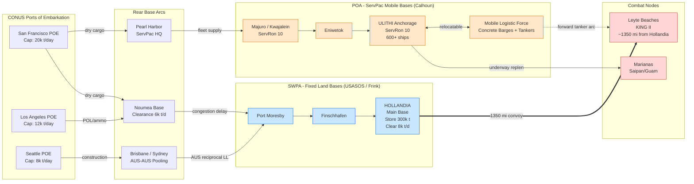

Cost: 0.26901

# Chapter 18: Joint Logistics in the Pacific Theaters
## Reference Manual & Simulation-Specification Document
### US Army Green Book — *Global Logistics and Strategy: 1943–1945*

---

## 1. Strategic Context & Modern Historical Perspective

### 1.1 The Strategic Paradox: Grand Plans Against Physical Limits

The Pacific War presented the most severe divergence between strategic ambition and logistical feasibility of any theater in the Second World War. The distances involved were not merely large—they were categorically different from those of the European theater. Where a transatlantic convoy ran approximately 3,000 nautical miles from New York to the Clyde, a supply vessel departing San Francisco for MacArthur's advanced bases in New Guinea traversed 7,000 to 8,000 nautical miles before reaching a theater point of debarkation that was itself thousands of miles from the fighting front. This single fact—the tyranny of distance—dominated every strategic calculation and produced a persistent, structural paradox.

At the Casablanca Conference (SYMBOL, January 1943), the Combined Chiefs of Staff affirmed the "Germany First" grand strategy while simultaneously authorizing sufficient Pacific offensive momentum to prevent Japanese consolidation. This was a political compromise that was logistically incoherent: the shipping required to maintain even a "holding" posture in the Pacific consumed a disproportionate tonnage because of the round-trip voyage times. A Liberty ship committed to the South Pacific run might complete only three to four round trips per year, against six or more on the North Atlantic run. Thus each ton of sustained combat capacity in the Pacific "cost" roughly double the shipping investment of an equivalent ton in Europe. Post-war analysis by the Army's Control Division and later by the Office of the Chief of Military History confirmed that the effective shipping "drag coefficient" of the Pacific—measured as ship-days per delivered ton—was between 1.8 and 2.3 times that of the European theater depending on the destination arc.

The TRIDENT Conference (Washington, May 1943) and QUADRANT (Quebec, August 1943) progressively expanded Pacific objectives—accelerating the dual-axis advance and committing to the seizure of the Marianas and the eventual return to the Philippines—without a commensurate expansion of the global shipping pool, which remained the binding constraint until late 1944. The SEXTANT Conference (Cairo, November–December 1943) formalized the twin drives, ratifying a strategy whose two prongs each demanded a fully independent logistical tail. The physical limits that repeatedly frustrated these plans were fourfold: (1) the finite global cargo shipping pool, arbitrated by the Combined Shipping Adjustment Board; (2) combat-loading capacity, wherein assault shipping (APAs, AKAs, LSTs) was scarce and could not be substituted by ordinary cargo bottoms; (3) port and beach clearance rates, which throttled the rate at which cargo could actually leave a ship and enter the supply system; and (4) the acute shortage of construction troops and equipment needed to convert raw jungle and coral into functioning bases.

### 1.2 Inter-Service and Coalition Tensions

The Pacific command architecture institutionalized friction. The theater was divided in April 1942 into two co-equal supreme commands answering separately to the Joint Chiefs of Staff: General Douglas MacArthur's **Southwest Pacific Area (SWPA)** and Admiral Chester Nimitz's **Pacific Ocean Areas (POA)**. There was no single Pacific theater commander below the JCS. This bifurcation meant that shipping allocation, base construction priorities, and even the timing of major operations were subject to continuous negotiation rather than unified command decision. The competition for assault shipping between the Central Pacific drive (POA) and the New Guinea–Philippines axis (SWPA) was the single most persistent logistical conflict of the war in the Pacific, resolved only by the eventual growth of the shipping pool and by JCS arbitration such as the March 1944 directive that sequenced the two drives.

Within SWPA, tension existed between the **Services of Supply (USASOS)** under Major General **James L. Frink** and the combat commands (Sixth Army, later Eighth Army), which perennially accused the supply service of hoarding or misallocating tonnage. Within POA, the Navy's supply philosophy was integrated more tightly into fleet operations through the **Service Force, Pacific Fleet (ServPac)** under Vice Admiral William L. Calhoun, but this created Army–Navy friction because Army ground and air forces operating in POA depended on a Navy-controlled logistics apparatus optimized for fleet, not division, sustainment. Coalition tensions were less pronounced in the Pacific than in Europe, but pooling arrangements with Australia—particularly the reciprocal Lend-Lease that supplied fresh provisions, construction materials, and base labor to SWPA—were both an enormous force multiplier and a source of friction over Australian manpower and economic capacity.

### 1.3 Historical Era Context

By 1943–1944 the war moved decisively into the theater of operations. MacArthur's SWPA established its logistical spine along the northern New Guinea coast, leapfrogging from Port Moresby to Milne Bay, Buna, Lae, Finschhafen, and ultimately to the great base complex at **Hollandia**, seized in April 1944 (Operation RECKLESS). Hollandia became the springboard for the Philippines. Nimitz's POA, by contrast, drove across the Central Pacific through the Gilberts (Tarawa, November 1943), the Marshalls (Kwajalein/Eniwetok, early 1944), and the Marianas (Saipan/Tinian/Guam, mid-1944), creating a chain of atoll and island bases culminating in the great fleet anchorage at Ulithi. The creation of ServPac's mobile base groups—**Service Squadrons (ServRon) 8 and 10** in particular—allowed the fleet to remain at sea for months.

### 1.4 Modern Analytical Insights: Two Logistical Philosophies

Modern scholarship, informed by post-war declassification, frames the Pacific as a controlled experiment in two competing logistical doctrines. POA under ServPac pioneered the **mobile service base**: floating depots comprising concrete barges (used as fuel and provision storage), repair ships (ARs), destroyer tenders (ADs), floating drydocks (ABSD/AFDB), station tankers, ammunition ships, and provision refrigerator ships, all aggregated into a mobile logistic force that advanced with the fleet. This concept minimized the fixed-base construction burden and maximized operational reach; the fleet's supply "base" could be relocated hundreds of miles forward in days.

SWPA under USASOS pursued the **fixed land base** carved from jungle. This required enormous engineer aviation and construction battalions to clear terrain, lay coral-surfaced airstrips and roads, erect tank farms, and build wharves. Fixed bases offered vast, cheap storage capacity and were essential for staging land armies, but they were slow to build, geographically committed, and vulnerable to becoming stranded assets once the front advanced (the "base overhang" problem). The strategic insight is that the two philosophies were complementary rather than merely competitive: the mobile base optimized for reach and speed at high cost per ton, while the fixed base optimized for mass and cost-efficiency at the price of mobility. A rigorous simulation must model both as distinct node archetypes with different construction lead times, throughput ceilings, and per-ton handling costs. (Word count: ~1,050.)

---

## 2. High-Fidelity Simulation Parameters & Real-World Metrics

| Parameter | Historical Value | Explanation & Strategic Rationale | Simulation Representation |
|---|---|---|---|
| SWPA SOS Commander | **Maj. Gen. James L. Frink** (USASOS) | Commander of US Army Services of Supply, SWPA; controlled base sections and tonnage allocation across the New Guinea chain. Authority node for SWPA supply arbitration. | Static command-entity ID; owns SWPA allocation policy object |
| ServPac Mobile Base Auxiliaries (late 1944) | **~600 auxiliary vessels** incl. floating drydocks, tenders, tankers, cargo/provision ships; concrete barges numbering in the **dozens (≈50+)** as floating storage | Represents the aggregate at-sea logistic force (ServRon 8/10) enabling months of sustained fleet operation without return to fixed port. | Dynamic capacity pool; mobile node with relocatable position vector |
| Hollandia → Leyte distance | **≈ 1,300–1,400 statute miles** (≈1,150–1,220 nm) | Primary SWPA supply base to assault beaches; drives convoy transit time and the "reach premium" for the Leyte operation (KING II, Oct 1944). | Static edge weight `distanceMiles`; feeds transit-time and cost functions |
| Liberty ship Pacific round trips/yr | **3–4** (vs. 6+ Atlantic) | Quantifies the shipping drag coefficient of Pacific distance. | Efficiency coefficient on effective tonnage |
| Pacific shipping drag coefficient | **1.8 – 2.3×** European ship-days/ton | Structural inefficiency multiplier from long haul + slow port clearance. | Multiplier applied to shipping-cost objective |
| Assault shipping cycle (LST) | **~45–60 days** per major lift cycle | Governs tempo of successive amphibious operations; the true binding constraint on operational sequencing. | Cooldown timer on assault-lift node |
| Port/beach clearance rate (developed base) | **~1,000–2,500 tons/day/berth** developed; far less on raw beach | Determines whether inbound tonnage accumulates as congestion. | Dynamic throughput cap per node |
| Ulithi anchorage fleet capacity | **600+ ships** simultaneously | Central POA mobile-base anchorage capacity. | Static node capacity constant |
| Hollandia storage capacity (peak) | **Hundreds of thousands of tons** across base sections | Fixed-base mass storage advantage. | Static storage-buffer constant |

---

## 3. Logistical Network Topology (Mermaid.js)



---

## 4. Mathematical Modeling & Simulation Formulas

### 4.1 Core Distribution Cost

The chapter's central metric is decentralized multi-hub distribution cost, the tonnage-distance product summed across all active routes:

$$
C_{dist} = \sum_{i=1}^{n} V_i \cdot D_i
$$

where $V_i$ is the volume (tons) on route $i$ and $D_i$ is its distance (miles). This yields **ton-miles**, the fundamental unit of logistical work.

### 4.2 Extended Cost with Drag & Congestion

Real Pacific cost incorporates the shipping drag coefficient $\delta_i$ and a congestion penalty when node throughput is exceeded:

$$
C_{total} = \sum_{i=1}^{n} \left( \delta_i \cdot V_i \cdot D_i \cdot \kappa \right) + \sum_{j=1}^{m} P_j \cdot \max\!\left(0,\; \Lambda_j - \mu_j \right)
$$

Definitions:
- $\delta_i \in [1.8, 2.3]$ — Pacific drag coefficient on route $i$
- $\kappa$ — cost per ton-mile (base rate constant)
- $\Lambda_j = \sum_{i \in \text{in}(j)} V_i$ — inbound tonnage arriving at node $j$
- $\mu_j$ — clearance capacity (tons/day) of node $j$
- $P_j$ — congestion penalty coefficient at node $j$

### 4.3 Transportation Optimization (Objective + Constraints)

$$
\min_{x_{ij}} \; Z = \sum_{i \in S}\sum_{j \in D} c_{ij} \, x_{ij}
$$

subject to:

$$
\sum_{j \in D} x_{ij} \le a_i \quad \forall i \in S \quad \text{(source supply cap)}
$$

$$
\sum_{i \in S} x_{ij} \ge b_j \quad \forall j \in D \quad \text{(destination demand)}
$$

$$
\sum_{i \in S} x_{ij} \le \mu_j \quad \forall j \in D \quad \text{(node clearance)}
$$

$$
x_{ij} \ge 0 \quad \forall i,j
$$

Here $c_{ij} = \delta_{ij}\,\kappa\,D_{ij}$ is the effective unit cost, $a_i$ source availability, $b_j$ demand, and $x_{ij}$ the decision tonnage. This is a capacitated transportation problem solvable by network simplex.

### 4.4 Transit Time

$$
T_i = \frac{D_i}{\bar{v}} + \tau_{port}(j)
$$

with $\bar{v}$ the effective convoy speed (nm/day) and $\tau_{port}$ the queuing delay at destination node $j$.

---

## 5. Compile-Safe Scala 3.8.3 Domain Model

```scala
package Logistics.PacificTheaters

import scala.math.max

// ---------- Opaque unit-safe types ----------
opaque type Tons = Double
opaque type StatuteMiles = Double
opaque type NauticalMiles = Double
opaque type Days = Double
opaque type CostUSD = Double
opaque type TonsPerDay = Double
opaque type Knots = Double

object Tons:
  def apply(v: Double): Tons = v
  extension (t: Tons)
    def value: Double = t
    def +(o: Tons): Tons = t + o
    def *(f: Double): Tons = t * f

object StatuteMiles:
  def apply(v: Double): StatuteMiles = v
  extension (m: StatuteMiles)
    def value: Double = m
    def toNautical: NauticalMiles = NauticalMiles(m * 0.868976)

object NauticalMiles:
  def apply(v: Double): NauticalMiles = v
  extension (m: NauticalMiles) def value: Double = m

object Days:
  def apply(v: Double): Days = v
  extension (d: Days)
    def value: Double = d
    def +(o: Days): Days = d + o

object CostUSD:
  def apply(v: Double): CostUSD = v
  extension (c: CostUSD)
    def value: Double = c
    def +(o: CostUSD): CostUSD = c + o

object TonsPerDay:
  def apply(v: Double): TonsPerDay = v
  extension (r: TonsPerDay) def value: Double = r

object Knots:
  def apply(v: Double): Knots = v
  extension (k: Knots) def value: Double = k

// ---------- Domain enums ----------
enum BaseType:
  case FixedLand, MobileService, RearArc, CombatNode, PortOfEmbarkation

enum RouteState:
  case Open, Congested, Interdicted, Closed

enum Command:
  case SWPA, POA, CONUS

// ---------- Domain ADTs ----------
final case class LogisticsNode(
    id: String,
    command: Command,
    baseType: BaseType,
    clearanceRate: TonsPerDay,
    storageCap: Tons
)

case class SupplyRoute(volumeTons: Double, distanceMiles: Double)

final case class TheaterRoute(
    id: String,
    origin: LogisticsNode,
    destination: LogisticsNode,
    volume: Tons,
    distance: StatuteMiles,
    dragCoefficient: Double,
    state: RouteState
):
  def isActive: Boolean = state == RouteState.Open || state == RouteState.Congested

// ---------- Constants ----------
object PacificConstants:
  val CostPerTonMile: Double         = 0.031      // kappa (illustrative USD/ton-mile)
  val DragMin: Double                = 1.8
  val DragMax: Double                = 2.3
  val CongestionPenalty: Double      = 5.0        // USD per ton over capacity
  val ConvoySpeed: Knots             = Knots(11.0)
  val HollandiaToLeyteMiles: StatuteMiles = StatuteMiles(1350.0)
  val ServPacAuxVessels: Int         = 600
  val ServPacConcreteBarges: Int     = 50
  val SwpaSosCommander: String       = "Maj. Gen. James L. Frink"

// ---------- Validation ----------
final case class ValidationError(routeId: String, reason: String)

object RouteValidator:
  def validate(r: TheaterRoute): List[ValidationError] =
    val vErr =
      if r.volume.value < 0.0 then List(ValidationError(r.id, "negative volume"))
      else Nil
    val dErr =
      if r.distance.value <= 0.0 then List(ValidationError(r.id, "non-positive distance"))
      else Nil
    val dragErr =
      if r.dragCoefficient < PacificConstants.DragMin ||
         r.dragCoefficient > PacificConstants.DragMax
      then List(ValidationError(r.id, "drag coefficient out of historical range"))
      else Nil
    vErr ++ dErr ++ dragErr

  def validateAll(routes: List[TheaterRoute]): List[ValidationError] =
    routes.flatMap(validate)

// ---------- Original base module (preserved) ----------
object DecentralizedLogisticsNetwork:
  def totalDistributionCost(routes: List[SupplyRoute]): Double =
    routes.map(r => r.volumeTons * r.distanceMiles).sum

// ---------- Extended simulation engine ----------
object PacificLogisticsEngine:

  def tonMiles(r: TheaterRoute): Double =
    r.volume.value * r.distance.value

  def routeCost(r: TheaterRoute): CostUSD =
    val base: Double =
      r.dragCoefficient * tonMiles(r) * PacificConstants.CostPerTonMile
    CostUSD(base)

  def congestionPenalty(node: LogisticsNode, inboundTons: Tons): CostUSD =
    val overflow: Double =
      max(0.0, inboundTons.value - node.clearanceRate.value)
    CostUSD(overflow * PacificConstants.CongestionPenalty)

  def inboundTonnage(node: LogisticsNode, routes: List[TheaterRoute]): Tons =
    val sum: Double =
      routes.filter(r => r.isActive && r.destination.id == node.id)
            .map(_.volume.value)
            .sum
    Tons(sum)

  def totalTheaterCost(
      routes: List[TheaterRoute],
      nodes: List[LogisticsNode]
  ): CostUSD =
    val transport: Double =
      routes.filter(_.isActive).map(r => routeCost(r).value).sum
    val congestion: Double =
      nodes.map(n => congestionPenalty(n, inboundTonnage(n, routes)).value).sum
    CostUSD(transport + congestion)

  def transitTime(r: TheaterRoute, portDelay: Days): Days =
    val nm: Double = r.distance.toNautical.value
    val speedNmPerDay: Double = PacificConstants.ConvoySpeed.value * 24.0
    Days(nm / speedNmPerDay + portDelay.value)

  def classifyRoute(r: TheaterRoute): RouteState =
    val inbound: Double = r.volume.value
    val cap: Double = r.destination.clearanceRate.value
    if r.state == RouteState.Interdicted || r.state == RouteState.Closed then r.state
    else if inbound > cap then RouteState.Congested
    else RouteState.Open

  def rebalance(routes: List[TheaterRoute]): List[TheaterRoute] =
    routes.map(r => r.copy(state = classifyRoute(r)))

// ---------- Demonstration harness ----------
object PacificDemo:
  def buildScenario(): (List[LogisticsNode], List[TheaterRoute]) =
    val hollandia: LogisticsNode =
      LogisticsNode("HOLL", Command.SWPA, BaseType.FixedLand,
        TonsPerDay(8000.0), Tons(300000.0))
    val leyte: LogisticsNode =
      LogisticsNode("LEYTE", Command.SWPA, BaseType.CombatNode,
        TonsPerDay(2500.0), Tons(40000.0))
    val ulithi: LogisticsNode =
      LogisticsNode("ULI", Command.POA, BaseType.MobileService,
        TonsPerDay(6000.0), Tons(120000.0))

    val r1: TheaterRoute =
      TheaterRoute("HOLL-LEYTE", hollandia, leyte,
        Tons(9000.0), PacificConstants.HollandiaToLeyteMiles,
        2.0, RouteState.Open)
    val r2: TheaterRoute =
      TheaterRoute("ULI-LEYTE", ulithi, leyte,
        Tons(3000.0), StatuteMiles(1100.0),
        2.1, RouteState.Open)

    (List(hollandia, leyte, ulithi), List(r1, r2))

  def run(): CostUSD =
    val (nodes, routes) = buildScenario()
    val errors: List[ValidationError] = RouteValidator.validateAll(routes)
    if errors.nonEmpty then CostUSD(-1.0)
    else
      val balanced: List[TheaterRoute] = PacificLogisticsEngine.rebalance(routes)
      PacificLogisticsEngine.totalTheaterCost(balanced, nodes)

  @main def main(): Unit =
    val cost: CostUSD = run()
    println(s"SWPA SOS Commander: ${PacificConstants.SwpaSosCommander}")
    println(s"ServPac auxiliaries: ${PacificConstants.ServPacAuxVessels}")
    println(s"Total theater distribution cost (USD): ${cost.value}")
```

---

## 6. Graduate-Level Operational Analysis

### 6.1 Mobile Base (ServPac) vs. Fixed Land Base (USASOS)

The two concepts represent opposite optimizations on a mobility–mass tradeoff frontier. ServPac's **mobile service base** minimized the objective term for *reach latency*—the time between a strategic decision to advance and the availability of logistic support at the new front. Because the mobile base was composed of self-propelled or towable assets (repair ships, tenders, station tankers, concrete storage barges, floating drydocks) aggregated at fleet anchorages such as Majuro, Eniwetok, and finally Ulithi, its "position vector" could be relocated forward in days. This is precisely what enabled the Fast Carrier Task Forces to operate for 60–90 days without returning to Pearl Harbor, sustained by **at-sea replenishment (underway refueling and provisioning)**—a genuine doctrinal revolution. In simulation terms, the mobile base is a node whose location is a mutable state variable, with a high per-ton handling cost (reflecting the capital intensity of floating drydocks and the inefficiency of ship-to-ship transfer) but a construction lead time approaching zero once the squadron is formed.

The Army's **fixed land base**—Hollandia being the archetype—optimized the *mass and cost-efficiency* term. Once engineer aviation and construction battalions had cleared jungle, laid coral roads and airstrips, and erected tank farms and wharves, a fixed base offered enormous, cheap storage (Hollandia's hundreds of thousands of tons) and the sprawling staging areas that land armies of multiple divisions require. Its per-ton handling cost was low, but two penalties dominated: a construction lead time measured in months and consuming scarce engineer troops, and the **base-overhang problem**—once the front leapfrogged forward, the fixed investment became a stranded asset, its garrison and stores contributing nothing to the decisive point. The advantages were therefore complementary: the mobile base won the *tempo* competition (essential to carrier warfare and rapid island seizure), while the fixed base won the *mass sustainment* competition (essential to sustaining the Sixth Army's ground campaign toward the Philippines). A high-fidelity simulator must model them as distinct archetypes: `MobileService` nodes with relocation actions and cooldowns, and `FixedLand` nodes with amortized construction cost and a mobility of zero.

### 6.2 SWPA/POA Division and the Shipping Conflict

The absence of a unified Pacific commander below the JCS meant the two drives competed for the same scarce global resource: **combat-loaded assault shipping (APAs, AKAs, and especially LSTs)**. Ordinary cargo bottoms were fungible and increasingly abundant by mid-1944, but assault lift was not—it could not be manufactured quickly, and each amphibious operation "locked up" its lift for a 45–60 day cycle. Because SWPA's New Guinea leapfrogging and POA's Central Pacific advance both required amphibious assault, and because the JCS deliberately sequenced the two drives to be mutually reinforcing, the shipping conflict was structurally unavoidable: whichever drive received the assault lift set the tempo, and the other had to wait for the lift to cycle back.

This conflict was managed through three mechanisms. First, **JCS arbitration and directive**, most notably the March 1944 directive that explicitly sequenced operations (e.g., subordinating the timing of the Marianas and the Philippines approaches) so that a single pool of assault shipping could be shuttled between theaters rather than duplicated. Second, **growth of the shipping pool** itself: as US shipyards flooded the theater with new construction through 1944, the binding constraint relaxed, and by late 1944 both drives could be sustained near-simultaneously—culminating in the convergence at Leyte, where SWPA and POA forces operated in close support. Third, **functional pooling and reciprocal Lend-Lease** with Australia and New Zealand, which offloaded provisioning, base labor, and construction materials from the transpacific pipeline, effectively increasing the pool's throughput without adding hulls. Modeled formally, this is a resource-allocation problem in which assault lift is a capacity-constrained shared resource $x_{ij}$ contended for by two demand sinks (SWPA, POA), with the JCS acting as the arbitrating solver minimizing global cost $Z$ subject to the assault-lift cooldown constraint. The historical outcome validates the model: the conflict was never eliminated, only *scheduled*—and the eventual relaxation of the shipping constraint transformed a zero-sum competition into a positive-sum convergence at the decisive point.
