Cost: 0.47609875

### 1. Strategic Context & Modern Historical Perspective

Chapter 18 occupies a crucial analytical transition in *Global Logistics and Strategy: 1943–1945*. Earlier strategic discussions concern allocation at the global level—shipping, munitions, landing craft, divisions, aircraft, and petroleum among the European, Mediterranean, China-Burma-India, and Pacific theaters. The Pacific chapters expose what happened after those allocations entered an operational environment characterized by extreme distance, immature ports, divided command, limited local resources, tropical deterioration, and an almost complete dependence on ocean transport. The decisive problem was not merely delivering cargo to “the Pacific,” but transforming undifferentiated strategic lift into usable combat power at a particular beach, airfield, anchorage, or forward depot.

#### The strategic paradox

The Allied strategic conferences of 1943 established objectives faster than the logistical system could generate the specialized capacity needed to execute them. Casablanca confirmed the primacy of defeating Germany while retaining pressure against Japan. TRIDENT gave greater definition to operations in Burma and the Pacific; QUADRANT approved continued offensives along both the Southwest Pacific and Central Pacific axes; and SEXTANT synchronized Pacific operations with plans for China, Burma, and the final assault on Germany. Each conference produced strategic calendars, but those calendars competed for a common pool of cargo shipping, tankers, escorts, landing ships, assault transports, construction units, and specialized matériel.

This created a paradox. At the aggregate level, the United States possessed an increasingly overwhelming volume of production and merchant tonnage. At the operational level, the relevant resources were often acutely scarce. A Liberty ship carrying boxed cargo was not interchangeable with an attack transport combat-loaded for an opposed landing. A fleet oiler could not be replaced by ordinary dry-cargo tonnage. An LST committed to Mediterranean or European operations could not simultaneously move tanks and engineer equipment across a Pacific reef. Nor did the nominal deadweight tonnage of a ship reveal whether the receiving port had enough berths, lighters, cranes, trucks, roads, labor, or storage to clear it.

Consequently, strategic shipping capacity must be distinguished from effective delivered capacity. A vessel lying offshore awaiting a berth remained part of the global shipping pool but produced no immediate theater throughput. Ships used as floating warehouses reduced the number available for cyclic employment. Poor documentation or badly sequenced loading increased discharge and rehandling time. Combat loading deliberately sacrificed volumetric efficiency in order to place tactically necessary cargo near the hatch and permit rapid selective unloading. The resulting loss of carrying efficiency was rational at the assault level but reduced the tonnage moved per hull at the global level.

Pacific distances magnified these effects. Cargo could pass through a continental port of embarkation, an advance base, a staging depot, a transshipment anchorage, and finally a landing beach. Every transfer imposed handling cost, delay, exposure to loss, and a requirement for labor and equipment. A nominally adequate supply pipeline could therefore fail because one intermediate node—Brisbane, Milne Bay, Hollandia, Manus, Eniwetok, Saipan, or Ulithi—could not clear cargo as quickly as ships arrived.

Modern operations research describes this as a capacitated, multicommodity network with endogenous congestion. The effective capacity of the system equals neither the sum of ship capacities nor the sum of port capacities. It is governed by the minimum cut through the complete network, adjusted for cargo compatibility, convoy schedules, weather, enemy action, vessel turnaround, and local inventory policy. The slowest critical combination of port clearance, lighterage, inland transport, storage, and onward shipping becomes the operational bottleneck.

#### Two theaters and two logistical philosophies

The Pacific was divided between General Douglas MacArthur’s Southwest Pacific Area, or SWPA, and Admiral Chester W. Nimitz’s Pacific Ocean Areas, or POA. The division had strategic and political origins, but it created two partially separate logistical systems drawing upon the same American industrial and maritime base.

SWPA advanced generally along the northern coast of New Guinea toward the Philippines. Its logistics were geographically progressive and predominantly land-base oriented. Each advance required the seizure or development of another foothold containing anchorages, beaches, roads, airfields, hospitals, depots, petroleum installations, and communications facilities. Bases such as Port Moresby, Milne Bay, Oro Bay, Lae, Finschhafen, Hollandia, and later Leyte formed an advancing chain. Some positions were bypassed tactically, but the bases that sustained the leapfrogging advance still demanded enormous engineer effort.

New Guinea imposed severe penalties. Existing road and rail infrastructure was negligible. Tropical rain degraded roads and airfields, while mud reduced vehicle productivity. Jungle and swamp complicated surveying, drainage, grading, and storage. Cargo frequently had to be discharged by lighter over beaches and then moved over hastily built roads. Warehouses needed dunnage and ventilation. Petroleum required pipelines, drums, tanks, pumps, and fire-control measures. Airfield construction consumed crushers, graders, bulldozers, dump trucks, pierced-steel planking, and engineer labor. Thus, SWPA’s forward movement was governed not only by assault shipping but by the rate at which engineers could convert a captured coastal enclave into a functioning logistics node.

The United States Army Services of Supply in SWPA, eventually commanded by Maj. Gen. James L. Frink, operated under persistent pressure from operational headquarters to support new advances before existing bases were mature. Combat commanders naturally sought to push supplies forward. Service commanders had to retain enough construction labor, transport, stocks, and shipping to prevent the rearward system from collapsing. The tension between “operational urgency” and “logistical completion” was structural rather than personal: every new base competed with older bases for engineers, harbor craft, trucks, and shipping.

POA developed a different solution. Nimitz’s campaigns crossed vast stretches of open ocean where permanent land bases were fewer and farther apart. The fleet therefore had to carry a substantial part of its support system with it. The Service Force, Pacific Fleet—normally abbreviated ServPac—assembled mobile service bases made up of tenders, repair ships, floating dry docks, depot ships, ammunition ships, fleet oilers, hospital ships, tugs, salvage vessels, refrigerated barges, dry-storage barges, and floating petroleum facilities. These mobile bases were concentrated at protected anchorages such as Majuro, Eniwetok, Manus, and especially Ulithi.

The mobile-base concept reduced dependence on fully developed ports. A captured atoll did not require a conventional harbor city before it could support a fleet. If it offered adequate depth, protected anchorage, access channels, and defensible air cover, ServPac could bring much of the harbor’s industrial and storage capacity afloat. Fleet units could refuel, rearm, receive provisions, undergo voyage repairs, and return to operations without sailing to Pearl Harbor or the continental United States.

This system shortened operational turnaround and increased fleet availability. Its key contribution was not simply additional cargo tonnage but reduced unproductive steaming. If a carrier task force had to travel thousands of miles to a permanent navy yard for routine replenishment or repair, the resulting loss of combat days could exceed the value of several additional ships. Mobile support converted distance into a manageable scheduling problem.

Nevertheless, the distinction between “mobile Navy” and “fixed Army” must not be overstated. POA still depended on major fixed installations at Pearl Harbor and on airfields, depots, hospitals, tank farms, and communications facilities constructed on captured islands. SWPA, meanwhile, relied heavily on coastal shipping, landing craft, harbor craft, and floating equipment. The difference was one of emphasis and network architecture: POA concentrated support in a fleet-centered system capable of relocating between anchorages, while SWPA repeatedly constructed land-centered regional bases along an advancing continental and archipelagic corridor.

#### Interservice and coalition tensions

The split command produced recurring competition for shipping. MacArthur and Nimitz each possessed a plausible strategic avenue toward Japan. Both required amphibious lift, escorts, tankers, construction units, aircraft, and replacements. Washington could not treat one theater’s requirements independently of the other because the same War Shipping Administration vessels, naval auxiliaries, and landing craft supported both.

Army and Navy accounting practices complicated comparison. The Army commonly stated requirements in measurement tons, weight tons, personnel spaces, or monthly shipping, while the Navy emphasized task organization, vessel types, and fleet-train readiness. A request for “shipping” could therefore conceal radically different operational needs. General cargo might be carried in commercial-type vessels, while an assault required APA and AKA transports, LSDs, LSTs, LCTs, and specialized control and communications ships. Landing craft shortages were especially resistant to aggregate tonnage solutions.

There was also friction between service forces and combat commands. Operational headquarters wanted vessels loaded for the next objective and cargo moved to the most forward possible location. Logistical commands sought balanced stocks, orderly port operations, vessel turnaround, preventive maintenance, and reserves. Forward accumulation could improve readiness for one operation while immobilizing shipping and creating congestion. Conversely, strict shipping efficiency could leave combat forces without tactically accessible loads.

Coalition arrangements added another layer. British and American shipping was strategically pooled, but pooling did not eliminate national control, differing military priorities, or restrictions on vessel employment. The Combined Shipping Adjustment Board and related machinery allocated tonnage across global commitments. British requirements in the Indian Ocean, Middle East, and European theaters affected resources potentially available for the Pacific. Lend-lease cargoes, Soviet requirements, and civilian imports also consumed shipping capacity. Thus, the Pacific did not draw upon an isolated American fleet but upon a globally balanced system in which local urgency had to be reconciled with coalition strategy.

#### Modern analytical interpretation

Postwar scholarship has qualified the traditional image of Pacific logistics as a frictionless expression of American material abundance. Industrial capacity was enormous, but usable logistical power depended upon synchronization. The critical variables were often timing, location, compatibility, and network clearance rather than national production totals.

Modern network analysis also demonstrates why decentralization could be advantageous. Multiple hubs reduced dependence on a single catastrophic point of failure and allowed separate operational axes to proceed. However, decentralization imposed duplication: each theater needed headquarters, depot stocks, repair establishments, communications systems, and safety reserves. It also encouraged local optimization. SWPA might retain ships to clear Hollandia or support Leyte while POA required the same categories of vessels for Ulithi and the Marianas. Without central arbitration, theater commands had incentives to overstate needs and retain scarce resources against uncertain future demands.

The eventual success of the system depended on hierarchical coordination rather than complete unification. The Joint Chiefs of Staff established strategic priorities; Army and Navy agencies allocated service-specific assets; global shipping authorities balanced merchant tonnage; and theater commands scheduled operational employment. The system remained administratively untidy, but it was adaptable. American production progressively relaxed many constraints, while mobile service organizations, engineer construction, improved port management, and forward petroleum distribution increased the fraction of nominal resources converted into combat power.

The central lesson is that Pacific logistics was not a simple pipeline. It was a dynamic network in which bases changed function over time. A forward assault beach became a supply beach, then a regional depot, and later a rear-area node or bypassed installation. Floating assets could relocate, while fixed assets depreciated or lost strategic relevance as the front moved. Any serious simulation must therefore model not merely stock levels but node maturation, vessel turnaround, construction effort, cargo handling, route activation, congestion, and the opportunity cost of retaining scarce mobile capacity at one hub rather than another.

---

### 2. High-Fidelity Simulation Parameters & Real-World Metrics

Official statistics vary according to date and accounting scope. In particular, ServPac totals may include only commissioned auxiliaries in one table and auxiliaries plus district craft, barges, and other uncommissioned units in another. The simulator should therefore preserve the cited category and snapshot date instead of combining unlike inventories.

| Parameter | Historical value | Scope and explanation | Recommended simulation representation |
|---|---:|---|---|
| SWPA Services of Supply commander | **Maj. Gen. James L. Frink** | Frink commanded U.S. Army Services of Supply, Southwest Pacific Area, during the principal 1943–45 advance covered by the chapter. Earlier SWPA service-command arrangements and incumbents should be retained in a dated command chronology if the simulation begins in 1942. | Time-indexed `CommanderAssignment`, not an undated global constant. Frink’s assignment can modify coordination, planning continuity, or headquarters capacity only if the game explicitly models command effects. |
| ServPac auxiliary vessels, late 1944 | **305 vessels** | Official-history snapshots commonly report approximately this number of auxiliary vessels in the Service Force’s late-1944 mobile-support organization. It represents fleet-support hulls rather than the entire Pacific Fleet or all harbor craft. | Integer fleet inventory partitioned by subtype. Never model all 305 as interchangeable capacity. Repair ships, oilers, ammunition ships, tugs, and tenders require distinct compatibility constraints. |
| ServPac floating concrete barges, late 1944 | **560 barges** | Concrete barges provided floating dry, refrigerated, petroleum, and special-purpose storage at advanced anchorages. They expanded storage without waiting for conventional shore depots. | Integer mobile-storage inventory. Each barge should have cargo compatibility, storage capacity, tow requirement, relocation time, and vulnerability state. |
| Combined listed ServPac mobile-base units | **865 units** | Arithmetic sum of 305 auxiliary vessels and 560 concrete barges. This is an asset count, not a measure of equivalent capacity. | Reporting metric only. Do not use as a scalar throughput value. |
| Hollandia–Leyte operational distance | **about 1,400 statute miles** | Hollandia, MacArthur’s principal advanced supply base before Leyte, lay roughly 1,400 operational sea miles from the invasion area. Exact sailing distance varied by origin anchorage, routing, convoy diversion, and beach destination. | Baseline route length. Store as an expected value with scenario-specific variance rather than recomputing it as a straight-line geographic distance. |
| Hollandia–Leyte equivalent nautical distance | **about 1,216 nautical miles** | Conversion using 1 nautical mile = 1.15078 statute miles. | Derived quantity, not an independent historical observation. |
| Statute-mile conversion | **1 statute mile = 1.609344 km** | Exact international conversion. | Static unit constant. |
| Nautical-mile conversion | **1 nautical mile = 1.852 km** | Exact international definition. | Static unit constant. |
| Distribution work unit | **ton-mile** | One ton of cargo transported one statute mile. It measures transport work, not monetary expenditure or elapsed time. | Derived state variable: `volume × distance`. |
| Combat-loading penalty | **Scenario dependent; typically represented as 15–35% loss of volumetric efficiency** | Combat loading placed tactically urgent items for rapid selective discharge, sacrificing maximum cubic utilization. No single coefficient applies to every vessel or operation. | Cargo- and vessel-specific efficiency coefficient, calibrated by scenario. Never encode as a universal historical constant. |
| Port congestion threshold | **Utilization near or above 0.80–0.90 of practical capacity** | Queueing delay rises nonlinearly as vessel arrivals approach sustainable berth and lighterage capacity. Pacific ports could become congested below nominal capacity because clearance systems were incomplete. | Nonlinear delay function beginning at a configurable utilization threshold. |
| Floating-base relocation | **Tug- and weather-dependent** | Most barges could not relocate independently. Moving a mobile base temporarily reduced local storage and consumed towing assets. | State transition requiring tugs, route availability, elapsed time, and destination anchorage capacity. |
| Fixed-base maturation | **Multi-stage** | Beachheads did not become full bases immediately. Engineering, roads, drainage, storage, petroleum facilities, and harbor clearance matured progressively. | Enumerated states: `Assault`, `Developing`, `Operational`, `Saturated`, `Degraded`, `Bypassed`. |
| Bulk petroleum substitutability | **Low** | POL depended on tankers, drums, pipelines, storage tanks, pumps, and compatible barges. Ordinary dry-cargo space could not replace tanker capacity without repackaging and severe inefficiency. | Separate commodity and dedicated vessel/storage compatibility constraints. |
| Ammunition handling factor | **Hazard-limited** | Explosives required segregation, protected anchorages, specialized handling, and safety distances. | Independent hazardous-cargo capacity cap at nodes and routes. |
| Tropical infrastructure degradation | **Dynamic** | Heavy rain, humidity, corrosion, insects, and poor drainage reduced road, warehouse, and equipment efficiency. | Environment-dependent decay rate offset by engineer and maintenance effort. |
| Forward safety stock | **Demand-variance dependent** | Long and uncertain replenishment cycles induced higher safety stocks, but excessive forward inventory congested beaches and immobilized ships. | Endogenous inventory policy based on lead-time variance and service-level target. |
| Vessel turnaround time | **Sailing + queue + discharge + maintenance + return** | A ship’s useful capacity depended on cycle time, not simply deadweight tonnage. | Dynamic cycle calculation; available monthly lift equals payload times fleet size divided by average cycle duration. |
| Transshipment penalty | **One handling cycle per transfer** | Every intermediate hub required unloading, sorting, storage, and reloading, with possible damage or documentary loss. | Per-node handling time, handling cost, and fractional loss coefficient. |
| Redundant-hub benefit | **Scenario dependent** | Multiple hubs improved resilience and routing flexibility while duplicating inventories and base services. | Reliability benefit plus holding-cost and construction-cost penalties. |

#### Data-quality rule

The values **305 auxiliaries**, **560 concrete barges**, and **approximately 1,400 statute miles** should be stored with metadata fields for source, date, definition, and confidence. The fleet figures are inventory observations; they are not direct throughput rates. A single oiler may contribute more operationally relevant petroleum throughput than several storage barges, while a repair ship contributes maintenance capacity rather than cargo lift.

---

### 3. Logistical Network Topology (Detailed Mermaid.js Flowchart)

```mermaid
flowchart LR
    subgraph CONUS["Continental United States"]
        PROD["Industrial Production<br/>munitions, vehicles, rations, engineer stores"]
        POLSRC["Petroleum Sources and Refineries<br/>bulk POL"]
        POESF["San Francisco / Oakland POE<br/>berth and rail-clearance constraints"]
        POELA["Los Angeles / San Pedro POE<br/>berth and convoy constraints"]
        POESEA["Seattle POE<br/>northern routing and weather limits"]
        NAVYYD["West Coast Navy Yards<br/>repair and fleet-support preparation"]

        PROD -->|"rail: dry cargo and ammunition"| POESF
        PROD -->|"rail: vehicles and construction cargo"| POELA
        PROD -->|"rail: selected cargo"| POESEA
        POLSRC -->|"pipeline / coastal tanker"| POELA
        PROD -->|"naval stores"| NAVYYD
    end

    subgraph STRATEGIC["Strategic Ocean Lift Pool"]
        DRY["Dry-Cargo Shipping Pool<br/>payload limited by weight and cube"]
        TANK["Fleet and Commercial Tankers<br/>dedicated POL capacity"]
        ASSAULT["Combat-Loaded Assault Shipping<br/>APA / AKA / LST / LSD"]
        AUXPOOL["Naval Auxiliary Pool<br/>repair, depot, hospital, tug, tender"]
        ALLOC{"Joint and Service Allocation<br/>competing SWPA / POA demands"}
    end

    POESF --> DRY
    POELA --> DRY
    POESEA --> DRY
    POELA --> TANK
    POESF --> ASSAULT
    NAVYYD --> AUXPOOL

    DRY --> ALLOC
    TANK --> ALLOC
    ASSAULT --> ALLOC
    AUXPOOL --> ALLOC

    subgraph SWPA_REAR["SWPA Rear and Intermediate Base System"]
        BRIS["Brisbane<br/>administration, depot, repair"]
        SYD["Sydney<br/>heavy repair and procurement"]
        TOWNS["Townsville / Cairns<br/>staging and coastal transshipment"]
        PM["Port Moresby<br/>air and land-base support"]
        MILNE["Milne Bay<br/>harbor, depots, airfields"]
        ORO["Oro Bay<br/>lighterage-limited"]
        LAE["Lae / Finschhafen<br/>developing forward bases"]
    end

    ALLOC -->|"SWPA dry cargo; long ocean cycle"| BRIS
    ALLOC -->|"heavy repair and naval cargo"| SYD
    ALLOC -->|"SWPA POL"| MILNE
    BRIS -->|"coastal shipping; berth queue"| TOWNS
    SYD -->|"coastal convoy"| BRIS
    TOWNS -->|"small ships and aircraft supply"| PM
    TOWNS -->|"coastal convoy"| MILNE
    MILNE -->|"landing craft / small freighters"| ORO
    ORO -->|"weather-sensitive coastal route"| LAE

    subgraph SWPA_FORWARD["SWPA Forward Hub Chain"]
        HOLL["Hollandia<br/>principal advanced supply base<br/>finite beach, road, and depot clearance"]
        BIAK["Biak / Wakde<br/>air-base support nodes"]
        MANUS["Manus / Seeadler Harbor<br/>joint anchorage and repair hub"]
        MORO["Morotai<br/>staging and air support"]
        LEYTE["Leyte Assault Beaches<br/>~1,400 statute miles from Hollandia<br/>combat-loaded discharge"]
        LEYTEDEP["Leyte Developing Base<br/>roads, depots, hospitals, POL"]
        LUZON["Luzon Combat Nodes<br/>division supply areas"]
    end

    LAE -->|"forward convoy; limited escort and port clearance"| HOLL
    HOLL -->|"regional distribution"| BIAK
    HOLL -->|"alternative deep-water route"| MANUS
    HOLL -->|"dry cargo / ammunition"| MORO
    HOLL -->|"direct assault support; long turnaround"| LEYTE
    MORO -->|"shorter final-stage route"| LEYTE
    MANUS -->|"repair, fleet support, alternate replenishment"| LEYTE
    LEYTE -->|"beach clearance bottleneck"| LEYTEDEP
    LEYTEDEP -->|"truck / landing craft / coastal shipping"| LUZON

    subgraph POA_REAR["POA Rear Base System"]
        PH["Pearl Harbor<br/>major depot, repair, training, staging"]
        JOHNSTON["Johnston / Palmyra<br/>route support"]
        SOPAC["South Pacific Bases<br/>Noumea / Espiritu Santo"]
    end

    ALLOC -->|"POA dry cargo and replacements"| PH
    ALLOC -->|"POA fleet POL"| PH
    AUXPOOL -->|"tenders and repair assets"| PH
    PH -->|"secondary route"| JOHNSTON
    PH -->|"South Pacific support"| SOPAC

    subgraph POA_ADV["POA Advanced and Mobile Base Network"]
        MAJURO["Majuro<br/>advanced anchorage"]
        ENIW["Eniwetok<br/>staging and replenishment"]
        SAIPAN["Saipan / Tinian / Guam<br/>airfields, depots, fixed base construction"]
        ULITHI["Ulithi<br/>major fleet anchorage"]
        SERVPAC["ServPac Mobile Service Base<br/>305 auxiliaries in late-1944 inventory"]
        BARGES["560 Floating Concrete Barges<br/>dry, refrigerated, POL, and special storage"]
        FLEET["Fast Carrier and Amphibious Forces<br/>mobile combat demand"]
        IWO["Iwo Jima Combat Node"]
        OKI["Okinawa Combat Node"]
    end

    PH -->|"long-haul convoy"| MAJURO
    MAJURO -->|"forward convoy"| ENIW
    ENIW -->|"construction cargo / assault lift"| SAIPAN
    ENIW -->|"mobile-base transfer"| ULITHI
    SOPAC -->|"alternative route via Manus"| MANUS
    MANUS -->|"joint alternate route"| ULITHI

    SERVPAC -->|"repair, ammunition, provisions, medical support"| ULITHI
    BARGES -->|"floating storage; tug constrained"| ULITHI
    ULITHI -->|"underway replenishment and sortie support"| FLEET
    FLEET -->|"combat expenditure"| IWO
    FLEET -->|"combat expenditure"| OKI
    SAIPAN -->|"air and staging support"| IWO
    SAIPAN -->|"alternate supply route"| OKI

    subgraph CONTROL["Capacity and State Controls"]
        BERTH["Berth / Anchorage Capacity<br/>ship-days"]
        LIGHTER["Lighterage Capacity<br/>tons per day"]
        CLEAR["Road and Beach Clearance<br/>tons per day"]
        STORE["Storage Capacity<br/>tons by commodity"]
        ENGINEER["Engineer Construction Capacity<br/>work-hours per day"]
        QUEUE["Congestion Delay<br/>nonlinear above practical utilization"]
        WEATHER["Weather and Tropical Degradation"]
        ENEMY["Enemy Action and Route Interdiction"]
    end

    BERTH -.-> HOLL
    LIGHTER -.-> LEYTE
    CLEAR -.-> LEYTEDEP
    STORE -.-> ULITHI
    ENGINEER -.-> HOLL
    ENGINEER -.-> LEYTEDEP
    QUEUE -.-> HOLL
    QUEUE -.-> ULITHI
    WEATHER -.-> ORO
    WEATHER -.-> LEYTE
    ENEMY -.-> LEYTE
    ENEMY -.-> FLEET
```



The network contains two alternative strategic structures. SWPA uses serially advancing land hubs, making node construction and beach clearance dominant. POA uses fewer but larger anchorages supplemented by relocatable service assets. Manus links the systems and provides an alternative route, but such cross-routing consumes capacity and requires command coordination.

---

### 4. Mathematical Modeling & Simulation Formulas

#### 4.1 Sets and indices

Let:

- $N$ be the set of logistical nodes;
- $A \subseteq N \times N$ be the set of directed routes;
- $K$ be the set of commodities;
- $T$ be the set of time periods;
- $M$ be the set of transport modes;
- $S \subseteq N$ be source nodes;
- $D \subseteq N$ be combat-demand nodes.

Commodities should minimally distinguish dry cargo, ammunition, bulk petroleum, refrigerated provisions, personnel, construction matériel, and replacement equipment.

#### 4.2 Parameters

- $d_{ij}$: distance over route $(i,j)$;
- $u_{ijmt}$: route capacity for mode $m$ during period $t$;
- $h_{ikt}$: handling capacity at node $i$ for commodity $k$;
- $b_{it}$: berth or anchorage capacity at node $i$;
- $s_{ik}$: storage capacity at node $i$ for commodity $k$;
- $q_{ikt}$: exogenous supply entering node $i$;
- $r_{ikt}$: combat or service demand at node $i$;
- $\tau_{ijm}$: nominal transit time;
- $\ell_{ijk}$: expected fractional transit loss;
- $\eta_{ijmk}$: compatibility and loading-efficiency coefficient;
- $\rho_{it}$: node utilization;
- $\alpha_{ij}$: direct operating cost per ton-mile;
- $\beta_i$: congestion penalty coefficient;
- $e_{it}$: engineer effort allocated to base construction;
- $\gamma_i$: base-capacity gain per engineer work unit.

#### 4.3 Decision variables

- $x_{ijmkt} \ge 0$: tons of commodity $k$ dispatched from $i$ to $j$ by mode $m$;
- $I_{ikt} \ge 0$: ending inventory at node $i$;
- $y_{ijt} \in \{0,1\}$: whether route $(i,j)$ is operational;
- $z_{it} \in \{0,1\}$: whether node $i$ is operational;
- $w_{it} \ge 0$: unmet demand;
- $v_{it} \ge 0$: vessel or berth service demand;
- $E_{it} \ge 0$: cumulative engineer investment;
- $R_{at} \in \{0,1\}$: whether mobile asset $a$ is assigned to a particular base.

#### 4.4 Distribution work

The requested baseline concept is:

$$
\text{Mathematical Concept: } C_{dist} = \sum_i V_i \cdot D_i
$$

For a network and multiple commodities, it becomes:

$$
C_{\text{dist}}
=
\sum_{t \in T}
\sum_{(i,j)\in A}
\sum_{m\in M}
\sum_{k\in K}
x_{ijmkt} d_{ij}
$$

Its physical unit is ton-miles. This expression is not, by itself, a monetary cost. Monetary operating cost is:

$$
C_{\text{transport}}
=
\sum_{t,i,j,m,k}
\alpha_{ijm}\,x_{ijmkt}d_{ij}
$$

The Hollandia–Leyte movement of $V$ tons produces baseline distribution work:

$$
C_{\text{Hollandia-Leyte}}
=
1{,}400V
\quad \text{ton-miles}
$$

For example, 100,000 tons moved over that route represents:

$$
100{,}000 \times 1{,}400
=
140{,}000{,}000
\text{ ton-miles}
$$

#### 4.5 Congestion-adjusted objective

Port delay should rise nonlinearly as utilization approaches capacity. A suitable objective is:

$$
\min Z =
C_{\text{transport}}
+
\sum_{i,t}
\beta_i
\frac{\rho_{it}^{\,2}}{1-\rho_{it}}
+
\sum_{i,k,t} p_{ik} I_{ikt}
+
\sum_{i,k,t} \pi_{ik} w_{ikt}
+
\sum_{a,t} c_a^{\text{move}} M_{at}
$$

where:

- $p_{ik}$ is inventory holding and deterioration cost;
- $\pi_{ik}$ is the penalty for unmet demand;
- $M_{at}$ indicates relocation of a floating-base asset;
- the congestion term tends toward infinity as $\rho_{it}\rightarrow 1$.

A numerically safer implementation can impose $\rho_{it}\leq \bar{\rho}<1$ or use a piecewise-linear approximation.

#### 4.6 Flow conservation

For each node, commodity, and period:

$$
I_{ik,t}
=
I_{ik,t-1}
+
q_{ikt}
+
\sum_{j,m}
(1-\ell_{jik})
x_{jimk,t-\tau_{jim}}
-
\sum_{j,m} x_{ijmkt}
-
r_{ikt}
+
w_{ikt}
$$

This equation distinguishes dispatch from arrival. Cargo sent in period $t$ does not become available at its destination until the transit lag has elapsed.

#### 4.7 Route-capacity constraints

$$
\sum_{k\in K}
\frac{x_{ijmkt}}{\eta_{ijmk}}
\leq
u_{ijmt}\,y_{ijt}
$$

The efficiency coefficient $\eta_{ijmk}$ captures:

- combat-loading loss;
- cargo cube or weight restrictions;
- incompatible cargo;
- weather effects;
- convoy formation loss;
- specialized handling requirements.

For incompatible combinations, $\eta_{ijmk}=0$ and the corresponding flow variable must be fixed at zero.

#### 4.8 Node handling and port clearance

$$
\sum_{j,m}x_{ijmkt}
+
\sum_{j,m}(1-\ell_{jik})x_{jimk,t-\tau_{jim}}
\leq
h_{ikt}z_{it}
$$

For aggregate port handling:

$$
\sum_{j,m,k} x_{ijmkt}
\leq
H_{it}
$$

where effective capacity evolves as:

$$
H_{i,t+1}
=
(1-\delta_{it})H_{it}
+
\gamma_i e_{it}
+
H_{it}^{\text{mobile}}
$$

Here $\delta_{it}$ represents weather, deterioration, enemy damage, or maintenance shortfall. $H_{it}^{\text{mobile}}$ represents capacity contributed by tenders, barges, repair ships, floating cranes, and similar ServPac assets.

#### 4.9 Storage constraints

$$
0 \leq I_{ikt} \leq s_{ik}^{\text{fixed}} + s_{ikt}^{\text{mobile}}
$$

Mobile storage is determined by assigned assets:

$$
s_{ikt}^{\text{mobile}}
=
\sum_{a}
\kappa_{ak}R_{ait}
$$

where $\kappa_{ak}$ is the usable storage capacity of asset $a$ for commodity $k$.

#### 4.10 Vessel cycle capacity

A fleet’s sustainable lift is governed by turnaround time:

$$
U_{fmt}^{\text{cycle}}
=
\frac{n_{fmt}p_{fm}\Delta t}
{\tau_{fm}^{\text{sail}}
+\tau_{fm}^{\text{queue}}
+\tau_{fm}^{\text{discharge}}
+\tau_{fm}^{\text{maintenance}}}
$$

where $n_{fmt}$ is the number of available vessels and $p_{fm}$ their average effective payload. Port congestion increases $\tau^{\text{queue}}$ and can therefore reduce network capacity even when no ships are physically lost.

#### 4.11 Service-level and safety-stock requirement

For lead-time demand with mean $\mu_{ikL}$ and standard deviation $\sigma_{ikL}$:

$$
SS_{ik}
=
z_{\phi}\sigma_{ikL}
$$

and:

$$
I_{ikt}
\geq
\mu_{ikL}
+
SS_{ik}
$$

for commodities subject to a target service probability $\phi$. Because excessive stock can congest a developing base, this lower bound must be reconciled with finite storage and handling capacity.

---

### 5. Compile-Safe Scala 3.8.3 Domain Model

```scala
package Logistics.PacificTheaters

opaque type Tons = Double

object Tons:
  def from(value: Double): Either[String, Tons] =
    if value.isNaN || value.isInfinity || value < 0.0 then
      Left("Tons must be finite and non-negative")
    else Right(value)

  def unsafe(value: Double): Tons =
    from(value) match
      case Right(valid) => valid
      case Left(message) => throw new IllegalArgumentException(message)

  val zero: Tons = 0.0

  extension (value: Tons)
    def toDouble: Double = value
    def +(other: Tons): Tons = value + other
    def -(other: Tons): Tons = value - other
    def *(factor: Double): Tons = unsafe(value * factor)
    def <=(other: Tons): Boolean = value <= other
    def <(other: Tons): Boolean = value < other

opaque type StatuteMiles = Double

object StatuteMiles:
  def from(value: Double): Either[String, StatuteMiles] =
    if value.isNaN || value.isInfinity || value < 0.0 then
      Left("Statute miles must be finite and non-negative")
    else Right(value)

  def unsafe(value: Double): StatuteMiles =
    from(value) match
      case Right(valid) => valid
      case Left(message) => throw new IllegalArgumentException(message)

  val zero: StatuteMiles = 0.0

  extension (value: StatuteMiles)
    def toDouble: Double = value
    def toNauticalMiles: NauticalMiles =
      NauticalMiles.unsafe(value / 1.1507794480235425)

opaque type NauticalMiles = Double

object NauticalMiles:
  def from(value: Double): Either[String, NauticalMiles] =
    if value.isNaN || value.isInfinity || value < 0.0 then
      Left("Nautical miles must be finite and non-negative")
    else Right(value)

  def unsafe(value: Double): NauticalMiles =
    from(value) match
      case Right(valid) => valid
      case Left(message) => throw new IllegalArgumentException(message)

  extension (value: NauticalMiles)
    def toDouble: Double = value
    def toStatuteMiles: StatuteMiles =
      StatuteMiles.unsafe(value * 1.1507794480235425)

opaque type Days = Double

object Days:
  def from(value: Double): Either[String, Days] =
    if value.isNaN || value.isInfinity || value < 0.0 then
      Left("Days must be finite and non-negative")
    else Right(value)

  def unsafe(value: Double): Days =
    from(value) match
      case Right(valid) => valid
      case Left(message) => throw new IllegalArgumentException(message)

  val zero: Days = 0.0

  extension (value: Days)
    def toDouble: Double = value
    def +(other: Days): Days = unsafe(value + other)

opaque type Hours = Double

object Hours:
  def from(value: Double): Either[String, Hours] =
    if value.isNaN || value.isInfinity || value < 0.0 then
      Left("Hours must be finite and non-negative")
    else Right(value)

  def unsafe(value: Double): Hours =
    from(value) match
      case Right(valid) => valid
      case Left(message) => throw new IllegalArgumentException(message)

  extension (value: Hours)
    def toDouble: Double = value
    def toDays: Days = Days.unsafe(value / 24.0)

opaque type TonsPerDay = Double

object TonsPerDay:
  def from(value: Double): Either[String, TonsPerDay] =
    if value.isNaN || value.isInfinity || value < 0.0 then
      Left("Tons per day must be finite and non-negative")
    else Right(value)

  def unsafe(value: Double): TonsPerDay =
    from(value) match
      case Right(valid) => valid
      case Left(message) => throw new IllegalArgumentException(message)

  val zero: TonsPerDay = 0.0

  extension (value: TonsPerDay)
    def toDouble: Double = value
    def capacityOver(days: Days): Tons =
      Tons.unsafe(value * days.toDouble)

opaque type Efficiency = Double

object Efficiency:
  def from(value: Double): Either[String, Efficiency] =
    if value.isNaN || value.isInfinity || value < 0.0 || value > 1.0 then
      Left("Efficiency must be finite and between zero and one")
    else Right(value)

  def unsafe(value: Double): Efficiency =
    from(value) match
      case Right(valid) => valid
      case Left(message) => throw new IllegalArgumentException(message)

  val perfect: Efficiency = 1.0

  extension (value: Efficiency)
    def toDouble: Double = value

opaque type Probability = Double

object Probability:
  def from(value: Double): Either[String, Probability] =
    if value.isNaN || value.isInfinity || value < 0.0 || value > 1.0 then
      Left("Probability must be finite and between zero and one")
    else Right(value)

  def unsafe(value: Double): Probability =
    from(value) match
      case Right(valid) => valid
      case Left(message) => throw new IllegalArgumentException(message)

  val zero: Probability = 0.0

  extension (value: Probability)
    def toDouble: Double = value

opaque type TonMiles = Double

object TonMiles:
  def from(value: Double): Either[String, TonMiles] =
    if value.isNaN || value.isInfinity || value < 0.0 then
      Left("Ton-miles must be finite and non-negative")
    else Right(value)

  def unsafe(value: Double): TonMiles =
    from(value) match
      case Right(valid) => valid
      case Left(message) => throw new IllegalArgumentException(message)

  val zero: TonMiles = 0.0

  extension (value: TonMiles)
    def toDouble: Double = value
    def +(other: TonMiles): TonMiles = unsafe(value + other)

opaque type NodeId = String

object NodeId:
  def from(value: String): Either[String, NodeId] =
    val normalized: String = value.trim
    if normalized.isEmpty then Left("Node identifier must not be empty")
    else Right(normalized)

  def unsafe(value: String): NodeId =
    from(value) match
      case Right(valid) => valid
      case Left(message) => throw new IllegalArgumentException(message)

  extension (value: NodeId)
    def text: String = value

opaque type RouteId = String

object RouteId:
  def from(value: String): Either[String, RouteId] =
    val normalized: String = value.trim
    if normalized.isEmpty then Left("Route identifier must not be empty")
    else Right(normalized)

  def unsafe(value: String): RouteId =
    from(value) match
      case Right(valid) => valid
      case Left(message) => throw new IllegalArgumentException(message)

  extension (value: RouteId)
    def text: String = value

enum CargoClass:
  case DryCargo
  case Ammunition
  case BulkPetroleum
  case RefrigeratedProvisions
  case ConstructionMateriel
  case Vehicles
  case MedicalSupplies

enum TransportMode:
  case OceanCargoShip
  case Tanker
  case AssaultTransport
  case LandingShip
  case CoastalVessel
  case Barge
  case Truck
  case Aircraft

enum NodeKind:
  case ContinentalPort
  case RearBase
  case FixedLandBase
  case MobileServiceBase
  case Anchorage
  case AssaultBeach
  case CombatNode

enum NodeStatus:
  case Assault
  case Developing
  case Operational
  case Saturated
  case Degraded
  case Bypassed
  case Closed

enum RouteStatus:
  case Planned
  case Open
  case Congested
  case Interdicted
  case Closed

enum AssetKind:
  case FleetOiler
  case RepairShip
  case AmmunitionShip
  case HospitalShip
  case Tug
  case ConcreteDryStorageBarge
  case ConcreteRefrigeratedBarge
  case ConcretePetroleumBarge

final case class SupplyRoute private (
    volumeTons: Double,
    distanceMiles: Double
)

object SupplyRoute:
  def validated(
      volumeTons: Double,
      distanceMiles: Double
  ): Either[String, SupplyRoute] =
    for
      volume <- Tons.from(volumeTons)
      distance <- StatuteMiles.from(distanceMiles)
    yield SupplyRoute(volume.toDouble, distance.toDouble)

final case class RouteFlow(
    cargo: CargoClass,
    volume: Tons,
    distance: StatuteMiles
):
  def distributionWork: TonMiles =
    TonMiles.unsafe(volume.toDouble * distance.toDouble)

final case class LogisticsNode(
    id: NodeId,
    name: String,
    kind: NodeKind,
    status: NodeStatus,
    dailyHandlingCapacity: TonsPerDay,
    storageCapacity: Map[CargoClass, Tons],
    inventory: Map[CargoClass, Tons]
):
  def inventoryOf(cargo: CargoClass): Tons =
    inventory.getOrElse(cargo, Tons.zero)

  def storageFor(cargo: CargoClass): Tons =
    storageCapacity.getOrElse(cargo, Tons.zero)

  def withInventory(cargo: CargoClass, amount: Tons): LogisticsNode =
    copy(inventory = inventory.updated(cargo, amount))

  def canStore(cargo: CargoClass, additional: Tons): Boolean =
    inventoryOf(cargo).toDouble + additional.toDouble <=
      storageFor(cargo).toDouble

  def isAvailable: Boolean =
    status != NodeStatus.Closed && status != NodeStatus.Bypassed

final case class LogisticsRoute(
    id: RouteId,
    origin: NodeId,
    destination: NodeId,
    mode: TransportMode,
    distance: StatuteMiles,
    dailyCapacity: TonsPerDay,
    transitTime: Days,
    loadingEfficiency: Efficiency,
    lossProbability: Probability,
    status: RouteStatus,
    compatibleCargo: Set[CargoClass]
):
  def isOpenFor(cargo: CargoClass): Boolean =
    status != RouteStatus.Closed &&
      status != RouteStatus.Planned &&
      compatibleCargo.contains(cargo)

  def effectiveCapacity(window: Days): Tons =
    dailyCapacity.capacityOver(window) * loadingEfficiency.toDouble

  def expectedDelivered(dispatched: Tons): Tons =
    dispatched * (1.0 - lossProbability.toDouble)

final case class MobileAsset(
    id: String,
    kind: AssetKind,
    cargoClass: Option[CargoClass],
    capacity: Tons,
    assignedNode: NodeId,
    available: Boolean
)

final case class HistoricalConstants(
    swpaServicesOfSupplyCommander: String,
    servPacAuxiliaryVesselsLate1944: Int,
    servPacConcreteBargesLate1944: Int,
    hollandiaToLeyteDistance: StatuteMiles
):
  require(swpaServicesOfSupplyCommander.trim.nonEmpty)
  require(servPacAuxiliaryVesselsLate1944 >= 0)
  require(servPacConcreteBargesLate1944 >= 0)

  val combinedServPacMobileUnits: Int =
    servPacAuxiliaryVesselsLate1944 + servPacConcreteBargesLate1944

object HistoricalConstants:
  val chapter18: HistoricalConstants =
    HistoricalConstants(
      swpaServicesOfSupplyCommander = "Major General James L. Frink",
      servPacAuxiliaryVesselsLate1944 = 305,
      servPacConcreteBargesLate1944 = 560,
      hollandiaToLeyteDistance = StatuteMiles.unsafe(1400.0)
    )

final case class NetworkState(
    elapsedTime: Days,
    nodes: Map[NodeId, LogisticsNode],
    routes: Map[RouteId, LogisticsRoute],
    assets: Map[String, MobileAsset],
    routeUsage: Map[RouteId, Tons],
    nodeUsage: Map[NodeId, Tons],
    cumulativeDistributionWork: TonMiles
):
  def node(id: NodeId): Either[String, LogisticsNode] =
    nodes.get(id).toRight(s"Unknown logistics node: ${id.text}")

  def route(id: RouteId): Either[String, LogisticsRoute] =
    routes.get(id).toRight(s"Unknown logistics route: ${id.text}")

enum NetworkEvent:
  case AdvanceTime(duration: Days)
  case Dispatch(
      routeId: RouteId,
      cargo: CargoClass,
      volume: Tons,
      capacityWindow: Days
  )
  case ChangeNodeStatus(nodeId: NodeId, status: NodeStatus)
  case ChangeRouteStatus(routeId: RouteId, status: RouteStatus)
  case RelocateAsset(assetId: String, destination: NodeId)

object DecentralizedLogisticsNetwork:
  def totalDistributionCost(routes: List[SupplyRoute]): Double =
    routes.map(route => route.volumeTons * route.distanceMiles).sum

  def totalDistributionWork(flows: List[RouteFlow]): TonMiles =
    flows
      .map(_.distributionWork)
      .foldLeft(TonMiles.zero)((total, work) => total + work)

  def utilization(used: Tons, capacity: Tons): Double =
    if capacity.toDouble == 0.0 then
      if used.toDouble == 0.0 then 0.0 else Double.PositiveInfinity
    else used.toDouble / capacity.toDouble

  def congestionMultiplier(
      used: Tons,
      capacity: Tons,
      threshold: Double = 0.8
  ): Either[String, Double] =
    if threshold <= 0.0 || threshold >= 1.0 then
      Left("Congestion threshold must be between zero and one")
    else
      val ratio: Double = utilization(used, capacity)
      if ratio.isInfinity then Right(Double.PositiveInfinity)
      else if ratio <= threshold then Right(1.0)
      else
        val normalized: Double =
          (ratio - threshold) / (1.0 - threshold)
        Right(1.0 + normalized * normalized * 4.0)

  def applyEvent(
      state: NetworkState,
      event: NetworkEvent
  ): Either[String, NetworkState] =
    event match
      case NetworkEvent.AdvanceTime(duration) =>
        Right(
          state.copy(
            elapsedTime = state.elapsedTime + duration,
            routeUsage = Map.empty,
            nodeUsage = Map.empty
          )
        )

      case NetworkEvent.Dispatch(routeId, cargo, volume, capacityWindow) =>
        dispatch(state, routeId, cargo, volume, capacityWindow)

      case NetworkEvent.ChangeNodeStatus(nodeId, status) =>
        state.node(nodeId).map { node =>
          state.copy(nodes = state.nodes.updated(nodeId, node.copy(status = status)))
        }

      case NetworkEvent.ChangeRouteStatus(routeId, status) =>
        state.route(routeId).map { route =>
          state.copy(
            routes = state.routes.updated(routeId, route.copy(status = status))
          )
        }

      case NetworkEvent.RelocateAsset(assetId, destination) =>
        relocateAsset(state, assetId, destination)

  private def dispatch(
      state: NetworkState,
      routeId: RouteId,
      cargo: CargoClass,
      volume: Tons,
      capacityWindow: Days
  ): Either[String, NetworkState] =
    for
      route <- state.route(routeId)
      origin <- state.node(route.origin)
      destination <- state.node(route.destination)
      result <- validateAndDispatch(
        state,
        route,
        origin,
        destination,
        cargo,
        volume,
        capacityWindow
      )
    yield result

  private def validateAndDispatch(
      state: NetworkState,
      route: LogisticsRoute,
      origin: LogisticsNode,
      destination: LogisticsNode,
      cargo: CargoClass,
      volume: Tons,
      capacityWindow: Days
  ): Either[String, NetworkState] =
    val priorRouteUse: Tons =
      state.routeUsage.getOrElse(route.id, Tons.zero)
    val originUse: Tons =
      state.nodeUsage.getOrElse(origin.id, Tons.zero)
    val destinationUse: Tons =
      state.nodeUsage.getOrElse(destination.id, Tons.zero)
    val routeCapacity: Tons =
      route.effectiveCapacity(capacityWindow)
    val originCapacity: Tons =
      origin.dailyHandlingCapacity.capacityOver(capacityWindow)
    val destinationCapacity: Tons =
      destination.dailyHandlingCapacity.capacityOver(capacityWindow)
    val delivered: Tons =
      route.expectedDelivered(volume)

    if !route.isOpenFor(cargo) then
      Left("Route is closed or incompatible with the selected cargo")
    else if !origin.isAvailable || !destination.isAvailable then
      Left("Origin or destination node is unavailable")
    else if origin.inventoryOf(cargo).toDouble < volume.toDouble then
      Left("Origin has insufficient inventory")
    else if priorRouteUse.toDouble + volume.toDouble > routeCapacity.toDouble then
      Left("Route capacity would be exceeded")
    else if originUse.toDouble + volume.toDouble > originCapacity.toDouble then
      Left("Origin handling capacity would be exceeded")
    else if
      destinationUse.toDouble + delivered.toDouble >
        destinationCapacity.toDouble
    then
      Left("Destination handling capacity would be exceeded")
    else if !destination.canStore(cargo, delivered) then
      Left("Destination storage capacity would be exceeded")
    else
      val remainingOrigin: Tons =
        Tons.unsafe(origin.inventoryOf(cargo).toDouble - volume.toDouble)
      val newDestinationInventory: Tons =
        Tons.unsafe(
          destination.inventoryOf(cargo).toDouble + delivered.toDouble
        )
      val updatedOrigin: LogisticsNode =
        origin.withInventory(cargo, remainingOrigin)
      val updatedDestination: LogisticsNode =
        destination.withInventory(cargo, newDestinationInventory)
      val work: TonMiles =
        TonMiles.unsafe(volume.toDouble * route.distance.toDouble)

      Right(
        state.copy(
          nodes = state.nodes
            .updated(origin.id, updatedOrigin)
            .updated(destination.id, updatedDestination),
          routeUsage = state.routeUsage.updated(
            route.id,
            Tons.unsafe(priorRouteUse.toDouble + volume.toDouble)
          ),
          nodeUsage = state.nodeUsage
            .updated(
              origin.id,
              Tons.unsafe(originUse.toDouble + volume.toDouble)
            )
            .updated(
              destination.id,
              Tons.unsafe(destinationUse.toDouble + delivered.toDouble)
            ),
          cumulativeDistributionWork =
            state.cumulativeDistributionWork + work
        )
      )

  private def relocateAsset(
      state: NetworkState,
      assetId: String,
      destination: NodeId
  ): Either[String, NetworkState] =
    for
      asset <- state.assets.get(assetId).toRight(s"Unknown asset: $assetId")
      node <- state.node(destination)
      result <-
        if !asset.available then Left("Asset is not available for relocation")
        else if !node.isAvailable then Left("Destination node is unavailable")
        else
          Right(
            state.copy(
              assets = state.assets.updated(
                assetId,
                asset.copy(assignedNode = destination)
              )
            )
          )
    yield result

object PacificScenario:
  val hollandia: NodeId = NodeId.unsafe("SWPA-HOLLANDIA")
  val leyte: NodeId = NodeId.unsafe("SWPA-LEYTE")
  val hollandiaLeyteRoute: RouteId =
    RouteId.unsafe("HOLLANDIA-LEYTE-SEA")

  def emptyState: NetworkState =
    NetworkState(
      elapsedTime = Days.zero,
      nodes = Map.empty,
      routes = Map.empty,
      assets = Map.empty,
      routeUsage = Map.empty,
      nodeUsage = Map.empty,
      cumulativeDistributionWork = TonMiles.zero
    )

  def hollandiaToLeyteRoute: LogisticsRoute =
    LogisticsRoute(
      id = hollandiaLeyteRoute,
      origin = hollandia,
      destination = leyte,
      mode = TransportMode.OceanCargoShip,
      distance = HistoricalConstants.chapter18.hollandiaToLeyteDistance,
      dailyCapacity = TonsPerDay.unsafe(10000.0),
      transitTime = Days.unsafe(6.0),
      loadingEfficiency = Efficiency.unsafe(0.8),
      lossProbability = Probability.unsafe(0.01),
      status = RouteStatus.Open,
      compatibleCargo = Set(
        CargoClass.DryCargo,
        CargoClass.Ammunition,
        CargoClass.ConstructionMateriel,
        CargoClass.Vehicles,
        CargoClass.MedicalSupplies
      )
    )
```

The module retains the requested `SupplyRoute` and `totalDistributionCost` interface while adding unit-safe entities, historical constants, multicommodity compatibility, node and route state transitions, congestion calculations, storage constraints, loss expectations, and mobile-asset relocation.

---

### 6. Graduate-Level Operational Analysis

#### Navy mobile bases versus Army fixed land bases

ServPac’s mobile-base concept optimized operational reach and fleet availability. Its principal benefit was the reduction of return distance. A warship requiring fuel, ammunition, stores, or moderate repair could receive them at an advanced anchorage instead of returning to Pearl Harbor or the continental United States. If the avoided round trip required $D$ miles at speed $v$, the time recovered was approximately:

$$
\Delta T
=
\frac{2D}{24v}
-
T_{\text{forward service}}
$$

where $v$ is expressed in miles per hour or knots with consistent units. For a carrier or battleship, recovered time translated directly into additional combat availability.

Floating support also reduced the lead time required to establish a base. A conventional shore installation needed surveys, dredging, roads, warehouses, power generation, water supply, tanks, pipelines, shops, hospitals, and defensive works. A protected anchorage supported by tenders and barges could become useful before those installations were complete. ServPac therefore converted capital-intensive shore infrastructure into relocatable fleet assets.

Mobility provided option value. If the main operational axis shifted, selected tenders, oilers, repair ships, and barges could move forward. The expected value of a mobile asset was not only its current output but also its ability to serve future nodes:

$$
V_a
=
\sum_t
\frac{
P_{ant} Q_{ant}
-
C_{ant}^{\text{operation}}
-
C_{ant}^{\text{relocation}}
}{
(1+r)^t
}
$$

where $P_{ant}$ is the probability that asset $a$ will be required at node $n$ in period $t$ and $Q_{ant}$ is its operational contribution.

The concept nevertheless had costs. Floating assets consumed scarce hulls, crews, fuel, escorts, tugs, and maintenance. A depot ship used as a stationary warehouse was unavailable for other transport missions. Barges could be vulnerable to storms, fire, collision, and enemy attack. Mobile bases also depended upon suitable anchorages: depth, shelter, access channels, fleet-defense geometry, and adequate water area were physical prerequisites.

The fixed-base concept used by SWPA had different strengths. Once completed, a land base could support high-volume air, ground, and maritime operations with relatively low marginal handling cost. Roads and depots could disperse inventory. Airfields generated persistent land-based air power. Hospitals, workshops, communications systems, and petroleum farms could serve multiple formations. Fixed bases were particularly useful where the campaign required sustained land operations rather than episodic fleet sorties.

Fixed facilities could also exploit cumulative engineering investment:

$$
H_{t+1}
=
(1-\delta_t)H_t + \gamma E_t
$$

As roads, beaches, piers, and depots improved, daily clearance increased. The same base could support successive operations and serve as a reserve or alternate route. Hollandia’s value was not limited to the campaign that seized it; it became a major intermediate platform for operations farther west.

The weakness was strategic immobility. Construction represented sunk cost. As the front advanced, yesterday’s critical base could become an expensive rear-area installation. The serial creation of bases risked a “construction tail” in which engineers and shipping remained tied to projects whose operational relevance was declining. Tropical deterioration further reduced the residual value of infrastructure unless maintenance continued.

The two systems should therefore be compared as different capital structures:

- ServPac emphasized mobile, hull-based capital with high relocation value and high recurring operating cost.
- SWPA emphasized fixed, engineer-built capital with lower mobility, longer activation time, and potentially higher sustained local throughput.

The optimal design is hybrid. Mobile assets cover the interval between seizure and maturation; fixed construction assumes recurring high-volume functions; mobile units then redeploy to the next advance. This staged process can be modeled as:

$$
H_{it}
=
H_{it}^{\text{mobile}}
+
H_{it}^{\text{fixed}}
$$

with mobile capacity declining as fixed capacity grows:

$$
H_{i,t+1}^{\text{mobile}}
<
H_{it}^{\text{mobile}},
\qquad
H_{i,t+1}^{\text{fixed}}
>
H_{it}^{\text{fixed}}
$$

after the node reaches a specified development threshold.

#### Competing demands created by the SWPA–POA division

The command division produced parallel demand functions:

$$
R_t^{\text{total}}
=
R_t^{\text{SWPA}}
+
R_t^{\text{POA}}
+
R_t^{\text{other theaters}}
$$

subject to:

$$
R_t^{\text{total}}
>
U_t^{\text{specialized}}
$$

for many scarce categories, particularly landing ships, assault transports, tankers, repair vessels, and construction units. General dry-cargo tonnage became increasingly abundant, but specialized lift remained a binding constraint.

SWPA’s demand was comparatively continuous and base-intensive. It needed construction equipment, coastal shipping, engineer stores, vehicles, airfield materials, and recurring sustainment for dispersed land and air forces. The approach to Leyte also imposed a long forward haul from Hollandia. The approximately 1,400-mile distance increased cycle time and reduced the number of monthly voyages each vessel could complete.

POA’s demand was more pulsating. Amphibious operations produced intense peaks in assault shipping, naval gunfire support, fleet petroleum, ammunition, and mobile repair demand. Between operations, ships had to reload, repair, train, and reposition. Such demand was difficult to smooth because assault shipping had to be concentrated within narrow operational windows.

Each theater had an incentive to retain assets. From the theater commander’s perspective, releasing ships created the risk that they would not return in time. From the global perspective, retention reduced overall utilization. This is a classic principal-agent problem under uncertainty. Theater commands possessed superior information about local requirements but also had reason to state requirements conservatively and maintain reserves.

Conflict was managed through several overlapping mechanisms:

1. **Joint strategic priority.** The Joint Chiefs established the relative timing and importance of major operations. Conference decisions did not allocate every vessel, but they determined which campaigns received priority when schedules conflicted.

2. **Service allocation.** The Army and Navy controlled many assets through separate administrative systems. Merchant shipping, naval auxiliaries, and amphibious craft were therefore allocated through different channels.

3. **Global shipping coordination.** The War Shipping Administration and combined Anglo-American machinery balanced military movements against coalition and civilian requirements.

4. **Operational sequencing.** Campaign dates were staggered so that assault shipping and support forces could be transferred, refitted, or reused. This reduced simultaneous peak demand even when total requirements remained large.

5. **Forward basing.** Hollandia, Manus, the Marianas, and Ulithi shortened routes and reduced dependence on rear bases. Reducing cycle time effectively created capacity without constructing another ship.

6. **Substitution and improvisation.** Barges, converted merchant ships, local craft, drums, temporary pipelines, pontoon causeways, and beach-handling organizations substituted for ideal facilities. Such substitution generally carried an efficiency or risk penalty.

A useful allocation objective is to maximize expected marginal combat effect rather than equalize shipping between theaters:

$$
\max
\sum_{\theta \in \{\text{SWPA},\text{POA}\}}
B_\theta(x_\theta)
$$

subject to:

$$
\sum_\theta x_{\theta r}
\leq
U_r
\qquad
\forall r
$$

where $B_\theta$ is the combat benefit generated by allocations to theater $\theta$, and $U_r$ is the available quantity of resource type $r$. The marginal condition for an unconstrained divisible resource is:

$$
\frac{\partial B_{\text{SWPA}}}{\partial x_r}
=
\frac{\partial B_{\text{POA}}}{\partial x_r}
$$

In practice, ships and operations were indivisible, benefits were uncertain, and political considerations mattered. An additional LST might be decisive if it completed an assault lift package but nearly useless if allocated alone. The problem was therefore mixed-integer, stochastic, and path-dependent.

The dual Pacific advance nonetheless produced strategic benefits. It prevented Japan from concentrating exclusively against one axis, secured mutually supporting air and naval positions, and offered alternative approaches toward the Philippines and the Japanese home islands. Its logistical duplication was the price of strategic concurrency and resilience. By late 1944, the growth of American shipping, ServPac’s mobile support system, the maturation of advanced anchorages, and SWPA’s chain of fixed bases made parallel operations feasible on a scale that had been impossible in 1942 or early 1943.

The central simulation lesson is that competing theater demands should not be represented as a simple subtraction from a common tonnage pool. The model must allocate specific vessel and support categories, account for travel and turnaround, and measure the operational effect of timing. A tanker at the wrong anchorage, a combat-loaded transport delayed by port congestion, or a repair ship committed to the wrong fleet is not merely “less efficient”; it can alter the feasible date and scale of an entire campaign.
