Cost: 0

# CHAPTER 18 — JOINT LOGISTICS IN THE PACIFIC THEATERS
## Reference Manual Entry & Simulation Specification Document

**Document class:** Simulator Database Definition / Network Topology Specification
**Source volume:** *Global Logistics and Strategy: 1943–1945* (Coakley & Leighton, U.S. Army Center of Military History), Ch. 18
**Simulation granularity:** Division-level consumption; hub-level clearance; convoy-level line haul
**Values marked †** are point estimates reconstructed from fleet administrative records and official-history tabulations where a single canonical archival figure does not exist; plausible bounds are supplied and MUST be encoded as uncertainty ranges, not false constants.

---

## 1. Strategic Context & Modern Historical Perspective

### 1.1 The Strategic Paradox: Conference Timetables versus Tonn-Mile Physics

The central paradox of Pacific grand strategy between 1943 and 1945 was that Allied political-strategic planning proceeded on a **calendar logic**, while the actual binding constraint on operations was a **throughput logic** measured in ton-miles per day, port-clearance rates, and amphibious-ship turnaround cycles. The great combined conferences — **Casablanca (January 1943)**, **TRIDENT (Washington, May 1943)**, **QUADRANT (Quebec, August 1943)**, and **SEXTANT (Cairo, November–December 1943)** — each reaffirmed the Germany-first principle while simultaneously authorizing expanding Pacific offensives. Casablanca permitted only "limited offensive action" in the Pacific designed to keep Japan off balance; TRIDENT and QUADRANT then legitimized a *second* axis of advance through the Central Pacific (the Gilberts–Marshalls drive) without any proportionate expansion of the shipping pool. SEXTANT went furthest, attaching dates to the return to the Philippines — Mindanao in November 1944, Leyte in December 1944 — at a moment when the principal SWPA forward base for such an operation (Hollandia) did not yet exist and would not be seized until 22 April 1944.

The material contradiction was managed, never truly resolved, by the machinery of the **Combined Shipping Adjustment Board (CSAB)**, co-chaired by Britain's Lord Leathers and America's Admiral Emory S. Land, which rationed Allied dry-cargo tonnage among competing theaters. Even as American yards delivered Liberty ships at a wartime peak (over 2,700 completed during the war, with 1943 the annus mirabilis), effective capacity failed to keep pace with demand because the governing variable was not hull inventory but **turnaround time**: a Liberty committed to a 4,100-nautical-mile Pearl Harbor–Brisbane rotation could complete perhaps one round trip per five weeks, whereas the same hull on a short coastal run might triple that productivity. Layered atop this was **combat loading**: attack transports and LSTs stowed for assault sacrificed roughly 35–40 percent of their commercial stowage efficiency, meaning that the amphibious lift actually available at any landing was dramatically smaller than nominal fleet tonnage suggested. Amphibious shipping — above all the LST, of which 1,051 of the LST(2) class were ultimately built — became the true scarce commodity of the war, apportioned by the Joint Chiefs among OVERLORD, the Mediterranean, the Central Pacific, and SWPA in a zero-sum contest that shaped operational calendars as surely as any directive.

Port clearance imposed the third physical limit. A captured port is not a port: demolitions, sunken hulls, destroyed cranes, and absent lighters meant that newly seized anchorages opened at a fraction of design capacity and ramped over months. Hollandia, seized in April 1944, worked cargo almost entirely over lighters and beach at roughly 2,000 long tons per day initially, growing toward 6,000–8,000 only after wharf and road development. This is why the Pacific war acquired its characteristic "base ladder" geometry: each amphibious jump was sized not by the reach of combat power but by the reach of the previous base's clearance surplus. When the Joint Chiefs accelerated Leyte from December to **20 October 1944** (the September 1944 decision cancelling Mindanao), they deliberately outran the fixed-base ladder — a gamble bridged only by substituting **carrier-based mobile air power** for the shore-based airfields that could not be built in time. The resulting airfield crisis on Leyte in November 1944, when monsoon-soaked construction sites left Fifth Air Force fighters generating a fraction of planned sorties, was the paradox made manifest: strategy had consumed the logistics reserve that logistics needed to service strategy.

### 1.2 Inter-Service and Coalition Tensions

Command friction ran along three axes. First, within SWPA itself, **GHQ versus the Services of Supply**: MacArthur's combat staff, chronically hungry for service troops and engineer battalions, repeatedly pressed USASOS — first under Brigadier General Richard J. Marshall (1942 to mid-1943), then Major General **James L. Frink** (mid-1943 to April 1945) — to release construction and stevedore manpower to forward combat areas, while SOS resisted the erosion of the base-building program on which every future operation depended. The "teeth-to-tail" argument was a standing budget negotiation conducted in personnel requisitions.

Second, **Army versus Navy**. The Pacific was deliberately never given a unified commander: Nimitz commanded the Pacific Ocean Areas (POA) strategically while MacArthur held SWPA, and each built a sustainment system reflecting his service's institutional DNA. Their commands collided concretely in the spring–summer 1944 shipping crunch, when the Marianas, Biak, and the OVERLORD buildup all drew on the same LST and attack-transport pools, and again in the autumn 1944 Leyte operation, which required an unprecedented *pooling* of Third and Seventh Fleet amphibious assets across the theater boundary. The King–MacArthur strategic dispute (Formosa versus Luzon) was, at bottom, a logistics argument: Formosa offered almost no developed port infrastructure and would have demanded a wholly new fixed-base program, whereas Luzon promised Manila — the finest harbor in the Far East — as the ultimate prize of the fixed-base philosophy.

Third, **coalition pooling**. The Anglo-American shipping pool distributed hulls under CSAB auspices, with British insistence on Atlantic and Middle East priorities contested against growing American Pacific requirements through 1944. Australia functioned as SWPA's arsenal and manpower reservoir (food, clothing, salvage, base labor); New Zealand hosted hospitals and rear bases. By 1945 the coalition relationship achieved its most elegant expression at sea: the British Pacific Fleet plugged directly into the U.S. Navy's mobile train, its warships fueled, repaired, and reprovisioned by ServPac assets — coalition logistics accomplished not by treaty paperwork but by the physical interoperability of the fleet train.

### 1.3 Two Philosophies of Theater Sustainment: ServPac and the Jungle Ladder

The chapter's analytical core is the coexistence of two fundamentally different logistical doctrines. **Nimitz's POA**, under Vice Admiral William L. Calhoun's **Service Force, Pacific Fleet (ServPac)**, perfected the *mobile base*: tender groups, repair ships, distilling ships, barracks and stores ships, floating sectional dry docks (the seven ~90,000-ton-lift ABSDs), oilers as floating fuel farms, and hundreds of concrete barges serving as non-sinking floating warehouses. Organized into service squadrons — most famously **Service Squadron 10**, formed in the Marshalls in mid-1944 and displaced to **Ulithi** that autumn — the mobile base could anchor in a captured atoll lagoon within days and put a fleet of up to ~700 vessels alongside services without ever touching a developed port. Ulithi in late 1944–1945 was the doctrine vindicated: a lagoon city of service ships provisioning Task Force 38 for months of sustained strikes.

**MacArthur's SWPA** pursued the opposite pole: fixed land bases carved from the jungle in a ladder running Brisbane–Townsville–Milne Bay–Oro Bay–Lae/Finschhafen–Hollandia–Biak–Morotai–Leyte, each rung demanding massive engineer commitment (aviation engineer battalions, general service regiments, port construction companies), land-clearing plant, coral crushing, wharf timber, and refrigerated warehousing. Fixed bases bought depth of storage, heavy repair, and low marginal handling cost per ton; they cost construction time (six to ten weeks per rung) and dictated operational tempo. The April 1945 redesignation of USASOS as **Army Forces, Western Pacific (AFWESPAC)** under Lieutenant General Wilhelm D. Styer marked the system's maturation into a continental-scale occupation-logistics machine for the reconquest of the Philippines.

### 1.4 Modern Analytical Insights

Post-war scholarship — Ballantine's *U.S. Naval Logistics in the Second World War*, Carter's *Beans, Bullets, and Black Oil*, Furer's administrative history, and the Coakley–Leighton volume itself, supplemented by declassified convoy statistics and the USSBS — permits a quantitative reframing unavailable to contemporaries. Three findings dominate. First, **turnaround, not inventory, governed capacity**: effective delivery rate equals fleet size multiplied by payload divided by cycle time, which is why every advance base (fixed or floating) that shortened the cycle multiplied the fleet without welding a single new hull. Second, the two doctrines were **complements, not rivals**: SWPA's fixed ladder generated the secure tonnage reservoir, while ServPac's floating train converted that reservoir into strike-tempo; the 1945 Okinawa operation, supplied overwhelmingly afloat, represents the mobile doctrine's apotheosis — and Typhoon Cobra (18 December 1944, three destroyers lost, ~146 aircraft destroyed) its demonstrated fragility. Third, counterfactual analysis suggests a unified Pacific command might have saved on the order of 5–10 percent of shipping through deconflicted scheduling — a margin that sounds trivial and was in fact decisive, because the margin was precisely where the Leyte airfield crisis lived. Modern maritime prepositioning, expeditionary sea basing, and modular floating-causeway doctrine are the direct doctrinal descendants of ServPac; the humble concrete barge — born of War Production Board steel scarcity — prefigured every subsequent floating-warehouse concept.

---

## 2. High-Fidelity Simulation Parameters & Real-World Metrics

The following table constitutes the canonical parameter registry for the simulator. Column 5 defines the encoding contract: **SC** = static constant, **CC** = dynamic capacity cap, **EC** = efficiency coefficient, **AP** = asset-pool cardinality, **RF** = risk factor, **DT** = date-triggered state transition.

| ID | Parameter | Value (point [band]) | Historical Basis & Strategic Rationale | Sim. Encoding |
|----|-----------|----------------------|----------------------------------------|---------------|
| P-01 | SWPA Services of Supply commander | **Maj. Gen. James L. Frink**, CG USASOS SWPA (mid-1943–Apr 1945); pred. Brig. Gen. Richard J. Marshall (1942–mid-1943); succ. Lt. Gen. Wilhelm D. Styer, CG AFWESPAC (6 Apr 1945) | Frink directed the fixed-base ladder through its decisive expansion phase (Hollandia→Leyte); leadership continuity affects base-section execution discipline | SC (string) + EC: ±5% modifier on base-section clearance efficiency |
| P-02 † | ServPac auxiliary vessels, mobile bases, late 1944 | **≈1,000** [900–1,150] | Tenders, repair/distilling/stores/barracks ships, oilers, floating docks across ServRon 8 (Pearl), ServRon 10 (advance), and attendant squadrons; defines how many forward anchorages can be serviced concurrently | AP: constrains count of simultaneously active floating service nodes |
| P-03 † | ServPac floating concrete barges, late 1944 | **≈300** [250–350] | Steel-scarcity program; fuel, water, and dry-cargo barges gave forward anchorages sink-proof floating storage (incl. the Ulithi ice-cream barge); decoupled fleet replenishment from pier availability | CC: floating-storage node capacities (dry ~300–500 LT; fuel ~1,000–2,500 bbl per class) |
| P-04 | Hollandia → Leyte invasion beaches | **≈1,200 nm (≈1,385 statute mi)** | Great-circle track of the October 1944 assault convoys; the longest direct assault-support leg of the SWPA ladder; governs LST cycle time and hence delivery rate | SC: edge weight in transit-time and ton-mile cost functions |
| P-05 | LST round-trip cycle, Hollandia–Leyte | **≈19 days** [17–21] | ~5 d each way at 9–10 kn + 4–5 d load + 4–5 d discharge; fleet delivery rate = fleet ÷ cycle | CC: cycle-time divisor in fleet-throughput equation |
| P-06 | Combat-loading stowage efficiency | **0.62** [0.58–0.68] | Assault stowage (vehicles topside, combat palletization) sacrifices ~38% of commercial cubic/ballast efficiency on APAs/LSTs | EC: multiplier on hull cargo capacity in assault configuration |
| P-07 | Ulithi anchorage capacity | **≈700 vessels** concurrent | Lagoon area + fleet-anchorage allocation; ServRon 10's operating envelope; largest mobile base of the war | CC: hard cap on concurrent vessels at mobile service node |
| P-08 | ABSD sectional floating dry dock lift | **≈90,000 LT** (7 built) | Enabled battle-damage repair of capital ships at Manus/Ulithi without round-trip to Pearl or CONUS; kept hulls in-theater | SC: repair-pipeline throughput parameter |
| P-09 | SWPA convoy speeds | **9 kn slow / 13 kn fast** | Slow convoys for laden Libertys/littoral ladder; fast convoys for troopships and urgent lift | SC: velocity inputs to transit-time function |
| P-10 | Annual sustainment load per man | **5–7 LT/man/yr** (ammo surge +30–60%) | Blended theater planning factor (dry-cargo equivalent) driving demand generation at division level | RF/EC: demand-generator coefficient |
| P-11 | Hollandia clearance ramp | **≈2,000 → 7,000 LT/d** (Apr–Oct 1944) | Lighterage-dependent opening capacity; wharf/road construction raised throughput ahead of Leyte | CC: time-ramped capacity function |
| P-12 | Leyte (San Pedro Bay) initial clearance | **≈1,800 LT/d**, status DEGRADED | Open roadstead, monsoon degradation, airfield-construction crisis of Nov 1944 | CC + status enum (Degraded ⇒ ×0.6) |
| P-13 | Pearl Harbor sustained clearance | **≈12,000 LT/d** | The Pacific's pivot hub: NSD Pearl Harbor, lagoon offload, transshipment to all sub-theaters | CC: hub capacity constant |
| P-14 | Liberty ship deadweight | **10,800 LT** design; 7,500–9,500 LT typical military stow | Backbone dry-cargo hull of all lanes | SC: vessel-class capacity |
| P-15 | LST(2) vehicle/cargo load | **≈1,900 LT** (or ~160 troops assault) | The scarce amphibious workhorse; payload input to cycle-rate equation | SC: vessel-class capacity |
| P-16 † | ServRon 10 peak complement (spring 1945) | **≈550–600 vessels** | Peak mobile-base scale at Ulithi; calibration target for late-war scenarios | AP: upper bound for mobile-node asset pool |
| P-17 | Typhoon Cobra losses (18 Dec 1944) | 3 DD sunk; 8+ major units damaged; ~146 aircraft lost | Demonstrated concentration-risk of mobile bases; drove dispersion policy | RF: daily knockout probability per concentrated anchorage |
| P-18 | SWPA service-to-combat troop ratio | **≈1 : 2** (vs ~1 : 3 ETO) | Fixed-base labor intensity absorbed manpower under the 90-division cap | CC: manpower allocation constraint |
| P-19 | Trunk lane lengths (nm) | SF–Pearl 2,090; LA–Pearl 2,220; Sea–Pearl 2,340; Pearl–Brisbane 4,100; Pearl–Nouméa 3,350; Pearl–Eniwetok 2,360; Eniwetok–Ulithi 1,340; Pearl–Ulithi 3,650; Pearl–Manus 3,500; Manus–Ulithi 850; Manus–Leyte 1,500; Ulithi–Leyte 840; Hollandia–Biak 280; Biak–Morotai 500; Morotai–Leyte 530; Oro Bay–Hollandia 590; Milne Bay–Oro Bay 180; Townsville–Milne Bay 570; Brisbane–Townsville 600; Nouméa–Brisbane 790; Sydney–Brisbane 390 | Great-circle computations on wartime convoy tracks; constitute the network's static edge weights | SC: edge-weight vector |
| P-20 | AFWESPAC activation | **6 April 1945** | USASOS SWPA → AFWESPAC under Styer; triggers organizational state transition in late-war scenarios | DT: enumerated transition event |

---

## 3. Logistical Network Topology (Mermaid.js)

```mermaid
flowchart LR

subgraph CONUS["CONUS Ports of Embarkation"]
  SF["San Francisco POE<br/>primary Pacific POE"]
  LA["Los Angeles POE"]
  SEA["Seattle POE"]
end

subgraph CPAC["Central Pacific Base Network (POA)"]
  PEARL["Pearl Harbor NSD<br/>hub clearance ≈12,000 LT/d"]
  ENIWETOK["Eniwetok<br/>ServRon 10 origin lagoon"]
  ULITHI["Ulithi Anchorage<br/>cap ≈700 vessels · ServRon 10<br/>floating warehouses + ABSD"]
end

subgraph SPAC["South Pacific / ANZAC Support Ring"]
  NOUMEA["Nouméa Base Section<br/>≈4,500 LT/d"]
  SYDNEY["Sydney<br/>secondary SWPA POE"]
  BRISBANE["Brisbane Base B<br/>≈6,000 LT/d"]
end

subgraph SWPALADDER["SWPA New Guinea Ladder (Fixed Land Bases)"]
  TOWNSVILLE["Townsville Advance Base"]
  MILNEBAY["Milne Bay Base F<br/>≈3,000 LT/d"]
  OROBAY["Oro Bay<br/>≈2,200 LT/d"]
  HOLLANDIA["Hollandia Base H<br/>ramp 2,000→7,000 LT/d"]
  BIAK["Biak<br/>≈2,400 LT/d"]
  MOROTAI["Morotai<br/>DEGRADED ×0.6 (newly seized)"]
  MANUS["Manus · Seeadler Harbor<br/>≈3,600 LT/d · ABSD-2"]
end

subgraph PHILSEA["Philippine Sea Frontier Objectives"]
  LEYTE["Leyte · San Pedro Bay<br/>≈1,800 LT/d · DEGRADED ×0.6<br/>[CONGESTED: monsoon + airfield crisis]"]
  LUZON["Luzon · Manila Bay<br/>objective harbor"]
end

SF -- "2,090 nm · 13 kn · primary trunk" --> PEARL
LA -- "2,220 nm · 13 kn" --> PEARL
SEA -- "2,340 nm · 13 kn" --> PEARL
PEARL -- "2,360 nm · 13 kn · [CONGESTED util ≈0.80]" --> ENIWETOK
ENIWETOK -- "1,340 nm · 11 kn" --> ULITHI
PEARL -. "alt: direct 3,650 nm fast dispatch" .-> ULITHI
PEARL -- "3,500 nm · 13 kn · POA support to SWPA flank" --> MANUS
PEARL -- "4,100 nm · 13 kn · [CONGESTED util ≈0.80]" --> BRISBANE
PEARL -- "3,350 nm · 13 kn" --> NOUMEA
SF -. "alt: Kangaroo Route ≈6,900 nm via Suva (adds hull-days)" .-> BRISBANE
NOUMEA -- "790 nm · 9 kn" --> BRISBANE
SYDNEY -- "390 nm · 9 kn" --> BRISBANE
BRISBANE -- "600 nm · 9 kn" --> TOWNSVILLE
TOWNSVILLE -- "570 nm · 9 kn" --> MILNEBAY
MILNEBAY -- "180 nm · 9 kn" --> OROBAY
OROBAY -- "590 nm · 9 kn" --> HOLLANDIA
HOLLANDIA -- "280 nm · 9 kn" --> BIAK
BIAK -- "500 nm · 9 kn" --> MOROTAI
MOROTAI -- "530 nm · 9 kn · [CONGESTED +1–2 d]" --> LEYTE
HOLLANDIA -- "1,200 nm · 10 kn · [CONGESTED +2–4 d lighterage] · ASSAULT TRUNK" --> LEYTE
MANUS -- "1,500 nm · 10 kn" --> LEYTE
MANUS -- "850 nm · 11 kn" --> ULITHI
ULITHI -- "840 nm · 11 kn · mobile-train replenishment lane" --> LEYTE
LEYTE -. "post-consolidation 380 nm · 9 kn" .-> LUZON
```



**Topology notes for implementation:**
- **Primary arteries (solid):** CONUS→Pearl→(Eniwetok)→Ulithi forms the POA spine; Brisbane→Townsville→Milne Bay→Oro Bay→Hollandia→(Biak→Morotai) forms the SWPA ladder. The Hollandia→Leyte 1,200-nm assault trunk is the chapter's defining edge.
- **Congestion semantics:** bracketed `[CONGESTED]` annotations denote edges whose utilization exceeded the 0.70 soft threshold in the baseline 1944Q4 scenario, activating the queueing multiplier φ(u) of §4.
- **Alternative routing (dashed):** the direct Pearl–Ulithi dispatch lane, the CONUS–Australia "Kangaroo Route" (bypassing Pearl when the hub saturated), and the post-consolidation Leyte→Luzon extension.
- **Cross-boundary edges:** Pearl→Manus and Ulithi→Leyte encode the *de facto* joint logistics that formal command boundaries obscured — POA mobile assets sustaining SWPA's flank.

---

## 4. Mathematical Modeling & Simulation Formulas

### 4.1 Core Distribution-Cost Identity (Decentralized Multi-Hub Network)

$$\mathcal{C}_{dist}=\sum_{(i,j)\in A} x_{ij}\cdot m_{ij}\cdot \tau\cdot \phi\!\left(u_{ij}\right),\qquad u_{ij}=\frac{x_{ij}}{\Delta_{ij}}$$

where $x_{ij}$ = dry-cargo volume assigned to arc $(i,j)$ [LT/day], $m_{ij}$ = great-circle distance in **statute miles**, $\tau$ = tariff [cost-points per ton-statute-mile], $\Delta_{ij}$ = sustained daily arc capacity [LT/day], and $u_{ij}$ = utilization. The congestion multiplier follows an M/G/1-inspired queueing shape:

$$\phi(u)=\begin{cases}1, & u\le \bar u\\[4pt] 1+\kappa\,\dfrac{u-\bar u}{1-u}, & \bar u<u<\tilde u\\[8pt] \phi_{\max}, & u\ge \tilde u\end{cases}\qquad \bar u=0.70,\;\;\tilde u=0.97,\;\;\kappa=2.5,\;\;\phi_{\max}=3.0$$

**Worked example (baseline Leyte trunk):** $x=3{,}400$ LT/d on $\Delta=4{,}200$ LT/d gives $u=0.810$, $\phi=1+2.5(0.11/0.19)=2.447$. Free-run transit of 1,200 nm at 10 kn = 5.0 days inflates to 12.2 effective days — the mathematical portrait of the Hollandia lighterage bottleneck.

### 4.2 Capacitated Multi-Commodity Allocation Program

$$\min_{x}\;\sum_{(i,j)\in A}\tau\, m_{ij}\, x_{ij}\,\phi\!\left(\tfrac{x_{ij}}{\Delta_{ij}}\right)$$

subject to:

$$\sum_{j:(j,k)\in A} x_{jk}-\sum_{i:(k,i)\in A} x_{ki}=b_k \quad \forall k\in H \quad\text{(flow conservation; } b_k>0 \text{ supply, } b_k<0 \text{ demand)}$$
$$0\le x_{ij}\le \Delta_{ij}\quad\forall (i,j)\in A \qquad\qquad \sum_{i} x_{ik}\le \sigma_k\,\Gamma_k \quad\forall k\in H$$
$$N_{ij}\in\mathbb{Z}_{+},\qquad N_{ij}\cdot \bar v \ge x_{ij} \quad\text{(sailing integrality; } \bar v \text{ = vessel payload)}$$

Here $\Gamma_k$ = nominal hub clearance [LT/d] and $\sigma_k\in\{1.0,0.6,0.25,0.0\}$ = status derate from the node state machine (§4.4). Because φ is convex on $[\bar u,1)$, the continuous relaxation is a solvable convex program; the simulator ships a deterministic cheapest-first greedy heuristic (§5) that is optimal when congestion is inactive ($u\le\bar u$ on all arcs) and within a bounded factor otherwise.

### 4.3 Pipeline-Delayed Inventory Dynamics

$$I_k(t+1)=I_k(t)+\underbrace{\sum_{i} x_{ik}\!\left(t-\tau_{ik}(u_{ik})\right)}_{\text{in-transit arrivals}}-\sum_{j} x_{kj}(t)-\lambda_k(t)$$

with $\lambda_k(t)$ = division-level consumption draw (P-10 coefficients × engaged-division count × ammunition surge multiplier) and utilization-dependent transit delays $\tau_{ik}$ creating the feedback loop by which congestion begets stockouts begets operational pause — the Leyte mechanism.

### 4.4 Node State Machine

$$\sigma_k(t+1)=\Phi\big(\sigma_k(t),\varepsilon(t)\big),\qquad \sigma_k\in\{\textsf{Operational},\textsf{Degraded},\textsf{Saturated},\textsf{Offline}\}$$

with events $\varepsilon\in\{$SurgeOrder, AirAttack, StormDamage, RestorationComplete, ForwardDisplacement$\}$; illegal transitions (e.g., Offline under SurgeOrder) are rejected by the validator. Expected throughput under concentration risk (Typhoon-class events, P-17): $E[\text{output}]=R_0(1-p)^{t}$, motivating the historical dispersion policy.

### 4.5 Fleet Cycle-Rate Law

$$R=\frac{F\cdot \bar v}{T_{cyc}},\qquad T_{cyc}=T_{load}+T_{disch}+\frac{2d}{24v}\phi(u)$$

Illustration: $F=120$ LSTs, $\bar v=1{,}900$ LT, $T_{cyc}=19$ d ⇒ $R\approx 12{,}000$ LT/d — sufficient, at P-10's 6 LT/man/yr midpoint, to sustain roughly 730,000 men overseas. Every day shaved from $T_{cyc}$ by an advance base is fleet multiplication without keel-laying.

---

## 5. Compile-Safe Scala 3 Domain Model

```scala
package Logistics.PacificTheaters

import scala.math.{max, min}

// ============================================================================
// Mandated seed API (preserved verbatim as the compatibility surface)
// ============================================================================

case class SupplyRoute(volumeTons: Double, distanceMiles: Double)

object DecentralizedLogisticsNetwork:
  def totalDistributionCost(routes: List[SupplyRoute]): Double =
    routes.map(r => r.volumeTons * r.distanceMiles).sum

// ============================================================================
// Extended simulation module — targets Scala 3.3 LTS through 3.8.x, stdlib only
// ============================================================================

object PacificTheaterModel:

  // ------------------------------------------------------------------
  // Unit-safe opaque scalars (Chapter 18 metric system)
  // ------------------------------------------------------------------

  opaque type LongTons       = Double
  opaque type StatuteMiles   = Double
  opaque type NauticalMiles  = Double
  opaque type Days           = Double
  opaque type TonsPerDay     = Double
  opaque type Knots          = Double
  opaque type CostPoints     = Double

  object LongTons:
    def apply(raw: Double): LongTons = raw
    def value(quantity: LongTons): Double = quantity
    def zero: LongTons = apply(0.0)

  object StatuteMiles:
    def apply(raw: Double): StatuteMiles = raw
    def value(quantity: StatuteMiles): Double = quantity
    def fromNautical(nm: NauticalMiles): StatuteMiles =
      apply(NauticalMiles.value(nm) * 1.1507794480235425)

  object NauticalMiles:
    def apply(raw: Double): NauticalMiles = raw
    def value(quantity: NauticalMiles): Double = quantity

  object Days:
    def apply(raw: Double): Days = raw
    def value(duration: Days): Double = duration

  object TonsPerDay:
    def apply(raw: Double): TonsPerDay = raw
    def value(rate: TonsPerDay): Double = rate

  object Knots:
    def apply(raw: Double): Knots = raw
    def value(speed: Knots): Double = speed

  object CostPoints:
    def apply(raw: Double): CostPoints = raw
    def value(cost: CostPoints): Double = cost

  extension (left: LongTons)
    def plus(right: LongTons): LongTons =
      LongTons(LongTons.value(left) + LongTons.value(right))
    def scaledBy(factor: Double): LongTons =
      LongTons(LongTons.value(left) * factor)
    def exceeds(other: LongTons): Boolean =
      LongTons.value(left) > LongTons.value(other)

  extension (left: TonsPerDay)
    def plus(right: TonsPerDay): TonsPerDay =
      TonsPerDay(TonsPerDay.value(left) + TonsPerDay.value(right))
    def scaledBy(factor: Double): TonsPerDay =
      TonsPerDay(TonsPerDay.value(left) * factor)
    def over(period: Days): LongTons =
      LongTons(TonsPerDay.value(left) * Days.value(period))

  extension (distance: NauticalMiles)
    def atSpeed(speed: Knots): Days =
      Days(NauticalMiles.value(distance) / Knots.value(speed) / 24.0)

  // ------------------------------------------------------------------
  // Enumerated domain states
  // ------------------------------------------------------------------

  enum Zone:
    case ContinentalNorthAmerica
    case CentralPacific
    case SouthPacific
    case SouthwestPacific
    case WesternPacific

  enum CargoClass(val stowageFactorCuFtPerLongTon: Double, val priorityRank: Int):
    case DryGeneral               extends CargoClass(52.0, 3)
    case BulkPetroleum            extends CargoClass(0.0, 1)   // tanker-borne; stowage factor not applicable
    case Ammunition               extends CargoClass(31.0, 2)
    case RefrigeratedSubsistence  extends CargoClass(64.0, 4)
    case VehiclesAndEngineerPlant extends CargoClass(95.0, 5)

  enum NodeStatus(val effectiveThroughputFraction: Double):
    case Operational extends NodeStatus(1.00)
    case Degraded    extends NodeStatus(0.60)
    case Saturated   extends NodeStatus(0.25)
    case Offline     extends NodeStatus(0.00)

  enum TransitionEvent:
    case SurgeOrderIssued
    case EnemyAirAttack
    case StormDamage
    case RestorationWorkPartyCompleted
    case ForwardDisplacement

  enum ValidationResult:
    case Valid
    case Invalid(errors: List[String])

  // ------------------------------------------------------------------
  // State-transition logic (§4.4 of the specification)
  // ------------------------------------------------------------------

  def applyTransition(current: NodeStatus, event: TransitionEvent): Either[String, NodeStatus] =
    (current, event) match
      case (NodeStatus.Operational, TransitionEvent.SurgeOrderIssued)            => Right(NodeStatus.Saturated)
      case (NodeStatus.Operational, TransitionEvent.EnemyAirAttack)              => Right(NodeStatus.Degraded)
      case (NodeStatus.Operational, TransitionEvent.StormDamage)                 => Right(NodeStatus.Degraded)
      case (NodeStatus.Operational, TransitionEvent.ForwardDisplacement)         => Right(NodeStatus.Offline)
      case (NodeStatus.Degraded,    TransitionEvent.RestorationWorkPartyCompleted) => Right(NodeStatus.Operational)
      case (NodeStatus.Degraded,    TransitionEvent.EnemyAirAttack)              => Right(NodeStatus.Offline)
      case (NodeStatus.Degraded,    TransitionEvent.StormDamage)                 => Right(NodeStatus.Saturated)
      case (NodeStatus.Saturated,   TransitionEvent.RestorationWorkPartyCompleted) => Right(NodeStatus.Degraded)
      case (NodeStatus.Saturated,   TransitionEvent.EnemyAirAttack)              => Right(NodeStatus.Offline)
      case (NodeStatus.Offline,     TransitionEvent.RestorationWorkPartyCompleted) => Right(NodeStatus.Degraded)
      case _ => Left(s"Illegal transition: node in state ${current} cannot absorb event ${event}")

  // ------------------------------------------------------------------
  // Network entities
  // ------------------------------------------------------------------

  final case class Hub(
    id: String,
    name: String,
    zone: Zone,
    nominalClearanceTonsPerDay: TonsPerDay,
    status: NodeStatus
  ):
    def effectiveClearance: TonsPerDay =
      nominalClearanceTonsPerDay.scaledBy(status.effectiveThroughputFraction)

  final case class Arc(
    id: String,
    fromHubId: String,
    toHubId: String,
    distanceNm: NauticalMiles,
    sustainedCapacityTonsPerDay: TonsPerDay,
    convoySpeed: Knots
  )

  final case class NetworkSnapshot(
    hubs: Map[String, Hub],
    arcs: Map[String, Arc],
    arcLoads: Map[String, LongTons]
  )

  final case class AllocationReport(
    satisfiedDemand: LongTons,
    residualShortfall: LongTons,
    assignedArcLoads: Map[String, LongTons],
    estimatedCost: CostPoints,
    worstArcUtilization: Double
  )

  final case class HistoricalParameter(
    name: String,
    valueStatement: String,
    numericPointEstimate: Option[Double],
    plausibleBounds: Option[(Double, Double)],
    simulatorRepresentation: String,
    provenanceNote: String
  )

  // ------------------------------------------------------------------
  // Congestion physics (§4.1) — calibrated constants
  // ------------------------------------------------------------------

  val SoftUtilizationThreshold: Double = 0.70
  val HardUtilizationCeiling: Double   = 0.97
  val CongestionSteepness: Double      = 2.5
  val MaxCongestionMultiplier: Double  = 3.0

  def congestionMultiplier(utilization: Double): Double =
    if utilization <= SoftUtilizationThreshold then 1.0
    else if utilization >= HardUtilizationCeiling then MaxCongestionMultiplier
    else
      val raw: Double =
        1.0 + CongestionSteepness *
          (utilization - SoftUtilizationThreshold) / (1.0 - utilization)
      min(MaxCongestionMultiplier, raw)

  def arcTransitDays(arc: Arc, utilization: Double): Days =
    val freeRun: Days = arc.distanceNm.atSpeed(arc.convoySpeed)
    Days(Days.value(freeRun) * congestionMultiplier(utilization))

  // ------------------------------------------------------------------
  // Validation
  // ------------------------------------------------------------------

  def validate(snapshot: NetworkSnapshot): ValidationResult =
    val errors: List[String] =
      snapshot.arcs.toList.flatMap { case (_, arc) =>
        val unknownEndpoints: List[String] =
          List(arc.fromHubId, arc.toHubId)
            .filterNot(id => snapshot.hubs.contains(id))
            .map(id => s"Arc ${arc.id}: unknown endpoint hub '${id}'")
        val badCapacity: List[String] =
          if TonsPerDay.value(arc.sustainedCapacityTonsPerDay) <= 0.0
          then List(s"Arc ${arc.id}: non-positive sustained capacity")
          else Nil
        val badLoad: List[String] =
          snapshot.arcLoads.get(arc.id) match
            case Some(load) if LongTons.value(load) < 0.0 =>
              List(s"Arc ${arc.id}: negative assigned load")
            case _ => Nil
        unknownEndpoints ++ badCapacity ++ badLoad
      }
    if errors.isEmpty then ValidationResult.Valid
    else ValidationResult.Invalid(errors)

  // ------------------------------------------------------------------
  // Cheapest-first feasible allocation against a destination hub
  // ------------------------------------------------------------------

  def allocateDemand(
    snapshot: NetworkSnapshot,
    destinationHubId: String,
    demand: LongTons,
    tariffPerTonStatuteMile: Double
  ): Either[String, AllocationReport] =

    validate(snapshot) match
      case ValidationResult.Invalid(errors) =>
        Left(s"Network validation failed: ${errors.mkString("; ")}")

      case ValidationResult.Valid =>
        snapshot.hubs.get(destinationHubId) match
          case None =>
            Left(s"Unknown destination hub id '${destinationHubId}'")

          case Some(destination) =>
            val inboundArcs: List[Arc] =
              snapshot.arcs.values
                .filter(_.toHubId == destinationHubId)
                .toList

            def unitCost(arc: Arc): Double =
              val priorLoad: Double =
                LongTons.value(snapshot.arcLoads.getOrElse(arc.id, LongTons.zero))
              val utilization: Double =
                priorLoad / TonsPerDay.value(arc.sustainedCapacityTonsPerDay)
              tariffPerTonStatuteMile *
                StatuteMiles.value(StatuteMiles.fromNautical(arc.distanceNm)) *
                congestionMultiplier(utilization)

            val ranked: List[Arc] =
              inboundArcs.sortBy(arc => (unitCost(arc), arc.id))

            val requested: Double        = LongTons.value(demand)
            val hubDailyCeiling: Double  = TonsPerDay.value(destination.effectiveClearance)
            val deliverableTarget: Double = min(requested, hubDailyCeiling)

            val (assignmentsReversed, _) =
              ranked.foldLeft((List.empty[(String, Double)], deliverableTarget)) {
                (state, arc) =>
                  val (accumulator, remaining) = state
                  if remaining <= 0.0 then state
                  else
                    val priorLoad: Double =
                      LongTons.value(snapshot.arcLoads.getOrElse(arc.id, LongTons.zero))
                    val headroom: Double =
                      max(0.0, TonsPerDay.value(arc.sustainedCapacityTonsPerDay) - priorLoad)
                    val take: Double = min(headroom, remaining)
                    if take <= 0.0 then state
                    else ((arc.id, take) :: accumulator, remaining - take)
              }

            val assignments: Map[String, Double] = assignmentsReversed.toMap
            val allocatedTotal: Double           = assignments.values.sum
            val satisfied: LongTons              = LongTons(min(requested, allocatedTotal))
            val shortfall: LongTons              = LongTons(max(0.0, requested - allocatedTotal))

            val legCosts: List[Double] =
              assignments.toList.map { case (arcId, tons) =>
                val arc: Arc       = snapshot.arcs(arcId)
                val priorLoad: Double =
                  LongTons.value(snapshot.arcLoads.getOrElse(arcId, LongTons.zero))
                val utilizationAfter: Double =
                  (priorLoad + tons) / TonsPerDay.value(arc.sustainedCapacityTonsPerDay)
                tons *
                  StatuteMiles.value(StatuteMiles.fromNautical(arc.distanceNm)) *
                  tariffPerTonStatuteMile *
                  congestionMultiplier(utilizationAfter)
              }

            val worstUtilization: Double =
              assignments.toList.foldLeft(0.0) { case (bestSoFar, (arcId, tons)) =>
                val arc: Arc       = snapshot.arcs(arcId)
                val priorLoad: Double =
                  LongTons.value(snapshot.arcLoads.getOrElse(arcId, LongTons.zero))
                val utilizationAfter: Double =
                  (priorLoad + tons) / TonsPerDay.value(arc.sustainedCapacityTonsPerDay)
                max(bestSoFar, utilizationAfter)
              }

            Right(
              AllocationReport(
                satisfiedDemand   = satisfied,
                residualShortfall = shortfall,
                assignedArcLoads  = assignments.map { (arcId, tons) => arcId -> LongTons(tons) },
                estimatedCost     = CostPoints(legCosts.sum),
                worstArcUtilization = worstUtilization
              )
            )

  // ------------------------------------------------------------------
  // Historical constants registry (mirrors Section 2 of this document)
  // ------------------------------------------------------------------

  object HistoricalConstants:
    val HollandiaToLeyteBeachesNm: NauticalMiles          = NauticalMiles(1200.0)
    val HollandiaToLeyteBeachesSm: StatuteMiles           = StatuteMiles.fromNautical(HollandiaToLeyteBeachesNm)
    val ServPacAuxiliariesLate1944Point: Double           = 1000.0
    val ServPacAuxiliariesLate1944Bounds: (Double, Double) = (900.0, 1150.0)
    val ServPacConcreteBargesLate1944Point: Double        = 300.0
    val ServPacConcreteBargesLate1944Bounds: (Double, Double) = (250.0, 350.0)
    val UlithiMaxAnchoredVessels: Int                     = 700
    val AbsdLiftLongTons: Double                          = 90000.0
    val LibertyDeadweightLongTons: Double                 = 10800.0
    val LstPayloadLongTons: Double                        = 1900.0
    val CombatLoadingStowageEfficiency: Double            = 0.62
    val SwpaSlowConvoySpeed: Knots                        = Knots(9.0)
    val SwpaFastConvoySpeed: Knots                        = Knots(13.0)
    val AnnualSupportTonsPerManLow: Double                = 5.0
    val AnnualSupportTonsPerManHigh: Double               = 7.0

  def historicalParameterRegistry: List[HistoricalParameter] =
    List(
      HistoricalParameter(
        "SWPA Services of Supply commander",
        "MG James L. Frink (USASOS SWPA, mid-1943 to April 1945)",
        None, None,
        "Static constant; leadership efficiency modifier on base-section clearance",
        "Coakley and Leighton, Global Logistics and Strategy 1943-1945, ch. 18"
      ),
      HistoricalParameter(
        "ServPac auxiliary vessels in mobile bases, late 1944",
        "Approximately 1000 service-force vessels and craft",
        Some(1000.0), Some((900.0, 1150.0)),
        "Asset-pool cardinality bounding concurrent floating service nodes",
        "Reconstructed from fleet administrative records; treat as uncertain range"
      ),
      HistoricalParameter(
        "ServPac floating concrete barges, late 1944",
        "Approximately 300 fuel, water, and dry-cargo concrete barges",
        Some(300.0), Some((250.0, 350.0)),
        "Floating-storage capacity nodes at forward anchorages",
        "Reconstructed estimate; global wartime concrete-barge production was larger"
      ),
      HistoricalParameter(
        "Hollandia to Leyte invasion beaches",
        "Approximately 1200 nautical miles (1385 statute miles)",
        Some(1200.0), Some((1180.0, 1220.0)),
        "Static edge weight driving transit time and ton-mile cost",
        "Great-circle computation on the October 1944 assault track"
      ),
      HistoricalParameter(
        "AFWESPAC activation",
        "6 April 1945, under Lt. Gen. Wilhelm D. Styer",
        None, None,
        "Date-triggered organizational state transition",
        "War Department general orders; Coakley and Leighton ch. 18"
      ),
      HistoricalParameter(
        "Ulithi anchorage capacity",
        "Approximately 700 vessels at concurrent anchor",
        Some(700.0), Some((650.0, 750.0)),
        "Hard capacity cap on the premier mobile service node",
        "ServRon 10 operating records; Morison, Leyte volume"
      )
    )

  // ------------------------------------------------------------------
  // Baseline 1944Q4 scenario: the Leyte staging problem
  // ------------------------------------------------------------------

  private def mkHub(id: String, name: String, zone: Zone, capacity: Double, status: NodeStatus): Hub =
    Hub(id, name, zone, TonsPerDay(capacity), status)

  private def mkArc(id: String, fromId: String, toId: String, distNm: Double, capPerDay: Double, speed: Double): Arc =
    Arc(id, fromId, toId, NauticalMiles(distNm), TonsPerDay(capPerDay), Knots(speed))

  def leyteStagingSnapshot(): NetworkSnapshot =
    val hubs: Map[String, Hub] = Map(
      "PEARL"     -> mkHub("PEARL", "Pearl Harbor NSD", Zone.CentralPacific, 12000.0, NodeStatus.Operational),
      "ENIWETOK"  -> mkHub("ENIWETOK", "Eniwetok lagoon", Zone.CentralPacific, 2600.0, NodeStatus.Operational),
      "ULITHI"    -> mkHub("ULITHI", "Ulithi anchorage (ServRon 10)", Zone.CentralPacific, 2800.0, NodeStatus.Operational),
      "MANUS"     -> mkHub("MANUS", "Seeadler Harbor, Manus", Zone.WesternPacific, 3600.0, NodeStatus.Operational),
      "NOUMEA"    -> mkHub("NOUMEA", "Noumea base section", Zone.SouthPacific, 4500.0, NodeStatus.Operational),
      "BRISBANE"  -> mkHub("BRISBANE", "Brisbane Base B", Zone.SouthwestPacific, 6000.0, NodeStatus.Operational),
      "TOWNSVILLE"-> mkHub("TOWNSVILLE", "Townsville advance base", Zone.SouthwestPacific, 2500.0, NodeStatus.Operational),
      "MILNEBAY"  -> mkHub("MILNEBAY", "Milne Bay Base F", Zone.SouthwestPacific, 3000.0, NodeStatus.Operational),
      "OROBAY"    -> mkHub("OROBAY", "Oro Bay", Zone.SouthwestPacific, 2200.0, NodeStatus.Operational),
      "HOLLANDIA" -> mkHub("HOLLANDIA", "Hollandia Base H", Zone.SouthwestPacific, 4000.0, NodeStatus.Operational),
      "BIAK"      -> mkHub("BIAK", "Biak", Zone.SouthwestPacific, 2400.0, NodeStatus.Operational),
      "MOROTAI"   -> mkHub("MOROTAI", "Morotai (newly seized)", Zone.WesternPacific, 1500.0, NodeStatus.Degraded),
      "LEYTE"     -> mkHub("LEYTE", "Leyte, San Pedro Bay", Zone.WesternPacific, 1800.0, NodeStatus.Degraded)
    )
    val arcs: Map[String, Arc] = Map(
      "A-SF-Pearl"    -> mkArc("A-SF-Pearl", "PEARL", "PEARL", 0.0, 1.0, 13.0), // placeholder-free: removed below
    )
    // NOTE: the map above is rebuilt cleanly below to keep ids truthful.
    val cleanArcs: Map[String, Arc] = Map(
      "A-HOL-LEY"  -> mkArc("A-HOL-LEY",  "HOLLANDIA", "LEYTE",     1200.0, 4200.0, 10.0),
      "A-MOR-LEY"  -> mkArc("A-MOR-LEY",  "MOROTAI",   "LEYTE",      530.0, 1900.0,  9.0),
      "A-MAN-LEY"  -> mkArc("A-MAN-LEY",  "MANUS",     "LEYTE",     1500.0, 2400.0, 10.0),
      "A-ULI-LEY"  -> mkArc("A-ULI-LEY",  "ULITHI",    "LEYTE",      840.0, 2600.0, 11.0),
      "A-PRK-ENI"  -> mkArc("A-PRK-ENI",  "PEARL",     "ENIWETOK",  2360.0, 3000.0, 13.0),
      "A-ENI-ULI"  -> mkArc("A-ENI-ULI",  "ENIWETOK",  "ULITHI",    1340.0, 2200.0, 11.0),
      "A-PRK-MAN"  -> mkArc("A-PRK-MAN",  "PEARL",     "MANUS",     3500.0, 2600.0, 13.0),
      "A-MAN-ULI"  -> mkArc("A-MAN-ULI",  "MANUS",     "ULITHI",     850.0, 2200.0, 11.0),
      "A-PRK-BRB"  -> mkArc("A-PRK-BRB",  "PEARL",     "BRISBANE",  4100.0, 4500.0, 13.0),
      "A-PRK-NOU"  -> mkArc("A-PRK-NOU",  "PEARL",     "NOUMEA",    3350.0, 3500.0, 13.0),
      "A-NOU-BRB"  -> mkArc("A-NOU-BRB",  "NOUMEA",    "BRISBANE",   790.0, 2000.0,  9.0),
      "A-BRB-TWN"  -> mkArc("A-BRB-TWN",  "BRISBANE",  "TOWNSVILLE", 600.0, 2500.0,  9.0),
      "A-TWN-MLB"  -> mkArc("A-TWN-MLB",  "TOWNSVILLE","MILNEBAY",   570.0, 2200.0,  9.0),
      "A-MLB-ORB"  -> mkArc("A-MLB-ORB",  "MILNEBAY",  "OROBAY",     180.0, 1800.0,  9.0),
      "A-ORB-HOL"  -> mkArc("A-ORB-HOL",  "OROBAY",    "HOLLANDIA",  590.0, 2600.0,  9.0),
      "A-HOL-BIA"  -> mkArc("A-HOL-BIA",  "HOLLANDIA", "BIAK",       280.0, 2400.0,  9.0),
      "A-BIA-MOR"  -> mkArc("A-BIA-MOR",  "BIAK",      "MOROTAI",    500.0, 2000.0,  9.0)
    )
    val preloads: Map[String, LongTons] = Map(
      "A-HOL-LEY" -> LongTons(3400.0),
      "A-MOR-LEY" -> LongTons(900.0),
      "A-ULI-LEY" -> LongTons(1200.0),
      "A-PRK-ENI" -> LongTons(2400.0),
      "A-PRK-BRB" -> LongTons(3600.0)
    )
    NetworkSnapshot(hubs, cleanArcs, preloads)

  def runLeyteBaseline(demandLongTons: Double): Either[String, AllocationReport] =
    allocateDemand(
      leyteStagingSnapshot(),
      "LEYTE",
      LongTons(demandLongTons),
      0.003
    )

  // ------------------------------------------------------------------
  // Compatibility adapters to the mandated seed API
  // ------------------------------------------------------------------

  def toLegacyRoute(volume: LongTons, distance: StatuteMiles): SupplyRoute =
    SupplyRoute(LongTons.value(volume), StatuteMiles.value(distance))

  def legacyCostWithTariff(routes: List[SupplyRoute], tariffPerTonMile: Double): Double =
    DecentralizedLogisticsNetwork.totalDistributionCost(routes) * tariffPerTonMile

// ---------------------------------------------------------------------------
// Executable smoke test for engine integration
// ---------------------------------------------------------------------------

object SimulationSeed:
  def main(args: Array[String]): Unit =
    PacificTheaterModel.runLeyteBaseline(6000.0) match
      case Right(report) =>
        println(s"satisfied=${PacificTheaterModel.LongTons.value(report.satisfiedDemand)}")
        println(s"shortfall=${PacificTheaterModel.LongTons.value(report.residualShortfall)}")
        println(s"cost=${PacificTheaterModel.CostPoints.value(report.estimatedCost)}")
        println(s"worstUtilization=${report.worstArcUtilization}")
      case Left(err) =>
        println(s"allocation rejected: ${err}")
```

**Integration notes:** The seed API remains the canonical ton-mile kernel; `PacificTheaterModel.allocateDemand` layers capacity, hub-status derates, and congestion pricing on top. The baseline run reproduces the chapter's central finding mechanically: Leyte's DEGRADED status (×0.6) caps deliverable flow at ~1,080 LT/d against a 6,000 LT/d demand, forcing the shortfall that history recorded as the November 1944 airfield and build-up crisis.

---

## 6. Graduate-Level Operational Analysis

### 6.1 The Mobile Base (ServPac) versus the Fixed Land Base (SWPA): A Comparative Cost-Theoretic Assessment

Frame each doctrine as a total-cost function over a campaign horizon $T$. The fixed-base doctrine incurs a lumpy construction amortization plus low marginal handling cost:

$$C_{\text{fixed}}=\sum_{k=1}^{n}\alpha_k+\beta\,Q,\qquad \alpha_k=\text{capital cost of base }k \text{ (engineer-battalion-months, plant, wharfage)}$$

while the mobile doctrine substitutes positioning and hull-opportunity cost for construction, paying a "shallow-storage premium" $\psi>1$ in extra shipping cycles because floating depots hold less depth than a developed base section:

$$C_{\text{mobile}}=\gamma\,\bar d\,Q+\delta\,\psi\,Q$$

The doctrines break even where $\sum\alpha_k/Q+\beta=\gamma\bar d+\delta\psi$. Three structural conclusions follow. First, the fixed base enjoys **economies of scale in handling** ($\beta$ falls with cumulative tonnage as wharves, cranes, and rail nets mature), but pays a **tempo tax**: each ladder rung consumes 6–10 weeks of construction, and the ladder's 180–600 nm spacing dictated the operational calendar of 1943–44 (Moresby→Milne Bay→Oro Bay→Hollandia). Second, the mobile base purchases **distance compression**: by displacing the depot to the anchorage, it collapses $T_{cyc}$ in the fleet-rate law $R=F\bar v/T_{cyc}$, multiplying effective fleet capacity without new keels — Ulithi sustained Task Force 38's tempo from September 1944 to war's end without recourse to a developed port. Third, the mobile base carries a **variance penalty**: concentration of irreplaceable service assets in one lagoon creates knockout exposure, realized by Typhoon Cobra (three destroyers, ~146 aircraft, eight-plus major units damaged, 18 December 1944) and the 11 March 1945 kamikaze raid on Ulithi — formally, $E[\text{output}]=R_0(1-p)^t$, so dispersion policy is an insurance premium paid in hull-days.

The historical verdict is *convergence under complementarity*. SWPA's fixed ladder generated the secure tonnage reservoir and the heavy-repair depth (Hollandia's ramps, Biak's airfields); ServPac converted reservoir into strike-tempo. By 1945 each system had absorbed its rival's virtues: the Army adopted semi-mobile techniques (beach groups, extensive lighterage, LST-borne dump discharge) for Leyte and Luzon, while the Navy built quasi-fixed mega-hubs at Saipan, Guam, and Manus (where ABSD-2's 90,000-ton lift gave the mobile train a fixed-base heart). The Okinawa operation — supplied overwhelmingly afloat against land-based attrition — demonstrates the mature synthesis. For the simulator, the correct architecture is therefore not a binary but a **continuum parameter**: each node carries a `mobility` attribute trading construction lead-time against displacement latency, with the §4.4 state machine governing knockouts.

### 6.2 Divided Theaters, Divided Hulls: Managing SWPA–POA Shipping Competition

Formalize the conflict as a shared-resource integer program. Let $S_r(t)$ be the system-wide availability of resource class $r$ (LSTs, APAs, dry-cargo hulls, floating docks) in period $t$, $a_{ir}$ the per-operation consumption coefficient, and $w_i$ the JCS-assigned strategic weight of theater $i$'s operation:

$$\max_{x}\;\sum_i w_i x_i \quad\text{s.t.}\quad \sum_i a_{ir}x_i\le S_r(t)\;\;\forall r,t;\qquad 0\le x_i\le \bar x_i$$

Spring–summer 1944 was the constraint's tightest vertex: OVERLORD absorbed 200+ LSTs, the Marianas ~60, Biak ~30, with Italian and Indian Ocean commitments drawing on the same global pool — a textbook case of the dual-advance strategy colliding with the amphibious-lift ceiling. Management operated through four instruments. (1) **Phased calendars:** the Cartwheel sequencing and the deliberate interleaving of Central Pacific and SWPA jumps kept peak demands from coinciding until the deliberately synchronized Leyte convergence. (2) **Central rationing:** CSAB dry-cargo allocations and Joint Chiefs priority cables set the $S_r$ envelope; within it, each theater commander was sovereign — a federal design that localized friction. (3) **Operational pooling:** the Leyte assault fused Third and Seventh Fleet amphibious assets across the theater boundary, with POA's Pearl–Manus trunk (3,500 nm) physically feeding SWPA's flank — joint logistics achieved by geography when not by directive. (4) **Summitry:** the FDR–MacArthur–Nimitz Pearl Harbor meeting (26 July 1944) and the Quebec acceleration decision reallocated objectives (cancelling Mindanao) when the shipping-airfield arithmetic turned adverse.

The pathologies were equally structural. Theaters, facing rationed pools, behaved as strategic agents: inflated requisitions and padded stockage targets were rational responses to allocation-by-claim, a principal-agent problem the Washington boards countered with "requirements-versus-availability" audits — imperfectly, since consumption-reporting standards differed between Army SOS channels and Navy service-force channels. Quantitatively, the rivalry's deadweight cost (duplicate stockages at Nouméa versus Auckland, redundant signal and control systems, suboptimal hull routings) plausibly ran 5–10 percent of Pacific shipping effort; its offsetting benefit was **resilience redundancy** — two independent sustainment systems meant no single administrative failure could paralyze the offensive. The 1945–47 trajectory (proposals for a unified Pacific command, the National Security Act, and eventually single-manager logistics) is the institutional memory of this chapter's frictions. For the simulator, encode the competition as a periodic two-player allocation game over the shared $S_r(t)$ envelope, with theater-specific reporting biases as calibrated noise terms — because the historical record shows the binding scarcity was never steel afloat, but *coordination* over it.
