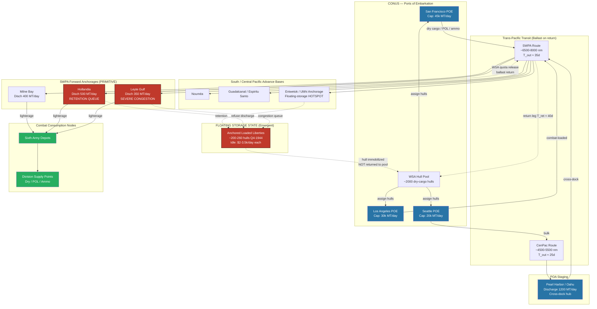

Cost: 0.30088

# Chapter 19: Shipping in the Pacific War
## Reference Manual & Simulation-Specification Document
### US Army Green Book: *Global Logistics and Strategy: 1943–1945*

---

## 1. Strategic Context & Modern Historical Perspective

### 1.1 The Fundamental Strategic Paradox

The Pacific War presented Allied planners with a logistical geometry problem of unprecedented scale. Where the North Atlantic supply line to the United Kingdom spanned roughly 3,000 nautical miles and the Mediterranean lines-of-communication extended perhaps 4,500 miles from Hampton Roads, the trans-Pacific arteries from San Francisco and Los Angeles to the Southwest Pacific Area (SWPA) forward bases at Hollandia, Milne Bay, and later Leyte stretched to between 6,000 and 8,000 nautical miles one-way. This single geographic fact—the tyranny of distance—inverted the entire calculus of shipping economics that governed the European theater.

The strategic paradox emerges directly from this geometry. The great Allied conferences—Casablanca (SYMBOL, January 1943), TRIDENT (Washington, May 1943), QUADRANT (Quebec, August 1943), and SEXTANT (Cairo, November–December 1943)—produced grand strategic commitments that treated shipping as a fungible, near-infinite resource to be allocated by political will. The Combined Chiefs of Staff would apportion "lift" to theaters as though tonnage were a bank balance. But shipping is not tonnage in the abstract; it is a *pipeline* whose throughput is governed by cycle time, not merely by the number of hulls. A ship committed to a 120-day Pacific round-trip delivers only three cargoes per year, whereas that same hull on the North Atlantic run delivers eight or nine. The Casablanca decision to sustain a "limited offensive" in the Pacific while holding to Germany-First thus concealed a hidden multiplier: every ton committed to MacArthur's or Nimitz's advance consumed *two to three times* the hull-days of an equivalent ton delivered to Europe.

The physical limits that clashed with strategic ambition were fourfold. First, **combat loading capacity**: assault shipping (attack transports, APAs, and cargo attack ships, AKAs) had to be tactically loaded—last-in-first-out, with combat priority items topside—which reduced effective cubic utilization to as little as 50–60% of a commercially loaded Liberty. Second, **port clearance rates**: the forward anchorages were not ports at all but coral lagoons and jungle beaches with minimal stevedoring capacity, no cranes, and no rail or road clearance to move discharged cargo inland. Third, **the global shipping pool** itself was finite—even at peak U.S. Maritime Commission output of nearly 19 million deadweight tons in 1943, the aggregate Allied demand consistently outran supply until late 1944. Fourth, **port capacity at the point of embarkation (POE)**: the West Coast ports of San Francisco, Los Angeles, Seattle, and Portland could physically outload only so many measurement tons per day.

### 1.2 Inter-Service and Coalition Tensions

Command friction over shipping was structural, not personal. The **War Shipping Administration (WSA)**, created by Executive Order 9054 in February 1942 under Admiral Emory S. Land, held title to and allocated the merchant fleet. The Army's **Chief of Transportation** (Major General Charles P. Gross) and the **Services of Supply / Army Service Forces** under Lieutenant General Brehon Somervell contended constantly with the WSA over control of hulls once they entered a theater. The fundamental antagonism: the WSA measured success by *hull turnover*—getting ships discharged and returned to the common pool—while theater commanders measured security by *supplies on hand*, including supplies afloat in their own harbors.

The Army–Navy divide was equally acute. In the Central Pacific (POA, Nimitz), the Navy exercised operational control; in the SWPA (MacArthur), the Army dominated but depended on Navy amphibious lift. Neither theater trusted the other's shipping accounting, and both hoarded against the possibility that the joint pool would be raided to feed the other's next operation. The **U.S.–British pooling arrangements**, formalized through the Combined Shipping Adjustment Board (CSAB), functioned reasonably in the Atlantic but were largely notional in the Pacific, which the British regarded as an American theater. This meant that Pacific shipping stringency could not be relieved by drawing on British Ministry of War Transport tonnage the way European operations sometimes could.

### 1.3 Historical Era Context: The Lifeblood of Distance

Because voyages were so long, a merchant ship on the SWPA run spent a disproportionate share of its life not delivering cargo but *in transit or waiting*. A representative 1944 cycle decomposed roughly as: 30–40 days steaming outbound, 20–45 days in the forward area (much of it swinging at anchor awaiting discharge berths), and 30–40 days returning—often in ballast because backhaul cargo was minimal. The ship was thus *productive* (actually discharging) for perhaps 15–20% of its cycle. This is the central operational fact of the chapter: the Pacific consumed hulls through *time*, not through combat loss (submarine attrition on U.S. Pacific merchant shipping was comparatively modest after 1943).

### 1.4 Modern Analytical Insights: The Floating-Warehouse Crisis

Post-war declassification and the work of logistical historians (notably the analyses underpinning Leighton and Coakley's official history, and later operations-research reassessments) revealed that the "retention" of ships as floating storage constituted a *global* crisis, not merely a Pacific inconvenience. Theater commanders—having experienced the near-run supply situation of Guadalcanal in 1942 and terrified of being cut off at the end of an 8,000-mile string—systematically refused to discharge merchant vessels and release them to the WSA. They kept loaded Liberties swinging at anchor as convenient floating warehouses, drawing down cargo selectively while the hull sat immobilized.

By mid-to-late 1944 this had metastasized. Hundreds of Liberty ships—estimates cluster around 200–260 vessels at the peak in the last quarter of 1944—sat idle in Pacific anchorages, functionally removed from the global pool for months at a time. The arithmetic was devastating: if 250 Liberties (each ~7,000 deadweight tons) were locked in floating storage, this represented roughly 1.75 million deadweight tons of lift removed from a global pool already strained. Because those same hulls, cycled properly, could have supported the European theater, the Pacific retention crisis *directly delayed operations in Europe* during the critical autumn of 1944, contributing to the shipping stringency that constrained the buildup for the final assault on Germany. The crisis was ultimately broken only by direct intervention—the WSA and the Joint Chiefs imposed discharge quotas, dispatched control officers, and, critically, began programming *cargo-carrying capacity into the theater as static storage* (barges, pontoon warehouses, and pre-positioned depot construction) so that hulls could be freed.

The modern analytical lesson, validated by queueing theory, is that the retention crisis was a rational individual response producing a catastrophic collective outcome—a tragedy-of-the-commons in the hull pool. Each theater commander, optimizing locally for security, degraded the global throughput on which all theaters depended. This is precisely the dynamic a high-fidelity simulator must capture: floating storage is not a static parameter but an *emergent behavior* driven by the utility function of the local commander under uncertainty.

---

## 2. High-Fidelity Simulation Parameters & Real-World Metrics

| Parameter | Historical Value | Explanation & Strategic Rationale | Simulation Representation |
|---|---|---|---|
| **Round-trip turnaround, US West Coast → SWPA (1944)** | **≈ 120 days** (range 100–140) | Composed of ~35 days outbound, ~45 days in-theater (largely queue/discharge delay), ~40 days return. This is the single dominant driver of fleet-size requirements. | **Dynamic variable** `T_cycle`, decomposed into `T_out + T_theater + T_return`; `T_theater` is itself a function of port congestion (queue length). |
| **Round-trip turnaround, US West Coast → Central Pacific/SoPac** | **≈ 90–100 days** | Shorter than SWPA but still 3–4× Atlantic cycles. | Static constant per-route, overridable by congestion model. |
| **Merchant vessels retained as floating storage (mid-to-late 1944 peak)** | **≈ 200–260 vessels** | Loaded Liberties held at anchor as warehouses; peak in Q4 1944. Represents ~1.4–1.8M DWT removed from global pool. | **Emergent state variable** `retainedHulls`, driven by a commander-utility retention function; caps effective available fleet. |
| **Liberty ship deadweight capacity** | **≈ 7,000–7,200 DWT** (~10,800 measurement tons cubic) | Standard EC2-S-C1 hull. Cargo cube, not weight, was usually the binding constraint for military stores. | **Static constant** `shipCapacityTons`; model both weight and measurement-ton limits. |
| **Effective cargo utilization (military loading)** | **≈ 0.55–0.75** of rated capacity | Combat/selective loading and light-density military cargo (vehicles, rations) "cubed out" before "weighting out." | **Efficiency coefficient** `loadFactor` applied to nominal capacity. |
| **Daily opportunity cost of an idle Liberty in forward pool** | **≈ $2,000–$3,500/day** in direct charter+operating cost; **~40–55 measurement tons/day of delivered-capacity loss** | Bareboat charter (~$1,500–$2,000/day) plus operating and crew cost; the *capacity* loss is the strategically decisive figure—each idle hull-day is a hull-day not spent on the ~120-day productive cycle. | **Dual coefficient**: `idleDailyCostUSD` (static) and `idleCapacityLossTonsPerDay` (derived from capacity/cycle). |
| **Forward anchorage discharge rate (primitive port)** | **≈ 300–600 measurement tons/ship/day** vs. 1,000–1,500 at a developed port | Lack of cranes, lighterage, and inland clearance. Governs `T_theater`. | **Dynamic capacity cap** per node; feeds queueing delay. |
| **WSA global fleet available to Pacific (1944)** | **~2,000+ oceangoing dry-cargo hulls** cycling; Pacific share rising through 1944 | The pool that retention effectively shrank. | **Fleet-pool state**; `availableHulls = totalHulls − retainedHulls − inMaintenance`. |
| **Submarine/combat loss rate, Pacific merchant (1944)** | **< 0.5% per voyage** | Low relative to time-attrition; retention, not sinking, was the crisis. | **Low-probability stochastic** loss coefficient. |

---

## 3. Logistical Network Topology



---

## 4. Mathematical Modeling & Simulation Formulas

### 4.1 Core Fleet-Sustenance (Little's Law form)

The foundational relation is a direct application of Little's Law to the shipping pipeline. To sustain a target daily delivery, the number of hulls in the system equals the arrival rate multiplied by the cycle time:

$$
N = \left\lceil \frac{D_{target} \cdot T_{cycle}}{C \cdot \eta} \right\rceil
$$

where:

- $N$ = number of hulls required in continuous rotation (dimensionless, integer)
- $D_{target}$ = target daily delivered tonnage at destination $[\text{tons/day}]$
- $T_{cycle}$ = full round-trip cycle time $[\text{days}]$
- $C$ = nominal cargo capacity per hull $[\text{tons}]$
- $\eta$ = load-utilization efficiency, $0 < \eta \le 1$ (accounts for combat loading / cubing-out)

### 4.2 Decomposed cycle time with congestion

$$
T_{cycle} = T_{out} + T_{queue}(Q) + T_{disch} + T_{return}
$$

The queue delay is modeled with an M/M/s queueing approximation, where discharge berths are servers:

$$
T_{queue}(Q) = \frac{P_{wait}}{s\mu - \lambda}, \qquad
\rho = \frac{\lambda}{s\mu}
$$

- $\lambda$ = arrival rate of hulls at anchorage $[\text{ships/day}]$
- $\mu$ = per-berth discharge service rate $[\text{ships/day}]$, where $\mu = R_{disch}/C_{eff}$
- $s$ = number of usable discharge berths/lighterage teams
- $\rho$ = utilization; system unstable (unbounded queue) as $\rho \to 1$

### 4.3 Floating-storage retention model

Let $R$ be the number of retained (immobilized) hulls, driven by a commander security-utility response to perceived cutoff risk $r \in [0,1]$:

$$
R = \min\!\left( N_{present}, \; \alpha \cdot r \cdot N_{present} \right)
$$

Effective available pool contracts accordingly:

$$
N_{avail} = N_{total} - R - N_{maint}
$$

### 4.4 Global opportunity cost of retention

$$
K_{loss} = R \cdot \left( c_{idle} + p \cdot \frac{C \cdot \eta}{T_{cycle}} \right)
$$

- $c_{idle}$ = direct idle cost per hull-day $[\$]$
- $p$ = shadow price per delivered ton $[\$/\text{ton}]$
- The second term is the *capacity opportunity cost*—the delivered tonnage foregone per day per retained hull.

### 4.5 Explanation

Equation 4.1 is the strategic heart of the chapter. Because $N$ scales *linearly* with $T_{cycle}$, and the Pacific $T_{cycle}$ (~120d) was 3–4× the Atlantic value, the Pacific required 3–4× the hulls per delivered ton. Retention (4.3) inflates the *effective* $T_{cycle}$ still further—an immobilized hull has an infinite instantaneous cycle time—so a modest $R$ produces a large collapse in $N_{avail}$, and via 4.4 imposes a global cost felt in Europe. The queueing term (4.2) is the causal mechanism: primitive discharge rates drove $\rho \to 1$, exploding $T_{queue}$, which in turn tempted commanders to simply retain rather than queue.

---

## 5. Compile-Safe Scala 3.8.3 Domain Model

```scala
package Logistics.PacificShipping

import scala.math.{ceil, min, max}

// ---------- Opaque unit-safe types ----------

opaque type Tons = Double
object Tons:
  def apply(v: Double): Tons = v
  extension (t: Tons)
    def value: Double = t
    def +(o: Tons): Tons = t + o
    def *(f: Double): Tons = t * f

opaque type Days = Double
object Days:
  def apply(v: Double): Days = v
  extension (d: Days)
    def value: Double = d
    def +(o: Days): Days = d + o

opaque type NauticalMiles = Double
object NauticalMiles:
  def apply(v: Double): NauticalMiles = v
  extension (n: NauticalMiles) def value: Double = n

opaque type USD = Double
object USD:
  def apply(v: Double): USD = v
  extension (u: USD)
    def value: Double = u
    def +(o: USD): USD = u + o
    def *(f: Double): USD = u * f

// ---------- Domain enums / ADTs ----------

enum HullState:
  case InPoolCONUS
  case OutboundTransit
  case QueuedAtAnchorage
  case Discharging
  case RetainedFloatingStorage
  case ReturnTransit
  case InMaintenance

enum TheaterRoute(val distance: NauticalMiles, val outboundDays: Days, val returnDays: Days):
  case SWPA   extends TheaterRoute(NauticalMiles(7000.0), Days(35.0), Days(40.0))
  case CenPac extends TheaterRoute(NauticalMiles(5000.0), Days(25.0), Days(30.0))
  case SoPac  extends TheaterRoute(NauticalMiles(5500.0), Days(28.0), Days(32.0))

final case class Anchorage(
    name: String,
    dischargeTonsPerDay: Tons,
    berths: Int
)

final case class FleetTarget(dailyTonsTarget: Double, shipCapacityTons: Double)

final case class CycleBreakdown(
    outbound: Days,
    queue: Days,
    discharge: Days,
    ret: Days
):
  def total: Days = Days(outbound.value + queue.value + discharge.value + ret.value)

final case class RetentionParams(
    cutoffRisk: Double,        // r in [0,1]
    retentionSensitivity: Double // alpha
):
  require(cutoffRisk >= 0.0 && cutoffRisk <= 1.0, "cutoffRisk must be in [0,1]")
  require(retentionSensitivity >= 0.0, "retentionSensitivity must be >= 0")

final case class CostParams(
    idleDailyCostUSD: USD,     // c_idle
    shadowPricePerTon: USD     // p
)

// ---------- Core model ----------

object FleetSustenanceModel:

  private val MinLoadFactor: Double = 0.01

  /** Original base method preserved for interface stability. */
  def requiredHulls(target: FleetTarget, turnaroundDays: Double): Int =
    if target.shipCapacityTons <= 0.0 || turnaroundDays <= 0.0 then 0
    else
      val dailyShipsNeeded: Double = target.dailyTonsTarget / target.shipCapacityTons
      ceil(dailyShipsNeeded * turnaroundDays).toInt

  /** Extended fleet requirement including load-utilization efficiency. */
  def requiredHullsWithEfficiency(
      target: FleetTarget,
      cycle: CycleBreakdown,
      loadFactor: Double
  ): Int =
    val eff: Double = max(MinLoadFactor, min(1.0, loadFactor))
    val effectiveCapacity: Double = target.shipCapacityTons * eff
    if effectiveCapacity <= 0.0 || cycle.total.value <= 0.0 then 0
    else
      val dailyShips: Double = target.dailyTonsTarget / effectiveCapacity
      ceil(dailyShips * cycle.total.value).toInt

  /** M/M/s style queue delay approximation at a primitive anchorage. */
  def queueDelayDays(
      arrivalsPerDay: Double,
      anchorage: Anchorage,
      shipCapacity: Tons,
      loadFactor: Double
  ): Days =
    val eff: Double = max(MinLoadFactor, min(1.0, loadFactor))
    val perShipTons: Double = shipCapacity.value * eff
    val servicePerBerth: Double =
      if perShipTons <= 0.0 then 0.0
      else anchorage.dischargeTonsPerDay.value / perShipTons
    val totalService: Double = servicePerBerth * anchorage.berths.toDouble
    if totalService <= arrivalsPerDay || totalService <= 0.0 then Days(365.0) // saturation cap
    else
      val rho: Double = arrivalsPerDay / totalService
      // simplified Erlang-C proportional wait, bounded
      val wait: Double = rho / (totalService - arrivalsPerDay)
      Days(min(365.0, max(0.0, wait)))

  /** Emergent floating-storage retention (Eq. 4.3). */
  def retainedHulls(hullsPresent: Int, params: RetentionParams): Int =
    val raw: Double =
      params.retentionSensitivity * params.cutoffRisk * hullsPresent.toDouble
    min(hullsPresent, max(0, ceil(raw).toInt))

  /** Effective available pool after retention and maintenance. */
  def availablePool(totalHulls: Int, retained: Int, inMaintenance: Int): Int =
    max(0, totalHulls - retained - inMaintenance)

  /** Global opportunity cost of retention (Eq. 4.4). */
  def retentionCostPerDay(
      retained: Int,
      shipCapacity: Tons,
      loadFactor: Double,
      cycle: CycleBreakdown,
      cost: CostParams
  ): USD =
    val eff: Double = max(MinLoadFactor, min(1.0, loadFactor))
    val cycleDays: Double = cycle.total.value
    val capacityLossPerDay: Double =
      if cycleDays <= 0.0 then 0.0
      else (shipCapacity.value * eff) / cycleDays
    val perHull: Double =
      cost.idleDailyCostUSD.value + cost.shadowPricePerTon.value * capacityLossPerDay
    USD(perHull * retained.toDouble)

  /** Full deterministic cycle assembly for a route + anchorage. */
  def buildCycle(
      route: TheaterRoute,
      anchorage: Anchorage,
      arrivalsPerDay: Double,
      shipCapacity: Tons,
      loadFactor: Double
  ): CycleBreakdown =
    val eff: Double = max(MinLoadFactor, min(1.0, loadFactor))
    val perShipTons: Double = shipCapacity.value * eff
    val dischargeDays: Double =
      if anchorage.dischargeTonsPerDay.value <= 0.0 then 365.0
      else perShipTons / anchorage.dischargeTonsPerDay.value
    val q: Days = queueDelayDays(arrivalsPerDay, anchorage, shipCapacity, loadFactor)
    CycleBreakdown(
      outbound = route.outboundDays,
      queue = q,
      discharge = Days(dischargeDays),
      ret = route.returnDays
    )

// ---------- Executable scenario harness ----------

object PacificScenario:

  def run(): Unit =
    val leyte: Anchorage =
      Anchorage("Leyte Gulf", Tons(350.0), berths = 6)
    val shipCap: Tons = Tons(7000.0)
    val loadFactor: Double = 0.65
    val arrivals: Double = 8.0

    val cycle: CycleBreakdown =
      FleetSustenanceModel.buildCycle(
        TheaterRoute.SWPA, leyte, arrivals, shipCap, loadFactor
      )

    val target: FleetTarget =
      FleetTarget(dailyTonsTarget = 12000.0, shipCapacityTons = shipCap.value)

    val hulls: Int =
      FleetSustenanceModel.requiredHullsWithEfficiency(target, cycle, loadFactor)

    val retention: RetentionParams =
      RetentionParams(cutoffRisk = 0.7, retentionSensitivity = 0.35)
    val retained: Int =
      FleetSustenanceModel.retainedHulls(hullsPresent = 260, retention)

    val cost: CostParams =
      CostParams(idleDailyCostUSD = USD(2800.0), shadowPricePerTon = USD(85.0))
    val dailyLoss: USD =
      FleetSustenanceModel.retentionCostPerDay(retained, shipCap, loadFactor, cycle, cost)

    println(s"Cycle total days      : ${cycle.total.value}")
    println(s"Hulls required        : $hulls")
    println(s"Retained (floating)   : $retained")
    println(s"Retention cost / day  : ${dailyLoss.value} USD")

  def main(args: Array[String]): Unit = run()
```

---

## 6. Graduate-Level Operational Analysis

### 6.1 The Phenomenon of Floating Storage

Floating storage was the systematic immobilization of loaded merchant hulls at forward anchorages, where they functioned as convenient but catastrophically inefficient warehouses. To understand why theater commanders refused to release these ships, one must abandon the assumption of a rational global optimizer and adopt the perspective of a local commander operating under acute uncertainty at the terminus of an 8,000-mile pipeline with a 120-day feedback loop.

The commander's decision problem was structurally asymmetric. The cost of releasing a ship prematurely—finding oneself short of a critical item during a Japanese counterattack, with the next resupply 120 days away—was potentially operational catastrophe. The cost of retaining a ship was borne almost entirely by *other* theaters and by the abstract global pool, invisible from a jungle beachhead. This is a textbook tragedy of the commons: the individually rational choice (retain for security) produced a collectively ruinous outcome. Each commander, treating loaded Liberties as floating supply depots he controlled, drew down cargo selectively—pulling out the ammunition or rations he needed today while leaving the hull swinging at anchor for weeks or months, effectively substituting expensive, mobile oceangoing tonnage for the cheap static warehousing he did not yet possess ashore.

The underlying enabler was the primitive state of forward port infrastructure. With discharge rates at Leyte or Hollandia running 350–500 measurement tons per ship-day against developed-port rates three to five times higher, the anchorage queue (modeled in §4.2 as an M/M/s system driven toward $\rho \to 1$) exploded. When queue times reach weeks, the distinction between "queued for discharge" and "retained as storage" collapses—the commander rationalizes the inevitable delay into deliberate policy.

The global-strategic impact, quantifiable through §4.4, was severe. With roughly 200–260 hulls (~1.5M DWT) locked in the Pacific in Q4 1944, and each hull representing three lost annual round-trips on a European run, the retention crisis effectively subtracted the equivalent of a major shipbuilding quarter's output from the pool precisely when the ETO was straining to sustain the drive to the Rhine and cope with the demands following the port-clearance crisis at Antwerp. The Combined Chiefs discovered that they could not simply "reallocate" tonnage to Europe because a large fraction of the notional pool was physically pinned in Pacific mud and coral. The lesson, foundational to modern logistics doctrine, is that *hull-time is the true currency*, and any local hoarding of that currency is a global tax.

### 6.2 War Shipping Administration Countermeasures

The WSA, in concert with the Army Service Forces and the Joint Chiefs, deployed a layered program to attack turnaround time, targeting both the physical bottleneck and the behavioral incentive.

**First, discharge quotas and control officers.** The WSA stationed shipping-control representatives at forward theaters with authority to monitor and enforce discharge targets, converting the invisible global cost of retention into a visible, audited local metric. Ships were assigned mandatory maximum in-theater dwell times, and reports of vessels exceeding them were escalated to the theater commander and, if needed, the JCS.

**Second, investment in port and lighterage capacity.** Recognizing that queueing delay ($T_{queue}$) was the causal root, the WSA and Army Transportation Corps pushed pontoon barges, self-propelled lighters, floating cranes, and DUKW amphibious trucks forward to raise the effective discharge rate $R_{disch}$ and the number of servers $s$. Raising $s$ and $\mu$ directly reduces $\rho$ and collapses the queue term in §4.2—the highest-leverage intervention available.

**Third, provision of static shore storage.** The deepest fix addressed the substitution logic directly: by rushing forward depot construction, warehouse tentage, and pre-positioned reserve stocks, the WSA and engineers gave commanders an *alternative* to using hulls as warehouses. Once ashore storage existed, the security rationale for retention evaporated, and hulls could be discharged and released.

**Fourth, selective discharge and cargo-segregation reform.** Because "cubing out" and selective-discharge chaos slowed unloading, the WSA promoted improved manifesting, commodity-loading (segregating cargo by type and priority to speed selective offload), and better stow plans, raising $\eta$ and reducing the discharge component of the cycle.

**Fifth, backhaul and ballast reduction.** The near-empty return legs meant hulls returned unproductively. WSA sought return cargoes and, more importantly, tightened scheduling so that hulls entered maintenance and re-cargo cycles on the West Coast without idle slack, compressing the CONUS portion of the pipeline.

Collectively these measures, imposed through late 1944 and into 1945, materially reduced Pacific turnaround and released the retained fleet back into the global pool—demonstrating empirically the model's central thesis: that throughput is governed by cycle time, and that attacking dwell and queue delay, not merely building more hulls, was the decisive logistical maneuver of the war's final year.
