Cost: 0.51497875

### 1. Strategic Context & Modern Historical Perspective

Shipping was not merely one supporting arm of the Pacific war; it was the physical mechanism by which American strategic power could exist west of the continental United States. Aircraft, divisions, construction battalions, landing craft, ammunition, petroleum, replacement personnel, refrigerated food, hospital capacity, and even port-development equipment all had to cross an ocean whose distances transformed ordinary inefficiencies into strategic shortages. Chapter 19 of *Global Logistics and Strategy: 1943–1945* is therefore best interpreted as an analysis of a closed-loop transportation system in which the scarce resource was not simply cargo tonnage or the number of merchant vessels, but **usable ship-days**.

#### The strategic paradox

At Casablanca in January 1943, the Combined Chiefs of Staff reaffirmed the defeat of Germany as the coalition’s first strategic priority. The decision did not suspend the Pacific offensives, however. Operations in the South and Southwest Pacific continued, the Central Pacific offensive gathered momentum, and support had to be maintained for China, Alaska, Hawaii, the South Pacific bases, Australia, and numerous island garrisons. Thus, “Germany first” governed priorities without creating a genuinely sequential war.

The TRIDENT conference in May 1943 authorized an enlarged Pacific program while the United States was simultaneously preparing for the cross-Channel assault and supporting the Mediterranean theater. QUADRANT in August 1943 elaborated the Central and Southwest Pacific advances, and SEXTANT at Cairo in November–December 1943 attempted to reconcile the offensives toward the Philippines with support for China and Southeast Asia. Each conference produced operational objectives, target dates, force lists, and deployment schedules. None could repeal the physical constraints of maritime transportation.

The resulting paradox was that Allied strategy dealt in divisions and campaigns, whereas the shipping system operated in:

- deadweight tons,
- cubic measurement tons,
- tanker barrels,
- berths,
- lighter-hours,
- crane gangs,
- ship-days,
- convoy cycles,
- port-clearance rates, and
- return-voyage schedules.

A campaign could be approved on paper before its entire logistical path was feasible. Strategic planners could assign a division to an operation, but the division’s movement did not end when it boarded transports. Its vehicles, artillery, ammunition, engineer equipment, aviation support, hospital units, petroleum, and follow-up stocks required multiple cargo ships. Those vessels then had to unload at destinations that often possessed little more than an anchorage, a narrow beach, improvised pontoons, and an incomplete road network.

The fundamental fleet-sizing relationship was simple:

$$
N \approx \frac{D \times T}{C}
$$

where $N$ is the required fleet, $D$ the desired daily delivery rate, $T$ the round-trip cycle time, and $C$ the useful cargo delivered per voyage. The consequences were not simple. An increase in cycle time from 100 to 140 days increased the hull requirement by 40 percent even if cargo demand and vessel capacity remained unchanged. A theater could therefore absorb a large amount of newly constructed shipping without increasing delivered tonnage if port congestion lengthened the average cycle at roughly the same rate.

#### Distance and the destruction of nominal capacity

A Liberty ship commonly carried roughly 9,000–10,000 long tons of military cargo, depending on cargo density, stowage, draft restrictions, and the distinction between weight and measurement cargo. That nominal capacity was not equivalent to annual transport capacity. The annual contribution of a vessel was determined by how many complete voyages it could make.

A vessel completing a 120-day cycle could make approximately 3.04 theoretical round trips per year. At 10,000 long tons per voyage, this represented about 30,400 delivered long tons annually. If congestion, diversion, or retention extended the cycle to 180 days, the same ship could complete only about 2.03 cycles and deliver about 20,300 tons annually. No ship had been sunk, damaged, or removed from the register, yet one-third of its annual productivity had disappeared.

The Pacific magnified every element of the cycle. A West Coast–Southwest Pacific voyage could involve several weeks of sailing in each direction. The ship might then wait for convoy instructions, an escort, a berth, lighters, stevedores, storage space, or orders identifying its final destination. It could be partially discharged at one port and redirected to another. Cargo urgently wanted at one base might lie beneath lower-priority material intended for a different destination because the ship had been administratively, rather than tactically, loaded.

Combat loading created another tradeoff. A ship loaded for maximum commercial efficiency maximized cubic and deadweight utilization but often placed cargo in an order unsuitable for assault operations. Combat loading sacrificed some carrying capacity so that troops, ammunition, vehicles, engineering equipment, and rations could be removed in the sequence required ashore. The result was a reduction in effective payload per hull at precisely the moment an assault demanded maximum lift. Assault transports and amphibious cargo ships also could not be treated as interchangeable with ordinary merchant vessels. The first wave required specialized loading, boats, communications, self-defense, and trained crews; follow-up supply could use less specialized hulls but remained constrained by beach and port throughput.

#### Inter-service and command tensions

The shipping crisis was inseparable from fragmented authority. The War Shipping Administration controlled the allocation and operation of most American-controlled merchant shipping. The Army Service Forces, including the Transportation Corps and Services of Supply organizations, attempted to convert strategic decisions into vessel requirements and sailing schedules. The Navy controlled escorts, naval auxiliaries, amphibious shipping, operational routes, and many forward-port decisions. Theater commanders determined local priorities and frequently controlled when vessels were permitted to unload or depart.

Each organization optimized a different objective:

- The WSA sought high global utilization and rapid vessel turnover.
- The Army Service Forces sought predictable movement schedules and balanced theater stocks.
- Theater service commands sought security of supply and operational flexibility.
- Combat commanders sought maximum readily available stocks near the battle area.
- The Navy prioritized convoy security, amphibious readiness, and fleet support.
- Port commanders attempted to prevent local handling systems from collapsing.
- British authorities sought sufficient shipping for United Kingdom imports, imperial communications, and operations in Europe and Asia.

These objectives were individually rational but globally incompatible. To a theater commander, a loaded ship at anchor represented insurance against uncertain requisition schedules, enemy action, a changed operational plan, or the inability of shore depots to receive cargo. To the WSA, the same ship was an immobilized global asset whose delay might prevent another cargo from leaving San Francisco, Los Angeles, New York, or a British port.

Army–Navy friction was especially important because responsibility could be separated from control. The Army might bear the accountability for supplying forces but lack authority over naval convoy schedules or harbor priorities. The Navy might prioritize combatants, tankers, ammunition ships, and amphibious vessels in a crowded anchorage, delaying ordinary Army cargo. Conversely, Army cargo documentation, loading practices, or poorly sequenced arrivals could overwhelm a naval base or newly seized port.

Coalition pooling arrangements added another layer. The Combined Shipping Adjustment Board and associated Anglo-American machinery treated shipping as a broadly pooled strategic resource, but “pooling” did not eliminate national control, cabotage restrictions, theater earmarking, military priorities, or the political sensitivity of imports. A ship retained in the Pacific could not transport American forces to Europe, carry British civilian imports, support Mediterranean operations, or move liberated-area relief cargo. Pacific inefficiency therefore propagated throughout the Allied system.

#### Floating storage and theater retention

The most damaging practice was the use of ocean-going ships as floating warehouses. In primitive anchorages, shore storage might be incomplete, roads might be impassable, and cargo-handling units might be short of cranes, barges, trucks, and trained labor. Leaving cargo aboard preserved it against rain, mud, pilferage, and confusion ashore. It also allowed commanders to redirect the cargo if an operation changed.

This was a rational local adaptation to an inadequate distribution system. It was also an extraordinarily expensive system-level policy. An ocean-going freighter was a transportation asset, not a warehouse. A Liberty ship immobilized with 10,000 long tons aboard provided storage but simultaneously removed one hull from the transport cycle. Its opportunity cost accumulated every day that it remained unavailable.

The term **retention** covered several different conditions:

1. awaiting a berth or lighterage;
2. partially discharged but held for the remainder of the cargo;
3. held pending destination instructions;
4. deliberately retained as reserve supply;
5. delayed by port congestion or inadequate documentation;
6. reserved for an intratheater movement rather than returned to the United States; and
7. awaiting convoy or operational clearance after discharge.

This definitional problem matters. Historical reports did not always count the same categories, and a single “number of ships retained” can falsely imply greater archival precision than existed. Contemporary counts during 1944 moved from scores into the hundreds, with roughly 300–350 merchant vessels commonly used as a planning-order estimate for the mid-to-late-1944 Pacific immobilization problem. Counts above 400, and in some snapshots around 500 when all delayed or idle ships were included, appeared during the late-1944 crisis. These were not all ships intentionally designated as warehouses; many were trapped by congestion.

#### Modern analytical perspective

Modern operations research reveals that the crisis was a queueing-network failure rather than a simple shortage of ships. Shipbuilding raised the nominal fleet size, but the receiving network did not expand at the same pace. If the arrival rate of ships approached or exceeded the effective discharge rate, the anchorage queue grew rapidly. Variability made the problem worse. Even when average berth capacity nominally matched average arrivals, irregular convoys, weather, air alerts, labor shortages, and mixed cargoes created unstable queues.

The decisive state variables were therefore:

- ships awaiting discharge;
- cargo tons remaining aboard;
- berth and lighter service rates;
- shore-storage occupancy;
- port-clearance capacity;
- truck and barge availability;
- average and percentile vessel delay;
- number of hulls beyond authorized lay time; and
- the ratio of transport ship-days to warehouse ship-days.

Retention created an artificial global shortage because vessel demand was calculated from planned cycle times while actual cycle times included unplanned waiting. More ships were then assigned to maintain scheduled deliveries, increasing arrivals at already congested ports and worsening the queues. This was a positive feedback loop:

$$
\text{Congestion}
\rightarrow
\text{Longer cycle}
\rightarrow
\text{More hulls requested}
\rightarrow
\text{More arrivals}
\rightarrow
\text{Greater congestion}
$$

By late 1944, hundreds of ships were delayed at Pacific destinations, particularly as operations accelerated toward the Philippines. The global consequences were real, although claims that a specific European operation was delayed solely by Pacific retention should be treated cautiously. Shipping was fungible only within limits: a freighter in a Southwest Pacific anchorage could not instantly become an assault transport in the English Channel. Nevertheless, retained cargo ships reduced the reserve available for troop redeployment, European resupply, British imports, relief cargoes, and other strategic commitments. The lost resource was not just the hull but the stream of future voyages that the hull could have completed.

The enduring historical lesson is that a logistics system must be optimized end to end. Increasing ocean lift without proportional investment in discharge, storage, documentation, and inland clearance can reduce rather than increase effective performance. Pacific shipping demonstrated that the useful capacity of a fleet is governed by its slowest connected subsystem.

---

### 2. High-Fidelity Simulation Parameters & Real-World Metrics

Historical reports used different definitions of “turnaround,” “retention,” “idle,” and “available.” The database should preserve each metric’s definition, date range, geographic scope, and confidence level rather than representing every figure as timeless fact. Long tons are used below where historical American shipping documents normally used weight tons; one long ton equals 2,240 pounds.

| Parameter | Recommended historical value | Unit/range | Historical interpretation | Simulation representation |
|---|---:|---|---|---|
| West Coast–SWPA round-trip turnaround, 1944 planning baseline | **120** | days | Approximately four months was a representative 1944 planning value for a cargo vessel sailing from the US West Coast to the Southwest Pacific, discharging, and returning. Individual cycles varied materially by port, routing, and congestion. | Baseline `CycleTime`; never hard-code as an invariant. Add stochastic sea, queue, discharge, and administrative components. |
| Congested West Coast–SWPA cycle | **140–180** | days | Heavy retention and port delay could add weeks or months to the nominal cycle. The upper end represents severe congestion rather than ordinary sailing performance. | Dynamic result generated from queues and retention, not an independent constant. |
| Mid-1944 Pacific retained/delayed merchant fleet | **approximately 300–350** | vessels | Useful system-level magnitude for merchant vessels immobilized or retained in Pacific areas. Contemporary counts depended on whether ships awaiting discharge, held for orders, or awaiting return clearance were included. | Time-indexed observed state with a definition code and confidence interval; recommended calibration target: 350. |
| Late-1944 severe-crisis count | **400–500** | vessels | Some late-1944 snapshots reached this scale when all idle, congested, or abnormally delayed ships were counted. It should not be interpreted as 500 ships deliberately designated as warehouses. | Stress-scenario calibration range. Trigger a global allocation warning when the delayed fleet exceeds a policy threshold. |
| Liberty ship military cargo payload | **9,000–10,000** | long tons | Nominal cargo carried depended on density, draft, bunkers, stowage factors, deck cargo, and port restrictions. Deadweight capacity was not identical to useful military payload. | Vessel-class payload distribution; recommended central value: 10,000 long tons. |
| Liberty ship deadweight | **about 10,800** | long tons deadweight | Includes cargo plus consumables and other deadweight items; it should not be equated directly with delivered cargo. | Engineering limit distinct from `UsefulPayload`. |
| Liberty ship service speed | **about 11** | knots | Nominal service speed; convoy routing, weather, zigzagging, and speed of the slowest vessel reduced realized progress. | Maximum or economical speed, with route-speed multipliers. |
| West Coast–SWPA one-way distance | **6,500–8,000** | nautical miles | Depends on origin and destination: San Francisco, Los Angeles, Brisbane, Sydney, Milne Bay, Hollandia, and Philippine ports produce different route lengths. | Route-specific distance, not a theater-wide scalar. |
| Pure sea time at 11 knots for 7,000 nm | **26.5** | days one way | Calculated as $7{,}000/(11 \times 24)$. Actual elapsed time was longer because of routing, convoy assembly, stops, and weather. | Deterministic lower-bound calculation plus delay distributions. |
| Efficient developed-port discharge | **1,000–2,000** | long tons per ship-day | A developed port with adequate berths, cranes, labor, and clearance could discharge a Liberty ship in roughly one week or less. | Port service-rate distribution conditioned on cargo and equipment. |
| Primitive anchorage discharge | **200–500** | long tons per ship-day | Lighterage, beach congestion, weather, mixed loads, and weak shore clearance could extend discharge to several weeks. | Dynamic service rate; reduce by weather, lighter availability, and storage saturation. |
| Severe-congestion discharge | **below 200** | long tons per ship-day | Represents interruptions, partial discharge, cargo inaccessibility, or ships held without active work. | Congestion state with low or zero service rate. |
| Normal terminal allowance | **7–15** | days | Loading, documentation, discharge, and return formalities under reasonably efficient conditions. | Planned terminal component of cycle time. |
| Retention delay | **0–90+** | days | Some vessels departed promptly; others remained for months. A heavy-tailed distribution is more realistic than a normal distribution. | Lognormal, gamma, or empirical survival distribution; allow policy-driven forced release. |
| Idle-vessel direct capacity loss | **1** | hull-day per idle day | This is the only exact universal daily loss: each idle vessel consumes one ship-day while producing no ocean lift. | Increment `LostHullDays` by one per vessel per idle calendar day. |
| Cargo immobilized by one loaded Liberty ship | **approximately 10,000** | long tons of inventory | Cargo remains physically available to the local theater but unavailable to the global transport cycle and may be inaccessible beneath other cargo. | Split inventory into `AfloatAccessible`, `AfloatBlocked`, and `Ashore`. |
| Sustained-lift opportunity loss at 120-day cycle | **83.33** | long tons/day | $10{,}000/120$. This is the long-run delivery stream represented by one hull under the baseline cycle. | Efficiency metric: `payload / baselineCycle`. |
| Sustained-lift opportunity loss at 150-day cycle | **66.67** | long tons/day | $10{,}000/150$. Useful when evaluating a congested baseline. | Scenario-dependent lost-throughput coefficient. |
| Sustained-lift opportunity loss for 350 retained Liberty ships | **29,167** | long tons/day at 120-day cycle | $350 \times 10{,}000/120$. This is a fleet-equivalent opportunity cost, not cargo physically destroyed. | Global capacity penalty while those hulls remain unavailable. |
| Dollar cost of one idle Liberty ship | **No single authoritative chapter-wide constant** | dollars/day | WSA ships had different ownership, agency, crew, insurance, fuel, and accounting arrangements. A universal daily dollar value would create false precision. | Derive from vessel-specific crew, maintenance, agency, depreciation, and capital-cost records. Preserve capacity loss separately. |
| Liberty ship wartime construction cost | **roughly $1.6–2.0 million** | 1940s dollars per ship | Cost declined with mass production and varied by yard and accounting method. Not equivalent to daily operating cost. | Optional capital account; amortize only if the economic model requires it. |
| Port utilization warning | **80–85%** | proportion of effective service capacity | Queueing delay becomes highly sensitive to variability before nominal capacity is fully occupied. This is an OR policy threshold, not a historical statutory constant. | Congestion-warning coefficient. |
| Port instability condition | $\lambda \geq \mu$ | ships/day | If average ship arrivals equal or exceed effective discharge completions, the queue is unstable absent diversion or capacity expansion. | Hard analytical warning and route-control trigger. |
| Combat-loading payload factor | **0.70–0.90** | fraction of commercial payload | Accessibility and tactical unloading sequence reduce cubic utilization. Exact values depend on vessel and operation. | Mission-specific payload multiplier. |
| Mixed-cargo handling penalty | **0.75–0.90** | fraction of base discharge rate | Segregation, documentation, and multiple destinations slow unloading. | Discharge-rate coefficient. |
| Shore-storage saturation penalty | **0.25–1.00** | fraction of base discharge rate | As storage occupancy approaches capacity, ships cannot discharge even if lighters and labor are available. | Nonlinear terminal-capacity coefficient. |
| Weather/lighterage availability | **0.00–1.00** | fraction | Surf, storms, darkness restrictions, and equipment breakdown could stop discharge. | Time-varying multiplicative service factor. |
| Planning reserve | **5–15%** | hulls | Covers repair, weather, schedule variance, and operational diversion. | Reserve coefficient added after deterministic hull calculation. |

#### Recommended canonical calibration record

For a baseline 1944 US West Coast–SWPA scenario:

```text
cycleDaysBaseline = 120
usefulPayloadLongTons = 10000
retainedVesselsCalibration = 350
retainedVesselsStressRange = 400..500
lostHullDaysPerIdleDay = 1
lostSustainedTonsPerIdleHullDay = 83.3333 / 120-day fleet basis
```

The phrase “lost sustained tons per idle hull-day” requires care. A single idle day does not destroy 83.33 tons of cargo. Rather, one wholly unavailable hull represents approximately 83.33 long tons per day of steady-state route capacity when its normal full cycle is 120 days.

---

### 3. Logistical Network Topology (Detailed Mermaid.js Flowchart)

```mermaid
flowchart LR
  subgraph CONUS["Continental United States Production and Assembly"]
    PROD["Factories and Ordnance Plants<br/>Weapons, vehicles, ammunition"]
    POLSRC["Refineries and Tank Farms<br/>Bulk petroleum"]
    AGDEP["Quartermaster and Agricultural Depots<br/>Food and general stores"]
    RAIL["National Rail Network<br/>Constraint: cars, schedules, terminal clearance"]
    HOLD["West Coast Holding and Marshalling Areas<br/>Cargo documentation and destination control"]

    PROD --> RAIL
    POLSRC --> RAIL
    AGDEP --> RAIL
    RAIL --> HOLD
  end

  subgraph WCP["US West Coast Ports of Embarkation"]
    SF["San Francisco POE<br/>Bay Area terminals"]
    LA["Los Angeles and Long Beach<br/>Southern California terminals"]
    SEA["Seattle and Tacoma<br/>Northern routes and Alaska support"]
    LOADQ["Loading Queue<br/>Berth, crane, railcar, and labor constraints"]
    COMLOAD["Combat-Loading Cell<br/>Payload efficiency 0.70-0.90"]
    COMMLOAD["Commercial Loading Cell<br/>Higher payload, slower tactical access"]

    HOLD --> LOADQ
    LOADQ --> SF
    LOADQ --> LA
    LOADQ --> SEA
    SF --> COMLOAD
    SF --> COMMLOAD
    LA --> COMLOAD
    LA --> COMMLOAD
    SEA --> COMMLOAD
  end

  subgraph OCEAN["Ocean Transport Cycle"]
    ASSEMBLY["Convoy Assembly and Sailing Clearance<br/>Administrative waiting"]
    OUTBOUND["Outbound Ocean Transit<br/>6,500-8,000 nm to SWPA<br/>Nominal Liberty speed about 11 kn"]
    DIVERT{"Destination still valid?"}
    REROUTE["Rerouting and Intratheater Diversion<br/>Adds sailing and administrative days"]
    RETURN["Ballast or Return-Cargo Transit<br/>Hull unavailable until West Coast release"]
    REPAIR["Repair, Maintenance, and Availability Pool"]
    READY["West Coast Ready Pool"]

    COMLOAD --> ASSEMBLY
    COMMLOAD --> ASSEMBLY
    ASSEMBLY --> OUTBOUND
    OUTBOUND --> DIVERT
    DIVERT -- "No" --> REROUTE
    RETURN --> REPAIR
    REPAIR --> READY
    READY --> LOADQ
  end

  subgraph CENPAC["Central Pacific Route"]
    PEARL["Pearl Harbor and Oahu Depots<br/>Developed hub but subject to congestion"]
    MARSHALLS["Marshalls Bases<br/>Kwajalein, Eniwetok"]
    MARIANAS["Marianas Bases<br/>Saipan, Tinian, Guam"]
    ULITHI["Ulithi Fleet Anchorage<br/>Major afloat support node"]
    CENASSAULT["Central Pacific Combat Nodes<br/>Assault and garrison demand"]

    DIVERT -- "Central Pacific" --> PEARL
    PEARL --> MARSHALLS
    MARSHALLS --> MARIANAS
    MARIANAS --> ULITHI
    ULITHI --> CENASSAULT
  end

  subgraph SOPAC["South Pacific Intermediate Route"]
    NOUMEA["Noumea<br/>Intermediate depot and transshipment"]
    ESPIRITU["Espiritu Santo<br/>Air, naval, and supply base"]
    GUAD["Guadalcanal Area<br/>Forward distribution"]
    SOPACTRANS["South Pacific Transshipment Pool<br/>Risk: extra handling and dwell time"]

    DIVERT -- "South Pacific" --> NOUMEA
    NOUMEA --> ESPIRITU
    ESPIRITU --> GUAD
    GUAD --> SOPACTRANS
  end

  subgraph SWPA["Southwest Pacific Area"]
    AUS["Australian Base Ports<br/>Brisbane, Sydney, Melbourne, Townsville"]
    MILNE["Milne Bay and New Guinea Bases<br/>Lighterage and weather constraints"]
    HOLL["Hollandia<br/>Rapidly developed forward base"]
    LEYTE["Leyte Gulf<br/>Severe 1944 discharge and clearance pressure"]
    MANILA["Manila and Luzon Ports<br/>Later high-capacity objective"]
    SWPASSAULT["SWPA Combat Nodes<br/>Army, air, and amphibious forces"]

    DIVERT -- "Southwest Pacific" --> AUS
    SOPACTRANS --> AUS
    AUS --> MILNE
    MILNE --> HOLL
    HOLL --> LEYTE
    LEYTE --> MANILA
    HOLL --> SWPASSAULT
    LEYTE --> SWPASSAULT
    MANILA --> SWPASSAULT
  end

  subgraph TERMINAL["Forward Port Service System"]
    ANCHORQ["Anchorage Queue<br/>State: Awaiting Berth<br/>Delay rises sharply near capacity"]
    LIGHTERS["Lighter and Barge Pool<br/>Constraint: craft-hours and weather"]
    BERTHS["Berth Service<br/>Constraint: berth-days, cranes, stevedores"]
    DISCHARGE["Cargo Discharge<br/>Tons/day by cargo class"]
    STORAGE{"Shore storage available?"}
    AFLOAT["Floating Storage State<br/>Loaded hull retained in theater"]
    DEPOT["Forward Shore Depot<br/>Capacity in tons and cubic feet"]
    CLEARANCE["Port Clearance Network<br/>Truck, rail, pipeline, barge, and road limits"]
    FINAL["Division or Combat Service Node<br/>Daily consumption and reserve requirement"]

    PEARL --> ANCHORQ
    MARSHALLS --> ANCHORQ
    MARIANAS --> ANCHORQ
    ULITHI --> ANCHORQ
    NOUMEA --> ANCHORQ
    ESPIRITU --> ANCHORQ
    AUS --> ANCHORQ
    MILNE --> ANCHORQ
    HOLL --> ANCHORQ
    LEYTE --> ANCHORQ
    MANILA --> ANCHORQ

    ANCHORQ --> LIGHTERS
    ANCHORQ --> BERTHS
    LIGHTERS --> DISCHARGE
    BERTHS --> DISCHARGE
    DISCHARGE --> STORAGE
    STORAGE -- "Yes" --> DEPOT
    STORAGE -- "No" --> AFLOAT
    AFLOAT -- "Partial discharge or hold order" --> ANCHORQ
    DEPOT --> CLEARANCE
    CLEARANCE --> FINAL
  end

  subgraph RELEASE["Hull Release and Global Allocation"]
    EMPTY{"Cargo fully discharged?"}
    ORDERS{"Return orders issued?"}
    INTRATHEATER["Intratheater Assignment<br/>Useful locally, unavailable globally"]
    RELEASED["Released to WSA Global Pool"]
    EUROPE["Alternative Global Employment<br/>Europe, Mediterranean, UK imports, relief"]
    HULLCALC["Fleet Sizing Engine<br/>N = D target × T cycle / C useful"]
    ALERT["Congestion Alert<br/>Arrival rate greater than effective service rate"]

    DISCHARGE --> EMPTY
    EMPTY -- "No" --> AFLOAT
    EMPTY -- "Yes" --> ORDERS
    ORDERS -- "No" --> INTRATHEATER
    INTRATHEATER --> ANCHORQ
    ORDERS -- "Yes" --> RELEASED
    RELEASED --> RETURN
    RELEASED -. "Possible reallocation" .-> EUROPE

    ANCHORQ --> HULLCALC
    AFLOAT --> HULLCALC
    DISCHARGE --> HULLCALC
    HULLCALC --> ALERT
    ALERT -. "Divert arrivals" .-> PEARL
    ALERT -. "Divert arrivals" .-> AUS
    ALERT -. "Accelerate release" .-> RELEASED
  end

  POLSRC --> COMMLOAD
  COMMLOAD -. "Tankers or packaged POL" .-> ASSEMBLY
  CENASSAULT --> FINAL
  SWPASSAULT --> FINAL
```



The topology deliberately separates **physical location** from **vessel state**. A ship at Leyte may be awaiting berth, actively discharging, retained as floating storage, held for orders, or ready to return. Geographic location alone is therefore insufficient for simulation.

---

### 4. Mathematical Modeling & Simulation Formulas

#### 4.1 Basic fleet sustenance relationship

The core relationship is:

$$
N = \frac{D_{\text{target}} \cdot T_{\text{cycle}}}{C}
$$

where:

- $N$ = vessels required;
- $D_{\text{target}}$ = target delivery rate in tons per day;
- $T_{\text{cycle}}$ = average complete round-trip cycle in days;
- $C$ = useful delivered cargo per vessel per cycle.

Because vessels are indivisible:

$$
N_{\text{integer}}
=
\left\lceil
\frac{D_{\text{target}}T_{\text{cycle}}}{C}
\right\rceil
$$

With a reserve fraction $r$:

$$
N_{\text{authorized}}
=
\left\lceil
\frac{D_{\text{target}}T_{\text{cycle}}}{C}(1+r)
\right\rceil
$$

Example: sustaining 5,000 long tons per day with ships carrying 10,000 long tons on a 120-day cycle requires:

$$
N
=
\frac{5{,}000 \times 120}{10{,}000}
=
60 \text{ ships}
$$

At a 160-day congested cycle:

$$
N
=
\frac{5{,}000 \times 160}{10{,}000}
=
80 \text{ ships}
$$

Forty additional days of cycle time require 20 additional hulls, a 33.3 percent increase.

#### 4.2 Cycle-time decomposition

The round-trip cycle should be modeled as:

$$
T_{\text{cycle}}
=
T_{\text{load}}
+
T_{\text{wait,out}}
+
T_{\text{sail,out}}
+
T_{\text{queue}}
+
T_{\text{discharge}}
+
T_{\text{retained}}
+
T_{\text{wait,return}}
+
T_{\text{sail,return}}
+
T_{\text{repair}}
$$

The outbound sailing component is:

$$
T_{\text{sail,out}}
=
\frac{L}{24v\eta_v}
$$

where:

- $L$ = route length in nautical miles;
- $v$ = nominal speed in knots;
- $\eta_v$ = realized speed efficiency, $0 < \eta_v \leq 1$.

#### 4.3 Effective ship capacity

Nominal deadweight is not useful delivered cargo. Let:

- $C^{DWT}_i$ = deadweight capacity of vessel $i$;
- $\eta^{stow}_i$ = stowage utilization;
- $\eta^{combat}_i$ = combat-loading factor;
- $\eta^{draft}_{ip}$ = destination draft factor;
- $\eta^{cargo}_{ik}$ = cargo-density and compatibility factor.

Then:

$$
C^{\text{useful}}_{ikp}
=
C^{DWT}_i
\eta^{stow}_i
\eta^{combat}_i
\eta^{draft}_{ip}
\eta^{cargo}_{ik}
$$

For ordinary commercially loaded follow-up cargo, $\eta^{combat}$ may equal 1. For assault-loaded cargo, it is normally below 1.

#### 4.4 Vessel-state conservation

For vessel state $s$ at time $t$, let $n_{s,t}$ be the number of vessels in that state. The fleet is conserved:

$$
N_{\text{fleet}}
=
\sum_{s \in S} n_{s,t}
$$

with:

$$
S =
\{
\text{Ready},
\text{Loading},
\text{Outbound},
\text{Queued},
\text{Discharging},
\text{Retained},
\text{Return},
\text{Repair}
\}
$$

The number of vessels contributing to ocean transport at time $t$ excludes retained, queued, and repair vessels:

$$
N_{\text{productive},t}
=
N_{\text{fleet}}
-
n_{\text{retained},t}
-
n_{\text{queue},t}
-
n_{\text{repair},t}
$$

This is a simplification because a queued vessel has completed outbound carriage but cannot begin another cycle. For global allocation purposes, however, it is unavailable.

#### 4.5 Ship-day accounting

Lost ship-days over planning horizon $H$ are:

$$
L_{\text{ship-days}}
=
\sum_{t=1}^{H}
\left(
n_{\text{queue},t}
+
n_{\text{retained},t}
+
n_{\text{administrative-hold},t}
\right)
$$

Equivalent baseline hulls permanently removed are:

$$
N_{\text{equivalent lost}}
=
\frac{L_{\text{ship-days}}}{H}
$$

The corresponding steady-state throughput opportunity cost is:

$$
L_{\text{tons/day}}
=
N_{\text{equivalent lost}}
\frac{C}{T_{\text{baseline}}}
$$

For 350 retained ships, $C=10{,}000$ tons, and $T_{\text{baseline}}=120$ days:

$$
L_{\text{tons/day}}
=
350 \times \frac{10{,}000}{120}
=
29{,}166.67
$$

This is an equivalent system capacity loss, not a claim that the cargo aboard vanished.

#### 4.6 Port flow and storage constraints

Let:

- $x_{vpt}$ = tons discharged from vessel $v$ at port $p$ on day $t$;
- $B_{pt}$ = effective berth or lighter capacity in tons/day;
- $I_{pt}$ = shore inventory at the end of day $t$;
- $K_p$ = shore-storage capacity;
- $q_{pdt}$ = tons cleared from port $p$ toward destination $d$;
- $R_{pt}$ = inland clearance capacity.

Discharge capacity:

$$
\sum_v x_{vpt} \leq B_{pt}
$$

Storage balance:

$$
I_{p,t}
=
I_{p,t-1}
+
\sum_v x_{vpt}
-
\sum_d q_{pdt}
$$

Storage limit:

$$
0 \leq I_{pt} \leq K_p
$$

Port-clearance constraint:

$$
\sum_d q_{pdt} \leq R_{pt}
$$

Even if berth capacity is large, discharge must slow when shore storage and inland clearance are saturated. A useful effective-capacity relationship is:

$$
B^{\text{effective}}_{pt}
=
\min
\left(
B^{\text{berth}}_{pt},
B^{\text{lighter}}_{pt},
B^{\text{labor}}_{pt},
K_p-I_{p,t-1}+R_{pt}
\right)
$$

#### 4.7 Queue stability

Let:

- $\lambda_p$ = average arriving vessels per day;
- $\mu_p$ = average completed discharges per day;
- $\rho_p = \lambda_p/\mu_p$.

A necessary stability condition is:

$$
\rho_p < 1
$$

As $\rho_p$ approaches 1, delay becomes highly sensitive to arrival and service variability. For a simplified $M/M/1$ approximation:

$$
W_{q,p}
=
\frac{\rho_p}{\mu_p-\lambda_p}
$$

Real wartime ports did not satisfy the memoryless assumptions of an $M/M/1$ queue, but the formula correctly illustrates the nonlinear increase in delay near saturation. Simulation should use discrete-event service distributions and multiple berth/lighter servers.

#### 4.8 Retention decision

Let:

- $V^{local}_{vpt}$ = expected local operational value of retaining vessel $v$;
- $V^{global}_{vt}$ = expected global value of releasing it;
- $C^{delay}_{vpt}$ = port-congestion externality;
- $C^{risk}_{vpt}$ = risk cost of cargo loss or local shortage after release.

A vessel should be retained only if:

$$
V^{local}_{vpt}
+
C^{risk}_{vpt}
>
V^{global}_{vt}
+
C^{delay}_{vpt}
$$

The historical problem was that theater headquarters observed $V^{local}$ and $C^{risk}$ directly but did not bear the complete global cost $V^{global}+C^{delay}$. This was an organizational externality.

#### 4.9 Network optimization model

For route arc $(i,j)$, vessel class $v$, and day $t$, let $y_{vijt}$ be vessels dispatched and $f_{kijt}$ cargo of type $k$ moved.

A suitable objective is:

$$
\min
\left[
\alpha
\sum_{v,t} n^{\text{retained}}_{vt}
+
\beta
\sum_{p,t} n^{\text{queue}}_{pt}
+
\gamma
\sum_{d,k,t} u_{dkt}
+
\delta
\sum_{v,i,j,t} c_{vij}y_{vijt}
\right]
$$

where $u_{dkt}$ is unmet demand. The weights should satisfy $\gamma \gg \alpha,\beta$ for combat-critical cargo, while lower-priority cargo may be deferred to protect hull utilization.

Cargo-capacity constraints are:

$$
\sum_k f_{kijt}
\leq
\sum_v C^{\text{useful}}_{vij}y_{vijt}
$$

Demand satisfaction is:

$$
I_{dk,t-1}
+
\sum_i f_{kidt}
-
c_{dkt}
+
u_{dkt}
=
I_{dkt}
$$

where $c_{dkt}$ is actual consumption.

Minimum reserve stock is:

$$
I_{dkt}
\geq
R_{dk}
$$

unless shortage variable $u_{dkt}$ is invoked at a penalty.

The result is a time-expanded, capacitated, multi-commodity network-flow problem with indivisible vessels, stochastic transit times, port queues, storage limits, and policy-controlled state transitions.

---

### 5. Compile-Safe Scala 3.8.3 Domain Model

```scala
package Logistics.PacificShipping

opaque type Tons = Double

object Tons:
  def from(value: Double): Either[ValidationError, Tons] =
    if value.isNaN || value.isInfinite || value < 0.0 then
      Left(ValidationError.InvalidQuantity("tons", value))
    else Right(value)

  def unsafe(value: Double): Tons =
    from(value) match
      case Right(valid) => valid
      case Left(error)  => throw IllegalArgumentException(error.message)

  val Zero: Tons = 0.0

  extension (value: Tons)
    def toDouble: Double = value
    def +(other: Tons): Tons = value + other
    def -(other: Tons): Tons = value - other
    def *(factor: Double): Tons = value * factor
    def /(divisor: Double): Tons = value / divisor
    def max(other: Tons): Tons = Math.max(value, other)
    def min(other: Tons): Tons = Math.min(value, other)

opaque type Days = Double

object Days:
  def from(value: Double): Either[ValidationError, Days] =
    if value.isNaN || value.isInfinite || value < 0.0 then
      Left(ValidationError.InvalidQuantity("days", value))
    else Right(value)

  def positive(value: Double): Either[ValidationError, Days] =
    if value.isNaN || value.isInfinite || value <= 0.0 then
      Left(ValidationError.InvalidQuantity("positive days", value))
    else Right(value)

  def unsafe(value: Double): Days =
    from(value) match
      case Right(valid) => valid
      case Left(error)  => throw IllegalArgumentException(error.message)

  val Zero: Days = 0.0

  extension (value: Days)
    def toDouble: Double = value
    def +(other: Days): Days = value + other
    def -(other: Days): Days = value - other
    def *(factor: Double): Days = value * factor

opaque type NauticalMiles = Double

object NauticalMiles:
  def from(value: Double): Either[ValidationError, NauticalMiles] =
    if value.isNaN || value.isInfinite || value < 0.0 then
      Left(ValidationError.InvalidQuantity("nautical miles", value))
    else Right(value)

  def unsafe(value: Double): NauticalMiles =
    from(value) match
      case Right(valid) => valid
      case Left(error)  => throw IllegalArgumentException(error.message)

  extension (value: NauticalMiles)
    def toDouble: Double = value

opaque type Knots = Double

object Knots:
  def from(value: Double): Either[ValidationError, Knots] =
    if value.isNaN || value.isInfinite || value <= 0.0 then
      Left(ValidationError.InvalidQuantity("knots", value))
    else Right(value)

  def unsafe(value: Double): Knots =
    from(value) match
      case Right(valid) => valid
      case Left(error)  => throw IllegalArgumentException(error.message)

  extension (value: Knots)
    def toDouble: Double = value

opaque type TonsPerDay = Double

object TonsPerDay:
  def from(value: Double): Either[ValidationError, TonsPerDay] =
    if value.isNaN || value.isInfinite || value < 0.0 then
      Left(ValidationError.InvalidQuantity("tons per day", value))
    else Right(value)

  def unsafe(value: Double): TonsPerDay =
    from(value) match
      case Right(valid) => valid
      case Left(error)  => throw IllegalArgumentException(error.message)

  val Zero: TonsPerDay = 0.0

  extension (value: TonsPerDay)
    def toDouble: Double = value
    def +(other: TonsPerDay): TonsPerDay = value + other
    def *(factor: Double): TonsPerDay = value * factor

opaque type Utilization = Double

object Utilization:
  def from(value: Double): Either[ValidationError, Utilization] =
    if value.isNaN || value.isInfinite || value < 0.0 || value > 1.0 then
      Left(ValidationError.InvalidRatio("utilization", value))
    else Right(value)

  def unsafe(value: Double): Utilization =
    from(value) match
      case Right(valid) => valid
      case Left(error)  => throw IllegalArgumentException(error.message)

  val Full: Utilization = 1.0
  val Zero: Utilization = 0.0

  extension (value: Utilization)
    def toDouble: Double = value

opaque type Probability = Double

object Probability:
  def from(value: Double): Either[ValidationError, Probability] =
    if value.isNaN || value.isInfinite || value < 0.0 || value > 1.0 then
      Left(ValidationError.InvalidRatio("probability", value))
    else Right(value)

  def unsafe(value: Double): Probability =
    from(value) match
      case Right(valid) => valid
      case Left(error)  => throw IllegalArgumentException(error.message)

  extension (value: Probability)
    def toDouble: Double = value

opaque type VesselId = String

object VesselId:
  def from(value: String): Either[ValidationError, VesselId] =
    val normalized: String = value.trim
    if normalized.isEmpty then Left(ValidationError.EmptyIdentifier("vessel"))
    else Right(normalized)

  def unsafe(value: String): VesselId =
    from(value) match
      case Right(valid) => valid
      case Left(error)  => throw IllegalArgumentException(error.message)

  extension (value: VesselId)
    def text: String = value

opaque type PortId = String

object PortId:
  def from(value: String): Either[ValidationError, PortId] =
    val normalized: String = value.trim
    if normalized.isEmpty then Left(ValidationError.EmptyIdentifier("port"))
    else Right(normalized)

  def unsafe(value: String): PortId =
    from(value) match
      case Right(valid) => valid
      case Left(error)  => throw IllegalArgumentException(error.message)

  extension (value: PortId)
    def text: String = value

sealed trait ValidationError:
  def message: String

object ValidationError:
  final case class InvalidQuantity(name: String, value: Double)
      extends ValidationError:
    val message: String = s"$name must be finite and within its valid range: $value"

  final case class InvalidRatio(name: String, value: Double)
      extends ValidationError:
    val message: String = s"$name must be finite and between 0.0 and 1.0: $value"

  final case class EmptyIdentifier(entity: String) extends ValidationError:
    val message: String = s"$entity identifier must not be empty"

  final case class InvalidTransition(from: VesselState, event: VesselEvent)
      extends ValidationError:
    val message: String = s"event $event is invalid while vessel is in state $from"

  final case class CapacityExceeded(entity: String, requested: Double, limit: Double)
      extends ValidationError:
    val message: String =
      s"$entity capacity exceeded: requested=$requested, limit=$limit"

  final case class InvalidTime(currentDay: Double, eventDay: Double)
      extends ValidationError:
    val message: String =
      s"event day $eventDay precedes current simulation day $currentDay"

enum CargoKind:
  case DryCargo
  case Ammunition
  case PackagedPetroleum
  case BulkPetroleum
  case RefrigeratedCargo
  case Vehicles
  case PersonnelStores

enum VesselClass:
  case Liberty
  case Victory
  case Tanker
  case TroopTransport
  case AmphibiousCargo
  case CoastalFreighter

enum VesselState:
  case Ready
  case Loading
  case AwaitingSailing
  case OutboundTransit
  case AwaitingBerth
  case Discharging
  case FloatingStorage
  case AwaitingReturnOrders
  case IntratheaterTransit
  case ReturnTransit
  case Repair
  case Withdrawn

enum CongestionLevel:
  case Normal
  case Elevated
  case Severe
  case Unstable

sealed trait VesselEvent

object VesselEvent:
  final case class BeginLoading(cargo: Tons) extends VesselEvent
  case object FinishLoading extends VesselEvent
  case object SailOutbound extends VesselEvent
  final case class ArriveAtPort(port: PortId) extends VesselEvent
  case object BeginDischarge extends VesselEvent
  final case class DischargeCargo(amount: Tons) extends VesselEvent
  case object RetainAsFloatingStorage extends VesselEvent
  case object ResumeDischarge extends VesselEvent
  case object FinishDischarge extends VesselEvent
  case object AssignIntratheater extends VesselEvent
  case object OrderReturn extends VesselEvent
  case object ArriveAtHomePort extends VesselEvent
  case object EnterRepair extends VesselEvent
  case object CompleteRepair extends VesselEvent
  case object Withdraw extends VesselEvent

final case class FleetTarget(
    dailyTonsTarget: Double,
    shipCapacityTons: Double
)

object FleetSustenanceModel:
  def requiredHulls(target: FleetTarget, turnaroundDays: Double): Int =
    if target.dailyTonsTarget <= 0.0 ||
       target.shipCapacityTons <= 0.0 ||
       turnaroundDays <= 0.0 ||
       target.dailyTonsTarget.isNaN ||
       target.shipCapacityTons.isNaN ||
       turnaroundDays.isNaN ||
       target.dailyTonsTarget.isInfinite ||
       target.shipCapacityTons.isInfinite ||
       turnaroundDays.isInfinite
    then 0
    else
      val dailyShipsNeeded: Double =
        target.dailyTonsTarget / target.shipCapacityTons
      val rawHulls: Double = dailyShipsNeeded * turnaroundDays
      if rawHulls >= Int.MaxValue.toDouble then Int.MaxValue
      else Math.ceil(rawHulls).toInt

  def requiredHullsTyped(
      dailyTarget: TonsPerDay,
      usefulCapacity: Tons,
      turnaround: Days,
      reserve: Utilization
  ): Int =
    val capacity: Double = usefulCapacity.toDouble
    val cycle: Double = turnaround.toDouble
    if dailyTarget.toDouble <= 0.0 || capacity <= 0.0 || cycle <= 0.0 then 0
    else
      val base: Double = dailyTarget.toDouble * cycle / capacity
      val withReserve: Double = base * (1.0 + reserve.toDouble)
      if withReserve >= Int.MaxValue.toDouble then Int.MaxValue
      else Math.ceil(withReserve).toInt

  def sustainedCapacity(
      hulls: Int,
      usefulCapacity: Tons,
      turnaround: Days
  ): TonsPerDay =
    if hulls <= 0 || turnaround.toDouble <= 0.0 then TonsPerDay.Zero
    else
      TonsPerDay.unsafe(
        hulls.toDouble * usefulCapacity.toDouble / turnaround.toDouble
      )

  def equivalentLostCapacity(
      retainedHulls: Int,
      usefulCapacity: Tons,
      baselineTurnaround: Days
  ): TonsPerDay =
    sustainedCapacity(
      Math.max(0, retainedHulls),
      usefulCapacity,
      baselineTurnaround
    )

final case class CycleComponents(
    loading: Days,
    outboundAdministrativeWait: Days,
    outboundSailing: Days,
    anchorageQueue: Days,
    discharge: Days,
    retention: Days,
    returnAdministrativeWait: Days,
    returnSailing: Days,
    repair: Days
):
  def total: Days =
    loading +
      outboundAdministrativeWait +
      outboundSailing +
      anchorageQueue +
      discharge +
      retention +
      returnAdministrativeWait +
      returnSailing +
      repair

object SailingModel:
  def sailingDays(
      distance: NauticalMiles,
      speed: Knots,
      speedEfficiency: Utilization
  ): Either[ValidationError, Days] =
    val effectiveSpeed: Double = speed.toDouble * speedEfficiency.toDouble
    if effectiveSpeed <= 0.0 then
      Left(ValidationError.InvalidQuantity("effective speed", effectiveSpeed))
    else
      Days.from(distance.toDouble / (24.0 * effectiveSpeed))

final case class VesselSpecification(
    vesselClass: VesselClass,
    deadweight: Tons,
    nominalUsefulPayload: Tons,
    serviceSpeed: Knots
):
  def validate: Either[ValidationError, VesselSpecification] =
    if nominalUsefulPayload.toDouble > deadweight.toDouble then
      Left(
        ValidationError.CapacityExceeded(
          "useful payload",
          nominalUsefulPayload.toDouble,
          deadweight.toDouble
        )
      )
    else Right(this)

  def effectivePayload(
      stowage: Utilization,
      combatLoading: Utilization,
      draftFactor: Utilization,
      cargoFactor: Utilization
  ): Tons =
    Tons.unsafe(
      nominalUsefulPayload.toDouble *
        stowage.toDouble *
        combatLoading.toDouble *
        draftFactor.toDouble *
        cargoFactor.toDouble
    )

final case class Vessel(
    id: VesselId,
    specification: VesselSpecification,
    state: VesselState,
    cargoAboard: Tons,
    currentPort: Option[PortId],
    stateEnteredDay: Days,
    accumulatedLostHullDays: Days
):
  def remainingPayloadCapacity: Tons =
    Tons.unsafe(
      Math.max(
        0.0,
        specification.nominalUsefulPayload.toDouble - cargoAboard.toDouble
      )
    )

final case class Port(
    id: PortId,
    dailyDischargeCapacity: TonsPerDay,
    dailyClearanceCapacity: TonsPerDay,
    storageCapacity: Tons,
    inventoryAshore: Tons,
    activeServiceSlots: Int,
    occupiedServiceSlots: Int
):
  def availableStorage: Tons =
    Tons.unsafe(
      Math.max(0.0, storageCapacity.toDouble - inventoryAshore.toDouble)
    )

  def availableServiceSlots: Int =
    Math.max(0, activeServiceSlots - occupiedServiceSlots)

  def utilization: Utilization =
    if activeServiceSlots <= 0 then Utilization.Full
    else
      Utilization.unsafe(
        Math.min(
          1.0,
          occupiedServiceSlots.toDouble / activeServiceSlots.toDouble
        )
      )

  def congestionLevel(arrivalRateShipsPerDay: Double): CongestionLevel =
    val serviceRateShipsPerDay: Double =
      if activeServiceSlots <= 0 then 0.0
      else activeServiceSlots.toDouble

    if serviceRateShipsPerDay <= 0.0 ||
       arrivalRateShipsPerDay >= serviceRateShipsPerDay
    then CongestionLevel.Unstable
    else
      val ratio: Double = arrivalRateShipsPerDay / serviceRateShipsPerDay
      if ratio >= 0.9 then CongestionLevel.Severe
      else if ratio >= 0.8 then CongestionLevel.Elevated
      else CongestionLevel.Normal

final case class Route(
    origin: PortId,
    destination: PortId,
    distance: NauticalMiles,
    speedEfficiency: Utilization,
    riskOfDisruption: Probability
)

final case class DeliveryDemand(
    destination: PortId,
    cargoKind: CargoKind,
    dailyDemand: TonsPerDay,
    minimumReserve: Tons,
    currentInventory: Tons
):
  def reserveDays: Double =
    if dailyDemand.toDouble <= 0.0 then Double.PositiveInfinity
    else currentInventory.toDouble / dailyDemand.toDouble

final case class TransitionResult(
    vessel: Vessel,
    discharged: Tons,
    lostHullDaysAdded: Days
)

object VesselStateMachine:
  def transition(
      vessel: Vessel,
      event: VesselEvent,
      eventDay: Days
  ): Either[ValidationError, TransitionResult] =
    if eventDay.toDouble < vessel.stateEnteredDay.toDouble then
      Left(
        ValidationError.InvalidTime(
          vessel.stateEnteredDay.toDouble,
          eventDay.toDouble
        )
      )
    else
      val elapsed: Days =
        Days.unsafe(eventDay.toDouble - vessel.stateEnteredDay.toDouble)
      val lost: Days =
        if isNonproductive(vessel.state) then elapsed else Days.Zero

      applyEvent(vessel, event, eventDay, lost)

  def isNonproductive(state: VesselState): Boolean =
    state match
      case VesselState.AwaitingBerth         => true
      case VesselState.FloatingStorage       => true
      case VesselState.AwaitingReturnOrders  => true
      case VesselState.Repair                => true
      case VesselState.Ready                 => false
      case VesselState.Loading               => false
      case VesselState.AwaitingSailing       => false
      case VesselState.OutboundTransit       => false
      case VesselState.Discharging           => false
      case VesselState.IntratheaterTransit   => false
      case VesselState.ReturnTransit         => false
      case VesselState.Withdrawn             => true

  private def applyEvent(
      vessel: Vessel,
      event: VesselEvent,
      eventDay: Days,
      lost: Days
  ): Either[ValidationError, TransitionResult] =
    (vessel.state, event) match
      case (VesselState.Ready, VesselEvent.BeginLoading(cargo)) =>
        if cargo.toDouble > vessel.remainingPayloadCapacity.toDouble then
          Left(
            ValidationError.CapacityExceeded(
              "vessel payload",
              cargo.toDouble,
              vessel.remainingPayloadCapacity.toDouble
            )
          )
        else
          Right(
            changed(
              vessel.copy(
                state = VesselState.Loading,
                cargoAboard = vessel.cargoAboard + cargo,
                stateEnteredDay = eventDay
              ),
              Tons.Zero,
              lost
            )
          )

      case (VesselState.Loading, VesselEvent.FinishLoading) =>
        Right(changedState(vessel, VesselState.AwaitingSailing, eventDay, lost))

      case (VesselState.AwaitingSailing, VesselEvent.SailOutbound) =>
        Right(changedState(vessel, VesselState.OutboundTransit, eventDay, lost))

      case (VesselState.OutboundTransit, VesselEvent.ArriveAtPort(port)) =>
        Right(
          changed(
            vessel.copy(
              state = VesselState.AwaitingBerth,
              currentPort = Some(port),
              stateEnteredDay = eventDay
            ),
            Tons.Zero,
            lost
          )
        )

      case (VesselState.IntratheaterTransit, VesselEvent.ArriveAtPort(port)) =>
        Right(
          changed(
            vessel.copy(
              state = VesselState.AwaitingBerth,
              currentPort = Some(port),
              stateEnteredDay = eventDay
            ),
            Tons.Zero,
            lost
          )
        )

      case (VesselState.AwaitingBerth, VesselEvent.BeginDischarge) =>
        Right(changedState(vessel, VesselState.Discharging, eventDay, lost))

      case (VesselState.Discharging, VesselEvent.DischargeCargo(amount)) =>
        if amount.toDouble > vessel.cargoAboard.toDouble then
          Left(
            ValidationError.CapacityExceeded(
              "cargo discharge",
              amount.toDouble,
              vessel.cargoAboard.toDouble
            )
          )
        else
          Right(
            changed(
              vessel.copy(
                cargoAboard = vessel.cargoAboard - amount,
                stateEnteredDay = eventDay
              ),
              amount,
              lost
            )
          )

      case (VesselState.Discharging, VesselEvent.RetainAsFloatingStorage) =>
        Right(
          changedState(vessel, VesselState.FloatingStorage, eventDay, lost)
        )

      case (VesselState.FloatingStorage, VesselEvent.ResumeDischarge) =>
        Right(changedState(vessel, VesselState.Discharging, eventDay, lost))

      case (VesselState.Discharging, VesselEvent.FinishDischarge)
          if vessel.cargoAboard.toDouble == 0.0 =>
        Right(
          changedState(
            vessel,
            VesselState.AwaitingReturnOrders,
            eventDay,
            lost
          )
        )

      case (VesselState.AwaitingReturnOrders, VesselEvent.AssignIntratheater) =>
        Right(
          changedState(
            vessel,
            VesselState.IntratheaterTransit,
            eventDay,
            lost
          )
        )

      case (VesselState.AwaitingReturnOrders, VesselEvent.OrderReturn) =>
        Right(
          changed(
            vessel.copy(
              state = VesselState.ReturnTransit,
              currentPort = None,
              stateEnteredDay = eventDay
            ),
            Tons.Zero,
            lost
          )
        )

      case (VesselState.ReturnTransit, VesselEvent.ArriveAtHomePort) =>
        Right(changedState(vessel, VesselState.Ready, eventDay, lost))

      case (state, VesselEvent.EnterRepair)
          if state != VesselState.Withdrawn &&
             state != VesselState.Repair =>
        Right(changedState(vessel, VesselState.Repair, eventDay, lost))

      case (VesselState.Repair, VesselEvent.CompleteRepair) =>
        Right(changedState(vessel, VesselState.Ready, eventDay, lost))

      case (state, VesselEvent.Withdraw)
          if state != VesselState.Withdrawn =>
        Right(changedState(vessel, VesselState.Withdrawn, eventDay, lost))

      case _ =>
        Left(ValidationError.InvalidTransition(vessel.state, event))

  private def changedState(
      vessel: Vessel,
      nextState: VesselState,
      eventDay: Days,
      lost: Days
  ): TransitionResult =
    changed(
      vessel.copy(state = nextState, stateEnteredDay = eventDay),
      Tons.Zero,
      lost
    )

  private def changed(
      vessel: Vessel,
      discharged: Tons,
      lost: Days
  ): TransitionResult =
    val updated: Vessel =
      vessel.copy(
        accumulatedLostHullDays =
          vessel.accumulatedLostHullDays + lost
      )
    TransitionResult(updated, discharged, lost)

final case class FleetSnapshot(
    day: Days,
    vessels: Vector[Vessel]
):
  def countByState(state: VesselState): Int =
    vessels.count((vessel: Vessel) => vessel.state == state)

  def retainedHulls: Int =
    countByState(VesselState.FloatingStorage)

  def delayedHulls: Int =
    vessels.count((vessel: Vessel) =>
      VesselStateMachine.isNonproductive(vessel.state)
    )

  def totalCargoAfloat: Tons =
    Tons.unsafe(
      vessels.foldLeft(0.0)((total: Double, vessel: Vessel) =>
        total + vessel.cargoAboard.toDouble
      )
    )

  def totalLostHullDays: Days =
    Days.unsafe(
      vessels.foldLeft(0.0)((total: Double, vessel: Vessel) =>
        total + vessel.accumulatedLostHullDays.toDouble
      )
    )

final case class HistoricalCalibration(
    baselineTurnaround: Days,
    usefulLibertyPayload: Tons,
    retainedVesselsMid1944: Int,
    severeCrisisLowerBound: Int,
    severeCrisisUpperBound: Int
)

object HistoricalCalibration:
  val Pacific1944: HistoricalCalibration =
    HistoricalCalibration(
      baselineTurnaround = Days.unsafe(120.0),
      usefulLibertyPayload = Tons.unsafe(10000.0),
      retainedVesselsMid1944 = 350,
      severeCrisisLowerBound = 400,
      severeCrisisUpperBound = 500
    )

final case class SimulationAssessment(
    requiredHulls: Int,
    availableProductiveHulls: Int,
    hullDeficit: Int,
    retainedHulls: Int,
    equivalentCapacityLost: TonsPerDay
)

object SimulationAssessment:
  def evaluate(
      target: TonsPerDay,
      usefulCapacity: Tons,
      cycle: Days,
      reserve: Utilization,
      snapshot: FleetSnapshot
  ): SimulationAssessment =
    val required: Int =
      FleetSustenanceModel.requiredHullsTyped(
        target,
        usefulCapacity,
        cycle,
        reserve
      )
    val retained: Int = snapshot.retainedHulls
    val productive: Int =
      snapshot.vessels.count((vessel: Vessel) =>
        !VesselStateMachine.isNonproductive(vessel.state) &&
          vessel.state != VesselState.Withdrawn
      )
    val deficit: Int = Math.max(0, required - productive)
    val lost: TonsPerDay =
      FleetSustenanceModel.equivalentLostCapacity(
        retained,
        usefulCapacity,
        cycle
      )

    SimulationAssessment(
      requiredHulls = required,
      availableProductiveHulls = productive,
      hullDeficit = deficit,
      retainedHulls = retained,
      equivalentCapacityLost = lost
    )
```

The model preserves the requested `FleetTarget` and `FleetSustenanceModel` interface while adding unit-safe quantities, explicit vessel states, port constraints, route data, transition validation, historical calibration, and fleet-level performance assessment.

---

### 6. Graduate-Level Operational Analysis

#### Floating storage: causes, incentives, and global effects

“Floating storage” arose because the transport system delivered cargo faster than many forward bases could classify, unload, store, and redistribute it. The apparent cause was a shortage of warehouses, but the complete causal chain was broader:

1. operational plans changed faster than shipping schedules;
2. cargo departed before final destinations were stable;
3. ships carried mixed cargo for several bases;
4. manifests and cargo identification were imperfect;
5. lighterage and stevedore capacity were inadequate;
6. roads and inland depots could not clear the beaches and wharves;
7. shore storage was vulnerable to rain, mud, enemy attack, and pilferage;
8. theater commanders wanted a mobile reserve close to operations; and
9. no local budget charged the theater the full global opportunity cost of retention.

A loaded vessel offered several benefits to the local commander. Its cargo was protected and already within the theater. It could be redirected without first being reassembled from dispersed depots. It also represented insurance against uncertain future sailings. Pacific commanders had experienced long lead times and abrupt operational changes; their concern about being cut off was not irrational.

The difficulty was that the vessel was simultaneously a warehouse and a globally scarce transportation machine. The local commander valued the inventory aboard but did not necessarily account for the forgone future voyages. In economic terms, floating storage imposed a negative externality on every other theater drawing from the pooled merchant fleet.

Suppose a theater retained 350 ships with 10,000 long tons aboard each. It obtained as much as 3.5 million long tons of afloat inventory:

$$
350 \times 10{,}000 = 3{,}500{,}000 \text{ long tons}
$$

At a normal 120-day cycle, however, those ships represented approximately 29,167 long tons per day of steady-state transport capacity:

$$
350 \times \frac{10{,}000}{120}
=
29{,}166.67 \text{ long tons/day}
$$

Over 90 days, the equivalent opportunity cost was:

$$
29{,}166.67 \times 90
=
2{,}625{,}000 \text{ long tons}
$$

This does not mean 2.625 million tons were physically lost. It means that a normally circulating fleet of that size could have generated transport services of that order over the period.

Retention also created a feedback effect. Washington observed that deliveries were below requirements and allocated more hulls. Additional ships arrived at constrained ports. Queues increased, discharge rates fell, and average turnaround lengthened. Unless receiving capacity expanded or sailings were throttled, adding ships could deepen the crisis.

The effect on global Allied strategy followed from the integrated shipping pool. Merchant vessels tied up in the Pacific were unavailable for:

- American sustainment and redeployment associated with Europe;
- British import programs;
- Mediterranean supply;
- movement of replacement equipment;
- liberated-area relief;
- redeployment from Europe after Germany’s defeat;
- support to the Soviet Union or other coalition commitments; and
- the assembly of strategic shipping reserves.

The effect should not be overstated by treating every Pacific freighter as immediately interchangeable with an assault transport or troopship. Vessel class, location, loading equipment, naval conversion, and timing all mattered. Nevertheless, ordinary cargo shipping formed a fungible strategic margin. When hundreds of hulls were delayed, that margin largely disappeared.

From a systems perspective, commanders retained ships because the supply network was unreliable. Merely ordering them to release vessels without making shore logistics more reliable transferred risk from the global fleet back to the combat theater. A durable solution therefore required both coercive controls and physical improvements.

#### WSA measures to reduce turnaround times

The War Shipping Administration attacked the problem through reporting, inspection, direct representation, allocation pressure, and coordination with the Army and Navy.

**First, it sought visibility.** Reliable control required knowing when each vessel arrived, began discharge, completed discharge, and became available for return. WSA representatives and joint shipping organizations demanded more frequent status reports and identified vessels exceeding normal lay time. Ship-by-ship reporting was essential because theater-wide averages concealed a long tail of severely delayed vessels.

A useful modern equivalent is an exception report:

$$
E_v
=
T^{\text{actual terminal}}_v
-
T^{\text{authorized terminal}}_v
$$

Vessels with large positive $E_v$ should be escalated individually rather than buried in average port statistics.

**Second, WSA sent representatives and survey teams into the theater.** These personnel investigated why ships were idle and pressed local commands for discharge and release. They distinguished genuine operational necessity from administrative inertia. Their role was important because a Washington directive could be defeated by local complexity unless someone traced each vessel, cargo manifest, berth assignment, and release order.

**Third, WSA pressed for discharge deadlines and prompt release.** The governing principle was that an ocean-going vessel should leave as soon as its ocean cargo was discharged. It should not await a speculative return cargo, remain indefinitely for local convenience, or be retained as reserve storage without explicit high-level authorization.

**Fourth, allocation became a control instrument.** The WSA and central military authorities could resist new allocations when a theater already possessed a large number of delayed ships. This linked future shipping support to improved turnaround. In simulation terms, theater requests should not be evaluated solely from gross tonnage requirements:

$$
N_{\text{new allocation}}
=
N_{\text{gross requirement}}
-
N_{\text{recoverable through release}}
$$

If 30 hulls could be recovered by reducing delay, assigning 30 new ships merely concealed the port problem.

**Fifth, WSA supported improved port operations.** Relevant measures included:

- increasing stevedore and port battalion strength;
- expanding lighter, barge, tug, and landing-craft pools;
- improving cranes and materials-handling equipment;
- creating additional anchorages and discharge points;
- extending round-the-clock work where tactical conditions allowed;
- improving manifests and cargo marking;
- separating cargo by destination;
- reducing mixed and administratively loaded consignments;
- preplanning discharge priorities;
- expanding covered and open storage;
- improving roads, pipelines, and truck clearance;
- using smaller intratheater vessels for local distribution; and
- diverting ships before they entered an overloaded port queue.

These interventions addressed both service rate and variability. If a port could discharge an average of one ship per day but arrivals came in convoys of eight, the port still experienced large queues. Better sailing control and staggered arrivals could reduce delay without adding a berth.

**Sixth, central authorities challenged excessive theater stock objectives.** Commanders often justified retention by citing future operations or reserve requirements. WSA and Army Service Forces planners attempted to distinguish valid operational reserves from undifferentiated accumulation. Cargo already in the theater but inaccessible aboard congested ships could create the paradox of simultaneous surplus and shortage: excess total inventory but insufficient available inventory at the consuming unit.

A mature simulator should therefore measure stock in at least four categories:

$$
I_{\text{total}}
=
I_{\text{ashore available}}
+
I_{\text{afloat accessible}}
+
I_{\text{afloat blocked}}
+
I_{\text{in transit}}
$$

Only the first two should normally count fully toward immediate combat readiness.

**Seventh, WSA promoted return control and centralized release authority.** Vessels that had completed discharge needed prompt orders. Without centralized control, they could remain idle while local commands debated an intratheater assignment or waited for return cargo. Empty return voyages could appear inefficient at the voyage level, but waiting for cargo could be worse at the fleet level. The correct comparison was:

$$
\text{Value of delayed return cargo}
\quad \text{versus} \quad
\text{value of earlier next outbound voyage}
$$

In a high-demand wartime system, rapid empty return could maximize total throughput.

The eventual improvement resulted not from one administrative order but from combining ship-control pressure with enlarged port capacity, more coherent cargo documentation, better inland clearance, and the development of major forward bases. The key operational principle was that **turnaround had to be managed as a theater-level combat output**. A port did not complete its mission when cargo crossed the ship’s rail; it completed its mission when the cargo entered a usable distribution system and the hull was released for its next global assignment.
