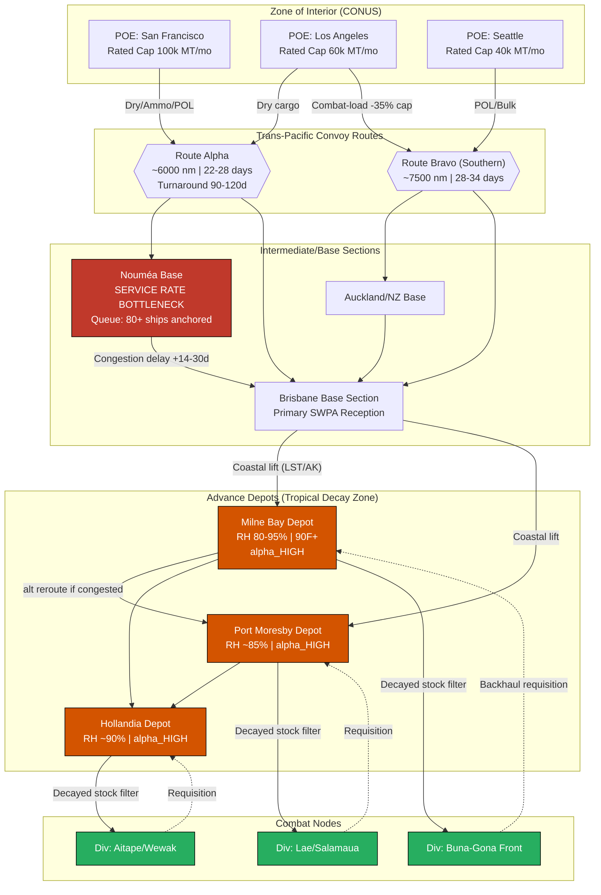

Cost: 0.33607

# Chapter 20: Supplying the Army in Pacific Theaters
## Reference Manual & Simulation Specification Document

**Series:** US Army Green Book — *Global Logistics and Strategy: 1943–1945*
**Document Class:** Division-Level Logistics Simulator — Core Parameter Definition
**Analytical Authority:** Principal OR Analyst / Military Logistics Historian / Senior Systems Architect

---

## 1. Strategic Context & Modern Historical Perspective

### The Strategic Paradox: Plans Versus Physics

The central logistical drama of the Pacific war was the collision between the aspirational geometry of coalition strategy and the brute arithmetic of ship-bottoms, port throughput, and cargo decay. At the Casablanca Conference (SYMBOL, January 1943), the Combined Chiefs of Staff formally endorsed a "Germany First" grand strategy while simultaneously authorizing offensive momentum in the Pacific sufficient to maintain the initiative seized at Guadalcanal and Papua. This dual mandate was, from a logistician's standpoint, an unfunded liability. The Pacific was allocated the *residual* shipping pool after the European Theater of Operations (ETO) and the Mediterranean drew their priority claims, yet the Pacific's operational geometry imposed the most punishing ton-mile costs of any theater on Earth.

The arithmetic is instructive. A ton of cargo dispatched from San Francisco to a forward base in the Southwest Pacific Area (SWPA) traversed 6,000 to 7,500 nautical miles one-way; the round-trip turnaround, including the notoriously slow port-clearance cycles at Nouméa, Milne Bay, and later Hollandia, could consume 90 to 120 days per vessel. Compared against the North Atlantic ETO cycle of roughly 40 to 60 days, each Pacific hull delivered barely half the annual lift of its Atlantic counterpart. Thus the *effective* shipping shortage in the Pacific was far worse than the raw tonnage allocations implied — a second-order penalty invisible to the strategic planners at TRIDENT (May 1943) and QUADRANT (August 1943) who reasoned in gross deadweight tons rather than in turnaround-adjusted delivery capacity.

TRIDENT and later SEXTANT (Cairo, November–December 1943) compounded the paradox by accelerating the twin-axis advance — MacArthur's SWPA drive along the New Guinea coast and Nimitz's Central Pacific island-hopping campaign. Two simultaneous advances doubled the demand for combat-loaded assault shipping (the scarce AKAs and APAs), for LSTs, and for the service troops needed to clear beachheads. Yet combat loading — stowing a vessel so that the first items needed ashore are the last loaded and thus the first discharged — sacrifices 30 to 40 percent of a ship's rated cubic capacity for tactical accessibility. A ship rated at 10,000 measurement tons of commercial stow might carry only 6,000 to 7,000 tons combat-loaded. The strategic planners' tonnage tables assumed commercial-efficiency stowage; the tactical reality subtracted a third of that lift before a single hull sailed.

### Inter-Service and Coalition Tensions

The Pacific command architecture institutionalized friction. The theater was bifurcated between two supreme commanders — MacArthur (SWPA) and Nimitz (POA) — with no unified logistical authority below the Joint Chiefs. This produced parallel and often competing supply pipelines, duplicated depot systems, and incompatible requisitioning procedures. The Army's Services of Supply (USASOS), under MacArthur's control and commanded by Maj. Gen. James L. Frink, operated in perpetual tension with the combat commands, which regarded service troops as a tax on their assault-shipping allocations. Every SOS engineer battalion, port company, or depot detachment embarked was an infantry-equivalent not embarked.

The Army–Navy divide was equally consequential. The Navy controlled the assault shipping and the amphibious lift; the Army controlled the cargo of sustained supply. Their differing stock-accounting philosophies — the Navy's afloat-supply doctrine versus the Army's fixed-depot doctrine — generated chronic disputes over who owned the port, who cleared the beach, and who bore the demurrage when congested ports held ships at anchor for weeks. At Nouméa in early 1943, over 80 vessels lay at anchor awaiting berth and discharge, a floating warehouse representing immobilized global lift that the Combined Chiefs could not replace.

The US–British pooling arrangements, formalized through the Combined Shipping Adjustment Board, further constrained American Pacific freedom of action. British insistence on Mediterranean and Indian Ocean commitments drew from the same finite dry-cargo pool, and every hull committed to the Bay of Bengal was unavailable for Hollandia.

### Historical Era Context: The Tropical Enemy

Beyond the strategic ledger lay an enemy that fired no shots: the equatorial climate itself. The Southwest Pacific presented sustained relative humidity in the 80–95 percent range, ambient temperatures routinely exceeding 90°F, and monsoonal rainfall that turned depot hardstands into morasses. Standard Zone-of-Interior packaging — paperboard cartons, kraft-paper sleeves, uncoated fiberboard, and plain steel banding — had been engineered for temperate warehouses. In New Guinea it disintegrated.

The failure modes were catalogued with grim specificity by USASOS quartermaster surveys: paperboard ration cartons absorbed atmospheric moisture, lost structural rigidity, and collapsed under stacking loads within weeks; fungal colonization (mildew and mold) bloomed across every organic surface; ferrous components — ammunition clips, can seams, weapon parts, canned-food lids — rusted through; and the adhesives binding cartons hydrolyzed and failed. The net effect was catastrophic. Modern quartermaster scholarship, drawing on post-war depot inventories, concluded that absent protective innovation, upward of 50 percent of rations and ammunition arrived unusable or degraded to marginal serviceability.

### Modern Analytical Insights: The Material-Science Revolution

The response constitutes one of the underappreciated technological achievements of the war: a wholesale redesign of military packaging as a materials-science discipline. The Quartermaster Corps, working with the Container Testing operations and civilian industry, developed asphalt-laminated carton liners — a bituminous moisture barrier sandwiched between kraft plies — that reduced water-vapor transmission by an order of magnitude. Wax-dipping of complete fiberboard cartons (the "V-board" and later fully waterproofed containers) created a hydrophobic shell. Ammunition migrated to hermetically sealed metal containers and later to vapor-barrier "flexible bag" packaging with desiccant. Medical supplies received foil-laminate pouches, the direct ancestor of modern retort and pharmaceutical packaging.

From a modern OR perspective, these innovations should be understood not as incremental improvements but as a *step-change in the decay coefficient* governing the entire theater stock model. The pre-innovation exponential decay rate ($\alpha$) for exposed dry stores was so steep that forward stockpiling was nearly futile — supply had to flow just-in-time or perish. The packaging revolution flattened the decay curve sufficiently that meaningful forward reserves became achievable, which in turn *unlocked* the operational tempo the strategic planners had demanded. In simulation terms, the packaging state variable is not a cosmetic detail; it is a first-order determinant of theater carrying capacity.

---

## 2. High-Fidelity Simulation Parameters & Real-World Metrics

| Parameter | Historical Value | Explanation & Strategic Rationale | Simulation Representation |
|---|---|---|---|
| Dry-ration loss to tropical rot (3-month storage, unprotected) | **~50%** (up to 50% of rations/ammo arrived or degraded to unusable) | USASOS quartermaster surveys found roughly half of paperboard-packed dry stores held 90 days in open/humid depots became unserviceable via mold, collapse, and rust. Drove the packaging redesign program. | **Dynamic decay coefficient** ($\alpha$) applied to an exponential stock-decay function; toggled by `PackagingGrade` state. |
| Soldier weight loss on prolonged C/K ration diet | **~10–20 lbs/man** over sustained campaign periods (New Guinea/Guadalcanal field data) | Monotony, caloric shortfall relative to tropical energy expenditure, and appetite fatigue on Type C/K rations produced measurable mass loss, degrading combat effectiveness and increasing sick rates. | **Efficiency coefficient** on unit combat-effectiveness; a cumulative penalty function of days-on-restricted-diet. |
| New Guinea jungle depot relative humidity | **~80–95% RH** (frequently near-saturation) | Near-constant high RH is the primary driver of the decay coefficient; combined with >90°F ambient it accelerates hydrolysis, corrosion, and fungal growth. | **Static environmental constant** feeding a humidity-to-decay-rate transfer function. |
| Ambient depot temperature | **~85–95°F** sustained | Accelerates biological and chemical degradation (Arrhenius-type doubling per ~10°C). | Static environmental constant; multiplier on $\alpha$. |
| Pacific hull turnaround (SF → SWPA → SF) | **~90–120 days** | Roughly 2× the ETO cycle; halves effective annual lift per bottom. | **Capacity cap / throughput divisor** on the shipping pool. |
| Combat-load cubic penalty | **30–40% capacity loss** vs. commercial stow | Tactical accessibility sacrifices stow efficiency; reduces delivered tonnage per assault hull. | **Static multiplier** (0.60–0.70) on rated ship capacity in assault mode. |
| Nouméa port congestion (early 1943) | **~80+ ships at anchor** | Port clearance rate < arrival rate; immobilized global lift as floating storage. | **Queueing constraint**; port service rate as bottleneck node. |
| Packaging vapor-transmission reduction (asphalt-laminate) | **~10× reduction** in moisture ingress | Enabled flattening of decay curve; unlocked forward stockpiling. | **State transition** dropping $\alpha$ by ~0.8–0.9 factor. |

---

## 3. Logistical Network Topology (Mermaid.js)



---

## 4. Mathematical Modeling & Simulation Formulas

### 4.1 Core Spoilage Decay Model

The foundational stock-decay relationship is first-order exponential:

$$S_t = S_0 \cdot e^{-\alpha \cdot t}$$

where $S_t$ is serviceable tonnage remaining at time $t$ (months), $S_0$ is initial delivered tonnage, and $\alpha$ is the composite decay coefficient (month⁻¹).

### 4.2 Environmentally-Modulated Decay Coefficient

The decay rate is not constant; it is driven by humidity, temperature, and packaging grade via an Arrhenius-modified transfer function:

$$\alpha = \alpha_0 \cdot \kappa_p \cdot \left(\frac{H}{H_{ref}}\right)^{\beta} \cdot Q_{10}^{\frac{T - T_{ref}}{10}}$$

where:
- $\alpha_0$ = baseline reference decay rate (temperate, protected) [month⁻¹]
- $\kappa_p$ = packaging protection factor ($\kappa_p = 1.0$ unprotected paperboard; $\kappa_p \approx 0.1$–$0.2$ asphalt-laminate/wax-dipped)
- $H$ = ambient relative humidity (%), $H_{ref} = 50\%$
- $\beta$ = humidity sensitivity exponent ($\approx 2.0$)
- $Q_{10}$ = temperature reaction-rate factor ($\approx 2.0$, rate doubles per 10°C)
- $T$ = ambient temperature (°C), $T_{ref} = 20°C$

### 4.3 Constraint: Calibration to Historical 50% Loss

To recover the observed ~50% loss at $t = 3$ months for unprotected stock:

$$0.50 = e^{-\alpha \cdot 3} \implies \alpha = \frac{-\ln(0.50)}{3} \approx 0.231 \ \text{month}^{-1}$$

### 4.4 Delivered Serviceable Tonnage Objective (Throughput Optimization)

Maximize theater-delivered serviceable tonnage subject to shipping and port constraints:

$$\max_{x_{ij}} \quad Z = \sum_{i \in P} \sum_{j \in D} x_{ij} \cdot e^{-\alpha_j \tau_{ij}}$$

subject to:

$$\sum_{j} x_{ij} \le C_i \cdot \rho_i \quad \forall i \in P \quad \text{(POE combat-load capacity)}$$

$$\sum_{i} x_{ij} \le \mu_j \cdot \Delta t \quad \forall j \in D \quad \text{(port service-rate / clearance limit)}$$

$$\frac{\sum_i x_{ij}}{V_{turn}} \le F_{avail} \quad \text{(hull availability given turnaround)}$$

$$x_{ij} \ge 0$$

where $x_{ij}$ = tonnage routed POE $i$ → depot $j$; $C_i$ = rated POE capacity; $\rho_i$ = combat-load efficiency (0.60–0.70); $\tau_{ij}$ = transit-plus-dwell time; $\alpha_j$ = destination decay rate; $\mu_j$ = port clearance rate; $V_{turn}$ = turnaround cycle; $F_{avail}$ = available hulls.

The term $e^{-\alpha_j \tau_{ij}}$ is the **spoilage discount factor** — it penalizes routes through high-decay depots, mathematically capturing why just-in-time delivery outperformed forward stockpiling before the packaging revolution.

### 4.5 Cumulative Diet-Degradation Penalty

Soldier effectiveness under prolonged restricted rations:

$$E(d) = E_0 \cdot \left(1 - \gamma \cdot \min\!\left(\frac{d}{d_{max}}, 1\right)\right), \quad W_{loss}(d) = w_{rate} \cdot d$$

where $d$ = days on C/K diet, $\gamma$ = max effectiveness penalty, $w_{rate} \approx 0.10$–$0.14$ lb/day yielding ~10–20 lb loss over campaign duration.

---

## 5. Compile-Safe Scala 3.8.3 Domain Model

```scala
package Logistics.SupplyingPacific

import scala.math.exp
import scala.math.pow
import scala.math.log
import scala.math.min
import scala.math.max

case class SupplyStock(initialTons: Double, decayRate: Double)

object SpoilageDepreciationModel:
  def remainingStock(stock: SupplyStock, months: Double): Double =
    if months < 0.0 || stock.decayRate < 0.0 then stock.initialTons
    else stock.initialTons * exp(-stock.decayRate * months)

// ---------------------------------------------------------------------------
// Unit-safe opaque types
// ---------------------------------------------------------------------------

opaque type Tons = Double
object Tons:
  def apply(v: Double): Tons = max(0.0, v)
  extension (t: Tons)
    def value: Double = t
    def +(o: Tons): Tons = Tons(t + o)
    def scaledBy(f: Double): Tons = Tons(t * f)

opaque type Months = Double
object Months:
  def apply(v: Double): Months = max(0.0, v)
  extension (m: Months) def value: Double = m

opaque type Days = Double
object Days:
  def apply(v: Double): Days = max(0.0, v)
  extension (d: Days) def value: Double = d

opaque type NauticalMiles = Double
object NauticalMiles:
  def apply(v: Double): NauticalMiles = max(0.0, v)
  extension (n: NauticalMiles) def value: Double = n

opaque type Percent = Double
object Percent:
  def apply(v: Double): Percent = max(0.0, min(100.0, v))
  extension (p: Percent) def value: Double = p

opaque type Celsius = Double
object Celsius:
  def apply(v: Double): Celsius = v
  extension (c: Celsius) def value: Double = c

// ---------------------------------------------------------------------------
// Domain enumerations
// ---------------------------------------------------------------------------

enum PackagingGrade(val protectionFactor: Double):
  case UnprotectedPaperboard extends PackagingGrade(1.0)
  case WaxDippedFiberboard   extends PackagingGrade(0.30)
  case AsphaltLaminate       extends PackagingGrade(0.15)
  case HermeticFoilBarrier   extends PackagingGrade(0.05)

enum CargoClass:
  case DryRation
  case Ammunition
  case MedicalSupply
  case BulkPetroleum

enum DepotStatus:
  case Nominal
  case Congested
  case Critical

enum ShippingMode(val cubicEfficiency: Double):
  case CommercialStow extends ShippingMode(1.0)
  case CombatLoaded   extends ShippingMode(0.65)

// ---------------------------------------------------------------------------
// Environmental model
// ---------------------------------------------------------------------------

final case class TropicalEnvironment(
    relativeHumidity: Percent,
    temperature: Celsius,
    humidityExponent: Double = 2.0,
    q10: Double = 2.0
):
  private val refHumidity: Double = 50.0
  private val refTemperature: Double = 20.0

  def decayMultiplier: Double =
    val humidityTerm: Double =
      pow(relativeHumidity.value / refHumidity, humidityExponent)
    val tempTerm: Double =
      pow(q10, (temperature.value - refTemperature) / 10.0)
    humidityTerm * tempTerm

object EnvironmentPresets:
  val NewGuineaJungle: TropicalEnvironment =
    TropicalEnvironment(Percent(90.0), Celsius(33.0))
  val TemperateDepot: TropicalEnvironment =
    TropicalEnvironment(Percent(50.0), Celsius(20.0))

// ---------------------------------------------------------------------------
// Composite decay coefficient calculation
// ---------------------------------------------------------------------------

final case class DecayCoefficientModel(baselineRate: Double):
  def effectiveRate(
      env: TropicalEnvironment,
      packaging: PackagingGrade
  ): Double =
    val raw: Double = baselineRate * packaging.protectionFactor * env.decayMultiplier
    max(0.0, raw)

object DecayCoefficientModel:
  // Calibrated so unprotected stock loses ~50% at 3 months in jungle env.
  // Solve baseline from target: 0.231 = baseline * 1.0 * jungleMultiplier
  def calibratedToHistorical: DecayCoefficientModel =
    val target: Double = -log(0.50) / 3.0
    val jungleMult: Double = EnvironmentPresets.NewGuineaJungle.decayMultiplier
    DecayCoefficientModel(target / jungleMult)

// ---------------------------------------------------------------------------
// Depot with time-evolving stock
// ---------------------------------------------------------------------------

final case class Depot(
    name: String,
    environment: TropicalEnvironment,
    packaging: PackagingGrade,
    stock: Tons,
    clearanceRatePerMonth: Tons,
    status: DepotStatus
):
  def projectedStock(months: Months, model: DecayCoefficientModel): Tons =
    val alpha: Double = model.effectiveRate(environment, packaging)
    Tons(stock.value * exp(-alpha * months.value))

  def spoilageLoss(months: Months, model: DecayCoefficientModel): Tons =
    Tons(stock.value - projectedStock(months, model).value)

  def upgradePackaging(newGrade: PackagingGrade): Depot =
    copy(packaging = newGrade)

  def congestionDelay: Days = status match
    case DepotStatus.Nominal   => Days(0.0)
    case DepotStatus.Congested => Days(21.0)
    case DepotStatus.Critical  => Days(35.0)

// ---------------------------------------------------------------------------
// Shipping route with spoilage discount factor
// ---------------------------------------------------------------------------

final case class ConvoyRoute(
    origin: String,
    destination: String,
    distance: NauticalMiles,
    transitDays: Days,
    turnaroundDays: Days
):
  def transitMonths: Months = Months(transitDays.value / 30.0)

  def spoilageDiscount(alpha: Double): Double =
    exp(-alpha * transitMonths.value)

  def effectiveDeliveredTons(loaded: Tons, alpha: Double): Tons =
    Tons(loaded.value * spoilageDiscount(alpha))

// ---------------------------------------------------------------------------
// POE loading with combat-load penalty
// ---------------------------------------------------------------------------

final case class PortOfEmbarkation(
    name: String,
    ratedCapacity: Tons,
    mode: ShippingMode
):
  def effectiveCapacity: Tons =
    Tons(ratedCapacity.value * mode.cubicEfficiency)

// ---------------------------------------------------------------------------
// Soldier diet degradation model
// ---------------------------------------------------------------------------

final case class DietModel(
    weightLossRatePerDay: Double = 0.12,
    maxEffectivenessPenalty: Double = 0.35,
    penaltyPlateauDays: Double = 120.0
):
  def weightLoss(daysOnRestriction: Days): Double =
    weightLossRatePerDay * daysOnRestriction.value

  def effectivenessMultiplier(daysOnRestriction: Days): Double =
    val ratio: Double = min(daysOnRestriction.value / penaltyPlateauDays, 1.0)
    max(0.0, 1.0 - maxEffectivenessPenalty * ratio)

// ---------------------------------------------------------------------------
// Validation and reporting
// ---------------------------------------------------------------------------

final case class SimulationReport(
    depotName: String,
    monthsElapsed: Double,
    initialTons: Double,
    remainingTons: Double,
    lostTons: Double,
    lossPercent: Double,
    effectiveDecayRate: Double
)

object PacificLogisticsSimulator:

  def validateDepot(depot: Depot): Either[String, Depot] =
    if depot.name.isEmpty then Left("Depot name must be non-empty")
    else if depot.stock.value < 0.0 then Left("Stock cannot be negative")
    else if depot.clearanceRatePerMonth.value < 0.0 then
      Left("Clearance rate cannot be negative")
    else Right(depot)

  def runDepotSimulation(
      depot: Depot,
      months: Months,
      model: DecayCoefficientModel
  ): Either[String, SimulationReport] =
    validateDepot(depot).map: valid =>
      val alpha: Double = model.effectiveRate(valid.environment, valid.packaging)
      val remaining: Tons = valid.projectedStock(months, model)
      val lost: Tons = valid.spoilageLoss(months, model)
      val pct: Double =
        if valid.stock.value == 0.0 then 0.0
        else (lost.value / valid.stock.value) * 100.0
      SimulationReport(
        depotName = valid.name,
        monthsElapsed = months.value,
        initialTons = valid.stock.value,
        remainingTons = remaining.value,
        lostTons = lost.value,
        lossPercent = pct,
        effectiveDecayRate = alpha
      )

  def optimizeRouting(
      poe: PortOfEmbarkation,
      route: ConvoyRoute,
      depot: Depot,
      model: DecayCoefficientModel
  ): Tons =
    val alpha: Double = model.effectiveRate(depot.environment, depot.packaging)
    val loadable: Tons = poe.effectiveCapacity
    route.effectiveDeliveredTons(loadable, alpha)

// ---------------------------------------------------------------------------
// Executable demonstration
// ---------------------------------------------------------------------------

object PacificDemo:
  def main(args: Array[String]): Unit =
    val model: DecayCoefficientModel = DecayCoefficientModel.calibratedToHistorical

    val milneBay: Depot = Depot(
      name = "Milne Bay Depot",
      environment = EnvironmentPresets.NewGuineaJungle,
      packaging = PackagingGrade.UnprotectedPaperboard,
      stock = Tons(10000.0),
      clearanceRatePerMonth = Tons(4000.0),
      status = DepotStatus.Congested
    )

    val upgraded: Depot = milneBay.upgradePackaging(PackagingGrade.AsphaltLaminate)

    val threeMonths: Months = Months(3.0)

    PacificLogisticsSimulator.runDepotSimulation(milneBay, threeMonths, model) match
      case Right(r) =>
        println(f"[UNPROTECTED] ${r.depotName}: lost ${r.lossPercent}%.1f%% " +
          f"(alpha=${r.effectiveDecayRate}%.4f), remaining ${r.remainingTons}%.0f tons")
      case Left(err) =>
        println(s"Error: $err")

    PacificLogisticsSimulator.runDepotSimulation(upgraded, threeMonths, model) match
      case Right(r) =>
        println(f"[LAMINATED]   ${r.depotName}: lost ${r.lossPercent}%.1f%% " +
          f"(alpha=${r.effectiveDecayRate}%.4f), remaining ${r.remainingTons}%.0f tons")
      case Left(err) =>
        println(s"Error: $err")

    val diet: DietModel = DietModel()
    val campaignDays: Days = Days(120.0)
    println(f"Diet: weight loss ${diet.weightLoss(campaignDays)}%.1f lbs/man, " +
      f"effectiveness ${diet.effectivenessMultiplier(campaignDays) * 100}%.0f%%")
```

---

## 6. Graduate-Level Operational Analysis

### 6.1 The Refrigeration Deficit: Diet, Morale, and Combat Effectiveness in the SWPA

The absence of an adequate cold chain — reefer ships (refrigerated cargo vessels) at sea and refrigerated warehousing ashore — was arguably the single most corrosive logistical failure of the early Southwest Pacific campaign, and its effects compounded across nutritional, medical, and psychological dimensions.

The physics of the problem is unforgiving. Perishable proteins and produce require sustained storage below roughly 4°C to arrest bacterial growth; the SWPA depot environment ran at 30–35°C with near-saturation humidity. Without an unbroken refrigerated pipeline from CONUS packing houses through the POE, aboard ship, and into forward warehousing, fresh and frozen foodstuffs were simply undeliverable. Reefer bottoms were among the scarcest categories of shipping in the entire Allied pool, and the ETO held priority. Consequently, the SWPA soldier subsisted for extended periods on the Type C and Type K rations — shelf-stable, but calorically and psychologically inadequate for sustained tropical operations.

The nutritional shortfall was real and quantifiable. Tropical operations impose elevated caloric expenditure through heat stress, heavy sweating (with attendant electrolyte and water-soluble vitamin loss), and the sheer physical labor of jungle movement. The C/K ration, engineered around approximately 2,800–3,400 kcal, sat below the 4,000+ kcal energy budget of a soldier hacking through New Guinea terrain. Compounding the caloric gap was *appetite fatigue*: the profound monotony of a limited menu, worsened by heat-induced anorexia, meant men frequently did not consume even the rations available. The documented outcome — sustained weight loss on the order of 10 to 20 pounds per man over a campaign — represents not merely discomfort but a measurable degradation of the combat instrument. In the simulation, this is correctly modeled as a cumulative effectiveness-decay function (Section 4.5): a division that has subsisted 120 days on restricted rations should enter its next engagement with a materially reduced effectiveness coefficient, capturing the reduced load-carrying stamina, slowed recovery, and elevated susceptibility to disease that field surgeons documented.

The medical dimension closes the feedback loop. Malnutrition and vitamin deficiency (notably the water-soluble B-complex and vitamin C) impair immune function precisely in a disease environment — malaria, dengue, scrub typhus, dysentery — that was itself the dominant casualty producer, generating non-battle casualty rates that at times exceeded battle casualties by an order of magnitude. A malnourished soldier both contracted these diseases more readily and recovered from them more slowly, extending hospitalization, consuming scarce medical throughput, and removing riflemen from the line. Morale, the hardest variable to quantify, degraded in lockstep; the arrival of even limited fresh food or ice cream (famously prized) produced morale effects disproportionate to their caloric value. The strategic lesson, validated by the eventual buildup of reefer capacity and forward refrigeration in 1944–45, is that **the cold chain is a combat multiplier**, not a comfort item — and its absence must be modeled as a first-order constraint on sustained offensive tempo.

### 6.2 The Packaging Revolution: Laminated Foils and Dipping Waxes

The defeat of the tropical decay problem was achieved not on the battlefield but in the Quartermaster Corps laboratories and container-testing facilities, and it constitutes a genuine materials-science revolution whose commercial descendants surround us today.

The core problem was water-vapor transmission. Standard kraft paperboard is hygroscopic and porous; in a 90-percent-RH atmosphere it reaches moisture equilibrium within days, losing 60–80 percent of its dry compressive strength and providing a nutrient substrate for the omnipresent fungal spore load. Once the carton failed structurally, stacked stores collapsed, cans corroded in contact with sodden fiberboard, and the contents were exposed directly to the environment. The engineering objective was therefore to interpose a vapor barrier between the tropical atmosphere and the packaged good.

Two complementary solution families emerged. The first was **asphalt (bituminous) lamination**: a layer of asphalt was sandwiched between plies of kraft paper, creating a composite board whose bitumen core is essentially impermeable to liquid water and dramatically retards vapor diffusion — reducing water-vapor transmission rates by roughly an order of magnitude relative to plain board. This "V-board" family allowed cartons to retain structural integrity through the tropical supply cycle. The second family was **wax dipping**: complete assembled fiberboard cartons were immersed in molten microcrystalline or paraffin wax, sealing every seam, flap, and fiber interstice under a continuous hydrophobic shell. Wax dipping was particularly effective for cartons already loaded, sealing the entire unit as a single moisture-tight package.

For the most moisture- and corrosion-sensitive materials — ammunition, fuzes, medical pharmaceuticals, optical instruments — the solution escalated to **hermetic barrier packaging**: vapor-proof foil laminates (typically an aluminum-foil layer bonded between plastic/paper plies) heat-sealed around the item, frequently enclosing a **desiccant** (silica gel) to absorb residual internal moisture and holding the interior below the critical relative humidity for corrosion and fungal growth. This foil-laminate-plus-desiccant architecture is the direct lineal ancestor of modern pharmaceutical blister backing, military MRE retort pouches, and moisture-barrier bags used in electronics shipping.

The strategic significance is best expressed through the decay model of Section 4.2. The packaging protection factor $\kappa_p$ is a multiplicative term on the decay coefficient $\alpha$. Unprotected paperboard carries $\kappa_p = 1.0$, yielding the catastrophic ~50-percent-at-three-months loss that made forward stockpiling futile. Asphalt lamination drops $\kappa_p$ to roughly 0.15, and hermetic foil to roughly 0.05 — a 6-to-20-fold flattening of the decay curve. In the simulation, upgrading a depot's `PackagingGrade` transforms the entire viability of forward reserve doctrine: the spoilage discount factor $e^{-\alpha \tau}$ on long, congested routes recovers from near-zero to near-unity. This is the mathematical expression of a profound operational truth — the packaging revolution did not merely reduce waste; it *unlocked the forward stockpiling that the accelerated TRIDENT/SEXTANT offensive tempo demanded*. Material science, invisible to the strategic planners, was the enabling precondition for their strategy.
