Cost: 0.3941925

## 1. Strategic Context & Modern Historical Perspective

Chapter 20 of *Global Logistics and Strategy: 1943–1945* must be understood as an analysis of two interacting systems rather than as a simple account of ships delivering supplies to distant armies. The first system was the global allocation machinery through which the Combined Chiefs of Staff, Joint Chiefs of Staff, War Shipping Administration, Army Service Forces, Navy, and British Ministry of War Transport divided shipping, landing craft, petroleum, ammunition, and other scarce resources among competing theaters. The second was the theater distribution system that moved cargo from deep-water ports through intermediate bases, small harbors, beaches, jungle roads, barge routes, and airstrips to combat formations. Strategic decisions made at Allied conferences could authorize an operation, but authorization did not create the cargo ships, assault transports, landing craft, port battalions, refrigerated warehouses, roads, or trained service units required to execute it.

### The strategic paradox

At Casablanca in January 1943, the Allies reaffirmed the defeat of Germany as the principal coalition objective while continuing operations against Japan. TRIDENT in May 1943, QUADRANT in August, and SEXTANT in November–December progressively approved a widening series of Pacific and Southeast Asian operations. In the Southwest Pacific, General Douglas MacArthur’s command advanced along New Guinea toward the Philippines while neutralizing or bypassing Japanese strongpoints. In the Central Pacific, Admiral Chester Nimitz’s forces advanced through the Gilberts, Marshalls, Marianas, and western Carolines. These offensives were strategically complementary, but they often competed for the same shipping, amphibious lift, landing craft, construction units, and specialized service equipment.

The paradox was that the Pacific method of advance was intended to economize force by bypassing major Japanese garrisons, yet each bypass generated another logistical base. Even a small island or coastal lodgment could require a harbor organization, engineer construction force, petroleum storage, ammunition dumps, hospitals, communications facilities, airfield support, antiaircraft defenses, and local water production. The resulting network was not a single pipeline. It was a branching, partially redundant system of ocean routes and transshipment bases whose inventory requirements increased with distance, uncertainty, and the number of echelons.

Global shipping calculations usually dealt in ship tons, measurement tons, or deadweight capacity. Tactical commanders, however, required particular commodities in operationally usable configurations. Ten thousand tons of cargo at Brisbane or Nouméa did not represent 10,000 tons of effective support for a division at an isolated New Guinea beachhead. Cargo could be unavailable because it was buried under other cargo, loaded in the wrong ship, packed for depot storage rather than assault discharge, awaiting documentation, damaged by moisture, or immobilized by the absence of barges and trucks. The simulator must therefore distinguish nominal inventory from accessible, serviceable, correctly positioned inventory.

Combat loading imposed especially severe penalties. Commercially efficient loading maximized vessel utilization and grouped cargo for economical port handling. Combat loading sacrificed density so that troops, ammunition, vehicles, engineering equipment, and rations could be discharged in the sequence required by an assault. Vehicles needed clearance around them; ammunition had to be segregated; high-priority cargo had to remain accessible; and landing craft had to be matched to beach conditions. Thus a ship’s commercial cargo rating was not its effective assault capacity. A strategic plan expressed in divisions and target dates had to be translated into ships, loading plans, beach groups, tides, landing craft cycles, and daily clearance rates.

Port clearance was often more restrictive than ocean shipping. Major Australian ports possessed developed infrastructure, although they suffered from long inland distances, competing civilian traffic, labor constraints, and periodic accumulation of theater stocks. Forward New Guinea ports frequently lacked piers, cranes, covered storage, roads, and sufficient lighterage. Cargo discharged onto an exposed beach could exceed the rate at which engineers and quartermaster units removed it. Once the beach became saturated, unloading slowed or stopped, ships remained offshore, and scarce hulls accumulated turnaround delay. In systems terms, the controlling capacity was the minimum of ship discharge, lighterage, beach handling, truck lift, road throughput, and depot receiving capacity—not the largest of those values.

### Inter-service and coalition tensions

Army Service Forces and theater Services of Supply attempted to maintain balanced inventories, regulate requisitions, and avoid excessive forward accumulation. Combat commanders understandably emphasized immediate operational requirements and frequently requested safety stocks against uncertain schedules, enemy action, and shipping losses. These positions reflected different risk functions. A theater logistician saw excess requisitions as congestion, ship-space consumption, and immobilized inventory; a combat commander saw inventory already inside the theater as insurance against interruption. The conflict was therefore not simply bureaucratic. It arose from differing estimates of the cost of shortage versus the cost of excess.

Army–Navy friction was embedded in the physical organization of Pacific warfare. The Navy controlled most ocean movement and amphibious lift, while the Army supplied large ground and air establishments after lodgments had been secured. Naval commanders sought rapid release of assault shipping for subsequent operations. Army commanders required time to discharge equipment, stabilize beaches, establish depots, and build airfields. Cargo documentation and ownership were fragmented among Navy, Marine Corps, Army Ground Forces, Army Air Forces, and theater service organizations. A vessel might carry multiple services’ cargo under a naval movement schedule while relying on Army port units at destination. A delay in any component propagated through the entire convoy cycle.

The U.S.–British shipping relationship produced similar tension at the strategic level. Shipping was treated in part as a combined resource, but national authorities retained strong preferences concerning employment. British planners had commitments in the Indian Ocean, Middle East, Mediterranean, and United Kingdom. American planners sought lift for the Pacific while sustaining the buildup for the cross-Channel attack. The global tanker pool was particularly inflexible because tankers could not normally substitute for dry-cargo ships, and petroleum demand rose sharply with each new airfield, naval base, and motorized distribution network.

The allocation of landing craft was even less elastic. Landing ships and craft were not merely transport tonnage; they were specialized interfaces between ships and undeveloped shores. Their scarcity affected operation dates from Burma to Normandy and the Pacific. A theater could possess adequate dry cargo in rear bases yet remain operationally constrained because it lacked the craft needed to cross the final few miles.

### Tropical degradation as a system-level constraint

The tropical environment converted time into material loss. High temperature and persistent humidity accelerated corrosion, fungal growth, adhesive failure, insect infestation, vitamin deterioration, and the weakening of fiberboard containers. Warehouses with inadequate ventilation accumulated condensation. Cargo landed through surf was exposed to salt water. Paper labels detached or became illegible, cartons collapsed when stacked, steel cans rusted at seams, and wooden crates absorbed water. Medical dressings, pharmaceuticals, optical equipment, radio components, batteries, leather goods, and ammunition packaging were all vulnerable.

Food presented several separate problems. Fresh meat, dairy products, fruit, and vegetables required refrigerated ships, cold stores, insulated distribution, and reliable power. If any link failed, the effective cold chain ended. Shelf-stable field rations avoided refrigeration but imposed nutritional and psychological costs when consumed for prolonged periods. Monotony, reduced appetite, heat stress, intestinal illness, and heavy physical work could create negative energy balance even when the nominal caloric issue appeared adequate. Units often possessed enough “ration-days” in accounting terms while soldiers did not consume enough usable or acceptable food.

The expression “jungle ration” should be used carefully. The Army tested and fielded several specialized ration concepts—including compact patrol and assault rations—but the C and K rations remained prominent in tactical use. The K ration had been designed for short-duration employment, not as a permanent diet. Long use magnified deficiencies in variety, bulk, caloric adequacy for sustained heavy labor, and acceptability in high heat. Theater commanders consequently sought greater use of B-ration components, fresh foods, bread, and locally available produce whenever transport and refrigeration permitted.

Packaging development was therefore a form of weapons-system engineering. Water-vapor barriers, asphalt- or bitumen-laminated papers, wax dipping, improved can coatings, sealed metal containers, waterproof crate liners, moisture-resistant adhesives, and vapor-proof wrapping reduced the rate at which environmental exposure converted gross tonnage into unserviceable stock. Packaging also had to survive rough handling, repeated transshipment, surf discharge, and outdoor storage. A package suitable for a temperate domestic rail movement could fail after months in a humid hold and an open-air tropical dump.

Modern material science explains these failures in terms of water-vapor transmission, equilibrium moisture content, corrosion kinetics, fungal growth thresholds, and thermal cycling. Relative humidity is important but insufficient by itself: the simulation should also track temperature, salt exposure, ventilation, rainfall intrusion, package integrity, and storage duration. Corrosion and fungal damage are generally nonlinear. Once a barrier is punctured or cardboard loses structural strength, deterioration may accelerate sharply.

The proposition that “over half of all ammunition and rations shipped to the South Pacific would otherwise have arrived unusable” is not supported as a general theater-wide statistic by the Green Book chapter or by standard Quartermaster and Ordnance histories. Local dumps, cargo lots, and poorly packed commodities could suffer catastrophic losses, but a universal 50 percent arrival-loss rate would require evidence defining the commodity, route, period, and inspection standard. It should be represented as a severe scenario or counterfactual sensitivity case, not as a verified historical constant.

### Modern systems interpretation

Postwar scholarship reinforces three conclusions. First, logistics capacity was an end-to-end property. Ocean tonnage alone could not predict supported combat power. Second, inventory had both spatial and temporal attributes. Supplies in Australia, Hawaii, or a rear South Pacific base did not automatically satisfy a shortage at Hollandia or an isolated island garrison. Third, preservation technology effectively created capacity. If improved packaging reduced losses from 20 percent to 5 percent, it delivered an effect comparable to increasing lift—without requiring another ship.

A high-fidelity model should consequently represent at least four stock states: gross stock, accessible stock, serviceable stock, and tactically deliverable stock. It should also represent queueing at ports, convoy schedules, combat-loading penalties, ship turnaround, weather interruption, packaging quality, and environmental decay. The decisive output is not tons shipped but serviceable tons delivered to the consuming formation before the required date.

---

## 2. High-Fidelity Simulation Parameters & Real-World Metrics

### Evidentiary caution

The three requested quantities are not published in Chapter 20 as universal, exact constants. New Guinea encompassed coastal, mountain, monsoon, and seasonal microclimates; losses varied by commodity and packaging; and weight change varied by unit, duration, illness, workload, and ration issue. Assigning spurious precision would be historically misleading.

The table therefore distinguishes:

1. **Documented historical value** — directly supported as a general figure.
2. **Historical range** — defensible across reports or environmental observations.
3. **Simulator calibration value** — an exact value chosen for reproducible runs, not represented as a quotation from the Green Book.

| Parameter | Documented status | Historical range or defensible interpretation | Recommended exact baseline | Simulation representation |
|---|---:|---:|---:|---|
| Dry-ration loss after three months in tropical storage | No universal exact percentage appears in the chapter | Highly variable: negligible in intact hermetic cans; potentially severe for wet, insect-infested, rusted, or collapsed packages. A 50% loss is a severe-case assumption, not a theater average. | **20% serviceability loss at 3 months** for inadequately protected dry-ration lots; **5%** for improved barrier packaging; **50%** only for a severe exposed-dump scenario | Dynamic stock-decay coefficient, stratified by packaging and depot environment |
| Soldier weight loss during prolonged dependence on C/K rations | No chapter-wide average | Contemporary accounts commonly describe material weight loss, but no defensible single Pacific-wide mean exists. Outcomes are confounded by disease and workload. | **15 lb per man over 90 days** as a scenario baseline; sensitivity range **5–25 lb** | Dynamic personnel-state variable driven by calorie deficit, disease, workload, and ration acceptability |
| Relative humidity in New Guinea jungle depots | No single theater-wide average | Commonly **80–95% RH**, with frequent near-saturation overnight; local and seasonal variation is substantial | **85% mean RH**, with daily variation of **±7 percentage points**, bounded to 70–100% | Time-varying environmental driver, not a fixed universal constant |

### Decay coefficients implied by the calibration values

If the remaining fraction after three months is $q$, then the exponential monthly decay coefficient is:

$$
\alpha=-\frac{\ln q}{3}.
$$

The recommended scenarios are:

| Scenario | Remaining after 3 months | Loss after 3 months | $\alpha$ per month |
|---|---:|---:|---:|
| Improved barrier packaging | 0.95 | 5% | 0.01710 |
| Baseline inadequate tropical storage | 0.80 | 20% | 0.07438 |
| Severe exposed-dump stress case | 0.50 | 50% | 0.23105 |

These values apply to **serviceability**, not necessarily literal disappearance. A ton of ration cases may remain physically present while only 0.8 ton-equivalent is edible, identifiable, and issueable.

### Recommended commodity modifiers

| Commodity state | Multiplier on environmental decay rate | Rationale |
|---|---:|---|
| Hermetically sealed metal cans, intact overpack | 0.25 | Strong vapor barrier; residual seam corrosion remains possible |
| Asphalt-laminated or wax-dipped fiberboard | 0.45 | Substantially lowers moisture transmission but is vulnerable to puncture and heat |
| Standard untreated fiberboard | 1.00 | Baseline |
| Torn carton or punctured liner | 1.75 | Barrier failure exposes contents and labels |
| Open beach storage with rainfall and salt spray | 2.25 | Direct wetting, salt corrosion, repeated handling |
| Ventilated raised warehouse | 0.65 | Reduced condensation and ground moisture |
| Refrigerated or humidity-controlled storage | 0.15 | Suppresses biological and chemical deterioration |

### Personnel nutrition parameters

A preferable personnel model does not apply 15 lb as an automatic fixed loss. It calculates energy imbalance:

- Baseline heavy tropical field expenditure: **3,600–4,500 kcal/man/day**.
- Effective consumed energy may be less than issued energy because of appetite suppression, ration monotony, spoilage, illness, and discarded components.
- Approximate energy equivalent: **3,500 kcal per pound** for coarse operational modeling, while recognizing that real short-term mass change also includes water and lean tissue.

A 15 lb loss over 90 days corresponds to a modeled average deficit of:

$$
\frac{15 \times 3500}{90} \approx 583 \text{ kcal/man/day}.
$$

This is plausible as a calibration scenario but must not be presented as a universal measured Pacific average.

---

## 3. Logistical Network Topology (Detailed Mermaid.js Flowchart)

```mermaid
flowchart LR
    subgraph CONUS["Continental United States"]
        PROD["Factories and depots<br/>rations, ammunition, medical stores"]
        PKG["Preservation and packaging plants<br/>wax dipping, barrier liners, sealed cans"]
        WPOE["West Coast POEs<br/>San Francisco, Los Angeles, Seattle"]
        PROD -->|unprotected lots| WPOE
        PROD --> PKG
        PKG -->|lower decay coefficient| WPOE
    end

    subgraph OCEAN["Strategic Ocean Transport"]
        CONVOY["Convoy assembly and routing<br/>capacity: allocated ship-days<br/>delay: escort and sailing schedule"]
        WEATHER{"Weather or enemy disruption?"}
        DIRECT["Direct sailing<br/>high ship utilization<br/>limited destination compatibility"]
        STAGED["Staged movement<br/>more handling and delay<br/>greater route flexibility"]
        WPOE -->|dry cargo, ammunition, reefers| CONVOY
        CONVOY --> WEATHER
        WEATHER -->|No| DIRECT
        WEATHER -->|Yes: reroute or hold| STAGED
    end

    subgraph CENPAC["Central Pacific Network"]
        HAW["Hawaiian base complex<br/>large depot capacity<br/>transshipment congestion"]
        ELLICE["South/Central Pacific staging bases<br/>limited covered storage"]
        GILBERTS["Gilberts and Marshalls<br/>combat-loaded discharge"]
        MARIANAS["Marianas depots and air bases<br/>rapid demand growth"]
        PALAUS["Western Carolines and Palaus<br/>alternative staging route"]
        DIRECT --> HAW
        HAW -->|convoy interval constraint| GILBERTS
        GILBERTS -->|forward redistribution| MARIANAS
        MARIANAS --> PALAUS
        STAGED --> ELLICE
        ELLICE --> GILBERTS
    end

    subgraph SOPAC["South Pacific Staging System"]
        NOUMEA["Nouméa<br/>major transshipment depot<br/>queue if arrivals exceed clearance"]
        ESPIRITU["Espiritu Santo<br/>air and naval base complex"]
        GUAD["Guadalcanal area<br/>forward depot and redistribution"]
        DIRECT --> NOUMEA
        STAGED --> NOUMEA
        NOUMEA -->|coastal shipping| ESPIRITU
        ESPIRITU -->|barge or small ship| GUAD
    end

    subgraph SWPA["Southwest Pacific Rear Bases"]
        BRIS["Brisbane<br/>theater headquarters and depot system"]
        SYD["Sydney and southern Australian ports<br/>deep-water capacity, long onward distance"]
        TOWN["Townsville and north Australian bases<br/>forward staging, constrained storage"]
        MILNE["Milne Bay<br/>New Guinea entry depot"]
        DIRECT --> BRIS
        DIRECT --> SYD
        BRIS -->|rail and coastal shipping| TOWN
        SYD -->|rail bottleneck and handling delay| BRIS
        TOWN -->|small ships and aircraft| MILNE
        GUAD -.->|alternative inter-theater transfer| MILNE
    end

    subgraph NG["New Guinea Forward Distribution"]
        PTM["Port Moresby<br/>road-limited inland clearance"]
        LAE["Lae and Finschhafen<br/>beach and harbor discharge"]
        HOL["Hollandia<br/>forward base and depot expansion"]
        AIT["Aitape and bypassed-garrison screen"]
        BEACH["Assault beaches<br/>capacity limited by surf, tides, LSTs and DUKWs"]
        DEPOT["Jungle depot<br/>RH baseline 85%<br/>covered-storage capacity cap"]
        BARGE["Barge and landing-craft network<br/>weather-sensitive"]
        AIR["Air transport and air-drop route<br/>high priority, low tonnage"]
        MILNE -->|coastal route| PTM
        MILNE -->|coastal route| LAE
        LAE -->|forward shipping| HOL
        HOL --> AIT
        PTM --> AIR
        LAE --> BEACH
        HOL --> BEACH
        BEACH -->|clearance queue| DEPOT
        BEACH --> BARGE
        BARGE --> DEPOT
    end

    subgraph DECAY["Material Condition State Machine"]
        FRESH["Serviceable stock"]
        AGED["Aged or moisture-exposed"]
        DAMAGED["Damaged packaging<br/>accelerated decay"]
        CONDEMNED["Condemned or unusable stock"]
        REPACK["Inspection, salvage and repacking"]
        FRESH -->|time × heat × humidity| AGED
        AGED -->|liner failure, rain, salt| DAMAGED
        DAMAGED -->|inspection failure| CONDEMNED
        DAMAGED -->|salvage capacity available| REPACK
        REPACK -->|recovered fraction| FRESH
    end

    subgraph COMBAT["Final Combat Consumers"]
        DIV["Army division supply point"]
        ARTY["Artillery and ammunition points"]
        MED["Medical clearing and hospital units"]
        AIRBASE["Army Air Forces base units"]
        PATROL["Patrol and isolated outpost"]
        DEPOT -->|truck route: road-tonnage cap| DIV
        DEPOT -->|segregated ammunition lift| ARTY
        DEPOT -->|priority medical issue| MED
        DEPOT -->|fuel and technical stores| AIRBASE
        AIR -->|K/C rations, medicine, ammunition| PATROL
    end

    DEPOT --> FRESH
    NOUMEA -.->|storage-time decay| AGED
    HAW -.->|storage-time decay| AGED
    MILNE -.->|high-humidity decay| DAMAGED

    CONGEST{"Arrival rate exceeds<br/>port-clearance rate?"}
    WPOE --> CONGEST
    NOUMEA --> CONGEST
    BRIS --> CONGEST
    HOL --> CONGEST
    CONGEST -->|Yes| STAGED
    CONGEST -->|No| BEACH
```



The simulation should place a queue at every transshipment node. When arrival tonnage exceeds discharge or clearance capacity, dwell time rises. Dwell time then increases spoilage, producing a feedback loop: congestion creates deterioration, damaged cargo requires inspection and repacking, and those activities consume additional handling capacity.

---

## 4. Mathematical Modeling & Simulation Formulas

### 4.1 Basic exponential spoilage model

The required stock-decay relation is:

$$
S_t=S_0e^{-\alpha t},
$$

where:

- $S_0$ = initial serviceable stock;
- $S_t$ = serviceable stock after elapsed time $t$;
- $\alpha$ = effective decay hazard per unit time;
- $t$ = days or months, consistently defined.

This is a constant-hazard model. During a short interval $\Delta t$:

$$
S_{t+\Delta t}=S_t e^{-\alpha \Delta t}.
$$

The amount rendered unserviceable is:

$$
L_t=S_t\left(1-e^{-\alpha\Delta t}\right).
$$

If an observed remaining fraction $q$ is known at time $T$, calibration follows from:

$$
\alpha=-\frac{\ln q}{T}.
$$

For a 20 percent loss after three months:

$$
\alpha=-\frac{\ln(0.8)}{3}=0.07438\text{ month}^{-1}.
$$

### 4.2 Environment- and packaging-dependent decay

A single $\alpha$ is insufficient for tropical logistics. Define:

$$
\alpha_{knt}
=
\alpha_k^0
M_H(H_{nt})
M_T(T_{nt})
M_S(S_{nt})
M_P(p_k)
M_W(w_n),
$$

where:

- $k$ = commodity class;
- $n$ = storage node;
- $\alpha_k^0$ = commodity’s reference decay rate;
- $H_{nt}$ = relative humidity;
- $T_{nt}$ = temperature;
- $S_{nt}$ = salt or rainfall exposure;
- $p_k$ = packaging type;
- $w_n$ = warehouse quality.

A bounded humidity multiplier may be represented as:

$$
M_H(H)=
\begin{cases}
0.5, & H<0.60,\\
1+\beta_H(H-0.85), & 0.60\le H\le0.95,\\
1.5+\gamma_H(H-0.95), & H>0.95.
\end{cases}
$$

For numerical stability, the implementation should clamp the resulting multiplier to a positive operational range.

Packaging protection may be expressed as:

$$
M_P(p)=1-\eta_p,
$$

where $\eta_p\in[0,1]$ is packaging effectiveness. If wax dipping reduces the decay hazard by 55 percent, then $\eta_p=0.55$ and $M_P=0.45$.

### 4.3 Multi-commodity network-flow model

Let the logistics network be $G=(N,A)$, where $N$ is the set of ports, depots, beaches, and combat nodes, and $A$ is the set of shipping, road, barge, and air routes.

Decision variables:

- $x_{ijkt}$ = tons of commodity $k$ dispatched from node $i$ to node $j$ during period $t$;
- $I_{ikt}$ = serviceable inventory of commodity $k$ at node $i$ after period $t$;
- $u_{ikt}$ = unmet demand;
- $q_{it}$ = cargo awaiting handling at node $i$;
- $y_{ikt}$ = condemned stock;
- $r_{ikt}$ = stock recovered by salvage or repacking.

The serviceable fraction surviving movement is:

$$
\phi_{ijkt}=
\exp\left[-\alpha_{kijt}\left(\tau_{ij}+d_{ijt}\right)\right](1-\ell_{ij}),
$$

where $\tau_{ij}$ is transit time, $d_{ijt}$ is congestion delay, and $\ell_{ij}$ is physical handling or combat loss.

Inventory balance is:

$$
I_{ik,t+1}
=
I_{ikt}e^{-\alpha_{ikt}\Delta t}
+\sum_{j:(j,i)\in A}\phi_{jikt}x_{jikt}
-\sum_{j:(i,j)\in A}x_{ijkt}
-D_{ikt}
+u_{ikt}
+r_{ikt}.
$$

Demand satisfaction requires:

$$
0\le u_{ikt}\le D_{ikt}.
$$

Route capacity is:

$$
\sum_k v_k x_{ijkt}\le C_{ijt},
$$

where $v_k$ is the stowage or handling factor and $C_{ijt}$ is effective route capacity.

Combat loading reduces nominal ship capacity:

$$
C_{ijt}^{\text{effective}}
=
\lambda_{ij}^{\text{combat}}C_{ijt}^{\text{nominal}},
\qquad
0<\lambda_{ij}^{\text{combat}}\le1.
$$

Port discharge and clearance constraints are separate:

$$
\sum_{j,k}x_{jikt}\le U_{it},
$$

$$
\sum_{j,k}x_{ijkt}\le R_{it},
$$

where $U_{it}$ is unloading capacity and $R_{it}$ is onward clearance capacity. Treating these as separate prevents the model from assuming that discharge onto a beach is equivalent to removal from the beach.

The node queue evolves as:

$$
q_{i,t+1}
=
\max\left[
0,\,
q_{it}+A_{it}-R_{it}
\right],
$$

where $A_{it}$ is cargo arriving during the period.

A simple congestion-delay approximation is:

$$
d_{it}=\frac{q_{it}}{\max(R_{it},\varepsilon)}.
$$

### 4.4 Objective function

A suitable weighted objective minimizes operational shortage, deterioration, delay, and transport consumption:

$$
\min Z=
\sum_{i,k,t}
\left(
w_k^u u_{ikt}
+w_k^y y_{ikt}
+w^q q_{it}
\right)
+
\sum_{(i,j),k,t}
\left(
c_{ij}x_{ijkt}
+w^d d_{ijt}x_{ijkt}
\right).
$$

Weights must reflect operational criticality. Ammunition, blood products, antimalarial supplies, and engineer equipment should receive much higher shortage penalties than routine replacement clothing.

### 4.5 Nutrition and body-mass state

Let $E_t^{\text{issued}}$ be nominal ration energy and $a_t$ the consumed fraction:

$$
E_t^{\text{consumed}}=a_tE_t^{\text{issued}}.
$$

The daily deficit is:

$$
\Delta E_t=E_t^{\text{required}}-E_t^{\text{consumed}}.
$$

A coarse weight model is:

$$
W_{t+1}
=
W_t-\frac{\max(0,\Delta E_t)}{3500}
-\delta_t^{\text{disease}}
+\rho_t^{\text{recovery}},
$$

with weights measured in pounds and energy in kilocalories. Disease and dehydration must be modeled separately because short-term weight loss is not entirely adipose-tissue loss.

---

## 5. Compile-Safe Scala 3.8.3 Domain Model

```scala
package Logistics.SupplyingPacific

import scala.math.exp
import scala.math.log
import scala.math.max
import scala.math.min

case class SupplyStock(initialTons: Double, decayRate: Double)

object SpoilageDepreciationModel:
  def remainingStock(stock: SupplyStock, months: Double): Double =
    if months < 0.0 || stock.decayRate < 0.0 then stock.initialTons
    else stock.initialTons * exp(-stock.decayRate * months)

sealed trait ValidationError derives CanEqual:
  def message: String

object ValidationError:
  final case class NonFinite(field: String, value: Double) extends ValidationError:
    val message: String = s"$field must be finite, but was $value"

  final case class Negative(field: String, value: Double) extends ValidationError:
    val message: String = s"$field must be non-negative, but was $value"

  final case class OutOfRange(
      field: String,
      value: Double,
      minimum: Double,
      maximum: Double
  ) extends ValidationError:
    val message: String =
      s"$field must be between $minimum and $maximum, but was $value"

  final case class IncompatibleRoute(expected: String, actual: String)
      extends ValidationError:
    val message: String =
      s"Route origin $actual does not match lot location $expected"

  final case class CapacityExceeded(requested: Double, capacity: Double)
      extends ValidationError:
    val message: String =
      s"Requested tonnage $requested exceeds route capacity $capacity"

opaque type Tons = Double

object Tons:
  def from(value: Double): Either[ValidationError, Tons] =
    validateNonNegative("tons", value)

  def unsafe(value: Double): Tons =
    from(value) match
      case Right(valid) => valid
      case Left(error)  => throw IllegalArgumentException(error.message)

  val Zero: Tons = 0.0

  extension (value: Tons)
    def toDouble: Double = value
    def +(other: Tons): Tons = value + other
    def -(other: Tons): Tons = max(0.0, value - other)
    def *(factor: Double): Tons = max(0.0, value * factor)
    def min(other: Tons): Tons = math.min(value, other)

  private def validateNonNegative(
      field: String,
      value: Double
  ): Either[ValidationError, Tons] =
    if !value.isFinite then Left(ValidationError.NonFinite(field, value))
    else if value < 0.0 then Left(ValidationError.Negative(field, value))
    else Right(value)

opaque type Days = Double

object Days:
  def from(value: Double): Either[ValidationError, Days] =
    if !value.isFinite then Left(ValidationError.NonFinite("days", value))
    else if value < 0.0 then Left(ValidationError.Negative("days", value))
    else Right(value)

  def unsafe(value: Double): Days =
    from(value) match
      case Right(valid) => valid
      case Left(error)  => throw IllegalArgumentException(error.message)

  val Zero: Days = 0.0

  extension (value: Days)
    def toDouble: Double = value
    def +(other: Days): Days = value + other

opaque type NauticalMiles = Double

object NauticalMiles:
  def from(value: Double): Either[ValidationError, NauticalMiles] =
    if !value.isFinite then
      Left(ValidationError.NonFinite("nautical miles", value))
    else if value < 0.0 then
      Left(ValidationError.Negative("nautical miles", value))
    else Right(value)

  def unsafe(value: Double): NauticalMiles =
    from(value) match
      case Right(valid) => valid
      case Left(error)  => throw IllegalArgumentException(error.message)

  extension (value: NauticalMiles)
    def toDouble: Double = value

opaque type RelativeHumidity = Double

object RelativeHumidity:
  def fromFraction(value: Double): Either[ValidationError, RelativeHumidity] =
    if !value.isFinite then
      Left(ValidationError.NonFinite("relative humidity", value))
    else if value < 0.0 || value > 1.0 then
      Left(ValidationError.OutOfRange("relative humidity", value, 0.0, 1.0))
    else Right(value)

  def fromPercent(value: Double): Either[ValidationError, RelativeHumidity] =
    fromFraction(value / 100.0)

  def unsafeFraction(value: Double): RelativeHumidity =
    fromFraction(value) match
      case Right(valid) => valid
      case Left(error)  => throw IllegalArgumentException(error.message)

  extension (value: RelativeHumidity)
    def fraction: Double = value
    def percent: Double = value * 100.0

opaque type TemperatureCelsius = Double

object TemperatureCelsius:
  def from(value: Double): Either[ValidationError, TemperatureCelsius] =
    if !value.isFinite then
      Left(ValidationError.NonFinite("temperature Celsius", value))
    else if value < -80.0 || value > 70.0 then
      Left(
        ValidationError.OutOfRange(
          "temperature Celsius",
          value,
          -80.0,
          70.0
        )
      )
    else Right(value)

  def unsafe(value: Double): TemperatureCelsius =
    from(value) match
      case Right(valid) => valid
      case Left(error)  => throw IllegalArgumentException(error.message)

  extension (value: TemperatureCelsius)
    def toDouble: Double = value

opaque type Fraction = Double

object Fraction:
  def from(value: Double): Either[ValidationError, Fraction] =
    if !value.isFinite then Left(ValidationError.NonFinite("fraction", value))
    else if value < 0.0 || value > 1.0 then
      Left(ValidationError.OutOfRange("fraction", value, 0.0, 1.0))
    else Right(value)

  def unsafe(value: Double): Fraction =
    from(value) match
      case Right(valid) => valid
      case Left(error)  => throw IllegalArgumentException(error.message)

  val Zero: Fraction = 0.0
  val One: Fraction = 1.0

  extension (value: Fraction)
    def toDouble: Double = value

opaque type DecayRatePerDay = Double

object DecayRatePerDay:
  def from(value: Double): Either[ValidationError, DecayRatePerDay] =
    if !value.isFinite then
      Left(ValidationError.NonFinite("decay rate per day", value))
    else if value < 0.0 then
      Left(ValidationError.Negative("decay rate per day", value))
    else Right(value)

  def unsafe(value: Double): DecayRatePerDay =
    from(value) match
      case Right(valid) => valid
      case Left(error)  => throw IllegalArgumentException(error.message)

  def fromRemainingFraction(
      remaining: Fraction,
      duration: Days
  ): Either[ValidationError, DecayRatePerDay] =
    if duration.toDouble <= 0.0 then
      Left(ValidationError.OutOfRange("duration", duration.toDouble, 0.000001, Double.MaxValue))
    else if remaining.toDouble <= 0.0 then
      Left(ValidationError.OutOfRange("remaining fraction", remaining.toDouble, 0.000001, 1.0))
    else
      Right(-log(remaining.toDouble) / duration.toDouble)

  extension (value: DecayRatePerDay)
    def toDouble: Double = value

enum CargoClass derives CanEqual:
  case DryRations
  case Ammunition
  case MedicalSupplies
  case Petroleum
  case RefrigeratedFood
  case GeneralStores

enum PackagingType(
    val protection: Double,
    val handlingResistance: Double
) derives CanEqual:
  case UntreatedFiberboard extends PackagingType(0.00, 0.35)
  case WaxDippedFiberboard extends PackagingType(0.55, 0.65)
  case AsphaltLaminatedLiner extends PackagingType(0.60, 0.70)
  case LaminatedFoilBarrier extends PackagingType(0.75, 0.72)
  case HermeticMetalContainer extends PackagingType(0.82, 0.90)
  case RefrigeratedContainer extends PackagingType(0.90, 0.80)

enum StorageType(
    val environmentalMultiplier: Double,
    val covered: Boolean
) derives CanEqual:
  case OpenBeach extends StorageType(2.25, false)
  case JungleDump extends StorageType(1.50, false)
  case RaisedVentilatedWarehouse extends StorageType(0.65, true)
  case StandardWarehouse extends StorageType(1.00, true)
  case RefrigeratedWarehouse extends StorageType(0.15, true)

enum TransportMode derives CanEqual:
  case OceanFreighter
  case CombatLoadedTransport
  case LandingShip
  case Barge
  case Road
  case Rail
  case AirTransport

enum StockCondition derives CanEqual:
  case Fresh
  case Degrading
  case Damaged
  case Condemned
  case Exhausted

enum NodeKind derives CanEqual:
  case PortOfEmbarkation
  case RearBase
  case TransshipmentDepot
  case ForwardPort
  case Beachhead
  case JungleDepot
  case DivisionSupplyPoint
  case CombatUnit

final case class Environment(
    humidity: RelativeHumidity,
    temperature: TemperatureCelsius,
    saltExposure: Fraction,
    rainfallExposure: Fraction
)

final case class LogisticsNode(
    id: String,
    name: String,
    kind: NodeKind,
    storageType: StorageType,
    storageCapacity: Tons,
    dailyClearanceCapacity: Tons,
    environment: Environment
)

final case class Route(
    id: String,
    originNodeId: String,
    destinationNodeId: String,
    mode: TransportMode,
    distance: NauticalMiles,
    transitTime: Days,
    dailyCapacity: Tons,
    combatLoadingFactor: Fraction,
    physicalLossFraction: Fraction
):
  def effectiveCapacity: Tons =
    dailyCapacity * combatLoadingFactor.toDouble

final case class SupplyLot(
    id: String,
    cargoClass: CargoClass,
    packaging: PackagingType,
    grossTons: Tons,
    serviceableTons: Tons,
    locationNodeId: String,
    age: Days,
    condition: StockCondition
):
  def serviceabilityFraction: Double =
    if grossTons.toDouble == 0.0 then 0.0
    else serviceableTons.toDouble / grossTons.toDouble

final case class TransferResult(
    deliveredLot: SupplyLot,
    rejectedTons: Tons,
    decayLossTons: Tons,
    physicalLossTons: Tons,
    elapsed: Days
)

final case class PortQueue(
    nodeId: String,
    waitingTons: Tons
):
  def estimatedDelay(node: LogisticsNode): Days =
    if node.dailyClearanceCapacity.toDouble <= 0.0 then
      Days.unsafe(Double.MaxValue)
    else
      Days.unsafe(
        waitingTons.toDouble / node.dailyClearanceCapacity.toDouble
      )

object TropicalDecayModel:
  private val ReferenceHumidity: Double = 0.85
  private val ReferenceTemperatureCelsius: Double = 27.0

  def baseRate(cargoClass: CargoClass): DecayRatePerDay =
    cargoClass match
      case CargoClass.DryRations       => DecayRatePerDay.unsafe(0.00248)
      case CargoClass.Ammunition       => DecayRatePerDay.unsafe(0.00120)
      case CargoClass.MedicalSupplies  => DecayRatePerDay.unsafe(0.00180)
      case CargoClass.Petroleum        => DecayRatePerDay.unsafe(0.00010)
      case CargoClass.RefrigeratedFood => DecayRatePerDay.unsafe(0.01000)
      case CargoClass.GeneralStores    => DecayRatePerDay.unsafe(0.00100)

  def humidityMultiplier(humidity: RelativeHumidity): Double =
    val raw: Double =
      1.0 + 3.0 * (humidity.fraction - ReferenceHumidity)
    max(0.25, min(2.0, raw))

  def temperatureMultiplier(temperature: TemperatureCelsius): Double =
    val difference: Double =
      temperature.toDouble - ReferenceTemperatureCelsius
    max(0.25, min(3.0, exp(0.045 * difference)))

  def exposureMultiplier(environment: Environment): Double =
    1.0 +
      0.75 * environment.saltExposure.toDouble +
      0.50 * environment.rainfallExposure.toDouble

  def effectiveRate(
      cargoClass: CargoClass,
      packaging: PackagingType,
      storageType: StorageType,
      environment: Environment
  ): DecayRatePerDay =
    val protectionMultiplier: Double = 1.0 - packaging.protection
    val calculated: Double =
      baseRate(cargoClass).toDouble *
        protectionMultiplier *
        storageType.environmentalMultiplier *
        humidityMultiplier(environment.humidity) *
        temperatureMultiplier(environment.temperature) *
        exposureMultiplier(environment)

    DecayRatePerDay.unsafe(max(0.0, calculated))

  def remaining(
      initial: Tons,
      rate: DecayRatePerDay,
      duration: Days
  ): Tons =
    initial * exp(-rate.toDouble * duration.toDouble)

  def classify(
      gross: Tons,
      serviceable: Tons,
      packaging: PackagingType
  ): StockCondition =
    if serviceable.toDouble <= 0.000001 then StockCondition.Exhausted
    else
      val fraction: Double =
        serviceable.toDouble / max(gross.toDouble, 0.000001)

      if fraction < 0.25 then StockCondition.Condemned
      else if fraction < 0.60 then StockCondition.Damaged
      else if fraction < 0.90 || packaging.handlingResistance < 0.50 then
        StockCondition.Degrading
      else StockCondition.Fresh

  def ageAtNode(
      lot: SupplyLot,
      node: LogisticsNode,
      duration: Days
  ): SupplyLot =
    val rate: DecayRatePerDay =
      effectiveRate(
        lot.cargoClass,
        lot.packaging,
        node.storageType,
        node.environment
      )
    val remainingTons: Tons =
      remaining(lot.serviceableTons, rate, duration)

    lot.copy(
      serviceableTons = remainingTons,
      age = lot.age + duration,
      condition = classify(lot.grossTons, remainingTons, lot.packaging)
    )

object NetworkSimulation:
  def updateQueue(
      queue: PortQueue,
      arrivals: Tons,
      node: LogisticsNode,
      duration: Days
  ): PortQueue =
    val cleared: Tons =
      node.dailyClearanceCapacity * duration.toDouble
    val nextWaiting: Tons =
      (queue.waitingTons + arrivals) - cleared
    queue.copy(waitingTons = nextWaiting)

  def transfer(
      lot: SupplyLot,
      requested: Tons,
      route: Route,
      origin: LogisticsNode,
      destination: LogisticsNode,
      queueDelay: Days
  ): Either[ValidationError, TransferResult] =
    if lot.locationNodeId != route.originNodeId then
      Left(
        ValidationError.IncompatibleRoute(
          route.originNodeId,
          lot.locationNodeId
        )
      )
    else
      val tripCapacity: Tons =
        route.effectiveCapacity * route.transitTime.toDouble
      val available: Tons =
        lot.serviceableTons.min(requested)

      if requested.toDouble > tripCapacity.toDouble then
        Left(
          ValidationError.CapacityExceeded(
            requested.toDouble,
            tripCapacity.toDouble
          )
        )
      else
        val dispatched: Tons = available.min(tripCapacity)
        val elapsed: Days = route.transitTime + queueDelay

        val originRate: DecayRatePerDay =
          TropicalDecayModel.effectiveRate(
            lot.cargoClass,
            lot.packaging,
            origin.storageType,
            origin.environment
          )

        val afterEnvironmentalDecay: Tons =
          TropicalDecayModel.remaining(dispatched, originRate, elapsed)

        val decayLoss: Tons =
          dispatched - afterEnvironmentalDecay

        val physicalLoss: Tons =
          afterEnvironmentalDecay * route.physicalLossFraction.toDouble

        val delivered: Tons =
          afterEnvironmentalDecay - physicalLoss

        val deliveredLot: SupplyLot =
          lot.copy(
            grossTons = dispatched,
            serviceableTons = delivered,
            locationNodeId = destination.id,
            age = lot.age + elapsed,
            condition =
              TropicalDecayModel.classify(
                dispatched,
                delivered,
                lot.packaging
              )
          )

        Right(
          TransferResult(
            deliveredLot = deliveredLot,
            rejectedTons = requested - dispatched,
            decayLossTons = decayLoss,
            physicalLossTons = physicalLoss,
            elapsed = elapsed
          )
        )

final case class NutritionState(
    bodyWeightPounds: Double,
    requiredCaloriesPerDay: Double,
    issuedCaloriesPerDay: Double,
    consumptionFraction: Fraction,
    diseaseLossPoundsPerDay: Double
):
  def consumedCaloriesPerDay: Double =
    issuedCaloriesPerDay * consumptionFraction.toDouble

  def calorieDeficitPerDay: Double =
    max(0.0, requiredCaloriesPerDay - consumedCaloriesPerDay)

object NutritionModel:
  private val CaloriesPerPound: Double = 3500.0

  def validate(state: NutritionState): Either[ValidationError, NutritionState] =
    val values: Vector[(String, Double)] =
      Vector(
        "body weight" -> state.bodyWeightPounds,
        "required calories" -> state.requiredCaloriesPerDay,
        "issued calories" -> state.issuedCaloriesPerDay,
        "disease loss" -> state.diseaseLossPoundsPerDay
      )

    values.find(entry => !entry._2.isFinite) match
      case Some((field, value)) =>
        Left(ValidationError.NonFinite(field, value))
      case None =>
        values.find(entry => entry._2 < 0.0) match
          case Some((field, value)) =>
            Left(ValidationError.Negative(field, value))
          case None =>
            Right(state)

  def advance(
      state: NutritionState,
      duration: Days
  ): Either[ValidationError, NutritionState] =
    validate(state).map: valid =>
      val caloricWeightLoss: Double =
        valid.calorieDeficitPerDay *
          duration.toDouble /
          CaloriesPerPound

      val diseaseWeightLoss: Double =
        valid.diseaseLossPoundsPerDay * duration.toDouble

      val resultingWeight: Double =
        max(
          0.0,
          valid.bodyWeightPounds -
            caloricWeightLoss -
            diseaseWeightLoss
        )

      valid.copy(bodyWeightPounds = resultingWeight)

object HistoricalCalibration:
  val NewGuineaBaselineHumidity: RelativeHumidity =
    RelativeHumidity.unsafeFraction(0.85)

  val DryRationThreeMonthRemainingFraction: Fraction =
    Fraction.unsafe(0.80)

  val ImprovedPackagingThreeMonthRemainingFraction: Fraction =
    Fraction.unsafe(0.95)

  val SevereExposureThreeMonthRemainingFraction: Fraction =
    Fraction.unsafe(0.50)

  val BaselineWeightLossPoundsOverNinetyDays: Double = 15.0

  val BaselineDryRationDecayPerDay: DecayRatePerDay =
    DecayRatePerDay.fromRemainingFraction(
      DryRationThreeMonthRemainingFraction,
      Days.unsafe(90.0)
    ) match
      case Right(rate) => rate
      case Left(error) => throw IllegalStateException(error.message)
```

---

## 6. Graduate-Level Operational Analysis

### How did the lack of refrigerated storage limit diet and morale in the Southwest Pacific?

Refrigeration was a network service, not merely a warehouse attribute. A refrigerated store at Brisbane could not improve the diet of troops at a New Guinea beachhead unless refrigerated or insulated capacity existed through every critical segment: origin storage, ship movement, discharge, forward cold store, local distribution, and unit preparation. Failure at one point converted a refrigerated commodity into an urgent-consumption or disposal problem.

Reefer ships were scarce and competed with requirements in the Atlantic, Mediterranean, Britain, and other Pacific commands. They also needed suitable loading facilities, maintenance, refrigerants, electric power, and rapid discharge. Sending a reefer to a port without dependable cold storage merely transferred the bottleneck ashore. Forward bases initially prioritized airfields, roads, petroleum, ammunition, hospitals, and water systems; cold-storage construction often lagged behind combat requirements.

This restricted the practical ration mix. Fresh meat, dairy products, eggs, and many fruits and vegetables could not be held safely for long. Shelf-stable canned components and dehydrated foods were strategically efficient because they reduced dependence on refrigeration, but prolonged reliance on them produced monotony. In tropical heat, fatty or dense ration components could be unappealing, and soldiers frequently discarded items. Thus nominal ration calories exceeded consumed calories.

Morale effects arose from repetition, lack of familiar food, and the contrast between rear and forward areas. Fresh bread, chilled beverages, meat, and vegetables served as signals that a unit had re-entered a functioning support system. Their absence reinforced isolation and operational fatigue. Food quality also affected trust: once soldiers repeatedly encountered rusted cans, moldy cartons, or spoiled contents, they could become reluctant to consume even serviceable stocks.

The nutritional consequence is best represented by:

$$
\text{Effective nutrition}
=
\text{quantity issued}
\times
\text{serviceable fraction}
\times
\text{consumption fraction}.
$$

A unit issued 3,600 nominal kcal per man per day at 90 percent serviceability and 80 percent consumption receives only:

$$
3600\times0.90\times0.80=2592
\text{ effective kcal/man/day}.
$$

Against a requirement of 4,000 kcal, this creates a deficit of 1,408 kcal per day. Even if those exact values vary, the formulation demonstrates why tonnage accounting alone cannot predict physical condition.

Disease amplified the problem. Malaria, dysentery, skin infections, intestinal disease, and fever reduced appetite and nutrient absorption while increasing recovery requirements. Heavy work in heat increased energy expenditure and salt and water requirements. Consequently, weight loss attributed informally to C or K rations may have represented the joint effect of insufficient consumption, infection, dehydration, and operational workload.

The correct simulation design is therefore a coupled system:

1. Reefer and cold-store capacity determine the maximum fresh-food flow.
2. Transit and queue time determine spoilage probability.
3. Diet variety influences consumption fraction and morale.
4. Disease affects absorption and metabolic requirement.
5. Weight and health affect labor productivity, march performance, and combat effectiveness.
6. Reduced labor productivity lowers port and depot throughput, potentially worsening the original supply problem.

This feedback loop is historically more plausible than treating ration shortage as an isolated inventory event.

### What packaging innovations protected ammunition and medical supplies?

The central technical requirement was reduction of water-vapor transmission while retaining adequate mechanical strength under rough handling. Standard paperboard was cheap and light but hygroscopic. It absorbed moisture, lost compressive strength, delaminated, supported fungal growth, and could no longer protect labels or inner containers. In stacked storage, collapse of lower cartons damaged entire pallet- or pile-equivalents of cargo.

Asphalt- or bitumen-laminated liners inserted a hydrophobic layer between paper sheets. Wax dipping coated cartons and seams, reducing direct water absorption. Laminated foil barriers provided still lower vapor permeability for moisture-sensitive articles. These measures were most effective when paired with sealed seams, moisture-resistant adhesives, interior wraps, desiccants where appropriate, and rigid outer crates.

Ammunition required protection at several levels. The explosive filling, primer, propellant, fuze, and metal case did not all have the same sensitivity. Moisture could deteriorate cardboard fiber containers, corrode cartridges and fuze components, alter propellant behavior, and make lot markings illegible. Salt exposure was especially damaging because it increased electrolyte conductivity and accelerated corrosion. Hermetically sealed metal containers, improved protective coatings, waterproof liners, gasketed closures, and vapor-resistant wraps reduced these hazards.

Packaging could nevertheless create secondary problems. An impermeable barrier sealed around already damp material trapped moisture. Wax coatings softened under high temperature. Metal containers resisted vapor transmission but added weight and cube. Desiccants had finite capacity. Inspection and packaging therefore had to occur under controlled conditions, followed by seal-integrity testing and correct marking.

Medical supplies posed an even broader preservation problem. Sterile dressings had to remain dry and sealed. Tablets and powders could absorb moisture, cake, or chemically degrade. Rubber goods and adhesives deteriorated in heat. Optical and surgical instruments corroded. Biological products such as blood plasma components or certain medicines had distinct temperature sensitivities. Laminated foil, sealed tins, moisture-proof envelopes, waxed cartons, desiccants, fungicidal treatment of some external materials, and improved protective coatings were accordingly used in different combinations.

From an operational-research perspective, packaging effectiveness $\eta_p$ changes delivered capability according to:

$$
S_T=S_0\exp[-\alpha_0(1-\eta_p)T].
$$

Suppose untreated packaging has $\alpha_0=0.01$ per day and cargo spends 60 days in transit and storage. Untreated serviceability is:

$$
e^{-0.01(60)}\approx0.549.
$$

If a barrier package reduces the hazard by 60 percent, then:

$$
e^{-0.01(1-0.60)(60)}
=
e^{-0.24}
\approx0.787.
$$

The improved package therefore raises serviceable delivery from approximately 54.9 to 78.7 percent without increasing ship capacity. For every 1,000 tons dispatched, it produces approximately 238 additional serviceable tons at destination.

That benefit must be balanced against packaging weight and volume:

$$
\text{Net packaging value}
=
\text{avoided spoilage cost}
-
\text{added cube cost}
-
\text{added weight cost}
-
\text{production cost}.
$$

In long tropical pipelines, avoided spoilage and reduced repacking generally justified substantial packaging investment. The strategic importance of these innovations was not that they eliminated deterioration, but that they reduced uncertainty, protected scarce shipping investment, and transformed more of the tonnage loaded in the United States into reliable combat power at the end of the Pacific pipeline.
