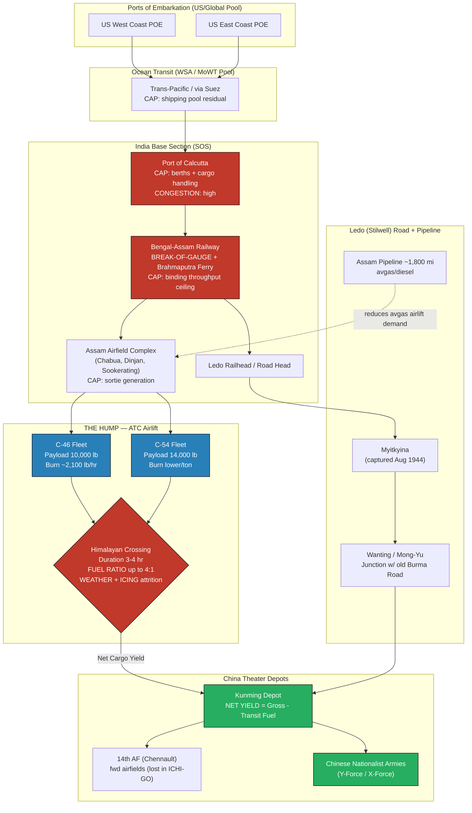

Cost: 0.27233

# Chapter 21: China, Burma, and India
## Reference Manual & Simulation Specification Document
### US Army Green Book — *Global Logistics and Strategy: 1943–1945*

---

## 1. Strategic Context & Modern Historical Perspective

### The Strategic Paradox

The China-Burma-India (CBI) theater represents the single most severe divergence between high-level strategic aspiration and material feasibility encountered by Allied planners during the Second World War. From the Casablanca Conference (SYMBOL, January 1943) onward, the Combined Chiefs of Staff embraced a set of political commitments toward China that bore almost no relationship to the physical logistics apparatus capable of servicing them. The essential paradox was this: China was designated a Great Power and a strategic anchor for the eventual bombardment and invasion of the Japanese Home Islands—yet China was, from a supply standpoint, effectively an island. After the Japanese severance of the Burma Road in the spring of 1942, no surface line of communication connected the Allied supply pools of India to the Nationalist Chinese armies of Chiang Kai-shek. Every ton of matériel destined for China had to be flown over the eastern spur of the Himalayas—"The Hump"—an aerial line of communication that was, in the cold accounting of operations research, the most expensive per-ton-delivered supply route the U.S. Army operated anywhere on the globe.

The tension crystallized progressively across the great inter-Allied conferences. At TRIDENT (Washington, May 1943), the airlift was allotted a nominal target of 10,000 tons per month to China, a figure that at the time exceeded actual delivery by an order of magnitude. At QUADRANT (Quebec, August 1943), the creation of South East Asia Command (SEAC) under Mountbatten institutionalized the theater's split personality—British interests oriented toward the reconquest of Burma and ultimately Malaya and Singapore (imperial restoration), American interests oriented toward keeping China in the war and opening an overland route. At SEXTANT (Cairo, November–December 1943), where Roosevelt, Churchill, and Chiang met, the promises made to Chiang for an amphibious Bay of Bengal operation (BUCCANEER) were withdrawn within days when the shipping and landing craft were reallocated to the Mediterranean and the cross-Channel build-up (OVERLORD/ANVIL). This single reallocation exposed the theater's core truth: CBI was the residual claimant on the global shipping pool. It received what OVERLORD, the Pacific, and the Mediterranean did not want.

The physical constraints were unforgiving and stacked in series. The global dry-cargo shipping pool—managed through the combined US–UK pooling arrangements administered by the War Shipping Administration and the British Ministry of War Transport—could deliver cargo only as fast as Indian ports could clear it. Calcutta and the eastern Indian ports possessed limited berthing, primitive mechanized cargo handling, and were fed by the meter-gauge and broad-gauge Bengal and Assam Railway, whose break-of-gauge transshipments, single-track sections, and ferry crossings of the Brahmaputra formed a throughput ceiling long before cargo ever reached the Assam airfields. The result was a pipeline in which each successive segment—ocean transit, port clearance, rail movement, air staging, and finally the Hump flight itself—imposed a lower capacity than planners assumed, and the binding constraint migrated up and down the network as investments were made.

### Inter-Service and Coalition Tensions

Command friction in CBI was structural, not merely personal, though the personalities were formidable. General Joseph W. Stilwell held a triple-hatted role—Deputy Supreme Allied Commander SEAC, Commanding General USAF CBI, and Chief of Staff to the Generalissimo—that guaranteed conflicting loyalties. The Services of Supply (SOS) under Major General Raymond Wheeler carried the impossible burden of constructing theater infrastructure (roads, pipelines, airfields, depots) while simultaneously feeding the combat effort in northern Burma. The deepest doctrinal rift, however, was between Stilwell and Major General Claire Chennault, commander of the Fourteenth Air Force. Chennault argued that a relatively small allocation of Hump tonnage devoted to airpower could interdict Japanese shipping and paralyze Japanese operations in China; Stilwell insisted that airpower without a defended ground base was an invitation to disaster—a thesis brutally vindicated by the Japanese ICHI-GO offensive of 1944, which overran the very forward airfields Chennault had promised to hold.

The Army–Navy and US–UK dimensions compounded matters. The Navy controlled the amphibious lift that alone could reopen Burma from the sea, and it husbanded that lift for the Central Pacific drive. The British, meanwhile, regarded the Ledo Road—Stilwell's overland project—as a strategically dubious expenditure of engineering resources that would open only after its purpose (sustaining China for offensive operations) had been overtaken by the Pacific advance. Postwar scholarship has largely conceded the British point on cost-effectiveness while affirming the American point on political necessity.

### Historical Era Context

With the Burma Road closed, the Hump airlift became the sole artery to China from 1942 until the Ledo Road (renamed the Stilwell Road at Chiang's suggestion in early 1945) opened in January 1945. The airlift traversed the ranges between Assam and Yunnan, forcing aircraft over terrain that reached 15,000–20,000 feet, through monsoon weather, severe icing, and violent turbulence, without adequate navigation aids or weather reporting. The Ledo Road was conceived as the surface solution: a two-lane all-weather road driven from Ledo in Assam, through Myitkyina in northern Burma, to link with the old Burma Road at Wanting and thence to Kunming—accompanied by a multi-line fuel pipeline, the longest military pipeline system built during the war.

### Modern Analytical Insights

The CBI theater is the canonical historical case of high-political-priority, low-thermodynamic-efficiency logistics. The Hump's brutal arithmetic derived from a fundamental property of unrefueled aerial resupply: the transport aircraft must carry the fuel for its own return, and on the longer routes at high density-altitude, the fuel burned to move a ton of cargo and recover the airframe approached or exceeded the cargo mass itself. On the more demanding profiles, ratios approaching **4 tons of aviation fuel burned per ton delivered** were recorded. Compounding this, the aviation gasoline itself had to be flown in or piped forward, meaning the airlift partly consumed its own logistical output. Modern operations-research reconstruction shows that the airlift's marginal efficiency improved dramatically only when C-54 four-engine aircraft, improved fields, radio navigation, and the Assam pipeline reduced per-ton fuel cost—by which time (late 1944–1945) the strategic rationale was already eroding. The theater thus demonstrates a general principle: a logistics route can be simultaneously indispensable (no alternative existed) and irrational (its resource cost exceeded its combat yield), and the resolution of that contradiction is political, not mathematical.

---

## 2. High-Fidelity Simulation Parameters & Real-World Metrics

| Parameter | Historical Value | Explanation & Strategic Rationale | Simulation Representation |
|---|---|---|---|
| **Peak Hump Monthly Tonnage (ATC)** | ~**71,000–71,042 tons** (July 1945); ~34,914 tons (Dec 1944); ~46,000 tons (late 1944 climb) | The Air Transport Command's deliveries grew from a few hundred tons/month in 1942 to a wartime peak in July 1945. Late-1944 monthly figures (~35k–46k tons) reflect the arrival of C-54s and improved fields. | **Dynamic capacity cap**, ramped as a monotonic step function of installed airframes, fields, and navaids per simulation month. |
| **Aviation Fuel Transit Consumption Ratio** | Up to **~4:1** (tons burned : ton delivered) on long/high profiles; ~1:1 to 2:1 on shorter/optimized profiles | Governs the *net* yield. Because aircraft carry return fuel, effective delivered tonnage is a fraction of gross lifted. | **Efficiency coefficient** applied per-route as a function of flight duration and aircraft type. |
| **Ledo (Stilwell) Road Length** | **1,079 miles** (Ledo, Assam → Kunming, China); ~465 miles of new construction (Ledo→Mong-Yu) linking to Burma Road | The overland alternative. Opened January 1945; first convoy reached Kunming 4 Feb 1945. | **Static constant** (route length); road capacity a **dynamic cap** by completion segment. |
| **C-46 Commando Max Payload** | ~**10,000 lbs** (~5 short tons) practical Hump load | Workhorse; higher ceiling, but maintenance-intensive and accident-prone. | Static per-airframe constant. |
| **C-54 Skymaster Max Payload** | ~**14,000–16,000 lbs** practical | Four-engine, longer range, far better fuel economy per ton-mile. | Static per-airframe constant. |
| **Typical Hump Flight Duration** | ~**3.0–4.0 hours** one-way (route dependent) | Determines transit fuel burn. | Route parameter (hours). |
| **C-46 Fuel Burn** | ~**300–360 gal/hr** (~1,900–2,300 lbs/hr) | Transit fuel driver. | Static per-airframe constant. |
| **Hump Cumulative Tonnage (war total)** | ~**650,000 tons** delivered to China | Total program yield 1942–1945. | Accumulator/state total. |
| **Assam Pipeline Length** | ~**1,800 miles** of pipe (multiple lines) | Reduced need to fly avgas; raised net cargo yield. | Boolean/step efficiency modifier post-completion. |
| **Aircraft/Crew Losses** | ~**594 aircraft, ~1,314 crew** lost over Hump | The "Aluminum Trail." Attrition rate feeds availability. | Stochastic attrition coefficient. |
| **Broad/Meter Gauge Break Points (Bengal-Assam Rly)** | Multiple; Brahmaputra ferry crossing | Upstream throughput ceiling feeding Assam fields. | Serial capacity constraint node. |

---

## 3. Logistical Network Topology (Mermaid.js Flowchart)



---

## 4. Mathematical Modeling & Simulation Formulas

### Net Cargo Yield (per sortie)

Let a transport airframe of type $i$ possess maximum payload $C_{max,i}$ (lbs) and fuel burn rate $b_i$ (lbs/hr). For a route of one-way duration $T$ (hr) flown as a round trip:

$$
C_{net,i} = \max\!\Big(0,\; C_{max,i} - b_i \cdot T \cdot m\Big), \qquad m = \begin{cases} 2 & \text{round trip} \\ 1 & \text{one way}\end{cases}
$$

Here $F_{burn} = b_i \cdot T \cdot m$ is total transit fuel, aligning with the chapter concept $C_{net} = C_{max} - F_{burn} \cdot T_{flight}$.

### Fuel-to-Cargo Ratio (efficiency diagnostic)

$$
\rho_i = \frac{b_i \cdot T \cdot m}{C_{net,i}}, \qquad C_{net,i} > 0
$$

When $\rho_i \to 4$, the route is at the historically observed worst case: 4 lbs fuel burned per lb delivered.

### Theater Delivery Optimization (LP)

Maximize net tonnage delivered to Kunming across airframe fleets subject to serial network capacities:

$$
\max_{s_i \ge 0} \;\; Z = \sum_{i \in \mathcal{A}} s_i \cdot C_{net,i}
$$

subject to

$$
\sum_{i} s_i \cdot t_{sortie,i} \le H_{sortie} \quad\text{(airfield sortie-hours)}
$$

$$
\sum_{i} s_i \cdot (C_{max,i} + b_i T m) \le G_{fuel} + G_{cargo} \quad\text{(Assam throughput ceiling)}
$$

$$
\sum_{i} s_i \cdot C_{net,i} \le K_{china} \quad\text{(Kunming clearance cap)}
$$

$$
Z_{total} = Z_{air} + Q_{road}(\tau)
$$

where $s_i$ = sorties of type $i$, $t_{sortie,i}$ = sortie cycle time, $G$ = upstream rail/port supply, $K_{china}$ = downstream clearance, and $Q_{road}(\tau)$ = Ledo Road throughput as a function of completion time $\tau$ (zero before Jan 1945).

**Definitions:** $\mathcal{A}$ = set of airframe types; the binding constraint is whichever inequality is tight — historically the *rail/port* constraint (India side) early, migrating to *sortie-generation* and *weather-driven availability* later.

---

## 5. Compile-Safe Scala 3.8.3 Domain Model

```scala
package Logistics.CBI

import scala.collection.immutable.List
import scala.math.max

case class AircraftSpecs(maxPayloadLbs: Double, fuelBurnLbsPerHour: Double)

object AirliftEfficiencyModel:
  def netCargoDelivered(
    specs: AircraftSpecs,
    flightDurationHours: Double,
    roundTrip: Boolean
  ): Double =
    val multiplier = if roundTrip then 2.0 else 1.0
    val transitFuel = specs.fuelBurnLbsPerHour * flightDurationHours * multiplier
    val net = specs.maxPayloadLbs - transitFuel
    if net < 0.0 then 0.0 else net

opaque type Tons = Double
opaque type Pounds = Double
opaque type Hours = Double
opaque type Miles = Double
opaque type Sorties = Int

object Tons:
  def apply(v: Double): Tons = v
  extension (t: Tons)
    def value: Double = t
    def +(o: Tons): Tons = t + o

object Pounds:
  val PerTon: Double = 2000.0
  def apply(v: Double): Pounds = v
  extension (p: Pounds)
    def value: Double = p
    def toTons: Tons = Tons(p / PerTon)

object Hours:
  def apply(v: Double): Hours = v
  extension (h: Hours) def value: Double = h

object Miles:
  def apply(v: Double): Miles = v
  extension (m: Miles) def value: Double = m

object Sorties:
  def apply(v: Int): Sorties = v
  extension (s: Sorties)
    def value: Int = s
    def *(f: Double): Double = s.toDouble * f

enum AirframeType:
  case C46Commando
  case C54Skymaster

enum RouteProfile:
  case Short
  case Standard
  case HighDensityAltitude

enum PipelineState:
  case NotBuilt
  case Partial
  case Operational

final case class Airframe(
  kind: AirframeType,
  maxPayload: Pounds,
  burnRate: Double,
  sortieCycleHours: Hours
)

object Airframe:
  val c46: Airframe =
    Airframe(AirframeType.C46Commando, Pounds(10000.0), 2100.0, Hours(9.0))
  val c54: Airframe =
    Airframe(AirframeType.C54Skymaster, Pounds(14000.0), 2600.0, Hours(9.0))

final case class RouteSpec(profile: RouteProfile, oneWayHours: Hours)

object RouteSpec:
  def durationFor(profile: RouteProfile): RouteSpec = profile match
    case RouteProfile.Short                => RouteSpec(profile, Hours(2.5))
    case RouteProfile.Standard             => RouteSpec(profile, Hours(3.5))
    case RouteProfile.HighDensityAltitude  => RouteSpec(profile, Hours(4.0))

final case class NetSortieResult(
  grossPayload: Pounds,
  transitFuel: Pounds,
  netDelivered: Pounds,
  fuelToCargoRatio: Double
)

object HumpModel:

  def transitFuel(af: Airframe, route: RouteSpec, roundTrip: Boolean): Pounds =
    val m: Double = if roundTrip then 2.0 else 1.0
    Pounds(af.burnRate * route.oneWayHours.value * m)

  def netPerSortie(af: Airframe, route: RouteSpec, roundTrip: Boolean): NetSortieResult =
    val fuel: Pounds = transitFuel(af, route, roundTrip)
    val net: Double = max(0.0, af.maxPayload.value - fuel.value)
    val ratio: Double =
      if net <= 0.0 then Double.PositiveInfinity else fuel.value / net
    NetSortieResult(af.maxPayload, fuel, Pounds(net), ratio)

  def theaterDelivery(
    fleet: List[(Airframe, Sorties)],
    route: RouteSpec,
    roundTrip: Boolean,
    pipeline: PipelineState
  ): Tons =
    val pipelineBonus: Double = pipeline match
      case PipelineState.NotBuilt    => 1.0
      case PipelineState.Partial     => 1.10
      case PipelineState.Operational => 1.25
    val totalPounds: Double =
      fleet.foldLeft(0.0): (acc, entry) =>
        val (af, s) = entry
        val perSortie: Double = netPerSortie(af, route, roundTrip).netDelivered.value
        acc + (perSortie * s.value.toDouble)
    Pounds(totalPounds * pipelineBonus).toTons

  def sortieHoursDemanded(fleet: List[(Airframe, Sorties)]): Hours =
    Hours(
      fleet.foldLeft(0.0): (acc, entry) =>
        val (af, s) = entry
        acc + (af.sortieCycleHours.value * s.value.toDouble)
    )

final case class NetworkConstraints(
  maxSortieHours: Hours,
  assamThroughputTons: Tons,
  kunmingClearanceTons: Tons,
  ledoRoadTonsPerMonth: Tons
)

enum ConstraintStatus:
  case Feasible
  case SortieHoursExceeded
  case AssamThroughputExceeded
  case KunmingClearanceExceeded

object FeasibilityChecker:

  def validate(
    fleet: List[(Airframe, Sorties)],
    route: RouteSpec,
    roundTrip: Boolean,
    pipeline: PipelineState,
    constraints: NetworkConstraints
  ): ConstraintStatus =
    val demandedHours: Double = HumpModel.sortieHoursDemanded(fleet).value
    val delivered: Double = HumpModel.theaterDelivery(fleet, route, roundTrip, pipeline).value
    if demandedHours > constraints.maxSortieHours.value then
      ConstraintStatus.SortieHoursExceeded
    else if delivered > constraints.assamThroughputTons.value then
      ConstraintStatus.AssamThroughputExceeded
    else if delivered > constraints.kunmingClearanceTons.value then
      ConstraintStatus.KunmingClearanceExceeded
    else
      ConstraintStatus.Feasible

  def totalTheaterYield(
    fleet: List[(Airframe, Sorties)],
    route: RouteSpec,
    roundTrip: Boolean,
    pipeline: PipelineState,
    constraints: NetworkConstraints,
    roadOpen: Boolean
  ): Tons =
    val air: Double = HumpModel.theaterDelivery(fleet, route, roundTrip, pipeline).value
    val road: Double = if roadOpen then constraints.ledoRoadTonsPerMonth.value else 0.0
    Tons(air + road)

object CBIsimDemo:
  def run(): (ConstraintStatus, Tons) =
    val fleet: List[(Airframe, Sorties)] =
      List((Airframe.c46, Sorties(4000)), (Airframe.c54, Sorties(2000)))
    val route: RouteSpec = RouteSpec.durationFor(RouteProfile.Standard)
    val constraints: NetworkConstraints =
      NetworkConstraints(
        maxSortieHours = Hours(60000.0),
        assamThroughputTons = Tons(50000.0),
        kunmingClearanceTons = Tons(50000.0),
        ledoRoadTonsPerMonth = Tons(6000.0)
      )
    val status: ConstraintStatus =
      FeasibilityChecker.validate(fleet, route, true, PipelineState.Operational, constraints)
    val yield_ : Tons =
      FeasibilityChecker.totalTheaterYield(
        fleet, route, true, PipelineState.Operational, constraints, roadOpen = true
      )
    (status, yield_)
```

---

## 6. Graduate-Level Operational Analysis

### The Hump Paradox: Inefficiency vs. Continued Support

The "Hump Paradox" is the apparent contradiction between the airlift's demonstrable resource inefficiency and General Marshall's persistent, high-priority support for it. The inefficiency is unambiguous when viewed through the lens of thermodynamic and logistical accounting. On the demanding high-density-altitude profiles, the fuel-to-cargo ratio approached 4:1—meaning roughly four tons of aviation gasoline were consumed to deposit a single ton of net cargo at Kunming. Worse, the avgas itself was scarce and had to be either flown forward or, later, pumped through the Assam pipeline; in the early period the airlift was partially *self-consuming*, expending a fraction of its own delivered output simply to fuel the next sortie. Add the fearsome attrition—nearly 600 aircraft and over 1,300 aircrew lost to weather, icing, and terrain (the "Aluminum Trail")—and by any narrow cost-benefit metric the Hump was among the worst logistics investments of the war per delivered ton. A pure operations-research optimizer, maximizing tons-delivered-per-dollar or per-gallon across the global theater, would have curtailed it.

Yet Marshall's rationale was not intra-theater efficiency; it was *global strategic option value*. First, China's continued belligerency pinned down roughly a million Japanese troops on the Asian mainland who might otherwise have reinforced the Pacific island garrisons or Manchuria—troops the US would eventually have to fight at far higher cost. Second, the airlift was a *political instrument*: it was the tangible proof of Allied commitment that kept Chiang Kai-shek from a separate peace, a collapse whose second-order consequences (freeing Japanese forces, ceding a vast base area) were strategically catastrophic even if hard to quantify. Third, in the 1943–1944 planning horizon, China was still envisioned as the base from which B-29s (Operation MATTERHORN) and eventually ground forces would strike Japan; the Hump was the only way to seed that capability. Marshall was therefore solving a different optimization: not $\max Z_{tons}$ but the maximization of expected strategic utility under deep uncertainty, where the airlift's value lay in the *options it preserved*. The paradox dissolves once one recognizes that the airlift's true output was not tonnage but *strategic insurance*, a commodity for which the fuel-to-cargo ratio is simply the premium.

### Stilwell's Ledo Road vs. Chennault's Air-Centric Strategy

The Stilwell–Chennault conflict was a doctrinal war over the correct theory of victory in China, and it mapped directly onto competing claims on the same scarce Hump tonnage. Stilwell, an infantryman and China hand, held an essentially *materialist and ground-centric* view: China's problem was that its armies were unequipped, undertrained, and unsupplied, and no amount of airpower could substitute for reformed, well-supplied ground forces holding terrain. His Ledo Road was the physical embodiment of this thesis—a surface line of communication that would, once open, deliver *bulk* tonnage (fuel, vehicles, artillery, ammunition) at fuel-to-cargo ratios vastly superior to airlift, enabling the equipment and offensive employment of Chinese divisions to reopen a proper front. The road demanded a bloody preliminary: the ground reconquest of northern Burma, including the Myitkyina campaign, which consumed Merrill's Marauders and Chinese X-Force divisions.

Chennault countered with an *air-centric* theory of economy of force. He argued that a modest slice of Hump tonnage devoted to his Fourteenth Air Force could achieve strategically disproportionate effects—interdicting Japanese coastal shipping, striking supply lines, and defending Chinese cities—without the enormous engineering investment and casualties of the Burma ground campaign. His strategy was seductive precisely because it promised results *now* and cheaply, and it had Chiang's favor since it did not demand the painful reform of the Chinese army that Stilwell insisted upon.

The conflict was adjudicated by history rather than by staff analysis. The Japanese ICHI-GO offensive of 1944 constituted the decisive experiment: when Chennault's air campaign began to inflict real damage, the Japanese ground forces simply advanced and overran the forward airfields from which that airpower operated—precisely Stilwell's predicted failure mode. Airpower without a defensible ground base proved a wasting asset. Yet Stilwell's vindication was pyrrhic: the Ledo/Stilwell Road opened only in January 1945, by which time the Pacific island-hopping campaign had rendered China's role as a strategic springboard largely moot, and the road delivered its heaviest tonnages after its strategic *raison d'être* had passed into history. The episode is a textbook illustration of the peril of building a logistics artery whose completion time exceeds the strategic window it was meant to serve—a lesson in the temporal dimension of infrastructure investment that the simulation's $Q_{road}(\tau)$ term is designed to capture.
