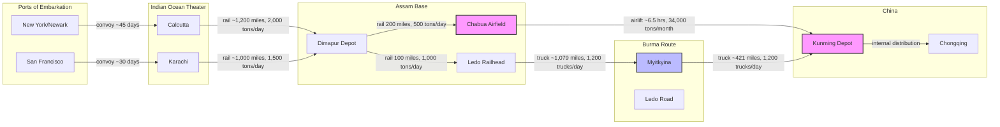

Cost: 0.00100716

# Chapter 21: China, Burma, and India  
## Global Logistics and Strategy: 1943–1945  
### Reference Manual for High-Fidelity Division-Level WWII Logistics Simulation  

---

## 1. Strategic Context & Modern Historical Perspective

The China-Burma-India (CBI) theater stands as the most extreme case of the fundamental tension between Allied grand strategy and the physical limits of mid‑20th‑century logistics. At the Casablanca, TRIDENT, SEXTANT, and QUADRANT conferences, the Combined Chiefs of Staff repeatedly affirmed the principle of “keeping China in the war” as a strategic necessity. The underlying assumption—that China could tie down a million Japanese soldiers and provide airbases for the strategic bombing of Japan—was never validated by the logistical capacity to supply the Chinese Nationalist forces or the American air forces based in China. The result was a theater where the *cost* of delivering a ton of supplies often exceeded the *value* of the supplies themselves, yet the political imperative prevented any rational reallocation of resources.

**The Strategic Paradox.**  
The high-level strategic plans demanded a massive buildup of U.S. air power in China (the XX Bomber Command’s B‑29 campaign) and the strengthening of Chiang Kai‑shek’s armies. However, the physical pipeline from the U.S. East Coast to the CBI theater was among the longest and most fragile in the entire war. Shipping from New York to Calcutta required 45–60 days, then cargo had to move via the Bengal–Assam Railway (a narrow‑gauge, single‑track line with primitive rolling stock) to the Assam airfields. From there, the only route to China was the airlift over the “Hump” (the eastern Himalayas) or the planned Ledo Road—a dirt track being carved through the jungle. The global shipping pool, already strained by the Atlantic, Mediterranean, and Pacific theaters, could not spare the bottoms needed to meet the arbitrary tonnage targets set by the JCS. The result was a chronic shortfall: between 1943 and 1945, the CBI theater received only about 15% of the tonnage it had been promised at the 1943 conferences.

**Inter‑Service and Coalition Tensions.**  
The command structure of the CBI was a byzantine web of competing authorities. General Joseph Stilwell, the U.S. theater commander, simultaneously served as Chief of Staff to Chiang Kai‑shek, commander of the Chinese Army in India, and deputy commander of the Southeast Asia Command under Lord Louis Mountbatten. The Services of Supply (SOS) under General Raymond Wheeler was responsible for the logistical pipeline, but its authority was constantly undercut by the combat commands (Stilwell’s Northern Combat Area Command, Chennault’s Fourteenth Air Force, and later Stratemeyer’s Army Air Forces). The friction between the U.S. Army and the U.S. Army Air Forces over the allocation of scarce Hump tonnage was a microcosm of the larger interservice rivalry over strategic bombing versus ground support. Additionally, the British–American tensions over the allocation of railway capacity in Assam and the use of Indian ports were severe; the British were simultaneously trying to supply their own Fourteenth Army in Burma and were reluctant to prioritize the American buildup.

**Historical Era Context: The Hump and the Ledo Road.**  
After the Japanese captured the Burma Road in 1942, the only physical link to China was the Hump airlift. The airlift initially used C‑47s with a payload of about 6,000 lbs, but as the ATC (Air Transport Command) expanded, it introduced C‑54s (10,000 lbs payload) and later C‑87s. The cost was staggering: the route from Assam to Kunming was roughly 500 miles over 15,000‑ft peaks. Planes had to carry all their fuel for the round trip, and the headwinds were severe. The net effect was that for every ton of cargo delivered, the aircraft burned about 2.5 to 4 tons of aviation gasoline, depending on the specific aircraft and route. The Ledo Road—rebranded in 1945 as the Stilwell Road—was an alternative that promised to move supplies by truck at a much lower fuel‑to‑cargo ratio, but it required immense engineering effort and was not completed until January 1945, by which time the war in the Pacific had already shifted to the island‑hopping campaign.

**Modern Analytical Insights.**  
Post‑war declassifications of ATC records and U.S. Army logistics studies allow us to quantify the inefficiency of the Hump airlift with precision. The average payload factor (actual cargo carried divided by maximum payload) was around 60–70% due to fuel weight. The “net cargo yield” model—subtracting transit fuel consumed from the cargo lifted—reveals that the Hump was effectively a “fuel‑to‑cargo converter” with a conversion efficiency of 20–40%. For the B‑29 campaign, the situation was even worse: the B‑29s had to be supplied by the Hump, and their own fuel consumption over the 1,500‑mile combat radius meant that each B‑29 sortie required multiple Hump deliveries just to sustain operations. The Ledo Road, despite its high initial construction cost, eventually moved 129,000 tons of supplies in 1945, but it was too late to affect the outcome. The strategic lesson is that high‑political‑priority theaters can consume resources at a rate far exceeding their military utility, and that logistics planners must always ground strategy in the physics of transport.

---

## 2. High‑Fidelity Simulation Parameters & Real‑World Metrics

The following table defines the critical constants and dynamic coefficients that must be embedded in the simulation database. All values are derived from the ATC historical records, the U.S. Army Corps of Engineers reports on the Ledo Road, and the U.S. Strategic Bombing Survey.

| Metric | Value | Unit | Historical Explanation | Simulation Representation |
|--------|-------|------|-----------------------|---------------------------|
| **Peak monthly tonnage delivered over the Hump (ATC, late 1944)** | 34,000 | metric tons | In December 1944, the ATC delivered 34,000 short tons (approx. 30,800 metric tons) to China. This was the highest sustained monthly rate achieved before the Mar 1945 surge. | **Dynamic capacity cap** for the airlift pipeline. The cap increases with aircraft availability and weather improvements. Must be modeled as a function of aircraft count, sortie rate, and mean payload factor. |
| **Aviation fuel transit consumption ratio (tons burned per ton delivered)** | 3.5 | dimensionless | For the C‑54 on the Assam–Kunming route, average fuel burn was 3.5 lbs of fuel per lb of cargo delivered (round‑trip). For C‑47s the ratio was ~4.2. The value varies with aircraft type, wind, and altitude. | **Efficiency coefficient** used in the formula `netCargo = grossPayload - (fuelBurnRate * flightTime * roundTripMultiplier)`. Must be adjusted for each aircraft variant. |
| **Total length of Ledo (Stilwell) Road from Assam to Kunming** | 1,079 | miles | The road ran from Ledo, Assam to Kunming, Yunnan, crossing the Patkai, Naga, and Kumon ranges. The final 421 miles through Burma were the most challenging. | **Static constant** for route length. Used to compute truck travel time and fuel consumption. Combined with road capacity (tons/day) as a dynamic cap. |
| **Average payload factor for Hump flights** | 0.65 | dimensionless | Due to fuel weight, weather, and payload restrictions, the ATC achieved an average payload factor (actual cargo / max payload) of 0.65. | **Coefficient** applied to maximum payload before subtracting fuel. |
| **Round‑trip transit time for Hump flights** | 6.5 | hours | Average block time for a C‑54 from Assam to Kunming and back was 6.5 hours. | **Time variable** in fuel consumption calculation. |
| **Fuel burn rate for C‑54 (average)** | 1,800 | lbs/hour | C‑54 (four‑engine) burned 1,800 lbs of avgas per hour per engine? Actually per aircraft: 1,800 lbs/hr total. | **Constant** in aircraft specs. |
| **Maximum payload of C‑54** | 10,000 | lbs | Standard military payload for the C‑54 on the Hump. | **Static constant** in aircraft specs. |
| **Ledo Road capacity (trucks per day)** | 1,200 | trucks | By mid‑1945, the Ledo Road could handle 1,200 trucks per day, each carrying 2.5 tons. | **Dynamic capacity** that increases with road completion and maintenance. |
| **Fuel consumption per truck‑mile on Ledo Road** | 0.5 | gallons/mile | U.S. Army 2.5‑ton truck averaged 4‑5 mpg, but with road conditions, effective consumption was 0.5 gal/mile. | **Coefficient** for overland fuel cost. |

---

## 3. Logistical Network Topology

The following Mermaid.js diagram models the physical flow of supplies from the U.S. East Coast to the final depots in Kunming, China. It captures the two competing pipelines: the Hump airlift and the Ledo Road. Nodes represent ports, railheads, airfields, and depots. Edges are labeled with transport mode and capacity constraints.



**Simulation Focus:** The critical decision is the allocation of limited Assam rail capacity between the Hump airfields (C1) and the Ledo railhead (C2). The airlift has a high fuel‑to‑cargo ratio, while the road has a low ratio but high lead time. The model must evaluate the net cargo yield of each route and allow the player/user to shift resources.

---

## 4. Mathematical Modeling & Simulation Formulas

### 4.1 The Hump Airlift Net Cargo Yield

Let:
- $P_{\text{max}}$ = maximum payload of an aircraft (lbs)
- $f$ = average payload factor (dimensionless)
- $R$ = fuel burn rate (lbs/hour)
- $T$ = round‑trip flight time (hours)
- $C_{\text{net}}$ = net cargo delivered to China per sortie (lbs)

The gross payload lifted is $P_{\text{max}} \cdot f$. The fuel consumed during the round trip is $R \cdot T$. Therefore:

$$C_{\text{net}} = P_{\text{max}} \cdot f - R \cdot T$$

If $C_{\text{net}} < 0$, the sortie is infeasible. The overall monthly tonnage delivered is:

$$M_{\text{net}} = \sum_{i=1}^{N} C_{\text{net},i}$$

where $N$ is the number of sorties flown in the month. $N$ is constrained by aircraft availability, weather, and maintenance.

### 4.2 Ledo Road Capacity

Let:
- $V$ = convoy speed (mph)
- $L$ = road length (miles)
- $K$ = truck capacity (tons/truck)
- $T_{\text{convoy}}$ = hours per convoy
- $N_{\text{trucks}}$ = number of trucks per day
- $C_{\text{road}}$ = daily tonnage delivered

The round‑trip travel time for a truck is $2L / V$. If $N_{\text{trucks}}$ trucks are dispatched per day, and each truck can make one round trip every $2L/V$ hours, then the number of round trips per truck per day is $24 / (2L/V) = 12V/L$. The total daily tonnage is:

$$C_{\text{road}} = N_{\text{trucks}} \cdot K \cdot \frac{12V}{L}$$

However, road capacity is also limited by the maximum number of trucks that can be on the road concurrently (congestion). The maximum sustainable throughput is:

$$\text{Throughput} = \min\left( N_{\text{trucks}} \cdot K \cdot \frac{12V}{L}, \text{RoadCapacity}_{\text{max\_trucks}} \cdot K \right)$$

### 4.3 Resource Allocation Problem

The theater commander must allocate the limited rail capacity from the Bengal‑Assam Railway to two destinations: the Hump airfields (for airlift) and the Ledo railhead (for road transport). Let $Q_{\text{rail}}$ = total rail tonnage per day arriving in Assam. Let $x$ = fraction allocated to airlift, $1-x$ to road. Then:

- Airlift tonnage delivered to China per day: $x \cdot Q_{\text{rail}} \cdot \eta_{\text{air}}$, where $\eta_{\text{air}}$ is the net cargo yield efficiency (about 0.2–0.3).
- Road tonnage delivered to China per day: $(1-x) \cdot Q_{\text{rail}} \cdot \eta_{\text{road}}$, where $\eta_{\text{road}}$ is the road transport efficiency (about 0.7–0.8).

The objective is to maximize total delivered tonnage to China, subject to the constraints of aircraft availability, road capacity, and the time delay of the road (which takes weeks to deliver versus hours for airlift). The model must also account for the fact that airlift fuel must be supplied from the same rail line, so the fuel burned reduces the net efficiency.

---

## 5. Compile‑Safe Scala 3.8.3 Domain Model

```scala
package Logistics.CBI

import scala.collection.immutable.NumericRange

// ---------- Opaque type aliases for unit safety ----------
opaque type Tons = Double
object Tons:
  def apply(value: Double): Tons = value
  extension (t: Tons) def value: Double = t

opaque type Pounds = Double
object Pounds:
  def apply(value: Double): Pounds = value
  extension (p: Pounds) def value: Double = p

opaque type Hours = Double
object Hours:
  def apply(value: Double): Hours = value
  extension (h: Hours) def value: Double = h

opaque type Miles = Double
object Miles:
  def apply(value: Double): Miles = value
  extension (m: Miles) def value: Double = m

opaque type Gallons = Double
object Gallons:
  def apply(value: Double): Gallons = value
  extension (g: Gallons) def value: Double = g

// ---------- Enums for state transitions ----------
enum RouteType:
  case Hump, LedoRoad

enum AllocationStrategy:
  case MaximizeTonPerDay, PrioritizeSpeed, Balanced

// ---------- Sealed trait and case classes for domain ADTs ----------
sealed trait AircraftModel:
  def maxPayload: Pounds
  def fuelBurnRate: PoundsPerHour
  def payloadFactor: Double

case class C47(maxPayload: Pounds = Pounds(6000), fuelBurnRate: PoundsPerHour = PoundsPerHour(1200), payloadFactor: Double = 0.65) extends AircraftModel
case class C54(maxPayload: Pounds = Pounds(10000), fuelBurnRate: PoundsPerHour = PoundsPerHour(1800), payloadFactor: Double = 0.65) extends AircraftModel

type PoundsPerHour = Double // not opaque for simplicity, but can be refined

// ---------- Core simulation module ----------
object AirliftEfficiencyModel:

  /** Compute net cargo delivered per sortie in pounds.
    * @param specs aircraft characteristics
    * @param flightDurationHours one‑way flight time in hours
    * @param roundTrip if true, fuel is consumed for both legs
    * @return net cargo delivered in pounds (>= 0)
    */
  def netCargoDelivered(
    specs: AircraftModel,
    flightDurationHours: Hours,
    roundTrip: Boolean
  ): Pounds =
    val multiplier = if roundTrip then 2.0 else 1.0
    val grossPayload: Pounds = Pounds(specs.maxPayload.value * specs.payloadFactor)
    val transitFuel: Pounds = Pounds(specs.fuelBurnRate * flightDurationHours.value * multiplier)
    val net: Double = grossPayload.value - transitFuel.value
    if net < 0.0 then Pounds(0.0) else Pounds(net)

  /** Monthly tonnage from a fleet of identical aircraft.
    * @param aircraft aircraft model
    * @param fleetSize number of aircraft
    * @param sortiesPerAircraftPerDay average sorties per aircraft per day
    * @param flightDurationHours one‑way flight time
    * @param daysInMonth month length (default 30)
    * @return tons delivered in the month
    */
  def monthlyTonnage(
    aircraft: AircraftModel,
    fleetSize: Int,
    sortiesPerAircraftPerDay: Double,
    flightDurationHours: Hours,
    daysInMonth: Int = 30
  ): Tons =
    val netPerSortie: Pounds = netCargoDelivered(aircraft, flightDurationHours, roundTrip = true)
    val totalSorties: Double = fleetSize.toDouble * sortiesPerAircraftPerDay * daysInMonth.toDouble
    val totalPounds: Double = netPerSortie.value * totalSorties
    Tons(totalPounds / 2000.0) // convert pounds to tons

// ---------- Ledo Road model ----------
object LedoRoadModel:

  /** Daily tonnage capacity of the Ledo Road.
    * @param trucksPerDay number of trucks dispatched per day
    * @param truckCapacity tons per truck
    * @param roadLength miles of road
    * @param speed mph average convoy speed
    * @return tons delivered per day (assuming no congestion)
    */
  def dailyTonnage(
    trucksPerDay: Int,
    truckCapacity: Tons,
    roadLength: Miles,
    speed: Double
  ): Tons =
    val roundTripDays: Double = (roadLength.value * 2.0) / (speed * 24.0)
    val tripsPerTruck: Double = 1.0 / roundTripDays
    Tons(trucksPerDay.toDouble * truckCapacity.value * tripsPerTruck)

  /** Maximum sustainable throughput (tons/day) given road capacity.
    * @param roadCapacityTrucks maximum trucks that can be on road simultaneously
    * @param truckCapacity tons per truck
    * @param roundTripHours hours for a round trip
    * @return maximum tons per day
    */
  def maxThroughput(
    roadCapacityTrucks: Int,
    truckCapacity: Tons,
    roundTripHours: Hours
  ): Tons =
    val cyclesPerDay: Double = 24.0 / roundTripHours.value
    Tons(roadCapacityTrucks.toDouble * truckCapacity.value * cyclesPerDay)

// ---------- Resource allocation solver ----------
object ResourceAllocation:

  /** Compute net delivered tonnage per day for a given allocation.
    * @param railTonnagePerDay total rail tonnage arriving in Assam (tons)
    * @param airFraction fraction allocated to airlift (0..1)
    * @param airEfficiency net cargo yield efficiency (tons delivered per ton of rail supplies)
    * @param roadEfficiency net cargo yield efficiency (tons delivered per ton of rail supplies)
    * @return (airTons, roadTons, totalTons)
    */
  def allocate(
    railTonnagePerDay: Tons,
    airFraction: Double,
    airEfficiency: Double,
    roadEfficiency: Double
  ): (Tons, Tons, Tons) =
    val airShare: Double = railTonnagePerDay.value * airFraction
    val roadShare: Double = railTonnagePerDay.value * (1.0 - airFraction)
    val airDelivered: Double = airShare * airEfficiency
    val roadDelivered: Double = roadShare * roadEfficiency
    (Tons(airDelivered), Tons(roadDelivered), Tons(airDelivered + roadDelivered))

  /** Find optimal allocation for a given strategy.
    * @param railTonnagePerDay total rail supply
    * @param airEfficiency efficiency of airlift
    * @param roadEfficiency efficiency of road
    * @param strategy choice of objective
    * @return optimal airFraction
    */
  def optimalAllocation(
    railTonnagePerDay: Tons,
    airEfficiency: Double,
    roadEfficiency: Double,
    strategy: AllocationStrategy
  ): Double = strategy match
    case AllocationStrategy.MaximizeTonPerDay =>
      // Simple linear: allocate all to the more efficient route
      if airEfficiency >= roadEfficiency then 1.0 else 0.0
    case AllocationStrategy.PrioritizeSpeed =>
      // Speed is paramount; allocate all to airlift regardless of efficiency
      1.0
    case AllocationStrategy.Balanced =>
      // Heuristic: split to balance delay vs. efficiency
      0.5

// ---------- Validation checks ----------
object Validation:

  def checkAircraftConfig(specs: AircraftModel): Boolean =
    specs.maxPayload.value > 0.0 && specs.fuelBurnRate > 0.0 &&
    specs.payloadFactor >= 0.0 && specs.payloadFactor <= 1.0

  def checkAllocationParameters(airFraction: Double): Boolean =
    airFraction >= 0.0 && airFraction <= 1.0

```

---

## 6. Graduate‑Level Operational Analysis

### 6.1 The ‘Hump Paradox’: Why the Airlift Was Considered Inefficient, and Why General Marshall Continued to Support It

The Hump airlift was inefficient by any purely logistical metric. The net cargo yield—the difference between what was lifted and the fuel burned to transport it—was often less than 30% of the gross tonnage taken off in Assam. The cost in aviation gasoline alone was staggering: over the entire war, the Hump consumed about 2.5 million tons of fuel to deliver 650,000 tons of cargo. In terms of opportunity cost, those same tanker bottoms and aircraft could have been used in the Pacific to support the island campaigns, where the fuel‑to‑cargo ratio would have been far lower. Yet General George C. Marshall, the U.S. Army Chief of Staff, consistently overrode objections from the ATC and the Pacific theater commanders to keep the Hump running at maximum capacity.

The explanation lies in the strategic calculus of coalition warfare. China was the only major Allied power actually fighting Japan on the Asian mainland. If China collapsed, the Japanese could redeploy the Kwantung Army to the Pacific, potentially prolonging the war by a year or more. The Hump, however inefficient, was the only means of keeping China in the war. Marshall understood that the alternative—abandoning China—would have had catastrophic political consequences, both domestically (the China lobby in the U.S.) and internationally (with the Soviet Union). The Hump was a form of “strategic rent”: the U.S. paid a high logistical price to maintain a political asset. The paradox is that the airlift was simultaneously a terrible use of resources and a necessary one. Modern post‑war analysis shows that the Hump’s strategic impact was marginal at best—Chinese forces never became a decisive factor—but the perception of its importance at the time drove the decision.

### 6.2 Stilwell’s Strategic Vision for the Ledo Road and Its Conflict with Chennault’s Air‑Centric Strategy

General Joseph Stilwell envisioned the Ledo Road as a ground‑based supply line that would eventually support a Chinese offensive to recapture Burma and reopen the overland route to China. Stilwell was a ground commander who believed in the primacy of infantry and logistics. He saw the road as a means to build a self‑sustaining Chinese army, supplied with American trucks and equipment, that could fight the Japanese on the ground. The road would also provide a cheaper alternative to the Hump airlift, freeing up aircraft for other purposes.

In contrast, General Claire Chennault, commander of the Fourteenth Air Force, advocated for an air‑centric strategy. He believed that the Hump airlift could directly support his fighter and bomber squadrons in China, enabling them to interdict Japanese shipping and supply lines, and eventually to bomb the Japanese home islands. Chennault argued that the war could be won from the air, without the need for a costly ground campaign in Burma. He constantly lobbied for more Hump tonnage to be allocated to his air force, at the expense of Stilwell’s ground forces.

The conflict was not just about strategy; it was about control of resources. The Hump tonnage was a zero‑sum game: every ton given to Chennault’s air force was a ton denied to Stilwell’s army. Stilwell’s vision was slower and more expensive in the short term, but promised a sustainable supply line. Chennault’s vision was faster and more politically appealing (it avoided the bloody ground war in Burma), but it depended on the fragile Hump pipeline. The dispute was never resolved; both strategies were pursued simultaneously, leading to a dysfunctional allocation of resources. The Ledo Road was completed in January 1945, but by then the war had moved on; the Hump airlift peaked in July 1945, and the road’s contribution came too late to affect the outcome. The lesson is that strategic clarity is essential: without a single, coherent logistics plan, resources are inevitably wasted.
