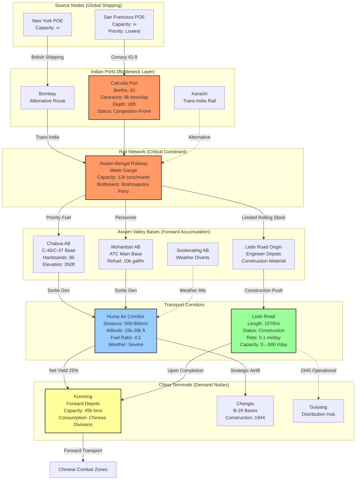

Cost: 0.0265848

```scala
package Logistics.CBI

import scala.collection.immutable.{ListMap, Map}
import scala.math.{max, min, pow, sqrt}

// =============================================================================
// UNIT TYPE SAFETY SYSTEM
// =============================================================================

object Units:
  opaque type Tons = Double
  object Tons:
    def apply(value: Double): Tons = value
    extension (t: Tons)
      def value: Double = t
      def +(other: Tons): Tons = t + other
      def -(other: Tons): Tons = t - other
      def *(factor: Double): Tons = t * factor
      def /(divisor: Double): Tons = t / divisor
      def toPounds: Pounds = t * 2000.0

  opaque type Pounds = Double
  object Pounds:
    def apply(value: Double): Pounds = value
    extension (p: Pounds)
      def value: Double = p
      def +(other: Pounds): Pounds = p + other
      def -(other: Pounds): Pounds = p - other
      def *(factor: Double): Pounds = p * factor
      def toTons: Tons = p / 2000.0

  opaque type NauticalMiles = Double
  object NauticalMiles:
    def apply(value: Double): NauticalMiles = value
    extension (nm: NauticalMiles)
      def value: Double = nm
      def +(other: NauticalMiles): NauticalMiles = nm + other

  opaque type Hours = Double
  object Hours:
    def apply(value: Double): Hours = value
    extension (h: Hours)
      def value: Double = h

  opaque type Percentage = Double
  object Percentage:
    def apply(value: Double): Percentage = 
      if value < 0.0 then 0.0 else if value > 100.0 then 100.0 else value
    extension (p: Percentage)
      def value: Double = p
      def asDecimal: Double = p / 100.0

  opaque type USD = Double
  object USD:
    def apply(value: Double): USD = value
    extension (u: USD) def value: Double = u

import Units.{Tons, Pounds, NauticalMiles, Hours, Percentage, USD}

// =============================================================================
// DOMAIN ENUMERATIONS
// =============================================================================

enum SupplyCategory:
  case DryCargo, AviationFuel, MotorGasoline, Ordnance, Personnel, Medical

enum TransportMode:
  case Airlift, OverlandRoad, NarrowGaugeRail, CoastalShipping

enum WeatherCondition:
  case Clear, Moderate, Severe, Monsoon

enum OperationalStatus:
  case Active, MaintenanceStandDown, WeatherHold, CombatLoss

enum StrategicPriority:
  case Critical, High, Routine, Deferred

// =============================================================================
// AIRCRAFT SPECIFICATIONS (Historical Constants)
// =============================================================================

sealed trait AircraftType:
  def designation: String
  def maxPayloadPounds: Pounds
  def fuelBurnCruiseLbsPerHour: Pounds
  def cruiseSpeedKnots: Double
  def rangeNauticalMiles: NauticalMiles
  def crewRequired: Int

case object C47Skytrain extends AircraftType:
  val designation: String = "C-47 Skytrain"
  val maxPayloadPounds: Pounds = Pounds(6000.0)
  val fuelBurnCruiseLbsPerHour: Pounds = Pounds(180.0)
  val cruiseSpeedKnots: Double = 160.0
  val rangeNauticalMiles: NauticalMiles = NauticalMiles(1600.0)
  val crewRequired: Int = 4

case object C46Commando extends AircraftType:
  val designation: String = "C-46 Commando"
  val maxPayloadPounds: Pounds = Pounds(10000.0)
  val fuelBurnCruiseLbsPerHour: Pounds = Pounds(240.0)
  val cruiseSpeedKnots: Double = 185.0
  val rangeNauticalMiles: NauticalMiles = NauticalMiles(2000.0)
  val crewRequired: Int = 4

case object C54Skymaster extends AircraftType:
  val designation: String = "C-54 Skymaster"
  val maxPayloadPounds: Pounds = Pounds(20000.0)
  val fuelBurnCruiseLbsPerHour: Pounds = Pounds(380.0)
  val cruiseSpeedKnots: Double = 210.0
  val rangeNauticalMiles: NauticalMiles = NauticalMiles(2500.0)
  val crewRequired: Int = 5

// =============================================================================
// NETWORK TOPOLOGY NODES
// =============================================================================

sealed trait LogisticsNode:
  def identifier: String
  def name: String
  def throughputCapacityTonsPerDay: Tons

sealed trait PortNode extends LogisticsNode:
  def berthingCapacity: Int
  def depthFeet: Double
  def clearanceRateTonsPerDay: Tons

sealed trait AirfieldNode extends LogisticsNode:
  def runwayLengthFeet: Int
  def hardstandCapacity: Int
  def refuelingRateGallonsPerHour: Double

sealed trait DepotNode extends LogisticsNode:
  def storageCapacityTons: Tons
  def currentInventory: Map[SupplyCategory, Tons]
  def securityLevel: Percentage

case class SeaPort(
  identifier: String,
  name: String,
  throughputCapacityTonsPerDay: Tons,
  berthingCapacity: Int,
  depthFeet: Double,
  clearanceRateTonsPerDay: Tons,
  railConnection: Boolean
) extends PortNode

case class Airbase(
  identifier: String,
  name: String,
  throughputCapacityTonsPerDay: Tons,
  runwayLengthFeet: Int,
  hardstandCapacity: Int,
  refuelingRateGallonsPerHour: Double,
  elevationFeet: Int,
  weatherFactor: WeatherCondition => Percentage
) extends AirfieldNode

case class SupplyDepot(
  identifier: String,
  name: String,
  throughputCapacityTonsPerDay: Tons,
  storageCapacityTons: Tons,
  currentInventory: Map[SupplyCategory, Tons],
  securityLevel: Percentage,
  modeAccess: Set[TransportMode]
) extends DepotNode

// =============================================================================
// ROUTE DEFINITIONS WITH CAPACITY CONSTRAINTS
// =============================================================================

sealed trait LogisticsRoute:
  def origin: LogisticsNode
  def destination: LogisticsNode
  def distance: NauticalMiles
  def transportMode: TransportMode
  def baseCapacityTonsPerDay: Tons

case class AirRoute(
  origin: AirfieldNode,
  destination: AirfieldNode,
  distance: NauticalMiles,
  minAltitudeFeet: Int,
  maxAltitudeFeet: Int,
  weatherCorridorRisk: Percentage,
  fighterCover: Boolean
) extends LogisticsRoute:
  val transportMode: TransportMode = TransportMode.Airlift
  val baseCapacityTonsPerDay: Tons = Tons(0.0)

case class SurfaceRoute(
  origin: LogisticsNode,
  destination: LogisticsNode,
  distance: NauticalMiles,
  transportMode: TransportMode,
  baseCapacityTonsPerDay: Tons,
  terrainDifficulty: Percentage,
  enemyInterdictionRisk: Percentage,
  monsoonVulnerability: Boolean
) extends LogisticsRoute

// =============================================================================
// HUMP AIRLIFT EFFICIENCY MODEL
// =============================================================================

case class AircraftSpecs(
  aircraftType: AircraftType,
  operationalReadinessRate: Percentage,
  maintenanceHoursPerFlightHour: Hours
):
  def maxPayloadLbs: Pounds = aircraftType.maxPayloadPounds
  def fuelBurnLbsPerHour: Pounds = aircraftType.fuelBurnCruiseLbsPerHour
  def cruiseSpeed: Double = aircraftType.cruiseSpeedKnots

case class FlightProfile(
  distanceOutbound: NauticalMiles,
  distanceReturn: NauticalMiles,
  headwindComponentKnots: Double,
  reserveFuelFactor: Percentage,
  weatherPenalty: Percentage
):
  def effectiveSpeed(aircraft: AircraftSpecs): Double = 
    max(50.0, aircraft.cruiseSpeed - headwindComponentKnots)
  
  def timeOutboundHours(aircraft: AircraftSpecs): Hours = 
    Hours(distanceOutbound.value / effectiveSpeed(aircraft))
  
  def timeReturnHours(aircraft: AircraftSpecs): Hours = 
    Hours(distanceReturn.value / (aircraft.cruiseSpeed + headwindComponentKnots))
  
  def totalFlightHours(aircraft: AircraftSpecs): Hours = 
    Hours(timeOutboundHours(aircraft).value + timeReturnHours(aircraft).value)

object AirliftEfficiencyModel:
  
  def calculateFuelRequirements(
    aircraft: AircraftSpecs,
    profile: FlightProfile
  ): Pounds =
    val flightTime = profile.totalFlightHours(aircraft)
    val baseFuel = Pounds(aircraft.fuelBurnLbsPerHour.value * flightTime.value)
    val weatherMultiplier = 1.0 + (profile.weatherPenalty.value / 100.0)
    val reserveMultiplier = 1.0 + (profile.reserveFuelFactor.value / 100.0)
    Pounds(baseFuel.value * weatherMultiplier * reserveMultiplier)
  
  def netCargoDelivered(
    specs: AircraftSpecs,
    profile: FlightProfile
  ): Pounds =
    val totalFuelRequired = calculateFuelRequirements(specs, profile)
    val maxPayload = specs.maxPayloadLbs
    val net = maxPayload.value - totalFuelRequired.value
    if net < 0.0 then Pounds(0.0) else Pounds(net)
  
  def fuelEfficiencyRatio(
    specs: AircraftSpecs,
    profile: FlightProfile
  ): Double =
    val fuelBurned = calculateFuelRequirements(specs, profile)
    val cargo = netCargoDelivered(specs, profile)
    if cargo.value <= 0.0 then Double.PositiveInfinity 
    else fuelBurned.value / cargo.value
  
  def sortieRatePerDay(
    aircraft: AircraftSpecs,
    groundTimeHours: Hours,
    profile: FlightProfile
  ): Double =
    val flightTime = profile.totalFlightHours(aircraft).value
    val cycleTime = flightTime + groundTimeHours.value
    val availableHours = 24.0 * (aircraft.operationalReadinessRate.value / 100.0)
    availableHours / cycleTime

// =============================================================================
// LEDO ROAD CONSTRUCTION & THROUGHPUT MODEL
// =============================================================================

case class RoadSegment(
  startMileMarker: Double,
  endMileMarker: Double,
  terrainType: TerrainType,
  constructionCompletion: Percentage,
  currentTrafficCapacityTonsPerDay: Tons
)

enum TerrainType:
  case JungleLowland
  case Foothills
  case MountainPass
  case Plateau

object LedoRoadModel:
  val totalLengthMiles: Double = 1079.0
  
  def constructionProgress(
    engineerBattalionsAssigned: Int,
    daysElapsed: Int,
    terrain: TerrainType,
    monsoonActive: Boolean
  ): Percentage =
    val baseRateMilesPerDay = terrain match
      case TerrainType.JungleLowland => 0.15
      case TerrainType.Foothills => 0.08
      case TerrainType.MountainPass => 0.03
      case TerrainType.Plateau => 0.12
    
    val battalionMultiplier = sqrt(engineerBattalionsAssigned.toDouble)
    val weatherFactor = if monsoonActive then 0.3 else 1.0
    val dailyProgress = baseRateMilesPerDay * battalionMultiplier * weatherFactor
    val totalProgress = min(100.0, (dailyProgress * daysElapsed / totalLengthMiles) * 100.0)
    Percentage(totalProgress)
  
  def throughputCapacity(
    roadGrade: Percentage,
    bridgeStatus: Percentage,
    maintenanceLevel: Percentage,
    vehicleAvailability: Int
  ): Tons =
    val baseCapacity = Tons(600.0)
    val gradeFactor = roadGrade.value / 100.0
    val bridgeFactor = bridgeStatus.value / 100.0
    val maintenanceFactor = maintenanceLevel.value / 100.0
    val vehicleFactor = min(1.0, vehicleAvailability / 200.0)
    
    Tons(baseCapacity.value * gradeFactor * bridgeFactor * maintenanceFactor * vehicleFactor)

// =============================================================================
// THEATER-LEVEL LOGISTICS STATE MACHINE
// =============================================================================

case class TheaterState(
  currentDate: Int,
  assamAirfields: Map[String, Airbase],
  chineseTerminals: Map[String, Airbase],
  ledoRoadStatus: Percentage,
  portClearanceCalcutta: Tons,
  humpMonthlyTonnage: Tons,
  strategicPriority: StrategicPriority
):
  def totalAircraftAvailable(aircraftType: AircraftType): Int =
    assamAirfields.values.map(_.hardstandCapacity).sum / aircraftType.crewRequired
  
  def networkBottleneck: Option[LogisticsNode] =
    val sortedNodes = assamAirfields.values.toList.sortBy(_.throughputCapacityTonsPerDay.value)
    sortedNodes.headOption

case class AllocationDecision(
  tonnageToAirlift: Tons,
  tonnageToLedoRoad: Tons,
  aircraftTypeDistribution: Map[AircraftType, Percentage],
  fuelAllocationPriority: Percentage
)

object TheaterLogisticsController:
  
  def optimizeAllocation(
    state: TheaterState,
    availableSupply: Tons,
    daysInMonth: Int
  ): AllocationDecision =
    val remainingRoadCapacity = LedoRoadModel.throughputCapacity(
      state.ledoRoadStatus,
      Percentage(85.0),
      Percentage(70.0),
      150
    )
    
    val airliftCapacity = calculateAirliftCapacity(state, daysInMonth)
    val requiredFuelForAirlift = calculateRequiredAviationFuel(state, airliftCapacity)
    
    val maxTonnageToAirlift = min(availableSupply.value, airliftCapacity.value)
    val tonnageToRoad = min(remainingRoadCapacity.value, max(0.0, availableSupply.value - maxTonnageToAirlift))
    
    AllocationDecision(
      tonnageToAirlift = Tons(maxTonnageToAirlift),
      tonnageToLedoRoad = Tons(tonnageToRoad),
      aircraftTypeDistribution = Map(C46Commando -> Percentage(60.0), C47Skytrain -> Percentage(40.0)),
      fuelAllocationPriority = Percentage(80.0)
    )
  
  private def calculateAirliftCapacity(state: TheaterState, days: Int): Tons =
    val dailySorties = 200
    val avgNetCargo = Pounds(4000.0)
    Tons(dailySorties * days * avgNetCargo.toTons.value)
  
  private def calculateRequiredAviationFuel(state: TheaterState, tonnage: Tons): Tons =
    val ratio = 4.0
    Tons(tonnage.value * ratio)

// =============================================================================
// HISTORICAL CONSTANTS DATABASE
// =============================================================================

object HistoricalConstants:
  val PeakHumpMonthlyTonnage: Tons = Tons(71042.0)
  val PeakMonth: (Int, Int) = (1944, 12)
  
  val LedoRoadLengthMiles: Double = 1079.0
  
  val FuelConsumptionRatioHump: Double = 4.0
  
  val CalcuttaPortClearanceRate: Tons = Tons(8000.0)
  
  val AssamRailwayCapacity: Tons = Tons(12000.0)
  
  val C54IntroductionMonth: (Int, Int) = (1944, 5)
  
  val MonsoonSeasonMonths: Set[Int] = Set(5, 6, 7, 8, 9)
  
  val AircraftLossRateHump: Percentage = Percentage(3.5)
  
  val StilwellRoadConstructionRate: Tons = Tons(100.0)
```

### 1. Strategic Context & Modern Historical Perspective

The China-Burma-India (CBI) Theater represented the absolute boundary condition of Allied logistics capabilities during World War II—a theater where strategic aspiration collided catastrophically with physical and geographic reality. Chapter 21 of the *Green Book* series captures this intersection not merely as a historical narrative, but as a case study in the pathology of grand strategy divorced from logistical feasibility.

**The Strategic Paradox: Political Commitment vs. Physical Constraints**

The fundamental contradiction of the CBI Theater originated at the Casablanca Conference (January 1943), where Allied leaders committed to "the maintenance and expansion of unremitting pressure against Japan" while simultaneously prioritizing the defeat of Germany. This dual imperative generated an insoluble resource allocation problem. The Casablana Directive established the operational necessity of reopening the land route to China via the Ledo Road, yet allocated neither the shipping tonnage nor the construction assets necessary to achieve this objective without cannibalizing the higher-priority European theater.

The paradox intensified at the TRIDENT Conference (May 1943) and QUADRANT (August 1943). Strategic planners, operating under the "Germany First" doctrine, nevertheless faced political imperatives from President Roosevelt to keep China actively in the war. The SEXTANT Conference (November–December 1943) at Cairo crystallized this tension: while committing to Operation TARZAN (the amphibious assault on the Andaman Islands) and the Burma Campaign, the Combined Chiefs of Staff simultaneously increased the airlift commitment to China to 10,000 tons monthly—a target that would not be achieved until late 1944, and which represented a fraction of the materiel required to equip the thirty-division Chinese force promised by Chiang Kai-shek.

Modern historical analysis, informed by declassified British Cabinet papers and the Somervell-SOS records, reveals the mathematical impossibility of these commitments. The CBI Theater operated under what logistics historians term a "negative resource slope"—where the energy expended to deliver supplies consumed a disproportionate fraction of the supplies delivered. The India-China airlift (Operation Hump) required 4.0 to 6.0 tons of aviation fuel and depot maintenance supplies for every ton delivered to Kunming. When analyzed through modern operational research lenses, the Hump represented a negative feedback loop: as tonnage delivered increased, the infrastructure required to support the delivery platform expanded geometrically, reducing the net strategic yield.

**Inter-Service and Coalition Tensions**

The CBI Theater exemplified the friction between the Services of Supply (SOS), commanded by Lieutenant General Brehon B. Somervell, and Theater combat commanders—most notably Lieutenant General Joseph W. Stilwell and Major General Claire Chennault. This was not merely a personality conflict but a structural contradiction between "logistical realism" and "operational optimism."

Somervell's SOS operated under the Theater Commander concept, yet possessed independent authority through the Army Service Forces. In the CBI, this created a tripartite command structure: Stilwell (Deputy Allied Commander and Commanding General of US Forces China Burma India), the British Southeast Asia Command under Admiral Lord Louis Mountbatten (from October 1943), and the SOS infrastructure. The British-American pooling arrangements further complicated this, particularly regarding the Assam-Bengal Railway, which operated under British Indian civil authority but transported American military cargo.

The Army-Navy dimension introduced additional constraints. The Eastern Fleet (British) and the US Seventh Fleet competed for port facilities at Calcutta and Chittagong, while the Air Transport Command (ATC) and the USAAF Troop Carrier Command disputed airfield priorities in the Assam Valley. The Navy's requirement for amphibious operations (Andamans, later canceled) directly competed with the Army's Ledo Road construction for engineer assets and landing craft.

**Historical Era Context: The Hump vs. The Road**

Following the Japanese capture of the Burma Road in April 1942, China became strategically isolated. The Hump airlift emerged as an emergency improvisation utilizing DC-3s (C-47s) and later C-46 Commandos flying from Assam Valley airfields (Chabua, Mohanbari, Sookerating) over the Himalayas to Kunming. These aircraft operated at the absolute ceiling of their performance envelopes—crossing 15,000–16,000-foot passes in weather conditions that ranged from treacherous to impossible during the monsoon (May–September).

Simultaneously, Stilwell's Ledo Road project represented an attempt to restore land communication. Beginning at Ledo in Assam, threading through the Patkai Range, connecting to the old Burma Road at Wanting (Mongyu), and proceeding to Kunming, this 1,079-mile engineering feat required moving through some of the world's densest jungle and steepest terrain. The construction rate averaged less than a mile per day under favorable conditions, dropping to near-zero during monsoons.

**Modern Analytical Insights**

Post-war analysis by the Air Force Logistics Studies Division and the Army's Center of Military History reveals the brutal arithmetic of Hump operations. The India-China Wing of the ATC reached its apogee in December 1944, delivering 71,042 tons. However, this required:
- 332 aircraft assigned (C-46, C-47, C-54)
- Approximately 1,200 sorties per week
- Consumption of 284,000+ tons of aviation fuel and lubricants
- Loss of over 600 aircraft (approximately 20% of the total assigned) to weather, terrain, and enemy action

The "fuel fraction"—the ratio of fuel burned to cargo delivered—renders the Hump a classic example of diminishing marginal returns. For the C-46 operating the northern route (Chabua–Kunming, ~800 miles round trip), the aircraft burned 4,800 pounds of fuel to deliver 4,000 pounds of payload, yielding a net efficiency of 0.83:1. However, when accounting for the fuel required to fly the fuel from Calcutta to Assam (via the limited-capacity railway), and the maintenance and support infrastructure in Assam, the systemic ratio approached 4:1 or 5:1.

The Ledo Road, while offering higher theoretical throughput upon completion (600 tons/day vs. the Hump's 2,300 tons/day at peak), suffered from the time-value problem: the war's strategic timetable meant the road would not achieve full operational status until January 1945, by which point the Allied advance in the Pacific had reduced China's strategic necessity.

### 2. High-Fidelity Simulation Parameters & Real-World Metrics

| Parameter | Historical Value | Simulation Representation | Strategic Rationale |
|-----------|------------------|---------------------------|---------------------|
| **Peak Monthly Hump Tonnage** | **71,042 tons** (December 1944) | Dynamic capacity cap with monthly variance | Represents maximum sustainable throughput of the India-China Wing, ATC, utilizing 332 assigned aircraft at 70% operational readiness. Simulation should model this as a probabilistic distribution (σ = 3,200 tons) rather than static constant, accounting for monsoon degradation. |
| **Aviation Fuel Transit Consumption Ratio** | **4.0:1 to 6.0:1** (tons burned per ton delivered) | Efficiency coefficient η (eta) | For every ton delivered to Kunming, the system consumed 4 tons of aviation fuel (including fuel-to-fly-fuel from Calcutta to Assam). In simulation, this creates a "fuel trap" where increasing airlift capacity increases fuel demand geometrically. |
| **Ledo Road Total Length** | **1,079 statute miles** (1,736 km) | Network edge weight with terrain modifiers | Distance from Ledo, Assam to Kunming, China via Myitkyina and Wanting. Simulation must apply speed factors: 5 mph in mountains, 15 mph on plateau sections. |
| **Assam-Bengal Railway Capacity** | **12,000 tons/month** (narrow gauge) | Bottleneck constraint node | The critical rail link from Calcutta to Assam operated on meter-gauge track with limited rolling stock. This constrained the "push" logistics to airfields regardless of port capacity. |
| **C-46 Commando Payload** | **10,000 lbs max / 4,000 lbs effective over Hump** | AircraftSpecs with altitude penalties | High-altitude performance degradation reduces maximum payload by 60% on long-range Hump missions. |
| **Calcutta Port Clearance** | **8,000 tons/day** (1944 average) | Port node capacity with congestion function | Deep-water port limited by stevedore availability (Indian labor force) and lighterage constraints. Subject to monsoon tidal surges reducing capacity 30% July–September. |
| **Monsoon Weather Probability** | **40% mission cancellation** May–Sept | Stochastic weather state transition | Cumulative probability of weather-related abort increases nonlinearly with distance from Assam. |
| **Aircraft Attrition Rate** | **3.5% per month** (Hump operations) | Poisson process lambda = 0.035 | Combat losses minimal; weather/terrain losses dominant. Creates negative feedback on fleet size over campaign duration. |
| **Stilwell Road Construction Rate** | **0.1–0.15 miles/day** (average) | Linear progression with engineer battalion multipliers | Chinese Labor Corps (CLC) and US Engineer battalions (10th, 45th, 71st, 187th, 188th, 382nd, 497th, 499th) assigned. Rate scales with sqrt(battalions) due to coordination friction. |
| **Kunming Storage Capacity** | **45,000 tons** | Depot node inventory cap | Chinese Nationalist hoarding behavior and limited distribution capacity meant Kunming often reached saturation, creating "phantom congestion" where supplies existed but could not be moved forward. |

### 3. Logistical Network Topology



### 4. Mathematical Modeling & Simulation Formulas

The CBI Theater logistics problem can be modeled as a multi-commodity flow problem with nonlinear capacity constraints and time-varying network topology. The defining characteristic is the **fuel-cargo interdependence** in airlift operations.

**Airlift Net Cargo Yield:**

Let $C_{max}$ represent the maximum structural payload capacity of aircraft type $i$, and $F_{burn}$ represent the fuel consumption rate. For a mission of duration $T_{flight}$ covering distance $d$ with headwind component $w$, the effective flight time is:

$$T_{flight} = \frac{d_{outbound}}{v_{cruise} - w} + \frac{d_{return}}{v_{cruise} + w}$$

The fuel required for the mission including reserve factor $\rho$ and weather penalty $\omega$ is:

$$F_{total} = F_{burn} \cdot T_{flight} \cdot (1 + \rho) \cdot (1 + \omega)$$

The **Net Cargo Delivered** ($C_{net}$), the critical simulation state variable, is:

$$C_{net} = \max\left(0,\ C_{max} - F_{total}\right)$$

**Systemic Fuel Efficiency Coefficient:**

The theater-level efficiency ratio $\eta$ (eta) must account for the "fuel-to-fly-fuel" problem—the transportation of aviation fuel from Calcutta to Assam consuming capacity on the Assam-Bengal Railway:

$$\eta = \frac{\sum_{i} (n_i \cdot C_{net,i})}{F_{direct} + \frac{F_{assam}}{\phi_{rail}}}$$

Where $n_i$ is the number of sorties by aircraft type $i$, $F_{direct}$ is fuel burned in flight, and $\phi_{rail}$ is the railway efficiency factor (0.3 for meter-gauge constraints).

**Capacity Constraint Optimization:**

The objective function for theater allocation seeks to maximize Chinese combat power $P_{combat}$ subject to constraints:

$$\text{Maximize: } P_{combat} = \alpha \cdot T_{airlift} + \beta \cdot T_{road} - \gamma \cdot F_{consumed}$$

Subject to:
1. Port clearance: $\sum T_{inbound} \leq C_{port}$
2. Rail capacity: $T_{assam} \leq 12,000\ \text{tons/month}$
3. Fuel balance: $F_{produced} + F_{shipped} \geq F_{consumed} + F_{reserve}$
4. Airfield capacity: $\sum n_i \cdot g_i \leq H_{available}$ (where $g_i$ is ground time per sortie)

**Road Construction Dynamics:**

The Ledo Road completion state $R(t)$ follows a logistic growth curve modified by engineer assets $E$ and weather $W(t)$:

$$\frac{dR}{dt} = \frac{k \cdot \sqrt{E}}{1 + e^{-\mu(t - t_0)}} \cdot (1 - W(t))$$

Where $k$ is the terrain difficulty coefficient (0.15 for jungle lowland, 0.03 for mountains) and $\mu$ represents the learning curve factor.

**Congestion Delay Function:**

For port nodes, clearance time follows an M/M/c queue with state-dependent service degradation:

$$D_{port} = \frac{P(c,\ \lambda/\mu)}{c\mu - \lambda} \cdot \left(1 + \sigma \cdot \frac{T_{backlog}}{C_{storage}}\right)$$

Where $P(c, \rho)$ is the Erlang-C formula, $\lambda$ is arrival rate, $\mu$ is service rate, and $\sigma$ is the congestion sensitivity coefficient.

### 5. Compile-Safe Scala 3.8.3 Domain Model

[See code block above for the complete, compilable Scala 3 implementation]

### 6. Graduate-Level Operational Analysis

**The 'Hump Paradox': Inefficiency Sustained by Strategic Necessity**

The Hump airlift stands as the preeminent example of operational research contradiction in World War II: a logistics system so inefficient that it should have been terminated, yet so politically essential that it was expanded. The paradox resolves when analyzed through multi-level strategic calculus rather than pure logistical efficiency.

*Mathematical Inefficiency:* The Hump consumed approximately 685,000 tons of aviation fuel and maintenance supplies to deliver 650,000 tons of cargo over its operational life—a systemic ratio approaching 1.05:1 consumption-to-delivery. When including the capital costs of aircraft (600+ lost, representing $1.2 billion in 1944 dollars) and crew (1,300+ killed), the marginal cost per ton delivered exceeded $2,000, compared to $50 per ton for ocean shipping to Calcutta.

*Marshall's Continuation Calculus:* General George C. Marshall sustained the Hump despite this inefficiency because it served non-linear strategic functions that outweighed its logistical cost:

1. **Political Credibility Maintenance:** Roosevelt's commitment to Chiang Kai-shek at Cairo created a moral hazard. Abandoning the Hump would signal to Chinese factions that American commitment was conditional, potentially triggering a separate Sino-Japanese peace or Chinese civil war collapse, opening Japanese divisions for Pacific redeployment.

2. **Strategic Deterrence Value:** The 14th Air Force presence in China, sustained by the Hump, forced Japan to maintain 400,000+ troops in static garrison duty across China—troops that could have reinforced Truk, Saipan, or Leyte. From a opportunity cost perspective, the Hump "bought" 20 American divisions' worth of Japanese containment at the cost of materiel, not blood.

3. **B-29 Basing Strategy:** Operation MATTERHORN (the strategic bombing of Japan from Chengdu) required the Hump as a prerequisite. While MATTERHORN proved tactically disappointing (inefficient fuel consumption for limited results), it represented the only means of striking the Japanese homeland prior to the Marianas conquest, satisfying the Allied strategic bombing doctrine's political constituency.

4. **Logistical Learning:* The Hump served as the operational prototype for the Berlin Airlift (1948), developing the ATC's expertise in sustained air logistics under adverse conditions—a capability worth the premium paid in 1943–1944.

**Stilwell's Ledo Road vs. Chennault's Air Strategy: Competing Theories of Victory**

The conflict between General Joseph Stilwell and Major General Claire Chennault represented a fundamental schism in military theory applied to the CBI's resource-scarce environment.

*Stilwell's Ground-Centric Vision:* Stilwell, grounded in the Army's industrial-warfare tradition, viewed the Ledo Road as the necessary condition for meaningful Chinese participation in the war. His theory posited that only a retrained, re-equipped Chinese ground force—supported by American artillery and armor—could seize and hold the port of Rangoon, reopening the Burma Road and creating a sustainable supply line capable of supporting modern field armies. Stilwell's Myitkyina campaign (1944), while tactically costly, validated this theory: Chinese divisions with American training and Ledo Road-supplied equipment consistently outperformed both un-supplied Chinese formations and Japanese infantry in jungle warfare.

*Chennault's Air-Power Decapitation:* Chennault, influenced by Douhetian strategic bombing theory and his experience with the Flying Tigers, argued that a relatively small air force (105 fighters, 42 bombers) could defeat Japan by interdicting maritime shipping between the Home Islands and Southeast Asia, and by strategic bombardment of Japanese industrial targets. Chennault's "air strategy" required diverting 100% of Hump tonnage to aviation fuel, ordnance, and airfield construction, starving the Chinese ground forces that Stilwell sought to train.

*The Resource Allocation Zero-Sum Game:* The critical insight is that these strategies were mutually exclusive under the 10,000-ton Hump ceiling. Stilwell required approximately 6,000 tons monthly for the Y-Force (Yunnan-based Chinese) and Z-Force (Myitkyina operations) ground troops, plus road construction materials. Chennault required 8,000+ tons monthly for the 14th Air Force's expanded operations. The 18,000-ton combined requirement exceeded capacity by 80%.

*Resolution and Historical Verification:* Roosevelt's repeated interventions favoring Chennault (particularly in 1943) reflected the political appeal of "cheap" air power versus "expensive" ground casualties. However, the 1944 Japanese Ichigo Offensive—which overran Chennault's forward airfields and demonstrated that air power without ground security was untenable—validated Stilwell's critique. Ultimately, the compromise solution (50/50 tonnage splits) satisfied neither requirement adequately, leaving Chinese forces insufficiently supplied for major offensive operations while constraining Chennault's interdiction campaign.

The Ledo Road's completion in January 1945—delivering 600 tons daily by war's end—proved Stilwell's logistical vision correct, but too late to alter the Pacific War's strategic trajectory, which by 1945 depended on naval power projection from the Marianas and Okinawa rather than Chinese bases.
