Cost: 0.47661375

### 1. Strategic Context & Modern Historical Perspective

The China–Burma–India theater was less a conventional geographic theater than a chain of interdependent logistical systems constructed to sustain a politically important but materially isolated ally. After Japan closed the Burma Road in 1942, China no longer possessed a dependable surface connection to the Allied maritime economy. Supplies landed in India had to cross the Indian subcontinent, move through congested Bengal and Assam transport systems, and then either be flown across the Himalayan barrier—the “Hump”—or await completion and protection of a new overland route from Ledo through northern Burma. Every ton delivered to China consequently represented the output of several prior transport stages, each with different gauges, handling requirements, ownership arrangements, weather sensitivities, and capacity ceilings.

The theater’s strategic problem cannot therefore be represented simply as a shortage of ships, aircraft, trucks, or construction equipment. It was a serial network in which throughput was governed by the least capable or most disrupted node. Ocean shipping capacity into India did not automatically translate into tonnage at Assam airfields. Tonnage unloaded at Calcutta could accumulate because of inadequate port clearance, railway congestion, shortage of rolling stock, labor problems, monsoon flooding, transshipment between railway gauges, and insufficient storage near the northeastern terminus. Likewise, tonnage reaching Assam did not automatically become tonnage delivered to Kunming. It had to compete for airfield capacity, aircraft payload, aviation gasoline, maintenance resources, weather windows, radio and navigation support, and unloading capacity in China.

#### The strategic paradox

At Casablanca in January 1943, Allied leaders endorsed ambitious operations intended to reopen communications with China and maintain China as a belligerent. Plans for a major reconquest of Burma, often associated with ANAKIM, existed in tension with the requirements of the Mediterranean and the buildup for the cross-Channel invasion. At TRIDENT in May 1943, the United States again pressed for increased aid to China, an expanded airlift, and offensive operations in Burma. At QUADRANT in August 1943, the creation of the Southeast Asia Command gave the region a higher-level command structure, but did not create the shipping, landing craft, road capacity, or trained formations required to execute every approved concept. At SEXTANT in Cairo during November–December 1943, plans involving amphibious action in the Bay of Bengal were subordinated to the global requirement to concentrate landing craft and shipping for European operations. The cancellation of the projected amphibious operation BUCCANEER illustrated the difference between conference-level intent and executable logistics.

The central paradox was that Allied leaders could approve several mutually supporting objectives—hold China in the war, expand the Hump, build the Ledo Road, recapture northern Burma, develop Chinese armies in India, support Chennault’s air offensive, and prepare larger Southeast Asian operations—without possessing enough transportation capacity to execute them simultaneously at the desired tempo. Strategic plans were additive; transport resources were not.

Global shipping allocations were particularly constraining. Ships assigned to the Indian Ocean incurred long round voyages and were unavailable to support the Atlantic buildup, Mediterranean operations, or Pacific offensives. Moreover, shipping measured only the first-order capacity of the pipeline. Indian ports had finite berthing, lighterage, labor, storage, and clearance capacities. Combat-loaded ships, useful for amphibious assault, were inefficient as routine bulk carriers and remained in acute worldwide demand. Landing craft suitable for Burma’s coast and river mouths were similarly required for OVERLORD and Pacific operations. Thus a theater might nominally receive shipping without possessing the means to unload and clear it at a rate sufficient to sustain planned operations.

The result was a recurrent “inventory illusion.” Supplies accumulated at western or eastern Indian ports while forward commands remained short. From a systems perspective, these stocks were not operationally available inventory. They were work in process trapped upstream of a bottleneck. A simulator should distinguish theater stock from effective forward stock and should impose handling, clearance, transport, and staging delays before counting material as available to combat or airlift units.

#### India as the theater’s logistical base

Most matériel for the China pipeline entered through Indian ports, especially Calcutta, although Bombay and Karachi also served the wider theater. Calcutta’s position near the Bengal transportation network made it essential but exposed it to congestion. Supplies then moved by rail, inland waterway, road, and pipeline toward Assam. This line of communications was complicated by railway systems of different gauges and by administrative divisions between British Indian authorities, civilian railway organizations, and American Services of Supply agencies.

The Bengal and Assam railway systems had not been designed to sustain a large mechanized military base at the end of the line. Transshipment points imposed handling delays and cargo losses. Monsoon weather damaged track, roads, and storage areas, while the Assam air bases themselves required immense quantities of construction material, aviation fuel, spare parts, and labor. Expansion of the Hump thus required an expansion of the infrastructure supporting the airlift, which initially reduced the amount of cargo that could be devoted directly to Chinese operations.

This produced a second-order logistical effect: capacity-building cargo competed with operational cargo. Steel matting, bulldozers, fuel equipment, communications gear, aircraft spares, and engineering stores consumed transport capacity but increased future throughput. The correct simulation treatment is an investment problem. Infrastructure cargo should reduce immediate deliveries to combat users while increasing later capacity, reliability, or turnaround efficiency.

#### The Hump as an emergency strategic bridge

The India–China airlift was initially an emergency expedient. Aircraft flew from Assam across or around mountain barriers into Yunnan, principally to Kunming. The route combined extreme terrain, monsoon weather, icing, turbulence, inadequate forecasts, navigational limitations, Japanese interception in some periods, and a shortage of suitable diversion fields. Early operations suffered high accident rates and irregular throughput. Aircraft utilization was constrained not only by the number of transports assigned but by maintenance availability, crew availability, airfield congestion, loading discipline, and fuel supply.

The Hump was mathematically inefficient because aviation fuel had to be transported into Assam, loaded into aircraft, and burned to move a smaller quantity of useful cargo to China. On demanding routes or under all-in accounting conventions, the transport system could consume as much as four tons of aviation fuel for each ton delivered. This should not be read as a universal ratio for every aircraft, month, or route. It is best interpreted as an extreme or comprehensive logistical penalty incorporating flight fuel and the upstream burden of sustaining the operation. Aircraft performance, routing, winds, altitude, payload restrictions, return cargo, maintenance, and staging arrangements produced substantial variation.

Nevertheless, the airlift’s inefficiency must be judged against the actual alternative, not against an ideal railway or road. Before an overland route was completed, the marginal surface-delivered ton to China was effectively unavailable. Even an expensive air-delivered ton could maintain Chinese command structures, supply selected divisions, support intelligence networks, deliver high-value spare parts, or provide fuel and bombs for the Fourteenth Air Force. Airlift also had low route-construction lead time compared with the Ledo Road. Once aircraft, airfields, maintenance, and traffic-control systems improved, capacity could increase faster than a mountain road could be surveyed, built, bridged, defended, and supplied.

#### The Ledo Road and the northern Burma campaign

General Joseph Stilwell’s approach treated the reopening of a land route as both a logistical and operational objective. From Ledo in Assam, American and Allied engineers drove a road through the Patkai region into northern Burma. Its extension depended on combat operations to secure the Hukawng and Mogaung valleys and the Myitkyina area. The project was therefore not merely civil engineering. Road construction, combat advance, airfield seizure, pipeline construction, and Chinese Army reorganization formed an integrated campaign.

The completed route from Ledo to Kunming was approximately 1,079 miles. Only part of this was entirely new construction: the Ledo section connected with the prewar Burma Road system, which then led toward China. The road’s length alone understates its cost. Heavy monsoon rainfall, unstable slopes, major river crossings, disease, vehicle wear, bridge construction, and the need for continual maintenance imposed high resource demands. Truck convoys also consumed fuel, tires, spare parts, and driver capacity. A road could carry more gross tonnage than an early airlift, but its net yield depended on backhaul, convoy turnaround, maintenance, traffic density, and the amount of cargo consumed in operating the road itself.

The road opened too late to produce the decisive strategic transformation imagined when it was authorized. The first convoy departed Ledo in January 1945 and reached Kunming in early February. By then, the Hump had undergone a managerial and technological transformation and was delivering substantially more tonnage than it had in 1943. The road nevertheless supported operations, provided redundancy, carried vehicles that were awkward to move by air, and embodied the political commitment to reopen a land connection with China.

#### Coalition and inter-service tensions

CBI logistics were shaped by divided sovereignty and competing command systems. British authorities controlled much of the Indian base and transportation infrastructure. American commanders possessed their own priorities but depended on British Indian railways, port organizations, labor systems, and administrative institutions. Pooling arrangements could improve aggregate utilization, yet they reduced the ability of an individual national commander to guarantee that nominally allocated assets would be available at the desired time.

There was also friction between Services of Supply organizations and combat commands. Combat commanders naturally sought immediate allocation of trucks, engineer equipment, aircraft, fuel, and construction units. Logistical commanders sought to retain enough of those resources to enlarge depots, roads, pipelines, railheads, and airfields. Diverting engineers to tactical roadwork could delay theater-base projects; withholding them for infrastructure could slow an offensive that was needed to secure the very route being built.

Air priorities produced another fundamental conflict. Major General Claire Chennault argued that relatively modest tonnage delivered to the Fourteenth Air Force could generate disproportionate strategic results through attacks on Japanese shipping, airfields, communications, and military concentrations. Stilwell argued that China could not be sustained by an air campaign detached from reform of the Chinese ground forces and restoration of a land line of communications. Chennault’s program emphasized immediate combat output per air-delivered ton. Stilwell’s emphasized long-term network capacity and ground-force viability. Both competed for the same scarce Hump tonnage.

Army–air transport relations also mattered. The Air Transport Command required centralized scheduling, maintenance standardization, disciplined loading, and protection of transport assets from ad hoc diversion. Theater and combat commanders often viewed centralized airlift rules as insufficiently responsive to operational emergencies. Improvements under more rigorous ATC management, particularly during 1944, demonstrated that procedural changes could increase output almost as much as additional aircraft. Better maintenance, weather services, traffic control, route standardization, crew scheduling, and loading practices raised aircraft utilization and reduced avoidable losses.

#### Modern analytical interpretation

Modern scholarship generally treats CBI as a low-efficiency but high-political-value theater. Its material contribution to Germany’s defeat was indirect, and its capacity was small compared with the Atlantic or European logistical systems. Yet its political function was substantial. Maintaining China as an active Allied power tied down Japanese forces, supported future expectations concerning East Asia, and reinforced the legitimacy of the Chinese Nationalist government. American leaders, especially General George C. Marshall, also had to consider the diplomatic consequences of appearing to abandon China.

From an operations-research perspective, CBI was not optimized solely for ton-miles or combat power per shipping ton. The Allied objective function included political cohesion, alliance credibility, Japanese force retention, support to air operations, and the probability that China would remain in the war. Those benefits were difficult to express in physical units but were strategically real.

The most important modeling lesson is that CBI capacity was endogenous. Investment in airfields, maintenance, pipelines, rail clearance, roads, depots, weather forecasting, and command discipline altered future throughput. The theater should therefore be simulated as a dynamic network whose capacities evolve in response to engineering investment, weather, attrition, territorial control, and managerial reform—not as a fixed monthly tonnage allowance.

---

### 2. High-Fidelity Simulation Parameters & Real-World Metrics

Values should be stored with provenance and scope because contemporary records often distinguish short tons from metric tonnes, dispatched cargo from delivered cargo, and calendar-month peaks from sustained capacity.

| Parameter | Historical value | Scope and historical meaning | Recommended simulation representation |
|---|---:|---|---|
| Peak ATC Hump delivery in late 1944 | **34,914 short tons in November 1944** | The strongest monthly result of late 1944. December delivery was approximately **31,935 short tons**, so November was the late-1944 maximum. This reflected better aircraft utilization, maintenance, route control, loading practices, weather support, and management rather than aircraft numbers alone. | Dynamic realized throughput, not a permanent cap. Use as a calibration target for a mature late-1944 ATC state with historical fleet, weather, airfield, fuel, and maintenance conditions. Equivalent average: about **1,164 short tons/day** over 30 days. |
| Ultimate wartime Hump monthly peak | **71,042 short tons in July 1945** | Demonstrates that the November 1944 figure was not the physical maximum of the system. Later fleet growth, C-54 operations on lower routes, improved bases, reduced enemy interference, and mature traffic management substantially raised throughput. | Upper historical validation point for a fully developed 1945 network. Do not apply to 1943–44 scenarios without the corresponding infrastructure and aircraft state. |
| Extreme aviation-fuel transit penalty | **Up to 4.0 tons of aviation fuel burned per 1.0 ton of cargo delivered** | An extreme or all-in burden associated with long, difficult Hump operations. It is not a universal aircraft performance constant. Actual ratios varied by aircraft type, route, payload restriction, winds, staging, and accounting boundary. | Scenario-dependent efficiency coefficient, `fuelBurnTonsPerDeliveredTon = 4.0` for severe cases. The model should permit lower values as aircraft and route conditions improve. |
| Fuel-inclusive resource yield at 4:1 | **20% useful cargo** | If one ton of delivered cargo requires four tons of transit fuel, five tons of cargo-plus-fuel resources must enter the air movement process for each useful ton delivered. Yield is $1/(1+4)=0.20$. | Derived efficiency coefficient. Use only where fuel and useful cargo compete within a common upstream lift or gross-weight budget. |
| Stilwell Road length, Ledo to Kunming | **1,079 miles** | Total through-road distance from Ledo in Assam to Kunming, including the new Ledo Road and connection to the existing Burma Road. Contemporary rounded descriptions often call it roughly 1,100 miles. | Static route length. Segment it rather than treating it as homogeneous: Ledo–Shingbwiyang, Hukawng Valley, Myitkyina/Bhamo area, Burma Road junction, Lashio–Wanting–Kunming. |
| Opening convoy | **Departed Ledo January 1945; reached Kunming 2 February 1945** | Marks operational opening, not immediate maturity. Initial convoy success did not imply maximum sustainable road throughput. | State transition from `UnderConstruction` to `LimitedOperations`; apply low initial capacity and high maintenance burden. |
| Assam–Kunming Hump air distance | **Approximately 500–550 statute miles one way**, route-dependent | Actual distance varied with origin airfield, destination, weather deviation, and northern or southern routing. Terrain and winds mattered more than map distance alone. | Dynamic route distance and flight-time input. Do not use one universal distance for all airfields and seasons. |
| 10,000-ton milestone | **Exceeded in December 1943, with about 12,590 short tons delivered** | Indicates transition from an improvised airlift toward a more regular transport system. | Historical checkpoint for validating 1943 fleet utilization and infrastructure. |
| Road length in kilometers | **Approximately 1,736 km** | Conversion of 1,079 statute miles using 1 mile = 1.609344 km. | Derived display value; retain statute miles as the historical database unit. |
| Monsoon operational season | **Approximately May through October** | Rainfall affected ports, railways, road construction, airfield surfaces, visibility, icing exposure, and maintenance. Effects varied by subregion. | Seasonal stochastic modifier applied separately to route capacity, accident probability, road degradation, and construction productivity. |
| CBI road opening state | **No continuous Allied-controlled Assam–Kunming road before early 1945** | Prior to connection and clearance, the route could not be treated as a normal through pipeline. Local segments still supported combat and construction. | Topological constraint: no end-to-end road flow until territorial-control and bridge-completion prerequisites are satisfied. |
| Short-ton conversion | **1 short ton = 2,000 lb = 0.90718474 metric tonnes** | Essential because U.S. wartime reports commonly used short tons. | Static unit conversion. Never compare historical short-ton reports directly with metric-ton database fields without conversion. |

#### Interpretation of the three required constants

1. **34,914 short tons per month** should be a historical realized output rather than a hard-coded aircraft-only capacity. The result depended on the entire Assam–China network. A simulator should reproduce it only when port, railway, fuel, airfield, fleet, maintenance, weather, and traffic-control states are jointly compatible.

2. **4.0 tons burned per ton delivered** should be an adjustable route-efficiency coefficient. It is appropriate for a severe or all-in Hump scenario, but not as an invariant value for every C-46 or C-54 sortie. The simulator should permit aircraft-specific fuel calculations and a broader theater-level accounting ratio.

3. **1,079 miles** is a static geographic constant for the complete Ledo–Kunming route. Capacity should still be calculated segment by segment. A bridge failure, landslide, enemy action, or fuel shortage on one segment can reduce the throughput of the whole road.

---

### 3. Logistical Network Topology (Detailed Mermaid.js Flowchart)

```mermaid
flowchart LR
    subgraph CONUS["United States and Global Shipping Pool"]
        DEPOT_US["CONUS depots<br/>dry cargo, vehicles, ammunition, POL"]
        POE_EAST["Atlantic and Gulf ports of embarkation"]
        POE_WEST["Pacific ports of embarkation"]
        SHIP_POOL{"Strategic shipping allocation<br/>competition with OVERLORD,<br/>Mediterranean, and Pacific"}
        DEPOT_US --> POE_EAST
        DEPOT_US --> POE_WEST
        POE_EAST --> SHIP_POOL
        POE_WEST --> SHIP_POOL
    end

    subgraph OCEAN["Ocean Routes"]
        CAPE["Cape of Good Hope route<br/>long voyage and ship-cycle delay"]
        PAC_INDIA["Pacific and Indian Ocean routing<br/>enemy and escort constraints"]
        SHIP_POOL -->|freighters and tankers| CAPE
        SHIP_POOL -->|limited allocation| PAC_INDIA
    end

    subgraph INDIA_PORTS["Indian Ports and Port-Clearance System"]
        KARACHI["Karachi<br/>high ocean capacity,<br/>long inland haul"]
        BOMBAY["Bombay<br/>port, depot, rail staging"]
        CALCUTTA["Calcutta<br/>principal eastern gateway<br/>berth and clearance congestion"]
        PORT_QUEUE["Port queue<br/>berths, labor, cranes,<br/>warehouses, rail wagons"]
        CAPE --> KARACHI
        CAPE --> BOMBAY
        CAPE --> CALCUTTA
        PAC_INDIA --> CALCUTTA
        KARACHI --> PORT_QUEUE
        BOMBAY --> PORT_QUEUE
        CALCUTTA --> PORT_QUEUE
    end

    subgraph INDIA_LOC["India Interior Line of Communications"]
        BROAD_RAIL["Broad-gauge railway trunk"]
        GAUGE_XFER["Gauge-break transshipment<br/>handling delay and loss risk"]
        METER_RAIL["Meter-gauge Bengal-Assam railway<br/>rolling-stock bottleneck"]
        RIVER["Brahmaputra river transport<br/>seasonal alternative"]
        ROAD_INDIA["India road haul<br/>truck and tire constraint"]
        ASSAM_DEPOT["Assam base depots<br/>cargo classification and staging"]
        POL_ASSAM["Assam POL storage<br/>aviation gasoline and lubricants"]
        PIPE_INDIA["Pipeline and bulk-POL movement<br/>capacity grows with construction"]

        PORT_QUEUE -->|port clearance cap| BROAD_RAIL
        PORT_QUEUE -->|selected cargo| RIVER
        PORT_QUEUE -->|overflow or priority cargo| ROAD_INDIA
        BROAD_RAIL --> GAUGE_XFER
        GAUGE_XFER -->|transshipment delay| METER_RAIL
        METER_RAIL --> ASSAM_DEPOT
        RIVER --> ASSAM_DEPOT
        ROAD_INDIA --> ASSAM_DEPOT
        PORT_QUEUE --> PIPE_INDIA
        PIPE_INDIA --> POL_ASSAM
    end

    subgraph ASSAM_AIR["Assam Airlift Complex"]
        CHABUA["Chabua airfield<br/>loading, maintenance, weather queue"]
        DINJAN["Dinjan airfield<br/>transport staging"]
        SOOK["Sookerating and satellite fields<br/>overflow capacity"]
        MX["ATC maintenance pool<br/>serviceability constraint"]
        CREWS["Aircrews and scheduling<br/>fatigue and availability"]
        WEATHER{"Weather and route state<br/>monsoon, icing, winds,<br/>visibility, turbulence"}
        SORTIE{"Sortie release gate<br/>aircraft + crew + fuel + cargo<br/>+ runway slot required"}

        ASSAM_DEPOT -->|dry cargo and ammunition| CHABUA
        ASSAM_DEPOT --> DINJAN
        ASSAM_DEPOT --> SOOK
        POL_ASSAM -->|flight fuel| CHABUA
        POL_ASSAM --> DINJAN
        POL_ASSAM --> SOOK
        MX --> SORTIE
        CREWS --> SORTIE
        WEATHER --> SORTIE
        CHABUA --> SORTIE
        DINJAN --> SORTIE
        SOOK --> SORTIE
    end

    subgraph HUMP["India-China Air Routes"]
        NORTH_ROUTE["Northern Hump route<br/>greater terrain and weather exposure"]
        SOUTH_ROUTE["Southern or lower route<br/>enemy threat varies by period"]
        FUEL_BURN["Transit-fuel consumption<br/>route-dependent coefficient<br/>severe case: 4 tons fuel per ton delivered"]
        NET_YIELD["Net cargo yield<br/>gross lift minus transit-fuel burden,<br/>losses, diversions, and aborts"]

        SORTIE -->|route assignment| NORTH_ROUTE
        SORTIE -->|alternative routing| SOUTH_ROUTE
        NORTH_ROUTE --> FUEL_BURN
        SOUTH_ROUTE --> FUEL_BURN
        FUEL_BURN --> NET_YIELD
    end

    subgraph ROAD_SYSTEM["Ledo-Stilwell Road and Northern Burma"]
        LEDO["Ledo railhead and road depot"]
        PATKAI["Patkai and Shingbwiyang sector<br/>gradient, mud, bridge constraints"]
        HUKAWNG["Hukawng and Mogaung valleys<br/>combat-control prerequisite"]
        MYITKYINA["Myitkyina-Bhamo sector<br/>airfield, river, and road junction"]
        MONGYU["Mong Yu connection<br/>link to Burma Road"]
        BURMA_ROAD["Burma Road to Wanting and Kunming"]
        ROAD_MX["Road maintenance system<br/>engineers, graders, bridges,<br/>vehicle recovery"]
        ROAD_GATE{"End-to-end route open?<br/>territorial control + bridges<br/>+ maintenance + convoy fuel"}

        ASSAM_DEPOT -->|engineer stores and convoy cargo| LEDO
        POL_ASSAM -->|truck and equipment fuel| LEDO
        LEDO --> PATKAI
        PATKAI --> HUKAWNG
        HUKAWNG --> MYITKYINA
        MYITKYINA --> MONGYU
        MONGYU --> BURMA_ROAD
        ROAD_MX --> ROAD_GATE
        BURMA_ROAD --> ROAD_GATE
    end

    subgraph CHINA["China Reception and Allocation"]
        KUNMING_AIR["Kunming air depots<br/>air-delivered cargo"]
        KUNMING_ROAD["Kunming road depot<br/>convoy-delivered cargo and vehicles"]
        CHINA_POOL{"China allocation board<br/>political and operational priorities"}
        FOURTEENTH["Fourteenth Air Force<br/>aviation fuel, bombs, spares"]
        YFORCE["Y-Force and Chinese ground armies<br/>weapons, ammunition, medical stores"]
        GOV["Chinese central authorities<br/>strategic reserve and internal distribution"]
        FORWARD["Forward combat and air bases<br/>secondary transport bottleneck"]

        NET_YIELD -->|successfully delivered tonnage| KUNMING_AIR
        ROAD_GATE -->|convoys after route opening| KUNMING_ROAD
        KUNMING_AIR --> CHINA_POOL
        KUNMING_ROAD --> CHINA_POOL
        CHINA_POOL --> FOURTEENTH
        CHINA_POOL --> YFORCE
        CHINA_POOL --> GOV
        FOURTEENTH --> FORWARD
        YFORCE --> FORWARD
        GOV --> FORWARD
    end

    WEATHER -. capacity and loss modifier .-> NORTH_ROUTE
    WEATHER -. capacity and loss modifier .-> SOUTH_ROUTE
    WEATHER -. monsoon degradation .-> PATKAI
    PORT_QUEUE -. upstream starvation delay .-> ASSAM_DEPOT
    ROAD_GATE -. alternative to airlift after early 1945 .-> CHINA_POOL

    classDef bottleneck fill:#ffd6d6,stroke:#9b1c1c,stroke-width:2px
    classDef depot fill:#dcecff,stroke:#245b8a,stroke-width:1.5px
    classDef decision fill:#fff0bd,stroke:#8c6a00,stroke-width:2px
    classDef route fill:#e4f6df,stroke:#357a38,stroke-width:1.5px

    class PORT_QUEUE,GAUGE_XFER,METER_RAIL,FUEL_BURN,PATKAI bottleneck
    class ASSAM_DEPOT,POL_ASSAM,LEDO,KUNMING_AIR,KUNMING_ROAD depot
    class SHIP_POOL,WEATHER,SORTIE,ROAD_GATE,CHINA_POOL decision
    class CAPE,PAC_INDIA,NORTH_ROUTE,SOUTH_ROUTE,BURMA_ROAD route
```



The important topology rule is that route capacities are not additive unless they draw on independent resources. The Hump and Ledo Road competed for some upstream cargo, fuel, engineers, vehicles, and depot capacity. Increasing one route could therefore reduce the other’s short-term throughput even though both connected Assam to China.

---

### 4. Mathematical Modeling & Simulation Formulas

#### 4.1 Sets and indices

Let:

- $N$ be the set of logistical nodes.
- $A$ be the set of directed transport arcs.
- $K$ be the set of cargo classes.
- $T$ be the set of daily or monthly time periods.
- $P$ be the set of aircraft types.
- $R^{air} \subseteq A$ be air routes.
- $R^{road} \subseteq A$ be road routes.
- $R^{rail} \subseteq A$ be rail routes.

Cargo classes should distinguish at least:

$$
K =
\{
\text{dry cargo},
\text{ammunition},
\text{aviation gasoline},
\text{motor fuel},
\text{vehicles},
\text{engineer stores},
\text{medical stores}
\}
$$

#### 4.2 Decision variables

Let:

- $x_{a,k,t}$ = tons of cargo class $k$ dispatched over arc $a$ during period $t$.
- $y_{a,k,t}$ = tons of cargo class $k$ successfully received at the destination.
- $I_{n,k,t}$ = inventory at node $n$ at the end of period $t$.
- $s_{p,r,t}$ = sorties by aircraft type $p$ on air route $r$.
- $F_{p,r,t}$ = transit fuel burned by those sorties.
- $m_{a,t}$ = capacity-enhancing infrastructure investment on arc $a$.
- $u_{a,t} \in \{0,1\}$ = arc-open indicator.
- $q_{a,t}$ = queue awaiting movement on arc $a$.
- $z_{k,t}$ = shortage of cargo class $k$ at the final demand node.

#### 4.3 Basic net-cargo equation

The requested conceptual relationship is:

$$
C_{net} = C_{max} - F_{burn} \cdot T_{flight}
$$

where:

- $C_{net}$ is the cargo weight available after accounting for transit fuel within the applicable gross-weight or common-lift budget.
- $C_{max}$ is the maximum payload budget before that fuel deduction.
- $F_{burn}$ is fuel consumption per unit time.
- $T_{flight}$ is the relevant flight duration.

For a round trip, if $T_{flight}$ is one-way time:

$$
C_{net}
=
\max
\left(
0,\;
C_{max}
-
F_{burn} T_{flight} \mu
\right)
$$

with:

$$
\mu =
\begin{cases}
2, & \text{if return fuel is carried from the origin},\\
1, & \text{if only one-way fuel is charged to this payload budget}.
\end{cases}
$$

This simplified expression is dimensionally correct when $C_{max}$ and fuel burn are expressed in the same mass unit. Operationally, aircraft payload and aircraft fuel are not always perfectly interchangeable because tank volume, structural limits, reserve-fuel rules, and zero-fuel weight also constrain loading. A higher-fidelity aircraft equation is therefore:

$$
W^{cargo}_{p,r,t}
\le
\min
\left[
W^{volume}_{p,k},
W^{structural}_{p},
W^{takeoff}_{p}
-
W^{empty}_{p}
-
W^{crew}_{p}
-
W^{fuel}_{p,r,t}
\right]
$$

#### 4.4 Delivered-cargo fuel ratio

Let $\rho_{r,t}$ be tons of transit fuel burned per ton of cargo delivered. Then:

$$
F_{r,t} = \rho_{r,t} D_{r,t}
$$

For the severe 4:1 case:

$$
\rho_{r,t}=4
$$

and:

$$
F_{r,t}=4D_{r,t}
$$

If cargo and fuel draw on a common upstream movement budget $B_{r,t}$:

$$
D_{r,t}+F_{r,t}\le B_{r,t}
$$

Substituting $F_{r,t}=\rho_{r,t}D_{r,t}$ gives:

$$
(1+\rho_{r,t})D_{r,t}\le B_{r,t}
$$

Therefore:

$$
D_{r,t}\le\frac{B_{r,t}}{1+\rho_{r,t}}
$$

At $\rho=4$:

$$
D_{r,t}\le\frac{B_{r,t}}{5}
$$

Thus the fuel-inclusive useful-cargo yield is:

$$
\eta^{resource}_{r,t}
=
\frac{D_{r,t}}{D_{r,t}+F_{r,t}}
=
\frac{1}{1+\rho_{r,t}}
=
0.20
$$

This is a resource-accounting yield, not necessarily the fraction of an individual aircraft’s takeoff weight represented by cargo.

#### 4.5 Sortie capacity

For aircraft type $p$ on route $r$:

$$
D_{p,r,t}
=
s_{p,r,t}
\cdot
L_{p,r,t}
\cdot
(1-\alpha_{p,r,t})
\cdot
(1-\delta_{p,r,t})
$$

where:

- $L_{p,r,t}$ = planned cargo load per sortie.
- $\alpha_{p,r,t}$ = abort or diversion fraction.
- $\delta_{p,r,t}$ = cargo-loss fraction, including aircraft loss where appropriate.

Sorties are constrained by serviceable aircraft, crew availability, cycle time, and airfield slots:

$$
s_{p,r,t}
\le
\min
\left(
\frac{A^{serviceable}_{p,t}H^{available}_{p,t}}
     {H^{cycle}_{p,r,t}},
S^{crew}_{p,t},
S^{origin}_{r,t},
S^{destination}_{r,t}
\right)
$$

Serviceable aircraft are:

$$
A^{serviceable}_{p,t}
=
A^{assigned}_{p,t}
\cdot
a^{maintenance}_{p,t}
$$

where $a^{maintenance}_{p,t}\in[0,1]$ is the availability rate.

#### 4.6 Route-capacity equation

Realized route capacity should combine engineering capacity, weather, enemy action, maintenance, and congestion:

$$
\bar C_{a,t}
=
C^{base}_{a}
\cdot
\phi^{weather}_{a,t}
\cdot
\phi^{maintenance}_{a,t}
\cdot
\phi^{enemy}_{a,t}
\cdot
\phi^{control}_{a,t}
+
\gamma_a m_{a,t}
$$

subject to:

$$
\sum_{k\in K}x_{a,k,t}
\le
u_{a,t}\bar C_{a,t}
$$

Each modifier lies in $[0,1]$. For the Ledo Road before end-to-end opening, $u_{a,t}=0$ for Assam-to-Kunming through traffic even though local construction and military traffic may continue on completed segments.

#### 4.7 Node conservation

For each node $n$, cargo class $k$, and period $t$:

$$
I_{n,k,t}
=
I_{n,k,t-1}
+
S_{n,k,t}
+
\sum_{a\in\delta^-(n)}y_{a,k,t}
-
\sum_{a\in\delta^+(n)}x_{a,k,t}
-
D_{n,k,t}
-
L_{n,k,t}
$$

where:

- $S_{n,k,t}$ = exogenous supply.
- $D_{n,k,t}$ = local consumption or issued demand.
- $L_{n,k,t}$ = storage, handling, or spoilage loss.
- $\delta^-(n)$ and $\delta^+(n)$ are inbound and outbound arcs.

Arc receipt is:

$$
y_{a,k,t}
=
x_{a,k,t-\tau_a}
\left(1-\ell_{a,k,t}\right)
$$

where $\tau_a$ is transport delay and $\ell_{a,k,t}$ is the loss fraction.

#### 4.8 Congestion

A simple queue recursion is:

$$
q_{a,t+1}
=
\max
\left(
0,\;
q_{a,t}
+
d_{a,t}
-
\bar C_{a,t}
\right)
$$

A nonlinear congestion-delay approximation is:

$$
\Delta_{a,t}
=
\Delta^{free}_{a}
\left[
1+
\beta_a
\left(
\frac{q_{a,t}+d_{a,t}}
     {\bar C_{a,t}}
\right)^{\nu_a}
\right]
$$

This allows congestion to increase turnaround time before absolute gridlock occurs.

#### 4.9 Road convoy net yield

Let:

- $G_t$ = gross convoy cargo dispatched.
- $f^{truck}_t$ = convoy fuel consumed.
- $m^{truck}_t$ = maintenance and spare-parts consumption.
- $\lambda^{road}_t$ = cargo loss fraction.

Then:

$$
D^{road}_t
=
G_t(1-\lambda^{road}_t)
-
f^{truck}_t
-
m^{truck}_t
$$

If fuel and maintenance stores are accounted separately rather than physically deducted from cargo, the equivalent useful-resource efficiency is:

$$
\eta^{road}_t
=
\frac{D^{road}_t}
{G_t+f^{truck}_t+m^{truck}_t}
$$

#### 4.10 Objective function

A historically appropriate objective is multi-criteria rather than pure tonnage maximization:

$$
\max Z
=
\sum_{t\in T}
\sum_{k\in K}
v_k D^{China}_{k,t}
-
\sum_{t\in T}
\left[
c_f F_t
+
c_a A^{loss}_t
+
c_q \sum_{a\in A}q_{a,t}
+
c_s \sum_{k\in K}z_{k,t}
\right]
+
V_{political}P^{China}_{survival}
$$

where:

- $v_k$ values delivered cargo by military utility.
- $c_f$ penalizes fuel consumption.
- $c_a$ penalizes aircraft and crew losses.
- $c_q$ penalizes congestion.
- $c_s$ penalizes unmet demand.
- $V_{political}P^{China}_{survival}$ represents the political-strategic value of keeping China active.

This last term explains why the historical optimum was not identical to the solution that maximized tons delivered per ton of global shipping.

---

### 5. Compile-Safe Scala 3.8.3 Domain Model

```scala
package Logistics.CBI

opaque type Tons = Double

object Tons:
  val Zero: Tons = 0.0

  def from(value: Double): Either[String, Tons] =
    if java.lang.Double.isFinite(value) && value >= 0.0 then Right(value)
    else Left("Tons must be finite and non-negative")

  def unsafe(value: Double): Tons =
    require(java.lang.Double.isFinite(value) && value >= 0.0)
    value

  extension (value: Tons)
    def toDouble: Double = value
    def +(other: Tons): Tons = value + other
    def -(other: Tons): Tons = math.max(0.0, value - other)
    def *(factor: Double): Tons = unsafe(value * factor)
    def min(other: Tons): Tons = math.min(value, other)
    def max(other: Tons): Tons = math.max(value, other)

opaque type Pounds = Double

object Pounds:
  val Zero: Pounds = 0.0

  def from(value: Double): Either[String, Pounds] =
    if java.lang.Double.isFinite(value) && value >= 0.0 then Right(value)
    else Left("Pounds must be finite and non-negative")

  def unsafe(value: Double): Pounds =
    require(java.lang.Double.isFinite(value) && value >= 0.0)
    value

  extension (value: Pounds)
    def toDouble: Double = value
    def toTons: Tons = Tons.unsafe(value / 2000.0)

opaque type Hours = Double

object Hours:
  val Zero: Hours = 0.0

  def from(value: Double): Either[String, Hours] =
    if java.lang.Double.isFinite(value) && value >= 0.0 then Right(value)
    else Left("Hours must be finite and non-negative")

  def unsafe(value: Double): Hours =
    require(java.lang.Double.isFinite(value) && value >= 0.0)
    value

  extension (value: Hours)
    def toDouble: Double = value

opaque type Days = Int

object Days:
  val Zero: Days = 0

  def from(value: Int): Either[String, Days] =
    if value >= 0 then Right(value)
    else Left("Days must be non-negative")

  def unsafe(value: Int): Days =
    require(value >= 0)
    value

  extension (value: Days)
    def toInt: Int = value
    def next: Days = value + 1

opaque type StatuteMiles = Double

object StatuteMiles:
  def from(value: Double): Either[String, StatuteMiles] =
    if java.lang.Double.isFinite(value) && value >= 0.0 then Right(value)
    else Left("Statute miles must be finite and non-negative")

  def unsafe(value: Double): StatuteMiles =
    require(java.lang.Double.isFinite(value) && value >= 0.0)
    value

  extension (value: StatuteMiles)
    def toDouble: Double = value
    def toKilometers: Double = value * 1.609344

opaque type TonsPerDay = Double

object TonsPerDay:
  val Zero: TonsPerDay = 0.0

  def from(value: Double): Either[String, TonsPerDay] =
    if java.lang.Double.isFinite(value) && value >= 0.0 then Right(value)
    else Left("Tons per day must be finite and non-negative")

  def unsafe(value: Double): TonsPerDay =
    require(java.lang.Double.isFinite(value) && value >= 0.0)
    value

  extension (value: TonsPerDay)
    def toDouble: Double = value
    def forDays(days: Days): Tons =
      Tons.unsafe(value * days.toInt.toDouble)

opaque type Fraction = Double

object Fraction:
  val Zero: Fraction = 0.0
  val One: Fraction = 1.0

  def from(value: Double): Either[String, Fraction] =
    if java.lang.Double.isFinite(value) && value >= 0.0 && value <= 1.0 then
      Right(value)
    else Left("Fraction must be finite and between zero and one")

  def unsafe(value: Double): Fraction =
    require(java.lang.Double.isFinite(value) && value >= 0.0 && value <= 1.0)
    value

  extension (value: Fraction)
    def toDouble: Double = value
    def complement: Fraction = 1.0 - value

opaque type NodeId = String

object NodeId:
  def from(value: String): Either[String, NodeId] =
    val normalized: String = value.trim
    if normalized.nonEmpty then Right(normalized)
    else Left("Node identifier must not be empty")

  def unsafe(value: String): NodeId =
    require(value.trim.nonEmpty)
    value.trim

  extension (value: NodeId)
    def text: String = value

opaque type RouteId = String

object RouteId:
  def from(value: String): Either[String, RouteId] =
    val normalized: String = value.trim
    if normalized.nonEmpty then Right(normalized)
    else Left("Route identifier must not be empty")

  def unsafe(value: String): RouteId =
    require(value.trim.nonEmpty)
    value.trim

  extension (value: RouteId)
    def text: String = value

enum CargoKind:
  case DryCargo
  case Ammunition
  case AviationFuel
  case MotorFuel
  case Vehicles
  case EngineerStores
  case MedicalStores
  case AircraftSpares

enum TransportMode:
  case Ocean
  case Rail
  case InlandWaterway
  case Road
  case Air

enum NodeKind:
  case Port
  case Railhead
  case Depot
  case Airfield
  case RoadJunction
  case CombatCommand
  case FuelTerminal

enum RouteStatus:
  case Planned
  case UnderConstruction
  case LimitedOperations
  case Open
  case Degraded
  case Closed

enum TheaterPhase:
  case EmergencyAirlift
  case NorthernBurmaCampaign
  case RoadConnection
  case MatureDualRoute

final case class AircraftSpecs(
  maxPayloadLbs: Double,
  fuelBurnLbsPerHour: Double
)

object AircraftSpecs:
  def validated(
    maxPayloadLbs: Double,
    fuelBurnLbsPerHour: Double
  ): Either[String, AircraftSpecs] =
    if !java.lang.Double.isFinite(maxPayloadLbs) || maxPayloadLbs < 0.0 then
      Left("Maximum payload must be finite and non-negative")
    else if !java.lang.Double.isFinite(fuelBurnLbsPerHour) ||
        fuelBurnLbsPerHour < 0.0 then
      Left("Fuel burn must be finite and non-negative")
    else
      Right(AircraftSpecs(maxPayloadLbs, fuelBurnLbsPerHour))

object AirliftEfficiencyModel:
  def netCargoDelivered(
    specs: AircraftSpecs,
    flightDurationHours: Double,
    roundTrip: Boolean
  ): Double =
    if !java.lang.Double.isFinite(flightDurationHours) ||
        flightDurationHours < 0.0 ||
        !java.lang.Double.isFinite(specs.maxPayloadLbs) ||
        !java.lang.Double.isFinite(specs.fuelBurnLbsPerHour) ||
        specs.maxPayloadLbs < 0.0 ||
        specs.fuelBurnLbsPerHour < 0.0 then
      0.0
    else
      val multiplier: Double = if roundTrip then 2.0 else 1.0
      val transitFuel: Double =
        specs.fuelBurnLbsPerHour * flightDurationHours * multiplier
      val net: Double = specs.maxPayloadLbs - transitFuel
      if net < 0.0 then 0.0 else net

  def transitFuelBurned(
    specs: AircraftSpecs,
    flightDurationHours: Double,
    roundTrip: Boolean
  ): Double =
    if !java.lang.Double.isFinite(flightDurationHours) ||
        flightDurationHours < 0.0 ||
        specs.fuelBurnLbsPerHour < 0.0 then
      0.0
    else
      val multiplier: Double = if roundTrip then 2.0 else 1.0
      specs.fuelBurnLbsPerHour * flightDurationHours * multiplier

  def deliveredFromSharedResourceBudget(
    sharedBudget: Tons,
    fuelTonsPerDeliveredTon: Double
  ): Either[String, Tons] =
    if !java.lang.Double.isFinite(fuelTonsPerDeliveredTon) ||
        fuelTonsPerDeliveredTon < 0.0 then
      Left("Fuel ratio must be finite and non-negative")
    else
      Right(
        Tons.unsafe(
          sharedBudget.toDouble / (1.0 + fuelTonsPerDeliveredTon)
        )
      )

  def resourceYield(
    fuelTonsPerDeliveredTon: Double
  ): Either[String, Fraction] =
    if !java.lang.Double.isFinite(fuelTonsPerDeliveredTon) ||
        fuelTonsPerDeliveredTon < 0.0 then
      Left("Fuel ratio must be finite and non-negative")
    else
      Fraction.from(1.0 / (1.0 + fuelTonsPerDeliveredTon))

final case class LogisticsNode(
  id: NodeId,
  name: String,
  kind: NodeKind,
  handlingCapacity: TonsPerDay
)

object LogisticsNode:
  def validated(
    id: NodeId,
    name: String,
    kind: NodeKind,
    handlingCapacity: TonsPerDay
  ): Either[String, LogisticsNode] =
    if name.trim.isEmpty then Left("Node name must not be empty")
    else Right(LogisticsNode(id, name.trim, kind, handlingCapacity))

final case class RouteModifiers(
  weather: Fraction,
  maintenance: Fraction,
  enemyAction: Fraction,
  trafficControl: Fraction
):
  def combined: Fraction =
    Fraction.unsafe(
      weather.toDouble *
        maintenance.toDouble *
        enemyAction.toDouble *
        trafficControl.toDouble
    )

object RouteModifiers:
  val Perfect: RouteModifiers =
    RouteModifiers(
      Fraction.One,
      Fraction.One,
      Fraction.One,
      Fraction.One
    )

final case class LogisticsRoute(
  id: RouteId,
  origin: NodeId,
  destination: NodeId,
  mode: TransportMode,
  distance: StatuteMiles,
  baseCapacity: TonsPerDay,
  transitDays: Days,
  lossRate: Fraction
):
  def effectiveCapacity(
    status: RouteStatus,
    modifiers: RouteModifiers
  ): TonsPerDay =
    val statusFactor: Double =
      status match
        case RouteStatus.Planned => 0.0
        case RouteStatus.UnderConstruction => 0.0
        case RouteStatus.LimitedOperations => 0.35
        case RouteStatus.Open => 1.0
        case RouteStatus.Degraded => 0.50
        case RouteStatus.Closed => 0.0

    TonsPerDay.unsafe(
      baseCapacity.toDouble *
        statusFactor *
        modifiers.combined.toDouble
    )

final case class Inventory(
  quantities: Map[CargoKind, Tons]
):
  def amount(kind: CargoKind): Tons =
    quantities.getOrElse(kind, Tons.Zero)

  def receive(kind: CargoKind, quantity: Tons): Inventory =
    copy(quantities = quantities.updated(kind, amount(kind) + quantity))

  def withdraw(
    kind: CargoKind,
    quantity: Tons
  ): Either[String, Inventory] =
    val available: Tons = amount(kind)
    if available.toDouble < quantity.toDouble then
      Left("Insufficient inventory")
    else
      Right(
        copy(
          quantities =
            quantities.updated(kind, available - quantity)
        )
      )

object Inventory:
  val Empty: Inventory = Inventory(Map.empty[CargoKind, Tons])

final case class RouteState(
  status: RouteStatus,
  modifiers: RouteModifiers,
  queuedCargo: Tons,
  cumulativeDispatched: Tons,
  cumulativeDelivered: Tons
)

object RouteState:
  val Closed: RouteState =
    RouteState(
      RouteStatus.Closed,
      RouteModifiers.Perfect,
      Tons.Zero,
      Tons.Zero,
      Tons.Zero
    )

final case class NetworkState(
  day: Days,
  phase: TheaterPhase,
  inventories: Map[NodeId, Inventory],
  routes: Map[RouteId, RouteState]
):
  def inventoryAt(node: NodeId): Inventory =
    inventories.getOrElse(node, Inventory.Empty)

  def routeState(route: RouteId): Either[String, RouteState] =
    routes.get(route).toRight("Route state was not found")

sealed trait SimulationEvent:
  def day: Days

final case class CargoReceived(
  day: Days,
  node: NodeId,
  kind: CargoKind,
  quantity: Tons
) extends SimulationEvent

final case class RouteStatusChanged(
  day: Days,
  route: RouteId,
  newStatus: RouteStatus
) extends SimulationEvent

final case class RouteModifiersChanged(
  day: Days,
  route: RouteId,
  modifiers: RouteModifiers
) extends SimulationEvent

final case class TheaterPhaseChanged(
  day: Days,
  newPhase: TheaterPhase
) extends SimulationEvent

final case class ShipmentOrder(
  route: RouteId,
  kind: CargoKind,
  requested: Tons
)

final case class ShipmentResult(
  dispatched: Tons,
  delivered: Tons,
  lost: Tons,
  residualDemand: Tons
)

object ShipmentPlanner:
  def execute(
    route: LogisticsRoute,
    routeState: RouteState,
    originInventory: Inventory,
    order: ShipmentOrder
  ): Either[String, (Inventory, RouteState, ShipmentResult)] =
    if order.route != route.id then
      Left("Shipment order does not match the route")
    else
      val capacity: Tons =
        Tons.unsafe(
          route
            .effectiveCapacity(routeState.status, routeState.modifiers)
            .toDouble
        )
      val available: Tons = originInventory.amount(order.kind)
      val dispatched: Tons =
        order.requested.min(available).min(capacity)
      val delivered: Tons =
        dispatched * route.lossRate.complement.toDouble
      val lost: Tons = dispatched - delivered
      val residual: Tons = order.requested - dispatched

      originInventory.withdraw(order.kind, dispatched).map:
        updatedInventory =>
          val updatedRouteState: RouteState =
            routeState.copy(
              cumulativeDispatched =
                routeState.cumulativeDispatched + dispatched,
              cumulativeDelivered =
                routeState.cumulativeDelivered + delivered
            )
          val result: ShipmentResult =
            ShipmentResult(
              dispatched,
              delivered,
              lost,
              residual
            )
          (updatedInventory, updatedRouteState, result)

object SimulationEngine:
  def applyEvent(
    state: NetworkState,
    event: SimulationEvent
  ): Either[String, NetworkState] =
    if event.day.toInt < state.day.toInt then
      Left("Events cannot be applied before the current simulation day")
    else
      event match
        case received: CargoReceived =>
          val inventory: Inventory =
            state.inventoryAt(received.node)
          val updated: Inventory =
            inventory.receive(received.kind, received.quantity)
          Right(
            state.copy(
              day = received.day,
              inventories =
                state.inventories.updated(received.node, updated)
            )
          )

        case changed: RouteStatusChanged =>
          state.routeState(changed.route).map:
            current =>
              state.copy(
                day = changed.day,
                routes =
                  state.routes.updated(
                    changed.route,
                    current.copy(status = changed.newStatus)
                  )
              )

        case changed: RouteModifiersChanged =>
          state.routeState(changed.route).map:
            current =>
              state.copy(
                day = changed.day,
                routes =
                  state.routes.updated(
                    changed.route,
                    current.copy(modifiers = changed.modifiers)
                  )
              )

        case changed: TheaterPhaseChanged =>
          Right(
            state.copy(
              day = changed.day,
              phase = changed.newPhase
            )
          )

final case class HistoricalCalibration(
  late1944PeakMonthlyTons: Tons,
  extremeFuelBurnPerDeliveredTon: Double,
  stilwellRoadLength: StatuteMiles,
  ultimateMonthlyPeakTons: Tons
)

object HistoricalCalibration:
  val CBI: HistoricalCalibration =
    HistoricalCalibration(
      late1944PeakMonthlyTons = Tons.unsafe(34914.0),
      extremeFuelBurnPerDeliveredTon = 4.0,
      stilwellRoadLength = StatuteMiles.unsafe(1079.0),
      ultimateMonthlyPeakTons = Tons.unsafe(71042.0)
    )

  def validate(value: HistoricalCalibration): Either[String, Unit] =
    if value.late1944PeakMonthlyTons.toDouble <= 0.0 then
      Left("Late-1944 peak tonnage must be positive")
    else if !java.lang.Double.isFinite(
        value.extremeFuelBurnPerDeliveredTon
      ) || value.extremeFuelBurnPerDeliveredTon < 0.0 then
      Left("Fuel-burn ratio must be finite and non-negative")
    else if value.stilwellRoadLength.toDouble <= 0.0 then
      Left("Road length must be positive")
    else if value.ultimateMonthlyPeakTons.toDouble <
        value.late1944PeakMonthlyTons.toDouble then
      Left("Ultimate peak cannot be lower than the late-1944 peak")
    else
      Right(())
```

This model separates historical calibration constants from mutable network state. It also distinguishes route status from route modifiers, allowing the Ledo Road to transition from construction to limited operation and then to full operation without changing its geographic identity or base engineering specification.

---

### 6. Graduate-Level Operational Analysis

#### The Hump Paradox: why support an inefficient airlift?

The “Hump Paradox” arises from evaluating the airlift under two different objective functions. Under a narrow transportation-efficiency objective, the airlift was unattractive. Under a broader wartime strategy objective, it could be rational.

Suppose the relevant physical objective were simply:

$$
\max \frac{\text{useful cargo delivered}}
{\text{fuel, aircraft, crews, shipping, and infrastructure consumed}}
$$

On this criterion, the early Hump performed poorly. Aircraft burned large quantities of scarce aviation gasoline; engine and airframe life declined rapidly; weather and terrain increased accident risk; and every transport aircraft assigned to CBI represented an opportunity cost elsewhere. The airfields, depots, maintenance organizations, pipelines, and railway capacity supporting the operation consumed additional resources that did not appear in a simple Kunming delivery total.

The ratio becomes especially severe if $\rho=4$ tons of fuel burned per ton delivered. The fuel-inclusive resource yield is then only:

$$
\eta=\frac{1}{1+4}=0.20
$$

Before including maintenance stores, airfield construction, replacement aircraft, crew training, or ocean transport to India, only one-fifth of the combined cargo-plus-fuel resource is useful cargo at destination. An overland railway in developed terrain would be far more efficient.

But no such railway was available. The relevant counterfactual was not “Hump versus efficient railroad.” Until the land route was reopened, it was “Hump versus little or no external supply reaching China.” When the alternative throughput is near zero, even an expensive marginal ton can have high strategic value.

The cargo was also not homogeneous. One ton of aircraft magnetos, radio components, medical supplies, intelligence equipment, or specialized ammunition could have greater military utility than several tons of ordinary bulk supply. Chennault’s air units could convert aviation fuel, bombs, and spare parts into attacks on Japanese shipping and communications. The airlift was therefore a high-cost carrier optimized for strategically valuable cargo rather than a substitute for a bulk railway.

Marshall’s continued support reflected at least five considerations.

First, China’s continued participation imposed costs on Japan. The exact number of Japanese formations “tied down” by China is difficult to convert into an Allied-equivalent force because many units had limited mobility or different combat value. Nevertheless, Japanese forces committed to China could not all be freely redeployed to the Pacific or Southeast Asia.

Second, China had political importance in American grand strategy. The United States had publicly elevated China as a major Allied power and anticipated an important postwar role for it. Abandoning China after the Burma Road’s closure would have damaged American credibility and potentially destabilized Chiang Kai-shek’s government.

Third, the airlift preserved strategic optionality. Even when current tonnage was small, maintaining airfields, crews, routes, and command structures created a platform that could later expand. The rise from approximately 12,590 short tons in December 1943 to 34,914 in November 1944 and 71,042 in July 1945 demonstrates that the system’s capacity was not fixed.

Fourth, air transport had a shorter marginal expansion time than the road project. Additional serviceable aircraft, better maintenance, improved weather forecasting, more disciplined scheduling, and expanded airfields could increase throughput within months. The Ledo Road required territorial advance, major bridge construction, drainage, surfacing, protection, convoy fleets, and continuous maintenance.

Fifth, Marshall had to balance coalition management against purely military efficiency. Support to China was part of maintaining a functioning alliance. In a coalition war, resources may rationally be spent to sustain political cohesion even when their direct physical return is lower than that of another theater.

The airlift’s apparent irrationality therefore comes from omitting political and temporal variables. If the objective function includes the probability that China remains in the war, the future value of an expandable air-transport network, and the strategic effect of Japanese forces retained in China, Marshall’s position becomes comprehensible:

$$
Z =
V_D D
-
C_F F
-
C_A A_{\text{loss}}
+
V_C P_{\text{China active}}
+
V_J J_{\text{forces retained}}
+
V_O O_{\text{future options}}
$$

A solution with poor tonnage efficiency can still maximize $Z$ if the political and strategic terms are sufficiently large.

#### Stilwell’s road-centered vision versus Chennault’s air strategy

Stilwell and Chennault disagreed not merely over personalities or command authority but over the correct production function for military power in China.

Stilwell’s strategic vision was systemic. He believed that China required a dependable land line of communications, better-trained and better-equipped ground forces, and an Allied offensive in northern Burma to secure the route. The Ledo Road was an instrument for transforming China from a politically sustained but logistically fragile ally into a theater capable of receiving heavier and more regular material support. Reopening the road was linked to the training of Chinese divisions in India, operations by Chinese forces in Yunnan, seizure of Myitkyina, construction of pipelines, and reestablishment of communications through Burma.

In optimization terms, Stilwell favored capital investment. Let $m_t$ be resources diverted to road and theater infrastructure. Immediate delivery is reduced:

$$
D_t = C_t - m_t
$$

but future capacity rises:

$$
C_{t+1}
=
C_t
+
\gamma m_t
-
\delta C_t
$$

where $\gamma$ is the capacity gained from investment and $\delta$ is degradation from weather, wear, and enemy action. Stilwell accepted a lower present flow in exchange for a larger and more resilient future network.

The road also had qualitative advantages. It could deliver complete vehicles, heavy engineering equipment, and bulky cargo that imposed difficult constraints on air transport. It reduced total dependence on aviation fuel and aircraft serviceability. It provided route redundancy. It linked logistics to territorial recovery, making the northern Burma campaign itself part of the effort to reverse Japanese gains.

Chennault’s model emphasized immediate marginal combat effect. He argued that supplies assigned to the Fourteenth Air Force could be converted rapidly into sorties against Japanese aircraft, river and coastal shipping, railways, airfields, and military concentrations. If the marginal combat effect of one Hump ton assigned to air operations was $E_A$, while the delayed effect of one ton assigned to road construction was $E_R(t+\tau)$, Chennault’s case rested on:

$$
E_A(t) >
\frac{E_R(t+\tau)}
{(1+r)^\tau}
$$

where $r$ is the strategic discount rate and $\tau$ is the delay before road investment yields operational throughput.

Chennault’s approach was particularly attractive to political leaders because it promised visible results without requiring immediate reform of the Chinese Army or a prolonged ground campaign in Burma. Air operations produced countable sorties, reported shipping losses, and claims of destroyed aircraft. They appeared to offer strategic leverage from relatively small tonnage allocations.

The weakness in Chennault’s position was that tactical and operational air success could generate its own logistical and strategic liabilities. Expanded air operations required continuing deliveries of gasoline, bombs, replacement aircraft, engines, tires, and specialized parts. Airfield construction near Japanese-held areas could provoke counteroffensives. The Japanese ICHIGO offensive in 1944 demonstrated that air bases in China were vulnerable when not protected by effective ground forces. An air strategy that neglected ground-force capability risked losing the bases on which the air strategy depended.

The weakness in Stilwell’s position was time. The road consumed enormous engineering and combat resources and became an effective through route only in early 1945. By then the Hump was delivering tonnage at levels far above its early performance. The road’s operational payoff before Japan’s surrender was consequently smaller than its advocates had originally envisioned. Its construction may be understood as a rational hedge and a coalition commitment without accepting the stronger claim that it became the decisive logistical solution to the China problem.

The disagreement can be framed as a finite-horizon allocation problem:

$$
\max
\sum_{t=1}^{T}
\left[
v_A D^{airforce}_t
+
v_G D^{ground}_t
+
v_R C^{future}_t
\right]
$$

subject to:

$$
D^{airforce}_t
+
D^{ground}_t
+
m^{road}_t
+
m^{airlift}_t
\le
B_t
$$

If the planning horizon $T$ is short and immediate air effects are valued heavily, Chennault’s allocation is favored. If $T$ is long, future surface capacity is highly valued, and the risk of air-base loss is included, Stilwell’s program becomes more attractive. Historical decisions were made under uncertainty about the war’s duration, the effectiveness of bombing, Chinese political stability, Japanese intentions, and the achievable rate of road construction.

In retrospect, neither position was wholly sufficient. The Hump proved far more expandable than early performance suggested, while the road arrived too late to replace it as the principal wartime supply mechanism. Yet Chennault’s air strategy could not independently solve China’s political fragmentation, weak internal distribution, vulnerable bases, or shortage of effective ground forces. The historically credible simulator should therefore avoid assigning either strategy an automatic victory condition. Their relative merit must emerge from time horizon, cargo valuation, weather, infrastructure investment, Japanese reaction, Chinese force effectiveness, and coalition-political objectives.
