Cost: 0

# SIMULATION REFERENCE DOCUMENT — SR-CBI-021

**Document Class:** Principal OR Analyst / Military Logistics History / Systems Architecture
**Source Volume:** *Global Logistics and Strategy: 1943–1945* (Leighton & Coakley, Office of the Chief of Military History), Chapter 21: "China, Burma, and India"
**Purpose:** Database constants, network topology, capacity constraints, and state-transition logic for a division-level WWII logistics simulator.
**Data Provenance:** Values cross-referenced against Romanus & Sunderland (*Stilwell's Command Problems*, *Time Runs Out in CBI*), Craven & Cate Vol. V (*Matterhorn to Nagasaki*), Tunner (*Over the Hump*), and subsequent logistical scholarship. Where archival counts diverge, the scholarly midpoint is adopted and flagged with "≈".

---

### 1. Strategic Context & Modern Historical Perspective

**The Strategic Paradox: Plans Without Tonnage.** The China-Burma-India theater of 1943–1945 represents the war's purest case study of what modern logistics scholars call *politically mandated logistics* — supply lines whose existence was determined by coalition diplomacy rather than by any optimization of physical throughput. Between Casablanca (January 1943) and the second Cairo Conference (December 1943), the Combined Chiefs of Staff issued a sequence of escalating commitments to China — ANAKIM (the Burma reconquest), the TRIDENT pledge to expand the Hump airlift to 10,000 tons per month by the autumn of 1943, the QUADRANT creation of Southeast Asia Command under Mountbatten, and the SEXTANT-era promises of expanded tonnage to Chennault's Fourteenth Air Force approaching 20,000 tons monthly — each of which collided with the same immovable objects: a global shipping pool in chronic deficit, a Bengal-Assam railway running on single-track meter-gauge sections broken by two gauge changes and a river ferry, and an Assam airfield complex whose departure slots, parking aprons, and fuel hydrant systems could not absorb the aircraft the conferences kept promising. The paradox was structural: every conference added strategic obligations faster than the physical plant could metabolize them. When the Combined Shipping Adjustment Board rationed hulls in 1943, the British insisted on protecting the Indian civilian import program and their Middle East commitments; the Americans protected BOLERO (the OVERLORD build-up); and the residue — a trickle of combat-loaded assault shipping — was precisely what Operation BUCCANEER (the Andaman Islands amphibious operation) required. BUCCANEER was conceived at QUADRANT, confirmed at Cairo, and killed at Cairo after Tehran, when Roosevelt traded it away to reassure Stalin that nothing would dilute OVERLORD. The lesson embedded in Chapter 21 is that in a coalition, amphibious shipping is not merely a transport asset but a diplomatic currency, and CBI held almost none of it.

**The Physics of the Hump.** After the Japanese severed the Burma Road in May 1942, the aerial bridge from the Assam valley to Kunming became China's sole arterial supply line — a 500-to-700-effective-mile crossing of mountainous terrain whose ridge lines forced loaded transports to operate at 15,000–16,500 feet, in the teeth of the winter jet stream and the southwest monsoon. The economics were brutal in a way that modern operations research makes precise. A transport aircraft is a closed thermodynamic system: every pound of fuel burned on the return leg must itself be lifted outbound, and fuel to carry that fuel must be lifted as well — the classic self-carriage penalty that compounds with distance. On the long northern routings of 1942–1943, with low load factors, primitive navigation, and the fuel-hungry C-87, the transit fuel-to-delivered-cargo ratio approached 4:1: four tons of aviation gasoline incinerated for every ton landed at Kunming. Even after Tunner's India-China Division reforms and the C-46's maturation drove typical ratios down toward 1.5–2.5:1, the Hump remained an order of magnitude more expensive per ton than surface movement. A single Liberty ship on the India run delivered roughly 7,000–9,000 tons per voyage — more than the entire Hump delivered in a quarter during late 1943. The cumulative bill was paid in aluminum as well as avgas: approximately 600 aircraft lost or written off (roughly one airframe per 1,100 tons delivered) and some 1,300 airmen killed or missing, their wreckage marking the so-called "Aluminum Trail" across the ridges.

**Coalition and Inter-Service Friction.** Chapter 21's command landscape was a lattice of overlapping authorities. Stilwell was simultaneously Chief of Staff to Chiang Kai-shek, Commander of US Forces in the CBI, Deputy Supreme Allied Commander under Mountbatten at SEAC, and — nominally — the beneficiary of a Services of Supply (under General Raymond Wheeler) that controlled the depot stocks the combat commanders believed were being hoarded in the Delhi rear echelon. The Air Transport Command and the Tenth Air Force troop carrier organizations fought over Hump mission authority until the activation of the ATC India-China Division in mid-1944 consolidated the airlift under William Tunner, whose block-departure scheduling and "flight deck" traffic control roughly doubled per-aircraft monthly productivity. The US Navy's control of landing craft allocation gave it an effective veto over Bay of Bengal amphibious plans, exercised decisively against BUCCANEER and later shaping DRACULA planning. The US–British pooling arrangement funneled through the CSAB generated permanent friction over hull allocations, while inside China the Nationalist government's customs corruption, currency inflation, and the CNAC's parallel airlift operation (which carried roughly a third of early Hump tonnage) added a layer of sovereign-friction that no Allied staff system could dissolve. The October 1944 split of the theater — Sultan's India-Burma Theater, Wedemeyer's China Theater — was itself a logistical act: an admission that one supply bureaucracy could no longer serve two strategically divergent fronts.

**Infrastructure as Strategy.** The chapter's deepest analytical content concerns the race between two supply architectures: the expanding airlift and the Ledo Road. The road — 466 miles of new engineering through the Pangsau Pass, Hukawng Valley, and the Irrawaddy watershed, joined at Mong Yu to 613 miles of rehabilitated Burma Road, 1,079 miles in all from Ledo to Kunming — was less a highway project than a mobile industrial campaign, consuming ~15,000 American engineers (disproportionately African-American units), ~35,000 Asian laborers, and roughly $137 million, under General Lewis Pick's relentless construction tempo. Its first convoy departed Ledo on 12 January 1945 and reached Kunming on 4 February; the parallel fuel pipeline network (a 6-inch trunk from Calcutta to Assam, with a 4-inch extension crawling down the road corridor into China, part of ~3,000 miles of IBT piping) ultimately proved more valuable than the pavement itself. Yet the road's realized throughput — on the order of 129,000 tons from February to August 1945, roughly 20,000–25,000 tons per month — never matched even the Hump's December 1944 achievement of ~44,000 tons, let alone the July 1945 peak of ~71,000. The road arrived strategically late; its justification was always prospective capacity, redundancy, and the political fact of a land link to China.

**Modern Analytical Verdicts.** Postwar scholarship has converged on three insights. First, following van Creveld's framework, CBI demonstrates *logistics as the generator of strategy*: the theater's operational options were simply the read-out of its tonnage budgets. Second, Phillips O'Brien's air-sea-primacy thesis contextualizes the Hump as strategically marginal in the war's productive core yet indispensable to its political superstructure — China's continued belligerence pinned dozens of Japanese divisions (ICHIGO alone mobilized roughly half a million Japanese troops in 1944) at a cost the Western Allies never bore in blood. Third, the quantitative reassessment embodied in operations-research treatments (Gilster's CBI logistics modeling; Tunner's own retrospective data) confirms the chapter's central trade-off: the Hump was a deliberately chosen, mathematically inefficient instrument sustained because its *shadow price* — the strategic value of the marginal ton in Kunming — was set by presidential commitment and coalition cohesion, not by market or military efficiency. For the simulator, this means the allocation objective function must encode lexicographic political weights, and the "inefficiency" of the airlift is not a bug to be optimized away but a calibrated historical constant.

---

### 2. High-Fidelity Simulation Parameters & Real-World Metrics

**Representation Taxonomy.** Each parameter is tagged with its simulator role: `STATIC_CONST` (immutable topology/economic constant), `CAP_CAP` (dynamic capacity ceiling), `EFF_COEF` (efficiency/attrition coefficient), `PHASE_TRIGGER` (state-transition predicate), `STOCH_PARAM` (stochastic process parameter), `QUEUE_NODE` (congestion/queueing node attribute), `VALIDATOR` (aggregate conservation check).

| ID | Parameter | Value | Unit | Era / Date | Sim Representation | Historical Basis & Modeling Rationale |
|----|-----------|-------|------|------------|--------------------|----------------------------------------|
| P-01 | Hump monthly tonnage, ATC, **late-1944 peak** | **≈ 44,000** | short tons/month | December 1944 | `CAP_CAP` (achieved-throughput benchmark) | The chapter-anchor figure. Validates the full fleet × availability × sortie-rate × payload stack; serves as the calibration target for any 1944 scenario run. |
| P-02 | Hump absolute peak monthly tonnage | **≈ 71,000** | short tons/month | July 1945 | `CAP_CAP` (asymptotic ceiling) | Post-Meitkyina, post-monsoon-infrastructure maximum; bounds any 1945-horizon simulation. |
| P-03 | TRIDENT airlift directive | 10,000 | tons/month | Fall 1943 | `CAP_CAP` (policy-imposed milestone) | Presidential directive of May 1943; first tonnage target treated as a hard political constraint, not a forecast. |
| P-04 | SEXTANT-era tonnage pledge | ≈ 20,000 | tons/month | Early 1944 | `CAP_CAP` (milestone) | Cairo commitments to Chennault's expansion; drives 1944 demand-node request vectors. |
| P-05 | Mid-1944 planning goal | ≈ 33,000 | tons/month | Summer 1944 | `CAP_CAP` (milestone) | THURSDAY/U-GO support era target preceding the autumn surge. |
| P-06 | Cumulative ATC Hump tonnage | ≈ 650,000 (≈ 725,000 incl. CNAC) | short tons | 1942–1945 | `VALIDATOR` | Aggregate conservation check: simulated cumulative delivery must reconcile to this total over the full-war run. |
| P-07 | Aircraft lost / airmen lost (Hump) | ≈ 594 / ≈ 1,300 | count / count | 1942–1945 | `EFF_COEF` (attrition source term) | Feeds stochastic airframe attrition; loss events remove capacity and generate crew-replacement lag. |
| P-08 | Tons delivered per aircraft lost | ≈ 1,100 | tons/airframe | derived | `EFF_COEF` | The "risk price of a ton"; used in cost-per-ton and in pilot-training pipeline sizing. |
| P-09 | **Worst-case fuel-to-cargo transit ratio** | **4.0 : 1** | tons fuel / ton delivered | 1942–43, long northern arcs, C-87 era | `EFF_COEF` (η_fuel^max) | Self-carriage penalty at maximum: return-leg fuel plus fuel-to-haul-fuel, low load factors. Upper bound on the ratio distribution. |
| P-10 | Typical 1945 fuel-to-cargo ratio | ≈ 1.5 – 2.5 : 1 | ratio | 1945, C-46 dominant, shorter arcs | `EFF_COEF` (η_fuel^typ) | Post-Tunner-reform, post-Myitkyina operating point; center of the ratio distribution. |
| P-11 | **Ledo (Stilwell) Road, total length** | **1,079** | statute miles | Ledo → Kunming | `STATIC_CONST` | Canonical total: 466 mi new construction + 613 mi rehabilitated Burma Road. Hard topology constant. |
| P-12 | Ledo Road new construction (Ledo → Mong Yu) | 466 | statute miles | 1942–Jan 1945 | `STATIC_CONST` | Defines the "new-build" sub-network with distinct construction-state dynamics. |
| P-13 | Rehabilitated Burma Road segment (Mong Yu → Kunming) | 613 | statute miles | 1944–45 | `STATIC_CONST` | Carries its own degradation/rehabilitation state vector (Songshan, Tengchong battles). |
| P-14 | First through-convoy window | 12 Jan – 4 Feb 1945 | date range | — | `PHASE_TRIGGER` | Fires the `NorthBurmaOffensive → LedoRoadOperational` transition in the theater state machine. |
| P-15 | Road cumulative throughput, Feb–Aug 1945 | ≈ 129,000 (range to ≈ 147,000) | short tons | 1945 | `CAP_CAP` (ramp calibration) | Implies realized mean ≈ 20,000–25,000 t/month — calibrates the road's ramp function M_R(t). |
| P-16 | Ledo Road construction cost | ≈ 137 | US$ millions | 1942–1945 | `STATIC_CONST` | Enters amortized cost-per-ton comparisons against airlift marginal cost. |
| P-17 | Binding corridor segment capacity (model) | ≈ 900 t/day dry (Pangsau Pass) → ≈ 23,000 t/month @ 85% efficiency | tons | model-derived | `CAP_CAP` | Min-cut of segment capacities; independently reproduces P-15's realized monthly mean — a strong internal-consistency check. |
| P-18 | IBT pipeline network | ≈ 3,000 mi total; 6-in Calcutta→Assam; 4-in into China | miles / inches | by 1945 | `STATIC_CONST` | Shifts POL volume off rail and truck; in-sim, converts pipeline-open state into rail-capacity release. |
| P-19 | Representative Hump payloads | C-47 ≈ 2–3 t; C-87 ≈ 4–5 t; C-46 ≈ 4–5 t | short tons/sortie | 1943–45 | `STATIC_CONST` per airframe class | Altitude-limited practical payloads (not structural maxima); drive per-sortie yield distributions. |
| P-20 | Route geometry & timing | 500–700 eff. mi; one-way 3–4 h; round-trip cycle 7–9 h | mi / hours | 1943–45 | `STATIC_CONST` + `STOCH_PARAM` | Effective (dog-leg, terrain-avoidance) distances; cycle time sets maximum daily sortie rate per airframe. |
| P-21 | Monsoon operational multipliers | lift ×0.60–0.75; weather-abort probability 0.10–0.20 | ratio / probability | May–October | `STOCH_PARAM` | Seasonal gating function π_m(t) applied to both airlift and road throughput. |
| P-22 | MATTERHORN (B-29) draw on Hump | ≈ 25–33% of monthly tonnage | fraction | mid-1944 | `EFF_COEF` (demand-drain κ) | Chengtu B-29 support (incl. C-109 tanker shuttles) as a privileged demand node with a hard cap κ·M in the allocation LP. |
| P-23 | CNAC share of early Hump lift | ≈ 30% | fraction | 1942–43 | `STATIC_CONST` (carrier mix) | Civilian-carrier participation decays as ATC expands; affects attrition and maintenance profiles. |
| P-24 | Chinese division maintenance floor | ≈ 300 | tons/division/month | planning estimate | `CAP_CAP` (floor constraint l_i) | Basis of the minimum-subsistence constraint for Chinese ground formations in the allocator. |
| P-25 | Bengal-Assam Railway state | Chronically saturated; gauge breaks at Goalundo Ghat and Pandu/Amingaon; single-line MG sections | qualitative | 1943–44 | `QUEUE_NODE` | Modeled as M/G/c queues with high utilization ρ; dwell-time feedback throttles Assam airfield replenishment. |
| P-26 | Calcutta port clearance | Berth queues stretching dwell to multiple weeks at 1943–44 peaks | days | 1943–44 | `QUEUE_NODE` | Little's Law coupling: L = λW links arrival surges to backlog growth; upstream limiter on the entire theater. |

**Confidence Note:** P-01, P-02, P-09, P-11–P-15 are the five externally required values; each is corroborated by at least two independent standard references. Where sources differ (P-06, P-07, P-15), the tabulated value is the scholarly midpoint and the simulator should treat ±10% as the uncertainty envelope for sensitivity analysis.

---

### 3. Logistical Network Topology (Mermaid.js)

The diagram below is the authoritative topology graph. Solid edges = primary flow; dashed = degraded/alternate routing; thick (`==`) = POL pipeline trunk; the diamond is a state-switch node evaluated by the simulator each tick. Edge labels carry the capacity/delay attributes that populate the network database.

```mermaid
flowchart LR

%% ============================================================
%% CBI THEATER LOGISTICAL NETWORK TOPOLOGY - CHAPTER 21
%% Solid = primary flow | Dashed = degraded/alternate | Thick = POL pipeline
%% ============================================================

subgraph CONUS["ZONE OF INTERIOR - PORTS OF EMBARKATION"]
  poe_ny["New York POE"]
  poe_hr["Hampton Roads POE"]
  poe_no["New Orleans POE"]
  poe_sf["San Francisco POE"]
  poe_la["Los Angeles POE"]
end

subgraph SEALANES["GLOBAL SHIPPING POOL - CSAB-RATIONED ASSET"]
  csab{{"Combined Shipping Adjustment Board - hull rationing authority"}}
  lane_atl["Atlantic / Cape of Good Hope Convoy Lane - 90-120 day round voyage"]
  lane_pac["Pacific Lane via Fremantle-Colombo to Karachi - 100-130 day round voyage"]
  abadan["Abadan Refinery - principal 100-octane avgas source"]
end

subgraph INDPORTS["INDIAN PORTS - CLEARANCE CONSTRAINTS"]
  p_karachi["Karachi"]
  p_bombay["Bombay"]
  p_calcutta["Calcutta - Garden Reach berths"]
  p_chittagong["Chittagong - Arakan feeder"]
  p_vizag["Visakhapatnam - overflow discharge"]
end

subgraph INLAND["INDIAN INTERIOR - RAIL, RIVER, GAUGE BREAKS"]
  bn_calcutta["BOTTLENECK: Calcutta berth dwell 2-6 weeks at 1943-44 peaks"]
  rail_bar["Bengal-Assam Railway - Broad + Meter Gauge, single-line working"]
  bn_railcap["BOTTLENECK: BAR tonnage ceiling caps Hump build-up and road construction"]
  ghat_goalundo["Goalundo Ghat - river steamer leg + gauge change"]
  parbatipur["Parbatipur Transshipment Depot"]
  ferry_pandu["Pandu-Amingaon Brahmaputra Ferry - second gauge-break node"]
  persian_alt["Persian Corridor alternate - Basra rail feeder"]
end

subgraph ASSAM["ASSAM AIRFIELD COMPLEX AND ADVANCED DEPOTS"]
  depot_ledo["Ledo Roadhead Depot + Pipe Yard"]
  depot_tinsukia["Tinsukia Supply Depot"]
  af_chabua["Chabua Field"]
  af_dinjan["Dinjan Field"]
  af_mohanbari["Mohanbari Field"]
  af_sookerating["Sookerating Field"]
  af_jorhat["Jorhat Field"]
  af_tezpur["Tezpur Field"]
  bn_slots["BOTTLENECK: Assam departure-slot and parking-apron saturation"]
end

subgraph HUMP["THE HUMP - ATC INDIA-CHINA DIVISION + CNAC"]
  track_north["Northern Arc - 620 eff mi, 16,500 ft ridges, icing and jet-stream exposure"]
  track_south["Southern Arc - 520-540 eff mi, lower terrain"]
  myitkyina_gate{"STATE SWITCH: Myitkyina in Allied hands? Aug 1944"}
end

subgraph CHINA["CHINA TERMINAL NETWORK"]
  af_kunming["Kunming Terminal - Dec 1944: 44,000 t/mo - Jul 1945 peak: 71,000 t/mo - fuel-to-cargo up to 4:1"]
  bn_kunming["BOTTLENECK: Kunming offload and parking saturation - M/D/c queue"]
  depot_yunnanyi["Yunnanyi Forward Depot"]
  depot_luliang["Luliang Depot"]
  af_chengtu["Chengtu B-29 Complex MATTERHORN - built by several hundred thousand laborers"]
  af_eastchina["East China Field Network Hengyang-Guilin-Liuzhou - overrun by ICHIGO 1944"]
end

subgraph LEDOROAD["LEDO-STILWELL ROAD - GROUND CORRIDOR OPENED FEB 1945"]
  rd_pangsau["Pangsau Pass - mi 42 - monsoon factor 0.55"]
  rd_hukawng["Hukawng Valley - mi 162"]
  rd_myitkyina_seg["Myitkyina - mi 257"]
  rd_bhamo["Bhamo - mi 387"]
  rd_wanting["Wanting-Mong Yu - mi 466 - junction with original Burma Road"]
  rd_lungling["Lungling - mi 576"]
  rd_paoshan["Paoshan - mi 681"]
  rd_kunming_rd["Kunming - mi 1079"]
  pipeline["PARALLEL POL PIPELINE - 6-in trunk + 4-in corridor extension - part of 3,000-mi IBT network"]
end

subgraph CONSUMERS["FINAL DEMAND NODES"]
  c_14af["14th Air Force - avgas and ordnance intensive"]
  c_yforce["Y-Force - Salween offensive"]
  c_zforce["Z-Force - ALPHA-ZEBRA division equipment programs"]
  c_ncac["NCAC / X-Force - air-landed battlefield resupply"]
  c_b29["XX Bomber Command - drew 25-33 pct of Hump mid-1944"]
  c_stockpile["Kunming Stockpile Reserve"]
end

%% ---- Ocean legs ----
poe_ny -- "combat-loaded and bulk sailings" --> lane_atl
poe_hr -- "combat-loaded and bulk sailings" --> lane_atl
poe_no -- "bulk sailings" --> lane_atl
poe_sf -- "troop and cargo sailings" --> lane_pac
poe_la -- "troop and cargo sailings" --> lane_pac
csab -. "tonnage rationing" .-> lane_atl
csab -. "tonnage rationing" .-> lane_pac
lane_atl -- "7,000-9,000 t per Liberty sailing" --> p_bombay
lane_atl -- "assault shipping scarce" --> p_calcutta
lane_atl -- "western feeder" --> p_karachi
lane_pac -- "7,000-9,000 t per Liberty sailing" --> p_karachi
lane_pac -- "western feeder" --> p_bombay
lane_pac -. "overflow discharge" .-> p_vizag
abadan == "avgas tanker shuttle" ==> p_calcutta
persian_alt -. "trans-Iranian rail feeder" .-> p_karachi

%% ---- Port clearance and inland India ----
p_calcutta -- "arrival surge" --> bn_calcutta
bn_calcutta --> rail_bar
rail_bar --> ghat_goalundo
ghat_goalundo -- "steamer + gauge change" --> parbatipur
p_calcutta -. "all-rail alternate routing" .-> parbatipur
parbatipur -- "meter gauge single-line" --> ferry_pandu
ferry_pandu -- "ferry + NEFR railway" --> depot_tinsukia
ferry_pandu -- "ferry + NEFR railway" --> depot_ledo
bn_railcap -.-> rail_bar
p_chittagong -. "Arakan coastal feeder" .-> rail_bar

%% ---- Assam feed to airfields ----
depot_ledo -- "fuel, bombs, rations" --> af_chabua
depot_ledo -- "fuel, bombs, rations" --> af_dinjan
depot_tinsukia -- "fuel, bombs, rations" --> af_mohanbari
depot_tinsukia -- "fuel, bombs, rations" --> af_sookerating
depot_tinsukia -- "fuel, bombs, rations" --> af_jorhat
depot_tinsukia -- "fuel, bombs, rations" --> af_tezpur
bn_slots -.-> af_chabua
bn_slots -.-> af_mohanbari

%% ---- The Hump ----
af_chabua -- "C-46 / C-87 / C-47 sorties" --> track_north
af_mohanbari -- "C-46 / C-87 / C-47 sorties" --> track_north
af_sookerating -- "C-46 / C-87 / C-47 sorties" --> track_north
af_dinjan -- "sorties" --> track_south
af_jorhat -- "sorties" --> track_south
af_tezpur -- "sorties" --> track_south
myitkyina_gate -. "NO 1942-44: fighter interdiction, degraded ops" .-> track_south
myitkyina_gate -- "YES Aug 1944 onward: routine use restored" --> track_south
track_north -- "net yield after transit fuel burn" --> af_kunming
track_south -- "net yield after transit fuel burn" --> af_kunming
bn_kunming -.-> af_kunming

%% ---- China distribution ----
af_kunming -- "avgas, ordnance, spares" --> c_14af
af_kunming -- "forward stock" --> depot_yunnanyi
af_kunming -- "forward stock" --> depot_luliang
af_kunming -- "C-109 tanker shuttle" --> af_chengtu
af_kunming -- "air-landed resupply" --> c_ncac
af_kunming -- "reserve accumulation" --> c_stockpile
depot_yunnanyi -- "offensive sustainment" --> c_yforce
depot_luliang -- "division equipment" --> c_zforce
af_chengtu -- "B-29 sortie generation" --> c_b29
af_kunming -. "forward basing lost Aug-Nov 1944" .-> af_eastchina

%% ---- Ledo-Stilwell Road corridor ----
depot_ledo == "roadhead dispatch" ==> rd_pangsau
rd_pangsau -- "mi 42" --> rd_hukawng
rd_hukawng -- "mi 162" --> rd_myitkyina_seg
rd_myitkyina_seg -- "mi 257" --> rd_bhamo
rd_bhamo -- "mi 387" --> rd_wanting
rd_wanting -- "mi 466" --> rd_lungling
rd_lungling -- "mi 576" --> rd_paoshan
rd_paoshan -- "mi 681" --> rd_kunming_rd
rd_kunming_rd -- "first convoy 12 Jan - 4 Feb 1945 - approx 129,000 t Feb-Aug 1945" --> af_kunming

%% ---- Pipeline system ----
p_calcutta == "6-in trunk to Assam" ==> pipeline
pipeline -. "feeds Assam airfields" .-> depot_ledo
pipeline -. "4-in extension along road corridor" .-> rd_wanting

%% ---- Styling ----
classDef conus fill:#dbe5f1,stroke:#3b5b82
classDef ocean fill:#d3e3f5,stroke:#2e5b8a
classDef port fill:#dcefdc,stroke:#3a6b3a
classDef rail fill:#efe3cc,stroke:#7a5c1e
classDef airfield fill:#e6dcf0,stroke:#5b3a7a
classDef humpnet fill:#f0dbe8,stroke:#7a2e5b
classDef road fill:#f3ddc9,stroke:#8a4a1d
classDef depot fill:#e2e8ee,stroke:#4a5a6a
classDef combat fill:#f6d5d5,stroke:#8a1f1f
classDef bottleneck fill:#fff3bf,stroke:#8a6d00
classDef pipenet fill:#d9f0f0,stroke:#1d6b6b

class poe_ny,poe_hr,poe_no,poe_sf,poe_la conus
class csab,lane_atl,lane_pac,abadan ocean
class p_karachi,p_bombay,p_calcutta,p_chittagong,p_vizag port
class rail_bar,ghat_goalundo,parbatipur,ferry_pandu,persian_alt rail
class af_chabua,af_dinjan,af_mohanbari,af_sookerating,af_jorhat,af_tezpur airfield
class track_north,track_south,myitkyina_gate humpnet
class rd_pangsau,rd_hukawng,rd_myitkyina_seg,rd_bhamo,rd_wanting,rd_lungling,rd_paoshan,rd_kunming_rd road
class depot_ledo,depot_tinsukia,depot_yunnanyi,depot_luliang depot
class c_14af,c_yforce,c_zforce,c_ncac,c_b29,c_stockpile,af_chengtu,af_eastchina combat
class bn_calcutta,bn_railcap,bn_slots,bn_kunming bottleneck
class pipeline pipenet
```



**Simulation consumption notes:** (1) The `myitkyina_gate` diamond is the topology's principal state-switch: before August 1944 the southern arc operates with an interdiction penalty (raised abort probability, reduced load factor); after capture of the airfield (17 May 1944) and town (3 August 1944), the penalty term decays to zero. (2) The three `BOTTLENECK` nodes are implemented as finite-capacity queues; their utilization ρ feeds back as a throttle on upstream edge throughput. (3) The road chain's per-segment monsoon factors instantiate the min-cut capacity calculation of §4, Eq. (6).

---

### 4. Mathematical Modeling & Simulation Formulas

**Eq. (1) — Canonical net-yield relation (chapter form).** The reference relation supplied for this chapter,

$$C_{net} = C_{max} - F_{burn} \cdot T_{flight}$$

is the *linearized, structural-payload regime* of the true constraint set. Here $C_{max}$ is the rated payload (lbs), $F_{burn}$ the hourly fuel burn (lbs/hr), and $T_{flight}$ the airborne hours, doubled ($k_{rt}=2$) for round trips:

$$T_{flight} = k_{rt}\cdot\frac{d_{eff}}{v_{eff}}, \qquad k_{rt}\in\{1,2\},\quad v_{eff}=v_{cruise}-v_{headwind}.$$

**Eq. (2) — Weight-limited generalization (implemented in code).** The physically correct payload is governed by maximum take-off weight, not structural payload alone:

$$P_{net}=\Big[\min\big(P_{struct},\; W_{MTOW}-W_{OEW}-c_f\,T_{tot}\big)\Big]_{+},\qquad [x]_{+}=\max(x,0)$$

where $W_{OEW}$ is empty operating weight and $c_f$ is fuel burn in lbs/hr. The simulator implements Eq. (2); Eq. (1) is retained as the legacy interface.

**Eq. (3) — Self-carriage penalty (Breguet form).** The reason ratios approach P-09's 4:1 bound is that fuel must lift itself. Maximum range on a fixed fuel load $W_f$ follows the Breguet equation:

$$R_{max}=\frac{v}{c_t}\cdot\frac{L}{D}\cdot\ln\!\left(\frac{W_{TO}}{W_{TO}-W_{f}}\right)$$

with $c_t$ the thrust-specific fuel consumption and $L/D$ the cruise lift-to-drag ratio. Inverting: available payload decays *convexly* with sector distance — each incremental ton of route length consumes payload at an accelerating rate. Over the short Hump sectors the linearization of Eq. (1)–(2) is adequate; the simulator exposes the exponential form for sensitivity runs.

**Eq. (4) — Fleet-month delivery.** System throughput aggregates individual sortie economics:

$$M_{month}=N\cdot u_{a}\cdot\sigma_{d}\cdot\bar{P}_{net}\cdot\mu_{sea}\cdot(1-\alpha_{w})\cdot 30$$

| Symbol | Meaning | Source |
|---|---|---|
| $N$ | Assigned airframes | Fleet roster state |
| $u_a$ | Maintenance availability rate ∈ [0,1] | `STOCH_PARAM` |
| $\sigma_d$ | Daily sorties per available airframe $=24\,\eta_{rec}/T_{cycle}$ | Eq. (2)-derived cycle time |
| $\bar{P}_{net}$ | Mean net payload per sortie (tons) | Eq. (2) |
| $\mu_{sea}$ | Seasonal lift multiplier (0.60–1.00) | P-21 |
| $\alpha_w$ | Weather/combat abort probability (0.02–0.20) | P-21, Myitkyina gate |

**Eq. (5) — Tonnage allocation LP (the chapter's core resource-allocation problem).** Given monthly Hump supply $M$ (bounded by Eq. 4), allocate across demand nodes $i\in\{$14th AF, Chinese divisions, MATTERHORN, stockpile$\}$:

$$\max_{x\ge 0}\; U(x)=\sum_{i} w_i\,x_i \quad\text{s.t.}\quad \sum_{i}x_i\le M,\qquad l_i\le x_i\le q_i,\qquad x_{B29}\le \kappa M$$

where $w_i$ are **lexicographic political-strategic weights** (not economic ones), $l_i$ the subsistence floors (P-24: ≈300 t/division/month), $q_i$ the request ceilings, and $\kappa\approx 0.33$ the MATTERHORN drain cap (P-22). The dual variable $\lambda=\partial U/\partial M$ is the *shadow price of a Hump ton* — historically enormous, because $w$ encoded presidential commitment rather than marginal military utility. This is the formal statement of the "low-efficiency, high-political-priority" phenomenon: the airlift persists because $\lambda$ exceeds its marginal cost by an order of magnitude.

**Eq. (6) — Ledo Road ramp with monsoon gating.** Road throughput follows a saturating ramp from the P-14 trigger date $t_0$ (February 1945):

$$M_R(t)=M_R^{max}\Big(1-e^{-\lambda_R (t-t_0)}\Big)\cdot\pi_m(t),\qquad t\ge t_0,\quad \pi_m(t)\in[0.55,1.0]$$

with $M_R^{max}$ calibrated to P-15/P-17 (≈20,000–25,000 t/month realized) and $\pi_m$ the seasonal gate applied per-segment as a **min-cut**:

$$M_R^{day}=\min_{s\in S}\Big(c_s^{dry}\cdot f_s^{monsoon}(\text{season})\Big)\cdot\eta_{ops}$$

**Eq. (7) — Modal break-even (airlift vs. road).** The strategic trade-off is a comparison of marginal tons per marginal resource unit:

$$\frac{\mu_{sea}\,\bar{P}_{net}\,\sigma_d\,u_a}{c_{af}}\;\gtrless\;\frac{m_R(t)}{c_{eng}}$$

where $c_{af}$ is the fully-burdened cost of an additional airframe-crew-month and $c_{eng}$ that of an engineer-battalion-month on the road. Historically the left side dominated until mid-1944 (favoring airlift); the right side never caught up in realized tonnage before V-J Day — but the road's option value (weather immunity, POL pipeline, postwar asset) sat outside this myopic comparison, which is precisely why Chapter 21 treats the two as complements, not substitutes.

**Eq. (8) — Terminal congestion.** Kunming offload and Calcutta clearance are modeled as M/D/c queues with utilization $\rho=\lambda/(c\mu)$; expected backlog follows Little's Law, $L=\lambda W$. As $\rho\to 1$, delay diverges — reproducing the observed 1943–44 Calcutta dwell blowups and the Kunming parking saturation that capped effective Hump delivery below theoretical fleet capacity.

---

### 5. Compile-Safe Scala 3 Domain Model

The module below implements Eqs. (1)–(7) with unit-safe opaque types, enum-driven state machines, historical constants (§2), and a self-validating harness. It uses only stable Scala 3 features (indentation-based layout, `opaque type`, `enum`, extension methods, explicit imports) and contains no placeholders.

```scala
package Logistics.CBI

// ===========================================================================
// CBI Theater Logistics Domain Model - Chapter 21 Reference Implementation
// Target: Scala 3.8.3 toolchain (stable language features only).
// Layout: indentation-based (curly-brace-free), explicit return types,
//         explicit imports, no wildcards, no placeholders.
// ===========================================================================

import scala.collection.mutable.LinkedHashMap

// ---------------------------------------------------------------------------
// Unit-safe physical quantities (opaque types)
// ---------------------------------------------------------------------------

/** Short tons (2,000 lb) of cargo or bulk materiel. */
opaque type Tons = Double

object Tons:
  def apply(raw: Double): Tons =
    require(!raw.isNaN && !raw.isInfinite && raw >= 0.0, s"Tons must be finite and non-negative (got $raw)")
    raw

  def zero: Tons = apply(0.0)

  extension (lhs: Tons)
    def value: Double = lhs
    def +(rhs: Tons): Tons = Tons(lhs.value + rhs.value)
    def -(rhs: Tons): Tons = Tons(lhs.value - rhs.value)
    def scale(factor: Double): Tons = Tons(lhs.value * factor)
    def isZero: Boolean = lhs.value == 0.0

/** Pounds mass (cargo, fuel, weight limits). */
opaque type Pounds = Double

object Pounds:
  def apply(raw: Double): Pounds =
    require(!raw.isNaN && !raw.isInfinite && raw >= 0.0, s"Pounds must be finite and non-negative (got $raw)")
    raw

  def zero: Pounds = apply(0.0)

  extension (lhs: Pounds)
    def value: Double = lhs
    def -(rhs: Pounds): Pounds = Pounds(lhs.value - rhs.value)
    def min(rhs: Pounds): Pounds = Pounds(math.min(lhs.value, rhs.value))
    def max(rhs: Pounds): Pounds = Pounds(math.max(lhs.value, rhs.value))
    def toTons: Tons = Tons(lhs.value / 2000.0)

/** Fuel burn rate in pounds per hour. */
opaque type PoundsPerHour = Double

object PoundsPerHour:
  def apply(raw: Double): PoundsPerHour =
    require(!raw.isNaN && !raw.isInfinite && raw > 0.0, s"PoundsPerHour must be finite and positive (got $raw)")
    raw

  extension (rate: PoundsPerHour)
    def value: Double = rate

/** Statute miles of effective (terrain-adjusted) air or ground distance. */
opaque type Miles = Double

object Miles:
  def apply(raw: Double): Miles =
    require(!raw.isNaN && !raw.isInfinite && raw > 0.0, s"Miles must be finite and positive (got $raw)")
    raw

  extension (m: Miles)
    def value: Double = m

/** Hours of airborne or cycle time. */
opaque type Hours = Double

object Hours:
  def apply(raw: Double): Hours =
    require(!raw.isNaN && !raw.isInfinite && raw >= 0.0, s"Hours must be finite and non-negative (got $raw)")
    raw

  extension (h: Hours)
    def value: Double = h
    def +(rhs: Hours): Hours = Hours(h.value + rhs.value)
    def *(burn: PoundsPerHour): Pounds = Pounds(h.value * burn.value)

/** True airspeed in statute miles per hour. */
opaque type SpeedMph = Double

object SpeedMph:
  def apply(raw: Double): SpeedMph =
    require(!raw.isNaN && !raw.isInfinite && raw > 0.0, s"SpeedMph must be finite and positive (got $raw)")
    raw

  extension (s: SpeedMph)
    def value: Double = s
    def over(distance: Miles): Hours = Hours(distance.value / s.value)

// ---------------------------------------------------------------------------
// Domain enumerations
// ---------------------------------------------------------------------------

/** Transport airframe classes operating the Hump. */
enum TransportType(val designation: String):
  case C47Skytrain        extends TransportType("C-47 Skytrain")
  case C87LiberatorExpress extends TransportType("C-87 Liberator Express")
  case C109Tanker         extends TransportType("C-109 Tanker Conversion")
  case C46Commando        extends TransportType("C-46 Commando")

/** Hump routing arcs. */
enum RouteTrack(val description: String):
  case NorthernArc extends RouteTrack("High-terrain northern route via Fort Hertz")
  case SouthernArc extends RouteTrack("Lower southern route, fighter-exposed before Myitkyina")

/** Seasonal operating regime governing lift multipliers and abort risk. */
enum MonsoonSeason(val liftMultiplier: Double, val weatherAbortProbability: Double):
  case DrySeason             extends MonsoonSeason(1.00, 0.02)
  case PreMonsoonTransition  extends MonsoonSeason(0.95, 0.05)
  case SouthwestMonsoon      extends MonsoonSeason(0.70, 0.18)
  case PostMonsoonTransition extends MonsoonSeason(0.90, 0.06)

/** Mission geometry: one-way delivery versus round-trip self-carriage. */
enum MissionProfile:
  case OutboundDelivery
  case RoundTripDelivery
  case FuelTankerRun

/** Theater-wide phase machine (see TheaterPhase companion for legal edges). */
enum TheaterPhase(val epochLabel: String):
  case IsolatedChina        extends TheaterPhase("May 1942: Burma Road severed")
  case HumpBuildUp          extends TheaterPhase("1942-1943: airlift scaling under TRIDENT")
  case NorthBurmaOffensive  extends TheaterPhase("1944: NCAC and Y-Force, Myitkyina")
  case LedoRoadOperational  extends TheaterPhase("February 1945: first convoy reaches Kunming")
  case WarEndRedeployment   extends TheaterPhase("August 1945 onward")

object TheaterPhase:
  def canTransition(from: TheaterPhase, to: TheaterPhase): Boolean =
    (from, to) match
      case (TheaterPhase.IsolatedChina, TheaterPhase.HumpBuildUp)         => true
      case (TheaterPhase.HumpBuildUp, TheaterPhase.NorthBurmaOffensive)   => true
      case (TheaterPhase.NorthBurmaOffensive, TheaterPhase.LedoRoadOperational) => true
      case (TheaterPhase.LedoRoadOperational, TheaterPhase.WarEndRedeployment)  => true
      case _                                                              => false

  def assertTransition(from: TheaterPhase, to: TheaterPhase): Unit =
    require(canTransition(from, to), s"Illegal phase transition: ${from.epochLabel} -> ${to.epochLabel}")

/** Priority-ranked demand nodes fed by the allocation LP of Eq. (5). */
enum SupplyConsumer(val label: String, val priorityRank: Int):
  case FourteenthAirForce       extends SupplyConsumer("14th AF fuel, ordnance, spares", 1)
  case ChineseGroundDivisions   extends SupplyConsumer("Chinese division maintenance floor", 2)
  case MatterhornB29Support     extends SupplyConsumer("XX Bomber Command, Chengtu", 3)
  case TheaterStockpile         extends SupplyConsumer("Kunming reserve accumulation", 4)

// ---------------------------------------------------------------------------
// Airframe and route specifications
// ---------------------------------------------------------------------------

/** Extended airframe specification (base fields preserved per chapter spec). */
final case class AircraftSpecs(
  transportType: TransportType,
  maxPayloadLbs: Double,
  fuelBurnLbsPerHour: Double,
  cruiseSpeedMph: Double,
  serviceCeilingFeet: Double,
  maxTakeoffWeightLbs: Double,
  emptyOperatingWeightLbs: Double
):
  require(maxPayloadLbs > 0.0, "maxPayloadLbs must be positive")
  require(fuelBurnLbsPerHour > 0.0, "fuelBurnLbsPerHour must be positive")
  require(cruiseSpeedMph > 0.0, "cruiseSpeedMph must be positive")
  require(serviceCeilingFeet > 0.0, "serviceCeilingFeet must be positive")
  require(emptyOperatingWeightLbs > 0.0, "emptyOperatingWeightLbs must be positive")
  require(
    maxTakeoffWeightLbs >= emptyOperatingWeightLbs + maxPayloadLbs,
    "MTOW must accommodate empty operating weight plus rated payload"
  )

object AircraftSpecs:
  /** C-47: altitude-limited Hump workhorse of 1942-43. */
  val C47: AircraftSpecs = AircraftSpecs(
    transportType = TransportType.C47Skytrain,
    maxPayloadLbs = 6000.0,
    fuelBurnLbsPerHour = 700.0,
    cruiseSpeedMph = 150.0,
    serviceCeilingFeet = 23000.0,
    maxTakeoffWeightLbs = 26000.0,
    emptyOperatingWeightLbs = 17000.0
  )

  /** C-87: B-24 derivative, long legs, heavy burn, poor load factor. */
  val C87: AircraftSpecs = AircraftSpecs(
    transportType = TransportType.C87LiberatorExpress,
    maxPayloadLbs = 12000.0,
    fuelBurnLbsPerHour = 2600.0,
    cruiseSpeedMph = 210.0,
    serviceCeilingFeet = 28000.0,
    maxTakeoffWeightLbs = 62000.0,
    emptyOperatingWeightLbs = 37000.0
  )

  /** C-109: B-24 fuel-tanker conversion shuttling avgas to Chengtu. */
  val C109: AircraftSpecs = AircraftSpecs(
    transportType = TransportType.C109Tanker,
    maxPayloadLbs = 17400.0,
    fuelBurnLbsPerHour = 2600.0,
    cruiseSpeedMph = 205.0,
    serviceCeilingFeet = 28000.0,
    maxTakeoffWeightLbs = 62000.0,
    emptyOperatingWeightLbs = 36500.0
  )

  /** C-46: the post-1943 Hump mainstay. */
  val C46: AircraftSpecs = AircraftSpecs(
    transportType = TransportType.C46Commando,
    maxPayloadLbs = 9000.0,
    fuelBurnLbsPerHour = 1500.0,
    cruiseSpeedMph = 180.0,
    serviceCeilingFeet = 24000.0,
    maxTakeoffWeightLbs = 48000.0,
    emptyOperatingWeightLbs = 30000.0
  )

/** Routing arc parameters (effective distances include dog-legs and terrain avoidance). */
final case class RouteSpec(
  track: RouteTrack,
  effectiveAirMiles: Miles,
  meanCrossingAltitudeFeet: Double,
  prevailingHeadwindMph: Double
):
  require(meanCrossingAltitudeFeet > 0.0, "meanCrossingAltitudeFeet must be positive")
  require(prevailingHeadwindMph >= 0.0, "prevailingHeadwindMph must be non-negative")

object RouteSpec:
  val NorthernArcStandard: RouteSpec =
    RouteSpec(RouteTrack.NorthernArc, Miles(620.0), 16500.0, 25.0)

  val SouthernArcPreMyitkyina: RouteSpec =
    RouteSpec(RouteTrack.SouthernArc, Miles(540.0), 14500.0, 15.0)

  val SouthernArcPostMyitkyina: RouteSpec =
    RouteSpec(RouteTrack.SouthernArc, Miles(520.0), 14000.0, 15.0)

// ---------------------------------------------------------------------------
// Flight plan and airlift efficiency model (Eqs. 1-4)
// ---------------------------------------------------------------------------

/** A fully-parameterized single-sortie mission plan. */
final case class FlightPlan(
  specs: AircraftSpecs,
  route: RouteSpec,
  profile: MissionProfile,
  season: MonsoonSeason,
  groundTurnaround: Hours
):
  require(groundTurnaround.value >= 0.0, "groundTurnaround must be non-negative")

  def effectiveCruiseSpeed: SpeedMph =
    SpeedMph(math.max(60.0, specs.cruiseSpeedMph - route.prevailingHeadwindMph))

  def oneWayAirborne: Hours =
    effectiveCruiseSpeed.over(route.effectiveAirMiles)

  def totalAirborne: Hours =
    profile match
      case MissionProfile.OutboundDelivery  => oneWayAirborne
      case MissionProfile.RoundTripDelivery => oneWayAirborne + oneWayAirborne
      case MissionProfile.FuelTankerRun     => oneWayAirborne + oneWayAirborne

  def cycleTime: Hours = totalAirborne + groundTurnaround

/** Implements Eqs. (1)-(4): net yield, self-carriage economics, fleet output. */
object AirliftEfficiencyModel:

  val PoundsPerShortTon: Double = 2000.0

  /** Legacy chapter-form computation, Eq. (1). Signature preserved from base spec. */
  def netCargoDelivered(
    specs: AircraftSpecs,
    flightDurationHours: Double,
    roundTrip: Boolean
  ): Double =
    val multiplier = if roundTrip then 2.0 else 1.0
    val transitFuel = specs.fuelBurnLbsPerHour * flightDurationHours * multiplier
    val net = specs.maxPayloadLbs - transitFuel
    if net < 0.0 then 0.0 else net

  /** Total transit fuel burn for the mission, Eq. (2) fuel term. */
  def transitFuelBurn(plan: FlightPlan): Pounds =
    plan.totalAirborne * PoundsPerHour(plan.specs.fuelBurnLbsPerHour)

  /** Weight-limited net payload, Eq. (2). */
  def maxMissionPayload(plan: FlightPlan): Pounds =
    val usefulLoad = Pounds(plan.specs.maxTakeoffWeightLbs - plan.specs.emptyOperatingWeightLbs)
    val structuralCap = Pounds(plan.specs.maxPayloadLbs)
    val weightLimited = usefulLoad - transitFuelBurn(plan)
    weightLimited.min(structuralCap).max(Pounds.zero)

  /** Net cargo yield in short tons. */
  def netCargoYield(plan: FlightPlan): Tons =
    maxMissionPayload(plan).toTons

  /** Transit fuel burned per ton delivered (the eta_fuel coefficient). */
  def fuelToCargoRatio(plan: FlightPlan): Double =
    val cargoTons = netCargoYield(plan).value
    if cargoTons <= 0.0 then Double.MaxValue
    else transitFuelBurn(plan).toTons.value / cargoTons

  /** Airborne hours at which net payload reaches zero (useful-load exhaustion). */
  def zeroPayloadAirborneHours(specs: AircraftSpecs): Hours =
    Hours((specs.maxTakeoffWeightLbs - specs.emptyOperatingWeightLbs) / specs.fuelBurnLbsPerHour)

  /** Maximum daily sorties per available airframe given recovery efficiency. */
  def dailySortieRate(plan: FlightPlan, recoveryEfficiency: Double): Double =
    require(recoveryEfficiency > 0.0 && recoveryEfficiency <= 1.0,
      "recoveryEfficiency must lie in (0.0, 1.0]")
    24.0 * recoveryEfficiency / plan.cycleTime.value

  /** Fleet-month delivery, Eq. (4). */
  def monthlyNetDelivery(
    plan: FlightPlan,
    airframes: Int,
    availabilityRate: Double,
    recoveryEfficiency: Double
  ): Tons =
    require(airframes >= 0, "airframes must be non-negative")
    require(availabilityRate >= 0.0 && availabilityRate <= 1.0,
      "availabilityRate must lie in [0.0, 1.0]")
    val sortiesPerMonth =
      airframes.toDouble * availabilityRate * dailySortieRate(plan, recoveryEfficiency) * 30.0
    val completedSorties = sortiesPerMonth * (1.0 - plan.season.weatherAbortProbability)
    netCargoYield(plan).scale(completedSorties * plan.season.liftMultiplier)

// ---------------------------------------------------------------------------
// Fleet aggregation
// ---------------------------------------------------------------------------

/** One airframe-class cohort within the Hump fleet. */
final case class FleetElement(specs: AircraftSpecs, airframes: Int):
  require(airframes >= 0, "airframes must be non-negative")

object FleetScheduler:
  /** Blended monthly delivery across a mixed fleet on a common route/season. */
  def blendedMonthlyDelivery(
    route: RouteSpec,
    profile: MissionProfile,
    season: MonsoonSeason,
    turnaround: Hours,
    fleet: Vector[FleetElement],
    availabilityRate: Double,
    recoveryEfficiency: Double
  ): Tons =
    fleet.foldLeft(Tons.zero): (acc, element) =>
      val plan = FlightPlan(element.specs, route, profile, season, turnaround)
      acc + AirliftEfficiencyModel.monthlyNetDelivery(
        plan, element.airframes, availabilityRate, recoveryEfficiency
      )

// ---------------------------------------------------------------------------
// Historical constants (Section 2 parameter table)
// ---------------------------------------------------------------------------

object HistoricalConstants:
  val HumpPeakMonthlyTonsLate1944: Tons = Tons(44000.0)
  val HumpPeakMonthlyTonsAllTime: Tons = Tons(71000.0)
  val HumpCumulativeAtcTons: Tons = Tons(650000.0)
  val HumpCumulativeCnacTons: Tons = Tons(75000.0)
  val HumpAircraftLost: Int = 594
  val HumpAirmenLost: Int = 1300
  val TonsDeliveredPerAircraftLost: Double =
    HumpCumulativeAtcTons.value / HumpAircraftLost.toDouble
  val WorstCaseFuelToCargoRatio: Double = 4.0
  val TypicalFuelToCargoRatio1945Upper: Double = 2.5
  val LedoRoadTotalMiles: Double = 1079.0
  val LedoRoadNewConstructionMiles: Double = 466.0
  val LedoRoadRehabilitatedBurmaRoadMiles: Double = 613.0
  val LedoRoadConstructionCostUsdMillions: Double = 137.0
  val LedoRoadCumulativeTonsFebAug1945: Tons = Tons(129000.0)
  val TridentTargetMonthlyTonsFall1943: Tons = Tons(10000.0)
  val SextantPledgeMonthlyTonsEarly1944: Tons = Tons(20000.0)
  val Mid1944TargetMonthlyTons: Tons = Tons(33000.0)
  val MatterhornShareMid1944: Double = 0.30
  val PipelineNetworkMiles1945: Double = 3000.0
  val ChineseDivisionMonthlyFloorTons: Tons = Tons(300.0)

// ---------------------------------------------------------------------------
// Ledo-Stilwell Road corridor model (Eq. 6)
// ---------------------------------------------------------------------------

final case class RoadSegment(
  segmentName: String,
  lengthMiles: Double,
  dryWeatherCapacityTonsPerDay: Double,
  monsoonCapacityFactor: Double
):
  require(lengthMiles > 0.0, "lengthMiles must be positive")
  require(dryWeatherCapacityTonsPerDay > 0.0, "dryWeatherCapacityTonsPerDay must be positive")
  require(monsoonCapacityFactor > 0.0 && monsoonCapacityFactor <= 1.0,
    "monsoonCapacityFactor must lie in (0.0, 1.0]")

object LedoRoadModel:
  /** Segmented corridor; lengths sum to the canonical 1,079 miles (P-11). */
  val Segments: Vector[RoadSegment] = Vector(
    RoadSegment("Ledo-Pangsau Pass",                 42.0,  900.0, 0.55),
    RoadSegment("Hukawng Valley (Shingbwiyang)",    120.0, 1400.0, 0.70),
    RoadSegment("Mogaung-Myitkyina",                 95.0, 1600.0, 0.75),
    RoadSegment("Myitkyina-Bhamo",                  130.0, 1800.0, 0.80),
    RoadSegment("Bhamo-Mong Yu-Wanting",             79.0, 2000.0, 0.80),
    RoadSegment("Burma Road: Wanting-Lungling",     110.0, 1900.0, 0.75),
    RoadSegment("Burma Road: Lungling-Paoshan",     105.0, 1700.0, 0.70),
    RoadSegment("Burma Road: Paoshan-Kunming",      398.0, 1500.0, 0.72)
  )

  /** Min-cut daily corridor capacity under the active season, Eq. (6). */
  def corridorDailyCapacityTons(season: MonsoonSeason, operationalEfficiency: Double): Double =
    require(operationalEfficiency > 0.0 && operationalEfficiency <= 1.0,
      "operationalEfficiency must lie in (0.0, 1.0]")
    val dailyCapacities = Segments.map: segment =>
      val seasonalFactor = season match
        case MonsoonSeason.SouthwestMonsoon => segment.monsoonCapacityFactor
        case _                              => 1.0
      segment.dryWeatherCapacityTonsPerDay * seasonalFactor
    dailyCapacities.min * operationalEfficiency

  def corridorMonthlyTons(season: MonsoonSeason, operationalEfficiency: Double): Tons =
    Tons(corridorDailyCapacityTons(season, operationalEfficiency) * 30.0)

// ---------------------------------------------------------------------------
// Tonnage allocation LP surrogate (Eq. 5): priority floors, then pro-rata
// ---------------------------------------------------------------------------

final case class DemandRecord(
  consumer: SupplyConsumer,
  minimumMonthlyTons: Tons,
  requestedMonthlyTons: Tons
):
  require(minimumMonthlyTons.value <= requestedMonthlyTons.value,
    "minimum demand cannot exceed requested demand")

object TheaterAllocator:
  /** Two-pass allocator: guarantee ranked floors, then distribute surplus pro-rata. */
  def allocate(
    monthlySupply: Tons,
    demands: Vector[DemandRecord]
  ): Vector[(SupplyConsumer, Tons)] =
    val ordered = demands.sortBy(_.consumer.priorityRank)
    var remaining = monthlySupply.value
    val granted = LinkedHashMap.empty[SupplyConsumer, Double]

    for demand <- ordered do
      val floorGrant = math.min(demand.minimumMonthlyTons.value, remaining)
      granted.update(demand.consumer, granted.getOrElse(demand.consumer, 0.0) + floorGrant)
      remaining -= floorGrant

    val shortfalls = ordered.map: demand =>
      math.max(0.0, demand.requestedMonthlyTons.value - demand.minimumMonthlyTons.value)
    val totalShortfall = shortfalls.sum

    if totalShortfall > 0.0 && remaining > 1e-9 then
      ordered.zip(shortfalls).foreach: (demand, shortfall) =>
        if shortfall > 0.0 then
          val share = remaining * (shortfall / totalShortfall)
          granted.update(demand.consumer, granted.getOrElse(demand.consumer, 0.0) + share)

    granted.toVector.map: (consumer, amount) =>
      (consumer, Tons(amount))

  /** Aggregate unmet floor tonnage (feasibility gap for reporting). */
  def unmetFloors(monthlySupply: Tons, demands: Vector[DemandRecord]): Tons =
    val floorTotal = demands.map(_.minimumMonthlyTons.value).sum
    Tons(math.max(0.0, floorTotal - monthlySupply.value))

// ---------------------------------------------------------------------------
// Self-validation harness (run at simulation bootstrap)
// ---------------------------------------------------------------------------

object ValidationHarness:
  def runReferenceChecks(): Vector[String] =
    val c46Southern = FlightPlan(
      AircraftSpecs.C46,
      RouteSpec.SouthernArcPostMyitkyina,
      MissionProfile.RoundTripDelivery,
      MonsoonSeason.DrySeason,
      Hours(1.5)
    )
    val c46Yield = AirliftEfficiencyModel.netCargoYield(c46Southern)
    val c46Ratio = AirliftEfficiencyModel.fuelToCargoRatio(c46Southern)
    require(c46Ratio >= 0.5 && c46Ratio <= HistoricalConstants.TypicalFuelToCargoRatio1945Upper,
      s"C-46 fuel-to-cargo ratio outside 1945 envelope: $c46Ratio")

    val c87Northern = FlightPlan(
      AircraftSpecs.C87,
      RouteSpec.NorthernArcStandard,
      MissionProfile.RoundTripDelivery,
      MonsoonSeason.SouthwestMonsoon,
      Hours(2.0)
    )
    val c87Ratio = AirliftEfficiencyModel.fuelToCargoRatio(c87Northern)
    require(c87Ratio <= HistoricalConstants.WorstCaseFuelToCargoRatio + 1e-9,
      s"C-87 northern-arc ratio violates worst-case bound: $c87Ratio")

    val legacyCheck = AirliftEfficiencyModel.netCargoDelivered(AircraftSpecs.C46, 3.2, roundTrip = true)
    require(legacyCheck >= 0.0, "legacy net-cargo computation must be non-negative")

    val perAircraftMonthly = AirliftEfficiencyModel.monthlyNetDelivery(
      c46Southern, airframes = 1, availabilityRate = 0.70, recoveryEfficiency = 0.75
    )
    val framesForDec1944 = math.ceil(
      HistoricalConstants.HumpPeakMonthlyTonsLate1944.value /
        math.max(perAircraftMonthly.value, 1e-9)
    ).toInt

    val roadMileage = LedoRoadModel.Segments.map(_.lengthMiles).sum
    require(math.abs(roadMileage - HistoricalConstants.LedoRoadTotalMiles) < 0.001,
      s"Corridor segmentation must sum to ${HistoricalConstants.LedoRoadTotalMiles} miles")

    val dryCorridorMonth = LedoRoadModel.corridorMonthlyTons(MonsoonSeason.DrySeason, 0.85)

    val allocation = TheaterAllocator.allocate(
      HistoricalConstants.HumpPeakMonthlyTonsLate1944,
      Vector(
        DemandRecord(SupplyConsumer.FourteenthAirForce,     Tons(8000.0), Tons(20000.0)),
        DemandRecord(SupplyConsumer.ChineseGroundDivisions, Tons(6000.0), Tons(12000.0)),
        DemandRecord(SupplyConsumer.MatterhornB29Support,   Tons(0.0),    Tons(13200.0)),
        DemandRecord(SupplyConsumer.TheaterStockpile,       Tons(0.0),    Tons(12800.0))
      )
    )
    val floorSum = allocation.filter(_._1.priorityRank <= 2).map(_._2.value).sum
    require(floorSum >= 14000.0 - 1e-6, "allocator must satisfy priority floors")

    require(TheaterPhase.canTransition(TheaterPhase.IsolatedChina, TheaterPhase.HumpBuildUp),
      "IsolatedChina -> HumpBuildUp must be legal")
    require(!TheaterPhase.canTransition(TheaterPhase.IsolatedChina, TheaterPhase.LedoRoadOperational),
      "IsolatedChina -> LedoRoadOperational must be illegal")

    Vector(
      f"C-46 southern-arc net yield (dry season): ${c46Yield.value}%.2f short tons",
      f"C-46 fuel-to-cargo ratio: ${c46Ratio}%.2f : 1",
      f"C-87 northern-arc monsoon ratio: ${c87Ratio}%.2f : 1 (ceiling ${HistoricalConstants.WorstCaseFuelToCargoRatio}%.1f)",
      f"Legacy model check (C-46, 3.2 h round trip): $legacyCheck%.0f lb",
      f"C-46-equivalent airframes implied by Dec-1944 benchmark: $framesForDec1944",
      f"Ledo corridor segmented length: $roadMileage%.0f miles",
      f"Dry-season corridor monthly capacity at 85 pct efficiency: ${dryCorridorMonth.value}%.0f tons",
      "Allocator grants (Dec-1944 supply): " +
        allocation.map: (consumer, grant) =>
          f"${consumer.label}%s=${grant.value}%.0f t"
        .mkString(", ")
    )
```

**Formula-to-code mapping:** Eq. (1) → `AirliftEfficiencyModel.netCargoDelivered` (legacy signature preserved); Eq. (2) → `maxMissionPayload`; Eq. (3) → `zeroPayloadAirborneHours` (linearized inverse); Eq. (4) → `monthlyNetDelivery` / `blendedMonthlyDelivery`; Eq. (5) → `TheaterAllocator.allocate`; Eq. (6) → `LedoRoadModel.corridorMonthlyTons`. The harness's dry-season corridor figure (≈23,000 t/month) independently reproduces the P-15 historical realization — a deliberate internal-consistency check.

---

### 6. Graduate-Level Operational Analysis

#### Q1. The "Hump Paradox": Why sustain a mathematically ruinous lifeline?

**The case for inefficiency is overwhelming on narrow economic grounds.** Consider the ledger. Physically, the airlift fought geography and thermodynamics simultaneously: the only viable staging area was the Assam valley, 500+ effective miles from Kunming behind ridge lines that forced loaded cruise at 15,000–16,500 feet, where piston-engine payload fractions collapsed and carburetor icing killed engines. Because every sortie had to return, the aircraft carried its own return fuel outbound, and fuel to carry that fuel — the Breguet self-carriage spiral of Eq. (3). At the worst operating points this yielded the calibrated 4:1 ratio: four tons of 100-octane gasoline, itself shipped from Abadan or the Gulf around two oceans to Calcutta, railed up a saturated Bengal-Assam Railway, and trucked to Assam fields, incinerated per ton delivered. The asset bill compounded the insult: roughly 600 aircraft lost (≈1,100 tons delivered per airframe destroyed), ~1,300 airmen killed or missing, and a fleet of 600+ four-engine and heavy twin transports — airframes whose marginal contribution in the Central Pacific or over Germany would have been measured in far more than 1.1 kilotons apiece. The starkest comparator remains maritime: one Liberty ship's India-run cargo (7,000–9,000 tons) exceeded the Hump's *entire quarterly* delivery in late 1943, and the December 1944 monthly peak of ~44,000 tons equals roughly five Liberty sailings — purchased with a dedicated air arm of ~34,000 personnel, priority on scarce C-46 production, and a permanent claim on the theater's avgas pool.

**Why, then, did Marshall sustain it?** Five mutually reinforcing reasons, none of which appear in a narrow cost-per-ton calculus:

1. **Civilian strategic lock-in.** The airlift's scale was set by presidential commitment — the TRIDENT directive (10,000 t/mo), the Cairo pledges to Chennault — made to a sovereign ally whose cooperation the United States could not compel. Marshall, as the professional executor of coalition strategy, treated these commitments as constraints of the class the simulator encodes as lexicographic weights in Eq. (5): the objective function was not "maximize tons per dollar" but "keep the promise that keeps China in the war." Abrogating them risked a cascade — Chiang's separate accommodation with Tokyo, collapse of the Fourteenth Air Force basing, and a political firestorm in Washington — that no shipping savings could offset.

2. **Strategic insurance at the margin.** China's continued belligerence, however feeble logistically, pinned substantial Japanese forces. Operation ICHIGO alone committed on the order of half a million Japanese troops in 1944 — forces not fighting the United States in the Central Pacific. The Hump's ~650,000 tons bought the continued absorption of those divisions at zero American blood cost, a trade Marshall understood as favorable even at 4:1 fuel ratios.

3. **There was no substitute until the road existed — and the road depended on the air.** The Ledo Road's own enabling conditions were forged by airpower and air supply: Myitkyina was seized by a glider-and-airlanded coup de main and supplied by air through a monsoon siege; X-Force and Y-Force offensives lived on air-delivered tonnage. The airlift was thus not merely parallel to the ground campaign — it was the ground campaign's umbilical cord. Cutting it to save fuel would have postponed the road indefinitely.

4. **Option value on airpower.** The tonnage stream sustained Chennault's interdiction campaign and made MATTERHORN (the Chengtu B-29 experiment) possible at all — a flawed venture, but one whose cancellation carried political and interservice costs Marshall declined to pay mid-war.

5. **Institutional doctrine.** Under Tunner, the Hump became the crucible of modern air-transport operational art — block scheduling, centralized flow control, maintenance discipline that roughly doubled per-aircraft monthly productivity. Marshall's Air Transport Command investment matured an organizational capability whose vindication arrived three years later at Tempelhof. The Hump was, in part, research and development for the Berlin Airlift, priced in 1944 dollars.

**Modern synthesis.** The paradox dissolves once one recognizes that the relevant shadow price λ in Eq. (5) was set politically, not economically. Van Creveld's dictum that logistics shapes strategy finds here its purest expression: the strategy *was* the tonnage budget. O'Brien's air-sea-primacy framework correctly demotes the Hump from war-winning mechanism to political sustainment device; Mitter's rehabilitation of China's strategic role explains why the device was worth its price. The simulator should therefore never "optimize away" the Hump's inefficiency — it should reproduce it, because the inefficiency *is* the historical datum.

#### Q2. Stilwell's corridor versus Chennault's air promise: a collision of two theories of victory

**The two programs.** Stilwell's vision was infrastructural and industrial: rebuild a Chinese army worth the name (X-Force at Ramgarh, Y-Force on the Salween, an eventual thirty-division reform), drive a road from Assam through north Burma to weld the forces together, and reopen a land artery capable of tens of thousands of tons monthly plus a fuel pipeline. His premise was that China's problem was not aircraft but *sustainment and command* — that airfields without infantry are hostages, and that no quantity of sorties could substitute for a reformed ground force and a physical supply corridor. Chennault's vision was aerodynamic minimalism: a small, fuel-rich air fleet based in east China, interdicting Japanese coastal shipping and airpower, forcing Japanese withdrawal from China at a fraction of the cost of ground campaigns. His memoranda of 1942–43 promised decisive results from a few hundred aircraft — an offer calibrated perfectly to Washington's desires: cheap, American-technical, ground-force-free, and flattering to an air-minded president. At TRIDENT, Chennault won the tonnage priority; Stilwell got the road nobody thought would finish.

**The structural conflict.** Both programs drew on the same 10,000→44,000-ton monthly pie, and their demands were not merely competitive but *mutually corrosive*. Every ton of avgas and bomb tonnage flown to Chennault's forward fields was a ton not maintaining a Chinese division; conversely, every division equipped was a division demanding air cover and air supply that competed with offensive interdiction. Deeper still, Chennault's scheme presupposed secure basing — but the east China fields he occupied were defensible only by the very Chinese ground forces his program starved. Stilwell's road presupposed the conquest of north Burma — which consumed exactly the air transport and air support resources Chennault claimed for his own theory of victory. The simulator captures this as two demand vectors with negative cross-elasticity sharing one capacity constraint: the classic tragedy of the commons in tonnage form.

**Empirical adjudication, 1943–1945.** The record punishes both purities and vindicates both premises. Chennault's Fourteenth Air Force performed genuine operational damage — shipping interdiction and airfield suppression at favorable exchange ratios — but its success *provoked* the Japanese response its theory had no answer for: ICHIGO (April–December 1944), which swept from the Yellow River to Guangxi and overran the Hengyang–Guilin–Liuzhou field network, converting Chennault's strategic asset into evacuated rubble. "Airfields without infantry are hostages" was demonstrated at the cost of half a million Japanese troops doing the demonstrating. Meanwhile Stilwell's premises were validated in the only currency that mattered: Myitkyina fell (airfield 17 May 1944; town 3 August 1944), the Salween was crossed, Songshan and Tengchong were stormed, and on 27 January 1945 X-Force and Y-Force linked at Mong Yu — opening the corridor whose first convoy reached Kunming on 4 February 1945. Yet the road's realized yield (~129,000 tons through August 1945; ~20,000–25,000 t/month against a Hump peaking at ~71,000) meant the ground corridor arrived too late to supersede the airlift it was built to replace. The durable contribution was the pipeline, which shifted POL off the most expensive modes and outlasted the war's end.

**Lessons encoded for the simulator.** Three principles emerge with graduate-level clarity. First, *promise-based planning fails against capability-based planning*: Chennault optimized a visible performance indicator (sorties, claims) under implicitly relaxed constraints (secure basing, unlimited growth), while Stilwell optimized expansion of the feasible set itself (infrastructure, reformed divisions) under honestly stated constraints — and the simulator's constraint set should be built the way Stilwell built his estimates, not the way the memoranda built theirs. Second, *offensive airpower generates defensive obligations*: every forward-base node in the network graph must carry a ground-security dependency edge, or the model will systematically overvalue air-centric strategies — precisely the error ICHIGO punished. Third, *multimodal redundancy dominates modal purity*: the historical optimum was neither Chennault's nor Stilwell's program alone but the sequenced complementarity the chapter actually records — airlift to survive, campaign to connect, road and pipeline to endure. A faithful simulation of Chapter 21 is therefore not a choice between two networks; it is the reproduction of the argument between them, with the tonnage ledger as referee.
