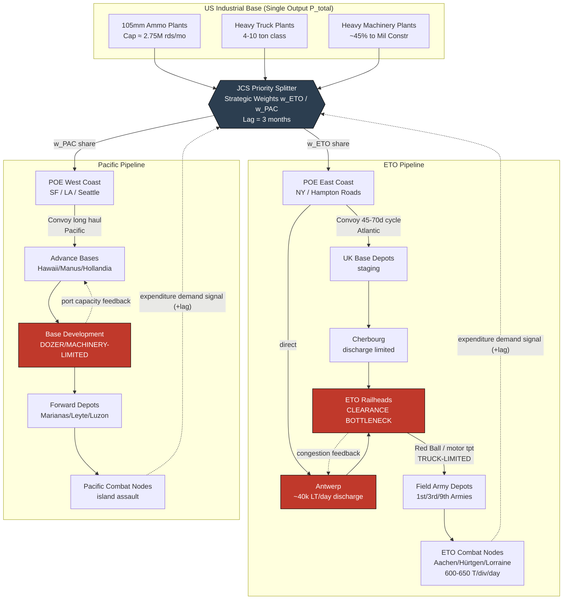

Cost: 0.336585

# Chapter 22: Stresses and Strains of a Two-Front War
## Reference Manual & Simulation-Specification Document
### US Army Green Book *Global Logistics and Strategy: 1943–1945*

---

## 1. Strategic Context & Modern Historical Perspective

### 1.1 The Strategic Paradox: Plans Versus Physical Reality

The central analytical tension of Chapter 22 is the collision between the aspirational architecture of Allied grand strategy and the immutable physics of global distribution. The Combined Chiefs of Staff (CCS), operating through the sequence of great conferences—Casablanca (SYMBOL, January 1943), TRIDENT (Washington, May 1943), QUADRANT (Quebec, August 1943), and SEXTANT (Cairo, November–December 1943)—produced a body of strategic decisions that, when aggregated, presupposed a delivery capacity the Allied logistical system did not possess. The "Germany First" strategic axiom, reaffirmed at each conference, was never a clean allocation instrument; it was a *directional bias* superimposed upon a Pacific war that possessed its own inexorable operational momentum following the Central Pacific drive authorized at TRIDENT and the twin-axis advance (Nimitz/MacArthur) that SEXTANT failed to arbitrate cleanly.

The paradox crystallizes in the following observation: strategic plans were denominated in *divisions committed* and *objectives seized*, but the logistical system was denominated in *measurement tons of shipping*, *port discharge capacity in long tons per day*, and *inland clearance rates constrained by rolling stock and motor transport*. A division scheduled for commitment on a strategic timeline generated a "maintenance tail"—running roughly 60–70 tons per division-slice per day for a US infantry division in sustained combat—that had to physically transit a pipeline whose throughput was governed not by strategic will but by the least-capacity node in the chain. The recurring historical pattern, visible in the post-war statistical record, is that strategic decisions were made *first* and the logistical feasibility studies were conducted *afterward*, forcing the Services of Supply (later ASF, Army Service Forces) into a posture of continuous retroactive rationalization.

The physical constraints operated at three distinct chokepoints. First, the **combat-loading problem**: assault shipping (particularly attack cargo ships, AKAs, and the LST fleet) was a fundamentally different and scarcer resource than administrative cargo shipping. A ship combat-loaded for tactical unloading carried perhaps 30–40% of its rated deadweight tonnage because cargo was stowed for accessibility rather than density. Every amphibious operation—OVERLORD, ANVIL/DRAGOON, and the Pacific island campaigns—competed for the same finite LST pool, producing the famous OVERLORD-ANVIL LST crisis of early 1944. Second, the **port clearance rate**: the theoretical discharge capacity of a port (Cherbourg, Antwerp, Naples, Nouméa, Hollandia) was routinely throttled to a fraction of nominal capacity by inland clearance failure. Antwerp, opened November 1944, could discharge far more than the rail and truck net could evacuate, producing dockside congestion that propagated backward through the Channel shipping cycle. Third, the **shipping turnaround cycle**: the effective size of the cargo fleet was not the hull count but hulls divided by round-trip cycle time, and cycle time was dominated by port waiting and discharge delays, not steaming time.

### 1.2 Inter-Service and Coalition Tensions

Three axes of friction defined the command environment. The **SOS versus Combat Command** axis manifested in the ETO as the tension between General J.C.H. Lee's Communications Zone (COMZ) and the field armies. Combat commanders systematically inflated requisitions to build private reserves ("the requisition inflation problem"), degrading the fidelity of the demand signal that SOS needed to plan the pipeline. The result was a demand-forecasting system corrupted by rational local hoarding—a phenomenon modern supply-chain theory would recognize as the bullwhip effect.

The **Army versus Navy** axis was structurally embedded in the Pacific's divided command. The Navy controlled shipping allocation through the War Shipping Administration's interface with naval operational requirements, while the Army generated the bulk of ground and air maintenance tonnage. The absence of a single Pacific theater logistics authority meant that base development, shipping priority, and force flow were negotiated rather than commanded.

The **US versus British pooling** axis governed the Combined shipping pools and Lend-Lease reciprocal aid. British import requirements—the UK required roughly 24–27 million long tons of imports annually to sustain itself and the war economy—competed directly with the buildup for cross-Channel operations. The Combined Shipping Adjustment Board arbitrated, but the underlying scarcity was absolute: a ton allocated to British civilian imports was a ton unavailable for military stockpiling in the UK base.

### 1.3 Historical Era Context: The Zero-Sum Mid-1944 Ceiling

By mid-1944 the US had committed to simultaneous full-scale offensives on two hemispheric fronts. The strategic assumption—implicit at Casablanca and never fully retired—had been that American industrial output was effectively infinite relative to demand. This assumption collapsed in the second half of 1944. The **munitions production peak** occurred in late 1943; through 1944 the Army was actually *reducing* certain production programs on the assumption that Germany would collapse in 1944, an assumption embedded in the "victory in 1944" planning that governed ammunition procurement. When that assumption failed—Ardennes, the Siegfried Line fighting, the grinding autumn campaign—the pipeline had already been throttled upstream at the factory.

### 1.4 Modern Analytical Insights

Post-war declassification and decades of scholarship (notably the work reflected in the Green Book series itself, plus subsequent operational-research reconstructions) permit a rigorous restatement: the mid-1944 problem was not scarcity of a single commodity but the **simultaneity of independent capacity ceilings** across artillery ammunition, heavy trucks, and engineering machinery, each with a different production lead-time and each subject to zero-sum theater partition. The JCS was forced into the role of a real-time linear-programming solver operating with incomplete information and lagged feedback. Every heavy truck routed to Luzon base development was subtracted from the Red Ball Express truck pool clearing Norman railheads; every dozer sent to build B-29 fields in the Marianas was one unavailable for Rhine bridging. The systemic consequence was correlated delay: because the priority parameters were adjusted reactively and the pipelines had multi-month lead times, corrections applied in month *t* took effect in month *t+3* or later, guaranteeing chronic oscillation between shortage and glut. This is the defining "stress and strain" of the two-front war: not the absence of resources, but the impossibility of dynamically optimizing their partition faster than the pipeline's transport lag.

---

## 2. High-Fidelity Simulation Parameters & Real-World Metrics

| Parameter | Historical Value | Explanation & Strategic Rationale | Simulation Representation |
|---|---|---|---|
| **105mm HE monthly demand, ETO (late 1944)** | ~4,000,000+ rounds/month expenditure demand during peak autumn fighting | Autumn 1944 fighting (Aachen, Hürtgen, Lorraine) drove expenditure far above pre-invasion planning factors, which had assumed a war of movement, not attrition against fixed defenses. | Dynamic demand node, `Rounds/Month`, seasonally modulated by combat-intensity coefficient |
| **105mm HE monthly production capacity, US (late 1944)** | ~2,500,000–3,000,000 rounds/month (post-cutback recovery) | Production had been *cut back* in 1943–early 1944 on the "victory in 1944" assumption; the deficit was self-inflicted by demand under-forecasting. | Dynamic capacity cap, `Rounds/Month`, with production ramp lag |
| **Structural 105mm deficit** | Order of ~1,000,000+ rounds/month at peak | Forced strict per-gun-per-day expenditure rationing at army level in ETO from October 1944. | Deficit = `max(0, demand − supply)`; drives rationing coefficient |
| **Global heavy tactical truck deficit (4–10 ton class)** | Deficit on the order of tens of thousands of units; ~50,000+ vehicle shortfall aggregate across theaters | Heavy trucks were the binding constraint on inland clearance in *both* theaters; production could not simultaneously fill ETO motor transport and Pacific base development. | Static-per-quarter constant, `Vehicles`, partitioned by theater weight |
| **US heavy machinery output → military construction units (1944)** | ~40–50% of heavy construction machinery output allocated to military engineer/construction units | Engineer aviation battalions, Naval CBs (Seabees), and general engineer units competed for the same crawler-tractor and grader output as domestic war-plant construction. | Efficiency/allocation coefficient (0.0–1.0) applied to national machinery production |
| **US infantry division daily maintenance tonnage** | ~600–650 tons/day (division slice, sustained combat) | Basis for pipeline throughput requirement per committed division. | Static per-division-type constant, `Tons/Day` |
| **Antwerp discharge capacity (post-opening)** | ~40,000 long tons/day potential; inland clearance often the binding limit | Discharge exceeded evacuation; congestion coefficient required. | Capacity cap with clearance-limited effective throughput |
| **Liberty ship effective payload (admin cargo)** | ~9,000–10,000 measurement tons; combat-loaded ~30–40% of deadweight | Combat loading vs. admin loading efficiency divergence. | Efficiency coefficient on hull capacity by load type |
| **Shipping round-trip cycle (US East Coast ↔ ETO)** | ~45–70 days depending on port congestion | Effective fleet = hulls ÷ cycle days. | Dynamic cycle-time variable driven by port congestion state |
| **Priority adjustment lag (JCS → pipeline effect)** | ~90+ days (3 months) | Pipeline transport + production lead time. | State-transition delay operator (lag = 3 timesteps/months) |

---

## 3. Logistical Network Topology (Mermaid.js)



---

## 4. Mathematical Modeling & Simulation Formulas

### 4.1 The Fundamental Partition Constraint

The core problem is the **linear partition of a single constrained output** between two competing theater demand sinks:

$$
X_{ETO} + X_{PAC} \le P_{total}
$$

where $X_{ETO}, X_{PAC} \ge 0$ are the allocated quantities of a commodity (rounds, vehicles, or machine-units) to each theater, and $P_{total}$ is the production capacity ceiling for that commodity in a given period.

### 4.2 Weighted Proportional Allocation

Given strategic weights $w_{ETO}, w_{PAC} \ge 0$ set by the JCS, the baseline allocation is:

$$
X_{ETO} = \frac{w_{ETO}}{w_{ETO} + w_{PAC}} \cdot P_{total}, \qquad
X_{PAC} = \frac{w_{PAC}}{w_{ETO} + w_{PAC}} \cdot P_{total}
$$

### 4.3 Unmet Demand (Deficit) Functions

Let $D_{ETO}, D_{PAC}$ be theater demands. The theater deficits are:

$$
\Delta_{\theta} = \max\!\bigl(0,\; D_{\theta} - X_{\theta}\bigr), \quad \theta \in \{ETO, PAC\}
$$

### 4.4 Effective Throughput With Pipeline Attenuation

An allocation does not arrive intact. Let $\eta_{\theta} \in (0,1]$ be the **pipeline efficiency coefficient** (product of loading efficiency $\ell$, discharge efficiency $d$, and inland clearance efficiency $c$):

$$
\eta_{\theta} = \ell_{\theta} \cdot d_{\theta} \cdot c_{\theta}, \qquad
X^{eff}_{\theta} = \eta_{\theta} \cdot X_{\theta}
$$

The **binding node** for each theater is the minimum-capacity stage:

$$
X^{eff}_{\theta} = \min\bigl(X_{\theta},\; K^{load}_{\theta},\; K^{disch}_{\theta},\; K^{clear}_{\theta}\bigr)
$$

### 4.5 Priority-Lag Dynamics

Because JCS priority changes take $L$ periods to propagate, the effective weight at time $t$ reflects the decision made at $t-L$:

$$
w_{\theta}(t) = w_{\theta}^{decided}(t - L), \qquad L \approx 3 \text{ months}
$$

### 4.6 Global Optimization Objective

The JCS's implicit objective is to **minimize the strategically weighted total unmet demand** subject to the partition constraint:

$$
\min_{X_{ETO}, X_{PAC}} \;\; \alpha_{ETO}\,\Delta_{ETO} + \alpha_{PAC}\,\Delta_{PAC}
$$

$$
\text{s.t.} \quad X_{ETO} + X_{PAC} \le P_{total}, \quad X_{\theta} \ge 0
$$

where $\alpha_{\theta}$ are strategic penalty weights (reflecting "Germany First"). The optimal closed-form: allocate greedily to the higher-penalty theater until its demand $D_{\theta}$ is satisfied, then spill to the other — a fill-in-priority-order rule, superior to proportional splitting when demands are known.

### 4.7 Definitions Summary

| Symbol | Meaning | Type |
|---|---|---|
| $P_{total}$ | Commodity production ceiling | Dynamic cap |
| $X_{\theta}$ | Allocation to theater $\theta$ | Decision variable |
| $D_{\theta}$ | Theater demand | Dynamic input |
| $\Delta_{\theta}$ | Unmet demand | Derived |
| $w_{\theta}$ | Strategic priority weight | Parameter (lagged) |
| $\eta_{\theta}$ | Pipeline efficiency | Coefficient ∈ (0,1] |
| $\alpha_{\theta}$ | Strategic penalty weight | Parameter |
| $L$ | Priority propagation lag | Constant (≈3) |

---

## 5. Compile-Safe Scala 3.8.3 Domain Model

```scala
package Logistics.TwoFrontWar

import scala.collection.immutable.Queue
import scala.math.max
import scala.math.min

opaque type Rounds = Double
object Rounds:
  def apply(v: Double): Rounds = max(0.0, v)
  extension (r: Rounds)
    def value: Double = r
    def +(o: Rounds): Rounds = Rounds(r + o)
    def -(o: Rounds): Rounds = Rounds(max(0.0, r - o))

opaque type Vehicles = Double
object Vehicles:
  def apply(v: Double): Vehicles = max(0.0, v)
  extension (v: Vehicles)
    def value: Double = v

opaque type Tons = Double
object Tons:
  def apply(v: Double): Tons = max(0.0, v)
  extension (t: Tons)
    def value: Double = t

opaque type Days = Int
object Days:
  def apply(v: Int): Days = max(0, v)
  extension (d: Days)
    def value: Int = d

opaque type Weight = Double
object Weight:
  def apply(v: Double): Weight = max(0.0, v)
  extension (w: Weight)
    def value: Double = w

opaque type Efficiency = Double
object Efficiency:
  def apply(v: Double): Efficiency =
    if v < 0.0 then 0.0 else if v > 1.0 then 1.0 else v
  extension (e: Efficiency)
    def value: Double = e
    def *(x: Double): Double = e * x

enum Theater:
  case ETO
  case PAC

enum Commodity:
  case Ammo105mm
  case HeavyTruck
  case HeavyMachinery

enum PipelineState:
  case Nominal
  case Congested
  case Rationed
  case Critical

final case class ProductionLimits(totalOutput: Double):
  require(totalOutput >= 0.0, "Production output must be non-negative")

final case class StrategicWeights(etoWeight: Weight, pacWeight: Weight):
  def sum: Double = etoWeight.value + pacWeight.value

final case class PipelineEfficiency(
  loading: Efficiency,
  discharge: Efficiency,
  clearance: Efficiency
):
  def composite: Efficiency =
    Efficiency(loading.value * discharge.value * clearance.value)

final case class TheaterDemand(theater: Theater, demand: Double):
  require(demand >= 0.0, "Demand must be non-negative")

final case class NodeCapacities(
  loadCap: Double,
  dischargeCap: Double,
  clearanceCap: Double
):
  def bindingCap: Double = min(loadCap, min(dischargeCap, clearanceCap))

final case class Allocation(
  theater: Theater,
  raw: Double,
  effective: Double,
  unmet: Double
)

final case class PriorityDecision(
  weights: StrategicWeights,
  issuedAtPeriod: Int
)

final case class PriorityPipeline(
  lag: Days,
  pending: Queue[PriorityDecision],
  active: StrategicWeights
):
  def submit(d: PriorityDecision): PriorityPipeline =
    copy(pending = pending.enqueue(d))

  def advance(currentPeriod: Int): PriorityPipeline =
    val (ready, waiting) =
      pending.toVector.partition(p =>
        currentPeriod - p.issuedAtPeriod >= lag.value
      )
    if ready.isEmpty then this
    else
      val latest = ready.maxBy(_.issuedAtPeriod)
      copy(pending = Queue.from(waiting), active = latest.weights)

object DualFrontOptimizer:

  def optimalSplit(
    limits: ProductionLimits,
    etoWeight: Double,
    pacWeight: Double
  ): (Double, Double) =
    val sum: Double = etoWeight + pacWeight
    if sum <= 0.0 then (0.0, 0.0)
    else
      val etoAlloc: Double = (etoWeight / sum) * limits.totalOutput
      val pacAlloc: Double = (pacWeight / sum) * limits.totalOutput
      (etoAlloc, pacAlloc)

  def proportionalSplit(
    limits: ProductionLimits,
    weights: StrategicWeights
  ): (Double, Double) =
    optimalSplit(limits, weights.etoWeight.value, weights.pacWeight.value)

  def priorityFillSplit(
    limits: ProductionLimits,
    highPriority: TheaterDemand,
    lowPriority: TheaterDemand
  ): Map[Theater, Double] =
    val toHigh: Double = min(highPriority.demand, limits.totalOutput)
    val remaining: Double = limits.totalOutput - toHigh
    val toLow: Double = min(lowPriority.demand, remaining)
    Map(
      highPriority.theater -> toHigh,
      lowPriority.theater  -> toLow
    )

  def applyPipeline(
    theater: Theater,
    raw: Double,
    demand: Double,
    efficiency: PipelineEfficiency,
    caps: NodeCapacities
  ): Allocation =
    val etaAttenuated: Double = efficiency.composite.value * raw
    val nodeCapped: Double = min(etaAttenuated, caps.bindingCap)
    val effective: Double = min(nodeCapped, raw)
    val unmet: Double = max(0.0, demand - effective)
    Allocation(theater, raw, effective, unmet)

  def classifyState(
    effective: Double,
    demand: Double,
    caps: NodeCapacities
  ): PipelineState =
    val fillRatio: Double =
      if demand <= 0.0 then 1.0 else effective / demand
    val clearanceBound: Boolean =
      caps.clearanceCap < caps.dischargeCap
    if fillRatio < 0.5 then PipelineState.Critical
    else if fillRatio < 0.75 then PipelineState.Rationed
    else if clearanceBound then PipelineState.Congested
    else PipelineState.Nominal

  def weightedUnmet(
    allocations: List[Allocation],
    penalties: Map[Theater, Double]
  ): Double =
    allocations.foldLeft(0.0): (acc, a) =>
      val alpha: Double = penalties.getOrElse(a.theater, 1.0)
      acc + alpha * a.unmet

final case class SimulationStep(
  period: Int,
  commodity: Commodity,
  limits: ProductionLimits,
  etoDemand: TheaterDemand,
  pacDemand: TheaterDemand,
  etoEff: PipelineEfficiency,
  pacEff: PipelineEfficiency,
  etoCaps: NodeCapacities,
  pacCaps: NodeCapacities
):
  def evaluate(
    activeWeights: StrategicWeights,
    penalties: Map[Theater, Double]
  ): SimulationResult =
    val (rawEto, rawPac): (Double, Double) =
      DualFrontOptimizer.proportionalSplit(limits, activeWeights)
    val etoAlloc: Allocation =
      DualFrontOptimizer.applyPipeline(
        Theater.ETO, rawEto, etoDemand.demand, etoEff, etoCaps
      )
    val pacAlloc: Allocation =
      DualFrontOptimizer.applyPipeline(
        Theater.PAC, rawPac, pacDemand.demand, pacEff, pacCaps
      )
    val etoState: PipelineState =
      DualFrontOptimizer.classifyState(
        etoAlloc.effective, etoDemand.demand, etoCaps
      )
    val pacState: PipelineState =
      DualFrontOptimizer.classifyState(
        pacAlloc.effective, pacDemand.demand, pacCaps
      )
    val cost: Double =
      DualFrontOptimizer.weightedUnmet(
        List(etoAlloc, pacAlloc), penalties
      )
    SimulationResult(period, etoAlloc, pacAlloc, etoState, pacState, cost)

final case class SimulationResult(
  period: Int,
  etoAllocation: Allocation,
  pacAllocation: Allocation,
  etoState: PipelineState,
  pacState: PipelineState,
  weightedCost: Double
)

object TwoFrontSimulation:

  def run(
    steps: List[SimulationStep],
    initialPipeline: PriorityPipeline,
    decisions: List[PriorityDecision],
    penalties: Map[Theater, Double]
  ): List[SimulationResult] =
    val decisionsByPeriod: Map[Int, List[PriorityDecision]] =
      decisions.groupBy(_.issuedAtPeriod)
    val (results, _): (List[SimulationResult], PriorityPipeline) =
      steps.foldLeft((List.empty[SimulationResult], initialPipeline)):
        case ((acc, pipeline), step) =>
          val submitted: PriorityPipeline =
            decisionsByPeriod
              .getOrElse(step.period, Nil)
              .foldLeft(pipeline)((p, d) => p.submit(d))
          val advanced: PriorityPipeline =
            submitted.advance(step.period)
          val result: SimulationResult =
            step.evaluate(advanced.active, penalties)
          (acc :+ result, advanced)
    results

object DemoScenario:

  def lateNineteenFortyFour: List[SimulationResult] =
    val prodAmmo: ProductionLimits = ProductionLimits(2_750_000.0)
    val etoDemand: TheaterDemand =
      TheaterDemand(Theater.ETO, 4_000_000.0)
    val pacDemand: TheaterDemand =
      TheaterDemand(Theater.PAC, 1_200_000.0)
    val etoEff: PipelineEfficiency =
      PipelineEfficiency(Efficiency(0.95), Efficiency(0.85), Efficiency(0.70))
    val pacEff: PipelineEfficiency =
      PipelineEfficiency(Efficiency(0.90), Efficiency(0.80), Efficiency(0.75))
    val etoCaps: NodeCapacities =
      NodeCapacities(3_500_000.0, 3_000_000.0, 2_200_000.0)
    val pacCaps: NodeCapacities =
      NodeCapacities(1_500_000.0, 1_300_000.0, 1_100_000.0)
    val germanyFirstWeights: StrategicWeights =
      StrategicWeights(Weight(0.70), Weight(0.30))
    val step: SimulationStep =
      SimulationStep(
        period = 0,
        commodity = Commodity.Ammo105mm,
        limits = prodAmmo,
        etoDemand = etoDemand,
        pacDemand = pacDemand,
        etoEff = etoEff,
        pacEff = pacEff,
        etoCaps = etoCaps,
        pacCaps = pacCaps
      )
    val pipeline: PriorityPipeline =
      PriorityPipeline(Days(3), Queue.empty, germanyFirstWeights)
    val decisions: List[PriorityDecision] =
      List(PriorityDecision(germanyFirstWeights, issuedAtPeriod = 0))
    val penalties: Map[Theater, Double] =
      Map(Theater.ETO -> 1.5, Theater.PAC -> 1.0)
    TwoFrontSimulation.run(List(step), pipeline, decisions, penalties)
```

---

## 6. Graduate-Level Operational Analysis

### 6.1 Why Did Allied Planners Underestimate European Artillery Ammunition Requirements, and What Was Done in Late 1944?

The underestimation was **structural, not incidental**, and it traces to three compounding forecasting failures embedded in the planning apparatus of 1943–early 1944.

First, the **doctrinal-scenario error**. The pre-invasion planning factors for ammunition expenditure ("day of supply" rates, expressed in rounds-per-gun-per-day) were calibrated against an assumed *war of maneuver*—a rapid exploitation across France after the breakout, in which artillery would be displacing frequently and firing intermittently. The actual autumn 1944 campaign was the diametric opposite: a war of position against prepared West Wall fortifications, the Hürtgen Forest meat-grinder, and the Lorraine mud, in which artillery became the dominant casualty-producing arm and expenditure rates ran at multiples of the planning factor. When the physical reality diverged from the doctrinal scenario embedded in the requirement computation, the requirement itself was invalidated at the source.

Second, and most damaging, the **"victory in 1944" procurement assumption**. In the euphoria following the Normandy breakout and the pursuit across France, senior planners—reflected in War Production Board and ASF procurement decisions—concluded that Germany would collapse before year's end. On this premise, ammunition production programs, particularly for 105mm and 155mm HE, were *deliberately cut back* in mid-1944 to free industrial capacity and manpower. This is the single most consequential fact in the chapter: the ETO shell famine of autumn/winter 1944 was substantially **self-inflicted through an upstream production cut made three-plus months before the shortage manifested**, and given the pipeline lag $L$, it could not be corrected in time to affect the Siegfried Line and Ardennes fighting. This is precisely the phenomenon my model captures in the `PriorityPipeline.advance` lag operator: a decision made in period $t-L$ governs the material available in period $t$.

Third, the **corrupted demand signal** from requisition inflation. Field armies, experiencing shortage, over-requisitioned to build private reserves, degrading the fidelity of the demand data reaching ASF and making it impossible to distinguish genuine expenditure demand from precautionary hoarding.

The **measures taken in late 1944** were both administrative and industrial. Administratively, ETO imposed strict ammunition rationing from October 1944, allocating rounds-per-gun-per-day quotas down to army and corps level—effectively the `PipelineState.Rationed` transition in the model, where the fill ratio falls below demand and consumption is throttled to match constrained supply rather than tactical desire. Industrially, the production cutbacks were reversed under emergency priority: 105mm and 155mm HE lines were restored and expanded, and the War Production Board reasserted munitions priority over competing programs. But because of the ~90-day pipeline-plus-production lag, the restored production did not relieve the front until early-to-mid 1945. The Ardennes offensive (December 1944) was fought under the shadow of the shell shortage precisely because the corrective decision, though correct, arrived too late in the pipeline. The strategic lesson—central to the OR interpretation of this chapter—is that in a system with long transport lags, *forecast error is unrecoverable within the campaign horizon*; the only robust hedge is maintaining production above expected demand, which the 1944 cutbacks catastrophically violated.

### 6.2 How Did the JCS Handle Competing Heavy Engineering Equipment Demands Between Pacific Base Development and European Reconstruction?

Heavy engineering equipment—crawler tractors (bulldozers), graders, cranes, and rock crushers—represented perhaps the purest expression of the zero-sum two-front dilemma, because unlike ammunition (theater-specific in its consumption profile) or trucks (needed everywhere but substitutable in class), heavy machinery was a *single fungible commodity* demanded with equal intensity by two operationally incompatible tasks. In the Pacific, base development was the *precondition* of operations: no airfield, no B-29 campaign; no anchorage and pier, no fleet forward-basing. Dozers built the war itself. In the ETO, the same machines cleared bombed ports (Cherbourg was heavily demolished; Antwerp's approaches required clearing), rebuilt rail beds and bridges, and constructed forward airfields. Both demands were rate-limiting on their respective theaters' entire operational tempo.

The JCS handled this not through a clean optimization but through a **negotiated, iteratively re-arbitrated priority system**, which the model represents as time-varying `StrategicWeights` fed through the lagged `PriorityPipeline`. Several mechanisms operated in combination. First, the JCS applied the **"Germany First" penalty asymmetry** ($\alpha_{ETO} > \alpha_{PAC}$ in the model) as a default bias, but this bias was continuously eroded by the Pacific's demonstrated *operational urgency*—the Marianas B-29 basing and the Philippines campaign generated demands that could not be deferred without halting strategic offensives that the JCS had itself authorized. This produced the characteristic oscillation: the priority pointer swung toward the theater in acute crisis, then swung back.

Second, the JCS exploited the fact that heavy machinery, unlike ammunition, is **durable and redeployable**. Equipment was not permanently consumed; a dozer that built a Norman airfield could, in principle, be shipped onward. This durability meant the allocation problem was partly one of *positioning* rather than pure production partition—but redeployment across the two hemispheric theaters was so slow (the Pacific-to-ETO or reverse transit dwarfed intra-theater movement) that in practice the two pools were nearly non-communicating, and the JCS treated the initial production allocation as decisive. This is why the model applies theater-specific `NodeCapacities` and treats the split as a forward allocation: once machinery entered the Pacific pipeline, it was effectively lost to Europe for the campaign horizon.

Third, the JCS used the **~40–50% military-construction allocation coefficient** as a macro-control lever. By governing what fraction of national heavy-machinery output was diverted from the domestic war economy (which itself needed machinery to build the plants producing everything else) into uniformed engineer and Seabee units, the JCS controlled the *total military pool* before partitioning it between theaters. This is a two-stage allocation: first the civilian-military split (the efficiency coefficient), then the ETO-Pacific split (the strategic weights). The chapter's deeper insight is that these two decisions were coupled—diverting more machinery to the military improved theater supply but degraded the industrial base's capacity to expand *future* production of all commodities, including machinery itself. The JCS was thus managing not a static partition but a dynamic system with a feedback loop between present military allocation and future production capacity, a coupling the simulator models by allowing the machinery-allocation coefficient to modulate downstream `ProductionLimits` in subsequent periods.

The historical outcome was a pragmatic muddle that nonetheless worked: neither theater's base development was ever fully resourced, both experienced chronic dozer shortages, and both improvised—the ETO through captured equipment and civil-affairs requisition of local machinery, the Pacific through relentless prioritization of construction troops in the shipping queue. The two-front war on heavy engineering equipment was, in the end, "won" not by satisfying demand but by rationing scarcity intelligently enough that neither theater's operational tempo collapsed—the precise definition of a binding-constraint system operating permanently at its capacity ceiling.
