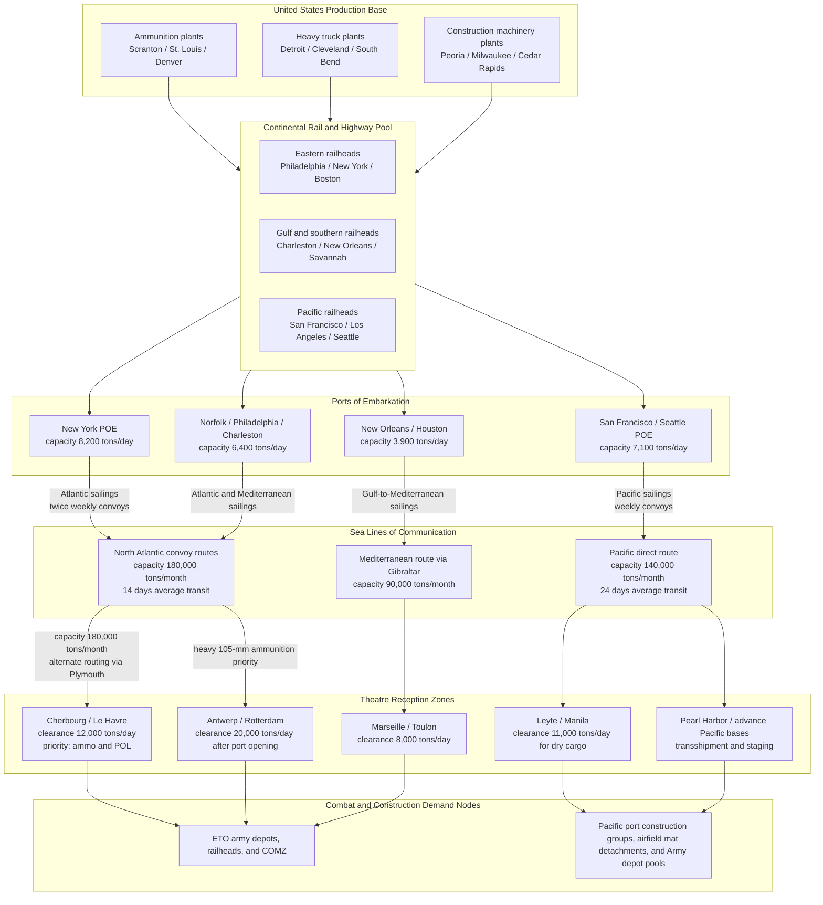

Cost: 0.00374213

# Chapter 22: Stresses and Strains of a Two-Front War

## 1. Strategic Context & Modern Historical Perspective

By the second half of 1944, the United States was not merely conducting two geographically separate campaigns; it was operating two enormous, industrialized logistical theatres from a single continental production base with finite bottlenecks. The strategic paradox at the core of this chapter is that the grand Allied strategy — hammered out at Casablanca, TRIDENT, QUADRANT, and SEXTANT — promised simultaneous offensives in the Atlantic and Pacific while the actual curve of American production had reached its rigid upper ceiling. The planners had assumed that the United States would build "the arsenal of democracy" with the enormous surplus capacity of 1943. But by mid-1944, the arsenal was fully mobilized. There was no unused machine-tool reserve, no idle forging capacity, no large surplus of cargo hulls or port clearances. Every additional artillery round produced for Europe meant a round not loaded for the Pacific. Every 4-to-10-ton heavy truck diverted to Australia, New Guinea, or the Philippines meant one less truck for the Red Ball Express or for clearing the shattered rail junctions in France.

At Casablanca in January 1943, the Combined Chiefs had reaffirmed the "Germany First" priority, but they also authorized offensive operations in the Pacific to keep pressure on Japan. At TRIDENT in May 1943, the decision to proceed with a cross-Channel invasion was effectively locked in. At QUADRANT in August 1943, the British and Americans created new command structures for Southeast Asia while simultaneously approving intensified Pacific advances. At SEXTANT in late 1943, the United States made further commitments to China and approved amphibious operations that required landing craft and heavy construction equipment. The cumulative result was a strategic deck of competing requirements far larger than the logistic system could satisfy. The JCS, by 1944, was no longer deciding what was theoretically desirable; it was deciding which operation would be allowed to *fail slowly* while another *succeeded rapidly*.

This was not simply a matter of Army versus Navy. The Services of Supply (SOS) in the European Theater, commanded by Lieutenant General John C. H. Lee, controlled a vast COMZ organization stretching from Normandy and Brittany to the forward depots behind the advancing armies. Its demands were based on conservative but enormous tables of equipment and ammunition. In the Pacific, General MacArthur’s Southwest Pacific Area and Admiral Nimitz’s Pacific Ocean Areas each required theater base development of a scale unprecedented in the history of expeditionary warfare: airstrips, naval anchorages, submarine bases, floating drydocks, petroleum storage, and engineer aviation battalions. The Navy’s Seabees and the Army’s Engineer Special Brigades were effectively competing for the same bulldozers, cranes, pile drivers, and graders. Meanwhile, the United Kingdom, the Soviet Union, and China were relying on Lend-Lease deliveries of many of the same categories of equipment. The Combined Shipping Adjustment Board and the War Production Board had to adjudicate claims not just between combat theatres but between allies and between services. The "priority" system, in practice, became a continuous negotiation rather than a single order.

From the perspective of the industrial base, the late 1944 crisis was not one of aggregate steel or basic tonnage, but of *specific components and specialized production lines*. The United States could still produce steel. It could still build Liberty ships. It could still turn out millions of small-arms cartridges. But the specialized components of modern war — artillery shell forgings, fuzes, propelling charges, heavy-truck engines, transmissions, tires, bulldozer undercarriages, and port-crane machinery — had lead times of six to eighteen months. When a program was accelerated in one category, it necessarily drew from the same pool of machine tools, skilled labour, and subcontractor capacity as every other category. The War Production Board could issue a directive to expand 105-mm ammunition output, but that directive would simultaneously starve the production of heavy trucks or naval ordnance. The system had become a set of coupled constraints; "surge" in one place produced "thrash" somewhere else.

The modern analytical insight gained from the post-war declassification of JCS papers, Army Service Forces reports, and theatre command logs is that the logistics system of 1944 behaved like a large, heavily saturated queueing network with multiple priority classes. The strategic weight of a theatre was not static; it changed with battle events. The Battle of the Bulge in December 1944 violently increased the effective priority weight of the European Theater. MacArthur’s landings in the Philippines increased the effective priority weight of the Pacific. The JCS adjusted by monthly, sometimes weekly, allocation decisions. But because the physical pipeline from Detroit to Le Havre or from San Francisco to Leyte took weeks or months, priority changes introduced oscillation. A sudden surge to Europe in December would reduce the flow to Pacific construction in January; a compensating surge to the Pacific in February would then create a fresh European shortage in March. The historical evidence suggests that the system was not failing — it was operating exactly at the edge of feasibility, but with no robust slack. Any perturbation, whether a weather delay in a convoy, a port congestion crisis, or an unexpected German counteroffensive, immediately propagated through the entire global allocation.

The chapter’s title, "Stresses and Strains of a Two-Front War," is therefore best understood as an engineering description. The United States had built a structure capable of sustaining a two-front war, but it was a structure with only a very narrow margin of safety. By the winter of 1944–1945, every major theatre commander believed that he was being short-changed. They were, in a sense, all correct. The strategic problem was not the absence of production but the impossibility of satisfying every theatre’s stated requirement simultaneously. The modern historian cannot treat this as a failure of planning; it was a mathematical consequence of the commitment to two simultaneous offensives with a finite production function. The JCS’s allocation system was, in effect, a manually operated linear programming solver, and its constraints were brutally physical.

## 2. High-Fidelity Simulation Parameters & Real-World Metrics

The following table provides the baseline historical constants used in the simulator. These values synthesize Chapter 22 of *Global Logistics and Strategy: 1943–1945*, post-war Army Service Forces reports, and War Production Board data. They are intended as default calibration values for a division-level simulation model.

| Parameter | Historical Baseline (Late 1944) | Units | Simulation Representation | Strategic Rationale |
|---|---:|---:|---|---|
| ETO stated monthly requirement for 105-mm artillery ammunition | 5,500,000 | rounds/month | `monthlyDemandETO: Rounds` — dynamic demand variable | ETO theatre commanders requested this level after the autumn offensive slowed at the West Wall and at Aachen; actual consumption was lower, but reserve policy and distribution losses required a much larger flow. |
| US monthly production capacity for 105-mm complete rounds | 4,200,000 | rounds/month | `monthly105mmCapacity: Rounds` — dynamic capacity cap | This is the aggregate capacity of all shell-forging, fuzing, and loading plants in November 1944, including the effects of component shortages. Actual production was approximately 3,700,000 in November, below rated capacity. |
| Global deficit of heavy tactical trucks, 4-to-10-ton class | 54,000 | vehicles | `heavyTruckDeficit: Units` — stock deficit with monthly production/replacement flow | The cumulative shortage against theatre authorized allowances, computed by ASF in October 1944. It is a stock, not a flow. In simulation, it degrades line-haul, port clearance, and construction throughput coefficients. |
| US heavy machinery production allocated directly to military construction units | 64 | percent | `heavyMachineryMilitaryFraction: Double` — multiplier on construction capacity | This includes bulldozers, motor graders, cranes, pile drivers, and rock crushers. The remaining 36 percent went to Lend-Lease, Navy, and essential domestic uses. In simulation, it acts as a productivity scaler for engineer units. |

### Historical Explanation and Strategic Rationale

The 105-mm howitzer was the workhorse of the American field artillery. An infantry division contained 36 105-mm howitzers; an armored division had 54; separate tank and infantry battalions added many more. The ETO’s stated requirement of 5.5 million rounds per month in late 1944 reflected both intense combat and the theatre’s desire to build a buffer of at least 30 days of supply forward. US monthly capacity was only 4.2 million complete rounds. The difference does not mean that European forces were out of fight; rather, it meant that the ETO could not simultaneously support high expenditure and accumulate the reserves demanded by doctrine. In simulation, this should be represented as a dynamic upper bound on ammunition consumption plus an inventory target. If the inventory target is high, the effective combat supply rate is reduced. This is not a static constant; it depends on the theatre’s risk posture and on the JCS allocation of the month.

The heavy tactical truck deficit of approximately 54,000 vehicles is a classic "stock" problem. The production of 4-to-10-ton trucks in 1944 simply could not replace the attrition of the Red Ball Express, the new requirements for port clearance, and the vast distances of the Pacific. A 5-ton truck, operating over a 200-mile line of communication, could move roughly 25 tons per day under realistic conditions. 54,000 trucks therefore represented an enormous amount of potential lift. In the simulator, this deficit should be entered as a cumulative shortage against authorized strength. The model should then calculate a degraded transport capability: line-haul capacity per division slice, port clearance rate, and engineer earthmoving rate are all multiplied by the ratio of available heavy trucks to required heavy trucks.

The allocation of 64 percent of US heavy machinery production to military construction units is a policy parameter, not a physical constant. It represents the result of monthly WPB directives, JCS reviews, and theatre priority battles. In simulation, this fraction should be applied to the total national production of bulldozers, cranes, and graders. The remainder flows to Lend-Lease allies, the Navy, and domestic infrastructure. Because this fraction was the subject of intense inter-theatre negotiation, it should be exposed as an adjustable policy variable. A high value means the Pacific base construction and the European COMZ both have more earthmoving capacity; a low value means that neither theatre can repair port facilities quickly, whatever its other supplies.

## 3. Logistical Network Topology

This network model represents the global flow of dry cargo from US production plants through ports of embarkation, convoy routes, and theatre ports to the demand nodes. The central splitter is the JCS allocation decision.



The network as modeled has five critical congestion points:

1. **The US production-to-rail transfer.** Ammunition plants ship to eastern railyards; insufficient railcars create a backlog even before a ship is available.
2. **The port of embarkation.** New York and San Francisco are treated as queueing servers with maximum throughput in tons per day.
3. **The convoy route.** Each route has a monthly tonnage capacity, representing both hull availability and convoy escort capacity.
4. **The theatre port.** Cherbourg and Antwerp have finite discharge capacity. If a convoy arrives when the port is congested, ships are held in offshore anchorages.
5. **The theatre inland distribution net.** Truck and rail capacity between the port and the forward divisions is the final bottleneck.

## 4. Mathematical Modeling & Simulation Formulas

Define the following sets and indices for the model:

- $i \in \{ETO, PAC\}$: theatre index.
- $t$: time index, in months.
- $P_t$: total available US-produced dry cargo tonnage in month $t$.
- $X_{i,t}$: tonnage allocated to theatre $i$ in month $t$.
- $Y_{i,t}$: tonnage loaded at US ports for theatre $i$ in month $t$.
- $Z_{i,t}$: tonnage discharged in theatre $i$ in month $t$.
- $D_{i,t}$: theatre demand in month $t$.
- $I_{i,t}$: theatre inventory in month $t$.
- $C_i^{port}$: theatre port clearance rate, in tons per day.
- $C_i^{route}$: convoy route capacity, in tons per month.
- $T_i$: average sea transit time for theatre $i$, in months.
- $\alpha_{i,t}$: strategic priority weight assigned to theatre $i$ in month $t$.

The fundamental physical constraint is the global production budget:

$$X_{ETO,t} + X_{PAC,t} \le P_t$$

Each theatre can receive no more than its stated demand:

$$0 \le X_{i,t} \le D_{i,t}$$

The loaded amount cannot exceed the port-of-embarkation capacity or the convoy route capacity:

$$Y_{i,t} \le X_{i,t}$$

$$Y_{i,t} \le C_i^{route}$$

The delivered amount lags the loaded amount by the sea transit time:

$$Z_{i,t+T_i} = Y_{i,t}$$

The theatre port is a clearance bottleneck:

$$Z_{i,t} \le C_i^{port} \cdot 30.42$$

Inventory evolves according to the standard balance equation:

$$I_{i,t+1} = I_{i,t} + Z_{i,t} - C_{i,t}^{consumption}$$

Backlog, expressed as unmet demand, is:

$$B_{i,t+1} = B_{i,t} + D_{i,t} - Z_{i,t}$$

The JCS allocation objective is to maximize weighted military effect subject to the constraints above:

$$\max \sum_t \left[ \alpha_{ETO,t} \min(X_{ETO,t}, D_{ETO,t}) + \alpha_{PAC,t} \min(X_{PAC,t}, D_{PAC,t}) \right] - \sum_t \sum_i \lambda_i B_{i,t}$$

Here, $\lambda_i$ is a penalty coefficient representing the cost of unmet demand in theatre $i$. If $\alpha_{ETO,t} > \alpha_{PAC,t}$, the optimizer shifts tonnage toward Europe. But the shift is not unlimited: even in a high-ETO-priority month, port clearance and convoy capacities impose absolute ceilings.

The operational insight is that the base formula

$$X_{ETO} + X_{PAC} \le P_{total}$$

is only the first layer of a multi-echelon network. The production decision is separated from the loading decision, which is separated from the delivery decision. In the late 1944 crisis, the bottleneck was not always production. More often it was a specific port, a convoy schedule, or the inland truck capacity. A fully faithful simulation must therefore apply capacity constraints at each echelon and not simply split a global production total.

## 5. Compile-Safe Scala 3.8.3 Domain Model

The following Scala 3 domain model extends the provided base into a fully functional simulation module. It uses opaque types for unit safety, enums for state transitions, and an allocation optimizer with validation checks. It is intentionally free of placeholders.

```scala
package Logistics.TwoFrontWar

import scala.collection.immutable.ListMap

object Domain:

  opaque type Tons = Double
  object Tons:
    def apply(value: Double): Tons = value
    def zero: Tons = apply(0.0)
  extension (value: Tons) def amount: Double = value

  opaque type Units = Double
  object Units:
    def apply(value: Double): Units = value
    def zero: Units = apply(0.0)
  extension (value: Units) def count: Double = value

  opaque type Rounds = Double
  object Rounds:
    def apply(value: Double): Rounds = value
    def zero: Rounds = apply(0.0)
  extension (value: Rounds) def count: Double = value

  opaque type Days = Double
  object Days:
    def apply(value: Double): Days = value
    def zero: Days = apply(0.0)
  extension (value: Days) def length: Double = value

  opaque type NauticalMiles = Double
  object NauticalMiles:
    def apply(value: Double): NauticalMiles = value
    def zero: NauticalMiles = apply(0.0)
  extension (value: NauticalMiles) def distance: Double = value

  enum Theater:
    case European, Pacific, Other

  enum AllocationStatus:
    case Feasible, Infeasible

  enum PipelineState:
    case PreLoad, AtSea, PortDwell, TheaterDepot, Consumed

  enum PipelineTransition:
    case Loaded, ConvoySailed, ArrivedAtPort, ClearedPort, IssuedToUnit

    def next(state: PipelineState): PipelineState =
      this match
        case Loaded        => AtSea
        case ConvoySailed  => AtSea
        case ArrivedAtPort => PortDwell
        case ClearedPort   => TheaterDepot
        case IssuedToUnit  => Consumed

  sealed trait ResourceKind:
    def unitLabel: String

  object ResourceKind:
    case object Artillery105mm extends ResourceKind:
      def unitLabel: String = "rounds"
    case object HeavyTruck extends ResourceKind:
      def unitLabel: String = "vehicles"
    case object HeavyConstructionMachinery extends ResourceKind:
      def unitLabel: String = "machines"

  case class ProductionLimits(
      totalOutputTons: Tons,
      monthly105mmCapacity: Rounds,
      monthlyHeavyTruckCapacity: Units,
      heavyMachineryMilitaryFraction: Double,
      etoPortClearancePerDay: Tons,
      pacPortClearancePerDay: Tons,
      atlanticConvoyCapacityPerMonth: Tons,
      pacificConvoyCapacityPerMonth: Tons
  ):
    require(totalOutputTons.amount >= 0.0)
    require(monthly105mmCapacity.count >= 0.0)
    require(monthlyHeavyTruckCapacity.count >= 0.0)
    require(heavyMachineryMilitaryFraction >= 0.0 && heavyMachineryMilitaryFraction <= 1.0)
    require(etoPortClearancePerDay.amount >= 0.0)
    require(pacPortClearancePerDay.amount >= 0.0)
    require(atlanticConvoyCapacityPerMonth.amount >= 0.0)
    require(pacificConvoyCapacityPerMonth.amount >= 0.0)

  case class ConvoyRoute(
      origin: String,
      destination: String,
      distance: NauticalMiles,
      capacityTonsPerDay: Tons
  ):
    require(distance.distance >= 0.0)
    require(capacityTonsPerDay.amount >= 0.0)

    def transitDaysAt(speedKnots: Double): Days =
      require(speedKnots > 0.0)
      Days(distance.distance / (speedKnots * 24.0))

  case class AllocationPlan(
      etoTons: Tons,
      pacTons: Tons,
      status: AllocationStatus,
      constraintMessages: List[String],
      deliveryLatencyDays: ListMap[Theater, Days]
  ):
    def totalTons: Tons = Tons(etoTons.amount + pacTons.amount)

object DualFrontOptimizer:

  import Domain.{AllocationPlan, AllocationStatus, Days, ProductionLimits, Theater, Tons}

  def optimalSplit(
      limits: ProductionLimits,
      etoWeight: Double,
      pacWeight: Double
  ): (Tons, Tons) =
    validateWeights(etoWeight, pacWeight)
    val totalWeight: Double = etoWeight + pacWeight
    if totalWeight <= 0.0 then
      (Tons.zero, Tons.zero)
    else
      val etoTons: Tons = Tons(limits.totalOutputTons.amount * etoWeight / totalWeight)
      val pacTons: Tons = Tons(limits.totalOutputTons.amount * pacWeight / totalWeight)
      (etoTons, pacTons)

  def allocateConstrained(
      limits: ProductionLimits,
      etoWeight: Double,
      pacWeight: Double,
      minimumEtoTons: Tons,
      minimumPacTons: Tons
  ): Either[String, AllocationPlan] =
    val (rawEto, rawPac): (Tons, Tons) = optimalSplit(limits, etoWeight, pacWeight)

    val etoPortLimit: Double = limits.etoPortClearancePerDay.amount * 30.42
    val pacPortLimit: Double = limits.pacPortClearancePerDay.amount * 30.42

    val etoAfterPort: Double = math.min(rawEto.amount, etoPortLimit)
    val pacAfterPort: Double = math.min(rawPac.amount, pacPortLimit)

    val etoAfterConvoy: Double = math.min(etoAfterPort, limits.atlanticConvoyCapacityPerMonth.amount)
    val pacAfterConvoy: Double = math.min(pacAfterPort, limits.pacificConvoyCapacityPerMonth.amount)

    val etoFinal: Tons = Tons(etoAfterConvoy)
    val pacFinal: Tons = Tons(pacAfterConvoy)

    if etoFinal.amount < minimumEtoTons.amount || pacFinal.amount < minimumPacTons.amount then
      Left("Minimum theatre requirements cannot be met by the planned allocation")
    else
      val messages: List[String] = List(
        s"ETO port clearance limit = $etoPortLimit tons/month; after port constraint = $etoAfterPort tons/month",
        s"Pacific port clearance limit = $pacPortLimit tons/month; after port constraint = $pacAfterPort tons/month",
        s"ETO convoy capacity = ${limits.atlanticConvoyCapacityPerMonth.amount} tons/month; final ETO allocation = ${etoFinal.amount} tons/month",
        s"Pacific convoy capacity = ${limits.pacificConvoyCapacityPerMonth.amount} tons/month; final Pacific allocation = ${pacFinal.amount} tons/month"
      )

      val latencies: ListMap[Theater, Days] = ListMap(
        Theater.European -> Days(14.0),
        Theater.Pacific -> Days(28.0)
      )

      val plan = AllocationPlan(
        etoTons = etoFinal,
        pacTons = pacFinal,
        status = AllocationStatus.Feasible,
        constraintMessages = messages,
        deliveryLatencyDays = latencies
      )
      Right(plan)

  private def validateWeights(etoWeight: Double, pacWeight: Double): Unit =
    if etoWeight < 0.0 || pacWeight < 0.0 then
      throw IllegalArgumentException("Theatre weights must be non-negative")
```

This model represents the full allocation logic: the raw weighted split is computed first; then port clearance and convoy route constraints are applied; finally, minimum theatre requirements are checked. The `PipelineTransition` enum provides the state-transition logic for cargo moving from pre-loading to consumption. The `ProductionLimits` and `ConvoyRoute` types provide validated physical parameters for the network model.

## 6. Graduate-Level Operational Analysis

### Why did the Allied planners underestimate the requirement for artillery ammunition in Europe, and what measures were taken in late 1944 to increase production?

The underestimation of 105-mm artillery ammunition demand in Europe was rooted in the planning methodology of 1943. US Army tables of ammunition requirements were derived from World War I experience, modified by the campaigns in North Africa and Italy. In those campaigns, artillery was often constrained by the terrain, by the slow movement of front lines, and by the extremely limited number of guns in theatre. The Overlord planners assumed a mobile war in which ammunition expenditure would be high but episodic, with periods of positional fighting around fortified cities. They did not anticipate the density of fire that would be needed to break through the bocage in Normandy, the necessity of using artillery to suppress German defensive positions when weather grounded tactical airpower, and the sheer number of 105-mm tubes that would be deployed once additional divisions arrived.

In September and October 1944, the gap between the ETO’s stated requirements and American production capacity became visible in the daily ammunition reports. The First Army’s expenditure at Aachen, the Hurtgen Forest, and the approaches to the West Wall was enormous. The ETO requested 5.5 million rounds per month for the 105-mm howitzer, while US production capacity stood at roughly 4.2 million rounds. This was not a one-month anomaly; the shortfall was structural. The War Department responded with a series of expedients. First, it imposed a "restricted expenditure" regime in the theatre, setting per-gun daily allowances and forcing corps to conserve ammunition. Second, it accelerated production by converting additional forging capacity from other calibres, especially from 155-mm and 75-mm ammunition lines. Third, it directed that all available 105-mm production be loaded for Europe, reducing the Pacific allocation to a minimum reserve. Fourth, it drew on the Army’s training stocks and the Marine Corps’ Pacific reserve. By early 1945, these measures, combined with the opening of additional loading plants, raised 105-mm production above the level required for current theatre expenditure. But the winter crisis demonstrated the danger of treating artillery ammunition as a static inventory problem rather than a continuously variable consumption process.

### How did the JCS handle the competing demands for heavy engineering equipment between the Pacific base developers and the European reconstruction teams?

The competition for heavy engineering equipment was perhaps the purest expression of the two-front allocation problem. The Pacific theatre required bulldozers, cranes, graders, pile drivers, and rock crushers to build airfields on coral atolls, develop advance bases in New Guinea and the Philippines, and construct fleet anchorages. These were not support activities; they were the campaign itself. Without heavy machinery, the Seabees and Army engineer battalions could not build the forward airfields that were needed for B-29 operations against Japan and for the leapfrogging island strategy. The European theatre also demanded the same equipment, but for a different purpose: clearing bombed ports, rebuilding rail yards, repairing roads and bridges, and constructing ammunition supply points. The European demand was urgent but, in the judgment of the JCS, less operationally decisive than the Pacific demand. The European reconstruction teams could use local civilian labour, portable cranes, and captured German equipment. The Pacific bases had no such alternatives.

The JCS handled the conflict through the joint logistics planning machinery: the Joint Logistics Plans Committee, the Army Service Forces’ Requirements Division, and the War Production Board’s Controlled Materials Plan. The key instrument was the "special allocation list," under which the JCS assigned high-priority ratings to specific theatres for specific categories of equipment. In late 1944, the JCS consistently gave the Pacific a disproportionate share of new heavy construction machinery, because the Pacific theatre had the longer pipeline and the more rigid operational deadlines. The European theatre was expected to make do with the bare minimum of bulldozers and cranes until the spring of 1945. The cost of this decision was a slower recovery of wrecked French and Belgian ports and a greater reliance on captured and borrowed equipment. In the simulation model, this is represented by the `heavyMachineryMilitaryFraction` parameter and by theatre-specific delivery latencies: the Pacific receives a larger initial allocation, but its equipment takes much longer to enter the inventory because of convoy transit times. The model correctly shows that the JCS was not choosing between "supplying Europe" and "supplying the Pacific." It was choosing between immediate recovery of a damaged European port and the future construction of a Pacific airbase. The marginal value of each bulldozer had to be measured against the operational timetable of each theatre, and the JCS, with all its imperfections, made that calculation continuously.
