Cost: 0.4712725

### 1. Strategic Context & Modern Historical Perspective

Chapter 22 of *Global Logistics and Strategy: 1943–1945* describes the point at which American mobilization ceased to be primarily a problem of expansion and became a problem of allocation under hard constraints. By the middle of 1944 the United States possessed the largest war economy and overseas logistics system in the world, but neither was unlimited. The central difficulty was no longer simply producing more matériel. It was synchronizing production, inland transportation, port capacity, shipping, discharge, theater distribution, and tactical consumption across two simultaneous offensive systems: the war against Germany and the advance toward Japan.

The resulting stress was systemic. A shortage identified at a European railhead might originate in an inaccurate tactical expenditure forecast, a reduction in the Army Supply Program made six months earlier, a steel-allocation decision, insufficient component production, a labor bottleneck at an ammunition-loading plant, a shortage of railcars, or a shipping priority assigned to Pacific base construction. “Production” and “delivery” were not interchangeable. An item could exist in the United States yet remain operationally unavailable because it was awaiting modification, packaging, inland transportation, port clearance, convoy space, discharge equipment, or onward movement.

#### The strategic paradox

At Casablanca in January 1943, TRIDENT in May 1943, QUADRANT in August 1943, and SEXTANT at the end of 1943, Allied leaders progressively defined a coalition strategy that required several major undertakings to mature nearly concurrently. These included the bomber offensive against Germany, the accumulation for OVERLORD, operations in Italy and the Mediterranean, the drive through the Central and Southwest Pacific, support to China and Southeast Asia, antisubmarine warfare, and extensive construction of bases, airfields, roads, depots, pipelines, and communications networks.

At the level of conference decisions, forces and cargo could be assigned among theaters in tables. In physical reality, every assignment passed through a sequence of capacity-limited nodes. A division assigned to a theater required not merely passenger lift but organizational equipment, vehicles, replacement stocks, ammunition, fuel, maintenance units, hospital capacity, depot space, and recurring sustainment. A strategic decision therefore created a time-phased logistics liability rather than a one-time movement requirement.

The major conferences tended to deal in strategic priorities, target dates, divisions, aircraft groups, landing craft, and shipping allocations. They could not eliminate the operational coupling among those categories. An amphibious offensive, for example, simultaneously demanded assault shipping, landing craft, naval gunfire ammunition, engineer equipment, amphibian vehicles, trucks, construction machinery, petroleum handling units, hospital ships, and follow-up dry-cargo lift. Increasing the troop lift without increasing combat-loading and beach-clearance capacity could merely deliver congestion sooner.

Shipping was the most visible global constraint, but not always the decisive local constraint. Ocean transport was divided among troopships, dry-cargo vessels, tankers, refrigerated ships, landing ships, and specialized heavy-lift vessels. These classes were only imperfectly substitutable. A Liberty ship could carry packaged ammunition or vehicles, but it could not substitute for an LST in an assault echelon or for a tanker in a bulk-petroleum pipeline. Moreover, the nominal deadweight capacity of a ship was not equivalent to militarily usable lift. Cubic displacement, deck strength, hatch dimensions, cargo compatibility, combat-loading requirements, convoy schedules, and port turnaround all reduced effective capacity.

Combat loading imposed a particularly important penalty. Commercial loading sought maximum use of ship capacity; combat loading arranged cargo so that units, weapons, ammunition, and equipment could be discharged in the sequence required ashore. This increased broken stowage and often reduced tonnage utilization. It also tied up shipping while loads were assembled and documented. Thus the same vessel could carry less usable cargo per voyage when committed to an amphibious operation than when operating in a stable port-to-port shuttle.

Theaters were also limited by discharge and clearance. A port’s theoretical ship-unloading rate was irrelevant if cranes, barges, labor, storage, railcars, trucks, bridges, or traffic-control systems could not remove cargo from the quay. In northwest Europe the Allies initially depended on beaches and minor ports while Cherbourg was repaired and before Antwerp became usable. In the Pacific, many objectives possessed no developed port at all. Cargo had to move through reef passages, beaches, landing craft, amphibian trucks, temporary dumps, and roads constructed after occupation. The resulting pipeline contained large inventories afloat and ashore but still produced shortages at the combat front.

Modern logistics analysis therefore interprets Allied strategy as a succession of coupled flow problems. Conference decisions changed demand vectors faster than the production and distribution systems could change capacity. A strategic priority did not create trucks, shells, bulldozers, port battalions, or ships; it determined which claimant would experience the shortage.

#### The transition from mobilization surplus to selective scarcity

American production in 1942 and 1943 expanded so rapidly that planners often assumed future requirements could be met by further increases. By 1944 that assumption was no longer generally valid. The economy was close to full employment, critical plants were operating multiple shifts, and the armed forces competed for specialized labor, steel, copper, rubber, machine tools, explosives, engines, tires, and transportation equipment. Additional output in one category often required reducing another category or reversing an earlier cutback.

This was not an absolute ceiling in the sense that no further production increase was possible. Rather, it was a rigid short-run capacity frontier. Output could be raised by reopening lines, expanding facilities, changing contracts, adding shifts, releasing labor, or reallocating materials, but these measures required time and imposed opportunity costs. Ammunition production illustrates the problem. Reductions made when stock positions appeared ample released labor and plant capacity for other programs. When European expenditure exceeded forecasts after the Normandy breakout and during the autumn fighting, ammunition lines could not instantaneously return to peak output. Explosive filling, shell-body manufacture, fuzes, cartridge cases, propellant, packing, and inspection all had to be coordinated.

The same problem appeared in heavy trucks. Tactical trucks of four to ten tons were not merely larger versions of light vehicles. They required heavier frames, transmissions, axles, tires, engines, and specialized bodies. Production could not be expanded in direct proportion to dollar appropriations. In Europe, heavy trucks were required for port clearance, line-haul operations, artillery prime movement, tank transport, engineer work, and the movement of fuel and ammunition beyond damaged rail systems. In the Pacific they moved cargo from beaches and ports to dispersed airfields, dumps, and construction sites, often over primitive roads and under severe maintenance conditions.

A truck shortage thus reduced throughput twice. First, it limited the physical tonnage that could be carried. Second, it increased cycle time by forcing available vehicles to operate longer distances, under heavier loads, and with less maintenance. Breakdown rates rose, effective fleet strength declined, and the surviving vehicles accumulated mileage more rapidly. The correct simulation interpretation is therefore not merely “67,000 vehicles absent,” but a reduction in network transport capacity followed by a nonlinear deterioration in fleet availability.

#### Inter-service and coalition tensions

The Army Service Forces—earlier called the Services of Supply—had to reconcile theater requests with production feasibility, shipping availability, and global stocks. Theater commanders naturally framed requirements in terms of operational risk. The Army Service Forces had to aggregate those requests and prevent every command from treating its maximum contingency requirement as a mandatory issue. This produced recurring conflict between combat commands, which regarded supply shortfalls as threats to operations, and the logistical agencies, which regarded unconstrained theater demands as mutually incompatible.

The War Department’s Operations Division, the Joint Chiefs of Staff, the Army Service Forces, the Army Air Forces, the Navy, and the War Production Board approached the problem through different institutional lenses. The JCS and Operations Division emphasized strategic priority. The Army Service Forces emphasized balanced programs and pipeline feasibility. The War Production Board had to protect the integrity of industrial schedules and civilian sectors indispensable to war production. The Navy controlled substantial shipping, construction, amphibious, petroleum, and procurement programs of its own. The Army Air Forces demanded high-priority transport, fuels, bombs, vehicles, airfield equipment, and specialized construction.

Army–Navy rivalry was particularly significant in the Pacific. Army engineers and Navy construction battalions required many of the same bulldozers, graders, cranes, crushers, tractors, dump trucks, and petroleum-handling systems. The Pacific war was unusually construction-intensive because operational reach depended on converting captured or undeveloped islands into air, naval, and logistics bases. Yet European requirements rose simultaneously as engineers repaired ports, railways, roads, bridges, pipelines, depots, and airfields across France and Belgium.

Anglo-American pooling arrangements added another layer. The Combined Chiefs of Staff allocated strategic shipping and resources in coalition terms, while national authorities retained procurement and administrative responsibilities. British and American shipping could be pooled operationally, but their military cargo systems, packing practices, equipment standards, and national priorities were not completely interchangeable. Lend-lease commitments, British import requirements, and support to the Soviet Union continued to consume shipping and production capacity. Changes therefore required negotiation rather than unilateral American redistribution.

#### Mid-1944: two offensive logistics systems

By mid-1944 the United States was supporting full-scale offensives on opposite sides of the globe. In Europe, OVERLORD evolved from a cross-Channel assault into a continental pursuit. The rapid advance after the Normandy breakout lengthened truck routes, left rail reconstruction behind the armies, and generated acute demands for petroleum and artillery ammunition. Ports and depots were geographically separated from the forward armies, while the delay in opening Antwerp magnified the line-of-communications problem.

The Pacific faced different geometry but equivalent stress. Its network was maritime, discontinuous, and construction-dependent. Each forward movement required seizure, development, stocking, and defense of another base. Supplies often moved through multiple transshipment points, while scarce assault shipping and service units had to be released from one operation before they could support the next. Distances were enormous, and backhaul opportunities were limited. Salt water, humidity, coral dust, rough handling, and inadequate shelter accelerated deterioration.

The competition between theaters was consequently not reducible to a simple Europe-first-versus-Pacific dispute. Europe generally retained strategic precedence, but the Pacific could not be paused without losing operational tempo, leaving forces exposed, or delaying the approach to Japan. Nor could Pacific construction be treated as discretionary overhead. Airfield and harbor construction directly determined whether bombers, fighters, naval forces, and follow-up troops could operate.

#### Modern analytical interpretation

Modern operations research identifies the 1944 system as a multi-commodity, multi-echelon network operating near saturation. When utilization approaches capacity, delay rises nonlinearly. A port operating at 95 percent of theoretical capacity is not merely 5 percent away from failure; small disruptions in ship arrival, labor, weather, documentation, railcars, or storage can produce rapidly growing queues. The same applies to truck fleets, ammunition plants, and depots.

The crucial historical insight is that scarcity was often induced by synchronization failure. The United States could possess ample aggregate tonnage but lack the correct item, package, location, transport mode, or arrival date. Conversely, theater commanders could report shortages while substantial stocks existed in rear depots or aboard ships. Those stocks were not necessarily “excess”: they might be inaccessible because the connecting arc was saturated.

The two-front problem should therefore be modeled as a constrained network rather than as two independent ledgers. Every heavy truck sent to the Pacific represented one not available for European port clearance or line haul. Every bulldozer retained for Pacific airfield construction was unavailable for European road or rail rehabilitation. Every increase in 105-mm ammunition output competed for labor, explosives, steel, rail transport, and ship space. JCS priority changes altered the distribution of scarcity, but they could not remove the underlying capacity frontier.

The historical achievement was not that the system avoided shortages. It did not. The achievement was that American and Allied authorities repeatedly identified critical constraints, reprogrammed production, changed shipping allocations, rehabilitated ports and railways, substituted equipment, and accepted local inefficiencies without allowing the global system to collapse. For simulation purposes, the defining characteristic of late 1944 is consequently a state of persistent, managed disequilibrium.

---

### 2. High-Fidelity Simulation Parameters & Real-World Metrics

#### Source and interpretation note

The figures below use the late-1944 planning comparisons presented in the U.S. Army logistical histories. They must not be mixed indiscriminately with fiscal-year totals, later 1945 production objectives, theater expenditure on a particular day, or the number of vehicles physically present overseas. “Requirement,” “production rate,” “program deficit,” and “theater shortage” are distinct database fields.

| Parameter ID | Historical value | Unit and date basis | Historical meaning | Recommended simulation treatment |
|---|---:|---|---|---|
| `ETO_105MM_MONTHLY_REQUIREMENT_LATE_1944` | **6,000,000** | complete rounds per month; late-1944 ETO planning requirement | The European theater’s revised monthly requirement for 105-mm howitzer ammunition after actual combat demonstrated that pre-invasion expenditure assumptions were too low. This was a requirement rate, not necessarily actual monthly expenditure in every army or month. | Dynamic demand cap. Set the late-1944 ETO baseline to 6 million rounds per month, modified by active divisions, combat intensity, artillery doctrine, weather, and stock objectives. |
| `US_105MM_MONTHLY_OUTPUT_LATE_1944` | **approximately 4,000,000** | complete rounds per month at the contemporary U.S. production rate | The immediately available national production rate was about two million rounds per month below the revised ETO requirement, before Pacific, training, replacement, reserve, and pipeline demands were fully satisfied. | Dynamic national capacity cap. Do not treat as a permanent constant: apply plant reactivation and expansion lags before allowing output to approach later 1945 program rates. |
| `105MM_ETO_PRODUCTION_GAP` | **2,000,000** | rounds per month | Arithmetic shortfall between the 6-million-round ETO planning demand and an approximately 4-million-round national output rate. Because national production also served non-ETO claimants, the globally distributable gap could be larger than this direct comparison suggests. | Derived state variable: `max(0, theaterDemand − allocableProduction)`. It should increase stock drawdown and rationing pressure. |
| `HEAVY_TACTICAL_TRUCK_PROGRAM_DEFICIT` | **67,000** | vehicles; 4-to-10-ton class, late 1944 | The global program deficit in the heavy tactical and cargo-truck classes most important for line haul, construction, artillery movement, tank transport, and petroleum or ammunition carriage. It was not a statement that exactly 67,000 authorized vehicles were absent from deployed units on one date. | Initial global backlog. Allocate by theater priority, then translate undelivered vehicles into reduced ton-miles, longer cycle times, and higher utilization of existing fleets. |
| `MILITARY_SHARE_HEAVY_CONSTRUCTION_MACHINERY_1944` | **85%** | share of U.S. heavy construction-machinery output during 1944 | Approximately 85 percent of production was absorbed by military construction requirements. The figure illustrates how little uncommitted industrial capacity remained for sudden increases and how strongly Army, Navy, and allied claims competed inside the military share. | Dynamic allocation ceiling or scarcity coefficient. Reserve 15 percent for nonmilitary and essential industrial demand unless an emergency policy explicitly transfers some of it, with an industrial-efficiency penalty. |
| `DEFAULT_COMBAT_LOAD_UTILIZATION` | **0.70–0.85** | usable cargo divided by commercial stowage capacity | Combat-loaded ships sacrificed density to obtain tactical discharge sequence, accessibility, and unit integrity. The actual factor depended on cargo mix and ship type. | Route efficiency coefficient, not a universal constant. Use a lower value for assault echelons and a higher value for follow-up administrative loading. |
| `PORT_CONGESTION_THRESHOLD` | **0.80** | utilization ratio | Queueing effects become increasingly important before theoretical capacity is reached. Historical ports also suffered from uneven ship arrivals, insufficient storage, labor problems, and inadequate inland clearance. | Begin nonlinear delay growth at 80 percent utilization; do not wait until nominal capacity reaches 100 percent. |
| `PIPELINE_STOCK_IDENTITY` | **Inventory in transit is not available stock** | accounting rule | Cargo at a U.S. port, aboard ship, awaiting discharge, or in a rear depot could not necessarily meet immediate army demand. | Track stock by node and status: produced, released, at POE, afloat, discharged, theater reserve, army depot, and unit-available. |
| `TRUCK_AVAILABILITY_BASELINE` | **0.70–0.90** | operational vehicles divided by assigned vehicles | Theater fleets lost effective capacity to maintenance, accidents, tire shortages, deadlining, and long turnaround. The exact ratio varied sharply by route and period. | Dynamic readiness coefficient driven by mileage, road quality, overload, maintenance capacity, spare parts, and climate. |
| `CONSTRUCTION_EQUIPMENT_EFFECT` | **nonlinear** | project-days per equipment set | Bulldozers, graders, crushers, cranes, and dump trucks were complementary. A project could be delayed by the absence of one critical machine even if aggregate equipment tonnage appeared adequate. | Model equipment as complementary sets or minimum-ratio resources, not as homogeneous “engineering points.” |

#### Recommended ammunition state model

The 105-mm values should be stored as separate variables:

- national production capacity;
- completed-round output;
- rounds accepted by Army inspectors;
- rounds released for overseas shipment;
- ETO allocation;
- rounds shipped;
- rounds discharged;
- theater reserve;
- army-level available stock;
- daily expenditure.

The 6-million-round demand and 4-million-round output figures form a useful late-1944 stress scenario, but the simulator should permit historical production changes. Production increases require a lag representing contract changes, labor recruitment, component synchronization, explosive availability, and plant conversion. A priority order should not create immediate output.

#### Recommended truck-deficit model

The 67,000-vehicle deficit should be represented initially as a program backlog:

$$
B^{truck}_{t+1}
=
\max\left(0,\,
B^{truck}_t + R^{truck}_t - P^{truck}_t
\right)
$$

where $R^{truck}_t$ is newly validated demand and $P^{truck}_t$ is accepted production. Theater shortages then arise from allocation, shipping, and attrition:

$$
S_{i,t}^{truck}
=
A_{i,t}^{authorized}
-
\left(
I_{i,t}^{operational}
+
D_{i,t}^{scheduled}
\right)
$$

A shortage should reduce effective ton-mile capacity rather than merely unit strength:

$$
K_{i,t}^{road}
=
N_{i,t}^{operational}
\cdot q_i
\cdot v_i
\cdot h_i
\cdot \eta_{i,t}
$$

where $q_i$ is average payload, $v_i$ average speed, $h_i$ operating hours, and $\eta_{i,t}$ accounts for loading, road, maintenance, and return-cycle losses.

#### Recommended heavy-machinery model

The 85-percent military share is best treated as a national allocation boundary. Within the military share, allocation should be divided among:

1. Army engineer units in Europe;
2. Army engineer units in the Pacific;
3. Navy construction battalions and base forces;
4. Army Air Forces aviation-engineer requirements;
5. training and replacement pools;
6. allied and lend-lease commitments;
7. depot and pipeline reserves.

The simulator should not permit the entire military share to reach operating construction units in the same period. Apply acceptance, staging, shipping, discharge, assembly, and operator-training delays.

---

### 3. Logistical Network Topology (Detailed Mermaid.js Flowchart)

```mermaid
flowchart LR
    subgraph CONUS["Continental United States Production and Allocation"]
        RAW["Steel, copper, rubber, explosives, fuel, machine tools"]
        AMMO["Ammunition plants<br/>105-mm shell bodies, propellant, fuzes, packing"]
        TRUCK["Vehicle plants<br/>4-to-10-ton trucks and specialized bodies"]
        ENG["Heavy-machinery plants<br/>bulldozers, graders, cranes, crushers"]
        ACCEPT["Army and Navy acceptance<br/>inspection and modification"]
        ALLOC{"JCS, War Department, Navy,<br/>ASF and WPB allocation decision"}
        RESERVE["Strategic reserve and training pool"]
        RAW --> AMMO
        RAW --> TRUCK
        RAW --> ENG
        AMMO --> ACCEPT
        TRUCK --> ACCEPT
        ENG --> ACCEPT
        ACCEPT --> ALLOC
        ALLOC --> RESERVE
    end

    subgraph INLAND["CONUS Inland Distribution"]
        RAIL["Rail network<br/>railcar and terminal limits"]
        EDEPOT["Eastern holding and filler depots"]
        WDEPOT["Western holding and staging depots"]
        EPOE["Atlantic POEs<br/>New York, Hampton Roads, Boston"]
        GPOE["Gulf alternative POEs<br/>New Orleans and Gulf ports"]
        WPOE["Pacific POEs<br/>San Francisco, Los Angeles, Seattle"]
        ALLOC -->|ETO allocation| EDEPOT
        ALLOC -->|Pacific allocation| WDEPOT
        EDEPOT --> RAIL
        WDEPOT --> RAIL
        RAIL --> EPOE
        RAIL --> GPOE
        RAIL --> WPOE
    end

    subgraph ATLANTIC["Atlantic Shipping Pipeline"]
        EQUEUE["Atlantic vessel queue<br/>berth, labor and convoy delay"]
        ECONVOY["North Atlantic convoy route<br/>dry cargo and ammunition"]
        MEDROUTE["Gulf or Atlantic route<br/>via Mediterranean"]
        UKBASE["United Kingdom base depots<br/>marshalling and cross-Channel loading"]
        MEDBASE["Mediterranean depots<br/>Italy and southern France support"]
        EPOE --> EQUEUE
        GPOE --> EQUEUE
        EQUEUE -->|convoy lift cap| ECONVOY
        EQUEUE -->|alternative route| MEDROUTE
        ECONVOY --> UKBASE
        MEDROUTE --> MEDBASE
    end

    subgraph ETO["European Theater Distribution"]
        XCHANNEL["Cross-Channel shipping<br/>coasters, LSTs and cargo vessels"]
        BEACH["Normandy beaches and minor ports<br/>weather-sensitive"]
        CHER["Cherbourg<br/>repair and clearance constraints"]
        ANTWERP["Antwerp<br/>high capacity after approaches opened"]
        MARSEILLE["Marseille and southern line of communications"]
        COMZ["Communications Zone depots"]
        RAILFR["Rehabilitated French and Belgian railways"]
        REDBALL["Road line haul<br/>heavy-truck and tire constrained"]
        ARMYDEPOT["Army and advance-section depots"]
        ETOCOMBAT["ETO combat nodes<br/>field armies and divisions"]

        UKBASE --> XCHANNEL
        XCHANNEL --> BEACH
        XCHANNEL --> CHER
        ECONVOY --> ANTWERP
        MEDBASE --> MARSEILLE

        BEACH -->|limited beach clearance| COMZ
        CHER -->|port clearance cap| COMZ
        ANTWERP -->|Scheldt and berth cap| COMZ
        MARSEILLE -->|long inland route| COMZ

        COMZ --> RAILFR
        COMZ --> REDBALL
        RAILFR --> ARMYDEPOT
        REDBALL --> ARMYDEPOT
        ARMYDEPOT -->|ammunition, fuel, rations, replacements| ETOCOMBAT
    end

    subgraph PACSEA["Pacific Ocean Shipping Pipeline"]
        WQUEUE["Pacific vessel queue<br/>combat-loading and staging delay"]
        CENTRAL["Central Pacific route<br/>Hawaii to Marshalls and Marianas"]
        SOUTHWEST["Southwest Pacific route<br/>Australia, New Guinea, Philippines"]
        SOUTH["South Pacific and rear-area route"]
        WPOE --> WQUEUE
        WQUEUE -->|strategic shipping cap| CENTRAL
        WQUEUE -->|strategic shipping cap| SOUTHWEST
        WQUEUE -->|alternative redistribution| SOUTH
    end

    subgraph PACIFIC["Pacific Theater Distribution"]
        HAWAII["Hawaii base and transshipment depots"]
        MARIANAS["Marianas depots and air-base projects"]
        NEWGUINEA["New Guinea intermediate bases"]
        PHILIPPINES["Philippine beachheads and ports"]
        SEABEES["Navy construction battalions"]
        ARMYENG["Army and aviation engineers"]
        BEACHCLR["Landing craft, amphibian trucks and beach clearance"]
        PACDEPOT["Forward island depots"]
        PACCOMBAT["Pacific combat nodes<br/>armies, corps, divisions and air forces"]

        CENTRAL --> HAWAII
        HAWAII --> MARIANAS
        SOUTHWEST --> NEWGUINEA
        NEWGUINEA --> PHILIPPINES
        SOUTH --> NEWGUINEA

        MARIANAS --> BEACHCLR
        PHILIPPINES --> BEACHCLR
        BEACHCLR --> PACDEPOT

        ENG -->|allocated machinery| SEABEES
        ENG -->|allocated machinery| ARMYENG
        SEABEES -->|airfield and harbor capacity growth| PACDEPOT
        ARMYENG -->|road, depot and airfield capacity growth| PACDEPOT
        PACDEPOT -->|ammunition, fuel, construction stores| PACCOMBAT
    end

    subgraph CONTROL["Feedback, Congestion and Reallocation"]
        EREPORT["ETO expenditure and shortage reports"]
        PREPORT["Pacific construction and combat reports"]
        PRODREV["Army Supply Program revision"]
        CONGEST{"Utilization above threshold?"}
        DELAY["Queue growth, ship turnaround delay,<br/>cargo accumulation and unit shortfall"]
        REALLOC["JCS priority revision<br/>zero-sum reallocation"]

        ETOCOMBAT --> EREPORT
        PACCOMBAT --> PREPORT
        EREPORT --> PRODREV
        PREPORT --> PRODREV
        PRODREV --> REALLOC
        REALLOC --> ALLOC

        EPOE --> CONGEST
        WPOE --> CONGEST
        CHER --> CONGEST
        ANTWERP --> CONGEST
        BEACHCLR --> CONGEST
        CONGEST -->|yes| DELAY
        DELAY --> EREPORT
        DELAY --> PREPORT
    end
```



The key simulation property is that the ETO and Pacific branches share upstream production, acceptance, inland transportation, and—in part—strategic shipping resources. Theater priority weights alter allocation at the decision node but cannot increase the capacity of upstream factories or downstream ports.

---

### 4. Mathematical Modeling & Simulation Formulas

#### Sets and indices

Let:

- $i \in I = \{ETO, PAC\}$ denote theaters;
- $k \in K$ denote commodities, such as 105-mm ammunition, heavy trucks, bulldozers, dry cargo, and petroleum;
- $n \in N$ denote network nodes;
- $(m,n) \in A$ denote transportation arcs;
- $t \in T$ denote monthly simulation periods.

#### Core two-front production constraint

For one homogeneous resource:

$$
X_{ETO,t} + X_{PAC,t} \le P_{total,t}
$$

where:

- $X_{ETO,t}$ is the quantity allocated to Europe;
- $X_{PAC,t}$ is the quantity allocated to the Pacific;
- $P_{total,t}$ is accepted national output available for allocation.

This is a necessary but insufficient constraint. It represents the strategic zero-sum split at the factory or national allocation level. It does not guarantee that the allocated resource reaches either theater.

#### Weighted allocation objective

A basic linear objective is:

$$
\max Z_t
=
w_{ETO,t}X_{ETO,t}
+
w_{PAC,t}X_{PAC,t}
$$

subject to:

$$
X_{ETO,t} + X_{PAC,t} \le P_{total,t}
$$

$$
0 \le X_{i,t} \le D_{i,t}
\qquad \forall i \in I
$$

where $D_{i,t}$ is validated theater demand and $w_{i,t}$ is the strategic value of satisfying one additional unit of demand.

A pure linear weighted model allocates everything to the claimant with the highest weight until its demand is met. If a proportional split is desired, the policy rule is:

$$
X_{i,t}
=
\min\left[
D_{i,t},
\frac{w_{i,t}}{\sum_{j \in I} w_{j,t}}
P_{total,t}
\right]
$$

Any production remaining after a theater reaches its demand cap must be reallocated to the other theater or placed in reserve.

#### Minimum operational requirements

To prevent strategically unacceptable starvation of a theater:

$$
X_{i,t} \ge M_{i,t}
$$

where $M_{i,t}$ is the theater’s minimum viable allocation. Feasibility requires:

$$
\sum_{i \in I} M_{i,t} \le P_{total,t}
$$

If this condition fails, the simulation must enter an explicit crisis state rather than silently violating the constraints.

#### Multi-commodity production

For commodity $k$:

$$
\sum_{i \in I} X_{i,k,t}
\le
P_{k,t}
+
R_{k,t}
$$

where $R_{k,t}$ is the amount released from national reserve. Production itself is constrained by industrial resources:

$$
P_{k,t}
\le
\min_{r \in R}
\left(
\frac{C_{r,t}}{a_{r,k}}
\right)
$$

Here $C_{r,t}$ is available capacity of resource $r$—steel, explosives, engines, tires, labor, or machine hours—and $a_{r,k}$ is the quantity of that resource required per unit of commodity $k$.

This Leontief-style minimum formulation captures complementary inputs. A shortage of fuzes, for example, can cap completed ammunition even if shell bodies are abundant.

#### Production expansion lag

Let $U_{k,t}$ be an authorized capacity expansion and $L_k$ its implementation lag:

$$
P^{max}_{k,t}
=
P^{base}_{k,t}
+
\sum_{\tau=0}^{t-L_k}
\gamma_{k,t-\tau} U_{k,\tau}
$$

where $\gamma$ is the fraction of the authorized expansion that has become operational. Priority changes therefore influence future capacity but do not instantly create output.

#### Network-flow constraints

For each commodity, node, and period:

$$
I_{n,k,t+1}
=
I_{n,k,t}
+
\sum_{m:(m,n)\in A} F_{mn,k,t-\ell_{mn}}
-
\sum_{j:(n,j)\in A} F_{nj,k,t}
-
C_{n,k,t}
-
L_{n,k,t}
$$

where:

- $I_{n,k,t}$ is inventory;
- $F_{mn,k,t}$ is flow over an arc;
- $\ell_{mn}$ is transit lag;
- $C_{n,k,t}$ is consumption;
- $L_{n,k,t}$ is loss, damage, or spoilage.

Arc capacity is:

$$
\sum_{k \in K}
v_k F_{mn,k,t}
\le
K_{mn,t}\eta_{mn,t}
$$

where $v_k$ converts the commodity into the arc’s controlling unit, such as ship tons, cubic tons, railcar equivalents, or truck ton-miles. The factor $\eta_{mn,t}$ represents weather, combat loading, maintenance, congestion, and handling efficiency.

#### Port throughput

Effective port capacity is the minimum of discharge and clearance capacity:

$$
K^{port}_{p,t}
=
\min
\left(
K^{berth}_{p,t},
K^{labor}_{p,t},
K^{handling}_{p,t},
K^{storage}_{p,t},
K^{clearance}_{p,t}
\right)
$$

This prevents the model from treating quay discharge as successful theater delivery when cargo cannot leave the port.

A congestion multiplier can be represented as:

$$
\delta_{p,t}
=
\begin{cases}
1, & \rho_{p,t} \le \rho_0 \\[4pt]
1 + \alpha
\left(
\frac{\rho_{p,t}-\rho_0}{1-\rho_{p,t}}
\right)^2,
& \rho_{p,t} > \rho_0
\end{cases}
$$

where:

$$
\rho_{p,t}
=
\frac{Q_{p,t}}{K^{port}_{p,t}}
$$

and $\rho_0$, recommended initially as 0.80, is the congestion threshold. Delay increases rapidly as utilization approaches one.

#### Truck ton-mile capacity

For theater $i$:

$$
K^{truck}_{i,t}
=
N_{i,t}
A_{i,t}
q_i
\frac{H_{i,t}v_{i,t}}{2d_{i,t}}
\eta_{i,t}
$$

where:

- $N_{i,t}$ is assigned trucks;
- $A_{i,t}$ is operational availability;
- $q_i$ is payload;
- $H_{i,t}$ is available operating time;
- $v_{i,t}$ is average speed;
- $d_{i,t}$ is one-way haul distance;
- the factor $2d$ represents an approximate loaded-outbound and return cycle;
- $\eta_{i,t}$ accounts for loading, traffic, empty mileage, and dispatch inefficiency.

The equation shows why a rapid advance can cause a transport crisis without any increase in daily consumption: doubling haul distance approximately halves sustainable delivery capacity.

#### Ammunition stock dynamics

For 105-mm ammunition in Europe:

$$
S_{ETO,t+1}^{105}
=
S_{ETO,t}^{105}
+
A_{ETO,t-\ell}^{105}
-
E_{ETO,t}^{105}
-
L_{ETO,t}^{105}
$$

The number of days of supply is:

$$
DOS_{ETO,t}^{105}
=
\frac{S_{ETO,t}^{105}}
{\max(\epsilon,\bar{E}_{ETO,t}^{105})}
$$

where $\bar{E}$ is expected daily expenditure and $\epsilon$ prevents division by zero.

A rationing transition may be triggered when:

$$
DOS_{ETO,t}^{105} < DOS^{minimum}
$$

The operational consequence should be represented through reduced fire availability, not automatically through a proportional reduction in combat power. Artillery rationing affects suppression, preparation fires, counterbattery activity, and commanders’ willingness to undertake attacks in different ways.

#### Heavy-machinery allocation

Let $H_t$ be national heavy-machinery output. The military allocation constraint is:

$$
H^{military}_t \le 0.85H_t
$$

and:

$$
H_{ETO,t}
+
H_{PAC,t}
+
H_{Navy,t}
+
H_{AAF,t}
+
H_{reserve,t}
\le
H^{military}_t
$$

Construction progress for project $j$ should use complementary equipment:

$$
G_{j,t}
=
\min_{e \in E_j}
\left(
\frac{Q_{j,e,t}}{a_{j,e}}
\right)
\cdot
L_{j,t}
\cdot
\eta_{j,t}
$$

where $Q_{j,e,t}$ is available equipment of type $e$, $a_{j,e}$ is the required equipment ratio, $L_{j,t}$ is labor availability, and $\eta_{j,t}$ captures terrain, weather, maintenance, and enemy interference.

---

### 5. Compile-Safe Scala 3.8.3 Domain Model

```scala
package Logistics.TwoFrontWar

import scala.math.max
import scala.math.min

opaque type Tons = Double

object Tons:
  def from(value: Double): Either[String, Tons] =
    if value.isNaN || value.isInfinity then
      Left("Tons must be finite")
    else if value < 0.0 then
      Left("Tons cannot be negative")
    else
      Right(value)

  def unsafe(value: Double): Tons =
    from(value) match
      case Right(result) => result
      case Left(message) => throw IllegalArgumentException(message)

  val zero: Tons = 0.0

  extension (value: Tons)
    def amount: Double = value
    def +(other: Tons): Tons = value + other
    def -(other: Tons): Tons = max(0.0, value - other)
    def *(factor: Double): Tons = value * factor
    def minWith(other: Tons): Tons = min(value, other)
    def maxWith(other: Tons): Tons = max(value, other)

opaque type Days = Double

object Days:
  def from(value: Double): Either[String, Days] =
    if value.isNaN || value.isInfinity then
      Left("Days must be finite")
    else if value < 0.0 then
      Left("Days cannot be negative")
    else
      Right(value)

  def unsafe(value: Double): Days =
    from(value) match
      case Right(result) => result
      case Left(message) => throw IllegalArgumentException(message)

  val zero: Days = 0.0

  extension (value: Days)
    def amount: Double = value

opaque type NauticalMiles = Double

object NauticalMiles:
  def from(value: Double): Either[String, NauticalMiles] =
    if value.isNaN || value.isInfinity then
      Left("Nautical miles must be finite")
    else if value < 0.0 then
      Left("Nautical miles cannot be negative")
    else
      Right(value)

  def unsafe(value: Double): NauticalMiles =
    from(value) match
      case Right(result) => result
      case Left(message) => throw IllegalArgumentException(message)

  val zero: NauticalMiles = 0.0

  extension (value: NauticalMiles)
    def amount: Double = value

opaque type Rounds = Long

object Rounds:
  def from(value: Long): Either[String, Rounds] =
    if value < 0L then Left("Rounds cannot be negative")
    else Right(value)

  def unsafe(value: Long): Rounds =
    from(value) match
      case Right(result) => result
      case Left(message) => throw IllegalArgumentException(message)

  val zero: Rounds = 0L

  extension (value: Rounds)
    def amount: Long = value
    def +(other: Rounds): Rounds =
      Math.addExact(value, other)
    def -(other: Rounds): Rounds =
      max(0L, value - other)
    def minWith(other: Rounds): Rounds =
      min(value, other)

opaque type Vehicles = Int

object Vehicles:
  def from(value: Int): Either[String, Vehicles] =
    if value < 0 then Left("Vehicle count cannot be negative")
    else Right(value)

  def unsafe(value: Int): Vehicles =
    from(value) match
      case Right(result) => result
      case Left(message) => throw IllegalArgumentException(message)

  val zero: Vehicles = 0

  extension (value: Vehicles)
    def amount: Int = value

opaque type Ratio = Double

object Ratio:
  def from(value: Double): Either[String, Ratio] =
    if value.isNaN || value.isInfinity then
      Left("Ratio must be finite")
    else if value < 0.0 || value > 1.0 then
      Left("Ratio must be between 0.0 and 1.0")
    else
      Right(value)

  def unsafe(value: Double): Ratio =
    from(value) match
      case Right(result) => result
      case Left(message) => throw IllegalArgumentException(message)

  val zero: Ratio = 0.0
  val one: Ratio = 1.0

  extension (value: Ratio)
    def amount: Double = value

enum Theater:
  case European
  case Pacific

enum Commodity:
  case DryCargo
  case BulkPetroleum
  case Ammunition105mm
  case HeavyTruck
  case HeavyConstructionMachinery

enum SimulationPhase:
  case Mobilizing
  case Balanced
  case ProductionConstrained
  case ShippingConstrained
  case PortConstrained
  case DistributionConstrained
  case Rationing
  case Recovering

enum RouteStatus:
  case Open
  case Congested
  case Degraded
  case Closed

enum AllocationPolicy:
  case ProportionalWeights
  case EuropeanPriority
  case PacificPriority
  case MinimumsFirst

final case class ProductionLimits(totalOutput: Double):
  require(totalOutput.isFinite, "Total output must be finite")
  require(totalOutput >= 0.0, "Total output cannot be negative")

final case class TheaterRequirement(
  theater: Theater,
  demand: Tons,
  minimumAllocation: Tons,
  strategicWeight: Double
):
  require(
    minimumAllocation.amount <= demand.amount,
    "Minimum allocation cannot exceed demand"
  )
  require(
    strategicWeight.isFinite && strategicWeight >= 0.0,
    "Strategic weight must be finite and nonnegative"
  )

final case class TheaterAllocation(
  theater: Theater,
  requested: Tons,
  allocatedAtSource: Tons,
  delivered: Tons,
  unmetDemand: Tons
)

final case class AllocationDecision(
  european: TheaterAllocation,
  pacific: TheaterAllocation,
  unallocatedProduction: Tons,
  policy: AllocationPolicy
):
  def totalAllocated: Tons =
    european.allocatedAtSource + pacific.allocatedAtSource

  def totalDelivered: Tons =
    european.delivered + pacific.delivered

final case class Route(
  id: String,
  origin: String,
  destination: String,
  theater: Theater,
  commodity: Commodity,
  nominalMonthlyCapacity: Tons,
  distance: NauticalMiles,
  transitTime: Days,
  efficiency: Ratio,
  congestionThreshold: Ratio,
  status: RouteStatus
):
  require(id.nonEmpty, "Route identifier cannot be empty")
  require(origin.nonEmpty, "Route origin cannot be empty")
  require(destination.nonEmpty, "Route destination cannot be empty")

  def effectiveMonthlyCapacity: Tons =
    val statusFactor: Double =
      status match
        case RouteStatus.Open => 1.0
        case RouteStatus.Congested => 0.80
        case RouteStatus.Degraded => 0.50
        case RouteStatus.Closed => 0.0

    nominalMonthlyCapacity * efficiency.amount * statusFactor

final case class TheaterPipeline(
  theater: Theater,
  routes: Vector[Route],
  depotInventory: Tons,
  monthlyConsumption: Tons
):
  require(
    routes.forall(_.theater == theater),
    "Every pipeline route must belong to the pipeline theater"
  )

  def effectiveCapacity: Tons =
    if routes.isEmpty then Tons.zero
    else
      routes
        .map(_.effectiveMonthlyCapacity.amount)
        .minOption
        .map(Tons.unsafe)
        .getOrElse(Tons.zero)

  def deliverable(allocation: Tons): Tons =
    allocation.minWith(effectiveCapacity)

final case class HistoricalParameters(
  european105mmMonthlyDemand: Rounds,
  national105mmMonthlyProduction: Rounds,
  heavyTruckDeficit: Vehicles,
  militaryHeavyMachineryShare: Ratio,
  combatLoadEfficiency: Ratio,
  portCongestionThreshold: Ratio
)

object HistoricalParameters:
  val late1944: HistoricalParameters =
    HistoricalParameters(
      european105mmMonthlyDemand = Rounds.unsafe(6000000L),
      national105mmMonthlyProduction = Rounds.unsafe(4000000L),
      heavyTruckDeficit = Vehicles.unsafe(67000),
      militaryHeavyMachineryShare = Ratio.unsafe(0.85),
      combatLoadEfficiency = Ratio.unsafe(0.75),
      portCongestionThreshold = Ratio.unsafe(0.80)
    )

sealed trait LogisticsEvent:
  def period: Int

final case class ProductionCompleted(
  period: Int,
  commodity: Commodity,
  quantity: Tons
) extends LogisticsEvent

final case class AllocationRevised(
  period: Int,
  etoWeight: Double,
  pacificWeight: Double
) extends LogisticsEvent

final case class RouteCapacityChanged(
  period: Int,
  routeId: String,
  newCapacity: Tons,
  newStatus: RouteStatus
) extends LogisticsEvent

final case class TheaterConsumption(
  period: Int,
  theater: Theater,
  commodity: Commodity,
  quantity: Tons
) extends LogisticsEvent

final case class SimulationState(
  period: Int,
  phase: SimulationPhase,
  availableProduction: Tons,
  europeanInventory: Tons,
  pacificInventory: Tons,
  europeanUnmetDemand: Tons,
  pacificUnmetDemand: Tons,
  lastDecision: Option[AllocationDecision]
):
  require(period >= 0, "Simulation period cannot be negative")

final case class SimulationConfig(
  policy: AllocationPolicy,
  europeanPipeline: TheaterPipeline,
  pacificPipeline: TheaterPipeline,
  shortageThreshold: Ratio
):
  require(
    europeanPipeline.theater == Theater.European,
    "European pipeline must represent the European theater"
  )
  require(
    pacificPipeline.theater == Theater.Pacific,
    "Pacific pipeline must represent the Pacific theater"
  )

object DualFrontOptimizer:
  def optimalSplit(
    limits: ProductionLimits,
    etoWeight: Double,
    pacWeight: Double
  ): (Double, Double) =
    val sum: Double = etoWeight + pacWeight
    if sum <= 0.0 then (0.0, 0.0)
    else
      val etoAlloc: Double =
        (etoWeight / sum) * limits.totalOutput
      val pacAlloc: Double =
        (pacWeight / sum) * limits.totalOutput
      (etoAlloc, pacAlloc)

  def allocate(
    production: Tons,
    european: TheaterRequirement,
    pacific: TheaterRequirement,
    europeanPipeline: TheaterPipeline,
    pacificPipeline: TheaterPipeline,
    policy: AllocationPolicy
  ): Either[String, AllocationDecision] =
    if european.theater != Theater.European then
      Left("European requirement has the wrong theater")
    else if pacific.theater != Theater.Pacific then
      Left("Pacific requirement has the wrong theater")
    else
      val minimumTotal: Double =
        european.minimumAllocation.amount +
          pacific.minimumAllocation.amount

      if minimumTotal > production.amount then
        Left("Production cannot satisfy both minimum allocations")
      else
        val baselineEuropean: Double =
          european.minimumAllocation.amount
        val baselinePacific: Double =
          pacific.minimumAllocation.amount
        val residual: Double =
          production.amount - minimumTotal

        val policyWeights: (Double, Double) =
          policy match
            case AllocationPolicy.ProportionalWeights =>
              (
                european.strategicWeight,
                pacific.strategicWeight
              )
            case AllocationPolicy.EuropeanPriority =>
              (
                max(1.0, european.strategicWeight) * 1000.0,
                pacific.strategicWeight
              )
            case AllocationPolicy.PacificPriority =>
              (
                european.strategicWeight,
                max(1.0, pacific.strategicWeight) * 1000.0
              )
            case AllocationPolicy.MinimumsFirst =>
              (
                european.strategicWeight,
                pacific.strategicWeight
              )

        val rawSplit: (Double, Double) =
          optimalSplit(
            ProductionLimits(residual),
            policyWeights._1,
            policyWeights._2
          )

        val initialEuropean: Double =
          min(
            european.demand.amount,
            baselineEuropean + rawSplit._1
          )
        val initialPacific: Double =
          min(
            pacific.demand.amount,
            baselinePacific + rawSplit._2
          )

        val initiallyUnused: Double =
          max(
            0.0,
            production.amount -
              initialEuropean -
              initialPacific
          )

        val europeanHeadroom: Double =
          max(0.0, european.demand.amount - initialEuropean)
        val pacificHeadroom: Double =
          max(0.0, pacific.demand.amount - initialPacific)

        val europeanFirst: Boolean =
          policyWeights._1 >= policyWeights._2

        val finalQuantities: (Double, Double) =
          if europeanFirst then
            val extraEuropean: Double =
              min(initiallyUnused, europeanHeadroom)
            val remaining: Double =
              initiallyUnused - extraEuropean
            val extraPacific: Double =
              min(remaining, pacificHeadroom)
            (
              initialEuropean + extraEuropean,
              initialPacific + extraPacific
            )
          else
            val extraPacific: Double =
              min(initiallyUnused, pacificHeadroom)
            val remaining: Double =
              initiallyUnused - extraPacific
            val extraEuropean: Double =
              min(remaining, europeanHeadroom)
            (
              initialEuropean + extraEuropean,
              initialPacific + extraPacific
            )

        val europeanAllocated: Tons =
          Tons.unsafe(finalQuantities._1)
        val pacificAllocated: Tons =
          Tons.unsafe(finalQuantities._2)
        val europeanDelivered: Tons =
          europeanPipeline.deliverable(europeanAllocated)
        val pacificDelivered: Tons =
          pacificPipeline.deliverable(pacificAllocated)
        val unallocated: Tons =
          Tons.unsafe(
            max(
              0.0,
              production.amount -
                europeanAllocated.amount -
                pacificAllocated.amount
            )
          )

        Right(
          AllocationDecision(
            european = TheaterAllocation(
              theater = Theater.European,
              requested = european.demand,
              allocatedAtSource = europeanAllocated,
              delivered = europeanDelivered,
              unmetDemand = european.demand - europeanDelivered
            ),
            pacific = TheaterAllocation(
              theater = Theater.Pacific,
              requested = pacific.demand,
              allocatedAtSource = pacificAllocated,
              delivered = pacificDelivered,
              unmetDemand = pacific.demand - pacificDelivered
            ),
            unallocatedProduction = unallocated,
            policy = policy
          )
        )

object StateTransition:
  def advance(
    state: SimulationState,
    decision: AllocationDecision,
    europeanConsumption: Tons,
    pacificConsumption: Tons,
    shortageThreshold: Ratio
  ): SimulationState =
    val nextEuropeanInventory: Tons =
      state.europeanInventory +
        decision.european.delivered -
        europeanConsumption

    val nextPacificInventory: Tons =
      state.pacificInventory +
        decision.pacific.delivered -
        pacificConsumption

    val totalDemand: Double =
      decision.european.requested.amount +
        decision.pacific.requested.amount

    val totalUnmet: Double =
      decision.european.unmetDemand.amount +
        decision.pacific.unmetDemand.amount

    val shortageRatio: Double =
      if totalDemand <= 0.0 then 0.0
      else totalUnmet / totalDemand

    val nextPhase: SimulationPhase =
      if shortageRatio >= shortageThreshold.amount then
        SimulationPhase.Rationing
      else if decision.totalDelivered.amount <
          decision.totalAllocated.amount
      then
        SimulationPhase.DistributionConstrained
      else if decision.unallocatedProduction.amount > 0.0 then
        SimulationPhase.Balanced
      else
        SimulationPhase.ProductionConstrained

    SimulationState(
      period = state.period + 1,
      phase = nextPhase,
      availableProduction = decision.unallocatedProduction,
      europeanInventory = nextEuropeanInventory,
      pacificInventory = nextPacificInventory,
      europeanUnmetDemand = decision.european.unmetDemand,
      pacificUnmetDemand = decision.pacific.unmetDemand,
      lastDecision = Some(decision)
    )

object Validation:
  def validateRoute(route: Route): Vector[String] =
    val capacityError: Vector[String] =
      if route.nominalMonthlyCapacity.amount <= 0.0 then
        Vector("Route capacity must be positive")
      else
        Vector.empty

    val thresholdError: Vector[String] =
      if route.congestionThreshold.amount <= 0.0 then
        Vector("Congestion threshold must be positive")
      else
        Vector.empty

    capacityError ++ thresholdError

  def validateDecision(
    decision: AllocationDecision,
    production: Tons
  ): Vector[String] =
    val allocationError: Vector[String] =
      if decision.totalAllocated.amount > production.amount then
        Vector("Decision exceeds available production")
      else
        Vector.empty

    val europeanDeliveryError: Vector[String] =
      if decision.european.delivered.amount >
          decision.european.allocatedAtSource.amount
      then
        Vector("European delivery exceeds source allocation")
      else
        Vector.empty

    val pacificDeliveryError: Vector[String] =
      if decision.pacific.delivered.amount >
          decision.pacific.allocatedAtSource.amount
      then
        Vector("Pacific delivery exceeds source allocation")
      else
        Vector.empty

    allocationError ++
      europeanDeliveryError ++
      pacificDeliveryError
```

---

### 6. Graduate-Level Operational Analysis

#### Why did Allied planners underestimate the requirement for artillery ammunition in Europe, and what measures were taken in late 1944 to increase production?

The artillery-ammunition shortage was not the product of one arithmetic error. It emerged from a chain of forecasting, doctrinal, industrial, and distribution assumptions that were individually plausible but collectively too optimistic.

First, pre-invasion forecasts depended heavily on standardized expenditure factors. Such factors were necessary for planning because the War Department had to translate divisions, planned operations, and days of combat into production programs. The problem was that an average expenditure factor obscured the variance between mobile operations and sustained positional fighting. A division advancing against disorganized resistance did not consume ammunition at the same rate as one attacking prepared defenses or resisting a major counteroffensive.

Second, planners expected operational phases to alternate. The initial assault would require intense fire; the breakout and pursuit would consume less heavy ammunition; later operations might again require greater expenditure. In practice, the European campaign produced repeated periods of intense fighting. German defensive positions, urban strongpoints, river crossings, the fighting around Metz and Aachen, the Hürtgen Forest, and the December counteroffensive all generated heavy artillery demand. Even when the front was not moving rapidly, artillery remained the principal means by which American formations substituted firepower for infantry casualties.

Third, tactical doctrine encouraged abundant artillery use. American divisions could call upon divisional artillery, corps artillery, army artillery, tank destroyers, antiaircraft weapons used in ground roles, and attached units. Centralized fire-direction methods allowed massed fires from multiple battalions. This was operationally effective, but it meant that the relevant expenditure unit was not simply rounds per divisional gun. Corps and army groupings produced concentrated demand that earlier divisional planning factors could understate.

Fourth, forecasts were affected by the apparent abundance accumulated before OVERLORD. Large theater stocks encouraged the belief that production could be reduced without unacceptable risk. Inventory, however, concealed two temporal problems. A stockpile is finite when expenditure exceeds replacement, and stock recorded at theater level may not be available at the correct army depot or gun position. Once production lines had been reduced, reserve stocks effectively covered the delay between the recognition of higher expenditure and the restoration of industrial output. If that delay was underestimated, the reserve was insufficient.

Fifth, the Army Supply Program had to avoid chronic overproduction. Ammunition was expensive, dangerous to store, demanding of shipping, and potentially surplus if the war ended earlier than expected. Program managers therefore had rational incentives to cut output when requirements appeared to decline. In retrospect, it is tempting to treat all ammunition reductions as obvious mistakes. That interpretation ignores the simultaneous demand for trucks, aircraft, ships, bombs, engineer equipment, replacement weapons, and civilian industrial support. Maintaining every ammunition line at peak rate would itself have imposed significant opportunity costs.

Sixth, ammunition requirements were affected by weapon distribution. As more weapons entered combat and replacement pools, the consumption base expanded. Production planning that concentrated on rounds per weapon could still fail if the number of active weapons, the proportion engaged, or the allocation of nondivisional artillery changed.

The late-1944 response therefore had several components.

**Production programs were revised upward.** The War Department and Army Service Forces raised requirements and sought to restore output from lines previously curtailed. New schedules aimed not merely to meet current expenditure but to rebuild depleted reserves.

**Contracts and facilities were reactivated or expanded.** Plants that had reduced shifts or converted to other work had to recruit or reassign labor, restore tooling, and synchronize suppliers. Shell bodies, cartridge cases, propellant charges, fuzes, primers, explosives, and packing materials all had to increase together. Expanding only one component would create work-in-process inventories rather than complete rounds.

**Critical materials received higher priority.** Steel, copper, explosives, chemical inputs, rail movement, and labor were redirected toward ammunition. Such reallocations had consequences elsewhere, which is why higher-level coordination among the War Department, War Production Board, and procurement districts was required.

**Overseas allocations and shipment priorities were adjusted.** Production was only useful if accepted rounds reached the theater. Ammunition received high shipping priority, and theaters attempted to improve the movement of critical calibers through ports and depots. Ships could be loaded to accelerate access to priority lots, though this could reduce overall stowage efficiency.

**Theaters rationed and redistributed stocks.** Commanders imposed expenditure controls, reviewed unit holdings, moved ammunition among armies and depots, and restricted some categories of fire. Rationing did not mean artillery ceased firing; it meant fire missions were scrutinized, preparation fires reduced or concentrated, and commanders protected stocks against future operations.

**Forecasting was made more responsive to operational data.** Actual expenditure reports, projected operations, weapon densities, and reserve objectives assumed greater weight. Nevertheless, reporting lag remained significant. By the time a high expenditure rate was recorded, consolidated, transmitted, validated, translated into a program, produced, shipped, and delivered, the tactical situation could have changed again.

The appropriate simulation mechanism is thus a delayed feedback system:

$$
\text{Combat intensity}
\rightarrow
\text{expenditure}
\rightarrow
\text{reported shortage}
\rightarrow
\text{program revision}
\rightarrow
\text{capacity restoration}
\rightarrow
\text{shipment}
\rightarrow
\text{theater recovery}
$$

Each arrow carries a time lag. If the sum of those lags exceeds the theater’s stock endurance, rationing becomes unavoidable even when the national economy can eventually produce enough ammunition.

#### How did the JCS handle competing demands for heavy engineering equipment between Pacific base developers and European reconstruction teams?

The heavy-equipment problem differed from ammunition because bulldozers, graders, cranes, tractors, rock crushers, and excavators generated capacity rather than being consumed immediately in combat. Their allocation had long-lived network effects. A bulldozer assigned to a Pacific airfield could accelerate runway completion, which enabled air operations, which altered the range and tempo of the campaign. The same machine assigned to Europe could help repair a road, rail terminal, depot, or port clearance route and thereby increase the daily flow to several divisions.

The JCS did not manage every bulldozer as an individual allocation. It established theater priorities and operational sequences, while the War Department, Army Service Forces, Army engineers, Army Air Forces, Navy, and production agencies translated those priorities into equipment programs and shipping assignments. Disputes arose because both theaters could demonstrate that engineering equipment was on the critical path to strategic operations.

In the Pacific, base development was inseparable from combat strategy. Captured islands normally lacked the port, airfield, storage, water, road, and petroleum infrastructure required for major forces. Construction units had to begin work immediately after assault forces secured terrain. Delaying heavy equipment could postpone the opening of a runway or anchorage and thereby delay the next operation. Pacific commanders therefore treated construction machinery as operational equipment rather than rear-area convenience.

Europe presented a different but equally compelling claim. The Allied armies depended on the restoration of continental communications. Engineers had to repair demolitions, bridge rivers, rebuild railways, clear ports, restore roads, construct pipelines, expand depots, and maintain airfields. The rapid advance increased the value of equipment that could substitute mechanical power for scarce labor and time. European reconstruction also had large network externalities: repairing one bridge or rail junction could release truck capacity along an entire line of communications.

The allocation process therefore relied on several principles.

**First, strategic precedence mattered but was not absolute.** Germany-first gave the European war a superior claim when a resource directly affected the defeat of Germany. It did not authorize the indefinite suspension of Pacific operations already approved by the JCS. Pacific allocations were protected when they were essential to a scheduled assault, airfield, or fleet base.

**Second, allocations were linked to approved operational schedules.** A theater request was stronger when connected to a named operation with a validated construction plan, unit deployment, and completion date. This discouraged commands from accumulating general reserves without a time-phased use.

**Third, service responsibilities fragmented the competition.** Army engineers, aviation engineers, and Navy construction battalions had distinct programs, but they drew from overlapping industrial sources. The JCS and production agencies had to compare unlike requirements: port rehabilitation in France, B-29 airfield development in the Marianas, naval-base construction, Philippine roads, European railway repair, and replacement of worn-out theater equipment.

**Fourth, shipping was considered alongside procurement.** Heavy machinery consumed substantial weight and cube and often required special loading or unloading arrangements. An allocation without lift or discharge capability created inventory at a port rather than construction capacity overseas. The effective decision variable was therefore equipment delivered by the required date, not equipment assigned on a requisition.

**Fifth, substitution and rehabilitation were used to reduce the zero-sum burden.** The services used commercial models where acceptable, repaired equipment in theater, transferred machinery after projects were completed, employed local equipment, and substituted labor or alternative machine types when possible. These measures were imperfect because construction equipment is complementary. Additional trucks could not fully replace a missing rock crusher, nor could manual labor always replace a crane or bulldozer within the operational timetable.

**Sixth, existing allocations were periodically reprogrammed.** When operational schedules changed, equipment in depots or transit could be diverted. Reallocation, however, incurred a penalty. Cargo might have to be located, removed from a load, redocumented, rerouted, or exchanged against another shipment. The simulator should impose time and handling costs on such decisions.

From an operations-research perspective, the JCS problem was a capital-allocation model with delayed returns. Let $H_{i,t}$ be heavy equipment delivered to project $i$ and $V_i$ the strategic value of the capacity that project creates. The allocation objective is not merely:

$$
\max \sum_i w_i H_{i,t}
$$

but rather:

$$
\max
\sum_i
V_i
\left[
K_{i,t+L_i}(H_{i,t})
\right]
-
\sum_i C_i(H_{i,t})
$$

where $L_i$ is shipping and construction lag and $K_i$ is the port, airfield, road, or depot capacity produced. The return is often discontinuous. Ninety percent completion of a runway may produce no bomber sorties; an uncleared channel may leave an otherwise repaired port unusable. Equipment allocation should consequently be evaluated by its effect on project completion dates and downstream throughput, not by equal percentage satisfaction of theater requisitions.

Historically, the United States managed the conflict through priority, scheduling, production expansion, substitution, and acceptance of local shortages. It did not discover a frictionless compromise. The European and Pacific commands both experienced shortfalls, and the very fact that military construction absorbed roughly 85 percent of heavy-machinery production demonstrates how little uncommitted capacity remained. The essential JCS function was to decide which delay posed the greater strategic cost—and then to revisit that decision as operations, shipping, and industrial output changed.
