Cost: 0

# Reference Manual & Simulation Specification
## Chapter 22: *Stresses and Strains of a Two-Front War*
### *Global Logistics and Strategy: 1943–1945* (Coakley & Leighton, Office of the Chief of Military History)

**Scope and Method Note:** This document converts the chapter's narrative into database constants, network topology, optimization mathematics, and executable domain code. Where the archival record (official histories, Army Service Forces statistical annexes, Ordnance Department program files) records ranges rather than point values, the point value given is the calibration midpoint and an explicit tolerance band is supplied. Values marked **(est.)** are reconstructions from official-history tables and modern scholarship and should be carried in the simulator with provenance metadata and subjected to sensitivity analysis. The Scala module targets the Scala 3 syntax family and compiles under 3.3 LTS and all subsequent 3.x releases, including 3.8.3.

---

## 1. Strategic Context & Modern Historical Perspective

### 1.1 Framing: When Strategy Became a Queue

The central thesis of Coakley and Leighton's volume is that Allied grand strategy in 1943–1945 was formulated *inside* a straitjacket of deadweight tons, berths, and blast furnaces. Chapter 22 captures the moment that thesis stopped being an abstraction and became a physical queue. By mid-1944 the United States was conducting, simultaneously, the largest amphibious invasion in history and its exploitation across France, a secondary landing in southern France, a grinding attritional campaign in Italy, the Mariana Islands operation, the Leyte invasion, the Ledo Road and Burma offensives, and the B-29 deployment from China. Every one of these enterprises drew on the *same* production base, the *same* controlled merchant fleet, and the *same* cadre of port, transportation, and construction troops. The chapter's drama lies in the discovery — painful, incremental, and transmitted through cable traffic and priority telegrams rather than dramatic decisions — that the global system had reached saturation. There was no longer slack anywhere in the network, and therefore every gain in one theater was now visibly purchased with a loss in another.

### 1.2 The Strategic Paradox: Conference Timetables vs. Hull Availability

The great conferences of 1943 — Casablanca (January), TRIDENT (May), QUADRANT (August), and SEXTANT/CAIRO (December) — produced force schedules and target dates that assumed shipping and munitions supply were *elastic*: that with enough industrial push, lift could be conjured to match ambition. TRIDENT's promise to expand the Hump airlift, QUADRANT's BOLERO troop schedule, and SEXTANT's approval of the B-29 deployment from the Chengtu bases (MATTERHORN) were all, in modern terms, capacity commitments made against a shared resource pool without a feasible primal solution. The Combined Chiefs of Staff did possess the instruments of restraint — the Combined Shipping Adjustment Board pooling British and American tonnage, the Combined Munitions Assignments Board, and the Joint Military Transportation Committee — but these bodies operated as *arbiters of scarcity*, not as designers of feasible programs. Proposals were tested against the question "Can we ship it?" rather than "What must we *not* do in order to ship it?"

The paradox matured in the autumn of 1944. The same planning apparatus that had scheduled the Normandy breakout had also, in mid-1944, *reduced* the munitions program — cutting artillery ammunition production schedules, trimming the heavy-truck program, and releasing industrial manpower — on the explicit assumption that German resistance would collapse before the production cuts could bite. This was war-termination optimism institutionalized: program revisions keyed to a predicted end-date rather than to observed consumption. When the Wehrmacht instead stabilized along the Westwall, dug into the Hürtgen Forest, and then counterattacked in the Ardennes, the Allies discovered that their supply system had been tuned for a war that was ending rather than the war that existed.

### 1.3 The Industrial Ceiling of 1944

Modern economic historiography (Harrison's multi-country accounting; the postwar ASF "Final Report" statistical annexes) makes the nature of the 1944 ceiling clear. Unlike 1942–1943, when output growth came from converting idle capacity, 1944 growth could come only from labor-force deepening, hours extension, and substitution — all approaching hard limits in a fully employed economy. The United States was producing on the order of two-fifths of total Allied munitions output, but the *marginal* ton was now extraordinarily expensive in opportunity cost. The zero-sum arithmetic became brutal and personal to planners: every 4-to-10-ton truck hull allocated to Pacific base development was a truck unavailable to clear the Red Ball roadheads in France; every shipload of 105mm complete rounds routed west of Pearl Harbor was a shipload unavailable to First and Third Armies; every Caterpillar D7 issued to an aviation engineer battalion on Leyte was a D7 not rehabilitating Antwerp's cratered quays. The Joint Chiefs' continuous adjustment of priority parameters — the 1-A/1-B/Reserve taxonomy executed through priority telegrams — was, in operations-research terms, a manually iterated dual-variable update on an implicit linear program, and it produced exactly what poorly damped feedback controllers produce: systemic oscillation and delay across both pipelines.

### 1.4 Inter-Service and Coalition Friction

Three distinct fault lines ran through the allocation machinery:

- **ASF vs. the theaters.** General Somervell's Army Service Forces exercised centralized control over procurement, shipping, and zone-of-interior depots, while theater commanders (Eisenhower above all) experienced that control as rationing by remote authority. The autumn 1944 ammunition crisis was fought in this gap: theater cables asserted operational necessity; Washington countered with global books; both were right, which is precisely what defines a binding shared constraint.
- **Army vs. Navy.** The Navy's separate procurement of construction equipment, amphibious shipping, and its own enormous Pacific base-development program (Seabees) meant that "US heavy machinery production" was never a single pool. Joint allocations existed on paper; in practice the Pacific Fleet's engineering demands were negotiated bilaterally and often resolved ahead of Army claims.
- **United States vs. Britain, and both vs. Lend-Lease obligations.** The pooled shipping arrangement and the Munitions Assignments Board distributed scarcity among allies, while continuing Soviet Lend-Lease (including trucks and raw materials) and Chinese commitments absorbed output that domestic theaters claimed as indispensable. SEXTANT's promises to China collided, within months, with ICHIGO's collapse of the Chinese front and the resulting emergency airlift demands — a third mouth at the same table.

### 1.5 The Physics of the Network: Ports, Trucks, and Latency

The chapter's hardest constraints were not production figures but *network* quantities. Cherbourg's design clearance of roughly 6,000 tons per day was degraded by the June storm destruction of the artificial harbor and by demolition damage; Antwerp, captured intact on 4 September, contributed nothing until the Scheldt approaches were cleared and the first convoy arrived on 28 November — a seventy-seven-day gap that had to be bridged by trucks. The Red Ball Express (25 August–16 November 1944) moved on the order of 412,000 short tons at a peak near 12,000 tons per day, but at catastrophic wear rates on vehicles and tires — consuming precisely the heavy-truck classes that were in global deficit. Meanwhile the Pacific pipeline's 45-to-60-day West Coast–Leyte transit meant, by Little's Law, that an enormous tonnage inventory was permanently afloat; decisions taken in Washington in September materialized (or failed to) under December's battle conditions. Latency, not tonnage, was the silent killer: the system's memory was longer than its attention span.

### 1.6 Modern Analytical Insights

Postwar scholarship sharpens the chapter's lessons in three ways. First, van Creveld's critique of the "logistics of abundance" reads 1944 as a case study in how over-insurance at the depot level coexists with starvation at the front — the imbalance was informational, not material. Second, the ammunition crisis is a textbook *structural-break forecasting failure*: expenditure-rate projections extrapolated from mobile-warfare regimes (Normandy pursuit) were applied to positional siege warfare (Hürtgen, Metz, the Ardennes), where rounds-per-gun-per-day multiples of the planning factor were routine. Third, the truck and equipment competitions illustrate capital-allocation under asynchrony: Pacific machines waited on island-capture dates; European machines waited on port-rehabilitation sequences; neither wait was visible to the allocator, so both theaters over-claimed. A faithful simulator must therefore model queues, latencies, and priority feedback loops — not merely tonnage balances.

---

## 2. High-Fidelity Simulation Parameters & Real-World Metrics

### 2.1 Headline Metrics — Deep Entries

#### Metric A: 105mm Artillery Ammunition — Late-1944 European Demand vs. US Production Capacity

**Historical explanation.** The M1 105mm complete round (projectile ≈ 14.97 kg / 33 lb; complete round with propellant and case ≈ 21.3 kg / 47 lb gross shipping weight) was the backbone of US divisional firepower — 36 tubes per infantry division plus corps and army artillery, giving the ETO roughly 1,100 105mm pieces by November 1944 **(est.)**. Mid-1944 program revisions, keyed to war-termination assumptions and manpower-release goals, cut monthly 105mm production to approximately **2.6 million rounds (band 2.3–2.9M)** by October–November. Theater demand then exploded: ETO stated requirements including stock rebuilding reached approximately **5.9 million rounds/month (band 5.2–6.6M)** in November–December, with pure forward consumption near **3.2 million (band 2.8–3.6M)** during the Hürtgen and Ardennes fighting. Emergency measures — priority elevation, reopened production lines, deferred conversions, mid-ocean ship diversions, cross-theater stripping — lifted sustainable output toward **4.7 million rounds/month (band 4.4–5.0M)** by spring 1945.

**Strategic rationale.** This is the chapter's canonical binding-constraint episode: a demand shock of roughly 2.3× instantaneous capacity, absorbed by inventory drawdown, front-line fire rationing, and a production surge with a 60–120-day ramp lag. It demonstrates that *capacity ceilings are dynamic* (surge factors, ramp lags) and that *shortfalls propagate* (rationed harassment fires → slower offensives → longer exposure to positional attrition).

**Simulation representation.** Model as a **dynamic capacity cap with surge envelope**: `baseCapacity(t)` stepped down by the mid-1944 program cut, plus a `surgeCeiling` fraction (≈ +0.25) reachable only after `rampLagDays` (≈ 75) following an emergency directive event. Demand enters as a **regime-switching expenditure coefficient**: rounds-per-gun-per-day of ≈ 45 (mobile) switching to ≈ 120, peaking ≈ 250 (positional assault). Stock obeys the pipeline equation in §4 with a 12–14-day transatlantic lag; enforce a days-of-supply floor (β ≈ 15) whose violation triggers the `Rationed` allocation state.

#### Metric B: Global Deficit of Heavy Tactical Trucks (4–10 Ton Class), Late 1944

**Historical explanation.** Wartime output concentrated overwhelmingly in the 2½-ton 6×6 (GMC CCKW, ~562,750 built) and lighter classes; the 4-, 6-, 7½-, and 10-ton classes (Diamond T, White, Autocar, Federal, Mack NO, Brockway, Corbitt, FWD) totaled only tens of thousands across the entire war, with 1944 monthly output of roughly **1,050 vehicles (band 850–1,250)** **(est.)**. Against this, worldwide unfilled War Department requirements in the class stood at approximately **18,000 vehicles (band 12,000–25,000)** in late 1944 **(est.)** — fifteen to twenty months of production. Drivers: Red Ball wear-out, port-clearance demands at Cherbourg/Marseille, Philippine base build-up, and the 1944 program trim that had converted truck capacity to other uses.

**Strategic rationale.** Heavy trucks were the *flexibility reserve* of both theaters: they substituted for broken rail (France), for absent ports (Leyte), and for pipeline gaps everywhere. A deficit of this size converts every modal disruption into a hard throughput loss, and explains the desperate improvisations (one-way Red Ball segments, driver-hours abuse, tire cannibalization).

**Simulation representation.** Represent as a **persistent backlog state** (`openRequirement`) fed by theater requisition streams and drained by a production inflow with a fulfillment priority queue ordered by `PriorityClass`. Couple to a **wear-out coefficient**: Red Ball-style operations consume vehicle availability at an elevated attrition rate (≈ 3–5× normal **(est.)**), feeding the backlog. Truck tonnage conversion for shipping: ≈ 11 short tons per vehicle **(est.)**, stowage ≈ 165 cu ft/ton.

#### Metric C: Share of US Heavy Machinery Production Issued Directly to Military Construction Units, 1944

**Historical explanation.** Heavy earthmoving output (Caterpillar D7/D8-class crawlers, motor graders, cranes, scrapers — military models across all makers) was dominated in 1944 by two claimants: Pacific base development (aviation engineer brigades and Navy Seabees building B-29 complexes in the Marianas and airfields on Leyte) and European reconstruction (Antwerp and Marseille rehabilitation, French rail and bridge restoration). Approximately **62% (band 55–70%)** of military-issue heavy earthmoving equipment went directly to engineer *construction* organizations **(est.)**, with the remainder to combat engineers, ordnance recovery units, quartermaster units, and allied recipients.

**Strategic rationale.** Equipment is *durable capital*, so allocation decisions compound: a D7 issued in September shaped throughput in every subsequent month. The 62% tilt toward construction units reflects the JCS's implicit judgment that airfield and port creation had higher marginal strategic product than intra-theater distribution work — a judgment reversed in emphasis (not in kind) during the November–December Antwerp crisis.

**Simulation representation.** Model as an **allocation efficiency coefficient** on the equipment commodity's split function, time-varying with offensive calendar events (Leyte: Sep–Oct tilt toward Pacific; Antwerp opening: Nov–Dec partial tilt toward ETO). Track equipment as *capital stock per node* with task-completion rates (cubic yards/day per machine class) and transfer costs between theaters (effectively prohibitive — model as disallowed edge).

### 2.2 Extended Constant Table

| # | Parameter | Point | Band | Unit | Sim Type | Provenance |
|---|-----------|-------|------|------|----------|------------|
| 1 | 105mm projectile weight | 14.97 | — | kg | STATIC_CONSTANT | Ordnance technical data |
| 2 | 105mm complete-round gross wt | 21.3 | 21.0–21.8 | kg | STATIC_CONSTANT | Ordnance technical data |
| 3 | US 105mm monthly production, Oct–Nov 44 | 2.6M | 2.3–2.9M | rounds/mo | DYNAMIC_CAPACITY_CAP | ASF/Ordnance program files (est.) |
| 4 | ETO stated 105mm requirement, Nov–Dec 44 | 5.9M | 5.2–6.6M | rounds/mo | DEMAND_DRIVER | Theater cables via Green Book (est.) |
| 5 | ETO forward 105mm consumption, Dec 44 | 3.2M | 2.8–3.6M | rounds/mo | EXPENDITURE_RATE | Theater expenditure reports (est.) |
| 6 | Post-crisis 105mm production, Mar–Apr 45 | 4.7M | 4.4–5.0M | rounds/mo | DYNAMIC_CAPACITY_CAP | Ordnance Dept. histories (est.) |
| 7 | Planning expenditure factor, mobile ops | 45 | 35–60 | rds/gun/day | EFFICIENCY_COEFFICIENT | WD planning factors (est.) |
| 8 | Realized expenditure, positional assault | 120 | 80–250 | rds/gun/day | EFFICIENCY_COEFFICIENT | Theater records (est.) |
| 9 | Heavy-truck (4–10 t) global deficit, late 44 | 18,000 | 12k–25k | vehicles | STATE_BACKLOG | ASF distribution records (est.) |
| 10 | Heavy-truck monthly production, 1944 | 1,050 | 850–1,250 | veh/mo | DYNAMIC_CAPACITY_CAP | Automotive program data (est.) |
| 11 | US military trucks, all classes, 1944 | 449,000 | 430k–470k | vehicles/yr | CONTEXT | Statistical annexes (est.) |
| 12 | Heavy-truck shipping weight | 11.0 | 9–13 | tons/veh | STATIC_CONSTANT | Conversion constant (est.) |
| 13 | Engineer-construction share, heavy earthmoving, 1944 | 0.62 | 0.55–0.70 | fraction | ALLOCATION_COEFFICIENT | ASF equipment tables (est.) |
| 14 | Military D7-class crawlers delivered, 1944 | 9,000 | 7k–11k | units | CAPACITY | Manufacturer/or ASF data (est.) |
| 15 | Infantry division daily tonnage, in contact | 650 | 550–750 | tons/day | DEMAND_DRIVER | ETO SOS studies (est.) |
| 16 | Armored division daily tonnage, in contact | 1,150 | 1,000–1,300 | tons/day | DEMAND_DRIVER | ETO SOS studies (est.) |
| 17 | Cherbourg design clearance | 6,000 | — | tons/day | STATIC_CONSTANT | Ruppenthal, *Logistical Support* |
| 18 | Cherbourg realized clearance, Nov 44 | 3,500 | 2.5k–5k | tons/day | DEGRADED_CAP | Storm/damage reports (est.) |
| 19 | Antwerp first-ship arrival | 28 Nov 1944 | — | date | EVENT_TRIGGER | Official record |
| 20 | Antwerp target clearance | 40,000 | — | tons/day | CAPACITY_TARGET | SHAEF plans |
| 21 | Antwerp realized, Dec 44–Jan 45 | 22,000 | 18k–26k | tons/day | DEGRADED_CAP | V-weapon disruption (est.) |
| 22 | Marseille clearance, late 44 | 17,000 | 15k–20k | tons/day | CAPACITY | DRAGOON SOS reports (est.) |
| 23 | Red Ball: trucks committed (peak) | 5,958 | 5k–7k | vehicles | STATE | Ruppenthal (est.) |
| 24 | Red Ball cumulative tonnage | 412,000 | 400k–425k | tons | THROUGHPUT | Ruppenthal (est.) |
| 25 | Red Ball peak daily delivery | 12,342 | 11k–13k | tons/day | PEAK_RATE | Ruppenthal (est.) |
| 26 | Liberty ship deadweight | 10,800 | — | tons | STATIC_CONSTANT | Maritime Commission |
| 27 | Transatlantic eastbound transit | 12 | 10–14 | days | LATENCY | Convoy schedules |
| 28 | West Coast → Leyte transit | 45 | 40–60 | days | LATENCY | WSA routing data (est.) |
| 29 | ETO 105mm tubes in action, Nov 44 | 1,100 | 950–1,250 | tubes | FORCE_STATE | Troop basis (est.) |

---

## 3. Logistical Network Topology

**Simulation Focus:** Linear Global Resource Split Optimization — partitioning single-source production output between two competing theater demand nodes under JCS strategic weights, with capacity, congestion, and latency modeled on every arc.

```mermaid
flowchart LR

subgraph CONUS["CONUS PRODUCTION BASE - ASF CONTROLLED"]
  P1["Ordnance Works: 105mm Ammo<br/>2.6M rds/mo Oct-Nov 44<br/>surge target 4.7M by Apr 45"]
  P2["Truck Industry: 4-10 ton class<br/>about 1,050 veh/mo 1944<br/>global deficit 18,000 veh"]
  P3["Heavy Equipment Lines<br/>D7-D8 dozers, graders, cranes<br/>62 pct to engineer units"]
  POE["ASF Ports of Embarkation<br/>Hampton Roads · NY-NJ · Baltimore<br/>Seattle · San Francisco · Los Angeles"]
  P1 --> POE
  P2 --> POE
  P3 --> POE
end

JCS{{"JCS / Munitions Assignments Committee<br/>GLOBAL SPLIT CONTROLLER<br/>weights: ETO share vs PAC share"}}

subgraph ATLANTIC["ATLANTIC PIPELINE - TRANSIT 12 TO 14 DAYS"]
  LANE1["North Atlantic Convoy Lanes<br/>Liberty-Victory hulls 10,800 DWT<br/>round-trip cycle 28-35 days"]
  UK["UK Marshalling and Transit Depots"]
  CH["Cherbourg<br/>design 6,000 t/d<br/>storm-degraded Nov 44"]
  AB["Normandy Beach Discharge<br/>weather-dependent overflow"]
  AN["Antwerp<br/>first ship 28 Nov 44<br/>target 40,000 t/d"]
  MA["Marseille - DRAGOON<br/>about 17,000 t/d late 44"]
  RAIL["French Rail Recovery<br/>majority of trackage damaged"]
  RB["RED BALL EXPRESS<br/>25 Aug - 16 Nov 44<br/>peak 12,342 t/d · 412k tons total"]
  COMZ["COMZ Depot System<br/>Normandy - Brittany - Paris basin"]
end

subgraph PACIFIC["PACIFIC PIPELINES - TRANSIT 30 TO 60 DAYS"]
  LANE2["Panama Route<br/>East Coast to Hawaii"]
  LANE3["Trans-Pacific Direct<br/>West Coast to SWPA 45+ days"]
  PH["Pearl Harbor Waypoint"]
  CP["Central Pacific Bases<br/>Ulithi · Saipan · Tinian · Guam"]
  SWP["SWPA Advanced Bases<br/>Hollandia · Biak · Morotai"]
  AEB["Aviation Engineer Brigades<br/>airfield construction surge"]
  LY["Leyte Entry Points<br/>Tacloban airfield Nov 44"]
  PD["Island Depot Complexes"]
end

subgraph ETO_FRONT["EUROPEAN COMBAT NODES - NOV-DEC 44"]
  ED["Forward Depots - Army and Corps"]
  FA["First Army - Hurtgen Forest<br/>ammunition rationed"]
  TA["Third Army - Metz-Saar<br/>105mm expenditure spike"]
  NA["Ninth Army - Roer"]
end

subgraph PAC_FRONT["PACIFIC COMBAT NODES - OCT-DEC 44"]
  SA["Sixth Army - Leyte Operation"]
  EA["Eighth Army - reinforcement"]
end

POE ==>|"global DWT pool split by JCS weights"| JCS
JCS ==>|"ETO share about 65-70 pct"| LANE1
JCS ==>|"Pacific share about 30-35 pct"| LANE2
JCS -.->|"direct West Coast loadout"| LANE3

LANE1 --> UK
UK -->|"cross-channel feed"| CH
UK -.->|"post-DRAGOON Mediterranean reroute"| MA
CH -->|"rail bottleneck"| RAIL
CH -->|"truck bridge"| RB
AB -.->|"weather overflow"| RB
AN -->|"relief valve opens late Nov"| COMZ
MA -->|"single-track northbound rail"| COMZ
RAIL --> COMZ
RB -->|"one-way haul · high wear-out"| COMZ
COMZ --> ED
ED --> FA
ED --> TA
ED --> NA

LANE2 --> PH
PH --> CP
CP -->|"island-hop feed"| LY
LANE3 --> SWP
SWP --> LY
P3 -.->|"dozer tilt Sep-Oct 44"| AEB
AEB --> LY
LY --> PD
PD --> SA
PD --> EA

classDef congested stroke:#cc3300,stroke-width:2px,color:#7a1f00;
classDef constrained stroke:#b8860b,stroke-width:2px,color:#5c4500;
class CH,RB,RAIL congested;
class AN,LY,MA constrained;
```



**Topology commentary.** The red arcs (Cherbourg clearance, Red Ball trucking, French rail) are the chapter's congestion cascade: port famine → truck bridge → vehicle wear-out → heavy-truck deficit → persistent backlog. The amber nodes (Antwerp, Leyte, Marseille) are *latency-gated relief valves*: each opens only after an event trigger (Scheldt cleared, airfield compacted, DRAGOON follow-up) and each partially decomposes the congestion downstream. The JCS controller node is the sole partition point for the global pool; all alternative routings (dashed arcs) are capacity-limited overrides, not free capacity.

---

## 4. Mathematical Modeling & Simulation Formulas

### 4.1 Canonical Capacity Row

The chapter's fundamental inequality, per commodity $c$ and month $t$:

$$\text{Mathematical Concept: } X_{ETO} + X_{PAC} \le P_{total} \quad\Longrightarrow\quad X_{c,E}(t) + X_{c,P}(t) \;\le\; P_c(t) \qquad \forall\, c,\, t$$

### 4.2 Full Model Statement

**Decision variables:** $X_{c,i}(t)$ = quantity of commodity $c$ allocated to theater $i \in \{E, P\}$ in month $t$; $I_{c,i}(t)$ = theater inventory; $U_{c,i}(t)$ = combat expenditure.

**Objective (weighted goal program minimizing penalized shortfall):**

$$\min_{\{X\}} \; \sum_{c}\sum_{i\in\{E,P\}}\sum_{t} \Big[ \omega_i \big(D_{c,i}(t) - X_{c,i}(t)\big)^{+} \;+\; \lambda\,\big(\beta_{c,i}\,\bar{U}_{c,i}\,\Delta t - I_{c,i}(t)\big)^{+} \Big]$$

**Constraints:**

$$X_{c,E}(t) + X_{c,P}(t) \le P_c(t) \qquad \text{(production ceiling)}$$

$$I_{c,i}(t+1) = I_{c,i}(t) + X_{c,i}(t-\tau_i) - U_{c,i}(t) \qquad \text{(pipeline stock dynamics)}$$

$$\sum_{c} \frac{X_{c,i}(t-\tau_i)}{\delta_c} \;\le\; K^{ship}_i(t) \qquad \text{(shipping pool, } \delta_c \text{ = stowage-adjusted DWT factor)}$$

$$X_{c,i}(t-\tau_i) \;\le\; \kappa_i(t)\,\Delta t \qquad \text{(port clearance)}$$

$$I_{c,i}(t) \;\ge\; \beta_{c,i}\,\bar{U}_{c,i}\,\Delta t \qquad \text{(days-of-supply floor)}$$

$$X_{c,i}(t) \ge 0, \quad I_{c,i}(t) \ge 0$$

### 4.3 Symbol Definitions

| Symbol | Meaning | Historical instantiation |
|--------|---------|--------------------------|
| $P_c(t)$ | Monthly US production of commodity $c$ | 105mm: 2.6M rds (Nov 44) → 4.7M (Apr 45) |
| $\omega_i$ | Strategic weight (JCS priority) | ETO ≈ 0.65–0.70 for ammo, Nov–Dec 44 |
| $\tau_i$ | Pipeline latency | E: 12–14 d; P: 45–60 d |
| $\kappa_i(t)$ | Port clearance rate | Cherbourg 3,500 t/d (Nov 44); Antwerp 22,000 t/d (Dec–Jan) |
| $K^{ship}_i$ | Pool lift per month | DWT-limited; Liberty = 10,800 DWT |
| $\beta_{c,i}$ | Days-of-supply floor | β = 15 for 105mm, ETO |
| $\delta_c$ | Cargo density/stowage factor | 105mm ≈ 26 cu ft/ton |
| $\lambda$ | Penalty on floor violation | Large; encodes "no army fights at zero stocks" |

### 4.4 Interpretation and Solution Structure

**(a) Duality as the priority system.** The Lagrangian multiplier on the production row,

$$\mathcal{L} = \sum \omega_i (D - X)^{+} + \mu\,(X_E + X_P - P),$$

yields the optimality condition $\omega_E \partial\pi_E/\partial X_E = \mu = \omega_P \partial\pi_P/\partial X_P$: at the optimum, the *weighted marginal strategic value* of the last ton is equalized across theaters. The JCS priority telegram was precisely a manual adjustment of $\omega_i$; the observed "systemic delays across both pipelines" are the transient of that manual dual iteration.

**(b) Closed-form proportional split (unconstrained).** When neither transport nor floors bind, the optimum reduces to the weight-normalized split implemented in the base Scala contract:

$$X_{c,E} = \frac{\omega_E}{\omega_E + \omega_P}\,P_c, \qquad X_{c,P} = \frac{\omega_P}{\omega_E + \omega_P}\,P_c.$$

**(c) Water-filling under transport caps.** When port or shipping caps bind, the solution is a weighted water-fill: satisfy floors first, then distribute residual by $\omega_i \times (\text{headroom}_i)$, iterating until pool or headrooms exhaust — the algorithm implemented in §5.

**(d) Latency economics.** Applying Little's Law $L = \lambda W$ to the Pacific pipeline: steady-state afloat inventory equals daily load rate × 45–60 days, meaning roughly six weeks of Pacific supply was permanently in transit — the physical reason autumn decisions detonated (or fizzled) in winter battles.

**(e) Relaxed integrality.** Ships are indivisible; the LP relaxation is justified at monthly tonnage scales (error $O(\text{one hull}/\text{pool}) < 1\%$). A stochastic extension treats $U_{c,i}(t)$ as a regime-switching random variable (mobile ↔ positional) with chance-constrained floors: $\Pr[I \ge \beta \bar U \Delta t] \ge 0.95$.

---

## 5. Compile-Safe Scala 3 Domain Model

```scala
package Logistics.TwoFrontWar

import scala.annotation.tailrec
import scala.annotation.targetName

// ============================================================================
// Units of measure — opaque types for dimensional safety
// ============================================================================

/** Short tons (2,000 lb), the standard US Army logistical tonnage unit. */
opaque type Tons = Double

object Tons:
  inline def apply(raw: Double): Tons = raw

  val Zero: Tons = 0.0

  extension (lhs: Tons)
    def value: Double = lhs
    @targetName("plusTons") def +(rhs: Tons): Tons = lhs + rhs
    @targetName("minusTons") def -(rhs: Tons): Tons = lhs - rhs
    def scale(factor: Double): Tons = lhs * factor
    def max(rhs: Tons): Tons = if lhs >= rhs then lhs else rhs
    def min(rhs: Tons): Tons = if lhs <= rhs then lhs else rhs
    def clampNonNegative: Tons = if lhs < 0.0 then 0.0 else lhs

/** Calendar days. */
opaque type Days = Int

object Days:
  inline def apply(raw: Int): Days = raw

  extension (lhs: Days)
    def value: Int = lhs
    @targetName("plusDays") def +(rhs: Days): Days = lhs + rhs
    def times(n: Int): Days = lhs * n

/** Complete artillery rounds; fractional values represent expected values. */
opaque type Rounds = Double

object Rounds:
  inline def apply(raw: Double): Rounds = raw

  extension (lhs: Rounds)
    def value: Double = lhs
    @targetName("plusRounds") def +(rhs: Rounds): Rounds = lhs + rhs
    def scale(factor: Double): Rounds = lhs * factor
    def toTons(tonsPerRound: Tons): Tons = Tons(lhs * tonsPerRound.value)

/** Individual vehicles in the heavy-truck (4-to-10 ton) class. */
opaque type Vehicles = Int

object Vehicles:
  inline def apply(raw: Int): Vehicles = raw

  extension (lhs: Vehicles)
    def value: Int = lhs
    @targetName("plusVehicles") def +(rhs: Vehicles): Vehicles = lhs + rhs
    def toTons(tonsPerVehicle: Tons): Tons = Tons(lhs.toDouble * tonsPerVehicle.value)

/** Daily throughput rate in short tons per day. */
opaque type TonsPerDay = Double

object TonsPerDay:
  inline def apply(raw: Double): TonsPerDay = raw

  extension (lhs: TonsPerDay)
    def value: Double = lhs
    def over(days: Days): Tons = Tons(lhs * days.value.toDouble)

/** Dimensionless strategic allocation weight in [0, infinity). */
opaque type Weight = Double

object Weight:
  def make(raw: Double): Either[String, Weight] =
    if raw.isFinite && raw >= 0.0 then Right(raw)
    else Left(s"Weight must be finite and non-negative, got: $raw")

  def unsafe(raw: Double): Weight =
    require(raw.isFinite && raw >= 0.0, s"Weight must be finite and non-negative, got: $raw")
    raw

  extension (lhs: Weight)
    def value: Double = lhs
    @targetName("plusWeight") def +(rhs: Weight): Weight = lhs + rhs

/** Ratio constrained to [0, 1]. */
opaque type Fraction = Double

object Fraction:
  val Zero: Fraction = 0.0
  val One: Fraction = 1.0

  def make(raw: Double): Either[String, Fraction] =
    if raw.isFinite && raw >= 0.0 && raw <= 1.0 then Right(raw)
    else Left(s"Fraction must lie in [0, 1], got: $raw")

  def unsafe(raw: Double): Fraction =
    require(raw.isFinite && raw >= 0.0 && raw <= 1.0, s"Fraction must lie in [0, 1], got: $raw")
    raw

  extension (lhs: Fraction)
    def value: Double = lhs
    def complement: Fraction = 1.0 - lhs

// ============================================================================
// Domain enumerations
// ============================================================================

enum Theater:
  case EuropeanTheater
  case MediterraneanTheater
  case CentralPacific
  case SouthwestPacific
  case ChinaBurmaIndia

enum Commodity(val tonsPerUnit: Option[Tons], val stowageCuFtPerTon: Double):
  case Ammo105mmCompleteRound extends Commodity(Some(Tons(0.0213)), 26.0)
  case HeavyTruck4to10Ton     extends Commodity(Some(Tons(11.0)), 165.0)
  case EarthmovingEquipment   extends Commodity(Some(Tons(14.5)), 130.0)
  case DryCargoGeneral        extends Commodity(None, 55.0)
  case BulkPetroleumProducts  extends Commodity(None, 41.0)

enum PriorityClass(val weightMultiplier: Double):
  case OneA extends PriorityClass(3.0)
  case OneB extends PriorityClass(1.5)
  case OneC extends PriorityClass(1.0)
  case ReservePool extends PriorityClass(0.4)

enum BindingConstraint:
  case Unconstrained
  case ProductionCeiling
  case ShippingPoolCapacity
  case PortClearanceCapacity

enum AllocationState:
  case Balanced
  case Rationed(deliveryRatio: Fraction)
  case EmergencyDiversion(divertedFrom: Theater, tons: Tons)

// ============================================================================
// Validation errors
// ============================================================================

sealed trait AllocationError

object AllocationError:
  final case class NonPositiveWeights(eto: Double, pacific: Double) extends AllocationError
  final case class NegativeQuantity(field: String, value: Double) extends AllocationError
  final case class InfeasibleConfiguration(reason: String) extends AllocationError

// ============================================================================
// Core domain model
// ============================================================================

final case class ProductionLimits(
  commodity: Commodity,
  totalOutput: Tons,
  surgeCeiling: Fraction,
  rampLagDays: Days
):
  def maximumSurgeOutput: Tons = totalOutput.scale(1.0 + surgeCeiling.value)

final case class TheaterDemand(
  theater: Theater,
  commodity: Commodity,
  monthlyOperationalDemand: Tons,
  currentStock: Tons,
  dailyExpenditure: TonsPerDay,
  floorDaysOfSupply: Days,
  priority: PriorityClass
):
  def floorRequirement: Tons = dailyExpenditure.over(floorDaysOfSupply)
  def netRequirement: Tons =
    monthlyOperationalDemand.max(floorRequirement - currentStock).clampNonNegative

final case class ShippingLane(
  designation: String,
  originPort: String,
  destinationPort: String,
  transitDays: Days,
  monthlyLiftCapacity: Tons
)

final case class PortNode(
  name: String,
  dailyClearanceCapacity: TonsPerDay,
  backlog: Tons
):
  def monthlyClearance(monthDays: Days): Tons = dailyClearanceCapacity.over(monthDays)

final case class AllocationResult(
  commodity: Commodity,
  etoDelivered: Tons,
  pacificDelivered: Tons,
  etoShortfall: Tons,
  pacificShortfall: Tons,
  bindingConstraint: BindingConstraint,
  resultingState: AllocationState
)

final case class InventoryProjection(
  endOfHorizonStock: Tons,
  daysOfSupplyRemaining: Double,
  projectedExhaustionDay: Option[Days]
)

// ============================================================================
// Allocation engine
// ============================================================================

object DualFrontOptimizer:

  /** Proportional split of total output by strategic weights (base contract). */
  def optimalSplit(
    limits: ProductionLimits,
    etoWeight: Weight,
    pacificWeight: Weight
  ): (Double, Double) =
    val sum = etoWeight.value + pacificWeight.value
    if sum <= 0.0 then (0.0, 0.0)
    else
      val etoShare = etoWeight.value / sum
      val pacShare = 1.0 - etoShare
      (limits.totalOutput.value * etoShare, limits.totalOutput.value * pacShare)

  /**
   * Full monthly allocation cycle: validates inputs, satisfies days-of-supply
   * floors first, distributes residual by weighted water-filling under
   * shipping and port caps, and attributes the binding constraint.
   */
  def allocateMonthly(
    production: Tons,
    etoDemand: TheaterDemand,
    pacificDemand: TheaterDemand,
    etoWeight: Weight,
    pacificWeight: Weight,
    etoShippingCap: Tons,
    etoPortMonthlyCap: Tons,
    pacificShippingCap: Tons,
    pacificPortMonthlyCap: Tons,
    monthDays: Days
  ): Either[AllocationError, AllocationResult] =

    def rejectNegative(label: String, amount: Tons): Option[AllocationError] =
      if amount.value < 0.0 then Some(AllocationError.NegativeQuantity(label, amount.value))
      else None

    val validations: List[Option[AllocationError]] = List(
      rejectNegative("production", production),
      rejectNegative("etoDemand.monthlyOperationalDemand", etoDemand.monthlyOperationalDemand),
      rejectNegative("pacificDemand.monthlyOperationalDemand", pacificDemand.monthlyOperationalDemand),
      rejectNegative("etoShippingCap", etoShippingCap),
      rejectNegative("etoPortMonthlyCap", etoPortMonthlyCap),
      rejectNegative("pacificShippingCap", pacificShippingCap),
      rejectNegative("pacificPortMonthlyCap", pacificPortMonthlyCap)
    )

    val weightSum = etoWeight.value + pacificWeight.value

    if monthDays.value <= 0 then
      Left(AllocationError.InfeasibleConfiguration("monthDays must be a positive interval"))
    else if weightSum <= 0.0 then
      Left(AllocationError.NonPositiveWeights(etoWeight.value, pacificWeight.value))
    else
      validations.flatten.headOption match
        case Some(error) =>
          Left(error)
        case None =>
          val etoLift = etoShippingCap.min(etoPortMonthlyCap)
          val pacificLift = pacificShippingCap.min(pacificPortMonthlyCap)
          val etoBindingSource: BindingConstraint =
            if etoShippingCap.value <= etoPortMonthlyCap.value
            then BindingConstraint.ShippingPoolCapacity
            else BindingConstraint.PortClearanceCapacity
          val pacificBindingSource: BindingConstraint =
            if pacificShippingCap.value <= pacificPortMonthlyCap.value
            then BindingConstraint.ShippingPoolCapacity
            else BindingConstraint.PortClearanceCapacity

          val etoNeed = etoDemand.netRequirement
          val pacNeed = pacificDemand.netRequirement
          val etoEffective = etoLift.min(etoNeed)
          val pacEffective = pacificLift.min(pacNeed)
          val etoFloor = etoDemand.floorRequirement.min(etoEffective)
          val pacFloor = pacificDemand.floorRequirement.min(pacEffective)

          if etoFloor + pacFloor > production then
            val floorTotal = etoFloor + pacFloor
            val etoShare = etoFloor.value / floorTotal.value
            val etoGot = production.scale(etoShare)
            val pacGot = production - etoGot
            val totalNeed = etoNeed + pacNeed
            val ratio =
              if totalNeed.value <= 0.0 then Fraction.One
              else Fraction.unsafe(math.min(1.0, production.value / totalNeed.value))
            Right(
              AllocationResult(
                etoDemand.commodity,
                etoGot,
                pacGot,
                (etoNeed - etoGot).clampNonNegative,
                (pacNeed - pacGot).clampNonNegative,
                BindingConstraint.ProductionCeiling,
                AllocationState.Rationed(ratio)
              )
            )
          else
            val residual = production - etoFloor - pacFloor
            val etoHeadroom = (etoEffective - etoFloor).clampNonNegative
            val pacHeadroom = (pacEffective - pacFloor).clampNonNegative
            val (extraE, extraP) = waterFill(
              pool = residual,
              capE = etoHeadroom,
              capP = pacHeadroom,
              accE = Tons.Zero,
              accP = Tons.Zero,
              wE = etoWeight,
              wP = pacificWeight,
              iterationsLeft = 8
            )
            val etoTotal = etoFloor + extraE
            val pacTotal = pacFloor + extraP
            val etoTransportSaturated =
              etoTotal.value >= etoEffective.value - 1e-6 &&
                etoEffective.value < etoNeed.value - 1e-6
            val pacTransportSaturated =
              pacTotal.value >= pacEffective.value - 1e-6 &&
                pacEffective.value < pacNeed.value - 1e-6
            val binding: BindingConstraint =
              if etoTransportSaturated then etoBindingSource
              else if pacTransportSaturated then pacificBindingSource
              else if (etoNeed - etoTotal).value > 1e-6 ||
                (pacNeed - pacTotal).value > 1e-6
              then BindingConstraint.ProductionCeiling
              else BindingConstraint.Unconstrained
            Right(
              AllocationResult(
                etoDemand.commodity,
                etoTotal,
                pacTotal,
                (etoNeed - etoTotal).clampNonNegative,
                (pacNeed - pacTotal).clampNonNegative,
                binding,
                AllocationState.Balanced
              )
            )

  /** Tail-recursive weighted water-filling with per-theater headroom caps. */
  @tailrec
  private def waterFill(
    pool: Tons,
    capE: Tons,
    capP: Tons,
    accE: Tons,
    accP: Tons,
    wE: Weight,
    wP: Weight,
    iterationsLeft: Int
  ): (Tons, Tons) =
    if pool.value <= 1e-9 ||
      (capE.value <= 1e-9 && capP.value <= 1e-9) ||
      iterationsLeft <= 0
    then (accE, accP)
    else
      val claimE = wE.value * capE.value
      val claimP = wP.value * capP.value
      val claimSum = claimE + claimP
      val takeE: Tons =
        if claimSum <= 0.0 then pool.scale(0.5).min(capE)
        else pool.scale(claimE / claimSum).min(capE)
      val takeP: Tons = (pool - takeE).min(capP)
      waterFill(
        pool - takeE - takeP,
        capE - takeE,
        capP - takeP,
        accE + takeE,
        accP + takeP,
        wE,
        wP,
        iterationsLeft - 1
      )

  /** Projects theater inventory under a planned arrival and expenditure rate. */
  def projectInventory(
    currentStock: Tons,
    scheduledArrivals: Tons,
    dailyExpenditure: TonsPerDay,
    horizonDays: Days
  ): InventoryProjection =
    val netStock = currentStock + scheduledArrivals
    val burn = dailyExpenditure.value
    val daysOfSupply =
      if burn <= 0.0 then Double.PositiveInfinity
      else netStock.value / burn
    val exhaustionDay: Option[Days] =
      if burn <= 0.0 || daysOfSupply >= horizonDays.value.toDouble then None
      else Some(Days(math.floor(daysOfSupply).toInt))
    InventoryProjection(netStock, daysOfSupply, exhaustionDay)

// ============================================================================
// Calibrated historical constants (provenance: reference manual section 2)
// ============================================================================

object HistoricalConstants:
  val Ammo105ProductionMonthlyLate1944: Rounds = Rounds(2600000.0)
  val Ammo105EtoMonthlyRequirementQ41944: Rounds = Rounds(5900000.0)
  val Ammo105ProductionMonthlySpring1945: Rounds = Rounds(4700000.0)
  val Ammo105TonsPerRound: Tons = Tons(0.0213)
  val HeavyTruckGlobalDeficitLate1944: Vehicles = Vehicles(18000)
  val HeavyTruckMonthlyProduction1944: Vehicles = Vehicles(1050)
  val ConstructionEquipmentEngineerShare1944: Fraction = Fraction.unsafe(0.62)
  val CherbourgDesignClearance: TonsPerDay = TonsPerDay(6000.0)
  val AntwerpTargetClearance: TonsPerDay = TonsPerDay(40000.0)
  val MarseilleClearanceLate1944: TonsPerDay = TonsPerDay(17000.0)
  val RedBallPeakDailyTonnage: TonsPerDay = TonsPerDay(12342.0)
  val RedBallCumulativeTonnage: Tons = Tons(412000.0)
  val LibertyShipDeadweight: Tons = Tons(10800.0)
  val TransatlanticEastboundTransit: Days = Days(12)
  val WestCoastLeyteTransit: Days = Days(45)
  val InfantryDivisionDailyTonnage: TonsPerDay = TonsPerDay(650.0)
  val ArmoredDivisionDailyTonnage: TonsPerDay = TonsPerDay(1150.0)

// ============================================================================
// Worked scenario: November 1944, the 105mm ammunition crisis
// ============================================================================

object November1944AmmunitionCrisis:

  val etoDemand: TheaterDemand =
    TheaterDemand(
      theater = Theater.EuropeanTheater,
      commodity = Commodity.Ammo105mmCompleteRound,
      monthlyOperationalDemand = HistoricalConstants.Ammo105EtoMonthlyRequirementQ41944
        .toTons(HistoricalConstants.Ammo105TonsPerRound),
      currentStock = Tons(30000.0),
      dailyExpenditure = TonsPerDay(2800.0),
      floorDaysOfSupply = Days(15),
      priority = PriorityClass.OneA
    )

  val pacificDemand: TheaterDemand =
    TheaterDemand(
      theater = Theater.SouthwestPacific,
      commodity = Commodity.Ammo105mmCompleteRound,
      monthlyOperationalDemand = Tons(20000.0),
      currentStock = Tons(14000.0),
      dailyExpenditure = TonsPerDay(420.0),
      floorDaysOfSupply = Days(20),
      priority = PriorityClass.OneB
    )

  def run(): Either[AllocationError, AllocationResult] =
    val production = HistoricalConstants.Ammo105ProductionMonthlyLate1944
      .toTons(HistoricalConstants.Ammo105TonsPerRound)
    DualFrontOptimizer.allocateMonthly(
      production = production,
      etoDemand = etoDemand,
      pacificDemand = pacificDemand,
      etoWeight = Weight.unsafe(0.68),
      pacificWeight = Weight.unsafe(0.32),
      etoShippingCap = Tons(60000.0),
      etoPortMonthlyCap = Tons(90000.0),
      pacificShippingCap = Tons(26000.0),
      pacificPortMonthlyCap = Tons(24000.0),
      monthDays = Days(30)
    )
```

**Integration notes.** The worked scenario reproduces the historical crisis numerically: production of ≈ 55,380 short tons (2.6M rounds) confronts a combined effective requirement of ≈ 145,670 tons; floors are preserved, the residual is water-filled at weights 0.68/0.32, and the engine returns `ProductionCeiling` as the binding constraint with an ETO shortfall of ≈ 79,850 tons — the simulator's encoding of "ammunition rationed at the front." The `Rationed` state fires only when production cannot cover the days-of-supply floors themselves, matching the December 1944 escalation from *shortfall* to *emergency rationing*.

---

## 6. Graduate-Level Operational Analysis

### 6.1 Why Did Allied Planners Underestimate the Artillery Ammunition Requirement, and What Corrective Measures Followed in Late 1944?

**The anatomy of the forecast failure.** The underestimate was not a single error but the composition of three distinct failures. First, *planning-factor obsolescence*: the War Department's scales of ammunition expenditure were calibrated on North African, Sicilian, and early Italian experience — predominantly mobile or semi-mobile operations in which a 105mm battery fired tens of rounds per gun per day. The planning coefficient of roughly 35–60 rounds per gun per day encoded that regime. Continental positional warfare against the Westwall, the Hürtgen Forest, and the fortified Moselle crossings generated realized expenditures of 80–250 rounds per gun per day at the peak — a regime shift of 2–5× that no smoothed time-series of past consumption could anticipate, because the covariates (terrain, enemy fortification density, weather-imposed reliance on indirect fires) had changed discretely, not gradually. Formally, the forecast error decomposes as $MSE = \text{bias}^2 + \text{variance} + \text{regime term}$, and the regime term — ordinarily negligible — dominated.

Second, *institutional optimism about termination*. From the Falaise-Paris euphoria of August 1944 through the autumn, senior planners entertained genuine expectations of German collapse. Program revisions in mid-1944 cut artillery ammunition schedules, released or redirected production line capacity, and supported the parallel imperative of the 90-division gamble: manpower, not money, was the binding national resource, and every idled ammunition line was a source of soldiers and civilian labor. Cutting shells was thus a rational move *conditional on the collapse hypothesis* — and catastrophic once the hypothesis failed. This is the classic war-termination trap: expected-value calculations keyed to an end-date convert a probability estimate into irreversible capacity destruction.

Third, *pipeline masking*. Through the summer, port famine at Cherbourg and the beach-exit bottleneck meant the theater's binding complaints concerned rations, POL, and transport — not shells. Ammunition appeared healthy because forward stocks were thin by design and consumption was temporarily low during the pursuit. The deficiency surfaced only when the armies stalled into positional combat in September–October, at which point the 45–90-day replacement pipeline guaranteed that no rapid correction was possible: orders placed in October arrived in December, mid-Ardennes.

**The corrective measures, in sequence.** The response layered five instruments. (1) *Priority elevation*: 105mm and other critically short calibers were placed at the top of the 1-A category, with weekly joint status conferences replacing monthly program reviews — in effect, increasing the sampling frequency of the control loop. (2) *Capacity recovery*: conversions were deferred, idled loading lines reopened, shifts extended, and steel and smokeless-powder components re-routed from softer programs; the surge obeyed a ramp with roughly 60–120 days of lag, lifting sustainable 105mm output from ≈ 2.6M toward ≈ 4.7M rounds per month by spring 1945. (3) *Cross-theater and cross-pool diversion*: ships were rerouted mid-ocean, Mediterranean and Zone-of-Interior depot stocks stripped, and Pacific allotments shaved at the margin — each diversion a visible entry in the other theater's ledger, which is precisely why the episode belongs to a chapter titled "two-front war." (4) *Demand-side rationing*: armies restricted unobserved harassment fires, prioritized counterbattery and defensive missions, and managed corps-level allocations by days-of-supply — the empirical implementation of the floor constraint $\beta \bar U \Delta t$. (5) *Doctrinal feedback*: stock objectives and expenditure planning factors were permanently revised upward, and the postwar planning system abandoned pure threat-based scaling in favor of expenditure-validated reserves.

**Analytical moral.** The episode demonstrates that in a saturated two-front system, *forecasting error is a logistics event*: it propagates through pipeline latency into combat capability with a fixed, unavoidable delay. A simulator must therefore represent the planner's information set (lagged, smoothed expenditure observations) separately from ground truth, so that the December crisis emerges endogenously rather than being scripted.

### 6.2 How Did the JCS Arbitrate Competing Demands for Heavy Engineering Equipment Between Pacific Base Developers and European Reconstruction Teams?

**The structure of the competition.** The two claimants wanted the same capital stock for structurally different tasks. Pacific base development was *greenfield, schedule-critical, and airpower-leveraged*: aviation engineer brigades and Seabees had to convert coral atolls and Leyte mud into B-29 and fighter fields, where each machine-month translated directly into sortie generation against Japan. European reconstruction was *brownfield, throughput-critical, and substitution-rich*: rehabilitating Antwerp's docks, French rail, and the road network required cranes, dredges, pile drivers, and dozers — but could partially substitute captured enemy plant, repaired infrastructure, civilian contractors' equipment in liberated territory, and above all labor (including POW labor) for machines. Economically, the marginal product of a D7 was high in both theaters but *temporally asymmetric*: Pacific productivity was gated by island-capture dates (a machine arriving early sat idle; one arriving late delayed an airfield), while European productivity was gated by rehabilitation sequencing (Antwerp's value exploded after 28 November).

**The arbitration machinery.** Allocation flowed through the Munitions Assignments machinery and ASF distribution channels, with each theater submitting equipment paragraphs justified by "operational necessity" certificates. Because both theaters certified urgency truthfully — both were, in fact, desperate — the JCS resolved the conflict not by adjudicating claims but by setting *percentage splits of monthly production* with periodic review, effectively fixing the ratio $\omega_P/\omega_E$ for the equipment commodity and letting the water-fill algorithm of §4 do the rest. The splits tilted with the offensive calendar: a Pacific tilt in September–October 1944 as Leyte approached; a partial European tilt in November–December as the Antwerp opening and the supply crisis raised the marginal value of port-rehabilitation equipment. En-route diversion was the fast-response instrument: laden ships could be rerouted by signal, trading weeks of latency for allocation accuracy — an expensive but decisive option unique to durable, non-perishable cargo.

**Mitigations at the margin.** Neither theater received its full ask, and both adapted. The Pacific intensified machine utilization (continuous operations, aggressive preventive maintenance, cannibalization) and accepted schedule slip on secondary base development. Europe substituted labor for capital, drew on British-provided plant for 21st Army Group needs, purchased civilian equipment locally, and prioritized repairs through third- and fourth-echelon shops. Formally, both theaters moved along their isoquants, trading capital for labor — evidence that the observed allocation, however contentious, was not grossly inefficient: the system exploited the substitution elasticity the planners never wrote down.

**Formal characterization.** The JCS was implicitly solving a two-period capital-allocation problem: maximize $\sum_i \omega_i f_i(k_i, \ell_i)$ subject to $\sum_i k_i \le K(t)$, with the interior optimum satisfying $\omega_E \cdot MP_{k,E} = \omega_P \cdot MP_{k,P}$. The historical record shows the multipliers being adjusted monthly — the definition of a manually iterated dual method — with the en-route diversion option functioning as a recourse action that reduced the cost of forecast error. The enduring lesson for the simulator: heavy equipment must be modeled as *theater-trapped durable capital* with task-completion rates, timing gates, and effectively infinite inter-theater transfer costs, because that is exactly the structure that made the 1944 allocation problem both agonizing and consequential.

---

*End of Chapter 22 Reference Manual and Simulation Specification.*
