Cost: 0.4567975

### 1. Strategic Context & Modern Historical Perspective

#### Strategic setting

Chapter 23 describes a logistical system undergoing a forced change of geometry. During 1943 and the first three quarters of 1944, the principal Allied support networks in the Pacific had been organized around relatively mature rear bases: Hawaii and the South Pacific for transpacific support; Australia as the principal industrial and administrative base for the Southwest Pacific Area; and New Caledonia, the New Hebrides, the Solomons, New Guinea, and the Central Pacific islands as progressively forward staging areas. By late 1944, operational success rendered much of this network geographically obsolete before it could be administratively liquidated. The invasions of Leyte on 20 October 1944 and Luzon on 9 January 1945 required the movement not merely of combat formations, but of the theater’s logistical center of gravity from Australia–New Guinea and the Central Pacific into the Philippine archipelago.

This was not an ordinary advance in which an established base simply extended its line of communications. It was a partial replacement of one network by another while both networks continued supporting active operations. Existing bases could not be closed immediately because they still held inventories, hospitals, repair facilities, port organizations, air units, and hundreds of thousands of troops. New Philippine bases, meanwhile, had to receive combat-loaded assault shipping before possessing reliable piers, roads, warehouses, pipelines, drainage, or materials-handling equipment. The result was a period of deliberate duplication: old bases remained open, intermediate staging areas continued to operate, and new bases absorbed scarce engineer units, port personnel, trucks, landing craft, and shipping.

In systems terms, the theater paid a substantial **relocation penalty**. Cargo already delivered to New Guinea or another intermediate base often had to be unloaded, sorted, stored, reassembled into unit lots, reloaded, and carried forward again. Every handling consumed labor and time, increased breakage and loss, and occupied cargo-handling space. Consequently, a ton delivered to Leyte might embody several ton-movements and multiple terminal operations. The logistical burden was therefore better measured in cargo-ton-miles, measurement-ton handlings, ship-days, and berth-days than in net tons received by the ultimate consumer.

#### The strategic paradox

The high-level Allied conference system generated broad strategic commitments faster than the logistical system could convert them into executable operations. Casablanca, TRIDENT, QUADRANT, and SEXTANT established or refined priorities for defeating Germany first, conducting the strategic air offensive, sustaining the Soviet Union and China, retaining pressure in Burma, advancing through the Central and Southwest Pacific, and preparing for the defeat of Japan. These decisions were strategically coherent at the global level but competed for the same finite means: ocean shipping, escort vessels, tankers, amphibious shipping, landing craft, port battalions, engineer construction units, and technically trained service personnel.

The shortage was not simply one of aggregate deadweight tonnage. Different missions required different ship types. Ordinary freighters could move packaged cargo efficiently between developed ports but could not substitute for attack transports and attack cargo ships configured for combat loading. Tankers could not carry vehicles or engineer plant. Landing ships could cross beaches but were inefficient for long ocean hauls and suffered substantial turnaround penalties. Refrigerated ships, ammunition vessels, hospital ships, repair ships, and floating dry docks were specialized assets with few substitutes. A global shipping ledger that showed nominally sufficient tonnage could therefore conceal a decisive shortage in the specific hulls required for an amphibious operation.

Combat loading imposed an additional penalty. Commercial loading maximized vessel utilization by fitting cargo into holds according to destination and stowage efficiency. Combat loading arranged men, vehicles, ammunition, rations, communications equipment, and engineer stores in the order in which they would be needed tactically. This consumed more cubic capacity, increased loading time, and frequently reduced the cargo carried per ship. Assault shipping was thus constrained by accessible stowage and unloading sequence rather than solely by weight or cube.

Port capacity produced another divergence between strategic intention and physical execution. A strategic plan might direct that a certain number of measurement tons arrive in a theater, but ships did not discharge themselves. Effective throughput depended on anchorages, berths, landing beaches, lighters, landing craft, cranes, forklifts, trucks, road exits, labor shifts, cargo documentation, and depot reception capacity. If any downstream component failed, cargo accumulated at the preceding stage. At Leyte the ships themselves became floating warehouses because cargo could not be cleared inland at the intended rate. This preserved supplies from mud and flooding but increased ship turnaround time, reduced the global shipping pool, complicated inventory visibility, and exposed valuable hulls to air attack.

The strategic paradox was therefore that accelerating operations could reduce short-term logistical velocity. A rapid advance shortened the geographic distance to Japan, but it also compelled the construction of new bases before the old ones could be closed. The theater gained operational reach while temporarily losing network efficiency.

#### Coalition and inter-service tensions

The Pacific did not possess a single, unified logistical command. General Douglas MacArthur’s Southwest Pacific Area and Admiral Chester Nimitz’s Pacific Ocean Areas developed distinct command structures, supply procedures, shipping arrangements, and base systems. The Army, Navy, Army Air Forces, and Allied national contingents maintained different accounting categories and often competed for the same port and construction resources. Even when the services agreed on the objective, they could disagree over priorities, responsibility, and acceptable risk.

The Army Services of Supply sought scheduled movements, inventory accountability, economical vessel utilization, and stable base-development programs. Combat commands demanded responsiveness and preferred carrying excess ammunition, vehicles, and supplies rather than risking operational failure. To the service command, late additions to troop lists and cargo plans caused congestion and disorganized loading. To operational commanders, restrictive shipping allocations appeared to elevate transport efficiency over combat survival. Both positions were rational within their respective objective functions.

Army–Navy friction was especially significant in amphibious logistics. Naval commanders controlled assault shipping, escorts, convoy schedules, beach approaches, and unloading periods. Army commanders controlled most troops and land-based supply requirements. The Navy wanted transports cleared from exposed anchorages rapidly; the Army wanted critical cargo held offshore until beach dumps, roads, and depot sites could receive it. Premature unloading could strand supplies in surf-zone dumps, while prolonged retention increased risk to ships and delayed their release for subsequent operations.

The allocation of landing craft created similar conflicts. Small craft were simultaneously tactical assault assets, ship-to-shore cargo carriers, inter-island transports, and substitutes for damaged roads. Assigning them to routine lighterage improved Leyte’s throughput but reduced availability for future amphibious operations. Conversely, withdrawing them too early could immobilize the new base.

Coalition arrangements added further complexity. British and American shipping was pooled globally to a significant degree, but national authorities retained priorities and administrative interests. The “Germany first” strategy meant that Pacific allocations were continually evaluated against demands for the Mediterranean, the Normandy build-up, the European replacement pipeline, and lend-lease. The release of shipping after the European assault did not instantly create Pacific capacity: vessels needed repair, conversion, crew rest, loading, and a voyage across the world’s longest major oceanic line of communications.

Within the Southwest Pacific, Australian ports, railways, industries, and forces were indispensable, yet American operational momentum increasingly shifted northward. Closing or reducing Australian and New Guinea installations risked stranding inventories and disrupting support. Keeping them open consumed personnel and shipping that were urgently required farther forward. Base liquidation was therefore a strategic resource-allocation problem, not an administrative afterthought.

#### Leyte and the environmental bottleneck

Leyte demonstrated that possession of a coastline did not automatically create a functioning base. Planners expected the island to support airfields, depots, hospitals, headquarters, maintenance shops, fuel installations, and staging facilities. The selected area proved far less suitable than planning maps suggested. The northeast monsoon brought persistent rain. Saturated soils failed under concentrated military traffic; roads became deep mud channels; drainage was inadequate; and proposed airfield sites could not support heavy aircraft without extensive stabilization.

Engineer construction was subject to precedence constraints. Airfield surfacing required crushed rock, but quarry output depended on access roads, machinery, fuel, explosives, and maintenance. Roads required drainage and aggregate. Depots required cleared and elevated sites. Trucks could not efficiently move cargo until roads existed, but road construction equipment itself had to be unloaded and moved across those same inadequate routes. The result was a circular dependency characteristic of austere-base development.

Beach discharge initially exceeded inland clearance. Cargo accumulated near landing areas, where poor segregation and inadequate hardstanding reduced inventory visibility. Heavy vehicles damaged routes intended for routine supply traffic. Rain damaged packaging, and the dispersion required by enemy air attack increased travel distances and complicated control. Ships retained cargo offshore because unloading it would only move the bottleneck from the anchorage to an impassable beach dump.

This condition should not be represented in a simulation as a simple reduction in port capacity. It was a coupled terminal–transport–storage failure. Effective discharge was the minimum of ship-to-shore transfer capacity, beach clearance, road capacity, depot reception, and available labor:

$$
Q_{\text{effective}}
=
\min
\left(
Q_{\text{lighterage}},
Q_{\text{beach}},
Q_{\text{road}},
Q_{\text{depot}},
Q_{\text{labor}}
\right).
$$

A simulator should also include endogenous congestion. Once beach inventory exceeds hardstanding or covered-storage capacity, clearance efficiency should decline nonlinearly. Additional arrivals can then reduce, rather than increase, useful throughput.

#### Modern historical interpretation

Postwar scholarship has reinforced the conclusion that the Leyte difficulties were not attributable to one incompetent headquarters or one defective plan. They emerged from uncertainty, optimistic terrain assumptions, competing operational priorities, inadequate hydrographic and soil data, weather, enemy action, and the structural difficulty of constructing a major base while fighting over it. Planning staffs knew that the Philippines would require large base-development programs; what they underestimated was the interaction between monsoon conditions, soil bearing strength, road failure, airfield requirements, and the volume of cargo arriving almost simultaneously.

The Marianas provided a contrasting model. Saipan, Tinian, and Guam also required immense construction efforts, but their coral and volcanic terrain offered superior possibilities for hardstandings and all-weather airfields. Navy construction battalions and Army aviation engineers transformed these islands into an integrated strategic bombing complex. Their capture allowed B-29 operations against the Japanese home islands without dependence on the exceptionally difficult India–China supply route and “Hump” airlift. Yet even the Marianas did not eliminate logistical constraints. The B-29 campaign required enormous flows of aviation gasoline, bombs, engines, tires, spare parts, airfield matting, and technical personnel. Its success depended on secure sea communications and large, specialized base organizations.

The transition of late 1944 should therefore be modeled as an overlap of networks rather than a clean phase change. New Guinea, the Admiralties, the Marianas, Ulithi, Leyte, and later Luzon performed different and changing roles. Some were origins, others transshipment hubs, repair anchorages, air bases, staging points, or terminal depots. The transition was complete only when inventories, service organizations, and transport capacity—not merely combat units—had migrated forward.

---

### 2. High-Fidelity Simulation Parameters & Real-World Metrics

> **Data-definition warning:** Contemporary Army sources used “measurement tons” as a volumetric shipping unit, normally **40 cubic feet**, not as a 2,000-pound short ton. Published figures may describe the complete assault echelon or planned movement rather than the number physically on the beach at one instant. The simulator should preserve those distinctions.

| Parameter | Historical value | Unit / definition | Historical interpretation | Recommended simulation representation |
|---|---:|---|---|---|
| Operation KING II assault date | **20 October 1944** | Calendar date; A-Day | Sixth Army forces landed on the east coast of Leyte after naval and air preparation. This date begins the combat and base-development state transition. | Immutable scenario constant. Set `A-Day = 1944-10-20`; calculate all build-up milestones as offsets from A-Day. |
| Assault force allocated to the Leyte operation | **Approximately 174,000 troops** | Personnel in the assault expedition/echelons | The figure encompasses the large assault force transported for the initial Leyte operation, not merely riflemen in the first landing craft serial. It includes combat, combat-support, and service elements. | Initial personnel demand vector. Subdivide into combat, engineer, port, air-service, medical, transport, and headquarters categories; do not treat all personnel as interchangeable labor. |
| Cargo accompanying the initial assault movement | **Approximately 1,280,000 measurement tons** | 40 cubic feet per measurement ton | Represents the extraordinary cube of unit equipment, vehicles, ammunition, subsistence, engineer equipment, and accompanying supplies moved in connection with the assault. It is a volumetric shipping requirement, not 1.28 million weight tons. | Initial cargo-demand constant. Convert to cubic feet as `MT × 40`; allocate by cargo class and stowage factor. Apply combat-loading efficiency rather than commercial stowage efficiency. |
| Leyte base-development construction-material objective | **Approximately 1,500,000 measurement tons** | Planned volumetric requirement | Planning for Leyte as a major air, supply, staging, and maintenance base generated a construction requirement comparable to or larger than the assault cargo itself. The target included engineer plant, surfacing and bridging material, prefabricated structures, utilities, depot equipment, and related stores. | Time-phased cumulative demand, not an instantaneous arrival. Model as a base-development work package with precedence-constrained subprojects. |
| Measurement-ton conversion | **40 cubic feet** | U.S. military shipping measurement ton | Used to reserve vessel cube. Cargo weight depends on density and packaging; one measurement ton cannot be safely converted to weight without a commodity-specific stowage factor. | Static conversion constant. Maintain separate `MeasurementTons` and `WeightTons` types. |
| Leyte assault date phase index | **A-Day = day 0** | Relative scenario time | Base-development plans were commonly expressed as A-plus milestones. | Static epoch for event scheduling. |
| Monsoon throughput coefficient, normal degraded range | **0.35–0.70 of dry-weather inland clearance** | Analytical calibration range | No single historical coefficient applies uniformly. The range represents road and hardstanding degradation under sustained rain; local failures could be worse. | Dynamic efficiency coefficient driven by rainfall, soil saturation, road engineering state, and traffic density. |
| Combat-loading utilization | **0.65–0.80 of commercial cube utilization** | Analytical calibration range | Assault sequencing and accessibility reduced usable ship cube. The exact coefficient varied by ship, unit, and loading plan. | Mode-specific coefficient; draw from a bounded distribution or assign by vessel class. |
| Offshore floating-storage penalty | **1 ship-day per vessel per day detained** | Opportunity-cost accounting | Cargo held aboard remained protected and mobile but prevented ship release and delayed global reuse. | Dynamic ship-pool debit. Add anchorage risk and demurrage-like opportunity cost. |
| Rehandling multiplier | **1.0 per terminal handling** | Ton-handling count | Cargo moved through Australia, New Guinea, or a staging base might be handled repeatedly before reaching Leyte. | Integer or fractional handling count. Total handled volume equals net cargo times number of terminal operations. |
| Baseline route reliability | Scenario-specific | Probability per convoy leg | Weather, submarines, air attack, mines, and mechanical failure affected arrival time and losses. | Stochastic route attribute, modified by escort and air-cover states. |
| Beach congestion threshold | Storage-dependent | Measurement tons | Once usable beach-dump space was occupied, cargo identification and clearance deteriorated. | Node inventory cap with nonlinear overflow penalty. |
| Petroleum flow unit | Weight tons, barrels, or gallons | Commodity-specific | Bulk fuel required tankers, barges, pipelines, drums, and storage tanks; it should not share unrestricted dry-cargo capacity. | Separate commodity network and capacity constraints. |
| Ammunition segregation requirement | Dedicated storage fraction | Hazard constraint | Ammunition required dispersed and protected storage, reducing nominal depot density. | Commodity-node compatibility constraint and explosion-risk function. |

#### Baseline data record

For a canonical chapter scenario, encode:

```text
operationId                 = KING_II
assaultDate                 = 1944-10-20
assaultPersonnel            = 174000
initialCargoMeasurementTons = 1280000
baseConstructionTargetMT    = 1500000
measurementTonCubicFeet     = 40
```

The cargo and construction figures should remain distinct. The first is an assault-movement burden; the second is a cumulative base-development requirement. Some construction cargo may have been included within early assault shipping, so summing them without time-phased manifest reconciliation can double-count cargo.

---

### 3. Logistical Network Topology (Detailed Mermaid.js Flowchart)

```mermaid
flowchart LR
    subgraph CONUS["Continental United States: Production and Ports of Embarkation"]
        IND["Industrial depots<br/>Vehicles, ammunition, engineer stores"]
        SFP["San Francisco Port of Embarkation<br/>Dry cargo and personnel"]
        SEA["Seattle Port of Embarkation<br/>Northern Pacific routing"]
        LBP["Los Angeles / Long Beach<br/>Cargo augmentation"]
        PET["West Coast petroleum terminals<br/>Bulk POL"]
        IND -->|"Rail allocation<br/>production delay"| SFP
        IND -->|"Rail allocation"| SEA
        IND -->|"Rail allocation"| LBP
        PET -->|"Tankers only"| SFP
    end

    subgraph TRANS["Transpacific Ocean Pipeline"]
        HAW["Oahu / Pearl Harbor<br/>Staging, repair, transshipment"]
        SHIP["Strategic shipping pool<br/>Cargo ships, transports, tankers"]
        ESC["Escort and convoy allocation<br/>Schedule constraint"]
        SHIP --> ESC
        SFP -->|"Dry cargo and troops<br/>Ship-days consumed"| HAW
        SEA -->|"Alternative northern origin<br/>Longer feeder cost"| HAW
        LBP -->|"Dry cargo augmentation"| HAW
        SFP -->|"Direct sailing when assigned"| SWPA
    end

    subgraph CENPAC["Central Pacific Network"]
        ELI["Ellice / Gilbert staging bases"]
        MARSH["Marshalls: Kwajalein and Eniwetok<br/>Intermediate staging"]
        MARI["Marianas: Saipan, Tinian, Guam<br/>B-29 bases and depots"]
        ULITHI["Ulithi anchorage<br/>Fleet logistics and repair"]
        HAW -->|"Convoy route<br/>berth and escort constrained"| ELI
        HAW -->|"Direct convoy alternative"| MARSH
        ELI -->|"Rehandling delay"| MARSH
        MARSH -->|"Forward movement"| MARI
        MARSH -->|"Fleet supply"| ULITHI
        MARI -->|"Aircraft, bombs, aviation gasoline"| B29
        ULITHI -->|"Fleet train and assault support"| LEYTESEA
    end

    subgraph SWPA["Southwest Pacific Rear and Intermediate Bases"]
        AUS["Australia<br/>Brisbane, Sydney, Melbourne<br/>Theater rear base"]
        NOUM["Noumea / South Pacific feeder bases"]
        MILNE["Milne Bay<br/>Depot and staging area"]
        ORO["Oro Bay / Buna area<br/>Forward New Guinea support"]
        FINSCH["Finschhafen<br/>Port and staging base"]
        HOL["Hollandia<br/>Major forward base"]
        BIAK["Biak<br/>Air base and staging area"]
        MANUS["Manus / Seeadler Harbor<br/>Fleet and repair base"]
        AUS -->|"Long feeder route<br/>rehandling cost"| MILNE
        NOUM -->|"Alternative feeder route"| MILNE
        MILNE -->|"Coastal shipping constrained"| ORO
        ORO -->|"Landing craft and small ships"| FINSCH
        FINSCH -->|"Forward convoy"| HOL
        HOL -->|"Staging and combat loading"| BIAK
        HOL -->|"Fleet support diversion"| MANUS
        MANUS -->|"Naval support route"| LEYTESEA
    end

    subgraph ASSAULT["KING II Assault and Offshore System"]
        LEYTESEA["Leyte Gulf anchorage<br/>Floating storage and convoy queue"]
        APA["Attack transports and cargo ships<br/>Combat-loaded cube limit"]
        LST["LST, LSM, LCI and landing craft<br/>Beach access / slow turnaround"]
        TANK["Tankers and fuel barges<br/>POL-specialized capacity"]
        LEYTESEA -->|"Unload priority by tactical sequence"| APA
        APA -->|"Ship-to-shore transfer"| LST
        LEYTESEA -->|"Bulk petroleum transfer"| TANK
    end

    subgraph LEYTE["Leyte Base-Development Network"]
        BEACH["Tacloban and Dulag beachheads<br/>Beach-group capacity cap"]
        QUEUE["Beach cargo queue<br/>Congestion rises above hardstanding cap"]
        ROAD["Road-clearance network<br/>Mud and axle-load constraint"]
        DEPOT["Army depot system<br/>Dry cargo, ammunition, subsistence"]
        POL["POL tank farms and drum dumps<br/>Fire and segregation constraints"]
        ENG["Engineer construction pool<br/>Plant, aggregate, bridging, labor"]
        AIR["Tacloban, Dulag and forward airfields<br/>Drainage and surfacing constraints"]
        HOSP["Hospitals and replacement staging"]
        SIXTH["Sixth Army combat formations<br/>X and XXIV Corps"]
        BEACH -->|"Discharge exceeds clearance"| QUEUE
        QUEUE -->|"Truck and tractor lift<br/>monsoon coefficient 0.35–0.70"| ROAD
        ROAD -->|"Dry cargo clearance"| DEPOT
        TANK -->|"Barges, drums, temporary pipeline"| POL
        ROAD -->|"Engineer equipment priority"| ENG
        ENG -->|"Road improvement increases future capacity"| ROAD
        ENG -->|"Airfield work packages<br/>precedence constrained"| AIR
        DEPOT -->|"Ammunition, rations, spares"| SIXTH
        DEPOT -->|"Medical and personnel support"| HOSP
        POL -->|"Motor fuel"| SIXTH
        POL -->|"Aviation gasoline"| AIR
        AIR -->|"Tactical air support"| SIXTH
    end

    subgraph FORWARD["Forward Transition to Luzon"]
        MINDORO["Mindoro air and staging base"]
        LING["Lingayen Gulf assault route"]
        LUZON["Luzon / Manila base complex"]
        LEYTESEA -->|"Assault shipping reallocated after release"| MINDORO
        MINDORO -->|"Air cover and staging"| LING
        LEYTESEA -->|"KING III shipping route"| LING
        LING -->|"Beachhead clearance"| LUZON
    end

    subgraph STRATEGIC["Strategic Air Campaign"]
        B29["XXI Bomber Command<br/>B-29 operational nodes"]
        JAPAN["Japanese home islands<br/>Strategic target system"]
        B29 -->|"Long-range bombing sorties<br/>fuel, bomb-load and maintenance limits"| JAPAN
    end

    HOL -->|"Principal SWPA assault staging route"| LEYTESEA
    BIAK -->|"Alternative staging / air support"| LEYTESEA
    MARI -->|"Central Pacific reinforcement route"| LEYTESEA

    WEATHER["Monsoon weather state<br/>rainfall, saturation, surf"]
    ENEMY["Enemy action state<br/>air attack, mines, submarines"]
    WEATHER -.->|"Reduces beach, road and airfield efficiency"| BEACH
    WEATHER -.->|"Increases setup duration"| ENG
    WEATHER -.->|"Reduces bearing strength"| ROAD
    ENEMY -.->|"Loss and delay probability"| LEYTESEA
    ENEMY -.->|"Convoy escort demand"| ESC

    CONGEST["Congestion feedback<br/>Inventory / usable storage ratio"]
    QUEUE --> CONGEST
    CONGEST -.->|"Nonlinear throughput penalty"| BEACH
    CONGEST -.->|"Longer vessel detention"| LEYTESEA

    RELOC["Base relocation cost<br/>Volume × transit-and-setup exposure"]
    AUS -.-> RELOC
    HOL -.-> RELOC
    RELOC -.-> LEYTE
```



The principal alternative-routing choices are:

1. Direct CONUS-to-forward-base movement versus staged movement through Hawaii or New Guinea.
2. Australia–New Guinea–Leyte routing versus Central Pacific–Ulithi–Leyte routing.
3. Direct discharge to developed port facilities versus beach lighterage.
4. Immediate unloading versus offshore retention.
5. Continued use of existing rear depots versus relocation of their stocks and personnel.

Each alternative changes ship-days, terminal handlings, risk exposure, and setup delay.

---

### 4. Mathematical Modeling & Simulation Formulas

#### 4.1 Sets and indices

Let:

- $i,j \in N$: logistical nodes;
- $a=(i,j)\in A$: directed transport arcs;
- $k\in K$: cargo classes;
- $m\in M$: transport modes;
- $t\in T$: discrete planning periods;
- $p\in P$: base-construction projects;
- $s\in \Omega$: weather or enemy-action scenarios.

Cargo classes should include at least dry stores, ammunition, bulk petroleum, packaged petroleum, vehicles, engineer materials, aviation stores, and personnel.

#### 4.2 Decision variables

- $x_{ij k m t}^{s}$: cargo of class $k$ dispatched from $i$ to $j$ by mode $m$ in period $t$;
- $I_{ikt}^{s}$: inventory of commodity $k$ at node $i$;
- $u_{ikt}^{s}$: unsatisfied demand;
- $q_{it}^{s}$: cargo discharged at node $i$;
- $h_{it}^{s}$: cargo cleared inland from node $i$;
- $z_{pt}\in\{0,1\}$: project $p$ completed by time $t$;
- $y_{it}\in\{0,1\}$: base $i$ operational by time $t$;
- $n_{mt}$: number of transport assets of mode $m$ assigned;
- $d_{vt}$: detention days incurred by vessel $v$;
- $o_{it}^{s}\ge 0$: inventory overflow beyond protected capacity.

#### 4.3 Relocation cost

The required conceptual expression is:

$$
C_{\text{reloc}}
=
V\left(DT_{\text{transit}}+S\right),
$$

where:

- $V$ is relocated cargo volume in tons or measurement tons;
- $D$ is route distance;
- $T_{\text{transit}}$ is transit time per unit distance;
- $S$ is base setup time;
- $DT_{\text{transit}}$ is line-haul time;
- $C_{\text{reloc}}$ is measured in ton-days or measurement-ton-days.

This is an exposure metric rather than a monetary cost. It measures the amount of cargo tied up by movement and base activation. A more complete formulation is:

$$
C_{\text{reloc}}
=
V
\left[
\frac{D}{v_{\text{eff}}}
+
S_0\phi_w\phi_e
+
H\tau_h
+
Q\tau_q
\right],
$$

where:

- $v_{\text{eff}}$ is effective route speed including convoy delays;
- $S_0$ is dry-weather setup duration;
- $\phi_w\ge1$ is the weather multiplier;
- $\phi_e\ge1$ is the enemy-action multiplier;
- $H$ is the number of terminal handlings;
- $\tau_h$ is delay per handling;
- $Q$ is the number of congestion queues entered;
- $\tau_q$ is mean queue delay.

If $V$ is split among routes $r\in R$, then:

$$
C_{\text{reloc}}
=
\sum_{r\in R}
V_r
\left(
\frac{D_r}{v_r}
+
S_r
+
H_r\tau_{h,r}
+
\tau_{q,r}
\right),
\qquad
\sum_{r\in R}V_r=V.
$$

#### 4.4 Objective function

A suitable stochastic, multi-period objective is:

$$
\min
\sum_{s\in\Omega}\pi_s
\left[
\sum_{t,i,j,k,m}
c_{ijkm}x_{ijkmt}^{s}
+
\sum_{t,i,k}
\lambda_k u_{ikt}^{s}
+
\sum_{t,i}
\gamma_i o_{it}^{s}
+
\sum_{t,v}
\delta_v d_{vt}^{s}
+
\sum_{i}
\rho_i C_{\text{reloc},i}^{s}
\right].
$$

Here:

- $c_{ijkm}$ represents normal transport cost or ship-day consumption;
- $\lambda_k$ is the shortage penalty, very high for ammunition, rations, and medical supplies;
- $\gamma_i$ penalizes unsafe congestion;
- $\delta_v$ prices vessel detention;
- $\rho_i$ weights relocation exposure;
- $\pi_s$ is the probability of scenario $s$.

A combat-oriented model may instead maximize supported combat power:

$$
\max
\sum_{t,c}
w_c
\min_{k\in K_c}
\left(
\frac{R_{ckt}}{D_{ckt}}
\right)
-
\text{logistical penalties},
$$

where $R_{ckt}$ is supply received by combat formation $c$ and $D_{ckt}$ is its requirement. The minimum operator reflects the fact that combat power is limited by the most critical missing resource.

#### 4.5 Inventory conservation

For each node, commodity, and period:

$$
I_{ik,t+1}^{s}
=
I_{ikt}^{s}
+
\sum_{j,m}x_{jikm,t-\tau_{jim}}^{s}
-
\sum_{j,m}x_{ijkmt}^{s}
-
d_{ikt}^{s}
+
u_{ikt}^{s}
-
\ell_{ikt}^{s},
$$

where $\tau_{jim}$ is route transit time and $\ell_{ikt}^{s}$ represents losses, spoilage, destruction, or accounting shrinkage.

#### 4.6 Arc capacity

$$
\sum_k \alpha_{km}x_{ijkmt}^{s}
\le
n_{mt}C_{ijmt}\eta_{ijmt}^{s}.
$$

- $\alpha_{km}$ converts cargo into the capacity unit consumed on mode $m$;
- $C_{ijmt}$ is nominal capacity;
- $\eta_{ijmt}^{s}\in[0,1]$ is weather, enemy, maintenance, and combat-loading efficiency.

For combat-loaded ships:

$$
\eta_{ijmt}^{s}
=
\eta_{\text{stow}}
\eta_{\text{sequence}}
\eta_{\text{availability}}
\eta_{\text{risk}}^{s}.
$$

#### 4.7 Port and beach throughput

Discharge cannot exceed the least-capable terminal component:

$$
q_{it}^{s}
\le
\min
\left\{
B_{it}^{s},
L_{it}^{s},
W_{it}^{s},
R_{it}^{s},
D_{it}^{s}
\right\},
$$

where:

- $B$: berth or anchorage service capacity;
- $L$: lighterage capacity;
- $W$: beach-working capacity;
- $R$: road-clearance capacity;
- $D$: depot-reception capacity.

For linear programming, replace the minimum with separate inequalities:

$$
q_{it}^{s}\le B_{it}^{s},
\quad
q_{it}^{s}\le L_{it}^{s},
\quad
q_{it}^{s}\le W_{it}^{s},
\quad
q_{it}^{s}\le R_{it}^{s},
\quad
q_{it}^{s}\le D_{it}^{s}.
$$

#### 4.8 Congestion feedback

Let usable protected storage be $K_{it}$. Define occupancy:

$$
r_{it}^{s}
=
\frac{\sum_k I_{ikt}^{s}}{K_{it}}.
$$

A nonlinear clearance coefficient is:

$$
\eta_{\text{cong}}(r)
=
\begin{cases}
1, & r\le r_0,\\[4pt]
e^{-\beta(r-r_0)}, & r>r_0,
\end{cases}
$$

where $r_0$ is the congestion threshold and $\beta$ controls deterioration.

Then:

$$
R_{it}^{s}
=
R_{it}^{0}
\eta_{\text{weather},it}^{s}
\eta_{\text{road},it}
\eta_{\text{cong}}(r_{it}^{s}).
$$

This captures Leyte’s adverse feedback loop: excessive discharge increased beach inventory, congestion reduced clearance, and reduced clearance detained additional shipping.

#### 4.9 Base-construction precedence

For project $p$ with prerequisite set $\operatorname{Pred}(p)$:

$$
z_{pt}
\le
z_{q,t-1}
\qquad
\forall q\in\operatorname{Pred}(p).
$$

Cumulative construction-resource consumption must satisfy:

$$
\sum_{\tau=0}^{t}
\sum_k a_{pk}g_{pk\tau}
\ge
R_pz_{pt},
$$

where $R_p$ is total project work and $a_{pk}$ converts engineer resources into completed work.

A base becomes operational only when all critical projects are complete:

$$
y_{it}
\le z_{pt}
\qquad
\forall p\in P_i^{\text{critical}}.
$$

#### 4.10 Ship-pool conservation

$$
N_{m,t+1}
=
N_{mt}
+
A_{mt}
-
L_{mt}
-
R_{mt}
-
D_{mt},
$$

where $A$ denotes newly available vessels, $L$ losses, $R$ repair withdrawals, and $D$ vessels detained by congestion. This constraint connects local Leyte delays to the global strategic shipping pool.

---

### 5. Compile-Safe Scala 3.8.3 Domain Model

```scala
package Logistics.PacificTransition

opaque type Tons = Double

object Tons:
  def from(value: Double): Either[String, Tons] =
    if value.isNaN || value.isInfinity || value < 0.0 then
      Left("Tons must be finite and non-negative")
    else Right(value)

  def unsafe(value: Double): Tons =
    from(value) match
      case Right(valid) => valid
      case Left(message) => throw new IllegalArgumentException(message)

  extension (value: Tons)
    def amount: Double = value
    def +(other: Tons): Tons = value + other
    def -(other: Tons): Tons = math.max(0.0, value - other)
    def *(factor: Double): Tons = unsafe(value * factor)
    def min(other: Tons): Tons = math.min(value, other)

opaque type MeasurementTons = Double

object MeasurementTons:
  val CubicFeetPerMeasurementTon: Double = 40.0

  def from(value: Double): Either[String, MeasurementTons] =
    if value.isNaN || value.isInfinity || value < 0.0 then
      Left("Measurement tons must be finite and non-negative")
    else Right(value)

  def unsafe(value: Double): MeasurementTons =
    from(value) match
      case Right(valid) => valid
      case Left(message) => throw new IllegalArgumentException(message)

  extension (value: MeasurementTons)
    def amount: Double = value
    def cubicFeet: Double = value * CubicFeetPerMeasurementTon
    def +(other: MeasurementTons): MeasurementTons = value + other
    def -(other: MeasurementTons): MeasurementTons =
      math.max(0.0, value - other)
    def *(factor: Double): MeasurementTons = unsafe(value * factor)
    def min(other: MeasurementTons): MeasurementTons =
      math.min(value, other)

opaque type NauticalMiles = Double

object NauticalMiles:
  def from(value: Double): Either[String, NauticalMiles] =
    if value.isNaN || value.isInfinity || value < 0.0 then
      Left("Nautical miles must be finite and non-negative")
    else Right(value)

  def unsafe(value: Double): NauticalMiles =
    from(value) match
      case Right(valid) => valid
      case Left(message) => throw new IllegalArgumentException(message)

  extension (value: NauticalMiles)
    def amount: Double = value
    def +(other: NauticalMiles): NauticalMiles = value + other

opaque type Days = Double

object Days:
  def from(value: Double): Either[String, Days] =
    if value.isNaN || value.isInfinity || value < 0.0 then
      Left("Days must be finite and non-negative")
    else Right(value)

  def unsafe(value: Double): Days =
    from(value) match
      case Right(valid) => valid
      case Left(message) => throw new IllegalArgumentException(message)

  extension (value: Days)
    def amount: Double = value
    def +(other: Days): Days = value + other
    def *(factor: Double): Days = unsafe(value * factor)
    def max(other: Days): Days = math.max(value, other)

opaque type DaysPerNauticalMile = Double

object DaysPerNauticalMile:
  def from(value: Double): Either[String, DaysPerNauticalMile] =
    if value.isNaN || value.isInfinity || value < 0.0 then
      Left("Transit time per nautical mile must be finite and non-negative")
    else Right(value)

  def unsafe(value: Double): DaysPerNauticalMile =
    from(value) match
      case Right(valid) => valid
      case Left(message) => throw new IllegalArgumentException(message)

  extension (value: DaysPerNauticalMile)
    def amount: Double = value

opaque type MeasurementTonsPerDay = Double

object MeasurementTonsPerDay:
  def from(value: Double): Either[String, MeasurementTonsPerDay] =
    if value.isNaN || value.isInfinity || value < 0.0 then
      Left("Throughput must be finite and non-negative")
    else Right(value)

  def unsafe(value: Double): MeasurementTonsPerDay =
    from(value) match
      case Right(valid) => valid
      case Left(message) => throw new IllegalArgumentException(message)

  extension (value: MeasurementTonsPerDay)
    def amount: Double = value
    def *(factor: Fraction): MeasurementTonsPerDay =
      unsafe(value * factor.value)
    def min(other: MeasurementTonsPerDay): MeasurementTonsPerDay =
      math.min(value, other)

opaque type Fraction = Double

object Fraction:
  def from(value: Double): Either[String, Fraction] =
    if value.isNaN || value.isInfinity || value < 0.0 || value > 1.0 then
      Left("Fraction must be finite and between zero and one")
    else Right(value)

  def unsafe(value: Double): Fraction =
    from(value) match
      case Right(valid) => valid
      case Left(message) => throw new IllegalArgumentException(message)

  val Zero: Fraction = unsafe(0.0)
  val One: Fraction = unsafe(1.0)

  extension (value: Fraction)
    def value: Double = value
    def *(other: Fraction): Fraction = unsafe(value * other)
    def complement: Fraction = unsafe(1.0 - value)

opaque type TonDays = Double

object TonDays:
  def from(value: Double): Either[String, TonDays] =
    if value.isNaN || value.isInfinity || value < 0.0 then
      Left("Ton-days must be finite and non-negative")
    else Right(value)

  def unsafe(value: Double): TonDays =
    from(value) match
      case Right(valid) => valid
      case Left(message) => throw new IllegalArgumentException(message)

  extension (value: TonDays)
    def amount: Double = value
    def +(other: TonDays): TonDays = value + other

opaque type Personnel = Int

object Personnel:
  def from(value: Int): Either[String, Personnel] =
    if value < 0 then Left("Personnel must be non-negative")
    else Right(value)

  def unsafe(value: Int): Personnel =
    from(value) match
      case Right(valid) => valid
      case Left(message) => throw new IllegalArgumentException(message)

  extension (value: Personnel)
    def count: Int = value

enum CargoClass:
  case DryCargo
  case Ammunition
  case BulkPetroleum
  case PackagedPetroleum
  case Vehicles
  case EngineerMaterials
  case AviationStores
  case MedicalStores
  case Subsistence

enum TransportMode:
  case OceanCargoShip
  case AttackTransport
  case AttackCargoShip
  case Tanker
  case LandingShip
  case LandingCraft
  case Barge
  case Truck
  case Pipeline
  case AirTransport

enum NodeKind:
  case PortOfEmbarkation
  case RearBase
  case StagingBase
  case Anchorage
  case Beachhead
  case Depot
  case AirBase
  case CombatFormation

enum WeatherState:
  case Dry
  case Rain
  case Monsoon
  case TyphoonDisruption

enum BaseState:
  case Planned
  case Loading
  case InTransit
  case AssaultDischarge
  case Congested
  case UnderConstruction
  case LimitedOperations
  case Operational
  case Relocating
  case Liquidating
  case Closed

enum ProjectKind:
  case PortClearance
  case RoadDrainage
  case RoadSurfacing
  case AirfieldDrainage
  case AirfieldSurfacing
  case CoveredStorage
  case AmmunitionStorage
  case PetroleumStorage
  case HospitalConstruction
  case Communications

final case class BaseSpecs(
  cargoVolumeTons: Double,
  setupDays: Double
):
  def validate: Either[String, BaseSpecs] =
    if cargoVolumeTons.isNaN || cargoVolumeTons.isInfinity ||
        setupDays.isNaN || setupDays.isInfinity then
      Left("Base specifications must contain finite values")
    else if cargoVolumeTons < 0.0 || setupDays < 0.0 then
      Left("Cargo volume and setup days must be non-negative")
    else Right(this)

object BaseRelocationModel:
  def relocationCost(
    specs: BaseSpecs,
    distanceMiles: Double,
    transitTimePerMileDay: Double
  ): Double =
    if distanceMiles < 0.0 || transitTimePerMileDay < 0.0 then
      specs.cargoVolumeTons * specs.setupDays
    else
      specs.cargoVolumeTons *
        (distanceMiles * transitTimePerMileDay + specs.setupDays)

final case class RelocationSpecs(
  cargoVolume: MeasurementTons,
  distance: NauticalMiles,
  transitTimePerMile: DaysPerNauticalMile,
  setupTime: Days,
  handlingCount: Int,
  handlingDelay: Days,
  queueDelay: Days,
  weatherMultiplier: Double,
  enemyMultiplier: Double
):
  def validate: Either[String, RelocationSpecs] =
    if handlingCount < 0 then
      Left("Handling count must be non-negative")
    else if weatherMultiplier.isNaN || weatherMultiplier.isInfinity ||
        weatherMultiplier < 1.0 then
      Left("Weather multiplier must be finite and at least one")
    else if enemyMultiplier.isNaN || enemyMultiplier.isInfinity ||
        enemyMultiplier < 1.0 then
      Left("Enemy multiplier must be finite and at least one")
    else Right(this)

  def totalExposureDays: Days =
    val transit: Double = distance.amount * transitTimePerMile.amount
    val setup: Double =
      setupTime.amount * weatherMultiplier * enemyMultiplier
    val handling: Double = handlingCount.toDouble * handlingDelay.amount
    Days.unsafe(transit + setup + handling + queueDelay.amount)

  def relocationCost: TonDays =
    TonDays.unsafe(cargoVolume.amount * totalExposureDays.amount)

final case class NodeCapacity(
  discharge: MeasurementTonsPerDay,
  lighterage: MeasurementTonsPerDay,
  beachWorking: MeasurementTonsPerDay,
  inlandClearance: MeasurementTonsPerDay,
  depotReception: MeasurementTonsPerDay,
  protectedStorage: MeasurementTons
):
  def terminalCapacity: MeasurementTonsPerDay =
    discharge
      .min(lighterage)
      .min(beachWorking)
      .min(inlandClearance)
      .min(depotReception)

final case class LogisticsNode(
  id: String,
  name: String,
  kind: NodeKind,
  state: BaseState,
  capacity: NodeCapacity,
  inventory: MeasurementTons
):
  def validate: Either[String, LogisticsNode] =
    if id.trim.isEmpty then Left("Node identifier must not be empty")
    else if name.trim.isEmpty then Left("Node name must not be empty")
    else Right(this)

  def occupancyRatio: Double =
    if capacity.protectedStorage.amount == 0.0 then
      if inventory.amount == 0.0 then 0.0 else Double.PositiveInfinity
    else inventory.amount / capacity.protectedStorage.amount

final case class Route(
  id: String,
  originId: String,
  destinationId: String,
  mode: TransportMode,
  distance: NauticalMiles,
  nominalCapacity: MeasurementTonsPerDay,
  transitTimePerMile: DaysPerNauticalMile,
  reliability: Fraction,
  combatLoadingEfficiency: Fraction
):
  def validate: Either[String, Route] =
    if id.trim.isEmpty then Left("Route identifier must not be empty")
    else if originId.trim.isEmpty || destinationId.trim.isEmpty then
      Left("Route endpoints must not be empty")
    else if originId == destinationId then
      Left("Route origin and destination must differ")
    else Right(this)

  def transitDays: Days =
    Days.unsafe(distance.amount * transitTimePerMile.amount)

  def effectiveCapacity(environment: Fraction): MeasurementTonsPerDay =
    val factor: Fraction =
      Fraction.unsafe(
        reliability.value *
          combatLoadingEfficiency.value *
          environment.value
      )
    nominalCapacity * factor

final case class CargoDemand(
  nodeId: String,
  cargoClass: CargoClass,
  required: MeasurementTons,
  priority: Int
):
  def validate: Either[String, CargoDemand] =
    if nodeId.trim.isEmpty then Left("Demand node must not be empty")
    else if priority < 0 then Left("Priority must be non-negative")
    else Right(this)

final case class ConstructionProject(
  id: String,
  nodeId: String,
  kind: ProjectKind,
  materialRequirement: MeasurementTons,
  laborDaysRequired: Days,
  predecessorIds: Vector[String],
  completedFraction: Fraction
):
  def isComplete: Boolean = completedFraction.value >= 1.0

  def validate: Either[String, ConstructionProject] =
    if id.trim.isEmpty || nodeId.trim.isEmpty then
      Left("Project and node identifiers must not be empty")
    else if predecessorIds.contains(id) then
      Left("A project cannot be its own predecessor")
    else Right(this)

sealed trait LogisticsEvent:
  def day: Int
  def nodeId: String

final case class CargoArrived(
  day: Int,
  nodeId: String,
  cargoClass: CargoClass,
  volume: MeasurementTons
) extends LogisticsEvent

final case class CargoCleared(
  day: Int,
  nodeId: String,
  cargoClass: CargoClass,
  volume: MeasurementTons
) extends LogisticsEvent

final case class WeatherChanged(
  day: Int,
  nodeId: String,
  weather: WeatherState
) extends LogisticsEvent

final case class ProjectCompleted(
  day: Int,
  nodeId: String,
  projectId: String
) extends LogisticsEvent

final case class BaseStateChanged(
  day: Int,
  nodeId: String,
  from: BaseState,
  to: BaseState
) extends LogisticsEvent

object StateTransitionRules:
  def canTransition(from: BaseState, to: BaseState): Boolean =
    (from, to) match
      case (BaseState.Planned, BaseState.Loading) => true
      case (BaseState.Loading, BaseState.InTransit) => true
      case (BaseState.InTransit, BaseState.AssaultDischarge) => true
      case (BaseState.AssaultDischarge, BaseState.Congested) => true
      case (BaseState.AssaultDischarge, BaseState.UnderConstruction) => true
      case (BaseState.Congested, BaseState.UnderConstruction) => true
      case (BaseState.UnderConstruction, BaseState.Congested) => true
      case (BaseState.UnderConstruction, BaseState.LimitedOperations) => true
      case (BaseState.LimitedOperations, BaseState.Operational) => true
      case (BaseState.Operational, BaseState.Relocating) => true
      case (BaseState.Operational, BaseState.Liquidating) => true
      case (BaseState.Relocating, BaseState.LimitedOperations) => true
      case (BaseState.Relocating, BaseState.Liquidating) => true
      case (BaseState.Liquidating, BaseState.Closed) => true
      case _ => false

  def transition(
    node: LogisticsNode,
    target: BaseState
  ): Either[String, LogisticsNode] =
    if canTransition(node.state, target) then
      Right(node.copy(state = target))
    else
      Left(s"Invalid transition from ${node.state} to $target")

object ThroughputModel:
  def weatherEfficiency(weather: WeatherState): Fraction =
    weather match
      case WeatherState.Dry => Fraction.One
      case WeatherState.Rain => Fraction.unsafe(0.75)
      case WeatherState.Monsoon => Fraction.unsafe(0.50)
      case WeatherState.TyphoonDisruption => Fraction.unsafe(0.10)

  def congestionEfficiency(
    occupancyRatio: Double,
    threshold: Double,
    beta: Double
  ): Fraction =
    if occupancyRatio.isNaN || occupancyRatio <= threshold then
      Fraction.One
    else if occupancyRatio.isInfinity then
      Fraction.Zero
    else
      val raw: Double = math.exp(-math.max(0.0, beta) *
        (occupancyRatio - threshold))
      Fraction.unsafe(math.max(0.0, math.min(1.0, raw)))

  def effectiveTerminalThroughput(
    node: LogisticsNode,
    weather: WeatherState,
    threshold: Double,
    beta: Double
  ): MeasurementTonsPerDay =
    val weatherFactor: Fraction = weatherEfficiency(weather)
    val congestionFactor: Fraction =
      congestionEfficiency(node.occupancyRatio, threshold, beta)
    node.capacity.terminalCapacity * (weatherFactor * congestionFactor)

object NetworkFlowModel:
  def feasibleShipment(
    requested: MeasurementTons,
    route: Route,
    environment: Fraction,
    availableOriginInventory: MeasurementTons,
    planningPeriod: Days
  ): MeasurementTons =
    val routeLimit: MeasurementTons =
      MeasurementTons.unsafe(
        route.effectiveCapacity(environment).amount *
          planningPeriod.amount
      )
    requested.min(routeLimit).min(availableOriginInventory)

  def unmetDemand(
    required: MeasurementTons,
    delivered: MeasurementTons
  ): MeasurementTons =
    required - delivered

  def inventoryAfterMovement(
    current: MeasurementTons,
    arrivals: MeasurementTons,
    departures: MeasurementTons,
    consumption: MeasurementTons,
    losses: MeasurementTons
  ): MeasurementTons =
    val gross: MeasurementTons = current + arrivals
    gross - departures - consumption - losses

final case class HistoricalScenario(
  operationId: String,
  assaultYear: Int,
  assaultMonth: Int,
  assaultDay: Int,
  assaultPersonnel: Personnel,
  initialCargo: MeasurementTons,
  constructionTarget: MeasurementTons
):
  def validate: Either[String, HistoricalScenario] =
    if operationId.trim.isEmpty then Left("Operation identifier is required")
    else if assaultMonth < 1 || assaultMonth > 12 then
      Left("Assault month must be between 1 and 12")
    else if assaultDay < 1 || assaultDay > 31 then
      Left("Assault day must be between 1 and 31")
    else Right(this)

object HistoricalConstants:
  val KingII: HistoricalScenario =
    HistoricalScenario(
      operationId = "KING II",
      assaultYear = 1944,
      assaultMonth = 10,
      assaultDay = 20,
      assaultPersonnel = Personnel.unsafe(174000),
      initialCargo = MeasurementTons.unsafe(1280000.0),
      constructionTarget = MeasurementTons.unsafe(1500000.0)
    )

final case class SimulationState(
  day: Int,
  nodes: Map[String, LogisticsNode],
  projects: Map[String, ConstructionProject],
  events: Vector[LogisticsEvent]
):
  def node(nodeId: String): Either[String, LogisticsNode] =
    nodes.get(nodeId) match
      case Some(value) => Right(value)
      case None => Left(s"Unknown logistics node: $nodeId")

  def record(event: LogisticsEvent): SimulationState =
    copy(
      day = math.max(day, event.day),
      events = events :+ event
    )

  def updateNode(updated: LogisticsNode): SimulationState =
    copy(nodes = nodes.updated(updated.id, updated))

  def changeBaseState(
    nodeId: String,
    target: BaseState
  ): Either[String, SimulationState] =
    node(nodeId).flatMap: current =>
      StateTransitionRules.transition(current, target).map: updated =>
        updateNode(updated).record(
          BaseStateChanged(
            day = day,
            nodeId = nodeId,
            from = current.state,
            to = target
          )
        )

object SimulationState:
  val Empty: SimulationState =
    SimulationState(
      day = 0,
      nodes = Map.empty[String, LogisticsNode],
      projects = Map.empty[String, ConstructionProject],
      events = Vector.empty[LogisticsEvent]
    )
```

---

### 6. Graduate-Level Operational Analysis

#### Logistical challenges of establishing major bases on Leyte during the monsoon

The most important mistake in analyzing Leyte is to treat the problem as one of insufficient ocean lift alone. Ocean shipping successfully brought a very large force and cargo mass to Leyte Gulf. The decisive bottleneck shifted ashore, where nominal capacity was invalidated by terrain, weather, congestion, and construction dependencies.

First, port infrastructure was initially inadequate for the intended scale of operations. Much cargo had to move from transports into landing craft and across beaches rather than through mature deepwater terminals. This multiplied handling requirements. A package might be removed from a ship’s hold, placed in a landing craft, discharged at the beach, moved to a temporary dump, reloaded onto a truck, and finally delivered to a depot. Each handling created delay, labor demand, loss risk, and documentation error.

Second, monsoon rain sharply reduced soil bearing capacity. Military roads are nonlinear systems: a route may carry normal traffic while firm but fail rapidly once saturation and axle loads exceed a threshold. Heavy engineer machinery, artillery tractors, fuel trucks, and loaded cargo vehicles produced rutting and subgrade failure. A nominal road-capacity value was therefore misleading. Capacity depended on recent rainfall, drainage, road material, vehicle mix, and cumulative traffic.

A useful road model is:

$$
C_{\text{road},t}
=
C_0
\eta_{\text{rain},t}
\eta_{\text{drainage},t}
\eta_{\text{surface},t}
\eta_{\text{damage},t},
$$

with damage evolving as:

$$
G_{t+1}
=
\min
\left[
1,
G_t
+
\alpha
\left(
\frac{F_t}{C_{\text{road},t}}
\right)^p
-
M_t
\right],
$$

where $G_t$ is road damage, $F_t$ is traffic flow, $p>1$ creates nonlinear deterioration, and $M_t$ is engineer maintenance effort. This formulation allows excessive traffic today to reduce tomorrow’s capacity.

Third, airfield construction competed directly with depot and road construction. Tactical and operational plans required forward air power, but airfields demanded drainage, grading, aggregate, matting, fuel storage, dispersal areas, and maintenance installations. Diverting engineer units to airfields delayed depot hardstanding and road repair; delaying airfields increased dependence on carrier aviation and distant land bases. This was a genuine constrained-resource tradeoff rather than a simple planning failure.

Fourth, engineer work exhibited strict precedence relationships. Quarries required access roads and machinery. Surfacing required quarry output. Machinery required fuel and spare parts. Fuel distribution required roads, barges, pipelines, or drums. Warehouses required usable sites, but site preparation competed for the same bulldozers and graders used on airfields. A simulator should therefore use a project graph rather than a generic “construction points” pool.

Fifth, offshore storage solved one problem while creating another. Retaining cargo aboard ship protected it from rain and beach congestion, but every detained vessel reduced the shipping pool available for follow-on operations. If $N$ ships are detained for $d$ days, the opportunity cost is:

$$
C_{\text{detention}}
=
\sum_{v=1}^{N}
d_v K_v,
$$

where $K_v$ is the vessel’s daily carrying or replacement value. The penalty was strategic because assault vessels were needed for Mindoro and Luzon, not merely for routine resupply.

Sixth, inventory visibility deteriorated when cargo was dispersed among ships, beaches, temporary dumps, and inland depots. Aggregate theater inventory could appear adequate while frontline units experienced shortages. The relevant state variable is therefore not total stock but **accessible stock by location, commodity, and time-to-consumer**. Ammunition aboard a ship that could not be unloaded in the required sequence was not equivalent to ammunition in a divisional supply point.

Finally, enemy action prevented pure efficiency optimization. Ships, depots, fuel installations, and airfields had to be dispersed and protected. Dispersion reduced handling efficiency and increased internal transport distances, but concentration increased vulnerability. The appropriate objective was survivable throughput, not maximum peacetime throughput.

Leyte consequently illustrates a fundamental logistical principle: when a system is serially constrained, increasing upstream flow does not improve output after a downstream bottleneck is saturated. It merely increases queue length and asset detention.

#### Effect of the Marianas on B-29 support and the bombing of Japan

The capture of Saipan, Tinian, and Guam altered the B-29 campaign by replacing an air-sustained forward base system with a sea-sustained one. This distinction was decisive.

Under Operation MATTERHORN, B-29s operating from China depended on a supply chain running from ports in India through the Assam region and across the Himalayas. Fuel, bombs, spare parts, and other supplies had to be flown into China. Because transport aircraft consumed fuel while delivering fuel—and because B-29s themselves were sometimes used as transports—the pipeline incurred a severe recursive transport penalty.

If an aircraft consumes $f$ units of fuel to deliver $q$ units, the useful delivery fraction is:

$$
\eta_{\text{delivery}}
=
\frac{q-f}{q}.
$$

Where multiple positioning and shuttle flights were required, the effective fuel cost per bombing sortie became extremely high. Cargo capacity allocated to supporting the forward base was also unavailable for bombs or other operational loads.

The Marianas changed the transport mode for base support from airlift to sealift. Ships could deliver aviation gasoline, bombs, construction machinery, replacement engines, vehicles, and personnel in vastly larger quantities and at lower unit transport cost. Although the sea route from the continental United States was long, it was scalable. The Navy could convoy bulk cargo and tankers into protected island anchorages, while engineering units constructed large airfields, hardstands, depots, and maintenance complexes.

Geography also mattered. The Marianas were within B-29 operating radius of the Japanese home islands. The exact sortie radius varied with bomb load, fuel reserve, altitude, weather, and routing, but the islands allowed regular operations against Japan without reliance on Chinese forward fields. This simplified command, maintenance, and sortie generation.

The three-island complex provided network redundancy:

- **Saipan** supported early XXI Bomber Command operations and major air and logistical installations.
- **Tinian** was developed into an exceptionally large and rationalized bomber base, with extensive runways, hardstands, bomb storage, and maintenance areas.
- **Guam** served as a major command, communications, maintenance, staging, and bomber base.

Redundancy mattered because runway closure, attack, accident, or weather at one field did not necessarily halt the entire campaign. Capacity could be distributed among islands while specialized repair and administrative functions were concentrated where advantageous.

The Marianas also improved sortie-generation economics. Let:

$$
S
=
A
\cdot
M
\cdot
C
\cdot
W,
$$

where:

- $S$ is expected sorties;
- $A$ is aircraft assigned;
- $M$ is mechanical availability;
- $C$ is crew availability;
- $W$ is weather-operational probability.

Sea-delivered spares and engines increased $M$. Permanent crew facilities and medical support improved $C$. Multiple airfields and better-developed meteorological services improved effective $W$. Large bomb and fuel stocks prevented local inventory shortages from becoming the dominant limit.

Yet the Marianas did not make logistics irrelevant. B-29 engines imposed heavy maintenance demands, and bombing operations consumed large quantities of fuel and ordnance. Bases required continuous deliveries of aviation gasoline, bombs, incendiaries, lubricants, oxygen equipment, tires, engines, radar components, and specialized tools. The islands also needed food, water systems, hospitals, construction supplies, and replacement personnel. Strategic air power remained an industrial-logistical system whose visible output—bombers over Japan—rested on a much larger maritime and engineering infrastructure.

The later capture of Iwo Jima further improved the network by providing an emergency landing field, fighter base, weather station, and rescue-support position between the Marianas and Japan. But the fundamental transformation had already occurred: the Marianas converted the B-29 offensive from an operationally fragile extension of the India–China pipeline into a sustained maritime-supported campaign. In logistical terms, the Allies replaced a low-capacity, high-cost, recursively consuming air bridge with a high-capacity sea line of communications terminating at purpose-built strategic air bases.
