Cost: 0

# Reference Manual & Simulation Specification
## Chapter 23 — *Global Logistics and Strategy: 1943–1945* (Coakley & Leighton, OCMH, 1968): "The Pacific in Transition"

---

### 1. Strategic Context & Modern Historical Perspective

#### 1.1 The Thesis of the Chapter: A Logistics Center of Gravity Underway

Chapter 23 of the 1943–1945 Green Book volume documents the period — roughly June 1944 through January 1945 — in which the Allied logistical center of gravity in the Pacific executed its largest single displacement of the war. Two base lattices that had been built up over two and a half years (the Southwest Pacific Area [SWPA] chain rooted in Australia and extending through New Guinea to Hollandia, Biak, and Morotai; and the Central Pacific [POA] chain rooted in Hawaii and extending through the Gilberts, Marshalls, and Carolines) simultaneously projected themselves across a final 1,000–1,500 nautical mile jump into the Philippine Sea. The chapter's organizing problem is that this displacement was ordered at a tempo dictated by *operational opportunity* (Japanese air weakness revealed by carrier strikes) rather than by *logistical readiness*, and the resulting gap between strategic promise and physical throughput is the analytical spine of the entire chapter.

#### 1.2 The Strategic Paradox: Conference Arithmetic versus Hull Arithmetic

Between Casablanca (January 1943) and OCTAGON (Second Quebec, September 1944), the Combined Chiefs of Staff accumulated a portfolio of simultaneous offensive commitments — OVERLORD and ANVIL in Europe, the Burma reconquest, the twin Pacific advances — each ratified on the assumption that the global dry-cargo shipping pool, the troop-lift fleet, and port clearance capacity would stretch to meet all of them. The physical reality documented in this chapter is that they could not. Three mechanisms produced the paradox:

1. **Lead-time physics.** A decision taken in Quebec in mid-September 1944 to advance the Leyte invasion (*KING II*) from 20 December to 20 October compressed the pipeline by 61 days. But a cargo loaded in San Francisco required roughly 45–60 days door-to-beach (outfitting, transit, staging at advance bases, final amphibious rehearsal). Decisions therefore propagated through the pipeline *slower than the fleets sailed toward the objective*: the assault sailed before its base-development tail could be re-programmed, re-manifested, and re-shipped.
2. **The combat-loading cube tax.** Amphibious shipping (APAs, AKAs, LSTs, LSDs) sacrificed 25–40% of commercial stowage efficiency to satisfy assault requirements — vehicular deck loads, waterproofing, boated davits, and the requirement that *combat* items be discharged in tactical order rather than in stowage order. A Liberty ship that yielded ~9,000 measurement tons of efficiently stowed cube yielded far less useful assault tonnage per hull-day when converted to attack loading.
3. **Port clearance as the binding constraint.** The true bottleneck of 1944 was never hull availability in the abstract; it was *discharge capacity at the far shore*. The European analogues (Cherbourg's delayed rehabilitation, the Antwerp delay until 28 November 1944) have their Pacific counterpart in Tacloban: a captured port with minimal pierage, a shallow anchorage, surf-gated beaches, and — fatally — a road network that the northeast monsoon dissolved in November 1944. When clearance fails, ships do not turn around; they *loiter*, and loitering ships are subtracted from a finite global pool. Congestion at one beach thus became a worldwide shipping tax.

The chapter's deeper lesson, visible only with post-war archival perspective, is that the Allied conferences systematically *under-priced* the third mechanism. Strategy was made as if tonnage were fungible across theaters; it was not, because tonnage stranded in an anchorage queue off Leyte was unavailable for the Rhine or the China supply line.

#### 1.3 Inter-Service and Coalition Friction

Three distinct fault lines ran through the transition:

- **SWPA versus POA (MacArthur versus Nimitz/King).** Admiral King's preferred axis ran through the Carolines to Formosa and the China coast; General MacArthur's ran through New Guinea to Mindanao and Luzon, both for military reasons (existing base lattice, liberated population as labor and intelligence assets) and institutional ones (return to the Philippines as a political imperative). The compromise — a dual advance converging on the Philippines — was strategically elegant but logistically brutal: it forced the Army's shipping allocation to feed two forward surges at once, and it placed the B-29 basing question (Marianas versus Formosa) inside the same negotiation. The mid-September 1944 decision to strike Leyte directly, bypassing Mindanao and cancelling Yap, was the moment the compromise crystallized — and the moment the base-development plan for Leyte had to be rewritten in weeks rather than months.
- **Combat commands versus the Services of Supply.** Within SWPA, General Krueger's Sixth Army and MacArthur's GHQ persistently rated USASOS (under Maj. Gen. James L. Frink) as slow and rear-oriented, while USASOS regarded the combat echelon as profligate with shipping and blind to port capacity. The Leyte fight made the tension acute: engineers were pulled between the airfield program (Fifth Air Force's urgent demand) and the port/road program (Sixth Army's sustainment), because both competed for the same shipping tonnage of construction material and the same battalions' labor hours.
- **Army versus Navy, and the coalition dimension.** The Navy's Service Squadrons (the afloat "fleet train" anchored at Ulithi) constituted a parallel, self-contained logistics system that duplicated ASF functions but also buffered the joint force against shore-side failure. At the coalition level, the Combined Shipping Adjustment Board allocated Anglo-American dry cargo, and British demands for SEAC (the DRACULA amphibious operation in Burma) competed directly with Pacific lift; the Pacific, however, remained overwhelmingly a US-flag responsibility, which meant the autumn 1944 shipping famine was absorbed almost entirely by the Army–Navy pool. Australia served as the indispensable pressure-relief valve: by late 1944 it functioned primarily as a convalescent, rebuilding, and manufacturing rear area, releasing forward space that would otherwise have been consumed by hospitals and depot overhead.

#### 1.4 Historical Era Context: The Timeline of the Transition

The operational sequence frames every logistical parameter in this specification: the Marianas were seized in June–August 1944 (FORAGER: Saipan, Tinian, Guam), immediately converting from battlefield to strategic air base complex; Morotai was seized 15 September 1944 as the intended Mindanao staging base and was abruptly re-tasked for Leyte; Halsey's Task Force 38 strikes against Mindanao and the Visayas (9–14 September) revealed Japanese air weakness and triggered the 61-day acceleration ratified at OCTAGON; *KING II* landed X Corps (1st Cavalry, 24th Infantry Divisions) and XXIV Corps (7th, 96th Infantry Divisions) on the east coast of Leyte on 20 October 1944; the Imperial Japanese Navy committed its remaining surface strength 23–26 October (Battle of Leyte Gulf) and introduced organized kamikaze attack on 25 October; the northeast monsoon arrived ~8 November and effectively paralyzed inland movement for eight weeks; Mindoro was seized 15 December as a diversification of the air base portfolio; Ormoc fell 25 December, opening a west-coast entry; and LINGAYEN (Luzon) landed on schedule 9 January 1955 — 9 January 1945 — demonstrating that, despite the monsoon crisis, the transition *held*. In parallel, the first B-29s reached Saipan's Isely Field on 12 October 1944, and XXI Bomber Command opened the Marianas-based offensive against Tokyo on 24 November 1944, ending the Matterhorn (China-based) experiment's logistical pretensions.

#### 1.5 Modern Analytical Insights

Contemporary scholarship has sharpened the chapter's meaning in three ways. First, Phillips Payson O'Brien's *How the War Was Won* (2015) reframes the Pacific war as a contest of *air-sea logistics output*: the measurable currency was not territory but the ability to move and destroy tonnage, which places port clearance, ship-days, and airfield throughput — not divisional maneuver — at the center of causal analysis. Chapter 23 is, in this reading, the war's clearest case study of a strategy colliding with its own production function. Second, Jobie Turner's *Feeding Victory* (2018) treats Leyte as a natural experiment in modal capacity: when the monsoon collapsed inland surface movement and monsoon-flooded airfields (Burauen/San Pablo stood under water), the *sea line* — lighterage, offshore discharge, and ships-as-warehouses in San Pedro Bay — carried the force. The emergent practice of holding a "floating reserve" of 40–60 laden vessels in the anchorage was a spontaneous invention of buffer-stock policy under interdiction risk, anticipating by seventy years the distributed seabasing and "contested logistics" concepts now central to joint doctrine. Third, the B-29 literature (Werrell's *Blankets of Fire*, 1996; Tillman's *Whirlwind*, 2010) quantifies the Matterhorn-to-Marianas conversion as the war's highest-leverage logistics decision: abandoning China basing deleted a support pipeline that consumed roughly seven Hump transport sorties per bomber sortie, and replaced it with a sea-borne pipeline whose marginal cost per sortie fell by two orders of magnitude.

The quantitative lessons embedded in this chapter — schedule-compression risk, the nonlinear dwell penalty of port utilization above ~85%, weather-degraded construction productivity, and buffer positioning under enemy attack — are formalized in Sections 2, 4, and 5 below.

---

### 2. High-Fidelity Simulation Parameters & Real-World Metrics

**Units convention:** all tonnages are **measurement tons (MT)** — 1 MT = 40 ft³ of stowage cube — consistent with Army/Navy ship-space accounting of the period (the "revenue ton" rule billed whichever was greater: 2,240 lb or 40 ft³). Dates are UTC-independent historical civil dates.

**Confidence tags:** `[OFF]` = stated in official histories; `[AGG]` = official aggregate/rounded; `[DER]` = derived by the decomposition or method shown; `[EST]` = calibrated estimate with band; `[STD]` = standard technical constant.

#### Table 2a — Master Parameter Register

| ID | Parameter | Value | Tag | Historical Explanation & Strategic Rationale | Simulation Representation |
|----|-----------|-------|-----|----------------------------------------------|---------------------------|
| ★P-01 | **KING II A-Day** | **1944-10-20** | `[OFF]` | The accelerated Leyte invasion date, set at OCTAGON after TF 38's September strikes revealed weak Visayan defenses. Epoch $t_0$ for all A+n scheduling. | Static constant; scenario epoch |
| ★P-02 | Pre-acceleration A-Day | 1944-12-20 | `[OFF]` | Original JCS schedule. The delta between P-01 and P-02 is the chapter's core stressor. | Static constant |
| P-03 | Schedule compression | **61 days** | `[DER]` | Forces a 30–40% haircut to programmed base-development scope; nonessential construction deferred to Luzon. | Coefficient input to scope-cut penalty |
| ★P-04 | Assault convoy size | **≈700 vessels** | `[AGG]` | Largest Pacific convoy to date: APAs, AKAs, LSTs/LSDs, escorts, CVE support carriers. | Dimension of assault shipping vector |
| ★P-05 | **Initial assault troop strength** | **≈132,000** (band 125k–135k) | `[AGG]` | X and XXIV Corps assault echelons plus naval and service elements in the initial convoy. | Initial state population; drives rations/POL demand |
| ★P-06 | **Initial assault cargo** | **≈200,000 MT** (band 150k–210k) | `[AGG]/[EST]` | Cube-limited mixed lift; implies ≈286 MT/vessel average across the mixed amphibious/commercial convoy — a useful stowage sanity check. | Initial inventory; combat-loading cube check |
| P-07 | Sixth Army strength, A+30 | ≈200,000 | `[AGG]` | Planned build-up tempo; scales daily consumption demand. | Demand-driver scaling factor |
| P-08 | Japanese forces, Leyte | ≈20,000 initial → ≈75,000 committed | `[AGG]` | Reinforcement convoys (partially destroyed in Ormoc intercepts) shape interdiction-value modeling. | OPFOR attrition/pressure coefficients |
| P-09 | Tacloban port clearance | 1,500 t/d initial → 3,000 (15 Nov) → 4,500 (10 Dec) → 6,000 (15 Jan) | `[EST]` | Pierless start; discharge via lighters and beached LSTs; progressive pier/causeway installation. | **Dynamic capacity cap** with dated upgrade events |
| P-10 | Floating-reserve share | ≈50% of inbound held afloat, Nov peak | `[EST]` | Ships-as-warehouses when shore evacuation failed; deliberate buffer under interdiction. | Buffer-stock policy parameter |
| P-11 | Monsoon onset | 1944-11-08 | `[AGG]` | Northeast monsoon arrival; heaviest rains in local record. | Season-state switch trigger |
| P-12 | November rainfall, Leyte valley | ≈20 in (band 15–25) | `[EST]` | Environmental driver validating mobility coefficients. | Exogenous environmental series |
| P-13 | Inland haul efficiency, μ | 0.40 (monsoon) | `[DER]` | Truck turnaround roughly ×2.5 on dissolved volcanic-clay roads. | **Efficiency coefficient** on transit time |
| P-14 | Construction productivity, ν | 0.50 (monsoon) | `[DER]` | Earthworks serialized by drainage; equipment bogged. | **Efficiency coefficient** on setup time |
| P-15 | Airfield milestones | Tacloban fighters 27 Oct; Dulag Nov; Burauen/San Pablo Nov (flooded); Tanauan Dec | `[AGG]` | Gates air-priority demand; Burauen failure forced sea-line dependence. | Milestone events |
| ★P-16 | **Base-development materials target (through A+120)** | **≈450,000 MT** (band 380k–520k) | `[DER]` | Consolidated construction-materials program; decomposed in Table 2b. The Green Book reports program *categories*, not a single consolidated figure; this value is the calibrated composite for simulation. | **Target quantity** (goal-state inventory) |
| P-17 | Ship dwell, San Pedro Bay | 10–14 d normal → 25–35 d peak | `[EST]` | Queueing consequence of P-09 saturation; drains the global pool. | Delay-vector component |
| P-18 | Kamikaze onset | 1944-10-25 | `[OFF]` | Step increase in sea-lane risk premium; escort attrition term. | Risk-coefficient step event |
| P-19 | Liberty ship | 10,800 dwt; ≈9,000 MT usable cube | `[STD]` | Workhorse of the transpacific pipeline. | Unit-conversion cell |
| P-20 | LST | ≈2,100 t vehicles (or ≈1,900 t cargo) | `[STD]` | Beach-discharge workhorse; surf/weather gated. | Amphibious cell |
| P-21 | APA | ≈1,500 troops | `[STD]` | Troop-lift cell; cube tax exemplar. | Troop cell |
| P-22 | Measurement ton | 1 MT = 40 ft³ | `[STD]` | Space-accounting standard. | Unit constant |
| P-23 | Key distances (nm) | SF–Pearl 2,085; Pearl–Ulithi ≈3,700; Ulithi–Leyte ≈1,150; Hollandia–Leyte ≈1,300; Morotai–Leyte ≈480; Saipan–Tokyo ≈1,290 | `[DER]` | Great-circle chart values; drive transit-time vectors. | Routing constants |
| P-24 | Hump : B-29 support ratio | ≈7 : 1 transport sorties per bomber sortie | `[OFF]` | Matterhorn regime; the comparator that makes the Marianas decision legible. | Legacy-regime constant |
| P-25 | Marianas B-29 inventory, Aug 1945 | ≈1,000 (band 950–1,050) | `[AGG]` | Five wings' worth; the fleet the Marianas pipeline sustained. | Fleet-capacity state |
| P-26 | First Marianas B-29 mission | 1944-11-24 (111 launched, 88 over Tokyo) | `[OFF]` | Opens the new basing regime. | Event |

#### Table 2b — Decomposition of P-16 (Base-Development Materials Target, ≈450,000 MT through A+120)

| Component | MT | Basis |
|---|---|---|
| Aviation-engineer airfield program (5 fields: grading, drainage, PSP, asphalt plant) | 120,000 | Per-field norm ≈20–25k MT × 5 |
| Port development: piers, causeways, cranes, dredging plant | 90,000 | Tacloban + Dulag + Samar auxiliaries |
| Roads, bridges, corduroy, culverts | 70,000 | Monsoon-resilient surfacing premium |
| Depot, warehouse, open-storage package | 60,000 | 30-day ASR for ≈200,000 troops |
| Hospital complex (≈10,000 beds, prefabricated) | 40,000 | Campaign casualty planning rates |
| Utilities: power, water, refrigeration | 50,000 | Tropical base norm |
| Harbor craft and lighterage shipped in | 20,000 | Lighter-gap closure |
| **Total** | **450,000** | |

---

### 3. Logistical Network Topology

**Simulation focus:** *Base Relocation Staging Transit Cost and Delay Vector* — relocation overhead as a function of cargo volume, distance, and base setup time, with congestion feedback from the objective area to the global shipping pool.

```mermaid
flowchart LR

  subgraph LEGEND["Legend"]
    L1["Solid: primary sustained flow"]
    L2["Dashed: alternate / emergency routing"]
    L3["Dotted: allocation and feedback signals"]
  end

  POOL[["Global dry-cargo pool<br/>WSA / MSTS controlled<br/>autumn 1944: demand exceeds supply"]]

  subgraph ZI["Zone of Interior - Ports of Embarkation"]
    SFO["San Francisco OE<br/>outfitting 3-5 d"]
    LAX["Los Angeles OE<br/>outfitting 3-5 d"]
    SEA["Seattle OE<br/>outfitting 4-6 d"]
  end

  subgraph CENTRAL["Central Pacific Axis - POA"]
    PRL["Pearl Harbor<br/>staging and refit"]
    ENI["Eniwetok<br/>advance anchorage"]
    ULI["Ulithi<br/>fleet anchorage 600+ ships<br/>Service Squadron afloat"]
    SAI["Saipan - Isely Field<br/>B-29 wing from 12 Oct 44"]
    TIN["Tinian - North Field<br/>4 x 8,500 ft runways"]
    GUA["Guam - North Field<br/>B-29 complex and port build-up"]
  end

  subgraph SWPA["Southwest Pacific Axis - MacArthur"]
    BRI["Brisbane rear area<br/>hospitals and rebuild"]
    MIL["Milne Bay / Oro Bay<br/>intermediate depots"]
    HOL["Hollandia Base G<br/>approx 6,000 t/d"]
    BIA["Biak<br/>air and depot"]
    MOR["Morotai<br/>approx 2,000 t/d staging"]
  end

  subgraph LEYTE["Leyte objective area - KING II"]
    SPB["San Pedro Bay anchorage<br/>floating reserve 40-60 ships<br/>approx 150,000 MT held afloat"]
    TAC["Tacloban port<br/>1.5k rising to 6k t/d by A+90"]
    DUL["Dulag beaches and strip"]
    BUR["Burauen / San Pablo airfields<br/>monsoon-flooded Nov 44"]
    DEP["Island depot complex<br/>30-day ASR for 200k troops"]
  end

  ALT1["Mindoro seized 15 Dec 44<br/>alternate air hub"]
  ALT2["Ormoc fallen 25 Dec 44<br/>west-coast entry"]
  ALT3["Samar / Calicoan / Guiuan<br/>auxiliary strips"]

  TOKYO[["Japan home islands<br/>B-29 target system"]]

  POOL -.->|"monthly allocation quotas"| ZI

  SFO -->|"2,085 nm, about 9 d at 10 kn"| PRL
  LAX -->|"about 2,300 nm, about 10 d"| PRL
  SEA -->|"about 2,600 nm, about 11 d"| PRL
  PRL -->|"about 3,100 nm, about 13 d"| ENI
  ENI -->|"about 600 nm, about 2.5 d"| SAI
  ENI -->|"about 700 nm"| TIN
  ENI -->|"about 800 nm"| GUA
  PRL -->|"about 3,700 nm, about 15 d"| ULI
  ULI -->|"about 1,150 nm, about 5 d, kamikaze risk from 25 Oct"| SPB

  SAI -.->|"B-29 leg 1,290 nm"| TOKYO
  TIN -.->|"primary B-29 complex"| TOKYO
  GUA -.->|"B-29 and North Field"| TOKYO

  SFO -->|"direct express about 6,600 nm, about 28 d"| HOL
  LAX -->|"about 6,300 nm"| BRI
  BRI -->|"about 2,300 nm, about 10 d"| HOL
  MIL -->|"about 900 nm"| HOL
  HOL -->|"about 560 nm, about 2.5 d"| BIA
  BIA -->|"about 600 nm"| MOR
  MOR -->|"about 480 nm, about 2 d, assault convoy lane"| SPB
  HOL -->|"about 1,300 nm, about 5.5 d, block uplifts"| SPB

  SPB -->|"lighterage, surf-limited"| TAC
  SPB -->|"beach discharge, weather-gated"| DUL
  TAC -->|"truck, monsoon mu approx 0.4"| DEP
  DUL -->|"corduroy and PSP roads"| DEP
  DEP -->|"airfield construction priority"| BUR
  TAC -.->|"fighter lift"| BUR

  MOR -.->|"MINDORO diversion 15 Dec"| ALT1
  ULI -.->|"Lingayen build-up lane"| ALT2
  SPB -.->|"auxiliary strips"| ALT3

  TAC -.->|"berth utilization rho drives dwell 25-35 d"| SPB
  SPB -.->|"ship-days drained from pool"| POOL

  classDef legend fill:#f8f8f8,stroke:#999,stroke-dasharray: 3 3;
  classDef strategic fill:#ffe9c9,stroke:#b8860b;
  class SAI,TIN,GUA,TOKYO strategic;
  class L1,L2,L3 legend;
```



**Topology notes for implementers.** (1) The two dotted feedback edges are the model's crucial couplings: shore congestion converts directly into global pool depletion via extended dwell, which is why a beach failure off Leyte appears as a shipping deficit in every other theater. (2) The dashed Mindoro/Ormoc/Samar edges encode the December 1944 *portfolio diversification* that de-risked the single-port failure mode at Tacloban. (3) The POL feeder into the Marianas (tanker shuttle from West Coast/Gulf, ≈5,300 nm) is deliberately modeled as a separate strategic-air subnetwork: its capacity dynamics (storage build-up, tanker cycle time) are independent of the dry-cargo pool and belong in a distinct resource ledger.

---

### 4. Mathematical Modeling & Simulation Formulas

#### 4.1 Core Relocation Cost Law

The chapter's canonical object is the cost of displacing a base of volume $V$ over distance $D$ with per-mile transit coefficient $\tau$ and setup time $S$:

$$\boxed{\;C_{reloc} = V \cdot (D \cdot T_{transit} + S)\;}$$

with units of **ton-days**: $[\text{MT}] \cdot ([\text{nm}] \cdot [\text{d}/\text{nm}] + [\text{d}])$. Ton-days are the correct numéraire because they price *both* cargo space and the time it is withheld from the global pool — exactly the dual scarcity (cube + hull-time) that Chapter 23 dramatizes.

#### 4.2 Weather- and Congestion-Modified Coefficients

Let the monsoon act multiplicatively on mobility and productivity, and congestion act additively on transit:

$$\tau_i^{eff}(t) \;=\; \tau_i^{0}\,\frac{1 + \lambda\,\rho_{p(i)}(t)}{\mu(t)}, \qquad S_i^{eff}(t) \;=\; \frac{S_i^{0}}{\nu(t)}$$

where $\mu(t) \in \{1.00, 0.75, 0.40\}$ is the seasonal inland-haul efficiency (Dry / Transition / Monsoon), $\nu(t) \in \{1.00, 0.80, 0.50\}$ is construction productivity, $\lambda = 0.8$ is the congestion elasticity, and $\rho_p(t) = \Lambda_p(t)/\kappa_p(t)$ is the utilization ratio of arrivals to clearance capacity at the receiving port. The program-level objective is then:

$$\min_{\{V_i,\, \text{routing}\}} \; \sum_{i \in \mathcal{M}} V_i \left( D_i\,\tau_i^{0}\,\frac{1+\lambda\rho_{p(i)}}{\mu(t_i)} + \frac{S_i^{0}}{\nu(t_i)} \right)$$

#### 4.3 Constraints

**Port clearance capacity (dynamic cap with upgrade events):**

$$x_j(t) \;\le\; \kappa_j(t)\,\eta_j(t), \qquad \kappa_j(t) = \max_{u \le t}\; \kappa_j^{upgrade}(u)$$

**Cumulative demand coverage (assault sustainment curve $\bar{D}$):**

$$\forall T \ge t_0: \quad \sum_{t=t_0}^{T} \sum_{j \in \mathcal{N}} x_j(t) \;\ge\; \bar{D}(T - t_0)$$

**Inventory balance at forward nodes:**

$$I_j(t) = I_j(t-1) + x_j(t) - d_j(t), \qquad 0 \le I_j(t) \le \bar{I}_j$$

**Global shipping-pool budget (the coupling constraint):**

$$\sum_{i \in \mathcal{M}} \left\lceil \frac{V_i}{c_{ship}} \right\rceil \left( \frac{D_i}{v} + \ell + w_{p(i)}\big(\rho_{p(i)}\big) \right) \;\le\; \mathcal{S}_{avail}$$

where $c_{ship}$ is per-hull cube, $v$ convoy speed (≈10 kn), $\ell$ load/unload days, and $w_p(\rho)$ the piecewise-linear queueing dwell implemented in Section 5 ($w=0$ below 70% utilization; linear to 3 days at 90%; steep beyond, capped at 15 days). Ship-cell integrality ($\lceil \cdot \rceil$) makes the full program a MILP; the simulator solves it on a rolling weekly horizon, mirroring the historical CCS/ASF shipping review cadence.

#### 4.4 Interpretation

The Lagrangian duals carry the chapter's economics: the shadow price $\pi_{pool}$ on the shipping budget *prices the acceleration decision* (the 61-day pull-ahead manifests as $\partial C/\partial\text{compression} > 0$ through forced scope cuts and dwell inflation), while the port duals $\pi_{\kappa_j}$ justify investing in lighterage and pierage *before* additional hulls — precisely the sequence the historical record shows (offshore discharge and floating storage preceded Tacloban's pier program). Because $w_p(\rho)$ turns sharply convex above $\rho \approx 0.85$, the model reproduces the observed November 1944 regime in which a modest arrival surplus doubled dwell times and immobilized dozens of hulls.

#### 4.5 Symbol-to-Code Crosswalk

| Symbol | Meaning | Scala identifier |
|---|---|---|
| $V_i$ | Relocation cargo volume | `BaseSpecs.cargoVolumeTons` |
| $S_i^0$ | Nominal setup days | `BaseSpecs.setupDays` |
| $D_i$ | Leg distance | `Leg.distanceNm` |
| $\tau^0$ | Nominal transit coefficient | `ForwardBaseliftPlanner.DefaultTransitCoefficientDaysPerNm` |
| $\rho$ | Congestion index | `MoveOrder.congestionIndex` |
| $\mu, \nu$ | Seasonal efficiencies | `Season.inlandEfficiency`, `Season.constructionProductivity` |
| $\lambda$ | Congestion elasticity | `BaseRelocationModel.CongestionLambda` |
| $C_{reloc}$ | Relocation cost | `BaseRelocationModel.CostBreakdown.total` |

---

### 5. Compile-Safe Scala 3 Domain Model

Targets the Scala 3 indentation-based layout; compiles cleanly across the current 3.x line. No placeholders; every method fully implemented.

```scala
package Logistics.PacificTransition

import java.time.LocalDate
import java.time.temporal.ChronoUnit

import scala.annotation.tailrec

/** Algebraic error channel shared by all smart constructors and planners. */
sealed trait ModelError extends Product with Serializable

object ModelError:
  final case class InvalidQuantity(unit: String, value: Double) extends ModelError
  final case class NonPositiveDivisor(value: Double) extends ModelError
  final case class BadField(field: String, reason: String) extends ModelError
  final case class InsufficientShipPool(requiredDays: Double, availableDays: Double) extends ModelError
  final case class PortCapacityExceeded(port: String, requiredTons: Double, capacityTons: Double) extends ModelError

type Result[A] = Either[ModelError, A]

// ---------------------------------------------------------------------------
// Opaque unit types (dimensional safety)
// ---------------------------------------------------------------------------

/** Measurement tons: 1 MT = 40 cubic feet of stowage cube. */
opaque type Tons = Double
object Tons:
  val Zero: Tons = 0.0
  def unsafe(value: Double): Tons = value
  def of(value: Double): Result[Tons] =
    if value.isFinite && value >= 0.0 then Right(value)
    else Left(ModelError.InvalidQuantity("Tons", value))
  extension (t: Tons)
    def value: Double = t
    def +(o: Tons): Tons = t + o
    def -(o: Tons): Tons = t - o
    def *(scale: Double): Tons = t * scale
    def /(divisor: Double): Result[Tons] =
      if divisor > 0.0 then Right(t / divisor)
      else Left(ModelError.NonPositiveDivisor(divisor))
    def ratio(o: Tons): Result[Double] =
      if o.value > 0.0 then Right(t / o.value)
      else Left(ModelError.NonPositiveDivisor(o.value))
    def min(o: Tons): Tons = math.min(t, o)
    def max(o: Tons): Tons = math.max(t, o)

/** Days. */
opaque type Days = Double
object Days:
  val Zero: Days = 0.0
  def unsafe(value: Double): Days = value
  def of(value: Double): Result[Days] =
    if value.isFinite && value >= 0.0 then Right(value)
    else Left(ModelError.InvalidQuantity("Days", value))
  extension (d: Days)
    def value: Double = d
    def +(o: Days): Days = d + o
    def *(scale: Double): Days = d * scale
    def /(divisor: Double): Result[Days] =
      if divisor > 0.0 then Right(d / divisor)
      else Left(ModelError.NonPositiveDivisor(divisor))
    def min(o: Days): Days = math.min(d, o)

/** Nautical miles. */
opaque type NauticalMiles = Double
object NauticalMiles:
  def unsafe(value: Double): NauticalMiles = value
  def of(value: Double): Result[NauticalMiles] =
    if value.isFinite && value >= 0.0 then Right(value)
    else Left(ModelError.InvalidQuantity("NauticalMiles", value))
  extension (n: NauticalMiles)
    def value: Double = n
    def +(o: NauticalMiles): NauticalMiles = n + o

/** Discharge or consumption rate, tons per day. */
opaque type TonsPerDay = Double
object TonsPerDay:
  def unsafe(value: Double): TonsPerDay = value
  def of(value: Double): Result[TonsPerDay] =
    if value.isFinite && value >= 0.0 then Right(value)
    else Left(ModelError.InvalidQuantity("TonsPerDay", value))
  extension (r: TonsPerDay)
    def value: Double = r
    def +(o: TonsPerDay): TonsPerDay = r + o
    def *(days: Days): Tons = r * days.value
    def max(o: TonsPerDay): TonsPerDay = math.max(r, o)

/** Ton-days: the numeraire pricing cargo cube and hull-time jointly. */
opaque type TonDays = Double
object TonDays:
  val Zero: TonDays = 0.0
  def unsafe(value: Double): TonDays = value
  extension (td: TonDays)
    def value: Double = td
    def +(o: TonDays): TonDays = td + o
    def *(scale: Double): TonDays = td * scale
    def per(days: Days): Result[TonsPerDay] =
      if days.value > 0.0 then Right(td / days.value)
      else Left(ModelError.NonPositiveDivisor(days.value))

// ---------------------------------------------------------------------------
// Seasonal and campaign-phase state machines
// ---------------------------------------------------------------------------

/** Northeast-monsoon regime for the eastern Leyte littoral, with calibrated
  * degradation coefficients for inland haulage, construction, and port work.
  */
enum Season(val inlandEfficiency: Double, val constructionProductivity: Double, val portEfficiency: Double):
  case Dry        extends Season(1.00, 1.00, 1.00)
  case Transition extends Season(0.75, 0.80, 0.90)
  case Monsoon    extends Season(0.40, 0.50, 0.85)

object Season:
  def ofDate(date: LocalDate): Season =
    val m = date.getMonthValue
    if m >= 11 || m <= 3 then Season.Monsoon
    else if m == 10 || m == 4 then Season.Transition
    else Season.Dry

/** Campaign phase with legally admissible transitions. */
enum Phase(val description: String):
  case AssaultBuildup    extends Phase("A-Day through A+30")
  case BaseDevelopment   extends Phase("A+30 through A+90")
  case MonsoonCrisis     extends Phase("Northeast monsoon paralysis, Nov 1944 - Jan 1945")
  case ForwardShiftLuzon extends Phase("Pivot toward Lingayen, Dec 1944 onward")

object Phase:
  val Legal: Set[(Phase, Phase)] = Set(
    (Phase.AssaultBuildup, Phase.BaseDevelopment),
    (Phase.AssaultBuildup, Phase.MonsoonCrisis),
    (Phase.BaseDevelopment, Phase.MonsoonCrisis),
    (Phase.BaseDevelopment, Phase.ForwardShiftLuzon),
    (Phase.MonsoonCrisis, Phase.ForwardShiftLuzon),
  )
  def canTransition(from: Phase, to: Phase): Boolean = Legal.contains((from, to))
  def phaseFor(date: LocalDate, aDay: LocalDate): Phase =
    val monsoonStart = LocalDate.of(1944, 11, 8)
    val monsoonEnd   = LocalDate.of(1945, 1, 31)
    if !date.isBefore(monsoonStart) && !date.isAfter(monsoonEnd) then Phase.MonsoonCrisis
    else
      val daysAfterA = ChronoUnit.DAYS.between(aDay, date)
      if daysAfterA < 0 then Phase.AssaultBuildup
      else if daysAfterA <= 30 then Phase.AssaultBuildup
      else if daysAfterA <= 90 then Phase.BaseDevelopment
      else Phase.ForwardShiftLuzon

// ---------------------------------------------------------------------------
// Domain records
// ---------------------------------------------------------------------------

final case class BaseSpecs(cargoVolumeTons: Tons, setupDays: Days)

final case class Leg(origin: String, destination: String, distanceNm: NauticalMiles)

/** Port clearance capacity with dated upgrade events (piers, causeways). */
final case class PortProfile(
  name: String,
  initialClearanceTonsPerDay: TonsPerDay,
  upgrades: Vector[(LocalDate, TonsPerDay)],
):
  def clearanceOn(date: LocalDate): TonsPerDay =
    upgrades.foldLeft(initialClearanceTonsPerDay) { (acc, up) =>
      if !date.isBefore(up._1) then acc.max(up._2) else acc
    }

final case class ShipClass(name: String, capacityTons: Tons, speedKnots: Double, loadUnloadDays: Days):
  def seaDays(leg: Leg): Days = Days.unsafe(leg.distanceNm.value / (speedKnots * 24.0))

object ShipClass:
  def of(name: String, capacityTons: Tons, speedKnots: Double, loadUnloadDays: Days): Result[ShipClass] =
    if capacityTons.value <= 0.0 then Left(ModelError.BadField("capacityTons", "must be positive"))
    else if !(speedKnots > 0.0) then Left(ModelError.BadField("speedKnots", "must be positive"))
    else if loadUnloadDays.value < 0.0 then Left(ModelError.BadField("loadUnloadDays", "must be non-negative"))
    else Right(ShipClass(name, capacityTons, speedKnots, loadUnloadDays))

// ---------------------------------------------------------------------------
// Historical constants (parameter register, Tables 2a/2b)
// ---------------------------------------------------------------------------

object HistoricalConstants:
  val KingIIDay: LocalDate = LocalDate.of(1944, 10, 20)
  val OriginalKingIIDay: LocalDate = LocalDate.of(1944, 12, 20)
  val ScheduleCompressionDays: Long = ChronoUnit.DAYS.between(KingIIDay, OriginalKingIIDay)

  val AssaultConvoyVessels: Int = 700
  val AssaultTroopsInitial: Int = 132_000
  val AssaultCargoInitial: Tons = Tons.unsafe(200_000.0)
  val SixthArmyPlannedStrengthA30: Int = 200_000

  val BaseDevelopmentTarget: Tons = Tons.unsafe(450_000.0)
  val BaseDevelopmentBandLow: Tons = Tons.unsafe(380_000.0)
  val BaseDevelopmentBandHigh: Tons = Tons.unsafe(520_000.0)
  val BaseDevelopmentDecomposition: Vector[(String, Tons)] = Vector(
    "Aviation-engineer airfield program (5 fields)"     -> Tons.unsafe(120_000.0),
    "Port development: piers, cranes, dredging plant"   -> Tons.unsafe(90_000.0),
    "Roads, bridges, corduroy and culvert package"      -> Tons.unsafe(70_000.0),
    "Depot, warehouse and open-storage package"         -> Tons.unsafe(60_000.0),
    "Hospital complex (approx. 10,000 beds, prefab)"    -> Tons.unsafe(40_000.0),
    "Utilities: power, water, refrigeration"            -> Tons.unsafe(50_000.0),
    "Harbor craft and lighterage shipped in"            -> Tons.unsafe(20_000.0),
  )

  val MonsoonOnset: LocalDate = LocalDate.of(1944, 11, 8)
  val FirstMassKamikazeAttack: LocalDate = LocalDate.of(1944, 10, 25)
  val FirstMarianasB29Mission: LocalDate = LocalDate.of(1944, 11, 24)

  val SaipanTokyoDistanceNm: NauticalMiles = NauticalMiles.unsafe(1_290.0)
  val HumpTransportSortiesPerB29Sortie: Double = 7.0
  val MarianasB29InventoryByAug1945: Int = 1_000

  val TaclobanPort: PortProfile = PortProfile(
    "Tacloban",
    TonsPerDay.unsafe(1_500.0),
    Vector(
      LocalDate.of(1944, 11, 15) -> TonsPerDay.unsafe(3_000.0),
      LocalDate.of(1944, 12, 10) -> TonsPerDay.unsafe(4_500.0),
      LocalDate.of(1945, 1, 15)  -> TonsPerDay.unsafe(6_000.0),
    ),
  )

// ---------------------------------------------------------------------------
// Core relocation-cost model: C_reloc = V * (D * tau_eff + S_eff)
// ---------------------------------------------------------------------------

object BaseRelocationModel:
  final case class CostBreakdown(transitTonDays: TonDays, setupTonDays: TonDays):
    def total: TonDays = transitTonDays + setupTonDays

  val CongestionLambda: Double = 0.8

  def productivity(season: Season): Double = season.constructionProductivity

  def effectiveTransitCoefficient(
    baseCoefficientDaysPerNm: Double,
    congestionIndex: Double,
    season: Season,
  ): Double =
    val clamped = math.max(0.0, math.min(1.0, congestionIndex))
    baseCoefficientDaysPerNm * (1.0 + CongestionLambda * clamped) / season.inlandEfficiency

  def effectiveSetupDays(baseSetup: Days, season: Season): Result[Days] =
    val p = productivity(season)
    if p > 0.0 then Right(Days.unsafe(baseSetup.value / p))
    else Left(ModelError.NonPositiveDivisor(p))

  /** Typed reference formulation of the relocation cost law. */
  def relocationCost(
    specs: BaseSpecs,
    distanceNm: NauticalMiles,
    transitCoefficientDaysPerNm: Double,
  ): Result[CostBreakdown] =
    for
      vOk   <- Tons.of(specs.cargoVolumeTons.value)
      dOk   <- NauticalMiles.of(distanceNm.value)
      tauOk <- if transitCoefficientDaysPerNm >= 0.0 then Right(transitCoefficientDaysPerNm)
               else Left(ModelError.BadField("transitCoefficientDaysPerNm", "must be non-negative"))
      sOk   <- Days.of(specs.setupDays.value)
      transitDays = Days.unsafe(dOk.value * tauOk)
      transitTd   = TonDays.unsafe(vOk.value * transitDays.value)
      setupTd     = TonDays.unsafe(vOk.value * sOk.value)
    yield CostBreakdown(transitTd, setupTd)

  /** Back-compatible scalar facade preserving the original seed API contract. */
  def relocationCost(
    specs: BaseSpecs,
    distanceMiles: Double,
    transitTimePerMileDay: Double,
  ): Double =
    if distanceMiles < 0.0 || transitTimePerMileDay < 0.0 then
      specs.cargoVolumeTons.value * specs.setupDays.value
    else
      specs.cargoVolumeTons.value *
        (distanceMiles * transitTimePerMileDay + specs.setupDays.value)

// ---------------------------------------------------------------------------
// Congestion (queueing dwell) model
// ---------------------------------------------------------------------------

object CongestionModel:
  /** Piecewise-linear dwell: 0 below rho=0.70; 3 d at rho=0.90; steep beyond; cap 15 d. */
  def berthQueueDelayDays(utilization: Double): Days =
    val u = math.max(0.0, math.min(1.2, utilization))
    val raw =
      if u <= 0.70 then 0.0
      else if u <= 0.90 then (u - 0.70) / 0.20 * 3.0
      else 3.0 + (u - 0.90) * 45.0
    Days.unsafe(math.min(raw, 15.0))

  def utilization(arrivalsTonsPerDay: TonsPerDay, clearanceTonsPerDay: TonsPerDay): Result[Double] =
    if clearanceTonsPerDay.value > 0.0 then Right(arrivalsTonsPerDay.value / clearanceTonsPerDay.value)
    else Left(ModelError.NonPositiveDivisor(clearanceTonsPerDay.value))

// ---------------------------------------------------------------------------
// Capacity-feasible allocation (proportional water-filling with caps)
// ---------------------------------------------------------------------------

final case class DemandNode(nodeId: String, demandTons: Tons, capacityTonsPerDay: TonsPerDay)

object WaterfillAllocator:

  def allocate(demands: Vector[DemandNode], horizonDays: Int): Result[Map[String, Tons]] =
    if horizonDays < 1 then Left(ModelError.BadField("horizonDays", "must be >= 1"))
    else
      val ceilings: Map[String, Tons] =
        demands.map(d => d.nodeId -> (d.capacityTonsPerDay * Days.unsafe(horizonDays.toDouble))).toMap
      val totalDemand  = demands.foldLeft(Tons.Zero)((acc, d) => acc + d.demandTons)
      val totalCeiling = ceilings.values.foldLeft(Tons.Zero)(_ + _)
      if totalDemand.value > totalCeiling.value then
        Left(ModelError.PortCapacityExceeded("network", totalDemand.value, totalCeiling.value))
      else
        val init: Map[String, Tons] = demands.map(_.nodeId -> Tons.Zero).toMap
        val (alloc, _) = sweep(demands, Tons.unsafe(horizonDays.toDouble), init, ceilings)
        Right(alloc)

  @tailrec
  private def sweep(
    demands: Vector[DemandNode],
    pool: Tons,
    acc: Map[String, Tons],
    ceilings: Map[String, Tons],
  ): (Map[String, Tons], Tons) =
    val targetOf = (d: DemandNode) => d.demandTons.min(ceilings(d.nodeId))
    val open = demands.filter(d => acc(d.nodeId).value < targetOf(d).value)
    if pool.value <= 1e-9 || open.isEmpty then (acc, pool)
    else
      val unmet    = open.map(d => targetOf(d) - acc(d.nodeId))
      val unmetSum = unmet.foldLeft(0.0)(_ + _.value)
      val scale    = pool.value / unmetSum
      val (granted, newAcc) = open.zip(unmet).foldLeft((0.0, acc)) { case ((g, a), (d, um)) =>
        val want = um.value * scale
        val room = ceilings(d.nodeId).value - a(d.nodeId).value
        val give = math.min(want, math.max(room, 0.0))
        (g + give, a.updated(d.nodeId, a(d.nodeId) + Tons.unsafe(give)))
      }
      sweep(demands, Tons.unsafe(pool.value - granted), newAcc, ceilings)

// ---------------------------------------------------------------------------
// Forward base-lift planner
// ---------------------------------------------------------------------------

final case class MoveOrder(
  orderId: String,
  specs: BaseSpecs,
  leg: Leg,
  arrivalDate: LocalDate,
  congestionIndex: Double,
)

final case class PlanOutcome(
  orderId: String,
  season: Season,
  phase: Phase,
  breakdown: BaseRelocationModel.CostBreakdown,
  shipDaysRequired: Double,
)

object ForwardBaseliftPlanner:

  /** Ten-knot convoy speed expressed as days per nautical mile. */
  val DefaultTransitCoefficientDaysPerNm: Double = 1.0 / (10.0 * 24.0)

  def shipDaysRequired(ship: ShipClass, leg: Leg, tons: Tons, queue: Days): Result[Double] =
    for
      ratio   <- tons.ratio(ship.capacityTons)
      trips    = math.ceil(ratio)
      sea      = ship.seaDays(leg)
      perTrip  = sea + ship.loadUnloadDays + queue
    yield trips * perTrip.value

  def evaluate(moves: Vector[MoveOrder], ship: ShipClass, poolShipDays: Double): Result[Vector[PlanOutcome]] =
    for
      outcomes       <- traverse(moves)(evaluateOne(_, ship))
      totalRequired   = outcomes.foldLeft(0.0)(_ + _.shipDaysRequired)
      _              <- if totalRequired <= poolShipDays then Right(())
                        else Left(ModelError.InsufficientShipPool(totalRequired, poolShipDays))
    yield outcomes

  private def evaluateOne(move: MoveOrder, ship: ShipClass): Result[PlanOutcome] =
    for
      season   = Season.ofDate(move.arrivalDate)
      phase    = Phase.phaseFor(move.arrivalDate, HistoricalConstants.KingIIDay)
      tau      = BaseRelocationModel.effectiveTransitCoefficient(
                   DefaultTransitCoefficientDaysPerNm, move.congestionIndex, season)
      setupEff <- BaseRelocationModel.effectiveSetupDays(move.specs.setupDays, season)
      specsEff  = BaseSpecs(move.specs.cargoVolumeTons, setupEff)
      breakdown <- BaseRelocationModel.relocationCost(specsEff, move.leg.distanceNm, tau)
      queue     = CongestionModel.berthQueueDelayDays(move.congestionIndex)
      sd       <- shipDaysRequired(ship, move.leg, move.specs.cargoVolumeTons, queue)
    yield PlanOutcome(move.orderId, season, phase, breakdown, sd)

  private def traverse[A, B](xs: Vector[A])(f: A => Result[B]): Result[Vector[B]] =
    xs.foldRight[Result[Vector[B]]](Right(Vector.empty)) { (a, acc) =>
      for
        b  <- f(a)
        bs <- acc
      yield b +: bs
    }

// ---------------------------------------------------------------------------
// Scenario validation checks
// ---------------------------------------------------------------------------

object ScenarioChecks:

  def checkScheduleCompression(): Result[Long] =
    val d = HistoricalConstants.ScheduleCompressionDays
    if d == 61L then Right(d)
    else Left(ModelError.BadField("ScheduleCompressionDays", s"expected 61, found $d"))

  def checkAssaultManifest(troops: Int, cargoTons: Tons, vessels: Int): Result[Double] =
    if troops <= 0 then Left(ModelError.BadField("troops", "must be positive"))
    else if vessels <= 0 then Left(ModelError.BadField("vessels", "must be positive"))
    else
      val tonsPerTroop = cargoTons.value / troops
      if tonsPerTroop < 0.8 || tonsPerTroop > 3.0 then
        Left(ModelError.BadField("cargoTons",
          s"tons-per-troop $tonsPerTroop outside historical envelope [0.8, 3.0]"))
      else Right(tonsPerTroop)

  def checkHistoricalManifest(): Result[Double] =
    checkAssaultManifest(
      HistoricalConstants.AssaultTroopsInitial,
      HistoricalConstants.AssaultCargoInitial,
      HistoricalConstants.AssaultConvoyVessels,
    )

  def checkPortProgression(port: PortProfile): Result[Boolean] =
    val sorted = port.upgrades.sortBy(_._1)
    val monotonic = sorted.sliding(2).forall {
      case Vector(a, b) => b._2.value >= a._2.value
      case _            => true
    }
    if monotonic then Right(true)
    else Left(ModelError.BadField(port.name, "upgrades must be non-decreasing"))

// ---------------------------------------------------------------------------
// Reporting
// ---------------------------------------------------------------------------

object TheaterSummary:

  private val sampleMove = MoveOrder(
    "MV-001",
    BaseSpecs(Tons.unsafe(45_000.0), Days.unsafe(20.0)),
    Leg("Hollandia (Base G)", "Tacloban", NauticalMiles.unsafe(1_300.0)),
    LocalDate.of(1944, 11, 18),
    0.85,
  )

  def render(): String =
    val hc = HistoricalConstants
    Vector(
      s"KING II A-Day                     : ${hc.KingIIDay}",
      s"Pre-acceleration A-Day            : ${hc.OriginalKingIIDay}",
      s"Schedule compression              : ${hc.ScheduleCompressionDays} days",
      s"Assault convoy                    : ${hc.AssaultConvoyVessels} vessels",
      s"Assault troops (initial)          : ${hc.AssaultTroopsInitial}",
      s"Assault cargo (initial)           : ${hc.AssaultCargoInitial.value} MT",
      s"Base-development target           : ${hc.BaseDevelopmentTarget.value} MT",
      s"  band                            : [${hc.BaseDevelopmentBandLow.value}, ${hc.BaseDevelopmentBandHigh.value}] MT",
      s"Tacloban clearance on 1945-01-20  : ${hc.TaclobanPort.clearanceOn(LocalDate.of(1945, 1, 20)).value} t/day",
      s"Season on A-Day                   : ${Season.ofDate(hc.KingIIDay)}",
      s"Phase on 1944-11-20               : ${Phase.phaseFor(LocalDate.of(1944, 11, 20), hc.KingIIDay)}",
    ).mkString("\n")

  def sampleEvaluation(): Result[String] =
    for
      ship <- ShipClass.of("Victory-type dry cargo", Tons.unsafe(9_000.0), 12.5, Days.unsafe(4.0))
      outs <- ForwardBaseliftPlanner.evaluate(Vector(sampleMove), ship, 400.0)
      o     = outs.head
    yield
      s"${o.orderId}: season=${o.season}, phase=${o.phase}, " +
        s"cost=${o.breakdown.total.value} ton-days, shipDays=${o.shipDaysRequired}"

  def fullReport(): Result[String] =
    for sampled <- sampleEvaluation()
    yield render() + "\n\nSample move evaluation:\n" + sampled
```

---

### 6. Graduate-Level Operational Analysis

#### 6.1 Setting Up Major Supply Bases on Leyte During the Monsoon Season

**The exogenous shock and its transmission channels.** The KING II base-development plan was written for a December landing with a dry-season construction window. The 61-day acceleration consumed that window: A-Day (20 October) fell in the fair-season tail, and the northeast monsoon arrived on or about 8 November 1944, delivering roughly twenty inches of rain in November alone across the Leyte valley. The shock transmitted through three coupled channels. First, *mobility*: the island's volcanic-clay road network lost bearing capacity faster than corduroy and culvert packages could be emplaced; effective truck throughput collapsed to roughly 40% of nominal ($\mu = 0.40$), doubling-plus turnaround times on every inland leg. Second, *construction*: earthwork serialization meant that drainage failure at one site stalled the entire critical path; aviation-engineer productivity fell to roughly half ($\nu = 0.50$), and the Burauen/San Pablo complex — intended as the transport and medium-bomber hub — literally stood under water. Third, *discharge*: Tacloban offered minimal pierage, so the plan leaned on beaching and lighterage, both of which are surf- and weather-gated on an east-facing littoral.

**The queueing catastrophe, formally.** Combine a demand pulse (≈200,000 MT arriving in the assault and early follow-up convoys) with a clearance capacity that began near 1,500 t/day and a weather-degraded inland evacuation rate. Backlog evolves as $\dot{B} = \Lambda(t) - \kappa(t)$; with $\Lambda$ momentarily exceeding $\kappa$ and $\kappa$ itself suppressed by rain, $B$ grew until ships waited 25–35 days instead of 10–14. The dwell function $w(\rho)$ is convex above $\rho \approx 0.85$: at 90% utilization the marginal ton of arrivals imposes disproportionate queueing on *every* hull in the anchorage. This is the mathematical signature of the November 1944 photographs — dozens of laden vessels at anchor in San Pedro Bay while frontline units issued captured Japanese rice — and it explains why the *systemic* cost of the monsoon was paid in the global shipping pool, not merely on Leyte.

**The emergent solution set.** The theater's response constitutes a textbook exercise in constrained triage. (1) *Buffer repositioning*: with shore evacuation choked, commanders inverted the doctrine and made ships the warehouse — a floating reserve of 40–60 laden vessels holding on the order of 150,000 MT. This decoupled assault sustainment from shore throughput at the price of pool depletion (the dotted feedback edge in Section 3). (2) *Priority knapsack*: discharge sequences were re-optimized for ammunition, bulk petroleum, and rations ahead of construction tonnage, accepting slower base development to protect combat ton-margins. (3) *Engineering substitution*: coral and marstone dredged from reef faces substituted for scarce crushed-rock shipments; pierced-steel plank (PSP) was laid as emergency road surface; lighterage fleets were surged from Hollandia and Morotai. (4) *Portfolio diversification*: the 15 December seizure of Mindoro and the 25 December capture of Ormoc added geographically separated air and port nodes, converting a single-point failure into a redundant network — arguably the operation's most important structural correction.

**Assessment and lessons.** Judged against its own schedule, the Leyte base build-up failed; judged against its mission, it succeeded — Fifth Air Force fighters were operating from Tacloban within a week of A-Day, air superiority was never relinquished, and LINGAYEN landed on 9 January 1945 essentially on the revised calendar. The durable lessons for the simulator and for doctrine alike: (i) schedule compression is a *loan* repaid with interest in dwell time and scope cuts — model it as such, never as free schedule gain; (ii) port clearance, not hull count, is the binding constraint of amphibious warfare, and its utilization must be held below ~85% by design; (iii) buffers belong *forward and afloat* when the shore is unreliable and the enemy holds interdiction capability; (iv) weather is a first-order state variable, not noise — the monsoon degraded three independent coefficients ($\mu$, $\nu$, $\eta$) simultaneously, and models that treat them as independent draws will underestimate correlated failure.

#### 6.2 How the Marianas Altered the Logistics of the B-29 Campaign Against Japan

**From the worst pipeline in the war to the best.** Matterhorn — the XX Bomber Command deployment to the Chengtu area of China via India — rested on an arithmetically doomed premise. Every B-29 combat sortie from Chengtu required ferrying its own fuel, bombs, and spares over the Hump at a ratio of roughly seven transport round-trips per bomber sortie. Express the leverage $L = \text{bomb tonnage delivered on target} / \text{support tonnage expended}$: with a C-87-class payload near 3.5–4 tons, a single B-29 sortie consumed on the order of 25–28 tons of Hump lift to deliver 2–3 tons of bombs — $L \approx 0.1$. Worse, that lift competed directly with Fourteenth Air Force and Chinese ground-force sustainment on the same Hump, making Matterhorn a net subtraction from the China theater it was meant to defend. Throughput confirmed the pathology: XX Bomber Command generated only a handful of effective heavy raids per month from the Chengtu complex between June 1944 and January 1945.

**The Marianas conversion.** The seizure of Saipan (June–July 1944), Tinian (July–August), and Guam (July–August) placed Japan's home islands within ~1,290 nm — comfortably inside B-29 radius with full bomb loads — and, decisively, at the end of a *sea* line rather than an air line. The conversion began before the islands were declared secure: Isely Field, rehabilitated on a captured Japanese runway, received the first B-29s on 12 October 1944, and XXI Bomber Command opened the offensive against Tokyo on 24 November 1944 (111 launched, 88 over the target). The construction program that followed was the largest air-base effort in history to that point: Tinian's North Field alone carried four 8,500-foot runways on a footprint that made it, by 1945, the world's largest airfield complex, built largely by naval construction battalions quarrying coral; Guam gained North and Northwest Fields; hardstands, taxiway nets, and revetments were sized for a fleet that reached roughly 1,000 Superfortresses by August 1945.

**The pipeline arithmetic.** A maximum-effort B-29 sortie burned on the order of 5,500 gallons (~16–17 tons) of aviation gasoline plus 5–8 tons of ordnance and consumables — call it ~25 tons of shipped support per sortie. At a sustained rate of, say, five sorties per aircraft per month across a 1,000-aircraft force, the Marianas pipeline moved on the order of 125,000 tons per month of fuel, munitions, and spares — delivered by tanker and dry-cargo ship on a ~5,300-nm West Coast shuttle with a ~45-day tanker cycle, requiring a standing commitment of roughly a dozen tanker sailings in the pipeline at all times plus expanding island storage farms. The decisive comparison is not cost per ton but *throughput scalability*: the same sea line that fed 1,000 bombers could feed 1,500, whereas the Hump could not feed the 100–200 bombers Matterhorn actually fielded. Leverage measured in sustainable sortie generation improved by roughly two orders of magnitude; measured in $L$, even the inefficient precision phase of late 1944 beat Matterhorn, and the March 1945 shift to low-level incendiary tactics (the 9–10 March Tokyo raid: 334 aircraft, ~16 square miles burned) pushed effective destructive throughput to levels unreachable from China under any expenditure.

**Strategic and institutional consequences.** First, the Marianas basing made the *continuous* strategic air campaign possible — culminating in Operation STARVATION's aerial mining (March–August 1945), which strangled Japanese coastal shipping, and the fire-blitz that destroyed Japan's dispersed urban industry. Second, it rationalized the rest of the Pacific timetable: Iwo Jima's seizure becomes legible as a logistics decision (emergency-landing field and fighter-escort staging astride the B-29 route), and King's Formosa alternative — which would have demanded a far larger garrison logistics tail while leaving the B-29 basing problem unsolved — was correctly priced out. Third, institutionally, the campaign cemented the Twentieth Air Force's novel arrangement of Washington-directed employment with theater-executed logistics, an early template for globally commanded, locally sustained air power. In Green Book terms, the Marianas decision is the chapter's purest demonstration of its central thesis: *strategy did not choose between options that logistics would then support; the geography of logistics chose, and strategy ratified.*
