Cost: 0.45438625

### 1. Strategic Context & Modern Historical Perspective

#### The transition from a two-front coalition war

Chapter 24 concerns a logistical transition for which there was no close historical precedent: the conversion of an Allied military system designed to sustain simultaneous wars against Germany and Japan into a system concentrated principally against Japan. This was not merely a change in strategic priority. It required the reconfiguration of a global transportation network involving millions of soldiers, thousands of ships, hundreds of ports and depots, and supply inventories whose composition reflected the environmental and operational requirements of the European war.

Before V-E Day, the American logistical system was divided among several partially competing pipelines. The European Theater of Operations consumed the largest share of U.S. Army personnel, dry cargo, replacement equipment, and transatlantic shipping. The Pacific theaters consumed fewer men but imposed much greater distances, more complex amphibious requirements, weaker port infrastructure, and heavier demands for specialized shipping, floating service units, engineers, petroleum distribution equipment, and tropicalized matériel. China-Burma-India constituted a third, unusually inefficient pipeline dependent on long sea routes, Indian ports, rail transport, airlift, and the limited-capacity Burma Road system.

The impending collapse of Germany therefore did not simply release European resources for immediate employment against Japan. It created a massive sorting problem. Every soldier, vehicle, cargo parcel, ship, and unit in Europe had to be placed into one of several categories: retained for occupation duty; redeployed directly to the Pacific; returned to the United States for rehabilitation and further deployment; returned for demobilization; or retained temporarily because transportation, receiving-station, or training capacity was unavailable.

The one-front war was thus a state transition rather than an instantaneous strategic condition. For several months after V-E Day, the United States had to support occupation forces in Europe, continue demobilization, maintain the Atlantic transportation system, enlarge the Pacific base structure, and prepare for operations against Japan simultaneously. In physical terms, the “one-front” war briefly generated more, rather than less, complexity.

#### The strategic paradox

The central paradox was that Allied grand strategy could allocate objectives more quickly than the logistical system could change its direction. Conferences at Casablanca, TRIDENT, QUADRANT, SEXTANT, and subsequent meetings produced strategic decisions concerning OVERLORD, Mediterranean operations, the defeat of Germany, operations in Burma and China, and the advance across the Central and Southwest Pacific. Yet those decisions were made against a common pool of scarce shipping, landing craft, assault vessels, tankers, port battalions, engineers, and communications-zone units.

Shipping was not a homogeneous scalar resource. A Liberty ship carrying boxed vehicles was not interchangeable with a tanker, troop transport, attack cargo ship, refrigerated vessel, landing ship, or hospital ship. Nor could nominal deadweight tonnage be equated directly with usable military lift. Cargo density, stowage factors, deck strength, hatch dimensions, booms, refrigeration, hazardous-cargo rules, and combat-loading requirements determined whether a vessel could perform a particular mission.

Combat loading sharply reduced apparent capacity. A ship loaded commercially could fill its holds in ways that maximized tonnage or measurement capacity. A combat-loaded vessel had to place matériel in the sequence in which it would be required ashore. Ammunition, vehicles, rations, communications equipment, engineering stores, and medical supplies had to remain accessible even if this produced broken stowage and unused space. Amphibious operations also required ships to remain in the objective area, where they functioned partly as floating depots and were exposed to weather and enemy attack. Consequently, the same hull produced less effective throughput in an assault operation than in ordinary point-to-point transport.

Port capacity created a second divergence between strategy and execution. A theater might be allocated enough ocean shipping to deliver a given tonnage, but the destination could accept only as much cargo as its berths, lighterage, cranes, labor, truck columns, railways, roads, and inland depots could clear. When discharge exceeded clearance, ships waited at anchor, cargo accumulated in transit sheds, and the port’s effective capacity declined. Increasing the number of ships could therefore reduce, rather than increase, network throughput once congestion thresholds were crossed.

This problem was particularly serious in the Pacific. Many objectives had no developed ports. Cargo moved across beaches or through small anchorages, often into road systems built immediately behind the assault. Distances from the continental United States were much greater than the North Atlantic route, ship turnaround times were longer, and forward operations required successive base echelons. The Pacific logistical system was therefore less a single pipeline than a chain of overlapping maritime bridges.

#### Coalition and inter-service tensions

The logistical reorientation also exposed recurrent tensions among American agencies and between coalition partners. The Army Service Forces and its transportation organizations sought stable forecasts, standardized troop bases, balanced cargo flows, and centralized control of shipping. Operational commanders, by contrast, wanted flexibility, priority access to scarce shipping, large theater reserves, and the ability to alter force requirements as campaigns developed. From the theater commander’s perspective, reserve stocks were insurance against strategic uncertainty. From the central allocator’s perspective, excess theater stocks tied up cargo, ships, warehouses, and handling labor.

The Army and Navy approached maritime logistics from different institutional positions. The War Shipping Administration controlled much of the merchant shipping pool, while the Navy controlled combatant vessels, many amphibious types, convoy arrangements, and important elements of routing. The Army operated ports of embarkation and required shipping for both troop and cargo movements. A redirection order might therefore involve the War Department, Army Service Forces, the War Shipping Administration, naval routing authorities, port commanders, theater staffs, and sometimes British shipping agencies. Each possessed only part of the information required for an optimal decision.

Anglo-American pooling arrangements added another layer. British and American shipping had been treated as a coalition resource, but national requirements remained politically sensitive. Britain faced severe import requirements and the continuing demands of an empire-wide transportation system. The United States sought to release shipping for the Pacific, where British logistical contributions were constrained by distance, force structure, and competing imperial commitments. The defeat of Germany did not eliminate these interests. It changed the bargaining context in which ships were assigned.

Services of Supply organizations also clashed with combat commands over unit sequencing. A combat formation could not be moved effectively without its administrative tail, yet operational plans often emphasized divisions before port, depot, hospital, signal, transportation, and construction units. In Europe, much of this support infrastructure already existed. In the Pacific, it had to be carried across the ocean and frequently constructed from the ground up. Redeploying only combat divisions would create formations that were present in a theater but not operationally employable.

#### Redirection and redeployment

The principal shipping measure was “redirection”: changing the destination of cargo and vessels previously allocated to Europe. Redirection could occur before loading, during loading, after a ship had sailed, or after its arrival in a European port. Each timing point had different costs.

Cargo stopped before loading was comparatively easy to reassign, although the port had to identify, segregate, and restow it. Cargo redirected during loading could force the unloading of lower-hold items to reach unsuitable consignments. A vessel already at sea could be routed through the Panama Canal, but its manifests, onward movement orders, consignee arrangements, maintenance plans, and destination-port allocations all had to be rewritten. A ship that had already reached Europe incurred the greatest distance penalty if dispatched onward to the Pacific.

The cargo itself might be inappropriate. ETO shipments emphasized replacement vehicles, artillery ammunition, winter clothing, rail and road maintenance, and support for a mature continental communications zone. Pacific operations needed landing craft support, tropical clothing, corrosion-resistant packaging, water-purification equipment, pontons, construction machinery, aviation engineering stores, petroleum-handling equipment, and units capable of opening undeveloped bases. European cargo was not useless, but neither was it automatically the correct Pacific requirement.

This cargo imbalance is one reason redirection cannot be modeled as a simple change in destination. A high-fidelity simulation must attach compatibility attributes to each shipment. Cargo suitable for both theaters may be redirected at modest cost. Cargo requiring tropicalization, repacking, modification, or replacement should incur processing delays and possible capacity loss. Some cargo should be prohibited from redirection because its recipient unit remained in Europe or because it was essential to occupation operations.

Troop redeployment was still more difficult. Planning generally contemplated roughly 1.2 million personnel moving from the European theater toward the war against Japan, either directly or through the United States, out of an ETO population of approximately three million. The total changed as occupation requirements, unit readiness, shipping, demobilization policy, and the Pacific troop basis were revised.

The redeployment system classified units by future mission. Some were scheduled for direct movement from Europe through the Mediterranean, Suez, or Panama. Others returned to the United States for leave, rehabilitation, re-equipment, and training. High-point individuals were separated under the Adjusted Service Rating Score and moved toward discharge, while low-point personnel could be transferred into units designated for Pacific service. This substitution process disrupted cohesion and complicated personnel accounting.

#### Modern analytical interpretation

Modern operations research reveals redirection as a time-dependent, multi-commodity network-flow problem with setup costs, stochastic service times, and nonfungible resources. The network’s nodes—ports, canals, staging areas, depots, and bases—had finite processing capacities. Its arcs had distance, speed, convoy, hazard, and ship-type restrictions. Cargo classes competed for handling equipment and storage. Troops imposed additional requirements for habitability, messing, medical support, and replacement processing.

The Panama Canal was not simply a line on the map. Canal transit required scheduling, pilotage, lock capacity, approach time, and coordination with Pacific routing authorities. A ship diverted toward Panama also had to receive fuel, charts, orders, and a valid destination capable of accepting its cargo. The destination could not be treated as “the Pacific” in the abstract; it had to be a specific port or anchorage with a scheduled discharge window.

Postwar access to planning records also makes clear how sharply the atomic bomb and Soviet entry into the war truncated the planned transition. Redeployment preparations were real and extensive, but the surrender of Japan prevented the full execution of the projected buildup for invasion and prolonged one-front war. Historical throughput observed after August 1945 therefore cannot be used uncritically to estimate what the system would have delivered during Operations OLYMPIC and CORONET. The surrender transformed an outbound combat buildup into a mixture of occupation movement, cancellation, demobilization, and reverse logistics.

The principal modern lesson is that strategic release does not equal immediate logistical availability. Germany’s defeat released forces and shipping only after classification, unloading, maintenance, conversion, loading, routing, transit, discharge, and reintegration. In simulation terms, every released resource requires a lead-time distribution and a state-transition chain. Treating V-E Day as an instantaneous transfer of ETO strength to the Pacific would exaggerate Allied combat power by months and ignore the infrastructure required to make that power operational.

---

### 2. High-Fidelity Simulation Parameters & Real-World Metrics

A source-critical qualification is necessary. Chapter 24 does not present every item as a single audited statistical series. “Redirected” could mean reallocated before loading, stopped during loading, diverted after sailing, or sent onward after reaching Europe. Likewise, transit time depended on origin, destination, route, vessel speed, convoying, canal delay, and port turnaround. A simulator should preserve those categories rather than convert approximate historical language into spurious precision.

The following table distinguishes historical planning constants from calibrated simulation values.

| Parameter | Historical or baseline value | Unit | Evidentiary status | Historical meaning and simulation treatment |
|---|---:|---|---|---|
| ETO strength at the transition | Approximately **3.0–3.1 million** | personnel | Historical theater-strength magnitude | Population from which occupation forces, demobilization returns, and Pacific redeployment were drawn. Represent as a time-varying stock, not as available Pacific manpower. |
| Personnel planned for movement from the ETO toward the Pacific war | Approximately **1.2 million** | personnel | Standard redeployment planning magnitude; plans changed repeatedly | This includes personnel expected to move directly or through the United States and must not be interpreted as 1.2 million immediately combat-ready troops. Use as a target stock with monthly lift, rehabilitation, reassignment, and shipping constraints. |
| ETO occupation requirement | Approximately **400,000**, subject to revision | personnel | Planning assumption rather than permanent constant | Deduct before calculating releasable manpower. Make it scenario-dependent because political and military requirements changed after German surrender. |
| Remaining ETO personnel potentially available for return, reassignment, or demobilization | Approximately **1.4 million** after occupation and projected Pacific allocations | personnel | Derived order-of-magnitude balance | Treat as multiple queues, not one pool: discharge eligible, replacement personnel, temporary overhead, patients, and units awaiting shipping. |
| Cargo ships subject to the broad early/mid-1945 redirection effort | **More than 200**; use **239 vessels** only as a calibrated scenario count when the accounting boundary includes pre-sailing and in-process reassignments | vessels | Category-sensitive; not a universally reproducible “exact” total | The documentary series separates ships diverted at sea from sailings changed before departure. Database records should store `decisionPoint` and `sourceSeries`. Do not use 239 as an immutable historical law. |
| Recommended uncertainty interval for the broad redirection count | **200–250** | vessels | Modeling interval | Useful for sensitivity analysis where archival accounting categories are unavailable. |
| Underway diversion subset | Scenario input, normally less than the broad redirection total | vessels | No single chapter-wide consolidated constant | Underway diversion has higher administrative and routing costs than pre-loading reassignment. Model separately. |
| Representative North Atlantic voyage, U.S. East Coast to the United Kingdom or northern France | **11–14** | sea days | Planning-scale range | Excludes prolonged port waiting and assumes ordinary wartime speed. Use a route distribution rather than a fixed duration. |
| Representative U.S. East Coast to Southwest Pacific voyage via Panama | **38–48** | sea days | Planning-scale range | Varies with destination, canal delay, convoy routing, speed, and bunkering. |
| Canonical transit-time penalty for replacing a North Atlantic delivery with an East Coast-to-SWPA delivery | **30 days** | days | Recommended calibrated baseline, not a universal observed average | Use as the baseline time-penalty coefficient. Apply route-specific calculations where coordinates and speeds are available. Suggested sensitivity range: 24–40 days. |
| Representative northern European port to SWPA via Panama | **12,500–14,500** | nautical miles | Route-dependent range | Appropriate for ships already in or near the ETO. The direct-onward voyage may consume 45–60 sea days before discharge delays. |
| Representative U.S. East Coast to ETO distance | **3,000–3,500** | nautical miles | Route-dependent range | Baseline Atlantic distance for calculating redirection penalties. |
| Representative U.S. East Coast to SWPA via Panama | **9,500–11,500** | nautical miles | Route-dependent range | Depends on whether the destination is Hawaii, the Philippines, New Guinea, or Australia. |
| Effective wartime merchant speed | **10–12** | knots | Typical planning band | Use by vessel class and condition. Convoy zigzagging, weather, and routing can lower effective speed. |
| Panama Canal scheduling delay | **0.5–3.0** | days | Scenario distribution | Apply as a stochastic node delay. Increase under concentrated redirection traffic or naval priority conflicts. |
| Developed-port utilization threshold | **0.80–0.85** | fraction of nominal capacity | Modern queueing calibration | Above this range, waiting time rises nonlinearly. Nominal berth capacity should not be treated as sustainable throughput. |
| Amphibious or undeveloped-port effective discharge factor | **0.35–0.70** | fraction of nominal ship discharge rate | Operational calibration | Reflects lighterage, surf, beach congestion, weather, and tactical interruptions. |
| Combat-loading space efficiency | **0.65–0.80** | fraction of commercial loading efficiency | Historical/engineering range | Apply to measurement-ton or cubic-volume capacity. Combat sequence and accessibility produce broken stowage. |
| Tropicalization compatibility coefficient for redirected ETO cargo | **0.55–0.90** | fraction immediately usable | Simulation calibration | Depends on cargo class. Ammunition may need inspection and repacking; clothing and shelter may be unsuitable; vehicles may require corrosion and cooling modifications. |
| Port congestion multiplier | $$1+\alpha\left(\frac{q}{C-q}\right)$$ | dimensionless | Queueing approximation | Apply where arrival flow $q$ approaches effective capacity $C$. Cap or shut intake when storage saturation is reached. |
| Direct Europe-to-Pacific unit readiness delay | **30–90** | days after arrival | Scenario range | Covers personnel replacement, equipment reconciliation, training, tropicalization, and reassembly. Direct shipping does not imply immediate combat availability. |
| Redeployment through the United States | **60–120** | days before Pacific embarkation | Scenario range | Includes Atlantic return, processing, leave, re-equipment, training, staging, and a second embarkation. |

#### Recommended database interpretation

The three headline values should therefore be entered as follows:

1. **Redeployment target:** `1_200_000 personnel`, with a confidence band and effective date. It is a target flow, not a force instantly transferred on V-E Day.
2. **Redirected vessels:** retain `239 vessels` as a scenario baseline only if the simulation’s definition includes ships reassigned before sailing or during loading as well as underway diversions. If the model means only ships physically diverted after departure, use a source-specific subset rather than 239.
3. **Transit penalty:** `30 days` as a canonical planning coefficient for East Coast-to-SWPA versus North Atlantic delivery. For individual voyages, compute time from nautical distance, effective speed, Panama delay, and port queues instead of imposing the constant.

---

### 3. Logistical Network Topology (Detailed Mermaid.js Flowchart)

```mermaid
flowchart LR
    subgraph CONUS["Continental United States: Production, Storage, and Embarkation"]
        PROD["War Production Plants<br/>Vehicles, ammunition, engineer stores"]
        ASF["Army Service Forces Allocation<br/>Priority and theater assignment"]
        DEPOT_E["Eastern General Depots<br/>Finite storage and classification capacity"]
        DEPOT_W["Western General Depots<br/>Finite storage and classification capacity"]
        POE_NY["New York POE<br/>Berths, cranes, staging, documentation"]
        POE_HR["Hampton Roads POE<br/>Bulk and general cargo"]
        POE_SF["San Francisco POE<br/>Pacific troop and cargo staging"]
        POE_SEA["Seattle POE<br/>North Pacific routing"]
        POE_LA["Los Angeles POE<br/>Supplementary Pacific capacity"]
        REPACK["Redirection and Tropicalization<br/>Repack, inspect, modify, relabel"]
        PROD --> ASF
        ASF --> DEPOT_E
        ASF --> DEPOT_W
        DEPOT_E --> POE_NY
        DEPOT_E --> POE_HR
        DEPOT_E --> REPACK
        REPACK --> POE_NY
        REPACK --> POE_HR
        DEPOT_W --> POE_SF
        DEPOT_W --> POE_SEA
        DEPOT_W --> POE_LA
    end

    subgraph ATL["Atlantic Pipeline and European Theater"]
        ATL_CONVOY["North Atlantic Convoy Arc<br/>3,000-3,500 nmi<br/>11-14 sea days"]
        UK["United Kingdom Ports and Depots<br/>Berth and rail-clearance limits"]
        CONT["Continental Ports<br/>Antwerp, Le Havre, Marseille"]
        COMZ["ETO Communications Zone<br/>Depots, hospitals, replacement system"]
        OCC["Occupation Forces<br/>Continuing supply demand"]
        MARSHAL["ETO Redeployment Assembly Areas<br/>Unit sorting and personnel substitution"]
        POE_NY --> ATL_CONVOY
        POE_HR --> ATL_CONVOY
        ATL_CONVOY --> UK
        ATL_CONVOY --> CONT
        UK --> COMZ
        CONT --> COMZ
        COMZ --> OCC
        COMZ --> MARSHAL
    end

    subgraph REDIR["Redirection Decision Layer"]
        D0{"Destination change<br/>before loading?"}
        D1{"Destination change<br/>during loading?"}
        D2{"Diversion ordered<br/>after sailing?"}
        D3{"Ship already discharged<br/>in Europe?"}
        MANIFEST["Manifest and Consignee Rewrite<br/>Cargo compatibility check"]
        RESTOW["Unload and Restow<br/>Broken-stowage delay"]
        ROUTE["Routing Authority Coordination<br/>Army, Navy, WSA, theater"]
        D0 --> MANIFEST
        D1 --> RESTOW
        D2 --> ROUTE
        D3 --> MARSHAL
        RESTOW --> MANIFEST
        MANIFEST --> ROUTE
    end

    POE_NY -. "ETO sailing canceled" .-> D0
    POE_HR -. "loading interrupted" .-> D1
    ATL_CONVOY -. "underway diversion" .-> D2

    subgraph INTEROCEAN["Interoceanic Transfer"]
        CARIB["Caribbean Routing and Bunkering"]
        PANAMA["Panama Canal<br/>Lock scheduling and naval priority<br/>0.5-3 day planning delay"]
        CAPE["Cape of Good Hope Alternative<br/>Longer route, avoids canal queue"]
        SUEZ["Mediterranean-Suez Alternative<br/>Political and route constraints"]
        ROUTE --> CARIB
        CARIB --> PANAMA
        ROUTE --> CAPE
        CONT --> SUEZ
    end

    subgraph PAC_REAR["Pacific Rear Bases"]
        HAW["Hawaiian Base System<br/>Fuel, storage, repair, transshipment"]
        AUS["Australian Ports<br/>Brisbane, Sydney, Melbourne"]
        NOUMEA["South Pacific Bases<br/>Noumea and supporting islands"]
        PHIL_REAR["Philippine Rear Ports<br/>Manila and Leyte development"]
        PANAMA --> HAW
        PANAMA --> AUS
        PANAMA --> NOUMEA
        CAPE --> AUS
        SUEZ --> AUS
        POE_SF --> HAW
        POE_SEA --> HAW
        POE_LA --> HAW
    end

    subgraph FORWARD["Forward Theater Network"]
        NG["New Guinea Depots and Air Bases<br/>Limited road and port clearance"]
        LEYTE["Leyte and Samar Base Complex<br/>Congestion-sensitive discharge"]
        MANILA["Manila Port and Luzon Depots<br/>Repair and clearance bottlenecks"]
        OKI["Okinawa Base Development<br/>Weather, beaches, air attack"]
        AFLOAT["Afloat Reserve and Combat-Loaded Shipping<br/>Reduced usable cubic capacity"]
        AUS --> NG
        NG --> LEYTE
        PHIL_REAR --> LEYTE
        LEYTE --> MANILA
        HAW --> OKI
        MANILA --> OKI
        NOUMEA --> NG
        AFLOAT --> OKI
    end

    subgraph COMBAT["Projected Combat and Occupation Nodes"]
        OLYMPIC["Operation OLYMPIC<br/>Kyushu assault requirement"]
        CORONET["Operation CORONET<br/>Honshu assault requirement"]
        JAP_OCC["Japan Occupation Distribution Network"]
        OKI --> OLYMPIC
        OLYMPIC --> CORONET
        OKI --> JAP_OCC
        MANILA --> JAP_OCC
    end

    MARSHAL -->|"Direct redeployment<br/>long sea leg"| SUEZ
    MARSHAL -->|"Return to United States<br/>rehabilitation and re-equipment"| POE_NY

    CONGEST1["Congestion Rule<br/>Arrival rate above 85% of clearance<br/>causes nonlinear queue growth"]
    CONGEST2["Cargo Mismatch Rule<br/>ETO cargo compatibility below threshold<br/>requires repacking or substitution"]
    CONGEST3["Distance Penalty Vector<br/>extra nmi, extra sea days,<br/>fuel, ship-days, canal delay"]

    PANAMA -.-> CONGEST1
    LEYTE -.-> CONGEST1
    OKI -.-> CONGEST1
    REPACK -.-> CONGEST2
    ROUTE -.-> CONGEST3
```



#### Route-redirection penalty vector

For each shipment, store the redirection result as a vector rather than a single distance:

$$
\boldsymbol{\Delta}_{r}
=
\left[
\Delta D_r,\;
\Delta T_r,\;
\Delta F_r,\;
\Delta S_r,\;
\Delta H_r,\;
\Delta R_r
\right]
$$

where:

- $\Delta D_r$ is additional nautical distance;
- $\Delta T_r$ is additional elapsed time;
- $\Delta F_r$ is additional fuel consumption;
- $\Delta S_r$ is additional ship-days consumed;
- $\Delta H_r$ is additional handling or restow effort;
- $\Delta R_r$ is change in cargo-readiness or theater-compatibility risk.

---

### 4. Mathematical Modeling & Simulation Formulas

#### Sets and indices

Let:

- $N$ be the set of ports, depots, canals, staging areas, and combat nodes;
- $A \subseteq N \times N$ be the set of transportation arcs;
- $K$ be the set of cargo classes;
- $V$ be the set of vessels;
- $T$ be the set of discrete time periods;
- $R_v$ be the feasible routes for vessel $v$;
- $O$ be the set of operational demands.

Cargo classes should distinguish at least dry cargo, ammunition, vehicles, refrigerated cargo, bulk petroleum, engineer equipment, and troop lift.

#### Decision variables

Let:

- $x_{a k t}$ = tons of cargo class $k$ entering arc $a$ during period $t$;
- $y_{v r t} \in \{0,1\}$ = 1 if vessel $v$ begins route $r$ in period $t$;
- $z_{v t} \in \{0,1\}$ = 1 if vessel $v$ is redirected in period $t$;
- $I_{n k t}$ = inventory of cargo class $k$ at node $n$;
- $B_{n k t}$ = unmet demand or back order at node $n$;
- $Q_{n t}$ = ship queue at port or canal node $n$;
- $u_{o t}$ = effective operational readiness delivered to operation $o$;
- $p_{k\theta}$ = compatibility coefficient for cargo class $k$ in theater $\theta$.

#### Redirection distance

The governing concept is:

$$
\text{Mathematical Concept: } D_{\text{extra}} = D_{\text{new}} - D_{\text{old}}
$$

For vessel $v$ redirected at position $m$, a more accurate formulation is:

$$
D^{\text{extra}}_v
=
D(m,d_{\text{new}})
-
D(m,d_{\text{old}})
+
D^{\text{restow}}_v
+
D^{\text{bunker}}_v
$$

The last two terms represent equivalent-distance costs for deviations required to restow cargo or obtain fuel. They may be zero when no physical deviation occurs.

If the vessel has not sailed:

$$
D^{\text{extra}}_v
=
D(o_v,d_{\text{new}})
-
D(o_v,d_{\text{old}})
$$

where $o_v$ is the port of embarkation.

#### Transit time

For an arc $a$ with distance $D_a$, effective speed $s_v$, canal delay $c_{avt}$, convoy delay $g_{avt}$, and expected port delay $w_{n t}$:

$$
\tau_{avt}
=
\frac{D_a}{24s_v}
+
c_{avt}
+
g_{avt}
+
w_{n t}
$$

The redirection time penalty is:

$$
\Delta T_v
=
T_v^{\text{new}}
-
T_v^{\text{old}}
$$

or, in decomposed form:

$$
\Delta T_v
=
\frac{D_v^{\text{extra}}}{24s_v}
+
\Delta T_v^{\text{canal}}
+
\Delta T_v^{\text{port}}
+
\Delta T_v^{\text{restow}}
+
\Delta T_v^{\text{orders}}
$$

This formulation prevents the model from attributing all delay to distance. In practice, documentation, congestion, and cargo reworking could be as important as the added sailing time.

#### Port capacity and congestion

Let $C_{nt}^{\text{berth}}$, $C_{nt}^{\text{discharge}}$, $C_{nt}^{\text{clearance}}$, and $C_{nt}^{\text{storage}}$ be the node’s berth, discharge, inland-clearance, and storage capacities. Effective throughput is:

$$
C_{nt}^{\text{effective}}
=
\min
\left(
C_{nt}^{\text{berth}},
C_{nt}^{\text{discharge}},
C_{nt}^{\text{clearance}},
C_{nt}^{\text{storage}}
\right)
$$

Flow is constrained by:

$$
\sum_{a \in \delta^-(n)} \sum_{k \in K} x_{akt}
\leq
C_{nt}^{\text{effective}}
$$

A queueing approximation for expected delay is:

$$
w_{nt}
=
w_{nt}^{0}
+
\alpha_n
\frac{\rho_{nt}}{1-\rho_{nt}}
$$

where:

$$
\rho_{nt}
=
\frac{\lambda_{nt}}{\mu_{nt}},
\qquad
0 \leq \rho_{nt} < 1
$$

Here $\lambda_{nt}$ is the arrival rate and $\mu_{nt}$ is the sustainable service rate. If $\rho_{nt} \geq 1$, the queue is unstable and the simulator should accumulate backlog rather than return a finite equilibrium delay.

#### Inventory conservation

For each node, cargo class, and period:

$$
I_{nkt}
=
I_{nk,t-1}
+
\sum_{a\in\delta^-(n)}
x_{ak,t-\tau_a}
-
\sum_{a\in\delta^+(n)}
x_{akt}
-
d_{nkt}
+
B_{nk,t-1}
-
B_{nkt}
$$

where $d_{nkt}$ is demand or consumption.

Cargo lost, damaged, spoiled, or rejected as incompatible can be included through an attrition coefficient $\ell_{ak}$:

$$
I_{nkt}
=
I_{nk,t-1}
+
\sum_{a\in\delta^-(n)}
(1-\ell_{ak})x_{ak,t-\tau_a}
-
\sum_{a\in\delta^+(n)}
x_{akt}
-
d_{nkt}
$$

#### Cargo compatibility

A redirected shipment’s immediately useful amount is:

$$
U_{k\theta t}
=
p_{k\theta}X_{k\theta t}
$$

with:

$$
0 \leq p_{k\theta} \leq 1
$$

The remainder requiring rework is:

$$
W_{k\theta t}
=
(1-p_{k\theta})X_{k\theta t}
$$

Rework must satisfy:

$$
\sum_k h_k W_{k\theta t}
\leq
C_{\theta t}^{\text{rework}}
$$

where $h_k$ is the handling-hour requirement per ton.

#### Ship capacity

For vessel $v$, cargo loaded must satisfy both weight and measurement constraints:

$$
\sum_k q_{kv}x_{kvt}
\leq
C_v^{\text{weight}}
$$

$$
\sum_k m_k x_{kvt}
\leq
\eta_v^{\text{load}}C_v^{\text{volume}}
$$

where $m_k$ is cubic volume per ton and $\eta_v^{\text{load}}$ is the loading-efficiency coefficient. For combat loading, $\eta_v^{\text{load}}$ should generally be lower than for commercial loading.

#### Vessel conservation

A vessel cannot be assigned to overlapping voyages:

$$
\sum_{r\in R_v}
\sum_{\tau=t-L_{vr}+1}^{t}
y_{vr\tau}
\leq 1
\qquad
\forall v,t
$$

where $L_{vr}$ is the route cycle time, including loading, sailing, discharge, and return or reassignment.

#### Troop redeployment

Let:

- $E_t$ = ETO personnel available for classification;
- $O_t$ = occupation requirement;
- $P_t$ = personnel assigned to Pacific redeployment;
- $D_t$ = personnel assigned to demobilization;
- $H_t$ = personnel held for hospitalization, overhead, or unresolved status.

Then:

$$
E_t = O_t + P_t + D_t + H_t
$$

Pacific-ready strength is delayed:

$$
P_t^{\text{ready}}
=
\sum_{\tau=0}^{t}
P_{\tau}^{\text{depart}}
\Pr(L_P=t-\tau)
$$

where $L_P$ is the stochastic redeployment and integration lead time. This distinction is essential: embarked strength is not ready strength.

#### Objective function

A multi-objective formulation can minimize unmet operational demand, ship-days, congestion, and redirection penalties:

$$
\min Z =
\sum_{o,t}
\omega_o B_{ot}
+
\lambda_1
\sum_{v,r,t}
L_{vr}y_{vrt}
+
\lambda_2
\sum_{n,t}
Q_{nt}
+
\lambda_3
\sum_{v,t}
z_{vt}D_v^{\text{extra}}
+
\lambda_4
\sum_{k,\theta,t}
(1-p_{k\theta})X_{k\theta t}
$$

Subject to flow conservation, vessel availability, port capacity, cargo compatibility, troop processing, fuel availability, and operational due-date constraints.

A lexicographic implementation is historically appropriate:

1. meet critical operational deadlines;
2. prevent catastrophic ammunition, fuel, and ration shortages;
3. minimize port instability and ship immobilization;
4. minimize added ship-days and cargo rework;
5. maximize demobilization throughput consistent with military requirements.

---

### 5. Compile-Safe Scala 3.8.3 Domain Model

```scala
package Logistics.OneFrontWar

import scala.collection.immutable.Map
import scala.collection.immutable.Vector
import scala.math.max
import scala.math.min

case class RouteDistances(usToEurope: Double, usToPacific: Double)

object RouteRedirectionModel:
  def extraDistanceMiles(routes: RouteDistances): Double =
    routes.usToPacific - routes.usToEurope

opaque type NauticalMiles = Double

object NauticalMiles:
  def from(value: Double): Either[String, NauticalMiles] =
    if value >= 0.0 && value.isFinite then Right(value)
    else Left("Nautical miles must be finite and non-negative")

  def unsafe(value: Double): NauticalMiles =
    require(value >= 0.0 && value.isFinite, "Nautical miles must be finite and non-negative")
    value

  extension (value: NauticalMiles)
    def toDouble: Double = value
    def +(other: NauticalMiles): NauticalMiles = value + other
    def -(other: NauticalMiles): NauticalMiles = value - other
    def maxZero: NauticalMiles = max(0.0, value)

opaque type Tons = Double

object Tons:
  def from(value: Double): Either[String, Tons] =
    if value >= 0.0 && value.isFinite then Right(value)
    else Left("Tons must be finite and non-negative")

  def unsafe(value: Double): Tons =
    require(value >= 0.0 && value.isFinite, "Tons must be finite and non-negative")
    value

  extension (value: Tons)
    def toDouble: Double = value
    def +(other: Tons): Tons = value + other
    def -(other: Tons): Tons = value - other
    def minWith(other: Tons): Tons = min(value, other)
    def maxZero: Tons = max(0.0, value)

opaque type Days = Double

object Days:
  def from(value: Double): Either[String, Days] =
    if value >= 0.0 && value.isFinite then Right(value)
    else Left("Days must be finite and non-negative")

  def unsafe(value: Double): Days =
    require(value >= 0.0 && value.isFinite, "Days must be finite and non-negative")
    value

  extension (value: Days)
    def toDouble: Double = value
    def +(other: Days): Days = value + other
    def -(other: Days): Days = value - other
    def maxZero: Days = max(0.0, value)

opaque type Knots = Double

object Knots:
  def from(value: Double): Either[String, Knots] =
    if value > 0.0 && value.isFinite then Right(value)
    else Left("Knots must be finite and greater than zero")

  def unsafe(value: Double): Knots =
    require(value > 0.0 && value.isFinite, "Knots must be finite and greater than zero")
    value

  extension (value: Knots)
    def toDouble: Double = value

opaque type CapacityFraction = Double

object CapacityFraction:
  def from(value: Double): Either[String, CapacityFraction] =
    if value >= 0.0 && value <= 1.0 && value.isFinite then Right(value)
    else Left("Capacity fraction must be finite and between zero and one")

  def unsafe(value: Double): CapacityFraction =
    require(
      value >= 0.0 && value <= 1.0 && value.isFinite,
      "Capacity fraction must be finite and between zero and one"
    )
    value

  extension (value: CapacityFraction)
    def toDouble: Double = value

opaque type Personnel = Long

object Personnel:
  def from(value: Long): Either[String, Personnel] =
    if value >= 0L then Right(value)
    else Left("Personnel must be non-negative")

  def unsafe(value: Long): Personnel =
    require(value >= 0L, "Personnel must be non-negative")
    value

  extension (value: Personnel)
    def toLong: Long = value
    def +(other: Personnel): Personnel = value + other
    def -(other: Personnel): Personnel =
      require(value >= other, "Personnel subtraction cannot produce a negative result")
      value - other

enum CargoKind:
  case DryCargo
  case Ammunition
  case Vehicles
  case EngineerEquipment
  case RefrigeratedCargo
  case BulkPetroleum
  case MedicalSupplies

enum Theater:
  case European
  case SouthwestPacific
  case CentralPacific
  case ContinentalUnitedStates
  case JapanOccupation

enum NodeKind:
  case Factory
  case Depot
  case PortOfEmbarkation
  case PortOfDebarkation
  case Canal
  case StagingArea
  case ForwardDepot
  case CombatNode

enum RouteKind:
  case NorthAtlantic
  case Panama
  case CapeOfGoodHope
  case MediterraneanSuez
  case TransPacific
  case CoastalFeeder

enum RedirectionDecisionPoint:
  case BeforeLoading
  case DuringLoading
  case Underway
  case AfterEuropeanDischarge

enum ShipmentState:
  case Planned
  case Loading
  case AtSea
  case QueuedForCanal
  case QueuedForDischarge
  case Discharging
  case Reworking
  case Delivered
  case Canceled

enum WarPhase:
  case TwoFrontWar
  case GermanyDefeated
  case OneFrontTransition
  case PacificConcentration
  case JapanSurrendered
  case Demobilization

sealed trait DomainError:
  def message: String

final case class ValidationError(message: String) extends DomainError
final case class CapacityError(message: String) extends DomainError
final case class TransitionError(message: String) extends DomainError
final case class RoutingError(message: String) extends DomainError

final case class NodeId(value: String):
  require(value.nonEmpty, "Node identifier must not be empty")

final case class ArcId(value: String):
  require(value.nonEmpty, "Arc identifier must not be empty")

final case class ShipmentId(value: String):
  require(value.nonEmpty, "Shipment identifier must not be empty")

final case class VesselId(value: String):
  require(value.nonEmpty, "Vessel identifier must not be empty")

final case class LogisticsNode(
    id: NodeId,
    name: String,
    kind: NodeKind,
    theater: Theater,
    dailyThroughput: Tons,
    storageCapacity: Tons,
    congestionThreshold: CapacityFraction,
    baseDelay: Days
):
  require(name.nonEmpty, "Node name must not be empty")

final case class LogisticsArc(
    id: ArcId,
    from: NodeId,
    to: NodeId,
    routeKind: RouteKind,
    distance: NauticalMiles,
    dailyCapacity: Tons,
    hazardLossFraction: CapacityFraction,
    fixedDelay: Days
):
  require(from != to, "An arc must connect distinct nodes")

final case class Vessel(
    id: VesselId,
    name: String,
    speed: Knots,
    weightCapacity: Tons,
    volumeEquivalentCapacity: Tons,
    loadingEfficiency: CapacityFraction,
    availableFrom: Days
):
  require(name.nonEmpty, "Vessel name must not be empty")

  def effectiveCargoCapacity: Tons =
    val volumeLimited: Double =
      volumeEquivalentCapacity.toDouble * loadingEfficiency.toDouble
    Tons.unsafe(min(weightCapacity.toDouble, volumeLimited))

final case class CargoLot(
    kind: CargoKind,
    quantity: Tons,
    originTheater: Theater,
    destinationTheater: Theater,
    compatibility: CapacityFraction,
    handlingDays: Days
):
  def immediatelyUsable: Tons =
    Tons.unsafe(quantity.toDouble * compatibility.toDouble)

  def requiringRework: Tons =
    Tons.unsafe(quantity.toDouble * (1.0 - compatibility.toDouble))

final case class RoutePlan(
    arcIds: Vector[ArcId],
    totalDistance: NauticalMiles,
    canalDelay: Days,
    portDelay: Days,
    administrativeDelay: Days
):
  require(arcIds.nonEmpty, "A route plan must contain at least one arc")

final case class RedirectionPenalty(
    extraDistance: NauticalMiles,
    extraTransitTime: Days,
    extraFuelTons: Tons,
    extraShipDays: Days,
    cargoReworkDays: Days
)

final case class Shipment(
    id: ShipmentId,
    vesselId: VesselId,
    cargo: Vector[CargoLot],
    route: RoutePlan,
    state: ShipmentState,
    decisionPoint: Option[RedirectionDecisionPoint],
    elapsedTime: Days
):
  def totalCargo: Tons =
    Tons.unsafe(cargo.foldLeft(0.0)((sum: Double, lot: CargoLot) => sum + lot.quantity.toDouble))

  def usableCargo: Tons =
    Tons.unsafe(
      cargo.foldLeft(0.0)((sum: Double, lot: CargoLot) => sum + lot.immediatelyUsable.toDouble)
    )

  def transitionTo(next: ShipmentState): Either[DomainError, Shipment] =
    val allowed: Boolean =
      (state, next) match
        case (ShipmentState.Planned, ShipmentState.Loading) => true
        case (ShipmentState.Planned, ShipmentState.Canceled) => true
        case (ShipmentState.Loading, ShipmentState.AtSea) => true
        case (ShipmentState.Loading, ShipmentState.Canceled) => true
        case (ShipmentState.AtSea, ShipmentState.QueuedForCanal) => true
        case (ShipmentState.AtSea, ShipmentState.QueuedForDischarge) => true
        case (ShipmentState.QueuedForCanal, ShipmentState.AtSea) => true
        case (ShipmentState.QueuedForDischarge, ShipmentState.Discharging) => true
        case (ShipmentState.Discharging, ShipmentState.Reworking) => true
        case (ShipmentState.Discharging, ShipmentState.Delivered) => true
        case (ShipmentState.Reworking, ShipmentState.Delivered) => true
        case _ => false

    if allowed then Right(copy(state = next))
    else
      Left(
        TransitionError(
          s"Shipment ${id.value} cannot transition from $state to $next"
        )
      )

final case class TroopRedeploymentPlan(
    etoStrength: Personnel,
    occupationRequirement: Personnel,
    pacificTarget: Personnel,
    demobilizationTarget: Personnel,
    heldPersonnel: Personnel
):
  def validate: Either[DomainError, TroopRedeploymentPlan] =
    val allocated: Long =
      occupationRequirement.toLong +
        pacificTarget.toLong +
        demobilizationTarget.toLong +
        heldPersonnel.toLong

    if allocated == etoStrength.toLong then Right(this)
    else
      Left(
        ValidationError(
          s"Personnel allocation $allocated does not equal ETO strength ${etoStrength.toLong}"
        )
      )

final case class NodeState(
    inventory: Map[CargoKind, Tons],
    queuedCargo: Tons,
    occupiedStorage: Tons,
    shipsWaiting: Int
):
  require(shipsWaiting >= 0, "Ships waiting must be non-negative")

final case class NetworkState(
    phase: WarPhase,
    simulationDay: Days,
    nodes: Map[NodeId, NodeState],
    shipments: Map[ShipmentId, Shipment]
)

final case class HistoricalCalibration(
    etoStrength: Personnel,
    pacificRedeploymentTarget: Personnel,
    broadRedirectedVesselCount: Int,
    canonicalTransitPenalty: Days,
    atlanticTransitTime: Days,
    southwestPacificTransitTime: Days
):
  require(broadRedirectedVesselCount >= 0, "Redirected vessel count must be non-negative")

object HistoricalCalibration:
  val OneFrontWar1945: HistoricalCalibration =
    HistoricalCalibration(
      etoStrength = Personnel.unsafe(3_050_000L),
      pacificRedeploymentTarget = Personnel.unsafe(1_200_000L),
      broadRedirectedVesselCount = 239,
      canonicalTransitPenalty = Days.unsafe(30.0),
      atlanticTransitTime = Days.unsafe(13.0),
      southwestPacificTransitTime = Days.unsafe(43.0)
    )

object TransitModel:
  def sailingTime(distance: NauticalMiles, speed: Knots): Days =
    Days.unsafe(distance.toDouble / (speed.toDouble * 24.0))

  def totalTransitTime(
      route: RoutePlan,
      vessel: Vessel
  ): Days =
    sailingTime(route.totalDistance, vessel.speed) +
      route.canalDelay +
      route.portDelay +
      route.administrativeDelay

  def congestionDelay(
      arrivalRate: Tons,
      serviceRate: Tons,
      baseDelay: Days,
      alpha: Double
  ): Either[DomainError, Days] =
    if alpha < 0.0 || !alpha.isFinite then
      Left(ValidationError("Congestion alpha must be finite and non-negative"))
    else if serviceRate.toDouble <= 0.0 then
      Left(CapacityError("Service rate must be greater than zero"))
    else
      val utilization: Double = arrivalRate.toDouble / serviceRate.toDouble
      if utilization >= 1.0 then
        Left(CapacityError("Arrival rate equals or exceeds sustainable service rate"))
      else
        val additional: Double = alpha * utilization / (1.0 - utilization)
        Right(Days.unsafe(baseDelay.toDouble + additional))

object RedirectionModel:
  def calculate(
      oldRoute: RoutePlan,
      newRoute: RoutePlan,
      vessel: Vessel,
      fuelTonsPerNauticalMile: Double,
      reworkDelay: Days
  ): Either[DomainError, RedirectionPenalty] =
    if fuelTonsPerNauticalMile < 0.0 || !fuelTonsPerNauticalMile.isFinite then
      Left(ValidationError("Fuel coefficient must be finite and non-negative"))
    else
      val extraDistanceValue: Double =
        newRoute.totalDistance.toDouble - oldRoute.totalDistance.toDouble

      val oldTime: Days = TransitModel.totalTransitTime(oldRoute, vessel)
      val newTime: Days = TransitModel.totalTransitTime(newRoute, vessel)
      val extraTimeValue: Double = max(0.0, newTime.toDouble - oldTime.toDouble)
      val nonNegativeDistance: Double = max(0.0, extraDistanceValue)

      Right(
        RedirectionPenalty(
          extraDistance = NauticalMiles.unsafe(nonNegativeDistance),
          extraTransitTime = Days.unsafe(extraTimeValue),
          extraFuelTons = Tons.unsafe(nonNegativeDistance * fuelTonsPerNauticalMile),
          extraShipDays = Days.unsafe(extraTimeValue),
          cargoReworkDays = reworkDelay
        )
      )

object CapacityModel:
  def effectivePortCapacity(
      berthCapacity: Tons,
      dischargeCapacity: Tons,
      clearanceCapacity: Tons,
      storageIntakeCapacity: Tons
  ): Tons =
    Tons.unsafe(
      min(
        min(berthCapacity.toDouble, dischargeCapacity.toDouble),
        min(clearanceCapacity.toDouble, storageIntakeCapacity.toDouble)
      )
    )

  def acceptedFlow(requested: Tons, effectiveCapacity: Tons): Tons =
    Tons.unsafe(min(requested.toDouble, effectiveCapacity.toDouble))

  def backlog(requested: Tons, accepted: Tons): Tons =
    Tons.unsafe(max(0.0, requested.toDouble - accepted.toDouble))

object WarPhaseModel:
  def transition(
      current: WarPhase,
      next: WarPhase
  ): Either[DomainError, WarPhase] =
    val allowed: Boolean =
      (current, next) match
        case (WarPhase.TwoFrontWar, WarPhase.GermanyDefeated) => true
        case (WarPhase.GermanyDefeated, WarPhase.OneFrontTransition) => true
        case (WarPhase.OneFrontTransition, WarPhase.PacificConcentration) => true
        case (WarPhase.OneFrontTransition, WarPhase.JapanSurrendered) => true
        case (WarPhase.PacificConcentration, WarPhase.JapanSurrendered) => true
        case (WarPhase.JapanSurrendered, WarPhase.Demobilization) => true
        case _ => false

    if allowed then Right(next)
    else Left(TransitionError(s"War phase cannot transition from $current to $next"))

object NetworkValidator:
  def validate(
      nodes: Map[NodeId, LogisticsNode],
      arcs: Vector[LogisticsArc],
      vessels: Map[VesselId, Vessel],
      shipments: Map[ShipmentId, Shipment]
  ): Either[DomainError, Unit] =
    val missingArcNode: Option[LogisticsArc] =
      arcs.find((arc: LogisticsArc) => !nodes.contains(arc.from) || !nodes.contains(arc.to))

    val missingVesselShipment: Option[Shipment] =
      shipments.values.find((shipment: Shipment) => !vessels.contains(shipment.vesselId))

    missingArcNode match
      case Some(arc: LogisticsArc) =>
        Left(RoutingError(s"Arc ${arc.id.value} references an unknown node"))
      case None =>
        missingVesselShipment match
          case Some(shipment: Shipment) =>
            Left(
              RoutingError(
                s"Shipment ${shipment.id.value} references an unknown vessel"
              )
            )
          case None =>
            Right(())

object OneFrontWarSimulation:
  def advancePhase(
      state: NetworkState,
      nextPhase: WarPhase
  ): Either[DomainError, NetworkState] =
    WarPhaseModel
      .transition(state.phase, nextPhase)
      .map((phase: WarPhase) => state.copy(phase = phase))

  def advanceTime(state: NetworkState, elapsed: Days): NetworkState =
    state.copy(simulationDay = state.simulationDay + elapsed)

  def redirectShipment(
      state: NetworkState,
      shipmentId: ShipmentId,
      newRoute: RoutePlan,
      decisionPoint: RedirectionDecisionPoint
  ): Either[DomainError, NetworkState] =
    state.shipments.get(shipmentId) match
      case None =>
        Left(RoutingError(s"Unknown shipment ${shipmentId.value}"))
      case Some(shipment: Shipment) =>
        val redirected: Shipment =
          shipment.copy(
            route = newRoute,
            decisionPoint = Some(decisionPoint)
          )
        Right(
          state.copy(
            shipments = state.shipments.updated(shipmentId, redirected)
          )
        )
```

---

### 6. Graduate-Level Operational Analysis

#### Why redirection was an exceptionally complex WSA scheduling task

Redirection combined nearly every difficult feature of transportation scheduling in one problem.

First, the system was already in motion. This was not greenfield planning in which ships could be assigned from an idle pool. Vessels were loading, sailing, unloading, undergoing repair, awaiting convoy, or committed to return cargo. A change to one sailing propagated through subsequent voyages. A vessel redirected to the Southwest Pacific might remain unavailable for an additional month or more because of the longer outbound leg and greater turnaround time. The true resource cost was therefore not only the current cargo movement but also the future Atlantic sailings that the ship could no longer perform.

This can be represented as a schedule displacement cost:

$$
C_v^{\text{schedule}}
=
\sum_{j \in J_v}
w_j
\max(0, a_{vj}^{\text{revised}}-a_{vj}^{\text{planned}})
$$

where $J_v$ is the set of future assignments for vessel $v$, $w_j$ is the priority of assignment $j$, and $a_{vj}$ is its availability date. A single diversion could delay multiple downstream missions.

Second, the cargo and vessel assignment problem was heterogeneous. Redirection had to account for whether a ship’s cargo was useful in the new theater, whether its loading plan permitted partial unloading, whether its draft and gear suited the destination, whether fuel was available, and whether the destination port had storage and clearance capacity. A ship was not interchangeable with another merely because both had similar deadweight tonnage.

Third, information lag was substantial. Cargo manifests, troop lists, sailing reports, theater requisitions, and port-status reports moved through organizations operating across multiple time zones. A vessel might have departed before a revised order reached the port. Radio diversion at sea solved only the navigational problem. The destination still needed notice, berth allocation, labor, inland transportation, and a consignee capable of receiving the cargo.

Fourth, the Panama Canal introduced a shared, capacity-constrained scheduling node. Army cargo shipping competed with naval movements, tankers, commercial traffic, and other military priorities. A concentrated wave of redirected ships could generate canal and downstream port queues even if average annual canal capacity appeared ample. Peak-period scheduling, not aggregate capacity, was the relevant variable.

Fifth, destination demand was changing. The Pacific troop basis and operational timetable were repeatedly revised as campaigns advanced and invasion plans matured. Cargo desirable for a Philippine base in one planning cycle might be more urgently needed at Okinawa in the next. Yet a ship already at sea could not be reconfigured without cost. This produced the classic tension between optimization and robustness: a tightly optimized schedule was efficient if assumptions held, but brittle if operational priorities changed.

Sixth, the European pipeline could not simply be shut down. Occupation forces required food, fuel, medical supplies, replacement parts, and communications support. Prisoner-of-war recovery, displaced-person operations, and theater closure also generated demands. Excessive redirection risked depriving the ETO of the resources needed to end the European deployment in an orderly manner.

Finally, the terminal condition was uncertain. Planners had to prepare for a prolonged campaign and invasion of Japan without knowing whether blockade, bombardment, Soviet intervention, or new weapons would end the war earlier. The WSA therefore had to preserve options. In modern terms, redirection involved real-option value: assigning every available ship immediately to the longest Pacific route might maximize short-term lift but reduce flexibility if the strategic situation changed.

Japan’s surrender demonstrated this uncertainty dramatically. The system moved from Pacific concentration to cancellation, occupation, and demobilization before the planned one-front buildup had matured. Schedules optimized for invasion suddenly became suboptimal for returning troops and sustaining occupation forces.

#### Psychological and physical effects on ETO veterans

For ETO veterans, redeployment imposed a profound mismatch between institutional logic and human expectation. Germany’s surrender appeared to many soldiers as the natural end of their war. Military policy, however, treated victory in Europe as the completion of one campaign within a continuing global conflict. Men and units could therefore be ordered toward another theater after years of combat.

The psychological burden was intensified by uncertainty. Soldiers often did not know whether they would be discharged, retained in occupation duty, transferred individually, or sent to the Pacific. The Adjusted Service Rating Score attempted to make demobilization appear equitable by accounting for service time, overseas duty, combat awards, and dependent children. Yet any points system created discontinuities. A small difference in score could separate discharge from further service. Changes in cutoffs, unit requirements, or theater policy could make the process seem arbitrary even when it was administratively rational.

Combat veterans also faced the prospect of a different type of war. The Pacific was widely associated with jungle disease, heat, insects, amphibious assault, close combat, and a Japanese enemy expected to resist to the end. Reports from Iwo Jima and Okinawa reinforced fears that invasion of the home islands would produce extreme casualties. For a soldier who had survived Normandy, the Ardennes, or the advance into Germany, reassignment could feel less like normal rotation than a second exposure to a fresh mortality lottery.

Physical readiness was equally problematic. ETO units had suffered casualties, accumulated nonbattle injuries, worn out vehicles, and absorbed replacements. Their equipment tables might not match Pacific requirements. Personnel physically capable of serving in Europe were not necessarily acclimatized or medically prepared for tropical deployment. Malaria discipline, heat adaptation, jungle movement, amphibious loading, and shipboard life required additional training.

Direct redeployment preserved time and shipping by avoiding a return to the United States, but imposed severe human costs. Soldiers might move from European combat directly into staging and embarkation with limited family contact. Units sent through the United States received leave and rehabilitation, but this created a different problem: after returning home, soldiers had to be separated again from their families and sent westward. The second departure could be psychologically harder than remaining overseas.

Personnel substitution damaged cohesion. High-point veterans could be removed for discharge and replaced by lower-point men from other formations. The receiving unit retained its designation and institutional history but lost experienced small-unit leaders, specialists, and informal social networks. Readiness was therefore not proportional to head count.

A useful readiness model is:

$$
R_u
=
S_u
\cdot
E_u
\cdot
C_u
\cdot
T_u
\cdot
M_u
$$

where:

- $S_u$ is personnel fill;
- $E_u$ is equipment serviceability;
- $C_u$ is unit cohesion;
- $T_u$ is theater-specific training;
- $M_u$ is medical and psychological readiness.

Because the factors are multiplicative, a unit at 95 percent personnel strength could still have low effective readiness if cohesion and theater training had deteriorated. A simulator that tracks only division head count will therefore overstate the value of redeployed formations.

Physical movement also exposed troops to crowding, seasickness, infectious disease, fatigue, and long periods of inactivity aboard transports. Port staging camps imposed additional waiting. Soldiers could be administratively “en route” for weeks while providing no combat output. Upon arrival, units needed equipment reconciliation, depot support, communications integration, and assignment to a theater command structure.

The Japanese surrender prevented many veterans from experiencing the full planned redeployment. Nevertheless, the psychological effects of anticipation were real. Men had been told, formally or informally, that they might proceed to the Pacific; families expected either reunion or renewed separation; commanders attempted to maintain discipline while policy changed rapidly. The abrupt shift from redeployment to demobilization then created another surge of expectations that the transportation system could not instantly satisfy.

The essential simulation conclusion is that veteran formations should not transition directly from `ETOCombatReady` to `PacificCombatReady`. They should pass through classification, personnel reconstitution, equipment inspection, movement, reception, acclimatization, and integration states. Each state should consume time and capacity, and each should affect morale, cohesion, health, and combat effectiveness.
