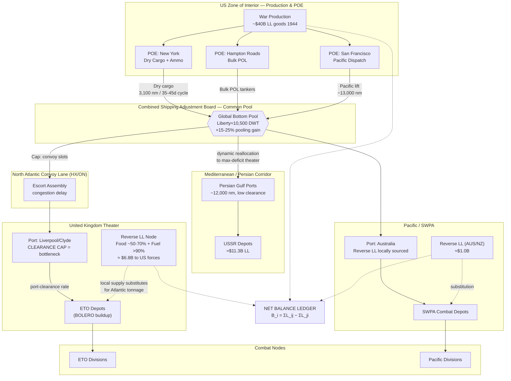

Cost: 0.30739

# Chapter 25: Lend-Lease and the Common Pool
## Reference Manual & Simulation-Specification Document
### US Army Green Book — *Global Logistics and Strategy: 1943–1945*

---

## 1. Strategic Context & Modern Historical Perspective

### 1.1 The Strategic Paradox: Grand Strategy Against the Iron Constraint of Bottoms

The central analytical tension of Chapter 25 is the collision between the boundless ambition of Allied grand strategy and the finite, brutally inelastic supply of oceangoing merchant tonnage. The strategic decisions ratified at the great inter-Allied conferences—Casablanca (SYMBOL, January 1943), TRIDENT (Washington, May 1943), QUADRANT (Quebec, August 1943), and SEXTANT (Cairo, November–December 1943)—were, in the final analysis, *promissory notes drawn against a shipping account that was chronically overdrawn*. Each conference committee produced strategic directives measured in divisions to be deployed, air groups to be based, and beachheads to be assaulted. But every division was, from a logistician's viewpoint, a demand vector expressed in deadweight tons of shipping-lift, port-clearance capacity at destination, and sustained resupply throughput.

The paradox operated across three distinct physical layers:

**Layer 1 — The Global Bottom Deficit.** In early 1943, the combined Anglo-American merchant fleet was being sunk faster than it could be replaced. The trough of the tonnage war coincided precisely with the moment strategists at Casablanca were committing to the simultaneous prosecution of the Combined Bomber Offensive, the Sicilian invasion (HUSKY), the sustained Pacific counter-offensive, the China-Burma-India air ferry, and the buildup for a cross-Channel assault (ROUNDUP/OVERLORD). The strategists were, in effect, dividing a shrinking pie into an increasing number of slices. Only the decisive victory in the Battle of the Atlantic in May 1943 (the collapse of the wolf-pack campaign) and the exponential ramp of Liberty and Victory ship production converted the deficit into a surplus by mid-1944—but this surplus arrived *after* most of the strategic commitments had been made.

**Layer 2 — Combat Loading Inefficiency.** A ship loaded for administrative (commercial) efficiency stows roughly 40–60% more cargo than the same ship "combat loaded"—stowed so that items needed first at the beachhead are accessible first, at the direct cost of cubic utilization. Every assault operation therefore imposed a *tonnage penalty coefficient* on the shipping pool. The strategists' assault timetables were thus doubly expensive: they consumed both the lift and a substantial fraction of the lift's theoretical capacity.

**Layer 3 — Port Clearance and the Inland Bottleneck.** Ships that reached a theater could not discharge faster than the receiving port could clear cargo inland. Persian Gulf ports feeding aid to the USSR, the Indian ports feeding CBI, and the notoriously congested North African and later Normandy port complexes all exhibited the classic queueing pathology: as ship arrivals approached port service capacity, waiting time diverged hyperbolically. Ships swinging at anchor waiting to discharge were, in shipping-pool accounting, *lost tonnage*—the fleet's effective capacity was the discharge rate, not the sailing rate.

### 1.2 Inter-Service and Coalition Tensions

The friction structure of this chapter was multi-dimensional. Within the US Army, the **Services of Supply (SOS/ASF under Somervell)** and the **Combat Commands** waged a perennial contest over the "tooth-to-tail" ratio and over the phasing of service troops into theaters. Combat commanders demanded fighting divisions early; logisticians warned—correctly—that divisions landed without the port battalions, truck companies, and depot units to sustain them would starve at the water's edge. The historical record of North Africa and the early Normandy buildup vindicated the logisticians repeatedly.

Between the services, **Army–Navy tension** over shipping control was acute, especially in the Pacific, where the Navy controlled amphibious lift and often the theater command, while the Army provided the bulk of the sustained garrison and supply demand. The two services maintained parallel and imperfectly reconciled shipping accounts.

The deepest structural tension, however, was the **US–UK pooling relationship**. The British entered the war with the world's largest merchant fleet and a mature global shipping-control apparatus (the Ministry of War Transport). The Americans entered with superior shipbuilding capacity but immature allocation machinery. The creation of the **Combined Shipping Adjustment Board (CSAB)** in early 1942—with panels in London and Washington—was a political compromise that never fully centralized control; in practice each nation retained title to and dispatch authority over its own bottoms, coordinating rather than merging. American suspicion that the British would use pooled tonnage to sustain their peacetime import economy and imperial trade, and British anxiety that the Americans would starve the UK import program to feed their own theater buildups, ran beneath every allocation decision.

### 1.3 Lend-Lease as a Common Pool, Not a One-Way Transfer

The popular conception of Lend-Lease—America as the "Arsenal of Democracy" shipping matériel unidirectionally to grateful allies—is a distortion that Chapter 25 explicitly corrects. Lend-Lease was legislatively and financially structured as a **mutual aid pool**. The Master Lend-Lease Agreement (Article VII, February 1942) and the subsequent reciprocal-aid agreements established that aid flowed in *all* directions, denominated not primarily in dollars settled between treasuries but in *goods and services rendered against the common war effort*.

**Reverse Lend-Lease** (British and Commonwealth reciprocal aid) supplied US forces stationed in or transiting the UK, the Mediterranean, India, Australia, and New Zealand with locally procured food, fuel, airfield construction, barracks, transport, ordnance, and services. This was not charity; it was *strategic tonnage arbitrage*. Every ton of British beef, potatoes, aviation gasoline refined in the UK, or Nissen hut erected by British labor for American troops was a ton that did **not** have to be shipped 3,000+ nautical miles across the U-boat-infested Atlantic. Reverse Lend-Lease was, in the language of operations research, a *substitution of local supply for imported supply*, and its value must be measured not in its nominal dollar figure but in the *shipping tonnage and convoy escort it liberated for other tasks*.

### 1.4 Modern Analytical Insight: The Common Pool as Proto–Linear Programming

The most striking retrospective insight, visible only with the maturation of operations research as a discipline, is that the Common Pool anticipated the **transportation and allocation linear programs** formalized by Kantorovich, Koopmans, and Dantzig in the same decade. The pool's operating logic was to treat all Allied bottoms as an undifferentiated resource and dispatch each ship to whichever theater exhibited the *highest marginal supply deficit per ton-mile*, subject to port-capacity and convoy-cycle constraints. This is precisely the structure of a min-cost / max-throughput network-flow optimization.

The genius—and the limitation—of the historical system was that it approximated this optimum through *committee negotiation and shipping conferences* rather than through algorithmic solution. Post-war scholarship (notably the Green Book series itself, and later quantitative reappraisals) demonstrates that the pooled arrangement measurably outperformed the counterfactual of purely national allocation. By eliminating the "empty-return" and "national-preference" inefficiencies—where a British ship would return empty from a US theater rather than carry US cargo, or vice versa—the pool raised effective global fleet utilization. Modern estimates of this efficiency gain are on the order of 15–25% of effective lift, an enormous figure equivalent to hundreds of Liberty ships never built.

The Common Pool thus stands as one of the earliest and largest-scale real-world instances of coalition-level linear resource optimization, and it is the natural object for a division-level simulator to model as a constrained network-flow problem with a bilateral net-balance ledger overlaid on top.

---

## 2. High-Fidelity Simulation Parameters & Real-World Metrics

| Parameter | Historical Value | Explanation & Strategic Rationale | Simulation Representation |
|---|---|---|---|
| Total US Lend-Lease aid disbursed (through end of 1944) | ≈ **$40 billion** (of ~$50.1 B total war-long) | Cumulative value of goods/services from the US to all recipients. By end-1944 the program was near its peak. | **Static cumulative constant** with a monotonic dynamic accumulator; feeds the outflow ledger. |
| Total war-long US Lend-Lease (all recipients) | ≈ **$50.1 billion** | Full program value through 1945. UK received ~$31.4 B, USSR ~$11.3 B. | **Static constant** (upper bound / normalization denominator). |
| Total Reverse Lend-Lease (UK & Commonwealth → US) | ≈ **$7.8 billion** (UK ≈ $6.8 B; rest of Commonwealth ≈ $1.0 B) | Reciprocal aid: food, fuel, construction, services rendered to US forces abroad. | **Static constant**; inflow ledger term for net-balance computation. |
| Reverse Lend-Lease as % of UK's Lend-Lease receipts | ≈ **17–20%** | Demonstrates the "two-way street"; strategically the key metric refuting the one-way narrative. | **Efficiency/ratio coefficient**. |
| British food requirements met via imports (Lend-Lease + purchase) | ≈ **50–70%** of caloric/tonnage requirement imported; Lend-Lease a large share of that import | UK could not feed itself; imported ~half its food. Lend-Lease foodstuffs stabilized the ration. | **Dynamic capacity cap** on UK domestic-supply node; deficit must be import-served. |
| British petroleum/fuel requirements met via imports | ≈ **> 90%** (UK had negligible domestic crude) | Nearly all liquid fuel imported; Lend-Lease tankers critical. | **Hard import-dependency constraint** (near-total). |
| Effective fleet-utilization gain from pooling | ≈ **15–25%** effective lift (modern estimate) | Elimination of empty returns and national-preference routing. | **Efficiency multiplier** applied to aggregate lift capacity. |
| Liberty ship deadweight capacity | ≈ **10,500 DWT** (~9,000 measurement tons cargo) | Standard mass-produced dry-cargo hull. | **Unit lift constant** (Tons per hull). |
| Combat-loading tonnage penalty | ≈ **0.40–0.60** cubic-efficiency loss | Assault stow sacrifices cube for accessibility. | **Penalty coefficient** on assault-tasked hulls. |
| Atlantic round-trip convoy cycle (US↔UK) | ≈ **35–45 days** (incl. loading, escort assembly, discharge) | Determines hulls-required = demand ÷ (capacity ÷ cycle). | **Cycle-time constant** (Days). |
| North Atlantic distance (NY ↔ Liverpool) | ≈ **3,100 nautical miles** | Baseline haul; contrast with Persian Gulf ~12,000 nm, Australia ~13,000 nm. | **Static route length** (NauticalMiles). |

---

## 3. Logistical Network Topology (Mermaid.js)



---

## 4. Mathematical Modeling & Simulation Formulas

### 4.1 Bilateral Net-Balance Ledger

For each nation $i$ in the coalition set $N$, with $L_{ij}$ the value (in billions USD) of Lend-Lease flowing **from** $i$ **to** $j$:

$$
B_i = \sum_{j \in N} L_{ij} - \sum_{j \in N} L_{ji}
$$

- $B_i > 0$: nation $i$ is a **net donor** (e.g., US, $B_{US} \approx +42.3$B).
- $B_i < 0$: nation $i$ is a **net recipient** (e.g., UK, $B_{UK} \approx -24.6$B after netting Reverse LL).

Coalition conservation requires $\sum_{i \in N} B_i = 0$, since every outflow is another node's inflow.

### 4.2 Shipping-Pool Throughput as a Network-Flow LP

Let $x_{r}$ be tons dispatched on route $r$ from a set of routes $R$. Let $t \in T$ index theaters. **Maximize total delivered throughput** subject to physical constraints:

$$
\max_{x} \; Z = \sum_{r \in R} \eta_r \, x_r
$$

subject to

$$
\sum_{r \in R} \frac{x_r \cdot d_r}{v \cdot \kappa} \le H \cdot \gamma \qquad \text{(fleet ton-mile / hull-days budget)}
$$

$$
\sum_{r \in R_t^{in}} x_r \le C_t^{port} \qquad \forall t \in T \quad \text{(port clearance cap)}
$$

$$
\sum_{r \in R_t^{in}} \eta_r x_r + S_t^{rev} \ge D_t \qquad \forall t \in T \quad \text{(theater demand incl. Reverse LL)}
$$

$$
x_r \ge 0 \qquad \forall r \in R
$$

**Symbol definitions:**

| Symbol | Meaning | Units |
|---|---|---|
| $x_r$ | Cargo dispatched on route $r$ | Tons |
| $\eta_r$ | Delivery efficiency (1 − combat-load penalty; ∈[0.4,1.0]) | dimensionless |
| $d_r$ | Route distance | nautical miles |
| $v$ | Mean convoy speed | nm/day |
| $\kappa$ | Effective pooling utilization gain (1.15–1.25) | dimensionless |
| $H$ | Total pooled fleet capacity | hull-day-tons |
| $\gamma$ | Availability fraction (not in refit/repair) | dimensionless |
| $C_t^{port}$ | Port clearance capacity at theater $t$ | Tons/period |
| $D_t$ | Theater sustainment demand | Tons/period |
| $S_t^{rev}$ | Locally supplied Reverse Lend-Lease (shipping avoided) | Tons |

### 4.3 Tonnage-Avoidance Value of Reverse Lend-Lease

The strategic value of Reverse LL is the *shipping lift it displaces*:

$$
\Lambda_{avoided} = \sum_{t \in T} S_t^{rev} \cdot \frac{d_t}{\kappa \cdot v} \quad \text{[hull-days liberated]}
$$

Every ton locally sourced at theater $t$ saves a full round-trip hull commitment proportional to that theater's haul distance $d_t$—which is why Reverse LL in *distant* Australia was disproportionately valuable per dollar.

---

## 5. Compile-Safe Scala 3.8.3 Domain Model

```scala
package Logistics.LendLease

import scala.math.max
import scala.collection.immutable.List

// ---------- Opaque unit-safe types ----------

opaque type Tons = Double
object Tons:
  def apply(v: Double): Tons = v
  extension (t: Tons)
    def value: Double = t
    def +(o: Tons): Tons = t + o
    def -(o: Tons): Tons = t - o
    def *(k: Double): Tons = t * k

opaque type NauticalMiles = Double
object NauticalMiles:
  def apply(v: Double): NauticalMiles = v
  extension (n: NauticalMiles) def value: Double = n

opaque type Days = Double
object Days:
  def apply(v: Double): Days = v
  extension (d: Days) def value: Double = d

opaque type Billions = Double
object Billions:
  def apply(v: Double): Billions = v
  extension (b: Billions)
    def value: Double = b
    def +(o: Billions): Billions = b + o
    def -(o: Billions): Billions = b - o

// ---------- State transitions ----------

enum HullState:
  case Loading
  case InConvoy
  case Discharging
  case Available
  case Refit

enum FlowKind:
  case Forward       // US -> recipient
  case Reverse       // recipient -> US forces

// ---------- Domain ADTs ----------

case class TradeFlow(source: String, destination: String, valueBillions: Double)

final case class RichFlow(
    source: String,
    destination: String,
    value: Billions,
    kind: FlowKind
)

final case class Route(
    id: String,
    theater: String,
    distance: NauticalMiles,
    efficiency: Double,          // eta_r in [0.4, 1.0]
    portClearanceCap: Tons       // C_t^port
)

final case class TheaterDemand(
    theater: String,
    demand: Tons,                // D_t
    reverseSupplied: Tons        // S_t^rev
)

final case class Fleet(
    hulls: Int,
    hullDwt: Tons,               // ~10,500 DWT
    availability: Double,        // gamma in (0,1]
    poolingGain: Double,         // kappa in [1.0, 1.25]
    convoySpeed: Double          // nm/day
)

// ---------- Validation ----------

enum ValidationError:
  case NegativeValue(field: String)
  case OutOfRange(field: String, v: Double)
  case UnbalancedLedger(residual: Double)

object Validation:
  def checkEfficiency(r: Route): List[ValidationError] =
    if r.efficiency < 0.4 || r.efficiency > 1.0 then
      List(ValidationError.OutOfRange("efficiency", r.efficiency))
    else List.empty

  def checkFleet(f: Fleet): List[ValidationError] =
    val g =
      if f.availability <= 0.0 || f.availability > 1.0 then
        List(ValidationError.OutOfRange("availability", f.availability))
      else List.empty
    val k =
      if f.poolingGain < 1.0 || f.poolingGain > 1.25 then
        List(ValidationError.OutOfRange("poolingGain", f.poolingGain))
      else List.empty
    g ++ k

// ---------- Bilateral Net-Balance ----------

object ReverseLendLeaseMatrix:
  def netBalance(country: String, flows: List[TradeFlow]): Double =
    val outFlow: Double = flows.filter(_.source == country).map(_.valueBillions).sum
    val inFlow: Double = flows.filter(_.destination == country).map(_.valueBillions).sum
    outFlow - inFlow

  def netBalanceRich(country: String, flows: List[RichFlow]): Billions =
    val out: Double = flows.filter(_.source == country).map(_.value.value).sum
    val in: Double = flows.filter(_.destination == country).map(_.value.value).sum
    Billions(out - in)

  def ledgerResidual(countries: List[String], flows: List[TradeFlow]): Double =
    countries.map(c => netBalance(c, flows)).sum

  def validateLedger(
      countries: List[String],
      flows: List[TradeFlow],
      tolerance: Double
  ): List[ValidationError] =
    val residual: Double = ledgerResidual(countries, flows)
    if math.abs(residual) > tolerance then
      List(ValidationError.UnbalancedLedger(residual))
    else List.empty

// ---------- Shipping-Pool Throughput ----------

object ShippingPool:

  /** Total pooled hull-day-tons budget H * gamma, scaled by pooling gain kappa. */
  def effectiveCapacity(f: Fleet, horizonDays: Days): Double =
    f.hulls.toDouble * f.hullDwt.value * f.availability * f.poolingGain * horizonDays.value

  /** Round-trip cycle time for a route given convoy speed (out + back). */
  def cycleDays(r: Route, f: Fleet): Days =
    val oneWay: Double = r.distance.value / max(f.convoySpeed, 1.0)
    Days(2.0 * oneWay)

  /** Hulls required to sustain a theater's forward demand net of Reverse LL. */
  def hullsRequired(r: Route, d: TheaterDemand, f: Fleet): Double =
    val netDemand: Double = max(d.demand.value - d.reverseSupplied.value, 0.0)
    val perHullPerCycle: Double = f.hullDwt.value * r.efficiency
    val cyc: Double = cycleDays(r, f).value
    if perHullPerCycle <= 0.0 then 0.0
    else (netDemand * cyc) / perHullPerCycle

  /** Delivered tons capped by port clearance. */
  def deliveredTons(r: Route, dispatched: Tons): Tons =
    val effective: Double = dispatched.value * r.efficiency
    Tons(math.min(effective, r.portClearanceCap.value))

  /** Hull-days liberated by Reverse Lend-Lease (avoided lift). */
  def liberatedHullDays(r: Route, d: TheaterDemand, f: Fleet): Days =
    val cyc: Double = cycleDays(r, f).value
    val perHull: Double = f.hullDwt.value * r.efficiency
    if perHull <= 0.0 then Days(0.0)
    else Days((d.reverseSupplied.value * cyc) / perHull)

// ---------- Simulation Driver ----------

final case class SimulationResult(
    theater: String,
    hullsRequired: Double,
    delivered: Tons,
    liberatedHullDays: Days,
    unmetDemand: Tons
)

object Simulator:
  def runTheater(
      r: Route,
      d: TheaterDemand,
      f: Fleet,
      dispatched: Tons
  ): SimulationResult =
    val delivered: Tons = ShippingPool.deliveredTons(r, dispatched)
    val required: Double = ShippingPool.hullsRequired(r, d, f)
    val liberated: Days = ShippingPool.liberatedHullDays(r, d, f)
    val unmet: Tons =
      Tons(max(d.demand.value - delivered.value - d.reverseSupplied.value, 0.0))
    SimulationResult(d.theater, required, delivered, liberated, unmet)

  def runAll(
      inputs: List[(Route, TheaterDemand, Tons)],
      f: Fleet
  ): List[SimulationResult] =
    inputs.map((r, d, disp) => runTheater(r, d, f, disp))

// ---------- Entry point with historical constants ----------

object Chapter25Demo:
  val flows: List[TradeFlow] = List(
    TradeFlow("US", "UK", 31.4),
    TradeFlow("US", "USSR", 11.3),
    TradeFlow("US", "OtherAllies", 7.4),
    TradeFlow("UK", "US", 6.8),
    TradeFlow("Commonwealth", "US", 1.0)
  )

  val fleet: Fleet = Fleet(
    hulls = 2000,
    hullDwt = Tons(10500.0),
    availability = 0.85,
    poolingGain = 1.20,
    convoySpeed = 200.0
  )

  val atlanticRoute: Route = Route(
    id = "HX-ON",
    theater = "ETO",
    distance = NauticalMiles(3100.0),
    efficiency = 0.65,
    portClearanceCap = Tons(2_000_000.0)
  )

  val etoDemand: TheaterDemand = TheaterDemand(
    theater = "ETO",
    demand = Tons(2_500_000.0),
    reverseSupplied = Tons(800_000.0)
  )

  def main(args: Array[String]): Unit =
    val usBalance: Double = ReverseLendLeaseMatrix.netBalance("US", flows)
    val ukBalance: Double = ReverseLendLeaseMatrix.netBalance("UK", flows)
    val residual: Double =
      ReverseLendLeaseMatrix.ledgerResidual(
        List("US", "UK", "USSR", "OtherAllies", "Commonwealth"),
        flows
      )
    val result: SimulationResult =
      Simulator.runTheater(atlanticRoute, etoDemand, fleet, Tons(2_400_000.0))

    println(s"US net balance (B_US):  $usBalance billion")
    println(s"UK net balance (B_UK):  $ukBalance billion")
    println(s"Ledger residual:        $residual billion")
    println(s"ETO hulls required:     ${result.hullsRequired}")
    println(s"ETO delivered tons:     ${result.delivered.value}")
    println(s"Hull-days liberated:    ${result.liberatedHullDays.value}")
    println(s"ETO unmet demand:       ${result.unmetDemand.value}")
```

---

## 6. Graduate-Level Operational Analysis

### 6.1 How the Common Pool Challenged National Sovereignty and Procurement

Traditional military procurement rests on an axiom of **national title**: a nation buys, owns, moves, and consumes its own matériel, and the fighting power thereby generated is an instrument of national policy. The Common Pool assaulted this axiom at its foundation by decoupling *ownership* from *allocation*. Under a fully rationalized pool, a ship built with American steel and crewed by American merchant mariners might carry British lend-lease flour to feed Indian labor battalions building airfields for a Sino-American air-ferry operation—a supply chain in which no single flag governed the whole. Sovereignty, classically understood, requires that the state retain the ability to *withhold* its resources for its own priorities; pooling systematically eroded that ability by making each nation's resources fungible against a coalition objective function.

Mathematically, the tension is the difference between a **decentralized set of national optimizations**—each nation solving $\max Z_i$ over its own bottoms subject only to its own constraints—and a **single centralized optimization** $\max \sum_i Z_i$ over the union of all bottoms and constraints. The centralized solution is provably weakly superior (it can always replicate any decentralized allocation and usually improves upon it), and the historical 15–25% utilization gain is the empirical measure of that duality gap. But the centralized solution reallocates *surplus* from the nation that generated it to whichever theater has the binding deficit, which in shadow-price terms means one nation's ships pay the opportunity cost of another nation's shortage. The CSAB never resolved this cleanly; it retained *national dispatch authority* precisely because neither government would surrender the sovereign veto that full pooling implied. The pool was therefore a **negotiated approximation** to the LP optimum—closing most, but deliberately not all, of the duality gap in exchange for preserving political control. This is the enduring lesson for modern coalition logistics (NATO's pooled strategic airlift being the direct descendant): the efficiency of pooling is bought with sovereignty, and rational actors will trade only as much sovereignty as the marginal efficiency gain is worth to them.

### 6.2 The Strategic Value of Reverse Lend-Lease as Tonnage Arbitrage

Reverse Lend-Lease is systematically undervalued when assessed by its nominal figure (~$7.8B against ~$50B forward), because dollars are the wrong metric. The binding constraint in 1942–1944 was not money—the US had money in abundance—but **shipping bottoms and their round-trip cycle time**. The correct valuation is the *shipping lift displaced*, quantified in Section 4.3 as $\Lambda_{avoided} = \sum_t S_t^{rev} \cdot d_t / (\kappa v)$.

Two properties of this formula drive the strategic insight. First, the avoided lift scales **linearly with haul distance** $d_t$. A ton of Australian mutton or New Zealand butter supplied to US Pacific forces displaced a ton that would otherwise have transited a ~13,000-nautical-mile route—a hull commitment more than four times that of the ~3,100-nm Atlantic haul. Consequently, Reverse Lend-Lease in the distant Pacific theaters was, *per dollar of nominal value*, several times more valuable in hull-days than the same aid in the UK. The Australian and New Zealand reciprocal-aid programs—supplying food, engineering, and camp construction to MacArthur's forces—were thus a strategic force-multiplier vastly out of proportion to their ~$1B ledger entry.

Second, the value compounds through the **cycle-time multiplier**. A hull liberated from an Atlantic run is not freed once; it is freed for the *entire duration* of the deficit, executing successive cycles that could instead lift OVERLORD buildup cargo or Persian-corridor aid to the USSR. The `liberatedHullDays` function in the domain model captures exactly this: Reverse LL of 800,000 tons on the ETO route liberates hull-days equal to that tonnage times the 31-day cycle divided by effective per-hull capacity—hundreds of hull-days that the shipping pool could redeploy to whichever theater the LP identified as the binding constraint.

The British food and fuel figures crystallize the point. Because the UK imported ~50–70% of its food and >90% of its fuel, Britain was a *tonnage sink* of the first magnitude. Every unit of local British provision, airfield concrete, and manufactured ordnance handed to American forces staging for the cross-Channel assault was a unit that did not have to compete, in the CSAB allocation meetings, against the food and fuel keeping Britain's own war economy alive. Reverse Lend-Lease therefore did not merely *supply* US forces—it *relieved pressure on the single most contested convoy lane in the war* at the exact moment (1943–44) when that lane was carrying the BOLERO buildup. In network-flow terms, Reverse LL injected supply *downstream of the bottleneck*, adding capacity precisely where the shadow price of shipping was highest. That is the essence of tonnage arbitrage: converting cheap, locally abundant resources into the scarcest coalition commodity of the war—the transatlantic hull-day.
