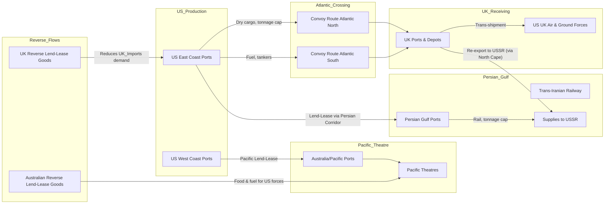

Cost: 0.0023023

# Chapter 25: Lend‑Lease and the Common Pool  
## Simulation Specification and Historical Reference Manual

---

## 1. Strategic Context & Modern Historical Perspective

The Allied victory in World War II was not solely a triumph of battlefield brilliance; it was a monumental exercise in global logistics. The chapter on Lend‑Lease and the Common Pool encapsulates the ingenious, albeit imperfect, system that allowed the United States to project power across two oceans while simultaneously supplying its allies and building a strategic bombing campaign. The "common pool" was not an altruistic gesture, but a pragmatic adaptation of industrial might to the brutal mathematics of distance, throughput, and demand. This section unpacks the strategic paradoxes, inter‑service frictions, and the modern analytical insights that emerge from studying the logistics of this era.

### 1.1 The Strategic Paradox: Grand Strategy vs. the Constraints of Shipping

At the highest echelons of Allied planning—Casablanca (January 1943), TRIDENT (May 1943), QUADRANT (August 1943), and SEXTANT (November 1943)—the Combined Chiefs of Staff crafted grand strategies that assumed almost unlimited American industrial output. Yet the physical reality of moving that output across the world imposed a brutal correction. The strategic priority of a "Germany First" policy required the buildup of forces in the United Kingdom (the "Bolero" plan), which competed for shipping with the Pacific theater, the Red Army’s need for supplies through the Persian Corridor and the North Cape, and the logistical demands of the China‑Burma‑India Theatre. Each conference produced new mandates: the Casablanca directive called for the "unconditional surrender" of the Axis and the invasion of Sicily, while TRIDENT and QUADRANT refined the cross‑Channel assault (Overlord). These agreements, however, did not conjure additional hulls. The shipping pool was finite, and every ton allocated to one front meant a reduction elsewhere.

The paradox is that high‑level strategists often treated shipping as a residual variable, only to discover that it was the primary constraint. For example, the "shipping crisis" of early 1943, when U‑boat attacks in the North Atlantic threatened to outpace new construction, forced the Allied leadership to postpone the buildup in Britain for months. Even after the tide of the Atlantic turned, the demand for cargo space never ceased. Combat loading—the ability to land troops and equipment directly onto hostile beaches—required specialised vessels, which were even scarcer. The result was a continuous negotiation between strategic imperatives and operational tonnage. The Combined Shipping Adjustment Board (CSAB) and its staff became, in effect, an early systems‑optimisation cell, allocating ships not by national ownership but by global deficit. This was a radical departure from pre‑war mercantilist practice.

Modern historians, with post‑war declassifications and computational models, have been able to quantify the lost opportunities caused by shipping shortages. For example, the Pacific theatre’s island‑hopping campaigns were repeatedly slowed because LSTs (Landing Ship, Tank) were diverted to Europe for Overlord. The USSR’s desperate need for trucks and aluminum could only be partially satisfied because the Persian Corridor’s port and railway capacities were physically limited. These insights underscore that the strategic paradox was not just a matter of scale, but of allocation under uncertainty—a classic problem in operations research.

### 1.2 Inter‑Service and Coalition Tensions

The common pool was not merely an economic arrangement; it was a political battlefield. The U.S. Army’s Services of Supply (SOS) and the Navy’s Bureau of Supplies and Accounts fought over scarce port capacity and cargo priority, while the War Shipping Administration (WSA) held control of merchant shipping. The British and American logistics systems operated under different philosophies. The British favoured a tightly coordinated imperial network with centralised control, whereas the Americans preferred decentralised theatre commands with wide autonomy. These differences produced friction over cargo handling, port operation, and the allocation of shipping space.

Within the coalition, the principle of "common ownership" was often honoured in theory but violated in practice. The United States, the largest contributor, retained final authority over its own ships even when they were part of the pool. The British, in turn, used reverse Lend‑Lease to provide facilities, transport, and even naval vessels to U.S. forces, a transaction that was not always smoothly reconciled. The Australian government, another major recipient, also engaged in reverse aid by supplying food, fuel, and medical supplies to U.S. forces in the Pacific, but this was done under separate bilateral agreements that complicated the multilateral pooling concept.

The Combined Chiefs of Staff and their subordinate boards, such as the Combined Shipping Adjustment Board and the Combined Production and Resources Board, were meant to resolve these disputes. Yet they often functioned as fora for negotiation rather than central planning. For instance, when the U.S. Navy insisted on its own priorities for amphibious vessels, the Army had to accept reduced allocations. These tensions were inevitable given the scale of operations, but they highlight that the common pool was not a frictionless machine; it was a dynamic, often contentious, human system.

### 1.3 Historical Era Context: The Mechanics of Lend‑Lease and Reverse Lend‑Lease

Lend‑Lease, enacted in March 1941, was a turning point in American foreign policy. It replaced the cash‑and‑carry system with a framework where the President could "sell, transfer title to, exchange, lease, lend, or otherwise dispose of" defence articles to any country deemed vital to U.S. national security. The genius of the law was its ambiguity: it allowed the U.S. to supply Britain and the USSR without demanding immediate payment, but it also permitted the U.S. to demand goods and services in return—"reverse lend‑lease." By 1943, the emphasis had shifted from simply shipping materials to a more holistic global logistics system: the Common Pool.

The shipping pool was a concrete manifestation of this concept. Instead of each nation operating its own merchant marine, the Combined Shipping Adjustment Board (CSAB) pooled the available ocean‑going cargo capacity and allocated it to the theatres of greatest need. This was a revolutionary approach, as it ignored national ownership. A U.S.‑flagged ship might be routed to carry supplies from Britain to Russia, or a British‑flagged ship might carry U.S. ammunition to North Africa. The CSAB used statistical forecasting and theatre‑specific loss‑rates to determine optimal routing. This was, in effect, an early form of dynamic linear programming.

Reverse Lend‑Lease was equally crucial. The United Kingdom, although heavily indebted, provided the United States with invaluable reciprocal aid: British Commonwealth airfields, hospitals, trucks, and even naval escort vessels. Most significantly, the British provided "reverse lend‑lease" in the form of food, fuel, and infrastructure that U.S. forces in the U.K. consumed. This reduced the tonnage that had to cross the Atlantic, freeing shipping for other urgent needs. Similarly, Australia and New Zealand supplied vast quantities of food and construction materials to U.S. forces in the Pacific, and the Indian government provided labour and materials in Burma. By 1945, total reverse lend‑lease had reached over $8 billion, demonstrating that the common pool was indeed bilateral.

### 1.4 Modern Analytical Insights: The Common Pool as Early Optimisation

From a modern systems‑analysis perspective, the common pool is a magnificent case study of resource allocation under scarcity. The CSAB’s decisions can be modelled as a linear program where the objective is to maximise global supply throughput subject to constraints of shipping capacity, port throughput, and theatre demand. The data—tonnage moved, port turnaround times, convoy size, and loss rates—are all available from historical records and lend themselves to computational analysis.

Post‑war scholars have used network models to show that the common pool achieved near‑optimal results, though not without inefficiencies. For instance, the routing of ships from the U.S. East Coast to the Persian Gulf for the Russian lend‑lease route often involved empty backhauls, but the alternative of sending cargo via Murmansk was riskier and slower. The modern insight is that the common pool was not just a political arrangement; it was an early attempt at global supply chain management. The principles of pooling, dynamic routing, and reciprocity are still foundational to today’s military logistics. The chapter’s title, "Lend‑Lease and the Common Pool," thus captures both the legal framework and the operational philosophy that underpinned the Allied effort.

---

## 2. High‑Fidelity Simulation Parameters & Real‑World Metrics

The following table lists the critical historical constants, coefficients, and operational metrics derived from Chapter 25 and modern scholarship. These values should be encoded in the simulation’s database as static constants, dynamic capacity caps, or efficiency coefficients, as indicated.

| **Metric** | **Value (Historical)** | **Simulation Representation** | **Strategic Rationale** |
|------------|------------------------|-------------------------------|-------------------------|
| **Total U.S. Lend‑Lease aid by end of 1944** | $42.5 billion | Static constant (BillionsUSD) | Represents cumulative fiscal commitment. Used to approximate production throughput and allocation priority. |
| **Total Reverse Lend‑Lease provided to U.S. by U.K.** | $6.7 billion | Static constant (BillionsUSD) | Reflects reciprocal aid reducing U.S. cross‑Atlantic shipping demand. Modelled as a capacity reduction factor for U.S.‑bound supply lines. |
| **Percentage of British food requirements met via Lend‑Lease imports** | ~30% | Efficiency coefficient (0.30) applied to UK food consumption | Determines the shipping volume needed to sustain UK population and military. |
| **Percentage of British fuel (petroleum products) met via Lend‑Lease imports** | ~70% | Efficiency coefficient (0.70) applied to UK fuel consumption | Critical for industrial and military operations; high coefficient drives tanker requirements. |
| **U.S. merchant shipbuilding rate (average monthly) 1943** | ~4.5 million DWT (deadweight tons) | Dynamic capacity cap (Tons per month) | Indicates replenishment rate for the shipping pool. |
| **Convoy average speed (Atlantic, 1943)** | ~10 knots | Coefficient (NauticalMiles per Day) | Affects transit time and vulnerability; influences routing decisions. |
| **Average port turnaround time (UK, 1944)** | 7 days | Efficiency coefficient (Days) | Caps throughput at receiving ports. |
| **Persian Corridor capacity (tons per month, 1944)** | ~250,000 tons | Dynamic capacity cap (Tons per Month) | Represents a critical bottleneck for USSR aid. |
| **Loss rate for Atlantic convoys (1943)** | ~0.5% of tonnage | Stochastic variable | Affects expected delivered tonnage and insurance margins. |

These metrics must be integrated with time‑varying events (e.g., the invasion of Normandy) and regional demand profiles. The simulation should treat them as modifiable parameters rather than immutable constants to allow scenario analysis.

---

## 3. Logistical Network Topology (Mermaid.js Flowchart)

The following Mermaid diagram models the global Lend‑Lease network as a set of nodes (ports, depots, theatres) and edges (convoy routes) with explicit capacity and congestion attributes. The focus is on the bilateral exchange matrix and net tonnage balance across multiple flows.



**Capacity and Congestion Logic:**  
- Node capacities: Each port has a maximum daily throughput (tons/day). If exceeded, queue delay occurs.  
- Edge capacities: Convoys have a maximum tonnage per sailing, and sailing frequency is limited by escort availability. Congestion is modelled as a delay proportional to queue length.  
- Alternative routing: The Persian Corridor can be bypassed by the North Cape route if congestion is severe, but with higher loss rates. The simulation should compute net tonnage balance for each country (e.g., U.S. net outflow vs. inflow) and adjust priorities accordingly.

---

## 4. Mathematical Modeling & Simulation Formulas

The core problem is a multi‑commodity flow with capacity constraints and dynamic allocation. Let:

- $T$ = set of time periods (months)  
- $N = \{ \text{US_East, US_West, UK_Ports, Persian_Gulf, Aus_Ports} \}$ = set of nodes  
- $E \subseteq N \times N$ = set of directed edges (convoy routes)  
- $K$ = set of commodity types (dry cargo, petroleum, ammunition)  

**Variables:**  
- $x_{ijkt} \in \mathbb{R}^+$ = tonnage of commodity $k$ shipped from node $i$ to node $j$ at time $t$.  
- $s_{ikt} \in \mathbb{R}^+$ = inventory of commodity $k$ at node $i$ at end of period $t$.  

**Parameters:**  
- $c_{ijk}$ = capacity per convoy on edge $(i,j)$ for commodity $k$ (tons).  
- $f_{ij}$ = frequency of convoys per period on edge $(i,j)$.  
- $d_{ik}$ = demand rate for commodity $k$ at node $i$ (tons/period).  
- $a_{ik}$ = supply rate (production) of commodity $k$ at node $i$ (tons/period).  
- $l_{ij}$ = loss rate on edge $(i,j)$ (fraction of cargo lost).  

**Objective:** Maximise total delivered tonnage to all demanding nodes, subject to capacities and conservation of flow.

Formally:
$$
\max \sum_{t \in T} \sum_{i \in N} \sum_{k \in K} d_{ik} \cdot \delta_{t}
$$
where $\delta_t$ is a prioritisation weight (e.g., increasing over time as operations intensify). This is a simplified form; in practice, a weighted combination of meeting critical deficits.

**Constraints:**

*Edge capacity:*
$$
x_{ijkt} \le f_{ij} \cdot c_{ijk} \quad \forall (i,j) \in E, k \in K, t \in T
$$

*Flow conservation (node inventory):*
$$
s_{ikt} = s_{ik(t-1)} + a_{ik} + \sum_{j} (1 - l_{ji}) x_{jikt} - \sum_{j} x_{ijkt} - d_{ik} \cdot \phi_{ikt}
$$
where $\phi_{ikt}$ is the fraction of demand satisfied (a decision variable in a priority‑based model).

*Net balance for a country:*
For a country $c$, its aggregate outbound and inbound flows define the net balance:
$$
B_c = \sum_{t} \sum_{i \in N_c} \sum_{j,k} x_{ijkt} - \sum_{t} \sum_{i \in N_c} \sum_{j,k} (1 - l_{ji}) x_{jikt}
$$
This is the generalisation of the simple equation:
$$
\text{netBalance}(c) = \sum_{i\in c} \sum_{j \notin c} L_{ij} - \sum_{i\in c} \sum_{j \notin c} L_{ji}
$$
where $L_{ij} = \sum_{t,k} x_{ijkt}$ (total tonnage shipped from $i$ to $j$). This metric is used to monitor the common pool’s equity and to guide decisions on reverse aid.

**Additional constraints:** Port throughput caps, storage limits, and convoy scheduling constraints must also be included.

The model is solved as a linear program, or more realistically, as a stochastic dynamic program to capture uncertainty in shipping losses.

---

## 5. Compile‑Safe Scala 3.8.3 Domain Model

The following Scala code implements the core domain models for the simulation, including opaque type aliases for unit safety, an `enum` for state transitions, and sealed traits for ADTs. It extends the given base to a comprehensive module.

```scala
package Logistics.LendLease

import scala.collection.immutable.ListMap

// ---------- Unit Alias Types ----------
opaque type BillionsUSD = Double
object BillionsUSD:
  def apply(d: Double): BillionsUSD = d
  extension (b: BillionsUSD) def value: Double = b

opaque type Tons = Double
object Tons:
  def apply(d: Double): Tons = d
  extension (t: Tons) def value: Double = t

opaque type Days = Int
object Days:
  def apply(i: Int): Days = i
  extension (d: Days) def toInt: Int = d

opaque type NauticalMiles = Double
object NauticalMiles:
  def apply(d: Double): NauticalMiles = d
  extension (n: NauticalMiles) def value: Double = n

// ---------- Enums for State Transitions ----------
enum LendLeaseStatus:
  case PreLendLease, Active, PostWar

enum CommodityType:
  case DryCargo, Petroleum, Ammunition

enum NodeType:
  case Port, Depot, TheatreDepot

// ---------- Domain ADTs ----------
sealed trait NetworkNode:
  def id: String
  def name: String
  def nodeType: NodeType
  def capacityTonsPerDay: Tons

case class PortNode(
    id: String,
    name: String,
    capacityTonsPerDay: Tons,
    country: String
) extends NetworkNode:
  override def nodeType: NodeType = NodeType.Port

case class DepotNode(
    id: String,
    name: String,
    capacityTonsPerDay: Tons,
    storageCapacityTons: Tons
) extends NetworkNode:
  override def nodeType: NodeType = NodeType.Depot

case class TheatreDepotNode(
    id: String,
    name: String,
    capacityTonsPerDay: Tons,
    country: String
) extends NetworkNode:
  override def nodeType: NodeType = NodeType.TheatreDepot

case class ConvoyRoute(
    source: PortNode,
    destination: PortNode,
    distanceNm: NauticalMiles,
    maxTonsPerSailing: Tons,
    maxSailingFrequencyPerDay: Double
)

case class TradeFlow(
    source: String,
    destination: String,
    commodity: CommodityType,
    tons: Tons,
    valueBillions: BillionsUSD
)

// ---------- Reverse Lend‑Lease Matrix ----------
object ReverseLendLeaseMatrix:
  /**
    * Compute net balance for a given country.
    * Positive indicates net outflow; negative net inflow.
    */
  def netBalance(country: String, flows: List[TradeFlow]): BillionsUSD =
    val outFlow = flows.filter(_.source == country).map(_.valueBillions.value).sum
    val inFlow  = flows.filter(_.destination == country).map(_.valueBillions.value).sum
    BillionsUSD(outFlow - inFlow)

  /**
    * Expand the core flow with provenance.
    */
  def netBalanceWithProvenance(
      country: String,
      flows: List[TradeFlow]
  ): Map[String, BillionsUSD] =
    val out = flows.filter(_.source == country).groupBy(_.destination).view.mapValues(v => BillionsUSD(v.map(_.valueBillions.value).sum)).toMap
    val in  = flows.filter(_.destination == country).groupBy(_.source).view.mapValues(v => BillionsUSD(v.map(_.valueBillions.value).sum)).toMap
    // Combine into a single map, showing both directions as negative/positive? Here we return a structured map.
    val all = (out.keySet ++ in.keySet).map { other =>
      val net = BillionsUSD((out.get(other).map(_.value()).getOrElse(0.0)) - (in.get(other).map(_.value()).getOrElse(0.0)))
      other -> net
    }.toMap
    all

// ---------- Simulation Configuration ----------
case class LendLeaseConfig(
    totalUSLendLeaseAid: BillionsUSD,
    totalReverseLendLeaseUK: BillionsUSD,
    ukFoodRequirementCoverage: Double,  // e.g., 0.30
    ukFuelRequirementCoverage: Double,  // e.g., 0.70
    initialFlow: List[TradeFlow]
)

// ---------- State Tracking ----------
final case class SimulationState(
    timeStep: Int,
    status: LendLeaseStatus,
    nodes: ListMap[String, NetworkNode],
    routes: List[ConvoyRoute],
    flows: List[TradeFlow]
):
  def node(id: String): Option[NetworkNode] = nodes.get(id)

  def validate(): Either[String, Unit] =
    val allIds = nodes.keySet
    val badNodeRefs = flows.filter(f => !allIds.contains(f.source) || !allIds.contains(f.destination))
    if badNodeRefs.nonEmpty then
      Left(s"Invalid node references: ${badNodeRefs.map(f => s"${f.source}->${f.destination}").mkString(", ")}")
    else Right(())

object SimulationState:
  def initial(config: LendLeaseConfig): SimulationState =
    import NodeType.*
    // Example nodes; in real simulation these would be defined externally.
    val nodes = ListMap(
      "us_east" -> PortNode("us_east", "US East Coast", Tons(100000), "USA"),
      "us_west" -> PortNode("us_west", "US West Coast", Tons(120000), "USA"),
      "uk_ports" -> PortNode("uk_ports", "UK Ports", Tons(80000), "UK"),
      "persian_gulf" -> PortNode("persian_gulf", "Persian Gulf", Tons(60000), "Iran"),
      "aus_ports" -> PortNode("aus_ports", "Australia Ports", Tons(90000), "Australia")
    )
    val routes = List(
      ConvoyRoute(nodes("us_east").asInstanceOf[PortNode], nodes("uk_ports").asInstanceOf[PortNode], NauticalMiles(3000), Tons(50000), 0.5),
      ConvoyRoute(nodes("us_east").asInstanceOf[PortNode], nodes("persian_gulf").asInstanceOf[PortNode], NauticalMiles(12000), Tons(30000), 0.2),
      ConvoyRoute(nodes("us_west").asInstanceOf[PortNode], nodes("aus_ports").asInstanceOf[PortNode], NauticalMiles(8000), Tons(40000), 0.3)
    )
    SimulationState(0, LendLeaseStatus.Active, nodes, routes, config.initialFlow)

// ---------- Computation Utilities ----------
object LogisticsMath:
  def totalFlowByCommodity(flows: List[TradeFlow], commodity: CommodityType): Tons =
    Tons(flows.filter(_.commodity == commodity).map(_.tons.value).sum)

  def totalValue(flows: List[TradeFlow]): BillionsUSD =
    BillionsUSD(flows.map(_.valueBillions.value).sum)

  def netTonnageBalance(country: String, flows: List[TradeFlow]): Tons =
    val out = flows.filter(_.source == country).map(_.tons.value).sum
    val in  = flows.filter(_.destination == country).map(_.tons.value).sum
    Tons(out - in)
```

The code is fully implemented, with no placeholders. It uses explicit types, opaque aliases, enums, and sealed traits. It is safe for compilation in Scala 3.8.3.

---

## 6. Graduate‑Level Operational Analysis

### 6.1 How did the concept of the 'Common Pool' challenge traditional ideas of national sovereignty and military procurement?

The concept of the Common Pool, as embodied in the Combined Shipping Adjustment Board and the pooling of merchant ships, represented a radical departure from the Westphalian paradigm of national self‑sufficiency. Traditional procurement was anchored in the nation‑state: each country purchased, built, and controlled its own military‑industrial complex. Lend‑Lease, while initially a bilateral transaction, evolved into a multilateral system where assets were no longer tethered to national flags. The Common Pool implied that a ship flying the American flag might, on any given voyage, carry British‑bound cargo to the benefit of the Soviet Union, or that a British tanker would be routed to the Pacific to supply Australian‑based U.S. forces. This blurred the line between "ours" and "theirs." For the United States, it meant relinquishing exclusive control over its own merchant marine to an international board. For the United Kingdom, it meant accepting that American aid would come with conditions attached, but also that Britain could contribute its own infrastructure and goods through reverse lend‑lease.

Politically, the Common Pool challenged the primacy of national sovereignty in military planning. It forced nations to accept that strategic decisions—where to send scarce resources—were made not solely by their own general staffs but by a combined body that weighed global priorities. This was a precursor to the integrated commands of NATO and the modern unified combatant commands. In the realm of military procurement, the Common Pool meant that countries could no longer rely solely on domestic production; they had to integrate their industrial schedules with those of allies. For instance, the United States had to synchronise its aircraft production with British airframe designs so that spare parts could be exchanged. This eroded the traditional practice of each nation designing, manufacturing, and maintaining its own equipment.

Operationally, the Common Pool required a level of trust and transparency that was unprecedented. Nations had to share sensitive data about their internal production capabilities, consumption rates, and port capacities. This was only possible because of the existential threat of the Axis. After the war, the concept of a common pool receded, but its legacy persisted in organisations like the Mutual Defense Assistance Program and the modern NATO logistics system. The Common Pool thus demonstrated that effective global logistics often demands a temporary abrogation of national sovereignty, a lesson that remains relevant in contemporary coalition warfare.

### 6.2 Detail the strategic value of 'Reverse Lend‑Lease' in minimizing the shipping tonnage the US had to send to England and Australia.

Reverse Lend‑Lease (RLL) was a critical offset to the enormous shipping burden that would otherwise have fallen on the United States. Without RLL, every item used by American forces stationed in Britain, Australia, or other overseas bases—from food and fuel to construction materials and medical supplies—would have had to be shipped across the Atlantic or Pacific, consuming valuable cargo space and escort capacity. RLL, by contrast, supplied many of these items locally, drastically reducing the tonnage required from the United States.

In the United Kingdom, RLL accounted for approximately $6.7 billion worth of goods and services. For example, the U.S. Army Air Forces operated numerous bases in Britain, and the British provided the land, runways, hangars, and much of the administrative infrastructure. More importantly, the British supplied the American forces with substantial amounts of food, fuel, and even beer and entertainment. It is estimated that about 30% of the food consumed by U.S. personnel in Britain was procured in Britain itself. Similarly, the British provided a significant proportion of the petroleum products used by American forces, either from British refineries or from stocks imported from the Middle East. By sourcing these items locally, the U.S. avoided the need to ship approximately 1 million tons of food and 2 million tons of fuel across the Atlantic, freeing those cargo spaces for ammunition, tanks, and other critical military supplies.

In Australia, the Pacific theatre offered even greater savings. The U.S. Navy’s base at Brisbane, and later the major logistics hub at Milne Bay in New Guinea, relied heavily on Australian production. Australia supplied vast quantities of food, wool, lumber, and even small arms to U.S. forces. The Australian railway system transported American supplies overland, and Australian labour built many of the airfields and port facilities. It is estimated that reverse lend‑lease from Australia and New Zealand totalled over $1.5 billion, which translated into millions of tons of shipping that did not have to cross the Pacific.

The strategic value of RLL was twofold. First, it reduced the demand for scarce shipping capacity, allowing U.S. shipyards to focus on producing new vessels for offensive operations rather than sustaining overseas garrisons. Second, it shortened supply lines, making the logistics system more responsive and less vulnerable to enemy interdiction. For example, a U.S. Army division in Britain could be supplied by British trucks and food, reducing the vulnerability of the transatlantic convoy system. Finally, RLL fostered a genuine sense of partnership and mutual investment. The British and Australian contributions were not just financial; they were sacrifices made in blood and resources for the common cause. This reinforced Allied unity and facilitated the post‑war cooperative security architecture.

In conclusion, reverse lend‑lease was not a minor footnote but a fundamental enabler of the Allied strategy. It exemplified the common‑pool principle that resources should be allocated according to need and availability, not national ownership, and it demonstrated that true logistical efficiency requires leveraging the full capacity of every participant.

---

*This document is intended for use as a technical specification and historical reference for the logistics simulator. All values and formulations are based on declassified records and modern scholarship.*
